论文地址：https://www.nowpublishers.com/article/Details/CGV-018

# 摘要

这篇探索性论文旨在探寻一种随机且上下文敏感的图像语法。该语法应实现以下四个目标，从而为大量物体类别提供统一的表示、学习和识别框架。

1. 该语法通过终端节点和非终端节点来表示从场景到物体、部件、基本元素和像素的 **层次分解**，并通过节点之间的水平链接来表示空间和功能关系的上下文。它将每个物体类别定义为语法所能生成的所有可能有效配置的集合。

2. 该语法以简单的 **“与或”图表示** 形式体现：

   * 每个 “或” 节点指向替代的子配置
   * “与” 节点分解为若干组件。

   这种形式支持在 贝叶斯框架 下进行递归的 自顶向下/自底向上 的 图像解析过程，且便于在复杂度上进行扩展。对于给定的输入图像，图像解析任务 会实时构建出最可能的解析图作为输出解释，而此解析图是“与或” 图的一个子图。

3. 在该 **与或图** 上定义一个 **概率模型**，以考虑对象和部件的自然出现频率及其关系。

   <u>该模型从每个类别的相对较小的训练集中学习，然后进行采样以合成大量配置，从而涵盖测试集中的新对象实例。</u>这种泛化能力在判别式机器学习方法中大多缺失。

4. 为了填补符号和原始信号之间的语义鸿沟，该语法包含一系列 **视觉字典**，并通过图组合来组织它们。

   在底层，词典是一组图像基元：

   * 每个基元具有多个锚点和开放键以与其他基元链接。
   * 这些基元可以组合形成越来越大的图结构，用于部件和对象。
   * 通过使用 **更大的结构** 进行 **自上而下的计算** 来解决 **推断局部基元时的模糊性**。

   最终这些基元元素形成了一种原始的草图表示，能够对输入图像中的每个像素进行解释。

该语法整合了三种表示形式：基于组合的随机语法、用于上下文的马尔可夫模型（或图性）、基于元素（小波）的稀疏编码。它结合了视觉文献中基于结构和基于外观的方法。

# 1 介绍

**问题 1**：为了实现稳健的推理，计算机必须表示出大量关于现实世界的知识结构。至少有3000种类别，而且许多类别内部的结构差异很大。关键问题在于：如何定义一个物体类别，如何在一致的框架内表示这些类别？

> 物体分类目前技术应该比较成熟

**问题 2**：计算复杂度巨大。~~大多数模式识别或机器学习算法都是前馈式的， 计算机视觉系统很少具备足够的视觉知识来进行推理。~~（当今的计算机视觉系统：前馈结构 + 自注意力/反馈机制并存）

关键问题在于：如何实现能够扩展到数千个类别的稳健计算？如何协调这些自下而上和自上而下的过程？要实现可扩展计算，视觉算法必须基于所有类别共有的简单过程和结构。

**问题 3**：早期句法和结构化方法中所谓的原始像素与符号标记表示之间的鸿沟。

**目标 1**：一种用于视觉知识表示和对象分类的通用框架。

**目标 2**：可扩展且递归的自顶向下/自底向上的计算。

**目标 3**：小样本学习与泛化。

**目标 4**：绘制视觉词汇标以填补语义鸿沟。

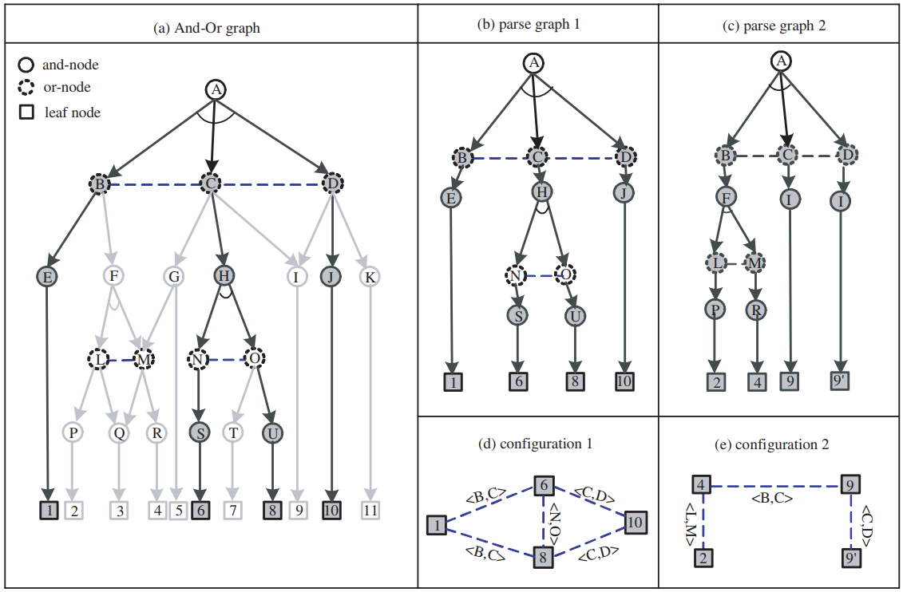

图1.3 说明了 与或图 的表示法。(a) 与或图体现了语法产生式规则和上下文。它包含许多解析图，其中一个以粗箭头表示。(b) 和 (c) 是通过选择相关 “或” 节点的开关而得到的两个不同的解析图。(d) 和 (e) 分别是这两个解析图所生成的两种图形配置。这些配置的连接关系是从 与或图 的关系中继承而来的。

**基础表征概念**：

1. **与或图** (And-Or Graph)：

   基础组成部分：

   * 与节点：表示将一个实体分解为其组成部分。例，A→BCD，H→NO。
   * 或节点：充当子结构的“开关”，代表不同层级的分类标签。例，B→E|F，C→G|H|I。
   * 终端节点

2. **解析图** (parse graph)：对特定图像的一种分层生成式解释，在解析树的基础上添加若干关系而得到。

3. **配置** (configuration)：是由图像平面中基元 (primitives) 的开放键 (open bonds) 连接而成的平面属性图。

   * 当解析图坍缩时，就会产生一个平面配置。配置会继承其祖先节点的关系，并可被视为具有可重构邻域结构的马尔可夫网络。
   * 采用混合随机场模型来表征配置——该模型通过引入地址变量并处理遮挡导致的非局部连接，扩展了传统马尔可夫随机场模型。在此生成模型中，一个配置即对应一个原始草图。

4. **视觉词汇** (visual vocabulary)：由于缩放特性，终端节点可以出现在 与或图 的各个层级。

   * 每个终端节点从特定集合中获取实例。该集合称为字典，包含各种复杂程度的图像块。
   * 集合中的元素可以通过诸如类型、几何变换、变形、外观变化等变量进行索引。每个图像块都添加了锚点和开放键，以便与其他图像块连接。

5. 文法（grammar）的**语言（language）**：该文法所能生成的所有可能合法配置的集合。

   * 随机文法中：每个配置都关联着一个概率值。
   * 由于 与或图 具有方向性和递归性，任意节点A下方的子图可以表示该节点对应概念的子文法。因此，节点A的子语言 (sub-language) 就是以 A 为根节点的与或图所生成的所有合法配置的集合。

   > 例如，若 A 表示某个物体类别（如汽车），则该子语言定义了所有合法的汽车配置。

字典中的元素是原子结构（atomic structure），而语言中的元素则是由若干原子结构组成的复合结构（或称配置）。当从宏观视角（zoomed-out view）观察时，节点A的配置会丧失其精细结构和细节，转而成为该节点字典中的一个原子元素。例如，近距离观察时，汽车是由多个部件和基元（primitives）构成的配置；但在远观时，汽车则表现为一个不可分割的整体图像块（image patch）。这正是图像文法的特殊属性。

**数据集与学习概述**：

* 半自动的方式学习图像语法
* 数据集：每张图像或物体都被半自动地解析为一个解析图，其中关系明确，物体名称使用 WordNet 标准。除了物体解析之外，还有许多场景图像标注了物体及其空间关系。
* 利用这个带注释的数据集，我们可以为物体和场景类别构建 与或图，并在 与或图 上学习概率模型。这些学习步骤由最小最大熵学习方案和最大似然估计引导，它分为三个部分：
  1. 在 或节点 处学习概率，以使生成的配置符合自然共现频率。这在随机上下文无关文法中很常见。
  2. 学习并探究水平链路和关系中的马尔可夫模型，以解释空间关系，同时这类似于马尔可夫随机场的学习，只不过我们处理的是动态图形配置而非固定领域，即与 与或图 中各节点外观的一致性。
  3. 学习 与或图 结构与词典。通过聚类学习终端节点，通过绑定学习非终端节点。

# 2 背景

## 2.1 语法的起源

* 如果两个信号同时出现的概率显著高于它们独立出现的概率，那么这两个部分就是相互关联的。

## 2.2 Grammar 的传统表述

语法定义为四元组 $\mathcal{G} = (V_N, V_T, R, S)$：

* 其中 $V_N$ 是非终结节点的有限集合
* $V_T$ 是终结节点的有限集合
* $S \in V_N$ 是根部的开始符号
* 而 $R$ 是一组产生规则：$R = \{\gamma : \alpha \rightarrow \beta\}.$ 要求 $\alpha, \beta \in (V_N \cup V_T)^+$ 是终结或非终结符号的字符串，且 $\alpha$ 包含至少一个非终结符号。

根据它们的**产生规则**形式将语言分为四种类型：

* 类型3语法具有规则 $A \rightarrow aB$ 或 $A \rightarrow a$，其中 $a \in V_T$ 且 $A, B \in V_N$。它也被称为有限状态或正则语法。
* 类型2语法具有规则 $A \rightarrow \beta$ 并被称为上下文无关语法。
* 类型1语法是上下文敏感的，具有规则 $\xi A \eta \rightarrow \xi \beta \eta$，其中非终结节点 $A$ 在两个字符串 $\xi$ 和 $\eta$ 的上下文中被重写为 $\beta$。
* 类型0语法被称为短语结构或自由语法，对 $\alpha$ 和 $\beta$ 没有任何约束。

从语法 $\mathcal{G}$ 导出的所有可能的终结符字符串 $\omega$ 的集合称为它的语言，表示为

$$
\mathbf{L}(\mathcal{G}) = \left\{\omega : S \stackrel{R^*}{\longrightarrow} \omega, \omega \in V_T^*\right\}.
$$

$R^*$ 表示从 $S$ 推导出 $\omega$ 的一系列产生规则，即，

$$
S \stackrel{\gamma_1, \gamma_2, \ldots, \gamma_{n(\omega)}}{\longrightarrow} \omega.
$$

如果语法是类型1、2或3，则给定生成终结字符串 $\omega$ 的一系列规则，我们得到 $\omega$ 的解析树，表示为

$$
\mathbf{pt}(\omega) = (\gamma_1, \gamma_2, \ldots, \gamma_{n(\omega)}),
$$

语法的优点在于其强大的表达能力，能够通过相对较小的词汇表 $ V_T, V_N $ 和产生规则 $ R $ 生成非常大量的有效句子（或字符串），即它的语言。一般来说，在实践中，以下不等式通常是正确的：

$$
|\mathbf{L}(\mathcal{G})| \gg |V_n|, |V_T|, |R|.
$$

在图像中，$ V_T $ 可以是像素，但在这里我们发现将其对应于图像中的**简单局部结构、纹理**和**其他图像原语**更为方便 [30, 31]。然后 $ V_N $ 将是图像中的可重用部分和对象，而产生规则 $ A \rightarrow \beta $ 是一个模板，使您能够扩展 $ A $。那么 $ \mathbf{L}(\mathcal{G}) $ 将是所有有效对象配置的集合，即场景。

语法规则代表了结构的规律性和灵活性。结构的规律性通过模板强制执行，该模板将实体 $ A $，例如对象，分解为 $ \beta $ 中的某些元素。结构的灵活性反映在每个结构 $ A $ 都有许多替代分解的事实。

在这篇论文中，我们将发现描述整个语法的一个通用“与-或树”很方便，该树包含所有解析作为子树。在这棵树中：

* 或节点由 $ V_N \cup V_T $ 标记
* 与节点由产生规则 $ R $ 标记。

我们递归地生成这棵树，从取开始符号作为**根节点**开始，这是一个**或节点**。我们按如下方式继续：每当我们有一个非终结符标签 $ A $ 的或节点时，我们考虑所有左边有 $ A $ 的规则，并创建标记为相应规则的与节点的孩子。这些反过来扩展到一组标记为规则右边符号的或节点。一个标记为非终结符的或节点无法进一步扩展。

通过在遍历树的过程中为每个“或” 节点选择特定的子节点， 所有具体的解析树都将包含在通用的“与或” 树中。 

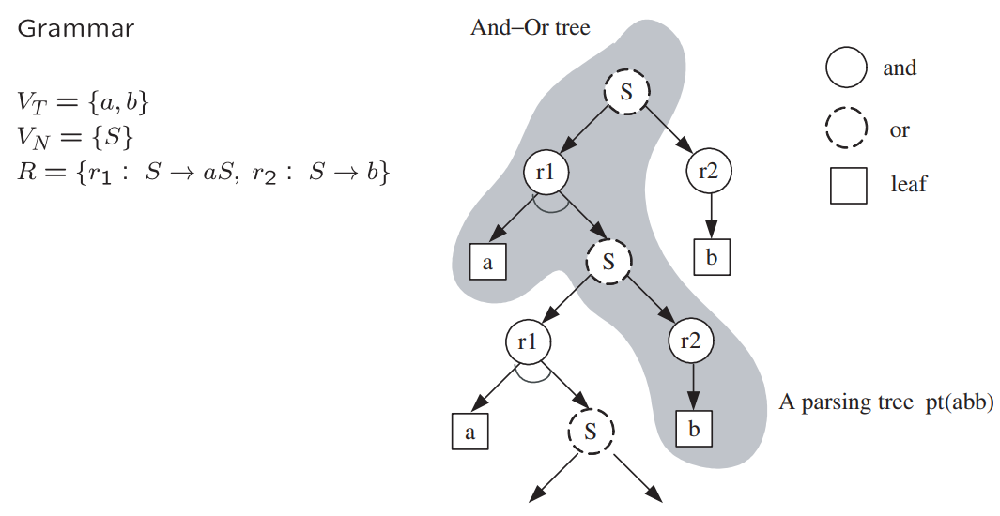

## 2.3 Overlapping Reusable Parts

视觉中，似乎存在四种重叠方式：

1. 模棱两可的场景，其中不同的解释似乎都成立。
2. 包含多个局部模式的高级模式。
3. 两个高级部分之间存在像素或边缘共享的 “连接处”。
4. **遮挡**是指背景中的物体完全位于前景物体之后，因此这两个物体相互重叠。

最典型的视觉重叠情况是由遮挡造成的。几乎每张图像中都能看到遮挡现象。

从认知层面看，人类（可能还包括其他具有视觉的动物）能明确意识到两个完整物体在空间中同时存在，只是它们的某些部分会投影到相同的图像像素上，导致只有其中一个可见。这时我们会在意识层面构建包含这两个物体的重复图像平面——当我们试图**运用先验知识尽可能重建被遮挡物体**时，这种机制至关重要。

显然，对此类物体的正确解析应该**在结构底部添加额外叶节点**来表示**被遮挡物体**。**这些新叶节点承载着从物体可见部分推断出的颜色、纹理等属性**，其被遮挡边界正是格式塔学派所称的"**非模态轮廓**"。该学派的研究表明，人们往往能对这些非模态轮廓做出非常精确的预测。

## 2.4 Stochastic Grammar

为文法增加一组概率 $\mathcal P$ 作为第五个组成部分。例如，在 随机上下文无关文法 (stochastic context free grammar (SCFG)) 中，假设 $A\in V_N$ 有若干个可选的重写规则：
$$
A\rightarrow \beta_1 | \beta_2 | \cdots | \beta_{n(A)}, \gamma_i:A\rightarrow \beta_i
$$
每条生成规则都与一个概率 $p(\gamma_i) = p(A\rightarrow \beta_i)$ 相关联，使得：
$$
\sum_{i = 1}^{n(A)}p(A\rightarrow \beta_i) = 1
$$
**一个语法树的概率**被定义为所使用的所有规则概率的乘积：
$$
p(\text{pt}(\omega)) = \prod_{j=1}^{n(\omega)} p(\gamma_j).
$$

一个字符串（在语言中）或一个结构（在图像中）$\omega \in \mathbf{L}(\mathcal{G})$ 的概率，是其所有可能语法树概率之和：

$$
p(\omega) = \sum_{\text{pt}(\omega)} p(\text{pt}(\omega)).
$$

因此，一个随机文法 $\mathcal{G} = (V_N, V_T, \mathcal{R}, S, \mathcal{P})$ 在其语言上生成一个概率分布：

$$
\mathbf{L}(\mathcal{G}) = \left\{ (\omega, p(\omega)) : S \stackrel{R^*}{\longrightarrow} \omega,\ \omega \in V_T^* \right\}.
$$

如果对所有 $\omega \in \mathbf{L}(\mathcal{G})$，有 $\sum_{\omega} p(\omega) = 1$，则称该随机文法是**一致的（consistent）**。 

问题出现在某些情况下，语法树**以正概率无限扩展**，即不能在有限步内终止。

例如，若有如下生成规则：

$$
A \rightarrow AA \mid a \quad \text{概率分别为 } \rho \text{ 和 } (1 - \rho)
$$

如果 $\rho > \frac{1}{2}$，那么符号 $A$ 扩展为 $AA$ 的速度比它终止的速度更快，导致它**不断复制自己而不终止**。

这对设计概率集 $\mathcal{P}$ 提出了一些约束条件。

概率集合 $\mathcal{P}$ 可以通过**监督学习方式**获得，例如从一组观测到的语法树 $\{\text{pt}_m, m = 1, 2, \dots, M\}$ 中，采用最大似然估计：
$$
\mathcal P^* = \arg\max \prod_{m=1}^M p(\text{pt}_m)
$$
该最大似然估计方法可以排除无限扩展的情况，从而产生一个一致的文法。

## 2.5 Stochastic Grammar with Context

设 $\omega = (\omega_1, \omega_2, \ldots, \omega_n)$ 为一个包含 $n$ 个词的句子，**二元语法**统计计算所有词对的频率 $h(\omega_i, \omega_{i+1})$，从而为字符串 $\omega$ 导出一个简单的马尔可夫链模型：

$$
p(\omega) = h(\omega_1) \prod_{i=1}^{n-1} h(\omega_{i+1} | \omega_i).
$$

通过添加因子 $h^*(\omega_i, \omega_{i+1})$ 并重新归一化概率，将解析树模型与终端字符串二元语法模型结合起来：

$$
p(\text{pt}(\omega)) = \frac{1}{Z} h^*(\omega_1) \prod_{i=1}^{n-1} h^*(\omega_{i+1}, \omega_i) \cdot \prod_{j=1}^{n(\omega)} p(\gamma_j).
$$

这些 因子的选择 使得词对的边缘概率与给定的二元语法模型匹配。

需要注意的是，可以始终以Gibbs形式为整个解析树和字符串重写概率：
$$
p(\text{pt}(\omega); \Theta) = \frac{1}{Z} \exp \left\{ - \sum_{j=1}^{n(\omega)} \lambda(\gamma_j) - \sum_{i=1}^{n-1} \lambda(\omega_{i+1}, \omega_i) \right\},
$$

其中 $\lambda(\gamma_j) = -\log p(\gamma_j)$ 和 $\lambda(\omega_{i+1} | \omega_i) = -\log h^*(\omega_{i+1} | \omega_i)$ 是包含在 $\Theta$ 中的参数。因此，$h^*$ 的存在是指数模型匹配给定期望的一个结果。

然而，从左到右的词序列可能无法表达最强的上下文效应。如图2.8中的箭头所示，存在非局部关系。首先，插入语会打乱语言中的短语。句子中的斜体词会分割文本流。因此，二元语法中的 “下一个” 关系并非由词序确定性决定，而是需要通过推断得出。其次，单词“what”既是动词“said”的宾语，又是动词“is”的主语。它连接了两个从句。

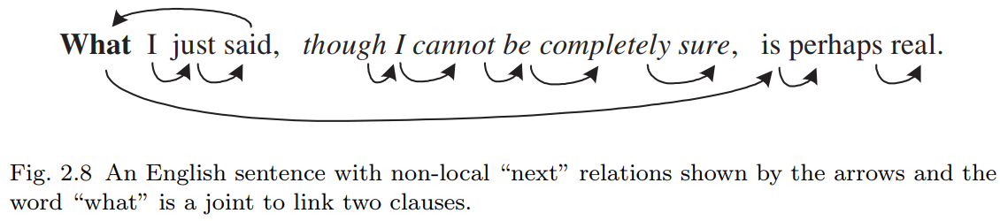

一般来说，所有代词都表示长距离依赖关系，它们链接两个可复用的部分，并将上下文从话语或文本的一个部分传递到另一个部分。

在**图像**中，人们会看到**许多不同类型的连接方式**将物体部件**组合**起来，例如对接、铰链以及各种对齐方式，它们同样起到**链接两个可复用部分**的作用。

每个节点在与其它节点交互时**可能涉及多种类型的关系**。这些关系通常是隐藏的或无法确定性判定的，因此我们将通过每个节点关联的某些 "**地址变量** (address variables)" 来表示这些潜在连接。节点 $\omega_i$ 中地址变量的值是指向另一个节点 $\omega_j$ 的索引，而 **节点对** $(\omega_i, \omega_j)$ 则遵守 某种特定关系。这些地址变量必须与解析树一起在推理过程中计算。

在视觉领域，这类**非局部关系**出现得更为频繁。这些关系体现了从像素、基元到部件、物体乃至场景等所有视觉层次的空间上下文，并衍生出各种图模型（如马尔可夫随机场）。

**格式塔组织** (Gestalt organizations) 是中低层视觉中的典型例子。例如，当前景物体遮挡背景物体的部分区域，而该背景物体在前景物体两侧均可见时，<u>背景物体的这两个可见部分就会相互约束</u>。其它非局部连接可能反映功能关系，比如 物体X “支撑着” 物体Y。

> **“格式塔组织”（Gestalt Organization）** 是心理学和认知科学中的一个核心概念，源自20世纪初的**格式塔心理学派**（Gestalt Psychology，又称“完形心理学”）。其核心观点是：人类对世界的感知并非简单地拼凑局部信息，而是倾向于将视觉元素组织为有意义的**整体模式**（即“完形”），这种组织遵循一些先天的认知原则。
>
> 在图像理解和计算机视觉中，格式塔原则被用来解释人类如何从碎片化的视觉输入中快速感知结构化信息。常见的组织原则包括：
>
> 1. **邻近性**（Proximity）
>    - 空间上靠近的元素容易被感知为同一组。
> 2. **相似性**（Similarity）
>    - 颜色、形状、纹理相似的元素会被归为一类。
> 3. **闭合性**（Closure）
>    - 即使图形不完整，大脑也会自动补全缺失部分（如虚线构成的圆）。
> 4. **连续性**（Continuity）
>    - 倾向于将平滑连续的线条或边缘视为整体（如交叉线条的感知）。
> 5. **共同命运**（Common Fate）
>    - 朝同一方向运动的物体被视为同一组（动态场景中重要）。

## 2.6 图像文法 和 语言文法 的三个新差异问题

图像语法应该包含两个层面：

1. **层次化结构**（the grammar $\mathcal G$）：生成大量有效图像配置（the language $\mathbf L(\mathcal G)$ ）
2. **上下文信息**：确保配置中的组件遵循物体部件的 **合理空间关系**（如相对位置、尺寸比例、色彩一致性）。这两者共同编码了视觉知识的核心内容。

**第一难题：线性顺序的缺失**

* 语言中，每个产生式规则 $A\rightarrow \beta$ 会生成线性有序的节点序列 $\beta$ ，最终得到终端词的线性序列。

* 视觉中，必须用更复杂的区域邻接图（RAG）替代词语的左右邻接关系：

  * 设 图像 $I$ 的 域 $D$ 可分解为 互不重叠的区域 $D = \cup_{k\in S} R_k$ ；
  * RAG 的节点为 $\langle R_i\rangle$ ，若区域 $R_k$ 和 $R_l$ 相邻，则用 边 $\langle R_k\rangle - \langle R_l\rangle$ 连接。

  这意味，必须在 解析树 中显式添加水平边 以表示邻接关系。在产生式规则 $A\rightarrow \beta$ 中，$\beta$ 的节点不再线性有序，而应视为配置 configuration（一组 $V_N\cup V_T$ 节点 + 表示邻接的水平边）

**后果**：区域的生产规则高度模糊。假设 A 代表一个区域，a 代表原子区域，则其产生规则为 $A\rightarrow aA|a$ 。线性区域 $\omega = (a, a, a , \dots, a)$ 在遵循从左到右顺序时，它仅对应唯一的解析图；而一旦去除顺序约束，其解析树的数量将呈现组合级数增长。

因此，我们必须避免使用诸如 $A\rightarrow aA$ 此类递归定义的语法规则，而将原子区域聚合成大区域 A 的过程视为单一计算步骤（如 图形空间中的分组与划分）。此时，概率 $p(\omega)$ 将直接赋予整个对象而非产生规则。

**第二难题：图像多尺度表征**

问题：

* 物体在图像中可能以**任意尺度**出现（如远近变化），而语言（如文本）没有尺度变化。
* 语法必须支持**多分辨率解析**，允许解析树在任意层级终止（当细节不可见时）。

解决方案：

- **分层终止规则**：非终端节点可提前终止，返回低分辨率模板。

  终止规则：
  $$
  ∀ A\in V_N, A\rightarrow \beta_1|\cdots|\beta_{n(A)}|t_1|t_2|,
  $$
  $t_1, t_2 \in V_T$ 是特定尺度

- **自适应金字塔模型**（如 Rosenfeld & Hong, Galun et al.）：

  - 低分辨率 → 整体表征（如 PCA 斑块）
  - 中分辨率 → 部件组合
  - 高分辨率 → 草图/图元

挑战：需构建**多尺度视觉词典**（学习不同分辨率的图元）。

**第三难题：非规则模式的连续性谱系**

**问题**：

- 自然图像包含两类模式：
  - **高度结构化物体**（可用语法规则描述，如人脸、建筑）
  - **随机纹理/杂乱背景**（更适合马尔可夫随机场/MRF 建模）
- 二者通过**连续尺度变化**相互转化（如树叶近看是结构，远看是纹理）。

**挑战**：

- 如何选择建模方式？
  - **何时用语法规则**（结构化物体）
  - **何时用MRF**（纹理/背景）
- 如何**统一两种模型**？

**研究方向**：

- 开发**混合模型**（如语法+MRF），支持模式间的平滑过渡。

## 2.7 图像语法的先前研究

1. 句法模式识别（Syntactic Pattern Recognition）

   **代表人物**：K.S. Fu学派（1970-1980年代） 
   **核心思想**：

   - 提出用语法进行场景理解的框架，如图2.11所示的积木世界
   - 采用分层表示（解析图雏形）：
     - 纵向箭头：场景/物体的分解
     - 横向箭头：支撑/邻接等关系

   **应用局限**：

   - 仅适用于简单物体（图表、染色体轮廓等）
   - 主要处理一维结构，虽提出网状语法（web grammars）但未深入

   **根本缺陷**：

   - 缺乏真实可用的图像词汇库
   - 检测方法不可靠

   **现代发展**：

   - 基于外观的方法（PCA、图元、码本、碎片等）取得进展
   - 但多数工作缺乏组合形式化（composition formalism）和键合结构（bond structures）

   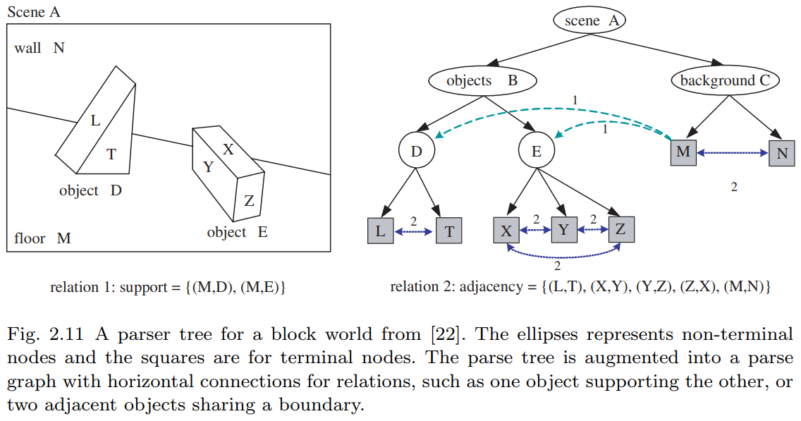

2. 中轴变换技术（Medial Axis Techniques）

   **发展脉络**：

   1. Blum（1973）：提出用中轴替代边界片段表示形状
   2. Leyton（1988）：过程语法 - 将形状视为运动历史记录
   3. Zhu & Yuille（1996）：基于中轴的形状语法（图2.12左）
      - 解析树结构：父节点（如狗）→子节点（四肢/躯干等）
      - 通过最大圆建立部件间的水平连接

   **Shock图学派**（Zucker, Dickinson, Kimia等）：

   - 逆向过程：通过距离变换收缩形状
   - "shock"对应骨架奇异点（如狗腿中轴）
   - 与解析树的根本差异：子节点表示从父节点"生长"的年轻世代

   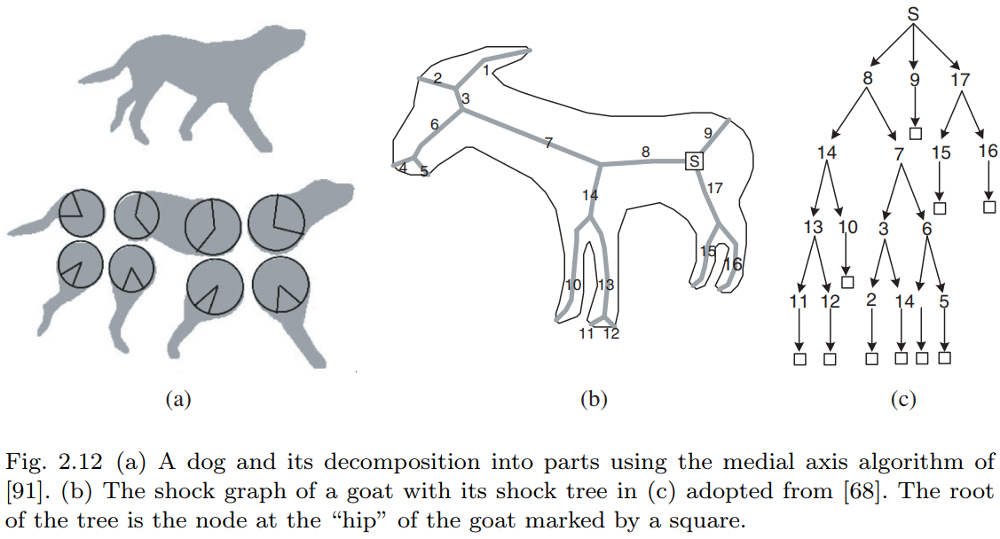

3. 模式理论分支（Pattern Theory）

   **Grenander开创**：

   - 基于"生成器"（generators）的规则模式
   - 生成器具有属性和连接"键"（bonds）

   **Geman学派发展**：

   - 强调部件重叠（overlapping）的核心作用：
     - 计算"结合强度"（binding strength）
     - 实现神经元活动同步
   - 应用案例：大写字母识别、车牌读取

   **本文工作渊源**：

   - 人造物解析的属性语法
   - 服装识别的上下文敏感语法

   

4. 稀疏编码模型（Sparse Coding as SCFG）

   **理论基础**：

   - 图像由独立基元组合（Gabor 余弦/正弦、LoG等）
   - 基元属性 $θ=(x,y,τ,σ,α)$ 对应位置/方向/尺度/对比度

   **SCFG表达**：
   $$
   \begin{gather}
   S\rightarrow A^n, n\sim p(n)\propto e^{-\lambda_o n},\\
   A\rightarrow a(\theta)|b(\theta)|c(\theta), \theta\sim p(\theta)\propto e^{-\lambda|\alpha|},
   \end{gather}
   $$
   **层级扩展**：

   - Crouse等引入马尔可夫树层次结构
   - 形成随机上下文无关语法（SCFG）

# 3 Visual Vocabulary

**定义 3.1 视觉词汇库**

视觉词汇库 由一组二元组构成，每个二元组包含：
1. 图像函数 $\Phi_i(x,y;\alpha_i)$
2. 连接键集合（即"键合度" $d(i)$），用于与其他元素连接，记为向量 $\beta_i = (\beta_{i,1}, \ldots, \beta_{i,d(i)})$。

关键要素解析：
- **$\beta_{i,k}$**：地址变量（指针），指向其他元素。
- **$\alpha_i$**：属性向量，包含两类参数：
  - (a) 几何变换：中心位置、尺度、方向、塑性变形等；
  - (b) 外观属性：强度对比度、轮廓或表面反射率等。
- 定义域 $\Lambda_i(\alpha_i)$：函数 $\Phi_i$ 的有效区域，值域为 $R$（灰度模板）或 $R^3$（彩色模板）。
- 边界关联：通常每个 $\beta_{i,k}$ 关联于 $\Lambda_i(\alpha_i)$ 边界的子集。

形式化定义：
$$
\Delta = \{(\Phi_i(x,y;\alpha_i),\beta_i): (x,y) \in \Lambda_i(\alpha_i) \subset \Lambda\}
$$
其中，$i$ 为图元类型的索引。 

# 4 Relations and Configurations

## 4.1 Relations

一组节点 $V = \{A_i: i = 1, 2, \cdots, n\}$ ，其中 $A_i = (\Phi_i (x, y; \alpha_i), \beta_i) \in \Delta $ 表示一个图像的基元、分组或一个对象部分，为了形成一个带有彩色边的图，必须在 $V$ 中的节点之间定义若干空间和功能关系，其中颜色表示关系的类型。

**定义4.1 属性化关系** 
在任意集合 $ S $ 上定义的二元关系是积集 $ S \times S $ 的一个子集：
$$
\{(s,t)\} \subset S \times S.
$$

属性化二元关系通过向量 $\gamma$ 和 $\rho$ 进行扩充：

$$
E = \{(s,t;\gamma,\rho) : s,t \in S\},
$$

其中 $\gamma = \gamma(s,t)$ 表示绑定 $s$ 和 $t$ 的结构，而 $\rho = \rho(s,t)$ 是一个实数，用于衡量 $s$ 和 $t$ 之间的兼容性。此时，$\langle S, E \rangle$ 是一个表示 $S$ 上关系 $E$ 的图。类似地，$k$ 元属性化关系定义为 $S^k$ 的一个子集。

对于水平链接和上下文，存在三种抽象程度递增的关系类型。第一种类型是将图像基元连接成越来越大的图形的连接类型。第二种类型包括用于在平面布局中组织部件和对象的各种接头和分组规则。第三种类型是场景中对象之间的功能和语义关系。

1. **关系类型 1**：bonds and connections，键与连接。对于上述定义的节点集合 $ V = \{A_i : i = 1, 2, \ldots, n\} $，每个节点 $ A_i \in V $ 包含若干开放键 $\{\beta_{ij} : j = 1, 2, \ldots, n(i)\}$。我们将所有键汇集为一个集合：
   $$
   S_{\text{bond}} = \{\beta_{ij} : i = 1, 2, \ldots, n, \, j = 1, 2, \ldots, n(i)\}.
   $$

   若两个键 $\beta_{ij}$ 和 $\beta_{kl}$ 在位置和方向上对齐，则称它们为**连接**。因此，键合关系是一个带属性的键对集合：

   $$
   E_{\text{bond}}(S) = \{(\beta_{ij}, \beta_{kl}; \gamma, \rho)\},
   $$

   其中 $\gamma = (x, y, \theta)$ 表示键的位置和方向（即两个连接基元在键处的切线方向），而 $\rho$ 是用于检验两个连接基元之间强度分布或颜色一致性的函数。

   一个简单例子是图像网格。此时基元 $A_i (i = 1, \ldots, |\Lambda|)$ 为像素，每个像素有4个键 $\beta_{ij} (j = 1, 2, 3, 4)$，此时 $E_{\text{bond}}(S)$ 即为4-最近邻连接的集合。在此情况下，$\gamma = \text{nil}$ 为空，$\rho$ 是像素 $i$ 和 $j$ 的强度对偶团函数。

   常见做法是使用固定结构的图模型（如模板），其键合关系由确定性规则决定而隐式存在。

2. **关系类型 2**：joints and junctions，关节与接合。当图像基元组合为更大的部件时，必须确立某些空间与功能上的关联。除了通过开放键与邻近部件直接连接外，部件之间还可能以多种方式相互绑定。

   典型示例：部件可通过共线、平行或对称等非偶然关系，跨越较大距离建立关联。为识别这类分组，需创建连接以标记此类特殊关系。部件间几种典型的此类关系：

   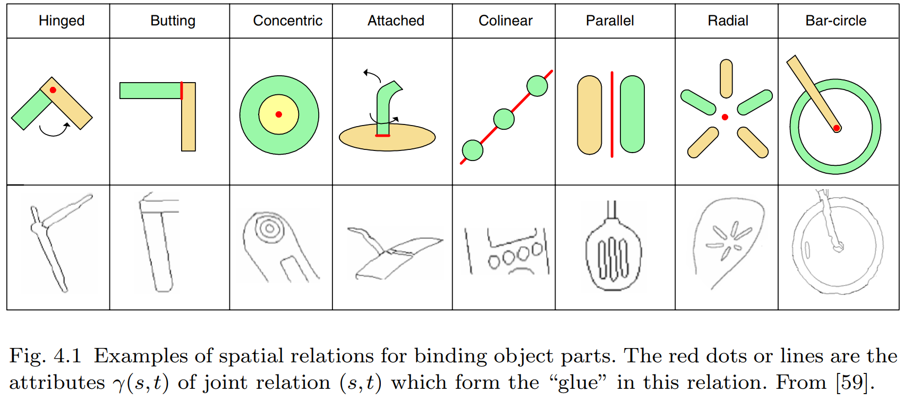

   部分关系还能支持三维场景解读。例如，椭圆作为部件存在多种可能的组合方式：若识别为自行车车轮，其中心可充当转轴，从而与车把末端相连（见图4.1最右侧)；若作为茶杯边缘，则其长轴两端需与一对平行线接合以形成圆柱体。图像中同样存在共享结构——如铰链关节、对接关节等。 

3. **关系类型3：物体交互与语义**
   当字母组合成单词时，语义随之产生；当部件组合成物体时，其交互过程会形成语义关系。这类关系通常具有方向性。例如：

   - **遮挡关系**是物体或表面之间依赖观察视角的二元关系，对**图形-背景分离**至关重要；
   - **支撑关系**则是与视角无关的典型代表（见图2.11示例）。

   设物体集合 $ S = V $，则有：
   $$
   \begin{gather}
   E_{\text{supp}} = \{(M,D), \langle M, E \rangle\},\\
   E_{\text{occld}} = \{(D, M), \langle E, M \rangle, \langle D, N \rangle, \langle E, N \rangle\}.
   \end{gather}
   $$
   其中 $\langle \rangle$ 表示有向关系（属性 $\gamma, \rho$ 已省略）。场景中还存在其他功能性关系，例如：
   - 人物 $A$ 正在吃苹果 $B$：$E_{\text{edible}}(S) = \{(A, B)\}$
   
   - 人物骑行自行车：$E_{\text{ride}}(S) = \{(A, C)\}$

     这类有向关系通常呈现偏序特性。

值得注意的是，低层级关系（如键合）具有密集性（关系数量级 $|E(S)|$ 与 $|S|$ 相当），而高层级关系则呈现稀疏性和多样性——虽然可能发现大量有趣关系，但每种关系在图像中的实际出现次数往往极少。

## 4.2 Configuration

**定义4.2 Configuration** 

**构型** $ C $ 是场景实体在特定抽象层级上的空间排布，可表示为从层级表示中扁平化得到的单层图：
$$
C = \langle V, E \rangle. \quad (4.7)
$$

其中：
- $ V = \{A_i, i = 1, 2, \ldots, n\} $ 是同语义层级的属性化图像结构集合（如基元、部件或物体）；
- $ E $ 为关系集合。

**特例说明**：
1. 当 $ V $ 为草图集合且 $ E = E_{\text{bonds}} $ 时，$ C $ 称为**基草图构型** (sketch configuration)；
2. 当 $ E $ 为多关系并集 $ E = E_{r_1} \cup \cdots \cup E_{r_k} $（常见于物体层级）时，$ C $ 称为**混合构型**；
3. 在生成模型中：
   - 网格上的图像称为**终极终止构型** (terminal configuration)
   - 其基草图称为**预终止构型** (pre-terminal configuration)

需注意：$ E $ 会闭合 $ V $ 中的部分键，而其余键保持开放，因此我们可讨论配置中的**开放键**。

三个层级的构型示例：

* 首先，在早期视觉阶段，场景构型 $\mathcal C$ 表现为 一个初始草图。其中顶点集 V 由带有连接键的图像基元组成，边集$E=E_{bonds}$表示键合关系。例如图3.3(b)展示了图3.3(a)简单图像的构型，图3.4(b)则对应图3.4(a)图像的构型。这些构型均属于属性图——每个基元 $v_i$ 都关联着描述几何特性与光学特征的变量 $\alpha_i$。

  初始草图是一种精简的"标记"表征，是连接原始图像信号与上层符号表征的关键环节，能以感知等效的纹理外观重建原始图像。

  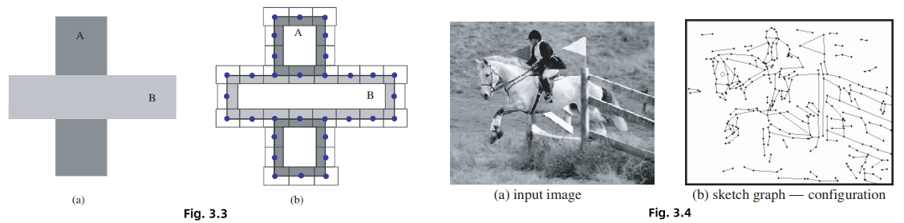

* 其次，在部件到物体层级，图9.7 展示了由 图3.8 衣物部件组成的三种可能上身构型。这些构型 $\mathcal C$ 的顶点由6-7个部件构成，边集 $E=E_{bond}$ 是通过键连接的部件集合（如图3.7所示）。

  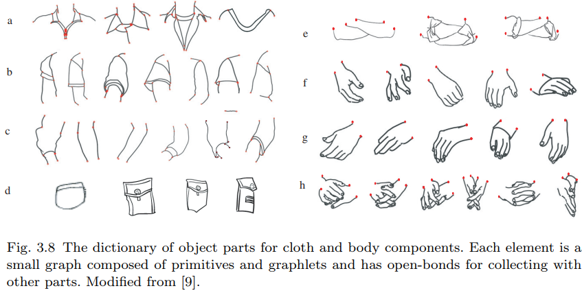

  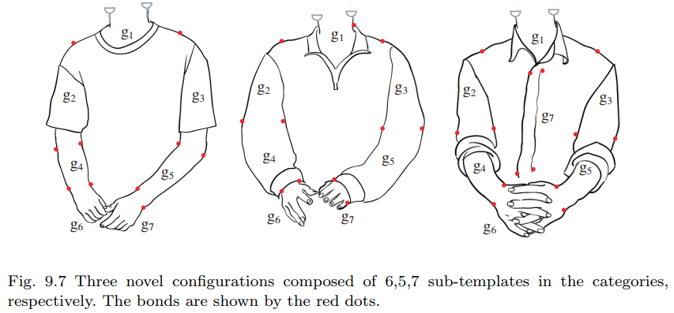

  

* 最后，图4.2(a)(b)呈现了最高抽象层的场景构型。

  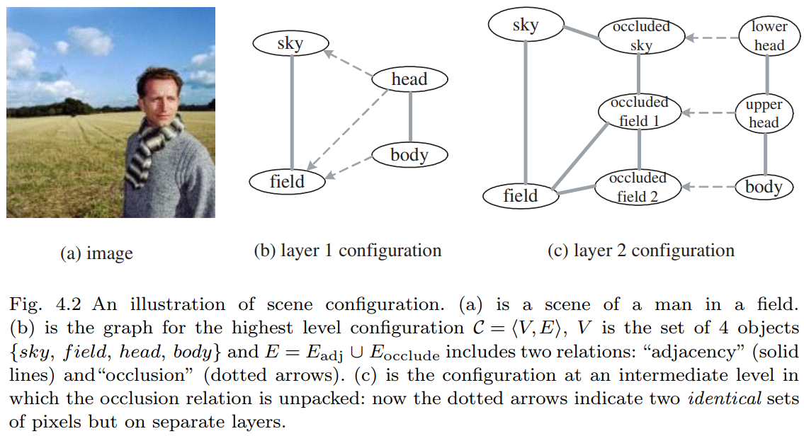

  顶点集 V 为物体集合，边集 E 包含两种关系：实线表示的 "邻接" 关系：
  $$
  E_{\text{adj}}=\{(sky,field),(head,body)\}
  $$
  以及虚线箭头表示的有向"遮挡"关系：
  $$
  E_{\text{contain}}=\{〈head,sky〉,〈head,field〉,〈body,field〉\}
  $$

## 4.3 The Reconfigurable Graphs

> 4.3 可重构图

在视觉任务中，构型是从图像中推断得出的。以贝叶斯框架为例，**图结构** $\mathcal{C} = \langle V, E \rangle$ 并非预先确定，而是能够**实时重构**的——顶点集合与边（关系）集合都可能动态变化。因此，构型必须具备足够的灵活性以适应不同视觉任务的需求。**必须将顶点和键合关系都视为随机变量**。

图4.4展示了这种重构机制的实际应用：通过马尔可夫随机场区域描述符，将输入图像（图4.4(a)）分解为三个层次（图4.4(d)-(f)），其间通过轮廓补全（图4.4(b)(c)中的红色线段）和遮挡区域填充实现键合关系重构。

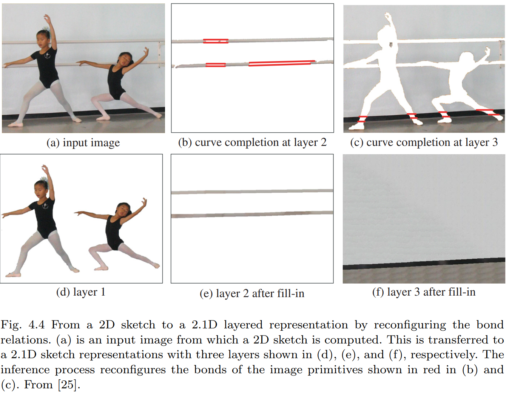

从解析结构的角度来看，我们需要添加新节点来表示被观察表面背后的附加层次，并建立"被遮挡"关系（如图4.2(c)所示）。该构型通过复制三个区域来表征背景层的缺失部分。

这种可重构图的数学模型被称为**混合马尔可夫模型**。在该模型中，构型的顶点集 $ V = V_x \cup V_a $ 包含两类节点：
- $ V_x $：常规图像实体节点
- $ V_a $：地址节点（如连接键） ，这些地址节点类似于C语言中的指针，通过重构图结构实现非局部关系。 

图像中的连接键也承担类似与英语句子中箭头所表示的非局部功能。每个图像实体（基元/部件/物体）可能携带多个作为"指针"的随机变量，其中许多变量初始为空值，将在推理过程中实例化。

# 5 Parse Graph for Objects and Scenes

**定义 5.1 解析图** (Parse Graph)

解析图 $\mathbf{pg}$ 由层级化的解析树（定义"垂直"边）和若干关系 $E$（定义"水平"边）构成：
$$
\mathbf{pg} = (\text{pt}, E).
$$

其中解析树 $\text{pt}$ 是一个所有非叶节点均为与节点的**与树**。每个与节点 $A$ 通过产生式规则分解为其组成部分，这里产生的不再是字符串而是**一个构型** (configuration)：

$$
\gamma : A \rightarrow \mathcal{C} = \langle V, E \rangle.
$$

产生式规则还需将 $A$ 的开放键与 $\mathcal{C}$ 中的开放键相关联。整个解析树 就是 产生式规则的序列：

$$
\text{pt}(\omega) = (\gamma_1, \gamma_2, \ldots, \gamma_n).
$$

水平连接 $E$ 包含 终端/非终端节点间 的 有向/无向关系（如 键合、接合、功能及语义关系）：

$$
E = E_{r_1} \cup E_{r_2} \cup \cdots \cup E_{r_k}.
$$

解析图 $\mathbf{pg}$ 在坍缩时，会在每个抽象/细节层级生成平面构型：

$$
\mathbf{pg} \Longrightarrow \mathcal{C}.
$$

根据关系类型的不同，在坍缩过程中可能存在从高层级关系生成低层级关系的特殊规则。最精细的构型是图像本身（每个像素都由解析图解释），次精细构型则是基草图图。

解析图通过添加空间上下文和可能的功能关系，对观测图像 $\mathbf{I}$ 完整解释。图像解析的任务即是从输入图像计算解析图，在贝叶斯框架下表现为两种方式：

1. **最大后验概率估计**（最优解）：
   $$
   \mathbf{pg}^{*} = \arg\max p(\mathbf{pg}|\mathbf{I})
   $$
2. **后验概率采样**（多样化解）：
   $$
   \{\mathbf{pg}_{i}:i=1,2,\ldots,K\} \sim p(\mathbf{pg}|\mathbf{I}).
   $$

图像中的对象会以任意尺度出现，**图像解析图可在任意抽象层级终止**，这要求：

1. 建立多分辨率视觉词汇
2. 将图像语法定义为分层语法

# 6 Knowledge Representation with And-Or Graph

##  6.1 And-Or Graph

虽然解析图是对特定图像的一种解释，但是 **与或图 则嵌入了整个图像语法**，**并包含所有有效的解析图**。

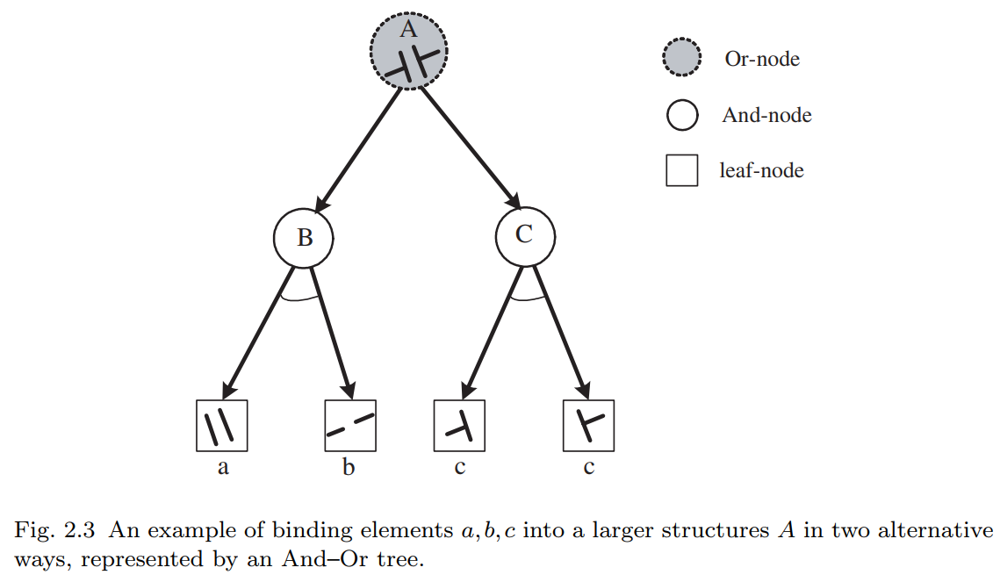

下面的公式可以表示图2.3：
$$
A → a\cdot b|c\cdot c;\ \ \rho|(1-\rho)
$$
在 “或” 节点处的两个分支被赋予概率 $(\rho, 1-\rho)$ 。

与或图 中：

1. 使用水平线来表示关系、连接、交叉点 (junctions) 以及语义关系。
2. 在 And–Or 图的所有层级上增强了关系，用以表示硬性（兼容性）或软性（统计性）约束。
3. 一个 Or 节点的子节点可以与其他 Or 节点共享子节点。这表示多个生成规则可以共享某个可重用部分。节点的共享减少了表示的复杂度，从而缩小了字典的规模。其他类型的共享也可能是有用的。

---

**定义 6.1：And–Or 图（And–Or Graph）**

And–Or 图是一个用于表示图像文法 $\mathcal{G}$ 的六元组：
$$
G_{\text{and–or}} = \langle S, V_N, V_T, \mathcal{R}, \Sigma, \mathcal{P} \rangle
$$
其中各个元素的含义如下：

- **$S$**：表示场景或物体类别的根节点；

- **$V_N = V^{\text{and}} \cup V^{\text{or}}$**：非终结符节点的集合，包含：

  - And 节点集合 $V^{\text{and}}$，以及
  - Or 节点集合 $V^{\text{or}}$；

  And节点连同其子节点形成图中的“产生式”，而Or节点表示“词汇项”（可选择项）。

- **$V_T$**：终结符节点的集合，表示基本单元（如：原始元素、部分、或完整物体）。注意：在低分辨率下，一个物体可能在未被分解的情况下直接终止于终结符。

- **$\mathcal{R}$**：节点之间的关系集合；

- **$\Sigma$**：由 grammar 所能导出的所有有效 configuration 的集合，即 the language of the grammar；

- **$\mathcal{P}$**：定义在 And–Or 图上的概率模型。

---

详细说明：

1. 非终结节点包括 与节点 和 或节点 $V_N = V^{and} \cup V^{or}$ ：

   - $V^{\text{and}} = \{u_1, \ldots, u_{m(u)}\}$，

   - $V^{\text{or}} = \{v_1, \ldots, v_{m(v)}\}$。

   一个 Or 节点 $v \in V^{\text{or}}$ 是一个“开关”，指向多个可能的 And 节点（即对应产生式的右部）。这些产生式的头部是 $v$：
   $$
   v \rightarrow u_1 \mid u_2 \mid \cdots \mid u_{n(v)}, \quad u_1, \ldots, u_n \in V^{\text{and}}.
   $$
   我们为每个 Or 节点 $v \in V$ 定义一个“开关变量” $\omega(v)$，其取值为一个整数，用于索引其子节点：
   $$
   \omega(v) \in \{\emptyset, 1, 2, \ldots, n(v)\}
   $$
   通过为 Or 节点选择开关变量，可以从 And–Or 图中导出一个 **解析图（parse graph）**。如果某个 Or 节点未参与该解析图，可将其开关变量设为 $\omega(v) = \emptyset$。

   一个 And 节点 $u \in V^{\text{and}}$ 要么直接终结为一个终结符模板 $t \in V_T$，要么被分解为一组 Or 节点：

   - 若终结：$u \rightarrow t \in V_T;$ 

   - 若分解：
     $$
     u \rightarrow \mathcal{C} = (v_1, \ldots, v_{n(v)}) \, :: \, (r_1, \ldots, r_k(v)),
     $$
     其中 $v_i \in V$，$r_j \in \mathcal{R}$。

   这里，双冒号 `::` 用于表示这些子节点间存在的关系。

   这个终结规则体现了 **多尺度表示（multi-scale representation）** 的思想：即 And 节点 $u$ 可以被一个模板直接实例化，用于表示较低图像分辨率下的结构。

2. 终结符节点集（Terminal node set）

   终结符节点集记作：$V_T = \{t_1, \ldots, t_{m(T)}\}$

   它是来自图像词典 $\Delta$ 的一组实例。通常，每个终结符是一个图形模板 $(\Phi(x, y; \alpha), \beta)$，其中 $\alpha$ 是属性，$\beta$ 是开放边（open bonds）。通常，$t \in V_T$ 是一个草图图（sketch graph），如图像的基本原语。

3. 配置（Configurations）

   从根节点 $S$ 推导出的所有配置（Configurations）构成该文法的语言：
   $$
   L(G_{\text{and-or}}) = \Sigma = \left\{ C_k : S \Rightarrow_{G_{\text{and-or}}} C_k,\; k=1,2,\ldots,N \right\}.
   $$
   每一个配置 $C \in \Sigma$ 是一个复合模板。

4. 关系集合（Relation set）

   关系集合 $\mathcal{R}$ 包含所有层级中节点之间的所有关系：
   $$
   \mathcal{R} = \bigcup_m E_m = \{e_{st} = (v_s, v_t; \gamma_{st}, \rho_{st})\}.
   $$
   这些关系构成复合图形模板中的成对团（pair-cliques）。当一个节点 $v_s$ 被拆分时，与其相关联的关系 $e_{st}$ 也可能随之被拆分，或者下沉到具体子节点对之间。

5. 概率模型 $\mathcal{P}$

   $\mathcal{P}$ 是定义在 And–Or 图上的一个概率模型。它包含许多局部概率：

   - 每个 Or 节点有一个局部概率，用于表示各种选择出现的相对频率；
   - 每个关系 $e \in \mathcal{R}$ 有一个局部能量值（local energy）。

   前者类似于**随机上下文无关文法（SCFG）**，后者类似于**马尔科夫随机场**或图模型。

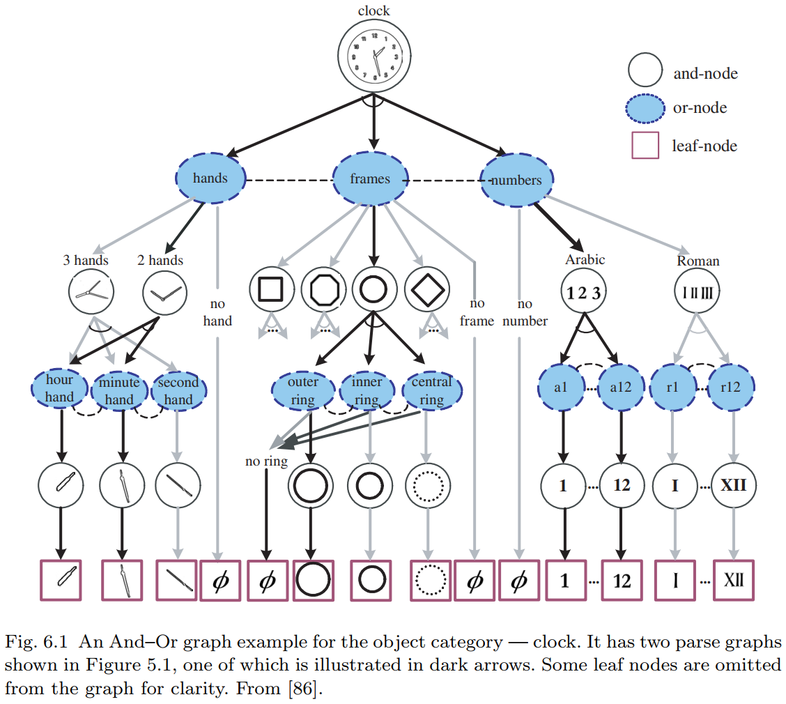

## 6.2 Stochastic Models on the And-Or Graph

与或图 $G_{\text{and-or}}$ 的概率模型必须整合 或节点的马尔可夫树模型 (Markov tree model, SCFG) 和 与节点的图（马尔可夫）模型。这样就在解析图上定义了一个概率模型。 该概率模型的目标是使解析图在观察到的训练集中的出现频率相匹配。

解析图 $\mathbf{pg}$ 是一个增加了关系 $E$ 的解析树 $\mathbf{pt}$ ：
$$
\mathbf{pg} = (\mathbf{pt}, E)
$$
为了方便表示，在 $\mathbf{pg}$ 中定义以下组成部分：

* $T(\mathbf{pg}) = \{t_1, \dots, t_{n(\mathbf{pg})}\}$ 是 $\mathbf{pg}$ 的叶结点。在应用中 $T(\mathbf{pg})$ 通常是预终结节点，每个 $t\in T(\mathbf{pg})$ 是原始草图中的一个图像基元。
* $V^{\text{or}}(\mathbf{pg})$ 是 $\mathbf{pg}$ 中使用的非空 Or 节点（开关）集合。
* $E(\mathbf{pg})$ 是 $\mathbf{pg}$ 中的链接集合。

解析图 $\mathbf{pg}$ 的概率采用以下吉布斯形式：

$$
p(\mathbf{pg};\Theta,\mathcal{R},\Delta) = \frac{1}{Z(\Theta)} \exp\{-\mathcal{E}(\mathbf{pg})\}, \quad (6.12)
$$

其中 $\mathcal{E}(\mathbf{pg})$ 是总能量：

$$
\mathcal{E}(\mathbf{pg}) = \sum_{v \in V^{\text{or}}(\mathbf{pg})} \lambda_v(\omega(v)) + \sum_{t \in T(\mathbf{pg}) \cup V^{\text{and}}(\mathbf{pg})} \lambda_t(\alpha(t)) + \sum_{(i,j) \in E(\mathbf{pg})} \lambda_{ij}(v_i, v_j, \gamma_{ij}, \rho_{ij}). \quad (6.13)
$$

该模型由一组参数 $\Theta$、关系集 $\mathcal{R}$ 和词汇表 $\Delta$ 定义。

* 能量函数的第一项为或节点 $v$ 处的开关变量 $\omega(v)$ 分配不同的权重 $\lambda_v()$，权重应反映子节点出现的频率。
* 第二项和第三项是图模型中典型的单点能量和成对团能量。
  * 第二项定义在图像基元的几何和外观属性上。
  * 第三项建模了基元、图元、部件和对象之间的兼容性约束（如空间和外观约束）。

该模型可以从训练图像集统计量的**最大熵原理**推导而来。其约束条件分为两类：

* 一类是匹配每个或节点的频率
* 另一类是匹配统计量（如直方图或共现频率，与标准图模型类似）。

$\Theta$ 是能量函数中的参数集合：
$$
\Theta = \{\lambda_v(), \lambda_t(), \lambda_{ij}(), \forall v \in V^{\text{or}}, \forall t \in V_T, \forall (i,j) \in \mathcal{R}\}. \quad (6.14)
$$

每个 $\lambda()$ 是一个势函数（非标量），通过非参数化离散方法表示为向量。$\Delta$ 是生成模型的词汇表。配分函数 $Z$ 对所有 And-Or 图 $G_{\text{and-or}}$ 或 文法 $\mathcal{G}$ 中的解析图求和：

$$
Z = Z(\Theta) = \sum_{\mathbf{pg}} \exp\{-\mathcal{E}(\mathbf{pg})\}. \quad (6.15)
$$

# 7 与或图的学习和评估

假如有一个从目标底层分布 $f$ 中采样的训练集：
$$
D^{\text{obs}} = \{ (\mathbf I_i^{\text{obs}}, \mathbf{pg}_i^{\text{obs}}): i = 1, 2, \dots, N \}\sim f(\mathbf I, \mathbf{pg})
$$
解析图 $\mathbf{pg}_i^{\text{obs}}$ 来自真实标注数据库，或在无监督情况下视为缺失。目标是通过最小化KL散度，学习一个逼近 $f$ 的模型 $p$ ：
$$
p^* = \arg \min \text{KL}(f\| p) = \arg \min\sum_{\mathbf{pg}\in \Omega_{\mathbf{pg}}} \int_{\Omega_\mathbf I} f(\mathbf I, \mathbf{pg})\log\cfrac{f(\mathbf I, \mathbf{pg})}{p(\mathbf I, \mathbf{pg};
\Theta, \mathcal R, \Delta)}d\mathbf I
$$
这相当于对最有词汇表 $\Delta$ 、关系集 $R$ 和 参数 $\Theta$ 的最大似然估计：
$$
(\Delta, R, \Theta)^* = \arg \max \sum_{i=1}^N \log p(\mathbf I_i^{\text{obs}}, \mathbf{pg}_i^{\text{obs}}; \Theta, \mathcal R, \Delta) - \mathscr l(V_T, V_N, N)
$$
其中 $(V_T, V_N, N)$ 是一个项，它应平衡模型复杂度与样本量 $N$ 的关系，同时也要考虑语义的重要性。

概率模型的学习分为三个阶段，均遵循上述原则 [59]：
1. **参数估计**：在给定 $ R $ 和 $\Delta$ 时，从训练数据 $ D^{\text{obs}} $ 中估计参数 $\Theta$；
2. **关系学习**：在给定 $\Delta$ 时，学习并优化文法 $\mathcal{G}$ 中节点的关系集 $ R $；
3. **词汇发现**：自动发现并绑定词汇表 $\Delta$ 及层次化 And-Or 树结构。

## 7.1 $\Theta$ 的最大似然学习

对于给定的 And-Or 图层级结构与关系，$\Theta$ 的估计遵循最大似然估计（MLE）学习过程。令 $\mathcal{L}(\Theta) = \sum_{i=1}^N \log p(\mathbf{I}_i^{\text{obs}}, \mathbf{pg}_i^{\text{obs}}; \Theta, \mathcal{R}, \Delta)$ 表示对数似然，通过设置 $\cfrac{\partial \mathcal{L}(\Theta)}{\partial \Theta} = 0$，我们得到以下三个学习步骤：

1. **学习每个 Or 节点 $v \in V^{\text{or}}$ 的 $\lambda_v$**，其反映了每个替代选择的**频率**。节点 $v$ 的开关变量 $\omega(v)$ 有 $n(v)$ 个选择，$\omega(v) \in \{ \emptyset, 1, 2, \ldots, n(v) \}$，其中 $\emptyset$ 表示 $v$ 未出现在解析图 $\mathbf{pg}$ 中。我们计算直方图：
   $$
   \mathbf h_v^{\text{obs}}(\omega(v) = i) = \frac{\#(\omega(v) = i)}{\sum_{j=1}^{n(v)} \#(\omega(v) = j)}, \quad i = 1, 2, \ldots, n(v).
   $$

   其中，$\#(\omega(v) = i)$ 表示在所有观察到的解析图 $\Omega_{\mathbf{pg}}^{\text{obs}}$ 中，节点 $v$ 取值为 $i$ 的次数。因此，

   $$
   \lambda_v(\omega(v) = i) = -\log \mathbf h_v^{\text{obs}}(\omega(v) = i), \quad \forall v \in V^{\text{or}}.
   $$

2. **学习终端节点 $t \in V_T$ 的势函数 $\lambda_t()$**。$\cfrac{\partial \mathcal{L}(\Theta)}{\partial \lambda_t} = 0$ 导出以下统计约束：
   $$
   \mathbb{E}_{p(\mathbf{pg}; \Theta, \mathcal{R}, \Delta)}[\mathbf{h}(\alpha(t))] = \mathbf{h}_t^{\text{obs}}, \quad \forall t \in V_T.
   $$

   上式中，$\alpha(t)$ 是 $t$ 的属性，而 $\mathbf{h}(\alpha(t))$ 是这些属性的统计度量，例如直方图。$\mathbf{h}_t^{\text{obs}}$ 是在所有观察到的 $\Omega_{\mathbf{pg}}^{\text{obs}}$ 中汇总的 $t$ 的观察直方图。

   $$
   \mathbf{h}_t^{\text{obs}}(z) = \frac{1}{\#t} \sum_t \mathbf{1}\left(z - \frac{\epsilon}{2} < \alpha(t) \leq z + \frac{\epsilon}{2} \right).
   $$

   其中，$\#t$ 是终端节点 $t$ 在数据 $\Omega_{\mathbf{pg}}^{\text{obs}}$ 中出现的总次数；$z$ 是直方图中的分箱索引，$\epsilon$ 是分箱的宽度。

3. **学习每一对关系 $(i,j) \in \mathcal{R}$ 的势函数 $\lambda_{ij}()$**。$\cfrac{\partial \mathcal{L}(\Theta)}{\partial \lambda_{ij}} = 0$ 推导处下面的隐函数：
   $$
   \mathbb{E}_{p(\mathbf{pg}; \Theta, \mathcal{R}, \Delta)}[\mathbf{h}(v_i, v_j)] = \mathbf{h}_{ij}^{\text{obs}}, \quad \forall (i,j) \in \mathcal{R}.
   $$

   $\mathbf{h}(v_i, v_j)$ 是关于 $v_i, v_j$ 的统计量，例如关于 相对尺寸、位置、方向、外观 等的直方图。$\mathbf{h}_{ij}^{\text{obs}}$ 是在所有 $(v_i, v_j)$ 在 $D^{\text{obs}}$ 中出现时汇总的直方图。

上述方程通过最大熵原理推导 Gibbs 模型 $p(\mathbf{pg}; \Theta, \mathcal{R}, \Delta)$ 的约束条件。

## 7.2 学习与探索关系集合

除了学习参数 $\Theta$ 之外，我们还可以扩展 And-Or 图中的 **关系集合** $\mathcal{R}$，从而通过最小最大熵原理优化能量项：

$$
\sum_{(i,j) \in E(\mathbf{pg})} \lambda_{ij}(v_i, v_j)
$$

假设我们从一个空的关系集合 $\mathcal{R} = \emptyset$ 开始，此时 $p = p(\mathbf{pg}; \lambda, \emptyset, \Delta)$ 是一个 SCFG（随机上下文无关文法）模型。学习过程是一个**贪婪搜索**过程。在每一步中，我们向 $\mathcal{R}$ 添加一个关系 $e_+$，从而将模型 $p(\mathbf{pg}; \Theta, \mathcal{R}, \Delta)$ 扩展为 $p_+(\mathbf{pg}; \Theta, \mathcal{R}_+, \Delta)$，其中 $\mathcal{R}_+ = \mathcal{R} \cup \{e_+\}$。

$e_+$ 是从一个大的候选关系池 $\Delta_\mathcal{R}$ 中选取的，目标是最大限度地减少 KL 散度：

$$
e_+ = \arg\max \text{KL}(f \parallel p) - \text{KL}(f \parallel p_+) = \arg\max \text{KL}(p_+ \parallel p), \tag{7.9}
$$

将 $e_+$ 所带来的信息增益表示为：

$$
\delta(e_+) \overset{\text{def}}{=} \text{KL}(p_+ \parallel p) \approx f^{\text{obs}}(e_+) \cdot d_{\text{manh}}(\mathbf{h}^{\text{obs}}(e_+), \mathbf{h}_p^{\text{syn}}(e_+)). \tag{7.10}
$$

在上述公式中，$f^{\text{obs}}(e_+)$ 是关系 $e_+$ 在训练数据中出现的频率，$\mathbf{h}^{\text{obs}}(e_+)$ 是关系 $e_+$ 在训练数据 $D^{\text{obs}}$ 上的直方图，$\mathbf{h}_p^{\text{syn}}(e_+)$ 是在当前模型 $p$ 下生成的解析图中该关系的直方图。$d_{\text{manh}}()$ 是两个直方图之间的曼哈顿距离。

直观上讲，当 $e_+$ 在训练数据中频繁出现，并且其在观测图和合成图中的直方图差异较大时，$\delta(e_+)$ 会较大。这表示信息增益显著，因此 $e_+$ 是一个重要的关系。

---

**算法7.1**：通过随机梯度学习参数Θ

**输入**：观测数据集 $ D^{\text{obs}} = \{\mathbf{pg}_{i}^{\text{obs}}, i = 1, 2, \ldots, M\} $。

1. **计算统计直方图**：
   从 $ D^{\text{obs}} $ 中计算所有特征/关系的直方图 $\mathbf{h}_{v}^{\text{obs}}, \mathbf{h}_{t}^{\text{obs}}, \mathbf{h}_{ij}^{\text{obs}}$。

2. **学习Or节点参数**：
   根据公式（7.5）学习Or节点的参数 $\lambda_{v}$。

3. **外层循环**：重复以下步骤：
   
4. **采样解析图**：
   从当前模型 $ p(\mathbf{pg}; \Theta, \mathcal{R}, \Delta) $ 中采样一组解析图，生成合成数据集
   $$ D^{\text{syn}} = \{\mathbf{pg}_{i}^{\text{syn}}, i = 1, 2, \ldots, M'\} $$

5. **计算合成直方图**：
   从 $ D^{\text{syn}} $ 中计算所有特征/关系的直方图 $\mathbf{h}_{t}^{\text{syn}}, \mathbf{h}_{ij}^{\text{syn}}$。

6. **选择差异最大的特征/关系**：
   选择观测与合成直方图差异最大的特征/关系。

7. **初始化新参数**：
   将新选特征/关系的参数 $\lambda$ 初始化为0。

8. **内层循环**：重复以下步骤：
   
9. **参数更新**：
   使用步长 $\eta$ 更新参数：
   $$
   \delta \lambda_t = \eta_t (\mathbf{h}_{t}^{\text{syn}} - \mathbf{h}_{t}^{\text{obs}}), \quad \forall t \in V_T,
   $$
   $$
   \delta \lambda_{ij} = \eta_{ij} (\mathbf{h}_{ij}^{\text{syn}} - \mathbf{h}_{ij}^{\text{obs}}), \quad \forall (i, j) \in \mathcal{R}.
   $$
   采样一组解析图并更新直方图。

10. **终止条件（内层）**：
    当选定特征/关系的直方图差异满足 $|\mathbf{h}_{t}^{\text{syn}} - \mathbf{h}_{t}^{\text{obs}}| \leq \epsilon$ 和 $|\mathbf{h}_{ij}^{\text{syn}} - \mathbf{h}_{ij}^{\text{obs}}| \leq \epsilon$ 时，退出内层循环。

11. **终止条件（外层）**：
    当所有特征和关系的直方图差异均满足 $|\mathbf{h}_{t}^{\text{syn}} - \mathbf{h}_{t}^{\text{obs}}| \leq \epsilon$ 和 $|\mathbf{h}_{ij}^{\text{syn}} - \mathbf{h}_{ij}^{\text{obs}}| \leq \epsilon$ 时，退出外层循环。

此时，公式 $\mathbb{E}_{p(\mathbf{pg}; \Theta, \mathcal{R}, \Delta)}[\mathbf{h}(\alpha(t))] = \mathbf{h}_t^{\text{obs}}, \quad \forall t \in V_T.$ 和 $\mathbb{E}_{p(\mathbf{pg}; \Theta, \mathcal{R}, \Delta)}[\mathbf{h}(v_i, v_j)] = \mathbf{h}_{ij}^{\text{obs}}, \quad \forall (i,j) \in \mathcal{R}. $ 在特定精度下得到满足。

---

## 7.3 学习算法的总结

该学习算法从 随机上下文无关文法（SCFG，即马尔可夫树）和一组训练用的观测解析图 $D^{\text{obs}}$ 开始。其流程可总结如下：

1. **SCFG模型学习**
   首先通过统计Or节点的出现频率学习SCFG模型。随后对该SCFG进行采样，生成一组合成实例 $D^{\text{syn}}$。由于SCFG未定义部件间的关系，这些合成实例虽包含正确组件，但部件间的空间关系往往错误。

2. **差异驱动的迭代优化**
   算法选择观测集 $D^{\text{obs}}$ 与合成集 $D^{\text{syn}}$ 在某种度量下统计直方图差异最显著的关系，并通过模型学习重现该关系的观测统计特性。之后重新采样生成新的合成实例集，迭代此过程直至两组数据的统计差异不再显著。

**注1** 初始阶段，合成解析图仅能匹配Or节点的频率统计，其生成的配置（如部件位置和关系）往往不真实。通过迭代优化，若公式（7.6）和（7.8）选取的特征与统计约束足够充分，则合成配置集
$$
\Omega_{C}^{\text{syn}} = \{ C_{i}^{\text{syn}} : \mathbf{pg}_{i}^{\text{syn}} \longrightarrow C_{i}^{\text{obs}}, i = 1, 2, \ldots, M' \}
$$
将逐渐逼近真实观测配置。此思路与纹理合成方法一致。

**注2** 在上述过程中，观测解析图 $\mathbf{pg}_{i}^{\text{obs}}$ 仅当其包含特定节点或关系时，才会对相应参数的更新产生贡献。

# 8 Recursive Top-Down/Bottom-Up Algorithm for Image Parsing

与或图是递归定义的，推理算法也是如此。考虑任意一个 与节点 $A$ 在与或图中，$A$ 可能对应一个对象或其一部分。不失一般性，我们假设它要么在低分辨率下终止于 $n$ 个叶结点中的一个，要么分解为 $n(A) = 3$ 个部分：
$$
A → A_1\cdot A_2\cdot A_3 |t_1|\cdots|t_n
$$
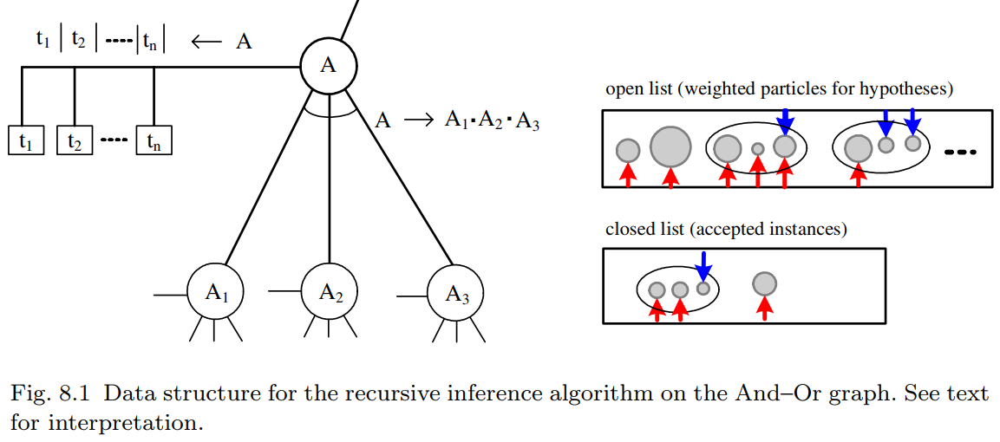

在该图中，每个这样的单元都在人工智能启发式搜索中广泛使用的数据结构相关联。

* **开放列表** 存储了若干加权粒子，这些粒子是通过自底向上的过程针对输入图像 $A$ 的实例计算得出的。
* **封闭列表** 存储了在自顶向下过程中被接受的 $A$ 的若干实例。这些实例是当前解析图 $\mathbf{pg}$ 中的节点。

推理算法由两个基本过程组成，这两个过程为每个单元 $A$ 计算并维护开放列表和关闭列表。自底向上的过程通过两种方法在开放列表中生成粒子：

1. 直接从图像生成 $A$ 的假设。这种自下而上的过程包括检测算法。

2. 通过绑定 $A$ 的子节点 $A_1, A_2, \dots, A_{n(A)}$ 现有开放列表和封闭列表的 $k$ 个部分来生成 A 的假设。绑定过程将测试这些子节点之间的关系以确定兼容性，并快速排除明显不兼容的组合。

   在图 8.1 中，这些假设通过一个包含其节点的 $n(A) = 3$ 个小圆圈的大椭圆来表示。向上的箭头表示子节点开放或封闭列表中现有部分，向下的箭头表示需要在自上而下过程中验证的缺失部分。一个绑定假设的权重是某个局部条件后验概率比的对数。假设一个粒子 $A^i$ 是由两个现有部分 $A_1^i$ 和 $A_2^i$ 绑定而成，缺少 $A_3^i$ ，并且 $\Lambda^i$ 是包含假设 $A^i$ 的区域。那么权重将是：
   $$
   w_A^i = \log \cfrac{p(A^i | A_1^i, A_2^i, \mathbf I_{\Lambda^i})}{p(\bar A^i | A_1^i, A_2^i, \mathbf I_{\Lambda^i})} =  \log \cfrac{p(A_1^i, A_2^i, \mathbf I_{\Lambda^i}|A^i)p(A^i)}{p(A_1^i, A_2^i, \mathbf I_{\Lambda^i} | \bar A^i)p(\bar A^i)} \approx \log \cfrac{p(A_1^i, A_2^i|A^i)p(A^i)}{p(A_1^i, A_2^i| \bar A^i)p(\bar A^i)} = \hat\omega_A^i
   $$
   其中，$\bar A$ 表示竞争性假设，$p(A_1^i, A_2^i|A^i)$ 被简化为 $A_1^i$ 和 $A_2^i$ 之间的兼容性测试。它将搜索 $A_3^i$ 以及将图像区域 $\mathbf I_{\Lambda_A}$ 拟合

自上而下的过程根据贝叶斯后验概率验证所有开放列表 (Open lists) 中的自下而上假设。它还需要维护开放列表 (Open lists) 的权重。

1. 给定一个权重为 $\hat{\omega}^i_A$ 的假设 $A^i$，自上而下的过程通过计算上述的真实后验概率比率 $\omega^i_A$ 来对其进行验证。如果 $A^i$ 被接受到 A 的封闭列表 (Closed list) 中。这对应于从当前解析图 $\mathbf{pg}$ 到新解析图 $\mathbf{pg}_+$ 的一次移动。后者包含一个新节点 $A^i$——它既可以作为叶节点，也可以作为带有子节点 $A^1_i, \dots, A^{n(A)}_i$ 的非终端节点。

   在一个反向过程中，自上而下的过程也可能选择封闭列表 (Closed list) 中的一个节点 A，然后或者删除它（将其放回开放列表 (Open list)），或者将其分解成独立的部分。

2. 在从解析图中添加（或移除）节点 $A^i$ 后，维护开放列表 (OPEN Lists) 中粒子的权重。很明显，每个粒子的权重取决于竞争性假设。因此，对于在域 $\Lambda_o$ 中重叠的两个竞争性假设 A 和 A'，接受其中一个假设将会降低另一个假设的权重。因此，每当我们在解析图中添加或删除节点 A 时，所有其他其域与 A 的域重叠的假设都必须更新它们的权重。

节点的接受可以通过一个最大化后验概率的贪婪算法来完成。每次它会选择所有开放列表 (Open lists) 中权重最大的粒子，然后接受它，直到最大权重低于某个阈值为止。

否则，可以使用带有可逆跳跃 (reversible jumps) 的随机算法。根据数据驱动马尔可夫链蒙特卡洛 (DDMCMC) [73, 74] 的术语，可以将近似权重 $\hat{\omega}^i_A$ 视为提议概率 (proposal probability) 比率的对数。因此，在 Metropolis-Hastings 方法 [46] 中，接受概率为：

$$
\begin{aligned}
a(\mathbf{pg} \to \mathbf{pg}_+) &= \min \left( 1, \frac{q(\mathbf{pg}_+ \to \mathbf{pg})}{q(\mathbf{pg} \to \mathbf{pg}_+)} \cdot \frac{p(\mathbf{pg}_+|\mathbf{I})}{p(\mathbf{pg}|\mathbf{I})} \right)\\
&= \min \left( 1, \frac{q_+(A^i)}{q(A^i)} \exp\{\omega^i_A - \hat{\omega}^i_A\} \right) ,
\end{aligned}
$$
其中 $q_{+}(A^i)$（或 $q(A^i)$）是选择 $A^i$ 从 $\mathbf{pg}_+$ 中分解出来（或添加到 $\mathbf{pg}$ 中）的提议概率 (proposal probability)。

对于该随机算法，当粒子权重非常大且接受概率恒为 1 时，其初始阶段通常是确定性的。

---

**算法8.1：基于自上而下/自下而上推理的图像解析**

**输入**：图像 **I** 和 And-Or 图 
**输出**：解析图 $\mathbf{pg}$（初始状态 $\mathbf{pg} = \emptyset$）

1. **循环执行**  
2. 调度下一个待访问节点 \(A\)  
3. 调用**自下而上(Bottom-Up)**过程更新 \(A\) 的开放列表：  
   - (i) 从图像中检测 \(A\) 的终端实例  
   - (ii) 通过子节点的开放/封闭列表绑定 \(A\) 的非终端实例  
4. 调用**自上而下(Top-Down)**过程更新 \(A\) 的封闭与开放列表：  
   - (i) 将假设从 \(A\) 的开放列表移至封闭列表  
   - (ii) 从 \(A\) 的封闭列表中移除（或解构）假设  
   - (iii) 更新与当前节点存在区域重叠的粒子开放列表  
5. **终止条件**：达到迭代次数上限或最大粒子权重低于阈值

---

推理算法的关键问题在于对开放列表和封闭列表中的粒子进行排序。 换句话说， 该算法必须安排自底向上和自顶向下的处理过程以实现计算效率。  

