> 监督学习（分类与回归，感知机、逻辑回归；神经网络、反向传播、CNN、RNN）；
> 非监督学习（K-means）；
> 强化学习（MDP定义、状态值函数和动作值函数、Q学习及SARSA、DQN）

## 决策树

例子：打网球

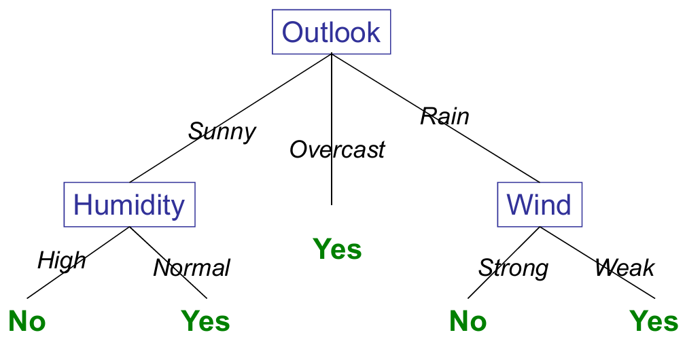

例如 <Outlook = Sunny, Temp = Hot, Humidity = High, Wind = Strong>, 分类结果：No

决策树概念：

* 表示一个函数，该函数将属性值的向量作为输入，并返回一个“决策”（单个输出值）
* 通过执行一系列测试来做出决策。
* 节点：用属性标记
* 边：用属性值标记
* 叶子：用决策标记

决策树表示：决策树表示属性值约束的合取的析取

上例中的决策树：(Outlook = Sunny ∧ Humidity = Normal) ∨ (Outlook = Overcast) ∨ (Outlook = Rain ∧ Wind = Weak)

* 任何布尔函数都可以写成决策树
* 通过把真值表中的每一行对应树中的路径
* 通常可以使用小树，然后，有些函数需要指数大的树

决策树学习：

* 目标：找到一棵与训练样例一致的小树
* 思路：选择“最重要”属性作为（子）树的根

### 信息论

我们将使用 **信息增益**（information gain）的概念，它是用信息论的基本概念——熵（entropy）来定义的

* 熵，是对随机变量不确定性的度量；信息的获取对应于 熵的减少
* 只有一个值的随机变量没有确定性，其熵被定义为零
* 抛一枚公平的硬币具有 “1 bit” 的熵
* 扔一枚公平的四边形骰子 有 2 bits 的熵，因为需要 2 位来描述4个同样可能的结果之一。

### 熵

* 以概率 $P(v_k)$ 取值 $v_k$ 的随机变量 $V$ 的熵：
  $$
  \mathrm{H}(V) = -\sum_k P(v_k) \log_2 P(V_k)
  $$

* 以概率 $q$ 为真的布尔随机变量的熵：
  $$
  \mathrm{B}(q) = -(q\log_2 q + (1-q)\log_2(1-q))
  $$

* 如果一个训练集熵包含 p 个正例和 n 个负例，那么目标属性在整个训练集上的熵为
  $$
  \mathrm{H}(Goal) = \mathrm{B}(\cfrac{p}{p + n})
  $$
  

### 信息增益

* 具有 d 个不同值的属性 A 将训练集 E 划分为子集 $E_1$ ，...，$E_d$ 

  * 每个子集 $E_k$ 具有 $p_k$ 个正例和 $n_k$ 个负例

  因此，测试属性 A 后剩余的期望熵为
  $$
  \mathrm{Remainder}(A) = \sum_{k = 1}^d \cfrac{p_k + n_k}{p+n}\mathrm{B}(\cfrac{p_k}{p_k + n_k}).
  $$
  对 A 的属性测试的信息增益 (IG) 是熵的期望减少：
  $$
  \mathrm{Gain}(A) = \mathrm{B}(\cfrac{p}{p+n}) - \mathrm{Remainder}(A)
  $$

* 选择 IG 最大的属性

例题：餐厅选择：

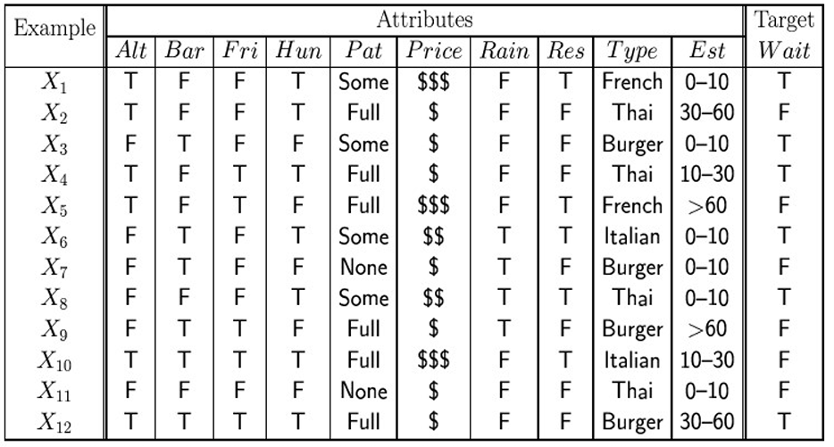

比较属性 `Patron(Pat)` 和 属性 `Type` ：

* 对于训练集， $p = n = 6, \mathrm{B}(\cfrac{6}{12})$ 
* $\mathrm{Gain}(Pat) = 1-[\cfrac2{12}\mathrm{B}(\cfrac02) + \cfrac4{12}\mathrm{B}(\cfrac44) + \cfrac6{12}\mathrm{B}(\cfrac26)] \approx 0.541 $ 
* $\mathrm{Gain}(Type) = 1-[\cfrac2{12}\mathrm{B}(\cfrac12) + \cfrac4{12}\mathrm{B}(\cfrac24) + \cfrac4{12}\mathrm{B}(\cfrac24) + \cfrac2{12}\mathrm{B}(\cfrac12)] = 0$ 
* 所以，Pat 是一个更好的分裂属性。
* 事实上，Pat 具有任何属性中的最大增益，并被 DTL 算法选择为根

从上述 12 个样例中学到的决策树：

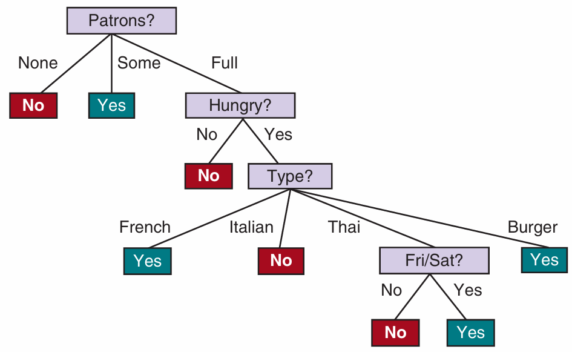

### Gini 指数

* 熵模型拥有大量耗时的对数运算，基尼指数在简化模型的同时还保留了熵模型的优点

* 如果一个数据集 D 包含来自 n 个类的样本，那么基尼指数定义如下：
  $$
  \mathrm{Gini}(D) = \sum_{i=1}^n p_i(1-p_i) = 1 - \sum_{i=1}^n p_i^2
  $$
  其中，$p_i$ 是 类 $i$ 在 D 中的相对频率

* 基尼指数 反映了 数据集中个随机抽取两个样例，其类别标记不一致的概率

* 基尼指数越小，则数据集纯度越高

* 如果 n = 2, $ \mathrm{Gini}(D) = 2p(1-p)$ 

### 基于 Gini 指数的属性选择

* 假设属性 A 的取值将 D 划分为 $D_1, ..., D_m$ 
  $$
  \mathrm{Gini}(D|A) = \sum_{i = 1}^m \cfrac{|D_i|}{|D|} \mathrm{Gini}(D_i)
  $$

* 具有最小 $\mathrm{Gini}(D|A)$ 的属性被选为分裂节点的属性

针对上面餐厅的例题：
$$
\begin{aligned}
& Patron: D_1:\text{None}, D_2:\text{Some}, D_3: \text{Full} \\
& \mathrm{Gini}(D_1) = 0, \mathrm{Gini}(D_2) = 0, \mathrm{Gini}(D_3) = 2\times \cfrac13\times\cfrac23 = \cfrac49,\\
& \mathrm{Gini}(D|Pat) = \cfrac2{12}\times0 + \cfrac4{12}\times0 + \cfrac6{12}\times \cfrac49 = \cfrac29\\
& Type:
\mathrm{Gini}(D_1) = \mathrm{Gini}(D_2) = \mathrm{Gini}(D_3) = \mathrm{Gini}(D_4) = 2\times \cfrac12\times \cfrac12 = \cfrac12\\
& \mathrm{Gini}(D|Type) = (\cfrac2{12} + \cfrac2{12} + \cfrac4{12} + \cfrac4{12}) \times \cfrac12 = \cfrac12
\end{aligned}
$$
所以 Pat 是一个更好的分裂属性。

例题：

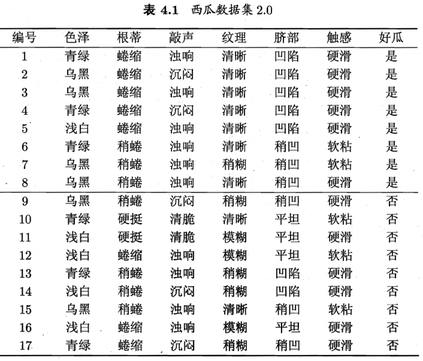

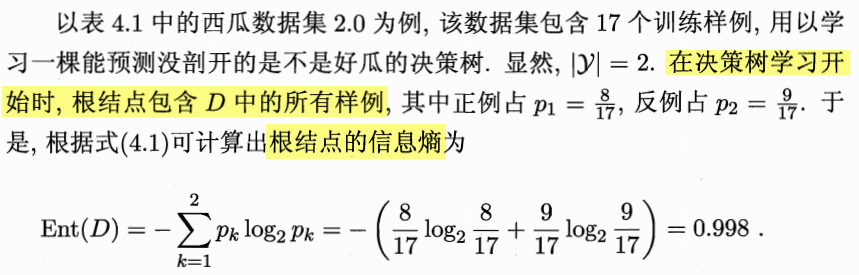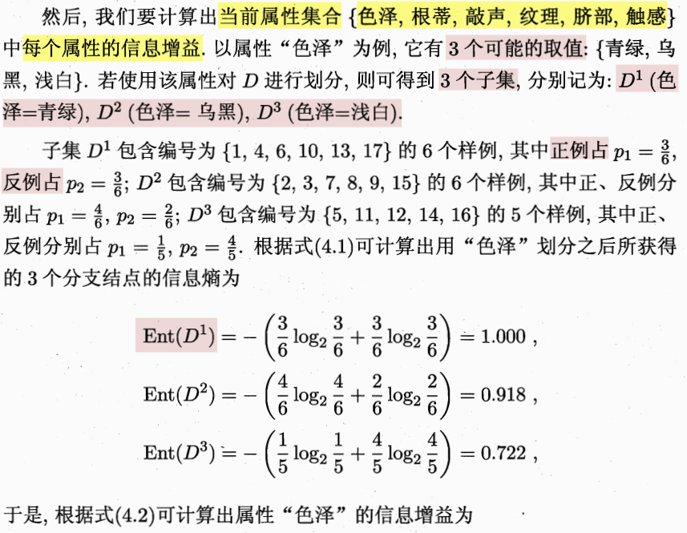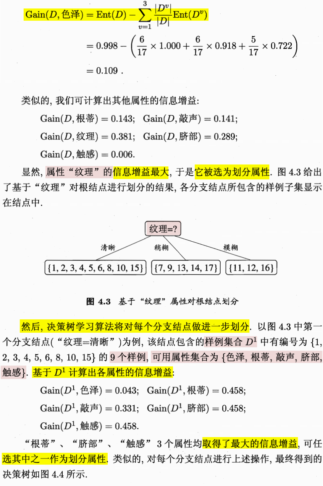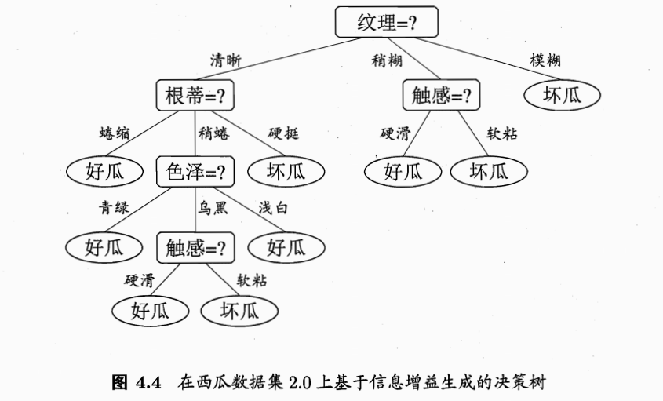

## K 近邻分类

* 给定一个训练数据集，对于新的输入实例，在训练数据集中找到与该实例最近邻的 $k$ 个实例，这k 个实例的多数属于某个类，就把该输入实例分类到这个类中。

**示例**

有两类不同样本数据，分别用 蓝色的小正方形 和 红色的小三角形 表示，而图正中间哪个绿色的圆表示待分类的数据：

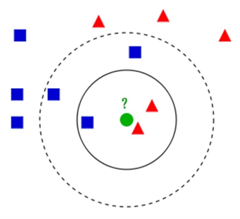

若 k = 3，分类结果为红色；若 k = 5，分类结果为蓝色。

**距离的度量**：

* 两个 $n$ 维向量 $x = (x_1, x_2, ..., x_n)$ 与 $y = (y_1, y_2, ..., y_n)$ 间的闵可夫斯基距离定义为
  $$
  L_p(x, y) = (\sum_{i = 1}^n |x_i - y_i|^p)^{\small{\cfrac1p}}
  $$

* 当 $p = 2$ 时，称为 欧氏距离（Euclidean distance），即
  $$
  L_2(x, y) = (\sum_{i = 1}^n |x_i - y_i|^2)^{\small{\cfrac12}}
  $$

* 当 $p = 1$ 时，称为 曼哈顿距离（Manhattan distance），即
  $$
  L_1(x, y) = \sum_{i = 1}^n |x_i - y_i|
  $$

* 当 $p = \infty$ 时，它是各个坐标距离的最大值，即
  $$
  L_{\infty}(x, y) = \max_i|x_i - y_i|
  $$
  

**归一化**

* 最近邻对不同特征的范围是敏感的。

* 可以计算每个维度上的平均值 $\mu_i$ 和 标准差 $\sigma_i$ ，然后取
  $$
  x_i' = \cfrac{x_i - \mu_i}{\sigma_i}
  $$

* $k$ 过小：可能过拟合，即对训练数据中的随机特性敏感

* $k$ 过大：可能欠拟合，即不能捕捉训练数据中的重要的规律

* $k$ 的最优选择取决于 训练集 的大小 $n$ 

* 经验公式：一般取 $k = \sqrt{n}$ 

* 可以使用验证集来选择 $k$ 

* $k$ 是一个超参数，不是由学习算法本身来设定的
* 我们可以使用验证集来调优超参数

维数灾难

* 可以使用 k-d 树 来加速

## 贝叶斯学习、预测

* 假设 H：关于世界的概率理论
  * $h_1$
  * $h2$
  * ...
* 数据 D：关于世界的证据
  * $d_1$
  * $d_2$
  * ...

**贝叶斯学习**

* 先验：$Pr(H)$

  先验概率是在没有任何其他条件或信息的情况下，某个事件发生的概率。在贝叶斯推断中，先验概率通常是我们对某个事件或类别的初始认知或假设。

* 证据：$d = \langle d_1, d_2, ..., d_n\rangle$ 

* 似然性：$Pr(d|H)$ 

  似然度（likelihood）是指给定一些模型参数和观测数据时，观测数据出现的概率。简单来说，似然度描述的是模型和数据之间的关系，它是一种在已知模型参数的情况下，描述数据的概率。

* 使用贝叶斯定理计算后验：
  $$
  Pr(H|d) = \alpha Pr(d|H) Pr(H)
  $$

**贝叶斯预测**

* 假设我们想对未知量 $X$ 进行预测：
  $$
  P(X|d) = \sum_i P(X|d, h_i) P(h_i|d) = \sum_{i} P(X|h_i) P(h_i|d)
  $$

* 预测是单个假设预测的加权平均值

* 假设是原始数据和预测之间的“中介”

**示例**

【糖果】最喜欢的糖果有两种口味：樱桃（cherry），酸橙（lime）。两种口味的包装相同。以不同的比例的袋子出售：

* 100% 樱桃
* 75% 樱桃 + 25% 酸橙
* 50% 樱桃 + 50% 酸橙
* 25% 樱桃 + 75% 酸橙
* 100% 酸橙

你买了一袋糖果，但不知道它的口味比例。吃了 $k$ 个糖果后：

* 这个袋子的口味比例是多少？
* 下一个糖果会是什么口味？

分析：---->

* 假设 H：
  * $h_1$：100% 樱桃
  * $h_2$：75% 樱桃 + 25% 酸橙
  * $h_3$：50% 樱桃 + 50% 酸橙
  * $h_4$：25% 樱桃 + 75% 酸橙
  * $h_5$：100% 酸橙
* 假设先验 $P(H) = \langle 0.1, 0.2, 0.4, 0.2, 0.1 \rangle$ 
* 假设糖果是 i.i.d. (独立同分布，identically and independently distributed), i.e.，$P(d|h) = \prod_j P(d_j|h)$ 
* 假设前 10 个糖果都有 酸橙味：
  * $P(d|h_5) = 1^{10} = 1,$
  * $P(d|h_3) = 0.5^{10} = 0.00097$
  * $P(d|h_1) = 0^{10} = 0$ 

贝叶斯预测示例：---->

假设 $d_1 = \langle lime \rangle$ ，$d_2 = \langle lime, lime \rangle$ 

| 假设           | $h_1$ | $h_2$   | $h_3$  | $h_4$   | $h_5$ |
| -------------- | ----- | ------- | ------ | ------- | ----- |
| $P(lime\vert h_i)$  | 0     | 0.25    | 0.5    | 0.75    | 1     |
| $P(h_i)$       | 0.1   | 0.2     | 0.4    | 0.2     | 0.1   |
| $P(d_1\vert h_i)$   | 0     | 0.25    | 0.5    | 0.75    | 1     |
| $P(d_2\vert h_i)$   | 0     | $0.25^2$ | $0.5^2$ | $0.75^2$ | 1     |

* $P(d_1) = \sum_i P(d_1|h_i) P(h_i) = 0.5$ 

* $P(lime|d_1) = \sum_iP(lime|h_i) P(h_i|d_1) = \cfrac1{P(d_1)} \sum_i P(lime | h_i) P(d_1|h_i) P(h_i) = 0.65$ 

  > $P(h_i|d_1) = \cfrac{P(d_1 | h_i) P(h_i)}{ P(d_1)}$

* $P(d_2) = \sum_i P(d_2|h_i) P(h_i) = 0.5$ 

* $P(lime|d_2) = \cfrac1{P(d_2)} \sum_i P(lime | h_i) P(d_2|h_i) P(h_i) = 0.654$ 

## 贝叶斯网络的参数学习

**简单的 ML 示例**

* 假设 $h_\theta$ ：$P(\text{cherry}) = \theta$, $P(\text{lime}) = 1-\theta$ 
* 数据 $d$： $c$ 个樱桃 和 $l$ 个酸橙
* $P(d|h_\theta) = \theta^c(1-\theta)^l$ 
* $\log P(d|h_\theta) = c\log \theta + l \log(1-\theta)$ 
* $\cfrac{\mathrm{d}(\log P(d|h_\theta))}{\mathrm{d}\theta} = \cfrac{c}{\theta} - \cfrac{l}{(1-\theta)}$ 
* $\cfrac{c}{\theta} - \cfrac{l}{(1-\theta)} = 0 \rightarrow \theta = \cfrac{c}{c+l}$ 

**更复杂的 ML 参数学习**

* 假设 $h_{\theta, \theta_1, \theta_2}$：$P(F = \text{cherry}) = \theta, P(W = \text{red} | \text{cherry}) = \theta_1, P(W = \text{red} | \text{lime}) = \theta_2$ 
* 数据 $d$ ：
  * $c$ 个 樱桃：$g_c$ 个绿的 和 $r_c$ 个红的
  * $l$ 个酸橙：$g_l$ 个绿的 和 $r_l$ 个红的
* $P(\langle \text{lime}, \text{red} \rangle | h_{\theta, \theta_1, \theta_2}) = P(\text{lime}| h_{\theta, \theta_1, \theta_2}) P(\text{red}|\text{lime}, h_{\theta, \theta_1, \theta_2}) = (1-\theta)\theta_2$ 
* $P(d|h_{\theta, \theta_1, \theta_2}) = \theta^c(1-\theta)^l \theta_1^{r_c}(1-\theta_1)^{g_c}\theta_2^{r_l}(1-\theta_2)^{g_l}$ 
* $\cfrac{c}{\theta} - \cfrac{l}{(1-\theta)} = 0 \rightarrow \theta = \cfrac{c}{c+l}$ 
* $\cfrac{r_c}{\theta_1} -\cfrac{g_c}{1-\theta_1} = 0 \rightarrow  \theta_1 = \cfrac{r_c}{r_c + g_c}$ 
* $\cfrac{r_l}{\theta_2} -\cfrac{g_l}{1-\theta_2} = 0 \rightarrow  \theta_2 = \cfrac{r_l}{r_l + g_l}$ 

**Laplace 平滑**

* 当没有特定结果的样本时，就会发生过拟合的情况
  * 例如，目前为止没有吃到樱桃。就会导致 $P(\text{cherry}) = \theta = \cfrac{c}{c+l} = 0$ 
  * 零概率是危险的，它们排除了结果
* 解决方案： Laplace 平滑 => 加1
  * 所有的计数加1 
  * $P(\text{cherry}) = \theta = \cfrac{c + 1}{c + l  + 2} > 0$ 

**朴素贝叶斯模型**

* 要基于属性 $A_1, ..., A_n$ 预测类 $C$
* 参数：
  * $\theta = P(C = \text{true})$ 
  * $\theta_{i1} = P(A_i = \text{true} | C = \text{true})$ 
  * $\theta_{i2} = P(A_i = \text{true} | C = \text{false})$ 
* 假设：给定 $C$ 下 $A_i$ 之间是独立的
* 符号：
  * $p = \#(c), n = \#(-c), p_i^+ = \#(c, a_i), n_i^+ = \#(c, -a_i),$
  * $ p_i^- = \#(-c, a_i), n_i^- = \#(-c, -a_i)$ 
* $P(d|h) = \theta^p(1-\theta)^n \prod_i \theta_{i1}^{p_i^+}\theta_{i2}^{p_i^-}(1-\theta_{i1})^{n_i^+} (1-\theta_{i2})^{n_i^-}$ 
* $\theta = \cfrac{p}{p + n}, \theta_{i1} = \cfrac{p_i^+}{p_i^+ + n_i^+ }, \theta_{i2} = \cfrac{p_i^-}{p_i^- + n_i^-}$ 
* $P(C|a_1, ..., a_n) = \alpha P(C) \prod_i P(a_i | C)$ 
* 选择最可能的类别
* 没有决策树准确

例题：利用西瓜数据集3.0 训练一个朴素贝叶斯分类器，对测试1 进行分类：

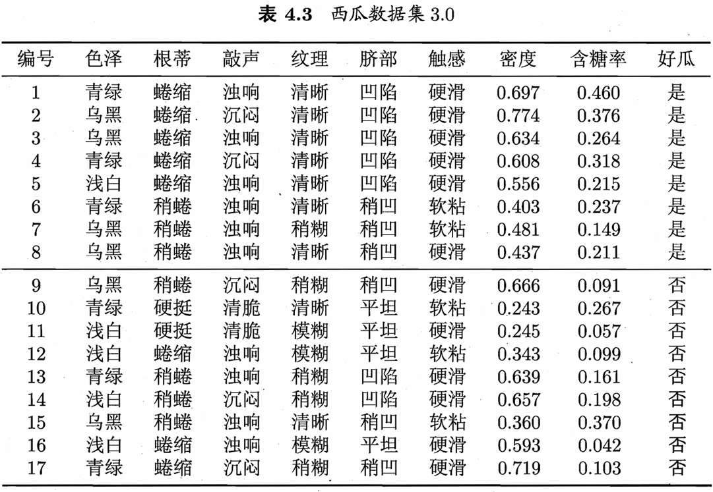

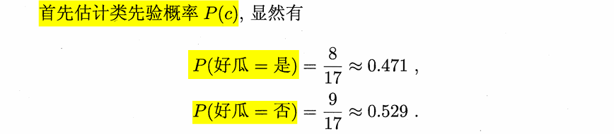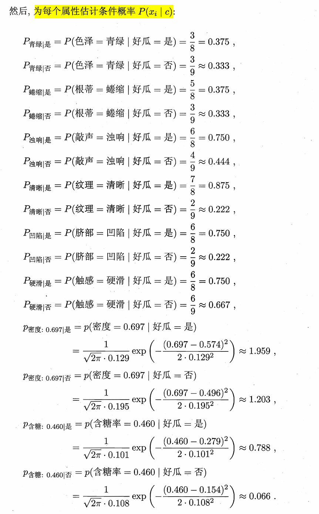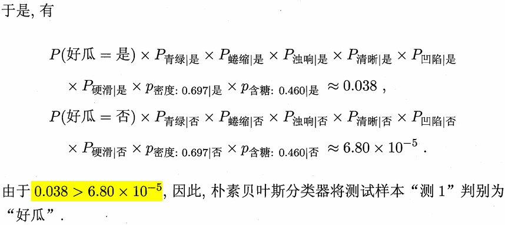

## 线性和逻辑回归

**人工神经网络**

* 模拟大脑进行计算
* 组成：
  * 节点（也称单位）对应于神经元
  * 连接对应于突触
* 计算：
  * 节点间传送的数值信号对应于神经元之间的化学信号
  * 节点对数值信号进行修改对应于神经元激活率

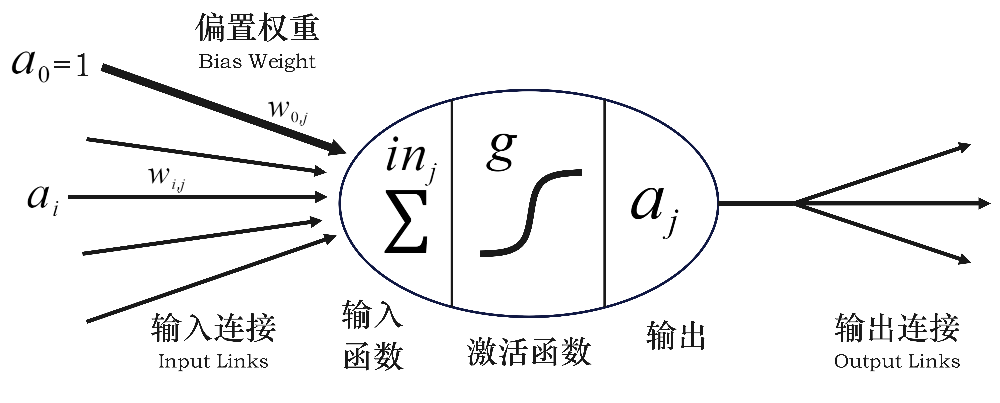

当输入的线性组合超过某个阈值时，神经元“激活”

**激活函数**

* 应该是非线性的

  否则网络仅仅表示一个线性函数

* 用以模拟神经元的激活

  * 对于“正确的”输入，单元应该是“激活的”：输入接近 1
  * 对于“错误的”输入，单位应该是“静息的”：输入接近 0

常用的激活函数：

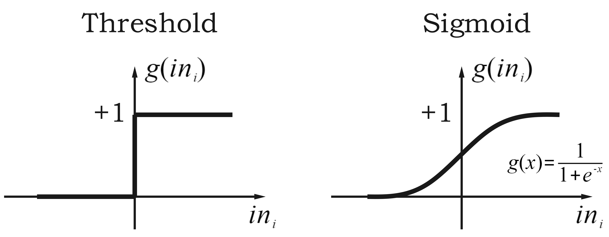

* 双曲正切函数（tanh）

  $\mathrm{tanh}(x) = \cfrac{e^x - e^{-x}}{e^x + e^{-x}} = \cfrac{2}{1+e^{-2x}} - 1 = 2\mathrm{g}(2x) - 1$ 

  $\mathrm{tanh}'(x) = 1-\mathrm{tanh}^2(x)$ 

* 修正线性单元 Rectified linear units

  $\mathrm{ReLU}(x) = \max(0, x)$ 

  梯度为 0 或 1

  Soft 版本：$\mathrm{softplus}(x) = \log(1 + e^{-x})$ 

  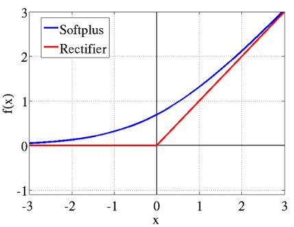

  $\mathrm{softplus}'(x) = \mathrm{sigmoid}(x)$ 

### 网络结构

* 前馈网络（Feed-forward network）
  * 有向非循环图
  * 没有内部状态
  * 简单从输入计算输出
* 循环网络（Recurrent network）
  * 有向循环图
  * 具有内部状的动态系统
  * 可以记忆信息

示例：简单网络，有两个输入，一个具有两个单元的隐藏层，一个输出单元

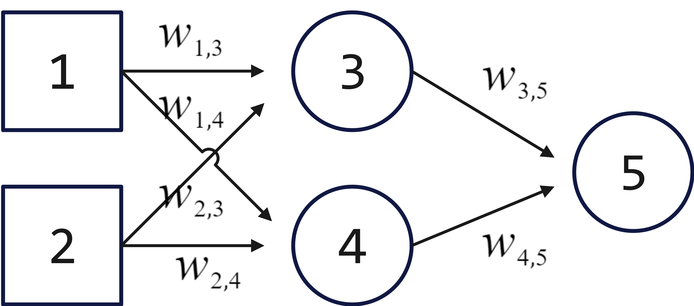
$$
\begin{aligned}
a_5 & = \mathrm{g}(w_{3, 5} a_3 + w_{4, 5} a_4)\\
& = \mathrm{g}(w_{3, 5} \mathrm{g}(w_{1, 3} a_1 + w_{2, 3} a_2) + w_{4, 5} \mathrm{g}(w_{1, 4} a_1 + w_{2, 4} a_2))
\end{aligned}
$$
单层的前馈网络：

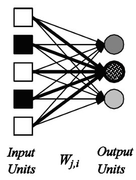

### 线性分离器

* 下图有两类数据点
* 决策边界（decision boundary）是一条直线、一个平面或者更高维的面，它将两类数据分离
* 图中决策边界是一条直线。线性决策边界也被称为线性分离器（linear separator）
* 有线性分离器的数据称为线性可分的（linear separable）

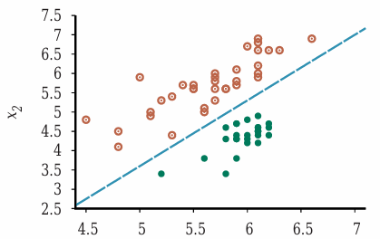

### 阈值感知假设空间

* 分类假设 $h_w$ ：$w\cdot x \geq 0 \rightarrow 1,\ w\cdot x<0 \rightarrow 0$ 

* 即，$h_w(x) = \mathrm{Threshold}(w\cdot x)$ 

  例如，$-4.9 + 1.7x_1 - x_2 \geq 0 \rightarrow 1$，令 $x_0 = 1$，可表示为 $\mathrm{Threshold}(w\cdot x)$，其中，$w = \langle -4.9, 1.7, -1 \rangle$ 

不是所有的布尔门都是线性可分的，例如异或运算。

### Sigmoid 感知机

* 表示 “软的”线性分离器

* 分类假设 $h_w(x) = \mathrm{Sigmoid}(w\cdot x)$ 

  输出是一个 0~1 的数字，可以解释为标签类为 1 的概率。

  假设在输入空间中形成一个软化边界，对位于该边界中心的输入，该概率为 0.5，随着数据原理边界而接近 0 或 1。

  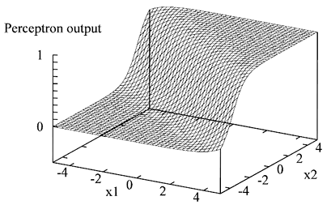

### 损失函数

* 损失函数 $L(x, y, y')$ 定义为当正确答案为 $f(x) = y$，预测 $h(x) = y'$ 的效用损失量
* 通常使用一个简单的版本 $L(y, y')$，它独立于 $x$ 
* 三个常用的损失函数：
  * 绝对值损失：$L_1(y, y') = |y - y'|$ 
  * 平方误差损失：$L_2(y, y') = (y - y')^2$ 
  * 0/1 损失：$L_{0/1}(y, y') = 0$ 如果 $y = y'$ ，否则 $=1$ 
  * 令 $E$ 为样例集，总损失 $L(E) = \sum_{e\in E} L(e)$ 

### 线性回归

* 给定含有 $N$ 个输入-输出对 样例的训练集 $(x_1, y_1), ..., (x_N, y_N)$ 

* 每个 $x_j$ 是一个 $n$ 元向量

* 假设为线性函数 $h_w(x) = w_0 + w_1 x_1 + ... + w_nx_n$ 

  引入一个哑输入属性 $x_0$ ，其值总为 1.

  因而，$h_w(x) = w\cdot x = \sum_i w_i x_i$ 

* 找到最匹配这些数据的线性函数 $h_w$ 

**梯度下降**

* 通过逐步修改参数来搜索连续的权重空间

* 目标是，将损失最小化 —— 梯度下降

* 对权重做任意初始化

  在每一步，在最陡峭的下坡方向移动一小步，即与函数偏导成比例减少每个权重
  $$
  w_i \gets w_i - \alpha\cfrac{\partial\ \mathrm{Loss}(w)}{\partial\ w_i}
  $$
  $\alpha$ 称为学习率（learning rate）

* 重复这一过程，直到收敛到权重空间上某一点位置

**线性回归公式推导**

$h_w(x) = w\cdot x = \sum_i w_i x_i$ 

平方误差损失：$\mathrm{Loss}(w) = (y - h_w(x))^2$ 

求导链式法则：$\cfrac{\partial\ g(f(x))}{\partial\ x} = g'(f(x)) \cfrac{\partial\ f(x)}{\partial\ x}$ 

$\cfrac{\partial\ \mathrm{Loss}(w)}{\partial\ w_i} = -2(y-h_w(x)) x_i$ 

$w_i \leftarrow w_i + \alpha(y-h_w(x))x_i$ 

**梯度下降的变种**

* 批梯度下降（batch gradient descent, BGD）
  * 极小化在所有训练样例上的损失
  * $w_i \leftarrow w_i + \alpha\sum_j(y_j-h_w(x_j))x_i, j$ 
* 随机梯度下降（stochastic gradient descent, SGD）
  * 在每一步中随机选择少量训练样例

**感知器算法**

假设函数是阈值感知器，选择权重 $w$ 以最小化损失函数

无法使用梯度下降，因为几乎所有地方的梯度都是零，但仍存在一个简单的权重更新规则。当数据是线性可分的，收敛到一个线性分离器。

与线性回归的权重更新规则相同：$w_i \leftarrow w_i + \alpha(y-h_w(x))x_i$ 

若输出是正确的，那么权重将不会改变

每一次更新随机选择一个样例

**逻辑回归** Logistic regression

假设函数是线性函数的 sigmoid 函数

$g(x) = \cfrac{1}{1+e^{-x}}$ 

$h_w(x) = g(w\cdot x)$ 

$g' = g(1-g)$ 

$\mathrm{Loss}(w) = (y - h_w(x))^2$ 

$\cfrac{\partial \mathrm{Loss}(w)}{\partial w_i} = -2(y-h_w(x))g'(w\cdot x)x_i = -2(y - h_w(x)) h_w(x)(1-h_w(x))x_i$ 

$w_i \leftarrow w_i + \alpha(y - h_w(x)) h_w(x)(1-h_w(x))x_i$ 

## 多层前馈神经网络

* 感知器只能表示线性分离器
* 多层网络，可以表示任意函数

**多层网络**

把两个平行但具有反向峭壁的 sigmoid 单元相加形成一个山脊

把两个交叉的山脊相加形成一个山包

通过把不同高度的山包拼接在一起，可以逼近任意函数

例子：表示布尔函数的神经网络

布尔函数：$x_1 \land \lnot x_2 \lor x_2 \land x_3$ 

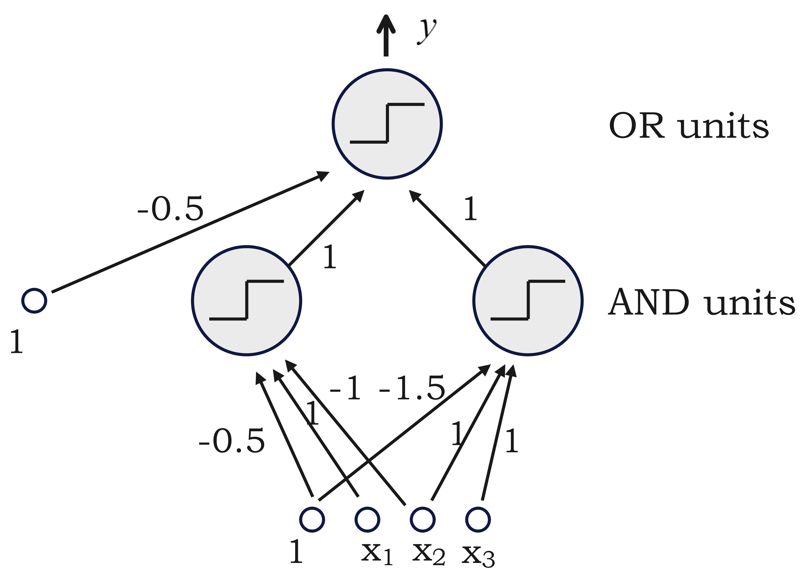

任意布尔函数可以转换为合取范式（CNF）或析取表达式（DNF），因而可以用具有一个隐藏层的神经网络表示

**权重训练**

一个样例集合，每个样例由输入向量 $x$ 和 输出向量 $y$ 组成

平方误差损失：$\mathrm{Loss} = \sum_k \mathrm{Loss}_k, \mathrm{Loss}_k = (y_k - a_k)^2$ ，其中 $a_k$ 是神经网络的第 k 个输出

权重更新公式：$w_{ij} = w_{ij} - \alpha\cfrac{\partial \mathrm{Loss}}{\partial w_{i,j}}$ 

给定任意的网络结构，如何高效地计算梯度：**反向传播算法**

**前向阶段:**

* 把输入向前传播以计算每个单元的输出
* $a_j$ 是单元 j 的输出：$a_j = g(in_j)$，其中，$in_j = \sum_i w_{ij} a_i$ 

**反向阶段**：

* 把误差反向传播
* 输出单元 $j$ ：$\Delta_j = g'(in_j) (y_j - a_j)$ 
* 隐藏层单元 $i$ ：$\Delta_i = g'(in_i)\sum_j w_{ij}\Delta_j$ 

**多层网络的后向传播算法**

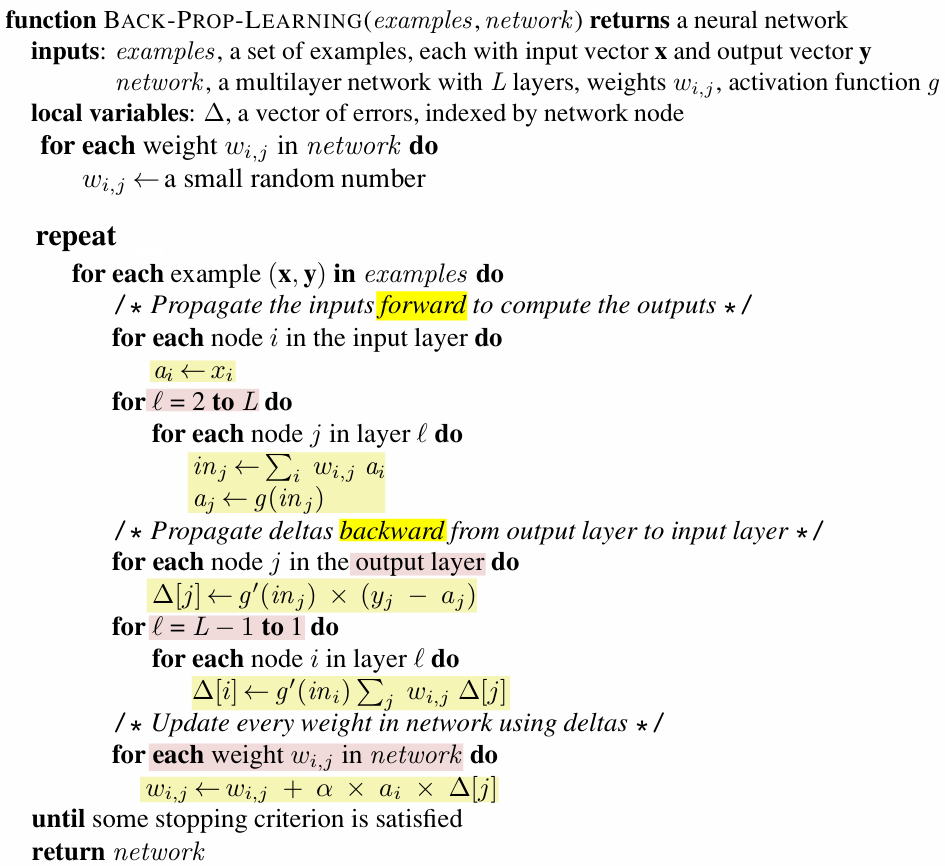

* 输出层：
  $$
  \begin{aligned}
  \cfrac{\partial \mathrm{Loss}_k}{\partial w_{j,k}} &= -2(y_k - a_k)\cfrac{\partial a_k}{\partial w_{j, k}} = -2(y_k - a_k)\cfrac{\partial g(in_k)}{\partial w_{j, k}}\\
  &= -2(y_k - a_k)g'(in_k)\cfrac{\partial in_k}{\partial w_{j, k}} = -2(y_k - a_k) g'(in_k)\cfrac{\partial (\sum_j w_{j,k}a_j)}{\partial w_{j, k}}\\
  &= -2(y_k - a_k)g'(in_k)a_j = -2a_j \Delta_k
  \end{aligned}
  $$

* 隐藏层：
  $$
  \begin{aligned}
  \cfrac{\partial \mathrm{Loss}_k}{\partial w_{i,j}} &= -2(y_k - a_k)\cfrac{\partial a_k}{\partial w_{i,j}} = -2(y_k - a_k)\cfrac{\partial g(in_k)}{\partial w_{i,j}}\\
  &= -2(y_k - a_k)g'(in_k)\cfrac{\partial in_k}{\partial w_{i,j}} = -2\Delta_k \cfrac{\partial (\sum_j w_{j, k}a_j)}{\partial w_{i,j}}\\
  &= -2\Delta_k w_{j,k} \cfrac{\partial a_j}{\partial w_{i,j}} = -2\Delta_k w_{j,k}\cfrac{\partial  g(in_j)}{\partial w_{i,j}}\\& = -2\Delta_k w_{j,k}g'(in_j)\cfrac{\partial in_j}{\partial w_{i,j}}\\
  &= -2\Delta_k w_{j,k} g'(in_j) \cfrac{\partial (\sum_{i} w_{i,j} a_i)}{\partial  w_{i,j}} = -2\Delta_k w_{j,k} g'(in_j)a_i
  \end{aligned}
  $$
  如果，上面的公式针对的是 一个隐藏层的神经网络（就是后面的例题的那样），那么上面的推导应该没有问题，但是原ppt的最后一步有点问题，我觉得最后一步的的公式应该是：
  $$
  \sum_k \cfrac{\partial \mathrm{Loss}_k}{\partial w_{i, j}} = -2a_i\Delta_j
  $$
  

前向和后向阶段：

前向阶段：

* 把输入向前传播以计算每个单元的输出
* $a_j$ 是单元 j 的输出：$a_j = g(in_j)$，其中，$in_j = \sum_i w_{ij} a_i$ 

后向阶段：

* 反向传播误差 Propagate errors backward

* 对于 输出单元 j：
  $$
  \Delta_j = g'(in_j)(y_j - a_j) = a_j(1-a_j)(y_j - a_j)
  $$

* 对于隐藏层单元 i：
  $$
  \Delta_i = g'(in_i)\sum_j w_{ij}\Delta_j = a_i(1-a_i)\sum_j w_{ij}\Delta_j
  $$

* 权重更新：
  $$
  w_{ij} \gets w_{ij} + \alpha a_i \Delta_j
  $$

**网络结构**

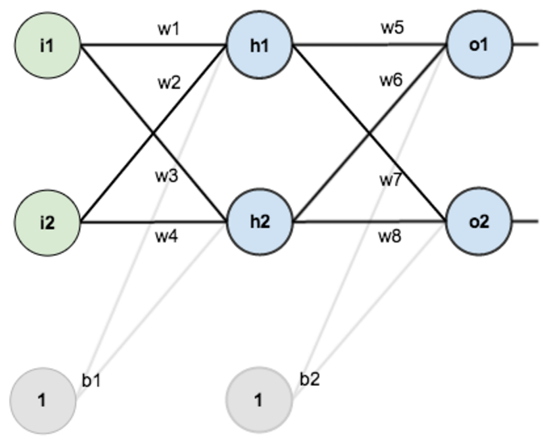

给定数值：

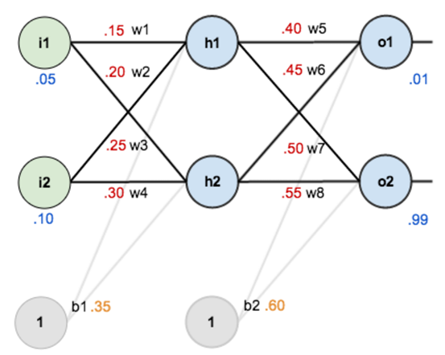

前向传递过程：
$$
\begin{aligned}
in_{h_1} &= w_1 i_1 + w_2 i_2 + b_1 = 0.05\times0.15 + 0.10\times0.20 + 0.35 = 0.3775\\
out_{h_1} &= g(in_{h_1}) = \frac{1}{1 + e^{-0.3775}} = 0.593269992 \\
out_{h_2} &= 0.596884378\\
in_{o_1} &= w_5 out_{h_1} + w_6 out_{h_2} + b_2 = 1.105905967\\
out_{o_1} &= g(in_{o_1}) = \cfrac{1}{1 + e^{-1.105905967}} = 0.75136507\\
out_{o_2} &= 0.772928465
\end{aligned}
$$
反向传递过程：假设$\alpha = 0.5$ 
$$
\begin{aligned}
\Delta_{o_1} &= g(in_{o_1})(1-g(in_{o_1}))(y_{o_1}-g(in_{o_1}))\\& =  0.75136507(1-0.75136507)(0.01-0.75136507) =  -0.138498562\\
w_5^+ &= w_5 + \alpha \cdot out_{h_1}\cdot \Delta_{o_1} = 0.5 - 0.5\times 0.593269992\times 0.138498562 = 0.35891648 \\
w_6^+ &= w_6 + \alpha \cdot out_{h_2} \cdot \Delta_{o_1} = 0.408666186\\
\Delta_{o_2} &= g(in_{o_2})(1-g(in_{o_2}))(y_{o_2}-g(in_{o_2})) = 0.0380982366\\
w_7^+ &= w_7 + \alpha \cdot out_{h_1}\cdot \Delta_{o_2} =  0.511301270\\
w_8^+ &= w_8 + \alpha \cdot out_{h_2}\cdot \Delta_{o_2} =  0.561370121\\
\Delta_{h_1} &= g'(in_{h_1})(w_5 \Delta_{o_1} + w_7\Delta_{o_2}) = g(in_{h_1})(1-g(in_{h_1}))(w_5 \Delta_{o_1} + w_7\Delta_{o_2})\\
&= -0.241300709\times0.036350306\\
w_1^+ &= w_1 + \alpha \cdot i_1 \cdot \Delta_{h_1} = 0.15-0.5\times0.05\times0.241300709\times0.036350306 \\&=0149780716\\
w_2^+ &= 0.19956143\\
w_3^+ &= 0.24975114\\
w_4^+ &= 0.29950229
\end{aligned}
$$

## 深度神经网络

* 定义：具有许多隐藏层的神经网络
* 高表达能力
* 挑战：
  * 如何训练深度神经网络
  * 如何避免过拟合
* 深度神经网络，经常受到梯度消失的影响
* 避免梯度消失：修正线性单元（Rectified Linear Units, ReLU）和最大化单元（Maxout Units）

Sigmoid 单元

* $g(x) = \cfrac{1}{1-e^{-x}}$ 
* $g' = g(1-g)$ 

避免过拟合：Dropout（随机失活）

## 卷积神经网络

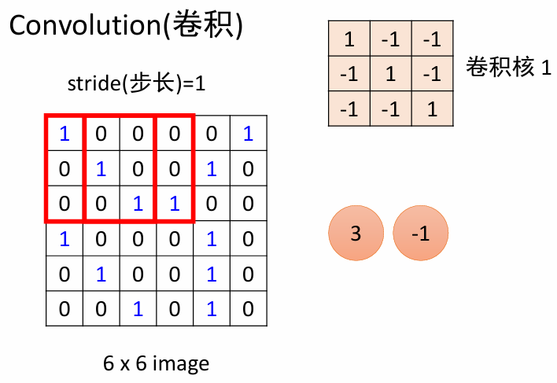

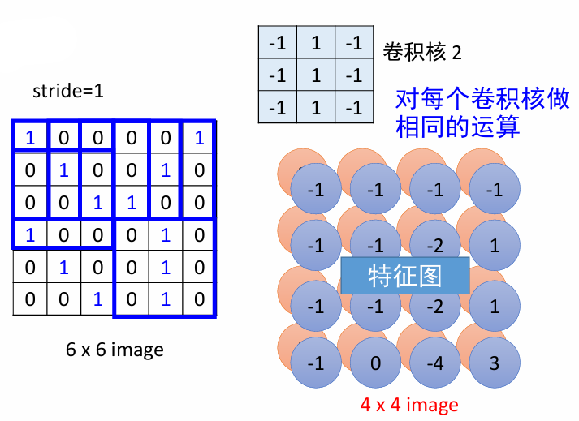 

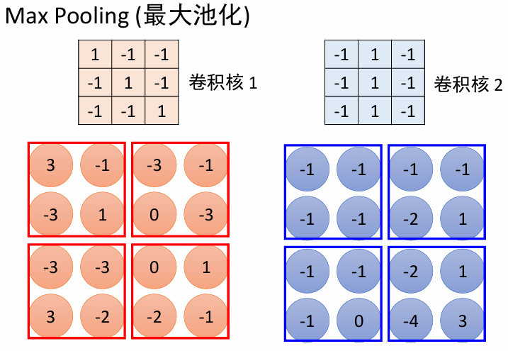 

神经元的三维体积

* ConvNet 层中的神经元以三维方式排列：宽度、长度、深度
* 例如：对于一个 100*100 的输入图像，输入体积的尺寸是 $100\times 100\times3$ 
* CNN 的每一层接受一个输入的 3D 体积，并将其转换为一个输出的 3D 体积。
* 有三个超参数控制输出体积的大小：深度、步长和零填充
* 输出体积的深度对应于滤波器（即卷积核）的数量，每个特征对应一个滤波器
* 步长：滤波器滑动的距离
* 零填充：在输入体积的边界周围填充零的大小

卷积层

* 接受一个大小为 $W_1 \times H_1 \times D_1$ 的体积
* 需要 四个超参数：
  * 滤波器数量 K
  * 它们的空间大小 F
  * 步长 S
  * 零填充的数量 P
* 产生尺寸为 $W_2 \times H_2 \times D_2$ 的体积，其中：
  * $W_2 = \cfrac{W_1 - F + 2P}{S} + 1$
  * $W_2 = \cfrac{H_1 - F + 2P}{S} + 1$
  * $D_2 = K$
* 在输出体积中，第 d 个深度切片通过对输入体积进行 第 d 个滤波器的卷积运算得到，然后再加上第 d 个偏置项

池化层

* 在连续的卷积层之间经常会插入池化层
* 它的作用是使用最大值操作表示的空间尺寸，以减少网络中的参数和计算量，从而控制过拟合。
* 池化层对输入的每个深度切片进行独立操作，因而深度维度保持不变。

输入-输出：

* 接受一个大小为 $W_1 \times H_1 \times D_1$ 的体积
* 需要两个超参数：
  * 空间大小 F
  * 步长 S
* 产生尺寸为 $W_2 \times H_2 \times D_2$ 的体积，其中：
  * $W_2 = \cfrac{W_1 - F}{S} + 1$
  * $W_2 = \cfrac{H_1 - F}{S} + 1$
  * $D_2 = D_1$ 

## 强化学习

强化学习与其他学习范式的不同之处？

* 没有监督者，只有奖励信号。
* 反馈是延迟的，不是即时的。
* 时间非常重要（顺序性、非独立同分布数据）
* 智能体的行动影响影响其接收到的后续数据。

经典规划：给定一个初始状态和一组具有确定效果的动作，确定一个动作序列以实现目标

不确定规划：初始状态和动作效果是不确定的，可能需要概率建模

规划：给定环境的模型，智能体对模型进行计算而改进其策略，不与环境交互

强化学习：初始时，环境是未知的，智能体通过与环境交互而改进策略

### 基础知识

* 状态state s，当前环境的状态

* 行动 action a，智能体 Agent 做出的行动

* 以超级玛丽为例：

  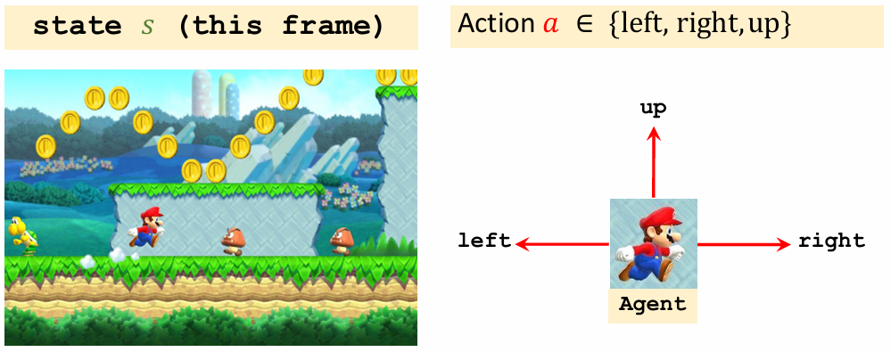

* 决策 policy  π

  根据环境决定 agent 的行动

  policy 定义为一个概率函数：$\pi(a|s) = \mathbb{P}(A = a | S = s)$ 

  观察状态 state S = s 之后，智能体根据决策以一定概率做出一个行动 action A。

* 奖励 reward R

  以超级玛丽游戏为例：

  * 选择一个硬币： R = 1
  * 胜利：R = 100000
  * 游戏结束：R = -100000
  * 无事发生：R = 0

* 状态转移 state transition

  旧状态，根据智能体做出的行动，发生状态的改变，得到新状态

  * 状态转移，一般认为是随机的，随机性来自环境。
  * 把状态转移用 $\Bbb{P}$ 函数表示：$p(s'|s, a) = \Bbb{P}(S' = s|S = s, A = a)$ 

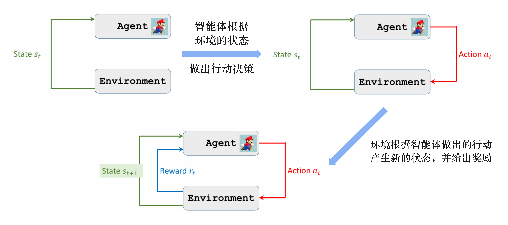

* 强化学习的随机性：

  * 给定状态 s，行动可以是随机性
  * 状态转移的随机性

* 使用 AI 玩游戏

  * 观察画面（状态 $s_1$）
  * 做出行动 action $a_1$
  * 观察新的画面（状态 $s_2$）和奖励 $r_1$ 
  * 做出行动 action $a_2$ 
  * ...

  最后得到游戏的轨迹(state, action, reward) trajectory:$s_1, a_1, r_1, s_2, a_2, r_2, ···, s_T, a_T, r_T$ 

* 返回 Return

  定义：回报Return(未来的累计奖励 cumulative future reward)

  $U_t = R_t + R_{t+1} + R_{t+2} + R_{t+3} + \cdots$ 

  定义：折扣回报 Discounted return (cumulative discounted future reward)

  折扣率 $\gamma$ ：

  $U_t = R_t + \gamma R_{t+1} + \gamma^2 R_{t+2} + \gamma^3 R_{t+3} + \cdots$ （常用的）

  在时间步 $t$ ，回报 $U_t$ 是随机的，随机性来源于 动作随机性，状态转移随机性。

  对任意 $i\geqslant t$，奖励 $R_i$ 依赖于 $S_i$ 和 $A_i$ 

   

* 行动价值函数 Action-Value Function $Q(s, a)$ 

  定义：决策 $\pi$ 的行动价值函数 Action-Value Function for policy $\pi$ 

  * $Q_{\pi}(s_t, a_t) = \Bbb{E}[U_t | S_t = s_t, A_t = a_t]$
  * 回报 $U_t$ 依赖于行动 $A_t, A_{t+1}, A_{t+2},...$ 和状态 $S_t, S_{t+1}, S_{t+2},...$ 

  * 由于 $U_t$ 是随机变量，不知道具体的 $U_t$ 是什么，但是可以对 $U_t$ 求期望，把里面的随机性都用积分得到期望。
  * 这个期望，是状态 $S_t$ 和 行动 $A_t$ 的函数。
    * 行动是随机的：$\Bbb{P}[A = a | S = s] = \pi(a|s)$ （决策函数 policy function）
    * 状态是随机的：$\Bbb{P}[S' = s' | S = s, A = a] = p(s'|s, a)$ （状态转移 State transition）
    * 上面两个是行动和状态的概率密度函数，变量为 $a_t$ 和 $s_t$，而其他的 $a_{t+T}, s_{t+T}$ 都可以通过概率密度函数利用积分公式除去，$a_t$ 和 $s_t$ 没有被积分积掉，而是被当作随机变量，期望依赖于这两个变量，根据这两个变量的数值得到相应的Q值。
  * 动作价值函数与决策 policy $\pi$ 有关。

* 定义：最优动作价值函数 Optimal action-value function
  $$
  Q^* (s_t, a_t) = \max_\pi Q_\pi(s_t, a_t)
  $$
   此时，由于是改变 $\pi$ 得到的最大化值，所以消除了变量 $\pi$ ，因为不管 $\pi$ 如何优化，都不会超过这个值。

  因此，动作价值函数的值就只与 $s_t$ 和 $a_t$ 有关

  又由于当前状态 $s_t$ 已知，所以动作价值函数 $Q^* (s_t, a_t)$ 可以用来判定行动 action 的价值。

  所以 智能体 可以根据 最优动作价值函数 得到期望最大的行动
  
* 定义：状态价值函数 Action Value Function
  $$
  V_\pi(s_t) = \Bbb{E}_A [Q_\pi (s_t, A)]
  $$
  $V_\pi$ 可以告诉我们当前状态好不好，这里的期望是关于随机变量 A （$A\sim \pi(\cdot|s_t)$）求的。

  如果动作是离散的：
  $$
  V_\pi(s_t) = \Bbb{E}_A [Q_\pi (s_t, A)] = \sum_a \pi(a|s_t) \cdot Q_\pi (s_t, a)
  $$
  如果动作是连续的：
  $$
  V_\pi(s_t) = \Bbb{E}_A [Q_\pi (s_t, A)] = \int \pi(a|s_t) \cdot Q_\pi (s_t, a) \mathrm{d} a
  $$

动作价值函数 Action-value function: 

* $Q_{\pi}(s_t, a_t) = \Bbb{E}[U_t | S_t = s_t, A_t = a_t]$
* 对于 策略 $\pi$ ，$Q_\pi(s, a)$ 评估在当前状态 s 下，做出动作 a 的价值

状态价值函数 State-value function：

* $V_\pi(s_t) = \Bbb{E}_A [Q_\pi (s_t, A)]$
* 是把 $Q_\pi(s, a)$ 对 $a$ 求期望以消除变量 $a$，所以状态价值函数与动作无关
* 对于给定 $\pi$，$V_\pi(s)$ 用来评估当前状态 $s$ 的好坏

如何利用 AI 控制智能体？

* 假设我们有一个好的策略 $\pi(a|s)$  【策略学习】
  * 观察状态 $s_t$
  * 随机采样：$a_t \sim \pi(\cdot, s_t)$ 
* 假设我们直到最优动作价值函数 $Q^*(s, a)$ 【价值学习】
  * 观察状态 $s_t$ 
  * 选择动作使得 最优动作价值函数最大：$a_t = \mathrm{argmax}_a Q^*(s_t, a)$ 

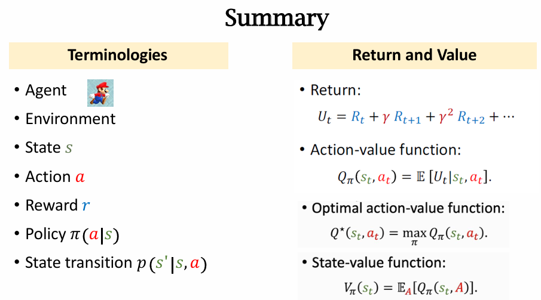

### DQN

就是利用神经网络近似 $Q^*(s, a)$ 函数

目标：赢得游戏（最大化最终的奖励）

问题：如果我们知道 $Q^*(s, a)$ ，什么是最好的动作？

显然，最好的动作是 $a^* = \mathrm{argmax}_a Q^*(s,a)$ 

挑战：我们不知道 $Q^*(s, a)$

* 解决：Deep Q Network(DQN)
* 使用 神经网络 $Q(s, a; w)$ 去近似 $Q^*(s, a)$ 

DQN 结构：

* 输入大小：可以是屏幕的大小（超级玛丽游戏画面）
* 输出大小：动作的维度

示例：

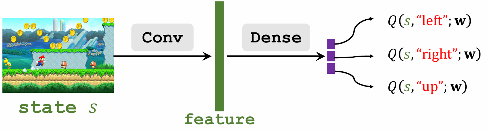

Temporal Difference learning（TD learning ）
$$
Q(s_t, a_t; \mathbf{w}) \approx r_t + \gamma\cdot Q(s_{t+1}, a_{t+1}; \mathbf{w})
$$

* $r_t$ 真实观测的值
* $Q(s_{t+1}, a_{t+1}; \mathbf{w})$ 是预测的值

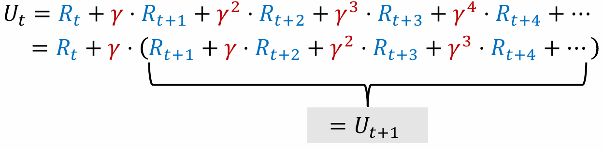

* $U_t = R_t + \gamma \cdot U_{t+1}$ 

 TD learning for DQN：

* DQN 的输出，$Q(s_{t}, a_{t}; \mathbf{w})$，是 $\Bbb{E}[U_t]$ 的估计

* DQN 的输出，$Q(s_{t+1}, a_{t+1}; \mathbf{w})$，是 $\Bbb{E}[U_{t+1}]$ 的估计

* 因此，$Q(s_{t}, a_{t}; \mathbf{w}) \approx \Bbb{E}[R_t + \gamma\cdot ]Q(s_{t+1}, a_{t+1}; \mathbf{w})$ 

  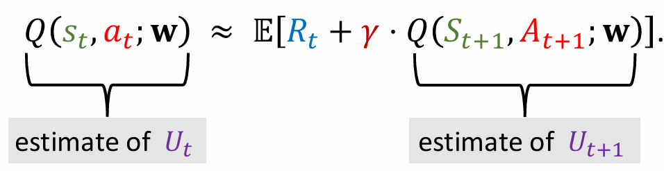

  $Q(s_{t}, a_{t}; \mathbf{w})$ 是 t-1 时刻，对 t 时刻的估计。

  到了 t 时刻，奖励 $r_t$ 被观测出来了。

  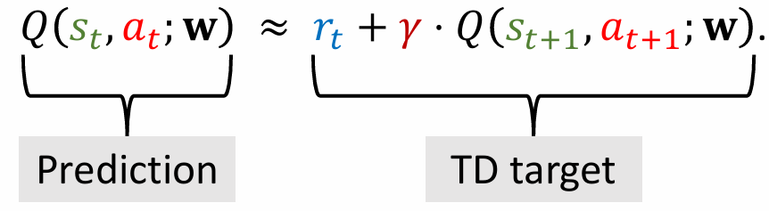

使用 TD learning 训练 DQN：

* 预测：$Q(s_{t}, a_{t}; \mathbf{w}_t)$ 

* TD target：
  $$
  \begin{aligned}
  y_t & = r_t + \gamma \cdot Q(s_{t+1}, a_{t+1}; \mathbf{w}_t) \\
  & = r_t + \gamma \cdot \max_\alpha Q(s_{t+1}, a; \mathbf{w}_t)
  \end{aligned}
  $$

* 损失函数 Loss：$L_t = \cfrac12[Q(s_{t}, a_{t}; \mathbf{w}) - y_t]^2$ 

* 梯度下降：$\mathbf{w}_{t+1} = \mathbf{w}_t - \alpha \cdot \cfrac{\partial L_t}{\partial \mathbf{w}} |_{\mathbf{w} = \mathbf{w}_c}$ 

折扣回报 Discounted Return
$$
\begin{aligned}
U_t &= R_t + \gamma R_{t+1} + \gamma^2 R_{t+2} + \gamma^3 R_{t+3} + \gamma^4 R_{t+4} + \cdots \\
 &=  R_t + \gamma (R_{t+1} + \gamma^1 R_{t+2} + \gamma^2 R_{t+3} + \gamma^3 R_{t+4} + \cdots) \\
 & = R_t + \gamma \cdot U_{t+1}
\end{aligned}
$$
计算 TD Target

* 假设 $R_t$ 依赖于 $(S_t, A_t, S_{t+1})$ 
  $$
  \begin{aligned}
  Q_\pi(s_t, a_t) &= \Bbb{E} [U_t | s_t, a_t]\\
  & = \Bbb{E} [R_t + \gamma \cdot U_{t+1}| s_t, a_t]\\
  & = \Bbb{E} [R_t | s_t, a_t] + \gamma \cdot \Bbb{E} [U_{t+1} | s_t, a_t]\\
  & = \Bbb{E} [R_t | s_t, a_t] + \gamma \cdot \Bbb{E} [Q_\pi(S_{t+1}, A_{t+1}) | s_t, a_t]\\
  \end{aligned}
  $$
  
* $Q_\pi(s_t, a_t) = \Bbb{E} [R_t + \gamma \cdot Q_\pi(S_{t+1}, A_{t+1}) ]$ ，对于所有的 $\pi$ 
* 期望很难计算，因此，选择近似。
  * $R_t$ 近似为 观测值 $r_t$ 
  * $Q_\pi(S_{t+1}, A_{t+1})$ 中，以观测值 $s_{t+1}, a_{t+1}$ 代替：$Q_\pi(s_{t+1}, a_{t+1})$ 
* 得到 TD Target：$y_t = r_t + \gamma \cdot Q_\pi(s_{t+1}, a_{t+1})$ 
* TD learning：希望 $Q_\pi(s_t, a_t)$ 不断接近 $y_t$ 
  *  $Q_\pi(s_t, a_t)$ 完全是估计值
  * $y_t$ 包含有一定的真实值，可以直接看成真实值让 $Q_\pi(s_t, a_t)$ 逼近

**总结**

* 定义：最优动作价值函数 Optimal action-value function 

  $Q^*(s_t, a_t) = \max_\pi \Bbb{E}[S_t = s_t, A_t = a_t]$ 

  实际上，我们并没有 $Q^*$ 函数，基于价值的强化学习就是训练近似一个 $Q^*$ 函数

* DQN：用一个神经网络 DQN 近似 $Q^*$ 函数

  * $Q(s, a; \mathbf{w})$ 是一个使用参数 $\mathbf{w}$ 的神经网络
  * 输入：观察到的状态 $s$ 
  * 输出：每个动作 $a\in \mathcal{A}$ 的分数 
  * 初始状态的 DQN 是随机， Agent 根据 DQN 的指导不断尝试，有时获得正奖励，有时获得负奖励。通过奖励来更新模型的参数，让模型越来越好。使用 TD learning 来利用奖励更新模型。

* 算法：TD learning 的一次迭代过程：

  1. 观察状态 $S_t = s_t$ 和 已经执行的动作 $A_t = a_t$
  2. 把 状态和动作作为DQN的输入，让 DQN 为动作打分，把输出作为 $q_t = Q(s_t, a_t; \mathbf{w}_t)$ 
  3. 用反向传播对 DQN 求导：$\mathbf{d}_t = \cfrac{\partial\ Q(s_t, a_t, \mathbf{w})}{\partial \ \mathbf{w}}\big|_{\mathbf{w}=\mathbf{w}_t}$ 
  4. 环境更新 新的状态$s_{t+1}$ 和 奖励 $r_t$ 
  5. 计算 TD target： $y_t = r_t + \gamma \cdot \max_a Q(s_{t+1}, a; \mathbf{w}_t)$ 
  6. 梯度下降，更新参数：$\mathbf{w}_{t+1} = \mathbf{w}_t - \alpha \cdot (q_t - y_t)\cdot \mathbf{d}_t$ 

> 强化学习问题形式化：单个智能体的强化学习问题可以被归结为 马尔可夫决策过程。马尔可夫决策过程是 顺序决策 的数学模型，用于在系统状态具有马尔可夫性质的环境中模拟智能体可实现的随机性策略与回报。
>
> 单智能体强化学习问题可以形式化定义为马尔可夫决策过程MDP六元组 $(S， A， R， T， P_0,\gamma)$ 。
>
> * S 表示状态空间
> * A 表示动作空间
> * R = R(s, a) 表示奖励函数
> * T: $S\times A \times S \rightarrow [0,1]$ 表示状态转移函数
> * $P_0$ 表示初始状态分布
> * $\gamma$ 是折扣因子

马尔可夫决策过程（MDP）

MDP(Markov Decision Process) 包括：

* 状态集合 S
* 动作集合 A
* P(s'|s,a) 指定了智能体处于状态 s 并执行动作 a 时转移到状态 s' 的概率
* R(s, a, s') 是智能体处于状态 s，执行动作 a 并最终进入状态 s' 时所获得的预期奖励。
* $0\leqslant \gamma \leqslant 1$ 是折扣因子

> 马尔可夫过程
>
> 具有马尔可夫性质的有限随机状态序列$S_1,S_2,...$ ：$P(S_{t+1}|S_t) = P(S_{t+1}|S_1, ..., S_t)$ 
> 当前状态只会由上一个状态过程。
>
> 转移概率：状态之间转化的概率
>
> 马尔可夫奖励过程 = 马尔可夫过程 + 奖励（随状态转移而产生）

强化学习的形式化：给定一个环境 $MDP(S, A, P, R, \gamma)$ ，其中 P 和 R 对于智能体是未知的，寻找一个最大化 $V_\pi(s_0)$ 和 策略 $\pi$ 

强化学习的主要方法：

* 基于值(Value-Based)
* 基于策略(Policy-Based)
* 演员-评论家(Actor-Critic)

Sarsa 算法

表格形式 Tabular Version

* 我们想要学习 $Q_\pi(s, a)$ 
* 假设 状态和动作的数量是有限的
* 画一张表格，学习每一项

* Sarsa(tabular version)
  * 观察一个 transition $(s_t, a_t, r_t, s_{t+1})$ 
  * 采样 $a_{t+1} \sim \pi(\cdot|s_{t+1})$ ，$\pi$ 是一个策略函数
  * TD target：$y_t = r_t + \gamma\cdot Q_\pi(s_{t+1}, a_{t+1})$ 
    *    $r_t$ 是真实得到的奖励，$Q_\pi(s_{t+1}, a_{t+1})$ 是预测值，是表格对应的值
  * TD error：$\delta_t = Q_\pi(s_t, a_t) - \gamma_t$ 
  * 更新 $Q_\pi(s_t, a_t) \leftarrow Q_\pi(s_t, a_t) - \alpha\cdot \delta_t$ （就是表格中 对应的值）
* Sara 的名字：
  * 使用 $(s_t, a_t, r_t, s_{t+1}, a_{t+1})$ 更新 $Q_\pi$ 
  * State-Action_Reward-State-Action

神经网络版本 Neural Network Version

* 利用 **价值网络** $q(s, a; \mathbf{w})$ 近似 $Q_\pi(s, a)$ 

  价值网络$q$ 和 $Q_\pi$ 函数都和 策略 $\pi$ 有关

* 价值网路 $q(s, a; \mathbf{w})$ ，输入是状态 $s$ ，输出所有动作的价值。

* TD target: $y_t = r_t + \gamma \cdot q(s_{t+1}, a_{t+1}; \mathbf{w})$ 

* TD error：$\delta_t = q(s_t, a_t; \mathbf{w}) - y_t$ 

* Loss：$\cfrac{\delta_t^2}{2}$

* 对损失函数关于 $\mathbf{w}$ 求梯度，Gradient：$\cfrac{\partial \delta_t^2 /2}{\partial \mathbf{w}} = \delta_t \cdot \cfrac{\partial q(s_t, a_t; \mathbf{w})}{\partial \mathbf{w}}$ 

* 做梯度下降更新 $\mathbf{w}$ Gradient descent：$\mathbf{w} = \mathbf{w} - \alpha\cdot  \delta_t \cdot \cfrac{\partial q(s_t, a_t; \mathbf{w})}{\partial \mathbf{w}}$ 

总结：

* 学习 动作价值函数 $Q_\pi$ 
* 表格形式 Tabular version（直接学习 $Q_\pi$）
  * 有限状态和动作
  * 画一个表格，使用 sarsa 更新表格
* 价值网路版本 Value Network version（函数近似）
  * 使用 **价值网络** $q(s, a; \mathbf{w})$ 近似 $Q_\pi$ 函数
  * 使用 Sarsa 更新参数 $\mathbf{w}$ 
  * 应用 actor-critic method

Q learning

Q-learning 用来训练最优动作价值函数 optimal action-value function $Q^*(s, a)$ 

* TD target：$y_t = r_t + \gamma \cdot \max_a Q^*(s_{t+1}, a)$
* 使用 Q-learning  更新 DQN

已证明：对于所有的 $\pi$，$Q_\pi(s_t, a_t) = \Bbb{E}[R_t + \gamma\cdot Q_\pi(S_{t+1}, A_{t+1})]$ 

* 假设 $\pi$ 是最优策略 $\pi^*$ ，则：
  $$
  Q_{\pi^*}(s_t, a_t) = \Bbb{E}[R_t + \gamma\cdot Q_{\pi^*}(S_{t+1}, A_{t+1})]
  $$

* $Q_{\pi^*}$ 和 $Q^*$ 都是 最优动作价值函数 optimal action-value function.

$$
Q^*(s_t, a_t) = \Bbb{E}[R_t + \gamma\cdot Q^*(S_{t+1}, A_{t+1})]
$$

* 动作 $A_{t+1}$ 通过
  $$
  A_{t+1} = \mathrm{argmax}_a Q^*(S_{t+1}, a)
  $$
  计算得到，即给定状态 $S_{t+1}$，选择最优动作价值函数值最高的动作 $A_{t+1}$ 

* 因此：$Q^*(S_{t+1}, A_{t+1}) = \max_a Q^*(S_{t+1}, a)$ ，因为 $A_{t+1}$ 是最优动作，所以可以最大化 $Q^*$ 函数。

$$
Q^*(s_t, a_t) = \Bbb{E}[R_t + \gamma\cdot \max_a Q^*(S_{t+1}, a)]
$$

由于期望很难计算，所以直接使用观测值 $r_t$ 代替 $R_t$ ,$s_{t+1}$ 代替 $S_{t+1}$ 

于是得到期望的蒙特卡洛近似：
$$
\Bbb{E}[R_t + \gamma\cdot \max_a Q^*(S_{t+1}, a)] \approx r_t + \gamma\cdot \max_a Q^*(s_{t+1}, a) \rightarrow \text{TD target } y_t
$$

* Q-learning(tabular version)

  * 观察一个 transition $(s_t, a_t, r_t, s_{t+1})$ 
  * TD target：$y_t = r_t + \gamma\cdot \max_a Q^*(s_{t+1}, a)$ 
  * TD error：$\delta_t = Q^*(s_t, a_t) - y_t$ 
  * 更新：$ Q^*(s_t, a_t) \leftarrow  Q^*(s_t, a_t) - \alpha\cdot \delta_t$ 

* Q-learning(DQN version)

  * 使用 DQN，$Q(s, a; \mathbf{w})$ 

    神经网络的输入是 状态 s，输出是对所有动作的打分

  * DQN 可以控制 agent ：$a_t = \mathrm{argmax}_a Q(s_t, a; \mathbf{w})$ 

    让 agent 执行 最优动作 $a_t$ 

  * 利用收集到的 transitions 跟新 DQN

  * 观察一个 transition $(s_t, a_t, r_t, s_{t+1})$ 
  * TD target：$y_t = r_t + \gamma\cdot \max_a Q(s_{t+1}, a; \mathbf{w})$ 
  * TD error：$\delta_t = Q^*(s_t, a_t; \mathbf{w}) - y_t$ 
  * 利用梯度下降更新 $\mathbf{w}$ ：$\mathbf{w} \leftarrow \mathbf{w} - \alpha \cdot \delta_t \cdot \cfrac{\partial Q(s_t, a_t; \mathbf{w})}{\partial \mathbf{w}}$ 

### 基于值的方法

给定一个策略 $\pi$ ：

* $Q_\pi(s, a)$
* $V_\pi(s)$ 

最优策略的值：

* $Q^*(s, a)$ 

* $V^*(s)$ ：在状态 s 下遵循最优策略的期望值

* $Q^*$ 和 $V^*$ ：

  $Q^*(s, a) = \sum_{s'} P(s'|a, s)(R(s, a, s') +\gamma V^*(s'))$ 

  $V^*(s) = \max_a Q^*(s, a)$ 

  $\pi^*(s) = \mathrm{argmax}_a Q^*(s, a)$ 

**贝尔曼方程**（Bellman equations）
$$
V^*(s) = \max_a \sum_{s'} P(s' | a, s) (R(s, a, s') + \gamma V^* (s'))\\
Q^*(s, a) = \sum_{s'} P(s'|a, s)(R(s, a, s') + \gamma \max_{a'} Q^*(s', a')))
$$
我的想法：可以先求 $Q^*(s, a)$ ，然后利用 $V^*(s) = \max_a Q^*(s, a)$ 求得 $V^*(s)$ 

**值迭代**

* 如果有 n 个状态，那么就会有 n 个贝尔曼方程，每个状态对应一个方程
* 线性代数技术 可以快速求解线性方程。然而这些方程不是非线性的，因为 max 操作符不是线性操作符。可以使用一种迭代的方法。

* 我们可以从任意的初始值开始计算效用。

* 令 $V_i(s)$ 表示第 i 次迭代时 状态 $s$ 的值

* 使用贝尔曼更新：
  $$
  V^*(s) = \max_a \sum_{s'} P(s' | a, s) (R(s, a, s') + \gamma V^* (s'))
  $$
  如果我们无限次使用贝尔曼更新，我们保证会达到一个均衡点，在这种情况下，最终的效用值必须是贝尔曼方程的解。

**异步值迭代**

* 不要对所有状态进行扫描，而是逐个更新每个状态的值函数。
* 如果在极限情况下，每个状态和动作都会被无限次访问，则会收敛到最优值函数
* 可以存储 V[s] 或 Q[s, a]
* 无限重复以下步骤：
  * 选择状态 s
  * $V[s] \gets \max_a\sum_{s'} P(s'|s, a) (R(s, a, s') + \gamma V[s'])$ 
* 无限重复以下步骤：
  * 选择状态 s，动作 a
  * $Q[s, a] \gets \sum_{s'} P(s'|s, a) (R(s, a, s') + \gamma \max_{a'} Q[s', a'])$ 
* 异步值迭代比值迭代收敛更快。

经验异步值迭代：$Q[s, a] \gets r + \gamma \max_{a'} Q[s', a']$ 

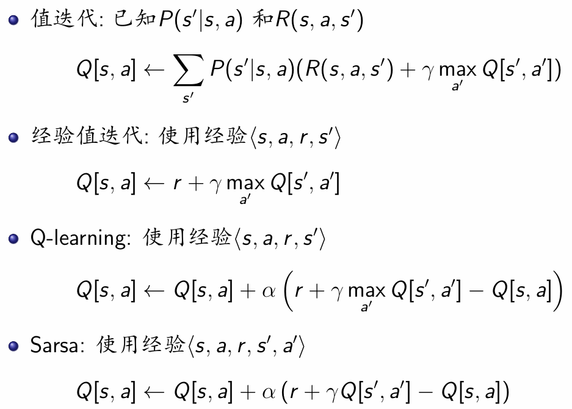
