# 第一章绪论

> 人工智能的定义、概况； 
> 人工智能主要学派及主要观点。

## 人工智能的定义

* 人工智能（AI）是研究理解和模拟人类智能、智能行为及其规律的一门学科。
* 主要任务：建立智能信息处理理论，进而设计可以展现某些近似人类智能行为的计算系统。


## 主要学派

1. **逻辑学派**（符号主义方法）
   * 认知基元是符号，智能行为通过符号操作来实现，以 Robinson 提出的归结原理为基础，以 LISP 和 Prolog 语言为代表。
   * 着重问题求解中启发式搜索和推理过程，在逻辑思维的模拟方面取得成功，如自动定理证明和专家系统。
   * **人工智能源于数理逻辑**
   * 数理逻辑的形式化方法和计算机科学不谋而合。
   * 正是数理逻辑对计算的追根寻源，导致了第一个计算的数学模型 图灵机 的诞生，它被公认为现代数字计算机的祖先。
2. **仿生学派**（连接主义方法）
   * 人的思维基元是神经元，把智能理解为相互连结的神经元竞争与协作的结果，以人工神经网络为代表。
   * 其中，反向传播网络模型（BP神经网络）和 Hopfield 网络模型 更为突出
   * 着重结构模拟，研究神经元特征、神经元网络拓扑，学习规则、网络的非线性动力学性质和自适应的协同行为。
   * 认为 **人工智能源于仿生学**，特别是对人脑的研究。
   * MP 模型，开创了用电子装置模仿人脑结构和功能的新途径。它从神经元开始进而研究神经网络模型和脑模型，开辟了人工智能的又一发展道路。
3. **控制论学派**（行为主义方法）
   * 认为 **人工智能源于控制论**。控制论把神经系统的工作原理与信息理论、控制理论、逻辑以及计算机联系起来。
   * 反馈是控制论的基石，没有反馈就没有智能。通过目标与实际行为之间的误差来消除此误差的控制策略。
   * 控制论导致机器人研究，机器人是 **“感知-行为”模式**，没有知识的智能；强调系统与环境的交互，从运行环境中获取信息，通过自己的动作对环境施加影响。
   * 代表工作：强化学习，演化算法，Brooks 的六足行走机器人

# 第二章 知识表示和推理

> 命题逻辑语法、语义；
> 谓词逻辑语法、语义；
> 谓词推理规则（等价式、永真蕴含式）以及应用；
> 命题及谓词逻辑归结推理（子句、子句集、置换与合一、答案提取）

* 命题——具有真假意义的陈述句。

* 命题有两种类型：

  1. 原子命题
  2. 复合命题——由联结词、标点符号和原子命题等复合构成的命题。

  所有这些命题都应具有确定的真值。

* 当命题变元P用一个特定的命题取代时，P才能确定真值，这时也称为对P进行指派。

* 当命题变元表示原子命题时，该变元称为原子变元。

## 命题逻辑

### 语法、语义

命题逻辑的符号

1. 命题常元：True(T) 和 False(F)
2. 命题符号：P、Q、R 等；
3. 联结词：¬（否定）；∧（合取）；∨（析取）； →（蕴含）；↔（等价）。
4. 括号：()

**语义**

复合命题的意义是命题组成成份的函数。
联结词的语义可以定义如下：

* ¬P为真，当且仅当P为假。
* P∧Q为真，当且仅当P和Q都为真。
* P∨Q为真，当且仅当P为真，或者Q为真。
* P→Q为真，当且仅当P为假，或者Q为真。
* P↔Q为真，当且仅当P→Q为真，并且Q→P为真。

* 公式A称为永真式或重言式(tautology)，如果对任意指派α，α均弄真A，即α(A)=T。公式A称为可满足的(satisfiable)，如果存在指派α使α(A)=T，否则称A为不可满足的(unsatisfiable)，或永假式。
* 设A为含有命题变元p的永真式，那么将A中p的所有出现均代换为命题公式B，所得公式(称为A的代入实例)仍为永真式。

**合取范式**：命题公式 B 称为公式 A 的 合取范式，如果 B ↔ A，且 B 呈如下形式：$C_1∧C_1∧\cdots ∧ C_m$ ，其中 $C_i$ (i=1,2,...,m) 形如 $L_1∨L_2∨\cdots∨L_n$ ，$L_j$ 为原子公式或原子公式的否定，称 $L_j$ 为文字。

**析取范式**：命题公式 B 称为公式 A 的 合取范式，如果 B ↔ A，且 B 呈如下形式：$C_1∨C_1∨\cdots ∨ C_m$ ，其中 $C_i$ (i=1,2,...,m) 形如 $L_1∧L_2∧\cdots∧L_n$ ，$L_j$ 为原子公式或原子公式的否定，称 $L_j$​ 为文字。

任一命题公式φ有其对应的合取 (析取)范式。

**主合取（主析取）范式**：命题公式B称为公式A的 主合取(或主析取)范式，如果：
(1) B是A的合取(或析取)范式。
(2) B中每一子句均有A中命题变元的全部出 现，且仅出现一次。

### 命题演算形式系统

三条公理模式：

A1：A →  (B → A)
A2：(A → (B → C)) **→** ((A → B) → (A → C))
A3：(¬ A → ¬ B) → (B → A)

一条推理规则（分离规则）：$r_{mp}$ ：A, A → B   =>  B

**定义** 称下列公式序列为公式A在PC中的一个证明(proof)：$A_1, A_2, \cdots, A_m( = A)$ ，其中 $A_i$（i=1,2,...,m）或者是 PC 的公理，或者是 $A_j$（j<i） ，或者是由 $A_j$，$A_k$ （j, k < i） 使用分离规则所导出，而 $A_m$ 即公式 $A$​ 。

**定义** 称 A 为 PC 中的定理，记为 $├_{PC}$ A ，如果 公式 A 在 PC 中有一个证明。

**定义**  设 $Γ$ 为一公式集，称以下公式序列为公式A的、以 $Γ$ 为前提的演绎：$A_1, A_2, \cdots, A_m( = A)$ ，其中 $A_i$（i=1,2,...,m）或者是 PC 的公理，或者是 $Γ$ 的成员，或者是由 $A_j$，$A_k$ （j, k < i） 使用分离规则所导出，而 $A_m$ 即公式 $A$ 。

**定义** 称A为前提Γ的演绎结果，记为 $Γ├_{PC}$  A，如果 公式A 有以$Γ$为前提 的演绎。
若 $Γ$={B}，则用B$├_{PC}$  A表示 $Γ├_{PC}$ A。若B$├_{PC}$  A，A$├_{PC}$​ B则记为A├┤B。

(**演绎定理**) 对PC中任意公式集 $Γ$ 和公式A，B， $Γ$ ∪{A}$├_{PC}$ B 当且仅当 $Γ$ $├_{PC}$ A→B


## 谓词逻辑

* 逻辑符号（固定含义和用法）：
  * 标点符号：`(`、`)`
  * 连接符和量词：=，¬，∧，∨，∀，∃
  * 变量：$x, x_1, x_2, \cdots, x', x'', \cdots, y, \cdots, z, \cdots$
* 非逻辑符号（和 领域domain 相关的含义和用法）：
  * 谓词符号
    * arity：参数的数量
  * 函数符号


**项和公式**

* 每个变量是一个项
* 如果 $t_1, \cdots, t_n$ 是项，$f$ 是一个n元函数，则 $f(t_1, \cdots, t_n)$ 是一个项
* 如果 $t_1, \cdots, t_n$ 是项，$P$ 是一个n元谓词符号，则 $P(t_1, \cdots, t_n)$ 是一个原子公式
* 如果 $t_1$ 和 $t_2$ 是项，则 $(t_1 = t_2)$ 是一个原子公式
* 如果 $\alpha$ 和 $\beta$ 是公式，$v$ 是变量，则 $¬ \alpha, (\alpha \land \beta), (\alpha \lor \beta), ∃ v.\alpha, ∀v.\alpha$ 是公式


**谓词逻辑的应用**

【例】“某些患者喜欢所有医生。没有患者喜欢庸医。所以没有医生是庸医。”

【解】P(x)表示“x是患者”， D(x)表示“x是医生”， Q(x)表示“x是庸医”， L(x,y)表示“x喜欢y”。则有：F1: (∃x)(P(x) ∧ ∀y(D(y) →L(x, y))), F2: (∀ x)(P(x) → (∀y)(Q(y) → ¬L(x, y)))，G: (∀x)(D(x)→¬Q(x))


**等价关系**

* $(\alpha \rightarrow \beta)$ 和 $(¬ \alpha ∨ \beta)$ 
* $(\alpha \leftrightarrow \beta)$ 和 $(\alpha \to \beta) \land (\beta \to \alpha)$  


**变量范围**

* 自由变量和约束变量
* 一个句子：没有变量的公式
* 替换：$\alpha[v/t]$ 表示，在公式 $\alpha$ 中，$v$ 的所有自由出现都替换称 项$t$ 
* 通常，$\alpha[v_1/t_1, \cdots, v_n/t_n]$ 


**解释**

一个解释是 一个二元组 $M = \langle D, I \rangle$ 

* $D$ 是 域，可以是任何非空集

* $I$ 是 谓词和函数符号集合的映射

* 如果 $P$ 是一个 n 元谓词，$I(P)$ 是 $D$ 中的一个 n 元关系，即 $I(P) ⊆ D^n$​ 

  如果 $p$ 是一个 0 元谓词符号，即命题符号，那么 $I(p) ∈ \{\text{true}, \text{false}\}$。

* 如果 $f$ 是一个n元的函数符号，那么 $I(f)$ 是 $D$ 上的一个 n 元函数，即 $I(f) : D^n → D$。

  如果 $c$ 是一个 0 元函数符号，即常量符号，那么 $I(c) ∈ D$。


**项的指派**

* 项 可以指派为 定义域中的元素
* 一个变量赋值 $\mu$ 是从 变量集合 到 域$D$​ 中的映射
* $\| v\|_{M,\mu} = \mu(v)$​ 
* $\| f(t_1, \cdots, t_n)\|_{M, \mu} = I(f)(\|t_1\|_{M, \mu},\cdots, \|t_n\|_{M, \mu})$ 

【例】

```
D={Ann,Bob,Dan,Jack}, I(ann) = Ann
I(spouse) = {(Ann,Bob),(Bob,Ann)},
I(father) = {(Ann,Jack),(Bob,Dan)},
则有 ‖father(spouse(ann))‖= Dan
```


**满足：原子公式**

$M, \mu \models \alpha$ ，称为 “$M, \mu$ 满足 $\alpha$ ”

*  $M, \mu \models P(t_1, ..., t_n)$ 当且仅当 $\langle  \| t_1\|_{M, \mu}, ..., \|t_n\|_{M, \mu} \rangle \in I(P)$ 
*  $M, \mu \models (t_1=t_2)$ 当且仅当 $ \| t_1\|_{M, \mu}=\|t_2\|_{M, \mu}$ 

**满足：命题联结词**

* $M, \mu \models \lnot \alpha$ 当且仅当 $M, \mu \not\models \alpha$ 
* $M, \mu \models (\alpha \land \beta)$ 当且仅当 $M, \mu \models \alpha$ 同时 $M, \mu \models \beta$ 
* $M, \mu \models (\alpha \lor \beta)$ 当且仅当 $M, \mu \models \alpha$ 或者 $M, \mu \models \beta$ 

**满足：量词**

$\mu[v\mapsto d]$ 记为一个变量赋值 $\mu$ ，把 v 映射到 d

* $M, \mu \models ∃ v.\alpha$ 当且仅当 对于一些 $d \in D$，$M, \mu[v \mapsto d] \models \alpha$ 
* $M, \mu \models \forall v.\alpha$ 当且仅当 对于所有 $d \in D$，$M, \mu[v \mapsto d] \models \alpha$ 

设 $\alpha$ 是一个句子。那么 $M, \mu \models \alpha$ 是否成立与 $\mu$ 无关。 此时，我们简单地写作 $M \models \alpha$。

**可满足性**

* 假设 $S$ 是一个句子的集合
* 如果对于所有的 $\alpha \in S, M\models \alpha$，则有 $M \models S$ ，称 M 满足 S。
* 如果 $M \models S$ ，我们称 $M$ 是 $S$ 的一个模型
* 如果存在 $M$ 使得 $M \models S$ ，则 $S$​ 是可满足的

**逻辑蕴含**

* $S\models \alpha$ 当前仅当 对所有的 $M$ ，如果 $M\models S$ 则 $M\models a$​ 
* $S\models \alpha$​ 称为：S 蕴含 α 或 α 是 S 的逻辑推论。
* 一个特殊的例子：$\varnothing \models \alpha$，简写 $\models \alpha$，称 $\alpha$ 是有效的
* 注意到 $\{\alpha_1, ..., \alpha_n\} \models \alpha$ 当且仅当 $\alpha_1 \land ... \land \alpha_n \to \alpha$ 是有效的 当且仅当 $\alpha_1 \land ... \land \alpha_n \to \alpha \land \lnot \alpha$ 是不可满足的。
* $\alpha \iff \beta$ ($\alpha$ 和 $\beta$ 逻辑等价) 如果对于所有的 $M$，$M\models \alpha$ 当且仅当 $M\models \beta$ 


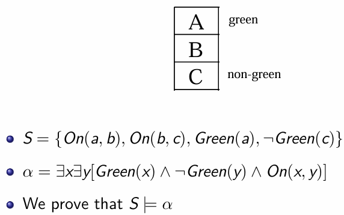 


## 自然演绎推理

* 自然演绎推理：从一组已知为真的事实出发，运用经典逻辑的推理规则推出结论的过程。

推理规则：

* 假言推理：$P, P\to Q \implies Q$ 
* 取拒式推理：$P\to Q, \lnot Q \implies \lnot P$ 
* 化简规则：$P\land Q \implies P, P\land Q \implies Q$ 
* 附加规则：$P \implies P\lor Q, Q\implies P\lor Q$ 
* 析取三段论：$\lnot P, P\lor Q \implies Q$ 
* 假言三段论：$P\to Q, Q \to R \implies P\to R$ 
* 二难推理：$P \lor Q, P\to R, Q\to R \implies R$ 
* 全程特化：$(\forall x) P(x) \implies P(y)$ 
* 存在特化：$(∃ x)P(x) \implies P(c)$ ，c 为个体域中某一个可以使 P(c) 为真的个体


**谓词逻辑的应用**

【例】 每个去临潼游览的人或者参观秦始皇兵马俑，或者参观华清池，或者洗温泉澡。凡去临潼游览的人，如果爬骊山就不能参观秦始皇兵马俑，有的游览者既不参观华清池，也不洗温泉澡。因而有的游览者不爬骊山。

【解】定义G（x）表示“x去临潼游览”；
A（x）表示“x参观秦始皇兵马俑”；
B（x）表示“x参观华清池”；
C（x）表示“x洗温泉澡”；
D（x）表示“x爬骊山”。
前提：
(∀x)(G(x) → A(x) ∨ B(x) ∨ C(x))   (1)
(∀x)(G(x) → (D(x) → ¬A(x)))        (2)
(∃x)(G(x) ∧ ¬B(x) ∧ ¬C(x))            (3)
结论：(∃x)(G(x) ∧ ¬D(x))
推导：
(4) G(a) ∧ ¬B(a) ∧ ¬C(a)                 由(3)
(5) G(a)                                              由(4)
(6) ¬B(a) ∧ ¬C(a)                              由(4)
(7) G(a) → A(a) ∨ B(a) ∨ C(a)        由(1)
(8) A(a) ∨ B(a) ∨ C(a)                      由(5), (7)
(9) A(a) ∨ ¬(¬B(a) ∧ ¬C(a))             由(8)
(10) A(a)                                             由(6), (9)
(11) G(a) → (D(a) → ¬A(a))            由(2)
(12) D(a) → ¬A(a)                             由(5), (11)
(13) ¬D(a)                                           由(10), (12)
(14) G(a) ∧ ¬D(a)                              由(5), (13)
(15) (∃x)(G(x) ∧ ¬D(x))                    由(14)

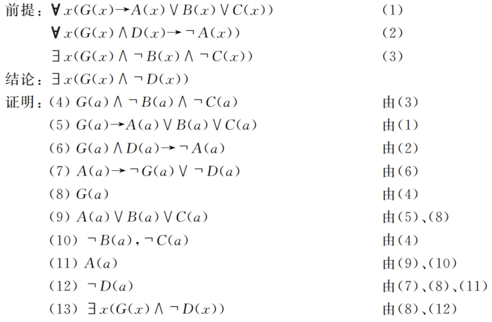 


## 基于归结的推理过程

我们需要一个机制去判断 $KB \models \alpha$ 是否成立，这个机制就是 推理过程。

常见的推理规则：

* 假言推理：$\phi \to \psi, \phi \models \psi$
* 假言三段论：$\phi \to \psi, \psi \to \eta \models \phi \to \eta$ 
* 析取三段论：$\phi \lor \psi, \lnot \phi \models \psi$ 
* 全称实例化：$\forall x P(x) \models P(c)$ 
* 全程一般化：$P(x) \models ∃ x P(x)$ 

**基于归结的推理规则**

* 归结是一种推理规则
* 基于归结的推理过程：反演

**子句形式**

* 一个 文字 是一个原子公式或者它的否定，例如，p, ¬p

* 一个 子句 是文字的析取，记为 文字的集合：

  例如，p ∨ ¬r ∨ s，记为 (p, ¬ r, s)

* 一个特殊情况：空子句()，代表 False

* 一个公式 是 子句的合取，写为 子句集合的形式

**推理的归结规则**

* 两个子句集 $\{p\} \cup c_1$ 和 $\{¬p\}\cup c_2$ 

  推导出子句 $c_1\cup c_2$ 

* $c_1\cup c_2$ 被称为相对于原子 p 的输入子句的归结式。

**定理** 如果 $S├ c$ ，则 $S\models c$ 。
反之不一定成立。

**定理** $S\vdash()$ 当且仅当 $S\models ()$ 当且仅当 $S$ 是不可满足的的。

$KB\models \alpha$ 当且仅当 $KB ∧ ¬\alpha$ 是不可满足的。因此如果要判断 $KB\models \alpha$ 是否成立，需要：

* 将 $KB$ 和 $\lnot \alpha$ 转化为 子句形式 之后得到 $S$ 
* 检查 $S \vdash ()$ 是否成立


**例题1** 

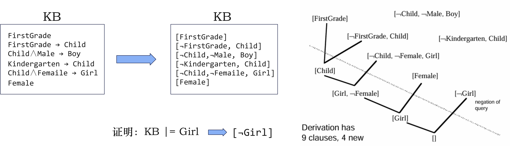


## 谓词逻辑的归结原理和过程

在谓词逻辑中应用归结法时，首先需要：

1. 将所有谓词公式（包括知识库 KB 和查询 $\alpha$ ）化为子句集
2. 通过合一，对含有变量的子句进行归结

① ∀x(∀y P(x, y) → ¬∀y(Q(x, y) → R(x, y)))

谓词公式化为子句集的步骤：

1. **消去蕴含和等价符号**（→ 和↔ 联结词）

   P → Q ⇔ ¬P ∨ Q，P ↔ Q ⇔ (P ∧ Q) ∨ (¬P ∧ ¬Q)

   ① ⇔ ∀x(¬∀y P(x,y) ∨ ¬∀y(¬Q(x,y) ∨ R(x,y))) ②

2. **内移否定符号** ¬，将其移到紧靠谓词的位置上。

   双重否定率：¬(¬P) ⇔ P
   德摩根律：¬(P ∧ Q) ⇔ ¬P ∨ ¬Q，¬(P ∨ Q) ⇔ ¬P ∧ ¬Q
   量词转换率：¬∃x P ⇔ ∀x ¬P，¬∀x P ⇔ ∃x ¬P

   ② ⇔ ∀x(∃y ¬P(x,y) ∨ ∃y (Q(x,y) ∧ ¬R(x,y))) ③

3. **量词标准化**。对变量做必要的换名，每个量词只约束一个唯一的变量名。

   ∃x P(x) ≡ ∃y P(y)，∀x P(x) ≡ ∀y P(y)

   ③ ⇔  ∀x(∃y ¬P(x,y) ∨ ∃z (Q(x,z) ∧ ¬R(x,z))) ④

4. **消去存在量词**（`Skolemize`）。对于待消去的存在量词，若不在任何全称量词辖域之内，则用 `Skolem` 常量代替公式中存在量词约束的变量；若受全称量词约束，则要用 `Skolem` 函数代替存在量词约束的变量，然后消去存在量词。

   `Skolemize` ：

   对于一般情况：
   $$
   \forall x_1 \forall x_2 \cdots\forall x_n \exist y P(x_1, x_2, \cdots,x_n, y)
   $$
   存在量词 $y$ 的 Skolem 函数为 $y = f(x_1, x_2, \cdots, x_n)$ 

   Skolem 化，用 Skolem 函数代替存在量词约束的变量的过程。

   ④ y = f(x), z = g(x) ⇔ ∀x(¬P(x,f(x)) ∨ (Q(x,g(x)) ∧ ¬R(x,g(x)))) ⑤

5. **化为前束式** = (前缀){母式}。其中，前缀为全称量词串，母式为不含量词的谓词公式。

6. **把母式化成合取范式**。反复使用结合律和分配律，将母式表达成 合取范式的 Skolem 标准形。

   Skolem 标准形：$\forall x_1\forall x_2\cdots\forall x_n M$ 
   M：子句的合取式，称为 Skolem 标准形的母式。
   $$
   P∧ (Q∨ R) \iff (P∧Q)∨ (P∧R)\\
   P∨ (Q∧R) \iff (P∨ Q)∧(P∨ R)\\
   $$
   ⑤ ⇔ ∀x((¬P(x,f(x)) ∨ Q(x,g(x))) ∧( ¬P(x,f(x)) ∨ ¬R(x,g(x)))) ⑥

7. **略去全称量词**。由于母式的变量均受全称量词的约束，因此可以省略掉全称量词。

   ⑥ ⇔ (¬P(x,f(x)) ∨ Q(x,g(x))) ∧( ¬P(x,f(x)) ∨ ¬R(x,g(x)))

8. **把母式用子句集表示**。把母式中的每一个合取元称为一个子句，省去合取联结词，这样就把母式写成集合的形式表示，每一个元素就是一个子句。

   ⑦ ⇔ {(¬P(x, f(x)), Q(x, g(x))), (¬P(x, f(x)), ¬R(x, g(x)))}

9. **子句变量标准化**。**对某些变量重新命名，使任意两个子句不会有相同的变量出现**。这是因为在使用子句集进行证明推理的过程中，有时需要例化某一个全称量词约束的变量，该步骤可以使公式尽量保持其一般化形式，增加了应用过程的灵活性。

【例】将下列谓词公式化为不含存在量词的前束型：∃x∀y(∀z (P(z) ∧ ¬Q(x, z)) → R(x, y, f(a)))

∃x∀y(∀z (P(z) ∧ ¬Q(x, z)) → R(x, y, f(a)))
⇔ ∀y(∀z (P(z) ∧ ¬Q(b, z)) → R(b, y, f(a)))
⇔ ∀y(¬∀z (P(z) ∧ ¬Q(b, z)) ∨ R(b, y, f(a)))
⇔ ∀y(∃z (¬P(z) ∨ Q(b, z)) ∨ R(b, y, f(a)))
⇔ ∀y(¬P(g(y)) ∨ Q(b, g(y)) ∨ R(b, y, f(a)))

【例】将下列谓词公式化为子句集

∀x{[¬P(x) ∨ ¬Q(x)] → ∃y[S(x, y) ∧ Q(x)]} ∧ ∀x[P(x) ∨ B(x)]

【解】
(1)消去蕴含和等价符号：∀x{¬[¬P(x) ∨ ¬Q(x)] ∨ ∃y[S(x, y) ∧ Q(x)]} ∧ ∀x[P(x) ∨ B(x)]
(2)内移否定符号：∀x{[P(x) ∧ Q(x)] ∨ ∃y[S(x, y) ∧ Q(x)]} ∧ ∀x[P(x) ∨ B(x)]
(3)量词标准化：∀x{[P(x) ∧ Q(x)] ∨ ∃y[S(x, y) ∧ Q(x)]} ∧ ∀z[P(z) ∨ B(z)]
(4)消去存在量词：∀x{[P(x) ∧ Q(x)] ∨ [S(x, f(x)) ∧ Q(x)]} ∧ ∀z[P(z) ∨ B(z)]
(5)化为前束式：∀x∀z{[[P(x) ∧ Q(x)] ∨ [S(x, f(x)) ∧ Q(x)]]∧ [P(z) ∨ B(z)]} 
(6)把母式化成合取范式：∀x∀z{ [P(x) ∨ S(x, f(x))] ∧ Q(x) ∧ [P(z) ∨ B(z)]} 
(7)略去全称量词：[P(x) ∨ S(x, f(x))] ∧ Q(x) ∧ [P(z) ∨ B(z)]
(8)把母式用子句集表示：{(P(x), S(x, f(x))), Q(x), (P(z), B(z))}
(9)子句变量标准化：{Q(x), (P(y), S(y, f(y))), (P(z), B(z))}


**归结过程**

* 若 S 中两个子句间有相同互补文字的谓词，但它们的项不同，则必须找出对应的不一致项；
* 进行变量置换，使得它们对应项一致
* 求归结式能否推导出空子句


合一（Unify）：在谓词逻辑的归结过程中，寻找项之间合适的变量置换使表达式一致，这个过程称为合一。

* 一个表达式的项可以是常量符号、变量符号 或 函数式。

* 表达式的例(instance) 是指在表达式中用置换项置换变量后得到的一个特定的表达式。

* 用 $\sigma = \{v_1/t_1, v_2/t_2, ..., v_n/t_n\}$ 来表示任一置换。$v_i/t_i$ 表示表达式中的变量 $v_i$ 以项 $t_i$ 来替换，且不允许 $v_i$ 用与 $v_i$ 有关的项 $t_i$ （但是 $t_i$ 中可以包含其他变量）作替换。

  可记为 $\sigma = \{v_1=t_1, v_2=t_2, ..., v_n=t_n\}$ 

* 用 $\sigma$ 对表达式 $E$ 作置换后记为 $E\sigma$ 

* 例如：P(x, g(y, z)){x = y, y = f(a)} ⇒ P(y, g(f(a), z))

* 注意：置换是同时进行的，而不是先后进行的。

* 可以对表达式多次置换，如果用 $\theta$ 和 $\sigma$ 依次对 $E$ 进行置换，记为 ($E\theta$)$\sigma$ 。其结果等价于先将这两个置换合成（组合）为一个置换，即 $\theta \sigma$ ，在用合成置换对 $E$ 进行置换，即 $E(\theta\sigma)$ 


$\theta = \{x_1=s_1, x_2=s_2, ..., x_m=s_m\}$，$\sigma = \{y_1=t_1, y_2=t_2, ..., y_k=t_k\}$ 

* 合成置换 $\theta\sigma$ 的组成：(1) $\theta$ 的置换对，只是 $\theta$ 被 $\sigma$ 作了置换。(2) $\sigma$ 中与 $\theta$ 变量不同的那些变换对。
* 合成置换 $\theta\sigma$ 的步骤：
  1. 得到 $S = \{x_1=s_1\sigma, x_2=s_2\sigma, ..., x_m=s_m\sigma,y_1=t_1, y_2=t_2, ..., y_k=t_k\}$ 
  2. 删除任何形如 $y_i = s_i$的等式，其中 $y_i$ 等于$\theta$中的某个 $x_j$。
  3. 删除任何同一恒等式，即形如 $v = v$ 的等式。

【例】$\theta = \{x = f(y), y = z\}, \sigma = \{x = a, y = b, z = y\}$ 

1. 令 $S = \{x = f(b), y = y, x = a, y = b, z = y\}
2. 删除 x = a, y = b
3. 删除 y = y

$\theta\sigma = S = \{x = f(b), z = y\}$ 

这样的合成法可使$(E\theta)\sigma = E(\theta\sigma)$ ，即可结合。
但置换是不可交换的，即 $\theta\sigma \not= \sigma\theta$ 
空置换 $\epsilon = \{\}$ 也是一个置换，且 $\theta\epsilon = \theta$ 


**合一项（Unifiers）**

* 两个公式 f 和 g 的合一项（unifier）是使 f 和 g 语法上相同的一个替换 σ。 
* 请注意，并不是所有公式都能被合一，替换只影响变量。 
* 例如，P(f(x), a) 和 P(y, f(w)) 不能被合一，因为没有办法通过替换使 a = f(w)。


**最一般合一项 MGU**

两个公式 f 和 g 的替换 σ 是最一般合一项（MGU, Most General Unifier），如果：

- σ 是一个合一项。
- 对于 f 和 g 的任何其他合一项 θ，必须存在第三个替换 λ，使得 θ = σλ。

这表明每个其他合一项都比 σ “更具体”。

一对公式 f 和 g 的最一般合一项（MGU）在重命名的意义下是唯一的。

【例】P(f(x), z) 和 P(y,a)
 σ ={y=f(a),x = a,z = a} 是一个合一项, 但不是一个 MGU
 θ ={y=f(x),z = a} 是一个 MGU
 σ =θλ, 其中 λ = {x = a}

**计算 MGU**

最一般合一项（MGU）是使带有变量的原子公式匹配的“最不具体”的方法。
我们可以计算出最一般合一项（MGUs）。

* 直观上，我们将两个公式对齐，并找到它们第一个不一致的子表达式。
* 它们 **首次不一致的子表达式对** 称为差异集（disagreement set）。
* 该算法通过逐项修正差异集，直到两个公式在语法上完全相同为止。

**步骤**：

给定两个原子公式 f 和 g

1. 设定 σ = {}; S = {f, g}

2. 如果 S 包含一对相同的公式，则停止并返回 σ 作为 f 和 g 的最一般合一项（MGU）。

3. 否则，找到 S 的差异集 D = {e1, e2}

4. 如果 e1 = V 是一个变量，且 e2 = t 是不包含 V 的项（或反之），则令 σ = σ{V = t}; S = S{V = t}; 转到步骤 2

5. 否则，停止，f 和 g 不能被合一。

注意：为了更新 σ，我们必须将 σ 与 {V = t} 进行合成。一个常见的错误是只是将 V = t 添加到 σ 中。

【例】

1. P(f(a), g(x)) 和 P(y, y)：不可合一

2. P(a, x, h(g(z))) 和 P(z, h(y), h(y))
   最一般合一项（MGU）：{z = a, x = h(g(a)), y = g(a)}

3. P(x, x) 和 P(y, f(y))：不可合一


**归结示例**

1. (P(x), Q(g(x)))
2. (R(a), Q(z), ¬P(a))
3. R[1a, 2c]{x = a} (Q(g(a)), R(a), Q(z))
   * “R” 表示归结步骤。 
   * “1a” 表示第一个子句中的第一个（a 个）文字：P(x)。 
   * “2c” 表示第二个子句中的第三个（c 个）文字：¬P(a)。 
   * 1a 和 2c 是“冲突”文字。 {x = a} 是应用的最一般合一项（MGU）。

【例】证明 ∃y ∀x P(x, y) |= ∀x ∃y P(x, y)

* ∃y ∀x P(x, y) ⇒ 1. P(x, a)
* ¬∀x∃y P(x, y) ⇔ ∃x∀y ¬P(x, y) ⇒ 2. ¬ P(b,  y)
* R[1, 2] {x = b, y = a}

练习：证明

* ∀x P(x) ∨ ∀x Q(x) |= ∀x (P(x) ∨ Q(x))
  * ∀x P(x) ∨ ∀x Q(x) ⇒ 1. (P(x), Q(y))
  * ¬∀x (P(x) ∨ Q(x)) ⇒ {¬P(a), ¬Q(a)} ⇒ 2. ¬ P(a)  3. ¬Q(a)  
  * 4. R[1a, 2]{x = a} Q(y)
    5. R[3, 4]{y = a} ()
* ∃x(P(x) ∧ Q(x)) |= ∃x P(x) ∧ ∃x Q(x)
  * ∃x(P(x) ∧ Q(x)) ⇒ 1. P(a) 2.Q(a))
  * ¬(∃x P(x) ∧ ∃x Q(x)) ⇒ 3. (¬P(x), ¬Q(y))
  * 4. R[1, 3a] {x = a} ¬Q(y)
    5. R[2, 4] {y = a} ()

【例】

KB：∀x(GradStudent(x) → Student(x))，∀x(Student(x)→HardWorker(x))，GradStudent(sue)

证明：KB |= HardWorker(sue)

∀x(GradStudent(x) → Student(x)) ⇔ ∀x(¬GradStudent(x) ∨ Student(x)) ⇒ {(¬GradStudent(x), Student(x))}；∀x(Student(x)→HardWorker(x)) ⇔ ∀x(¬Student(x) ∨ HardWorker(x)) ⇒ {(¬Student(y), HardWorker(y))}；总的子句集：{(¬GradStudent(x), Student(x)), (¬Student(y), HardWorker(y)), GradStudent(sue), ¬HardWorker(sue)}

1. (¬GradStudent(x), Student(x))
2. (¬Student(y), HardWorker(y))
3. GradStudent(sue)
4. ¬HardWorker(sue)
5. R[1a, 3]{x = sue} Student(sue)
6. R[2a, 5]{y = sue} HardWorker(sue)
7. R[4, 6] ()


【例】已知：（1） 会朗读的人是识字的， （2） 海豚都不识字， （3） 有些海豚是很机灵的。
证明：有些很机灵的东西不会朗读。

【解】把问题用谓词逻辑描述如下， 已知：(1) ∀x(R(x) → L(x)) (2) ∀x (D(x) → ¬L(x)) (3) ∃x(D(x) ∧ I(x))。求证：∃x(I(x) ∧ ¬R(x))
前提化简，待证结论取反化为子句形式：

1. (¬R(x), L(x))
2. (¬D(y), ¬L(y))
3. D(a)
4. I(a)
5. (¬I(z), R(z))

证明：

6. R[2a, 3]{y = a} ¬L(a)
7. R[1b, 6]{x = a} ¬R(a)
8. R[5b, 7]{z = a} ¬I(a)
9. R[4, 8] ()


【例】

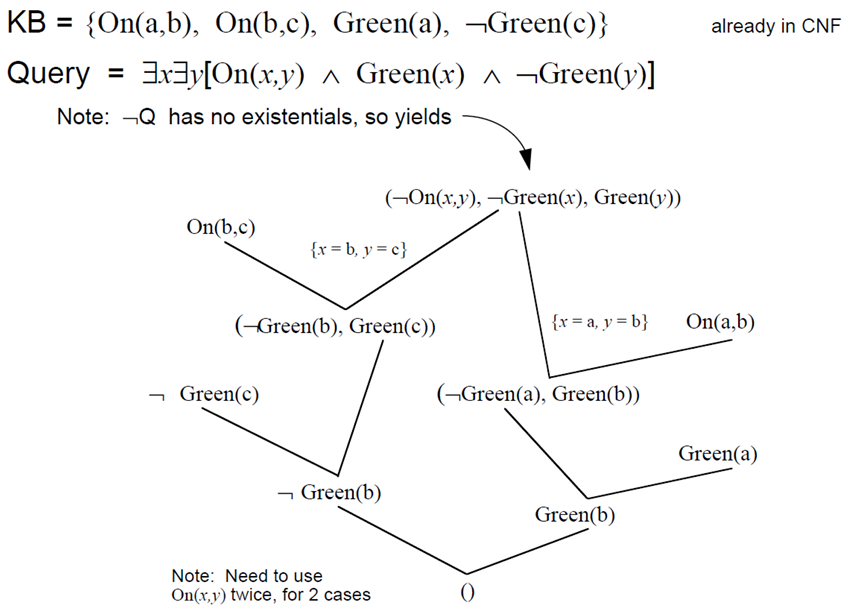 


## 答案提取

**应用归结原理求解问题**

(1) 已知前提 $F$ 用谓词公式表示，并化为子句 $S$ 
(2) 把待求解的问题 $P$ 用谓词公式表示，并否定 $P$ ，再与 answer 构成析取式(¬P ∨ answer)
(3) 把 (¬P ∨ answer) 化为子句集，并入到子句集 S 中，得到子句集 S'
(4) 把 S' 应用归结原理进行归结
(5) 若得到归结式 answer，则答案就在 answer 中

KB：Student(John)，Student(Jane)，Happy(John)
Q：∃x(Student(x) ∧ Happy(x))

¬P ⇔ ¬∃x(student(x) ∧ Happy(x)) ⇔ ∀x(¬student(x) ∨ ¬Happy(x)) ⇒ (¬student(x), ¬Happy(x))

¬P ∨ A ⇒ (¬student(x), ¬Happy(x), A(x))

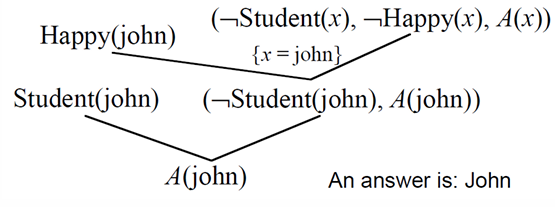 


KB：Student(john)，Student(jane)，Happy(john) ∨ Happy(jane)
Query：∃x[Student(x) ∧ Happy(x)]

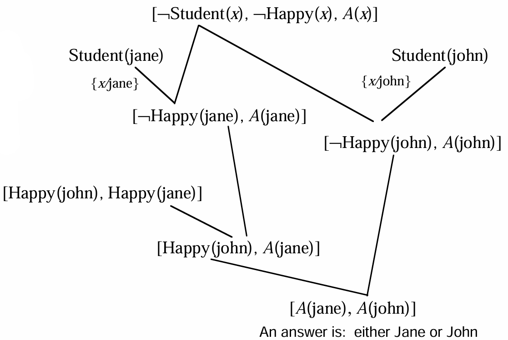 


# 第3章：搜索技术

> 盲目搜索（深度搜索、宽度搜索、迭代加深搜索）；
> 启发式搜索（最好优先搜索、A*搜索）；
> 博弈树搜索（极大极小过程、alpha-beta剪枝）。

## 盲目搜索

深度搜索

宽度搜索

迭代加深搜索

* 通过扩展深度受限搜索，解决了深度优先和广度优先的问题
* 从深度限制L=0开始，我们迭代增加深度限制，对每个深度限制执行深度受限搜索
* 如果找到解，或者深度受限搜索失败且没有因为深度限制而剪掉任何节点，则停止
* 如果没有节点被剪掉，则搜索考查了状态空间中的所有路径但没有找到解，因此无解。


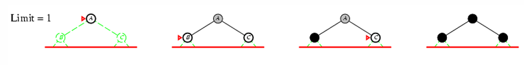

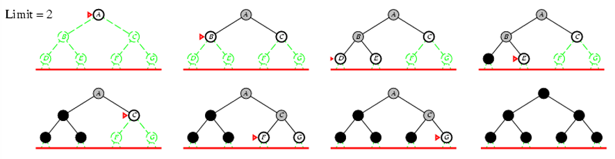

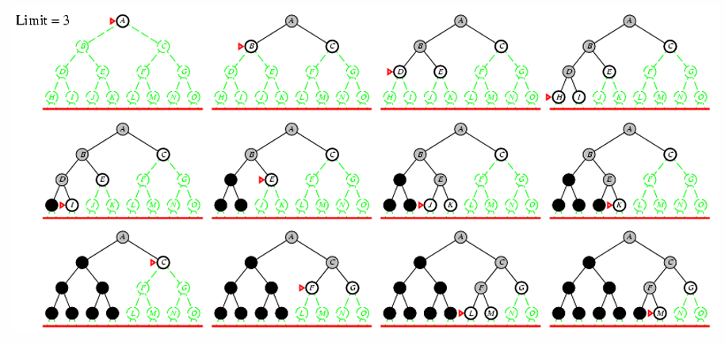


| 标准   | 宽度优先搜索 | 深度优先搜索 | 迭代加深搜索 |
| ------ | ------------ | ------------ | ------------ |
| 时间   | $b^d$        | $b^m$        | $b^d$        |
| 空间   | $b^d$        | bm           | bd           |
| 最优性 | 是           | 否           | 是           |
| 完备性 | 是           | 否           | 是           |

注：b 是分支系数，d 是解答深度，m 是搜索树的最大深度

宽度优先搜索需要指数数量的空间，深度优先搜索的空间复杂度和最大搜索深度呈线性关系。

迭代加深搜索对一棵深度受控的树采用深度优先的搜索。它结合了宽度优先和深度优先搜索的优点。和宽度优先搜索一样，它是最优的，也是完备的。但对空间要求和深度优先搜索一样是适中的。


## 启发式搜索

（启发式搜索）如果在选择节点时能 充分利用与问题有关的特征信息，估计出节点的重要性，就能在搜索时选择重要性较高的节点，以便求得最优解。

用来评估节点重要性的函数称为 **评估函数**。

评估函数为 $f(x) = g(x) + h(x)$ 

* $g(x)$，表示 从初始节点 S0 到节点 x 的 **实际代价**
* $h(x)$ ，表示 从 $x$ 到目标节点 $S_g$ 的最优路径的评估代价，它体现了问题的启发式信息，其形式要根据问题的特性确定，$h(x)$ 称为 **启发式函数**

启发式方法把问题状态的描述转换成了对问题解决程度的描述，这一程度用评估函数的值来表示。

### 通用图搜索算法

* 图搜索算法只记录状态空间中那些被搜索过的状态，它们组成一个搜索图 G
* G 由两种节点组成：
  * Open 节点，如果该节点已经生成，而且启发式函数值 $h(x)$ 已经算出，但是它还没有拓展。这些节点也称为未考察节点。
  * Closed 节点，如果该节点已经扩展并生成了其子节点。Closed 节点是已经考察过的节点。
* 可以给出两个数据结构 OPEN 和 CLOSED 表，分别存放 Open 节点 和 Closed 节点。
* 节点 x 的费用函数 f(x)，f(x) = g(x) + h(x)
* 生成费用 g(x) 可以比较容易得到，入，如果节点 x 是从初始节点经过 m 步得到，则 g(x) 节点是从初始节点经过 m 步得到，则 g(x) 应给和 m 成正比（或者就是 m）
* h(x) 只是个预测值。
* 上述图搜索算法生成一个明确的图G（称为搜索图）和一个G的子集T（称为搜索树），图G中的每一个节点也在树T上。
* 搜索树是由返回指针来确定的。 
* G中的每一个节点（除了初始节点S0）都有一个指向G中一个父辈节点的指针。该父辈节点就是树中那个节点的唯一父辈节点。


### 最好优先搜索

搜索是从 **最有希望的节点** 开始，并且生成其所有的子节点。计算每个节点的性能（合适性），选择最有希望的节点进行扩展，而不是仅仅从当前节点所生成的子节点中进行选择。如果在早期选择了一个错误的节点，最好优先搜索就提供了一个修改的机会。

最好优先搜索算法并<u>没有显式地给出如何定义启发式函数</u>，它不能保证当从起始节点到目标节点的最短路径存在时，一定能够找到它。

特点是：每次选择全局最优的节点进行拓展

如果最好优先搜索算法中的 f(x) 被实例化为 f(x) = g(x) + h(x)，则称为 A 算法。

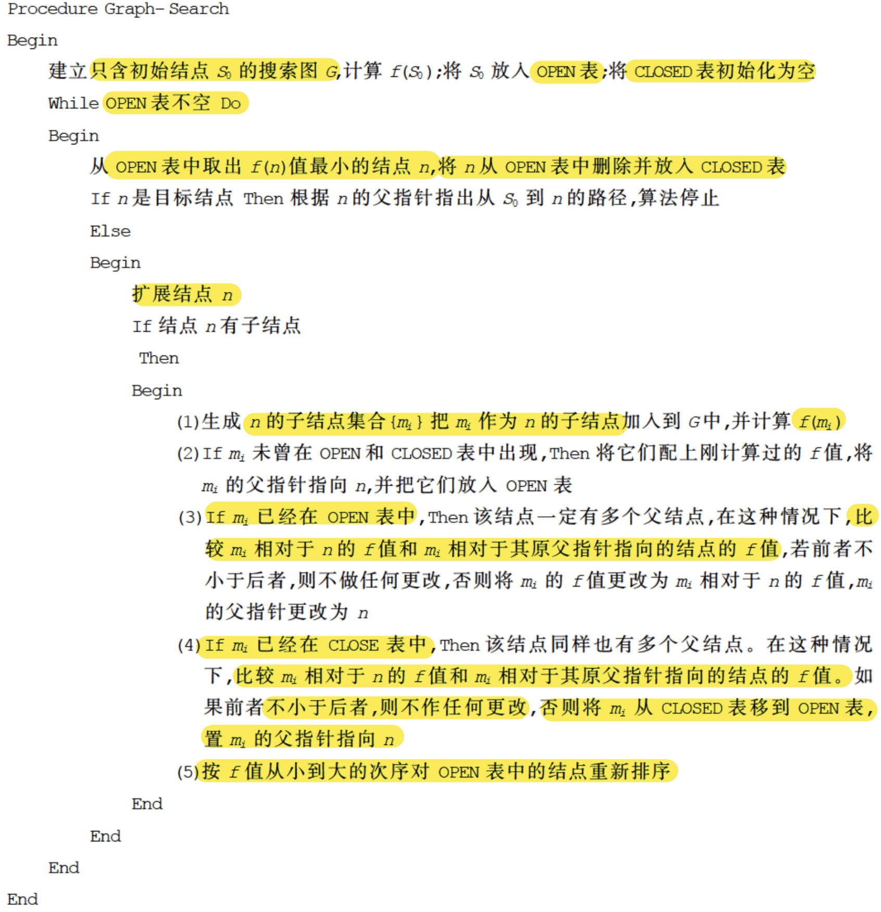

由于对启发函数h 没有任何限制，A 算法不能保证找到最优解。

### A*搜索

A* 算法是 A 算法的改进，对启发式函数做出了限制。

评估函数 $f^*(n) = g^*(n) + h^*(n)$ 

* $g^*(n)$ 为起始节点到节点 n 的最短路径的代价
* $h^*(n)$ 是从 n 到目标节点的最短路径

把估价函数$f (n)$ 和 $f^*(n)$相比较，$g (n)$ 是对 $g^*(n)$的估价。$h (n)$是对$h^* (n)$的估价。

* $g(n)$ 是对 $g^*(n)$ 的估计，且 $g(n) >0 $
* $h(n)$ 是 $h^*(n)$ 的下界，即对任意节点 n 均有 $h(n)\leqslant h^*(n)$ 。这样得到的算法为 A* 算法


IDA* 算法：迭代加深 A* 算法。对启发函数用做深度的限制，而不是选择拓展节点的排序。


## 博弈树搜索

### 极大极小过程

极小极大策略

- 构建完整的博弈树（所有叶子节点都是终结节点）
- 根节点是起始状态，边表示可能的移动等
- 用效用值标记终结节点
- 将 **值** **向树上回溯**
- U(t) 定义在所有终结节点上（作为输入的一部分）
- 如果 n 是一个极小节点，则 U(n) = min {U(c) : c 是 n 的子节点}
- 如果 n 是一个极大节点，则 U(n) = max {U(c) : c 是 n 的子节点}

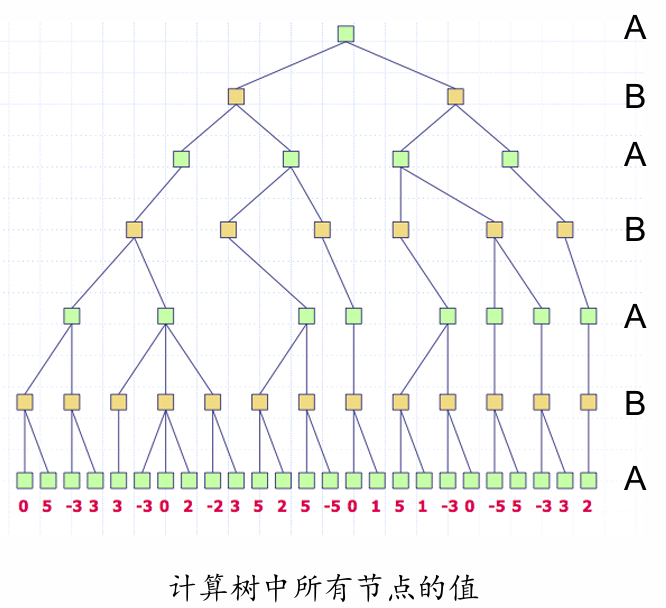

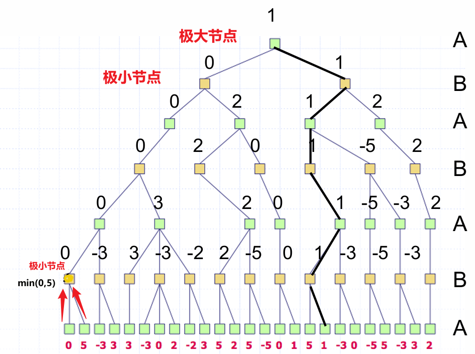


极小极大算法的深度优先实现

```python
def DFMiniMax(n, Player): 
    #返回在给定玩家为 MIN 或 MAX 时状态 n 的效用值

    if n is TERMINAL: 
        return V(n) 
        #返回终结状态的效用值
        #(V 是游戏的一部分)

    #应用玩家的移动获取后继状态
    ChildList = n.Successors(Player)

    if Player == MIN: 
        return min(DFMiniMax(c, MAX) for c in ChildList)
    else:  # Player 是 MAX
        return max(DFMiniMax(c, MIN) for c in ChildList)
```


### alpha-beta剪枝

* 实际上，我们不需要考查整个树来做出正确的极小极大决策
* 假设树是以深度优先生成的
  * 在仅为 n 的一些子节点生成值之后，我们可以证明在极大极小策略中我们永远不会达到 n
  * 所以我们不需要再生成 n 的其他子结点
* 有两种类型的剪枝
  * 极大结点的剪枝（α-cuts）
  * 极小节点的剪枝（β-cuts）


**Alpha-beta 值**

* 在一个 Max结点 n 处，令 α 为 n 的已检查的子节点的最大值（随已检查的子节点变化而变化）
* 在一个 Min 结点 n 处，令 β 为 n 的已检查的子节点的最小值（随已检查的子节点变化而变化）


**α 剪枝**

* 在 Max 结点 n 处，如果 α 变得 ≥ 父亲 Min 结点的 β 值，则我们可以停止扩展 n

* 这是因为 Min 不会选择 n 而是选择 n 的某个低值兄弟节点

  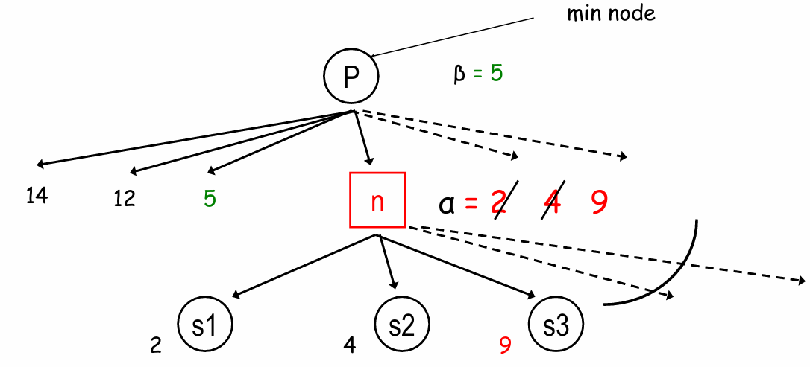

* 一般来说，在 Max 节点 n 处，如果 α 变得 ≥ 某个祖先 Min 节点的 beta 值，则我们可以停止扩展 n


**β 剪枝**

* 在 Min 节点 n 处，如果 β 变得 ≤ 父亲 Max 节点的 α 值，则我们可以停止扩展 n

* 这是因为 Max 不会选择 n 而是选择 n 的某个高值兄弟节点

  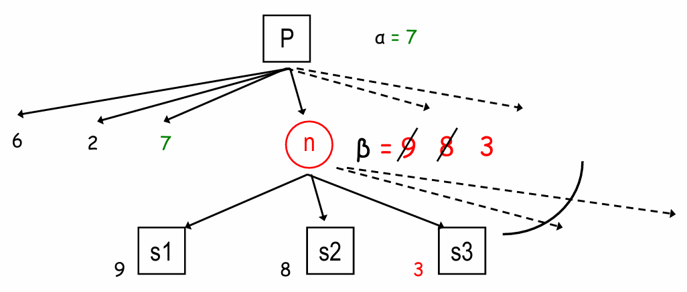

* 一般来说，在 Min 节点 n 处，如果 β 变得 ≤ 某个祖先 Max 节点的 α 


**实现Alpha-Beta剪枝**

```python
def AlphaBeta(n, Player, alpha, beta):
    # 返回状态 n 的效用值

    if n is TERMINAL:
        return V(n)
        # 返回终结状态的效用值

    ChildList = n.Successors(Player)

    if Player == MAX:
        for c in ChildList:
            alpha = max(alpha, AlphaBeta(c, MIN, alpha, beta))
            if beta <= alpha:
                break
        return alpha
    else:  # Player == MIN
        for c in ChildList:
            beta = min(beta, AlphaBeta(c, MAX, alpha, beta))
            if beta <= alpha:
                break
        return beta
```


**跟踪 α-β 剪枝过程**

* 对 Max 节点标记 α值 的变化，对 Min 节点标记 beta 值的变化
* 在 Max 节点上，每当当前值 ≥ 某个祖先 Min 节点的值时，做 α 剪枝
* 在 Min 节点上，每当当前值 ≤ 某个祖先 Max 节点的值时，做 β 剪枝


例题1

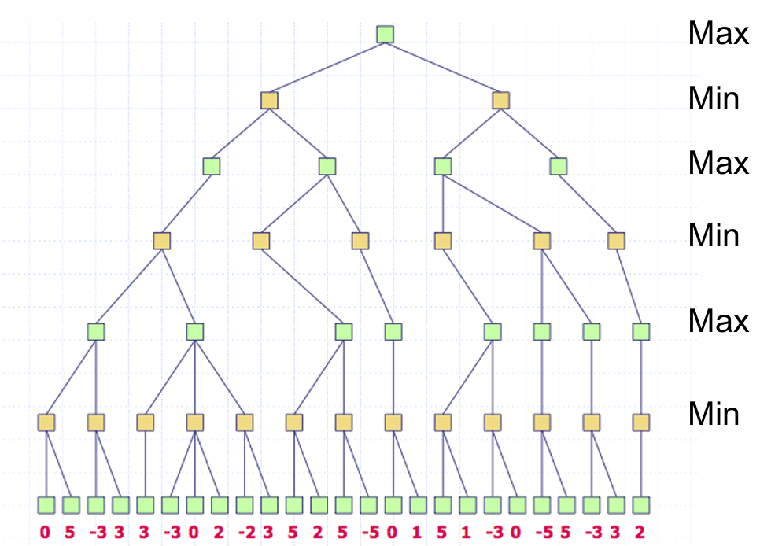

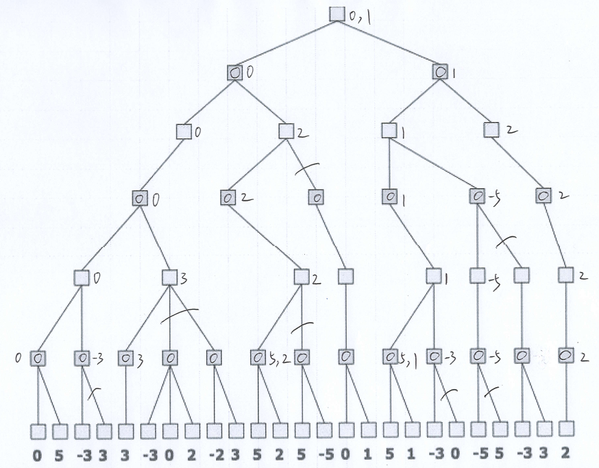

例题2

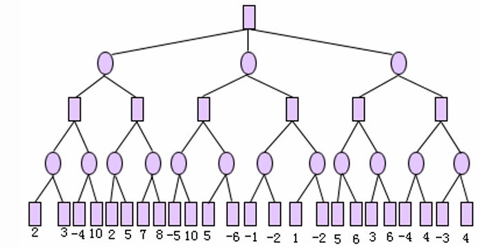

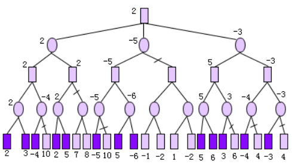


# 第4章：高级搜索

> 爬山法（基本思想）；
> 遗传算法（基本操作）。

### 爬山法

基本思想：一直向值增加的方向持续移动，将会在到达一个“峰顶”时终止，并且在相邻状态中没有比它更高的值。这个算法不维护搜索树，因此当前节点的数据结构只需要记录当前状态和它的目标函数值。爬山法不会预测与当前状态不直接相邻的那些状态的值。


## 遗传算法

* 遗传算法，是从代表问题可能潜在解集的一个种群开始的，而一个种群则由经过基因编码的一定数目的个体组成。

* 个体是染色体（chromosome）带有特征的实体。染色体作为遗传物质的主要载体，即多个基因的集合，其内部表现（即基因型）是某种基因组合，它决定了个体形状的外部表现，如黑头发的特征是由染色体中控制这一特征的某种基因组合决定的。
* 需要从表现型到基因型的映射（编码）
* 简化基因编码，如二进制编码。
* 初代种群产生之后，按照 适者生存 和 优胜劣汰 的原理，逐代(generation）演化产生出越来越好的近似解。
* 在每一代，根据 问题域 中 **个体的适应度**（fitness）大小挑选 个体，并借助于 自然遗传学的遗传算子 进行 组合交叉 和 变异，产生出代表新的解集的种群。
* 这个过程将导致种群像自然进化一样的后代种群比前代更加适应于环境，末代种群 中的 最优个体 经过 解码，可以作为问题近似最优解


**遗传算法的过程**

* 开始时，种群随机地初始化，并计算每个个体的适应度函数，初始代产生了
* 如果不满足优化准则，开始产生新一代的计算
* 为了产生下一代，按照适应度选择个体，父代进行基因重组（交叉）而产生子代
* 所有子代按一定概率变异，然后子代的适应度又重新被计算，子代被插入到种群将父代取而代之，构成新的一代
* 循环，直到满足优化准则


遗传算法：

1. 自组织，自适应，自学习性
2. 遗传算法的本质并行性
3. 遗传算法不需要求导或其他辅助只是
4. 遗传算法强调概率转换规则
5. 遗传算法可以更加直接地应用
6. 遗传算法对给定问题，可以产生许多潜在解。


**遗传算法的基本操作**

1. 选择

   选择，用来确定重组或交叉个体，以及被选个体将产生多少个子代个体。首先计算适应度：

   (1) 按比例的适应度计算

   (2) 基于排序的适应度计算

   适应度计算之后是实际的选择，按照适应度进行父代个体的选择

   可选的算法：① 轮盘赌选择  ② 随机变量抽样  ③ 局部选择  ④ 截断选择  ⑤ 锦标赛选择

2. 交叉或基因重组

   基因重组，是结合来自父代交配种群中的信息产生新的个体。根据个体编码表示方法的不同，可以有以下的算法：

   ① 实值重组：离散重组，中间重组，线性重组，扩展线性重组

   ② 二进制交叉：单点交叉，多点交叉，均匀交叉，洗牌交叉，缩小代理交叉

3. 变异 mutation

   交叉之后，子代经历的变异，实际上是 子代基因 按小概率扰动产生的变化。

   根据个体编码表示方法的不同，可以采用以下算法：① 实值变异 ② 二进制变异

考察：二进制编码的轮盘赌选择、单点交叉和变异操作。

 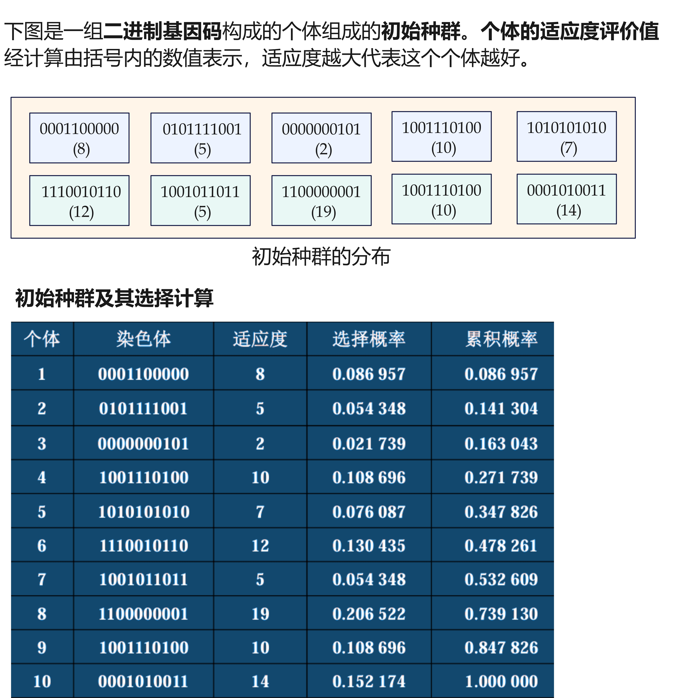

* 个体适应度，按比例转化为 选中概率，将轮盘分为 10 个扇区：

  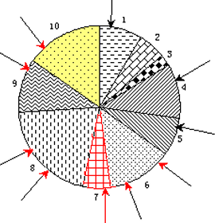 

* 因为要进行 10 次选择，所以产生 10 个 [0, 1] 之间的随机数

  相当于转动 10 次转盘，获得 10次转盘停止时 指针位置，指针停在某一扇区。扇区代表的个体即被选中。

* 假设产生随机数序列为0.070221, 0.545929, 0.784567, 0.44693, 0.507893, 0.291198, 0.71634, 0.272901, 0.371435, 0.854641，将该随机序列与计算获得的累积概率比较，则依次序号为1,8,9,6,7,5,8,4,6,10个体被选中。

* 适应度高的个体被选中的概率大，而且可能被选中，而适应度低的个体很可能被淘汰

* 在第一次生成竞争考验中，序号为 2 的个体（0101111001）和3的个体（0000000101）被淘汰，代之以适应度较高的个体8和6, 这个过程被称为再生。

* **交叉**：以单点交叉为例，任意挑选经过选择操作后种群中 两个个体作为交叉对象，即两个父个体经过染色体交换重组产生两个子个体。

* 随机产生一个交叉点位置，父个体1 和父个体2在交叉点位置的右边部分基因码互换，形成子个体1和子个体2：

  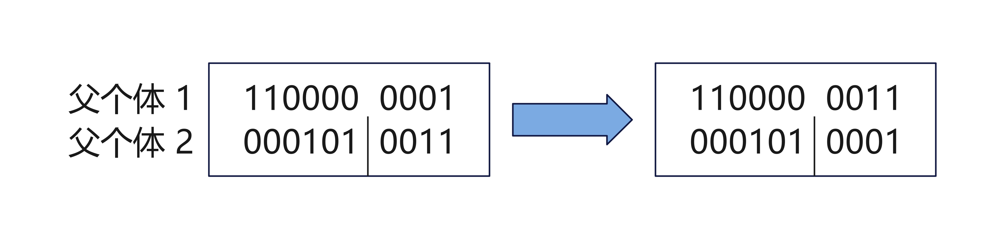  

* 为避免过早收敛，有必要在进化过程中加入具有新遗传基因的个体。效仿自然界生物变异：模仿生物变异的遗传操作，对于二进制的基因码组成的个体种群，实现基因码的小概率反转，即达到变异的目的。

  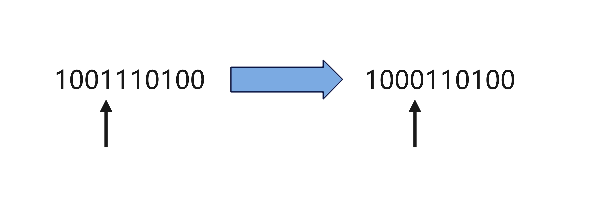 

  **变异**：以小概率决定第 4 个遗传因子翻转。

遗传算法的进化过程：

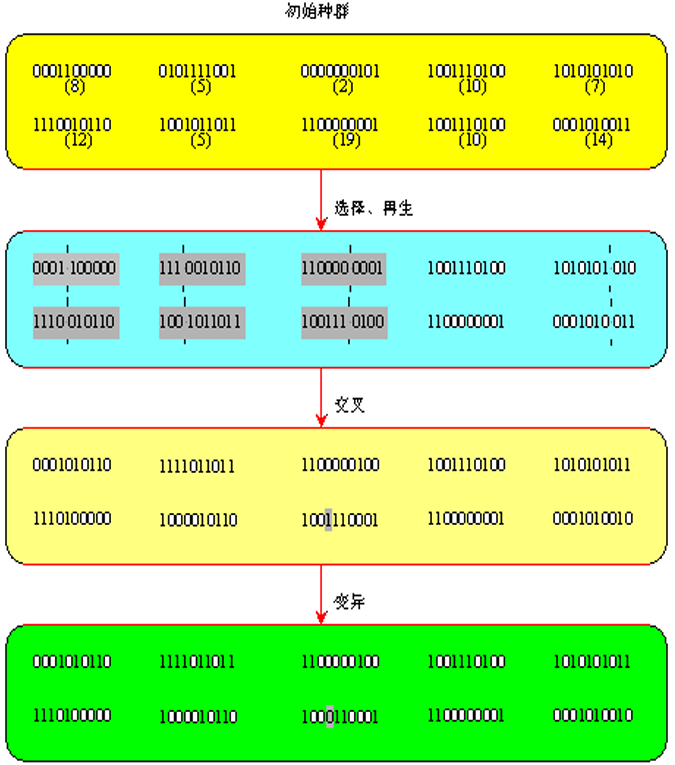 

* 初始种群经过选择操作适应度较高的 8 号和 6号个体分别复制 2 个。
* 适应度较低的 2 号 和 3 号遭到淘汰
* 按一定概率选择了 3 对父个体分别完成交叉操作，在随机确定"|" 的位置实行单点交叉生成 3 对子个体。
* 按小概率选中某个个体的基因码位置，产生变异
* 生成了第一代的群体
* 循环


**遗传算法流程图**

第一步：随机产生初代群体，个体数目一定，每个个体表示为染色体的基因编码

第二步：计算个体的适应度，并判断是否符合优化准则，若符合，输出最佳个体及其代表的最优解，并结束计算，否则转向第三步。

第三步：依据适应度选择再生个体，适应度高的个体被选中的概率高，适应度低的个体可能被淘汰。

第四步：按照一定的交叉概率和交叉方法，生成新的个体

第五步：按照一定的变异概率和变异方法，生成新的个体

第六步：由交叉和变异产生新一代的种群，返回第二步


# 第5章：不确定知识表示和推理

> 贝叶斯网络定义及表示、联合概率表示、构建方法、朴素贝叶斯方法、独立性判断D分离；
> 贝叶斯网络边缘概率及条件概率计算。

## 概率

概率是定义在一个事件集 U（通常被称为事件的全域）上的函数。

* 给定每个事件的 $e\in U$，赋值 $Pr(e) \in [0, 1]$ 。
* 通过对事件集 $F$ 的成员的概率求和为该集合赋值：$Pr(F) = \sum_{e\in F} Pr(e)$ 
* 因此，$Pr(U) = 1, Pr(\varnothing) = 0$ 
* $Pr(A \cup B) = Pr(A) + Pr(B) - Pr(A \cap B)$ 

**特征向量上的概率**

我们将处理有特征向量组成的全域。我们有：

* 变量集合 $V_1, V_2, ..., V_n$ 
* 每个变量的有限域：$\mathrm{Dom}[V_1], \mathrm{Dom}[V_2], ..., \mathrm{Dom}[V_n]$ 

事件的全域 U 是变量值的所有向量的集合。事件的空间大小为 $\prod_i |\text{Dom}[V_i]|$ ，即论语大小的乘积
例如，如果 $|\text{Dom}[V_i]| = 2$，则有 $2^n$ 个不同的原子事件。

通过指定某些变量的值可以方便地说明 U 的一些子集。例如：

* {$V_1 = a$} 表示 $V_1 = a$ 的所有事件的概率
* {$V_1 = a, V_3 = d$} 表示 $V_1 = a$ 并且 $V_3 = d$​ 的所有事件的集合

如果我们有每个原子事件（变量的完整实例化）的概率，就可以计算出任何集合的概率。例如：
$$
Pr(\{V_1 = a\}) = \sum_{x_2\in D[V_2]}\cdots \sum_{x_n\in D[V_2]} Pr(V_1 = a, V_2 = x_2, ..., V_n = x_n)
$$
**条件概率**

* 假设 A 是一个事件的集合，有 $Pr(A) > 0$ 
* 那么可以定义关于事件 A 的条件概率：$Pr(B|A) = \cfrac{Pr(B\cap B)}{Pr(A)}$ 
* 以 A 为条件，对应于将注意力限制在 B 中的事情上。

**性质和集合**

* 集合 $A\cup B$
* 集合 $A\cap B$ 
* 集合 $U-A$​ 

**求和规则**

如果 $B_1, B_2, ..., B_k$ 形成 U 的划分。则 $\mathrm{Pr}(A) = \mathrm{Pr}(A \cap B_1) + ... + \mathrm{Pr}(A\cap B_k )$ 

**独立性**

* 如果 $Pr( B|A) = Pr(B)$​ ，称 B 和 A 是独立的
* 如果 $Pr(A \cap B) = Pr(A) \cdot Pr(B)$ ，则 A 和 B 是独立的

**条件独立性**

* 给定 A，如果 $Pr(B| A\cap C) = Pr(B | A)$ ，则 B 和 C 条件独立
* 给定 A，则 B 和 C 是条件独立的，则 $Pr(B\cap C | A) = Pr(B|A)\cdot Pr(C|A)$ 

**贝叶斯规则**
$$
\mathrm{Pr}(Y|X) = \cfrac{\mathrm{Pr}(X|Y)\mathrm{Pr}(Y)}{\mathrm{Pr}(X)}
$$
**链式规则**
$$
\mathrm{Pr}(A_1 \cap A_2 \cap ... \cap A_n) = \mathrm{Pr}(A_1 | A_2 \cap ... \cap A_n) \cdot \mathrm{Pr}(A_2|A_3 \cap A_4 \cap ... \cap A_n)\cdot ... \cdot \mathrm{Pr}(A_{n-1}|A_n) \cdot \mathrm{Pr}(A_n)
$$


**变量独立**

给定变量 Z，两个变量 X 和 Y 是条件独立的，如果对所有的 $x\in \mathrm{Dom}(X), y\in \mathrm{Dom}(Y), z \in \mathrm{Dom}(Z)$，给定 $Z = z$, 有 $X = x$ 和 $Y = y$ 是条件独立的，即
$$
\mathrm{Pr}(X = x ∧ Y = y | Z = z) = \mathrm{Pr}(X = x | Z = z) \cdot \mathrm{Pr}（Y= y| Z = z)
$$

* 对变量 X，$\mathrm{Pr}(X)$ 是指 X 上的（边缘）分布。
* 它对所有的 $d\in \text{Dom}[X]$ 指定 $\mathrm{Pr}(X = d)$ 
* $\sum_{d\in \text{Dom}[X]} \mathrm{Pr}(X = d) = 1$ 
* 且 $\mathrm{Pr}(X = d_1 ∧X = d_2) = 0, d_1, d_2\in \text{Dom}[X], d_1 \not= d_2$ 

$\mathrm{Pr}(X|Y)$ 指 $X$ 上的条件分布族，对每个 $y\in \text{Dom}[Y]$ 都有一个条件分布。

对每个 $d\in\text{Dom}[Y]$，$\mathrm{Pr}(X|Y = d)$ 说明 $X$ 指上的一个分布。

* 把 $\mathrm{Pr}(X)$ 看作是一个函数，它接受任何 $x\in  \text{Dom}[X]$ 作为参数，并返回 $\mathrm{Pr}(X = x)$ 。
* 把 $\mathrm{Pr}(X|Y)$ 看作是一个函数，它接受任何 $y\in \text{Dom}[Y]$ 并返回 $\mathrm{Pr}(X|Y = y)$ 


## 贝叶斯网络

**利用条件独立性**

考虑一个故事：

* 如果 Craig 起的太早（E），Craig 可能需要咖啡（C）
* 如果 C，它可能会生气（A）
* 如果 A，血管破裂的几率会增加（B）
* 如果 B，Craig 很可能住院（H）


* 如果你知道了 E、C、A 或 B 中的任何一个，你对 Pr(H) 的评估就会改变。
  * 所以 H 不独立于 E, C, A 或 B
* 但是如果你知道 B 的值（真或假），知道了 E、C 或 A 不会影响 Pr(H)。这些因素对 H 的影响是由它们对 B 的影响传递的。
  * Craig 不会因为生气而被送去医院，他被送去是因为他血管破了。
  * 因而给定 B，H 独立于 E，C 和 A

* 类似地，给定 A，B 独立于 E 和 C；给定 C，A 独立于 E
* 这意味着：
  * $\mathrm{Pr}(H|B, \{A, C, E\}) = \mathrm{Pr}(H|B)$ 
  * $\mathrm{Pr}(B|A, \{C, E\}) = \mathrm{Pr}(B|A)$ 
  * $\mathrm{Pr}(A|C, \{E\}) = \mathrm{Pr}(A|C)$ 
  * $\mathrm{Pr}(C|E)$ 和 $\mathrm{Pr}(E)$ 不能简化。

利用条件独立性：

* 根据链式规则（对于 H, ..., E 的任何实例化）：

  $\mathrm{Pr}(H, B, A, C, E) = \mathrm{Pr}(H|B, A, C, E) \mathrm{Pr}(B|A, C, E) \mathrm{Pr}(A|C, E)\mathrm{Pr}(C|E) \mathrm{Pr}(E)$ 

* 根据我们独立性假设：

  $\mathrm{Pr}(H, B, A, C, E) = \mathrm{Pr}(H|B) \mathrm{Pr}(B|A) \mathrm{Pr}(A|C)\mathrm{Pr}(C|E) \mathrm{Pr}(E)$​ 

* 由此可通过说明 5 个局部的条件分布来说明完全的联合分布

**示例量化**

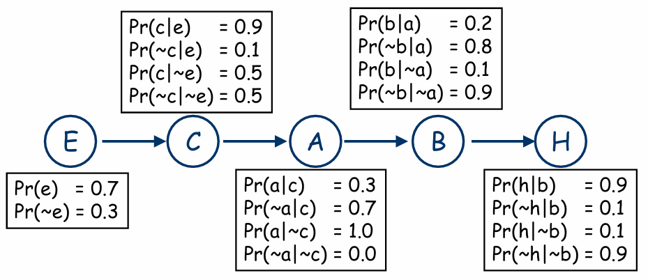

* 其中一半的数值是 “1 减去”其他数值，因此，说明完全的联合分布只需要 9 个参数

计算 $\mathrm{Pr}(a)$ ：
$$
\begin{aligned}
\mathrm{Pr}(a) &= \sum_{c_i \in \text{Dom}(C)} \mathrm{Pr}(a|c_i)\mathrm{Pr}(c_i)\\
&= \sum_{c_i \in \text{Dom}(C)} \mathrm{Pr}(a|c_i)\sum_{e_i \in \text{Dom}(E)} \mathrm{Pr}(c_i|e_i) Pr(e_i)
\end{aligned}
$$

$\mathrm{Pr(A)}$ 的具体计算：
$$
\begin{aligned}
\mathrm{Pr}(c) &= \mathrm{Pr}(c|e)\mathrm{Pr}(e) + \mathrm{Pr}(c|\lnot e)\\
&= 0.9\times 0.7 + 0.5 \times 0.3 = 0.78 \\
\mathrm{Pr}(\lnot c) &= \mathrm{Pr}(\lnot c | e) \mathrm{Pr}(e) + \mathrm{Pr}(\lnot c | \lnot e) \mathrm{Pr}(\lnot e) = 0.22 \\
&= 1- \mathrm{Pr}(c)\\
\mathrm{Pr}(a) &= \mathrm{Pr}(a|c)\mathrm{Pr}(c) + \mathrm{Pr}(a| \lnot c) \mathrm{Pr}(\lnot c)\\
& = 0.3\times 0.78 + 1.0 \times 0.22 = 0.454 
\\
\mathrm{Pr}(\lnot a) &= 1- \mathrm{Pr}(a)
\end{aligned}
$$
上面的结构就是一个贝叶斯网络。

* BN 是对一组变量的直接依赖关系的图形表示，以及一组条件概率表（CPTs），用于量化这些影响的强度。
* 贝叶斯网络推广了上述例子中的思想，从而得到不确定性下表示和推理的有效方法。


**贝叶斯网路**

变量 $\{X_1, X_2, \cdots, X_n\}$ 上的一个 BN 包括：

* 一个 DAG(directed acyclic graph，有向无环图)，节点为变量
* 一个 CPTs（conditional probability tables，条件概率表）的集合：$\mathrm{Pr}(X_i | \mathrm{Par}(X_i))$ 对每个 $X_i$ 

关键概念：节点的父节点：$\mathrm{Par}(X_i)$ ，节点的子节点，节点的后代，节点的祖先。家族：由 $X_i$ 及其父节点组成的节点集。

**示例**

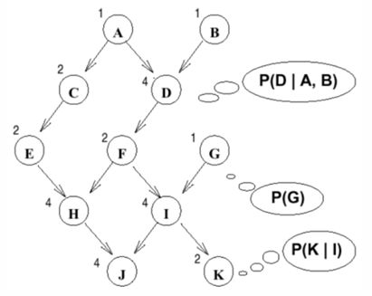

* 只显示了若干 CPTs
* 显示表示联合分布需要 $2^{11}-1 - 2047$ 个参数
* BN 只需要 27 个参数（列出了每个 CPT 的大小）

**贝叶斯网络的语义**

* 贝叶斯网络说明了网络中变量的联合分布可以写成下面的乘积分解。

  $\mathrm{Pr}(X_1, X_2, ..., X_n) = \mathrm{Pr}(X_n|Par(X_n)) \cdot \mathrm{Pr}(X_{n-1}|Par(X_{n-1})) \cdot ...\cdot\mathrm{Pr}(X_1|Par(X_1))$ 

* 这个等式对于变量 $X_1, X_2, ..., X_n$ 的任何取值 $d_1, d_2, ..., d_n$ 都成立

* 例如：我们有 $X_1, X_2, X_3$，每个具有论域 $\mathrm{Dom}[X_i] = \{a, b, c\}$，并且 $\mathrm{Pr}(X_1, X_2, X_3) = \mathrm{Pr}(X_3|X_2)\mathrm{Pr}(X_2)\mathrm{Pr}(X_1)$ 

  则 $\mathrm{Pr}(X_1 = a, X_2=a, X_3=a) = \mathrm{Pa}(X_3=a|X_2=a)\mathrm{Pr}(X_2=a)\mathrm{Pr}(X_1=a)$ 

对于上面的示例网络，有：
$$
\begin{aligned}
\mathrm{Pr}(A, B, C, D, E, F, G, H, I, J, K) & = 
\mathrm{Pr}(A) \times \mathrm{Pr}(C|A) \times \mathrm{Pr}(D|A, B)\times \mathrm{Pr}(E|C)\\
& \ \ \ \ \ \times\mathrm{Pr}(F|D) \times \mathrm{Pr}(G) \times \mathrm{Pr}(H|E, F)\\
& \ \ \ \ \   \times \mathrm{Pr}(I|F,G) \times \mathrm{Pr}(J|H, I)\times\mathrm{Pr}(K|I)
\end{aligned}
$$


例题：

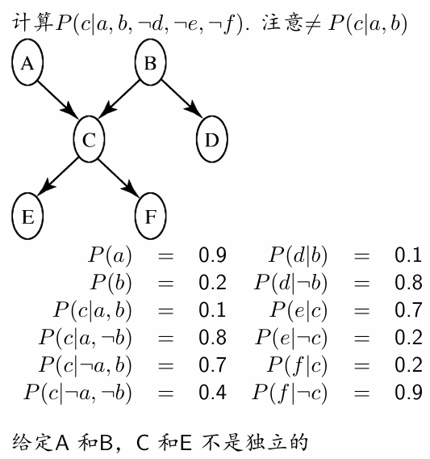


**构建贝叶斯网络**

总是可以构造一个贝叶斯网络来表示变量 $X_1, X_2, ..., X_n$ 上的任意分布，使用变量的任意顺序。

* 步骤1：使用变量的任意顺序应用链式法则。

* 步骤2：对于每个 $X_i$ ，遍历它的条件  $X_1, X_2, ..., X_{i-1}$ ，并迭代地删除所有变量 $X_j$ 使得给定剩余变量，$X_i$ 条件独立于 $X_j$ 

  步骤2 将产生乘积分解：
  $$
  \mathrm{Pr}(X_n|\text{Par}(X_n))\mathrm{Pr}(X_{n-1}|\text{Par}(X_{n-1}))...\mathrm{Pr}(X_1)
  $$

* 步骤3：创建一个有向无环图(DAG) 使得每个变量是一个节点，且变量 $X_i$ 的条件集 $\text{Par}(X_i)$ 是 DAG 中 $X_i$​ 的父节点集合。

* 步骤4：为每一个家族（变量及其父节点集合）指定条件概率表（CPT）。

  通常我们将 CPT 表示为一个表，将 $\{X_i, \text{Par}(X_i)\}$ 的每个赋值映射到：给定 $\text{Par}(X_i)$ 中的变量具有其指定的值时，$X_i$ 取其值的概率。

* 如果每个变量有 $d$ 个不同的值，我们将需要一个大小为 $d^m$ 的表，其中 $m = |\{X_i, \text{Par}(X_i)\}|$ 

  与父节点集合的大小成指数关系。


变量排序的影响——因果直觉

* BN 可以用变量的任意顺序构造。
* 然后，一些排序会产生具有非常大的父节点集合的 BNs
* 从经验和概念上讲，构造 BN的一个好方法是使用基于因果关系的pai'xu


贝叶斯网络中的独立性：

* BN 的结构意味着：给定其父节点集合，每个 $X_i$ 都条件独立于它所有的非后代：
  $$
  \mathrm{Pr}(X_i|S\cup \mathrm{Par}(X_i)) = \mathrm{Pr}(X_i|\mathrm{Par}(X_i))
  $$
  对于 $X_i$ 的任何非后代集合 $S$ 

* 给定 Alarm，JohCalls 和 Earthquake 是独立的

  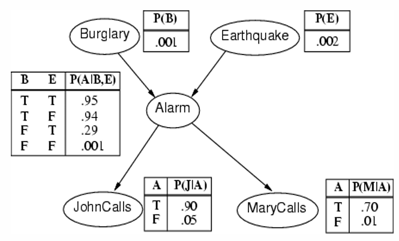 


**D-分离**

* 一组变量 D-分离 X 和 Y，如果它阻塞了 BN 中 X 和 Y 之间的每条无向路径。
* 如果证据 D-分离 X 和 Y，则给定证据，X 和 Y 是条件独立的。

令 Path 是 BN 中从 X 到 Y 的一条无向路径，则 E 是一个 变量的集合。我们说 E 阻塞路径 Path，如果在路径上有某个节点 Z 使得：

* 情况 1：P 上的一条边进入 Z，一条边离开 Z，并且 Z ∈ E

  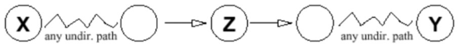

* 情况 2：P 上的两条边都离开 Z，并且 Z ∈ E

  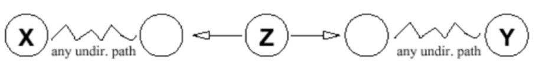

* 情况 3：P 上的两条边都进入 Z，并且 **Z 和它的任何后代** 都**不在** E 中

  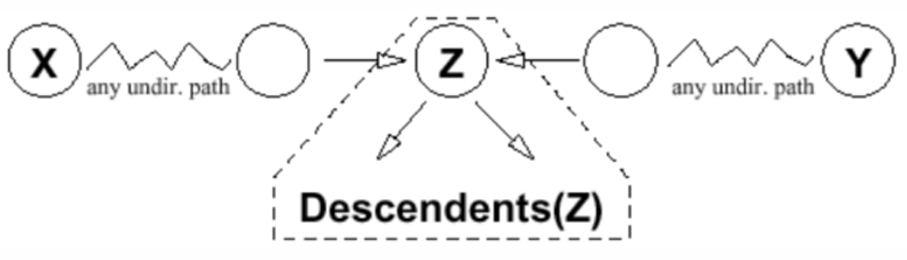


D-分离示例：

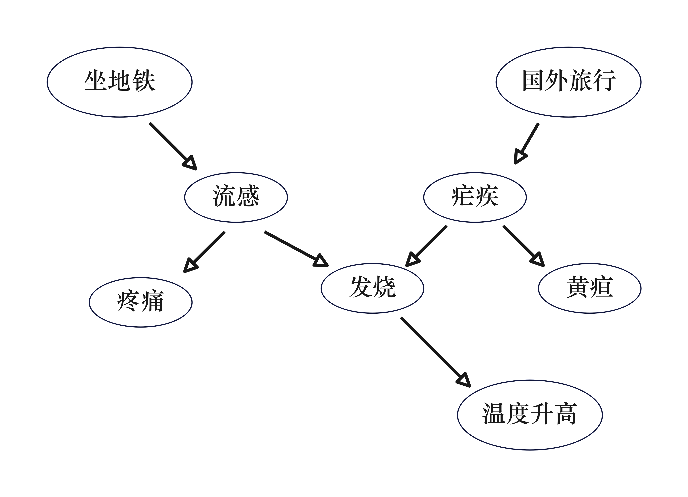

* 坐地铁 和 温度升高 不是独立的

  但是在给定 流感 时，坐地铁 和 温度升高 是独立的

* 疼痛 和 发烧 不是独立的

  但是，给定 流感 时，疼痛 和 发烧 是独立的

* 流感 和 疟疾 是独立的：发烧 阻塞了这条路径，因为它不在证据中，其后代体温升高也不在证据中

* 给定发烧，流感 和 疟疾 不是独立的：现在路径没有被阻塞。

  直觉是：如果知道 John 患有流感，这解释了发烧，从而降低了患疟疾的可能性，反之亦然。

* 坐地铁 和 国外旅行 是独立的

  给定 温度升高，它们不是独立的，因为 情况3 不成立

  但是给定 温度升高 和 疟疾，它们是独立的


示例
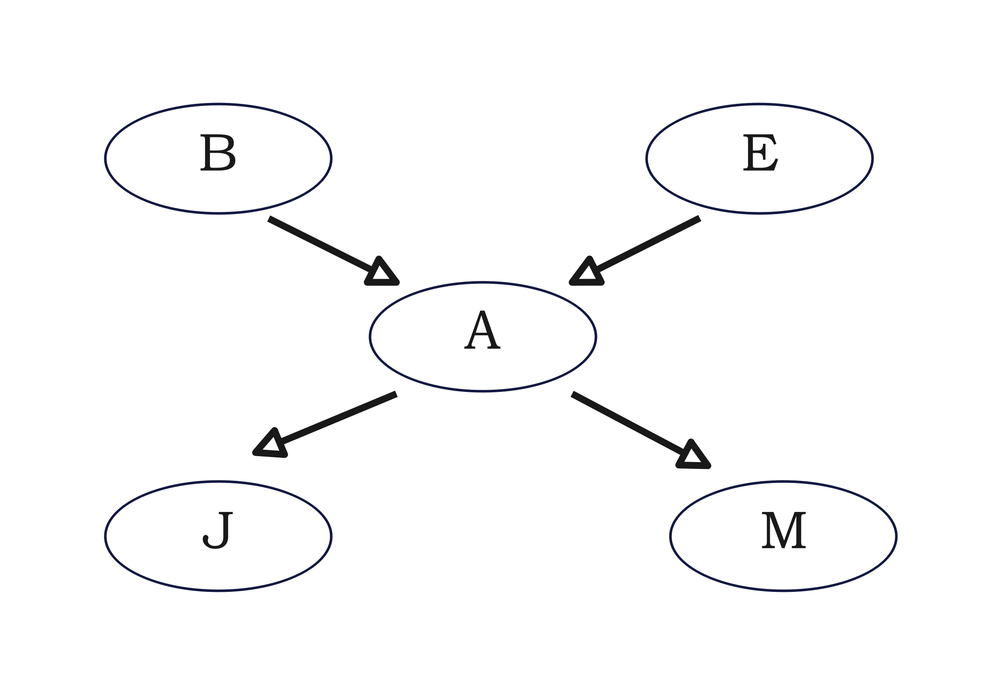

* 给定 J，A 和 M 不独立
* 给定 A，M 和 B 是独立的
* J 和 M 是不独立的，但在给定 A 的情况下是独立的
* B 和 E 是独立的
* 给定 A/J/M，B 和 E 是不独立的

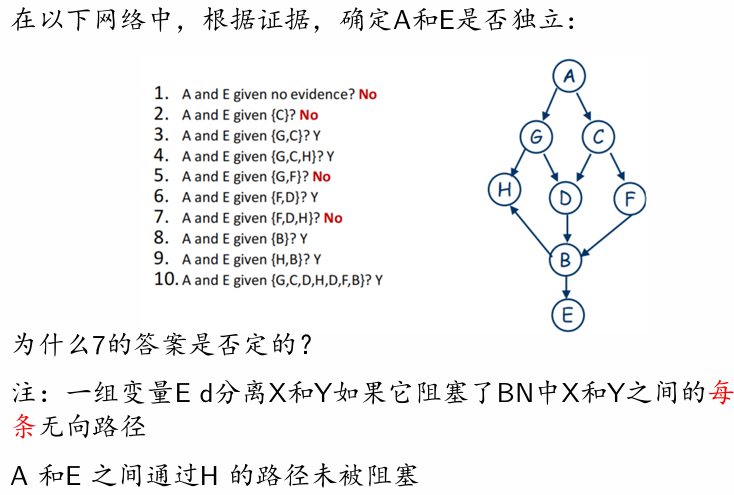 


## 变量消除

示例（二值变量）：


给定上一页中的贝叶斯网络：
$$
\begin{aligned}
\mathrm{Pr}(A, B, C, D, E, F, G, H, I, J, K) & = 
\mathrm{Pr}(A)\times \mathrm{Pr}(B) \times \mathrm{Pr}(C|A) \times \mathrm{Pr}(D|A, B)\\
& \ \ \ \ \ \times \mathrm{Pr}(E|C)\times\mathrm{Pr}(F|D) \times \mathrm{Pr}(G) \times \mathrm{Pr}(H|E, F)\\
& \ \ \ \ \   \times \mathrm{Pr}(I|F,G) \times \mathrm{Pr}(J|H, I)\times\mathrm{Pr}(K|I)
\end{aligned}
$$
并提供了以下证据：
$$
E = \{H = \text{true}, I = \text{false}\}，i.e. E = \{h, - i\}
$$
想知道 $\mathrm{Pr}(D|h, -i)$ 

（1）写成每个 D 值（即 d 和 ¬d）的总和
$$
\sum_{A, B, C, E, F, G, J, K} \mathrm{Pr}(A, B, C, d, E, F, G, h, -i, J, K)\\\sum_{A, B, C, E, F, G, J, K} \mathrm{Pr}(A, B, C, -d, E, F, G, h, -i, J, K)
$$
（2）现在计算 $\mathrm{Pr}(h, -i)$ 
$\mathrm{Pr}(h, -i) = \mathrm{Pr}(d, h, -i) + \mathrm{Pr}(-d, h, -i)$

（3）最后计算 $\mathrm{Pr}(D|h, -i)$ ：

$\mathrm{Pr}(d|h, -i) = \cfrac{\mathrm{Pr}(d, h, -i)}{\mathrm{Pr}(h, -i)}$​ 

$\mathrm{Pr}(-d|h, -i) = \cfrac{\mathrm{Pr}(-d, h, -i)}{\mathrm{Pr}(h, -i)}$ 

为了计算 $\mathrm{Pr}(D|h, -i)$ ，我们只需要计算 $\mathrm{Pr}(-d|h, -i)$ ，然后归一化得到我们想要的条件概率。


**变量消除**

变量消除使用

* 乘积分解，以及
* 求和规则

从网络中已有信息（CPTs）计算后验概率


**一个实例**

之前示例的(1)中，有 $\mathrm{Pr}(d, h, -i) = \sum_{A, B, C, E, F, G, J, K} \mathrm{Pr}(A, B, C, d, E, F, G, h, -i, J, K)$

使用贝叶斯网络乘积分解，我们有：
$$
\begin{aligned}
& \sum_{A, B, C, E, F, G, J, K} \mathrm{Pr}(A, B, C, d, E, F, G, h, -i, J, K) \\ & \ \ \ \ \  = 
\mathrm{Pr}(A)\times \mathrm{Pr}(B) \times \mathrm{Pr}(C|A) \times \mathrm{Pr}(d|A, B)\times \mathrm{Pr}(E|C)\times\mathrm{Pr}(F|d) \times \mathrm{Pr}(G) \\
& \ \ \ \ \  \ \ \ \ \ \times \mathrm{Pr}(h|E, F) \times \mathrm{Pr}(-i|F,G) \times \mathrm{Pr}(J|h, -i)\times\mathrm{Pr}(K|-i)
\end{aligned}
$$


**变量消除 （VE）**

* 一般来说，在每个阶段 VE 将计算一个表，表中的每个数值 对应于 求和式中 变量的不同实例化。

* 这些表格的大小和求和式中出现的变量个数成指数关系，例如：
  $$
  \sum_F \mathrm{Pr}(F|D)\mathrm{Pr}(h|E, F)t(F)
  $$
  依赖于 D 和 E 的值，因此我们将得到 由 $|\mathrm{Dom}[D]||\mathrm{Dom}[E]|$ 个不同的数组成的表。

**因子（Factor）**

* 一个因子是一些变量的一个函数，例如，$\mathrm{Pr}(C|A) = f(A, C)$ ：它将其参数的每个值映射到一个数值。
* 表格表示的大小与因子中变量的个数成指数关系。
* 注意原始的 CPTs 也是值的表。因此，我们也称它们为因子。
* 记号：$f(\textbf{X}, \textbf{Y})$ 表示 变量 $\textbf X\cup\textbf Y$ 上的一个因子（其中 $\textbf X$ 和 $\textbf Y$ 是变量的集合）
* 因子上有不同的操作。

**两个因子的乘积**

* 设 $f(\textbf{X}, \textbf Y)$ 和 $g(\textbf{Y}, \textbf Z)$ 是两个因子，有共同的变量集 $\textbf Y$ 

* f 和 g 的乘积，记为 $h = f\times g$ （或 $h = fg$），定义为

  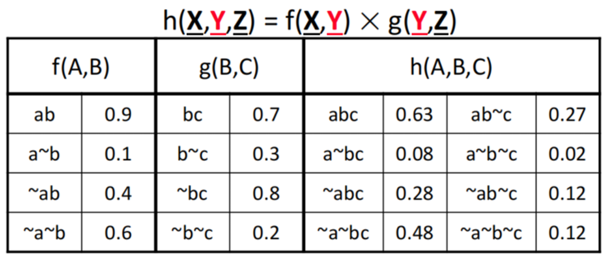 


**对因子在一个变量上求和**

* 令 $f(X, \textbf Y)$ 是一个具有变量 X 的因子（$\textbf Y$ 是一个集合）

* 从 $f$ 中对变量 X 求和，产生一个新的因子 $h = \sum_X f$ ，定义为：
  $$
  h(\textbf Y) = \sum_{x\in \mathrm{Dom}(X)} f(x, \textbf Y)
  $$

* 例如：

  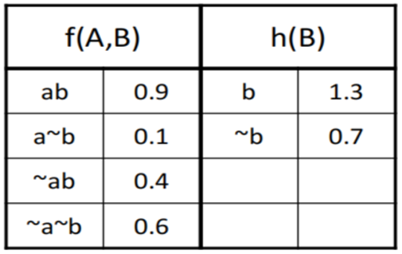

  这里的 $f(A, B)$，不是 $\mathrm{Pr}(AB)$ ，而是 $\mathrm{Pr}(B|A)$ 


**限制一个因子**

* 令 $f(X, \textbf Y)$ 是一个具有变量 X 的因子（$\textbf Y$ 是一个集合）

* 我们通过将 X 设置为 值a 并“删除”f 论域中不一致的元素，将因子 f 限制到 X = a。将$h = f_{X = a}$ 定义为 $h(\textbf Y) = f(a, \textbf Y)$ 

* 例如：

  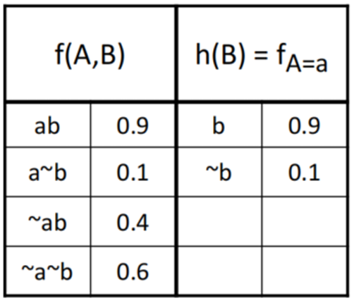

**VE 算法**

给定一个带有 CPTs F 的贝叶斯网络，查询变量 Q，证据变量集合 $\textbf E$（观察到有值 e），和其余变量 Z。计算 $\mathrm{Pr}(Q|\textbf E)$ 

1. 将提到 $\textbf E$ 中的变量的每个因子 $f\in F$ 替换为 其限制 $f_{\textbf E=e}$ （这可能产生一个“常数”因子）
2. 将每个 $Z_j$ 按照给定顺序 消除 $Z_j \in \textbf Z$ 如下：
   1. 令 $f_1, f_2, ..., f_k$ 是 F 中包含 $Z_j$ 的因子
   2. 计算新因子 $g_i = \sum_{Z_j}f_1\times f_2\times ... \times f_k$ 
   3. 从 F 中删除因子 $f_i$ 并在 F 中添加新的因子 $g_j$ 
3. 剩余的因子仅提到查询变量 Q。取它们的乘积，并归一化得到 $\mathrm{Pr}(Q|\textbf E)$ 


**VE：示例**

* Factor：$f_1(A)f_2(B)f_3(A, B, C)f_4(C, D)$ 
* Query：P(A) ?
* Evidence：D = d
* Elim. Order：C, B

限制：使用 $f_5(C) = f_4(C, d)$ 代替 $f_4(C, D)$ 

Step 1：消除 C：计算和加入 $f_6(A, B) = \sum_C f_5(C)f_3(A, B, C)$
               移除：$f_3(A, B, C)$，$f_5(C)$ 

Step2：消除 B：计算和加入 $f_7(A) = \sum_B f_6(A, B)f_2(B)$ 
               移除：$f_6(A,B)$，$f_2(B)$ 

最后的因子：$f_7(A), f_1(A)$，乘积 $f_1(A)\times f_7(A)$ 是没有归一化的，需要归一化得到最后的结果：
$$
P(A|d) = \cfrac{f_1(A)\times f_7(A)}{\sum_A f_1(A)f_7(A)}
$$
**数值示例**

.jpg)


# 第7章：机器学习

> 监督学习（分类与回归，感知机、逻辑回归；神经网络、反向传播、CNN、RNN）；
> 非监督学习（K-means）；
> 强化学习（MDP定义、状态值函数和动作值函数、Q学习及SARSA、DQN）
