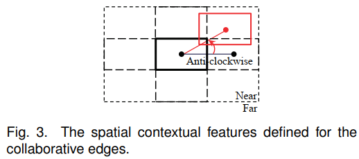

# 1 Discriminatively Trained And-Or Graph Models for Object Shape Detection (2014)

> 可参考的点：**与或图的训练** 

## 1.1 Introduction

* 本文研究一种 reconfigurable part-based model，即 与或图模型，用于识别图像中的物体形状。

  该模型通过弱标注训练数据（即不对物体部分进行标注）进行判别性训练。

与或图模型：关键组成部分是“switch variable”（ **或节点**），它引入了 组合替代方案，使模型具有可重构性。具体而言，or-节点通过激活子节点来确定组合方式。与或图模型由以下四层构成：

* 叶节点位于底部，代表一批局部分类器，用于检测物体的显著轮廓片段。每个叶子节点在一个划分的块内定义。

* 定义为 开关变量 (switch variable) 的 **或节点** (or-nodes) 指定其子叶节点的激活。在检测过程中，每个 或节点 激活其子叶结点之一，并选择被激活叶结点检测到的轮廓片段。因此，或节点 表示物体形状的部件，而 叶结点捕捉所有的局部变异性。

* 协作边（collaborative edges）用于在形状轮廓之间引入上下文信息，这些边由叶子节点之间的水平连接表示。论文的方法借鉴了上下文化目标检测（contextualized object detection）的方法【5, 40】，利用信息量丰富的空间布局特征来定义这些边，从而更有效地建模形状轮廓之间的关系。

* 与节点 (and-nodes) 用于聚合通过or-节点选择的局部形状轮廓。每个and-节点被定义为一个势函数（potential function），用于捕捉整体形状的变形和畸变。当轮廓片段被局部化后，and-节点进一步整体验证它们，从而提高模型的判别能力。

* 最顶层的根节点充当其子 与节点 的开关，考虑到 大的全局变化（例如不同视角下的形状）。其定义与 或节点 完全相同。

  > 例如，两匹马在不同视角下可能会表现出不同，模型可以自适应地激活不同的 and-notes 来检测它们。

从底部到顶部，模型分层构建成一种 "And-Or-And-Or" 结构。请注意，模型中的叶节点也可以视为 and-nodes，因为它们的定义方式相同。该结构非常具有表现力，且通用。"And" 符合表示子部分的组合，而 "Or" 符号表示可能配置之间的切换。

引入 隐变量 使得模型可重构。特别地，**隐变量** 包括 **or-nodes 和 root-nodes 的激活状态**，以及轮廓片段的位置，叶节点和 与节点 被定义为 **分类函数**，其系函数被视为 可观察的模型参数。

通过 隐变量，图节点和边被明确映射为我们模型的可区分分类函数。

与或图模型的训练 是本工作另一个创新。挑战主要在于两个方面：首先不同层的多个参数需要与隐变量一起优化，而优化的目标函数是非凸的，不能直接使用传统方法（如支持向量机）求解。其次，在模型学习中自动发现模型结构并不是一件简单的事情，因为训练样本中没有标注对象部分。

* 在文献中，学习 And-Or 图模型通常依赖于详细的注释或初始化。
* 为了应对这两个问题，论文提出一种新颖的学习方法，称为动态结构优化 (Dynamical Structural Optimization, DSO)，该算法迭代优化模型结构以及多层参数学习，包括三个主要步骤：
  1. 在训练样本上应用当前模型，同时为每个样本估计隐变量
  2. 发现新的模型结构。（对不同节点的子特征向量进行聚类，并根据聚类结构生成新结构，例如，在形状的某一部分，如果相应的子特征向量被聚类为三个组，则我们相应创建三个节点以检测局部轮廓）。
  3. 使用新生成的结构学习模型参数。

使用 And-Or 图模型进行形状检测是通过在图像金字塔上搜索实现的。我们首先完成两个测试步骤以生成多个检测假设，每个假设表示由检测到的轮廓片段组成的配置。

1. 局部测试使用所有叶节点检测边缘图中的轮廓片段。

2. 绑定测试对轮廓片段之间施加协同边缘，以进一步权衡假设。

   之后，与节点 通过整体测量轮廓片段重新评分每个假设。根节点 通过选择最可能的假设来决定最终检测结果。

## 1.2 And-Or Graph Model

论文提出的模型以 **与或图** 的形式定义为 $\mathcal G = (\mathcal V, \mathcal E)$ ，其中 $\mathcal V$ 包含四个层级的节点，$\mathcal E$ 包含图的边。

* 根节点索引为 0，表示在不同形状视图之间的切换。
* 与节点的索引为 $r = 1, \dots, m$，每个代表一个全局分类器。对于每个与节点，有若干个 $z$ 或节点以 $b_1\times b_2$ 块的布局排列，以表示多个对象部件。
* 所有或节点索引为 $j = m+1, \dots, (z+1)*m$ 。
* 第四层中的叶节点的索引为 $i = (z+1)*m+1, \dots, (z+1)*m+1+n$，其中 $n$ 是叶节点的数量。

为了简化符号，我们定义 $m' = (z+1)*m + 1$，$n' = (z+1)*m + 1 + n$，并且 $i\in ch(j)$ 表示节点 $j$ 的子节点。模型 $\mathcal G$ 的细节如下所述。

**叶节点**：每个叶节点 $L_i$ 是用于检测部分形状轮廓的局部分类器。我们将叶节点 $L_i$ 的位置表示为 $p_i$ ，该位置由其父或节点决定。给定提取的边缘图 $X$，我们将观察到的块中的轮廓片段视为 $L_i$ 的输入。对于轮廓 $c$，我们用所提出的轮廓描述符表示特征向量 $\phi^l(p_i, c)$ 。位于 $p_i$ 的分类器 $L_i$ 的响应定义为：
$$
R_i^l(X, p_i) = \max_{c\in X} w_i^l\cdot \phi^l(p_i, c),
$$
其中 $w_i^l$ 是一个参数向量，如果对应叶子节点的 $L_j$ 不存在，则该向量设为零。因此，我们可以通过 $c_i = \arg\max_{c\in X} w_i^l \cdot \phi^l(p_i, c)$ 来定位表示形状部分的轮廓。该部分检测方案能够从杂乱的背景中划分出真实物体的轮廓。

**或节点**：或节点 $U_j, j = m+1, \dots, (z+1)*m$ 指定其一个子叶节点，以及由该叶子节点检测到的轮廓。每个或节点可以相对于根节点稍微扰动其位置，以捕捉部件间的形变。对于每个或节点 $U_j$，我们定义形变特征 $\phi^s(p_0, p_j) = (dx, dy, dx^2, dy^2)$，其中 $(dx, dy)$ 编码了或节点位置 $p_j$ 相对于根节点确定的预期位置 $p_0$ 的位移。在 $p_j$ 处定位 $U_j$ 的成本为：$D_j(p_0, p_j) = w_j^s\cdot\phi^s(p_0, p_j) $，其中 $w_j^s$ 是与 $\phi^s (p_0, p_j)$ 相对应的 4维参数向量。

⭐对于与 $U_j$ 相关联的每个叶节点 $L_i$，我们**引入一个指示变量** $v_i \in \{0, 1\}$，表示它是否被 $U_j$ 激活。我们还为 $U_j$ 定义一个**辅助向量** $\mathbf v_j = \{v_i\}_{i\in ch(j)}$ ，其中 $\|\mathbf v_j\| = 1$ 或 $0$ 。$\| \mathbf v_j\| =1$ 仅在 $U_j$ 下的一个叶节点被激活时成立。通过这种方式，或节点可以**自适应地激活不同的叶节点，以捕捉多样的局部形状方差**。

因此，或节点 $U_j$ 的响应被定义为：
$$
R_j^u(X, p_0, p_j, \mathbf v_j) = \sum_{i\in ch(j)} R_i^l(X, p_j)\cdot v_i - D_j(p_0, p_j)
$$

**与节点**：与节点 $A_r$ 对整个形状执行全局验证。对于每个与节点，我们有一组轮廓片段 $C_r = \{c_1, c_2, \dots, c_z\}$ ，这些片段由其子或节点确定。然后，我们采用形状上下文描述符将这些轮廓整体描述为 $\phi^a(C_r)$ 。因此，我们将与节点定义为：
$$
\mathcal R_r^a(C_r) = w^a\cdot \phi^a(C_r)
$$
其中 $w^a$ 是相应的参数向量。

**协作边**（collaborative edges）：我们基于**协作边** 施加 **形状部分** 之间的 **上下文交互**。给定与同一 与节点 关联的两个不同的或节点，我们在它们之间连接一条边，并且它们的子叶结点会继承该边。我们使用上下文特征来定义协作边缘。

 

假设一条边连接两个叶节点 $(L_i, L_{i'})$ ，它们分别位于 $p_i$ 和 $p_{i'}$ 。根据它们的空间布局为两个叶节点收集一个 4-bin 特征 $\psi (p_i, p_{i'})$ ，$\psi(p_i, p_{i'})$ 的每个 bin 表示 $(L_i, L_{i'})$ 的四种关系之一：顺时针、逆时针、接近和远离。在图3中，中心的粗矩形表示 $L_i$ 的位置，它和表示 $L_{i'}$ 的红色矩形连接。虚线代表两个叶节点的初始布局，红色实线是根据观察调整得到的真实布局。

定义 $\{\mathbf v_j\}$ 表示叶节点的激活变量，使用 P 表示所有或节点 $U_j$ 的位置向量。P 还指定了 激活叶节点的位置 $\{p_i\}$ 。协作边的响应被参数化为
$$
\mathcal R_r^e(P, \{\mathbf v_j\}) = \sum_{j\in ch(r)}\sum_{i\in ch(j)}\sum_{i'\in \partial(i)} w_{(i, i')}^e \cdot \psi(p_i, p_{i'})\cdot v_i\cdot v_{i'}
$$
其中 $\partial(i)$ 表示 $L_i$ 的邻接叶结点，每个邻居和 $L_i$ 有一个不同的父节点。$w_{(i, i')}^e$ 是相应的权重。$v_i$ 和 $v_{i'}$ 是 $L_i$ 和 $L_{i'}$ 的激活指示符，因为边仅对激活的叶结点施加。

**根节点**：顶部的根节点交替激活其子和节点，其定义与节点的定义类似。此外，我们使用变量 $v_r \in\{0, 1\}$ 来指示每个和节点 $A_r$ 的激活状态，根节点的知识向量为 $\mathbf v_0 = \{v_r\}_{r=0}^m$ 且 $\|\mathbf v_0\| = 1$，即只选择一个子节点。

设 P 表示带有 或节点 的基于部分的 形变 (part-based deformation)，$V = (\mathbf v_0, \{\mathbf v_j\})$ 表示与节点 和 或节点的选择，模型的整体响应定义如下：
$$
\mathcal R_G(X, P, V) = \sum_{r=1}^m v_r\cdot\left( \sum_{j\in ch(r)} \mathcal R_j^v (X,p_0, p_j, \mathbf v_j) + \mathcal R_r^e(P, \{ \mathbf v_j \}) + \mathcal R_r^a(C_r) \right)
$$
该模型中，$H = (P, V)$ 为潜变量，在测试阶段将自适应地估计。上述公式的简化表示：
$$
\mathcal R_G(X, H) = w\cdot \phi(X, H)
$$
其中，$\phi(X, H)$ 表示模型中所有节点和边的特征向量的拼接形式，$w$ 是所有与 $\phi(X, H)$ 对应参数的集合。

## 1.3 Inference

给定从图像中提取的边缘图 $X$，推理任务是在图像金字塔中，通过在检测窗口中滑动，检测出最优的轮廓片段。该检测过程是一个自底向上的节点激活搜索过程，在此过程中会生成多个假设，每个假设都对应一组检测到的轮廓片段的配置。我们通过最大化公式 $\mathcal R_G(X, H) = w\cdot \phi(X, H)$ 中定义的模型响应来验证假设并剪除不太可能的假设。

**推理过程**：

1. 局部测试：使用所有叶节点（即局部轮廓分类器）来搜索边缘图 X 中的最优轮廓片段。
2. 绑定测试：施加 协作边，进一步加权和过滤局部测试的假设。在每个假设中，每个或节点提出一个叶节点，任何两个来自不同或节点的叶节点之间都通过一条边相连。我们通过 潜在函数 来测量分数。
3. 全局验证：应用与节点重新评分检测的假设。对于任何假设，获得一组轮廓，每个轮廓由一个或节点提出，整体评估这些轮廓。最后，根节点通过选择最大聚合分数来确定最佳检测。

## 1.4 AND-OR Graph Learning

* 将 与或图模型学习 表述为 模型结构和参数的联合优化任务。

* 论文提出一种 从 非凸优化问题扩展而来的新颖结构学习算法。该算法以动态方式优化目标：隐变量 $H = (P, V)$ 与参数学习 在每一步中迭代确定。

  例如，通过调整隐变量，可以创建或移除新的叶结点，以更好地适应训练数据。

### 1.4.1 Optimization Formulation

假设我们有一组正负训练样本 $(X_1, y_1), \dots, (X_N, y_N)$ ，其中 $X$ 是边缘图，$y = \pm 1$ 是指示正负样本的标签。我们假设从 1 到 K 索引的样本是正样本，并且每个样本 $(X, y)$ 的特征向量为，
$$
\phi(X, y, H) = \begin{cases}
\phi(X, H) & \text{if }y = +1\\
0 & \text{if }y = -1
\end{cases}
$$
其中 $H$ 表示隐变量，$\phi(X, H)$ 是 And-Or 图模型的整体特征向量。然后我们将 And-Or 图学习视为优化模型参数以及隐结构的过程，
$$
w = \arg\max_{y, H}(w\cdot \phi(X, y, H))
$$
我们进一步将该目标转化为 max margin 形式，
$$
\min_w \cfrac12\|w\|^2 + \lambda\sum_{k=1}^N [\max_{y, H}(w\cdot \phi(X_k, y, H) + \mathcal L(y_k, y, H)) - \max_H(w\cdot \phi(X_k, y_k, H))]
$$
其中 $\lambda$ 是一个惩罚权重（经验性设定为 0.005），而 $\lambda(y_k ,y, H)$ 是损失函数。在我们的实现中，我们定义当 $y_k = y$ 时 $\mathcal L(y_k, y, H) = 0$，否则为 1。

由于目标的能量是非凸的，这使得它难以进行解析求解。在这项工作中，我们提出了动态结构优化方法（DSO），以基于凹凸程序（CCCP）方法迭代优化这一目标。

### 14.2 Dynamical Structural Optimization

根据 CCCP 方法，将目标函数转换为 凸 和 凹 形式，如下所示：
$$
\begin{aligned}
& \min_w \cfrac12\|w\|^2 + \lambda\sum_{k=1}^N [\max_{y, H}(w\cdot \phi(X_k, y, H) + \mathcal L(y_k, y, H)) - \max_H(w\cdot \phi(X_k, y_k, H))]\\
& = \min_w[f(w) - g(w)]
\end{aligned}
$$
其中，$f(w)$ 表示前两个项，而 $g(w)$ 最后一项。假设 $w^t$ 是第 t 次迭代的解。下一个迭代的解 $w^{t+1}$ 可以通过对其施加以下约束来求解：
$$
\nabla f(w^{t+1}) = \nabla g(w^t)
$$
⭐在训练过程中，模型参数 $w^t$ 和隐结构 $H^t$ 被迭代更新。为了发现模型结构，我们在每次迭代中增加一步，称为模型重构。模型结构与特征向量进行映射，在这一步中，从所有正训练样本的特征向量中，我们首先提取出对应于不同节点的子向量，然后分别对这些子向量进行聚类。接着，根据聚类结果，我们将这些子向量放回特征向量中来重新排列每个特征向量。因此，可以生成新的模型结构。

DSO方法从过以下三个步骤迭代执行：

1. 估计训练样本的隐变量
2. 重新构建模型结构
3. 更新新结构的模型参数

# 2 Max Margin AND-OR Graph learning for parsing the human body (2008)

Max Margin AND/OR 图，最大边缘 AND/OR 图，用于将人体解析为各个部分并恢复其姿态。通过与或图表示人体及其各个部分，这是一种多层混合的马尔可夫随机场。我们使用 最大边缘学习 来对 与或图模型 的参数进行判别式学习。

## 2.1 The AND/OR Graph Representation

* AND/OR 图的结构由图 $G = (V, E)$ 表示，$V$ 表示顶点集，$E$ 表示边集。

  * 顶点集 $V$ 包含：OR 节点、AND 节点、叶节点。

    这些节点具有位置、比例和方向等属性。

  * 边集 $E$ 包含 定义拓扑结构的 垂直边 和 定义节点属性空间约束的 水平边。

  * 对于每个节点 $\nu\in V$，其子节点 由  $T_\nu$ 定义，因此 $\{T_\nu\}$ 记为与或图的所有可能的垂直边。

  * 水平边 定义在 AND节点 的子节点三元组 $(\mu, \rho, \tau)$ 上。

  * AND/OR 图的结构由 $\{ (v, T_v, (\mu, \rho, \tau)) \}$ 表示。

* 与或图 的表示能力由该图的拓扑结构数量决定，我们称其为解析树，它对应于不同的姿态。

* 与或图的 configuration 是 每个节点的状态变量 $y = \{ z_\nu, t_\nu \}$ 的一种赋值

  * $z_\nu = (z_\nu^x, z_\nu^y, z_\nu^\theta, z_\nu^s)$ ，$(z_\nu^x, z_\nu^y)$ 是位置，$z_\nu^\theta$ 是方向，$z_\nu^s$ 是尺度。
  * $t = \{t_\nu \}$ 定义 解析树 的特定拓扑结构，$t_\nu$ 是 $\nu$ 的子节点。
    * AND节点的 子节点集 是固定的，因此 $t_\nu = T_\nu$ 。
    * 每个 OR 节点 必须选择唯一的子节点 $t_\nu \in T_\nu$ 。

* 图的输入是在图像格点上定义的图像的 $x = \{x_\nu\}$ 。

* 状态和数据的条件分布由以下给出：
  $$
  P(y|x; \mathrm w) = \cfrac{1}{Z(x;\mathrm w)}\exp\langle\mathrm w, \Psi(x, y)\rangle
  $$
  其中：$x$ 为输入图像，$y$ 为解析树，$Z(x, \mathrm w)$ 是配分函数，$\mathrm w$ 是模型参数（待学习），$\Psi(x, y)$ 为特征，。$P(y|x; \mathrm w)$ 是一个条件指数模型， 由 $\langle\mathrm w, \Psi(x, y)\rangle$ 定义。

  特征 $\Psi(x, y)$ 有三种类型：

  1. **外观特征** $\Psi^D(x, y)$ 

     * 外观特征 $\Psi^D(x, y), ∀ \nu \in V^{LEAF}(t)$ 依赖于数据，建模了 物体的外观，将活跃的 叶节点 的外观和 局部图像的属性 关联。
     * 更正式地说，$\Psi^D(x, y)$ 中的 $y$ 指的是 活跃节点 $\nu\in V$ 的 $z_\nu = (z_\nu^x, z_\nu^y, z_\nu^\theta, z_\nu^s)$ 。
     * $\Psi^D(x, z_\nu)$ 代表局部图像特征，包括：灰度强度，梯度、Canny 边缘图、不同尺度和方向的 Gabor 滤波器响应以及相关特征。

  2. **水平空间关系特征** $\Psi^H(y)$ 

     * 对应于 不同尺度下的 **几何约束**。
     * 定义：$\Psi^H(y) = g(z_\mu, z_\rho, z_\tau), ∀\nu \in V^{AND}(t)$ ，$g(\cdot, \cdot, \cdot)$ 是基于节点 $\nu$ 的三个子节点 $z_\nu, z_\rho, z_\tau$ 构建的 invariant shape vector $l(z_\mu, z_\rho, z_\tau)$ 的对数高斯分布。该 shape vector 仅取决于三元组的变量，例如 内部角度，这些变量对于三元组的平移、旋转和缩放是不变的。这种类型的特征定义在每个父节点的子节点所形成的三元组上。**高斯分布的参数是从 有标签 的训练数据中估计出来的**。

  3. **垂直关系特征** $\Psi^V(y)$ 

     * 通过将 父节点的状态 与 其子节点的状态 相关联 来保持结构的完整性。

     *  $\Psi^V(y)$ 根据 type(A)、type(B)、type(C) 的垂直连接 单独拆分为 三个垂直能量项 (vertical energy terms)，分别记为 $\Psi^{V, A}(y), \Psi^{V, B}(y), \Psi^{V, C}(y)$ 。

       * $\Psi^{V, A}(y)$ 规定了从 与节点 到 或节点 的耦合关系。这种耦合关系是确定性的，父节点的状态由子节点状态精确确定。定义：$\Psi^{V, A}(y) = h(z_\nu, \{ z_\mu \text{ s.t.}\mu \in t_\nu \}),∀\nu \in V^{AND}(t) $，$h(\cdot, \cdot) = 0$ 如果子节点的平均方向和位置和父节点的平均方向和位置。如果它们不相等，则 $h(\cdot, \cdot) = \kappa $，$\kappa$ 是一个小的负数。
       * $\Psi^{V, B}(y)$ 表示从 或节点 到 与节点 的连接分配 的概率。定义：$\Psi^{V, B}(y) = \lambda_\nu(t_\nu), ∀\nu \in V^{OR}(t)$ ，$\lambda_\nu()$ 是  势函数 (potential function)，它编码了 由 $t_\nu$ 定义的分配权重。
       * 势函数 $\Psi^{V, C}(y)$ 定义了 最底层的与节点 到 叶节点 之间 的连接，定义：$\Psi^{V, C}(y) = h(z_\nu; z_{t_\nu})$ ，$h(\cdot, \cdot) = 0$ 如果子节点的平均方向和位置和父节点的平均方向和位置。如果它们不相等，则 $h(\cdot, \cdot) = \kappa $，$\kappa$ 是一个小的负数。

       

## 2.2 The Inference/Parsing Algorithm

* 计算 $y^* = \arg \max_y \langle \mathrm w, \Psi(x, y)\rangle$ 来获取图像 $x$ 的最佳解析树 $y^*$ 。
* 该算法有一个自底向上的阶段，用于提出 AND/OR 图配置的建议。这一过程通过将子配置的建议组合起来以构建更大配置的建议。对于 AND 节点，我们将子节点的建议组合起来，形成父节点的建议。对于 OR 节点，我们从所有分组中枚举所有建议，而不仅组合。为了防止组合爆炸，剔除较弱的建议。

---

**推理算法**

**输入**：$\{ MP_{\nu^1}^1 \}$
**输出**：$\{ MP_{\nu^L}^L \}$ 

**循环**：从 $l = 1$ 到 $L$，对层 $l$ 的每个节点 $\nu$ 执行以下操作：

1. 如果 $\nu$ 是 OR 节点：
   * **联合** (Union)：$\{ MP^l_{\nu, b} \} = \cup_{\rho\in T_\nu, a = 1, \dots, M_\rho^{l-1} } MP_{\rho, a}^{l-1}$
2. 如果 $\nu$ 是 AND 节点
   * **组合** (Composition)：$\{ P_{\nu, b}^l \} = \oplus_{\rho\in T_\nu, a = 1, \dots, M_\rho^{l-1} } MP_{\rho, a}^{l-1} $ （$\oplus$ 表示 结合两个提议 (proposals) 的操作）
   * **剪枝** (Pruning)：$\{ P_{\nu, a}^l \} = \{ P_{\nu, a}^l | \langle \mathrm w, \Psi_\nu (P_{\nu, a}^l) \rangle > Thres_l \}$ 
   * **局部最大值**：$\{(MP_{\nu, a}^l, CL_{\nu, a}^l)\} = \text{LocalMaximum}({P_{\nu, a}^l}, \epsilon_{W})$ ，$\epsilon_W$ 是 窗口 $W_\nu^l$ 的大小，定义在空间、方向和尺度上。

---

在层级 $l$ 的输入是一组 max-proposals $\{ MP_{\nu, a}^{l-1} \}$ ，其中每个 max-proposal 是 层级 $l-1$ 中节点 $\nu$ 的子树 configuration $\{ Z_{\nu, a}^{l-1} \}$ ，并并通过索引 $a$ 或 $b$ 进行标识。这些最大提议通过组合（若层级 $l$ 由 AND 节点构成）或联合（若层级 $l$ 包含 OR节点）的方式，生成层级 $l$ 节点的 proprosals $\{ P_{\mu, b}^{l} \}$ 

剪枝方式：提出适应度分数最低的 proposals，通过局部最大值聚类将 proposals 分组为若干簇 $\{ CL_{\mu, a}^l \}$，每个簇由一个 max-proposal $\{MP_{\nu, a}^l\}$ 表示（局部最大值基于空间位置、尺度、方向确定）。输出的 $\{MP_{\nu, a}^l\}$ 将作为下一层级的输入。

## 2.3 Max Margin AND/OR Graph Learning

* 与或图学习的任务，是从一组训练样本中估计参数 $\mathrm w$ ，这些样本是从某个固定但未知的概率分布中抽取的。在本文中，$x$ 表示图像，$y$ 表示 AND/OR 图的配置。

* 我们将此学习任务以 max margin 准则的形式来表述，该准则旨在学习最合适分类 (即估计 $y$) 的参数，而不是使用标准的极大似然准则。需要注意的是，这里的分类是在集合 $\mathcal Y$ 上进行的，该集合的规模是指数级的，因此与简单的二分类问题有显著差异。实际上， max margin 学习旨在找到参数 $\mathrm w$ 的值，确保能量 $\langle \Psi(x, y), w\rangle$ 在真实状态 $y$ 和接近真实状态的状态上最小。 max margin 学习的一个实际优势是它提供了一种计算上可行的学习算法（避免了计算分布的配分函数的需求）。

*  max margin 方法的主要思想是放弃公式1的概率解释：
  $$
  P(y|x; \mathrm w) = \cfrac{1}{Z(x;\mathrm w)}\exp\langle\mathrm w, \Psi(x, y)\rangle
  $$
  转而专注于判别函数 $F(x, y, \mathrm w) = \langle \Psi(x,y),\mathrm w\rangle $。我们定义参数 $\mathrm w$ 在样本 $i$ 上的间隔 $\gamma$ 为真实解析 $y_i$ 与 最佳解析 $y^*$ 之间的差值：
  $$
  \begin{aligned}
  \gamma_i &= F(x_i, y_i, \mathrm w) - \max_{y\not=y_i}F(x_i, y, \mathrm w)\\
  & = \langle \mathrm w, \Psi_{i, y_i} - \Psi_{i, y^*}\rangle
  \end{aligned}
  $$
  其中，$\Psi_{i, y_i} = \Psi(x_i, y_i), \Psi_{i, y} = \Psi(x_i, y)$ 。

  直观地说，间隔的大小量化了使用函数 $F(x, y, \mathrm w)$ 拒绝错误解析 $y$ 的置信度。较大的间隔能够带来更好的泛化性能并防止过拟合。

*  max margin  AND/OR 图学习的目标是最大化最小间隔：
  $$
  \begin{aligned}
  \max_\gamma& \ \ \ \gamma\\
  \text{s.t.}& \ \ \ \langle \mathrm w, \Psi_{i, y_i} - \Psi_{i,y}\rangle \geqslant \gamma L_{i, y}, ∀ y; \|\mathrm w\|^2 \leqslant 1;
  \end{aligned}
  $$
  其中，$L_{i,y} = L(y_i, y)$ 是一个损失函数。损失函数的作用是为与真实状态仅有微小差异的状态提供部分奖励。

* 损失函数定义：
  $$
  L(y_i, y) = \sum_{\nu \in V_{AND}}\Delta (z_\nu^i, z_\nu) + \sum_{\nu\in V_{LEAF}} \Delta(z_\nu^i, z_\nu)
  $$
  其中，若 $\text{dist}(z_\nu^i, z_\nu)\geqslant \delta$，则 $\Delta(z_\nu^i, z_\nu) = 1$，否则 $\Delta(z_\nu^i, z_\nu)=0$。$\text{dist}(\cdot, \cdot)$ 是两点间距离的度量，$\delta$ 是一个阈值。注意，求和是在活跃节点上进行的。

  该损失函数通过累加各部分差异来计算两个解析树之间的距离/代价，确保其计算复杂度与层次结构中 LEAF 节点 和 AND 节点 的数量呈 线性关系。

* 通过标准变化，优化问题可以重新表述为 最小化带约束 的权重二次代价函数：
  $$
  \begin{aligned}
  \min_\mathrm w & \ \ \  \cfrac12 \|w\|^2 + C\sum_i \xi_i\\
  \text{s.t.} & \ \ \ \langle \mathrm w, \Psi_{i, y_i}-\Psi_{i, y}\rangle \geqslant L_{i, y} - \xi_i, ∀y;
  \end{aligned}
  $$
  其中，$C$ 是一个固定的惩罚参数，用来平衡间隔大小与异常值之间的权衡。异常值是指那些仅通过松弛变量 $\xi_i$ “移动”到间隔正确一侧才能被正确分类的训练样本。约束条件通过引入拉格朗日乘数 $\alpha_{i, y}$ （每个约束对应一个 $\alpha$）来施加。

  该最小化问题的解可以表示为以下形式：
  $$
  \mathrm w^* = C\sum_{i,y}\alpha_{i,y}^* (\Psi_{i, y_i}-\Psi_{i, y})
  $$
  其中 $\alpha^*$ 是通过最大化对偶函数得到：
  $$
  \begin{aligned}
  \max_\alpha & \ \ \ \sum_{i, y} \alpha_{i,y} L_{i,y} - \cfrac12 C\sum_{i,j}\sum_{y,z} \alpha_{i,y}\alpha_{j,z}\langle\Psi_{i, y_i}-\Psi_{i, y}, \Psi_{j, y_i}-\Psi_{j, y}\rangle\\
  \text{s.t.}& \ \ \ \sum_y \alpha_{i,y} = 1,∀i; \ \ \alpha_{i,y}\geqslant 0, ∀i,y;
  \end{aligned}
  $$
  注意到，解仅依赖于那些满足 $\alpha_{i, y_i}\not= 0$ 的训练样本 $(x_i, y_i)$ ，这些样本被称为支持向量。它们对应于位于间隔上或需要松弛变量的异常值样本。支持向量的概念对于估计 $\alpha^*$ 的优化算法至关重要。

* 解仅通过势函数的内积依赖于数据。这使得我们可以利用核技巧，用核函数 $K(\cdot, \cdot)$ 替代内积。本文中，核函数 $K(\cdot)$ 采用两种形式：

  1. 线性核：用于图像特征 $\Psi^D$ ，定义为 $K(\Psi, \Psi') =\Psi\cdot\Psi'$ ；
  2. 径向基函数核：用于形状特征 $\Psi^H$ ，定义为 $K(\Psi, \Psi') = \exp(-r\|\Psi-\Psi'\|^2)$ ，其中 $r$ 是 RBF 的参数。

**双重优化**

* 优化对偶问题的主要问题在于 约束条件的数量呈指数级增长（因此需要求解的 $\{\alpha_{i,x}\}$ 也呈指数级增长）。这可能导致我们必须枚举所有可能的解析树 $y\in Y$，这对于 AND/OR 图来说几乎是不可能的。

* 实际应用中只需要少量的支持向量，这促使了工作集算法的出现，用于优化 对偶函数中的目标函数。

  该算法旨在找到一个较小的活跃约束集，以确保得到足够精确的解。更确切地说，它通过切割平面依次创建一个嵌套的工作集，这些工作集 的松弛程度 逐渐减小。可以证明，剩余的（呈指数级数量的）约束条件的违反程度不会超过。无需将它们显式添加到优化问题中。

* 算法伪代码：

  ---

  Loop over k:

  * $y^* = \arg\max_y H(x_k, y)$ where $H(x_k, y) = \langle \mathrm w, \Psi_{i,y} \rangle + L(y_k, y)$ 。

  * if $H(x_k, y^*; \alpha) - \max_{y\in S_k} H(x_k, y; \alpha) > \varepsilon$ 

    $S_k \leftarrow S_k \cup y^* $ 

    $\alpha_s \leftarrow \text{optimize dual over } S, S = S\cup S_k$

  ---

* 推理算法在每个循环的第一步执行。因此，训练算法的效率很大程度上取决于推理算法的计算复杂度。因此，推理的效率使学习变得切实可行。

* 第二部是按顺序创建工作集，然后在工作集上估计参数 $\alpha$。对工作集的优化通过序列最小优化来完成。这涉及逐步满足用于强制执行约束条件的 KKT 条件。伪代码：

  ---

  给定 训练集 $S$ 和 参数 $\alpha$ 

  Repeat

  * 选择不符合 KKT 条件的 一对数据点 $(y_j, y_k)$ 
  * 在 $(y_j, y_k)$ 上求解优化问题。

  直到所有数据点对都符合 KKT 条件。

  ---

  

# 3 A Numerical Study of the Bottom-up and Top-down Inference Process Processes in And-Or Graphs (2011)

在分层模型中，我们注意到某些节点，比如人脸，通常在层次结构中以自上而下的方式解释。之所以这样做，是因为检测完整的人脸比检测单个面部组件要有效得多。

相反，一些其他节点，比如连接点和手写体，则在层次结构中以自下而上的方法解释更为有效。例如，直接检测矩形非常困难。相反，我们可以先检测平行线或 L 型连接点，然后根据一些明确的约束条件将那些兼容的平行线或兼容的 L 型连接点绑定在一起。同时，如果考虑到尺度和遮挡情况，可能需要针对不同的情况采用不同的计算策略。

图1展示了三种人脸情况：第一种情况是正常情况，人脸处于中等分辨率且无遮挡；第二种情况中人脸处于较高分辨率但有遮挡；第三种情况中人脸处于极低分辨率。直观来看，这三种情况需要三种不同的推理过程。

一些问题自然就产生了：

1. 在层级模型中，对于节点而言，可以识别出哪些自下而上和自上而下的推理过程？
2. 他们每个人为不同的节点贡献了多少信息？
3. 应如何将它们整合起来以提高检测性能？

在本文中，我们提出一个框架来研究这三个问题。选择与或图来作为分层模型。首先，我们为 AoG 中的每个节点 A 确定了三种推理过程，分别称为 $\alpha(A), \beta(A), \gamma(A)$ 过程，这三种过程分别对应节点 A 的三种情况。然后，通过缩放和遮蔽节点 $A$ 的图像块，我们可以分别隔离并训练这三种过程，并通过计算机和人类分别评估它们的信息贡献。

此外，我们明确地整合这三种过程以实现稳健的推理，并在贝叶斯框架下提出了一种贪婪追踪算法用于对象解析。在实验中，我们选择了两种分层情况进行研究，一种是低到中层视觉连接点和矩形，另一种是高层视觉中的人脸。我们观察到：

1.  $\alpha(A), \beta(A), \gamma(A)$ 过程的有效性取决于尺寸和遮挡条件；
1. $\alpha(\text{face})$ 过程比其子节点和父节点的 $\alpha$ 过程更强，而 $\beta(\text{junctions})$ 和 $\beta(\text{rectangle})$ 的效果远好于它们的 $\alpha$ 过程；
1. 这三个过程的整合在 ROC 比较中提供了性能。

AoG 概述以及 $\alpha$、$\beta$ 和 $\gamma$ 流程

AoG 表示法

* 一个 AoG 能够代表某一对象类别的所有结构、几何、外观和概率信息。
* AoG 中有三种类型的节点：代表分解的与节点、代表 替代结构的或节点 以及 连接到图像数据的终端节点。
* AoG 中的每个与节点也可以直接连接到图像数据，以考虑缩放效应。

考虑 AoG 节点 A：

1. $\alpha$ 过程，节点 A 可以直接且单独地被检测到，而其子节点或部分在裁剪的图像块中无法单独识别。

   计算机视觉文献中大多数滑动窗口检测方法都属于这一过程。

2. $\beta$ 过程，在裁剪的图像块中可以识别出节点 A 的部分子节点，而节点 A 本身由于遮挡等原因无法单独识别

3. $\gamma$ 过程，由于分辨率较低，节点 A 无法单独识别，其组成部分也无法单独识别。大多数基于上下文的方法。

对于节点 A，$\alpha(A)$ 、$\beta(A)$ 和 $\gamma(A)$ 这三个推理过程都对检测有贡献。每个过程的有效性取决于尺度和遮挡条件。

为了实现推理，应该将它们整合起来。AoG 是一种递归结构。因此，这三个推理过程也是递归定义的，并且每个与节点都有自己的 $\alpha$、$\beta$ 和 $\gamma$ 推理过程。

## 3.1 用于对象表示的 AoG 以及 $\alpha$、$\beta$ 和 $\gamma$ 推理过程

一个 AoG 体现了一种随机图像语法，并由四元组表示：$\mathcal G = (V_N, V_T, E, \mathcal P)$ 

* $V_N = V_{and}\cup V_{or}$ 是一个非终结点集

* $V_T$ 是一组终端节点。在 AoG 中，$V_T$ 和 $V_{and}$ 存在一一对应关系。每个 And 节点通过一个终端节点与图像数据连接。终端节点用小写字母表示。

* 每个 或节点 $O$ 都有一个切换变量，表示其分支出现的频率，记作 $p(A|O)$ 。而 “与”节点和终端节点 （$A\in V_{and}$）分别具有由 $X(A)$ 和 $X(t)$ 表示的属性向量。对于子集 $v\subset V_{and}$ ，用 $X(v)$ 表示子集 $v$ 中 And 节点的属性串联。

  属性通常包括有关位置、规模、方向等方面的信息。

  And 节点的属性可以从以下途径传递：(1) 直接从对应终端节点传递 (2) 在绑定过程中从 子And节点传递 (3) 在预测过程中从父节点传递。

* $E = E_{or} \cup E_{dec} \cup E_t\cup E_{rel}$ 是包含四种类型的边的集合。

  * $E_{or}$ ：垂直切换边
  * $E_{dec}$ ：垂直分解边
  * $E_t$ ：垂直终止边
  * $E_{rel}$ ：一组水平关系边，连接同一层的与节点，通常为成对连接

* $P$ 是定义在所有有效解析图空间上的概率，其定义如下。

* **解析图** Parse graph：解析图 $pg$ 是通过在 **或**节点处选择变量，并为出现的 **与**节点 指定属性而从 $G$ 中选取的一个实例。

  $pg = (V_N^{pg}, E^{pg}, p(pg))$ 

  其中 $V_N^{pg} = V_{and}^{pg}\cup V_{or}^{pg}$ ，$V_N^{pg}\subset V_N$ ，$E^{pg} = E_{or}^{pg} \cup E_{dec}^{pg}\cup E_{rel}^{pg}$ ，$E^{pg}\subset E$ 

  解析图是基于并对应于一种配置 configuration 构建的。

  $p(pg)$ 是解析图 $pg$ 的先验概率，用于衡量每条切换边$<O, A> \in E_{or}^{pg}$ 出现的概率，以及 And节点属性之间的兼容性概率，这些 And节点属于 $V_{and}^{pg}$，并通过垂直分解边 $<P, A>\in E_{dec}^{pg}$ 或水平关系便 $<C_i, C_j>\in E_{rel}^{pg}$ 连接。因此，可以得到：
  $$
  p(pg) = \prod_{<O, A>\in E_{or}^{pg} } p(A|O) \times \prod_{<P, A>\in E_{dec}^{pg}}p(X(P), X(A))\times \prod_{<C_i, C_j>\in E_{rel}^{pg}}p(X(C_i), X(C_j))
  $$

* **配置** Configuration：一个配置 $\mathcal C$ 是从有效的解析图 $pg$ 压缩得到的平面空间布局中的一组终端节点。
  $$
  \mathcal C = \{ (t, x(t)): t\in V_T^{\mathcal C} \}
  $$
  其中 $V_T^{\mathcal C} (\subset V_T)$ 是从数据图像检测到的终端节点的集合。

* AoG 的推理过程是为图像中出现的每个对象实例构建解析图，其结构并非预先定义，而是即时推断得出。

$\alpha$、$\beta$ 和 $\gamma$ 过程及符号表示

在任意一个活动轮廓图 (AoG) 中，每个与节点 $A$ 都可以通过其 $\alpha$、$\beta$ 和 $\gamma$ 过程进行推断，这取决于尺寸和遮挡条件。

* $\alpha$ 过程直接基于中等分辨率的图像特征检测节点 $A$。$\alpha$ 过程可以被视为自下而上的推理过程。对于每个节点 $A\in V_{and}$ 相关的，用 $\alpha(A;\theta)$ 表示的 $\alpha$ 过程，由其在 $V_T$ 中耦合的终端节点实例化，其中 $\theta$ 是一组参数。
* $\beta$ 过程通过自底向上绑定在给定步骤中检测到的子节点来计算节点 A。$\beta$ 过程处理节点 A 处于高分辨率但具有不同程度遮挡的情况（遮挡会关闭 $\alpha(A)$ 过程）。令 $V_{and}^{ch}\subset V_{and}$  为具有子节点的与节点的集合。对于每个节点 $A\in V_{and}^{ch}$ ，令 $ch(A)$ 为它的子节点的集合。节点 A 的 $\beta$ 过程记为 $\beta(A|\mathbf c; \phi)$ ，$\beta\subseteq ch(A)$ ，$\phi$ 是参数集合。给定不同的 $\mathbf c$ ，我们得到 $A$ 的不同的 $\beta$ 过程。
* $\gamma$ 过程通过自上而下的预测从其父节点来计算节点 A。$\gamma$ 过程处理节点 A 分辨率极低的情况，此时 $\alpha(A)$ 和 $\beta(A)$ 都不准确。令 $V_{and}^{prt}\subset V_{and}$ 是 拥有父节点的And节点的集合，$\gamma$ 过程记为 $\gamma(A|P; \varphi)$ ，$P$ 是给定父节点，$\varphi$ 是参数集合。

## 3.2 学习 $\alpha$、$\beta$ 和 $\gamma$ 过程

分隔 $\alpha$、$\beta$ 和 $\gamma$ 过程

(1) **隔离α(A)过程**：通过阻断β(A)和γ(A)过程，可单独提取α过程。首先，根据标注内容将节点A的紧凑图像块从其上下文中裁剪出来。随后，对这些图像块进行降采样，直至达到某一尺度——在该尺度下，若单独裁剪局部区域，则无法识别其内容。

(2) **隔离β(A)过程**：根据节点A的子节点集合c⊂ch(A)的不同，β(A)过程会有所差异。要隔离β(A|c)过程，需阻断α(A)和γ(A)过程，同时保留子节点c中的α过程。具体步骤为：先裁剪节点A的紧凑图像块，但仅保留分辨率高于预设值的图像块；接着将所有图像块缩放至相同尺寸（仍需高于预设值），并对不属于子集c的子节点所对应的图像区域进行掩码处理。

(3) **隔离γ(A)过程**：γ过程可能因父节点P的不同而有所变化。隔离γ(A|P)过程需阻断α(A)和β(A)过程，同时保持α(P)过程激活。这相当于单独提取α(P)过程。具体操作为：先裁剪父节点P的紧凑图像块，再对这些图像块进行降采样，直至达到某一尺度——在该尺度下，若单独裁剪节点A对应的区域，则无法识别其内容。

通过上述隔离方法修改目标类别的测试图像数据集，可使现有大多数目标检测或识别方法失效。为实现鲁棒性能，我们首先对各过程分别训练，随后在数值研究中显式整合它们。

接下来，可基于此隔离流程为每个过程生成训练数据。

为 $\alpha$、$\beta$ 和 $\gamma$ 过程准备数据

(1) $\alpha$ 过程训练数据：用 $D_\alpha^+(A)$ 表示节点 A 的 $\alpha$ 过程正训练数据集，通过 $\alpha$ 过程的阻隔方法，对每张图像  $I_i\in D^+$，提取节点 A 的 $\alpha$ 图像块 $I_i^{(A)}$，得到：
$$
D_\alpha^+(A) = \{ I_i^{(A)}: i=1,2,\cdots, m \}
$$
(2) $\beta$ 过程训练数据集：用 $D_\beta^+(A|c)$ 表示给定子节点集合 $c$ 时节点 $A$ 的 $\beta$ 过程正训练数据集，通过 $\beta$ 过程的阻隔方法，对每张图片 $I_i\in D^+$ ，提取子节点 c 对应的 $\beta$ 图像块 $I_i^{(c)}$ ，并附加从 $I_i^{(c)}$ 中提取的子节点属性拼接结果 $X(c|A, pg_i)$ （用于学习自底向上的绑定模型），得到：
$$
D_\beta^+(A|c) = \{ (I_i^{(c)}), X(c|A, pg_i)): i = 1,2,\cdots, m \}
$$
(3) $\gamma$ 过程训练数据集：用 $D_\gamma^+(A|P)$ 表示给定父节点 $P$ 时节点 $A$ 的 $\gamma$ 过程正训练数据集。通过 $\gamma$ 过程的隔离方法，对每张 $I_i\in D^+$ ，提取父节点 $P$ 对应的 $\gamma$ 图像块 $I_i^{(P)}$ ，并附加从 $I_i^{(P)}$ 中提取的节点 $A$ 属性 $X(A|P, pg_i)$ （用于学习自顶向下的预测模型），得到：
$$
D_\gamma^+(A|P) = \{ (I_i^{(P)}, X(A|P, pg_i) ): i=1,2,\cdots, m \}
$$
对应的负样本数据集 $D_\alpha^-(A)$、 $D_\beta^-(A|c)$ 和 $D_\gamma^-(A|P)$ 通过从通用背景图像中随机裁剪图像块生成。

在评估信息贡献的实验中，我们准备了多尺度数据以观察信息贡献随尺度的变化。在整合节点 $A$ 的 $\alpha$、$\beta$ 和 $\gamma$ 过程的实验中，三者采用固定的相对尺度。设这三个过程中节点 $[https://81rc.81.cn](https://81rc.81.xn--cn),-e76fk4htzewtb187aya917km6n7lbsdx6to2e657a2q8av6syhap22n09ybt5v./)A$ 的紧凑图像块尺度分别为 $s_{\alpha(A)}, s_{\beta(A)}, s_{\gamma(A)}$ ，实验中设定 $s_{\alpha(A)} = b\times s_{\gamma(A)} = \frac1b\times s_{\beta(A)}$ （当前实验取 $b=2$）

对象解析

* 给定一个 AoG $G = (V_N, V_T, E, P)$ 以及定义在格域 $\Lambda$ 上的输入图像 $I$，对象解析旨在为图像 $I$ 中出现的每个对象实例求出解析图 $pg$。

* 假设图像 $I$ 中的所有对象实例都是相互独立的。

* 从对象解析的角度来看，每个解析图 $pg$ 都解释了图像域 $\Lambda_{pg}$ ，使得对于任意两个解析图 $pg_i$ 和 $pg_j$ （$i\not=j$），我们有 $\Lambda_{pg_i} \cap \Lambda_{pg_j} = \Phi$ ，我们的目标是 从 $I$ 中推理出
  $$
  W = (K, \{pg_k\}_{k=1}^K)
  $$

