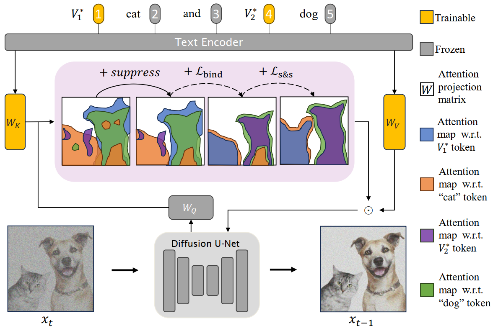
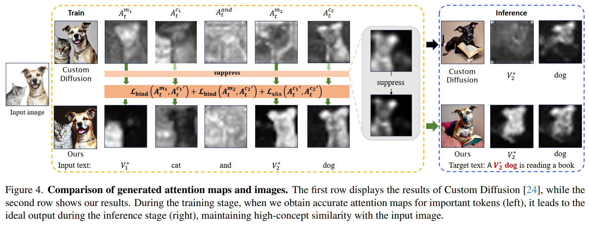

## Abstract

* 研究的问题：是否能从单张参考图像中捕捉多个新概念？现有的方法未能保持与参考图像的视觉一致性，并消除了概念之间的交叉影响。

* 方法：an attention calibration mechanism，以改善 文本生成图像 模型的 概念层面的理解能力。

  * 首先引入新的可学习修饰符 (learnable modifiers)，将其与类别绑定，以捕捉多个概念的属性。
  * 在 cross-attention 操作激活后，类别 分离并增强，以确保概念的全面性和独立性。
  * 抑制不同类别注意力的激活，以减轻概念之间的相互影响。

  提出的方法被称为 DisenDiff：可以从单张图片中学习被解耦的多重概念 (disentangled multiple concepts)

* 提出的方法 与 LoRA 和 图像修复流程 (inpainting pipelines) 兼容，从而实现更具交互性的体验。 

## Introduction

* **个性化 文本到图像 模型** 旨在 学习一个新的 词嵌入 (word embedding) 以表示特定概念。然而 现有方法仍缺乏灵活性，无法在给定的图像中渲染所有现有概念，或只关注特定概念。

* 复杂场景中出现多个概念，用户希望自由合成这些概念，即 可以组合多个对象也可以关注一个对象。

* 为了实现概念的灵活表达，使用多个新词来表示多个概念。

  > 例如，考虑一幅包含独特椅子和灯具的图像，利用提示“V1∗ 椅子 (chair) 和 V2∗ 灯 (lamp) ”来区分它们。

  这种直观的表达面临两个主要挑战：

  1. 新的词嵌入可能会混淆信息
  2. 在相对较小的训练集，该模型容易合成多个主体

* 论文提出的方法，仅更新 cross-attention 单元内的轻量级模块 ($W_K$ 和 $W_V$ 矩阵)，利用 新的 token embeddings 扩展概念。

* 关键见解：当前方法缺乏 优化过程 中的 必要指导，导致 attention map 混乱，因此，现有方法难以有效合成每个概念。

* 基于上述观察，论文从下面两个方面生成精确的 attention map ：

  * 关键点：class token 的 attention map 可以大致与 概念的位置 对齐。

    提出：修饰符-类别对齐项 (modifier-class alignment term)，将每个新 修饰符的 attention map 和 对应类别的 token 绑定，从而引导 attention 专注于相关概念的区域。

  * 问题：不同类别的 token 的 attention map 往往会重叠，导致错误的 属性绑定 (attribute binding) 和 相互纠缠。

    方法：引入 分离和增强 (separate and strengthen, s&s) 策略，以灵活独立地合成每个概念。通过最小化不同类别token 的 attention map之间的重叠区域，我们可以有效缓解在特定概念目标下的共同出现的问题。

    * 想法：进一步增强概念的独立性

      方法：引入一种抑制 (suppression) 技术，以 强化 类别token 的 attention map 的边界。

* 论文提出的方法旨在解决从单张图像中获取多个概念而无需特定领域预训练的更具挑战性的问题。

## Method

* cross-attention 作为 输入文本的每个的单词和中间视觉特征 之间的 激活相应 进行计算。
* 在 modifier-class token pairs 和 class-class token pairs 之间施加约束：
  * modifier-class constraint：将 每个 modifier 的 cross-attention map 和 它对应的 类别 绑定。
  * class-class constraint: 确保模型能够 充分理解 每个类别，并使不同类别之间分离。
* 为了进一步环节 文本生成图像模型的 交叉干扰问题，引入一种抑制 (subpression) 技术，以获每个类别token 更清晰的 attention map。

### Preliminary

**Stable Diffusion**：

* 实验使用 Stable Diffusion 作为主干模型，它具有三个组件（来自 CLIP 的预训练文本编码器 $\tau_\theta$，一个 VAE 模型 $\mathcal E$，一个在预训练VAE的隐空间 $z$ 上训练的 U-Net diffusion model $\epsilon_\theta$）。

* 给定在 $t$ 时刻的带噪隐编码 $z_t$，diffusion model 预测随机添加的噪声 $\epsilon$ 。扩散模型的训练目标：
  $$
  \mathbb E_{\mathcal E(x), y, \epsilon\sim \mathcal N(0,1), t}\left[ \|  \epsilon - \epsilon_\theta(z_t, t, \tau_\theta(y)) \|_2^2 \right],
  $$
  其中 $x$ 代表输入图像，$y$ 是输入文本。在 CLIP 中的先验知识是通过 cross-attention机制进行了整合。

**Integrating textual features via cross-attention**：

* denoiser U-Net 的 中间空间表征 $\phi(z_t)$ 被映射到 查询矩阵 $Q = W_Q\cdot \phi(z_t)$ 

* 文本嵌入 $\tau_\theta(y)$ 被映射到  key 矩阵 $K = W_K\cdot \tau_\theta(y)$ 和 value 矩阵 $V = W_V\cdot \tau_\theta(y)$ 

* 得到 cross-attention map：
  $$
  A_t = \text{Softmax}\left(\cfrac{QK^T}{\sqrt{d}} \right)
  $$
  其中 $d$ 是 keys $K$ 和 queries $Q$ 的投影维度。

* 更新后得到的空间表征整合了文本先验：$\phi(z_t) = A_tV$ 

denoiser U-Net 的 中间空间表征 $\phi(z_t)$ 被映射到 查询矩阵 $Q = W_Q\cdot \phi(z_t)$ 。文本嵌入 $\tau_\theta(y)$ 被映射到  key 矩阵 $K = W_K\cdot \tau_\theta(y)$ 和 value 矩阵 $V = W_V\cdot \tau_\theta(y)$ 。得到 cross-attention map：
$$
A_t = \text{Softmax}\left(\cfrac{QK^T}{\sqrt{d}} \right)
$$
其中 $d$ 是 keys $K$ 和 queries $Q$ 的投影维度。

**Text Encoding**：

* 在文本生成图像系统的训练过程中，除了选定的单张图片外，还需要一个合适的 文本提示。论文中 将 新的修饰符 和 待修饰的类别 纳入 输入文本。

  > 如果目标图像包含一只猫和一只狗，则文本提示为 “$V_1^∗$ cat and $V_2^∗$ dog”。  修饰 token "$V_i^*$"以稀有词汇初始化。

### Coherent binding of modifiers with classes

* 现象：基于先前的方法得到的 attention map $A_t$ ，可以观察到，虽然 新修饰符 的 $A_t$ 是混乱的($A_t^{m_1}$ 和 $A_t^{m_2}$)，但是 类别token 的 cross-attention 可以大致地捕捉到 语义边界 ($A_t^{c_1}$ 和 $A_t^{c_2}$)。

* 原因：T2I模型中大多数参数被冻结，从而保留了 类别token 的信息。

* 目标：帮助 新修饰符 理解它们的责任，定义约束将修饰符的 cross-attention map 和对应的 类别token 绑定如下：
  $$
  \mathcal L_{\text{bind}}(A_t^{m_i}, A_t^{c_i}) = 1-\cfrac{A_t^{m_i}\cap A_t^{c_i}}{A_t^{m_i}\cup A_t^{c_i}}
  $$

  * 这个损失函数被定义为减少这两个 attention map 的 交并比 (intersection over union, IoU)，鼓励 修饰词的激活 和 类别token 之间紧密对齐。在计算损失的过程中 停止梯度下降。

* 问题：$A_t$ 是 Softmax 操作的结果：$\sum_{i=1}^N A_t^i(h,w)=1$ ，其中 $A_t^i(h,w)$ 表示第 i 个 token 在像素 (h, w) 处的激活，输入 token 会在同一位置争夺注意力。

  * $A_t^{m_i}$ 和 $A_t^{c_i}$ 之间无法建立精确的像素对应关系。

* 目标：使 $A_t^{m_i}$ 的激活完全覆盖相应的对象，从而全面捕捉其所有属性。

  问题：在对象区域内，$A_t^{c_2}$ 的某些激活呈现出高值，则其他的则显著较低。这给 $A_t^{m_i}$ 维持对对象的全面关注带来挑战。

  方法：在 $A_t$ 上应用高斯滤波器，从而生成被称为 $G(A_t)$ 的平滑 attention map 。这个平滑过程有助于 减轻 token 之间的像素级 竞争，并促进对对象的更全面的关注。

  * 使用 损失函数 $L_{\text{bind}}(G(A_t^{m_i}, G(A_t^{c_i})))$ ，鼓励 $A_t^{m_i}$ 与 $A_t^{c_i}$ 具有一致的关注区域，同时实现对对象的更广泛覆盖。

### Separating and strengthening attention maps for multiple classes

* 问题：给定一张单独的图像作为训练集，单个 类别token 同时关注多个概念是不可避免的。

* 目标：确保概念的独立，必须分离不同对象的 attention 区域（即 $A_t^{c_i}$ 和 $A_t^{c_j}$）。一个简单的方法是最小化不同对象 token 之间注意力的重叠，如下所示：
  $$
  \mathcal L_{\text{separate}} (A_t^{c_i}, A_t^{c_j}) = A_t^{c_i} \cap A_t^{c_j}
  $$
  问题：利用 $\mathcal L_{\text{separate}}$ 有效防止了类token  的激活重叠，但可能减少 $A_t^{c_i}$ 的面积，这可能导致 相应类别 的身份消失。

* 目标：最小化 attention map 之间的重叠并保持类别身份，设计以下约束：
  $$
  \mathcal L_{s\&s}(A_t^{c_i}, A_t^{c_j}) = \cfrac{A_t^{c_i} \cap A_t^{c_j}}{A_t^{c_i} \cup A_t^{c_j}}
  $$

**Supperssion** (抑制)

* 问题：利用 $\mathcal L_{s\&s}$ 损失可能导致 attention map $A_t^{c_1}$ 捕获大量的激活，而 $A_t^{c_2}$ 的激活则很少。不同类别 token 之间激活的不平衡导致对某些类别的关注不平衡。
* 方法：计算 $\mathcal L_{s\&s}$ 之前，对 $A_t^{c_i}$ 应用逐元素乘法操作 $f_m(A_t^{c_i}) = A_t^{c_i}\odot A_t^{c_i}$。由于激活值在 [0,1] 之间，$f_m(A_t^{c_i})$ 过滤掉对该类别不重要的激活。因此，损失 $\mathcal L_{s\&s}(f_m(A_t^{c_i}), f_m(A_t^{c_j}))$ 的设计旨在 分离并增强 它们的注意力，防止自身边界侵占其他类别。

**总体训练损失**：
$$
\mathcal L = \mathcal L_{\text{base}} + \sum_{i=1}^{\mathcal S}\mathcal L_{\text{bind}}(G(A_t^{m_i}, G(A_t^{c_i}))) + \sum_{i=1}^{\mathcal S} \sum_{j=i+1}^{\mathcal S}\mathcal L_{s\&s}(f_m(A_t^{c_i}), f_m(A_t^{c_j}))
$$
$\mathcal S$ 是输入图像的类别数量，$\mathcal L_{\text{base}}$ 是 T2I 模型的基线损失。

**实验结果**

* 数据集：每幅图像包含两个不同的概念
* 推理阶段：对每幅图像测试 30 个不同的提示，10 个用于组合概念，10个针对第一个概念，10个聚焦第二个概念。
* 对其他三种个性化方法作了比较。
* 评估指标：
  1. 图像对齐度（Image-Alignment Metric）
  2. 文本对齐度（Text-Alignment Metric）
* 定量比较，定性比较
* 论文还进行了消融研究，展示每个组件的有效性并分析不同设计选择的影响。
* 论文提到的局限性：
  1. 当同一类别的两个主体共存于单张图像中，解开颗粒度类别的难度显著增加。
  2. 论文提出的方法处理包含三个概念的图像时，性能显著下降。
