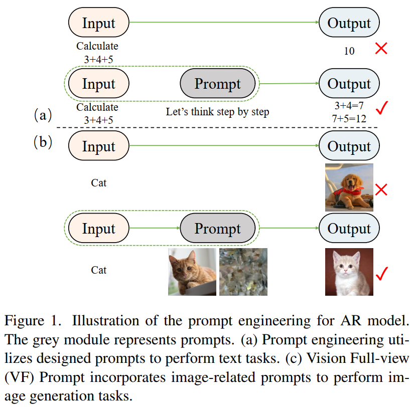
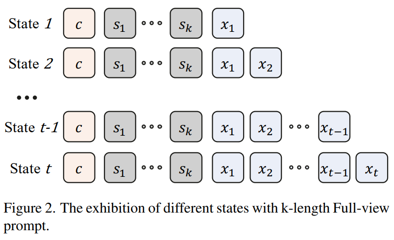
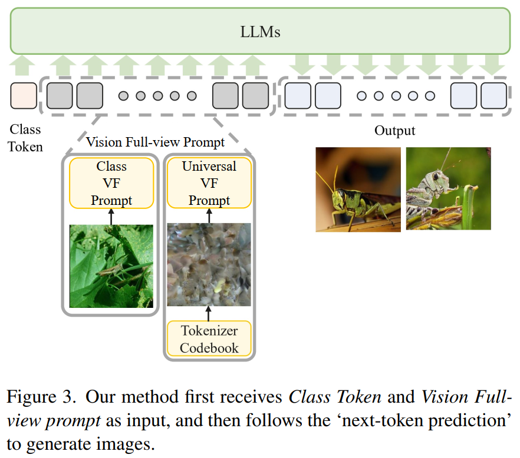

* 出发点：作为指导 LLMs 的关键技术，提示工程利用特定设计的提示来提高模型在复杂自然语言处理任务上的性能，增强生成的准确性和稳定性，同时保持上下文一致性和逻辑连贯性。
* 方法：Vision Full-view prompt (VF prompt)
  * 为 AR图像生成设计专门的图像相关的 VF提示，以模拟人类图像创作的过程。
  * 通过让模型先感知整体分布信息来增强上下文逻辑能力，并通过推理步骤来提高生成稳定性。
* 基本思路：指导模型在生成过程中首先掌握整体视觉信息，然后逐步生成局部细节。
  * 具体而言，设计用于 AR图像生成模型的 专业 VF 提示，模拟人类创作图像的过程，指导模型首先感知视觉全视角信息，然后生成图像。
  * VF 通过 增加 推理步骤增强了模型的上下文逻辑能力，提高了生成的稳定性。

 

## Preliminary

**AutoRegressive Modeling**：

* 图像：$W\times H\times 3$ ，量化为 $h\times w$ 形式的 discrete tokens map $X$，其中 $h = H/p, w = W/p$，$p$ 是 tokenizer 的下采样率。

* 根据光栅扫描顺序，$X$ 变形为一维序列 $(x_1, x_2, \cdots, x_t)$，$t = h\times w$ 

* 使用最大对数似然估计作为模型 $\theta$ 的训练目标：
  $$
  \theta_{\text{target}} = \arg \max_\theta \sum_{t=1}^T P_\theta(x_t|x_{<t})
  $$

* 在图像生成过程中，AR 根据条件 $c$ 以 'next-token prediction' 的方式预测目标图像 token，最终使用图像标记器的解码器将 图像token 转换为 图像。

## **Overview**

* 经典AR模型的 tokenizer 架构 和 "next-token prediction" 预测形式

* 在训练和推理过程中引入一组 VF prompt $\tilde S = (s_1, s_2,\cdots, s_k)$，并将 模型$\theta$ 的训练目标 修改为 最大化对数似然函数
  $$
  \sum_{i=1}^N\log P_\theta(x_t|x_{<t}, \tilde S, c)
  $$

* 模型推理方式：
  $$
  \prod_{t=1}^T P(x_t|x_{<t}, \tilde S, c)
  $$
  

## **Theoretical Analysis**

* 引入的 VF prompt: $\tilde S = (s_1, s_2, \cdots, s_k)$ 
* 生成的 token 序列：$\tilde X = (x_1, x_2, \cdots, x_t)$ 
* 条件：$c$ 
* 模型的参数：$\theta$ 

 

**Training Stage**

* 模型训练过程中，每个 token 预测都存在一个最优 token。

* 状态转移方程：
  $$
  T(i,j) = \begin{cases}
  p_j&\text{if }i=j-1\\
  p_j*T(i,j-1)& \text{if }i<j-1
  \end{cases}
  $$

* $p_j$ 表示模型在时间步 $j$ 预测 最佳的状态 $j$ token 的概率

* $T(i,j)$ 表示从最佳状态 $i$ 转移到 最佳状态 $j$ 的 **概率**

* 将经典 AR 模型的 $T_{AR}(1,t)$ 和 论文提出方法的 $T_{\text{VF\_prompt}}(1,t)$ 的表述如下：
  $$
  \begin{gather}
  T_{AR}(1,t) = T(1,2)*T(2,t)\\
  T_{\text{VF\_prompt}}(1,t) = T(c,k) * T(1,2)**T(2,t)
  \end{gather}
  $$
  其中 $k$ 表示序列 $\tilde S$ 的长度。

* 引入 VF prompt，得到额外的项 $T(c,k)$ 

* 模型的最终损失受目标序列与生成序列之间的交叉熵限制，它包含在 VF prompt 的交叉熵计算中，格式为 $\sum\log T(c,k)$ ，这一项作为随着 VF prompt 变化的偏置，帮助模型避免因训练数据与推理场景之间不匹配而导致的不稳定性。

**Inference Stage**

* 经典自回归模型在推理阶段的信息熵：$H(\tilde X|c)$ 

* 引入 VF prompt 的信息熵： $H(\tilde X|\tilde S, c)$ 

  由熵的定义有 $H(\tilde X|\tilde S, c) = H(\tilde X, \tilde S| c) - H(\tilde S|c)$，故有：
  $$
  H(\tilde X|\tilde S, c) - H(\tilde X| c) = H(\tilde X, \tilde S| c) - H(\tilde S|c) - H(\tilde X|c) \leqslant 0
  $$
  这意味着该方法具有更小不确定性。

 

## Vision Full-view Prompt

选择两种 vision full-view prompt $\tilde S$ 以纳入模型的**训练和推理**过程。

1. 随机选择一张和训练目标不同但它仍属于与目标**相同的类别**的图像。在经过图像 tokenizer 处理 后，它被转换为 token，然后 **与 条件 c 连接**并 输入到模型中。

   在推理过程中，我们随机选择一张图像，将其转化为 token 后作为输入。

2. 基于均匀分布从 图像 tokenizer 的 码本 (codebook) 中 **随机采样一组索引**。采样得到的 **索引集合与条件 c 连接**，作为输入供给模型。

这两种不同的 vision full-view prompt 代表了用于指导模型 model 生成图像的两种不同的表征：

* 第一个 prompt 对应于一种特定类别的表征，称为 Class VF prompt，旨在帮助模型更好地理解与给定条件对应的分布，从而生成更清晰地表征类别信息的图像。
* 第二个 prompt，称为 Universal VF prompt，代表一种更通用的图像分布，旨在鼓励模型生成更多样化图像。

