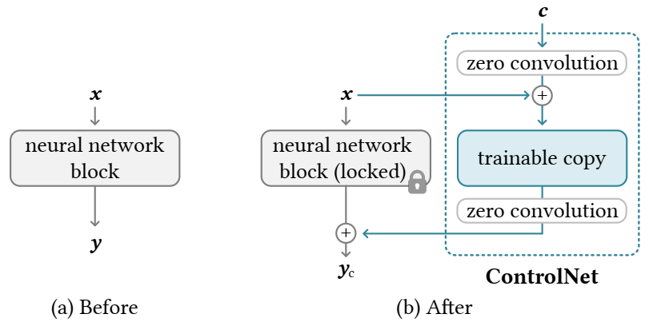
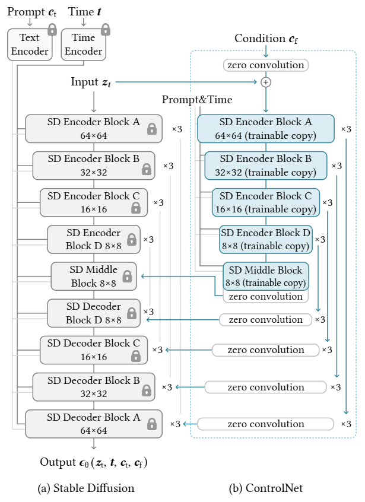

原文：[Adding Conditional Control to Text-to-Image Diffusion Models](https://arxiv.org/abs/2302.05543)

## 1 简介

* 出发点：文本提示单独精确表达复杂的布局、姿势、形状和形式可能是困难的。希望让用户提供额外的图像来实现更细粒度的空间控制，这些图像直接指定其期望的图像构图。
* ControlNet: 端到端神经网络架构，用于学习大型训练文本到图像扩散模型的条件控制。
  * 锁定扩散模型的参数来保持大模型的质量和能力
  * 制作了一个可训练副本来处理其编码层
  * 把预训练模型视为学习多样化条件控制的主干
  * 可训练副本与原始锁定模型通过零卷积层连接，其权重初始化为零，并在训练过程中逐渐增长。

## 2 方法

### 2.1 ControlNet

ControlNet 将额外条件注入到神经网络的块中。



方法：锁定 原始块 并创建一个可训练的副本，并通过零卷积层连接它们，即，1×1卷积，权重和偏差均初始化为零。这里 c 是添加到网络中的条件向量。

* 假设 $\mathcal F(\cdot; \Theta)$ 是一个经过训练的神经块（一组通常组合在一起形成神经网络单元的神经层），参数为 $\Theta$ 。

  将输入特征图 $x$ 转换为另一个特征图 $y$ ：$y = \mathcal F(x; \Theta)$ 

  在我们的设置中，$x$ 和 $y$ 通常是二维特征图，$x, y\in \mathbb R^{h\times w\times c}$ 

* 为了将 ControlNet 加入到这样的预训练神经块中，我们锁定（冻结）原始块的参数 $\Theta$ ，同时 **复制该块** 为一个 **可训练副本**，具有参数 $\Theta_c$ 。可训练副本将外部条件 $c$ 作为输入。

* 可训练副本 通过 零卷积层 与 锁定模型 相连，记作 $\mathcal Z(\cdot; \cdot)$。具体而言，$\mathcal Z(\cdot; \cdot)$ 是一个 1×1 的卷积层，其权重和偏置均初始化为零。为了建立 ControlNet，分别使用两个参数为 $\Theta_{z1}$ 和 $\Theta_{z2}$ 的零卷积实例。

* 完整的 ControlNet 计算：
  $$
  y_c = \mathcal F(x;\Theta) + \mathcal Z(\mathcal F(x + \mathcal Z(c;\Theta_{z1});\Theta_{c});\Theta_{z2})
  $$

  * 第一个训练步骤中，由于零卷积层的权重和偏置参数都初始化为零，上面方程的两个 $\mathcal Z(\cdot; \cdot)$ 两项均评估为零，并且 $y_c = y$ 。这种情况下，有害噪声无法影响可训练副本中神经网络层的隐藏状态。
  * 此外，由于 $Z(c;\Theta_{z1}) = 0$ 而可训练副本也接收输入图像 $x$，因此可训练副本完全功能化并保留大型预训练模型的能力，使其能够作为进一步学习的强大骨干。

### 2.2 ControlNet for Text-to-Image Diffusion

Stable Diffusion 的结构：编码器 + 中间块 + 解码器

* 编码器 和 解码器 都包含 12 个块
* 完整模型包含 25 个块，其中 8 个块是下采样或上采样的卷积层，其余 17 块为主块，每个主块包含 4 个 ResNet 层 和 2 个 Vision Transformers (ViTs)，每个 ViT 包含多个 cross-attention 和 self-attention 机制。
* Text prompts 使用 CLIP 文本编码器，扩散时间步长通过位置编码通过 time encoder 编码。



* ControlNet 结构应用于 U-Net 的每个Encoder Block。

* 使用 ControlNet 创建 Stable Diffusion 的 12 个 Encoder Block 和 1 个 Middle Block 的可训练副本。输出添加到 U-Net 的 12 个 skip-connection 和 1 个 middle block 上。

* 为了将 ControlNet 添加到 Stable Diffusion 中，我们首先将每个输入条件图像从输入大小 512 × 512 像素空间图像转换为与 Stable Diffusion 大小匹配的 64×64 特征空间向量。特别地，我们使用一个包含四个卷积层的微小网络 $\mathcal E(\cdot)$ ，将图像空间条件 $c_i$ 编码为特征空间向量 $c_f$，如：
  $$
  c_f = \mathcal E(c_i)
  $$
  将条件向量 $c_f$ 传入 ControlNet

## 3 Training

给定输入图像 $z_0$ ，图像扩散算法逐步向图像增加噪声，并产生噪声图像 $z_t$，其中 $t$ 表示添加噪声的次数。基于一组条件，包括时间步 $\boldsymbol{t}$、文本提示 $\boldsymbol{c}_t$ 以及 **特定任务的条件** $\boldsymbol{c}_f$ ，图像扩散算法学习一个网络 $\epsilon_\theta$ 来预测添加到 $\boldsymbol{z}_t$ 中的噪声。Diffusion Model 的总体学习目标：
$$
\mathcal L = \mathbb E_{\boldsymbol{z}_0, \boldsymbol{t}, \boldsymbol{c}_t, \boldsymbol{c}_f\sim \mathcal N(0,1)}\left[\|\epsilon - \epsilon_\theta(\boldsymbol{z}_t, \boldsymbol{t}, \boldsymbol{c}_t, \boldsymbol{c}_f)\|_2^2 \right]
$$

> 模型不是逐渐学习控制条件，而是突然成功地跟随输入的条件图像（sudden convergence phenomenon）


## 4 Inference

无分类器引导分辨率加权：Stable Diffusion 依赖于 无分类器引导(Classifier-Free Guidance, CFG) 的技术生成高质量图像。

CFG 的公式：$\epsilon_{\text{prd}} = \epsilon_{\text{uc}} + \beta_{\text{cfg}}(\epsilon_{\text{c}} - \epsilon_{\text{uc}})$

* $\epsilon_{\text{prd}}$：模型的最终输出
* $\epsilon_{\text{uc}}$：模型的无条件输出
* $\epsilon_{\text{c}}$：模型的有条件输出
* $\beta_{\text{cfg}}$：用户指定的权重

通过 ControlNet 添加条件图像时，可以将其添加到 $\epsilon_{\text{uc}}$ 和 $\epsilon_{\text{c}}$ ，或者仅添加到 $\epsilon_{\text{c}}$ 。仅使用 $\epsilon_{\text{c}}$ 将使引导非常强。

组合多个 ControlNets: 为了将多个条件图像应用到一个 Stable Diffusion 的实例，可以直接将相应的 ControlNets 的输出添加到 Stable Diffusion 模型中。（不需要额外的加权或线性插值）


## 5 代码

源码：https://github.com/lllyasviel/ControlNet/tree/main

`ControlledUnetModel`：

```python
class ControlledUnetModel(UNetModel):
    def forward(self, x, timesteps=None, context=None, control=None, only_mid_control=False, **kwargs):
        hs = []
        with torch.no_grad():
            t_emb = timestep_embedding(timesteps, self.model_channels, repeat_only=False)
            emb = self.time_embed(t_emb)
            h = x.type(self.dtype)
            for module in self.input_blocks:
                h = module(h, emb, context)
                hs.append(h)
            h = self.middle_block(h, emb, context)

        # 如果提供了 control信号，将它应用到当前的特征图中
        if control is not None:
            h += control.pop()

        for i, module in enumerate(self.output_blocks):
            if only_mid_control or control is None:
                h = torch.cat([h, hs.pop()], dim=1)
            else:  # 将 control信号添加当前输出特征图中
                h = torch.cat([h, hs.pop() + control.pop()], dim=1)
            h = module(h, emb, context)

        h = h.type(x.dtype)
        return self.out(h)
```

ControlNet:

```python
class ControlNet(nn.Module):
    def __init__(
            self,
            ...,
            hint_channels,
            ...,
    ):
        super().__init__()
        # ... 特殊情况判断（省略）

        self.dims = dims
        self.image_size = image_size
        self.in_channels = in_channels
        self.model_channels = model_channels
        if isinstance(num_res_blocks, int):
            self.num_res_blocks = len(channel_mult) * [num_res_blocks]
        else:
            if len(num_res_blocks) != len(channel_mult):
                ...
            self.num_res_blocks = num_res_blocks
        if disable_self_attentions is not None:
            # should be a list of booleans, indicating whether to disable self-attention in TransformerBlocks or not
            assert len(disable_self_attentions) == len(channel_mult)
        if num_attention_blocks is not None:
            ...

        self.XXX = XXX
        # ...省略
        self.predict_codebook_ids = n_embed is not None

        time_embed_dim = model_channels * 4
        self.time_embed = nn.Sequential(
            linear(model_channels, time_embed_dim),
            nn.SiLU(),
            linear(time_embed_dim, time_embed_dim),
        )

        self.input_blocks = nn.ModuleList(
            [
                TimestepEmbedSequential(
                    conv_nd(dims, in_channels, model_channels, 3, padding=1)
                )
            ]
        )
        
        # 零卷积层
        self.zero_convs = nn.ModuleList([self.make_zero_conv(model_channels)])
        # 条件特征图处理
        self.input_hint_block = TimestepEmbedSequential(
            conv_nd(dims, hint_channels, 16, 3, padding=1),
            nn.SiLU(),
            conv_nd(dims, 16, 16, 3, padding=1),
            nn.SiLU(),
            conv_nd(dims, 16, 32, 3, padding=1, stride=2),
            nn.SiLU(),
            conv_nd(dims, 32, 32, 3, padding=1),
            nn.SiLU(),
            conv_nd(dims, 32, 96, 3, padding=1, stride=2),
            nn.SiLU(),
            conv_nd(dims, 96, 96, 3, padding=1),
            nn.SiLU(),
            conv_nd(dims, 96, 256, 3, padding=1, stride=2),
            nn.SiLU(),
            zero_module(conv_nd(dims, 256, model_channels, 3, padding=1))  # 零卷积层
        )

        self._feature_size = model_channels
        input_block_chans = [model_channels]
        ch = model_channels
        ds = 1
        # 根据每一层的channel_mult和num_res_blocks构建多层
        for level, mult in enumerate(channel_mult):
            for nr in range(self.num_res_blocks[level]):
                layers = [
                    ResBlock(
                        ch,
                        time_embed_dim,
                        dropout,
                        out_channels=mult * model_channels,
                        dims=dims,
                        use_checkpoint=use_checkpoint,
                        use_scale_shift_norm=use_scale_shift_norm,
                    )
                ]
                ch = mult * model_channels
                # 如果当前分辨率需要使用注意力块，添加注意力层
                if ds in attention_resolutions:
                    if num_head_channels == -1:
                        dim_head = ch // num_heads
                    else:
                        num_heads = ch // num_head_channels
                        dim_head = num_head_channels
                    if legacy:
                        # num_heads = 1
                        dim_head = ch // num_heads if use_spatial_transformer else num_head_channels
                    if exists(disable_self_attentions):
                        disabled_sa = disable_self_attentions[level]
                    else:
                        disabled_sa = False

                    if not exists(num_attention_blocks) or nr < num_attention_blocks[level]:
                        layers.append(
                            AttentionBlock(
                                ch,
                                use_checkpoint=use_checkpoint,
                                num_heads=num_heads,
                                num_head_channels=dim_head,
                                use_new_attention_order=use_new_attention_order,
                            ) if not use_spatial_transformer else SpatialTransformer(
                                ch, num_heads, dim_head, depth=transformer_depth, context_dim=context_dim,
                                disable_self_attn=disabled_sa, use_linear=use_linear_in_transformer,
                                use_checkpoint=use_checkpoint
                            )
                        )
                self.input_blocks.append(TimestepEmbedSequential(*layers))
                self.zero_convs.append(self.make_zero_conv(ch))
                self._feature_size += ch
                input_block_chans.append(ch)
            # 处理下采样
            if level != len(channel_mult) - 1:
                out_ch = ch
                self.input_blocks.append(
                    TimestepEmbedSequential(
                        ResBlock(
                            ch,
                            time_embed_dim,
                            dropout,
                            out_channels=out_ch,
                            dims=dims,
                            use_checkpoint=use_checkpoint,
                            use_scale_shift_norm=use_scale_shift_norm,
                            down=True,
                        )
                        if resblock_updown
                        else Downsample(
                            ch, conv_resample, dims=dims, out_channels=out_ch
                        )
                    )
                )
                ch = out_ch
                input_block_chans.append(ch)
                self.zero_convs.append(self.make_zero_conv(ch))
                ds *= 2
                self._feature_size += ch

        # 配置最后的中间块（包括自注意力块）
        if num_head_channels == -1:
            dim_head = ch // num_heads
        else:
            num_heads = ch // num_head_channels
            dim_head = num_head_channels
        if legacy:
            # num_heads = 1
            dim_head = ch // num_heads if use_spatial_transformer else num_head_channels
        self.middle_block = TimestepEmbedSequential(
            ResBlock(
                ...,
            ),
            AttentionBlock(
                ...,
            ) if not use_spatial_transformer else SpatialTransformer(  # always uses a self-attn
                ...,
            ),
            ResBlock(
                ...,
            ),
        )
        self.middle_block_out = self.make_zero_conv(ch)
        self._feature_size += ch

    def make_zero_conv(self, channels):  # 零卷积函数
        return TimestepEmbedSequential(zero_module(conv_nd(self.dims, channels, channels, 1, padding=0)))

    # 前向传播函数
    def forward(self, x, hint, timesteps, context, **kwargs):
        t_emb = timestep_embedding(timesteps, self.model_channels, repeat_only=False)
        emb = self.time_embed(t_emb)

        # 处理 条件输入
        guided_hint = self.input_hint_block(hint, emb, context)

        outs = []

        h = x.type(self.dtype)
        # 逐层处理输入数据
        for module, zero_conv in zip(self.input_blocks, self.zero_convs):
            if guided_hint is not None:
                h = module(h, emb, context)
                h += guided_hint
                guided_hint = None
            else:
                h = module(h, emb, context)
            outs.append(zero_conv(h, emb, context))

        # 处理中间块
        h = self.middle_block(h, emb, context)
        outs.append(self.middle_block_out(h, emb, context))

        return outs
```

