参考：

* https://zhuanlan.zhihu.com/p/623557803
* https://www.bilibili.com/video/BV1TecTeoErX

# Chain of Thought

# 1 提出

* 论文地址：https://arxiv.org/abs/2201.11903

最早提出是在2022年5月谷歌发表的《Chain-of-Thought Prompting Elicits Reasoning in Large Language Models》文章中。

论文的提出方法的出发点是：

* 大语言模型扩大规模 能带来性能的提高，但是在 算术、思维推理等具有挑战性的任务上 难以实现高性能。
* 推理技术可以通过生成自然语言推理过程 (retionales) 来帮助得出最终答案。

> 前人的工作：
>
> 1. 赋予模型生成自然语言中间步骤的能力
>    * 方法：从头开始训练或微调或使用形式语言的方法
>    * 缺点：创建大规模高质量的推理过程代价昂贵
> 2. 通过 prompting 提供了上下文少样本学习方式 (few-shot learning)
>    * 缺点：推理能力表现不佳
>
> 论文的思路：避免这些局限性同时结合两者优势。

方法：**chain-of-thought prompting**。

> 考虑人类在解决复杂推理任务时候的思维过程，比如在解决多步骤的数学文字问题，我们通常会 **将问题分解为多个中间步骤，逐个解决，最后得出答案**。
>
> After Jane gives 2 flowers to her mom she has 10... then after she gives 3 to her dad she will have 7... so the answer is 7.  

* 论文的目标：赋予语言模型生成类似于人类思考的思维链 (chain of thought)

* 论文探索 语言模型 在推理任务中的少样本提示能力，并采用 由三元组组成的提示：(input, chain of thought, output)。

* chain of thought 思维链 是一系列 通向最终输出 的中间自然语言推理步骤

* 论文具体实现的方法：在样本提示中，包含带有少量**思维链的示例**，就可以 引发大型语言模型进行思维链推理，无需对模型进行额外的训练或微调。

论文给出的示例：

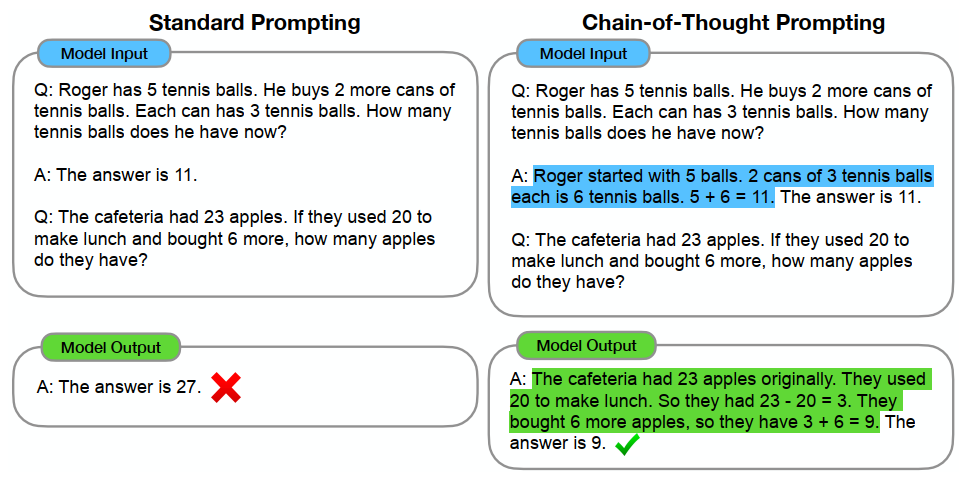

问题：需要精心设计带有中间推理步骤的提示示例，增加了人力成本。

# 2 方法介绍

参考：《大模型基础》(https://github.com/ZJU-LLMs/Foundations-of-LLMs)

在心理学上，System-1 任务和 System-2 任务分别代表两种不同的思维方式所处理的任务类型：

1. System-1：思考过程快速、自动且无意识，主要依靠直觉和经验判断，不需要刻意的思考。
2. System-2：思考过程比较缓慢，需要集中注意力，运用逻辑分析、计算和有意识的思考来解决问题。

随着 大模型参数量、算力开销、数据量协同增长，在标准提示下，其在 System-1 任务上性能显著增强。然而，在 System-2 任务上，大模型表现出了 "Flat Scaling Curves" 现象——即模型规模增长未带来预期性能提升。

* 面对 System-1 问题，如 常识回答、情感分类、意图识别 等，随规模变大，大模型性能显著提升
* 面对 System-2 问题，如 复杂数学计算、逻辑推理 等，大模型性能 提升缓慢甚至停滞不前。

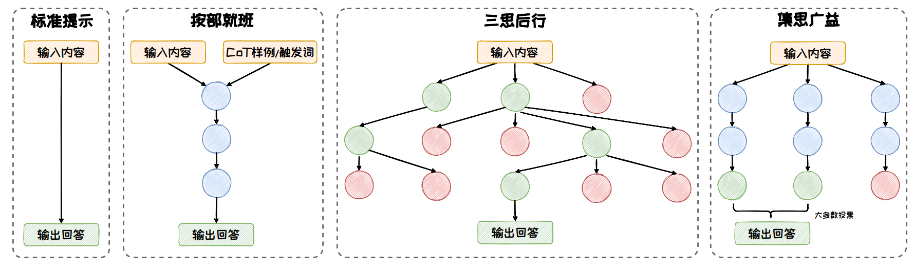

**思维链**：通过在提示中嵌入一系列 **中间推理步骤**，引导大语言模型模拟人类解决问题时的思考过程，以提升模型处理 System2任务的能力。

在标准的 CoT 方法上，出现了许多扩展的方法：按部就班、三思后行、集思广益。

* **按部就班**：在按部就班模式中，模型一步接着一步地进行推理，推理路径形成了一条逻辑连贯的链条。以 CoT、Zero-Shot CoT、Auto-CoT 等方法为代表。

  * 强调：逻辑的连贯性和步骤的顺序性

  * Zero-Shot CoT：使用两阶段回答问题：

    1. 第一阶段，在问题后面跟上一句“**让我们一步一步思考**”作为 CoT 的提示触发词，来指示大语言模型先生成中间推理步骤，再生成最后的答案
    2. 第二阶段，把原始的问题以及第一阶段生成的推理步骤拼接在一起，在末尾加上一句“**因此，最终答案为**”，把这些内容输给大语言模型，让它输出最终的答案

    标注成本低，算法性能差

    

  * Auto-CoT：

    1. 利用聚类技术从问题库中筛选出与用户提问位于一个簇中的问题
    2. 借助 Zero-Shot CoT 的方式，为筛选出的问题生成推理链，形成示例。
    3. 在这些示例基础上，  引导大语言模型生成针对用户问题的推理链和答案。

    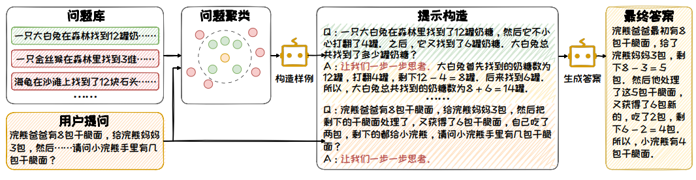

* **三思后行**：每一步都停下来评估当前的情况，然后从多个推理方向中选择出下一步的前进方向。以 ToT、GoT 等方法为代表。

  * Tree of Thoughts (ToT)：将推理过程视为**一棵思维树**，从拆解、衍生、评估、搜索 四个方面进行构造：

    * **拆解**：把复杂问题拆分成**多个简单子问题**，每个子问题的解答过程对应一个思维过程。
    * **衍生**：模型需要根据子问题 生成可能的下一步推理方向。衍生有两种模式：样本启发和命令提示。
    * **评估**：利用模型评估推理节点合理性。有投票和打分两种评估模式。
    * **搜索**：从一个或多个当前状态出发，搜索通往问题解决方案的路径。根据任务特点选择不同的搜索算法。

    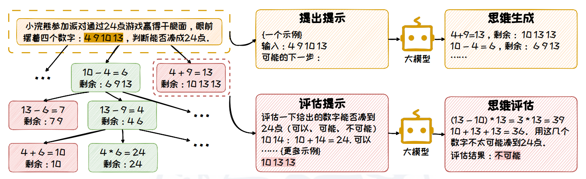

  * Graph of Thoughts (GoT)：通过特定提示，自动化构造 一步一步推理 回答问题的例子，在 ToT 基础上，将树拓展为有向图，具有思维自我反思、思维聚合的能力。

* **集思广益**：同时生成**多条推理路径**并得到**多个结果**，然后整合这些结果，得到一个更为全面和准确的答案。以 Self-Consistency 等方法为代表。

  * Self-Consistency：引入多样性的推理路径，从中提取并选择最一致的答案，从而提高了模型的推理准确性。Self-Consistency 不依赖于 特定的 CoT 形式，可以与其他 CoT 方法兼容，共同作用于模型的推理过程。

    1. 推理路径生成：在随机采样策略下，使用 CoT 或 Zero-Shot CoT 的方式来引导大语言模型针对解决问题生成一组多样化的推理路径
    2. 汇总答案：收集最终答案，统计每个答案在所有推理路径中出现的频率
    3. 选择答案：选择出现 **频率最高** 的答案作为最终的、最一致的答案

    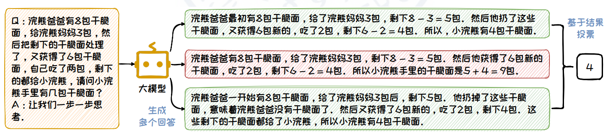

  * Universal Self-Consistency：利用 LLMs <u>自身选择最一致答案</u>，支持更多种任务，无需答案提取过程。在多任务中性能良好且输出匹配度更高、对顺序鲁棒。

# 3 应用

## 3.1 大语言模型 - DeepSeek

《DeepSeek-R1: Incentivizing Reasoning Capability in LLMs via Reinforcement Learning》（https://arxiv.org/abs/2501.12948）

在 DeepSeek R1 中，充分展示了 大语言模型 的 推理能力。

1. 利用 **强化学习** ，让模型探索 **思维链** (CoT) 以解决复杂问题，由此开发出 DeepSeek-R1-Zero，该模型具有 自我验证、反思和 生成长思维链 的能力。

   * 缺点：在可读性差和语言混杂等挑战上表现不佳。  
   
2. 基于 DeepSeek-V3-Base 开发 DeepSeek-R1 的流程：

   1. Cold Start，构建一部分 长思维链数据 **微调模型**，使其作为 初始 RL actor

   2. 大规模强化学习训练：增强模型的推理能力，特别是 编程、数学、科学和逻辑推理等需要推理的任务。

   3. 监督微调(Supervised Fine-Tuning, SFT)：增强模型在写作、角色扮演和其他**通用任务**中的能力。  

      使用推理数据和非推理数据对模型进行两轮微调。

   4. 强化学习：使模型与人类偏好保持一致。

   5. 知识蒸馏 (Distillation)

## 3.2 多模态大语言模型的视觉思维链 Visual CoT

论文地址：https://arxiv.org/abs/2403.16999

* 研究出发点：多模态大语言模型在各种视觉问答任务中表现出色。然而，它们往往 **缺乏可解释性**，并且在处理复杂的视觉输入时表现不佳。

* 目的：提高 MLLM 的准确性和适应性，所以需要提出能够处理 多轮、动态聚焦视觉输入 的方法，同时提供 更具可解释性 的推理阶段

  困难：

  * 现有的**视觉问答数据集**缺乏中间视觉链式思维监督
  * 流行的 MLLM pipeline 依赖于静态的图像上下文输入
  
* 研究提出：

  * 大规模 Visual CoT 数据集：每个数据项 由 一个问题、一个答案、一个中间边界框。一些数据项同时包含 细节的推理步骤。

    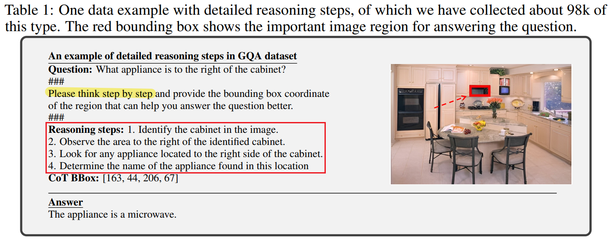

  * multi-turn processing pipeline：动态地关注 视觉输入 并 提供可解释的思考过程。

    * visual CoT MLLM framework: "VisCoT"

    * VisCoT pipeline: 

      1. 在问题中添加 提示 "Please provide the bounding box coordinate of the region that can help you answer the question better. "，让模型识别图像中信息量最大的区域。

      2. 根据边界框坐标确定该区域并生成其边界框

         > 训练阶段，使用真实的边界框来提取视觉信息

      3. 利用原始图像和边界框， visual sampler 提取包含详细信息的局部图像。

      4. MLLM 使用 {原始图像 visual token, 局部图像 visual token} 来提供更精确和全面的答案。

    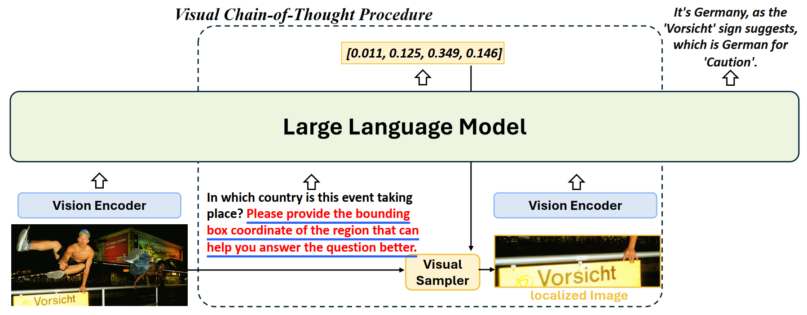

    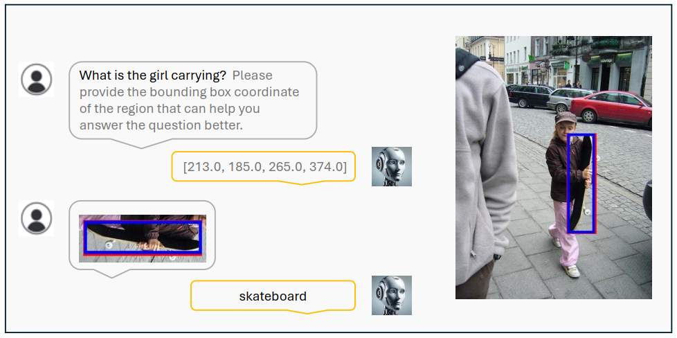
  
  * visual CoT banckmark：评估 在需要聚焦特定局部区域的场景下 MLLMs 的表现。

## 3.3 基于定位的思维链 GCoT

论文地址：https://arxiv.org/abs/2502.08092

* 研究出发点：

  * 现有的多模态大语言模型 容易受到 **视觉幻觉** (visual hallucination) 的影响。

    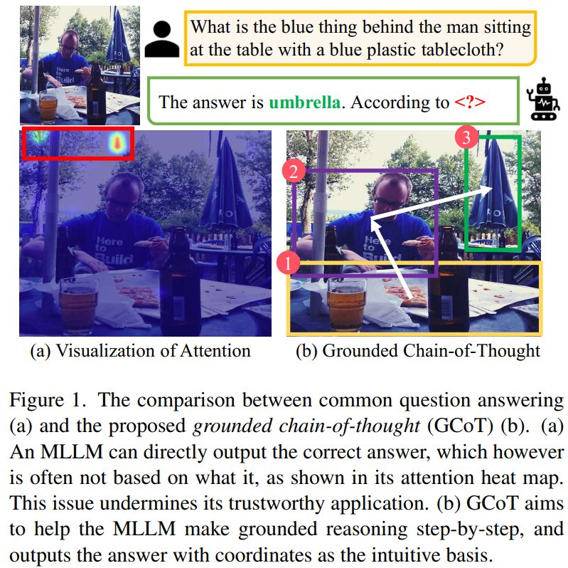

  * 在面向 MLLM 的 CoT 领域，最近的研究主要集中于**视觉解释**或**知识推理**。这些方法并没有验证每个推理步骤是否是正确的视觉证据。

  * 以前的视觉定位工作旨在 定位 给定问题中所提到的所有对象。GCoT 则侧重于分析问题，形成基于定位的推理步骤，并最终给出正确答案。

* 方法：

  1. 从 **视觉空间推理** (visual-spatial reasoning) 的角度研究 这个问题，提出 **Grounded Chain-of-Thought** (GCoT)。

     GCoT 帮助 MLLM 逐步 识别并定位 相关视觉线索，从而 将定位坐标作为直觉基础 来预测正确答案。

     GCoT 旨在培养 MLLM 的视觉和空间感知能力，使它们能够为正确回答问题打好基础。

     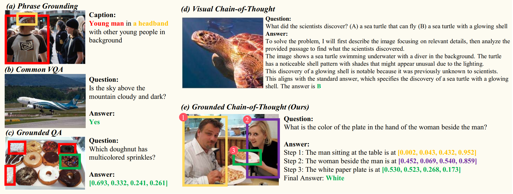

  2. 构建一个 数据集：multimodal grounded chain-of-thought (MM-GCoT)。用于现有 MLLM 的 SFT 调优。所有样本分为 Attribute、Judgment、Object 三种类型。

  3. 引入一个综合一致性评估系统，包括 answer accuracy、grounding accuracy 以及 answer-grounding consistency 三个指标。

## 3.4 自回归图像生成模型的思维链应用 - Autoregressive Model

在图像生成领域，Diffusion Model 占据主导地位，最近，Autoregressive Model 的研究也取得了一定的进展：

* `VAR`：《Visual Autoregressive Modeling: Scalable Image Generation via Next-Scale Prediction》："next-image-token prediction"  => "next-scale(next-resolution) prediction"。

  （https://arxiv.org/abs/2404.02905）

* `llamaGen`：《Autoregressive Model Beats Diffusion: Llama for Scalable Image Generation》："next-token prediction" 架构。

  （https://arxiv.org/abs/2406.06525）

由于上述图像生成模型结构和大语言模型相似，因此有研究探索 CoT 应用于 图像生成模型中。

* 《Can We Generate Images with CoT? Let’s Verify and Reinforce Image Generation Step by Step》首次系统地探讨了将 “**思维链**”（CoT）推理策略应用于自回归图像生成的**潜力**。

  （https://arxiv.org/abs/2501.13926）

  * 在 结果奖励模型 (**Outcome Reward Model**) 和 过程奖励模型 (**Process Reward Model**) 的基础之上提出了 **Potential Assessment Reward Model** (PARM)。

  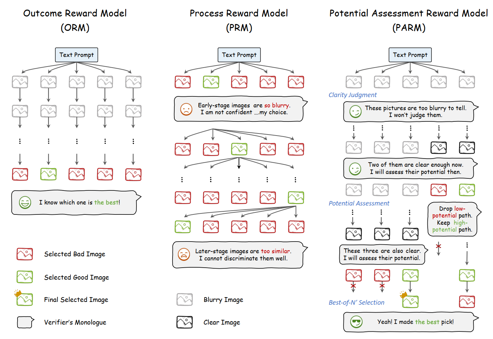

  * Potential Assessment Reward Model

    1. 判断 哪一步生成的图像 足够清晰 以 进行评估。
    2. 评估 当前步骤 是否有潜力生成高质量的最终图像。
    3. 对剩余的 最终路径 进行评分 以选择最佳路径。

  * 增强版本 PARM++：在 PARM 基础上，增加一种 **反思机制**，使自回归模型能够优化其先前生成的图像。

    * **图像生成模型的自我修正** 依赖于 **文本提示** 作为输入，仅输出图像模态。

      因此，**反思能力必须由 一个外部 奖励模型 来处理**，负责识别 **不一致** 并 **提供解释**。此外，图像生成模型本身也需要进行微调，以有效理解和回应这些反思文本以实现自我修正。

    * PARM++：在 N' 个图像候选中选出最佳输出后，检查最终图像与输入文本之间的一致性。

      * 如果一致，直接作为最终输出图像；
      * 如果不一致，则提供不一致的详细分析，将三个输入反馈给生成模型，以自我修正其图像输出，包括 **原始文本提示**、**之前生成的次优图像** 和 **识别的不一致原因**。

      （如此反复多次）

    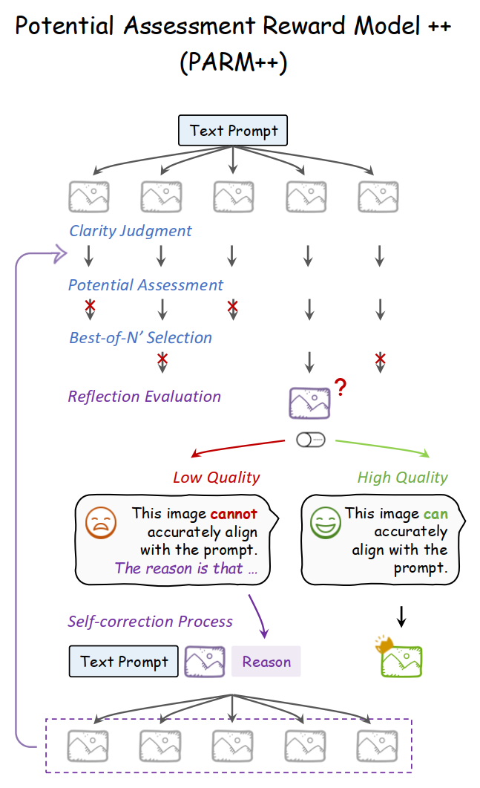

## 3.5 RPG-Diffusion

论文地址：https://arxiv.org/abs/2401.11708

* 问题：扩散模型在处理复杂文本提示的时候面临困难。

  * 现有基于布局或者注意力的方法 只能 提供粗略和次优的空间指导，并且**难以处理重叠物体**。
  * 基于反馈的方法需要收集高质量的反馈并产生额外的训练成本。

* 方法：

  提出一种 training-free text-to-image generating/editing framework，称为 **Recaption**, **Plan** and **Generate** (RPG)。

  利用 MLLM 的链式推理能力，增强文本到图像扩散模型的组合性 (compositionality)。RPG 中三个核心策略：

  1. Multimodal Recaptioning

     * 使用 LLMs 将 text prompt 拆分为 单独的 subprompt，然后对它们进行 更详细的描述。
     * 使用 MLLM 自动对 输入图像进行 recaption，从而识别 生成图像 和 目标提示 之间的语义差异。

     > recaption 主要指 重新生成或优化图像的文本描述（caption）

  2. Chain-of-Thought Planning

     * 将图像空间划分为互补的 子区域，不同子区域 分配 不同的 subprompt。
     * 精心设计任务指令和上下文示例，利用 MLLM 的 思维链推理能力 实现更高效的 区域划分。

  3. Complementary Regional Diffusion

     * 在 指定的矩形 子区域，根据 subprompt 生成图像内容，随后通过 缩放和拼接 的方式将它们进行空间合并。
     * 扩展：通过基于轮廓的区域扩散（Contour-based Regional Diffusion），精准修改目标区域的不一致内容。

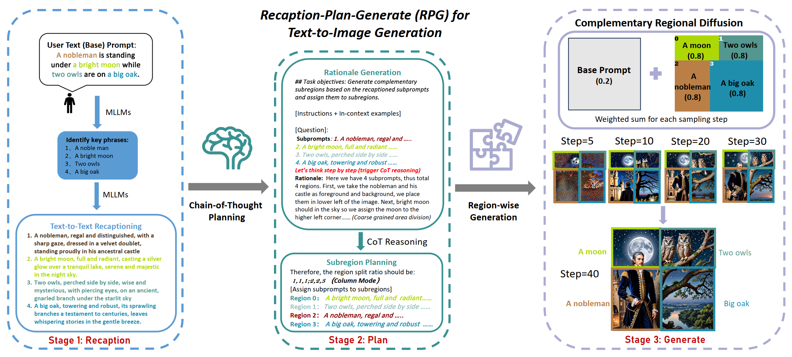

## 3.6 增强文本-图像生成上下文推理能力的思维链应用 ImageGen-CoT

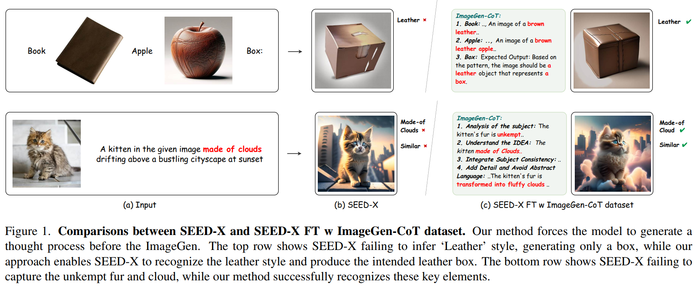

论文地址：https://arxiv.org/abs/2503.19312

* 问题：统一多模态大语言模型 (unified MLLM) 在 Text-to-Image In-Context Learning (T2I-ICL) 场景的 **上下文推理** 仍然存在困难。

* 方法：

  * 在生成图像之前纳入了一种称为 ImageGen-CoT 的思维过程，有助于 unified MLLM 更好地理解 上下文并生成更连贯的输出。

  * 为了避免生成 无结构的无效推理步骤 => 开发了一个自动化流程来构建高质量的 ImageGen-CoT 数据集。=> 使用数据集对 MLLM 进行微调来增强它们的上下文推理能力。

    流程主要包括三个阶段：

    1. 收集 T2I-ICL instructions。
    2. 使用 MLLMs 生成 step-by-step reasoning。
    3. 通过 MLLMs 生成图像描述，以便 Diffusion Model 来生成图像。

    为了进一步提高数据集质量，采用了迭代精炼过程：模型首先生成多个文本提示和相应的图像，选择最佳的一个，对生成的图像进行评析，并迭代地优化提示直到到达最大轮次。

    随后，使用该数据集对模型进行微调。

  * 研究探索了三种 test-time scale-up strategies (测试时扩展策略)：

    1. Multi-Chain：生成多个 ImageGen-CoT 链，每个链生成一张图像
    2. Single-Chain：从一个 ImageGen-CoT 创建多个图像变体
    3. **Hybrid**：结合上述两种方法——多个推理链，每个推理连生成多个图像变体。

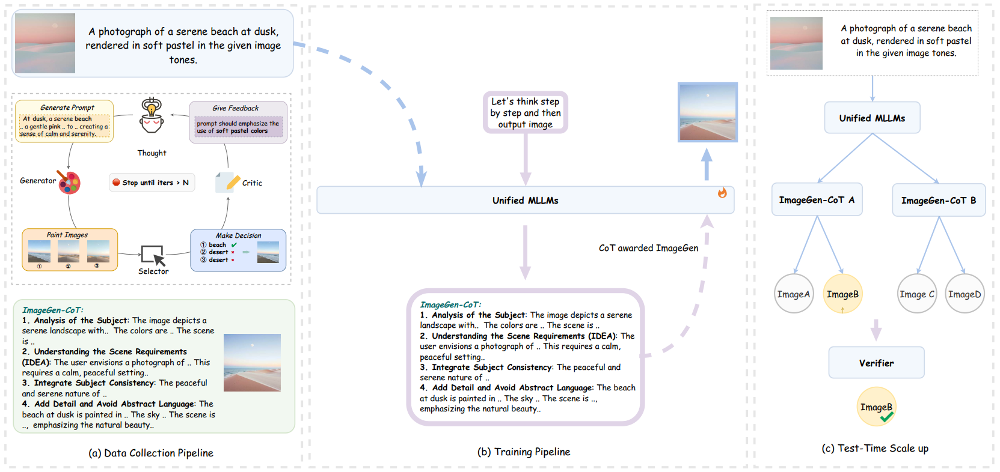

* ImageGen-CoT 框架：

  two-stage inference protocol

  1. **prompt** the model to generate the ImageGen-CoT **reasoning chain** $R$ 
  2. combine the original input $X$ with the generated ImageGen-CoT $R$ 

* 构建数据集：自动化迭代过程，MLLM 作为 Generator, Selector, Critic 以及 Refiner 来生成高质量 ImageGen-CoT 和 对齐图像。

* 训练过程：在 ImageGen-CoT 数据集基础上 微调 unified MLLM 来增强 上下文推理和图像生成能力。

  ImageGen-CoT 数据集分成两部分：

  1. $[X, p_{\text{cot}}] → \text{ImageGen-CoT} $ 
  2. $[X, \text{ImageGen-CoT}, p_{\text{image}}] → \text{image}$ 

* Test time scale up
