数据结构与算法课程笔记

# 1 绪论

## 1.1 基本概念和术语

### 1.1.1 数据

**数据**(data)：对客观事物的符号表示，在计算机科学中指**所有能输入到计算机中并被计算机程序处理的符号的总称**。

**数据元素**（data element）：数据的基本单位。在计算机中通常作为一个整体进行考虑喝处理。

**数据项**（data item）：是组成数据元素、有独立含义的、不可分割的最小单位。

**数据对象**（data object）：性质相同的数据元素的集合，是数据的一个子集。


### 1.1.2 数据结构

**数据结构**（data structure）：相互之间存在一种或多种特定关系的数据元素的集合。

**结构**（structure）：数据元素相互之间的关系。

* **逻辑结构**

  数据的逻辑结构是从逻辑关系上描述数据，它与数据的存储无关，是独立于计算机的。

  因此，数据的逻辑结构 可以看作是 从具体问题抽象出来的数学模型。

  四类基本结构：

  1. 集合 set：数据元素之间就是“属于同一个集合”
  2. 线性结构 list：数据元素之间存在着一对一的线性关系
  3. 树形结构 tree：数据元素之间存在者一对多的层次关系
  4. 图状结构 或 网状结构 graph：数据元素之间存在着多对多的任意关系

  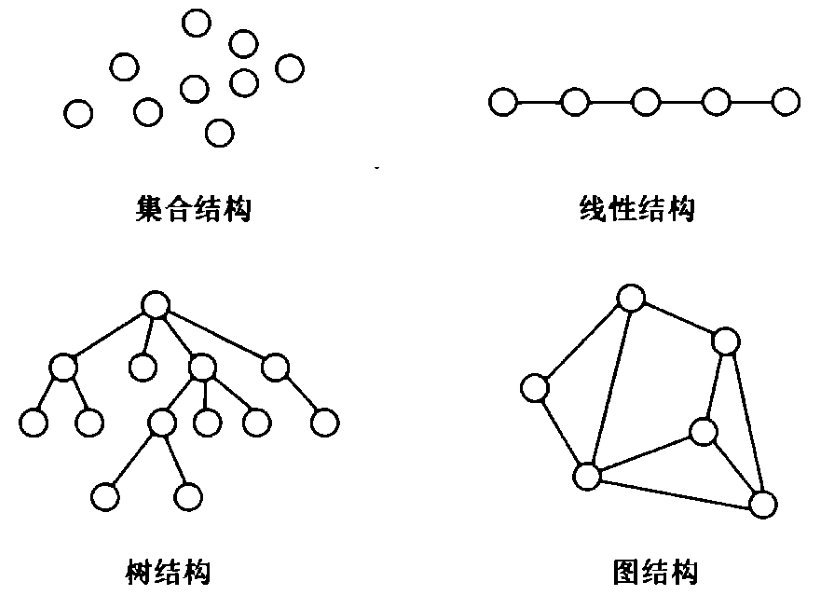

  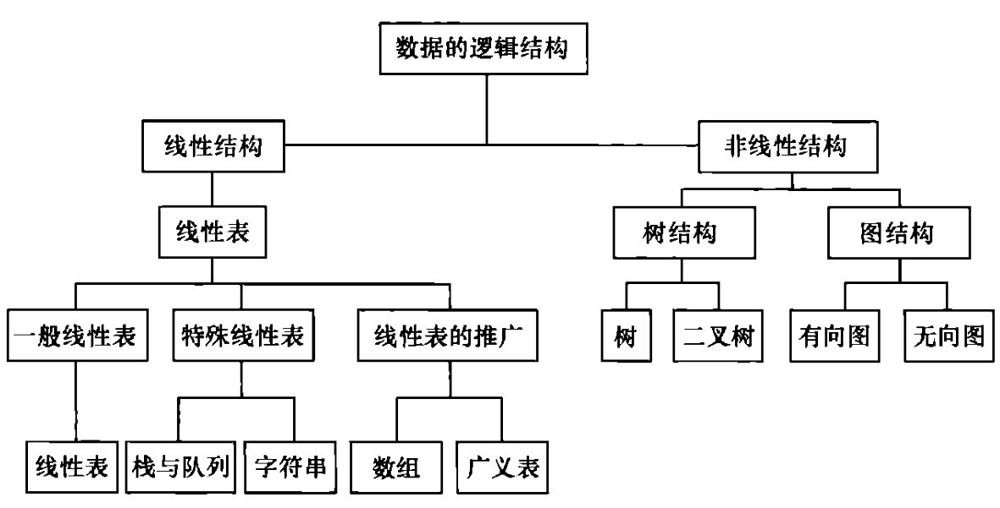

  


* **存储结构**

  **存储结构**：数据结构在计算机中的表示（又称映像），数据的物理结构。包括数据元素的表示和关系的表示。

  在计算机中，表示信息的最小单位是二进制数的一位，叫做 **位**（bit）。计算机中，用一个由若干位组合起来形成的一个位串表示一个数据元素。通常称这个位串为**元素**（element）或**结点**（node）。当数据元素由若干个数据项组成时，位串中对应于各个数据项的子位串称为**数据域**（data field）。

  元素 或 结点 可以看成是数据元素在计算机中的映像。

  数据元素之间的关系在计算机中有两种不同的表示方法：**顺序映像** 和 **非顺序映像**，并由此得到两种不同的存储结构：**顺序存储结构** 和 **链式存储结构**。（其实还有两种存储方式：索引存储（索引项：关键词、地址）、散列存储（结点地址 = F(关键字) ））

  - **顺序映像** 的特点是：借助元素在存储器中的相对关系来表示数据元素之间的逻辑关系

  - **非顺序映像** 的特点是：借助指示元素存储地址的 **指针**（pointer）来表示 数据元素之间的逻辑关系

数据存储原则：

* 不仅要存储数据本身的值，还要保存数据间的关系。
* 存储数据的目的是为了对它们进行处理。

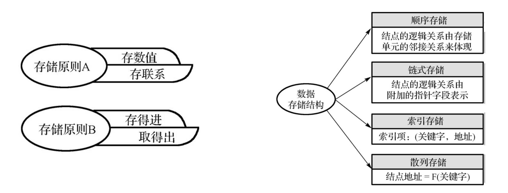


* 数据的 逻辑结构 属于用户视图，是面向问题的，反映了数据内部的构成方式，数据的逻辑结构独立于计算机

* 数据的 物理存储结构 的实现要用计算机语言中的 数据类型 来描述，因而是依赖于具体的计算机语言而言的，是面向计算机的。

一种数据的逻辑结构可以用多种存储结构来存储，而采用不同的存储结构，其数据存储的效率往往是不同的


### 1.1.3 数据的运算

数据的运算有两方面的含义：运算的定义与算法的实现

运算的定义：取决于数据的逻辑结构。根据问题中的数据及数据间的关系，设计相应的数据处理方法。

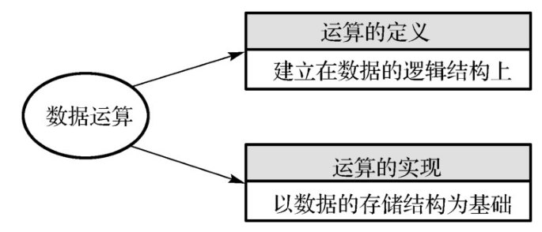

常见的运算操作：

* 初始化：对存储结构设置初始值，或者申请存储空间。
* 判空：判断存储空间是否为未存放有效值的状态
* 查找：判断是否包含指定元素
* 遍历：按某种次序访问所有元素，每个元素只被访问一次
* 插入：增加指定元素
* 删除：移去指定元素
* ……


### 1.1.3 数据类型和抽象数据类型

1. 数据类型

**数据类型**（data type）是 一个值的集合和定义在这个值集上的一组操作的总称。

2. 抽象数据类型

**抽象数据类型**（Abstract Data Type，简称 ADT）是指一个数学模型以及定义在该模型上的一组操作。

* 抽象数据类型的定义仅取决于它的一组逻辑特性，而与其在计算机内部如何表示和实现无关。

* 抽象数据类型，不仅包括各处理器已经定义及实现的数据类型，还包括用户自己定义的数据类型。

抽象数据类型具体包括三部分：数据对象、数据对象上关系的集合以及对抽象对象的基本操作

抽象数据类型的定义格式：

```
ADT 抽象数据类型名{
	数据对象:<数据对象的定义>
	数据关系:<数据关系的定义>
	基本操作:<基本操作的定义>
}ADT 抽象数据类型名
```

基本操作的定义格式：

```
基本操作名(参数表)
	初始条件:<初始条件描述>
	操作结果:<操作结果描述>
```


## 1.2 算法和算法分析

### 1.2.1 算法

**算法**（algorithm）是对特定问题求解步骤的一种描述，它是指令的有限序列，其中每一条指令表示一个或多个操作。

算法的 5 个重要特性：

1. 有穷性：一个算法总是在执行有穷步之后结束，且每一步都可在 有穷时间  内完成。
2. 确定性：算法中每一条指令必须有确切的含义，读者理解时不会产生二义性。而且，在任何条件下，算法只有唯一的一条执行路径，即对相同的输入只能得到相同的输出。
3. 可行性：算法中所描述的操作都是可以通过已经实现的基本运算执行有限次来实现。
4. 输入：一个算法有零个或多个输入，这些输入来自某个特定的对象的集合
5. 输出：一个算法有一个或多个的输出，这些输出是同输入有着某些特定关系的量


### 1.2.2 算法设计的要求

* 正确性：指算法至少应该具有输入、输出和加工处理无歧义性，能正确反映问题的需求，能够得到问题的正确答案。
* 可读性：算法设计的另一个目的是为了方便阅读、理解和交流
* 健壮性：有成鲁棒性或容错性，是指算法对不合理输入的反应能力和处理能力。一个好的算法，应该能够识别出错误的输入数据并进行适当的处理和反应，而不是产生异常或莫名其妙的结果。
* 效率：具有 时间效率高 和 存储空间少 的要求。


### 1.2.3 算法的描述

* 自然语言描述 —— Pipeline Chart 

  * 优点：容易理解
  * 限制：冗余、含糊
  * 用途：粗略地描述算法的目的

* 流程图 —— Pipeline Chart

  * 优点：步骤直观
  * 限制：缺乏严谨性和灵活性
  * 用途：描述简单的算法

* 编程语言 —— Programming Language

  * 优点：电脑可以运行
  * 显示：抽象性差，编程要求高
  * 用途：需要调试算法

* 伪代码 —— Pseudo Code

  介于自然语言和程序设计语言之间的方法，它采用某一程序设计语言的基本语法，操作指令可以结合自然语言来设计。

  优点：表达能力强，抽象性强，容易理解


# 2 线性表

## 2.1 线性表的类型定义

**线性结构的特点**：

在数据元素的非空有限集中，

* 存在唯一的一个被称作“第一个”的数据元素
* 存在唯一的一个被称作“最后一个”的数据元素
* 除第一个之外，集合中的每一个数据元素均只有一个前驱
* 除最后一个之外，集合中的每一个数据元素均只有一个后继

线性表是最常用且最简单的一种数据结构。**一个线性表是 $n$ 个数据元素的有限序列**。

```cpp
// 例子
(A,B,C,...,Z)  // 26 个英文字母的字母表，表中数据元素是单个字母字符
(6,17,28,50,92,188)  // 某校几年内拥有计算机数量变化，表中的数据元素是整数
```

在稍复杂的线性表中，一个数据元素可以由若干个 **数据项** （item）组成。在这种情况下，常常把数据元素称为 **记录**（record），含有大量记录的线性表又称 **文件**（file）。

例如，一个学校的学生健康情况登记表如图所示，表中每个学生的情况为一个记录，它由姓名、学号、性别、年龄、班级和健康状况等 6 个数据项组成。

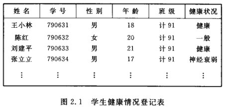

【注】线性表的元素可以是各种各样的，但是**在同一线性表中的元素必定具有相同特性**，即属同一数据对象，相邻数据元素之间存在序偶关系。

---

线性表是具有相同特性的数据元素的一个有限序列，例如： $a_1,a_2,...,a_{i-1}, a_i,a_{i+1},...,a_n$ 

有限序列的第一个元素叫做线性起点，每个元素的前面一个元素叫做 它的直接前趋，后一个元素叫做它的直接后继，序列的最后一个元素叫做线性终点。

**线性表**（Linear List）：由 $n(n\geqslant0)$ 个数据元素（结点）$a_1,a_2,...,a_n$ 组成的有限序列。

*  数据元素个数 $n$ 定义为 线性表的长度
* 当 $n = 0$ 时称为空表
* $a_1$ 是第一个数据元素，$a_n$ 是最后一个数据元素，$a_i$ 是第 $i$ 个数据元素，称 $i$ 为数据元素 $a_i$ 在线性表中的位序
* 将非空的线性表 $(n>0)$ 记作：$(a_1, a_2, ..., a_n)$ 
* 这里的数据元素 $a_i(1\leqslant i \leqslant n)$ 只是一个抽象的符号，其具体含义在不同的情况下可以不同。

**同一线性表中的元素必定具有相同的特性**，数据元素间的关系是线性关系。

### 线性表的逻辑特征

非空的线性表中：

* 有且仅有一个开始结点 $a_1$ ，它没有直接前趋，而仅有一个直接后继 $a_2$ 
* 有且仅有一个终端结点 $a_n$ ，它没有直接后继，而仅有一个直接前驱 $a_{n-1}$ 
* 其余内部结点 $a_i(2\leqslant i \leqslant n-1)$ 都有且仅有一个直接前趋 $a_{i-1}$ 和一个直接后继 $a_{i+1}$ 。

线性表是一个相当灵活的数据结构，它的长度可以根据需要增加或缩短，即对线性表的数据元素不仅可以进行访问，还可以进行插入和删除。

顺序存储结构存在问题：

* 存储空间分配不灵活
* 运算的空间复杂度高


**抽象数据类型线性表的定义**如下：

```
ADT List{
    数据对象:D = {ai | ai ∈ ElemSet, i = 1,2,..., m, n≥0}
    数据关系:R1 = {<a(i-1), ai | a(i-1), ai ∈ D, i = 2,..., n}
    基本操作：
        InitList(&L)
        	操作结果：构造一个空的线性表L
        DestroyList(&L)
        	初始条件：线性表L已存在
        	操作结果：销毁线性表L
        ClearList(&L)
        	初始条件：线性表L已存在
        	操作结果：将L重置为空表
        ListEmpty(L)
        	初始条件：线性表L已存在
        	操作结果：若L为空表，则返回TRUE，否则返回FALSE
        ListLength(L)
        	初始条件：线性表L已存在
        	操作结果：返回L中数据元素个数
        GetElem(L, i, &e)
        	初始条件：线性表L已存在,1≤i≤ListLength(L)
        	操作结果：用e返回L中第i个数据元素的值
        LocateElem(L, e, compare())
        	初始条件：线性表L已存在, compare()是数据元素判定函数
        	操作结果：返回L中第一个与 e 满足 关系compare() 的数据元素的位序。
        			若这样的数据元素不存在，则返回值为 0
        PriorElem(L, cur_e, &pre_e)
        	初始条件：线性表L已存在
        	操作结果：若 cur_e 是L的数据元素，且不是第一个，则用 pre_e 返回它的前驱，
        			否则操作失败，pre_e 无定义
        NextElem(L, cur_e, &next_e)
        	初始条件：线性表L已存在
        	操作结果：若 cur_e 是L的数据元素，且不是最后一个，则用 next_e 返回它的前驱，
        			否则操作失败，next_e 无定义
        ListInsert(&L, i, e)
        	初始条件：线性表L已存在，1≤i≤ListLength(L)+1
        	操作结果：在L中第i个位置之前插入新的的数据元素e，L的长度加1
        ListDelete(&L, i, &e)
        	初始条件：线性表L已存在，1≤i≤ListLength(L)
        	操作结果：删除L的第i个数据元素，并用e返回其值，L的长度减1
        ListTraverse(L, visit())
        	初始条件：线性表L已存在
        	操作结果：依次对L的每个数据元素调用函数 visit()。一旦 visit()失败，则操作失败
}ADT List
```


例：**合并两个线性表 LA 和 LB**，从线性表 LB 中依次取每个数据元素，并依值在线性表 LA 中进行查访，若不存在，则插入之。

```cpp
void union(List& La, List Lb)
{
    // 将所有在线性表 Lb 中但不在 La 中的数据元素插入到 Lb 中
    La_len = ListLength(La); Lb_len = ListLength(Lb);  // 求线性表的长度
    for( i = 1; i<=Lb_len; i++)
    {
        GetElem(Lb, i, e);  // 取 Lb 中第 i 个数据元素赋给 e
        if(!LocateElem(La, e, equal))  // La 中不存在和 e 相同的数据元素，则插入之
            ListInsert(La, ++La_len, e);
    }
}  // union
```

时间复杂度：O(ListLength(LA)*ListLength(LB))


例：**合并两个递增有序序列 LA 和 LB**：

```cpp
void MergeList(List La, List Lb, List& Lc){
    // 已知线性表 La 和 Lb 中的数据元素按值非递减排列
    // 归并 La 和 Lb 得到新的线性表 Lc, Lc 的数据也按值非递减排列
    InitList(Lc);
    i = j = 1; k = 0;
    La_len = ListLength(La);
    Lb_len = ListLength(Lb);
    
    while((i<=La_len) && (i<=Lb_len)){
        GetElem(La, i, ai);
        GetElem(Lb, j, bj);
        if(ai <= bj){
            ListInsert(Lc, ++k, ai);
            ++i;
        }else{
            ListInsert(Lc, ++k, bj);
            ++j;
        }
    }
    
    while(i <= La_len){
        GetElem(La, i++, ai);
        ListInsert(Lc, ++k, ai);
    }
	while(j <= Lb_len){
        GetElem(Lb, j++, bj);
        ListInsert(Lc, ++k, bj);
	}
}  // MergeList
```

时间复杂度：O(ListLength(LA)+ListLength(LB))


## 2.2 线性表的顺序表示和实现

在计算机中，线性表有两种基本的存储结构：**顺序存储结构** 和 **链式存储结构** 

**线性表的顺序表示** 指的是用 **一组地址连续单元** **依次存储** 线性表的数据元素。

### 2.2.1 线性表的线性存储表示

线性表的顺序表示又称为顺序存储结构或顺序映像。

**顺序存储**定义：把**逻辑上相邻的数据元素**存储在**物理相邻的存储单元**中的存储结构。

* 依次存储，地址连续，中间没有空出存储单元。

* 线性表顺序存储结构占用一片连续的存储空间，知道某个元素的存储位置就可以计算其他元素的存储位置。

  假设线性表的每个元素需占 $l$ 个存储单元，则第 $i+1$ 个数据元素的存储位置和第 $i$ 个数据元素的存储位置之间满足关系：$\mathrm{LOC}(a_{i+1}) = \mathrm{LOC}(a_{i}) + l$ 。
  
  由此所有数据元素的存储位置均可由第一个数据元素的存储位置得到：$\mathrm{LOC}(a_{i+1}) = \mathrm{LOC}(a_{1}) + (i-1)\times l$ ，第一个元素的地址是基地址。
  
  每一个数据元素的存储位置都和线性表的起始位置相差一个和数据元素在线性表中的位序成正比的常数。
  
* 线性表的**顺序存储结构** 是一种 **随机存取**的存储结构


### 2.2.2 线性表的实现

高级程序设计语言中的数组类型也有随机存取的特性，因此通常用数组来描述数据结构中的顺序存储结构。

顺序表的特点：以物理位置相邻表示逻辑关系。任一元素均可随机存取。（优点）

顺序表（元素）：地址连续、依次存放、随意存取、类型相同。

=> 可以用高级语言的 一维数组表示顺序表示。

线性表的表长可变（删除），数组长度不可动态定义。=> 用一个变量表示顺序表的长度属性

通用代码：

```cpp
#define LIST_INIT_SIZE 100  // 线性表存储空间的初始分配量
#define LISTINCREMENT 10    // 线性表存储空间的分配增量
typedef struct{
    ElemType elem[LIST_INIT_SIZE];  // 存储空间的基地址
    int length;    // 当前长度 
    int listsize;  // 当前分配的存储容量(以sizeof(ElemType)为单位)
}SqList;
```

注意：上面代码的数组是静态分配的


数组动态分配：

```cpp
typedef struct{
    ElemType* data; // 可以用内存动态分配来动态分配内存
    int length;
    int listsize;  
}SqList;   // 顺序表类型
```

```cpp
SqList L;
L.data = (ElemType*)malloc(sizeof(ElemType)*MaxSize);
// 释放指针 free(p)
//或者借助 C++ 语法： L.data = new ElemType[MaxSize]，释放地址：delete p 或 delete[] p
```


* 多项式的顺序存储结构类型定义

  $P_n(x) = p_1x^{e_1} + p_2x^{e_2} + \cdots + p_mx^{e_m}$ ：

  => 线性表：`P = ((p1,e1), (p2, e2), ..., (pm, em))` 

  ```cpp
  #define MAXSIZE 1000 // 多项式可能达到的最大长度
  typedef struct{  // 多项式非零项的定义
      float p;  // 系数
      int e;    // 指数
  }Polynomial;
  
  typedef struct{
      Polynomial* elem; // 存储空间的基地址 
      int length;
  }SqList;
  ```

  


### 2.2.3 顺序表基本操作的实现

预定义常量和类型

```cpp
// 函数结果状态代码
#define TRUE 1
#define FALSE 0
#define OK 1
#define ERROR 0
#define INFEASIBLE -1
#define OVERFLOW -2
// Statue 是函数的类型，其值是函数结果状态代码
typedef int Status;
typedef char ElemType;
```

* **线性表的初始化**

  ```cpp
  Status InitList_Sq(SqList& L)
  {
      // 构造一个空的线性表 L
      L.elem = (ElemType*)malloc(LIST_INIT_SIZE*sizeof(ElemType));
      if(!L.elem) exit(OVERFLOW);  // 存储分配失败
      L.length = 0;                // 空表长度为 0
      L.listsize = LIST_INIT_SIZE; // 初始存储容量
      return OK;
  }  // InitList_Sq
  ```

* **元素的插入**

  ```cpp
  Status ListInsert_Sq(SqList &L, int i, ElemType e){
      // 在顺序线性表 L 中 第 i 个位置之前插入新的元素 e
      // i 的合法值为 1<= i <= ListLength_Sq(L)+1
      if(i<1 || i>L.length+1) return ERROR;
      if(L.length >= L.listsize){
  		newbase = (ElemType*) malloc(L.elem, 
                   (L.listsize+LISTINCREMENT)*sizeof(ElemType));
          if(!newbase) exit(OVERFLOW);  // 分配地址失败
          L.elem = newbase;             // 新基址
          L.listsize = LISTINCREMENT;   // 增加存储容量
      }
      
      q = &(L.elem[i-1]);  // q 为插入位置
      for(p = &(L.elem[L.length-1]); p>=q; --p)   *(p+1) = *p;   // 插入位置及之后的元素右移
      *q = e;  // 插入 e
      ++L.length;  // 表长加1
      return OK;
  }// ListInsert_Sq
  ```

* **元素的删除**

  ```cpp
  Status ListDelete_Sq(SqList &L, int i, ElemType &e){
      // 在顺序线性表L中删除第 i 个元素，并用 e 返回其值
      //  i 的合法值为 1<= i <= ListLength_Sq(L)
      if((i<1) || (i>L.length)) return ERROR;  // i 值不合法
      p = &(L.elem[i-1]);         // p 为被删除元素的位置
      e = *p;                     // 被删除元素的值赋给 e
      q = L.elem + L.length - 1;  // 表尾元素的位置
      for(++p; p<=q; ++p)         // 被删除元素之后元素左移
          *(p-1) = *p;
      --L.length;                 // 表长减 1
      return OK;
  }  // ListDelete_Sq
  ```

若表长为 $n$ ，则算法 ListInsert_Sq 和 ListDelete_Sq 的时间复杂度为 $O(n)$ 


* 找到满足 `compare` 关系的第一个元素

  ```cpp
  int LocateElem_Sq(SqList L, ElemType e, 
                    Status(* compare)(ElemType, ElemType)){
      // 在顺序线性表 L 中查找第 1 个值与 e 满足 compare() 关系的位序
      // 若找到，则返回其在 L 的位序，否则返回 0
      i = 1;
      p = L.elem;
      while(i<=L.length && !(*compare)(*p++, e)) ++i;
      if(i <= L.length)  return i;
      else return 0;
  }  // LocateElem_Sq
  ```

* **合并递增有序顺序线性表**

  ```cpp
  void MergeList_Sq(SqList La, SqList Lb, SqList &Lc){
      // 已知顺序线性表 La 和 Lb 的元素按值非递减排序
      // 归并 La 和 Lb 得到新的顺序线性表 Lc，Lc 的元素也按值非递减排列
      pa = La.elem; pb = Lb.elem;
      Lc.listsize = Lc.length = La.length + Lb.length;
      pc = Lc.elem = (ElemType*)malloc(Lc.listsize*sizeof(ElemType));
      if(!Lc.elem) exit(OVERFLOW);    // 存储分配失败
      pa_last = La.elem + La.length - 1;
      pb_last = Lb.elem + Lb.length - 1;
      while(pa <= pa_last && pb <= pb_last){
          if(*pa <= *pb) *pc++ = *pa++;
          else *pc++ = *pb++;
      }
      while(pa <= pa.last) *pc++ = *pa++;  // 插入 La 的剩余元素
      while(pb <= pb.last) *pc++ = *pb++;  // 插入 Lb 的剩余元素
  }  // MergeList_Sq
  ```

  

## 2.3 顺序表的链式表示和实现

链式存储结构，不要求逻辑上相邻的元素在物理位置也相邻，因此它没有顺序存储结构所具有的弱点（在插入或删除操作时，需移动大量元素），同时也失去了顺序表 随机存取 的优点。

### 2.3.1 线性链表

线性表的链式存储结构

* 特点：用一组 **任意的存储单元** 存储线性表的数据元素（这组存储单元可以是连续的，也可以是不连续的）
* 对于数据元素 $a_i$ 来说，除了存储其本身的信息之外，还需存储一个指示其直接后继的信息（即直接后继的存储位置）。这两部分信息组成数据元素 $a_i$ 的 **存储映像**，称为 **结点** (node)。它包括两个域：
  * **数据域**：存储数据元素信息
  * **指针域**：存储直接后继存储位置，指针域存储的信息称做 指针 或 链。

* $n$ 个结点( $a_i(1\leqslant i \leqslant n)$ 的存储映像)链结成一个链表，即线性表 $(a_1,a_2,\cdots,a_n)$ 的链式存储结构。
* 此链表的每个结点只包含一个指针域，故又称 **线性链表** 或 **单链表** 


整个链表必须从 **头指针** 开始进行，头指针指示链表中第一个结点（即第一个数据元素的存储映像）的存储位置。同时，由于最后一个数据元素没有直接后继，则线性链表中最后一个结点的指针为 “空” ($\bold{NULL}$)

* 用线性链表表示线性表时，数据元素之间的逻辑关系是由结点中的指针指示的。换句话说，指针为数据元素之间的逻辑关系的映像。
* 这种存储结构称为 **非顺序映像** 或 **链式映像** 


### 2.3.2 线性链表的实现

单链表的描述：

```cpp
typedef struct LNode{
    ElemType data;
    struct LNode * next;
}LNode, *LinkList;
```

* 设 L 是 LinkList 型变量，则 L 为单链表的头指针，它指向表中第一个结点。若 L 为 “空” (L = NULL) ，则所表示的线性表为 “空” 表，其长度 $n$ 为 “零” 。

* 有时，在单链表的第一个结点之前附设一个结点，称之为头结点，头结点的数据域可以不存储任何信息，也可以存储诸如 线性表的长度等类的附加信息。头结点的指针域指向第一个结点的指针（即第一个元素结点的存储位置）。

  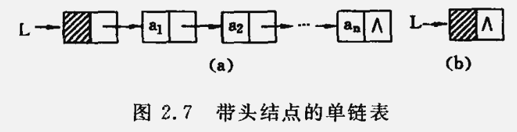

  若线性表为空表，则头结点的指针域为 “空”

  

单链表是非随机存取的存储结构。


### 2.3.3 线性链表基本操作的实现

* **获取链表中的元素**

  ```cpp
  Status GetElem_L(LinkList L, int i, ElemType & e){
      // L 为带头结点的单链表的头指针
      // 当第 i 个元素存在时,其值赋给 e 并返回 OK,否则返回 ERROR
      p = L->next;  j = 1;   // 初始化, p 指向第一个结点, j 为计数器
      while(p && j<i){   // 顺指针向后查找, 知道 p 指向第 i 个元素或 p 为空
          p = p->next;
          ++j;
      }
      
      if(!p || j>i) return ERROR;  // 第 i 个元素不存在
      e = p->data;  // 取 第 i 个元素
      return OK;
  } // GetElem_L
  ```

* **插入元素**

  ```cpp
  Status ListInsert_L(LinkList & L, int i, ElemType e){
      // 在带头结点的单链表线性表 L 中第 i 个位置之前插入元素 e
      p = L; j = 0;
      while(p->next && j<i-1){   // 寻找第 i-1 个结点
          p = p->next;
          ++j;
      }
      
      if(!p || j > i-1) return ERROR;  // i 小于 1 或者大于表长加 1
      s = (LinkList)malloc(sizeof(LNode));  // 生成新结点
      s->data = e;
      s->next = p->next;
      p->next = s;
      return OK;
  }  // ListInsert_L
  ```

* **删除结点**

  ```cpp
  Status ListDelete_L(LinkList &L, int i, ElemType & e){
      // 在带头结点的单链线性表L中,删除第 i 个元素,并用 e 返回其值
      p = L; j = 0;
      while(p && j<i-1){  // 寻找第 i-1 个结点
          p = p->next;
          ++j;
  	}
      if(!p || j>i-1) return ERROR;  // i 小于 1 或者大于表长加1
      q = p->next;
      p->next = p->next->next;
      
      e = q->data;
      free(q);
      
      return OK;
  } // ListDelete_L
  ```

* 插入和删除操作，复杂度均为 $O(n)$ ，因为查找第 i-1 个结点的复杂度为 $O(n)$ 


* **逆向建立链表**

  ```cpp
  void CreateList_L(LinkList &L, int n){
      // 逆位序输入 n 个元素的值，建立带表头结点的单链线性表 L
      L = (LinkList)malloc(sizeof(LNode));
      L->next = NULL;
      for(i = n; i>0; --i){
          p = (LinkList)malloc(sizeof(LNode));   // 生成新的结点
          scanf(& p->data);
          p->next = L->next;
          L->next = p;
      }
  }  // CreateList_L
  ```

* **合并两个有序链表**（非递减序列）

  ```cpp
  void MergeList_L(LinkList & La, LinkList & Lb, LinkList & Lc){
      // 已知单恋线性表 La 和 Lb 的元素按值非递减排列
      // 归并 La 和 Lb 得到新单链线性表 Lc, Lc 的元素也按值非递减排列
      pa = La->next;  pb = Lb->next;
      Lc = pc = La;   // 用 La 的头结点组为 Lc 的头结点
      while(pa && pb){
          if(pa->data <= pb->data){
              pc->next = pa;
              pc = pa;
              pa = pa->next;
          }else{
              pc->next = pb;
              pc = pb;
              pb = pb->next;
          }
  	}
      pc->next = pa?pa:pb;   // 插入剩余段
      free(Lb);   // 释放 Lb 的头结点
  }
  ```
  


### 2.3.4 静态链表

```cpp
// 线性表的静态单链表存储结构
#define MAXSIZE 1000
typedef struct{
    ElemType data;
    int cur;  // 游标,代替指针指示结点在数组中的相对位置
}component, SLinkList[MAXSIZE];
```

这种存储结构需要预先分配一个较大的空间，但在线性表的插入和删除操作时不需要移动元素，仅需修改指针，故仍具有链式存储结构的主要优点。下面展示 插入元素 "SHI" 和 删除元素 "ZHENG" 之后的状况。

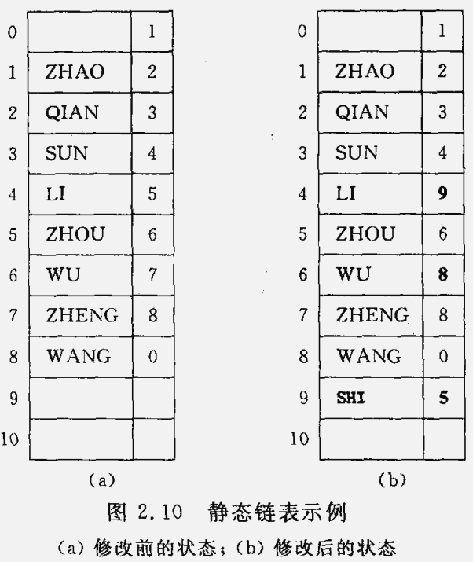

假设 S 为 SLinkList 变量，则 `S[0].cur` 指示第一个结点在数组中的位置，若设 `i = S[0].cur` ，则 `S[i].data` 存储线性表的第一个数据元素。若第 i 个分量表示链表的第 k 个结点，则 `S[i].cur` 指示第 k+1 个结点的位置。因此在静态链表中，以整型游标 `i` 代替动态指针 `p`。`i = S[i].cur` 实为指针后移（类似 `p=p->next`）

需要自己实现 `malloc` 和 `free` 这两个函数。为了辨明数组中哪些分量未被使用，解决办法是将所有未被使用过以及被删除的分量用游标链成一个备用链表，每当插入时，便可从备用链表取第一个结点作为待插入的新结点。反之，在删除时将从链表中删除下来的结点链接到备用链表上。

* **初始化静态链表**

  ```cpp
  void InitSpace_SL(SLinkList &space){
      // 将一维数组 space 中各分量链成一个备用链表，space[0].cur 为头指针
      // “0” 表示空指针
      for(i = 0; i<MAXSIZE-1; ++i) space[i].cur = i+1;
      space[MAXSIZE-1].cur = 0;
  }  // InitSpace_SL
  ```

* 自定义 `malloc` 函数

  ```cpp
  int Malloc_SL(SLinkList & space){
      // 将一维数组 space 中各分量链成一个备用链表, space[0].cur 为头指针
      // '0' 表示空指针
      i = space[0].cur;
      if(space[0].cur) space[0].cur = space[i].cur;
      // 将备用链表的头指针指向备用链表中第一个节点的下一个节点。这样，备用链表中的第一个节点被分配出去，不再是备用节点。
      return i;
  }  // Malloc_SL
  ```
  
* 自定义 `free` 函数

  ```cpp
  void Free_SL(SLinkList &space, int k){
      // 将下标为 k 的空闲结点回收到备用链表
      space[k].cur = space[0].cur; // 回收结点的指针域指向现在链表第一个结点
      space[0].cur = k;  // 头结点指针域指向回收结点
  }  // Free_SL
  ```

* 建立结合 `(A_B)⋃(B-A)` ：

  ```cpp
  void difference_SL(SLinkList  &space, int& S){
     //依次输入集合 A 和 B 的元素,在一维数组 space 中建立表示集合(A_B)⋃(B-A)
     // 的静态链表,S 为其头指针。假设备用空间足够大,space[0].cur 为其头指针
      InitSpace_SL(space);    // 初始化备用空间
      S = Malloc_SL(space);   // 生成 S 的头结点
      r = S;                  // r 指向 S 的当前最后结点
      scanf(m, n);            // 输入 A 和 B 的元素个数
      for(j = 1; j<=m ;++j){  // 建立集合 A 的链表
          i = Malloc_SL(space);  // 分配结点
          scanf(space[i].data);  // 输入 A 的元素值
          space[r].cur = i;      // 插入到表尾
          r = i;
      }  // 尾结点的指针为空
      space[r].cur = 0;   // 尾结点的指针为空
      for(j = 1; j<=n; ++j){  // 依次输入 B 的元素，若不在当前表中，则插入，否则删除
          scanf(b);
          p = S;
          k = space[S].cur;  // k指向集合 A 中的第一个结点
          while(k != space[r].cur && space[k].data != b){  // 在当前表中查找
              p = k;
              k = space[k].cur;
          }
          
          if(k == space[r].cur){
             	// 当前表中不存在该元素，插入在 r 所指结点之后
              //且 r 的位置不变
              i = Malloc_SL(space);
              space[i].data = b;
              space[i].cur = space[r].cur;
              space[r].cur = i;
          }
          else{   // 该元素在表中，删除之
              space[p].cur = space[k].cur;
              Free_SL(space, k);
              if(r == k) r = p;    // 若删除的是 r 所指结点，则需修改尾指针
          }
      }
  }
  ```

  时间复杂度：$O(m\times n)$ 


### 2.3.5 循环链表

循环链表（circular linked list） 是另一种形式的链式存储结构。它的特点是表中最后一个结点的指针指向头结点，整个链表形成一个环。

因此，从表中任一结点出发均可找到表中其他结点。

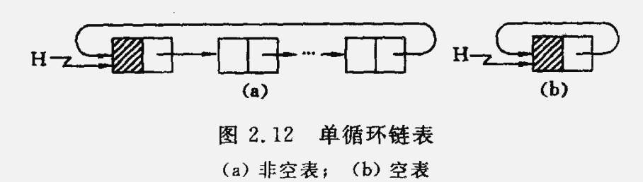

在这种结构中，链表操作中的循环条件是 `p->next` 是否等于头指针。

有时候，在循环链表中设立尾指针而不设头指针，可以使得某些操作化简。例如两个线性表合并成一个表时，仅需将一个表的表尾和另一个表的表头相接。运算时间 $O(1)$ 


### 2.3.6 双向链表

双向链表的结点有两个指针域，其一指向直接后继，另一指向直接前驱。C 语言中可描述如下：

```cpp
typedef struct DuLNode{
    ElemType data;
    struct DuLNode * prior;
    struct DuLNode * next;
}DuLNode, *DuLinkList;
```

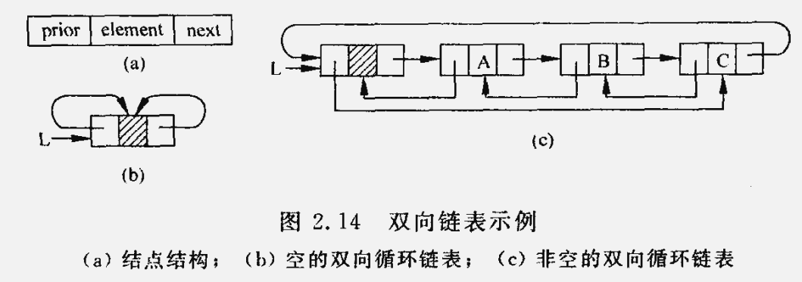

双向链表中存在两个环，有 `d->next->prior = d->prior->next = d` 

在双向链表中，有些操作：ListLength, GetElem 和 LocateElem 等仅需涉及一个方向的指针，则它们的算法描述和线性链表的操作相同。但在 **插入**、**删除** 时有很大的不同，在双向链表中需 **同时修改两个方向上的指针**。

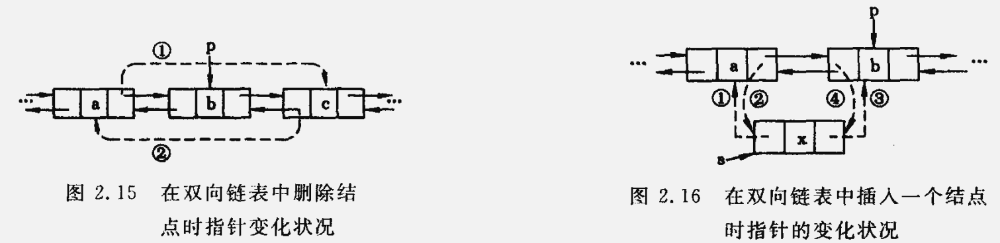

```cpp
Status ListInsert_DuL(DuLinkList &L, int i, ElemType e){
    // 在带头结点的双链循环线性表L中第i个位置之前插入元素 e
    // i 的合法值为 1≤i≤表长+1
    if(!(p = GetElemP_DuL(L,i)))  // 在 L 中确定插入位置
        return ERROR;              // p == NULL, 即插入位置不合法
    
    if(!(s = (DuLinkList)malloc(sizeof(DuLNode)))) return ERROR;
    
    s->data = e;
    s->prior = p->prior; p->prior->next = s;
    s->next = p; p->prior = s;
    
    return OK
}  // ListInsert_DuL
```

```cpp
Status ListDelete_DuL(DuLinkList &L, int i, ELemType &e){
    // 删除带头结点的双链循环线性表 L 的第 i 个元素，i的合法值 1≤i≤表长
    if(!(p = GetElemP_DuL(L, i)))  // 在 L 中确定第 i 个元素的位置指针 p
        return ERROR;   // p = NULL, 即第 i 个元素
    
    e = p->data;
    p->prior->next = p->next;
    p->next->prior = p->prior;
    free(p);
    return OK;
}  // ListDelete_Dul
```


链表有空间的合理利用上和插入、删除时不需要移动等优点。但，它也存在着实现某些基本操作，如求线性表的长度时不如顺序存储结构的缺点。另一个方面，由于在链表中，结点之间的关系用指针表示，则数据元素在线性表中的 “位序”  的概念已淡化，而被数据元素在线性链表中的 “位置” 所代替。


## 2.4 一元多项式的表示和相加

一元多项式 $P_n(x)$ 可按升幂写成：$P_n(x) = p_0+p_1x+p_2x^2+\cdots+p_nx^n$ ，它由 $n+1$ 个系数唯一确定。因此，在计算机里，它可用一个线性表 $P$ 来表示：$P = (p_0, p_1, p_2, \cdots, p_n)$
每一项的指数 $i$ 隐含在其系数 $p_i$ 的序号里。

在处理多项式的次数可能很高且变化很大，例如 $S(x) = 1+3x^{10000}+2x^{20000}$ 的多项式时，就要用长度为 20001 的线性表表示，浪费大量空间。

可以用一个长度为 每个元素有两个数据项（系数项和指数项）的线性表：
$$
((p_1, e_1),(p_2, e_2),\cdots,(p_m, e_m))
$$
这样将到达节省空间。


利用 **线性链表** 可以更好地实现 改变多项式的系数和指数的运算。

抽象数据类型一元多项式的定义：

```cpp
ADT Polynomial{
    数据对象: D = {ai|ai∈TermSet, i = 1,2,...,m,  m≥0
              TermSet 中每个元素都包含一个表示系数的实数和表示指数的整数}
    
    数据关系：R1 = {<a(i-1), ai>|a(i-1), ai ∈ D,且 a(i-1) 中的指数值 <ai 
        						  中指数值,i = 2,...,n}
    基本操作：
        CreatePolyn(&P, m)
        操作结果: 输入 m 项的系数和指数,建立一元多项式 P
        DestroyPolyn(&P)
        初始条件: 一元多项式 P 已存在
        操作结果: 销毁一元多项式 P
        PrintPolyn(P)
        初始条件: 一元多项式 P 已存在
        操作结果: 打印输出一元多项式 P
        PolynLength(P)
        初始条件: 一元多项式 P 已存在
        操作结果: 返回一元多项式 P中的项数
        AddPolyn(&Pa, &Pb)
        初始条件: 一元多项式 Pa 和 Pb 已存在
        操作结果: 完成多项式相加运算, 即 Pa = Pa+Pb,并销毁一元多项式 Pb
        SubtractPolyn(& Pa, & Pb)
        初始条件: 一元多项式 Pa 和 Pb 已存在
        操作结果: 完成多项式相减运算, 即 Pa = Pa-Pb,并销毁一元多项式 Pb
        MultiplyPolyn(&Pa, &Pb)
        初始条件: 一元多项式 Pa 和 Pb 已存在
        操作结果: 完成多项式相乘运算, 即 Pa = Pa×Pb,并销毁一元多项式 Pb
} ADT Polynomial
```

实现上述定义的一元多项式，显然应该采用链式存储结构。例如：表示多项式 
$$
A_{17}(x) = 7+3x+9x^{8}+5x^{17}
$$
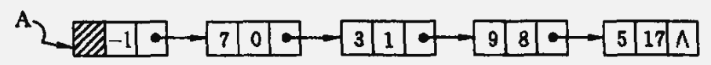

利用有序链表实现 一元多项式。有序链表的基本操作定义 与 线性链表 有两处不同，一是 LocateElem 的职能不同，二是需要增加有序关系进行插入操作 OrderInsert：

```cpp
Status LocateElem(LinkList L, ElemType e, Position &q,
                 int(*compare) (ElemType, ElemType));
// 若有序链表 L 中存在与 e 满足判定函数 compare() 取值为 0 的元素，则 q 指示 L中第一个值为 e 的结点的位置，并返回 TRUE，否则 q 指示第一个与 e 满足判定函数 compare() 取值 >0 的元素的前驱的位置，并返回 FALSE

Status OrderInsert(LinkList & L, ElemType e, int(* compare)(ElemType, ElemType));
// 按有序判定函数 compare() 的约定，将值为 e 的结点插入到有序链表 L 的适当位置
```

抽象数据类型 Polynomial 的实现：

```cpp
typedef struct{
    float coef;  // 系数
    int expn;    // 指数
}term, ElemType;  //两个类型名: term 用于本 ADT, ElemType 为 LinkList 的数据对象名
```

基本操作算法描述：

```cpp
int cmp(term a, term b)
    // 依 a 的指数值 < (或 = )(或 > ) b 的指数值，返回 -1,0,+1
    
void CreatePolyn(polynomial & P, int m){
    // 输入 m 项的系数和指数，建立一元多项式的有序链表 P
    InitList(P);
    h = GetHead(P);
    e.coef = 0.0; ex.expn = -1; SetCurElem(h, e);  // 设置头结点的数据元素
    for(i = 1; i<=m; ++i){  //依次输入 m 个非零项
        scanf(e.coef, e.expn);
        if(!LocateElem(P,e,q,(*cmp)())){       //当前链表中不存在该指数项
            if(MakeNode(s,e)) InsFirst(q, s);  // 生成结点并插入链表
        }
    }
} // CreatePolyn
```

**多项式相加**：

```cpp
void AddPolyn(polynomial & Pa, polynomial & Pb){
    // 多项式加法: Pa = Pa + Pb, 利用两个多项式的结点构成 "和多项式"
    ha = GetHead(Pa); hb = GetHead(Pb); // ha 和 hb 指向Pa 和 Pb 的头结点
    qa = NextPos(Pa, ha); qb = NextPos(Pb, hb);  // qa 和 qb 分别指向 Pa 和 Pb 中的当前结点
    while(qa && qb){
        a = GetCurElem(qa); b = GetCurElem(qb);  // a 和 b 为两表中当前比较元素
        switch( *cmp(a, b) ){
            case -1:   // 多项式 PA 中当前结点的指数值小
                ha = qa; qa = NExtPos(Pa, qa); 
                break;
            case 0:    // 两者的指数相等
                sum = a.coef + b.coef;
                if(sum != 0.0){  // 修改多项式 PA 当前的系数值
                    SetCurElem(qa, sum);  ha = qa;
                }else{  // 删除多项式 PA 中的当前结点
                    DelFirst(ha, qa);  FreeNode(qa);
                }
                DelFirst(hb, qa);  FreeNode(qb); 
                qb = NextPos(Pb, hb); qa = NextPos(Pa, ha); 
                break;
            case 1:   // 多项式 PB 中当前结点的指数值小
                DelFirst(hb, qb);  InsFirst(ha, qb);
                qb = NextPos(Pb, hb); ha = NextPos(Pa, ha);
                break;
        }
    }
    if(!ListEmpty(Pb)) Append(Pa, qb);  // 链表 Pb 中剩余结点
    FreeNode(hb); // 释放 Pb 的头结点
}
```


# 3 栈和队列

* 从 数据结构 角度看，栈和队列也是线性表，其特殊性在于栈和队列的基本操作是线性表操作的子集，它们是 **操作受限的线性表** 。因此，可称为限定性的数据结构。
* 从 数据类型 角度看，它们是和线性表大不相同的抽象数据类型。

## 3.1 栈

### 3.1.1 抽象数据类型栈的定义

栈 (stack) 是限定 仅在表尾进行插入或删除 的线性表。

* 表尾段称为 栈顶(top)，表头段称为栈底(bottom)。不含元素的空表称为空栈。
* 栈 是 **后进先出** (last in first out) 的线性表 (简称 LIFO 结构)

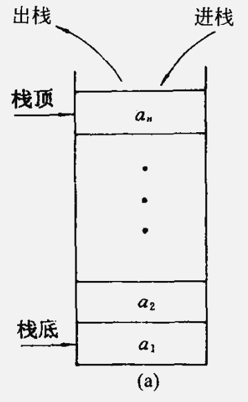

栈的数据结构的抽象定义：

```txt
ADT Stack{
    数据对象: D = {ai|ai∈TermSet, i = 1,2,...,n,  n≥0
              TermSet 中每个元素都包含一个表示系数的实数和表示指数的整数}
    
    数据关系：R1 = {<a(i-1), ai>|a(i-1), ai ∈ D,i = 2,...,n}
    		约定 an 为栈顶，a1 为栈底
    基本操作：
        InitStack(&S)
        操作结果：构造一个空栈S.
        DestroyStack(&S)
            初始条件：栈S已存在.
            操作结果：栈S被销毁.
        ClearStack(&S)
            初始条件：栈S已存在.
            操作结果：栈S清为空栈.
        StackEmpty(&S)
            初始条件：栈S已存在.
            操作结果：若栈S为空栈，则返回 TRUE，否则返回 FALSE.
        StackLength(&S)
            初始条件：栈S已存在.
            操作结果：返回S的元素个数，即栈的长度.
        GetTop(S, &e)
            初始条件：栈S已存在且非空.
            操作结果：用 e 返回 S的栈顶元素.
        Push(&S, e)
            初始条件：栈S已存在.
            操作结果：插入元素 e 为新的栈顶元素.
        Pop(&S, &e)
            初始条件：栈S已存在且非空.
            操作结果：删除S的栈顶元素，并用 e 返回其值.
        StackTraverse(S.visit())
            初始条件：栈S已存在且非空.
            操作结果：从栈底到栈顶依次对 S 的每个数据元素调用函数 visit().一旦visit()失败，则操作失败
            
}ADT Stack
```


### 3.1.2 栈的表示和实现

栈的两种存储表示方式：**顺序栈** 和 **链栈** 。

**顺序栈**，栈的顺序存储结构，利用一组地址连续的存储单元依次存放自栈底到栈顶的数据元素，同时附设指针top指示栈顶元素在顺序栈的位置。通常以 top = 0 表示空栈。

设定两个常量`STACK_INIT_SIZE`(存储空间初始分配量)和 `STACKINCREMENT` (存储空间分配增量)，并以下述类型说明作为顺序栈的定义。

```cpp
typedef struct{
    SElemType * base;
    SElemType * top;
    int stacksize;
}SqStack;
```

`stacksize` 指示栈的当前可使用的最大容量。

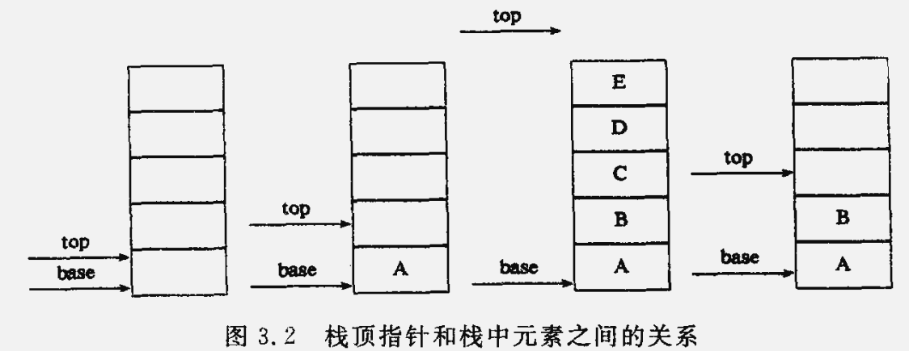

**顺序栈的模块说明**

```cpp
// ADT Stack 的表示和实现
// 栈的顺序存储表示
#define STACK_INIT_SIZE 100
#define STACKINCREMENT 10
typedef struct{
    SElemType * base;
    SElemType * top;
    int stacksize;
}SqStack;
// 基本操作的函数原型说明
Status InitStack(SqStack &S);
Status DestroyStack(SqStack &S);
Status ClearStack(SqStack &S);
Status StackEmpty(SqStack S);
int StackLength(SqStack S);
Status GetTop(SqStack S, SElemType &e);
Status Push(SqStack &S, SElemType e);
Status Pop(SqStack &S, SElemType &e);
Status StackTraverse(SqStack S, Status(*visit)());
```

基本操作的算法描述（部分）

```cpp
Status InitStack(SqStack &S){
    // 构造一个空栈
    S.base = (SElemType *)malloc(STACK_INIT_SIZE * sizeof(SElemType));
    if(!S.base) exit(OVERFLOW);
    S.top = S.base;
    S.stacksize = STACK_INIT_SIZE;
    return OK;
} // InitStack

Status GetTop(SqStack S, SElemType &e){
    // 若栈不空，则用 e 返回 S 的栈顶元素，并返回 OK，否则返回 ERROR
    if(S.top == S.base) return ERROR;
    e = *(S.top - 1);
    return OK;
}  // GetTop

Status Push(SqStack &S, SElemType e){
    // 插入元素 e 为新的栈顶元素
    if(S.top - S.base >= S.stacksize){  // 栈满，追加存储空间
        S.base = (SElemType *)realloc(S.base, 
                 (S.stacksize + STACKINCREMENT)*sizeof(SElemType));
        if(!S.base) exit(OVERFLOW); //存储分配失败
        S.top = S.base+S.stacksize;
        S.stacksize += STACKINCREMENT;
    }
    *S.top++ = e;
    return OK;
} // Push

Status Pop(SqStack &S,SElemType &e){
    // 若栈不空，则删除 S 的栈顶元素，用 e 返回其值，并返回 OK；否则返回 ERROR
    if(S.top == S.base) return ERROR;
    e = * --S.top;
} //Pop
```


**链栈**：

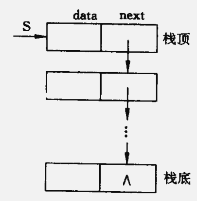


**共享栈**：

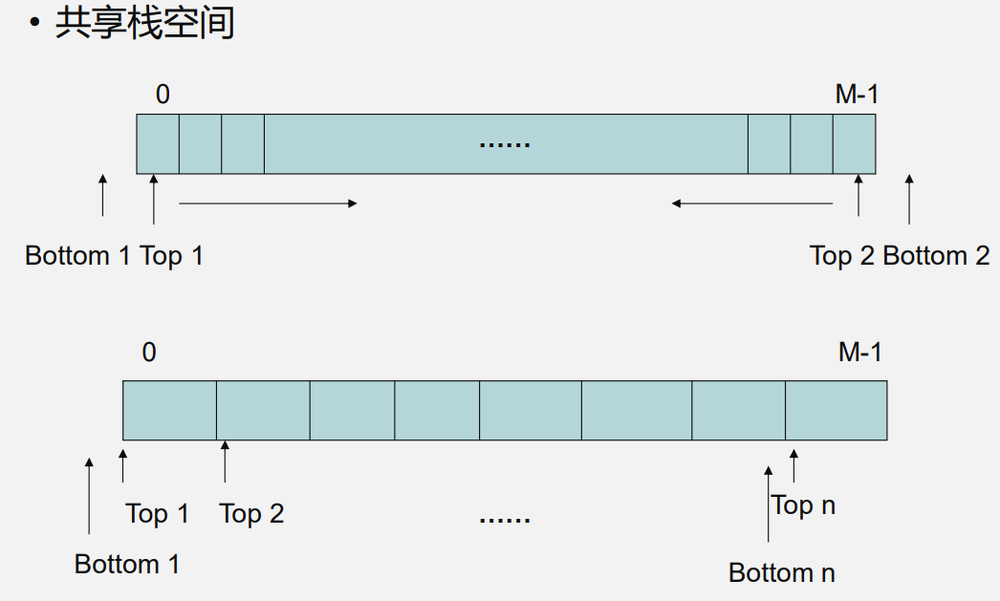


## 3.2 栈的应用

### 3.2.1 数制转换

十进制数 *N* 和其他 *d* 进制数的转换。基本原理：
$$
N = (N\ \mathrm{div} \ d) \times d+N\  \mathrm{mod}\ d
$$
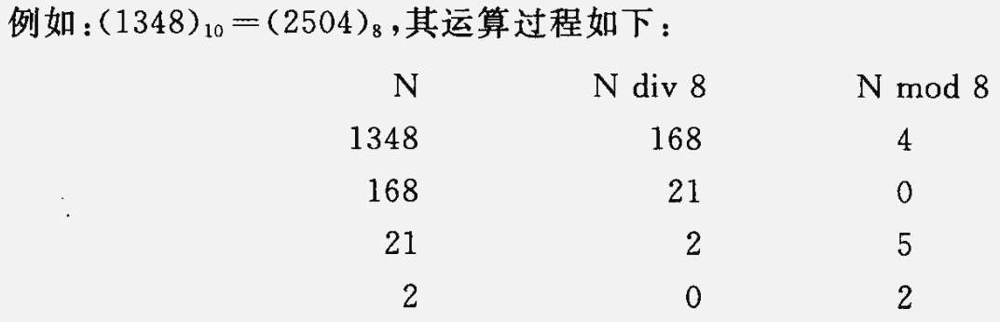

上述计算过程是从低位到高位顺序产生八进制数的各个数位，而打印输出一般是从高位到地位进行，伪代码：

```cpp
void conversion(){
    // 对于输入的任一个非负十进制整数，打印输出与其等值的八进制数
    InitStack(S);
    scanf("%d", N);
    while(N){
        Push(S, N%8);
        N /= 8;
    }
    while(!StackEmpty(s)){
        Pop(S,e);
        printf("%d",e);
    }
} // conversion
```

c++代码：

```cpp
void conversion(){
    stack<int> stk;
    int N;
    cin >> N;
    while(N){
        stk.push(N%8);
        N /= 8;
    }
    while(!stk.empty()){
        cout << stk.top();
        stk.pop();
    }
}
```


### 3.2.2 表达式求值

**四则运算求值** 规则：（1）先乘除，后加减；（2）从左算到右；（3）先括号内，后括号外

设定任意两个相继出现的运算符 $\theta_1$ 和 $\theta_2$ 之间的优先关系，最多有以下三种关系：$\theta_1 < \theta_2$ ，$\theta_1$ 的优先权低于 $\theta_2$ ；$\theta_1 = \theta_2$，$\theta_1$ 的优先权等于 $\theta_2$ ；$\theta_1>\theta_2$ ，$\theta_1$ 的优先权高于 $\theta_2$ 。

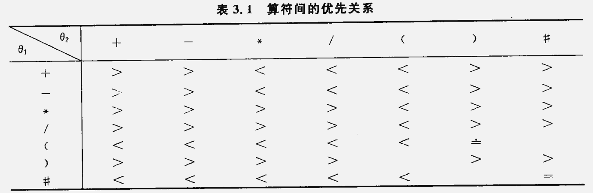

为了实现算符优先算法，可以使用两个工作栈。一个称作 OPTR，用以寄存 运算符；另一个叫做 OPND，用于 寄存操作数或运算结果。算法基本思想：

（ 1 ）首先置操作数栈为空栈，表达式起始符 "#" 为运算符栈的栈底元素

（ 2 ）依次读入表达式中每个字符，若是操作数则进入 OPND 栈，若是运算符则和 OPTR 栈的栈顶运算符进行优先权 比较后进行相应运算操作。

（ 3 ）如此，直至整个表达式求值完毕 （即 OPTR 栈的栈顶元素和读入的字符均为 "#" ）

**算法实现**

```cpp
OperandType EvaluateExpression(){
    // 算术表达式求值的算符优先算法，设 OPTR 和 OPND 分别为运算符栈和运算数栈
    // OP 为运算符集合
    InitStack(OPTR);  Push(OPTR, '#');
    InitStack(OPND);  c = getchar();
    while(c! = '#' || GetTop(OPTR) != '#'){
        if(!In(c, OP)){ Push(OPND, c); c = getchar(); } // 不是运算符则进栈
        else
            switch(Precede(GetTop(OPTR), c)){
                case '<':  // 栈顶元素优先权低
                    Push(OPTR, c); c = getchar();
                    break;
                case '=':  // 脱括号并接受下一个字符
                    Pop(OPTR, x); c = getchar();
                    break;
                case '>':  // 退栈，将运算符结果入栈
                    Pop(OPTR, theta);
                    Pop(OPND, b);  Pop(OPND, a);
                    Push(OPND, Operate(a, theta, b));
                    break;       
            } // switch
    } // while
    return GetTop(OPND);
} // EvaluateExpression
```


## 3.3 栈与递归的实现

一个直接调用自己，或通过一系列调用语句间接地调用自己的函数，称做递归函数。

**递归的应用**

阶乘函数：
$$
\mathrm{Fact}(n) = \begin{cases}1&若n = 0 \\ n·\mathrm{Fact}(n-1)& 若n>0 \end{cases}
$$
2 阶 $\mathrm{Fibonacci}$ 数列：
$$
\mathrm{Fib}(n) = \begin{cases}0 &若n = 0 \\1&若 n = 1\\ \mathrm{Fib}(n-1)+\mathrm{Fib}(n-2)& 其他情形 \end{cases}
$$


### 3.3.1  n 阶汉诺塔问题

 假设有 3 个分别命名为 X、Y 和 Z 的塔座，在塔座 X 上插有 $n$ 个直径大小各不相同、依小到大编号为 1,2,···,n 的圆盘。要求将 X 轴上的 $n$ 个圆盘移至塔座 Z 上并仍按同样顺序叠排，圆盘移动时必须遵循下列规则：
（ 1 ）每次只能移动一个圆盘；（ 2 ）圆盘可以插在 X、Y 和 Z 中的任一塔座上；（ 3 ）任何时刻都不能将一个较大的圆盘压在较小的圆盘之上。

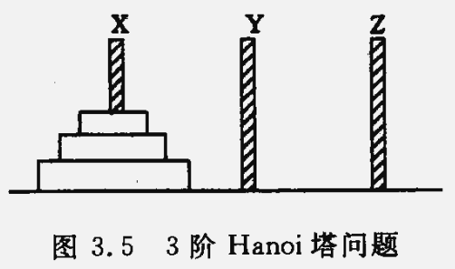

如何实现移动圆盘操作：

* n = 1 时，只要将编号为 1 的圆盘从 塔座X 直接移动到 塔座 Z
* ，n > 1 时，需利用塔座 Y 作辅助塔座，若能设法将压在编号为 n 的圆盘之上的 n-1 圆盘从塔座 X 移动到 塔座 Y 上，则可先将 编号为 n 的圆盘从塔座 X 移至 塔座 Z，然后再将塔座 Y 上的 n-1 个圆盘（依照上述法则）移至塔座 Z 上。
  而如何将 n-1 个圆盘从一个塔座移至另一个塔座是一个和原问题具有相同的特征属性的问题，指示问题规模小 1，因此可以用相同的方法求解。

算法实现代码：

```cpp
void hanoi(int n, char x, char y, char z)
    // 将塔座x上按直径由小到大且自上而下编号为1至n的n个圆盘规则搬到
    // 塔座z上，y可用作辅助塔座
    // 搬动操作 move(x,n,z) 可定义为(c是初值为0的全局变量，对搬动计数)
    // printf("%i, Move disk %i from %c to %c\n", ++c, n, x, z);
{
    if(n == 1)
        move(x, 1, z);     // 将编号为 1 的圆盘从 x 移动到 z
    else{
        hanoi(n-1,x,z,y);  // 将 x 上编号为 1 到 n-1 的圆盘移到 y,z 作辅助塔
        move(x,n,z);       // 将编号为 n 的圆盘从 x 移到 z
        hanoi(n-1,y,x,z);  // 将 y 上编号为 1 至 n-1 的圆盘移到 z,x 作辅助塔
    }
}
```


### 3.3.2  递归函数运行实质

当在一个函数的运行期间调用另一个函数，在运行被调用函数之前，系统需先完成 3 件事：

* 将 所有的实在参数、返回地址 等信息传递 给被调用函数保存
* 为 被调用函数的局部变量 分配存储区
* 将 控制转移到被调函数的入口
  

从被调用函数返回调用函数之前，系统也应完成 3 件工作：

* 保存 被调函数的计算结果
* 释放 被调函数的数据区
* 依照 被调函数保存的返回地址 将控制转移到 调用函数


一个递归函数的运行过程 类似于 多个函数的嵌套调用，只是 调用函数 和 被调用函数 是同一个函数，因此，和每次调用相关的一个重要的概念是递归函数运行的 “层次” 。
假设调用该递归函数的主函数为 第 0 层，则从主函数调用递归函数为进入 第 1 层；从第 i 层递归调用本函数为 进入 “下一层”，即 i+1 层。反之，退出第 i 层递归则返回 i-1 层。

为保证 递归函数 正确执行，系统需设立一个 “**递归工作栈**” 作为整个递归函数运行期间使用的数据存储区。每一层递归所需信息构成一个“工作记录”，其中包括 <u>所有的实在参数、所有的局部变量以及上一层的返回地址</u>。
每进入一层递归，就产生一个新的工作记录压入栈顶。每退出一层递归，就从栈顶弹出一个工作记录，则当前执行层的工作记录必定是递归工作栈栈顶的工作记录，称这个记录 “活动记录”，并称指示活动记录的栈顶指针为 “当前环境指针”。


## 3.4 队列

### 3.4.1 抽象数据类型队列的定义

**队列**（queue）是一种 **先进先出**（first in first out，缩写为 FIFO）的线性表。只允许在表的一端进行插入，而在另一端删除元素。允许插入的一端叫做 **队尾**（rear），允许删除的一端则称为 **队头**（front）。

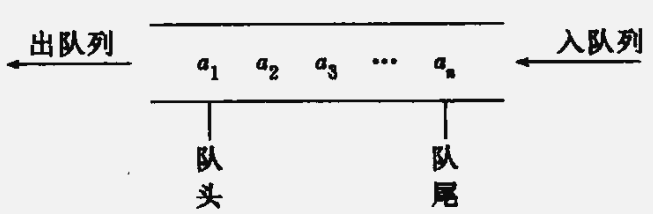

队列的应用：操作系统中的作业排队。

队列的抽象数据类型定义：

```cpp
ADT Queue{
    数据对象: D = {ai|ai∈TermSet, i = 1,2,...,n,  n≥0}
    数据关系：R1 = {<a(i-1), ai>|a(i-1), ai ∈ D,i = 2,...,n}
    		约定 a1 段为队列头，an 段为队列尾
    基本操作：
        InitQueue(&Q)
            操作结果：构造一个空队列Q.
        DestroyQueue(&Q)
            初始条件：队列Q已存在.
            操作结果：队列Q被销毁，不再存在.
        ClearQueue(&Q)
            初始条件：队列Q已存在.
            操作结果：将Q清为空队列.
        QueueEmpty(Q)
            初始条件：队列Q已存在.
            操作结果：若Q为空队列，则返回TRUE,否则返回FALSE.
        QueueLength(Q)
            初始条件：队列Q已存在.
            操作结果：返回Q的元素个数，即队列的长度.
        GetHead(Q, &e)
            初始条件：队列Q已存在且非空.
            操作结果：用 e 返回 Q的队头元素.
        EnQueue(&Q, e)
            初始条件：队列Q已存在.
            操作结果：插入元素 e 为新的队尾元素.
        DeQueue(&Q, &e)
            初始条件：队列Q已存在且非空.
            操作结果：删除Q的队头元素，并用 e 返回其值.
        QueueTraverse(Q.visit())
            初始条件：队列Q已存在且非空.
            操作结果：从队头到队尾依次对 Q 的每个数据元素调用函数 visit().一旦visit()失败，则操作失败
}ADT Queue
```


双端队列是限定插入和删除操作在表的两端进行的线性表。这两段分别称为端点1和端点2。

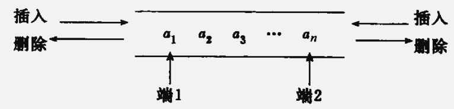


### 3.4.2 链队列 —— 队列的链式表示和实现

队列有两种存储表示：链式存储和线性存储。

链队列，需要两个分别指示队头和队尾的指针（分别称为 头指针 和 尾指针）。为操作方便，给队列添加一个头结点，并令头指针指向头结点。

单链队列的实现：

```cpp
typedef struct QNode{
    QElemType data;
    struct QNode * next;
}QNode, * QueuePtr;

typedef struct{
    QueuePtr front;  // 队头指针
    QueuePtr rear;   // 队尾指针
}ListQueue;

// 基本操作
Status InitQueue(LinkQueue &Q);
Status DestroyQueue(LinkQueue &Q);
Status ClearQueue(LinkQueue &Q);
Status QueueEmpty(LinkQueue Q);
int QueueLength(LinkQueue Q);
Status GetHead(LinkQueue Q, QElemType &e);
Status EnQueue(LinkQueue &Q, QElemType e);
Status DeQueue(LinkQueue &Q, QElemType &e);
Status QueueTraverse(LinkQueue Q, visit());
```

基本操作的算法描述（部分）

```cpp
Status InitQueue(LinkQueue &Q){
    // 构造一个空队列 Q
    Q.front = Q.rear = (QueuePtr)malloc(sizeof(QNode));
    if(!Q.front) exit(OVERFLOW);
    Q.front->next = NULL;
    return OK;
}

Status DestroyQueue(LinkQueue &Q){
    // 销毁队列 Q
    while(Q.front){
        Q.rear = Q.front->next;
        free(Q.front);
        Q.front = Q.rear;
    }
    return Ok;
}

Status EnQueue(LinkQueue &Q, QElemType Q){
    // 插入元素 e 为 Q 的新的队尾元素
    p = (QueuePtr)malloc(sizeof(QNode));
    if(!p) exit(OVERFLOW);
    p->data = e; p->next = NULL;
    Q.rear -> next = p;
    Q.reat = p;
    return OK;
}

Status DeQueue(LinkQueue &Q, QElemType &e){
    // 若队列不空，则删除 Q 的队头元素，用 e 返回其值，并返回 OK
    // 否则返回 ERROR
    if(Q.front == Q.rear) return ERROR;
    p = Q.front->next;
    e = p->data;
    Q.front->next = p->next;
    if(Q.rear == p) Q.rear = Q.front;  // 特殊情况，队列只有一个数据元素
    free(p);
    return OK;
}
```


### 3.4.3  循环队列——队列的顺序表示和实现

* 在非空队列中，队首指针始终指向队头元素，而队尾指针始终指向队尾元素的下一个位置。

* 在顺序队列中存在 “假溢出” 现象。因为在入队和出队操作中，头、尾指针只增加不减少，导致删除元素的空间永远无法重新利用。

* 因此，尽管队列中实际元素个数可能远远小于数组大小，但可能由尾指针已超出数组空间的上界而不能做入队操作。这种现象称为假溢出。

  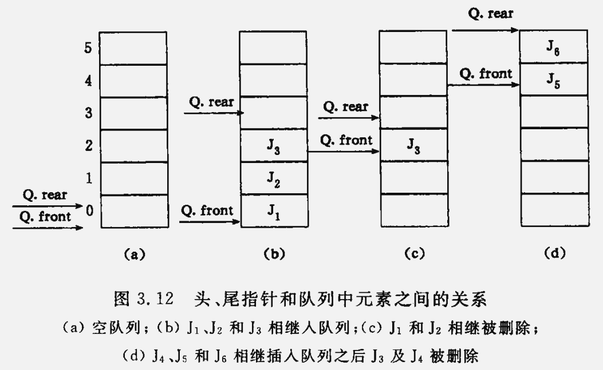

  

为充分利用数组空间，克服上述“假溢出”现象的方法：将队列分配的数组空间看成一个首位相接的圆环，并称这种队列为 **循环队列**。

* 在循环队列中 进行出队、入队操作时，队首、队尾指针仍要加 1，朝前移动。只不过当队首、队尾指针指向数组上界（MAX_QUEUE_SIZE-1）时，其加 1 操作的结果是指向数组的下界 0：

  ```cpp
  if(i+1 == MAX_QUEUE_SIZE) i = 0;
  else i++;
  ```

  其中 i 代表 队首指针或队尾指针

  可以用 模运算简化为 ：`i = (i+1)%MAX_QUEUE_SIZE` 

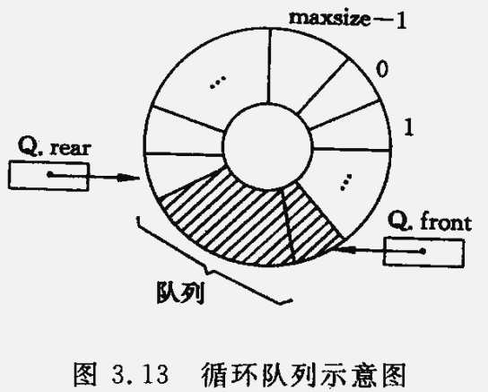

* 入队时尾指针向前追赶头指针，出队时，头指针向前追赶尾指针，故队空和队满尾指针均相等。
* 因此无法通过 `front = rear` 来判断队列 “空” 还是 “满”。
  解决方法：约定入队前，测试尾指针在循环意义下加 1 是否等于头指针，若相等则认为队满。即：
  * rear 所指的单元始终为空
  * 循环队列为空：front = rear
  * 循环队列满：`(rear+1)%MAX_QUEUE_SIZE = front` 


**循环队列 vs. 非循环队列**

* 队列主要用于保存中间数据，而且保存的数据满足先产生先处理的特点。非循环队列可能存在数据假溢出，即队列中还有空间，可是队满的条件却成立了。为此，改为循环队列，这样克服了假溢出。
* 但并不能说循环队列一定优于非循环队列，因为循环队列中出队元素的空间可能被后来进队的元素占用，如果算法要求 **队列操作结束后利用进队的所有元素实现某种功能**，这样循环队列就不适合了，这种情况下就需要使用非循环队列。


### 3.4.4 优先队列

普通的队列是一种先进先出的数据结构，元素在队列尾追加，从队列头删除。

在优先队列中，**每个元素都有一个优先级**。具有**最高优先级**的元素**最先出队**。优先队列具有 最高级先出 的行为特征。优先队列执行的操作有 查找、插入一个新元素 和 删除 三种。

* 优先队列和普通队列都适用在处理或服务对象需要按序逐个进行操作的场合，不过 **优先队列关心对象的优先级**，将队列按 **优先级顺序** 作 出队 处理。

* 例子：

  * 操作系统的任务调度

    对操作系统而言，当有多个任务需要处理的时候，一般而言，解决这个问题的简单策略就是把任务放在一个队列中，先来者先服务，这是公平的，虽然对每个任务本身来说，都期望是能够被立即执行而不仅仅是被执行。 实际中会出现提交一个执行时间很短的任务可能要等很长的时间才能被执行的情形，因为在它之前已经有许多执行时间很长的任务，在队列中等待执行，这样会导致用户的使用感受不好。 解决此问题的一个策略是利用优先队列，按照“任务需要执行的时间越短，它的优先权越高”的原则，按任务的轻重顺序执行，可以使用户的平均等待时间最短。

  * 多媒体通讯网络中的数据包调度

  * 集合中的元素搜索


### 3.4.5  队列的应用

* 只要满足 **先来先服务** 特性的应用均可采用队列作为其数据组织方式或中间数据结构。
* 调度或缓冲：消息缓冲器、邮件缓冲器、计算机的硬件设备之间的通信也需要队列作为数据缓冲、操作系统的资源管理
* 广度优先搜索


**回文串的判断**

```cpp
bool Palindrome_Test(char * str)
    //判断输入的字符串是否回文序列，是则返回 true，否则返回 false
{
    InitStack(S);
    InitQueue(Q);
    for(char *c = str; *c != '\0'; c++){
        Push(S, *c);
        EnQueue(Q, *c);  // 同时使用栈和队列两种结构
    }
    while(!StackEmpty(S)){
        Pop(S, a);
        DeQueue(Q, b);
        if(a != b) return false;
    }
    return true;
}
```


**用两个栈 S1 和 S2 模拟一个队列**，写出入队和出队的算法（可用栈的基本操作）

```cpp
Status EnQueue(DualStack &Q, QElemType e){
    if(!Q.StackFull(S1)) Q.push(S1, e);
    else if(Q.StackEmpty(S2)){
        while(!Q.StackEmpty(S1)) Q.Push(S2, Q.Pop(S1));
        Q.Push(S1, e);
	}
    else exit(OVERFLOW);
    return OK;
}

Status DeQueue(DualStack &Q, QElemType &e){
    if(!Q.StackEmpty(S1) || !Q.StackEmpty(S2)){
        if(!Q.StackEmpty(S2)) a = Q.Pop(S2);
        else{
            while(!Q.StackEmpty(S1)) Q.Push(S2, Q.Pop(S1));
            a = Q.Pop(S2);
        }
        return OK;
    }
    else exit(OVERFLOW);
}
```


# 4 串

## 4.1 串类型的定义

**串** (string)(或字符串) 是由零个或多个字符组成的有限序列

* 一般记为 $s = "a_1a_2\cdots a_n"\ \ (n\geqslant 0)$ 。其中，$s$ 是串的名，用双引号括起来的字符序列是串的值；$a_i(1\leqslant i \leqslant n)$ 可以是 字母、数字或其他字符；
* 串中字符的数目 $n$ 称为串的 **长度**。
* 零个字符的串称为 **空串** (null string)，它的长度为零。用 $\varnothing$ 表示 “空串”。
* 通常将仅由一个或多个**空格**组成的串称为 空白**串**（Blank String），注意 空串和空白串的不同。 `""` 和 `" "` 分别表示长度为0的空串和长度为 1 的空白串。
* 串中 任意个 **连续的字符** 组成的子序列称为串的子串。包含子串的串相应地称为 **主串**。
* 通常称字符在序列中的序号为该字符在串中的位置，子串在主串中的位置则以子串的第一个字符在主串中的位置来表示。
* 只有当两个串的长度相等，并且各个对应位置的字符都相等时两个串才相等
* 串值必须用**一对双引号**括起来。


字符串常数：`"\n"` 

字符串变量：`a = "program"` 


串的逻辑结构和线性表极为相似，区别在于 串的数据对象约束为字符集。在串的基本操作中，通常以 “串的整体” 作为操作对象，例如在串中查找某个子串，求取一个子串、在串的某个位置上插入一个子串以及删除一个子串等。

串的抽象数据类型定义如下：

```cpp
ADT Queue{
    数据对象: D = {ai|ai∈TermSet, i = 1,2,...,n,  n≥0}
    数据关系：R1 = {<a(i-1), ai>|a(i-1), ai ∈ D,i = 2,...,n}
    基本操作：
        StrAssign(&T, chars);
    		初始条件：chars 是字符串常量
			操作结果：生成一个其值等于chars的串T
        StrCopy(&T, S);
			初始条件：串S存在
			操作结果：由串S复制得到串T
        StrEmpty(S);
			初始条件：串S存在
			操作结果：若S为空串，则返回 TRUE，否则返回FALSE
        StrCompare(S,T);
			初始条件：串S和T存在
			操作结果：若 S>T,则返回值>0;若 S=T,则返回值=0;若S<T,则返回值<0
        StrLength(S);
			初始条件：串S存在
			操作结果：返回S的元素个数,称为串的长度
        ClearString(&S);
			初始条件：串S存在
			操作结果：将S清为空串
        Concat(&T, S1, S2);
			初始条件：串S1和S2存在
			操作结果：用T返回由S1和S2联接而成的新串。
        SubString(&Sub, S, pos, len);
			初始条件：串S存在,1<=pos<=StrLength(S)且0<=len<=StrLength(S)-pos+1
			操作结果：用 Sub 返回串的第 pos 个字符起长度为 len 的子串
        Index(S, T, pos);
			初始条件：串S和T存在,T是非空串,1<=pos<=StrLength(S)
			操作结果：若主串S出现和串T值相同的子串,则返回它在主串S中第pos个字符之后第一次出现的位置,否则函数值为0
        Replace(&S, T, V);
			初始条件：串S,T和V存在,T是非空串
			操作结果：用V替换主串S中出现的所有与T相等的不重叠的子串
        StrInsert(&S, pos, T);
			初始条件：串S和T存在,1<=pos<=StrLength(S)+1
			操作结果：在串S的第pos个字符之前插入串T
        StrDelete(&S, pos, len);
			初始条件：串S存在,1<=pos<=StrLength(S)-len+1
			操作结果：从串S中删除第pos个字符起长度为len的子串
        DestroyString(&S);
			初始条件：串S存在
			操作结果：串S被销毁
}ADT String
```


串类型的 **最小操作子集**：

* 串赋值（StrAssign）
* 串比较（StrCompare）
* 求串长（StrLength）
* 串联结（Concat）
* 求子串（SubString）


**字符**（char）：组成字符串的基本单元，在C和C++中，字符占单个字节（8 bits），采用 ASCII码 对 128个符号（字符集 charset）进行编码。

**标准字符串**：将 C++ 的 `<string.h>` 函数库作为字符串数据类型的方案。例如`char S[M]` 
字符串的结束标记：`'\0'` ，`'\0'` 是 ASCII 码中 8位全0码，又称 NULL符

函数库的字符串操作函数：

```cpp
// 字符串长函数
int strlen(char* s);
// 字符串复制
char* strcpy(char* s1, char* s2);
// 字符串拼接
char* strcat(char* s1, char* s2);
// 字符串比较
int strcmp(char* s1, char* s2);
// 定位函数
char* strchr(char* s, char c);
// 逆定位函数
char* strrchr(char* s, char c);
```


## 4.2 串的表示和实现

串是一种特殊的线性表，存储方式取决于对字符串所进行的操作。字符串在计算机中有 3 种表示方式：

* 定长顺序存储表示：将字符串定义成字符数组，利用字符串名可以直接访问字符串值。用这种表示方式，字符串的存储空间在编译时确定，其大不能改变。
* 堆分配存储方式：仍然用一组地址连续的存储单元来依次存储字符串中的字符序列，但字符串的存储空间是在程序运行时根据字符串的实际长度动态分配的。
* 块链存储方式：是一种链式存储结构表示


### 4.2.1 定长顺序存储表示

用一组地址连续的存储单元存储串值的字符序列。在串的定长顺序存储结构中，按照预定义的大小，为每个定义的串变量分配一个固定长度的存储区，则可用定长数组如下描述：

```cpp
// 串的定长顺序存储表示
#define MAXSTRLEN 256   // 用户可在 255 以内定义最大串长
typedef struct
{
    char str[MAX_STRLEN];
    int length;
}StringType;
```

串的实际长度可以在这预定义长度范围内，超过预定义长度的串值则被舍弃，称之为 “截断”。


**字符串的联结操作**

```cpp
Status StrConcat(StringType &s, StringType t)
{
    // 将字符串 t 联结到字符串s之后，结果仍然保存在s中
    if(s.length+t.length > MAX_STRLEN)
        return ERROR;  //联结长度超出范围
    for(i=0; i<t.length; i++){
        s.str[s.length+i] = t.str[i];  // 将字符串 t 联结到字符串之后
    }
    s.length = s.length+t.length;  // 修改联结后的字符串长度
    return OK;
}
```


**求子串操作（已知位置）**

```cpp
Status SubString(StringType s, int pos, int len, StringType* sub){
    if(pos < 0 || pos > s.length || len < 0 || len > (s.length-pos+1))
        return ERROR;  // 参数非法
    
    sub->length = len-pos+1;  // 求得子串长度
    
    for(j = 0, k = pos; k<len; k++, j++)
        sub->str[j] = s.str[k];
}
```


### 4.2.2 堆分配存储表示

这种存储表示的特点，仍以一组地址连续的存储单元存放串值字符序列，但它们的存储空间是在程序执行过程中**动态分配**而得。

实现方式：在 C 语言中，存在一个称之为 “堆” 的自由存储区，并由 C 语言的动态分配函数 `malloc()` 和 `free()` 来管理。利用函数 `malloc()` 为每个新产生的串分配一块实际串长所需的存储空间，若分配成功，则返回一个指向初始地址的指针，作为串的基址。

```cpp
// 串的堆分配存储表示
typedef struct{
    char* ch;    // 若是非空串，则按串长分配
    int length;  // 字符串的长度
}HString;
```


**字符串的联结操作**

```cpp
Status StrConcat(HString &T, HString S1, HString S2){
    // 用 T 返回由 s1 和 s2 联结而成的串
   	if(T.ch) free(T.ch);
    t_len = S1.length+S2.length;
    if(!(T.ch = (char*)malloc(sizeof(char)*t_len))) exit(OVERFLOW);
    int pos = 0;
    for(i = 0; i<S1.length; i++){
        T.ch[pos++] = S1[i];
    }
    for(i = 0; i<S2.length; i++){
        T.ch[pos++] = S2[i];
	}
    return OK;
}
```


**指定位置的字符串插入**

```cpp
Status StrInsert(HString &S, int pos, HString T){
    // 1<= pos <= StrLength(S)+1, 在串S的第pos个字符之前插入串T
    if(pos < 1 || pos > S.length+1) return ERROR;
    if(T.length){
        if(!(S.ch=(char* )realloc(S.ch, (S.length+T.length)*sizeof(char))))
            exit(OVERFLOW);
        for(i = S.length-1; i>=pos-1; --i)  // 为插入 T 而腾出位置
            S.ch[i+T.length] = S.ch[i];
        S.ch[pos-1 ... pos+T.length-2] = T.ch[0 ... T.length-1];   // 插入 T
        S.length+=T.length;
    }
    return OK;
}
```


**ADT String 的表示和实现**

```cpp
// 串的堆分配存储表示
typedef struct{
    char * ch;
    int length;
}HString;

// 基本操作函数原型
Status StrAssign(HString &T, char* chars);
int StrLength(HString S);
int StrCompare(HString S, HString T);
Status ClearString(HString &S);
Status Concat(HString &T, HString S1, HString S2);
HString SubString(HString S, int pos, int len);

// 基础操作算法描述
Status StrAssign(HString &T, char* chars){
    // 生成一个其值等于串常量chars的串T
    if(T.ch) free(T.ch);  // 释放 T 原有空间
    for(i = 0, c = chars; c; ++i, ++c);  // 求chars的长度 i
    if(!i){T.ch = NULL; T.length = 0;}
    else{
        if(!(T.ch = (char*)malloc(i*sizeof(char)))) exit(OVERFLOW);
        T.ch[0 ... i-1] = chars[0 ... i-1];
        T.length = i;
    }
    return OK;
} // StrAssign

int StrLength(HString S){
    // 返回S的元素个数，称为串的长度
    return S.length;
}  // StrLength

int ClearString(HString &S){
    // 将 S 清为空串
    if(S.ch){free(S.ch);  S.ch = NULL;}
    S.length = 0;
    return OK;
} // ClearString

Status Concat(HString &T, HString S1, HString S2){
    // 用 T 返回由S1和S2联结而成的新串
    if(T.ch) free(T.ch);
    if(!(T.ch = (char*)malloc((S1.length + S2.length)*sizeof(char))))
        exit(OVERFLOW);
    T.ch[0 ... S1.length-1] = S1.ch[0 ... S1.length-1];
    T.length = S1.length + S2.length;
    T.ch[S1.length ... T.length-1] = S2.ch[0 ... S2.length-1];
    return OK;
} // Concat

Status SubString(HString &Sub, HString S, int pos, int len){
    // 用 Sub 返回串 S 的第pos个字符起长度为 len 的子串
    // 其中, 1<=pos<=StrLength(S) 且 0<=len<=StrLength(S)-pos+1
    if(pos < 1 || pos > S.length || len<0 || len.S.length-pos+1)
        return ERROR;
    if(Sub.ch) free(Sub.ch);
    if(!len){Sub.ch = NULL; Sub.length = 0;}
    else{
        Sub.ch = (char*)malloc(len*sizeof(char));
        Sub.ch[0 ... len-1] = S.ch[pos-1 ... pos+len-2];
        Sub.length = len;
    }
    return OK;
}
```


### 4.2.3 串的块链存储表示

可以采用 链表方式 存串值。结构中的每个数据元素是一个字符，则用链表存储串值时，存在一个“结点大小”的问题，即每个结点可以存放一个字符，也可以存放多个字符。

串的块链存储表示：

```cpp
#define CHUNKSIZE 80  // 可由用于定义的块大小
typedef struct Chunk{
    char ch[CHUNKSIZE];
    struct Chunk *next;
}Chunk;

typedef struct{
    Chunk * head, * tail;   // 串的头和尾指针
    int curlen;             // 串的当前长度
}LString;
```

串的存储密度：
$$
存储密度 = \cfrac{串值所占的存储位}{实际分配的存储位}
$$
存储密度小（如结点大小为1时），运算处理方便，然而，存储占用量大。如果在串处理过程中需要进行行内外存交换时，会因为内外存交换操作过多而影响处理的总效率。


## 4.3 串的模式匹配算法

### 4.3.1 求子串位置的定位函数 `Index(S, T, pos)`

子串的定位操作 通常称为 串的模式匹配（其中 T 称为 模式串），是各种串处理系统中最重要的操作之一。最朴素的模式匹配算法：

```cpp
int Index(SString S, SString T, int pos){
    // 返回子串T在主串中第pos个字符之后的位置。若不存在，则函数值为0
    // 其中,T非空,1<=pos<=StrLength(S)
    i = pos-1; j = 0;
    while(i<S.length && j<T.length){
        if(S[i] == T[j]){++i; ++j; }  // 继续比较后继字符
        else{ i = i-j+2; j = 0;}  // 指针后退重新开始匹配
	}
    if(j > T[0]) return i-T.length;
    else return 0;
}
```


### 4.3.2 KMP算法

**算法流程**

假设现在文本串匹配到 i 位置，模式串 P 匹配到 j 位置

* 如果 j = -1，或者当前字符匹配成功（即 `S[i] == P[j]`），都令 `i++, j++` ，继续匹配下一个字符
* 如果 j != -1 且当前字符匹配失败（即 `S[i] != P[i]`），则令 i 不变，`j = next[j]` ，这意味着模式串 P 相对于文本串 S 向右移动了 `j-next[j]` 位。

**算法关键**

* 寻找前缀和后最最长公共元素长度
* 求 next 数组
* 匹配失配的处理

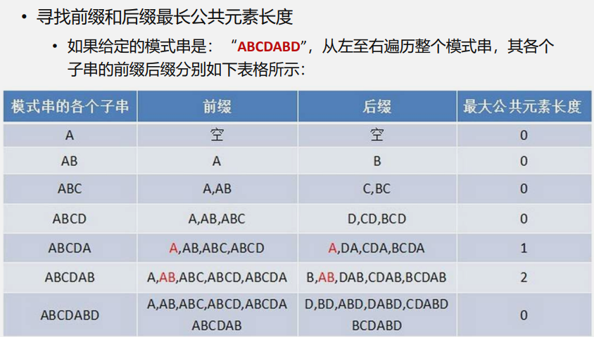

**算法实现**

```cpp
int KmpSearch(char* s, char* p)
{
    int i = 0, j = 0;
    int slen = strlen(s)， plen = strlen(p);
    while(i < slen && j < slen){
        if(j == -1 || s[i] == s[j]){
            i++, j++;
        }else{
            j = next[j];
        }
    }
    
    if(j == plen)
        return i-j;
    else 
        return -1;
}
```

求解 next 数组：

```cpp
void GetNext(char* p, int next[]){
    int plen = strlen(p);
    int i = 0; j = -1;
    next[0] = -1;
    while(i<plen){
        if(j == -1 || p[i] == p[j]){
            i++, j++;
            next[i] = j;
        }else{
            j = next[j];
		}
    }
}
```

改进的 nextval 数组：

```cpp
void GetNextval(char* p, int nextval[]){
    int plen = strlen(p);
    int i = 0; j = -1;
    nextval[0] = -1;
    while(i<plen){
        if(j == -1 || p[i] == p[j]){
            i++, j++;
            if( p[i] == p[j]){
                nextval[i] = nextval[j];
            }else{
                nextval[i] = j;
            }
        }
        else 
            j = nextval[j];
    }
}
```


# 5 数组和广义表

## 5.1 数组的定义

数组是一组偶对(下标值，数据元素值)的集合。在数组中，对于一组有意义的下标，都存在一个与其对应的值。一维数组对应着一个下标值，二维数组对应着两个下标值，如此类推。

抽象数据类型数组可形式地定义为：

`ADT Array`：

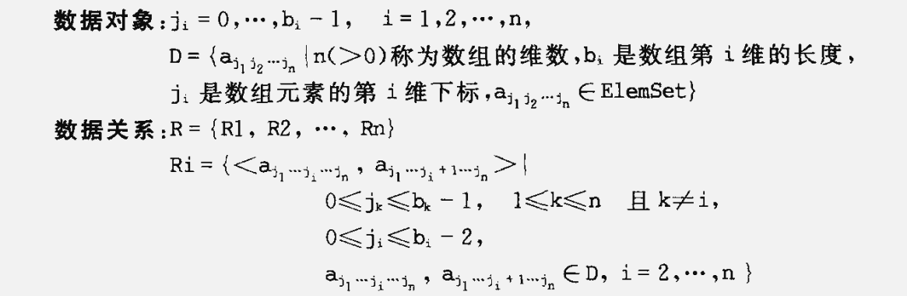

```cpp
基本操作：
InitArray(&A, n, bound1, ···, boundn);
    操作结果：若维数 n 和各维长度合法,则构造相应的数组 A,并返回OK
DestroyArray(&A);
	操作结果：销毁数组A
Value(A, &e, indexl, ···, indexn);
	初始条件：A 是 n维数组, e 为元素变量, 随后是n个下标值
	操作结果：若各下标不超界，则 e 赋值为所指定的A的元素值,并返回 OK
Assign(&A, e, index1, ···, indexn);
	初始条件：A 是 n维数组, e 为元素变量, 随后是n个下标值
	操作结果：若下标不超界，则将 e 赋值给所指定的A的元素,并返回 OK
```


$n$ 维数组中含有 $\prod_{i = 1}^n b_i$ 个数据元素，每个元素都受着 $n$ 个关系的约束。在每个关系中，元素 $a_{j_1j_2\cdots j_n}(0\leqslant j_i\leqslant b_i-2)$ 都有 一个直接后继元素。

* 数组的所有数据元素都必须属于同一数据类型。

* 数组中每个数据元素都对应于一组下标$(j_1,j_2 ,\cdots, j_n)$ ，每个下标的取值范围是 $0\leqslant j_i \leqslant b_i-1$ ，$b_i$ 称为 第 $i$ 维的长度 $(i=1,2,\cdots,n)$ 。显然，当 $n = 1$ 时，$n$ 维数组就退化为定长的线性表。
* 数组是一种随机存取结构，给定一组下标，就可以访问与其对应的数据元素。
* 数组中的数据元素个数是固定的。

我们可以把二维数组看成是这样一个定长线性表：它的每个数据元素也是一个定长的线性表。

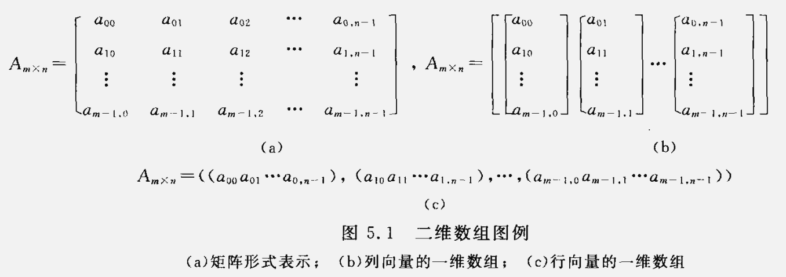

数组一旦被定义，它的维数和维界就不再改变。
因此，除了 **结构的初始化和销毁** 之外，数组只有 **存取元素** 和 **改变元素值** 的操作。

a

## 5.2 数组的顺序表示和实现

由于数组一般不作插入或删除操作，一旦建立了数组，则结构中的数据元素个数和元素之间的关系就不再发生变动。因此采用顺序存储结构表示数组。

由于存储单元是一维结构，而数组是个多维的结构，则用一组连续存储单元存放数组的数据元素就有个 **次序约定** 问题。即必须按某种次序将数组元素排成一列序列，然后将这个线性序列存放到内存中。

对二维数组可有两种存储方式：

* 以列序为主序（**列优先顺序**）—— 将数组按列向量排列，第 $j+1$ 个列向量紧接在第 $j$ 个列向量之后，A 的 $m\times n$ 个元素按列优先顺序存储的线性序列为：

  $a_{11}, a_{21}, ..., a_{m1}, a_{12}, a_{22}, ..., a_{m2}, ..., a_{1n}, a_{2n},..., a_{mn}$  

* 以行序为主序（**行优先顺序**）—— 将数组元素按行排列，第 $i+1$ 个行向量紧接在第 $i$ 个行向量后面，以二维数组为例， 按行优先顺序存储的线性序列为：

  $a_{11}, a_{12}, ..., a_{1n}, a_{21}, a_{22}, ..., a_{2n}, ..., a_{m1}, a_{m2},..., a_{mn}$  

  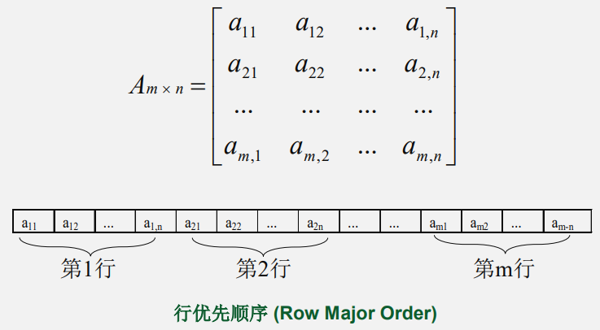


一旦规定了它的维数和各维的长度，便可为它分配空间。反之，只要给出一组下标便可求得相应数组元素的存储位置。

下面仅以行序为主序为例：

假设每个数据元素占据 L 个存储单元，则二维数组 A 中任一元素 $a_{ij}$ 的存储位置可由下式确定：
$$
\mathrm{LOC}(i,j) = \mathrm{LOC}(0,0)+(b_2\times i+j)L
$$
式中，$\mathrm{LOC}(i,j)$ 是 $a_{ij}$ 的存储位置，$\mathrm{LOC}(0,0)$ 是 $a_{00}$ 的存储位置，即二维数组 A 的起始存储位置，也称为基地址或基址。

n 维数组的数据元素存储位置计算公式：
$$
\mathrm{LOC}(j_1,j_2,\cdots,j_n) = \mathrm{LOC}(0,0,\cdots,0)+(b_2\times \cdots \times b_n \times j_1+b_3\times\cdots\times b_n\times j_2 
\\+ \cdots +b_n\times j_{n-1}+j_n)L\\
=\mathrm{LOC}(0,0,\cdots,0) + (\sum_{i = 1}^{n-1}j_i \prod^n_{k = i+1}b_k+j_n)L
$$
可缩写成：
$$
\mathrm{LOC}(j_1,j_2,\cdots,j_n) = \mathrm{LOC}(0,0,\cdots,0)+\sum_{i = 1}^{n}c_ij_i
$$
其中 $c _n = L,c_{i-1} = b_i\times c_i,1<i\leqslant n$ 

上面的公式称为 $n$ 维数组的映像函数。数组的存储位置是其下标的线性函数，一旦确定了数组的各维的长度，$c_i$ 就是常数。


* 对于 $m\times n$ 的矩阵 A，元素下标 $[i,j](0\leqslant i \leqslant m, 0\leqslant j \leqslant n)$ ，则

  * 按 **行优先顺序** 存储：
    $$
    \mathrm{LOC}[i,j] = \mathrm{LOC}[0,0]+(n\times i + j)L
    $$

  * 按 **列优先顺序** 存储：
    $$
    \mathrm{LOC}[i,j] = \mathrm{LOC}[0,0]+(m \times j+i)L
    $$

* 实例：假设二维数组A的规模为$6\times8$，每个元素用相邻的6个字节存储，存储器按字节编址。已知A的起始存储位置（基地址）为1000，元素a00为起始，计算：

  * 数组 A 的体积（即存储量）

    $6\times8\times6=288$

  * 数组 A 的最后一个元素 $a_{57}$ 的第一个字节的地址

    $1000+288-6 = 1282$ 

  * 按行存储时，元素 $a_{14}$ 的第一个字节的地址

    $1000+(1\times 8+4)\times6=1072$ 

  * 按列存储时，元素 $a_{47}$ 的第一个字节的地址

    $1000+(7\times 6 + 4)\times6=1276$ 

    

 


## 5.3 矩阵的压缩存储

### 5.3.1 特殊矩阵

若 $n$ 阶矩阵 A 中的元满足性质 $a_{ij} = a_{ji}\ \ \  1\leqslant i,j \leqslant n$ ，则称为 $n$ 阶对称矩阵。

对于 对称矩阵，我们可以为每一对对称元分配一个存储空间，则可将 $n^2$ 个元压缩存储到 $n(n+1)/2$ 个元的空间中。不失一般性，我们可以行序为主序存储其下三角（包括对角线）中的元。

假设以一维数组 $sa[n(n+1)/20]$ 作为 $n$ 阶矩阵A 的存储结构，则 $sa[k]$ 和矩阵元 $a_{ij}$ 之间存在着一一对应的关系：
$$
k = \begin{cases}
\cfrac{i(i-1)}{2}+j-1&当\ i\geqslant j\\
\cfrac{j(j-1)}{2}+i-1&当\ i< j
\end{cases}
$$
称 $sa[n(n+1)/2]$ 为 $n$ 阶对称矩阵 A 的压缩存储。

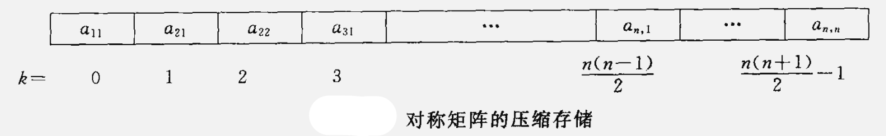

这种压缩存储方法同样也适用于三角矩阵，上（下）三角矩阵。

对角矩阵，可以按照某个原则（或以行为主，或以对角线的顺序）将其压缩在一维数组上。

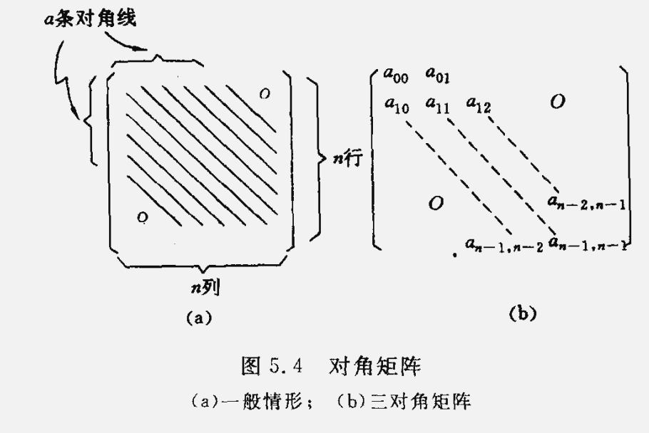

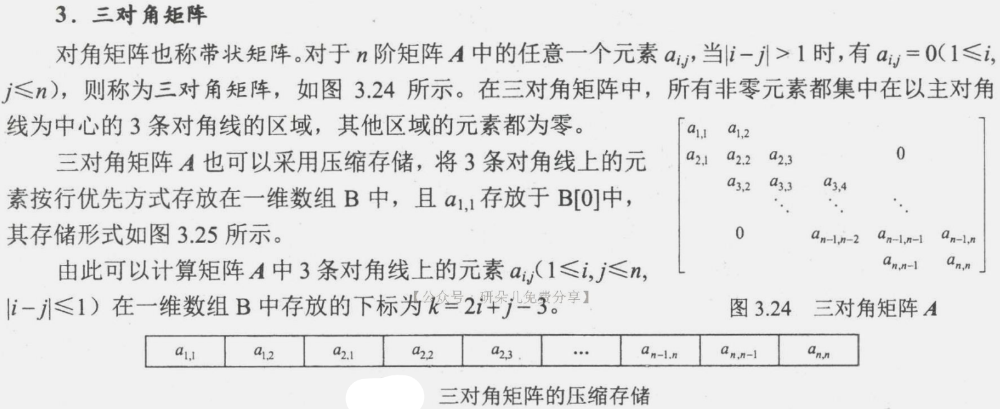


### 5.3.2 稀疏矩阵

假设在 $m\times n$ 的矩阵中，由 $t$ 个元素不为零，令 $\delta = \cfrac{t}{m\times n}$ ，称 $\delta$ 为矩阵的 **稀疏因子**。通常认为 $\delta \leqslant 0.05$ 时称为稀疏矩阵。

抽象数据类型 稀疏矩阵 的定义：

```cpp
ADT SparseMatrix{
    数据对象：D = {a(i,j) | i = 1,2,···,m; j = 1,2,···,n;
             			a(i,j) ∈ ElemSet, m和n分别称为矩阵的行数和列数}
    数据关系：R = {Row, Col}
    		Row = {<a(i,j), a(i,j+1)> | 1≤i≤m, 1≤j≤n-1}
    		Col = {<a(i,j), a(i+1,j)> | 1≤i≤m-1, 1≤j≤n}
    基本操作：
        CreateSMatrix(&M);
			操作结果：创建稀疏矩阵 M
        DestroySMatrix(&M);
    		初始条件：稀疏矩阵M存在
			操作结果：销毁稀疏矩阵 M
        PrintSMatrix(M);
    		初始条件：稀疏矩阵M存在
			操作结果：输出稀疏矩阵M
        CopySMatrix(M, &T);
    		初始条件：稀疏矩阵M存在
			操作结果：由稀疏矩阵M赋值到T
        AddSMatrix(M, N, &Q);
    		初始条件：稀疏矩阵M和N的行数和列数对应相等
			操作结果：求稀疏矩阵的和 Q = M+N
        MultSMatrix(M, N, &Q);
    		初始条件：稀疏矩阵M的列数等于N的行数
			操作结果：求稀疏矩阵的和 Q = M*N
        TransposeSMatrix(M, &T);
    		初始条件：稀疏矩阵M存在
			操作结果：求稀疏矩阵M的转置矩阵T
}ADT SparseMatrix
```


1. **三元组顺序表**

以顺序存储结构来表示三元组表，即可得到 稀疏矩阵 的一种压缩存储方式——三元组顺序表

```cpp
// 稀疏矩阵的三元组顺序表存储表示
#define MAXSIZE 12500   // 假设非零元个数的最大值为 12500
typedef struct{
    int i,j;        // 该非零元的行下标和列下标
    ElemType e;
}Triple;

typedef struct{
    Triple data[MAXSIZE+1];  // 非零元三元组
    int mu,nu,tu;
}TSMatrix;
```


转置矩阵：对于一个 $m\times n$ 的矩阵M，它的转置矩阵 T 是 $n\times m$ 的矩阵，且 $T(i,j) = M(j,i)$ 。
获得一个转置矩阵的方法：（ 1 ）将矩阵的行列值相互交换（ 2 ）将每个三元组中的 $i$ 和 $j$ 相互调换；（ 3 ）重排三元组之间的次序便可实现矩阵的转置。

对于重拍三元组之间的次序，有两种处理方法：（设有矩阵 B 是 矩阵A 的转置）

* 按照 转置后矩阵 中三元组的次序依次在 原矩阵的三元组 中找到相应的三元组进行转置：

  ```cpp
  Status TransposeSMatrix(TSMatrix M, TSMatrix &T){
      // 采用三元组表存储表示，求稀疏矩阵M的转置矩阵T
      T.mu = M.nu; T.nu = M.mu; T.tu = M.tu;
      if(T.tu){
          q = 0;
          for(col = 1; col<=M.nu; ++col){
              for(p = 0; p<M.tu; ++p){
                  if(M.data[p].j == col){
                      T.data[q].i = M.data[p].j;
                      T.data[q].j = M.data[p].i;
                      T.data[q].e = T.data[p].e;
                      ++q;
                  }
              }
          }
      }
      return OK;
  }
  ```

  时间复杂度：$O(mu\times nu)$ 

* **快速转置**：按照 原矩阵 中三元组 a.data 的次序进行转置，并将转置后的三元组置入 转置矩阵 恰当的位置。应先求M的每一列非零元的个数，进而求得每一列的第一个非零元在 转置矩阵的三元组b.data 中应有的位置。那么在对 a.data 中的三元组依次作转置时，便可直接放到 b.data 中恰当位置上去。

  需要设置 `num` 和 `cpot` 两个向量。`num[col]` 表示矩阵M中第 `col` 列中非零元的个数，`cpot[col]` 指示 M 中第 `col` 列的第一个非零元在 `b.data` 中的恰当位置。显然有
  $$
  \begin{cases} 
  \mathrm{cpot[1] = 1;}\\
  \mathrm{cpot[col] = cpot[col - 1] + num[col-1]}& \mathrm{2\leqslant col \leqslant a.nu}
  \end{cases}
  $$
  算法实现：

  ```cpp
  Status FastTransposeSMatrix(TSMatrix M, TSMatrix &T){
      // 采用三元组顺序表存储表示，求稀疏矩阵M的转置矩阵T
      T.mu = M.nu; T.nu = M.mu; T.tu = M.tu;
      if(T.tu){
          for(col = 1; col<=M.nu; ++col) num[col] = 0;
          // 求M中每一列含非零元个数
          for(t = 1; t<=M.tu; ++t) ++num[M.data[t].j];
          cpot[1] = 1;
          // 求第col列中第一个非零元在 b.data 中的序号
          for(col = 2; col<=M.nu; ++col) cpot[col] cpot[col-1]+num[col-1];
          for(p = 1; p<=M.tu; ++p){
              col = M.data[p].j; q = cpot[col];
              T.data[q].i = M.data[p].j;
              T.data[q].j = M.data[p].i;
              T.data[q].e = M.data[q].e;
              ++cpot[col];
          }// for
      }//if
      return OK;
  }
  ```

  时间复杂度：$O(nu+tu)$ 


2. **行逻辑链接的顺序表**

为了方便随机存取任意一行的非零元，则需知道每一行的第一个非零元在三元组表的位置。为此，可将 快速转置矩阵算法中创建的，指示“行”信息的辅助数组 cpot 固定在稀疏矩阵的存储结构中。

这种 “带行链接信息” 的三元组表 为行逻辑链接的顺序表，其类型描述如下：

```cpp
typedef struct{
    Triple data[MAXSIZE+1];  // 非零元三元组表
    int rpos[MAXRC+1];       // 各行第一个非零元的位置表
    int mu,nu,tu;            // 矩阵的行数、列数和非零元个数
}RLSMatrix;
```


3. **十字链表**

当矩阵的非零元个数和位置在操作过程中变化较大时，就不宜采用顺序存储结构来表示三元组的线性表。此时，采用 **链式存储结构** 表示三元组的线性表更为恰当。

在链表中

* 每个非零元可用一个含 5 个域的结点表示，其中 i、j 和 e 这三个域分别表示该非零元所在的行、列和非零元的值。
* 向右域 right 用以 链接同一行中下一个非零元，向下域 down 用以链接同一列中下一个非零元。
* 同一行 的非零元 通过 right 域 链接成 一个线性链表，同一列 的非零元通过 down 域 链接成一个线性链表。
* 每一个非零元既是某个行链表中的一个结点，又是某个列链表中的一个结点，整个矩阵构成了一个十字交叉的链表。

```cpp
// 稀疏矩阵的十字链表存储表示
typedef struct OLNode{
    int i,j;   // 该非零元的行和列下标
    ElemType e;
    struct OLNode * right, * down;  // 给非零元所在行表和列表的后继链域
}OLNode, *OLink;

typedef struct{
    OLink* rhead, chead;   // 行和列链表头指针向量基址由 CreateSMatrix 分配
    int mu, nu, tu;        // 稀疏矩阵的行数、列数和非零元个数
}
```


## 5.4 广义表的定义

广义表，是线性表的推广。广义表一般记作：$LS = (\alpha_1, \alpha_2, \cdots, \alpha_n)$ ，其中，LS 是广义表 $(\alpha_1, \alpha_2, \cdots, \alpha_n)$ 的名称，$n$ 是它的长度。

* 在线性表的定义中，$a_i(1\leqslant i \leqslant n)$ 只限于单个元素。而在广义表的定义中，$\alpha_i$ 可以是 单个元素，也可以是广义表，分别称为 广义表 LS 的 **原子** 和 **子表**。
  习惯上，用大写字母表示广义表的名称，用小写字母表示原子
* 当 广义表 LS 非空时，称第一个元素 $a_1$ 为 LS 的 **表头**（Head），称其余元素组成的表 $(\alpha_2, \alpha_3, \cdots, \alpha_n)$ 是 LS 的表尾（Tail）


**广义表的例子**：

* A = () —— A是一个空表，它的长度为零
* B = (e) —— 列表 B 只有一个原子 e，B 的长度为 1
* C = (a, (b,c,d)) —— 列表 C 的长度为 2，两个元素分别为 原子 a 和 子表(b,c,d)
* D = (A,B,C) —— 列表 D 的长度为 3，3个元素都是列表
* E = (a, E) —— 这是一个递归的表，它的长度为 2。E 相当于一个无限的列表 E = (a, (a,(a, ···)))


广义表的重要定义：

* 广义表的元素可以是原子，也可以是子表，子表的元素又可以是子表。即广义表是一个多层次的结构。
* 广义表可以被其他广义表所共享，也可以共享其他广义表。广义表共享其他广义表时通过表名引用。
* 广义表本身可以是一个递归表。
* 任何一个非空广义表的表头可以是原子，也可以是子表，而表尾必定是广义表。


## 5.5 广义表的存储结构

通常采用 链式存储结构 表示广义表，每个数据元素可用一个结点表示。

```cpp
// 广义表的头尾链表存储表示
typedef enum{ATOM, LIST}ElemTag;  // ATOM == 0:原子, LIST == 1:子表
typedef struct GLNode{
    ElemTag tag;             // 公共部分，用于区分原子结点和表结点
    union{	                 // 原子结点 和 表结点的联合部分
        AtomType atom;       // atom 是原子结点的值域，AtomType 由用户定义
        struct{struct GLNode * hp, * tp;}ptr;
    };// ptr 是表结点的指针域，ptr.hp 和 ptr.tp 分别指向表头和表尾
}*GList;  // 广义表类型
```

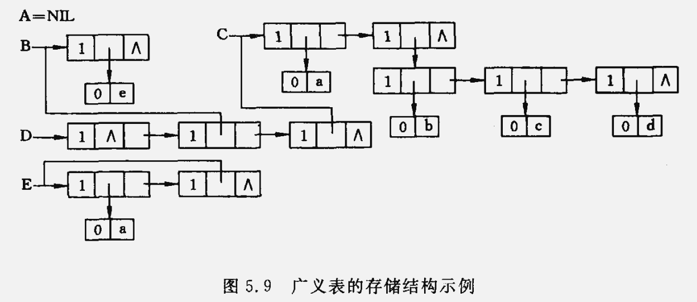

对于上述存储结构，有如下几个特点： (1) 若广义表为空，表头指针为空；否则，表头指针总是指向一个表结点，其中hp指向广义表的表头结点(或为原子结点，或为表结点) ， tp指向广义表的表尾(表尾为空时，指针为空，否则必为表结点)。 (2) 这种结构求广义表的长度、深度、表头、表尾的操作十分方便。 (3) 表结点太多，造成空间浪费


# 6 树和二叉树

## 6.1 树的定义和基本术语

树（Tree） 是 $n$（$n\geqslant 0$ ）个结点的有限集。在任意一棵非空树中：
（1）有且仅有一个特定的称为根（Root）的结点；
（2）当 $n>1$ 时，其余结点可分为 $m(m>0)$ 个互不相交的有限集 $T_1, T_2,...,T_m$ ，其中每一个集合本身又是一棵树，并且称为根的子树（SubTree）。

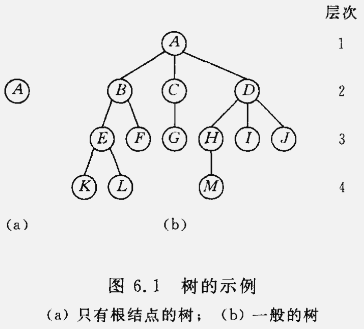

抽象数据类型树的定义：

```
ADT Tree{
	数据对象 D: D 是具有相同特性的数据元素的集合
	数据关系 R: 若 D 为空集, 则称为空树
		若 D 仅含一个数据元素, 则 R 为空集, 否则 R = {H}, H 是如下二元关系:
		(1) 在 D 中存在唯一的称为根的数据元素 root, 它在关系 H 下无前驱
		(2) 若 D-{root} != ⌀, 则存在 D-{root} 的一个划分 D1,D2,...,Dm(m>0),对任意 j!=k(1<=j,k<=m) 有 Dj ∩ Dk = ⌀, 且对任意的 i(1<=i<=m), 惟一存在数据元素 xi ∈ Di, 有 <root, xi> ∈ H;
		(3) 对应于 D-{root} 的划分, H-{<root,x1>,...,<root, xm>} 有惟一的一个划分 H1,H2,...,Hm(m>0), 对任意 j!=k(1<=j,k<=m) 有 Hj ∩ Hk = ⌀. 且对任意 i(1<=i<=m). Hi 是 Di 上的二元关系, (Di,{Hi}) 是一个符合本定义的树，称为根 root 的子树
		基本操作 P:
			InitTree(&T);
				操作结果: 构造空树 T
			DestroyTree(&T);
				初始条件: 树 T 存在
				操作结果: 销毁树 T
            CreateTree(&T, definition);
            	初始条件: definition 给出树 T 的定义
            	操作结果: 按 definition 构造树 T
            ClearTree(&T);
            	初始条件: 树 T 存在
            	操作结果: 将树 T 清为空树
            TreeEmpty(T);
            	初始条件: 树 T 存在
            	操作结果: 若 T 为空树, 则返回 TRUE, 否则返回 FALSE
            TreeDepth(T);
            	初始条件: 树 T 存在
            	操作结果: 返回树 T 的深度
            Root(T);
            	初始条件: 树 T 存在
            	操作结果: 返回树 T 的根
            Value(T, cur, e);
            	初始条件: 树 T 存在, cur_e 是 T 中某个结点
            	操作结果: 返回 cur_e 的值
            Assign(T, cur_e, value);
            	初始条件: 树 T 存在, cur_e 是 T 中某个结点
            	操作结果: 结点 cur_e 赋值为 value
            Parent(T, cur_e);
            	初始条件: 树 T 存在, cur_e 是 T 中某个结点
            	操作结果：若 cur_e 是 T 的非根节点，返回它的双亲,否则函数值为 空
            LeftChild(T, cur_e);
            	初始条件: 树 T 存在, cur_e 是 T 中某个结点
            	操作结果：若 cur_e 是 T 的非叶子结点, 则返回它的最左孩子,否则返回 空
            RightSibling(T, cur_e);
            	初始条件: 树 T 存在, cur_e 是 T 中某个结点
            	操作结果：若 cur_e 有右兄弟, 则返回它的右兄弟,否则函数值为 空
            InsertChild(&T, &p, i, c);
            	初始条件: 树 T 存在, cur_e 是 T 中某个结点, 1<= i<=p 所指结点的度+1, 非空树 c 与 T 不相交
            	操作结果：插入 c 为 T 中 p 所指结点的第 i 棵子树
            DeleteChild(&T, &p, i);
            	初始条件: 树 T 存在, p 指向 T 中某个结点, 1<=i<=p 指向结点的度
            	操作结果: 删除 T 中 p 所指向结点的第 i 棵子树
            TraverseTree(T, Visit());
            	初始条件: 树 T 存在, Visit 是对结点操作的应用函数
            	操作结果: 按某种次序对 T 的每个结点调用函数 visit() 一次
            			 一旦 visit() 失败, 则操作失败
} ADT Tree
```


**树的结构定义是一个递归的定义**，即在树的定义中又用到树的概念。

树结构的基本术语

* 树的 **结点**：包含一个数据元素及若干指向其子树的分支

* 结点的 **度**：<u>结点拥有的子树数</u>

* **叶子**（终端结点）：度为 0 的结点

* 除根节点以外的分支结点称为 内部结点

* **树的 度**：<u>树内各结点的度的最大值</u>

* 结点的 **孩子**：结点子树的根

  同时，该结点称为孩子的 **双亲**

  同一个双亲的孩子之间互称为 **兄弟**

  结点的 **祖先**：从根节点到该结点所经分支上的所有结点

  结点的 **子孙**：以该结点为根的子树中的任一结点

* 结点的**层次**，从根开始定义起，<u>根为第一层</u>，根的孩子为第二层。若某结点在第 `l` 层，则其子树的根 就在 第 `l+1` 层。
  其双亲在同一层的结点互称为 **堂兄弟**。

* **深度**（高度）：树中结点的最大层次。

* 如果将树中结点的各子树看成从左到右是有次序的（即不能互换），则称该树为有序树，否则称为无序树。在有序树最左边的子树的根称为第一个孩子，最右边的称为最后一个孩子。

* **森林** 是 $m(m\geqslant 0)$ 棵互不相交的树的集合。对树中每个结点而言，其子树的集合即为森林。由此，也可以森林和树互相递归定义来描述树。

  就逻辑结构而言，任何一棵树是一个二元组 $Tree = (root,F)$ ，其中：$root$ 是数据元素，称做树的根结点；$F$ 是 $m(m\geqslant 0)$ 棵树的森林，$F = (T_1,T_2,\cdots,T_m)$ ，其中 $T_i = (r_i, F_i)$ 称做根 $root$ 的第 $i$ 棵树；当 $m\not=0$ 时，在树根和其子树森林之间存在下列关系：
  $$
  RF = \{<root, r_i> |\ i = 1,2,\cdots,m, m>0 \}
  $$
  


## 6.2 二叉树

### 6.2.1二叉树的定义

**二叉树** （Bianry Tree）是另一种树型结构，它的特点是每个结点至多只有两棵子树（即二叉树中不存在度大于 2 的结点），并且，二叉树的子树有左右之分，其次序不能任意颠倒。

抽象数据类型二叉树的定义如下：

```
ADT BinaryTree:
数据对象 D：D是具有相同特性的数据元素的集合
数据关系 R: 
	若 D=⌀,则 R=⌀,称 BinaryTree 为空二叉树
	若 D≠⌀,则 R={H},H是如下二元关系：
		(1) 在 D 中存在惟一的成为根的数据元素 root,它在关系 H 下无前驱
		(2) 若 D-{root}≠⌀,则存在 D-{root}={Dl,Dr}, 且 Dl∩Dr=⌀
		(3) 若 Dl≠⌀,则 Dl 中存在惟一的元素 xl,<root,xl>∈H,且存在 Dl 上的关系 Hl⊂H; 若 Dr≠⌀,则 Dr中存在惟一的元素 xr,<root,xr>∈H,且存在 Dr 上的关系 Hr⊂H; H={<root,xl>,<root,xr>, Hl,Hr};
		(Dl,{Hl})是一颗符合本定义的二叉树,称为根的左子树,(Dr,{Hr}) 是一颗符合本定义的二叉树,称为根的右子树
		
基本操作P:
	InitBiTree(&T);
		操作结果：构造空二叉树T。
    DestroyBiTree(&T);
    	初始条件：二叉树T存在。
    	操作结果：销毁二叉树T。
    CreateBiTree(&T, definition);
    	初始条件：definition给出二叉树T的定义。
    	操作结果：按definition构造二叉树T。
    ClearBiTree(&T);
    	初始条件：二叉树T存在。
    	操作结果：将二叉树T清为空树。
    BiTreeEmpty(T);
    	初始条件：二叉树T存在。
    	操作结果：若二叉树T为空二叉树,则返回TRUE,否则返回FALSE。
    BiTreeDepth(T);
    	初始条件：二叉树T存在。
    	操作结果：返回二叉树T的深度。
    Root(T);
    	初始条件：二叉树T存在。
    	操作结果：返回二叉树T的根。
    Value(T, e);
    	初始条件：二叉树T存在,e是T中某个结点。
    	操作结果：返回e的值。
    Assign(T, &e, value);
    	初始条件：二叉树T存在,e是T中某个结点。
    	操作结果：将结点e赋值为value。
    Parent(T, e);
    	初始条件：二叉树T存在,e 是 T 中某个结点。
    	操作结果：若 e 是 T 的非根节点,则返回它的双亲,否则返回“空”。
    LeftChild(T, e);
    	初始条件：二叉树T存在,e 是 T 中某个结点。
    	操作结果：返回 e 的左孩子。若 e 无左孩子,则返回“空”。
    RightChild(T, e);
    	初始条件：二叉树T存在,e 是 T 中某个结点。
    	操作结果：返回 e 的右孩子。若 e 无右孩子,则返回“空”。
    LeftSibling(T, e);
    	初始条件：二叉树T存在,e 是 T 中某个结点。
    	操作结果：返回 e 的左兄弟。若 e 是 T 的左孩子或无左兄弟,则返回“空”。
    RightSibling(T, e);
    	初始条件：二叉树T存在,e 是 T 中某个结点。
    	操作结果：返回 e 的右兄弟。若 e 是 T 的右孩子或无右兄弟,则返回“空”。
    InsertChild(T, p, LR, c);
    	初始条件：二叉树 T 存在,p指向T中某个结点,LR 为 0 或 1,非空二叉树c与T不相交且右子树为空。
    	操作结果：根据 LR 为0或1,插入 c 为 T 中 p 所指结点的左或右子树。p 所指结点的原有左或右子树则成为 c 的右子树。
    DeleteChild(T, p, LR);
    	初始条件：二叉树T存在,p 指向T某个结点,LR为0或1。
    	操作结果：根据 LR 为 0 或 1,删除 T 中p所指向结点的左或右子树。
    PreOrderTraverse(T, Visit());
    	初始条件: 二叉树T存在,Visit是对结点操作的应用函数。
    	操作结果：先序遍历T,对每个结点调用函数Visit一次且仅一次。一旦visit()失败,则操作失败。
    InOrderTraverse(T, Visit());
    	初始条件: 二叉树T存在,Visit是对结点操作的应用函数。
    	操作结果：中序遍历T,对每个结点调用函数Visit一次且仅一次。一旦visit()失败,则操作失败。
    PostOrderTraverse(T, Visit());
    	初始条件: 二叉树T存在,Visit是对结点操作的应用函数。
    	操作结果：后序遍历T,对每个结点调用函数Visit一次且仅一次。一旦visit()失败,则操作失败。
    LevelOrderTraverse(T, Visit());
    	初始条件: 二叉树T存在,Visit是对结点操作的应用函数。
    	操作结果：层序遍历T,对每个结点调用函数Visit一次且仅一次。一旦visit()失败,则操作失败。
}ADT BinaryTree
```

上述数据结构的递归定义表明二叉树或为空，或是由一个根结点加上两棵分别成为左子树和右子树的、互不相交的的二叉树组成。二叉树有5个基本形态。

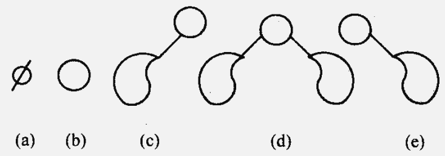


### 6.2.2 二叉树的性质

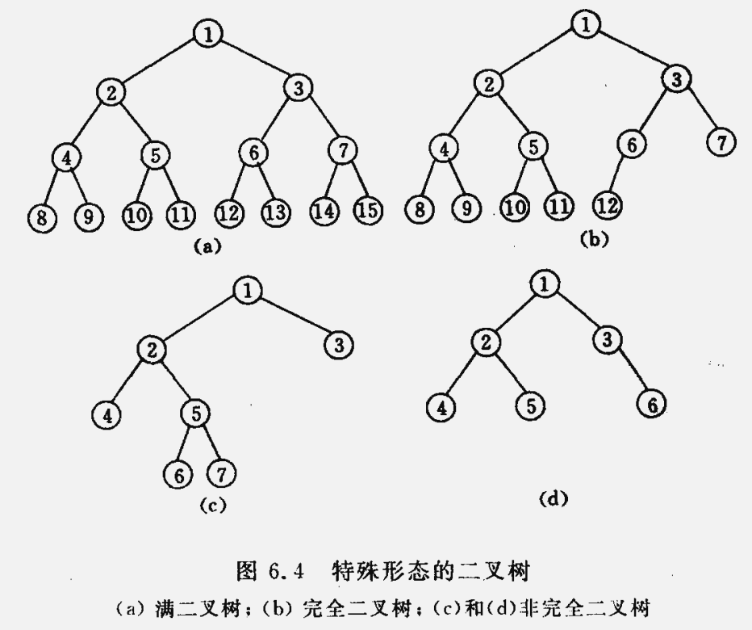

**性质1** 在二叉树的第 i 层上至多有 $2^{i-1}$ 个结点（$i\geqslant 1$）。

**性质2** 深度为 k 的二叉树至多有 $2^{k}-1$ 个结点，（$k\geqslant 1$）。

**性质3** 对任何一棵二叉树 $T$ ，如果其终端结点数为 $n_0$ ，度为 2 的结点数为 $n_2$ ，则 $n_0 = n_2+1$ 。

**性质4** 具有 $n$ 个结点的完全二叉树的深度 $⌊\mathrm{log}_2n⌋+1$ 。

**性质5** 如果对一棵有 n 个结点的完全二叉树（其深度为 $⌊\mathrm{log}_2n⌋+1$）的结点按层序编号（从第 1 层到第 $⌊\mathrm{log}_2n⌋+1$ 层，每层从左到右），则对任一结点 $i(1\leqslant i \leqslant n)$ ，有

​	（1）如果 $i = 1$ ，则结点 $i$ 是二叉树的根，无双亲；如果 $i>1$，则其双亲 $\mathrm{PARENT}(i)$ 是结点 $⌊i/2⌋$ 。

​	（2）如果 $2i>n$，则结点 $i$ 无左孩子（结点 $i$ 为叶子结点）；否则其左孩子 $\mathrm{LCHILD}(i)$ 是结点 $2i$ 。

​	（3）如果 $2i+1>n$，则结点 $i$ 无右孩子；否则其有孩子 $\mathrm{RCHILD}(i)$ 是结点 $2i+1$ 。


### 6.2.3二叉树的存储结构

1. 顺序存储结构

   ```cpp
   //----- 二叉树的顺序存储表示 -----
   #define MAX_TREE_SIZE 100                     // 二叉树的最大结点数
   typedef TElemType SqBiTree[MAX_TREE_SIZE];    // 0 号单元存储根结点
   SqBiTree bt;
   ```

   用一组地址连续的存储单元依次 自上而下、自左至右 存储完全二叉树上的结点元素，即将完全二叉树 上编号为 $i$ 的结点存储在如上定义的一维数组中下标为 $i-1$ 的分量中。顺序存储结构仅适用于完全二叉树。

2. 链式存储结构

   表示二叉树的链表中的结点至少包含 3 个域：数据域 和 左、右指针域。有时为了方便查找双音，则还可在结点结构中增加一个指向其双亲结点的指针域。利用这两种结点结构所得二叉树的存储结构分别称之为二叉链表和三叉链表。
   
   链表的头结点指向二叉树的根结点。在含有 $n$ 个结点的二叉链表中有 $n+1$ 个空链域。
   
   ```cpp
   //----- 二叉树的二叉链表存储表示 -----
   typedef struct BiTNode{
       TElemType data;
       struct BiTnode* lchild, *rchild;   // 左右孩子指针
   }BiTNode, *BiTree;
   //----- 基本操作的函数原型说明 -----
   Status CreateBiTree(BiTree &T);  
   	// 先序顺序输入二叉树中结点的值(一个字符)，空格字符表示空树
   Status PreOrderTraverse(BiTree T, Status(*Visit)(TElemType e));
   Status InOrderTraverse(BiTree T, Status(*Visit)(TElemType e));
   Status PostOrderTraverse(BiTree T, Status(*Visit)(TElemType e));
   Status LevelOrderTraverse(BiTree T, Status(*Visit)(TElemType e));
   ```
   

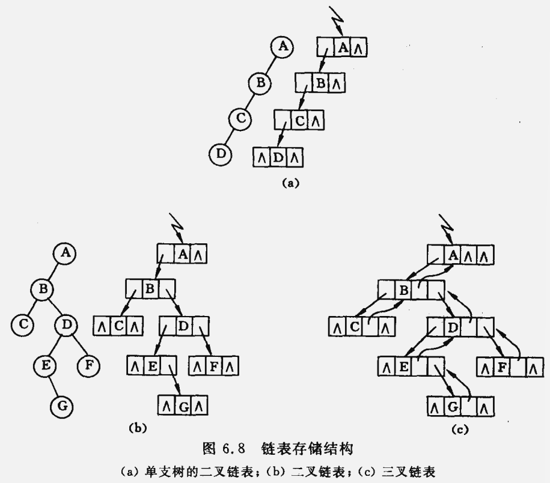


## 6.3 遍历二叉树和线性二叉树

### 6.3.1 遍历二叉树

**遍历二叉树**（traversing binary tree），按某条搜索路径巡访树中每个结点，使得每个结点均被访问一次，而且仅被访问一次。

#### 先序遍历

若二叉树为空，则空操作，否则

1. 访问根节点
2. 先序遍历左子树
3. 先序遍历右子树

先序遍历算法描述：

```cpp
Status PreOrderTraverse(BiTree T, Status(* Visit)(TElemType e)){
    // 采用二叉链表存储结构, Visit 是对数据元素操作的应用函数
    // 先序遍历二叉树 T 的递归算法，对每个数据元素调用函数 Visit 是对数据元素操作的应用函数
    // 最简单的 Visit 函数是：
    // 		Status PrintElement(TElemType e){
    //			printf(e);
    //			return OK;
	//		}
    // 调用实例：PreOrderTraverse(T, PrintElement);
    if(T){
        if(Visit(T->data))
            if(PreOderTraverse(T->lchild.Visit))
                if(PreOrderTraverse(T->rchild.Visit))	return OK;
        return ERROR;
    }else return OK;
} // PreOrderTraverse
```

可类似地实现中序遍历和后序遍历的递归算法


可运行的递归代码：

```cpp
vector<int> preorderTraversal(TreeNode* root) {
    vector<int> res;
    traversal(root, res);
    return res;
}

void traversal(TreeNode* node, vector<int>& res)
{
    if(node == nullptr) return;
    res.emplace_back(node->val);
    traversal(node->left,res);
    traversal(node->right,res);
}
```


先序遍历

非递归代码：

```cpp
vector<int> preorderTraversal(TreeNode* root) 
{
    stack<TreeNode*> stk;
    vector<int> res;
    if(!root) return res;
    stk.emplace(root);

    while(!stk.empty())
    {
        TreeNode* node = stk.top();
        stk.pop();
        res.emplace_back(node->val);

        if(node->right) stk.emplace(node->right);
        if(node->left) stk.emplace(node->left);
    }

    return res;
}
```


#### 中序遍历

若二叉树为空，则空操作，否则

1. 中序遍历左子树
2. 访问根节点
3. 中序遍历右子树

递归代码：

```cpp
class Solution {
public:
    vector<int> inorderTraversal(TreeNode* root) {
        vector<int> res;
        Traversal(root, res);
        return res;
    }

    void Traversal(TreeNode* node, vector<int>& res)
    {
        if(node == nullptr) return;
        Traversal(node->left, res);
        res.emplace_back(node->val);
        Traversal(node->right, res);
    }
};
```


#### 后序遍历

若二叉树为空，则空操作，否则

1. 后序遍历左子树
2. 后序遍历右子树
3. 访问根结点

递归代码：

```cpp
class Solution {
public:
    vector<int> postorderTraversal(TreeNode* root) {
        vector<int> res;
        Traversal(root, res);
        return res;
    }

    void Traversal(TreeNode* node, vector<int>& res)
    {
        if(node == nullptr) return;
        Traversal(node->left, res);
        Traversal(node->right, res);
        res.emplace_back(node->val);
    }
};
```


#### 遍历的非递归算法

如图所示的二叉树表示表达式：a+b*(c-d)-e/f

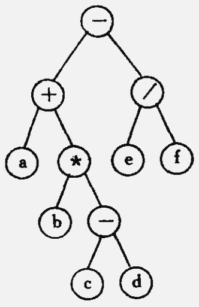

若先序遍历此二叉树，按访问结点的先后次序将结点排列起来，可得到二叉树的先序序列为：-+a*b-cd/ef

类似地，中序遍历此二叉树，可得到此二叉树的中序序列：a+b*c-d-e/f

后序遍历此二叉树，可得到此二叉树的后序序列：abcd-*+ef/-

从表达式来看，以上 3 个序列恰好为表达式的前缀表示（波兰式）、中缀表示和后缀表示（逆波兰式）

由以上二叉树遍历的定义可知，3种遍历算法之不同处仅在于访问根结点和遍历左、右子树的先后关系。

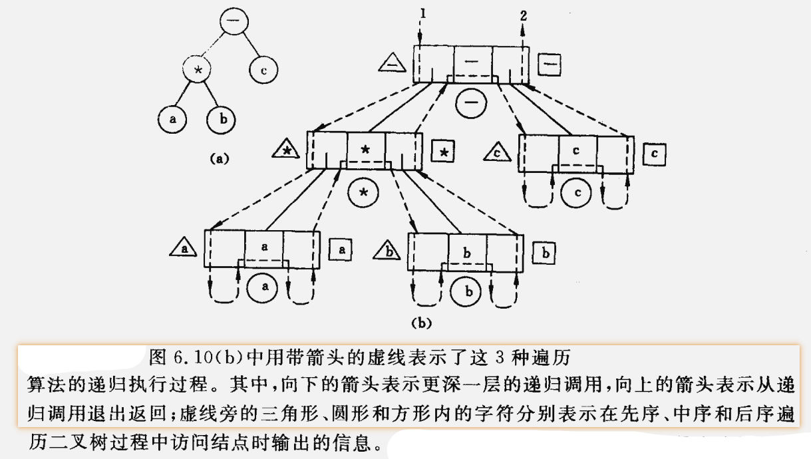

仿照递归算法执行过程中**递归工作栈**的状态变化状况可直接写出相应的非递归算法。

例如，从中序遍历递归算法执行过程中递归工作栈的状态可见：
（1）工作记录中包含两项，其一是递归调用的语句编号，其二是指向根结点的指针，则当栈顶记录中的指针非空时，则应遍历左子树，即指向树根的指针进栈；
（2）若栈顶记录中的指针值为空，则应退至上一层，若是从左子树返回，则应访问当前层即栈顶记录中指针所指的根结点
（3）若是从右子树返回，则表明当前层的遍历结束，应继续退栈。这意味着，遍历右子树时，不需要保留当前层的根指针，可直接修改栈顶记录中的指针即可。


```cpp
Status InOrderTraverse(BiTree T, Status(*Visit)(TElemType e)){
    // 采用二叉链表存储结构, Visit 是对数据元素操作的应用函数
    // 中序遍历二叉树 T 的非递归算法, 对每个数据元素调用函数 Visit
    InitStack(S); Push(S, T);    // 根指针进栈
    while(!StackEmpty(S)){
        while(GetTop(S, p) && p)  Push(S, p->lchild);  // 向左走到尽头
        Pop(S, p);
        if(!StackEmpty(S)){
            Pop(S, p); if(!Visit(p->data)) return ERROR;
            Push(S, p->rchild);
        } // if
    } // while
    return OK;
} // InOrderTraverse
```

```cpp
Status InOrderTraverse(BiTree T, Status(*Visit)(TElemType e)){
    // 采用二叉链表存储结构, Visit 是对数据元素操作的应用函数
    // 中序遍历二叉树 T 的非递归算法, 对每个数据元素调用函数 Visit
    InitStack(S);  p = T;
    while(p || !StackEmpty(S)){
        if(p) {	// 根指针进栈，遍历左子树
            Push(S, p); 
            p = p->lchild; 
        }
        else{
            Pop(S, p);  
            if(!Visit(p->data)) return ERROR;
            p = p->rchild;
        } // else
    } // while
    return OK;
} // InOrderTraverse
```


**先序遍历的非递归算法**

```cpp
void PreOrder2(BiTree T){
    InitStack(S); BiTree p = T;	// 初始化栈S; p是遍历指针 
    while(p || !IsEmpty(S)){	// 栈不空或p不空时循环
        if(p){					// 一路向左
            Visit(p);			// 访问当前节点
            Push(S,p);			// 入栈
            p = p->lchild;		// 左孩子不空，则一直向左走
        }
        else{					// 出栈,并转向栈节点的右子树
            Pop(S,p);			// 栈顶元素出栈
            p = p->rchild;	// 向右子树走，p赋值为当前结点的右孩子
        }					// 返回while循环继续进入if-else语句
    }
}
```


**后序遍历的非递归算法**

```cpp
void PostOrder(BiTree T)
{
    InitStack(S);
    p = T;
    r = NULL;	// 辅助指针，指向最近访问过的结点
    while(p || !StackEmpty(S))
    {
        if(p)	// 走到最左边
        {
            Push(S, p);
            p = p->lchild;
		}
        else	// 向右
        {
            GetTop(S, p);	// 读栈顶结点（非出栈）
            // 若右子树存在，且未被访问过
            // 转向右子树
            if(p->rchild && p->rchild != r)
                p = p->rchild;
            else 	// 否则弹出结点，并访问
            {
                Pop(S,p);		// 将结点弹出
                Visit(p->data);	// 访问该结点
                r = p;			// 记录最近访问过的结点
                p = NULL;		// 结点访问完后，重置p指针
            }
        }
    }
}
```

<u>每次出栈访问完一个结点就相当于 遍历完以该结点为根的子树，需将 p 置 NULL。</u>


“遍历” 是二叉树各种操作的基础，可以在遍历过程中对结点进行各种操作，如：对于一棵已知树可求结点的双亲，求结点的孩子结点，判定结点所在层次等，反之，也可在遍历过程中生成结点，建立二叉树的存储结构。

按下列次序顺序读入字符：`A B C ⌀ ⌀ D E ⌀ G ⌀ ⌀ F ⌀ ⌀ ⌀`，（其中 `⌀` 表示空格字符）可建立相应的二叉链表。

```cpp
Status CreateBiTree(BiTree &T){
    // 按先序次序输入二叉树中结点的值（一个字符），空格字符表示空树
    // 构造二叉链表表示的二叉树 T
    scanf(&ch);
    if(ch == ' ') T = NULL;
    else{
        if(!(T = (BiTNode*)malloc(sizeof(BiTNode)))) exit(OVERFLOW);
        T->data = ch;				// 生成根结点
        CreateBiTree(T->lchild);	// 构造左子树
        CreateBiTree(T->rchild);	// 构造右子树
    }
    return OK;
} // CreateBiTree
```


遍历二叉树的算法，无论按哪种次序进行遍历，对含 $n$ 个结点的二叉树，其时间复杂度均为 $O(n)$。

所需的空间为遍历过程中栈的最大容量，即树的深度，最坏情况下为 $n$ ，则空间复杂度也为 $O(n)$。


先序/后序/中序 遍历的非递归算法的通用代码：

```cpp
// 中序遍历
class Solution{
public:
    vector<int> inorderTraversal(TreeNode* root) {
        vector<int> result;
        stack<TreeNode*> st;
        if(root != NULL) st.push(root);
        while(!st.empty()){
            TreeNode* node = st.top();
            if(node != NULL){
                st.pop(); //将该节点弹出避免重复操作，下面再将左中节点添加到栈中
                if(node->right) st.push(node->right); //添加右节点
                st.push(node);
                st.push(NULL); //中节点访问过，但是还没有进行处理，加入空节点作为标记
                if(node->left) st.push(node->left);
            }else{ //只有遇到空节点的时候，才将下一个节点放进结果集
                st.pop(); // 将空节点弹出
                node = st.top(); //重新取出栈中元素
                st.pop();
                result.push_back(node->val);//加入结果集
            }
        }
    }
    
    vector<int> postorderTraversal(TreeNode* root) {
        vector<int> result;
        stack<TreeNode*> st;
        if (root != NULL) st.push(root);
        while (!st.empty()) {
            TreeNode* node = st.top();
            if (node != NULL) {
                st.pop();
                st.push(node);                          // 中
                st.push(NULL);

                if (node->right) st.push(node->right);  // 右
                if (node->left) st.push(node->left);    // 左

            } else {
                st.pop();
                node = st.top();
                st.pop();
                result.push_back(node->val);
            }
        }
        return result;
    }
};
```


#### 层序遍历

```cpp
void LevelOrder(BiTree T){
    InitQueue(Q);					// 初始化辅助队列
    BiTree p;
    EnQueue(Q,T);					// 将根结点入队
    while(!IsEmpty(Q)){				// 队列不空则循环
        DeQueue(Q,p);				// 队头结点出队
        visit(p);					// 访问出队结点
        if(p->lchild != NULL)		
            EnQueue(Q, p->lchild);// 左子树不空，则左子树根节点入队
        if(p->rchild != NULL)
            EnQueue(Q, p->rchild);// 右子树不空，则右子树根结点入队
    }
}
```


```cpp
vector<vector<int>> levelOrder(TreeNode* root) {
    queue<TreeNode*> que;
    vector<vector<int>> ans;
    if(!root) return ans;
    que.emplace(root);

    while(!que.empty())
    {
        vector<int> v;
        int size = que.size();

        for(int i = 0; i<size; i++)
        {
            TreeNode* node = que.front();
            que.pop();
            v.emplace_back(node->val);
            if(node->left) que.emplace(node->left);
            if(node->right) que.emplace(node->right);
        }

        ans.emplace_back(v);
    }

    return ans;
}
```


### 6.3.2 线索二叉树

试作如下规定：若结点有左子树，则其 lchild 域指示其左孩子，否则令 lchild 域指示其前驱；若结点有右子树，则令其 rchild 域指示其右孩子，否则令 rchild 域指示其后继。所以需要增加两个标志域：

| lchild | LTag | data | RTag | rchild |
| ------ | ---- | ---- | ---- | ------ |

其中：
$$
\mathrm{LTag} = \begin{cases}
0&\mathrm{lchild} 域指示结点的左孩子\\
1&\mathrm{lchild} 域指示结点的前驱
\end{cases}\\
\mathrm{RTag} = \begin{cases}
0&\mathrm{rchild} 域指示结点的右孩子\\
1&\mathrm{rchild} 域指示结点的后继
\end{cases}
$$
以这种结点结构构成的二叉链表作为二叉树的存储结构，叫做**线索链表**。其中指向结点前驱和后继的指针，叫做**线索**。加上线索的二叉树称之为 **线索二叉树**（Threaded Binary Tree）。

例如，下图(a)为中序线索二叉树，与其对应的中序线索链表如图(b)所示。其中实线为指针（指示左、右子树），虚线为线索（指向前驱和后继）。

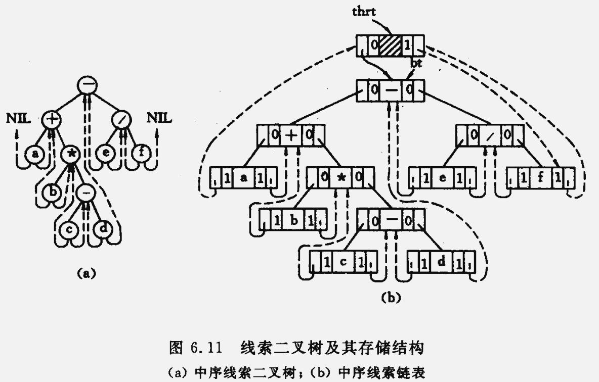

**线索化**：对二叉树以某种次序遍历使其变为线索二叉树的过程。

在线索树上进行遍历，只要先找到序列中的第一个结点，然后依次找结点后继直至其后继为空时而止。

如何在搜索树中找结点的后继？以上图的中序搜索树为例来看，树中所有叶子结点的右链是线索，则右链域直接指示了结点的后继，如结点 `b` 的后继为结点 `*`。树中所有非终端结点的右链均为指针，则由此无法得到后继的信息。

然而，根据中序遍历的规律可知，结点的后继应是遍历其右子树时访问的第一个结点，即右子树中最左下的结点。例如在**找结点** `*` **的后继**时，<u>首先沿右指针找到其右子树的根结点</u> `-` ，然后<u>顺其左指针往下直至其左标志为1的结点</u>，记为 `*` 的后继，在图中是结点 `c` 。

反之，在**中序搜索树中找结点前驱**的规律是：若其左标志为 1，则左链为线索，指示其前驱，否则遍历左子树时最后访问的一个结点（左子树中最右下的结点）为其前驱。


在后序搜索树中找结点后继可分为3种情况：
（1）若结点 x 是二叉树的根，则其后继为空
（2）若结点 x 是其双亲的右孩子或是双亲的左孩子且其双亲没有右子树，则其后继即为双亲结点
（3）若结点 x 是其双亲的左孩子，且其双亲有右子树，则其后继为双亲的右子树上按后序遍历列出的第一个结点

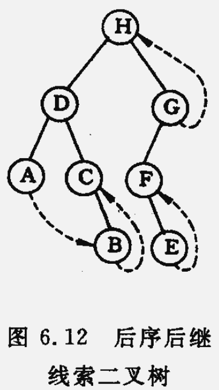

在中序线索二叉树上遍历二叉树，虽然时间复杂度亦为 $O(n)$ ，但常数因子要比之前讨论的算法小，且不需要设栈。因此，若在某程序中所用二叉树需经常遍历或查找结点在遍历所得线性序列中的前驱和后继，则应采用线索链表存储结构。

```cpp
// ----- 二叉树的二叉线索存储表示 -----
typedef enum PointerTag {Link, Thread}; 
// Link == 0:指针，Thread == 1: 线索
typedef struct BiThrNode{
    TElemType 			data;
    struct BiThrNode 	* lchild, * rchild;  // 左右孩子
    PointerTag 			LTag, RTag;  		// 左右标志
}BiThrNode, *BiThrTree;
```


为了方便起见，仿照线性表的存储结构，在二叉树的线性链表上也添加一个头结点，并令其 lchild 域的指针指向二叉树的根结点，其 rchild 域的指针指向中序遍历时访问的最后一个结点。令二叉树中序序列中的第一个结点的 lchild 域指针和最后一个结点 rchild 域的指针均指向头结点。
类似为二叉树建立了一个双向线性链表，既可从第一个结点起顺后继进行遍历，也可从最后一个结点起顺前驱进行遍历。

```cpp
Status InOrderTraverse_Thr(BiThrTree T, Status(*Visit)(TElemType e)){
    // T 指向头结点，头结点的左链 lchild 指向根结点
    // 中序遍历二叉线索树 T 的非递归算法，对每个数据元素调用函数 Visit
    p = T->lchild;   // p 指向根结点
    while(p!=T){     // 空树或遍历结束时，p==T
        while(p->LTag == Link) p = p->lchild;   // p->lchild 存储的是左孩子
        if(!Visit(p->data)) return ERROR;  		// 访问其左子树为空的结点
        while(p->RTag == Thread && p->rchild != T){
            p = p->rchild; Visit(p->data); 		// 访问后继结点
        }
        p = p->rchild;
    }
    return OK;
} // InOrderTraverse_Thr
```


线索化的实质：将二叉链表中的空指针改为指向前驱或后继的线索，而前驱或后继的信息只有在遍历时才能得到，因为线索化过程即为在遍历的过程中修改空指针的过程。

为了记下遍历过程中访问节点的先后关系，附设一个指针 pre 始终指向刚刚访问过的结点，若指针 p 指向当前访问的结点，则 pre 指向它的前驱。

```cpp
Status InOrderThreading(BiThrTree & Thrt, BiThrThree T){
    // 中序遍历二叉树 T，并将其中序线索化，Thrt 指向头结点
    if(!(Thrt = (BiThrTree)malloc(sizeof(BiThrNode)))) exit(OVERFLOW);
    Thrt->LTag = Link; 	Thrt->RTag = Tread;			// 建立头结点
    Thrt->rchild = Thrt;							// 右指针回指
    if(!T) Thrt->lchild = Thrt;						// 若二叉树空, 则左指针回指
    else{
        Thrt->lchild = T;	pre = Thrt;
        InThreading(T);								// 中序遍历进行中序线索化
        pre->rchild = Thrt;	pre->RTag= Tread;		// 最后一个结点线索化
        Thrt->rchild = pre;
    }
    return OK;
} // InOrderThreading

void InThreading(BiThrTree p){
    if(p){
        InThreading(p->lchild);  // 左子树线索化
        if(!p->lchild) {p->LTag = Thread;	p->lchild = pre; }	// 前驱线索
        if(!pre->rchild) {pre->RTag = Thread; pre->rchild = p; } // 后继线索
        pre = p;	// 保持 pre 指向 p 的前驱
        InThreading(p->rchild);  // 右子树线索化
    }
} // InThreading
```


**线索树的示例**：

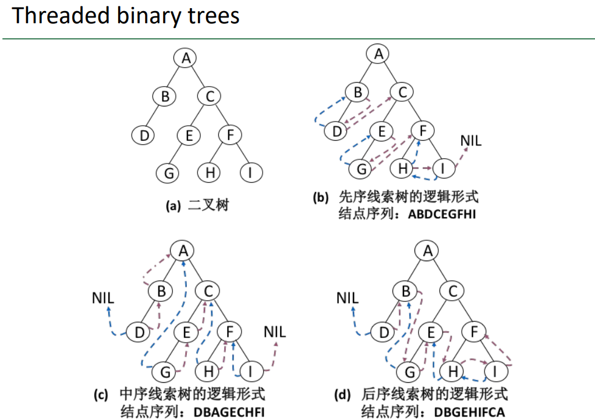

**例题**

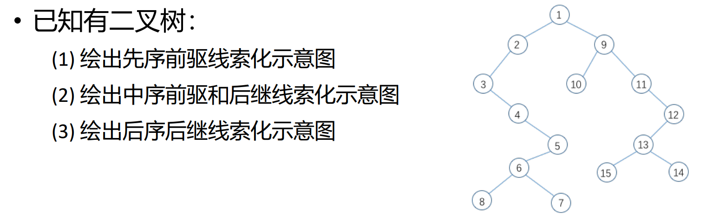

**答案**

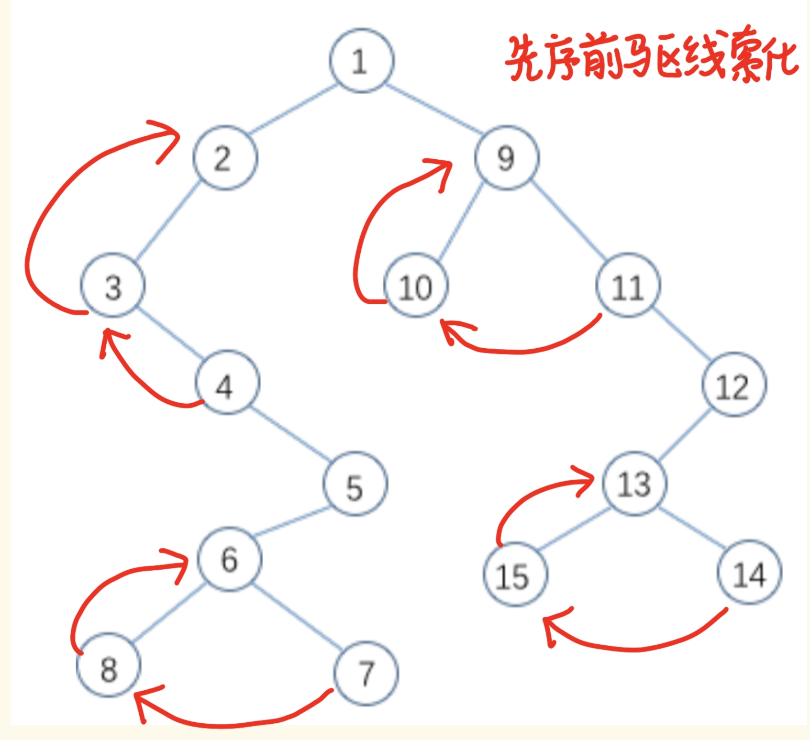 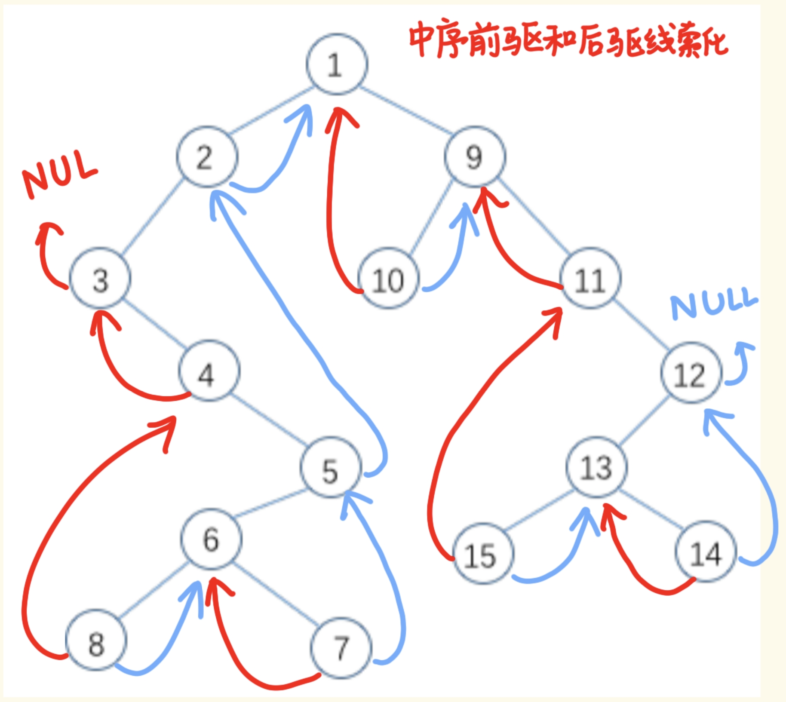 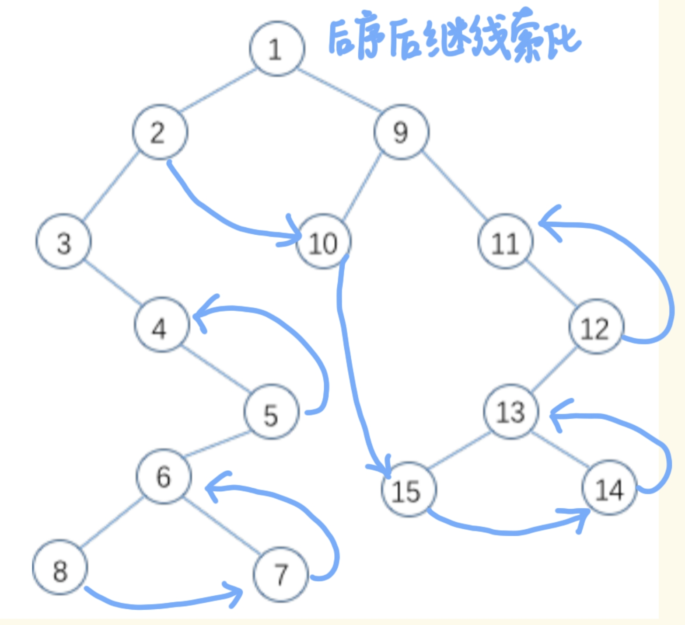


## 6.4 树和森林

### 6.4.1 树的存储结构

1. 双亲表示法

   假设以一组连续空间存储树的结点，同时在每个结点中附设一个指示器指示其双亲结点在链表中的位置，其形式说明如下：

   ```cpp
   // ----- 树的双亲表存储表示 -----
   #define MAX_TREE_SIZE 100
   typedef struct PTNode{   // 结点结构
       TElemType data;
       int       parent;    // 双亲位置域
   }PTNode;
   typedef struct{          // 树结构
       PTNode node[MAX_TREE_SIZE];
       int    r, n;         // 根的位置和结点数
   }PTree;
   ```

   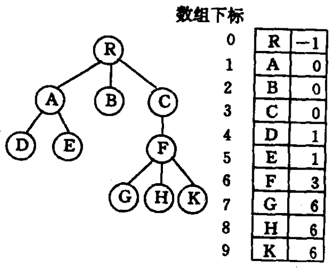

   这种结构充分利用了每个结点（除根以外）只有惟一的双亲的性质。PARENT(T,x) 操作可以在常量时间内实现。反复调用 PARENT 操作，直到遇见无双亲的结点时，便找到了树的根，这就是 ROOT(x) 操作的执行过程。但是，在这种表示法中，求结点的孩子时需要遍历整个结构。

2. 孩子表示法

   由于树中每个结点可能有多棵子树，则可用多重链表，即每个结点有多个指针域，其中每个指针指向一棵子树的根结点，此时链表中的结点可以有如下两种结点格式：

   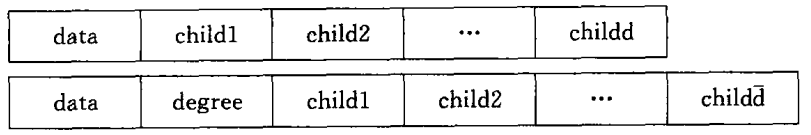

   第一种结点格式，多重链表中的结点是同构的，其中 d 为树的度。由于树中很多结点的度小于 d，所以链表中有很多空链域，空间较浪费。若采用第二个结点格式，多重链表的结点不同构，操作不方便。

   另一种方法就是：把每个结点的孩子结点排列起来，看成一个线性表，且以链表作存储结构，则 n 个结点有 n 个孩子链表（叶子的孩子链表为空表）。而 n 个头指针又组成一个线性表，为了方便查找，可采用顺序存储结构。

   ```cpp
   // ----- 树的孩子链表存储表示 -----
   typedef struct CTNode{   	// 孩子结点
       int child;
       struct CTNode* next;
   } *ChildPtr;
   
   typedef struct{
       TElemType data;
       ChildPtr firstchild;  	// 孩子链表头结点
   }CTBox;
   typedef struct{
       CTBox nodes[MAX_TREE_SIZE];
       int n, r; 				// 结点数和根的位置
   }CTree;
   ```

   孩子表示法便于涉及孩子的操作的实现，却不适用于 PARENT(T,x) 操作。

   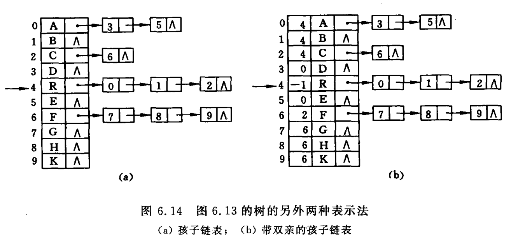

   

3. 孩子兄弟表示法

   又称二叉树表示法，或二叉链表表示法。链表中的结点的两个链域分别指向该结点的第一个孩子结点和下一个兄弟结点，分别命名为 firstchild 域 和 nextsibling 域

   ```cpp
   // ----- 树的二叉链表（孩子-兄弟）存储表示 -----
   typedef struct CSNode{
       ElemType data;
       struct CSNode * firstchild, * nextsibling;
   }CSNode, *CSTree;
   ```

   

   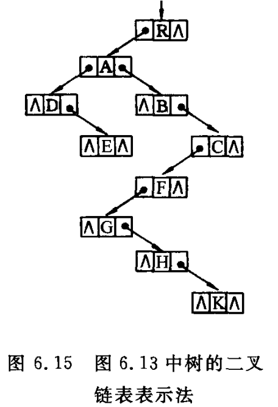
   
   利用这种存储结构便于实现各种树的操作。首先易于实现找结点孩子等的操作。例如：若要访问结点 x 的第 i 个孩子，则只要先从 firstchild 域找到第 1 个孩子结点，然后沿着孩子结点的 nextsibling 域连续走 i-1 步，便可找到 x 的第 i 个孩子。


### 6.4.2 森林和二叉树的转换

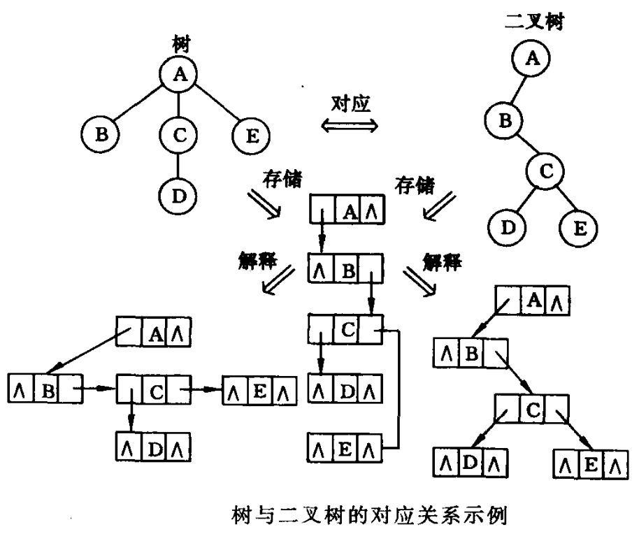

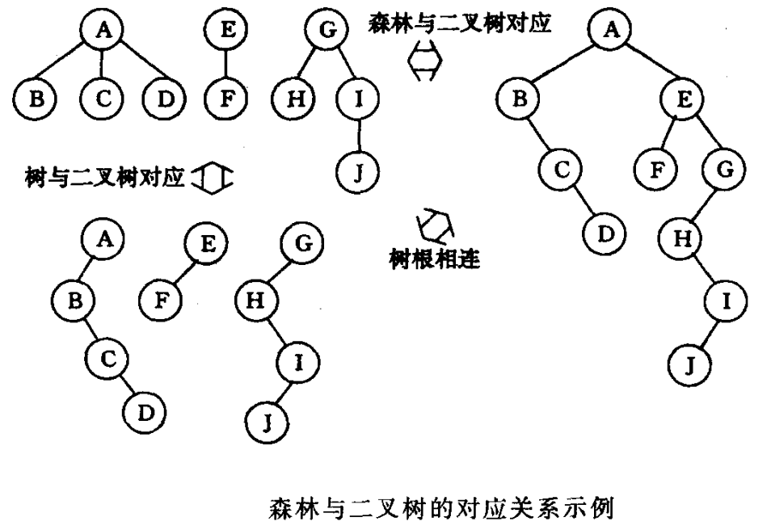

给定一棵树，可以找到惟一的一棵二叉树与之对应。任何一棵和树对应的二叉树，其右子树必空。若把森林的第二棵树的根结点看成第一棵树的根结点的兄弟，同样可导出森林和二叉树的对应关系。

**树与二叉树的转换**

约定树中每个结点的孩子结点按**从左到右**的次序顺序编号。将树转为二叉树的方法是：
（1）树中所有相邻兄弟之间加一条连线。
（2）对树中的每个结点，只保留它与第一个孩子之间的连线，删去它与其他孩子结点之间的连线。
（3）以树的根结点为轴心，将整棵树顺时针转动一定的角度，使之结构层次分明。

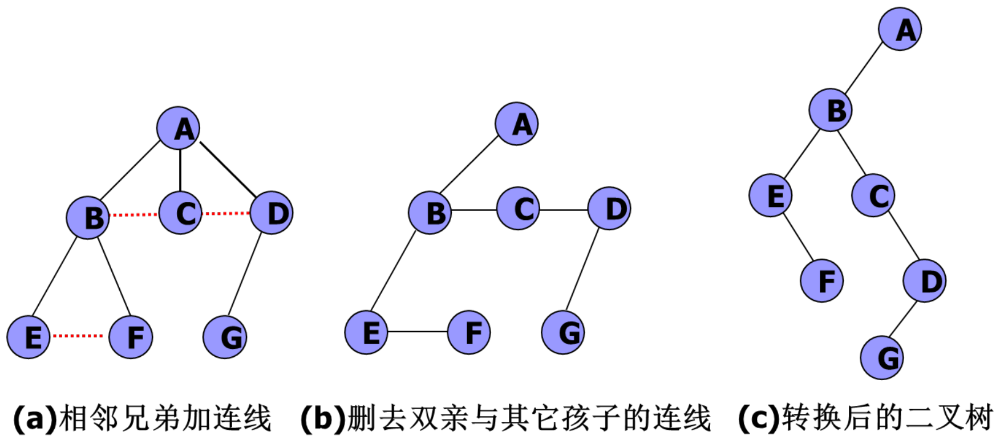

在二叉树中，左分支上的各结点在原来的树中是父子关系，而右分支上的各结点在原来的树中是兄弟关系。由于树的根结点没有兄弟，所以**转换后的二叉树的根结点的右孩子必为空**。

事实上，一棵树采用孩子兄弟表示法建立的存储结构与它所对应的二叉树的二叉链表存储结构是完全相同的。

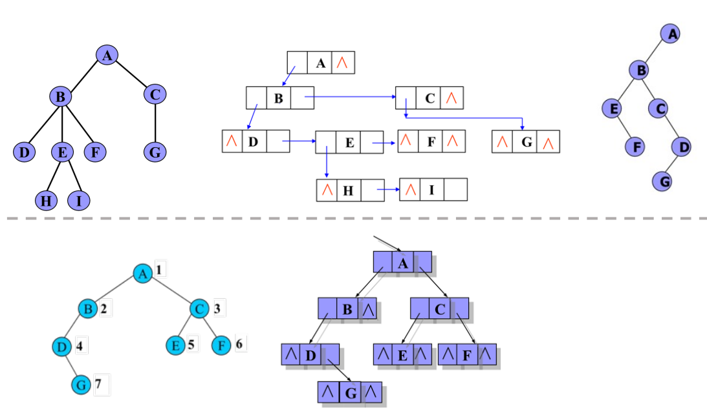


**森林与二叉树的转换**

* 由森林的概念可知，森林是若干棵树的若干棵树的集合，只要将森林中各棵树的根视为兄弟，每棵树又可以用二叉树表示，这样，森林也同样可以用二叉树表示。

* 森林转换为二叉树的方法如下：
  （1）将森林中的每棵树转换为相同的二叉树。
  （2）第一棵二叉树不动，从第二棵二叉树开始，依次把后一棵二叉树的根结点作为前一棵二叉树根结点的右孩子，当所有二叉树连起来后，此时所得到的二叉树就是由森林转换得到的二叉树。

  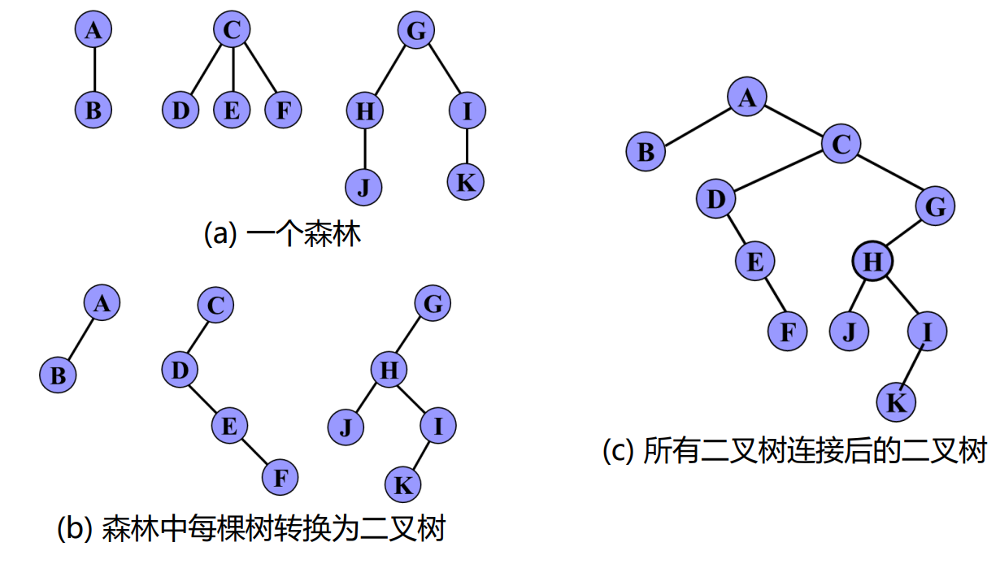


**二叉树转换为树和森林**

（1）若某结点是其双亲的左孩子，则把该结点的右孩子、右孩子的右孩子......都与该结点的双亲结点用线连起来

（2）删去原二叉树中所有的双亲结点与右孩子结点的连线

（3）整理由（1）、（2）两步所得到的树或森林，使之结构层次分明。

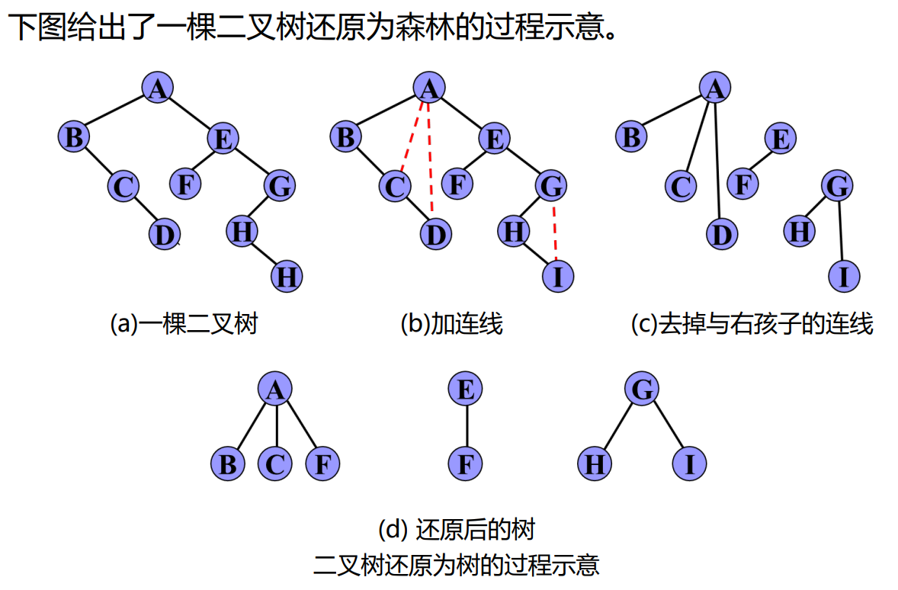

1. 树与二叉树的转换
   对于一棵无序树，树中结点的各孩子的次序是无关紧要的，而二叉树 中结点的左、右孩子结点是有区别的。为避免发生混淆，我们约定树中每一个结点的孩子结点按从左到右的次序顺序编号。
2. 森林转换为二叉树
   由森林的概念可知，森林是若干棵树的集合，只要将森林中各棵树的根视为兄弟，每棵树又可以用二叉树表示，这样，森林也同样可以用二叉树表示。 
3. 二叉树转换为树和森林
   树和森林都可以转换为二叉树，二者不同的是树转换成的二叉树，其根结点无右分支，而森林转换后的二叉树，其根结点有右分支。

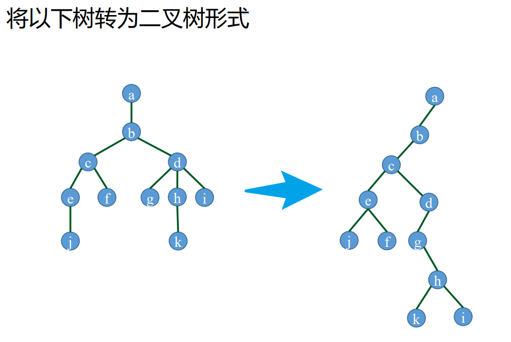

### 6.4.3 树和森林的遍历

由树结构的定义可引出两种次序遍历树的方法：一种是先根（次序）遍历树，即：先访问树的根结点，然后依次先根遍历根的每棵子树；另一种是后根（次序）遍历，即：先依次后根遍历每棵子树，然后访问根结点。

1. 先根遍历

   先根遍历的定义为： ① 访问根结点； ② 按照从左到右的顺序先根遍历根结点的每一棵子树。

2. 后根遍历

   后根遍历的定义为： ① 按照从左到右的顺序后根遍历根结点的每一棵子树； ② 访问根结点。

3. 层次遍历
    按从上到下、从左到右访问各结点。


1. 先序遍历森林

   若森林非空，则可按下述规则遍历之：

   （1）访问森林中第一棵树的根结点

   （2）先序遍历第一棵树根结点的子树森林

   （3）先序遍历除去第一棵树之后剩余的树构成的森林

2. 中序遍历森林

   （1）中序遍历森林中第一棵树的根结点的子树森林

   （2）访问第一棵树的根结点

   （3）中序遍历除去第一棵树之后剩余的树构成的森林

   


**树的先根次序遍历**

* 当树非空时

  * 访问根结点

  * 依次先根遍历根的各棵子树


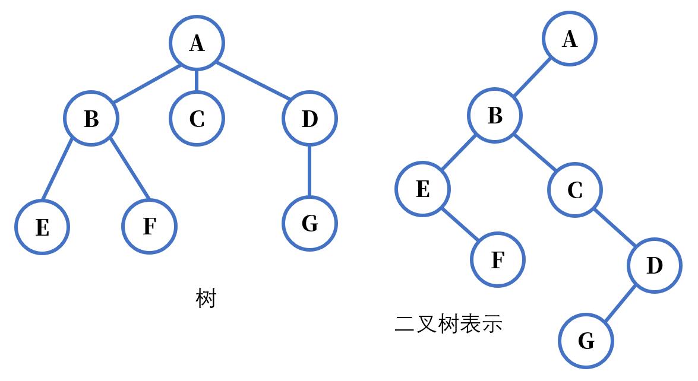

* 树的先序遍历：ABEFCDG

* 对应二叉树先序遍历 ABEFCDG

* 树的先根遍历结果与其对应二叉树表示的先序遍历结果相同

* 树的先根遍历可以借助对应二叉树的先序遍历算法实现

* 递归算法实现：

  ```cpp
  template<class Type>
  void Tree<Type>::PreOrder(){
      // 以当前指针 current 为根，先根次序遍历
      if(IsEmpty() == 0){
          Visit();  						   // 访问根结点
          TreeNode<Type> *p = current;
          current = current->firstChild;   	// 第一棵子树
          while(current != NULL){
              PreOrder();					   // 递归先根遍历子树
              current = current->nextSibling;
          }
          current = p;    				   // 恢复当前指针
      }
  }
  ```

  

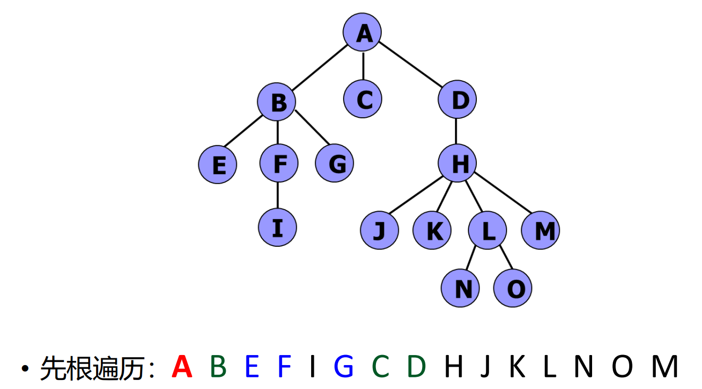


**树的后根次序遍历**

* 当树非空时

  * 依次后根遍历根的各棵子树

  * 访问根结点。

* 树的后根遍历：EFBCGDA

* 对应二叉树中序遍历：EFBCGDA

* 树的后根遍历结果与其对应二叉树表示的中序遍历结果相同。

* 树的后根遍历可以借助<u>对应二叉树的中序遍历算法</u>实现。

* 递归算法实现：

  ```cpp
  template<class Type>
  void Tree<Type>::PostOrder(){
      // 以当前指针 current 为根，按后根次序遍历树
      if(IsEmpty() == 0){
          TreeNode<Type> *p = current;
          current = current->firstChild;
          while(current != NULL){
              PostOrder();		// 递归先根遍历子树
              current = current->nextSibling;
          }
          current = p;  			// 恢复当前指针
          Visit();	 		 	// 最后访问根结点
      }
  }
  ```

  

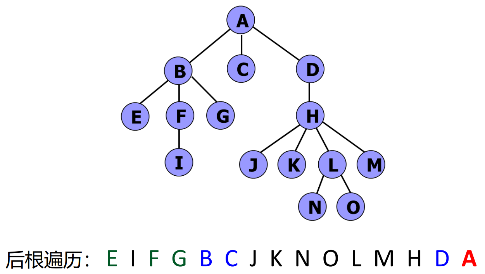


**树的层次遍历**

* 广度优先（层次次序）遍历

* 按广度优先次序遍历树的结果：ABCDEFG

* 层序遍历算法：

  ```cpp
  template <class Type>
  void Tree<Type> ::LevelOrder(){
      // 按广度优先次序分层遍历树，树的根结点是当前指针current，算法中使用了队列
      Queue<TreeNode<Type>*> Qu(DefaultSize);
      TreeNode<Type>*p;
      if(current != NULL){		// 当前指针不空
          p = current;			// 保存当前指针
          Qu.EnQueue(current);
          while(Qu.IsEmpty() == 0){
              current = Qu.getFront();
              Qu.DeQueue();
              Visit();						   // 队列中取一个并访问之
              while(current != NULL){
                  Qu.EnQueue(current);			// 待访问结点的子女结点进队列
                  current = current->nextSibling;
              }
          }
      }
  }
  ```

  

## 6.6 赫夫曼编码 

### 6.6.1 最优二叉树（赫夫曼树）

路径长度：从树中一个结点到另一个结点之间的分支构成这两个结点之间的路径，路径上的分支数目称作路径长度。

树的路径长度：是从树根到每一结点的路径长度之和。

路的带权路径长度：树中所有叶子结点的带权路径长度之和，通常记为 $WPL=\sum^n_{k=1}w_kl_k$ 。

假设有 n 个权值 $\{w_1, w_2, \cdots, w_n\}$ ，试构造一棵有 n 个叶子结点的二叉树，每个叶子结点带权为 $w_i$ ，则其中带权路径长度 $WPL$ 最小的二叉树称作 **最优二叉树** 或 **赫夫曼树**。

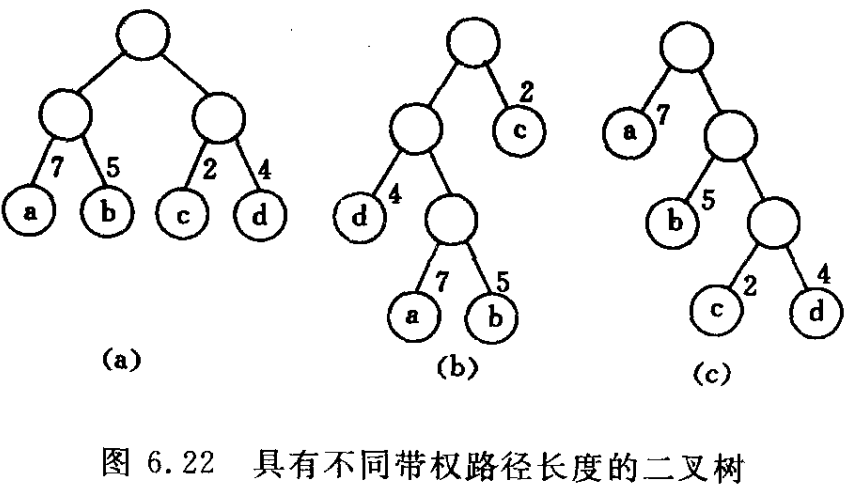

图中 3 棵二叉树，都有 4 个叶子结点 a、b、c、d，分别带权 7、5、2、4，则它们的带权路径长分别为：
（a）$WPL = 7\times2+5\times2+2\times2+4\times2=36$
（b）$WPL = 7\times3+5\times3+2\times1+4\times2=46$
（c）$WPL = 7\times1+5\times2+2\times3+4\times3=35$


**赫夫曼算法**：
（1）根据给定的 n 个权值 $\{w_1, w_2, \cdots, w_n\}$ 构成 n 棵二叉树的集合 $F=\{T_1, T_2, \cdots, T_n\}$ ，其中每棵二叉树 $T_i$ 只有一个带权为 $w_i$ 的根结点，其左右子树均空。
（2）在 F 中选取两棵根结点的权值最小的树作为左右子树构造一棵新的二叉树，且置新的二叉树的根结点的权值为其左右子树上根结点的权值之和|（3）在 F 中删除这两棵树，同时将得到的新的二叉树加入 F 中
（4）重复（2）和（3），直到 F 只含一棵树为止。这棵树便是赫夫曼树。

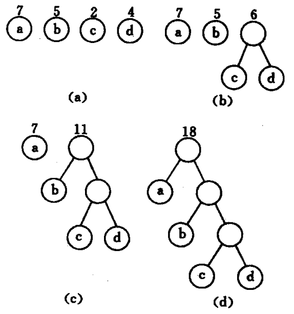

### 6.6.2 赫夫曼编码

若要设计长度不等的编码，则必须是任一字符的编码都不是另一个字符的编码的前缀，这种编码叫做 **前缀编码**。

可以利用二叉树来设计二进制的前缀编码。

为电文设计总长最短的二进制前缀编码：假设每种字符在电文中出现的次数为 $w_i$ ，其编码长度为 $l_i$ ，电文中只有 $n$ 中字符，则电文总长度为 $\sum^n_{i=1}w_il_i$。对应到二叉树上，若置 $w_i$ 为叶子结点的权，$l_i$ 恰为从根到叶子的路径长度，$\sum^n_{i=1}w_il_i$ 恰为二叉树上带权路径长度。设计电文总长最短的二进制前缀编码即为以 n 种字符出现的频率作权，设计一棵赫夫曼树的问题。

**具体做法**：由于赫夫曼树中没有度为1的结点（这类树又称严格的（strict）（或正则的）二叉树），则一棵拥有 n 个叶子结点的赫夫曼编码共有 2n-1 个结点。在构成赫夫曼树之后，求编码需从叶子节点出发走一条从叶子到根的路径；而为译码需从根出发走一条从根到叶子的路径。则对每个结点而言，既需告知双亲的信息，又需知孩子结点的信息。

设定下述存储结构：

```cpp
// ----- 赫夫曼树和赫夫曼编码的存储表示 -----
typedef struct{
    unsigned int weight;
    unsigned int parent, lchild, rchild;
}HTNode, *HuffmanTree;       // 动态分配数组存储赫夫曼树
typedef char** HuffmanCode;  //动态分配数组存储赫夫曼编码表

// 求赫夫曼编码的算法
void HuffmanCoding(HuffmanTree &HT, HuffmanCode &HC, int* w, int n){
    // w 存放n个字符的权值(均 >0),构造赫夫曼树HT,并求出n个字符的赫夫曼编码HC
    if(n<=1) return;
    m = 2*n-1;
    HT = (HuffmanTree)malloc((m+1)*sizeof(HTNode));   // 0号单元未用
    for(p = HT, i = 1; i<=n; ++i, ++p, ++w) *p = {*w, 0, 0, 0};
    for(; i<=m; ++i, ++p) *p = {0, 0, 0, 0};
    for(i=n+1; i<=m; ++i){   // 构建赫夫曼树 
        // 在 HT[1...i-1] 选择 parent 为 0 且 weight 最小的两个结点，
        // 其序号分别为 s1 和 s2
        Select(HT, i-1, s1, s2);
        HT[s1].parent = i, HT[s2].parent = i;
        HT[i].lchild = s1, HT[i].rchild = s2;
        HT[i].weight = HT[s1].weight+HT[s2].weight;
    }
    
    // --- 从叶子到根逆向求每个字符的赫夫曼编码 ---
    HC = (HuffmanCode)malloc((n+1)*sizeof(char*));	// 分配 n 个字符编码的头指针向量
    cd = (char*)malloc(n*sizeof(char)); 			// 分配求编码的工作空间
    cd[n-1] = '\0';									// 编码结束符
    for(i=1; i<=n; i++){							// 逐个字符求赫夫曼编码
        start = n-1;								// 编码结束符位置
        for(c=i, f=HT[i].parent; f!=0; c=f, f=HT[f].parent) // 从叶子到根逆向求编码
            if(HT[f].lchild == c) cd[--start] = '0';
        	else cd[--start] = '1';
        HC[i] = (char*)malloc((n-start)*sizeof(char)); // 为第 i 个字符编码分配空间
        strcpy(HC[i], &cd[start]); 					// 从 cd 赋值编码(串)到 HC
    }
    free(cd);			// 释放工作空间
} // HuffmanCoding
```

从根出发求得各个叶子结点所表示的字符的赫夫曼编码：

```cpp
HC = (HuffmanCode)malloc((n+1)*sizeof(char*));
p = m; cdlen = 0;
for(i = 1; i<=m; ++i)  HT[i].weight = 0;  	// 遍历赫夫曼树时作结点状态标志
while(p){
    if(HT[p].weight == 0){					// 向左
        HT[p].weight = 1;
        if(HT[p].lchild == 0) {p = HT[p].lchild; cd[cdlen++] = '0';}
        else if(HT[p].rchild == 0){
            HC[p] = (char*)malloc((cdlen+1)*sizeof(char));
            cd[cdlen] = '\0'; strcpy(HC[p], cd);  // 复制编码(串)
        }
    }
    else if(HT[p].weight == 1){				// 向右
        HT[p].weight = 2;
        if(HT[p].rchild != 0){p = HT[p].rchild; cd[cdlen++] = '1';}
    }else{									// HT[p].weight == 2，退回
        HT[p].weight = 0; p = HT[p].parent;  --cdlen;  // 退到父结点，编码长度减1
    }
}
```


## 堆

### 1 堆的定义及其实现

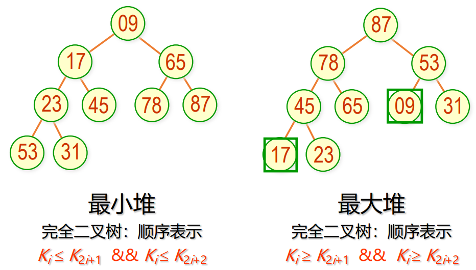

最小堆：根节点是所有结点中最小的

最大堆：根结点是所有结点中最大的

**堆的性质**：

* 从逻辑的角度来讲，**堆是一种树形结构**，而且是一种特殊的完全二叉树。每个结点对应于序列中的一个关键码。
* 堆序，只是**局部有序**，即 **最小堆** 对应的完全二叉树中**所有内部结点的值均不大于其左右孩子关键码值**，而一个结点和其兄弟之间没有必然的联系。
* 最小堆不像二叉排序树那样实现了关键码的完全排序。相比较而言，**只有当结点之间是父子关系时候，才可以确定这两个关键码的大小关系**。


**最小堆的类定义**：

```cpp
#define DefaultSize 10
template <class Type>
class MinHeap: public MinPQ<type>
{
private:
    Type * heap;					// 存放最小堆元素的数组
    int CurrentSize;				// 最小堆当前元素个数
    int MaxHeapSize;				// 最多允许元素的个数
    void FilterDown(int i, int m);	// 从 i 到 m 自顶向下进行调整成为最小堆
    void FilterUp(int i);			// 从 i 到 0 自底向上进行调整成最小堆
    
public:
    MinHeap(int sz);
    MinHeap(Type arr[], int n);
    MinHeap(const MinHeap& R);
    ~MinHeap(){ delete[]heap; }
    int Insert(const Type& x);		// 插入
    int IsEmpty()const				// 判断堆空否
    { return CurrentSize == 0; }
    int IsFull()const				// 判断堆满否
    { return CurrentSize == MaxHeapSize; }
    void MakeEmpty() {CurrentSize = 0; }
};
```


**最小堆向下调整调整算法**：

```cpp
template<class Type>
void MinHeap<Type>::FilterDown(int start, int EndOfHeap){
    int i = start, j = 2*i+1;	// j 是 i 的左孩子
    Type temp = heap[i];
    while(j <= EndOfHeap){
        if(j<EndOfHeap && heap[j]>heap[j+1]) j++;
        if(temp <= heap[j]) break;
        else{
            heap[i] = heap[j];·// 下面的上浮
            i = j;
            j = 2*j+1;			// 向下滑动
        }
    }
    heap[i] = temp;
}
```


**最小堆向上调整算法**：

```cpp
template<class Type>
void MinHeap<Type>::FilterUp(int start){
    // 从 start 开始，向上直到 0,调整堆
    int j = start, i = (j-1)/2; // i是j的双亲
    Type temp = heap[j];
    while(j>0){
        if(heap[i]<=temp) break;
        else{heap[j] = heap[i]; j = i, i = (i-1)/2;}
    }
    heap[j] = temp;
}
```


**最小堆的插入**：

```cpp
template<class Type>
int MinHeap<Type>::Insert(const Type &x){
    // 从堆中插入新元素 x
    if(CurrentSize == MaxHeapSize)
    { cerr << "堆已满" << endl; return 0; }
    heap[CurrentSize] = x; 		// 插在表尾
    FilterUp(CurrentSize);		// 向上调整为堆
    CurrentSize++;				// 堆元素大小+1
    return 1;
}
```


**最小堆的删除**：

```cpp
template <class Type> 
int MinHeap<Type>::Remove ( Type &x ) {
    if ( !CurrentSize )
    { cout << “ 堆已空 " << endl; return 0; }
    x = heap[0]; 						//最小元素出队列
    heap[0] = heap[CurrentSize-1];
    CurrentSize--; 						//用最小元素填补
    FilterDown ( 0, CurrentSize-1 ); 	//调整
    return 1;
}
```


# 7 图

图（graph），结点之间的关系可以是任意的，图中任意两个数据元素之间都可能相关。


## 7.1 图的定义和术语

抽象数据类型图的定义：

```text
ADT Graph{
    数据对象 V: V 是具有相同特性的数据元素的集合，称为顶点集
    数据关系 R: 
    	R = {VR}
    	VR = {<v,w>| v,w ∈ V 且 P(v,w), <v,w> 表示从 v 到 w 的弧,
    				谓词 P(v,w) 定义了弧<v,w>的意义或信息}
    基本操作 P:
    	CreateGraph(&G, V, VR);
    		初始条件: V 是图的顶点集, VR 是图中弧的集合
    		操作结果: 按 V 和 VR 的定义构造图 G
    	DestroyGraph(&G);
            初始条件: 图G存在
            操作结果: 销毁图G
    	LocateVex(G, u);
            初始条件: 图 G 存在, u 和 G 中顶点有相同特征
            操作结果: 若 G 存在顶点 u, 则返回该顶点在图中位置;否则返回其他信息
    	GetVex(G, v);
            初始条件: 图 G 存在, v 是 G 中某个顶点
            操作结果: 返回 v 的值
    	PutVex(&G, v, value);
            初始条件: 图 G 存在, v 是 G 中某个顶点
            操作结果: 对 v 赋值 value
    	FirstAdjVex(G, v);
            初始条件: 图 G 存在, v 是 G 中某个顶点
            操作结果: 返回 v 的第一个邻接顶点.若顶点在 G 中没有邻接顶点，则返回 "空"
    	NextAdjVex(G, v, w);
            初始条件: 图 G 存在, v 是 G 中某个顶点, w 是 v 的邻接顶点
            操作结果: 返回 v 的(相对于 w 的)下一个邻接顶点。若 w 是 v 的最后一个邻接点, 则返回 "空"
    	InsertVex(&G, v);
            初始条件: 图 G 存在, v 和图中顶点有相同特征
            操作结果: 在图 G 中增添新顶点 v
    	DeleteVex(&G, v);
            初始条件: 图 G 存在, v 是 G 中某个顶点
            操作结果: 删除 G 中顶点 v 及其相关的弧
    	InsertArc(&G, v, w);
            初始条件: 图 G 存在, v 和 w 是 G 中两个顶点
            操作结果: 在 G 中增添弧 <v,w>,若 G 是无向的,则还增添对称弧 <w,v>
    	DeletetArc(&G, v, w);
            初始条件: 图 G 存在, v 和 w 是 G 中两个顶点
            操作结果: 在 G 中删除弧 <v,w>,若 G 是无向的,则还删除对称弧 <w,v>
    	DFSTraverse(G, Visit());
    		初始条件: 图 G 存在, Visit 是顶点的应用函数
    		操作结果: 对图进行深度优先遍历。在遍历过程中对每个顶点调用函数 Visit 一次且仅一次。一旦 visit() 失败, 则操作失败。
        BFSTraverse(G, Visit());
        	初始条件: 图 G 存在, Visit 是顶点的应用函数
    		操作结果: 对图进行广度优先遍历。在遍历过程中对每个顶点调用函数 Visit 一次且仅一次。一旦 visit() 失败, 则操作失败。
}ADT Graph
```

在图中的数据元素通常称为 **顶点**（Vertex），V 是顶点的有穷非空集合；VR 是两个顶点之间的关系的集合。若 $<v, w>\in VR$ ，则 $<v,w>$ 表示从 $v$ 到 $w$ 的一条弧（Arc），且称 $v$ 为弧尾（Tail）或初始点（Initial node），称 $w$ 为弧头（Head）或终端点（Terminal node），此时的图称为 **有向图**（Digraph） 。若 $<v,w>\in VR$，则必有 $<w,v>\in VR$，即 $VR$ 是对称的，则以无序对$(v,w)$ 代替 这两个有序对，表示 $v$ 和 $w$ 之间的一条边（Edge），这时的图称为 **无向图**（Undigraph）。例如：

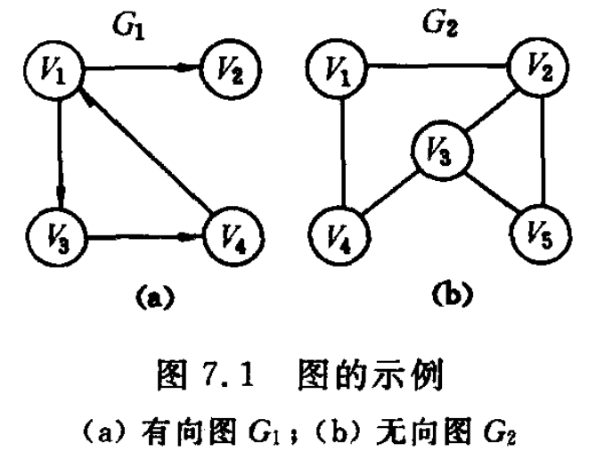

图(a)中，$G_1$ 是有向图，定义此图的谓词 $P(v,w)$ 则表示从 $v$ 到 $w$ 的一条单向通路。$G_1 = (V_1, \{A_1\})$ 

其中：	$V_1 = \{v_1, v_2, v_3, v_4\}$

​				$A_1 = \{<v_1, v_2>, <v_1, v_3>, <v_3, v_4>, <v_4, v_3>\}$

图(b)中，$G_2$ 是无向图。$G_2 = (V_2, \{E_2\})$ 。

其中：	$V_2 = \{v_1, v_2, v_3, v_4, v_5\}$

​				$E_2 = \{(v_1, v_2),(v_1, v_4), (v_2, v_3),(v_2, v_5),(v_3, v_4),(v_3, v_5)\}$ 


用 n 表示图中顶点数目，用 e 表示边和弧的数目。若考虑 $<v_i,v_j>\in VR,v_i\not=v_j$ ，那么对于无向图，e 的取值范围是 0 到 $\cfrac12n(n-1)$ 。有 $\cfrac12n(n-1)$ 条边的无向图称为 **完全图**。对于有向图，e 的取值范围为 0 到 n(n-1)。具有 n(n-1) 条弧的有向图称为 **有向完全图**。

有很少条边或弧的图称为 **稀疏图**，反之称为 **稠密图**。

有时图的边或弧具有与它有关的数，这种与图的边或弧相关的数叫做 **权**。这些权可以表示从一个顶点到另一个顶点的距离或耗费。这种 **带权的图** 通常称为 **网**。

假设有两个图 $G = (V, \{E\})$ 和 $G' = (V', \{E'\})$ ，如果 $V'\subseteq V$ ，且 $E'\subseteq E$ ，则称 $G'$ 为 $G$ 的 **子图**。


对于无向图 $G=(V,\{E\})$ ，如果边 $(v, v')\in E$ ，则称顶点 $v$ 和 $v'$ 互为 **邻接点**（Adjacent），即 $v$ 和 $v'$ 相邻接。边 $(v,v')$ 依附于顶点 $v$ 和 $v'$ ，或者说 $(v,v')$ 和顶点 $v$ 和 $v'$ 相关联。顶点 $v$ 的**度**是和 $v$ 相关联的边的数目，记为 $TD(V)$ 。

对于有向图 $G=(V,{A})$，如果弧 $<v,v'>\in A$，则称顶点 $v$ 邻接到顶点 $v'$ ，顶点 $v'$ 邻接自顶点 $v$ 。弧 $<v,v'>$ 和顶点 $v$ 和 $v'$ 相关联。以顶点 $v$ 为头的弧的数目成为 $v$ 的 **入度**，记为 $ID(v)$；以 $v$ 为尾的弧的数目成为 $v$ 的 **出度**，记为 $OD(v)$。顶点 $v$ 的度为 $TD(v) = ID(v)+OD(v)$。

一般地，如果顶点 $v_i$ 的度记为 $TD(v_i)$ ，那么一个有 $n$ 个顶点，$e$ 条边或弧的图，满足：
$$
e = \cfrac12\sum^n_{i = 1}TD(v_i)
$$
无向图 $G=(V,\{E\})$ 中从顶点 $v$ 到顶点 $v'$ 的路径（Path）是一个顶点序列（$v = v_{i,0},v_{i,1},\cdots,v_{i,m}=v'$），其中 $(v_{i,j-1},v_{i,j})\in E,1\leqslant j \leqslant m$。

 $G$ 有向图，则路径是有向的，顶点序列应满足 $<v_{i,j-1},v_{i,j}>\in E,1\leqslant j \leqslant m$ 。

**路径长度** 是路径上边或弧的数目。第一个顶点和最后一个顶点相同的路径 称为 **回路** 或 **环**。序列中 顶点不重复出现的路径 称为 **简单路径**。除了第一个顶点和最后一个顶点之外，其余顶点不重复出现的回路，称为 简单回路 或 简单环。

在无向图 $G$ 中，如果从顶点 $v$ 到 顶点 $v'$ 有路径，则称 $v$ 和 $v'$ 是连通的。如果对于图中任意两个顶点 $v_i,v_j \in V$ ，$v_i$ 和 $v_j$ 都是连通的，则称 $G$ 是 **连通图**。**连通分量** 指的是 无向图 中 **极大连通子图**。

在有向图 $G$ 中，如果对于每一对  $v_i,v_j \in V$ ，$v_i \not=v_j$，从 $v_i$ 到 $v_j$ 和 从 $v_j$ 到 $v_i$ 都存在路径，则称 G 是 **强连通图**。有向图中的极大强连通子图称作 有向图的 **强连通分量**。

一个连通图的 **生成树** 是一个极小连通子图，它含有图中全部顶点，但只有足以构成一棵树的 $n-1$ 条边。一棵有 $n$ 个顶点的 生成树 有且仅有 $n-1$ 条边。如果一个图有 $n$ 个顶点和 小于 $n-1$ 条边，则是非连通图。如果它多于 $n-1$ 条边，则一定有环。但是，有 $n-1$ 条边的图不一定是生成树。

如果一个有向图恰好有一个顶点的入度为 0，其余顶点的入度均为 1，则是一棵有向树。一个有向图的 **生成森林** 由若干棵有向树组成，含有图中全部顶点，但只有足以构成若干棵不相交的有向树的弧。

图中的顶点之间不存在全序的关系（即无法将图中顶点排列成一个线性序列），任何一个顶点都可以被看成是第一个顶点；另一方面，任一顶点的邻接点之间也不存在次序关系。


## 7.2 图的存储结构

图没有顺序映像的存储结构。

常用的有 邻接表、邻接多重表 和 十字链表。

### 7.2.1 数组表示法

用两个数组分别存储数据元素（顶点）的信息和数据元素之间的关系（边或弧）的信息。其形式描述如下：

```cpp
//- - - - - 图的数组（邻接矩阵）存储表示 - - - - -//
#define INFINITY   INT_MAX
#define MAX_VERTER_NUM 20
typedef enum{DG, DN, UDG, UDN} GraphKind;
typedef struct ArcCell{
    VRType adj;       // VRType 是顶点关系类型。对无权图，用 1 或 0
                      // 表示是否相邻，对带权图，表示为权值类型
    InfoType * info;  // 该弧相关信息的指针
}ArcCell, AdjMatrix[MAX_VERTEX_NUM][MAX_VERTEX_NUM];

typedef struct{
    VertexType vexs[MAX_VERTEX_NUM];  // 顶点向量
    AdjMatrix  arcs;                  // 邻接矩阵
    int        vexnum, arcnum;        // 图的当前顶点数 和 弧数
    GraphKind  kind;                  // 图的种类标志
}MGraph;
```

借助于邻接矩阵，容易判定任意两个顶点之间是否有边（或弧）相连，并容易求得各个顶点的度。对于无向图，顶点 $v_i$ 的度是邻接矩阵中第 $i$ 行（或第 $i$ 列）的元素之和，即
$$
TD(v_i) = \sum^{n-1}_{j=0}A[i][j](n=MAX\_VERTEX\_NUM)
$$
对于有向图，第 $i$ 行的元素之和为 顶点 $v_i$ 的出度 $OD(v_i)$，第 $j$ 列的元素之和 为顶点 $v_j$ 的入度 $ID(v_j)$ 。

网的邻接矩阵可定义为
$$
A[i][j] = \begin{cases}
w_{i,j} &若<v_i,v_j> 或 (v_i,v_j) \in VR\\
\infin & 反之
\end{cases}
$$
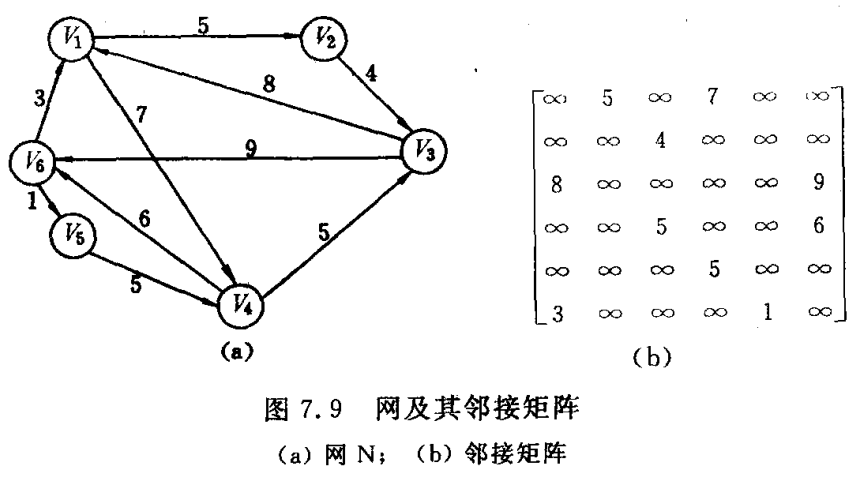

在邻接矩阵存储结构 MGraph 上对图的构造操作的实现框架，它根据图 G 的种类调用具体构造算法。

```cpp
Status CreateGraph(MGraph &G){
    // 采用 数组（邻接矩阵）表示法，构造图G
    scanf(&G.kind);
    switch(G.kind){
        case DG: return CreateDG(G);	// 构造有向图 G
        case DN: return CreateDN(G);	// 构造有向网 G
        case UDG: return CreateUDG(G);	// 构造无向图 G
        case UDN: return CreateUDN(G);	// 构造无向网 G
        default: return ERROR;
    }
} // CreateGraph
```

构造 无向网：

```cpp
Status CreateUDN(MGraph &G){
    // 采用数组（邻接矩阵）表示法，构造无向网 G
    scanf(&G.vexnum, &G.arcnum, &IncInfo);	// IncInfo为0则各弧不含其他信息
    for(i=0; i<G.vexnum; ++i) scanf(&G.vexs[i]); // 构造顶点向量
    
    for(i=0; i<G.vexnum; ++i)	// 初始化邻接矩阵
        for(j=0; j<G.vexnum; ++j)
            G.arcs[i][j] = {INFINITY, NULL};  // {adj, info}
    
    for(k=0; k<G.arcnum; ++k){
        scanf(&v1, &v2, &w);	// 输入一条边依附的顶点及权值
        i = LocateVex(G,v1);
        j = LocateVex(G,v2); 	// 确定v1和v2在 G 中位置
        G.arcs[i][j].adj = w;	// 弧<v1,v2>的权值
        if(IncInfo)	
            Input(*G.arcs[i][j].info); // 若弧含有相关信息，则输入
        G.arcs[j][i] = G.arcs[i][j];	// 置<v1,v2>的对称弧
    }
    return OK;
}  // CreateUDN
```


### 7.2.2 邻接表

**邻接表** 是图的一个链式存储结构。在邻接表中，对图中每个顶点建立一个单链表，第 $i$ 个单链表中的结点表示依附于顶点 $v_i$ 的边（对有向图是以顶点 $v_i$ 为尾的弧）。每个结点由 3 个域组成，其中 邻接点域（adjvex）指示与顶点 $v_i$ 邻接的点在图中的位置，链域（nextarc）指示下一条边或弧的结点；数据域（info）存储和边或弧相关的信息，如权值等。每个链表上附设一个表头结点。在表头结点中，除了 设有链域指向链表中的第一个结点之外，还设有存储顶点 $v_i$ 的名或其他有关信息的数据域（data）。

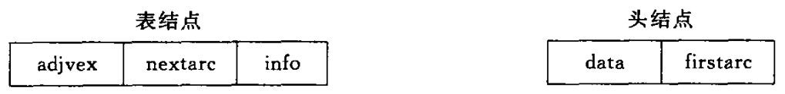

表头结点（可以链相接）通常以顺序结构的形式存储，以便随机访问顶点的链表。

```cpp
// ----- 图的邻接表存储表示 -----
#define MAX_VERTEX_NUM 20
// 表结点
typedef struct ArcNode{
    int 			adjvex;		// 该弧所指向的顶点的位置
    struct ArcNode*	nextarc;	// 指向下一条弧的指针
    InfoType	  * info;		// 该弧相关信息的指针	
}ArcNode;

typedef struct VNode{
    VertexType data;			// 顶点信息
    ArcNode	  * firstarc;		// 指向第一条依附该顶点的弧的指针
}VNode, AdjList[MAX_VERTEX_NUM];

typedef struct{
    AdjList vertices;
    int		vexnum, arcnum;		// 图的当前顶点数和弧数
    int		kind;				// 图的种类标志
}ALGraph;
```

若无向图中有 $n$ 个顶点、$e$ 条边，则它的邻接表需 $n$ 个头结点和 $2e$ 个表结点。显然，在边稀疏（$e\ll \cfrac{n(n-1)}2$）的情况下，用邻接表表示图比邻接矩阵节省存储空间，当和边相关的信息较多时更是如此。

在无向图的邻接表中，顶点 $v_i$ 的度恰为第 $i$ 个链表中的结点数；而在有向图中，第 $i$ 个链表中的结点个数 只是顶点 $v_i$ 的出度，为求入度，必须遍历整个邻接表。


### 7.2.3 十字链表

十字链表是有向图的另一种链式存储结构。可以看成将有向图的邻接表和逆邻接表结合起来得到的一种链表。在十字链表中，对应于有向图中每一条弧有一个结点，对应于每个顶点也有一个结点。这些结点的结构如下：

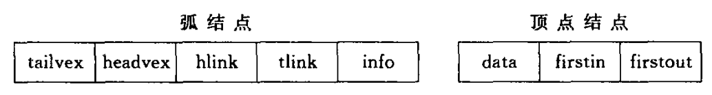

弧结点：
尾域 tailvex：指示弧尾顶点在图中的位置
头域 headvex：指示弧头顶点在图中的位置
链域 hlink 指向弧头相同的下一条弧
链域 tlink 指向弧尾相同的下一条弧
info 域：指向该弧的相关信息

头结点：
data 存储和顶点相关的信息
firstin链域，指向以顶点为弧头的第一个弧结点
firstout链域，指向以顶点为弧尾的第一个弧结点

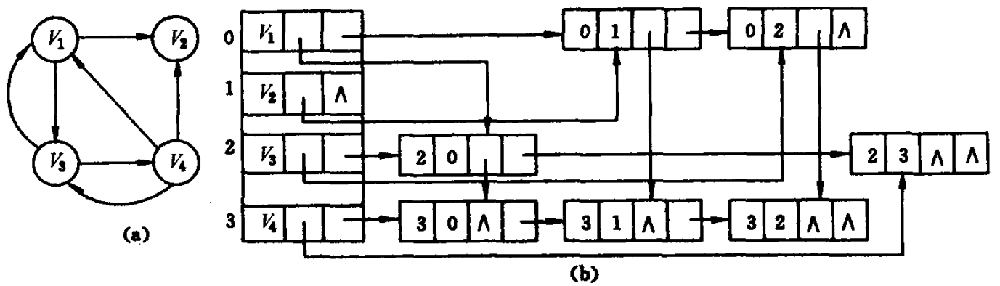

```cpp
// ----- 有向图的十字链表存储表示 -----
#define MAX_VERTEX_NUM 20
typedef struct ArcBox{
    int 			tailvex, headvex;	// 该弧的尾和头顶点的位置
    struct ArcBox * hlink, *tlink;		// 分别为弧头相同和弧尾相同的链域
    InfoType	 *	info;				// 该弧相关信息的指针
}ArcBox;

typedef struct VexNode{
    VertexType data;
    ArcBox   * firstin, * firstout;		// 分别指向该顶点第一条入弧和出弧
}VexNode;

typedef struct{
    VexNode xlist[MAX_VERTEX_NUM];		// 表头向量
    int 	vexnum, arcnum;				// 有向图的当前顶点数和弧数
}OLGraph;
```


只要输入 $n$ 个顶点的信息和 $e$ 条弧的信息，便可建立该有向图的十字链表：

```cpp
Status CreateDG(OLGraph &G){
    // 采用十字链表存储表示，构造有向图G(G.kind=DG)
    scanf(&G.vexnum, &G.arcnum, &IncInfo);
    // IncInfo为0则各弧不含其他信息
    // 构造表头向量
    for(i=0; i<G.arcnum; ++i){
        scanf(&G.xlist[i].data);	// 输入顶点值
        G.xlist[i].firstin = NULL;	// 初始化指针
        G.xlist[i].firstout = NULL; 
    }
    
    for(k=0; k<G.arcnum, ++k){		// 输入各弧并构造十字链表
        scanf(&v1, &v2);			// 输入一条弧的始点和终点
        i = LocateVex(G, v1); j = LocateVex(G, v2);	// 确定v1和v2在G中位置
        p = (ArcBox*) malloc(sizeof(ArcBox)); // 假定有足够空间
        *p = {i, j, G.xlist[j].firstin, G.xlist[i].firstout, NULL};  // 对弧结点赋值
        G.xlist[j].firstin = G.xlist[i].firstout = p; // 完成在入弧和出弧链头的插入
        if(IncInfo) Input(*p->info);	// 若弧含有相关信息，则输入
	}
} // CreateDG
```


### 7.2.4 邻接多重表

邻接多重表是无向图的另一种链式存储结构。

每一条边用一个结点表示，它由如下所示的 6 个域组成：

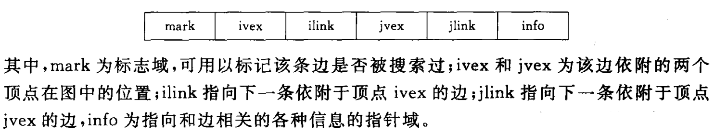

每个 顶点也用一个结点表示，由两个域组成：data 和 firstedge。


## 7.3 图的遍历

**图的遍历**：从某一顶点出发访遍图中其余顶点，且使每一个顶点仅被访问一次。

### 7.3.1 深度优先搜索

**深度优先搜索**（Depth_First Search）

```cpp
// 使用的全局变量
Boolean visited[MAX];    // 访问标志数组
Status (* VisitFunc)(int v);   // 函数变量
void DFSTraverse(Graph G, Status(*Visit)(int v))
{
    // 对图 G 作深度优先遍历
    VisitFunc = Visit;// 使用全局变量 VisitFunc，使用 DFS 不必设置函数指针参数
    for(v = 0; v<G.vexnum; ++v) visit[v] = FALSE;
    for(v = 0; v<G.vexnum, ++v)
        if(!visit[v]) DFS(G, v);
}

void DFS(Graph G, int v)
{
	// 从第 v 个顶点出发递归地深度优先遍历图G
    visited[v] = TRUE;
    VisitFunc(v);  // 访问第 v 个顶点
    for(w = FirstAdjVex(G, v); w>=0; w = NextAdjVex(G, v, w))
        if(!visited[w]) DFS(G, w);  // 对 v 的尚未访问的邻接顶点 w 递归调用 DFS
}
```


### 7.3.2 广度优先搜索

```cpp
void BFSTraverse(Graph G, Status(*Visit)(int v))
{
    for(v = 0; v<G.vexnum; ++v) visited[v] = FALSE;
    InitQueue(Q);
    for(v=0; v<G.vexnum; ++v)
    {
        if(!visited[v])
        {
            visited[v] = TRUE; Visit(v);
            EnQueue(Q.v);
            while(!QueueEmpty(Q))
            {
                DeQueue(Q, v);
                for(w = FirstAdjVex(G, u); w>=0; w = NextAdjVex(G, u, w))
                {
                    if(!visited[w])
                    {
                        visited[w] = True; Visit(w);
                        EnQueue(Q, w);
                    }
				}
            }
        }
    }
}
```


## 7.4 图的连通性问题

### 7.4.1 无向图的连通分量和生成树

在对无向图进行遍历时，对于连通图，仅需从图中任一顶点出发，进行深度优先搜索或广度优先搜索，便可访问到图中所有顶点。对于非连通图，需要从多个顶点出发进行搜索，而每一次从新的起始点出发进行搜索的过程中得到的顶点访问序列恰为其各个连通分量的顶点集。

设 $E(G)$ 为连通图 $G$ 中所有边的集合，则从图中任一顶点出发遍历图时，必定将 $E(G)$ 分成两个集合 $T(G)$ 和 $B(G)$，其中 $T(G)$ 是遍历图过程中历经的边的集合；$B(G)$ 是剩余的边的集合。显然，$T(G)$ 和图 $G$ 中所有顶点一起构成连通图 $G$ 的 **极小连通子图**，它是连通子图的一棵生成树，并且称由 深度优先搜索 得到的为 **深度优先生成树**，由 广度有线搜索 得到的为 **广度优先生成树**。

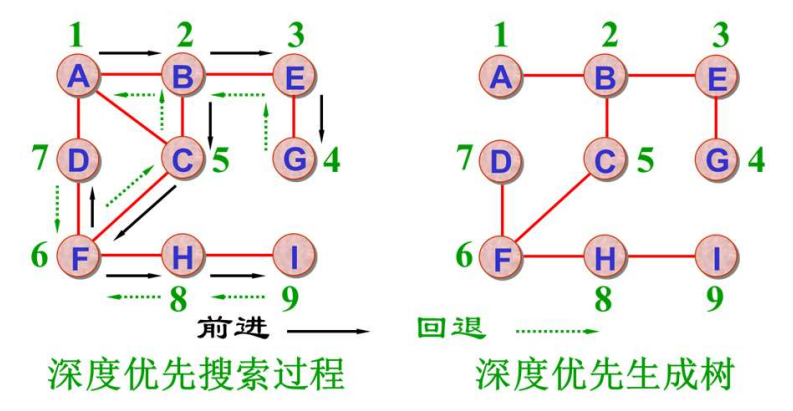

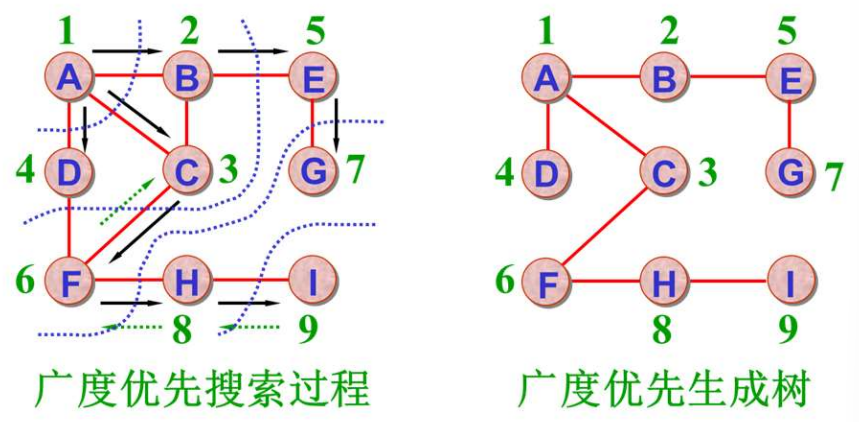

对于非连通分量，每个连通分量中的顶点集，和遍历时走过的边一起构成若干棵生成树，这些连通分量的生成树组成非连通图的生成森林。

生成非连通图的深度优先生成森林：

```cpp
void DFSForest(Graph G, CSTree &T){
    // 建立无向图G的深度优先生成森林的
    // (最左)孩子(右)兄弟链表 T
    T = NULL;
    for(v = 0; v<G.vexnum; ++v)
        visited[v] = FALSE;
    
    for(v = 0; v<G.vexnum; ++v)
        if(!visited[v]){	// 第v顶点为新的生成树的根结点
            p = (CSTree)malloc(sizeof(CSNode)); // 分配根结点
            *p = {GetVex(G, v), NULL, NULL}; // 给该结点赋值
            if(!T) T = p;				// 是第一棵生成树的根
            else q->nextsibling = p; 	// 是其他生成树的根
            q = p;						// q 指示当前生成树的根
            DFSTree(G, v, p);			// 建立以p为根的生成树
        }
} // DFSForest

void DFSTree(Graph G, int v, CSTree &T){
    // 从第 v 个顶点出发深度优先搜索遍历图G，建立以T为根的生成树
    visited[v] = TRUE; first = TRUE;
    for(w = FIrstAdjVex(G, v); v>=0; w = NextAdjVex(G,v,w))
        if(!visited[w]){
            p = (CSTree)malloc(sizeof(CSNode)); // 分配孩子结点
            *p = {GetVex(G,w), NULL, NULL};
            if(first){			// w是v的第一个未被访问的邻接顶点
                T->lchild = p;  // 是根的左孩子结点
                first = FALSE;
			} // if
            else{				// w是v的其他未被访问的邻接顶点
                q->nextsibling = p; // 是上一邻接顶点的右兄弟结点
            } // else
            q = p;
            DFSTree(G, w, q); // 从第w个顶点出发深度优先遍历图G，建立子生成树
        } // if
} // DFSTree
```


### 7.4.2 有向图的强连通分量

求有向图 G 的强连通分量的基本步骤是：

（1）对 G 进行深度优先遍历，生成 G 的 **深度优先生成森林** T

（2）对森林 T 的顶点按 **中序遍历** 顺序进行编号

（3）改变 G 中每一条弧的方向，构成一个新的有向图 G'

（4）按（2）中标出的顶点编号，从**编号最大的顶点**开始对G’进行**深度优先搜索**，得到一棵深度优先生成树。
若一次完整的搜索过程没有遍历G'的所有顶点，则从未访问的顶点中选择一个**编号最大的顶点**，由它开始再进行深度优先搜索，并得到另一棵深度优先生成树。
在该步骤中，每一次深度优先搜索所得到的生成树中的顶点就是G的一个强连通分量的所有顶点。

（5）重复步骤（4），直到 G' 所有顶点都被访问。

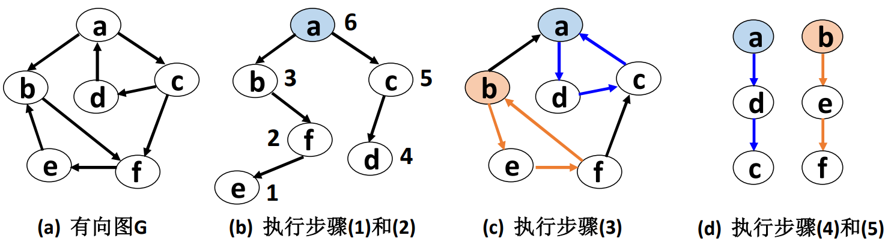

```cpp
void Connected_DG(OLGraph* G)
{
    int k = 1, v, j;
    for(v = 0; v<G->vexnum; v++)
        visited[v] = FALSE;
    
    for(v = 0; v<G->vexnum; v++)
        if(!visited[v]) DFS(G,v);
    
    for(v = 0; v<G->vexnum; v++)
        visited[v] = FALSE;
    
    for(j = G->vexnum-1; j>=0; j--)
    {
        v = in_order[j];
        if(!visited[v])
        {
            printf("\n第%d个连通分量顶点:",k++);
            Rev_DFS(G,v);
		}
    }
}

void DFS(OLGraph*G,int v)
{
    ArcNode* p;
    Count = 0;
    visited[v] = TRUE;
    for(p = G->xlist[v].firstout; p != NULL; p = p->tlink)
        if(!visited[p->headvex])
            DFS(G, p->headvex);
    in_order[count++] = v;
}

void Rev_DFS(OLGraph *G, int v)
{
    ArcNode *p;
    visited[v] = TRUE;
    printf("%d",v);
    for(p = G->xlist[v].firstin; p!=NULL; p = p->hlink)
        if(!visited[p->tailvex])
            Rev_DFS(G,p->tailvex);
}
```


❗ **tarjan 算法**


### 7.4.3 最小生成树

* 如果连通图是一个带权图，则其生成树中的边也带权，生成树中所有边的权值之和称为生成树的代价。
* 最小生成树：**带权连通图中代价最小的生成树** 称为最小生成树


构造最小生成树的算法，基本原则：

* 尽可能选取权值最小的边，但不能构成回路
* 选择 n-1 条边构成最小生成树


Kruskal 算法，是用来寻找最小生成树的算法。

Prim 算法，可在加权连通图里搜索最小生成树。


#### Kruskal 算法思想

* 设有一个有 $n$ 个顶点的连通网络 $N=\{V,E\}$ ，最初先构造只有 $n$ 个顶点，没有边的非连通图 $T = \{V,\varnothing\}$ ，图中每个项目自成一个连通分量。
* 在 $E$ 中选到一条具有 **最小权值的边** 时，若该边的两个顶点落在不同的连通分量上，则将此边加入到 $T$ 中。
* 否则将此边舍弃，重新选择一条权值最小的边。
* 如此重复下去，知道所有顶点在同一连通分量上为止。

算法的关键：

* 如何判断边 e 所连接的两个节点 v 和 u 在不同的一棵树上
* 如何把两个节点 u 和 v 所在的树合并为一棵树

适合边比较稀疏的情况


并查集

树如何合并的问题，属于子集归并的并查集问题

并查集的子集合并运算，即要合并两个元素所属的子集


#### Prim 算法

基本思想：

* 从连通网络 $N = \{V,E\}$ 中的某一顶点 $u_0$ 出发，选择与它关联的具有最小权值的边 $(u_0,v)$ ，将其顶点加入到生成树顶点集合 U 中。
* 以后每一步从一个顶点在 U 中，而另一个顶点不在 U 中的各条边中选择权值最小的边 $(u,v)$ ，把它的顶点加入到集合 $U$ 中。如此下去，知道所有顶点都加入到生成树集合 $U$ 中。

设置两个辅助数组：

* `lowcost[]` ：存放生成树顶点集合内顶点到生成树外各顶点的各边上的当前最小权值。
* `nearvex[]` ：记录生成树顶点集合外各顶点距离集合内哪个顶点最近 (即权值最小)

适合顶点数量少的情况

```cpp
void MiniSpanTree_PRIM(MGraph G, VertexType u){
    // 用 prim 算法从第 u 个顶点出发构造网G的最小生成树T,输出T的各条边
    // 记录从顶点集U到V-U的代价最小的边的辅助数组定义:
    //struct{
    //	VertexType adjvex;
    //	VRType lowcost;
	//}closedge[MAX_VERTEX_NUM];
    
    k = LocateVex(G,u);
    for(j=0; j<G.vexnum; ++j)		// 辅助数组初始化
        if(j!=k)
            closedge[j]={u,G.arcs[k][j].adj}; // {adjvex, lowcost}
    
    closedge[k].lowcost = 0;		// 初始, U={u}
    for(i=1; i<G.vexnum; ++i){		// 选择其余 G.vexnum-1 个顶点
        k = minimum(closedge);		// 求出T的下一个结点: 第k顶点
        // 此时 closedge[k].lowcost =
  //MIN{closedge[vi].lowcost|closedge[vi].lowcost >0,vi∈V-U}
        printf(closedge[k].adjvex, G.vexs[k]);  // 输出生成树的边
        closedge[k].lowcost = 0;	// 第k顶点并入U集
        for(j=0; j<G.vernum; ++j)
            if(G.arcs[k][j].adj < closedge[j].lowcost)	// 新顶点并入U后重新选择最小边
                closedge[j] = {G.vexs[k], G.arcs[k][j].adj};
    }
} // MiniSpanTree
```


### 7.4.4 关节点和重连通分量

假若在删去顶点 $v$ 以及和 $v$ 相关联的各边之后，将图的一个连通分量分割成两个或两个以上的连通分量，则称顶点 $v$ 为该图的一个 **关节点**。一个没有关节点的连通图为 **重连通图**。

利用深度优先搜索便可求得图的关节点，并由此判断图是否重连通的。

由深度优先生成树可得出两类关节点的特性：

（1）若生成树的根有两棵或两棵以上的子树，则此根顶点必为关节点。

（2）若生成树中某个非叶子顶点 $v$，其某棵子树的根和子树中其他结点均没有指向 $v$ 的祖先的回边，则 $v$ 为关节点。


## 7.5 有向无环图及其应用

一个无环的有向图称做 **有向无环图**，简称 DAG图。DAG图是一类较有向树更一般的特殊有向图。

### 7.5.1 拓扑排序

**拓扑排序**：由某个集合上的一个偏序得到该集合上的一个全序，这个操作称之为 拓扑排序。

> 偏序关系：集合X上的关系R是自反的、反对称的和传递的
> 设 R 是集合X上的 **偏序** ，如果对每个 $x,y\in X$ 必有 $xRy$ 或 $yRx$，则称 $R$ 是集合 $X$ 上的全序关系

偏序指的是集合中仅有部分成员之间可比较，全序是指集合中全体成员之间均可比较。

例如：下图两个有向图，图中弧$<x,y>$ 表示 $x\leqslant y$，则(a)表示偏序，(b)表示全序

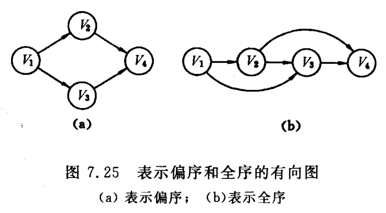

若在(a)的有向图上人为地加一个表示 $v_2\leqslant v_3$ 的弧（符号“$\leqslant$”表示 $v2$ 领先于 $v3$），则(a) 表示的亦为全序，且这个全序称为 **拓扑有序**，而由偏序定义得到拓扑有序的操作便是 **拓扑排序**。

**例** 一个软件专业学生必须学习一系列基本课程，其中有些是基础课，独立于其他课程，而另一些课程必须在学完作为它的基础的先修课程才能开始。下图中，把顶点表示课程，有向边（弧）表示先决条件。若课程 $i$ 是课程 $j$ 的先决条件，则有弧 $<i,j>$

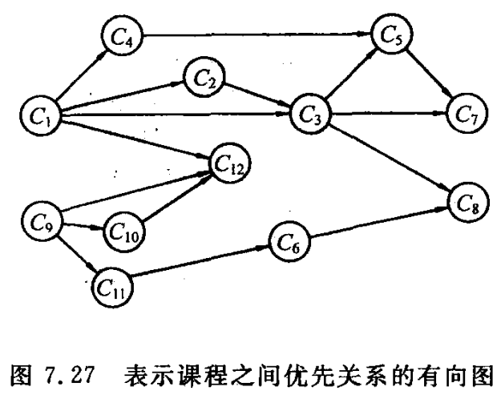


这种用 顶点表示活动，用弧表示活动间的优先关系的有向图称为顶点表示活动的网，简称 AOV-网。

**拓扑排序-算法思想**

（1）在有向图中选一个没有前驱的顶点且输出之

（2）从图中删除该顶点和所有以它为尾的弧

重复上述两步，直至全部顶点均已输出，或者当前图中不存在无前驱的顶点为止（说明有向图中存在环）。

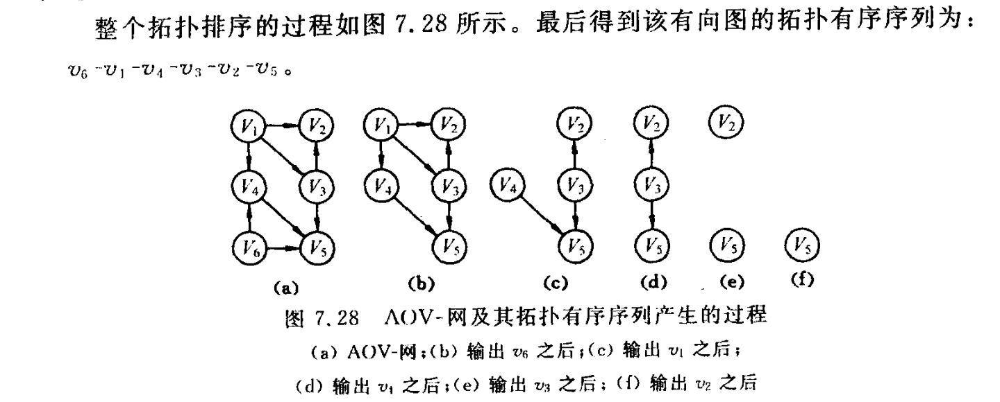

为了避免重复检测入度为0的顶点，可另设

```cpp
Status TopologicalSort(ALGraph G){
    // 有向图G采用邻接表存储结构
    // 若G无回路，则输出G的顶点的一个拓扑序列并返回OK,否则ERROR
    
    // 对各顶点求入度 indegree[0...vernum-1]
    FindInDegree(G, indegree);		
    InitStack(S);					// 建零入读顶点栈S
    for(i=0; i<G.vexnum; ++i)		
        if(!indegree[i]) Push(S,i);	// 入度为0者进栈
    count = 0;						// 对输出顶点计数
    while(!StackEmpty(S)){
        Pop(S,i);
        printf(i, G.vertices[i].data); // 输出 i 号顶点并计数
        count++;
        
        for(p=G.vertices[i].firstarc; p; p=p->nextarc){
            k = p->adjvex;		
            // 对i号顶点的每个邻接点的入度-1
            if(!(--indegree[k])) Push(S,k);	// 入度减为0，则入栈
        } // for
    } // while
    if(count < G.vernum) return ERROR;		// 该有向图有回路
    else return OK;
} // TopologicalSort
```


### 7.5.2 关键路径

与 **AOV-网** 相对应的是 **AOE-网** ，即边表示活动的网。 AOE-网 是一个带权的有向无环图，其中 **顶点** 表示 事件，弧 表示 活动，权 表示活动持续的时间。通常，AOE-网 可用来估算工程的完成时间。

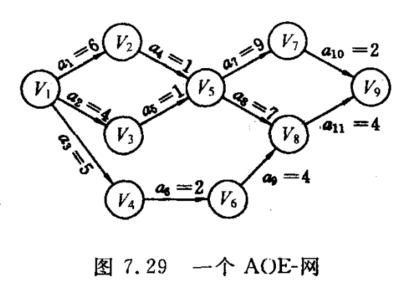

例如，上图是一个假想的有11项活动的AOE-网。其中有 9 个事件 $v_1,v_2,v_3,\cdots,v_9$，每个事件表示在它之前的活动已经完成，在它之后的活动可以开始。由于整个工程只有一个开始点和一个完成点，故在正常的情况（无环）下，网中只有一个入度为零的点（称作**源点**）和一个出度为零的点（叫做**汇点**）。

AOE-网有待研究的问题是：（1）完成整项工程至少需要多少时间？（2）哪些活动是影响工程进度的关键？

活动可以并行进行，故 **完成工程的最短时间** 是从开始点到完成点的 **最长路径的长度**（这里说的路径长度是指路径上各活动持续时间之和)。路径长度最长的路径叫做 **关键路径**。

* 事件 $v_i$ 的最早发生时间：从 $v_1$（设为开始点） 到 $v_i$ 的最长路径长度。这个时间决定了 所有以 $v_i$ 为尾的弧所表示的活动的最早开始时间。
* $e(i)$：活动 $a_i$ 的最早开始时间
*  $l(i)$：活动的最迟开始时间，这是在推迟整个工程完成的前提下，活动 $a_i$ 最迟必须开始进行的时间。
* 两者之差 $l(i)-e(i)$ 表示活动 $a_i$ 的时间余量。
* 把 $l(i) = e(i)$ 的活动叫做 **关键活动**。

**关键路径上的所有活动都是关键活动**，因此提前完成非关键活动并不能加快工程的进度。辨别关键活动就是要找到 $e(i)=l(i)$ 的活动。为了求得 AOE-网中活动的 $e(i)$ 和 $l(i)$。首先应求得事件的**最早发生时间** $ve(j)$ 和**最迟发生时间** $vl(j)$。如果活动$a_i$ 由弧 $<j,k>$ 表示，其**持续时间**记为 $dut(<j,k>)$，则有如下关系：
$e(i) = ve(j)$，$l(i) = vl(k)-dut(<j,k>)$ 。

求 $ve(j)$ 和 $vl(j)$ 需分两步进行：

（1）从 $ve(0) = 0$ 开始向前递推：$ve(j) = \mathrm{Max}\{ve(i)+dut(<i,j>)\}$，$<i,j>\in T,j=1,2,\cdots,n-1$。其中，$T$ 是所有以第 $j$ 个顶点为头的弧的集合。

（2）从 $vl(n-1)=ve(n-1)$ 起向后递推：$ve(i) = \mathrm{Max}\{ve(j)+dut(<i,j>)\}$，$<i,j>\in S,i=n-2,\cdots,0$。其中，$S$ 是所有以第 $i$ 个顶点为尾的弧的集合。

这两个递推公式的计算必须分别在拓扑有序和逆拓扑有序的前提下进行。


**AOE-网求关键路径和关键活动的算法**

（1）输入 $e$  条弧 $<j,k>$，建立 AOE-网的存储结构

（2）从源点 $v_0$ 出发，令 $ve[0] = 0$，按拓扑有序求其余各顶点的最早发生时间 $ve[i](1\leqslant i \leqslant n-1)$。如果得到拓扑有序中的顶点个数小于网中定点数 $n$ ，则说明网中存在环，不能求关键路径，算法终止，否则执行步骤（3）

（3）从汇点 $v_n$ 出发，令 $vl[n-1]=ve[n-1]$，按 逆拓扑有序求其余各顶点的最迟发生时间 $vl[i](n-1\geqslant i \geqslant 2)$ ；

（4）根据各顶点的 $ve$ 和 $vl$ 值，求每条弧 $s$ 的最早开始时间 $e(s)$ 和 最迟开始时间 $l(s)$。若某条弧满足 $e(s) = l(s)$，则为关键活动。


计算各顶点的 $ve$ 值是在拓扑排序的过程中进行的，需对拓扑排序的算法作如下修改：（a）在拓扑排序之前设初值，令 $ve[i] = 0(0\leqslant i \leqslant n-1)$；（b）在算法中增加一个计算 $v_j$ 的直接后继 $v_k$ 的最早发生时间的操作：若 $ve[j]+dut(<j,k>)>ve[k]$，则 $ve[k] = ve[j]+dut(<j,k>)$；（c）为了能逆拓扑有序序列的顺序计算各顶点的 $vl$ 值，需要记下在拓扑排序过程中求得的拓扑有序序列，这需要在拓扑算法中，增设一个栈以记录拓扑有序序列，则在计算求得各顶点的 $ve$ 值之后，从栈顶到栈底便为逆拓扑有序序列。

```cpp
Status TopologicalOrder(ALGraph G, Stack &T){
    // 有向网G采用邻接表存储结构，求各顶点时间的最早发生时间 ve(全局变量)
    // T 为拓扑序列顶点栈, S 为零入度顶点栈
    // 若G无回路,则用栈T返回G的一个拓扑序列，且函数值为 OK,否则为 ERROR
    FindInDegree(G,indegree);// 对各顶点求入度indegree[vernum-1]
    // 建 零入度顶点栈S
    InitStack(T); count = 0; ve[0..G.vexnum-1] = 0;  // 初始化
    while(!StackEmpty(S)){
        Pop(S,j); Push(T, j); ++count;
        for(p=G.vertices[j].firstarc; p; p = p->nextarc){
            k = p->adjvex;	
            // 对j号顶点的每个邻接点的入度-1
            if(--indegree[k] == 0)
                Push(S,k);	// 若入度减为0，则入栈
            if(ve[j] + *(p->info) > ve[k])
                ve[k] = ve[j]+*(p->info); 
            // *(p->info)=dut(<i,j>)
        } // for
    } // while
    if(count < G.vexnum) return ERROR; // 该有向网有回路
    else return OK;
} // TopologicalOrder

Status CriticalPath(ALGraph G){
    // G 为有向网, 输出G的各项关键活动
    if(!TopologicalOrder(G,T)) return ERROR;
    vl[0..G.vexnum-1] = ve[G.vexnum-1]; //初始化时间的最迟发生时间
    while(!StackEmpty(T)){	// 按 拓扑逆序求各顶点的 vl 值
        for(Pop(T,j), p = G.vertices[j].firstarc; p; p=p->nextarc){
            k=p->adjvex;
            dut = *(p->info);
            if(vl[k]-dut < vl[j])
                vl[j] = vl[k]-dut;
        } // for
    } // while
    
    // 逐个打印关键
    for(j=0; j<G.vexnum; ++j){
        for(p=G.vertices[j].firstarc; p; p=p->nextarc){
            k = p->adjvex; dut = *(p->info);
            ee = ve[j]; el = vl[k]-dut;
            tag = (ee==el)?'*':'';
            printf(j,k,dut,ee,el,tag);	// 输出关键活动
        }
    }
} // CriticalPath
```


**算法分析**

设AOE网有n个事件，e个活动，则算法的主要执行是：

* 进行拓扑排序：时间复杂度是O(n+e)
* 求每个事件的ve值和vl值：时间复杂度是O(n+e) 
* 根据ve值和vl值找关键活动：时间复杂度是O(n+e)

据ve值和vl值找关键活动：时间复杂度是O(n+e)


## 7.6 最短路径问题

### 7.6.1 从某个源点到其余各顶点的最短路径

单源点的最短路径问题：给定带权有向图 $G$ 和 源点 $v$，求从 $v$ 到 $G$ 中其余各顶点的最短路径。

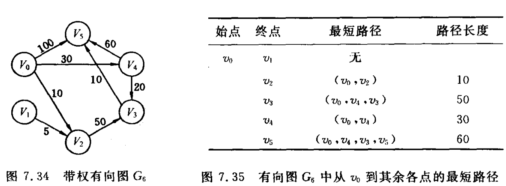

Dijkstra 算法

解决问题：**单源点的最短路径**

> 其主要思想是贪心，具体地说：
>
> * 将所有节点分成两类：**已确定从起点到当前点的最短路长度的节点**，以及**未确定从起点到当前点的最短路长度的节点**（下面简称「未确定节点」和「已确定节点」）。
>
> * 每次从「**未确定节点**」中**取一个与起点距离最短的点**，将它归类为「**已确定节点**」，并用它「**更新**」从起点到其他所有「**未确定节点**」的距离。**直到所有点都被归类为「已确定节点」**。
>
> * 用节点 A「**更新**」节点 B 的意思是，用 起点到节点 A 的最短路长度 加上 从节点 A 到节点 B 的边的长度，去比较 起点到节点 B 的最短路长度，如果前者小于后者，就用前者更新后者。这种操作也被叫做「**松弛**」。

```cpp
void ShortestPath_DIJ(MGraph G, int v0, PathMatrix &P, ShortPathTable &D){
    // 用 Dijkstra 算法求有向网G的v0顶点到其余顶点v的最短路径P[v]及其带权长度D[v]
    // 若 P[v][w] 为TRUE,则w是从v0到v当前求得最短路径上的顶点
    // final[v] 为TRUE当且仅当 v∈S,即已经求得从v0到v的最短路径
    for(v=0; v<G.vexnum; ++v){
        final[v] = FALSE;  D[v] = G.arcs[v0][v];
        for(w=0; w<G.vexnum; ++w) P[v][w] = FALSE;
        if(D[v]<INFINITY) {P[v][v0] = TRUE; P[v][v] = TRUE;}
    } // for
    D[v0] = 0; final[v0] = TRUE;  	// 初始化,v0顶点属于S集
    // 开始主循环，每次求得v0到某个v顶点的最短路径,并加v到S集
    for(i=1; i<G.vexnum; ++i){	  	// 其余 G.vexnum-1 个顶点
        min = INFINITY;
        for(w=0; w<G.vexnum; ++w)
            if(!final[w])			// w顶点在V-S中
                if(D[w]<min){v=w; min = D[w];} // w顶点离v0顶点最近
        final[v] = TRUE;
        for(w=0; w<G.vexnum; ++w)  	// 更新当前最短路径及距离
            if(!final[w] && (min+G.arcs[v][w]<D[w])){	// 修改D[w]和P[w],w∈V-S
                D[w] = min+G.arcs[v][w];
                P[w] = P[v];
                p[w][w] = TRUE;  	// P[w] = p[v]+[w]
            } // if
    } // for
} // ShortestPath_DIJ
```


### 7.6.2 每一对顶点之间的最短路径

形式简单的算法：Floyd 算法。

```cpp
void ShortestPath_FLOYD(MGraph G, PathMatrix &P[], DistancMatrix &D)
{
    // Floyd 算法求有向网G中各对顶点v和w之间的最短路径P[v][w]及其带权长度 D[v][w]
    // 若P[v][w][u]为TRUE,则u是从v到w当前求得最短路径上的顶点
    for(v=0; v<G.vexnum; ++v)			// 初始化
        for(w=0; w<G.vexnum; ++v){
            D[v][w] = G.arcs[v][w];
            for(u=0;u<G.vexnum;++u)
                P[v][w][u] = FALSE;
            if(D[v][w]<INFINITY){		// 从v到w有直接路径
                P[v][w][v] = TRUE;
                P[v][w][w] = TRUE;
            } // if
        } // for
    
    for(u=0; u<G.vexnum; ++u)			// 中间点
        for(v=0; v<G.vexnum; ++v)		// 起点
            for(w=0; w<G.vexnum; ++w)	// 终点
                if(D[v][u]+D[u][w]<D[v][w]){
                    D[v][w] = D[v][u]+D[u][w];
                    for(i=0;i<G.vexnum; ++i)
                        P[v][w][i] = P[v][u][i]||P[u][w][i];
                } // if
} // ShortestPath_FLOYD
```


# 第9章 查找

* 关键字（Key）：数据元素（或记录）中某个数据项的值，用它可以识别一个数据元素（或记录）

* 查找（Searching）：根据给定的某个值，在查找表中确定一个其关键字等于给定值的记录或数据元素。若表中存在这样的记录，则称查找是成功的。

* 查找表（查找结构）：用于查找的数据集合，由同一类型的数据元素组成。

  对查找表经常进行的一般操作：

  1. 查询某个特定数据元素是否在查找表中
  2. 检索满足条件的某个特定的数据元素的各种属性
  3. 在查找表中插入一个数据元素
  4. 从查找表中删除某个数据元素

* 静态查找表：查找表的操作只涉及查询和检索。

  查找方法：顺序查找、折半查找、散列查找等。

* 动态查找表：需要动态地插入或删除的查找表。

  查找方法：二叉排序树的查找、散列查找等。

* 查找算法在查找成功时的 **平均查找长度**

  对于含有 n 个记录的表，查找成功时的平均查找长度为
  $$
  ASL = \sum_{i=1}^nP_iC_i
  $$
  其中：$P_i$ 为查找表中第 i 个记录的概率，且 $\sum_{i=1}^nP_i = 1$ 

  $C_i$ 为找到表中其关键字与给定值相等的第 i 个记录时，和给定值已进行过比较的关键字个数。

  

  

* 典型的关键字类型和数据元素类型：

  ```cpp
  typedef float KeyType;
  typedef int KeyType;
  typedef char* KeyType;
  
  typedef struct{
      KeyType key;	// 关键字域
      ...				// 其他域
  }SElemType;
  
  // 对数值型关键字的比较
  #define EQ(a,b) ((a) == (b))
  #define LT(a,b) ((a) <  (b))
  #define LQ(a,b) ((a) <= (b))
  // 对字符串型关键字的比较
  #define EQ(a,b) (!strcmp((a),(b)))
  #define LT(a,b) (strcmp((a), (b)) < 0)
  #define LQ(a,b) (strcmp((a), (b)) <= 0)
  ```

  

## 9.1 静态查找表

```cpp
ADT StaticSearchTable{
    Create(&ST, n);
    Destroy(&ST);
    Search(ST, key);
    Traverse(ST, Visit());
}
```


### 9.1.1 顺序查找

又称线性查找。对顺序表和链表都适用。

1.一般线性表的顺序查找

作为一种最直观的查找方法，其基本思想是从线性表的一端开始，逐个检查关键字是否满足给定的条件。

```cpp
typedef struct{			// 查找表的数据结构
    ElemType* elem;		// 元素存储空间基址，建表时按实际长度分配，0号单元留空
    int TableLen;		// 表的长度
}SSTable;

int Search_Seq(SSTable ST, ElemType key){
    ST.elem[0] = key;									// 哨兵
    for(int i = ST.TableLen; ST.elem[i] != key; --i);	// 从后往前找
    return i;	// 若表中不存在关键字为 key 的元素，将查找到i为0时退出for循环
}
```

上述算法中，将 ST.elem[0] 称为哨兵，引入它的目的是使得 Search_Seq 内的循环不必判断数组是否会越界。引入“哨兵”可以避免很多不必要的判断语句，从而提高程序效率。

顺序表查找的平均查找长度（各记录查找概率相等情况下）：
$$
ASL_{SS} = \cfrac{n+1}2
$$

查找不成功的比较次数显然是 $n+1$ 次。


2. 有序表的顺序查找

有序线性表的顺序查找中，查找成功的平均查找长度和一般线性表的顺序查找一样。

查找失败的平均查找长度在相等查找概率的情形下为
$$
ASL_{不成功} = \sum_{j=1}^n q_j(l_j-1) = \cfrac{1+2+\cdots+n+n}{n+1} = \cfrac{n}2+\cfrac{n}{n+1}
$$
式中，$q_j$ 是达到第 $j$ 个失败结点的概率，在相等查找概率的情形下，它为 $1/(n+1)$；$l_j$ 是第 $j$ 个失败结点所在的层数。


### 9.1.2 折半查找

折半查找，又称二分查找，它仅适用于有序的顺序表。

折半查找的基本思想：首先将给定值 key 与表中中间位置的元素比较，若相等，则查找成功，返回该元素的存储位置；若不等，则所需查找的元素只能在中间元素以外的前半部分或后半部分。

```cpp
int Binary_Search(SSTable L, ElemType key){
    int low = 0, high = L.TableLen-1, mid;
    while(low <= high){
        mid = (low+high)/2;
        if(L.elem[mid] == key)
            return mid;
        else if(L.elem[mid] > key)
            high = mid-1;
        else
            low = mid+1;
    }
    return -1;
}
```

折半查找的过程可用二叉树来描述，称为 **判定树**。树中每个圆形结点表示一个记录，结点中的值为该记录的关键字值；树中最下面的叶节点都是方形的，它表示查找不成功的情况。

* 查找成功时的查找长度为从根结点到目的节点的路径上的节点数
* 查找不成功时的查找长度为从根结点到对应失败结点的父结点的路径上的结点数。

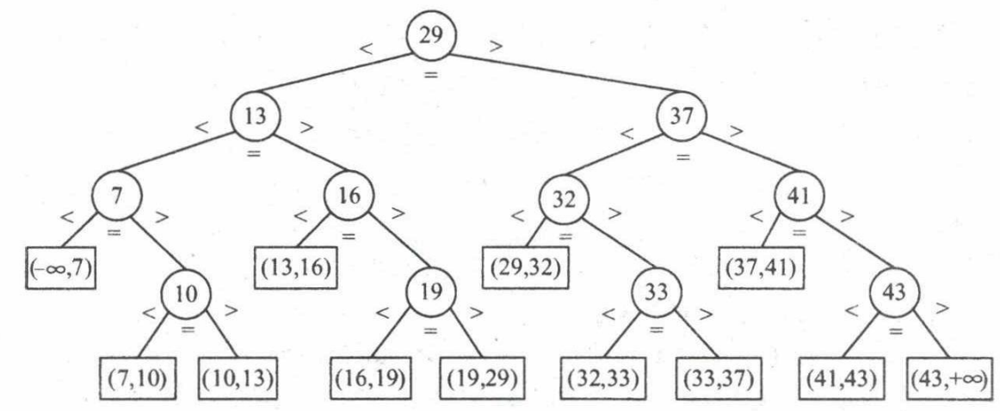

【注】判定树也是二叉排序树，所以中序遍历的结果应该是有序的，且左子树的关键字值<根结点关键字值<右子树关键之值


查找成功的平均查找长度为
$$
\begin{eqnarray}    \label{eq}
ASL&=&\cfrac1n\sum_{i=1}^n l_i  = \cfrac1n(1\times1+2\times2+\cdots+h\times2^{h-1})=\cfrac{n+1}{n}\log_2(n+1)-1 \nonumber    \\
~&\approx& \log_1(n+1)-1
\end{eqnarray}
$$
式中，h 是折半查找判定树的高度，并且，元素个数为 n 时树高 $h = \lceil \log_2(n+1) \rceil$ 。所以，折半查找的时间复杂度为 $O(\log_2n)$

 

上图的判定树中，在等概率的情况下，查找成功（圆形结点）的 

$\mathrm{ASL_{成功}} = (1\times1+2\times2+3\times4+4\times4)/11=3$

查找不成功（方形结点）的

$\mathrm{ASL_{失败}} = (3\times4+4\times8)/12=11/3$ 


### 9.1.3 分块查找

分块查找，又称索引顺序查找。吸取了顺序查找和折半查找各自的优点，既有动态结构，又适合于快速查找。

分块查找的基本思想：将查找表分为若干子块。块内元素可以无序，但块间的元素是有序的。第一块中的最大关键字小于第二块中所有记录的关键字，以此类推。

分块查找的过程分为两步：第一步是在索引表中确定待查记录所在的块，可以顺序查找或折半查找索引表，第二步是在块内顺序查找。

分块查找的平均查找长度为索引查找和块内查找的平均长度之和。设索引查找和块内查找的平均查找长度分别为 $L_I$，$L_S$，则分块查找的平均查找长度为
$$
ASL = L_I+L_S
$$
将长度为 n 的查找表均匀地分为 b 块，每块有 s 个记录，在等概率情况下，若在块内和索引表中均采用顺序查找，则平均查找长度为
$$
ASL = L_I+L_S = \cfrac{b+1}2+\cfrac{s+1}2 = \cfrac{s^2+2s+n}{2s}
$$
此时，若 $s = \sqrt{n}$ ，则平均查找长度取最小值 $\sqrt{n}+1$ 


## 9.2 动态查找表

### 9.2.1 二叉排序树和平衡二叉树

**二叉排序树**，或者是一棵空树，或者是具有一下性质的二叉树：

* 若它的左子树不空，则左子树上所有结点的值均小于它的根结点的值
* 若它的右子树不空，则右子树上所有结点的值均大于它的根结点的值
* 它的左、右子树也分别为二叉排序树


二叉排序树的查找：

```cpp
BiTree SearchBST(BiTree T, KeyType key){
    // 在根指针 T 所指二叉排序树中递归地查找某关键字等于 key 的数据元素
    // 若查找成功，则返回指向该数据元素结点的指针，否则返回空指针
    if(!T || EQ(key, T->data.key)) return (T);
    else if LT(key, T->data.key) return (SearchBST(T->lchild, key));
    else return (SearchBST(T->rchild, key));
} // SearchBST
```


二叉排序树的插入，在查找不成功时进行插入，插入的结点一定是一个新添加的叶子结点，并且查找不成功时候查找路径上访问的最后一个结点一定是新添加的左孩子或右孩子结点。要对上面的查找函数进行一些修改。

```cpp
Status SearchBST(BiTree T, KeyType key, BiTree f, BiTree &p){
    if(!T){p = f; return FALSE;}
    else if(EQ(key, T->data.key)) {p = T; return TRUE;}
    else if(LT(key, T->data.key)) return SearchBST(T->lchild, key, T, p);
    else return SearchBST(T->rchild, key, T, p);
} // SearchBST
```

插入结点：

```cpp
Status InsertBST(BiTree&T, ElemType e){
    if(!SearchBST(T, e.key, NULL, p)){
        s = (BiTree)malloc(sizeof(BiTNode));
        s->data = e;
        s->lchild = s->rchild = NULL;
        if(!p) T = s;
        else if(LT(e.key, p->data.key)) p->lchild = s;
        else p->rchild = s;
        return TRUE;
    }
    else return FALSE;
}
```


二叉排序树既拥有类似于折半查找的特性，又采用链表作存储结构，因此是动态查找表的一个适宜表示。对于二叉排序树，删去树上一个结点相当于删去有序序列的一个记录，只要在删除某个结点之后依旧保持二叉排序树的特性即可。

删除结点的三种情况：（假设 *p 为被删除结点，其双亲结点为 *f，不失一般性，假设 *p 是 *f 的左孩子）

1. 若 *p 结点为叶子结点，即 $\mathrm{P_L}$ 和  $\mathrm{P_R}$ 均有空树。由于删去叶子结点不破坏整棵树的结构，则只需修改其双亲结点的指针即可。
2. 若 *p 结点只有左子树  $\mathrm{P_L}$ 或者只有右子树  $\mathrm{P_R}$ ，此时只要令  $\mathrm{P_L}$ 或  $\mathrm{P_R}$ 直接成为其双亲结点 *f 的左子树即可。
3. 若 *p 的结点的左子树和右子树均不空。有两种处理方法：
   1. 令 *p 的左子树 为 *f 的左子树，而 *p 的右子树为 *s 的右子树。（图(c)）
   2. 令 *p 的直接前驱（或直接后继）代替 *p，然后再从二叉排序树中删去它的直接前驱（或直接后继）。（图(d)）

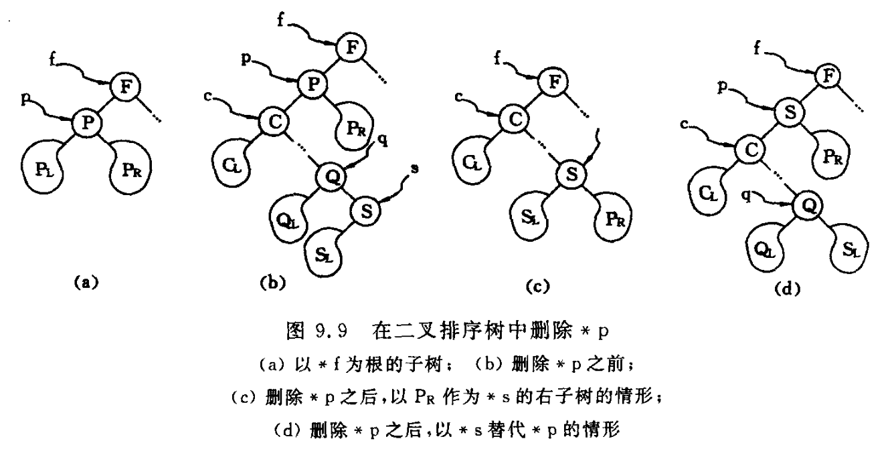

综合上述情况得到的删除算法：

```cpp
Status DeleteBST(BiTree  &T, KeyType key){
    if(!T) return FALSE;
    else{
        if(EQ(key, T->data.key)) {return Delete(T)};
        else if(LT(key, T->data.key)) return DeleteBST(T->lchild, key);
        else return DeleteBST(T->rchild, key);
    }
}	// DeleteBST

Status Delete(BiTree &p){
    // 从二叉排序树中删除结点p，并重新连接它的左右子树
    if(!p->rchild){
        q = p;
        p = p->lchild;
        free(q);
    }
    else if(!p->lchild){
        q = p;
        p = p->rchild;
        free(q);
    }
    else{	// 利用的第二种方法
        q = p;
        s = p->lchild;
        while(s->rchild){
            q = s;
            s= s->rchild;
        }					// s 指向的是被删除结点的前驱
        p->data = s->data;	// s 代替被删除结点
        if(q != p)			
            q->rchild = s->lchild;
        else				// 说明被删结点的前驱结点就是左子树
            q->lchild = s->lchild;
        delete s;
	}
    return TRUE;
} // Delete
```


**二叉排序树效率分析**

成功：每个结点的深度相加除以结点个数

失败：每个结点的外点深度相加除以外点个数

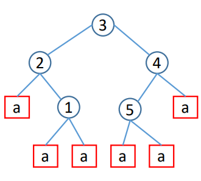

对于上面这幅图，$ASL_{失败} = (2+2+3+3+3+3)/6 = 2.67$


**平衡二叉树**

平衡二叉树，又称 AVL 树，它或者是一棵空树，或者是具有以下性质的二叉树：它的左子树和右子树都是平衡二叉树，且左子树和右子树的深度之差的绝对值不超过1。

二叉树上结点的平衡因子 BF（Balance Factor）：该节点的左子树的深度减去它的右子树的深度，则平衡二叉树上所有结点的平衡因子只可能就是 -1、0 和 1。


**平衡二叉树的插入**

二叉排序树保证平衡的基本思想：每当在二叉树中插入（或删除）一个结点时，首先检查其插入路径上的结点是否因为这次操作而导致了不平衡。若导致了不平衡，则先找到插入路径上离插入结点最近的平衡因子的绝对值大于1的结点A，再以A为根的子树，再保持二叉排序树特性的前提下，调整各结点的位置关系，使之重新达到平衡。

注意：每次调整的对象都是 **最小不平衡子树**。

平衡二叉树的插入过程的前半部分与二叉排序树相同，但在新结点插入后，若造成查找路径上某个结点不再平衡，则需要作出相应的调整。可将调整的规律归纳为下列 4 种情况：

1. LL 平衡旋转（右单旋转）

   情况：由于在结点A的左孩子的左子树上插入了新结点，A的平衡因子由 1 增至 2，导致以 A 为根的子树失去平衡，需要一次向右的旋转操作。

   操作：将A的左孩子 B 向上旋转代替 A 成为根结点，将 A 结点向右下旋转成为 B 的右子树的根结点，而B的原右子树则作为 A 结点的左子树。

   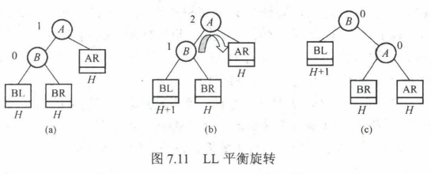

2. RR平衡旋转（左单旋转）

   情况：由于在结点 A 的右孩子的右子树上插入了新结点，A的平衡因子由-1减至-2，导致以A为根的子树失去平衡，需要一次向左的旋转操作。

   操作：将 A 的右孩子 B 向左上旋转代替 A 成为根结点，将 A 结点向左下旋转成为 B 的左子树的根结点，而 B 的原左子树则作为 A 结点的右子树。

   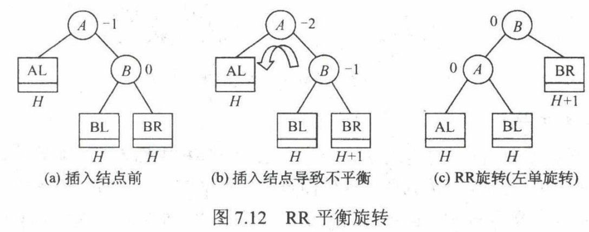

3. LR 平衡旋转（先左后右双旋转

   情况：由于在 A 的左孩子 L 的右子树 R 上插入新结点，A 的平衡因子由 1 增至 2，导致以 A 为根的子树失去平衡，需要进行两次旋转操作，先左旋转后右旋转。

   操作：先将 A 结点的左孩子B的右子树的根结点 C 向左上旋转提升到 B 的位置，然后把该 C 结点向右上旋转提升到 A 结点的位置。

   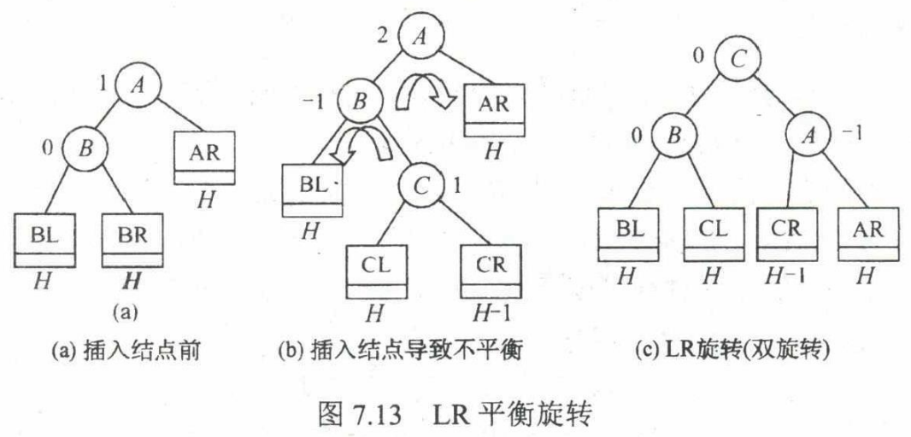

4. RL 平衡旋转（先右后左）

   情况：由于 A 的右孩子 R 的左子树 L 上插入新结点，A 的平衡因子由 -1 减至 -2，导致以 A 为根的子树失去平衡，需要进行两次旋转操作，先右旋转后左旋转。

   操作：将 A 结点的右孩子 B 的左子树的根结点 C 向右上旋转提升到 B 结点的位置，然后把该 C 结点向左上旋转提升到 A 结点的位置。

   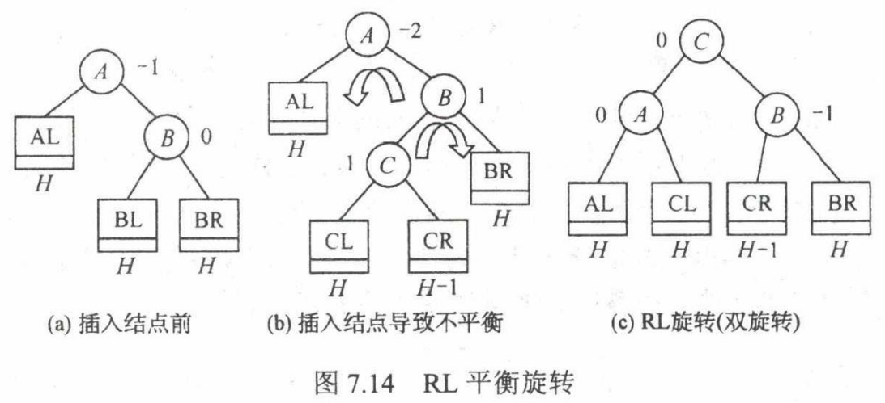

**平衡二叉树的删除**

删除平衡二叉树的步骤，以删除结点 w 为例：

1. 用二叉排序树的方法对结点 w 执行删除操作
2. 若导致了不平衡，则从结点 w 开始向上回溯，找到第一个不平衡的结点 z（即最小不平衡子树）：y 为结点 z 的高度最高的孩子结点 ，x 是结点 y 的高度最高的孩子结点。
3. 然后对以 z 为根的子树进行平衡调整，其中 x、y 和 z  可能的位置有 4 种情况：
   * y 是 z 的左孩子，x 是 y 的左孩子（LL，右单旋转）
   * y 是 z 的左孩子，x 是 y 的右孩子（LR，先左后右双旋转）
   * y 是 z 的右孩子，x 是 y 的右孩子（RR，左单旋转）
   * y 是 z 的右孩子，x 是 y 的左孩子（RL，先右后左双旋转）

这四种情况与插入操做的调整方式一样。不同之处在于，插入操作仅需要以 z 为根的子树进行平衡调整；而删除操作就不一样，先对以 z 为根的子树进行平衡调整，如果调整后子树的高度减 1，则可能需要对 z 的祖先结点进行平衡调整，甚至回溯到根结点（导致树高减1）

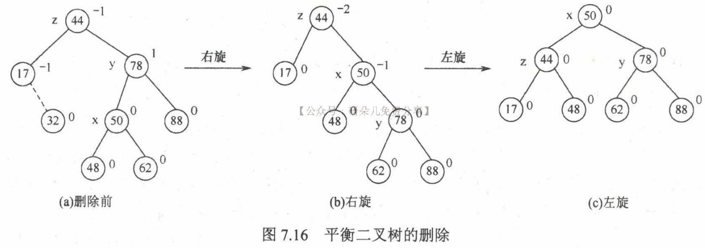


**平衡二叉树查找的分析**

在平衡树上进行查找的时间复杂度为 $O(\log n)$ 。


## 9.3 散列表

**散列表**：根据关键字而直接进行访问的数据结构。也就是说，散列表建立了关键字和存储地址之间的一种直接映射关系。

**散列函数**：一个把查找表中的关键字映射成关键字对应的地址的函数，记为 Hash(key) = Addr

散列函数可能会把两个或两个以上的不同关键字映射到同一地址，这种情况称为 **冲突**，这些发生碰撞的不同关键字称为 **同义词**。

一般情况下，冲突只能尽可能地少，而不能完全避免。


### 9.3.1 散列函数的构造方法

1. 直接定址法

   取关键字或关键字的某个线性函数值为哈希地址。即：
   $$
   H(key) = key\ 或\ H(key) = a\ \cdot\ key+b 
   $$
   其中，a 和 b 为常数

2. 数学分析法

3. 平方取中法

4. 折叠法

5. **除留余数法**

   取关键字被某个不大于哈希表表长 m 的数 p 除后所得到余数为哈希地址。即：
   $$
   H(key) = key\ \mathrm{MOD}\ p,p\leqslant m
   $$
   一般情况下，可以 **选 p 为质数** 或不包含小于 20 的质因数的合数。

6. 随机数法


### 9.3.2 处理冲突的方法

1. 开放定址法
   $$
   H_i = (H(key)+d_i)\ \mathrm{MOD}\ m, i = 1,2,\cdots, k(k\leqslant m-1)
   $$
   其中：$H(key)$ 为哈希函数；**m 为哈希表表长**，和 除留余数法的p不一样。$d_i$ 为增量序列，有下面三种取法：

   * 线性探测再散列：$d_i = 1,2,3,\cdots, m-1$ 
   * 二次探测再散列：$d_i = 1^2,-1^2, 2^2, -2^2, 3^2, \cdots, \pm k^2(k\leqslant m/2)$
   * 伪随机探测再散列：$d_i$ = 伪随机探测序列

2. 再哈希法
   $$
   H_i = RH_i(key),i = 1,2,\cdots, k
   $$

3. 链地址法

   所有关键字为同义词的记录存储在同一线性链表中。建立指针型向量（数组），每个分量的初始状态都是空指针。


### 9.3.3 哈希表的查找及其分析

注：查找失败的对比数量要包括和空值的一次比较


# 10 内部排序

## 10.1 概述

如果按排序过程中依据的不同原则对内部排序方法进行分类，则大致可分为 插入排序、交换排序、选择排序、归并排序 和 计数排序 五类。

如果按内部排序过程中所需的工作量来区分，则可分为三类：

* 简单的排序方法，其时间复杂度为 $O(n^2)$
* 先进的排序方法：时间复杂度为 $O(n\log n)$
* 基数排序：时间复杂度为 $O(d·n)$


## 10.3 快速排序

**快速排序** 是对冒泡排序的一种改进。

基本思想：通过一趟排序将待排序记录分割成独立的两部分，其中一部分的关键字均比另一部分的关键字小，则可分别将这两部分记录继续进行排序，以达到整个序列有序。

一趟快速排序的具体做法：附设两个指针 low 和 high，他们的初值分别是 low 和 high，设 枢轴记录的关键字为 pivotkey，则首先从 high 所指位置向前搜索找到第一个关键字小于 pivotkey 的记录和枢轴记录相互交换，然后从 low 所指位置向后搜索，找到第一个关键字大于 pivotkey 的记录和枢轴记录互相交换，重复这两步直至 low = high 为止。

算法：

```cpp
int Partition(SqList &L, int low, int high){
    // 交换顺序表 L 中子表L.r[low..high]的记录，使枢轴记录到位，并返回此位置，此时
    // 在它之前（后）的记录均不大（小）于它
    pivotkey = L.r[low].key;
    while(low<high)		// 用子表的第一个记录作为枢轴记录
    {					// 从表的两端交替向中间扫描
        while(low<high && L.r[high].key >= pivotkey) -- high;
        L.r[low]←→L.r[high]; // 将比枢轴记录小的记录交换到低端
        while(low<high && L.r[low].key <= pivotkey) ++low;
        L.r[low]←→L.r[high]; // 将比枢轴记录大的记录交换到高端
    }
    return low;
} // Partition
```


具体实现上述算法，每交换一对记录需进行3次记录移动操作，而实际上，在排序过程中对枢轴记录的过程是多余的，因为只有在一趟排序结束时，即 low = high 的位置才是枢轴记录的最后位置。因此可改写上述算法，先将枢轴记录暂存在 r[0]的位置上，排序过程只作 r[low] 或 r[high] 的单向移动，直至一趟排序结束后再将枢轴记录移至正确位置上。

```cpp
int Partition(SqList &L, int low, int high){
    // 交换顺序表 L 中子表L.r[low..high]的记录，使枢轴记录到位，并返回此位置，此时
    // 在它之前（后）的记录均不大（小）于它
    L.r[0] = L.r[low].key;
    while(low<high)		// 用子表的第一个记录作为枢轴记录
    {					// 从表的两端交替向中间扫描
        while(low<high && L.r[high].key >= pivotkey) -- high;
        L.r[low] = L.r[high]; 	// 将比枢轴记录小的记录交换到低端
        while(low<high && L.r[low].key <= pivotkey) ++low;
        L.r[low] = L.r[high]; 	// 将比枢轴记录大的记录交换到高端
    }
    L.r[low] = L.r[0];			// 枢轴记录到位
    return low;					// 返回枢轴位置
} // Partition
```


排序过程举例

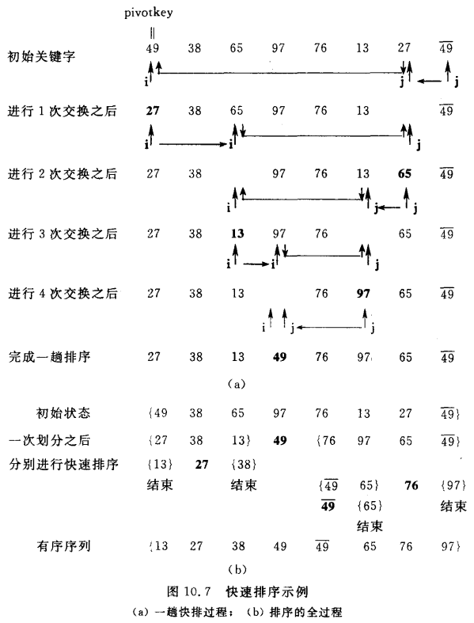


递归形式的快速排序算法：

```cpp
void QSort(SqList &L, int low, int high){
    // 对顺序表L中的子序列 L.r[low..high] 作快速排序
    if(low < high){						// 表长度大于1
        pivotloc = Partion(L,low, high); // 将 L.r[low..high]一分为二
        QSort(L, low, pivotloc-1);		// 对低子表递归排序, pivotloc 是枢轴位置
        QSort(L, pivotloc+1, high);		// 对高子表进行排序
    }
} // QSort

void QuickSort(SqList &L){
    QSort(L, 1, L.length);
} // QuickSort
```


**快速排序是所有内部排序算法中平均性能最优的排序算法**。时间复杂度为 $O(n\log_2 n)$


## 10.4 选择排序

### 10.4.1 简单选择排序

一趟简单选择排序的操作为：通过 n-i 次关键字间的比较，从 n-i+1 个记录中选出关键字最小的记录，并和第 i ($1\leqslant i \leqslant n$) 个记录交换之。


### 10.4.3 堆排序

堆排序只需要一个记录大小的辅助空间，每个待排序的记录仅占一个存储空间。

堆的定义如下：n 个元素的序列 $\{k_1, k_2, \cdots, k_n\}$ 当且仅当满足下面的关系时，称之为 **堆**
$$
\begin{cases}
k_i\leqslant k_{2i}\\
k_i\leqslant k_{2i+1}
\end{cases}
或
\begin{cases}
k_i\geqslant k_{2i}\\
k_i\geqslant k_{2i+1}
\end{cases}
$$
若将此序列对应的一维数组看成是一个完全二叉堆，则堆的含义表明，完全二叉树中所有非终端结点的值均不大于其左、右孩子结点的值。由此，若序列 $\{k_1, k_2, \cdots, k_n\}$ 是堆，则堆顶元素必然为序列 n 个元素的最小值（或最大值）。

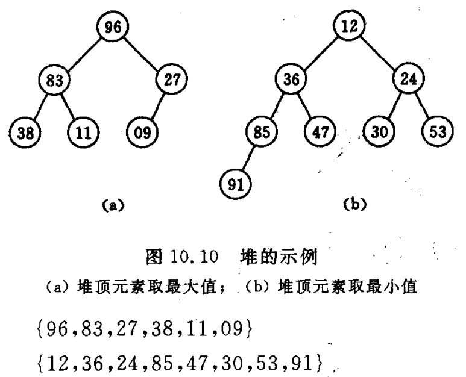

实现堆排序需要解决两个问题：

* 如何由一个无序序列建成一个堆
* 如何在输出堆顶元素之后，调整剩余元素成为一个新的堆

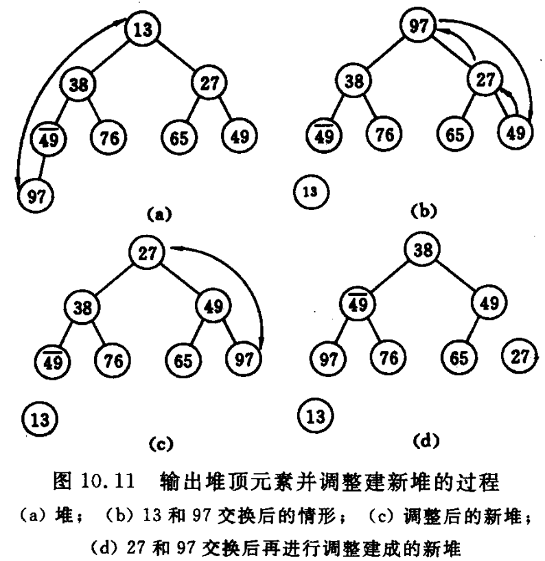

例如，图 10.11所示，(a)是一个堆，假设输出栈顶元素之后，以堆中最后一个元素替代之，如(b)所示，此时根的左右子树均为堆，则仅需自上而下调整即可。首先以 堆顶元素和其左、右子树的根结点的值比较，由于右子树根结点的值小于左子树根结点的值，则将 27 和 97 交换。由于 97 替代了 27 之后破坏了右子树的 “堆”，则需进行上述同样的调整，直至叶子结点，调整后的状态如图(c)所示，此时堆顶为 n-1 个元素中的最小值。重复上述过程，将堆顶元素 27 和堆最后一个元素 97 交换且调整，得到 图(d) 所示的新堆。


这个过程称为 “**筛选**”。


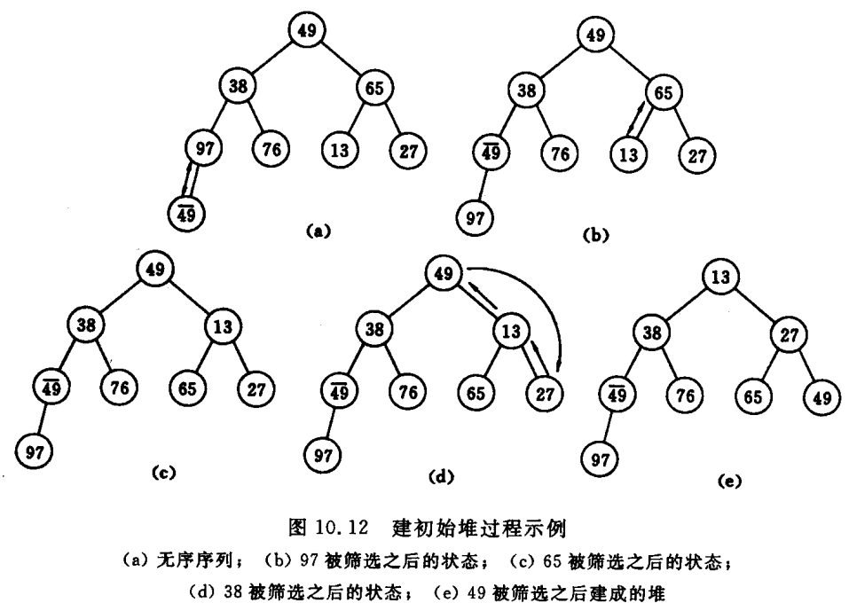

从一个无序序列建堆的过程就是一个反复“筛选”的过程。若将此序列看成一个完全二叉树，则最后一个非终端结点是第 $\lfloor n/2 \rfloor$ 个元素，由此“筛选”只需从第 $\lfloor n/2 \rfloor$ 个元素开始。

例如：图10.12(a) 中的二叉树表示一个具有 8 个元素的无序序列 $\{49,38,65,97,76,13,27,\overline{49} \}$，则筛选从第 4 个元素开始，由于 $97>\overline{49}$ ，则交换之，交换后的序列如图(b)，同理在第 3 个元素 65 被筛选后的序列状态如图(c) 所示，由于2个元素38不大于其左右子树根的值，所以筛选后的序列不变。图(e) 为筛选根元素 49 之后建成的堆。

```cpp
typedef SqList HeapType;

void HeapAdjust(HeapType &H, int s, int m){
    rc = H.r[s];
    for(j = 2*s; j<=m; j*=2) // 沿着 key 较大的孩子结点向下筛选
    {
        if(j<m && LT(H.r[j].key, H.r[j+1].key)) ++j;	// j 为 key 较大的记录的下标
        if(!LT(rc.key, H.r[j].key)) break; // rc 应该插入到位置 s 上
        H.r[s] = H.r[j]; s = j;
    }
    H.r[s] = rc;
} // HeapAdjust

void HeapSort(HeapType &H){
    // 对顺序表 H 进行堆排序
    for( i = H.length/2; i>0; --i)
        HeapAdjust(H, i, H.length);
    for( i = H.length; i>1; --i){
        H.r[1]←→H.r[i];
        HeapAdjust(H,1,i-1);		
    }
} // HeapSort
```


**算法效率分析**

空间复杂度：仅适用了常数个辅助单元，空间复杂度为 O(1)

时间复杂度：

* 建堆时间为 O(n)
* 之后有 n-1 次向下调整的操作，每次调整的时间复杂度为 O(h)，h为堆的树高，故在最好、最坏和平均情况下，堆排序的时间复杂度为 $O(n\log_2n)$ 

稳定性：是一个 **不稳定** 的排序方法


## 10.6 基数排序

**基数排序** 不需要进行关键字间的比较。基数排序 是一种借助多关键字排序的思维，对单逻辑关键字进行排序的方法。

### 10.6.1 多关键字的排序

假设有 n 个记录的序列 $\{R_1, R_2, \cdots, R_n\}$ ，且每个记录 $R_i$ 中含有 d 个关键字 $(K_i^0, K_i^1, \cdots, K_i^{d-1})$ ，则称序列 对关键字有序是指：对于序列中任意两个记录 $R_i$ 和 $R_j(1\leqslant i < j\leqslant n)$ 都满足下列有序关系：
$$
(K_i^0, K_i^1, \cdots, K_i^{d-1}) < (K_j^0, K_j^1, \cdots, K_j^{d-1})
$$
其中 $K^0$ 称为最主位关键字，$K^{d-1}$ 称为最次位关键字。为实现多关键字排序，通常有两种方法：

* 第一种方法，**最高位优先法**，MSD 法：先对最主位关键字 $K^0$ 进行排序，将序列分成若干子序列，每个子序列记录都具有相同给 $K^0$ 值，然后分别就每个子序列对关键字 $K^1$ 进行排序，按 $K^1$ 的值分成若干更小的子序列，依次重复，直至对 $K^{d-2}$ 进行排序之后得到的每一个子序列中的记录都具有相同的关键字$(K^0,K^1, \cdots, K^{d-2})$ ，而后分别每个子序列对 $K^{d-1}$ 进行排序，最后再对高一位的关键字 $K^{d-1}$ 进行排序。最后将所有子序列一次联接在一起成为一个有序序列。
* 第二种方法，**最低位优先法**，LSD 法：从最次位关键字 $K^{d-1}$ 进行排序。然后再对高一位的关键字 $K^{d-2}$ 进行排序，依次重复，直至对 $K^0$ 进行排序后便成为一个有序序列。


### 10.6.2 链式基数排序

基数排序，是借助 **分配** 和 **收集** 两种操作对 **单逻辑关键字** 进行排序。

有的单逻辑关键字可以看成若干个关键字复合而成的。例如，若关键字是数值，且其值都在 $0\leqslant K \leqslant 999$ 范围，则可把每一个十进制数字看成一个关键字，可认为 $K$ 由 3 个关键字（$K^0,K^1, K^2$）组成。采取 LSD 进行排序更为方便。

只要从最低数位关键字起，按关键字的不同值将序列种记录 “分配”到 RADIX 个队列中后再“收集”之，如此重复 $d$ 次。按这种方法实现排序 称之为 **基数排序**。

```cpp
#define MAX_NUM_OF_KEY 8			// 关键字数项的最大值
#define RADIX 10					// 关键字基数
#define MAX_SPACE 10000
typedef struct{
    KeysType keys[MAX_NUM_OF_KEY];	// 关键字
    InfoType otheritems;			// 其他数据项
    int next;
}SLCell;							// 静态链表的结点类型

typedef struct{
    SLCell r[MAX_SPACE];			// 静态链表的可利用空间，r[0] 为头结点
    int keynum;						// 记录的当前关键字个数
    int recnum;						// 静态链表当前的长度
}SLList;							// 静态链表类型
typedef int ArrType[RADIX];			// 指针数组类型
```

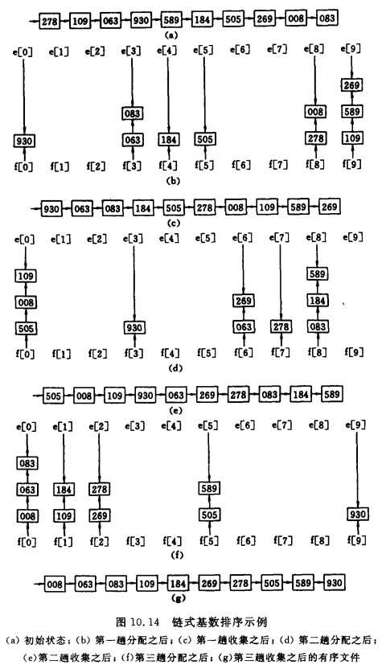

f[i] 和 e[i] 分别为 第 i 个队列的头指针和尾指针

链式基数排序中一趟分配的算法：

```cpp
void Distribute(SLCell &r, int i, ArrType &f, ArrType &e){
    // 静态链表 L 的 r 域中记录已按(keys[0], ..., keys[i-1]) 有序
    // 本算法按第 i 个关键字 keys[i] 建立 RADIX 个子表，使同一子表中记录的 keys[i] 相同
    // f[0..RADIX-1] 和 e[0..RADIX-1] 分别指向各子表中第一个和最后一个记录
    for(j = 0; j<Radix; ++j) f[j] = 0;		// 各子表初始化为空表
    for(p = r[0].next; p; p = r[p].next){
        j = ord(r[p].key);		// ord 将记录中第i个关键字映射到[0..RADIX-1]
        if(!f[j]) f[j] = p;
        else r[e[j]].next = p;	// 将 p 所指的结点插入第 j 个子表中
        e[j] = p;
    }
} // Distribute

void Collect(SLCell &r, int i, ArrType f, ArrType e){
    // 本算法按 keys[i] 自小到大 将 f[0...RADIX-1]所指各子表依次链接成一个链表
    // e[0...RADIX-1] 为各子表的尾指针
    for(j=0; !f[j]; j = succ(j));	// 找第一个非空子表, succ 为求后继函数
    r[0].next = f[j]; t = e[j];	// r[0].next 指向第一个非空子表中的第一个结点
    while(j<RADIX){
        for(j = succ(j); j<RADIX-1 && !f[j]; j=succ(j));// 找下一个非空子表
        if(f[j]) {r[t].next = f[j]; t = e[j]; }	// 链接两个非空子表
    }
    r[t].next = 0;			// t 指向最后一个非空子表中的最后一个结点
} // Collect

void RadixSort(SLList &L){
    // L 是采用静态链表表示的顺序表
    // 对 L 作基数排序，使得 L 成为按关键字自小到大的有序静态链表, L.r[0] 为头结点
    for(i=0; i<L.recnum; ++i) L.r[i].next = i+1;
    L.r[recnum].next = 0;			// 将 L 改造为静态链表
    for(i=0; i<L.keynum; ++i){		// 按最低位优先依次对各关键字进行分配和收集
        Distribute(L.r, i, f, e);	// 第i趟分配
        Collect(L.r, i, f, e);		// 第i趟收集
    }
} // RadixSort
```


## 10.7 各种内部排序方法的比较讨论

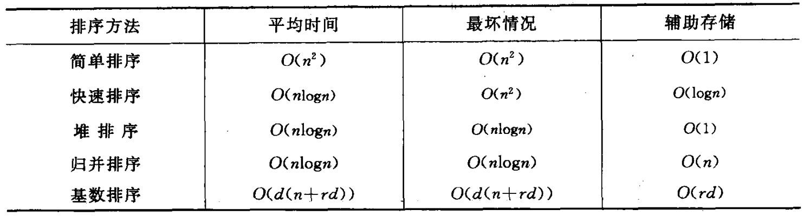

* 稳定的内部排序：直接插入排序、冒泡排序、2路归并排序、基数排序
* 不稳定的内部排序：简单选择排序、写入排序、快速排序
