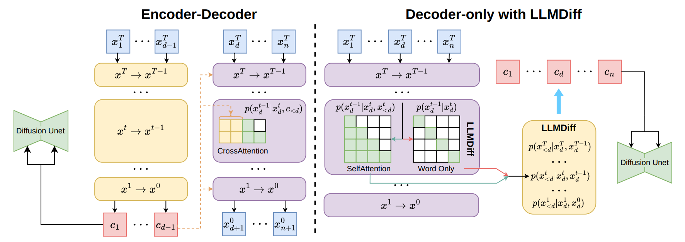
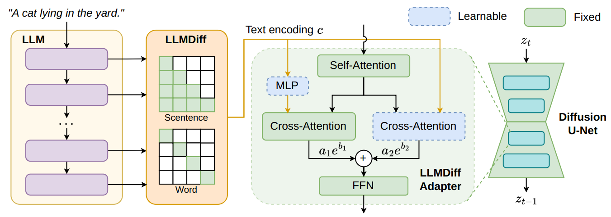

* 问题：
  * 现有的大多数方法 采用 基于编码器的语言模型架构，由于数据标注费用昂贵，只能在有限数量的图像文本对上预训练，导致 图像生成质量和稳定性 欠缺。
* 现状：
  * 大语言模型迅速发展，大语言模型是 decoder-only 结构，可以在大规模的 无标签文本数据 上训练。
  * 有些尝试 利用 LLM 的能力增强 文本生成图像 的 diffusion model 的性能，他们的方法是尝试丰富或改写 用户的文本提示 去引导 diffusion model 的 图像生成过程。
    * 主要采用间接方法来弥合两者之间的差距，因此受到低效文本编码器的限制。
* 方法：
  * 利用 大语言模型 文本**语义理解**的优势，改进 文本生成图像 的 diffusion model。
  * 在 denoising U-Net 的 cross-attention 部分 附加一个 简单高效的 网络模块，这个模块可以高效地将 语言模型中的 block-wise representations 整合，以生成输入文本提示的文本编码，以此能够利用 预训练的大语言模型 精确地捕捉 语义信息 和 文字之间的上下文依赖。
  * 完全放弃文本编码器，使得 text-to-image diffusion model 摆脱 语言理解性 (language comprehensibility) 的瓶颈，可能显著提升其在可控图像生成中的性能。

> 一个 Transformer-based 语言模型 可以被改写为 Denoising Diffusion Probabilistic Models 的 denoising 步骤。将 LLM 视为 diffusion model，我们进一步得到 从大语言模型的模块中提取文本编码的理论基础。

## A New Controller for Text-to-Image Generation

**Text-to-Image Diffusion Models**

* 通常使用编码器对文本输入 $x$ 进行编码，使用 $d-1$ 个 token 作为控制条件 $c_{<d}$ 
* $c_{<d}$ ：通过diffusion model，$p(z_{t-1}|z_t, c_{<d})$ ，生成图像。
* diffusion model，使用的 文本编码器 源于预训练模型，如 encoder-only 或 encoder-decoder LLMs。
  * encoder-only LLMs 不适用于 文本到图像生成，因为这些模型直接生成 token，无法直接获取文本特征 $c$ 

**LLMs as Diffusion Models**

* 假设 LLM 具有一系列 相同结构的 transformer block。

  * 每个输入 token 首先输入 embedding layer
  * 第 d 个 token 的 embedding layer 的输出 作为 输入 $x_d^T$ ，然后，它通过 T 个 self-attention 中使用 causal attention masks 的 transformer block，记为 $p_{\theta^t}(x_d^{t-1}|x_d^t, x_{<d}^t)$ ，其中第 $t$ 个块的参数化为 $\theta_t$ 。

* 这个过程类似于 带条件 的 DDPM 的去噪过程。

* 因此，基于 transformer 的 LLM 可以视为 diffusion model。

* 模型的预测可以表述为：
  $$
  p_{\theta}(c_d|x_{\leqslant d}) = p(x_d^T)\prod_{t=1}^Tp_{\theta^t}(x_d^{t-1}|x_d^t, x_{<d}^t)
  $$
  

**Text Encodings from Encoder-Decoder LLMs**

* 编码器模型 处理 上下文文本，将其编码为 feature representation，即 文本编码 $c_{<d}$ 。随后，解码器利用这些 text feature 生成单词，满足 $p_{\theta^t}(x_d^{t-1}|x_d^t, c_{<d})$ 。因此，解码器中的每个块都使用相同的条件 $c_{<d}$ 。
* 使用 任一块的输入 $x_d^t$ 和 输出 $x_d^{t-1}$ ，通过贝叶斯定理估计编码 $c_{<d}$ ：

$$
p(c_{<d}|x_{d}^{t-1},x_d^t) = \cfrac{p(x_d^{t-1}, x_d^{t} | c_{<d})p(c_{<d})}{p(x_d^{t-1},x_d^t)}
$$

**Text Encodings from Decoder-only LLMs**

* 对于 encoder-only LLM，视为 基于前面的 token 预测下一个 token。

* 当预测第 d 个单词时，前面的 d-1 个单词共同作为其上下文：
  $$
  p_{\theta}(x_d|x_{<d}) = p(x_d^T)\prod_{t=1}^Tp_{\theta^t}(x_d^{t-1}|x_d^t, x_{<d}^t)
  $$

* 给定 transformer block 的输入 $x_d^t$ 和输出 $x_d^{t-1}$ ，$p(x_{<d}^t|x_d^{t-1}, x_d^t)$ 的估计可以推导如下：
  $$
  \begin{aligned}
  p_{\theta^t}(x_{<d}^{t}|x_d^{t-1},x_d^t) &= \cfrac{p(x_d^{t-1},x_d^t|x_{<d}^t)p(x_{<d}^t)}{p(x_d^{t-1},x_d^t)}\\
  &= \cfrac{p(x_{d}^{t-1}|x_{\leqslant d}^t)p(x_d^t | x_{<d}^t)p(x_{<d}^t)}{p(x_d^{t-1}|x_d^t)p(x_d^t)}\\
  &=\cfrac{p(x_{d}^{t-1}|x_{\leqslant d}^t)p(x_{<d}^t | x_{d}^t)}{p(x_d^{t-1}|x_d^t)}\\
  &\propto p(x_d^{t-1}|x_d^t, x_{<d}^t )\ \ \ /\ \ \ p(x_d^{t-1}|x_d^t)
  \end{aligned}
  $$

  * $p(x_d^{t-1}|x_d^t, x_{<d}^t)$ 是 generative LLM 对 $x_d^t$ 的预测。
  * 大多数现有的 LLM 采用 causal mask 作为 attention mask。因此，$p(x_d^{t-1}|x_d^t)$ 可以通过仅将 $x_d^t$ 输入 LLM 来获得，即 $p(x_d^{t-1}|x_d^t) = p(x_d^{t-1}|x_d^t,\emptyset)$ 。

* $x_{<d}^t$ 可以视为 下一个 token 预测的条件，发挥与 encoder-decoder LLM 中 $c_{<d}$ 相似的作用。

  存在一个 $c_{<d}$ 对于 decoder-only LLM，它是 $x_{<d}$ 的无偏估计。

* 鉴于 decoder-only LLM 可以视为 diffusion model，我们可以通过 $p_{\theta^t}(x_{<d}^{t}|x_d^{t-1},x_d^t)$ 估计 $p(c_{<d}|x_d^{t-1}, x_d^t)$ 的评分函数，从而获得文本编码 $c_{<d}$ 。

  $p(c_{<d}|x_d^{t-1}, x_d^t)$ 的评分函数可以通过以下方式进行逼近：
  $$
  \nabla_c\log p_{\theta^t}(c_{<d}|x_d^t,x_d^{t-1})\approx g(t)(\nabla_x\log p_{\theta^t}(x_d^{t-1}|x_d^t, x_{<d}^t)-\nabla_x\log p_{\theta^t}(x_d^{t-1}|x_d^t))
  $$
  $g(t)$ 是一个依赖于时间步长 $t$ 的标量函数。

* $p(c_{<d}|x)$ 的评分函数可以近似表示为：
  $$
  \begin{aligned}
  \nabla_c\log p_{\theta^t}(c_{<d}|x_d^t,x_d^{t-1}) &\approx g(t)(\log p_{\theta^t}(x_d^{t}| x_{\leqslant d}^{t+1})-\log p_{\theta^t}(x_d^{t-1}| x_{\leqslant d}^t))\\ & -g(t)(\log p_{\theta^t}(x_d^{t}|x_d^{t+1})-\log p_{\theta^t}(x_d^{t-1}|x_d^t))
  \end{aligned}
  $$

  > Langevin 动力学模拟 一个粒子 在势能场中 运动的过程，同时考虑了 粒子受到的随机扰动。这个随机过程可以用以下微分方程来描述：
  > $$
  > dx = \nabla U(x) \text{ d}t + \sqrt{2D}\text{ d}W
  > $$
  >
  > * $x$ 是粒子的位置
  > * U(x) 是势能函数，对于 目标分布中的负对数概率密度
  > * $\text{d}t$ 是时间步长
  > * $D$ 是扩散系数，控制随机扰动的强度
  > * $\text{d}W$ 是 布朗运动，表示 随机扰动
  >
  > Langevin 动力学 通过 势能梯度 ($\nabla U(x)$) 指导粒子向低势能区域移动。每一步都加入一个随机扰动项 ($\sqrt{2D}\text{ d}W$)，这允许 粒子跳出局部最小值，增加探索不同区域的可能性。

* 使用该评分函数进行 Langevin 动力学采样，以获得用于图像生成的最终文本编码：
  $$
  c_{<d}^{t-1} = c_{<d}^t + \nabla_c \log p_{\theta^t}(c_{<d}|x_d^t, x_d^{t+1}) + \sqrt{2h(t)}\epsilon_t
  $$
  $h(t)$ 是一个可学习的函数，$\epsilon_t\sim \mathcal N(0, I)$ 

## LLMDiff Adapter

**Decoder-only LLMs as Diffusion Controller** 

从 decoder-only LLM 导出适合控制 diffusion image generation models 的文本编码：
$$
c_{<d} = c_{<d}^T + \sum_{T-1}^{t=0}(\nabla_c\log p_{\theta^t}(c_{<d}|x_d^t, x_d^{t+1})+ \sqrt{2h(t)}\epsilon_t) 
$$
现在利用现有的 transformer block 的 残差结构，可以利用 transformer block 得到 预测分数的模型：

* $S_{\theta^t}(x_d^{t-1}, x_{\leqslant d}^t) \approx \nabla_x\log p(x_d^{t-1} | x_d^t, x_{<d}^t) $ 
* $S_{\theta^t}(x_d^{t-1}, x_d^t)\approx \nabla_x \log p(x_d^{t-1}| x_d^t) $ 

**LLMDiff Adapter: Bridging Decoder-Only LLMs and Pre-trained Diffusion Models**

* 保持原始的 cross-attention module 完好无损，并通过 线性层 将其与来自 LLMs 的编码对齐。

* 引入一个额外的 cross-attention module，以学习如何更好地基于来自 LLMs 的文本编码生成图像。

* 通过一组可学习的权重因子：$a_1$、$a_2$、$b_1$、$b_2$ ，这两个模块的输出相结合，整体的计算：
  $$
  f = attn(\hat\tau_q(q), \hat\tau_k(\phi(\mathbf{c})),\hat\tau_v(\phi(\mathbf c))) a_1e^{b_1} + attn(\tau_q(q),\tau_k(\mathbf c),\tau_v(\mathbf c))a_2 e^{b_2}
  $$

  * $\hat\tau$ 是原始 cross-attention module 的线性层，$\tau$ 是附加 cross-attention module 的线性层
  * $\phi$ 是 使 LLMs 和 原始的 cross-attention module 对齐的 线性层

* LLMDiff Adapter 使用 均方误差 (MSE) 损失函数对 diffusion model 进行训练：
  $$
  \mathcal L = \| \epsilon_\theta(z_t, \mathbf c)-\epsilon \|^2
  $$
  $\epsilon_\theta$ 是 diffusion U-Net， $z_t$ 是 时间步 $t$ 的 latent feature map，$\epsilon\sim \mathcal N(0, I)$ 
