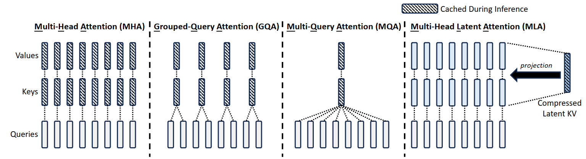
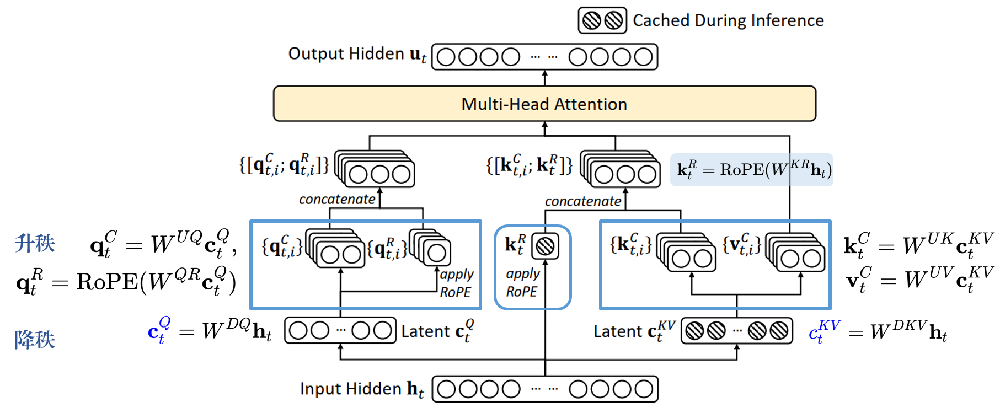
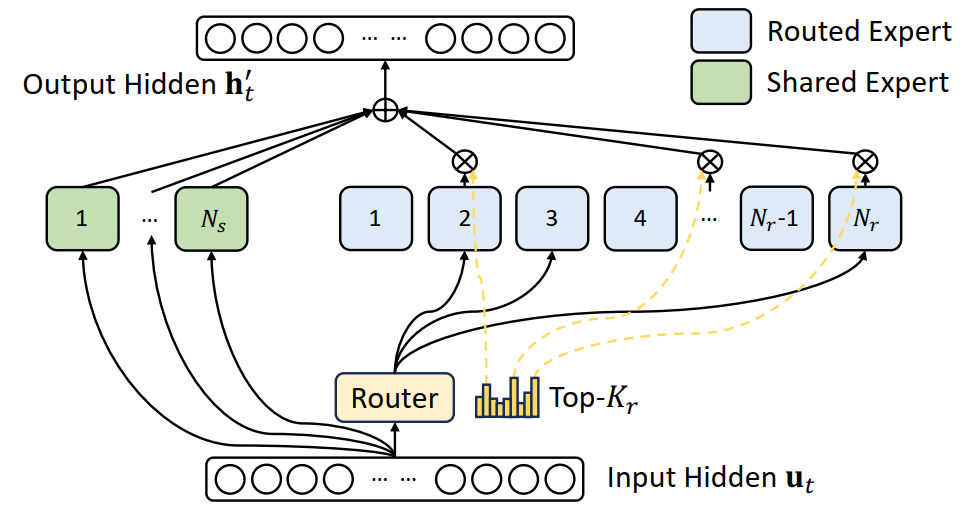
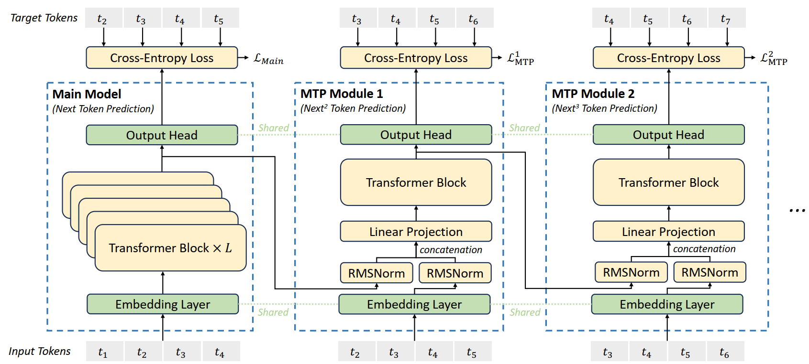
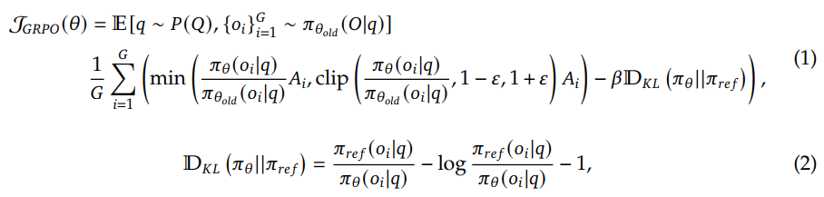

## 1 DeepSeek LLM

### Scaling Laws

* 问题：早期关于最优模型/数据扩大分配策略的研究展示了不同的结论，引发了对规模定律普遍适用性的质疑。此外，这些研究通常缺乏对超参数设置的完整描述，无法确定在不同计算预算下模型是否达到了最佳性能。  
* 工作：
  * 建立了超参数的缩放规律，为确定最佳超参数提供了一个经验框架。
  * 采用 FLOPs/token M 表示模型规模，得到更准确的最优模型/数据扩展分配策略，并更好地预测大规模模型的泛化损失。  
  * 预训练数据的质量影响最优模型/数据扩展配置策略。数据质量越高，越应该将增加的计算预算分配给模型（model）扩展。

### Alignment

对齐流程包含两个阶段：

* Supervised Fine-Tuning
* Direct Perference Optimization Algorithm

## 2 DeepSeek-V2

* MoE 语言模型，经济的训练 和 高效的推理
* 创新的架构：Multi-head Latent Attention(MLA) 和 DeepSeekMoE
* 进一步工作：Supervised Fine-Tuning (SFT) 和 Reinforcement Learning (RL) 充分释放模型潜能

### Multi-Head Latent Attention: Boosting Inference Efficiency

* 问题：
  * 常规的 transformer 模型通常采用 Multi-Head Attention (MHA)，但是在生成过程中，其 庞大的 Key-Value cache 成为限制推断效率的瓶颈
  * 为了减少 KV cache，可以采用 Multi-Query Attention (MQA) 和 Grouped-Query Attention (GQA)，它们需要更少的 KV cache，但是性能有所降低
* 方法：Multi-head Latent Attention，采用了 low-rank key-value joint compression。

**标准的 Multi-Head Attention**

* embedding dimension: d
* the number of attention heads: $n_h$ 
* the dimension per head: $d_h$ 
* $\mathbf{h}_t \in \mathbb R^d$ 为第 t 个 token 在注意力层的输入。

$$
\begin{gather}
\mathbf{q}_t = W^Q \mathbf{h}_t,\\
\mathbf{k}_t = W^K \mathbf{h}_t,\\
\mathbf{v}_t = W^V \mathbf{h}_t,
\end{gather}
$$

$\mathbf{q}_t, \mathbf{k}_t, \mathbf{v}_t$ 被切分为 $n_h$ heads以进行 multi-head attention computation:
$$
\begin{gather}
[\mathbf{q}_{t,1};\mathbf{q}_{t,2};\cdots;\mathbf{q}_{t,n_h}] = \mathbf{q}_{t},\\
[\mathbf{k}_{t,1};\mathbf{k}_{t,2};\cdots;\mathbf{k}_{t,n_h}] = \mathbf{k}_{t},\\
[\mathbf{v}_{t,1};\mathbf{v}_{t,2};\cdots;\mathbf{v}_{t,n_h}] = \mathbf{v}_{t},\\
\mathbf{o}_{t,i} = \sum_{j=1}^t \text{Softmax}_j(\cfrac{\mathbf{q}_{t,i}^T\mathbf{k}_{j,i}}{\sqrt{d_h}})\mathbf{v}_{j,i},\\
\mathbf{u}_{t} = W^O[\mathbf{o}_{t,1};\mathbf{o}_{t,2};\cdots;\mathbf{o}_{t,n_h}]
\end{gather}
$$
在推理过程中，所有的 key 和 value 需要被缓存以加速推理，因此，MHA 需要为每个 token 缓存 $2n_hd_hl$ 个元素，在模型部署中，KV cache 成为限制 最大 batch size 和 序列长度 的重要瓶颈。

**Low-Rank Key-Value Joint Compression**

MLA 的核心是对 keys 和 values 进行 low-rank joint compression，以减少 KV cache：
$$
\mathbf{c}_{t}^{KV} = W^{DKV}\mathbf{h}_t,\\
\mathbf{k}_t^C = W^{UK}\mathbf{c}_{t}^{KV},\\
\mathbf{v}_t^C = W^{UV}\mathbf{c}_{t}^{KV},
$$

* $\mathbf{c}_t^{KV} \in \mathbb R^{d_c}$ 是 keys 和 values  的 compressed latent vector
* $d_c(\ll d_hn_h)$ 表示 KV compression dimension
* $W^{DKV}\in \mathbb R^{d_c\times d}$ 是降维矩阵
* $W^{UK}, W^{UV}\in \mathbb R^{d_hn_h\times d_c}$ 则分别是 key 和 value 的升维矩阵

推理过程中，MLA 只需缓存 $\mathbf{c}_t^{KV}$ ，因此其 KV cache 只有 $d_cl$  个元素，其中 $l$ 表示层数。
此外，推理期间，由于 $W^{UK}$ 可以被吸收到 $W^Q$ 中，而 $W^{UV}$ 可以被吸收到 $W^O$ 中，我们不需要为注意力计算 key 和 value。

为了在训练期间减少激活内存，对 queries 进行 低秩压缩：
$$
\begin{gather}
\mathbf{c}_{t}^{Q} = W^{DQ}\mathbf{h}_t,\\
\mathbf{q}_t^C = W^{UQ}\mathbf{c}_{t}^{Q},\\
\end{gather}
$$
其中，$\mathbf{c}_{t}^{Q}\in \mathbb R^{d_c'}$ 是查询的 压缩潜在变量，$d_c'(\ll d_hn_h)$ 表示查询压缩维度，$W^{DQ}\in \mathbb R^{d_c'\times d}$,$W^{UQ}\in \mathbb R^{d_hn_h\times d_c'}$ 是查询的下投影和上投影矩阵。

【推导思路】

参考：https://www.bilibili.com/video/BV1DxK7e6EYT/

矩阵乘法角度理解标准MHA：
$$
\begin{aligned}
H_{1:t} &= [\mathbf{h}_1, \mathbf{h}_2,\cdots,\mathbf{h}_t]\\
Q_{1:t} &= [\mathbf{q}_1, \mathbf{q}_2,\cdots,\mathbf{q}_t]\\
K_{1:t} &= [\mathbf{k}_1, \mathbf{k}_2,\cdots,\mathbf{k}_t]\\
V_{1:t} &= [\mathbf{v}_1, \mathbf{v}_2,\cdots,\mathbf{v}_t]\\
\mathbf u_t &= W^O(O_t) = W^O\left(\text{Softmax}\left( \cfrac{Q^T_{1:t} K_{1:t}}{\sqrt{d_h}} \right)V_{1:t}\right)\\
& = W^O\left(\text{Softmax}\left( \cfrac{(W^QH_{1:t})^T (W^KH_{1:t})}{\sqrt{d_h}} \right)(W^VH_{1:t})\right)
\end{aligned}
$$
一个矩阵 $W$ 可以分解为两个低秩矩阵的成绩：$W_{h_1\times h_2} = W^D_{h_1\times d}W^U_{d\times h_2}$，$W^D$ 看作降维矩阵，$W^U$ 看作升维矩阵。

1. 对 $W^K$ 和 $W^V$ 进行 **低秩分解**：

$$
W^K = W^{DK}W^{UK},W^V = W^{DV}W^{UV}
$$

2. 为了简化，$W^{DK} = W^{DV} = W^{DKV}$，使得 key 和 value **共享潜在变量** $\mathbf{c}^{KV}$：
   $$
   \begin{gather}
   \mathbf{c}^{KV} = W^{DKV}\mathbf{h}\\
   \mathbf{k}^C = W^{UK}\mathbf{c}^{KV}, \mathbf{v}^C = W^{UV}\mathbf{c}^{KV}
   \end{gather}
   $$
   同理，取潜在变量 $\mathbf{c}^Q$ ，有：$\mathbf{c}^{Q} = W^{DQ}\mathbf{h}_t,
   \mathbf{q}_t^C = W^{UQ}\mathbf{c}^{Q}$

3. **矩阵吸收**：
   $$
   \mathbf u_t = W^O\left(\text{Softmax}\left( \cfrac{H^T(W^Q)^TW^{UK}C^{KV}}{\sqrt{d_h}} \right)(W^{UV}C^{KV}H)\right)
   $$

   * $W^O$ 和 $W^{UV}$ 合并
   * $(W^Q)^T$ 和 $W^{UK}$ 合并

### Decoupled Rotary Position Embedding

使用 Rotary Position Embedding (RoPE)，然而，RoPE 与 low-rank KV compression 不兼容。

* 方法：解耦 RoPE 策略 (decoupled RoPE strategy)，该策略使用额外的 multi-head queries $\mathbf{q}_{t,i}^R\in \mathbb R^{d_h^R}$ 和一个 共享key $\mathbf{k}_{t,i}^R\in \mathbb R^{d_h^R}$ 来承载 RoPE，其中 $d_h^R$ 表示解耦 query 和 key 的 per-head dimension。

* 在配备 解耦RoPE策略后，MLA执行以下计算：
  $$
  \begin{align}
  [\mathbf{q}_{t,1}^R;\mathbf{q}_{t,2}^R;\cdots;\mathbf{q}_{t,n_h}^R] = \mathbf{q}_{t}^R &= \text{RoPE}(W^{QR}\mathbf{c}^Q_t),\\
  \mathbf k_t^R &= \text{RoPE}(W^{KR}\mathbf h_t),\\
  \mathbf q_{t,i} & = [\mathbf q_{t,i}^C; \mathbf q_{t,i}^R],\\
  \mathbf k_{t,i} & = [\mathbf k_{t,i}^C; \mathbf k_{t}^R],
  \\\mathbf{o}_{t,i}& = \sum_{j=1}^t \text{Softmax}_j(\cfrac{\mathbf{q}_{t,i}^T\mathbf{k}_{j,i}}{\sqrt{d_h + d_h^R}})\mathbf{v}_{j,i}^C,\\
  \mathbf{u}_{t} &= W^O[\mathbf{o}_{t,1};\mathbf{o}_{t,2};\cdots;\mathbf{o}_{t,n_h}]
  \end{align}
  $$
  

完整的计算过程：
$$
\begin{align}
{\color{blue}\mathbf{c}_{t}^{Q}} &= W^{DQ}\mathbf{h}_t,\\
[\mathbf{q}_{t,1}^C;\mathbf{q}_{t,2}^C;\cdots;\mathbf{q}_{t,n_h}^C] = \mathbf{q}_t^C &= W^{UQ}\mathbf{c}_{t}^{Q},\\
[\mathbf{q}_{t,1}^R;\mathbf{q}_{t,2}^R;\cdots;\mathbf{q}_{t,n_h}^R] = \mathbf{q}_t^R &= \text{RoPE}(W^{QR}\mathbf{c}_{t}^{Q}),\\
\mathbf q_{t,i} &=[\mathbf q_{t,i}^C; \mathbf q_{t,i}^R],\\\\

{\color{blue}{c_t^{KV}}} & = W^{DKV}\mathbf h_t,\\\\
[\mathbf{k}_{t,1}^C;\mathbf{k}_{t,2}^C;\cdots;\mathbf{k}_{t,n_h}^C] = \mathbf{k}_t^C &= W^{UK}\mathbf{c}_{t}^{KV},\\
\mathbf{k}_t^R &= \text{RoPE}(W^{KR}\mathbf{h}_{t}),\\
\mathbf k_{t,i} &=[\mathbf k_{t,i}^C; \mathbf k_{t}^R],\\\\

[\mathbf{v}_{t,1}^C;\mathbf{v}_{t,2}^C;\cdots;\mathbf{v}_{t,n_h}^C] = \mathbf{v}_t^C &= W^{UV}\mathbf{c}_{t}^{KV},\\\\
\mathbf{o}_{t,i}& = \sum_{j=1}^t \text{Softmax}_j(\cfrac{\mathbf{q}_{t,i}^T\mathbf{k}_{j,i}}{\sqrt{d_h + d_h^R}})\mathbf{v}_{j,i}^C,\\
\mathbf{u}_{t} &= W^O[\mathbf{o}_{t,1};\mathbf{o}_{t,2};\cdots;\mathbf{o}_{t,n_h}]
\end{align}
$$

* 原始公式需要 恢复  $\mathbf k_t^C$ 和 $\mathbf v_t^C$ ，但是由于矩阵乘法的结合律，可以将 $W^{UK}$ 吸收进 $W^{UQ}$ ，将 $W^{UV}$ 吸收进 $W^{O}$，不需要为每个查询计算 key 和 value。

### DeepSeekMoE

* 关键思想：
  * 将专家细分为更精细的粒度，以提高专家的专业化和更准确的知识获取  
  * 以提高专家的专业化和更准确的知识获取 

具体内容：https://blog.carolineworld.cn/index.php/archives/63/
$$
\begin{align}
\mathbf{h}_t' &= \mathbf{u}_t+{\sum_{i=1}^{N_s}\text{FFN}_i^{(s)}(\mathbf{u}_t)} + \sum_{i=1}^{N_r}g_{i,t}\text{FFN}_i^{(r)}(\mathbf{u}_t) \\
g_{i,t} &= \begin{cases}
s_{i,t},&s_{i,t}\in\text{Topk}(\{s_{j,t}|1\leqslant j \leqslant N_r\}, K_r),\\
0,&\text{otherwise}
\end{cases}\\
s_{i,t} &= \text{Softmax}_i({\mathbf{u}_t}^T\mathbf{e}_i)
\end{align}
$$
Device-Limited Routing

* 对每个 token，其与 MoE 相关的通信频率与其目标专家覆盖的设备数成正比。由于 DeepSeekMoE 中细粒度专家分段，激活的专家数量可能会很大，因此如果我们应用专家并行性，MoE 相关的通信成本将会更高。
* 方法：首先选择在其上具有最高亲和度评分的 M 个设备，然后，在这 M 个设备上的专家进行前 K 选择。

**Auxiliary Loss for Load Balance**

设计三种辅助损失：

* Expert-Level Balance Loss：
  $$
  \begin{align}
  \mathcal L_{\text{ExpBal}}& = \alpha_1\sum_{i=1}^{N_r} f_iP_i,\\
  f_i& = \cfrac{N_r}{K_rT}\sum_{t=1}^T\mathbb 1(\text{Token }t\text{ selects Expert } i),\\
  P_i &=\cfrac1T\sum_{t=1}^T s_{i,t}
  \end{align}
  $$
  $\alpha_1$ 为超参数，$\mathbb1(\cdot)$ 是 indicator function，$T$ 为 token 的数量

* Device-Level Balance Loss：
  $$
  \begin{align}
  \mathcal L_{\text{DevBal}} &= \alpha_2 \sum_{i=1}^D f_i'P_i',\\
  f_i'& = \cfrac{1}{|\mathcal E_i|}\sum_{j\in \mathcal E_i}f_j,\\
  P_i' &= \sum_{j\in \mathcal E_i}P_j
  \end{align}
  $$
  $\alpha_2$ 为超参数

* Communication Balance Loss：确保每个设备的通信是平衡的
  $$
  \begin{align}
  \mathcal L_{\text{CommBal}}& = \alpha_3\sum_{i=1}^{D} f_i''P_i'',\\
  f_i''& = \cfrac{D}{MT}\sum_{t=1}^T\mathbb 1(\text{Token }t\text{ is sent to Device } i),\\
  P_i'' &= \sum_{j\in \mathcal E_i} P_j
  \end{align}
  $$
  $\alpha_3$ 是超参数

  

**Token-Dropping Strategy**

* 为了进一步减少因负载不平衡导致的计算浪费，  在训练期间引入了设备级的  Token-Dropping Strategy：
  * 首先计算每个设备的平均计算预算 
  * 在每个设备上丢弃具有最低亲和力分数的  token，直到达到计算预算。  

### Alignment

**Reinforcement Learning**

优化方法：Group Relative Policy Optimization, GRPO

**Training Strategy** 

两阶段的强化学习策略：① 进行推理对齐 ② 进行人类偏好对齐

* 第一阶段的推理对齐中：为代码和数学推理任务训练一个 奖励模型，并通过 奖励模型 的反馈优化策略模型
* 第二阶段，用户偏好对齐：采用一种多奖励框架，有 基于有用性的奖励模型、基于安全性的奖励模型、基于规则性的奖励模型。

## DeepSeek-V3

架构创新：

* 负载平衡策略：auxiliary-loss-free strategy
* 训练目标：Multi-Token Prediction (MTP) objective

预训练：

* FP8 mixed precision training framework
* 通过算法、框架和硬件的共同设计，克服了跨节点 MoE 训练中的通信瓶颈，实现了近乎平面的计算-通信重叠。

后训练：

* Knowledge Distillation
* 将推理能力从 (Chain-of-Thought, CoT) 模型，提炼到标准的大型语言模型。

### Auxiliary-Loss-Free Load Balancing

* 为每个专家引入一个偏置项 $b_i$ 并将其添加到相应的亲和度分数 $s_{i,t}$ 中，以确定前 K 个路由：
  $$
  g_{i,t}'  = \begin{cases}
  s_{i,t},& s_{i,t} + b_i \in \text{Topk}(\{s_{j,t} + b_j|1\leqslant j \leqslant N_r \}, K_r),\\
  0,&\text{otherwise}
  \end{cases}
  $$
  偏置项仅用于路由器。

* 每个步骤结束时，如果其对应专家过载，我们将偏置项减少 $\gamma$ ，如果其对应的专家负载不足，我们将其增加 $\gamma$，其中 $\gamma$ 是一个超参数，称为 bias update speed。

**Complementary Sequence-Wise Auxiliary Loss**

为了防止任何单个序列内的极端不平衡，采用 complementary(互补) sequence-wise balance loss：
$$
\begin{align}
\mathcal L_{\text{Bal}} &= \alpha\sum_{i=1}^{N_r}f_iP_i\\
f_i &= \cfrac{N_r}{K_rT} \sum_{t=1}^T\mathbb1(s_{i,t}\in\text{Topk}(\{s_{j,t}|1\leqslant j\leqslant N_r\}, K_r))\\
s_{i,t}' &= \cfrac{s_{i,t}}{\sum_{j=1}^{N_r}s_{j,t}},\\
P_i &= \cfrac1T\sum_{t=1}^T s_{i,t}',
\end{align}
$$
$\alpha$ 是超参数，$\mathbb1(\cdot)$ 是 indicator function。

**No Token-Dropping** 

由于有效的负载均衡策略，DeepSeek-V3 在整个训练过程中保持了良好的负载均衡。因此，在训练期间，DeepSeek-V3 不会丢弃任何 token。

### Multi-Token Prediction
多标记预测：将预测范围扩展到每个位置的 multiple future tokens。

* MTP objective 密集化了训练信号
* 能够预先规划其 representations 以更好地预测 future tokens。

MTP 的实现中：顺序地预测额外的 token，并再每个预测深度保持完整的因果链。

**MTP Modules**：

* 实现使用 D 个顺序模块来预测 D 个额外 token

* 第 $k$ 个 MTP 模块由 一个 shared embedding layer $\text{Emb}(\cdot)$ 、一个 shared output head $\text{OutHead}(\cdot)$ 、一个 Transformer block $\text{TRM}_k(\cdot)$ 、一个投影矩阵 $M_k\in \mathbb R^{d\times 2d}$ 。

* 第 $i$ 个输入 token $t_i$ ，在第 $k$ 个预测深度，我们首先将第 $(k-1)$ 个深度 $\mathbf h_i^{k-1}\in \mathbb R^d$ 的第 $i$ 个 token 和 第 $(i+k)$ 个 token 的 embedding $\text{Emb}(t_{i+k})\in \mathbb R^d$ 通过 线性投影 进行组合：
  $$
  \mathbf h_i'^{k} = M_k[\text{RMSNorm}(\mathbf h_i^{k-1});\text{RMSNorm}(\text{Emb}(t_{i+k}))]
  $$
  $[\cdot;\cdot]$ 表示拼接。当 $k=1$ 时，$\mathbf h_i^{k-1}$ 指的是 Main Model 给出的 representation。

  每个 MTP module 的 embedding layer 和 main model 共享。

* 组合后的 $\mathbf{h}_i'^k$ 作为第 k 层 Transformer 块的输入，用于生成当前输出的 representation $\mathbf h_i^k$ ：
  $$
  \mathbf h_{1:T-k}^k = \text{TRM}_k(\mathbf h_{1:T-k}'^k)
  $$
  $T$ 表示输入序列长度，而 $ _{i:j}$ 表示切片操作（包括 左右边界）。

  最后，以 $\mathbf h_i^k$ 作为输入，shared output head 将会计算第 $k$ 个额外预测 token $p_{i+1+k}^k\in \mathbb R^V$ 的概率分布，其中 $V$ 是词汇大小：
  $$
  p_{i+k+1}^k = \text{OutHead}(\mathbf h_i^k)
  $$
  output head $\text{OutHead}(\cdot)$ 将 representation 线性映射到 logits，然后应用 $\text{Softmax}(\cdot)$ 函数来计算第 $k$ 个额外 token 的预测概率。此外，对于每个 MTP 模块，其输出头与 main model 共享。

**MTP Training Object**

对于每个预测深度，我们计算交叉熵损失 $\mathcal L_{\text{MTP}}^k$：
$$
\mathcal L_{\text{MTP}}^k = \text{CrossEntropy}(P_{2+k:T+1}^k,t_{2+k:T+1}) = -\cfrac1T\sum_{i=2+k}^{T+1}\log P_i^k[t_i]
$$

* $T$ 表示输入序列的长度，$t_i$ 表示第 $i$ 个位置的真实 token，$P_i^k[t_i]$ 表示由第 $k$ 个 MTP 模块给出的 $t_i$ 的相应预测概率。

整体 MTP 损失 $\mathcal L_{\text{MTP}}$ ：作为 DeepSeek-V3的额外训练目标
$$
\mathcal L_{\text{MTP}} = \cfrac\lambda D\sum_{k=1}^D \mathcal L_{\text{MTP}}^k
$$

* D 为最大深度，$\lambda$ 为权重因子

**MTP in Inference**

* 推断期间，直接丢弃 MTP 模块，主模块可以独立且正常地运行。
* 可以使用这些 MTP 模块重新用于 预测解码，降低生成延迟。

## DeepSeek-R1

* 通过大规模强化学习训练的模型
* 在强化学习前纳入了 multi-stage training 和 cold-start data。

### Reinforcement Learning Algorithm

**Group Relative Policy Optimization**

* 该方法省略了通常与 策略模型大小 相同的评估模型，而是从群组得分中估计 基线 baseline。

* 对于每个问题 $q$，GRPO 从旧策略 $\pi_{\theta_{old}}$ 中随机抽取一组输出 $\{o_1, o_2, \cdots, o_G\}$ ，然后通过最大化以下目标来优化策略模型 $\pi_\theta$ ：

  

  $A_i$ 是优势，通过与每个组内的输出对应的奖励 (reward) 组 $\{r_1, r_2, \cdots, r_G\}$ 计算得出：
  $$
  A_i = \cfrac{r_i - \text{mean}(\{r_1,r_2, \cdots, r_G\})}{\text{std}(\{r_1, r_2, \cdots, r_G\})}
  $$

* 奖励是训练信号的来源，决定了强化学习的优化方向。训练 DeepSeel-R1-Zero 采用了一个基于规则的奖励系统，主要由两种类型的奖励组成：

  * 准确性奖励
  * 格式奖励：要求模型将其思考过程放在 `<think>` 和 `</think>` 标签之间。

  

  ### Cold Start

  对于 DeepSeek-R1，构建并收集了一小部分 long CoT 数据，以微调模型作为初始 RL actor。收集了数千条冷启动数据，以微调 DeepSeek-V3-Base 作为强化学习的起点。
