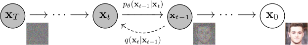
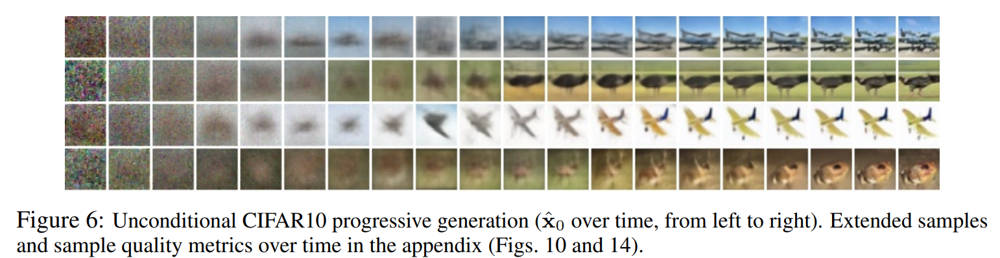
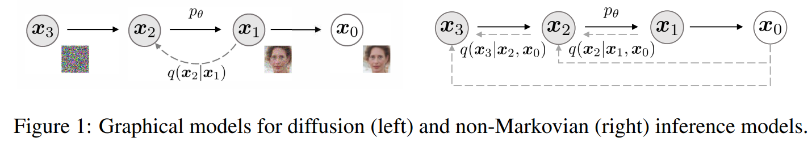

# 1 Denoising Diffusion Probabilistic Models

论文地址：[Denoising Diffusion Probabilistic Models](https://arxiv.org/abs/2006.11239)

* Diffusion Probabilistic Model 是一个可参数化的马尔可夫链，通过变分推理训练，在有限时间内生成与数据匹配的样本。
* Transitions of this chain are learned to reverse a diffusion process, which is a Markov chain that gradually adds noise to the data in the opposite direction of sampling until signal is destroyed. 
* 当 diffusion 由少量高斯噪声组成时，将 sampling chain transitions 设置为条件高斯分布，从而允许实现特别简单的神经网络的参数化。

## 1.1 background

* Diffusion Model：

  * latent variable models 潜变量模型

  * 形式：
    $$
    p_\theta := \int p_\theta (\mathbf{x}_{0:T}) \text{d} \mathbf{x}_{1:T}
    $$
    $\mathbf{x}_t, ..., \mathbf{x}_T$ 与 数据 $\mathbf{x}_0 \sim q(\mathbf{x}_0)$ 具有相同维度的潜在变量。

    * $p_\theta(\mathbf{x}_0)$ 为边缘概率分布。

    * $p_\theta(\mathbf{x}_{0:T})$ 是联合概率分布，表示从噪声 $\mathbf{x}_T$ 开始经过一系列步骤生成 $\mathbf{x}_0$ 的整个过程的概率。

      这个过程被建模成马尔可夫链，每个时刻 $\mathbf{x}_t$ 的生成只依赖于上一个时刻 $\mathbf{x}_{t+1}$ .

    * 积分是对 $\mathbf{x}_{1:T}$ 进行积分，消除中间变量，得到只关于 $\mathbf{x}_0$ 的边缘分布 $p_\theta(\mathbf{x}_0)$ 。

      通过积分消除之间变量，就得到从噪声 $\mathbf{x}_T$ 到 目标数据 $\mathbf{x}_0$ 这一个过程生成数据 $\mathbf{x}_0$ 的概率分布。

* 联合分布 $p_\theta(\mathbf{x}_{0:T})$ ，称为 reverse process，反向过程。

  定义为一个马尔可夫链，从 $p(\mathbf{x}_T) = \mathcal{N}(\mathbf{x}_T; 0,\mathbf{I})$ 开始：
  $$
  p_\theta(\mathbf{x}_{0:T}):= p(\mathbf{x}_T)\prod_{t=1}^T p_\theta(\mathbf{x}_{t-1}|\mathbf{x}_t), p_\theta(\mathbf{x}_{t-1}|\mathbf{x}_t) := \mathcal{N}(\mathbf{x}_{t-1}; \mu_\theta(\mathbf{x}_t, t), \sum_\theta (\mathbf{x}_t, t))
  $$

* 近似后验分布 $q(\mathbf{x}_{1:T}|\mathbf{x}_0)$，称为 正向过程 forward process 或 diffusion process。

  定义为一个马尔可夫链，根据方差调度 $\beta_1, ..., \beta_T$ 逐步向数据添加高斯噪声。
  $$
  q(\mathbf{x}_{1:T}|\mathbf{x}_0) := \prod^T_{t=1}q(\mathbf{x}_t|\mathbf{x}_{t-1}),q(\mathbf{x}_t|\mathbf{x}_{t-1}):= \mathcal{N}(\mathbf{x}_t;\sqrt{1-\beta_t}\mathbf{x}_{t-1}, \beta_{t}\mathbf{I})
  $$



* 训练是通过优化**负对数似然**的**常规变分下界**来进行的：
  $$
  \mathbb{E}[-\log p_\theta (\mathbf{x}_0)] \leq \mathbb{E}_{q}\bigg[-\log \cfrac{p_\theta(\mathbf{x}_{0:T})}{q(\mathbf{x}_{1:T}|\mathbf{x}_0)}\bigg] = \mathbb{E}_{q}\bigg[-\log p(\mathbf{x}_T)-\sum_{t\geq 1}\log \cfrac{p_\theta(\mathbf{x}_{t-1}|\mathbf{x}_t)}{q(\mathbf{x}_{t}|\mathbf{x}_{t-1})}\bigg] =: L
  $$

* 正向过程的方差 $\beta_t$ 可以通过重参数化来学习，或者作为超参数保持不变。

* 反向过程的表达能力在一定程度上在 $p_\theta(\mathbf{x}_{t-1}|\mathbf{x}_t)$ 中选择高斯条件分布来确保，因为当 $\beta_t$ 较小时，正向和反向过程具有相同的函数形式。

* 正向过程，允许在任意时间步 $t$ 以封闭形式对 $\mathbf{x}_t$ 进行采样：使用记号 $\alpha_t = 1-\beta_t$ 和 $\bar{\alpha}_t := \prod^t_{s=1} \alpha_s$ ，有：
  $$
  q(\mathbf{x}_t|\mathbf{x}_0) = \mathcal{N}(\mathbf{x}_t; \sqrt{\bar{\alpha}_t}\mathbf{x}_0, (1-\bar{\alpha}_t)\mathbf{I})
  $$

* 因此，通过使用随机梯度下降来优化损失函数 $L$ 的随机项，可以实现高效的训练。进一步的改进来自于通过重写 $L$ 来以减少方差
  $$
  \begin{equation}
      \mathbb{E}_q \left[ \underbrace{{D_{KL} \left( q(\mathbf{x}_T | \mathbf{x}_0) \| p(\mathbf{x}_T) \right)}}_{L_T} + \sum_{t > 1} \underbrace{{D_{KL} \left( q(\mathbf{x}_{t-1} | \mathbf{x}_t, \mathbf{x}_0) \| p_\theta (\mathbf{x}_{t-1} | \mathbf{x}_t) \right)}}_{L_{t-1}} - \underbrace{\log p_\theta (\mathbf{x}_0 | \mathbf{x}_1)}_{L_0} \right]
  \end{equation}
  $$
  上述公式利用 **KL散度** 将 $p_{\theta}(\mathbf{x}_{t-1} | \mathbf{x}_t)$ 直接与正向过程的后验分布进行比较，当条件为 $\mathbf{x}_0$ 时，这些分布是易于处理的：
  $$
  q(\mathbf{x}_{t-1} | \mathbf{x}_t, \mathbf{x}_0) = \mathcal{N}(\mathbf{x}_{t-1}; \tilde{\mu}_t(\mathbf{x}_t, \mathbf{x}_0), \tilde{\beta}_t \mathbf{I})
  $$
  其中：
  $$
  \tilde{\mu}_t(\mathbf{x}_t, \mathbf{x}_0) \triangleq \frac{\bar{\alpha}_{t-1}}{\bar{\alpha}_t} \mathbf{x}_0 + \frac{\alpha_t (1 - \bar{\alpha}_{t-1})}{\bar{\alpha}_t} \mathbf{x}_t,\tilde{\beta}_t \triangleq \frac{1 - \bar{\alpha}_{t-1}}{1 - \bar{\alpha}_t} \beta_t.
  $$
  
  > KL divergence，KL 散度：$D_{KL}(P\| Q) = \sum_i P(i) \cfrac{P(i)}{Q(i)}$ ，计算 P 和 Q 之间的差异。

## 1.2 Diffusion models and denoising autoencoders

* 忽略正向过程方差 $\beta_t$ 是可学习这一事实，通过重新参数化固定它们为常熟。在 DM 的实现中，近似后验分布 $q$ 没有可学习的参数，所以 $L_T$ 在训练期间是一个常数，可以忽略。

* **训练过程**：

  1. repeat 重复

  2. 采样一张 图像$x_0$，$x_0$ 代表干净的图

  3. 从一个较大数的范围内 采样 一个数字 $t$​ 出来

  4. $\epsilon$ 是从正态分布中采样：$\epsilon\sim \mathcal{N}(0,\mathbf{I})$ 

  5. 采取梯度下降法 $ \nabla_{\theta} \Vert \epsilon - \epsilon_{\theta}(\sqrt{\bar{\alpha}_t}x_0+\sqrt{1-\bar{\alpha}_t}\epsilon, t)\Vert$ 

     * $\epsilon$ ：target noise

     * $\epsilon_{\theta}$：noise predictor

     * t 越大，$\bar{\alpha}_t$ 越小，离 $x_0$ 越远，离 target noise $\epsilon$ 越近

* **采样过程**：

  1. 从正态分布 $\mathcal{N}(0,\mathbf{I})$ 采样一个噪声图像 $\mathbf{x}_T$ 
  2. 运行 T 次，t = T, ..., 1 do 
     1. 如果 t>1，则采样一个噪声 $\mathbf{z}\sim \mathcal{N}(0,\mathbf{I})$ ，t=1设置 $\mathbf{z} = \mathbf0$ 
     2. $\mathbf{x}_{t-1} = \cfrac{1}{\sqrt{\alpha}_t}\big(\mathbf{x}_t - \cfrac{1-\alpha_t}{\sqrt{1-\bar\alpha_t}}\epsilon_{\theta}(\mathbf{x}_t, t)\big) + \sigma_t \mathbf{z}$ 
        * $\mathbf{x}_t$ 是上一个步骤产生的图像
        * $\epsilon_{\theta}$ 是 noise predicter 输出的 noise

* 假设图像数据由整数组成，范围为 {0, 1, ..., 255} 并线性缩放到 [-1, 1]。

  确保神经网络 反向过程 在从标准正态先验 $p(\mathbf{x}_T)$ 开始的一致缩放输入上运行。

  为了获得离散对数似然值，将反向过程的最后一项设置为独立的离散解码器，该解码器从高斯分布 $N(\mathbf{x}; \mu_\theta (\mathbf{x}_1, 1), \sigma^2_1 I)$ 导出：
  $$
  \begin{aligned}
  p_\theta (\mathbf{x}_0 | \mathbf{x}_1) = \prod_{i=1}^{D} \int_{\delta_- (x_0^i)}^{\delta_+ (x_0^i)} N(x; \mu_\theta^i (\mathbf{x}_1, 1), \sigma^2_1) \mathrm{d}x \\
  \delta_+(x) = \begin{cases} \infty & \text{if } x = 1 \\ x + \frac{1}{255} & \text{if } x < 1 \end{cases} \quad \delta_-(x) = \begin{cases} -\infty & \text{if } x = -1 \\ x - \frac{1}{255} & \text{if } x > -1 \end{cases}
  \end{aligned}
  $$
  其中 $D$ 是数据维度，$i$ 上标表示提取一个坐标。

* 有益于样本质量（并且更容易实施）的是，在以下变分界的变体上进行训练：
  $$
  L_{\text{simple}}(\theta) := \mathbb{E}_{t,x_0,\epsilon}\left[\|\epsilon-\epsilon_\theta(\sqrt{\bar{\alpha}_t}\mathbf{x}_0+\sqrt{1-\bar{\alpha}_t}\epsilon,t)\|^2\right]
  $$

## 1.3 Experiments

* 相比于固定方差来说，学习反向过程的方差导致训练不稳定且样本质量较差。

* 图像生成过程：图像生成时，会首先生成大尺度特征，再逐步生成图像细节。如下图所示，最初是随机噪声（最左侧），随着时间步长的增加，逐渐看到模糊的整体图像，最后细节越来越清晰。

  

* 插值 (Interpolation)：可以在潜空间中对 源图像 $\mathbf{x}_0, \mathbf{x}_0' \sim q(\mathbf{x}_0)$ 进行插值，使用 $q$ 作为随机编码器，得到 $\mathbf{x}_t, \mathbf{x}_t' \sim q(\mathbf{x}_t | \mathbf{x}_0)$，然后将线性插值的潜变量 $\bar{\mathbf{x}}_t = (1 - \lambda) \mathbf{x}_0 + \lambda \mathbf{x}_0'$ 通过反向过程解码回图像空间，即 $\bar{\mathbf{x}}_0 \sim p(\mathbf{x}_0 | \bar{\mathbf{x}}_t)$。实际上，我们<u>使用反向过程来去除线性插值后的源图像中被污染的部分</u>。我们将噪声固定在不同的$\lambda$ 值上，以使得 $\mathbf{x}_t$ 和 $\mathbf{x}_t'$ 保持不变。反向过程生成了高质量的重建图像，并实现了平滑的插值，在插值过程中变化了诸如姿势、肤色、发型、表情和背景等属性，但不会改变是否佩戴眼镜。


## 1.4 DDPM U-Net

参考：https://zhuanlan.zhihu.com/p/655568910 和 https://nn.labml.ai/diffusion/ddpm/unet.html

* DDPM U-Net 的输入是 某个时刻的图片 $x_t$ 和 用于表示该时刻的 $t$ 向量，输出是对 $t$ 时刻的噪声预测。
* DDPM U-Net 是典型的 Encoder-Decoder 结构。在 Encoder 中，压缩图片，逐步提取图片特征，在 Decoder 中，逐步还原图片大小。由于压缩图片会导致丢失信息，因此做 decoder 还原时，会拼接 encoder 层（相同层次）输出的特征图，以减少信息损失。

### 1.4.1 基本部件

* 激活函数：Swish 激活函数：$x \cdot \sigma(x)$ 

* **ResidualBlock**：残差块。块的构成：卷积层（GroupNorm → Swish 激活层 → Conv2d 卷积），时间嵌入层 time_emb（单个全连接层）：

  前向过程：conv(x) + time_emb(t) →  h,  conv(h) + shortcut(x) → output （conv -> 加入时间向量 -> conv -> 跳跃链接）

* **AttentionBlock**：和 transformer 的 multi_head attention 相似。基本构成：norm (GroupNorm), projection (单个全连接层), output层(单个全连接层)

  前向过程：x (重塑形状后) → 先把 x 映射到 n_heads * k_dims * 3 的维度空间上，再分解映射到 q, k, v 上  → attn = q·k + 归一化 → res = attn ·v， 重塑形状 → output(res) +x → 恢复原来的形状输出。

  引入 attention可以使得 网络学习输入图像中像素之间的关系。

* **DownBlock**：编码器，DownBlock = ResidualBlock + AttentionBlock

* **MiddleBlock**：位于 U-Net 最底层。MiddleBlock = ResidualBlock + AttentionBlock + ResidualBlock 

* **UpBlock**：解码器，UpBlock = ResidualBlock + AttentionBlock

* **Upsample**：上采样，通过反卷积 `ConvTranspose2d` 实现。

* **Downsample**：下采样，通过单个卷积层实现。

* **Time-Embedding** ：将把整型t，以Transformer位置编码的方式，映射成向量：
  $$
  PE_{t,i}^{(1)} = \sin(\cfrac{t}{10000^{\frac{i}{d-1}}})\\
  PE_{t,i}^{(2)} = \cos(\cfrac{t}{10000^{\frac{i}{d-1}}})
  $$
  $d$ 是 输出维度的 1/8。


### 1.4.2 U-Net的总体框架

前向过程：

```python
def forward(self, x: torch.Tensor, t: torch.Tensor):
    t= self.time_emb(t)    # 时间向量
    x= self.image_proj(x)  # 图像映射
    # Encoder
    h= [x]
    for m in self.down:
        x= m(x, t)   # 每次通过 m(x,t) 处理，生成新的 feature map x
        # m = DownBlock
        # m = Downsample
        h.append(x)  # h 列表保存了每一层的输出，供解码器使用
    # Middle
    x= self.middle(x, t)
    # Decoder
    for m in self.up:
        if isinstance(m, Upsample):  # 上采样操作
            x= m(x, t)
            # m(x,t) = Upsample
        else:
            s= h.pop()  # 取出相同层的编码器的输出 s
            x= torch.cat((x, s), dim= 1)  # 拼接
            x= m(x, t)  # 经过 m(x,t) 得到输出用于更上一层的模型
            # m = UpBlock

    return self.final(self.act(self.norm(x)))
```


# 2 Denoising Diffusion Implicit Models

论文地址：[Denoising Diffusion Implicit Models](https://arxiv.org/abs/2010.02502)

DDPM，需要模拟马尔可夫链的许多步骤才能生成样本。DDIM中，使用一类非马尔可夫扩散过程来泛化 DDPM，这些过程可以走向相同的训练目标。这些非马尔可夫过程可以对应于确定性的生成过程，从而生成能更快地生成高质量样本的隐式模型。DDIM 是隐式概率模型，并且与 DDPM 密切相关，因为它们使用相同的目标函数进行训练。




## 2.1 Background

给定来自数据分布 $q(x_0)$ 的样本，学习近似于 $q(x_0)$ 且易于采样的模型分布 $p_\theta(x_0)$ 。去噪扩散概率模型 DDPM，是一下形式的潜在变量模型：
$$
p_\theta(x_0) = \int_\theta p_\theta (x_{0:T}) \text{d}x_{1:T},\text{   where } p_\theta(x_{0:T}) :=  p_\theta(x_T)\prod^T_{t=1} p_\theta^{(t)}(x_{t-1}|x_t)
$$
其中，$x_1, ..., x_T$ 是与 $x_0$ 位于同一样本空间中的潜在变量 $\mathcal{X}$ 。参数 $\theta$ 是通过最大化变分下限来学习拟合数据分布 $q(x_0)$ 的：
$$
\max_\theta \mathbb{E}_{q(x_0)}[\log p_\theta (x_0)] \leqslant \max_\theta \mathbb{E}_{q(x_0, x_1, ..., x_T)} [\log p_\theta(x_{0:T}) - \log q(x_{1:T}|x_0)]
$$
其中，$q(x_{1:T}|x_0)$ 是潜在变量的一些推理分布。DDPM 通过固定（而非可训练）推理程序 $q(x_{1:T}|x_0)$ 来学习的。
$$
q(x_{1:T} | x_0) := \prod_{t=1}^{T} q(x_t | x_{t-1}), \text{ where } q(x_t | x_{t-1}) := \mathcal{N}\left(\sqrt{\frac{\alpha_t}{\alpha_{t-1}}}x_{t-1}, \left(1 - \frac{\alpha_t}{\alpha_{t-1}}\right)I\right)
$$
由于采样过程（从 $x_0$ 到 $x_T$ ）具有自回归性质，因此这被称为前向过程。将隐变量模型 $p_\theta(x_{0:T})$ 称为生成过程，它是从 $x_T$ 到 $x_0$ 采样的马尔可夫链。前向过程的一个特殊的性质是：
$$
q(x_t|x_0) := \int q(x_{1:t}|x_0) \text{d}x_{1:(t-1)} = \mathcal{N}(x_t; \sqrt{\alpha_t}x_0, (1-\alpha_t)I)
$$
$x_t$ 表示为 $x_0$ 和 噪声变量 $\epsilon$ 的线性组合：
$$
x_t = \sqrt{\alpha_t}x_0 + \sqrt{1-\alpha_t} \epsilon,\text{  where }\epsilon \sim \mathcal{N}(0, \mathbf{I})
$$
训练目标：
$$
L_{\gamma}(\epsilon_\theta) := \sum_{t=1}^{T} \gamma_t \mathbb{E}_{x_0 \sim q(x_0), \epsilon_t \sim \mathcal{N}(\boldsymbol{0}, \boldsymbol{I})} \left[ \| \epsilon_\theta^{(t)} (\sqrt{\alpha_t} x_0 + \sqrt{1 - \alpha_t} \epsilon_t) - \epsilon_t \|_2^2 \right]
$$


## 2.2 Variational Inference For Non-Markovian Forward Processes

非马尔可夫前向过程的变分推断

### 2.2.1 非马尔可夫前向过程

考虑一个推理分布系列 $\mathcal{Q}$ ，由实数向量 $\sigma \in \mathbb{R}^T_{\geq 0}$ 索引：
$$
q_\sigma (x_{1:T}|x_0) = q_\sigma (x_T|x_0)\prod_{t=2}^T q_\sigma(x_{t-1}|x_t, x0)
$$
$q(x_{t-1}|x_t, x_0)$ 意味着给定 $x_0$ 和 $x_t$ 生成 $x_{t-1}$ 的分布。

$q(x_T|x_0) = \mathcal{N}(\sqrt{\alpha_T}x_0, (1-\alpha_T)\mathbf{I})$ ，因此有 $x_t = \sqrt{\alpha_t}x_0 + \sqrt{1-\alpha_t} \epsilon_t,\text{  where }\epsilon_t \sim \mathcal{N}(0, \mathbf{I})$ 

正态分布的性质：$\mathcal{N}(0, \delta_1^2) + \mathcal{N}(0, \sigma_2^2)  = \mathcal{N}(0, \sigma_1^2 + \sigma_2^2)$ 
$$
\sqrt{1-\alpha_{t-1} - \sigma_t^2} \epsilon_t \sim N(0, 1-\alpha_{t-1} - \sigma_t^2) \\
\sigma_t \epsilon \sim \mathcal{N}(0, \sigma_t^2) \\
\sqrt{1-\alpha_{t-1}}\epsilon_{t-1} \sim \mathcal{N}(0, 1-\alpha_{t-1})
$$
同时有 $\epsilon_t = \cfrac{x_t - \sqrt{\alpha_t}x_0}{\sqrt{1-\alpha_t}}$

所以有：
$$
\begin{aligned}
x_{t-1} & = \sqrt{\alpha_{t-1}}x_0 + \sqrt{1-\alpha_{t-1}} \epsilon_{t-1}\\
& = \sqrt{\alpha_{t-1}}x_0 + \sqrt{1-\alpha_{t-1} - \sigma_t^2} \epsilon_{t} + \sigma_t \epsilon \\
& = \sqrt{\alpha_{t-1}}x_0 + \sqrt{1-\alpha_{t-1} - \sigma_t^2} \cfrac{x_t - \sqrt{\alpha_t}x_0}{\sqrt{1-\alpha_t}} + \sigma_t \epsilon 
\end{aligned}
$$
因此 $q_\sigma(x_{t-1}|x_t, x_0) = \mathcal{N}(\sqrt{\alpha_{t-1}}x_0 + \sqrt{1-\alpha_{t-1} - \sigma_t^2} \cfrac{x_t - \sqrt{\alpha_t}x_0}{\sqrt{1-\alpha_t}}, \sigma_t^2\mathbf{I})$ 

前向过程可以从贝叶斯公式得出：
$$
q_\sigma(x_t|x_{t-1}, x_0) = \cfrac{q_\sigma (x_{t-1}|x_t, x_0)q_\sigma(x_t|x_0)}{q_\sigma(x_{t-1}|x_0)}
$$
正向过程不再是马尔可夫过程，因为每个 $x_t$ 都可能依赖于 $x_{t-1}$ 和 $x_0$ 。


### 2.2.2 生成过程和统一变分推理目标

定义一个可训练的**生成过程** $p_\theta(x_{0:T})$ ，其中每个 $p_\theta^{(t)}(x_{t-1}|x_t)$ 都利用了 $q_\sigma(x_{t-1}|x_t, x_0)$ 的知识。直观地说：给定一个噪声的观测值 $x_t$ ，我们首先对相应的 $x_0$ 做出预测，然后使用它通过我们定义的反向条件分布 $q_\sigma(x_{t-1}|x_t, x_0)$ 获得样本 $x_{t-1}$ 。

对于 $x_0\sim q(x_0)$ 和 $\epsilon_t \sim \mathcal{N}(\mathbf{0},\mathbf{I})$，$x_t$ 可以使用 $x_t = \sqrt{\alpha_t}x_0 + \sqrt{1-\alpha_t} \epsilon_t,\text{  where }\epsilon_t \sim \mathcal{N}(0, \mathbf{I})$ 得到。然后，模型 $\epsilon_\theta^{(t)}(x_t)$ 尝试根据 $x_t$ 预测 $\epsilon_t$ ，从而根据公式得到 $x_0$。$x_t$ 对 $x_0$ 的预测：
$$
f_\theta^{(t)}(x_t):=\cfrac{x_t - \sqrt{1-\alpha_t}\cdot \epsilon_\theta^{(t)}(x_t)}{\sqrt{\alpha_t}}
$$
可以用固定的先验分布 $p_\theta(x_T) = \mathcal{N}(\mathbf{0},\mathbf{I})$ 和 
$$
p_\theta^{(t)}(x_{t-1}|x_t) = 
\begin{cases}
\mathcal{N}(f_\theta^{(1)}(x_1), \sigma_1^2 \mathbf{I}) & \text{if } t=1\\
q_\sigma(x_{t-1}|x_t, f_\theta^{(t)}(x_t)) & \text{otherwise}
\end{cases}
$$
定义生成过程（反向过程）。$q_\sigma(x_{t-1}|x_t, f_\theta^{(t)}(x_t))$ 由 

$ q_\sigma(x_{t-1}|x_t, x_0) = \mathcal{N}(\sqrt{\alpha_{t-1}}x_0 + \sqrt{1-\alpha_{t-1} - \sigma_t^2} \cfrac{x_t - \sqrt{\alpha_t}x_0}{\sqrt{1-\alpha_t}}, \sigma_t^2\mathbf{I}) $ 

定义，其中 $x_0$ 由 $f_\theta^{(t)}(x_t)$ 代替。对于 $t=1$ 的情况，添加一些高斯噪声（具有协方差 $\sigma_1^2 \mathbf{I}$），以确保生成过程在任何地方都受到支持。

由于：
$$
q_\sigma (x_{1:T}|x_0) = q_\sigma (x_T|x_0)\prod_{t=2}^T q_\sigma(x_{t-1}|x_t, x0)\\
p_\theta(x_{0:T}) :=  p_\theta(x_T)\prod^T_{t=1} p_\theta^{(t)}(x_{t-1}|x_t)
$$
得到变分推理目标：
$$
\begin{aligned}
J_\sigma(\epsilon_\theta) & := \mathbb{E}_{x_{0:T} \sim q_\sigma(x_{0:T})}[\log q_{\sigma}(x_{1:T}|x_0) - \log p_\theta(x_{0:T})]\\
& = \mathbb{E}_{x_{0:T} \sim q_\sigma(x_{0:T})}\bigg[ \log q_\sigma (x_T|x_0) + \sum^T_{t=2}q_\sigma(x_{t-1}|x_t, x_0) - \sum^T_{t=1} \log p_\theta^{(t)}(x_{t-1}|x_t) - \log p_\theta(x_T)
\bigg]
\end{aligned}
$$
根据 $J_\sigma$ 的定义，似乎对于每个 $\sigma$ 的选择都必须训练一个不同的模型，因为它对应于不同的训练变分目标（和不同的生成模型），但是对于某些权重 $\gamma$ ，$J_\sigma$ 等同于 $L_\gamma$ ：

定理1：对于$∀\sigma > \mathbf{0}$，有$∃\gamma \in \mathbb{R}_{>0}^T, C\in \mathbb{R}$，使得 $J_\sigma = L_{\gamma} + C$

变分目标 $L_\gamma$ 的特殊之处在于，如果模型 $\epsilon_\theta^{(t)}(x_t)$ 的参数 $\theta$ 在不同的 $t$ 之间共享，则 $\epsilon_\theta$ 的最优解将不依赖于权重 $\gamma$ （因为全局最优是通过分别最大化总和中的每个项来实现的）。因此使用 $L_\mathbf{1}$ 作为 DDPM 中变分下限的替代目标函数是合理的，同时，$J_\sigma$ 等同于定理1中的某个 $L_\gamma$ ，因此 $J_\sigma$ 的最优解也与 $L_\mathbf{1}$ 的最优解相同。


## 2.3 Sampling From Generalized Generative Processes

基本上可以使用预训练的 DDPM 模型作为新目标的解决方案，并通过更改 $\sigma$ 来专注于找到更适合我们需求的生成样本的生成过程。

### 2.3.1 Denosing Diffusion Implicit Models

由2.2.2 的内容，可以把采样过程定义为：（从样本 $x_t$ 生成 $x_{t-1}$ 的过程）
$$
\begin{aligned}
x_{t-1} & = \sqrt{\alpha_{t-1}}x_0 + \sqrt{1-\alpha_{t-1} - \sigma_t^2} \epsilon_{t} + \sigma_t \epsilon\\
& = \sqrt{\alpha_{t-1}}\underbrace{\bigg(\cfrac{x_t - \sqrt{1-\alpha_t}\cdot \epsilon_\theta^{(t)}(x_t)}{\sqrt{\alpha_t}}\bigg)}_{\text{“predicted } x_0 \text{”}} + \underbrace{\sqrt{1-\alpha_{t-1} - \sigma_t^2} \epsilon_\theta^{(t)}(x_t)}_{\text{“direction pointing to } x_t \text{”}} + \underbrace{\sigma_t \epsilon_t}_{\text{random noise}}
\end{aligned}
$$
其中，$\epsilon_t \sim \mathcal{N}(\mathbf{0},\mathbf{I})$ 是与 $x_t$ 无关的标准高斯噪声，我们定义 $\alpha_0 := 1$ 。$\sigma$ 值的不同选择会导致不同的生成过程，同时使用相同的模型 $\epsilon_\theta$ ，因此无需重新训练模型。当 $\sigma_t = \sqrt{(1-\alpha_{t-1})/(1-\alpha_t)}\sqrt{1-\alpha_t/\alpha_{t-1}}$ 适用于所有 $t$ 时，前向过程变为马尔可夫过程，而生成过程变为 DDPM。

【源代码】通用的降噪过程：

```python
def generalized_steps(x, seq, model, b, **kwargs):
    """
    执行通用扩散步骤，用于逐渐从噪声图像恢复纯净图像。

    Args:
        x: 输入数据，通常为一个含有噪声的图像张量。
        seq: 要执行的扩散步骤序列，可以是自定义的序列。
        model: 用于去噪的模型，该模型可以预测噪声图像中的噪声。
        b: 噪声调度参数，控制着噪声添加到图像中的速率。
        kwargs: 其他可选参数，例如 eta 参数可以控制扩散过程中的噪声水平。

    Returns:
        xs: 列表，包含每个扩散步骤的噪声图像张量。
        x0_preds: 列表，包含每个扩散步骤估计的纯净图像张量。
    """
    with torch.no_grad():
        n = x.size(0)  # 获取批处理大小 (number of elements in the first dimension)
        seq_next = [-1] + list(seq[:-1])  # 下一个时间步序列
        x0_preds = []  # 列表，用于存储估计的纯净图像
        xs = [x]    # 初始放入输入图像
        for i, j in zip(reversed(seq), reversed(seq_next)):
            t = (torch.ones(n) * i).to(x.device)  # 当前时间步
            next_t = (torch.ones(n) * j).to(x.device)  # 下一个时间步
            at = compute_alpha(b, t.long())  # 计算当前时间步的 alpha 值
            at_next = compute_alpha(b, next_t.long())  # 计算下一个时间步的 alpha 值
            xt = xs[-1].to('cuda')
            
            et = model(xt, t)  # 使用模型预测当前噪声图像中的噪声
            x0_t = (xt - et * (1 - at).sqrt()) / at.sqrt()  # 根据预测的噪声和当前时间步的 alpha 值，估计纯净图像 x0
            x0_preds.append(x0_t.to('cpu'))

            c1 = (
                kwargs.get("eta", 0) * ((1 - at / at_next) * (1 - at_next) / (1 - at)).sqrt()
            )
            c2 = ((1 - at_next) - c1 ** 2).sqrt()  # 计算 et 的参数
            xt_next = at_next.sqrt() * x0_t + c1 * torch.randn_like(x) + c2 * et
            xs.append(xt_next.to('cpu'))

    return xs, x0_preds
```


### 2.3.2 Accelerated Generation Processes

在前面的部分中，生成过程被视为逆过程的近似；由于正向过程有 $T$ 个步骤，因此生成过程也被迫采样 $T$ 个步骤。但是，由于只要 $q_\sigma(x_t | x_0)$ 固定，去噪目标 $L_1$ 就不依赖于特定的正向过程，我们也可以考虑长度小于 $T$ 的前向过程，这可以加速相应的生成过程，而无需训练不同的模型。

让我们考虑不在所有潜在变量 $x_{1:T}$ 上定义的前向过程，而是在子集 $\{x_{\tau_1}, \ldots, x_{\tau_S}\}$ 上定义的前向过程，其中 $\tau$ 是长度为 $S$ 的 $[1,\ldots,T]$ 的递增子序列。具体而言，我们定义 $x_{\tau_1}, \ldots, x_{\tau_S}$ 上的顺序前向过程，使得 $q(x_{\tau_i} | x_0) = N(\sqrt{\alpha_{\tau_i}} x_0, (1 - \alpha_{\tau_i}) I)$ 与“边缘”相匹配。生成过程现在根据 reversed($\tau$) 对潜在变量进行采样，我们将此称为（采样）轨迹。当采样轨迹的长度远小于 $T$ 时，由于采样过程的迭代性质，我们可能会显著提高计算效率。

使用与第3节类似的论据，我们可以证明使用 $L_1$ 目标训练的模型是合理的，因此训练中不需要进行任何更改。我们表明，只需对 采样过程 中的更新进行轻微更改即可获得新的、更快的生成过程，这适用于 DDPM、DDIM 以及2.2.2中所有生成过程。


