## Diffusion Model 是如何制作的？

* 生成图片的第一步： 生成 一个都是杂讯的图片，生成图片的大小和目标图片大小一致。
* 然后进行 denoise，就是过滤掉先前图片中的部分杂讯
* 不断进行 denoise，最后得到一张清晰的图片
* 每一步 denoise 都有一个编号，越之后的步骤的 denoise 的编号越小

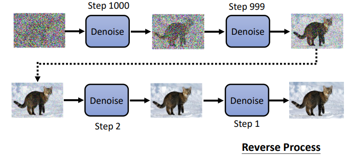

从杂讯到图片的过程称为 reverse process。

> 跟雕塑一样

denoise 的模型，除了需要输入一张图片之外，还要一个代表当前图片 noise 的程度的输入。

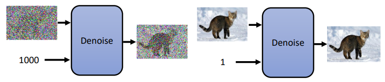

## Denoise 模组内部实际做的事情

denoise 模组内部有一个 noise predicter，预测图片中的杂讯长什么样，需要输入一张图片和图片的 noise 程度，然后输出一张输入图片的杂讯，减去输入图片，达到 denoise 的效果

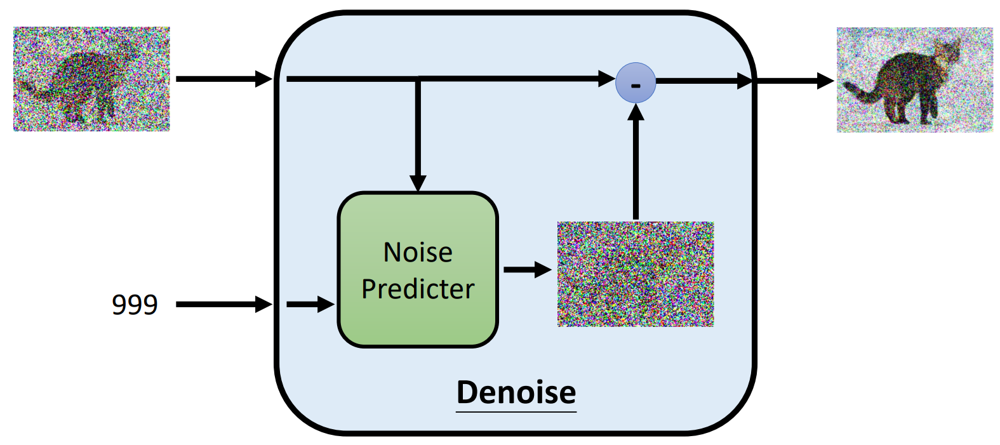

> 直接产生一张更清晰的图片比产生一种 noise 图片更难，所以现在大部分模型都会选择先产生一张 noise 的图片

## 如何训练 noise predictor?

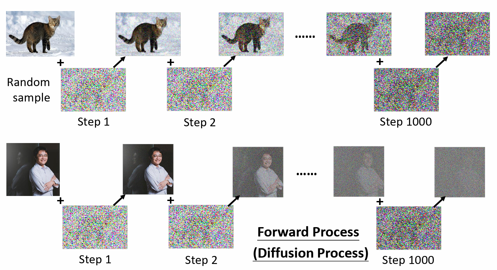

* 对图片不断加 noise

* 把某次加noise后的图片作为输入，对应的 noise 就是它的输出

  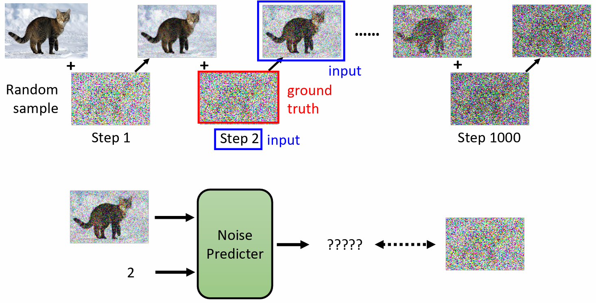

## Text-to-Image

* 训练 文字-图片生成模型，需要文字-图片成对的资料
* 大部分图片来源于 laion（网站?）
* 在训练 denoise model 的时候，加入 文字

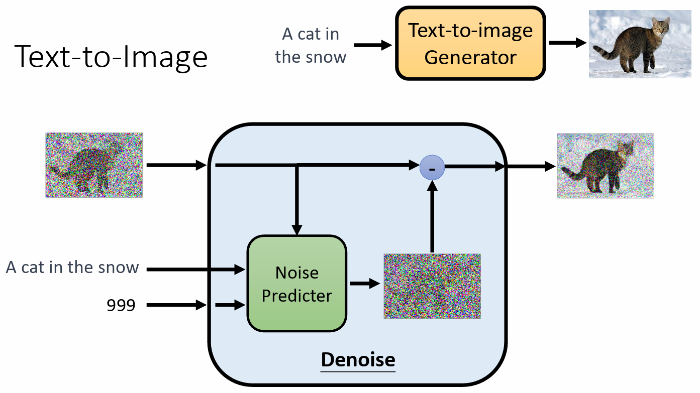

# Stable Diffusion

## Framework

三个组成部分：

* Text Encoder：文字叙述 编程 一个一个的向量
* Generation Model：输入一个杂讯 和 文字的decoder译码结果，然后产生一个中间产物
  * 中间产物，是图片的压缩版本，可以是图片模糊的版本，也可以根本看不出来
* Decoder：图片压缩版本还原成最终图片

三个组成部分是分开训练的，然后把他们组合起来的

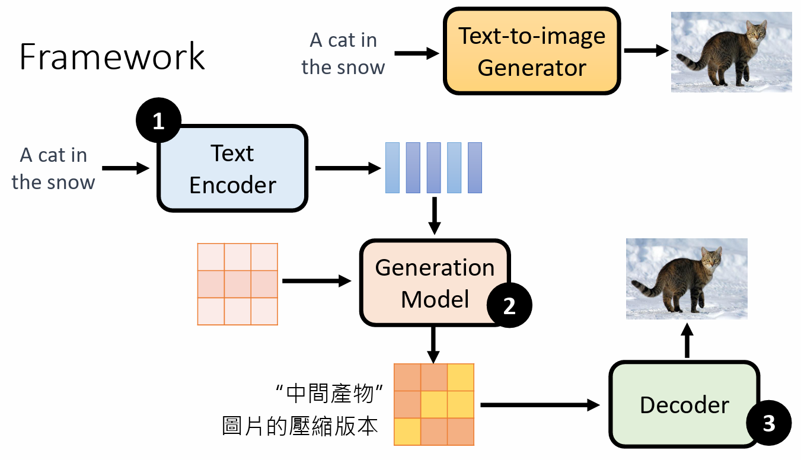

## Stable Diffusion

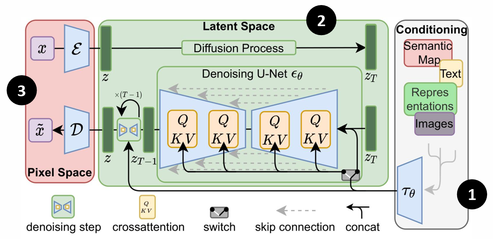

① 文字的译码器 Text Encoder

② 生成模型 generation model

③ 解码器 decoder

## Fréchet Inception Distance(FID)

* 现有一个 CNN model 和 影像分类的模型
* 把真实图片和生成图片输入 CNN 模型中，产生 representation
* 然后比较两组的 representation

* 用来衡量图片生成好坏的模型
* 需要大量的样本支撑
* FID 是把图片当成 Gaussian 高斯图片，然后计算图片之间的距离
* 真实图片和生成图片之间的距离越小越好

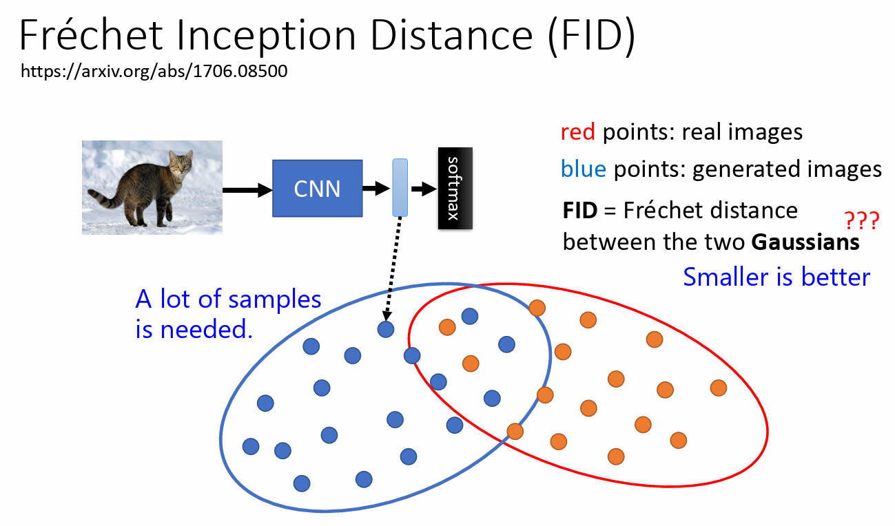

## Decoder

* 训练 decoder 的时候不需要 文字 和 图片 的成对资料

* 如果中间产物为小图，那么 decoder 的训练就是把一张图片的小图作为输入，然后生成大图

* 如果中间产物是 Latent Representation，就是训练一个 latent encoder，让一张图片输入到latent encoder 中，然后把输出的 latent representation 通过 decoder 还原图片，两张图片越接近越好。就这样训练 decoder，训练完成之后就可以把 decoder 单独拿出来去解码 latent representation。

  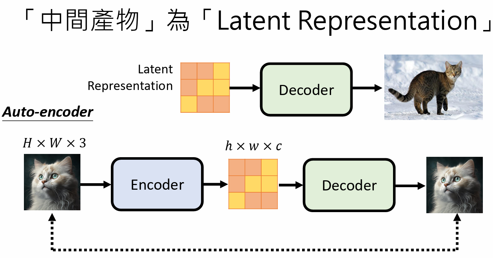

  如果输入图片是 $H\times W\times 3$ （H: height, W:width, 3: RGB），那么输出图片就可以认为是 $h\times w \times c$ ，它可以是人类看不懂的图片

## Generation Model

训练 Noise predicter：

* 用一张图片和一个 encoder 产生一张 latent representation，再用杂讯加在 latent representation，不断加杂讯。
* Noise Predicter的输入：
  * 加入杂讯后的 latent representation
  * step 编号的输入（代表和原来 latent representation 之间差距）
  * 文字的输入（文字是用一排向量表示，也是 latent representation）

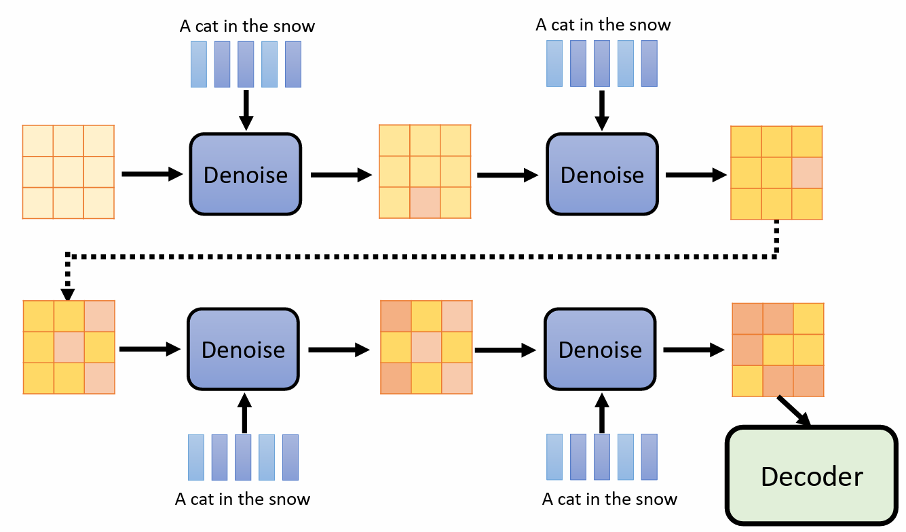

# Diffusion Model 背后的数学原理

## 基本概念

* Forward Process

  就是给一张图片，然后不断添加 noise

* Reverse Process

  给一个全 noise 的 图片，每次 denoise，图片都会一点点浮现出来，到最后呈现的是完整的图片

## VAE vs. Diffusion Model

**VAE**

[photo] => Encoder => Latent Representation => Decoder => [photo]

**Diffusion**

[photo] => Add noise(固定好的，人设计的，不需要训练) => [只有杂讯的image] => denoise => [photo]

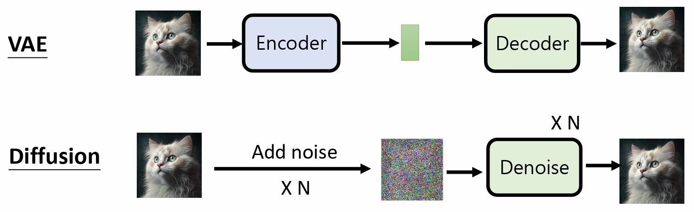

## Denoising Diffusion Probabilistic Models

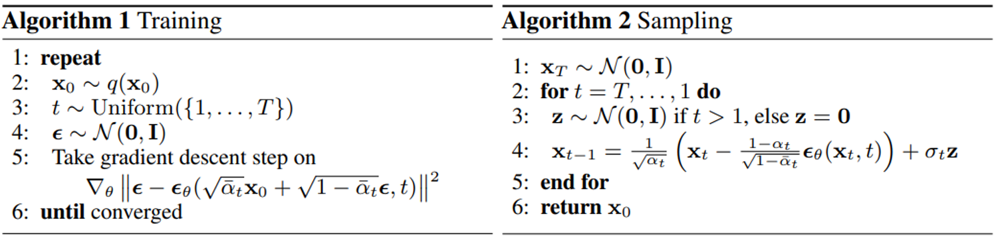

### Training

* 1： repeat 重复
* 2：sample 一张 image $x_0$，$x_0$ 代表干净的图
* 3：从一个较大数的范围内 sample 一个数字 $t$​ 出来
* 4：$\epsilon$​ 是从 normal distribution 中训练出来的，sample a noise
* 5：采取梯度下降法 $ \nabla_{\theta} \Vert \epsilon - \epsilon_{\theta}(\sqrt{\bar{\alpha}_t}x_0+\sqrt{1-\bar{\alpha}_t}\epsilon, t)\Vert$ 
  * $\epsilon$ ：target noise
  * $\epsilon_{\theta}$：noise predictor
  * t 越大，$\bar{\alpha}_t$ 越小，离 $x_0$ 越远，离 target noise $\epsilon$ 越近

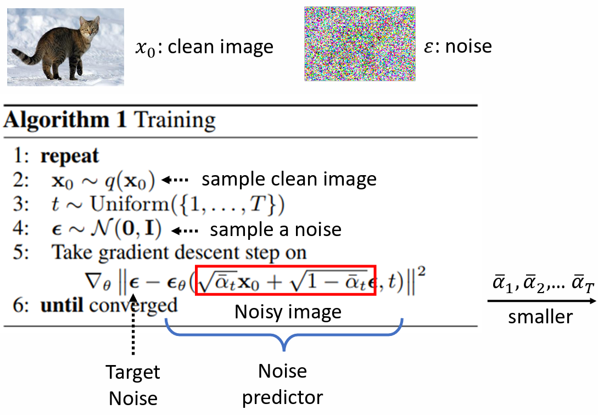

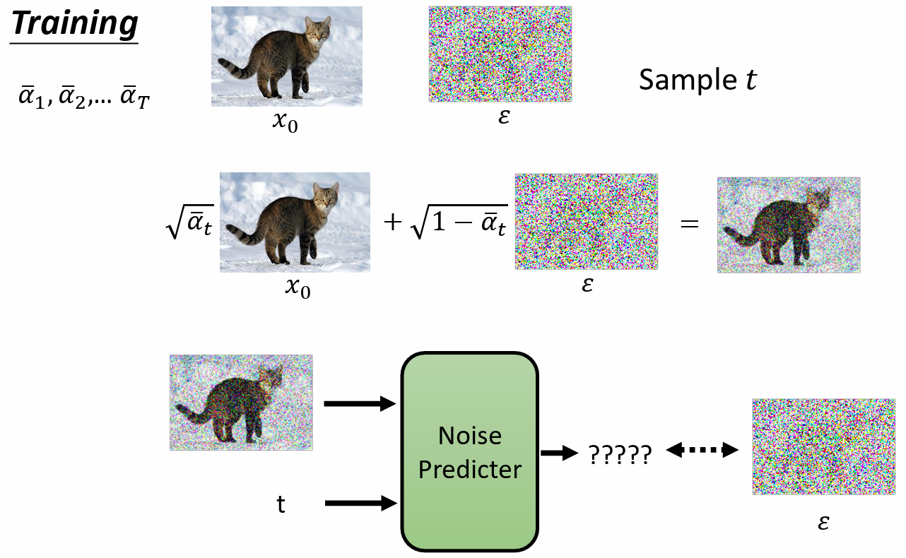

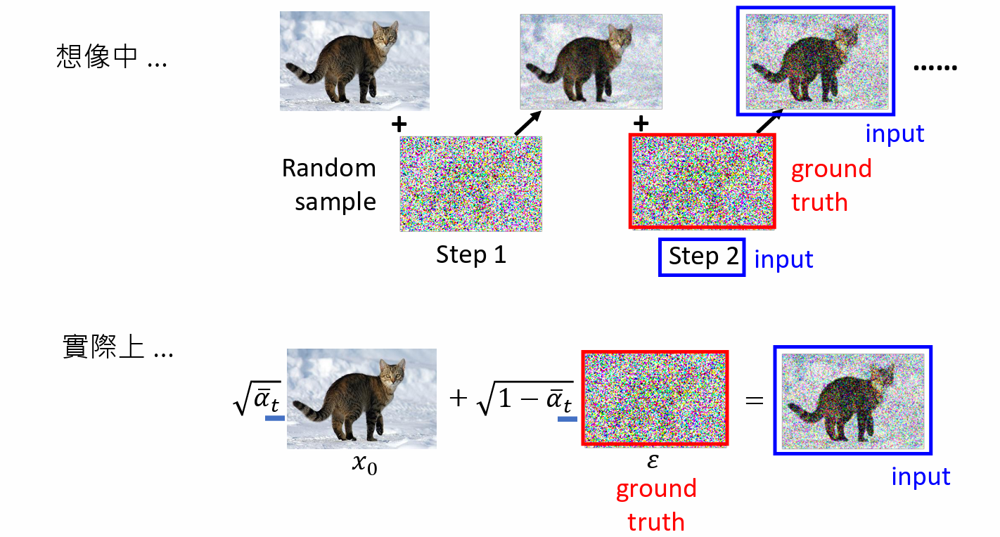

实际上：

* 干净图直接混入一个噪音，通过 $\bar\alpha_t$ 直接决定噪音的大小，得到一个有噪音的图
* 训练的时候，把有噪音的图 和 t 当作输入，直接预测 混入的 噪音

### Sampling

产生图片的过程：

1. 一开始，sample 一个全是 noise 的图 $x_T$ 
2. 运行 T 次，t = T, ..., 1 do 
   1. 再 sample 一次 noise $\boldsymbol{z}$ 
   2. $\boldsymbol{x}_{t-1} = \cfrac{1}{\sqrt{\alpha}_t}\big(\boldsymbol{x}_t - \cfrac{1-\alpha_t}{\sqrt{1-\bar\alpha_t}}\epsilon_{\theta}(\boldsymbol{x}_t, t)\big) + \sigma_t \boldsymbol{z}$​ 
      * x_t 是上一个步骤产生出来的图
      * $\epsilon_{\theta}$ 是 noise predicter 输出的 noise

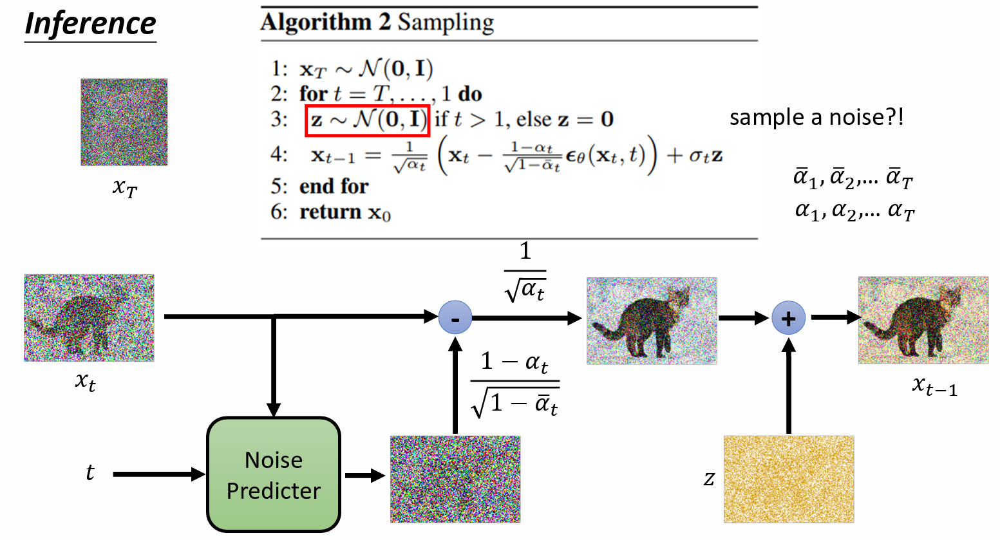

### 影像生成模型本质上的共同目标

* Gaussian distribution：正态分布
* 在 input 的地方有一个简单的 distribution，通常是 Gaussian distribution（正态分布）
* 从 input 的地方 sample 一个东西出来，通常是 vector，然后把这个 vector 放在 network 里面去， $G(z) = x$​ ，z 表示输入，x 就是一张图片
* 每次从 input 的地方 sample 一个 vector 出来，通过 network 就变成一张图片。
* 就算输入是非常简单的 Gaussian distribution ，通过 network 转换，输出会变成一张张图片，这些图片会组合成非常复杂的 distribution。
* 我们期待的事情是，我们找到一个 network，这个 network 应该做到的事情是跟真正的图片的 distribution 和真正图片所形成的 distribution 越接近越好。

 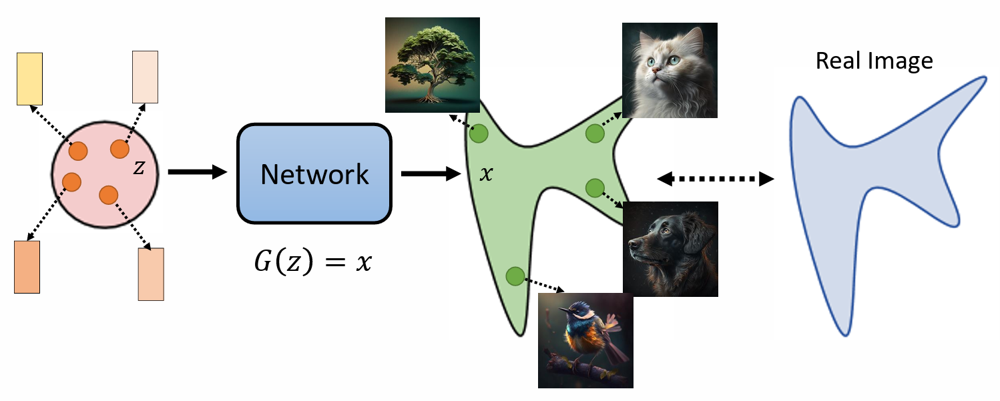

### Maximum Likelihood Estimation

* 什么叫做越接近越好？

  * 大部分利用 Maximum Likelihood Estimation 判断

* 假设 network 的参数为 $\theta$ ，然后根据 $\theta$ 产生的 distribution 表示为 $P_\theta(x)$，真正的 distribution 表示为 $P_{data}(x)$ （Maximum Likelihood Estimation）

  * 首先从 $P_{data}(x)$ 中 sample 一堆 image $\{x^1, x^2, ..., x^m\}$ 出来
    * $P_{data}(x)$​ 是所有可能搜集到的训练资料
  * 假设我们能够计算 $P_\theta(x^i)$
  * 我们要找$\theta$ 是 $\theta^* = arg \max_\theta\prod^m_{i=1}P_\theta(x^i)$​ 

  使得产生 $x^1, x^2, \cdots, x^m$ 这些图片的概率的乘积最大

  Sample $\{x^1, x^2, \dots, x^m\}$ from $P_{data}(x)$ 
  $$
  \begin{align}
  
  \theta^* &= arg\max_\theta\prod^m_{i=1}P_\theta(x^i) = arg\max_\theta\log\prod^m_{i=1}P_\theta(x^i)\\
    &= arg\max_\theta\sum^m_{i=1}\log P_\theta(x^i) \approx arg\max_\theta E_{x\sim P_{data}}[\log P_\theta (x)] \\
  
    &= arg\max_\theta \int_x P_{data}(x)\log P_\theta (x) \mathrm{dx} - \int_x P_{data}(x)\log P_{data} (x)\mathrm{dx}\\
    &= arg\max_\theta \int_x P_{data}(x)\log \cfrac{P_\theta (x)}{P_{data} (x)} \mathrm{dx} \\
    &= arg \min_\theta KL(P_{data}\Vert P_\theta)
  
  \end{align}
  $$
  
  * KL Divergence 计算两个 distribution 的差异程度
  
    $KL(P_{data}\Vert P_\theta)$ ：Difference between $P_{data}$ and $P_\theta$​ 
  
    越大，差异越大
  
  * Maximum Likelihood = Minimize KL Divergence

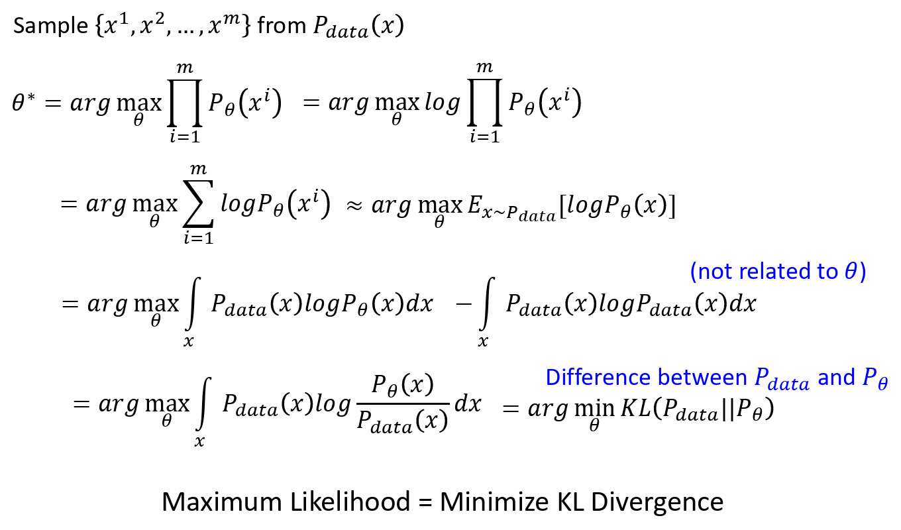

## VAE

### Compute $P_\theta(x)$ 

* z => network => G(z) = x (arg = $\theta$) => 计算 $P_\theta(x)$ 

* VAE 假设 输入 z，输出 G(z)，G(z) 代表 Mean of Gaussian

  所以 $P_\theta(x|z) \propto \exp(-\Vert G(z) - x\Vert_2)$​ 

  * $\Vert G(z) - x\Vert_2$ 表示 $G(z)$ 和输入数据 $x$ 之间的欧氏距离

### Lower bound of $\log P(x)$ 

$$
\begin{align}
\log P_\theta(x) & = \int_z q(z|x) \log P(x) \mathrm{dz}\\
&= \int_z q(z|x) \log\bigg(\cfrac{P(z,x)}{P(z|x)}\bigg)\mathrm{dz} = 
\int_z q(z|x) \log\bigg(\cfrac{P(z,x)}{q(z|x)}\cfrac{q(z|x)}{P(z|x)}\bigg)\mathrm{dz}\\
&= \int_z q(z|x) \log\bigg(\cfrac{P(z,x)}{q(z|x)}\bigg)\mathrm{dz}+\int_z q(z|x) \log\bigg(\cfrac{q(z|x)}{P(z|x)}\bigg)\mathrm{dz}\\
& \geqslant \int_z q(z|x)\log \bigg(\cfrac{P(z,x)}{q(z|x)}\bigg)\mathrm{dz}  = 
\mathrm{E}_{q(z|x)}[\log\bigg(\cfrac{P(z,x)}{q(z|x)}\bigg)]
\end{align}
$$

* 因为logP(x)与z无关，所以可以提出积分外面，那么积分里面的东西，积完以后就是1，右边跟左边一样，所以 $\log P_\theta(x)$ 与 $q(z|x)$​ 无关
* $\int_z q(z|x) \log\bigg(\cfrac{q(z|x)}{P(z|x)}\bigg)\mathrm{dz} = KL(q(z|x)\Vert P(z|x)) \geqslant 0$  
* $\log P_\theta(x)$ 的 lower bound 是 $\mathrm{E}_{q(z|x)}[\log\bigg(\cfrac{P(z,x)}{q(z|x)}\bigg)]$ 
* 如果可以 Maxmize 这个 lower bound，就可以使得 $\log P(x)$​​ 得到一个较大的值
* 在 VAE 中，$\mathrm{E}_{q(z|x)}$ 就是 Encoder

## DDPM

### Compute $\log P_\theta(x)$ 

* 可以把 denoise 的过程想成产生 Gaussian distribution，当输入 $x_t$ 输入 denoise model，就会产生一个 结果 $G(x_t)$​ ，把这个 output 的结果想成 Mean of Gaussian。

* 如果 $x_{t-1}$​ 和 output 的结果正好一模一样，是几率最大的 case，如果差很远，几率就小很多

* $P_\theta(x_0) = \int_{x_1: x_T} P(x_T)P_\theta(x_{T-1}|x_T)...P_\theta(x_{t-1}|x_t)...P_\theta(x_0|x_1) \mathrm{dx_1:x_T}$ 

  对所有可能的 $x_1: x_T$​​ 做积分
  
  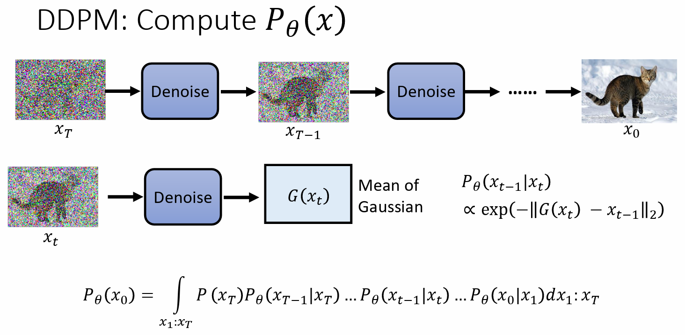

### Lower bound of $\log P(X)$

* VAE: Maximize $\log P_\theta(x)$ => Maximize $\mathrm{E}_{q(z|x)}[\log \bigg(\cfrac{P(x,z)}{q(z|x)}\bigg)]$​

  * $q(z|x)$ 是 Encoder

* DDPM Maximize $\log P_\theta(x_0)$ => Maximize $\mathrm{E}_{q(x_1:x_T|x_0)}[\log \bigg(\cfrac{P(x_0:x_T)}{q(x_1:x_T|x_0)}\bigg)]$​

  * $q(x_1:x_T|x_0)$​ 是 Forward Process（Diffusion Process）

    就是加 noise 的过程

  * $q(x_1:x_T|x_0) = q(x_1|x_0)q(x_2|x_1)...q(x_T|x_{T-1})$ 

计算 $q(x_t|x_{t-1})$ 

* $x_1 = \sqrt{1-\beta_1}x_0 + \sqrt{\beta_1}\ noise1, noise1\sim\mathcal{N}(0,I)$ 

* $x_2 = \sqrt{1-\beta_2}x_1 + \sqrt{\beta_2}\ noise2, noise2\sim\mathcal{N}(0,I)$ 

* noise1 和 noise2 都是从同样的高斯分布 Gaussian distribution 采样 sample 出来，但是这两次 sample 是相互独立

* 可以把 $x_1$ 代入 $x_2$ 的公式中，得到

  $x_2 = \sqrt{1-\beta_2}\sqrt{1-\beta_1}x_0 + \sqrt{1-\beta_2}\sqrt{\beta_1}noise1 + \sqrt{\beta_2}\ noise2$

  $noise1,noise2\sim\mathcal{N}(0,I)$​ 

  $\sqrt{1-\beta_2}\sqrt{\beta_1}noise1 + \sqrt{\beta_2}\ noise2 = \sqrt{1-(1-\beta_2)(1-\beta_1)}noise$

  $noise\sim \mathcal{N}(0, I)$​ 

  所以，$x_2 = \sqrt{1-\beta_2}\sqrt{1-\beta_1}x_0 + \sqrt{1-(1-\beta_2)(1-\beta_1)}noise$​​ 

  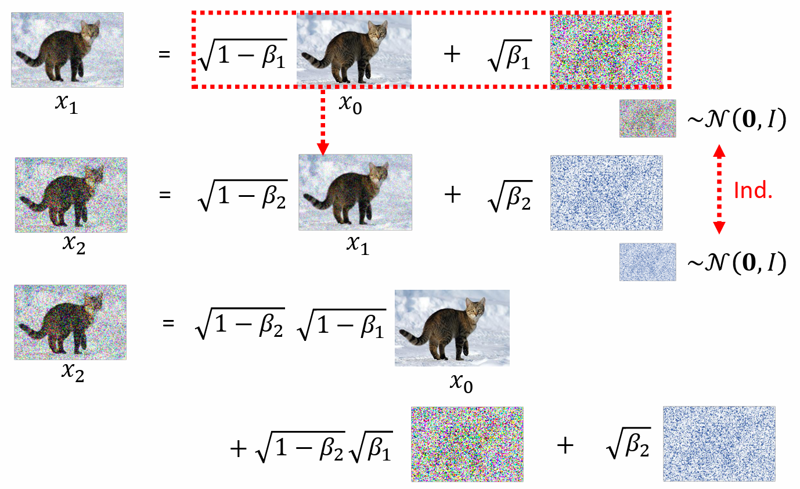

  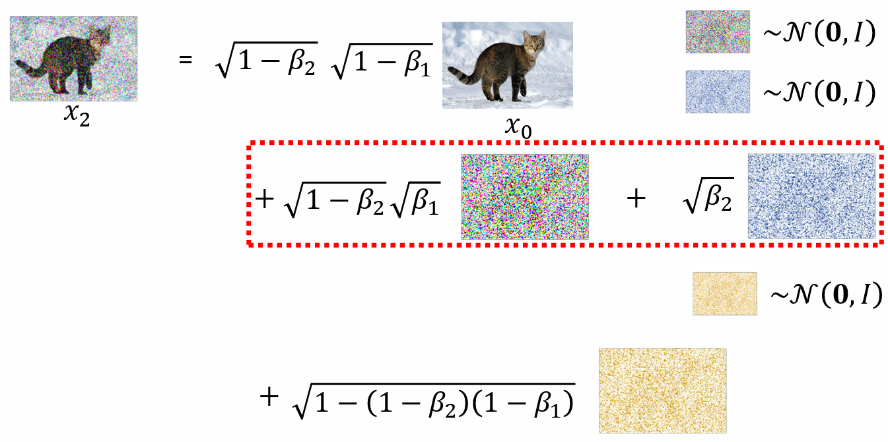

  

* 以此类推，$x_t = \sqrt{1-\beta_1}...\sqrt{1-\beta_t} x_0 + \sqrt{1-(1-\beta_1)...(1-\beta_t)}noise$​ 

* $\alpha_t = 1-\beta_t, \bar\alpha_t = \alpha_1\alpha_2...\alpha_t$ 

  则 $x_t = \sqrt{\bar\alpha_t} x_{t_0} + \sqrt{1-\bar\alpha_t} noise$​ 

Lower bound of $\log P(x)$ ：
$$
E_{q(x_1|x_0)}[\log P(x_0|x_1)]-KL(q(x_T|x_0)\Vert P(x_T))-\sum^T_{t=2}\mathrm{E}_{q(x_t|x_0)}[KL(q(x_{t-1}|x_t,x_0)\Vert P(x_{t-1}|x_t))]
$$

how to maximize $\sum^T_{t=2}\mathrm{E}_{q(x_t|x_0)}[KL(q(x_{t-1}|x_t,x_0)\Vert P(x_{t-1}|x_t))]$ 

* $q(x_{t-1}|x_t, x_0)$ ，从 $x_0$ 做了n次diffusion生成 $x_t$ ，求 $x_{t-1}$ 的分布（中间过程未知）
  $$
  \begin{align}
  q(x_{t-1}|x_t, x_0)  &= \cfrac{q(x_{t-1}, x_t, x_0)}{q(x_t, x_0)}
  = \cfrac{q(x_t|x_{t-1})q(x_{t-1}|x_0)q(x_0)}{q(x_t|x_0)q(x_0)}
  \\&= \cfrac{q(x_t|x_{t-1})q(x_{t-1}|x_0)}{q(x_t|x_0)}
  \end{align}
  $$

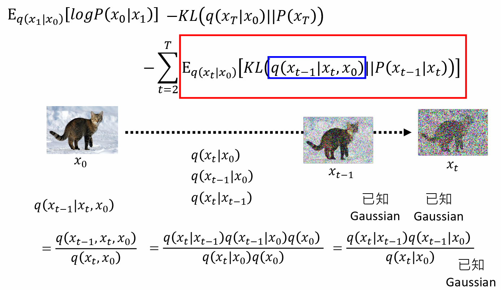

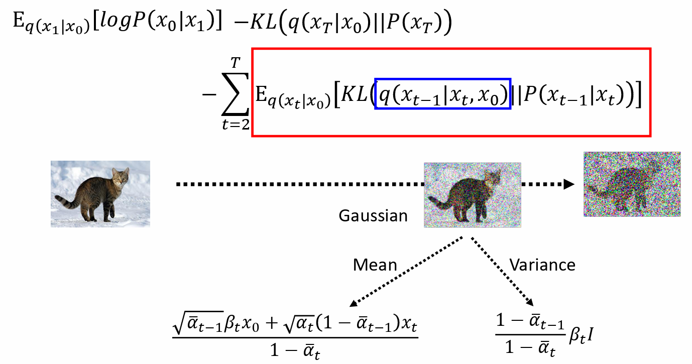

* 我们不需要把 KL 算出来，我们只需要 minimize KL divergence
* $q(x_{t-1}|x_t, x_0)$ 是固定的高斯分布 Gaussian distribution，和 network 没有关系，mean 是固定的，variance 是固定的。
* $P(x_{t-1}|x_t)$ 是 由 network 决定，它的 variance 是固定的，只考虑 mean，mean 取决于 denoise model

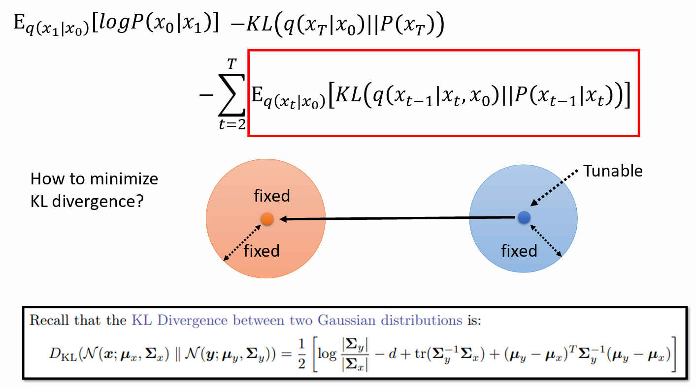

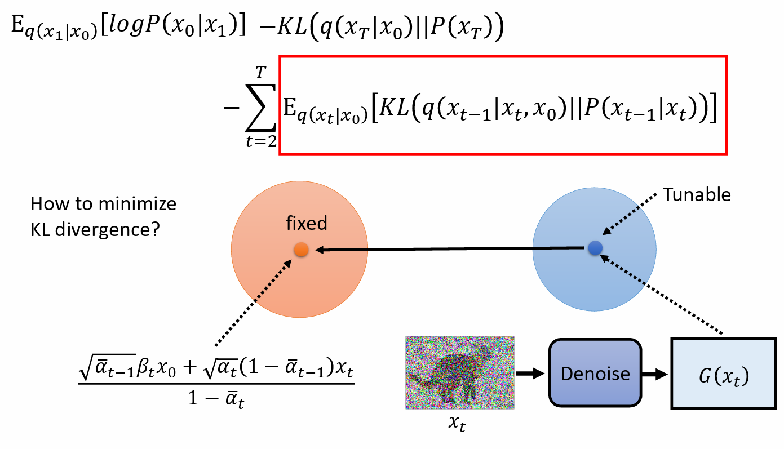

* $x_0$​ 是先给定的

  通过 $x_t = \sqrt{\bar\alpha_t} x_0 + \sqrt{1-\bar\alpha_t}\epsilon$ sample 出 $x_t$​​ 

  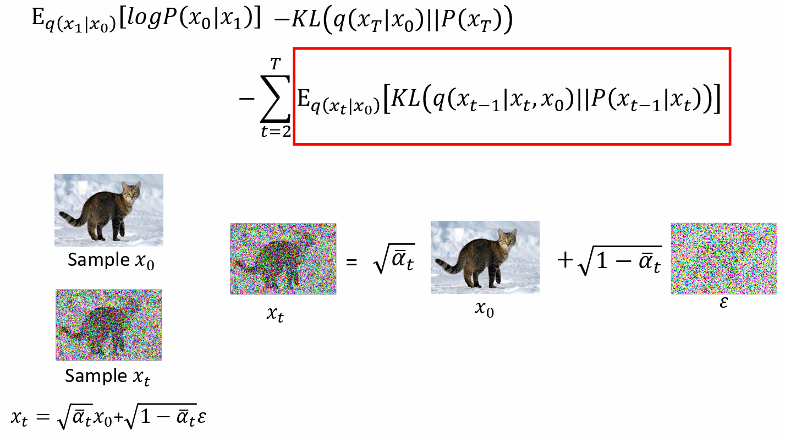

  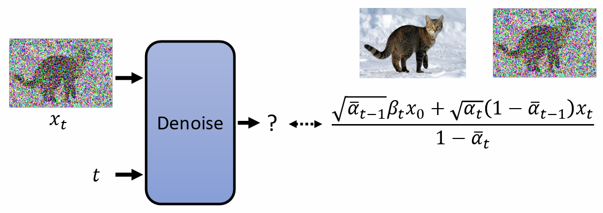

* $x_t = \sqrt{\bar\alpha_t} x_0 + \sqrt{1-\bar\alpha_t}\epsilon$  => $\cfrac{x_t-\sqrt{1-\bar\alpha_t}\epsilon}{\sqrt{\bar\alpha_t}} = x_0$ 

  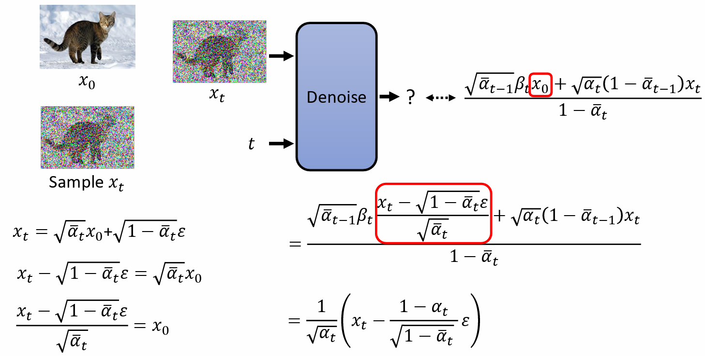

  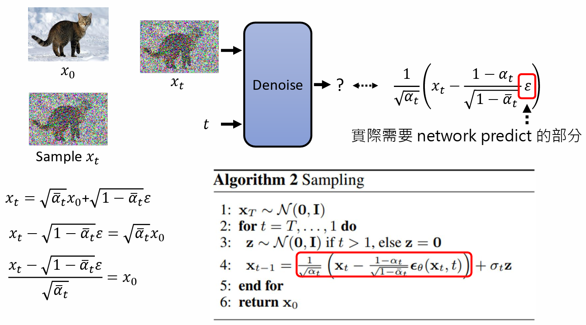

  

## Diffusion Model for Text

* difficulty: 难以在文字这种 description 上加 noise

* Solution：

  * 不在文字上加 noise

    Noise on latent space

    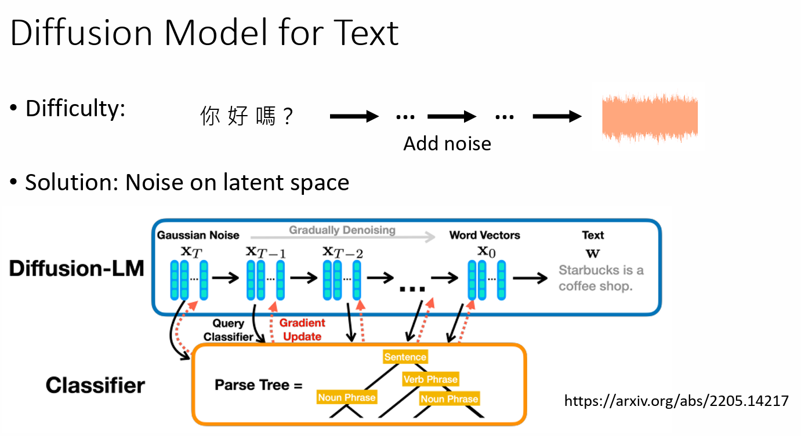

  * 不加 Gaussian noise，加其他种类的 noise

