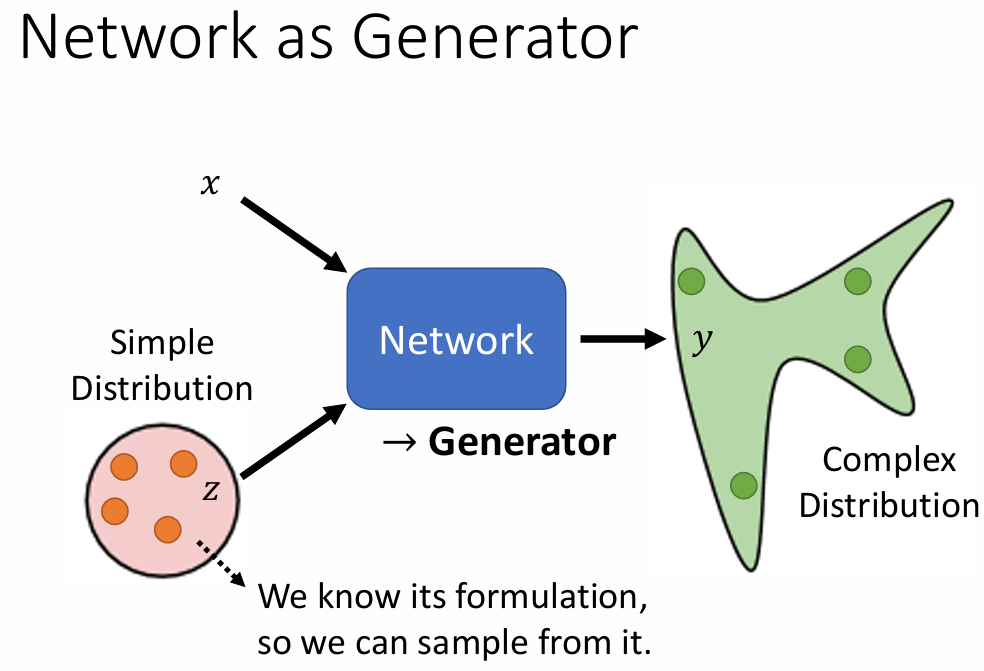
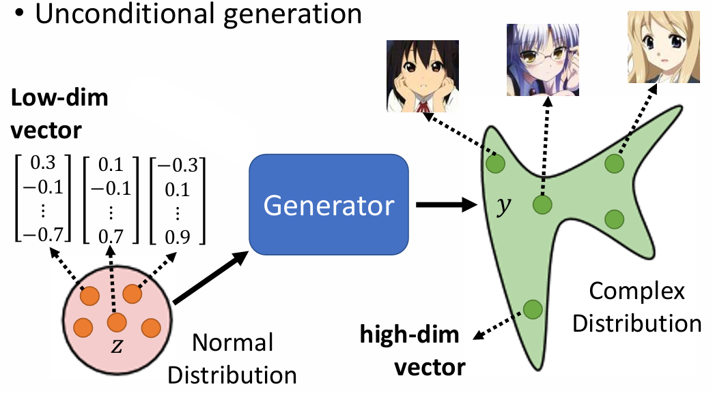
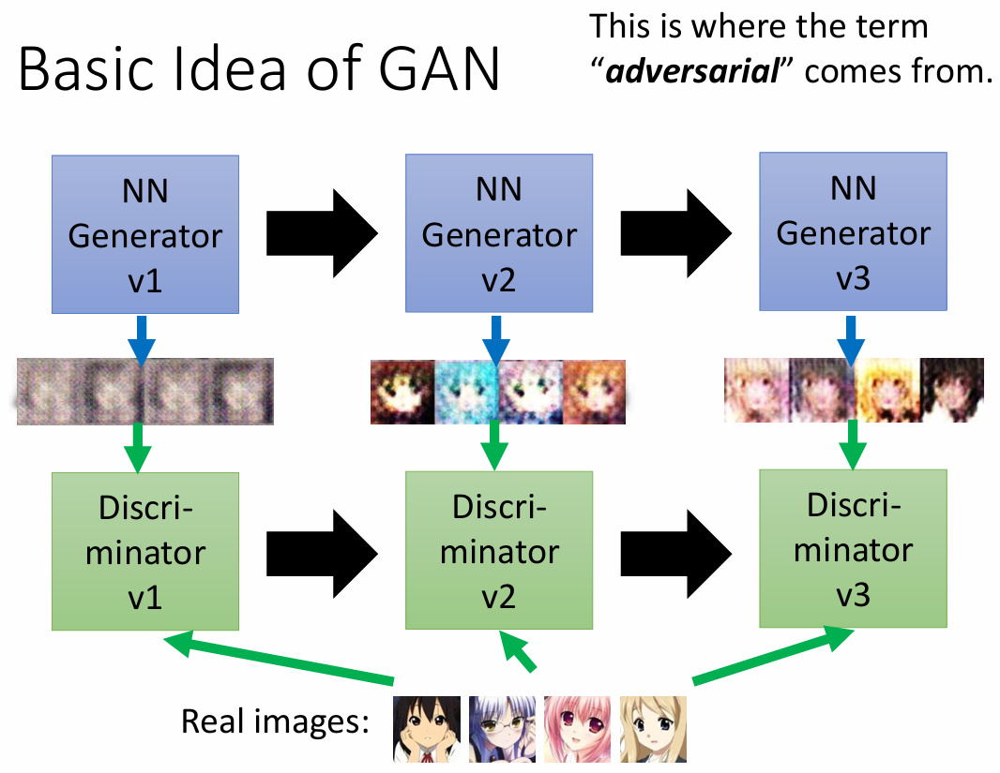
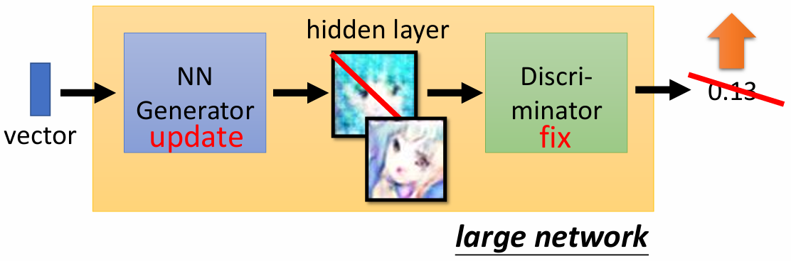
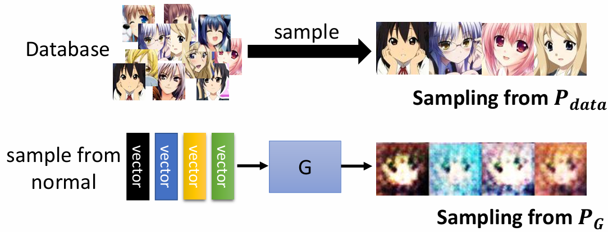
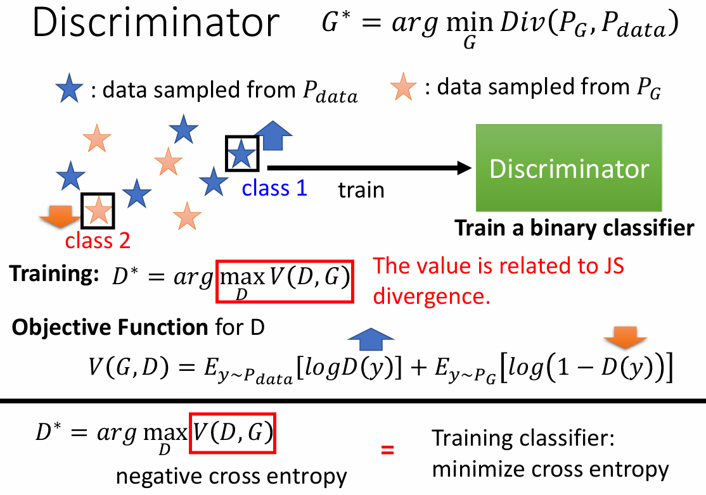
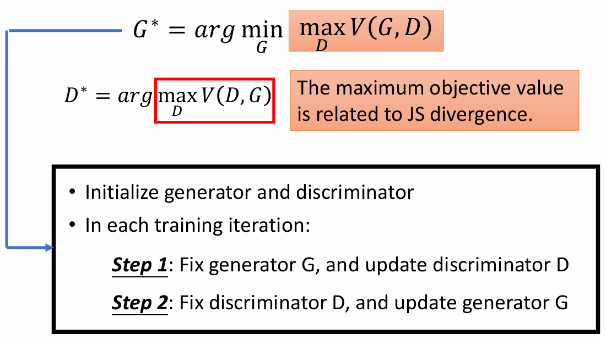
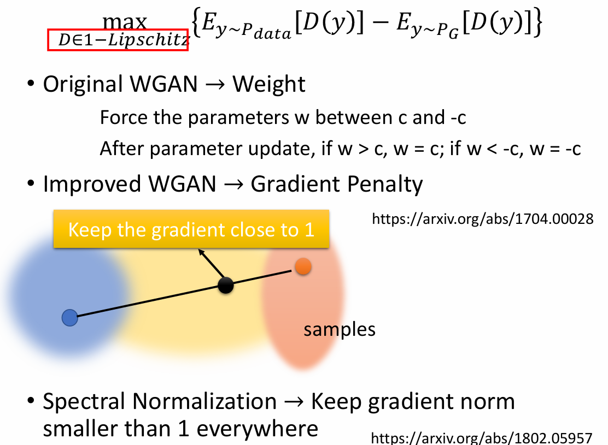

Generative Adversarial Network GAN

学习：[李宏毅：GAN](https://www.bilibili.com/video/BV1Wv411h7kN?spm_id_from=333.788.videopod.episodes&vd_source=1bea97f495d6d9f394738d3da389c9e6&p=58) 

 

GAN的输入包含一个随机变量 z，该变量从一个简单的分布（通常是正态分布）中采样。随机变量 z 的引入使得生成器具有更强的创造性，从而能够生成多样化的输出。

## Unconditional generation

 

- **输入**：一个低维向量 z，来自正态分布。
- **输出**：一个高维向量 y，通常表示为一张图像，具有复杂的分布。

输入不同的 z 将导致输出的 y 不相同。

## Dicriminator 判别器

* 是一个 neural network
* 输入：一张图像
* 输出：一个数值标量，数值越大，代表图像越真实，越小代表图像越假。

Generator 和 Discriminator 是相互学习一起进化的。
 

## Algorithm

generator 和 discriminator 是两个网络，首先需要初始化 generator 和 discriminator 两个网络，然后在每个训练步：

* Step1: 固定 generator G，更新 discriminator D。

  从正态分布中采样一些向量，作为 Generator 的输入，得到输出图像

  从真实数据集中采样一些真实图像。

  然后使用 Discrimintor 对其进行“分类”

* Step2: 固定 discriminator D, 更新 generator G
* generator 尝试 去“欺骗” discriminator，希望生成图像让 Discriminator的输出越大越好。

 

重复进行这两个步骤，直到达到预期效果。

## GAN的理论基础

### Generator

从 Normal Distribution 采样，作为 Generator 的输入，生成复杂的 Distribution $P_G$ 。

数据集的分布为 $P_{data}$ ，我们希望 $P_G$ 越接近 $P_{data}$ 越好。
$$
G^* = \arg \min_G Div(P_G, P_{data})
$$
$Div(P_G, P_{data})$ 代表 $P_G$ 和 $P_{data}$ 表示两种分布之间的差异 divergence。

如何计算 divergence ？

虽然我们不知道 $P_G$ 和 $P_{data}$ 的分布，但是我们可以采样它们。

 

### Discriminator

判别器的目标是区分真实图像和生成图像，可以看作一个优化问题：

* 训练：$D^* = \arg \max_D V(D, G)$ 
* D 的目标函数：$V(G, D) = E_{y\sim P_{data}}[\log D(y)] + E_{y\sim P_G}[\log (1-D(y))]$ 

 

$\max_DV(D,G)$ 和 divergence 有关：当 generator 生成的图像和 真实图像很接近的时候（small divergence），discriminator 很难去辨别，导致 small $\max_DV(D,G)$ 。

 

## WGAN

GAN的问题：

* 大多数情况，$P_G$ 和 $P_{data}$ 不重合

* 数据的属性：$P_{data}$ 和 $P_G$ 都是高维空间的低维 manifold。

* 采样：即使 $P_{data}$ 和 $P_G$ 有重合，如果没有足够的采样，会很容易设置使得真实图像和生成图像样本之间的分界线（即使得两方样本没有任何重叠的空间）

  对于 JS divergence：JS divergence 总是 log2 如果两个分布没有重叠部分。

WGAN提出了Wasserstein距离作为改进方案：

Wasserstein distance：

* 假设有两个分布 P 和 Q。

  设想有两个分布 P 和 Q，通过最小化从 P 推送到 Q 的平均距离来作为分布之间的差异。

$$
\max_{D\in 1-Lipschitz}\{E_{y\sim P_{data}}[D(x)]  - P_{y\sim P_G}[D(y)]\}
$$

D 要足够平滑，如果是离散的，就容易造成 D(y) 变为无穷。

 

