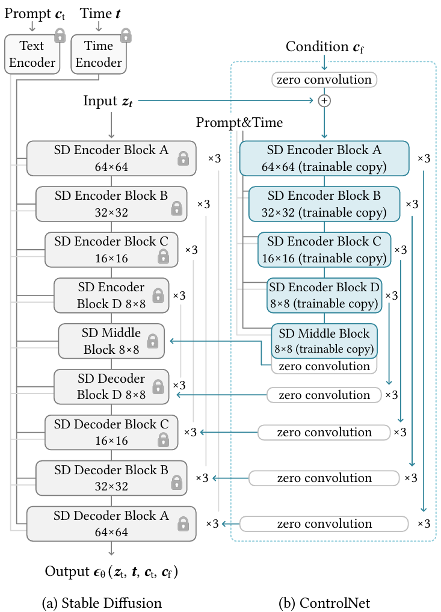

[HCP Diffusion 官方文档1.0](https://hcpdiff.readthedocs.io/zh-cn/latest/get_started.html) 


# 1 loRA

讲解视频：[LoRA explained (and a bit about precision and quantization)](https://www.youtube.com/watch?v=t509sv5MT0w&t=438s&ab_channel=DeepFindr) 

* 关键：秩分解 + 对低秩矩阵进行微调训练

$$
W_0 + \Delta W = W_0 + BAW_0 + \Delta W = W_0 + BA
$$

* $W_0$ 是保持不变的原始模型权重

* A 和 B 是低秩矩阵：$B\in \mathbb{R}^{d\times r},A\in \mathbb{R}^{r\times k},rank\ r\ll \min(d,k)$ 

  有：$BA = \Delta W$ 

* 初始化：$B$ 初始化为零矩阵，$A$ 的权重从正态分布中采样

* 在 transformer 中，它通常应用于 attention weights

* 前向传播：

  * 输入数据同时通过原始模型和低秩矩阵进行计算。
  * 结果相加，得到最终输出。

  $$
  h = W_0 x + \Delta Wx = W_0 x + BAx
  $$

  ```python
  def regular_forward_matmul(x, W):
      h = x @ w
  return h
  
  def lora_forward_matmul(x, W, W_A, W_B):
      h = x @ W
      h += x @ (W_A @ W_B) * alpha
  return h
  ```

  * 缩放因子 $\alpha$ ，用于控制添加到原始模型权重的变化量
  * 具体来说，$\alpha$ 除以 秩$r$ 后的结果用于缩放 $B$ 和 $A$ 的输出
  * 这样处理的目的是平衡原始模型和新任务下的模型在不同的秩下稳定其他超参数，如学习率
  * 超参数 $r$ 和 缩放因子 $\alpha$ 是我们需要调节的超参数

* QLoRA是一种结合量化和LoRA（低秩适应）的方法，用于减少硬件需求。具体来说，QLoRA在预训练模型权重上添加了4位量化，这意味着输入不再通过原始模型权重，而是通过量化版本进行处理。这种方法可以进一步降低模型的内存占用和计算需求，同时保持模型性能。


# 2 VAE(variational autoencoders)

> 中文：变分自动编码器

* 核心思想：将输入映射到一个分布上，输出两个向量，一个表示分布的均值，另一个表示标准差。

  每当需要一个向量通过解码网络时，就从分布中获取样本，然后从到解码器中。

* 损失函数：
  $$
  \mathcal{L}(\theta, \phi, \mathbf{x}, \mathbf{z}) = \mathbb{E}_{q_\phi(\mathbf{z}|\mathbf{x})}[\log p_\theta(\mathbf{x}|\mathbf{z})] - D_{KL}(q_\phi(\mathbf{z}|\mathbf{x})\Vert p(\mathbf{z}) )
  $$

  * 第一部分是 期望值
  * 第二部分是 KL divergence（KL 散度）
  
* Reparameterization Trick 是变分自编码器（VAE）中的一个关键技术，用于解决在训练过程中无法通过采样节点进行反向传播的问题。具体步骤如下：
  
  1. **分解潜在向量**：将潜在向量视为固定参数（μ）和标准差（σ）乘以标准高斯噪声（ε）的和。
  2. **固定噪声**：ε始终是标准高斯分布（均值为0，标准差为1），不需要训练。
  3. **训练参数**：只训练μ和σ，从而可以通过反向传播计算梯度。
  
  这种方法允许在整个网络中进行端到端的训练，同时保持采样操作的随机性


# 3 prompt tuning

* 背景：\[1\]

  * 预训练 Pre-Training：采用 自监督任务 从海量 无监督数据 中获取“知识”。利用预训练模型(PLM) 大规模参数存储“知识”。

  * 预训练任务形式：Masked Language Modeling(MLM)，Next Sentence Prediction(NSP)

  * 微调（Fine-Tuning）：调整 PLMs的参数，解决下游问题。问题在于预训练与下游任务存在“gap”。

  * Prompt tuning：不调整预训练模型的参数。通过设计和优化 Prompt，来适配下游任务的训练方法。仅需调整 Prompt。

    Hard Prompt(Auto-Generated Hard Prompt)、Soft Prompt、Hybrid Prompt
  
* 执行步骤：\[2\]

  * 构建模板 Template Construction

    通过人工定义、自动搜索、文本生成等方法，生成与给定句子相关的一个含有`[MASK]`标记的模板。例如`It was [MASK].`，并拼接到原始的文本中，获得Prompt-Tuning的输入：`[CLS] I like the Disney films very much. [SEP] It was [MASK]. [SEP]`。

    将其喂到BERT模型中，并复用预训练好的MLM分类器，即直接得到 `[MASK]` 预测的各个 token(模型预测的词) 的概率分布。

  * 标签词映射 Label World Verbalizer

    建立 `[MASK]` 和 标签类的映射关系。例如在`[CLS] I like the Disney films very much. [SEP] It was [MASK]. [SEP]`，如果`[MASK]`预测的词是“great”，则认为是positive类，如果是“terrible”，则认为是negative类。
  
  * 训练
  
    根据Verbalizer，可以获得指定label word的预测概率分布，并采用交叉信息熵进行训练。
  
* 参考资料：

  * \[1\][大模型Prompt Tuning技术分享](https://www.bilibili.com/video/BV1P34y1m7kR/?spm_id_from=333.999.top_right_bar_window_history.content.click&vd_source=1bea97f495d6d9f394738d3da389c9e6) (视频)
  * \[2\][五万字综述！Prompt-Tuning：深度解读一种新的微调范式](https://zhuanlan.zhihu.com/p/618871247) (知乎)


# 4 ControlNet

* 提出背景：希望找到一种高效的方法来训练模型，使其能够接收额外的条件输入。

  一种神经网络结构，控制预训练的大型扩散模型支持额外的输入。   

  可以利用现有的稳定扩散模型快速构建一个可以接受额外输入的模型。

* 工作原理

  * 给定Stable Diffusion Model，冻结其权重，防止对其进行任何梯度更新，确保它根本不会改变。

  * 同时创建一个外部网络，让外部网络处理额外的输入。
  * 外部网络将信息传递给主模型，使其能够利用新的输入条件。

* 效率高



