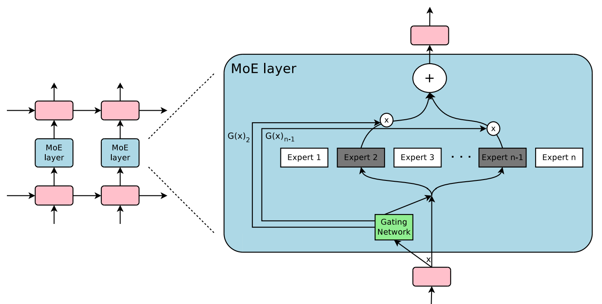
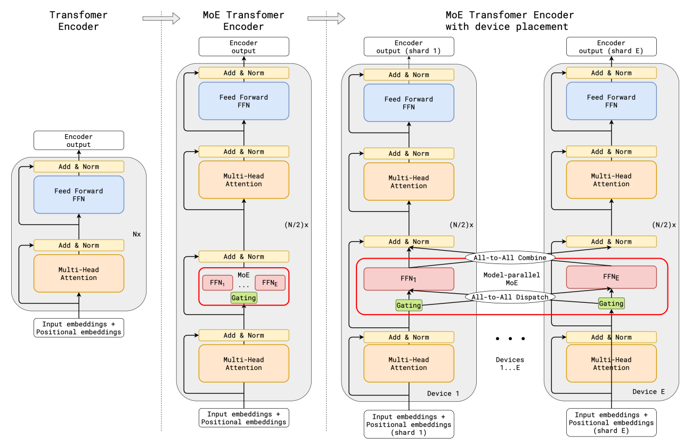
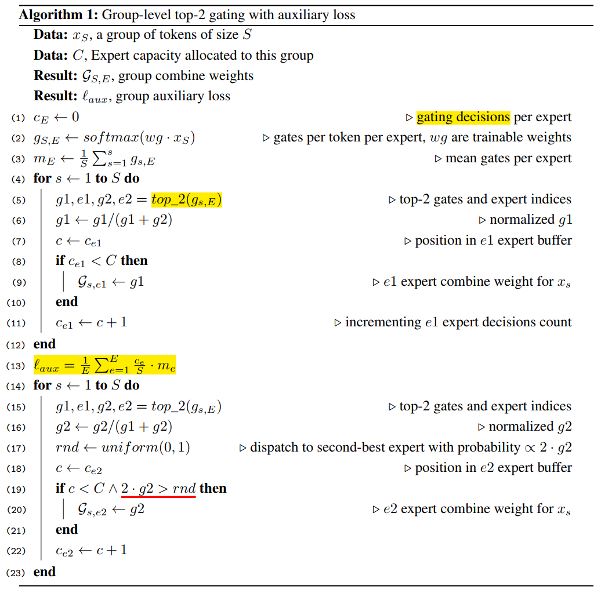
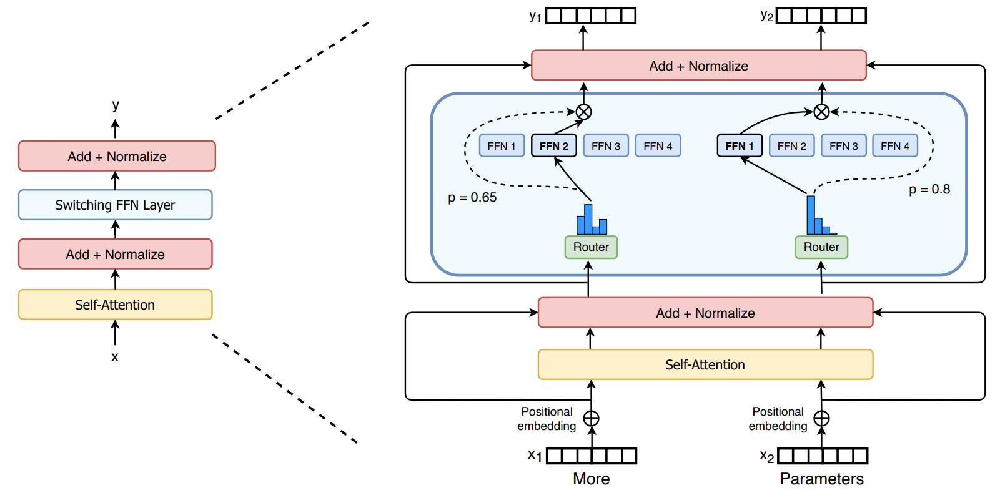

学习路线参考：[MOE奠基论文走读，Adaptive Mixtures of Local Experts！](https://www.bilibili.com/video/BV1MiAYeuETj/?share_source=copy_web&vd_source=048b79e416e51fa94f772c181d06d588)

## 1 Adaptive Mixtures of Local Experts

原文：https://www.researchgate.net/publication/233806999_Adaptive_Mixtures_of_Local_Experts

* 简介：一种新的监督学习过程（supervised learning procedure），适用于由多个独立网络组成的系统，每个网络处理完整训练案例集的子集。可以看成 multilayer supervised network 的 模块化版本，或者 竞争性学习 的 关联版本。

### Making Associative  Learning Competitive

* 出发点：单一的多层网络，在不同场合执行不同的子任务，通常会出现强烈的干扰效应，导致学习缓慢和泛化能力差。

* 解决：如果事先知道一组训练案例分为几个子集，这些子集对应不同的子任务，那么可以通过使用由 **多个不同的“专家”网络**（"expert" network）组成的系统，加上**一个决策网络**来决定每个训练案例应该使用哪一个专家，就可以减少干扰。
* 基本思想：每个专家处理完全不同的案例，专家是局部的，权重相互独立。

* 先前的工作：使用多个专家“合作”得到误差函数，每个输出使用了所有其他专家的解法，损失函数：$E^c = \| d^c - \sum_i p_i^c o_i^c\|^2$ ，其中，$o_i^c$ 是专家 $i$ 在案例 $c$ 中的输出向量，$p_i^c$ 是专家 $i$ 对组合输出向量的贡献比例，$d^c$ 是案例 $c$ 中的期望输出向量。
* 重新定义误差函数，使得局部专家更多地“竞争” (Competitive)：
* 设想决策网络在每个时刻做出关于选择哪一个专家的随机决定：误差为期望值与实际输出向量之间的平方差：$E^c = \langle\| d^c - o_i^c\|^2\rangle = \sum_ip_i^c\|d^c - o_i^c\|^2$ ，其中 每个专家需要生成整个输出向量。
* 优化后的误差函数：$E^c = -\log\sum_i p_i^c e^{-\frac12\|d^c - o_i^c\|}$，可以加快适应过程。

## 2 Outrageously Large Neural Networks: The Sparsely-Gated Mixture-of-Experts Layer

原文：https://arxiv.org/abs/1701.06538

* 引入 一种新型的 通用神经网络组件：稀疏门控专家混合层（Sparsely-Gated Mixture-of-Experts Layer, MoE），MoE 由多个专家组成，每个专家都是一个简单的前馈神经网络，以及一个可训练的门控网络。

* 该网络选择的稀疏专家组合来处理每个输入，网络的所有部分通过反向传播联合训练。

* 该研究在堆叠的 LSTM 层之间应用 MoE (Mixture of Experts) 卷积，MoE 在文本的每一个位置调用依次，在每个位置选择潜在不同的专家组合。不同的专家往往会基于语法和语义高度专业化。

  

### The Structure of the Mixture-of-Experts Layer

* 混合专家 (Mixture-of-Experts, MoE) 层由一组 n 个“专家网络” $E_1, \cdots, E_n$ 和 一个“门控网络” $G$ 组成，输出是一个 稀疏的 $n$ 维向量。
* 用 $G(x)$ 和 $E_i(x)$ 表示给定输入 $x$ 时，门控网络的输出和第 $i$ 个专家网络的输出。MoE 模块的输出 $y$ 可以写成如下形式：$y = \sum_{i = 1}^n G(x)_i E_i(x)$ 
* 我们基于 $G(x)$ 的输出稀疏性节省计算：当 $G(x)_i = 0$，我们都无需计算 $E_i(x)$ 。
* 专家数量非常庞大时：可以使用两层级的 MoE 来减少分支因子。在层级 MoE 中，主门控网络选择一个稀疏加权组合的“专家”，每个“专家” 本身都是一个具有其自身门控网络的二级专家混合模型。

### Gating Network

* **Softmax 门控**：一个简单的 非稀疏门控函数选择 将是输入乘以一个可训练的权重矩阵 $W_g$ ，然后应用 Softmax 函数：$G_\sigma(x) = Softmax(x\cdot W_g)$ 

* **Noisy Top-K Gating**: 

  * 向 Softmax 门控网络 添加了两个组件：**稀疏性** 和 **噪声** (noise)。

  * 应用 Softmax 函数之前，先添加可调的高斯噪声，再仅保留前 k 个值
    * 稀疏性用于节省计算
      * 噪声有助于负载均衡

$$
\begin{aligned}
& G(x) = Softmax(KeepTopK(H(x), k))\\
& H(x)_i = (x\cdot W_g)_i + StandardNormal()\cdot Softplus((x\cdot W_{noise})_i)\\
& KeepTopK(v, k)_i = \begin{cases}
v_i& 如果 v_i 是 v 的前 k 个元素\\
-\infty&其他
\end{cases}
\end{aligned}
$$

### Balancing Expert Utilization

* 问题：门控网络倾向于收敛到一种状态，在这种状态下，它总是为同几个专家产生更大的权重，这种不平衡是自我强化的。

* 方法：a soft constraint approach，一种软约束方法。

  * 将相对于一批训练示例的专家重要性 定义为 该专家的门控值的批次和。
  * 定义了一个额外的损失 $L_{importance}$ ，它被添加到模型的总体损失函数中。这个损失等于重要性值集合的变异系数的平方，乘以一个手动调整的缩放因子 $w_{importance}$。这个额外的损失鼓励所有专家具有相等的重要性。

  $$
  \begin{gather}
  Importance(X) = \sum_{x\in X}G(x)\\
  L_{importance}(X) = w_{importance}\cdot CV(Importance(X))^2
  \end{gather}
  $$

  尽管该损失函数可以确保重要性相等，但专家可能仍然会收到数量非常不同的样本。

* 引入第二个损失函数 $L_{load}$ ，该函数确保负载均衡，鼓励专家获得大致相等数量的训练样本。由于专家收到的样本数量是一个离散量，不能在反向传播中使用。

  * 定义一个平滑估计量：$Load(X)$ ，用于表示分配给每个专家的样本数量，这是针对输入批次 X 的，平滑性使我们能够通过估计量进行反向传播梯度，这就是门控函数中**噪声项**的目的。

  * 定义 $P(x, i)$ 为在元素 $i$ 进行新的随机噪声选择的情况下，$G(x)_i$ 非零同时保持其他元素上已采样的噪声选择 的概率。注意到，当且仅当 $H(x)_i$ 大于 $H(x)$ 中除自身外的第 $k^{th}$ 大元素时，$G(x)_i$ 非零。
    $$
    \begin{aligned}
    P(x,i) &= Pr((x\cdot W_g)_i + StandardNormal()\cdot Softplus((x\cdot W_{noise})_i)\\ &> kth\_excluding(H(x), k, i))\\
    & = Pr(H(x)_i >  kth\_excluding(H(x), k, i))
    \end{aligned}
    $$
    $ kth\_excluding(v, k, i)$ 表示 $v$ 的第 $k$ 个最高组件，排除组件 $i$ 。简化后，得到
    $$
    P(x, i) = \Phi\left(\cfrac{(x\cdot W_g)_i + Softplus((x\cdot W_{noise})_i)}{Softplus((s\cdot W_{noise})_i)}\right)
    $$
    其中，$\Phi$ 是标准正态分布的累积分布函数 (CDF)。
    $$
    Load(X)_i = \sum_{x\in X} P(x, i)
    $$

  * 我们现在可以将负载均衡定义为负载向量的变异系数的平方，乘以经过手动调整的缩放因子 $w_{load}$ ：
    $$
    L_{load}(X) = w_{load}\cdot CV(Load(X))^2
    $$

## 3 GShard: Scaling Giant Models with Conditional Computation and Automatic Sharding

原文：https://arxiv.org/abs/2006.16668

### Design Principles for Efficient Training at Scale

* 问题出发点：训练大模型面临的挑战：特定架构的支持、计算成本、基础设施拓展性、多设备高效运行模型划分

* 方法：构建序列到序列 transformer 模型，使用 Sparsely-Gated Mixture-of-Experts layers (稀疏门控混合专家层)，具有 sub-linear computation cost 和 O(1)编译时间

  * sub-linear scaling：模型架构应设计为在模型容量下保持计算和通讯需求的亚线性。

  * The Power of Abstraction: 模型描述 应该与 分区实现和优化 分离。

    关注点的分离使得 模型开发者 可以专注于网络框架，并灵活改变分区策略，而底层系统应用 语义保持的转换 并实现 高效的并行执行。

  * Scalable Compilers: SPMD转换的编译器技术。

### Sparse scaling of the Transformer architecture

* Transformer 利用两个计算模块，一个编码器和一个解码器，二者均通过堆叠多个 transformer 层来实现。Transformer 编码器层由两个连续层组成，即 self-attention layer + position-wise feed-forward layer。解码器则增加了第三个 cross-attention layer，该层关注编码器的输出。
* 通过有条件计算 对 transformer 进行稀疏扩展，方法：Position-wise Mixture of Experts layer 替换 每隔一个 的前馈层，编码器和解码器均采用 top-2 门控的变体。
* 通过改变 transformer 层的数量 和 每个 MoE层 的专家数量，以扩展模型的容量。

(c) 当扩展到多个设备时，MoE层在设备之间分片，而所有其他层则被复制。

### Position-wise Mixture-of-Experts Layer

* MoE 层由 E 个前馈网络 $\text{FFN}_1, \cdots, \text{FFN}_E$ 组成。

$$
\begin{gather}
\mathcal G_{s, E} = \text{GATE}(x_s)\\
\text{FNN}_e(x_s) = wo_e\cdot\text{ReLU}(wi_e\cdot x_s)\\
y_s = \sum_{e=1}^E \mathcal G_{s,e}\cdot \text{FFN}_e (x_s)
\end{gather}
$$

* $x_s$ 是 MoE 层的 输入token

* $wi$ 和 $wo$ 分别是前馈层（一个专家）的输入和输出投影矩阵。

* 向量 $\mathcal G_{s, E}$ 是由一个门控网络计算得出的。$\mathcal G_{s, E}$ 对于每个专家都有一个非负值，大多数为零，这意味该 token 没有分配给该专家。我们选择让每个 token 最多分配给两个专家。$\mathcal G_{s, E}$ 中相应的条目为非零，表示专家对最终网络输出的贡献程度。

* 每个 expert $\text{FFN}_e$ 对 $x_s$ 应用一个使用 ReLU 激活函数 的 全连接二层网络。

* MoE 层的输出 $y_s$ 是所有选定专家输出的加权平均值。 

* 门控函数 $\text{GATE}(\cdot)$ 对于 MoE层 至关重要，它由一个 softmax激活函数 建模，指示每个 专家 在处理传入token 时的权重，即专家处理传入token的能力。

  门控函数满足的两个目标：

  * 负载均衡
  * 大规模的效率

  在 门控函数 $\text{GATE}(\cdot)$ 中设计了以下机制：

  * expert capacity：

    * 定义 expert capacity 为 单个专家处理的 token 数量的最大值。
    * 假设训练批次的 token 总数为 N，并且每个 token 最多分配给两个专家，那么 expert capacity 被设置为 O(N/E)
    * GATE(·) 保持一个 **运行计数器** $c_e$，用于跟踪分配给一个专家的 token 数量。
    * 当一个 token 选择的两个专家已经**超出**了他们的能力 capacity 时，该 token 被标记为 *overflowed* token，此时 $\mathcal G_{s, E}$ 退化为零向量，此类 token 将其表征 $x_s$ 通过**残差连接**传递到下一层。

  * local group dispatching：

    * GATE(·) 将训练批次中的所有 token 均匀划分为 G 个组，每个组包含 S = N/G 个 token。
    * 所有组独立并行处理。每个组被分配每个专家的一部分容量，容量为 2N/(G · E)。每个组确保最多有这么多 token 被分配到一个专家。

  * auxiliary loss (辅助损失)

    * 定义辅助损失项 $\mathscr l_{aux}$ ，它被加入到模型的整体损失函数 $\mathcal L = \mathscr l_{nll} + k * \mathscr l_{aux}$，其中 k 是一个常数倍增器。

    $$
    \mathscr l_{aux} = \cfrac1E\sum_{e=1}^E \cfrac{c_e}{S}\cdot m_e
    $$

    * 项 $c_e/S$ 代表路由到每个专家的输入比例，我们希望最小化 $c_e/S$ 的均方误差。但是，由于 $c_e$ 源于 top-2 操作且不可微分，我们使用每个专家的平均门控数 $m_e$ 作为可微分的 $c_e/S$ 近似，并用 $m_e(c_e/S)$ 替换 $(c_e/S)^2$ ，现在可以通过梯度下降进行优化。

  * random routing (随机路由)

    由于 $y_s$ 是所选专家返回的加权平均。如果第 2 个专家的权重非常小，我们可以简单地忽略第 2 个专家，以保持整体专家容量。

## 4 Switch Transformers: Scaling to Trillion Parameter Models with Simple and Efficient Sparsity

原文：https://arxiv.org/abs/2101.03961

* 出发点：大规模训练中，简单的框架在充足的计算预算、数据规模和参数数量的支持下超越更复杂的算法。

* 目的：寻求更大的计算效率

* 方法：a sparsely-activated expert model: **the Switch transformer** 

  稀疏性来自于为每个输入示例激活神经网络权重的一个子集。

### switch transformer

* 出发点：Kaplan et al. (2020)  对规模的好处进行深入研究。模型规模、数据集规模和计算预算之间存在幂律缩放关系。这样工作主张在相对较小的数据量上训练大模型是计算上最优的做法。
* 研究第四个轴：在保持每个实例的浮点操作数不变的情况下增加 参数数量。假设参数数量与执行的总计算量无关，是一个独立且重要的缩放轴。通过设计一个 稀疏激活模型 可以实现这一点。
* 在本研究的分布式训练设置中，稀疏激活层在不同设备上分割 独特 权重。因此，模型的权重随设备数量的增加而增加，同时在每个设备上保持可管理的内存和计算负载。

* switch transformer 编码块中：用一个 sparse Switch FFN layer 替换 transformer 中的 稠密前馈网络 (dense feed forward network) 层。该层在序列的 token 上独立运行。
* 图中描述了，两个 token 被路由到 四个 FFN experts，路由器 Router 独立地 路由 每个 token。 switch FFN layer 返回 所选中的 FFN 的输出

### simplifying sparse routing

* **Mixture of Expert Routing** 

  文章 *Outrageously Large Neural Networks: The Sparsely-Gated Mixture-of-Experts Layer* 提出了一个自然语言的 Mixture-of-Experts 层：

  * 该层以 token 表征的 x 作为输入，然后将其 路由 到从 N 个专家集合 $\{E_i(x)\}^N_{i=1}$ 中选出的最佳确定的 前-k 个专家。
  * 路由器变量 $W_r$ 产生 $h(x) = W_r\cdot x$，并通过该层可用的 N 个专家的 softmax 分布进行归一化。
  * 专家 $i$ 的 gate-value ：$p_i(x) = \cfrac{e^{h(x)_i}}{\sum_j^N e^{h(x)_j}}$ 
  * 选择前-k 的 gate value 用于路由 token x，如果 $\mathcal T$ 是所选择的前-k 索引的集合，则该层的输出计算为 每个专家对 token 的计算与 gate value 的线性加权组合：$y = \sum_{i\in \mathcal T} p_i(x)E_i(x)$ 

* **Switch Routing: Rethinking Mixture-of-Experts** 

  * 简化的策略：只路由到一个 **单一** 专家。

    优点：路由计算减少，expert capacity 减半，路由实现简化

  * $p_i(x)$ 允许路由器的可微性。

### Efficient Sparse Routing

* **Distributed Switch Implementation** 

  expert capacity —— 每个专家计算的 token 数量 —— 是根据专家数量将批次中 token 的数量平均分配来设置的，并进一步通过 capacity factor 扩展
  $$
  \text{expert capacity} = \left(\cfrac{\text{tokens per batch}}{\text{number of experts}}\right)\times \text{capacity factor}
  $$

  * 确保较低的丢弃率 对于 sparse expert-models 很重要。

* **A Differentiable Load Balancing Loss** 

  * 为了鼓励专家之间的负载平衡，添加一个辅助损失。对于每个 Switch 层，这个辅助损失在训练期间被添加到总模型损失中。

  * 给定 N 个 由 i=1 到 N 索引的专家以及一个包含 T 个 token 的批次 $\mathcal B$ ，辅助损失是通过向量 $f$ 和 P 之间的缩放点积计算得出的：
    $$
    \text{loss} = \alpha\cdot N\cdot \sum_{i=1}^N f_i\cdot P_i
    $$
    其中 $f_i$ 是分配给专家 $i$ 的 token 比例：
    $$
    f_i = \cfrac1T\sum_{x\in \mathcal B}\mathbb1\{\text{argmax }p(x)=i\}
    $$
    和 $P_i$ 是分配给专家 $i$ 的路由器概率的比例：
    $$
    P_i = \cfrac1T\sum_{x\in\mathcal B}p_i(x)
    $$
    辅助损失函数鼓励 均匀路由，因为它在均匀分布下被最小化。

Switch Transformer 微调容易出现过拟合现象，解决办法：expert dropout，增加 专家 内部的 dropout。实验结果表明，在所有层增加 dropout 会导致较差的性能，但是在非专家层设置较小的 dropout率 和 在专家层设置更大的 dropout 率可以在四个较小的下游任务上提升性能。

## 5 ST-MoE: Designing Stable and Transferable Sparse Expert Models

原论文：https://arxiv.org/abs/2202.08906

* 问题出发点：稀疏模型的训练不稳定性。
* 目标：提高稀疏模型的实用性和可靠性。提出额外的分析和设计指南用于稀疏专家模型。

> 1. 大规模研究稳定性技术在质量与稳定性之间的权衡。
> 2. 介绍路由器 z-loss，它能解决不稳定性问题，同时略微提升模型质量。
> 3. 对稀疏模型和密集模型的微调分析，突出它们在批量大小和学习率上的超参数敏感性差异。我们发现，不良的超参数会导致微调几乎无法超越密集模型的表现，尽管预训练速度大幅提升。
> 4. 在分布式环境下设计帕累托高效稀疏模型的架构、路由及模型设计原则。
> 5. 通过定性分析追踪跨专家层的标记路由决策。
> 6. 一个 269B 规模的稀疏模型（稳定可迁移专家混合模型 ST-MoE-32B），在多个自然语言基准测试中实现了最先进的性能。

改善稳定性的方法：

1. remove multiplicative interactions
2. inject model noise
3. constrain activations, and gradients
4. router z-loss

### Stabilizing Training of Sparse Models

* 问题：
  * 稀疏模型的训练不稳定性，许多方法都可以稳定稀疏模型，但以降低质量为代价。
  * 引入更多 乘法组件 的 Transformer 会降低稳定性，但提升模型质量
  * 小模型很少不稳定，但大型不稳定模型的运行成本过高，无法进行足够的步骤。
  * 在多语言数据上运行不稳定性实验，加剧模型的不稳定性。
* 方法：引入 router z-loss，能在不降低质量的情况下稳定模型。

### Stability and Quality Tradeoffs When Constraining Activations And Gradients

一个成功的方法是 对激活值 (activations) 和 梯度 (gradients) 施加约束。

* 一种流行的方法：限制 梯度范数，以解决反向传播深度网络中出现的梯度爆炸问题。
* 在此项工作中，该研究使用 Adafactor 优化器。Adafactor 使用 update clipping，其权重的变化被限制在某个范数以下。但实验结果表明，这种方法导致了质量的急剧损失。

**研究 进入路由器的 logits 的约束**：路由器以 float32 精度计算专家的概率分布，然而，在最大规模下，这不足以产生可靠的训练。

* 方法：引入 **router z-loss**

$$
L_z(x) = \cfrac1B\sum_{i=1}^B \left(\log\sum_{j=1}^N e^{x_j^{(i)}}  \right)^2
$$

其中：B 是 token 的数量，N 是专家的数量，$x\in \mathcal R^{B\times N}$ 是输入路由器的 logits，这会惩罚进入门控网络的大 logits。

router z-loss 引入了另一个超参数 ($c_z$)，用于调整其在总损失中的权重。

总损失是交叉熵损失 ($L_{CE}$)、辅助负载平衡损失（$L_B$）和 router z-loss（$L_Z$）的线性加权组合：
$$
L_{tot} = L_{CE} + c_BL_B + c_zL_Z
$$

### Selecting a Precision Format: Trading Efficiency And Stability

* 精度能改善模型的训练动态
* sparse MoE 对舍入误差敏感，因为 路由器的存在，它们有更多的指数函数。
* 关于 router z-loss：z-loss 鼓励模型生成数值较小的 logits，从而更准确地建模。

### Fine-tuning Performance of Sparse Models

* 问题：
  * 稀疏模型在大数据集的环境下表现出色，但是在微调时有时表现不佳。
  * 可能：稀疏模型容易过拟合。
* 根据前面的第4篇的论文，选择性增加 专家 dropout，带来了一定泛化好处。
* 测试：在微调过程中只更新模型参数的一个子集。
* 实验结果：
  * 更新非 MoE 参数的效果与更新所有参数相似
  * 仅更新 FFN 参数的效果则略好
  * 仅更新 MoE 参数会显著降低微调性能
  * 更新所有非 MoE 参数所造成的训练损失高于更新所有参数的损失

* 稀疏模型在微调时对丢失的 token 具有鲁棒性

## 6 DeepSeekMoE: Towards Ultimate Expert Specialization in Mixture-of-Experts Language Models  

原论文：https://arxiv.org/abs/2401.06066

* 问题：

  * 此前的 MoE，将 token 分配给一个或两个专家，该结构出现两个潜在的问题：

    1. 知识混合性：现有的 MoE 实践往往使用有限数量的专家，因此分配给特定专家的标记可能涵盖多样的知识。因此，指定的专家在其参数中汇聚截然不同类型的知识，而这些知识在同一时间内很难加以利用。
    2. 知识冗余性：分配给不同专家的 token 的标记可能需要共同知识。因此，多个专家在获取其各自参数中的共享知识可能聚集，从而导致专家参数的冗余。

    这些问题共同阻碍了现有 MoE实践中的专家专业化，防止它们到达 MoE模型理论的上限性能。

* 方案：DeepSeekMoE

  1. Fine-Grained Expert Segmentation (细粒度专家分割)
     * 在保持参数数量不变的同时，拆分 FFN 的中间隐藏维度将专家细分为更细粒度。
  2. Shared Expert Isolation (共享专家隔离)
     * 隔离某些专家作为共享专家，这些专家始终被激活，旨在捕获和巩固各种上下文间的共同知识。

* 标准 transformer： Self-attention 层 + 残差连接 → FFN层 + 残差连接
  $$
  \begin{gather}
  \mathbf{u}_{1:T}^l = \text{Self-Att}(\mathbf{h}_{1:T}^{l-1} + \mathbf{h}_{1:T}^{l-1})\\
  \mathbf{h}_t^l = \text{FFN}(\mathbf{u}_t^l) + \mathbf{u}_t^l
  \end{gather}
  $$
  
* 标准 MoE：指定间隔使用 MoE 层替代 FFN，假设第 l 个 FFN 被一个 MoE 层替代，则输出隐藏状态的表达式：
  $$
  \begin{aligned}&
  \mathbf{h}_t^l = \sum_{i=1}^N(g_{i,t}\text{FFN}_i(\mathbf{u}_t^l)) + \mathbf{u}_t^l\\&
  g_{i,t} = \begin{cases}
  s_{i,t},&s_{i,t}\in\text{Topk}(\{s_{j,t}|1\leqslant j \leqslant N\}, K),\\&
  0,&\text{otherwise}
  \end{cases}\\&
  s_{i,t} = \text{Softmax}_i({\mathbf{u}_t^l}^T\mathbf{e}_i^l)
  \end{aligned}
  $$

  * N 表示专家数，$\text{FFN}_i(\cdot)$ 是第 i 个专家的 FFN

  * $g_{i,t}$ 表示第 i 个专家的 gate value，$s_{i,t}$ 表示 token 与 专家之间的亲和度

    $\mathbf{e}_i^l$ 是第 i 个专家 在第 l 层的质心。

### Fine-Grained Expert Segmentation

* 在典型 MoE架构上，通过将 FFN 的中间隐藏维度减小到原始大小的 $\frac1m$ 倍，将每个专家 FFN 分割为 m 个更小的专家。
* 由于每个专家变得更小，将激活的专家数量增加至 m 倍，以保持相同的计算成本。

经过 细粒度的专家分割，MoE层的输出：
$$
\begin{aligned}&
\mathbf{h}_t^l = \sum_{i=1}^{{\color{red}{m}}N}(g_{i,t}\text{FFN}_i(\mathbf{u}_t^l)) + \mathbf{u}_t^l\\&
g_{i,t} = \begin{cases}
s_{i,t},&s_{i,t}\in\text{Topk}(\{s_{j,t}|1\leqslant j \leqslant {\color{red}{m}}N\}, {\color{red}{m}}K),\\&
0,&\text{otherwise}
\end{cases}\\&
s_{i,t} = \text{Softmax}_i({\mathbf{u}_t^l}^T\mathbf{e}_i^l)
\end{aligned}
$$

* 细粒度专家分割策略显著增强了激活专家的组合灵活性

### Shared Expert Isolation

* 问题：分配给不同专家的 token 可能需要一些共同的知识或信息。因此，多个专家在其各自的参数中获取共享知识，可能导致专家参数的冗余。
* 方法：
  * 进一步隔离 $K_s$ 名专家作为共享专家。无论路由模块如何，每个 token 将被确定性地分配给这些共享专家。
  * 同时为了保持恒定的计算成本，激活的专家数量将减少 $K_s$ 

完整的 DeepSeekMoE 架构的 MoE 层：
$$
\begin{aligned}&
\mathbf{h}_t^l = {\color{red}\sum_{i=1}^{K_s}\text{FFN}_i(\mathbf{u}_t^l)} + \sum_{\color{red}i=K_s+1}^{mN}(g_{i,t}\text{FFN}_i(\mathbf{u}_t^l)) + \mathbf{u}_t^l\newline&
g_{i,t} = \begin{cases}
s_{i,t},&s_{i,t}\in\text{Topk}(\{s_{j,t}|1\leqslant j \leqslant mN\}, mK{\color{red}-K_s}),\newline&
0,&\text{otherwise}
\end{cases}\newline&
s_{i,t} = \text{Softmax}_i({\mathbf{u}_t^l}^T\mathbf{e}_i^l)
\end{aligned}
$$

### Load Balance Consideration

* 问题：自动学习的路由策略会遇到负载不平衡的问题，可能导致 路由崩溃 和 加剧计算瓶颈

* 方法：

  * 专家级平衡损失:
    $$
    \begin{aligned}&
    \mathcal L_{\text{ExpBal}} = \alpha_1 \sum_{i=1}^{N'} f_iP_i,\newline&
    f_i = \cfrac{N'}{K'T}\sum_{t=1}^T \mathbb1(\text{Token }t\text{ selects Expert } i),\newline&
    P_i =\cfrac1T\sum_{t=1}^T s_{i,t}
    \end{aligned}
    $$
    $\alpha_1$ 是超参数

  * 设备级平衡损失：目的是确保各个设备之间的计算平衡，将所有路由的专家分成 D组 $\{\mathcal E_1, \mathcal E_2, \cdots,\mathcal E_D\}$，并在单个设备上部署每一组，则设备级平衡损失的计算如下：
    $$
    \begin{aligned}
     & \mathcal L_{\text{DevBal}} = \alpha_2 \sum_{i=1}^D f_i'P_i',\newline
    &f_i' = \cfrac{1}{|\mathcal E_i|}\sum_{j\in \mathcal E_i}f_j,\newline
    &P_i' = \sum_{j\in \mathcal E_i}P_j
    \end{aligned}
    $$
    $\alpha_2$ 是超参数
