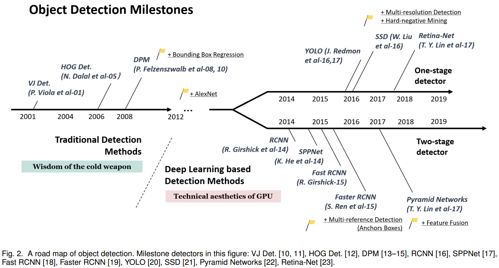
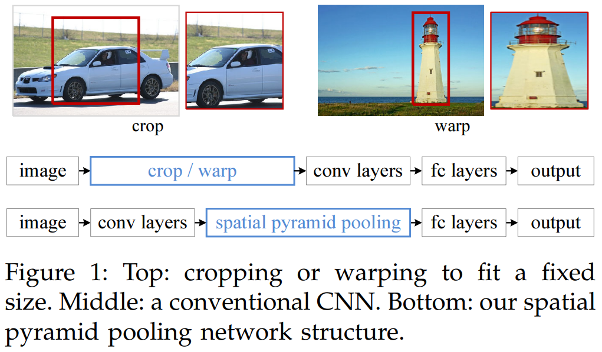
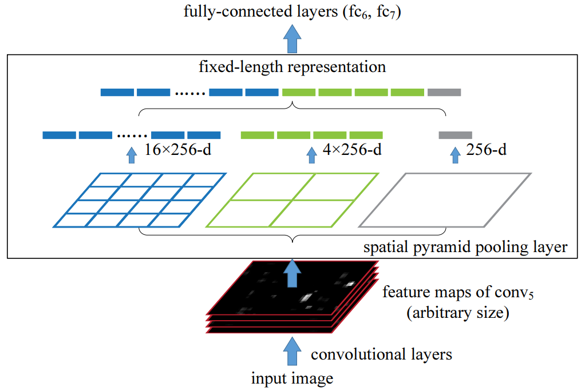
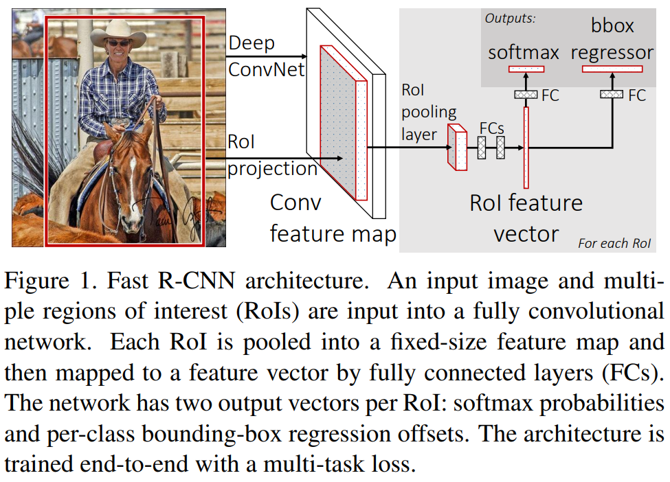
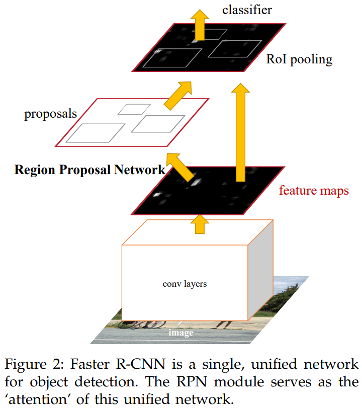
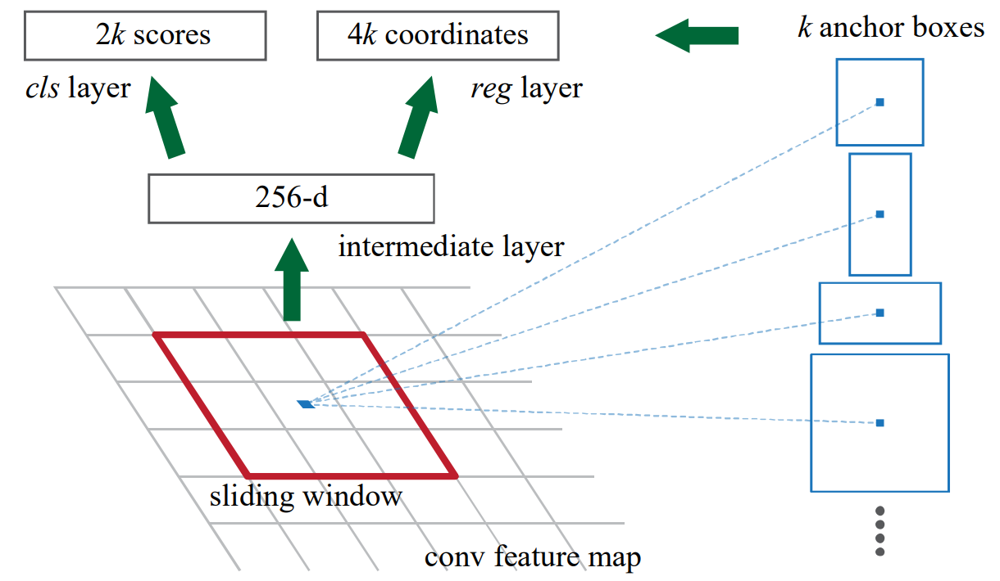
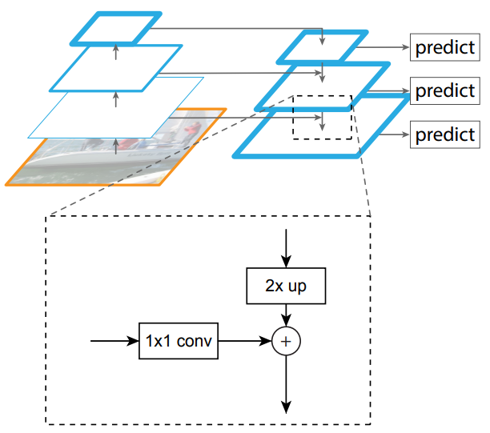
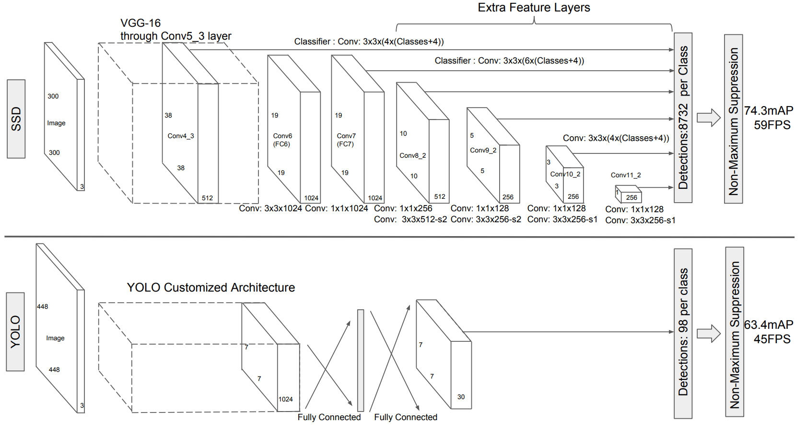

标题：Object Detection in 20 Years: A Survey
发表时间：2019年
pdf 链接：https://arxiv.org/pdf/1905.05055v2

这篇文章回顾了400多篇关于目标检测的论文（从上个世纪九十年代到2019年），涵盖了许多话题。

关键词：目标检测(Object detection)、计算机视(Computer vision)、深度学习(Deep learning)、卷积神经网络(Convolutional neural networks)、技术进步。

# 1 介绍

* 应用的角度：object detection 可以分为 "general object detection" 和 "detection application"。
  * general object detection：探索不同的方法检测不同的物体以模拟人类的视觉和认知。
  * detection appliction：探索特定应用场景，如：行人检测、人脸检测、文本检测 等。

> 第二个部介绍目标检测20年的进化历史。第三部分介绍目标检测的一些加速技术。第四部分介绍近三年来一些最先进的检测方法（2019）。第五部分回顾一些重要的检测应用场景。第六部分做出总结，并分析进一步的研究方向。

# 2 20年间的目标检测技术

## 2.1 目标检测技术的路线图

目标检测技术的演进分为两个时期：

* 传统目标检测时期（2014之前）
* 深度学习目标检测时期（2014之后）

### 2.1.1 里程碑：traditional detectors

早期大多数检测算法都是基于手工特征构建。

早期的目标检测（2000年前）并没有遵循统一的检测理念，例如滑动窗口检测。那时的检测器通常基于低级和中级视觉进行设计。

“基于组件的识别” 作为一种重要的认知理论，长期以来一直是图像识别和目标检测的核心思想。这种思想在复杂问题上未能取得良好效果。

因此，基于机器学习的检测方法开始兴起。基于机器学习的检测经历了多个阶段，包括外观的统计模型（1998年前）、小波特征表示（1998-2005年）以及基于梯度的表示（2005-2012年）。

* Viola Jones Detectors

  * P. Viola 和 M. Jones 在2001提出。原文：[《Rapid object detection using a boosted cascade of simple features》](https://www.cs.cmu.edu/~efros/courses/LBMV07/Papers/viola-cvpr-01.pdf)和 [《Robust real-time face detection》](https://ieeexplore.ieee.org/stamp/stamp.jsp?tp=&arnumber=937709) 

  * VJ detector 遵循最直接的检测方法：滑动窗口，检测所有可能的位置和比例，去看是否有任何窗口包含人脸。这种方法的最大问题是需要巨大算力。

  * VJ detector 通过“积分图像(integral image)”、“特征选择(feature selection)”和“级联检测(detection cascades)” 这三个重要技术大大提高了检测速度。

  * 积分图像(integral image)：一种加快盒滤波或卷积过程的计算方法。VJ detector 使用 Haar 小波作为图像特征表示。积分图像使得 VJ detector 中每个窗口的计算复杂度与窗口大小无关。

    公式：
    $$
    ii(x,y) = \sum_{x'\leqslant x, y'\leqslant y}i(x', y')
    $$
    $ii(x,y)$ 是”integral image“，$i(x,y)$ 是原始图像。使用下面的递归关系对：
    $$
    s(x,y) = s(x,y-1) + i(x,y)\\
    ii(x,y) = ii(x-1,y) + s(x,y)
    $$
    $s(x,y)$ 是累积行和，$s(x,-1) = 0$，$ii(-1,y) = 0$，计算积分图像仅需遍历一次数组。
    Haar小波，是最简单的小波函数，用于对信号进行均值、细节分解。

  * 特征选择(feature selection)：作者没有使用一组手动选择的Haar basis filters，而是使用 Adaboost 算法从一组巨大的随机特征池选择一组对人脸检测最有帮助的小特征。

  * 级联检测(detection cascade)：VJ detector 中引入了一个 多阶段检测范式multi-stage detection paradigm(又称”检测级联detection cascades“)，通过 减少在背景窗口的计算 和 增加面部目标的计算 来减少计算开销。

    > 检测过程的总体形式是一个退化的决策树，我们称之为“级联”。第一个分类器的正结果会触发第二个分类器的评估，第二个分类器同样被调整为具有非常高的检测率。第二个分类器的正结果会触发第三个分类器的评估，依此类推。在任何阶段出现负结果都会立即拒绝该子窗口。

  

* HOG Detector

  面向梯度直方图（Histogram of Oriented Gradients, HOG）特征描述符（feature descriptor ）最早由N. Dalal和B. Triggs于2005年提出。

  * HOG 可以被视为当时尺度不变特征变换 SIFT 和形状上下文的重要改进。
  * 为了平衡特征不变性（包括平移、尺度变换、光照等）和非线性（区别不同对象类别的能力），HOG descriptor 设计为在均匀分布的密集网格上计算，并使用重叠局部对比度归一化以提高准确性。

* Deformable Part-based Model（DPM）

  DPM是传统目标检测方法的巅峰。DPM 遵循“分而治之”的检测理念，其中训练可以简单地视为学习一种适当的分解目标的方法，推理可以被认为是对不同的目标部分检测的集合。

  例如：检测一辆“车”可以视为检测它的窗户、车身和车轮。

  * 典型的DPM detector 包含一个 root-filter 和一些 part-filter。
  * DPM，提供一种弱监督学习方法，所有 part filter 的配置可以作为 latent variables 被自动学习。
  * 其他的重要技术：hard negative mining，bounding box regression，context priming，也被用于提高检测精度。

  

### 2.1.2 里程碑：基于 tow-stage detectors 的 CNN

随着手工设计特征的性能逐渐饱和，目标检测在2010年后进入了一个发展平台期。R. Girshick等人于2014年率先打破僵局，提出了用于目标检测的**区域卷积神经网络**（RCNN）。从那时起，目标检测开始以空前的速度发展。

在深度学习时代，目标检测可分为两大类：

* “两阶段检测”：将检测过程框定为“由粗到细”的过程
* “一阶段检测”：将检测过程视为“一步完成”的过程。

重要的模型：

* **RCNN**(Regions with Convolutional Neural Networks Features)

  * RCNN 的思想：首先通过 选择性搜索 提取一组 object proposals (object candidate boxes)。每个 proposal 被重新缩放到一个固定大小的图像，并输入到一个在 **ImageNet** 上训练的 **卷积神经网络**，以提取特征。
  * 最后，使用 **线性支持向量机**（SVM）分类器来预测每个区域内是否存在对象，并识别对象类别。

  缺点：大量重叠的proposals (每个图像由超过 2000 个 boxes)上进行冗余特征计算，导致检测速度极其缓慢。

  SPPNet 的提出，解决了这个问题。

* SPPNet (Spatial Pyramid Pooling Network)

  原文：https://arxiv.org/pdf/1406.4729

  先前的 CNN 模型需要固定大小的输入（全连接层需要固定大小的输入）。SPPNet 的主要贡献是 引入 Spatial Pyramid Pooling (SPP) 层，不管图像/region of interest 的大小如何，在无需重新缩放的情况下允许 CNN 产生固定长度的 representation。

  * 在目标检测任务中使用 SPPNet时，可以仅对整幅图像计算一次特征图，然后任意区域的固定长度 representations 可以产生用于训练检测器，从而避免重复计算卷积特征。
  * 缺点：训练仍然是多阶段的，SPPNet 只对全连接层进行微调而忽略了所有先前的层。

  模型提出的思路：既然只有全连接层需要固定的输入，那么就在全连接层前加入一个网络层，让它对任意的输入产生固定的输出。

  解决的思路：对于最后一层的卷积层的输出进行 pooling，而 SPPNet 在这个基础上加入 SPM (Spatial Pyramid Matching, 空间金字塔匹配) 的思路。

  > SPM 在传统的机器学习特征提取中很常见，主要思路就是对于一副图像分成若干尺度的一些块，比如一幅图像分成1份、4份、8份等。然后对每一块提取特征后融合在一起，这样就可以得到兼容多个尺度的特征。

  RCNN 和 SPPNet 的区别：首先输入不需要缩放到指定大小，其次增加了 Spatial Pyramid Pooling 层

   

  

  Spatial Pyramid Pooling 层：

   

  对于任意尺寸的输入产生固定大小的输出。思路是对任意大小的 feature map 分成 16、4、1个块，然后在每个块上最大池化，池化后的特征拼接得到一个固定维度的输出，以满足全连接层的需要。

  

* Fast RCNN

  这是对 RCNN 和 SPPNet 的进一步改进，fast RCNN 能使我们在相同的网络配置下同时训练检测器和边界框回归器（bounding box regressor）。

  缺点：检测速度仍受限于 候选区域生成（proposal detection）。

  为了避免多阶段训练，同时在单阶段训练中提升识别准确率，Fast RCNN 提出了多任务目标函数，将 SVM 分类以及区域回归的部分纳入了卷积神经网络中。

  * Fast RCNN 首先通过 seletive search 产生一系列的区域候选，然后通过 CNN 提取每个区域候选的特征，之后训练分类网络以及区域回归网络。

  * 输入：

    * 图像：Fast R-CNN 输入的是整个图像，而不是裁剪后的候选区域。输入图像大小可以是任意的。
    * 候选区域（ROI）：通常通过 *Selective Search* 等方法预先生成多个候选区域，每个候选区域的坐标表示感兴趣区域的位置和大小。

  * 相比于 SPPNet，Fast RCNN 将 SPP层 换成了 ROI Pooling层，是对 SPP层的简化。将候选区域划分固定数量的子区域，每个子区域的大小是候选区域大小与划分网格数的比值。然后进行 max pooling 的操作。

  * ROI Pooling 层的输入经过全连接层，输出一个定长的特征向量。

  * 将全连接层的输出，输入两个子网络，一个用于分类，一个用于回归。

    * 分类器：使用 softmax 层对特征向量进行分类，输出每个候选区域的类别概率分布。
    * 边界框回归：回归出每个候选区域的边界框坐标的修正量，以提高候选框的精确性。

    输出：每个候选区域的分类概率，边界框的修正量。

  * 多任务损失函数：

    Fast RCNN有两个输出层，第一个输出层生成一个离散的概率分布 $p = (p_0, \cdots, p_K)$ ，覆盖 K+1个类别。通常，$p$ 是通过对全连接层 k+1 个输出进行 softmax 计算得到的。第二个输出层生成每个类别 k 的边界框回归偏移量 $t^k = (t_x^k, t_y^k, t_w^k, t_h^k)$ 。每个训练的 RoI 都有一个真实类别 $u$ 和一个真实的回归目标 $v$ 。我们使用多任务损失 $L$ 来联合训练分类和边界框回归：
    $$
    L(p,u,t^u,v) = L_\text{cls}(p,u) + \lambda[u\geq 1]L_\text{loc}(t^u, v)
    $$
    其中 $L_\text{cls}(p, u) = -\log p_u$ 是真实分类 u 的 log 损失。$L_\text{loc}$ 定义在类别 $u$ 的真实边界框回归目标元组 $v = (v_x, v_y, v_w, v_h)$ 上。

    $[v\geq 1]$ 当 $v\geq1$ 时取值为1，否则为0。
    $$
    L_\text{loc} (t^u, v) = \sum_{i\in \{x,y,w,h\}}\text{smooth}_{L_1}(t_i^u-v_i),\\\text{smooth}_{L_1}(x) = \begin{cases}0.5x^2 & \text{if}|x|<1\\|x|-0.5 &\text{otherwise}
    \end{cases}
    $$

  * 无论是SPPNet还是RCNN，CNN网络都是仅用于特征提取，因此输出端只有网络类别的概率。而Fast RCNN的网络输出是包含区域回归的。

  * 问题：卷积神经网络部分运行在GPU上，而selective search运行在CPU上，运行效率受到 selective search 的限制。

  网络结构：

   

* Faster RCNN

  https://arxiv.org/pdf/1506.01497

  Faster RCNN 是第一个端到端的近实时深度学习检测器。主要贡献是引入了区域提议网络（Region Proposal Network, RPN），使得几乎可以无成本地生成 候选区域 region proposal。

  从 R-CNN 到 Faster R-CNN，大多数目标检测系统的单独模块，如proposal detection、feature extraction、bounding box regression等，逐渐被整合到一个统一的端到端学习框架中。

  尽管 Faster R-CNN 打破了 Fast R-CNN 的速度瓶颈，但在后续的检测阶段仍然存在计算冗余。

  Faster RCNN的整体框架：

   

  * Faster RCNN 从提高region proposal的速度出发提出了 region proposal network (RPNs)，与最先进的目标检测网络共享卷积层，通过测试时共享卷积，计算 proposals 的边界成本很低。

  * 像 Fast RCNN 这样的基于区域的检测器使用的卷积特征图也可以用于生成 region proposal。在这些卷积特征的基础上，通过添加一些额外的卷积层构建了 RPN，这些层同时在规则网格的每个位置 回归区域边界和物体置信度分数。因此，RPN 是一种全卷积网络，可以专门针对生成 detection proposals 的任务进行端到端的训练。

  * 引入了 "anchor"，作为多个尺度和纵横比的参考。我们的方案可以视为回归参考的 pyramid，避免了枚举 多尺度或多纵横比的图像或滤波器。当使用单一尺度的图像进行训练和测试时，该模型表现良好，从而提高了运行速度。

  * Faster RCNN 由两个模块组成：第一个模块是深度全卷积网络，用于proposes regions，第二个模块是使用 proposed regions 的 Fast RCNN 检测器。整个系统是统一的目标检测网络。RPN 模块，通过使用“attention”机制，指示 Fast RCNN在哪里查找。

  * Region Proposal Networks(RPN)：

     

    >在目标检测领域，区域建议与后续的检测往往是分开进行的，而对于区域建议算法一般分为两类：基于超像素合并的（selective search、CPMC、MCG等），基于滑窗算法的，也就是我们在selective search一文中提到的穷举法。自从卷积网络出现后，滑窗也自然高级了一点，比如说可以在卷积特征层上滑窗，由于卷积特征层一般很小，所以得到的滑窗数目也少很多。但是产生的滑窗准确度也就差了很多，毕竟感受野也相应大了很多。Faster RCNN的做法是，既然区域建议的精度不够，给每一个region再来个回归得到更加精细化的位置。
    >
    >作者：曹浩宇
    >链接：https://zhuanlan.zhihu.com/p/27988828

    RPN 对于 feature map  的每个位置进行滑窗，通过不同尺度以及不同比例的 k 个 anchor 生成 k 个 256维的向量，然后分类每个 region 是否包含目标以及通过回归得到目标的具体位置。

    * anchor box的作用是产生不同比例及尺度的region proposal，通过将anchor中心点与滑窗中心点对齐，然后以一定的比例及大小裁剪滑窗。
    * 对于每个锚框，RPN 通过两个分支进行预测：
      - **回归分支（regression branch）**：预测锚框的边界框坐标调整，以便更准确地拟合目标物体。
      - **分类分支（classification branch）**：预测锚框是否包含目标物体的概率（即物体性得分）。

  * Feature Pyramid Networks (特征金字塔网络)

    在FPN之前，大多数基于深度学习的检测器仅在网络的顶部层进行检测。虽然卷积神经网络（CNN）中较深层的特征有利于类别识别，但并不利于物体定位。为此，FPN开发了一种自上而下的架构，采用横向连接，以在所有尺度上构建高层语义。由于CNN在前向传播过程中自然形成特征金字塔，FPN在检测各种尺度的物体方面显示出巨大的进步。FPN现已成为许多最新检测器的基本构建模块。

     

    目标：利用 ConvNet 的金字塔特征层结构，该层次结构具有从低到高的语义，并在整个过程中构建具有高层语义的特征金字塔。

    方法：将任意大小的单尺度图像作为输入，并以全卷积的方式在多个级别上 输出 按比例大小的特征图。此过程独立于主干卷积体系结构。金字塔的构造涉及自下而上（bottom-up）的路径、自上而下（top-down）的路径和横向连接（lateral connections）。

    自下而上的途径：这是对主干 ConvNet的前馈计算，它计算包含多个缩放步长为2的特征图层次结构。对于特征金字塔，我们为每个阶段定义一个金字塔等级。

    自上而下的途径和横向连接：通过在更高层级上 对空间上 较粗略、但语义上较强的特征图 进行上采样来生成 更高分辨率的特征。然后这些特征通过横向连接与自下而上的路径中的特征相结合。自下而上的特征图具有较低层次的语义，但由于其被下采样的次数较少，其激活位置更为准确。

    金字塔的所有级别都像传统的特征化图像金字塔一样使用共享的分类器/回归器。

### 2.1.3 里程碑：CNN based One-stage Detectors

* You Only Look Once (YOLO)

  从其名称可以看出，作者完全放弃了之前“提议检测 + 验证”的检测范式。相反，它遵循一种完全不同的理念：将一个单一的神经网络应用于整个图像。该网络将图像划分为区域，并同时预测每个区域的边界框和概率。后来，R. Joseph在YOLO的基础上进行了系列改进，提出了YOLO v2和v3版本，进一步提高了检测精度，同时保持了非常高的检测速度。

  尽管YOLO在检测速度上有了显著提升，但与两阶段检测器相比，它在定位精度上有所下降，特别是在处理一些小物体时。YOLO的后续版本以及后来提出的SSD对这一问题更加关注。

  * YOLO训练和检测均是在一个单独网络中进行。YOLO没有显示地求取region proposal的过程。
  * YOLO将物体检测作为一个回归问题进行求解，输入图像经过一次inference，便能得到图像中所有物体的位置和其所属类别及相应的置信概率。

* Single Shot MultiBox Detector (SSD)

  SSD的主要贡献在于引入了多参考和多分辨率检测技术，显著提高了单阶段检测器的检测精度，尤其是对一些小物体的检测。SSD与之前的检测器之间的主要区别在于，前者在网络的不同层上检测不同尺度的物体，而后者仅在其顶部层进行检测。

  * 从YOLO中继承了将detection转化为regression的思路，一次完成目标定位与分类
  * 基于Faster RCNN中的Anchor，提出了相似的Prior box；
  * 加入基于特征金字塔（Pyramidal Feature Hierarchy）的检测方式，即在不同感受野的feature map上预测目标

  

  

* RetinaNet

  虽然具有高速度和简单性，但单阶段检测器的精度多年来一直落后于两阶段检测器。T.-Y. Lin等人发现了背后的原因，并在2017年提出了RetinaNet。他们认为，在密集检测器的训练过程中遇到的极端前景-背景类别不平衡是主要原因。为此，RetinaNet引入了一种名为“聚焦损失”（focal loss）的新损失函数，通过重塑标准交叉熵损失，使检测器在训练过程中更关注困难的、被错误分类的样本。

## 学习补充

### Selective Search

图片检测，定位可能目标的位置，如果使用穷举法、不同大小滑动窗口搜寻每个可能的位置，计算量非常大，且得到的目标位置不可能那么准确。

selective search 的策略：遍历所有可能的尺寸，先得到小尺寸的区域，然后一次次合并得到大的尺寸。既然特征很多，就把我们知道的特征都用上，但是同时兼顾计算复杂度。

* 产生多尺度的区域建议：Hierarchical grouping algorithm，首先通过基于图的图像分割方法初始化原始区域，就是将图像分割成很多很多的小块。然后我们使用贪心策略，计算每两个相邻的区域的相似度，然后每次合并最相似的两块，直到最终只剩下一块完整的图片。然后这其中每次产生的图像块包括合并的图像块我们都保存下来，这样就得到图像的分层表示。
* 保持特征的多样性：一是通过色彩空间变换，二是通过多样性的距离计算方式。
* 给区域打分：给予最先合并的图片块较大权重。

