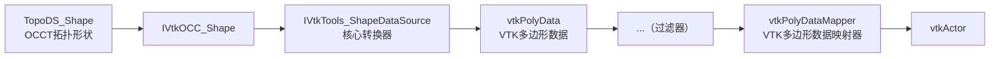

使用 VTK 对 OCCT 进行可视化，首先需要理解，OCCT 的立体几何数据 （`TopoDS_Shape`）使用 VTK 数据以及 VTK 数据进行渲染变化过程中的数据结构的变化。

首先，OCCT 的最基础的立体几何数据结构是 `TopoDS_Shape` ，OCCT 提供了 VTK 集成服务套件 （VIS），借助 VIS 可以很轻松地把 TopoDS_Shape 数据转变为 VIS 数据类型。

> VIS 组件由以下包组成：
>
> *   **IVtk** – 定义了作为 VIS 基础的主要对象的通用接口。
> *   **IVtkOCC** – 与 CAD 领域相关接口的实现。此包中的类处理 OCCT 的拓扑形状、分面处理和交互式选择功能。
> *   **IVtkVTK** – 与 VTK 可视化工具包相关接口的实现。
> *   **IVtkTools** – 设计用于集成到 VTK 可视化管线中的高级工具。



* `IVtkOCC_Shape` 是 OpenCascade 的几何数据 `TopoDS_Shape` 的包装器。
* `IVtkTools_ShapeDataSource` 是数据转换器，继承自`vtkPolyDataAlgorithm`，是一个标准的VTK数据源算法。其核心任务是通过调用`IVtkOCC_ShapeMesher`等组件，驱动整个将包装后的形状(`IVtkOCC_Shape`)转换为VTK能理解的`vtkPolyData`的流程，并管理该流程。

最后的 `vtkActor` 被加入到 render 中进行渲染：`renderer->AddActor(actor)` 。

具体的代码：

```cpp
void vtkWidget::addOCCTShapeToRender(const TopoDS_Shape& shape)
{
    if (shape.IsNull())
    {
        return;
	}
    // TopoDS_Shape -> IVtkOCC_Shape
    IVtkOCC_Shape::Handle aShapeImpl = new IVtkOCC_Shape(shape);
    // IVtkOCC_Shape -> IVtkTools_ShapeDataSource -> vtkPolyData
    vtkSmartPointer<IVtkTools_ShapeDataSource> dataSource = 
        vtkSmartPointer<IVtkTools_ShapeDataSource>::New();
    dataSource->SetShape(aShapeImpl);
    // vtkPolyData: dataSource->GetOutputPort();
    
    // vtkPolyData -> ( Filter × n ) 按照自己渲染目标选择 Filter -> vtkPolyData
    // 得到的还是 vtkPolyData (通过 Filter.GetOutputPort())
    vtkSmartPointer<IVtkTools_DisplayModeFilter> displayFilter = 
        vtkSmartPointer<IVtkTools_DisplayModeFilter>::New();
    displayFilter->SetDisplayMode(IVtk_DisplayMode::DM_Wireframe);
    displayFilter->SetInputConnection(dataSource->GetOutputPort());
    
    // vtkPolyData -> vtkPolyDataMapper -> vtkActor
    vtkSmartPointer<vtkPolyDataMapper> mapper = 
        vtkSmartPointer<vtkPolyDataMapper>::New();
    mapper->SetInputConnection(displayFilter->GetOutputPort());
	vtkSmartPointer<vtkActor> actor = vtkSmartPointer<vtkActor>::New();
	actor->SetMapper(mapper);
    
    // 最后加入渲染器，进行渲染，假设 m_renderer 为类的渲染器
    m_renderer->AddActor(actor);
    m_renderWindow->Render();
}
```

> 请不要直接复制，要理解代码的含义

示例代码中，使用的 `IVtkTools_DisplayModeFilter` 是 OCCT 提供的过滤器，用于实现两种不同的展示模式：`DM_Wireframe` 和 `DM_Shading` 。

（未完待续...）
