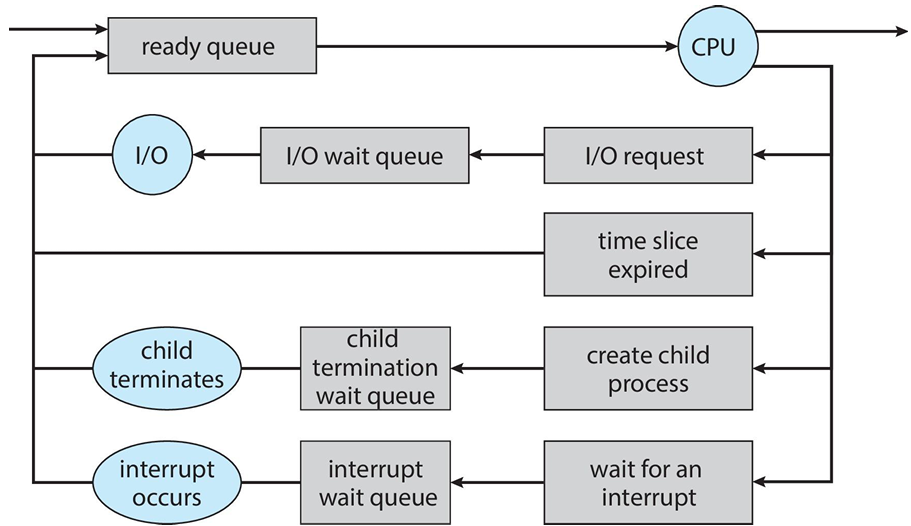
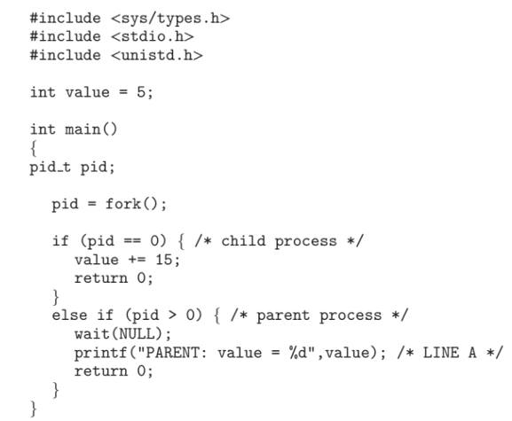
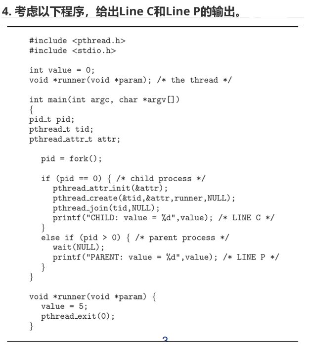
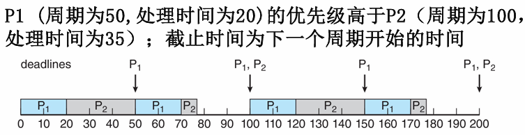
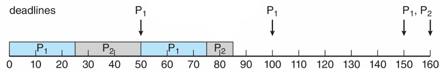
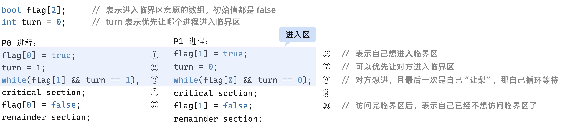

## 第一章

* 操作系统的定义：计算机用户和计算机硬件之间的程序

* 操作系统的目标：
  * 运行用户程序，更方便地运行用户程序
  * 更易于使用计算机系统
  * 更方便管理计算机的硬件

* 操作系统的三个用途：
  
  * 管理计算机硬件资源
  
  * 提供用户和计算机硬件的接口
  
  * 提供服务和资源
  
* 下面哪些项享有特权：
  
  * 设置计时器的值。需要特权
  
  * 读时钟。不需要，无特权也能读取
  
  * 清除内存。需要特权
  
  * 发出陷阱指令。陷入内核态，不需要特权
  
  * 关闭中断。需要特权，能关闭中断就可以无限占用CPU
  
  * 修改设备状态表条目。需要特权
  
  * 从用户模式切换到内核模式。不需要特权
  
  * 访问 I/O 设备，需要特权
  
* 一些CPU提供两种以上的操作模式。这多种模式的两种可能的用途是什么？
  
  1. 区分用户级别，提供分级服务
  2. 安全控制
  3. 允许部分设备在非内核模式下工作
  
* 中断的目的是什么？中断与陷阱有何不同？陷阱可以由用户程序有意生成吗？如果是，目的是什么？

  * 目的：在某个事件发生时打断正在执行的程序，并立即转移到该事件的相应处理程序上

  * 中断和陷阱的区别：

    中断：

    * 中断是由外部事件触发的机制
    * 中断可以打断正在执行的程序，并将控制转移到相应的中断处理程序
    * 中断处理程序可以是处理外部事件
    * 中断是异步事件，可以在任何时间发生，无论当前程序状态如何
    * 中断处理程序的执行是由硬件和操作系统控制的

    陷阱：

    * 陷阱是由程序中的指令或软件调用触发的机制，用户处理异常或特定的系统调用
    * 陷阱通常是程序中的特殊指令或出现特定条件触发的
    * 陷阱处理程序用于处理陷阱事件
    * 陷阱是同步事件，它们是由程序的执行流程和指令触发的
    * 陷阱处理程序的执行是由操作系统或软件控制的。

  * 陷阱可以由用户程序有意生成，用于陷入内核态以调用以下内核函数等。

* 中断处理过程：

  CPU在执行某条指令时发生异常或系统调用，或者 CPU 在执行某条指令后检测到中断请求。关中断，保存断点，保护中断前CPU现场。之后进入中断服务程序处理中断来源。中断服务处理结束后，恢复CPU现场，中断返回中断指令执行处继续执行。

* DMA 方式：

  CPU可以通过将数值写入可以被设备独立访问的特殊寄存器来启动DMA（直接内存访问）操作。一旦设备收到来自CPU的命令，就会启动相应的操作。

  当设备完成其操作时，会中断CPU以表示操作的完成。设备和CPU可以同时访问内存。

  内存控制器以公平的方式为这两个实体提供对内存总线的访问。因此，CPU可能无法以最高速度发出内存操作，因为它必须与设备竞争以获得对内存总线的访问权。

* 特权指令的示例：I/O管理、定时器管理、中断管理，切换到用户模式的指令

  用户模式和内核模式，是由硬件支持区分两种模式

  如果双重模式没有硬件支持，操作系统会有严重缺点

  一旦硬件保护到位，便可检测模式错误。这些错误通常由操作系统处理。如果一个用户程序出错，如试图执行非法指令或者访问不属于自己的地址空间内存，则通过硬件陷入到操作系统，陷入可通过中断向量将控制转移到操作系统。当一个程序出错时，可由操作系统来终止异常。

* 多处理器的三个优点：增加吞吐量、规模经济、增加可靠性。缺点：昂贵

* 对称多处理 vs 非对称多处理：

  * 对称多处理：每个处理器参与操作系统的所有任务，没有主从关系，所有处理器对等
  * 非对称多处理：有一个主处理器，从处理器 从主处理器中请求任务或执行预先分配的任务。主处理器 调度 从处理器，并分配工作，I/O 操作也只在主处理器上执行

* 有些计算机系统在硬件上不提供特殊的操作模式。有可能为这些计算机系统构建一个安全的操作系统吗?给出它是和它是不可能的论据。

  答:这类机器的操作系统需要始终处于控制状态(或监控模式)。这可以通过两种方法来实现:
  a：所有用户程序的软件解释(例如一些BASIC、Java和LISP系统)。软件解释器可以在软件中提供硬件不能提供的东西。
  b：所有的程序都要用高级语言编写，这样所有的目标代码都是由编译器生成的。编译器将生成(内联或通过函数调用)保护检查，以确定硬件是否缺失。

* 许多SMP系统有不同层次的缓存，有的缓存是为了单个处理核专用的，而有的缓存是为所有处理核共用的。为什么这么设计缓存系统?

  不同层次是基于访问速度和大小。一般来说，缓存离CPU越近，访问速度越快(越近实际上容量也越小)。然而，更快的缓存通常更昂贵.因此更小更快的缓存被放置在每个CPU的本地，较大但较慢的共享缓存在几个不同的缓存之间共享处理器。

* 请描述一种机制以加强内存保护，防止一个程序修改与其他程序相关的内存

  处理器可以跟踪与每个进程相关联的位置，限制对程序范围之外的位置的访问。关于程序内存范围的信息可以通过使用基本寄存器和限制寄存器来维护并通过对每个内存地址的访问执行检查。

## 第二章

* 操作系统的服务：

  用于提供用户功能：

  * 用户界面
  * I/O 操作
  * 程序执行
  * 文件系统操作
  * 通信
  * 错误检测

  用于确保系统本身的运行高效：

  * 资源分配
  * 记账
  * 保护与安全

* 系统调用：提供操作系统服务的接口

* 向操作系统传递参数的三种常用方法：

  * 寄存器直接传递参数
  * 参数保存在内存的块或表内，而块或表的地址通过寄存器传递
  * 通过程序将数据压入堆栈，并通过操作系统弹出堆栈的数据

* 系统调用的类型：

  * 进程管理
  * 文件管理
  * 设备管理
  * 信息维护
  * 通信
  * 保护

* 策略和机制分离：机制决定怎么做，策略决定做什么

* 操作系统的结构：

  * 简单结构

  * 分层结构：将操作系统分为若干层级，最底层为硬件，最高层为用户接口。每层只能调用更低层的功能和服务。

    难点：如何分层，效率差，层级之间参数传递开销大

  * 微内核：对内核进行模块化，内核中只保留必要的部分。

    通信方式：微内核的消息传递

    易于扩展、容易移植、安全可靠

    系统功能开销增加，性能受损

  * 模块化：内核提供核心服务，而其他服务可在内核运行时动态实现。动态链接服务优于直接添加新功能到内核。

    任何模块可以调用任何其他模块

* 系统启动和引导

  * 系统开始启动初始化，在一个固定的内存位置开始执行。
  * 引导加载程序，存储在 ROM 或 EPROM中，位于内核，将其加载到内存后启动。
  * 大型操作系统，引导程序放在固件上，操作系统放在磁盘上。引导程序首先进行自检，然后读取 Boot Sequence，将控制权交给启动顺序排在第一位的存储设备，然后CPU 将该存储设备的引导扇区的内容加载到内存中。加载主引导记录 MBR。扫描硬盘分区表，加载硬盘活动分区，将控制权交给活动分区，加载分区引导记录 PBR。读取活动分区的第一个扇区。加载启动管理器，加载操作系统。


* 系统调用的目的是什么？

  系统调用是操作系统提供给程序员的一组结构，程序员通过这组结构请求操作系统为其提供服务。系统调用的目的是：

  * 提供硬件抽象
  * 确保系统的安全和稳定
  * 提高资源管理效率

* 系统设计的分层方法的主要优点和缺点：

  优点：

  * 模块化，每一层功能独立性高，易于开发和维护
  * 灵活性：由于层与层之间的解耦，更换或修改某一层相对容易
  * 安全性：通过分层可以实现更细的安全控制
  * 容易理解：分层模型有利于理解系统的工作原理，每层的功能都是建立在下一层功能之上的，清晰定义了各层的职责

  缺点：

  * 性能开销：每层之间交互会增加额外的调用开销
  * 设计复杂：合理定义每层功能的边界有困难，可能导致某些功能在多个层重复实现
  * 灵活性限制：尽管分层可以提高某些类型的灵活，但过度的分层可能导致系统的整体结构变得僵硬

* 操作系统提供的服务和功能可以分为两大类。简要描述 这两个类别，并讨论它们的区别。

  用户级服务和系统级服务

  简要描述

  * 用户级服务是操作系统提供给应用程序的高级功能和接口。它们使应用程序能够更方便地利用操作系统提供的底层服务。
  * 系统级服务是操作系统提供的底层服务和功能，用于管理和控制计算机的硬件资源及其运行环境。

  区别：

  * 这两个类别的区别在于其提供的服务的层次和功能范围。系统服务是操作系统的核心功能，负责底层资源的管理和控制，以及提供给其他软件和应用程序使用的基础功能。应用服务则是在系统服务的基础上构建的更高级的功能，旨在为应用程序提供更方便和高层次的接口和服务。系统服务更加底层和通用，而应用服务更加面向特定的应用领域和用户需求。

* 描述如何获得一个程序执行不同代码部分的时间统计简表。讨论获得这种简表的重要性

  可以发出周期性的定时器中断，并且当中断到达时监控代码正在执行的片段或指令。一个活跃代码片段统计表与程序在不同代码片段的耗时一致。一旦获得了统计表，程序员可以优化消耗CPU资源较多的代码片段

* 操作系统文件管理的 5 个主要的功能是什么

  * 创建和删除文件
  * 目录的创建和删除
  * 支持操作文件和目录的原语
  * 文件到辅助存储的映射
  * 在非易失存储设备上备份文件

* 对于操作文件和设备，采用同样的系统调用接口有什么优点和缺点？

  * 优点：可以像访问文件系统中的文件一样访问每个设备。因为大多数内核都是通过文件接口来处理设备的，所以相对容易通过具体硬件的代码来支持抽象的文件接口来增加一个新的设备驱动器。因此有利于用户程序代码，它可以以同样的方式访问设备和文件，并且在设备驱动代码可以支持一个定义明确的API。
  * 缺点：可能难以在文件访问API的上下文中捕获某些设备的功能，从而导致功能丧失或性能下降。

* 采用操作系统提供的系统调用接口，用户是否能够开发一个新的命令解释程序？

  用户能够通过系统提供的系统调用开发新的命令解释器。命令解释器允许用户创建和管理进程以及决定同通信方式。由于这些功能都可以被用户进程通过系统调用所执行，所以用户能够开发一个新的命令行解释程序。

* 进程间通信的两种模式是什么? 优点缺点各是什么?

  消息传递和内存共享

  * 消息传递：通信进程通过相互交换消息来传递信息。进程间的消息交换可以直接进行，也可以通过邮箱进行。对于少量数据的交换非常有用，因为不需要避免冲突，且实现简单。
  * 共享内存，具有高速和便捷的特点，当通信发生在同一计算机中，它可以按内存传输速度来进行。不过，共享内存的进程在保护和同步方面有问题。

* 为什么机制和策略分离是可取的？

  机制和策略必须分离，以确保系统易于修改。没有两个系统的安装是完全相同的，因此每个安装都可能希望调整操作系统以适应其需求。通过机制和策略分离，策略可以随意改变，而机制保持不变，这种安排提供了一个更加灵活的系统。

* 如果操作系统的两个组件相互依赖，那么采用分层法有时很难。找一个这样的场景: 有两个系统组件的功能是紧密耦合的，但如何对它们分层却并不清楚。

  虚拟内存子系统 和 存储子系统 通常紧密耦合，在分层系统中需要仔细设计，因为它们之间有以下相互作用。

  * 许多系统 允许 文件映射到正在执行进程的虚拟内存空间中
  * 虚拟内存子系统 通常使用 存储系统 为 当前不在内存中的页 提供后备存储。
  * 对文件系统的更新，有时会在写入磁盘之前保存在物理内存的缓存区中

  因此，需要谨慎协调 虚拟内存子系统 和 文件子系统 之间 的内存使用

* 微内核方法在系统设计上的主要优点是什么？用户程序和系统服务如何在微内核架构中交互？微内核方法的缺点是什么？

  优点：

  * 已于扩展，添加新服务不需要修改内核
  * 更加安全，在用户模式下进行的操作比内核模式下进行的操作更多

  * 更简单的内核设计和功能通常会带来更可靠的系统

  用户程序和系统服务 在微内核架构中 通过使用 进程间通信机制 例如 消息传递 来交互。这些消息由操作系统传递。

  缺点：

  进程间通信相关的开销，以及频繁使用操作系统的消息传递功能来实现用户进程和系统服务之间的交互。

* 使用可加载内核模块的优点是什么？

  可以在内核运行时添加和移除功能，而无需重新编译或重新启动内核。增加操作系统设计的灵活性。


## 第三章

* 进程：正在执行的程序。由多个部分组成：程序代码（文本段）、当前活动（程序计数器、处理器、寄存器）、堆栈（包含函数参数，返回地址和局部变量）、数据段（包含全局变量）、堆（包含进程运行时动态分配的内存）

  * 程序是存储在磁盘上的可执行文件，是被动实体
  * 进程的活动实体。可执行文件载入内存之后，就成为进程。
  * 进程是现代分时操作系统的工作单元
  * 进程是 系统分配资源的 基本单位

* 进程管理：

  * 进程状态：

    * 创建 new：进程正在被创建。

      创建进程的步骤：首先申请一个空白 PCB，并向 PCB 中填写用于控制和管理进程的信息；然后为该进程分配运行时所需的资源；最后把进程转入就绪态并插入就绪队列。

      但是，进程所需资源尚不能满足，则创建工作尚未完成，此时进程称为创建态。

    * 运行 running

    * 等待 waiting：等待某一事件而暂停运行。

      此时即使处理机空闲也不能运行。根据阻塞原因不同，设置多个阻塞队列。

    * 就绪 ready

      进程获得除处理机之外的所有资源

    * 终止 terminated

    不同状态之间的切换的机制：

    * 就绪态 -> 运行态：处于就绪态的进程被调度后，获得处理机资源，于是进程由就绪态转为运行态
    * 运行态 -> 就绪态：处于运行态的进程在时间片用完之后，不得不让出处理机，从而进程从运行态转为就绪态。此外，在可抢占的系统中，当有更高级别的进程就绪时，调度程序将正在执行的程序转为就绪态，让更高优先级的进程执行。
    * 运行态 -> 阻塞态：进程请求某一资源（如外设）的使用和分配 或 等待某一事件的发生（如 I/O 操作的完成）时，它就从 运行态 转为 阻塞态。
    * 阻塞态 -> 就绪态：进程等待的事件发生时，中断处理程序必须把相应进程的状态由阻塞态转为就绪态。

    注意：运行态 -> 阻塞态 是主动行为，阻塞态 -> 就绪态 是被动行为，需要其他程序的协助。

* 进程的组成：进程控制块、程序代码段、数据段

* **进程控制块** PCB：包含了操作系统用来控制和协调各种进程活动所需要的信息

  包含：进程状态、程序计数器、CPU寄存器、CPU 调度信息（优先级、调度队列指针）、内存管理信息、记账信息（CPU时间、实际使用时间、时间期限、记账数据、作业和进程数量等）、I/O 状态信息

  * 系统 通过 进程控制块 对 进程进行控制

* **进程控制**

  * 进程的创建过程：
    1. 为新进程分配一个唯一的标识符，并申请一块空白 PCB，若申请失败，则创建失败
    2. 为进程申请运行所需的资源，若资源不足，则进程处于创建态
    3. 初始化 PCB，初始化 PCB 中的进程状态信息、处理机信息、内存管理信息等内容
    4. 若就绪队列可以接纳新进程，则把新进程加入到就绪队列中，转为就绪态
  * 进程的终止：
    * 终止原因：正常结束、异常结束、外界干预
    * 终止过程：
      1. 根据进程的标识符，找到对应 PCB，从中获取进程的状态
      2. 若被终止进程处于运行态，则终止运行，将处理机资源释放，分配给其他进程
      3. 若还有子孙进程，则将其子孙进程终止
      4. 将该进程的全部资源，或归还给父进程，或释放到操作系统中
      5. 将该进程 PCB从其所在队列中删除
    * 父进程终止子进程的原因：
      * 子进程使用超出它所分配的资源
      * 分配给子进程的任务，不再需要
      * 父进程正在退出，而且操作系统不允许无父进程的子进程继续执行
    * 级联终止：如果一个进程终止，那么它的所有子进程也应终止
    * 僵尸进程：当进程已经终止，但是其父进程未调用 wait()
    * 孤儿进程：当父进程没有调用 wait() 就终止
  * 进程的阻塞和唤醒：
    * 阻塞原语：
      1. 根据被阻塞进程的 标识符找到进程的 PCB
      2. 若进程处于运行，则保存现场，将状态转为阻塞态，终止运行
      3. 将该 PCB 插入相应时间的等待队列中，将处理机资源调度给其他进程
    * 唤醒原语：
      1. 在等待队列中找到相应的 PCB
      2. 将其从 队列中移出，然后将状态设置为就绪态
      3. 把 PCB 插入到就绪队列中，等待调度程序调度


* 进程调度

  * 进程在进入系统中，会被加入到 作业队列 中，这个队列包含系统中的所有进程。
  * 驻留在内存中的、就绪的、等待运行的 进程，保存在 就绪队列 中
  * 等待特定 I/O 设备的 进程列表，称为 设备队列。每个设备都有自己的设备队列。

* **调度程序**

  * 长期调度程序（作业调度程序）

    * 对于批处理系统，提交的进程多于可以执行的，进程就会被保存在大容量的存储设备的缓冲池中。

    * 长期调度程序就是从该池中选择进程，加到内存中，以便执行。

    * 一个进程只调入一次、调出一次

    * 多道批处理系统中大多配有作业调度，而其他系统通常不需要配置作业调度

    * 长期调度程序 决定了 多道程序的程度（内存中的进程数）

    * 长期调度程序应该选择 I/O 密集型 和 CPU 密集型的 合理进程组合。

      I/O 密集型进程，执行 I/O 比执行计算需要花费更多时间

      CPU 密集型进程，很少产生 I/O 请求，而是将更多的时间用于执行计算

  * 短期调度程序（CPU 调度程序）

    从准备执行的进程中选择进程，并分配 CPU。

    短期调度程序执行频率很高，而且执行时间段，而长期调度程序的执行频率很低。

  * 中期调度程序

    将进程从内存（或 CPU 竞争）中移出，从而降低多道程序的程度。之后，进程可被重新调入内存，并从中断处继续执行。这种方案称为 **交换**。

* 上下文切换

  * 当中断发生时，系统需要当前运行在 CPU 上的进程的上下文，以便在处理后能恢复上下文，及先挂起进程，再恢复进程。进程的上下文使用 PCB 表示。
  * 切换 CPU 到另一个进程 需要保存当前进程状态和恢复另一个进程的状态，这个任务叫做上下文切换。
  * 当进行上下文切换时，内核会将旧进程状态保存在 PCB 中，然后加载经调度而要执行的新进程的上下文。
  * 上下文切换的时间依赖于 硬件支持。例如，有的处理器提供多个寄存器组，上下文切换只需改变寄存器组的指针 。
  * 上下文切换的时间是纯粹的开销，因为切换时系统没有做任何有用的工作。
  * 上下文切换的流程：
    1. 挂起一个进程，保存 CPU 上下文，包括程序计数器和其他寄存器
    2. 更新 PCB 信息
    3. 把进程的 PCB 移入相应队列，如就绪队列、某事件的阻塞队列中
    4. 选择另一个进程执行，并更新其 PCB
    5. 跳转到 新进程的 PCB 中的程序计数器所指向的位置执行
    6. 恢复处理器的上下文

* 允许进程协作的原因：信息共享、计算加速、模块化、方便

* 进程通信：

  * 共享内存：建立一块协作进程共享的内存区域，进程向此共享区域读出或写入数据来交换信息。

    共享内存系统仅在建立共享内存区域时需要系统调用，一旦建立共享内存，所有的访问都可作为常规的内存访问，无需借助内核。

  * 消息传递：通过协作进程间交换信息来实现通信。

    少量数据交换很有用，因为无需避免冲突。对于分布式系统，消息传递比共享内存更容易实现。消息传递的实现经常采用系统调用，因此消耗更多时间让内核介入。

  * 对于具有多个处理核系统，消息传递的性能要优于共享内存。共享内存会有高速缓存一致性问题，这是由共享数据在多个高速缓存之间迁移而引起的。
  
* 共享内存系统

  生产者-消费者问题：生产者进程生成信息，以供消费者进程消费。解决 生产者-消费者 问题的方法之一就是，采用共享内存。为了允许生产者进程和消费者进程并发执行，应有一个可用的缓冲区，以被生产者填充和被消费者清空。这个缓冲区驻留在生产者进程和消费者进程的共享内存区域内。当消费者使用一项时，生产者可生产一项。生产者和消费者必须同步，这样消费者不会试图消费一个尚未生产出来的项。

  缓冲区类型可分为两种：

  * **无界缓冲区**：没有限制缓冲区的大小。消费者可能不得不等待新的项，但生产者总是可以生产新项
  * **有界缓冲区**：假设固定大小的缓冲区。如果缓冲区空，则消费者必须等待；如果缓冲区满，生产者必须等待。

* 消息传递系统

  * 消息传递工具至少提供两种操作：send(message) ， receive(message) 

  * 直接通信：

    * send(P, message)：向进程 P 发送 message
    * receive(Q, message)：从进程 Q 接受 message
    * 通信链路 的属性：
      * 在需要通信的每对进程之间，自动建立链路。进程仅需知道对方的身份就可进行交流
      * 每个链路只与两个进程有关
      * 每对进程之间只有一个链路
      * 链路可能是单向的，通常是双向的

    这种方案展示了寻址的 对称性

    变形采用寻址的非对称性：即只要发送者指定接收者，而接收者不需要指定发送者：

    * send(P, message)：向进程 P 发送 message
    * receive(id, message)：从任何进程接受 message，id 设置为与其通信进程的名称

    这两个方案（对称和非对称的寻址）的缺点：生成进程定义的有限模块化。更改进程的标识符可能需要分析所有其他进程定义。所有旧的标识符的引用都应被找到，以便修改为新标识符。

  * 间接通信，通过 邮箱 或 端口 来发送和接受消息。

    邮箱，可以抽象为一个对象，进程可以向其中存放消息，也可从中删除消息。每个邮箱都有唯一的标识符。

    * send(A, message)：向邮箱 A 发送 message
    * receive(A, message)：从邮箱 A 接受 message

    通信链路特点：

    * 只有在两个进程共享一个邮箱时，才能建立链路
    * 一个链路可以与两个或更多进程关联
    * 两个通信进程之间可有多个不同链路，每个链路对应一个邮箱

    邮箱可以为进程所有，可以为操作系统所有，也可以转移

  * 同步

    消息传递可以是 阻塞 或 非阻塞，也称为 同步 或 异步

    * 阻塞发送：发送进程 阻塞，直到 消息 由接受进程或邮箱所接受
    * 非阻塞发送：发送进程发送消息，并且恢复操作
    * 阻塞接受：接受进程 阻塞，直到 消息可用
    * 非阻塞接受：接受进程收到一个有效消息 或 空消息

  * 缓存

    不管通信是直接还是间接，通信进程交换的信息总是驻留在 临时队列中。

    队列实现有三种方法：

    * 零容量：队列最大长度为 0。链路中不能有任何消息处于等待。发送者应阻塞直到接收者接受信息。
    * 有限容量：队列长度为 有限的 n：因此最多只能有 n 个消息驻留在其中。如果发送消息时队列未满，那么消息可以放在队列中，且发送者可以继续执行而不必等待。然后如果链路已满，发送者应阻塞，直到队列空间有可用的为止。
    * 无限容量：队列长度可以无限，因此，不管多少消息都可在其中等待。发送者从不阻塞。


* 管道

  * 允许两个进程进行通信

  * 普通管道

    * 允许按标准的 生产者-消费者 风格的通信
    * 生产者写入一段（管道的写入端）
    * 消费者从另一端（管道的读取端）读取数据
    * 因此，普通管道是单向的
    * 需要进程之间的父子关系

  * 匿名管道：windows 系统中普通管道称为匿名管道

    单向、父子进程之间的传输

  * 命名管道

    * 命名管道，比普通管道功能更强大
    * 通信是双向的
    * 通信进程之间不要父子关系
    * 建立一个命名管道后，多个进程可使用它通信

  * 半双工通信：同一时间只能按一个方向传输

  * 双工通信：同一时间可在两个方向上传输


习题

* 论述长期调度、中期调度和短期调度的差异

  * 短期（CPU调度器）——从内存中的作业中选择那些准备好执行的作业，并将CPU分配给它们。
  * 中期——特别用于分时系统，作为一种中间调度级别。实现了一种交换方案，将部分运行的程序从内存中移除，稍后再恢复它们，从中断的地方继续运行。
  * 长期（作业调度器）——决定哪些作业被带入内存进行处理。
  * 主要区别在于它们执行的频率。短期调度器必须经常选择一个新进程。长期调度器使用频率较低，因为它处理将作业放入系统中，可能会等待一段时间让一个作业完成，然后再接纳另一个作业。

* 内核采取一些动作，以便在两个进程之间进行上下文切换，请描述一下

  1. 保存当前进程的上下文到 PCB。
  2. 根据调度算法选择下一个执行的程序
  3. 加载下一个执行程序的 PCB
  4. 开始执行新程序

* 如下的程序创建了多少个进程（包括初始的父进程）？

  ```cpp
  #include<stdio.h>
  #include<unistd.h>
  
  int main()
  {
      int i;
      for(int i = 0; i<4; i++)
          fork();
      
      return 0;
  }
  ```

  一开始有一个原始进程

  第一次 fork() 之后，共有 2 个进程

  第二次 fork() 之后，共有 4 个进程

  第三次：8 个

  第四次：16 个

  所以，以上程序一共创建了 16 个进程。

* 采用图3.34程序，确定A、B、C、D中pid的值.(假定父进程和子进程的pid分别为2600和2603)

  ```cpp
  #include <sys/types.h>
  #include <stdio.h>
  #include <unistd.h>
  
  int main() {
      pid_t pid, pid1;
  
      /* fork a child process*/
      pid = fork();
  
      if(pid < 0)
      {/*error ocurred*/
          fprintf(stderr, "Fork Failed");
          return 1;
      }
      else if(pid == 0) 
      {/*child process*/
          pid1 = getpid();
          printf("child: pid = %d", pid); /*A*/
          printf("child: pid1 = %d", pid1);/*B*/
      }
      else 
      {/*parent process*/
          pid1 = getpid();
          printf("parent: pid = %d", pid);/*C*/
          printf("parent: pid1 = %d", pid1);/*D*/
          wait(NULL);
      }
  
      return 0;
  }
  ```

  A = 0, B = 2603, C = 2603, D = 2600

* 解释如图所示的标记为printf(“LINE J”)的行所能执行的环境，请解释一下

  ```cpp
  #include<sys/types.h>
  #include <unistd.h>
  #include<stdio.h>
  
  int main() 
  {
      pid_t pid;
      /*fork a child process*/
      pid = fork();
  
      if(pid < 0)
      {/*error occurred*/
          fprintf(stderr, "Fork Failed");
          return 1;
      } 
      else if(pid == 0)
      {/*child process*/
          execlp("/bin/ls", "ls", NULL);
          print("LINE J");
      }
      else 
      {/* parent process*/
          /* parent will wait for the child to complete*/
          wait(NULL);
          printf("Child Complete");
      }
  
      return 0;
  }
  ```

  对 `exec()` 的调用将使用作为 `exec()` 参数指定的程序替换进程的地址空间。如果 `exec()` 调用成功，新程序开始运行，并且对 `exec()` 的调用永远不会返回控制权。在这种情况下，`printf("Line J");` 这一行将永远不会执行。然而，如果在 `exec()` 调用中发生错误，函数将返回控制权，因此 `printf("Line J");` 这一行将会执行。

* 对于普通管道和命名管道有时候可能一方更加合适，请举例说明

  * 普通管道适用于简单的通信。例如，假设我们有一个进程用来计算文件中的字符数。可以使用一个普通管道，其中生产者将文件写入管道，消费者读取文件并计算文件中的字符数。
  * 适合使用命名管道的例子，其中多个进程可能向日志写入消息。当进程希望向日志写入消息时，它们将消息写入命名管道。一个服务器从命名管道读取消息并将它们写入日志文件。

* 使用如图3.35所示程序，解释X、Y行输出将会是什么

  ```cpp
  #include <sys/types.h>
  #include <stdio.h>
  #include <unistd.h>
  
  #define SIZE 5
  
  int nums[SIZE] = {0, 1, 2, 3, 4};
  
  int main()
  {
      int i;
      pid_t pid;
  
      pid = fork();
      if(pid == 0)
      {
          for(i = 0; i < SIZE; i++)
          {
              nums[i] *= -i;
              printf("CHILD: %d", nums[i]);/*LINE X*/
          }
      }
      else if(pid > 0)
      {
          wait(NULL);
          for(i = 0; i < SIZE; i++) 
              printf("PARENT: %d", nums[i]);/*LINE Y*/
      }
  }
  ```

  因为子进程是父进程的副本，所以子进程所做的任何更改都会发生在它自己的数据副本中，不会反映在父进程中。因此，子进程在第X行输出的值是 0, -1, -4, -9, -16。父进程在第Y行输出的值是 0, 1, 2, 3, 4。

* 下面设计的优缺点是什么?系统层次和用户层次都要考虑
  a. 同步和异步通信
  b. 自动和显示缓冲
  c. 复制传送和引用传送
  d. 固定大小和可变大小消息

  a. **同步和异步通信**——同步通信的一个好处是它允许发送方和接收方之间的会合。阻塞发送的一个缺点是，有时不需要会合，消息可以异步传递。因此，消息传递系统通常提供两种形式的同步。

  b. **无限长度**，确保发送方在等待复制消息时永远不会阻塞。没有关于如何提供自动缓冲的具体规定；一种方案可能会保留足够大的内存，但会浪费大量内存。显式缓冲指定缓冲区的大小。在这种情况下，发送方可能会在等待队列中可用空间时被阻塞。然而，显式缓冲更不容易浪费内存。

  c. **按值传递和按引用传递**——按值传递不允许接收方更改参数的状态；按引用传递则允许。按引用传递的一个好处是它允许程序员编写集中应用的分布式版本。Java 的 RMI 提供了这两种方式；然而，按引用传递参数需要将参数声明为远程对象。

  d. **固定大小和可变大小消息**——这主要与缓冲问题有关；对于固定大小的消息，特定大小的缓冲区可以容纳已知数量的消息。对于可变大小的消息，这种缓冲区能容纳的消息数量是未知的。考虑Windows 2000是如何处理这种情况的：对于固定大小的消息（小于256字节的任何消息），消息从发送方的地址空间复制到接收进程的地址空间。较大的消息（即可变大小消息）使用共享内存传递。

  **a. 对称和非对称通信**

  - **对称通信的优点**：
    - 允许发送方和接收方之间的会合（同步）。
  - **对称通信的缺点**：
    - 阻塞发送的情况下，可能不需要会合，消息可以异步传递；消息可能在发送方不关心的时间点被接收。
  - **非对称通信的优点**：
    - 消息可以异步传递，不会阻塞发送方，发送方不必等待接收方准备好接收消息。
  - **非对称通信的缺点**：
    - 缺少同步机制，可能导致发送方和接收方之间的协调问题。

  因此，消息传递系统通常提供这两种形式的同步。

  **b. 自动和显式缓冲**

  - **自动缓冲的优点**：
    - 提供一个无限长度的队列，确保发送方在等待复制消息时不会被阻塞。
  - **自动缓冲的缺点**：
    - 没有具体规定如何提供自动缓冲；一种方案可能会保留足够大的内存，但会浪费大量内存。
  - **显式缓冲的优点**：
    - 明确指定缓冲区的大小，减少内存浪费的可能性。
  - **显式缓冲的缺点**：
    - 发送方可能会在等待队列中可用空间时被阻塞。

  **c. 按值传递和按引用传递**

  - **按值传递的优点**：
    - 不允许接收方更改参数的状态，确保数据的完整性。
  - **按值传递的缺点**：
    - 可能会导致性能开销，因为需要复制数据。
  - **按引用传递的优点**：
    - 允许接收方更改参数的状态，适合编写分布式版本的集中应用程序。
  - **按引用传递的缺点**：
    - 可能会导致数据不一致的问题，因为接收方可以修改参数的状态。

  **d. 固定大小和可变大小的消息**

  - **固定大小消息的优点**：
    - 特定大小的缓冲区可以容纳已知数量的消息，容易管理和预测。
  - **固定大小消息的缺点**：
    - 不适用于需要传递大消息的情况，因为每个消息必须适应固定大小。
  - **可变大小消息的优点**：
    - 适应不同大小的消息，更加灵活。
  - **可变大小消息的缺点**：
    - 难以管理和预测，因为缓冲区能容纳的消息数量未知。
  
* 下图程序在LINE A处的输出是什么？为什么会有这样的输出：

   

  输出为 5，因为父子进程不共享全局变量，由判断条件 `pid>0` 可知，此时是父进程执行，所以 value 保持初始化值 5


## 第四章

* 线程，是 CPU 调度的基本单元

* 线程，只包含运行时的状态，包括了执行所需要的最小状态（主要是寄存器和栈）

  静态部分由进程提供。

* 一个进程可以包含多个线程

  * 每个线程共享同一地址空间
  * 允许线程在进程内并行

* 线程包含：线程ID、程序计数器、寄存器和堆栈

* 和其他线程共享：代码段、数据段和其他操作系统资源

* 一个进程的多个线程可以在不同处理器上同时执行

  * 每个线程都有状态
  * 上下文切换的基本单位变成了线程
  * 每个线程拥有自己的栈
  * 内核中也有为线程准备的内核栈

* 多线程编程四大优点：响应性、资源共享、经济、可伸缩性

* 多线程可在单核处理器上并发执行，在多核处理器上并行执行。

  * 在单核系统上并发执行：通过快速的CPU调度进程，支持多个任务，提供并行的假象，任意时刻只能执行一个任务；

  * 在多核系统上的并行性：可以同时执行多个任务
  * 并行的类型：
    * 数据并行性——将相同数据的子集分布在多个核上，每个核上的操作相同
    * 任务并行性——将任务而不是数据分配到多个计算核心，每个线程执行唯一的操作，不同线程可以操作相同的数据，也可以操作不同的数据。

* 多线程模型

  * 多对一模型（用户级线程 ULT）

    * 线程管理由用户空间的线程库完成
    * 线程切换不需要转换到内核空间，节省了模式切换的开销
    * 更灵活、更高效。调度算法可以是进程专用的，不同进程可以根据自身需要，对自己的线程选择不同的调度算法。实现与操作系统无关，对线程管理的代码是属于用户程序的一部分。
    * 实现起来比其他模型更复杂
    * 如果一个线程阻塞，那么整个进程都会阻塞。任何时候只有一个线程可以访问内核，所以多个线程不能并行地运行在多处理器系统上。 

  * 一对一模型（内核级线程 KLT）

    * 每一个用户级线程都有一个一一对应的内核线程（最常用的多线程模型）

    * 一个线程阻塞时，能允许另一个线程继续执行

    * 能充分发挥多处理机的优势，内核能同时调度同一进程中的多个线程并行执行

    * 内核支持线程具有很小的数据结构核堆栈，线程切换比较快、开销小

    * 内核本身也可采用多线程技术，可以提高系统的执行速度和效率

    * 缺点：同一进程的线程切换，需要从用户态转到和心态进行，系统开销较大。

      这是因为，用户进程的线程在用户态下运行，而线程调度和管理是在内核实现的。

  * 多对多模型

    多路复用多个用户级线程到相同数量或更少数量的内核线程。

    拥有上述两种模型的优点，最灵活。但是最难实现。

* 线程库
  * 线程库，为程序员提供了创建和管理线程的 API
  * 两种主要的实施方式：
    * 第一种方式：在用户空间中提供一个没有内核支持的库
    * 第二种方式：实现操作系统支持的内核级库
  * `Pthreads`
    * 可以作为用户级或内核级提供
    * API 制定了线程库的行为，实现取决于库的开发
* 线程池
  * 主要思想：在进程开始时创建一定数量的线程，并加到池中以等待工作。当服务器收到请求时，它会唤醒池中的一个线程，并将需要服务的请求传递给它。
  * 优势：
    * 使用现有线程服务请求比创建新线程更快
    * 线程池限制了任何时候可用线程的数量
    * 将要执行的任务从创建任务的机制中分离，运行我们采用不同的策略运行任务

* 多线程问题：

  * `fork()` 和 `exec()` 系统调用的语义

    * `fork()` 是只复制调用线程还是复制所有线程？有些 `unix` 有两种 fork版本
    * `exec()` 通常正常工作——替换正在执行的进程，包括所有的线程

  * 信号处理

    * 在 UNIX 系统中，信号用于通知进程某个特定事件已发送
    * 信号处理器用于处理信号
      1. 信号由特定事件产生
      2. 信号被传送到进程
      3. 信号由两个信号处理程序之一处理：违约、用户定义
    * 每个信号都有内核在处理信号时运行的默认处理程序
      * 用户定义的信号处理程序可以覆盖默认值
      * 对于单线程，信号传输到进程
    * 多线程的信号在哪里传递？
      * 将信号传递到应用该信号的线程
      * 将信号传递给进程中的每个线程
      * 将信号传递给进程中的某些线程
      * 指定一个特定线程来接受进程的所有信号

  * 线程撤销

    * 在线程结束之前终止它
    * 要撤销的线程是目标线程
    * 两种方法：
      * 异步撤销：立即终止目标线程
      * 延迟撤销：允许目标线程定期检查是否应该终止
    * 缺省撤销类型为延迟撤销。取消仅在进程达到撤销点时发送

  * 线程本地存储：每个线程自己的数据。

    和局部变量不同的是，局部变量只在单个函数调用才可见。而 TLS 数据在多个函数调用时都可见。在某些方面 TLS 类似静态函数。不同的是，TLS 数据是每个线程独特的。

  * 调度程序激活：内核与线程库之间的通信

    M:M 和 两级模型，都需要通信来维护分配给应用程序的适当数量的内核线程

    * 通常在用户线程和内核线程之间使用 中间数据结构——轻量级进程（LWP）
    * 类似虚拟处理器，进程可以在该处理器上调度和运行用户线程。
    * 每个 LWP 都连接到内核线程

    用户线程库和内核之间的一种通信方式称为，调度器激活。它的工作如下：内核提供一组虚拟处理器（LWP）给应用程序，而应用程序可以调度用户线程到任何一个可用虚拟处理器。此外，内核应将有关特定事件通知应用程序，这个步骤称为 回调，它由线程库通过 回调处理程序 来处理。当一个线程阻塞时，一个触发回调的事件会发生。


习题

* 举两个程序实例，其中多线程不比单线程具有更好的性能

  * 任何顺序执行的程序不适合使用多线程。
  * 另一个例子是类似C-shell或Korn shell的“shell”程序。这类程序必须密切监控自己的工作空间，如打开的文件、环境变量和当前工作目录。

* 在什么情况下，采用多内核线程的多线程方法比单处理器系统的单线程，提供更好的性能？

  当一个内核线程发生页面错误（或者请求事件发生操作而发生阻塞）时，可以切换另一个内核线程来利用交错时间进行有用的工作。另一方面，单线程进程在发生页面错误时不能执行有用的工作。因此，在程序可能频繁遇到页面错误或需要等待其他系统事件的情况下，即使在单处理器系统上，多线程解决方案也能提供更好的性能。

* 在同一进程的多线程之间，下列哪些程序状态会被共享？

  a. 寄存器值 b. 堆内存 c. 全局变量 d. 堆栈内存

  多线程中的线程共享 堆内存核全局变量，每个线程具有独立的寄存器值和独立的栈

* 在多处理系统上采用多个用户级线程的多线程解决方案，比在单处理机系统上，能够提高更好的性能吗？请解释。

  多用户级线程的系统不能同时利用多处理器的不同处理器。操作系统只能看到一个单一的进程，并不会在不同处理器上调度进程的不同线程。因此，在多处理器上执行用户级线程并不会带来性能上的好处。

* 有可能有并发但无并行吗？请解释

* 设有一个应用，其 60% 为并行部分，而处理核数量分别为 2 个和 4 个，使用 Amdahl 定理，计算加速增益

  

* 确定下列问题是任务并行性还是数据并行性：

  * 多线程统计系统
  * 多线程的 Sudoku 验证器
  * 多线程排序程序
  * 多线程Web服务

* 具有2个双核处理器的系统有4个处理核可用于调度。这个系统有一个 CPU密集型 应用程序运行。在程序启动时，所有输入通过打开一个文件而读入。同样，在程序终止之前，所有程序输出结果，都写入一个文件。在程序启动和终止之间，该程序为 CPU密集型 的。你的任务是通过多线程技术来提高这个应用程序的性能。这个应用程序运行在采用一对一线程模型的系统(每个用户线程映射到一个内核线程)。

  * 你将创建多少个线程，用于执行输入和输出？请解释。
  * 你将创建多少个线程，用于应用程序的CPU密集型部分？请解释。

* 考虑下面的代码段：

  ```cpp
  pid_t pid；
  
  pid = fork()；
  if (pid == 0) { /* child process */
  	fork()；
  	thread_create(...);
  }
  fork()；
  ```

  a. 创建了多少个单独进程？

  6个
  进程数量只和fork 的执行有关，一开始代码本身有1个进程，称为A1
  经过第一个fork ，创建子进程A2
  第2个fork 仅子进程A2可以执行，创建子进程A3
  第3个fork ，A1、A2、A3都可以执行，所以最后有6个进程
  综上，此代码会创建6个进程

  b. 创建了多少个单独线程？

  2个(不包含进程的线程)或8个(包含进程的线程)
  线程数量主要和thread_create 相关
  由进程处的解析可知，只有进程A2、A3会执行thread_create ，所以创建了2个线程
  考虑到进程本身也会有1个线程，所以答案可以回答2个(不包含进程的线程)或8个(包含进程的线程)

*  

  * line C：`CHILD: value = 5` 

    因为线程可以共享全局变量

  * line P：`PARENT: value = 0` 

    因为进程之间不共享全局变量

* 设有一个多核系统和一个多线程程序，该程序采用多对多线程模型编写。设系统内的用户级线程数量大于处理核数量。讨论以下情况的性能影响：

  a. 分配给程序的内核线程数量小于处理核数量

  b. 分配给程序的内核线程数量等于处理器数量

  c. 分配给程序的内核线程数量大于处理器数量，但小于用户级线程数量

  a. 系统的一些核心会闲置，算力无法完全发挥

  b. 一个内核线程可以与处理核心一一对应，在没有IO等待、系统调用的情况下可以实现最佳的利用率

  c. 内核线程之间存在竞争，需要进行调度，切换占用处理核心，可能造成一定的性能损失。在某个内核线程进行IO或系统调用等停止使用CPU时，其余内核线程可以被调度执行，在实际情况中可能具有更好的利用率。


## 第五章 进程调度

* 调度的目标

  * CPU 利用率：
    $$
    \text{CPU利用率} = \cfrac{\text{CPU有效工作时间}}{\text{CPU有效工作时间} + \text{CPU空闲等待时间}}
    $$

  * 系统吞吐量：单位时间内 CPU 完成作业的数量

  * 周转时间：指从作业提交到作业完成所经历的时间，其中包括作业等待、在就绪队列中排队、在处理机上运行及输入/输出操作所花费的时间的总和。
    $$
    \text{周转时间 = 作业完成时间 - 作业提交时间}
    $$
    平均周转时间指多个作业周转时间的平均值

    带权周转时间：作业周转时间与作业实际运行时间的比值：
    $$
    \text{带权周转时间} = \cfrac{\text{作业周转时间}}{\text{作业实际运行时间}}
    $$

  * 等待时间：进程等处理机的时间之和

  * 响应时间：从用户提交申请到系统首次响应所用的时间

* 操作系统中，不进行进程的调度和切换的情况：

  * 处理中断的过程
  * 进程在操作系统内核临界区。（注意：一定要是操作系统内核的临界区）
  * 其他需要完全屏蔽中断的原子操作过程

* 需要进行 CPU 调度的四种情况：

  1. 进程从运行态转为等待态
  2. 进程从运行态转为就绪态
  3. 进程从等待态转为就绪态
  4. 进程终止

  如果系统只能在 1 和 4 两种情况下发生调度，则是非抢占式调度，否则是抢占式调度

  * 非抢占式调度：直到运行的进程运行终止或发生某种时间而进入阻塞态时才将处理机分配给其他进程

    优点：实现简单，系统开销小，适用于大多数批处理系统，但它不适用于分时系统和大多数实时系统

  * 抢占式调度：当一个进程正在处理机上执行时，若有某个更为重要或紧迫的进程需要使用处理机，则允许调度程序根据某种原则去暂停正在执行的进程，将处理机资源分配给这个更为重要或紧迫的进程。

    对提高系统吞吐率和响应效率都有好处。

* 闲逛进程：在进程切换时，如果系统中没有就绪进程，就会调度闲逛进程运行，如果没有其他进程就绪，这个进程就一直运行，并在执行过程中测试中断。闲逛进程的优先级最低，没有就绪进程时才会运行闲逛进程，只要有进程就绪，就会立即让出处理机。

* 调度程序，用来将 CPU 控制 交给短期调度程序选择的进程。这个功能包括：

  * 切换上下文
  * 切换到用户模式
  * 跳转到用户程序的合适位置，以便重新启动程序

**调度算法**

* 先到先服务调度 FCFS

  * 实现简单容易理解
  * 平均等待时间往往很长
  * 不利于 I/O 密集型进程运行（短作业），有利于 CPU 密集型进程运行（长作业）。
  * 其他进程都在等待一个进程释放 CPU 的现象，称为 护航效果
  * 非抢占式的，进程得到 CPU 之后会一直占用 CPU 直到终止 或 请求 I/O

* 最短作业优先调度 SJF

  * 非抢占的 SJF

    当一个作业的优先级比当前进程高时，不抢占当前进程，而是允许继续执行。当 CPU 空闲时，它会被赋给具有最短 CPU 执行的进程。

  * 抢占式的 SJF，最短剩余时间优先

    当一个新进程到达系统时，调度器会择选一个剩余 CPU 运行时间最短的进程运行。

    平均等待时间和平均周转时间降低，但是代价是增加了上下文切换时间成本

  * 算法对长进程不利

* 优先级调度

  * 可以是抢占式的，也可以是非抢占式的

  * 优先级分为：静态优先级、动态优先级

  * 一般情况下的优先级设置：

    1. 系统进程 > 用户进程
    2. 交互型进程 > 非交互型进程
    3. I/O 进程 > 计算型进程

  * 问题：无限阻塞、饥饿

    解决：老化，逐渐增加在系统等待长时间的进程的优先级

* 轮转调度 RR

  * 专门为分时系统设计，类似 FCFS 但是增加了抢占以切换进程

  * RR 是抢占式调度

  * 每个进程给定一个较小的时间单位（时间片），时间片用完后，CPU 选择另一个进程调度执行

  * CPU 调度程序循环整个就绪队列，一个一个执行

  * 如果就绪队列中有 n 个进程，且时间片为 q，则每个进程一次最多以 q 个时间单位的块获取 1/n 的 CPU 时间。每个进程等待下一个 CPU 时间片的时间不会超过 n-1 个时间单位

  * 算法性能却决于 时间片 的大小。

    * 时间片很大，变成 FCFS

    * 时间片很小，导致大量上下文切换，开销大

      q 必须大于上下文切换的时间

* 多级队列调度

  进程分为前台进程和后台进程

  多级队列调度算法，将就绪队列分为多个单独队列。根据进程属性、内存大小、进程优先级、进程类型等，一个进程永久分到一个队列。每个队列有自己的调度算法。

* 多级反馈队列调度

  实现思想：

  1. 设置多个就绪队列，并为每个队列赋予不同的优先级。第一个队列优先级最高，第二个队列的优先级次之，其余队列优先级逐个降低。

  2. 赋予各个队列的进程运行时间片的大小各不相同

     优先级越高的队列中，每个进程的时间片越小

  3. 每个队列都采用 FCFS 算法。当新进程进入内存后，首先把它放入第 1 级队列的末尾，按 FCFS 原则等待调度。当轮到 该进程执行 时，如果它能在该时间片完成，便可撤离系统。若它在一个时间片结束时尚未完成，调度程序将转入第 2 级队列的末尾等待调度。

  4. 按优先级调度。仅当 1~i-1级队列均为空时，才会调度第 i 级队列中的进程运行。

  通常，多级反馈队列调度程序可由以下参数定义：

  * 队列数量
  * 每个队列的调度算法
  * 用于确定何时升级到高优先级队列的方法
  * 用于确定何时降到更低优先级队列的方法
  * 用于确定当某个进程需要服务时该进程进入哪个队列的的方法

  成为最通用的调度算法，通过配置适应特定的系统，也是最复杂的调度方法。

  老化，可以使用多级反馈队列来实现

* 线程调度

  * 用户级线程是由线程库来管理的，内核并不知道它们。
  * 如果支持线程，则调度线程，而不是进程
  * 多对一和多对多模型，线程库安排用户级线程在 LWP 上运行
    * 称为，进程竞争范围 PCS，因为调度竞争在进程内
    * 通常通过程序员设置的优先级完成，通常采用优先级调度
  * 调度到可用 CPU 上内核线程是 系统竞争范围 SCS——系统中所有的线程之间的竞争

* 多处理器调度

  * 多处理器调度：

    * 非对称多处理器：

      让一个处理器（主服务器）处理所有调度决定、I/O 处理以及其他系统活动。

      只有一个处理器访问系统数据结构，从而减轻了数据共享的需求。

    * 对称多处理器 SMP

      * 每个处理器都是 自调度的
      * 所有线程 都可能位于公共就绪队列中
      * 每个处理器可能有自己的线程专用队列

* 多核处理器
  * 将多个处理器核心放在同一物理芯片上
  * 速度更快，耗电更少
  * 每个核心的线程数量也在增加
    * 在进程内存访问时，利用 内存停顿，切换到执行
    * 内存停顿：一个处理器访问内存时，花费大量时间等待所需数据，这种情况称为内存停顿

* 实时 CPU 调度
  * 软实时系统：不保证会调度关键实时进程，而只保证这类进程会优于非关键进程
  
  * 硬实时系统：一个任务应在它的介质期限之前完成，在截止期限之后完成与没有完成一样
  
  * 事件延迟：从事件发生到事件得到服务的这段时间成为事件延迟
  
  * 两种类型的延迟影响性能：
    1. 中断延迟（Interrupt latency）—— 从CPU收到中断到中断处理程序开始的时间。
    2. 分派延迟（Dispatch latency）—— 调度程序从停止一个进程到启动另一个进程所需的时间量。
    
  * 优先权调度
  
    * 进程应该向调度器公布其截止时间
    * 采用准入控制
      * 承认进程，保证进程完成
      * 如果不能保证任务能够在截止期限前完成，拒绝请求
  
  * 单调速率调度
  
    * 单调速率调度算法采用抢占的、静态优先级的策略，调度周期性任务
  
    * 每个周期性任务分配一个优先
  
    * 优先级根据其周期的倒数来分配
  
    * 周期越短 -> 优先级越高
  
    * 周期越长 -> 优先级越低
  
    * 单调速率调度可认为是最优的，因为如果一组进程不能由此算法调度，它不能由任何其他分配静态优先级的算法调度。
  
    * 示例：
  
       
  
    * 错过截止时间的单调速率调度：
  
      假设进程P1周期为50，执行时间为25；进程P2对应的值是80，35
  
      进程P2不能在截止时间80完成
  
       
  
    * 调度 N 个进程的最坏 CPU 利用率是：
      $$
      N(2^{\tiny{\cfrac1N} - 1})
      $$
      
  
  * 最早截止期限有限调度 EDF
  
    调度根据截止期限动态分配优先级，截止期限越早，优先级越高；截止期限越晚，优先级越低。
  
    单调速率调度的优先级是固定的，而 EDF 是动态的。
  
    此外，EDF 不要求进程是动态执行的，也不要求进程的 CPU 时间是固定的，唯一的要求是：进程在变成可运行时，应给出它的截止时间。理论最佳，CPU 利用率会到 100%


习题

* 为什么区分 CPU 密集型程序 和 I/O 密集型程序 对 调度程序是重要的

  I/O 密集型程序在执行少量计算后便会进行 I/O 操作。这类程序通常不会用完它们的整个 CPU 时间片。而 CPU 密集型程序则会在不进行任何阻塞 I/O 操作的情况下使用完它们的整个时间片。因此，通过给予 I/O 密集型程序更高的优先级，并让它们优于 CPU 密集型程序执行，可以更好地利用计算机的资源。

* 讨论下面几对调度准则在某些情况下如何冲突？

  a. CPU 利用率 和 响应时间

  b. 平均周转时间 和 最大等待时间

  c. I/O 设备利用率 和 CPU 利用率

  a. CPU 利用率和响应时间：如果减少与上下文切换相关的开销，CPU 利用率会提高。减少上下文切换开销可以通过不频繁地执行上下文切换来实现。然而，这可能会导致进程的响应时间增加。

  b. 平均周转时间和最大等待时间：通过优先执行最短任务，可以最小化平均周转时间。然而，这样的调度策略可能会使长时间运行的任务饥饿，从而增加它们的等待时间。

  c. I/O 设备利用率和 CPU 利用率：通过运行长时间的 CPU 密集型任务而不进行上下文切换，可以最大化 CPU 利用率。I/O 设备利用率则通过在 I/O 密集型作业准备运行时立即调度它们来最大化，这样会导致上下文切换的开销。

* 在多核系统上，有两种一般选项：（1）每个处理核心都有自己的运行队列，或（2）所有处理核心共享一个运行队列。每种方法的优缺点是什么？

  回答：每个处理核心拥有自己的运行队列的主要优点是，当调度程序在两个或多个处理器上并发运行时，不会出现对单个运行队列的争用。当需要为处理核心做出调度决策时，调度程序只需查看其私有运行队列即可。

  单个运行队列的一个缺点是必须用锁来保护，以防止竞争条件发生，而且处理核心可能已经可以运行一个线程，但它必须先获取锁才能从单个队列中检索线程。

  然而，使用单个运行队列时，负载均衡可能不会成为问题，而当每个处理核心有自己的运行队列时，必须在不同的运行队列之间进行某种形式的负载均衡。

  

* 考虑用于预测下一个 CPU 时间片长度的指数平均公式。将算法使用的参数赋予以下值有哪些影响？

  a. α = 0 且 τ0 = 100 毫秒 b. α = 0.99 且 τ0 = 10 毫秒

  回答：当 α = 0 且 τ0 = 100 毫秒时，该公式总是预测下一个 CPU 时间片为 100 毫秒。当 α = 0.99 且 τ0 = 10 毫秒时，进程的最近行为被赋予比与进程相关的过去历史更高的权重。因此，调度算法几乎是无记忆的，仅预测前一个时间片的长度作为下一个 CPU 执行时间片的长度。

* 轮转调度算法的一种变体是回归轮转调度算法。该调度器为每个进程分配一个时间片和一个优先级。时间片的初始值为 50 毫秒。然而，每当一个进程分配到 CPU 并用完其整个时间片（不因 I/O 阻塞）时，其时间片增加 10 毫秒，并提升其优先级（进程的时间片可以增加到最多 100 毫秒）。当一个进程在用完整个时间片之前阻塞时，其时间片减少 5 毫秒，但其优先级保持不变。回归轮转调度算法偏向哪种类型的进程（CPU 密集型或 I/O 密集型）？解释原因。
* 回答：这种调度算法偏向 CPU 密集型进程，因为它们在用完整个时间片后会得到更长的时间片和优先级提升。该调度算法不会惩罚 I/O 密集型进程，因为它们可能会在用完整个时间片之前因 I/O 阻塞，但其优先级保持不变。

* 区分 PCS 和 SCS 调度。

  回答：PCS 调度是在进程本地进行的。它是线程库如何将线程调度到可用 LWP 上的调度。SCS 调度是操作系统调度内核线程的情况。在使用多对一或多对多模型的系统上，这两种调度模型有根本区别。在使用一对一模型的系统上，PCS 和 SCS 是相同的。

* 现有运行 10 个 I/O 密集型任务和 1 个 CPU 密集型任务的一个系统。假设 I/O 密集型任务每 1 ms 的 CPU 计算就进行一次 I/O 操作，并且每个 I/O 操作需要 10ms 来完成。另外假设上上下文切换开销是 0.1ms，所有进程都是长时间运行的任务。请讨论在下列条件下，轮转调度程序的 CPU 利用率：

  a. 时间片 1 ms

  b. 时间片 10 ms

  a. 1/1.1 = 91%

  b. 20/21.1 = 94%


## 第六章 同步

* 对共享数据的并发访问可能会导致数据不一致

* 竞争条件：多个进程并发访问和操作同一数据并且执行结果与特定访问顺序有关

  * 为了防止竞争条件，需要确保一次只有一个进程可以操作

* 临界区：每个进程有一段代码，称为临界区，当一个进程在临界区内执行时，其他进程不允许在它们的临界区内执行。

* 临界区问题：设计一个协议以便协作进程。

  在进入临界区前，每个进程应请求许可。实现这一请求的代码区段称为 进入区，临界区之后 可以有 退出区，其他代码称为 剩余区。

* 临界区问题解决方案应满足三个条件：

  * 互斥：如果某个进程在临界区内执行，则其他进程都不能在其临界区内执行
  * 进步：如果没有进程在其临界区内执行，并且有进程需要进入临界区，那么只在哪些不在剩余区执行的进程中选择，以便确定谁能下一次进入临界区，这种选择不能推迟
  * 有限等待：一个进程做出进入临界区的请求为止，其他进程允许进入临界区的次数具有上限

* 用于处理操作系统临界区问题的两种常用方法：

  * 抢占式内核
    * 允许处于内核模式的进程被抢占
  * 非抢占式内核
    * 不允许处于内核模式的进程被抢占
    * 非抢占式内核的数据结构基本不会导致竞争条件

* Peterson 算法

  

  * `flag` 数组表达意愿
  * `turn` 用来谦让

* 硬件同步

  * 单处理器环境：在修改共享变量的时候 禁止中断出现。

    优点：简单高效

    缺点：不适用于多处理机，关中断指令只对关中断的处理机有用

    只适用于操作系统内核进程，不适用于用户进程（因为开/关中断指令只能运行在内核态）

  * `test_and_set()` 原子指令

    `compare_and_swap()` 原子指令

    虽然满足互斥要求，但是并未满足有限等待要求

  * `test_and_set()` ：

    定义：

    ```cpp
    boolean test_and_set(boolean* target)
    {
        boolean rv = *target;
        *target = true;
        
        return rv;
    }
    ```

    互斥实现：

    ```cpp
    do{
        while(test_and_set(&lock));
        /*临界区代码*/
        lock = false;
        /*剩余区代码*/
    }while(true);
    ```

  * `compare_and_swap()` ：

    ```cpp
    int compare_and_swap(int* value, int expected, int new_value)
    {
        int temp = *value;
        if(*value == expected)
            *value = new_value;
        return temp;
    }
    ```

    互斥实现：

    ```cpp
    do{
        while(compare_and_swap(&lock, 0, 1) != 0);
        /*临界区代码*/
        lock = 1;
        /*剩余区代码*/
    }while(true);
    ```


* 互斥锁 mutex lock

  使用互斥锁保护临界区，从而防止竞争条件。

  ```cpp
  do{
      获得锁
          临界区;
      退出区
          剩余区;
  }while(true);
  ```

  一个进程进入临界区时得到锁；退出临界区时释放锁；

  * `acquire()` 获得锁
  * `release()` 释放锁

  互斥锁，有一个布尔变量 `available` ，它表示锁是否可用。如果锁可用，那么调用 `acquire()` 会成功，并且锁不再可用。当一个进程试图获取不可用锁时，它会阻塞，直到锁被释放。

  ```cpp
  acquire(){
      while(!available)
          ; /*忙等待*/
      available = false;
  }
  
  release(){
      available = true;
  }
  ```

  `acquire()` 和 `release()` 必须原子地执行。

  * 缺点：需要忙等待。当有一个进程在临界区中，任何其他进程在进入临界区时必须连续循环调用 `aquire()` 。当多个进程共享一个 CPU时，就浪费了CPU周期。
  * 这种类型的互斥锁也称为 自旋锁 spinlock。因为进程不停地旋转，以等待锁变得可用。
  * 忙等待浪费了 CPU 周期，而这原本可以有效用于其他进程。
  * 优点：当进程在等待锁时，没有上下文切换。因此当使用锁的时间较短时，自旋锁还是有用的。自旋锁通常用于多处理器系统。

信号量

**整型信号量**

一个信号量 S 是个整型变量，它除了初始化外只能通过两个标准原子操作 `wait()` 和 `signal()` 来访问。

* `wait()` ：又称 `P()` ，`signal()` 又称 `V()` 

* 信号量分为 计数信号量 和 二进制信号量。

  * 计数信号量的值不受限制。可用于控制访问具有多个实例的某种资源。信号的初值为可用资源数量。当进程需要使用资源时，需要对该信号量执行 `wait()` 操作（减少信号量的计数），当进程释放资源时，需要对信号量执行 `signal()` 操作（增加信号量的计数），当信号量的计数为 0 时，所有资源都在使用，之后需要使用资源的进程将会阻塞，直到计数大于 0。
  * 二进制信号量的值只能是 0 或 1。因此二进制信号量类似于互斥锁。

* 可用于解决同步问题：

  进程 P1有代码 S1，进程 P2 有代码 S2，要求 S2 在 S1 之后执行：

  ```cpp
  int synch = 0;
  /**** 进程1 ****/
  S1;
  signal(synch);
  /**** 进程2 ****/
  wait(synch);
  S2;
  ```

  

* 因为是原语实现，所以，“检查”和“上锁”操作一气呵成，避免了并发、异步导致的问题。但是，依然不满足 “让权等待” 的原则，会发生 “忙等”。

​	

**记录型信号量**

* 使用记录型数据结构表示信号量：

  ```cpp
  typedef struct{
      int value;
      struct process* list;
  }semaphore;
  ```

* 原子操作 `wait()` 和 `signal()` 的定义：

  ```cpp
  wait(semaphore *S)
  {
  	S->value --;
      if(S->value < 0){
          add this process to S->list;
          block();
  	}
  }
  
  signal(semaphore *S)
  {
      S->value--;
      if(S->value <= 0){
          remove a process P from S->list;
          wakeup(P);
  	}
  }
  ```

  这样实现的信号量可以是负数。

* 每个信号量包括一个整数和一个PCB链表指针


**经典同步问题**

* 有界缓冲问题

  生产者和消费者进程 共享以下数据结构：

  ```cpp
  int n;
  semaphore mutex = 1;
  semaphore empty = n;
  semaphore full = 0;
  ```

  假设缓冲池有 n 个缓冲区，缓冲区可存一个数据项。信号量 mutex 提供缓冲区访问的互斥要求，并初始化为 1。信号量 empty 和 full 分别表示空的和满的缓冲区数量。信号量 empty 初始化为 n，full 初始化为 0。

  生产者代码：

  ```cpp
  do{
      /* 生产一个产品 */
      wait(empty);
      wait(mutex);
      /* 向缓冲区加入一个产品 */
      signal(mutex);
      signal(full);
  }while(true);
  ```

  消费者代码：

  ```cpp
  do{
      wait(full);
      wait(mutex);
      /* 从缓冲区取走一个产品 */
      signal(mutex);
      signal(empty);
      /* 消耗产品 */
  }while(true);
  ```


* 读者-写者问题：一个数据库为多个并发进程共享，有的进程只需要读数据库，即读者，而其他进程只需要写数据库，即写者。如果一个写者进程和其他进程同时访问数据库，就会产生混乱。我们要求写者在写入数据库时具有共享数据库独占访问权。

  ```cpp
  semaphore rw_mutex = 1;
  semaphore mutex = 1;
  int count = 0;
  ```

  写者进程：

  ```cpp
  do{
      wait(rw_mutex);
      
      signal(rw_mutex);
  }while(true);
  ```

  读者进程：

  ```cpp
  do{
      wait(mutex);
      read_count ++;
      if(read_count == 1)
          wait(rw_mutex);
      signal(mutex);
      
      读;
      
      wait(mutex);
      read_count --;
      if(read_count == 0)
          signal(rw_mutex);
      signal(mutex);
  }while(true);
  ```

  * 上面代码可能导致，写者饿死

  读写锁在以下情况最为有用：

  * 容易识别哪些进程只读共享数据和哪些进程只写共享数据的应用程序
  * 读者进程数比写者进程数多的应用


* 哲学家就餐问题

  圆桌，5个哲学家，桌上 5 个筷子，中央一碗米饭，同时拥有两根筷子就能吃。吃完放下筷子思考。

  简单解决办法：

  ```
  semaphore chopstick[5];
  ```

  chopstick 所有元素初始化为 1

  哲学家 i 的结构：

  ```cpp
  do{
      wait(chopstick[i]);
      wait(chopstick[(i+1)%5]);
      吃;
      signal(chopstick[(i+1)%5]);
      signal(chopstick[i]);
      思考;
  }while(true);
  ```

  虽然解决了两个邻居不能同时进食的问题，但它可能导致死锁，因此不合理。

  死锁解决方案：

  * 允许最多 4 个哲学家同时坐在桌上（同时就餐）。

  * 只有一个哲学家两个筷子可用时，他才能拿起它们

    

    ```cpp
    semaphore chopstick[5] = {1, 1, 1, 1, 1};
    semaphore mutex = 1;   // 互斥地取筷子
    Pi ()
    {
        while(1)
        {
            P(mutex);
            P(chopstick[i]);        // 拿左
            P(chopstick[(i+1)%5]);  // 拿右
            V(mutex);
            吃饭;
            V(chopstick[i]);        // 放左
            V(chopstick[(i+1)%5]);  // 放右
            思考;
        }
    }
    
    ```

    其实，这个程序并不能保证，当哲学家两边都有筷子的时候，就可以拿起它们。

    更准确地说，mutex 的作用是使得，各哲学家拿筷子这件事必须互斥的执行，这就保证了即使一个哲学家再拿筷子拿到一半时被阻塞，也不会有别的哲学家再继续尝试拿筷子，这样的话，当前正在吃饭的哲学家放下筷子之后，被阻塞的哲学家就可以获得等待的筷子了。

  * 使用非对称解决方案。单号哲学家先拿左边的筷子，接着右边的筷子。而双号的哲学家先拿右边的筷子，接着拿左边的筷子。


* 管程

  * 信号量机制存在的问题：编写程序困难、易出错。
  * 管程——一种高级的同步机制

  抽象数据类型，封装了数据及对其操作的一组函数，这一类型独立于任何特定的 ADT 实现。管程类型属于 ADT 类型，提供一组由程序员定义的、在管程内互斥的操作。

  管程类型包括一组变量，用于定义这一类型的实例状态，也包括操作这些变量的函数实现。

  * 只有管程内部定义的函数才能访问管程内局部声明的变量和形式参数。管程的局部变量只为局部函数访问
  * 管程确保每次只有一个进程在管程内处于活动状态。

  条件结构

  * 当程序员需要编写指定的同步方案时，他可以定义一个或多个 条件变量
  * 条件变量，只有 wait() 和 signal() 可以调用。
  * 操作` x.wait()` 意味着调用这一操作的进程会被挂起
  * 直到另一个进程调用 `x.signal()` ，操作
  * 和信号量不同的是， 条件变量的作用仅是实现 排队等待 的功能


## 第七章 死锁

* 死锁：多个进程可以竞争有限数量的资源，当一个进程申请资源时，如果这时没有可用资源，那么这个进程进入等待状态；如果所申请的资源被其他等待进程所占有，那么该等待进程有可能再也无法改变状态。

* 正常操作下，进程只能按如下顺序使用资源：申请、使用、释放

* 死锁产生的四个必要条件：

  * 互斥：至少一个资源必须处于非共享模型，即一次只能由一个进程可以使用。如果另一个进程申请该资源，那么申请进程应等到该资源释放为止
  * 占有并等待：一个进程占有至少一个资源，并等待另一个资源，而该资源为其他进程所占有
  * 非抢占：资源不能被抢占，即资源只有被进程在完成任务自愿释放
  * 循环等待

* 资源分配图：

  * 圆表示进程 P， 矩形表示资源 R
  * P -> R 表示申请边
  * R -> P 表示分配边
  * 如果资源分配图没有环，一定不处于死锁状态。

* 死锁处理的三种方法：

  * 通过协议 预防 或 避免 死锁，确保系统不会进入死锁状态
  * 允许系统 进入死锁状态，然后检测它，然后恢复它
  * 忽视这个问题，认为死锁不可能在系统中发生

* 死锁预防：确保 死锁成立的四个必要条件中的一个不成立

  * 互斥：

    允许系统资源都能共享访问。

    有些资源根本不能同时访问，这种方法不太行。而且有的场合应该保护这种互斥性。

  * 持有且等待

    为了确保持有且等待条件不出现，需要保证：当每个进程申请一个资源时，它不能占有其他资源。

    两种可行的协议：

    * 每个进程在执行之前申请并获得所有的资源。（要求进程申请资源的系统调用在所有其他系统调用之前进行）

    * 允许进程只在没有资源时才可申请资源。

    这两种协议的缺点：

    * 资源利用率低
    * 可能发生饥饿

  * 非抢占

    可行的协议：如果一个进程持有资源并申请另一个不能立即分配的资源，那么它现在分配得到的资源都可被抢占。即，这些资源都被隐式释放了。

    通常用于 状态可以保存和恢复的资源，如 CPU 寄存器和内存。

  * 循环等待

    * 确保该条件不成立的一种方法：首先给系统资源编号，规定每个进程必须按编号递增的顺序请求资源，同类资源一次申请完。
    * 问题：编号必须相对稳定，这就限制了新类型设备的增加。尽管在为资源编号时考虑大多数作业实际使用这些资源的顺序，但也会经常发生作业使用资源和系统规定顺序不同的情况，造成资源的浪费。且这种按规定次序申请资源的方法，也会给用户的编程带来麻烦。

* 死锁避免

  * 系统安全状态：系统能按某种进程推进顺序（$P_1, P_2, \cdots, P_n$）为每个进程 $P_i$ 分配其所需的资源，直至满足每个进程对资源的最大需求，使每个进程都可顺序完成。

  * 银行家算法：

    所需要的数据结构：进程数 n，资源种类数 m

    * Available：长度为 m 的向量，表示每种资源的可用实例数量

    * Max：n*m 矩阵，定义每个进程的最大需求

    * Allocation：n*m 矩阵，定义每个进程现在分配的每种资源的实例数量

    * Need：n*m 矩阵，表示每种进程还需的剩余资源

      `Need[i][j] = Max[i][j] - Allocation[i][j]` 

  * 安全算法流程：

    1. 初始化 `Finish[i] = false, Work = Avalible` 
    2. 查找一个 进程 i 使得 `Finsh[i] = false, ∀j, Need[i][j] <= Work[i][j]` ，跳转步骤 4
    3. `work[i][j] = Work[i][j] + Need[i][j]` ，`Finish[i] = true` ，返回步骤2
    4. 如果所有的 i，有 `Finish[i] = true` ，说明处于安全状态

  * 资源请求算法：

    设 $\text{Request}_i$ 为进程 $P_i$ 的请求向量。

    1. 如果 $\text{Request}_i \leqslant \text{Need}_i$，转到第 2 步。否则，生成错误条件

    2. 如果 $\text{Request}_i \leqslant \text{Available}_i$ ，转到第 3 步。否则 $P_i$ 应该等待

    3. 假定系统可以分配给 进程 $P_i$ 请求的资源，按如下方式修改状态：
       $$
       \text{Available} = \text{Available} - \text{Request}_i\\
       \text{Allocation}_i = \text{Allocation}_i + \text{Request}_i\\
       \text{Need}_i = \text{Need}_i - \text{Request}_i
       $$
       如果新的资源分配状态是安全的，那么交易完成且进程 $P_i$ 可分配到需要的资源。如果不安全，那么进程 $P_i$ 应该等待，并恢复原来的资源分配状态。

* 死锁检测

  * 系统提供：

    * 一个用来检查系统状态从而确定是否出现死锁的算法
    * 一个用来从死锁状态中恢复的算法

  * 死锁检测

    * 每种资源类型只有单个实例

      从资源分配图中，删除所有资源类型节点，合并适当边，就可得到等待图。

      等待图中有环，即死锁

    * 每种资源类型有多个实例

      类似银行家算法，定义数据结构：

      * Available：长度为 m 的向量，表示各种资源的可用实例数量
      * Allocation：n*m 的矩阵，表示每个进程的每种资源的当前分配数量
      * Request：n*m 矩阵，表示当前每个进程的每种资源的当前请求

      算法流程：

      1. 初始化 Work = Available。对 i = 0, 1, ···, n-1，如果 $\text{Allocation}_i$ 不为 0，则 $\text{Finish}[i] = \text{false}$，否则  $\text{Finish}[i] = \text{true}$ 

      2. 找到这样的 $i$，同时满足：

         a. $\text{Finish}[i] = \text{false}$ 

         b. $\text{Request}_i \leqslant \text{Work}$ 

         如果没有这样的 i，跳转第 4 步

      3. $\text{Work} = \text{Work} + \text{Allocation}_i$ 

         $\text{Finish}[i] = \text{true}$ 

         转到第2步

      4. 如果对某个 i， $\text{Finish}[i] = \text{false}$，则系统死锁，且进程 $P_i$ 死锁。

  * 死锁恢复：

    * 进程终止

      * 终止所有的死锁进程

        虽然打破死锁，但是代价很大。

      * 一次终止一个进程，直到消除死锁进程为止

        开销大，每次终止一个进程，都要应用死锁检测算法。

    * 资源抢占

      通过资源抢占消除死锁，不断抢占一些进程的资源以便给其他进程使用，直到死锁循环打破为止。

      采用抢占来处理死锁，需要处理三个问题：

      * 选择牺牲进程
      * 回滚
      * 饥饿


## 第八章 内存管理

* 确保每个进程都有一个单独的内存空间。通过 基址寄存器 和 界限地址寄存器 提供地址保护。

  * 基址寄存器，给出最小的合法物理地址
  * 界限地址寄存器指定了范围的大小

  只有操作系统（通过特权指令）加载基地址寄存器和界限地址寄存器。（允许操作系统修改这两个寄存器，而不允许用户修改它们）

* 程序作为二进制的可执行文件，存放在磁盘上。为了执行，程序应被调入内存，放在进程中。

* 源程序的地址可能会有不同表示形式。源程序中的地址通常用符号表示，编译器通常将这些符号地址绑定到可重定位的地址。每次绑定都是从一个地址空间到另一个地址空间的映射。

  数据和指令绑定到存储器地址可在下面三种时期进行：

  * 编译时：（绝对装入）如果编译时就知道进程在内存中的绝对地址，则可以生成绝对代码。

    * 绝对装入程序按照装入模块中的地址，将程序和数据装入内存

  * 加载时：（可重定位装入）编译器生成可重定位代码，最后绑定会在加载时才进行。如果开始地址发生变化，只需要重新加载用户代码即可修改。

    当一个作业进入内存时，必须分配给它分配要求的全部地址空间，若没有足够内存，则无法装入，此外，作业一旦进入内存，整个运行期间就不能在内存中移动，也不能再申请地址空间。

  * 执行时：（动态运行时装入、动态重定位）若程序在内存中发生移动，则需要采用 动态的装入方式。装入程序把装入模块装入内存后，并不立即把装入模块的相对地址转化为绝对地址，而是把着这种地址转换推迟到程序真正要执行时才进行。

    装入内存后的地址都是相对地址。程序只需要一个重定位寄存器的支持。

    优点：可以将程序分配到不连续的存储器，在程序运行前可以只装入部分代码即可运行。运行期间可动态申请分配内存；便于程序段的共享。

* 逻辑地址：CPU 生成的地址

* 物理地址：内存单元看到的地址

* 由程序生成的所有逻辑地址的集合称为逻辑地址空间

* 这些逻辑地址空间对应的所有物理地址的集合称为物理地址空间

* 内存管理单元 MMU：完成从 虚拟地址 到 物理地址 的运行时映射 

* 动态加载：一个程序只有在调用时，才会被加载。所有程序都以重定位格式保存在磁盘上。主程序被加载到内存，并执行。

  动态加载不需要操作系统提供特别支持。

* 动态链接 与 共享库

  * 动态链接库，为 系统库，可链接到用户程序，以便运行。
  * 有的操作系统只支持 静态链接，它的 系统库 与 其他目标模块，通过加载程序被合并到二进制程序映像。
  * 如果有 动态链接，在二进制映像内，每个库程序的引用 都有一个存根。存根是一小段代码，用来指出 如何定位适当的内存驻留库程序，或者在程序 不在内存时，如何加载库。
  * 与动态加载不同，动态链接需要操作系统支持。

* 交换

  * 进程必须在内存中执行
  * 进程可以暂时从内存中 交换 到 备份存储，当再次执行时再调回内存中。
  * 交换可能让所有进程的总的地址空间超过真实系统的物理地址空间，从而增加多道程序程序。
  * 标准交换：系统维护一个可运行的所有进程的就绪队列，它们的映像在备份存储或闪存中。当 CPU 调度器决定一个进程时，调用分派器，检查队列下一个进程是否在内存中，如果不在且没有空闲内存区域，那么分配器会 换出当前 位于内存的 某个进程，并换入 所需进程。然后重新加载寄存器，将控制权转交给 所选进程。
  * 上下文切换 时间成本大。

* 连续内存分配

  * 内存保护：系统通过 重定位寄存器 和 界限寄存器，实现内存保护。

    * 重定位寄存器：含有最小的物理地址
    * 界限寄存器：含有逻辑地址的范围值
    * MMU 动态将逻辑地址加上 重定位寄存器 的值。

  * 外部碎片：还没有被分配出去（不属于任何进程），但由于太小了无法分配给申请内存空间的新进程的内存空闲区域

    * 解决方案：紧缩。移动内存内容，以便将所有空闲空间合并成一块

  * 内部碎片：已经被分配出去（能明确指出属于哪个进程）却不能被利用的内存空间

  * 单一连续分配：内存分为系统区和用户区。系统区仅供操作系统使用，通常在低地址部分。

    * 优点：简单，无外部碎片无需内存保护
    * 缺点：只能用于单用户、单任务的操作系统，有内部碎片，存储器利用率低

  * 固定分区分配：

    * 分区大小相等
    * 分区大小不等

    建立分区使用表

    * 存在内部碎片，无外部碎片

  * 动态分区分配

    * 在进程装入内存时，根据进程实际需要，动态为之分配内存，使分区大小正好适合进程需要。
    * 无内部碎片、有外部碎片。
    * 分配策略：
      * 首次适应：从低地址开始找，找到 大小满足要求的 第一个空闲分区 分配给作业
      * 邻近适应：从上次查找结束的位置开始找，第一个满足大小要求的空闲分区。
      * 最佳适应：空闲分区按 容量递增的次序形成 空闲分区链，找到第一个满足大小要求的空闲分区
      * 最坏适应：空闲分区按 容量递减次序形成 空闲分区链，找到第一个满足大小要求的空闲分区

* 分段

* 分页

  * 硬件支持

  * 专用的、小的、查找快速的高速硬件缓冲，它称为 转换表缓冲区。TLB 是关联的高速内存。TLB 的条目由两部分组成：键（标签）和值。

    当关联内存根据给定值查找时，它会同时与所有的键进行比较。如果找到条目，那么就找到相应值的字段。

    和页码一起使用的方法：TLB 只包含少数的页表项。当 CPU 产生一个逻辑地址后，它把页码发给 TLB。如果找到这个页码，它的帧码也就立即使用，可用于访问内存。如果页码不在 TLB 中，那么就需要访问页表。


* 可重入代码（纯代码）：可以共享的代码，不能自我修改的代码，在执行期间不会修改。多个进程可以同时执行相同的代码。

* 哈希页表：

  * 处于大于 32 位地址空间的常用方法

  * 采用虚拟页号作为哈希值。

  * 哈希页表的每个条目都包含一个链表，该链表的元素映射到同一位置

    每个元素由三部分组成：虚拟页码、映射帧码、指向链表内下一个元素的指针

* 倒置页表


## 第九章

虚拟内存：将用户逻辑内存与物理内存分开。使得物理内存有限的情况下，为程序员提供巨大的虚拟内存。

* 堆和栈之间的巨大空白空间为虚拟地址的一部分，只有在堆和栈生长时，才需要实际的物理页。
  包括空白的虚拟地址空间称为 稀疏地址空间。

* 请求调页：仅在需要时进行调页

  * 进程驻留在外存上，需要执行时，它被交换到内存中。交换采用 惰性交换器。惰性交换器 只有在需要页面的时候才将页面交换到内存中。

  * 试图访问那些未调入内存中的页面，对标记为无效的页面访问会发生 缺页错误。分页硬件通过页表转换地址时会注意到已经设置了无效位，从而陷入操作系统。这种陷阱是由于操作系统未能将需要使用的页面调入内存导致的。

  * 处理缺页的程序：

    1. 检查这个进程的内部表，通常保存在 PCB，以确定该引用是有效的还是无效的
    2. 如果引用无效，那么终止进程。如果引用有效，但是尚未调入页面，那么现在就调入
    3. 找到一个空闲帧
    4. 调度一个磁盘操作，将所需页面读到刚分配的帧中
    5. 磁盘读取完成后，修改进程的内部表和页表，指示该页在内存中
    6. 重新启动被陷阱中断的指令。此时，进程能访问所需的页面，就好像它总是在内存中。

  * 纯请求调页：只有在需要时才将页面调入内存。

  * 请求调页的性能：

    缺页错误概率 $p$ ，那么有效访问时间为：(1-p) * 内存访问时间  + p * 缺页错误时间

* 缺页中断的处理时间的三个主要组成部分：

  * 处理缺页错误中断
  * 读入页面
  * 重新启动进程

* 写时复制

  * 允许父进程和子进程最初共享的页面来工作，这些共享页面被标记为 写时复制，意味着如果任何一个进程写入共享页面，那么就创建共享页面的副本。

  * 页面池，当进程的堆栈或栈需要扩展或有 写时复制页面需要管理时，通常分配这些空闲页面。

    分配页面通常，按需填零，即，在需要分配前先填零，因此清楚了以前的内容。

* 页面置换

  * FIFO 算法
  * OPT 算法，最优页面置换算法
  * LRU 算法，最近最少使用算法

* 页面缓冲算法

  * 始终保持一个空闲帧池
    * 当出现缺页错误时，会像以前一样选择一个牺牲帧
    * 将页面读入空闲帧，选择要退出的牺牲帧添加到空闲池
    * 方便时，驱逐牺牲帧，无需等待牺牲帧
  * 可能的话，保留修改过的页面列表
  * 可能的话，保持空闲帧池，记住哪些页面在哪些帧内

* 帧分配

  * 固定分配
    * 相等分配
      * 保留一些作为空闲帧缓冲池
    * 比例分配
      * 根据进程大小进行分配
      * 根据优先级分配
  * 全局分配
    * 进程从所有的帧集中选择替换帧；一个进程可以从另一个进程获得帧
      * 但是进程的执行时间可能会有很大变化
      * 但具有更大吞吐量
      * 高优先级进程可以置换低优先级进程
      * 缺点：进程不能控制他自己的缺页错误率
      * 一种实现全局页面置换策略的方法：
        - 所有内存请求都通过空闲帧列表来满足，而不是等到列表中的空闲帧数量降为零时才开始选择页面进行置换。
        - 当空闲帧列表的数量低于某个阈值时，就会触发页面置换。
        - 该策略尝试确保总是有足够的空闲内存来满足新的请求。
    * 局部置换：每个进程仅从自己的一组分配帧中进行选择
      * 每个进程的性能更加一致
      * 但是可能是未充分利用的内存

* 系统抖动

  * 抖动：一个进程的调页时间多于它的执行时间。一个进程频繁进行页面换入换出操作。
  * 通过局部置换算法 或 优先权置换算法 可以限制系统抖动
  * 如果一个进程没有“足够”的页面，缺页率会非常高：
    - 缺页以获取页面
    - 替换现有的帧
    - 但很快又需要替换回来的帧
    - 这导致：
      - 低CPU利用率
      - 操作系统认为需要增加多编程程度
      - 系统中增加了另一个进程
  * 工作集模型
    * 基于局部性假设的
    * 模型采用参数 $\Delta$ 定义工作集窗口。它的思想是 检查最近 $\Delta$ 个页面引用。这最近 $\Delta$ 个页面引用的页面集合称为 工作集。
    * 工作集的精度取决于 $\Delta$ 的选择。
  * 缺页错误率
    * 抖动具有 高缺页错误率，因此需要控制缺页错误率
    * 当缺页错误率太高时，我们直到进程需要更多的帧。相反如果缺页错误率太低，则进程可能具有太多的帧。
    * 我们可以设置缺页错误率的上下限。当实际缺页错误率超过上限，则可以为进程分配一帧；如果实际缺页错误率低于下限，则可从进程中删除一帧。因此，可以直接测量和控制缺页错误率，以防止抖动。

* 内存映射文件：允许一部分虚拟内存与文件进行逻辑关联。

  * 基本机制：多个进程允许并发地内存映射同一文件，以便允许数据共享。任何一个进程的写入都会修改虚拟内存的数据，并且其他映射同一文件部分的进程也可看到。
  * 很多时候，共享内存是通过 内存映射 来实现的。进程通过共享内存来通信，而共享内存是通过映射同样文件到通信进程的虚拟地址空间来实现的。内存映射文件充当通信进程之间的 共享内存区域。


## 第十一章 文件系统

* 文件系统的结构：

  应用程序

  ​     ↓

  逻辑文件系统：管理文件目录，通过控制 FCB 维护文件结构

  ​     ↓

  文件组织模块：组织文件、逻辑块和物理块，将逻辑地址转换为物理地址，管理空闲空间

  ​     ↓

  基本文件系统：向设备驱动器发出通用指令，以读取和写入磁盘的物理块

  ​     ↓

  I/O 控制：设备驱动和中断处理，以在主存和磁盘系统之间传输信息

  ​     ↓

     设备

  分层设计：减少代码重复，增加系统开销，性能降低

* 磁盘上的信息：

  * （每个卷的）引导控制块，可以包含从该卷引导操作系统的所需信息。如果磁盘不包含操作系统，则这块的内容为空
  * （每个卷的）卷控制块，包括卷的详细信息，如，块的数量大小、空闲区数量和指针，空闲 FCB 数量和 FCB 指针。
  * （每个文件系统的）目录结构，用于组织文件
  * 每个文件的 FCB 包括文件的许多详细信息。它有唯一的标识符，以便与目录管理。

* 内存中的信息，用于管理文件系统并通过缓存提高性能：

  * 内存中的安装表：包含每个安装卷的有关信息
  * 内存中的目录结构的缓存包含最近访问的目录信息
  * 整个系统的打开文件表，包括每个打开文件的 FCB 副本和其他信息
  * 每个进程的打开文件表，包括一个指向整个系统的打开文件表的适当条目的指针，及其他信息
  * 对磁盘进行读写，缓冲区保存文件系统的块

* FCB：包含 文件权限、文件日期、文件所有者、组、ACL、文件大小、文件数据块或文件数据块的指针


* 分配方式

  磁盘空间分配的主要常用方法：连续、链接 和 索引

  * 连续分配
    * 简单，可以顺序存取和随机存取，顺序存取速度块
    * 存在外部碎片，存储空间被分成很小的内存块难以利用
    * 需要为文件预分配内存
  * 链接分配
    * 提高磁盘空间利用率，不存在外部碎片问题
    * 有利于文件的插入、删除和扩充
    * 只能顺序访问文件，指针存储需要占用一定的空间
  * 索引分配
    * 支持直接访问，没有外部碎片的问题
    * 索引分配浪费空间，索引块的指针需要占用一定空间

* 空闲空间管理

  系统需要维护一个空闲空间列表。空闲空间列表记录了所有空闲磁盘空间。

  * 位向量，位图

    位向量的存储需要占用一定空间

  * 链表：将所有的空闲磁盘块用链表链接起来，将指向第一个空闲块的指针保存在磁盘的特殊位置，同时也将其缓存在内存中。

  * 空闲链表的改进：在第一个空闲块中存储 n 个空闲块的地址。这些快的前 n-1 确实是空的，最后一个块包含另外 n 个空闲块的地址，如此继续。


## 第十二章

* 一次磁盘读写操作的时间，由 寻道时间、旋转延迟、传输时间决定：

  * 寻道时间：

    启动磁臂时间 s，跨越 n 条磁道：
    $$
    T_s = m\times n + s
    $$
    m 是与磁盘驱动器速度有关的常数

  * 旋转延迟时间：

    设磁盘的旋转速度为 $r$ ，则
    $$
    T_r = \cfrac1{2r}
    $$

  * 传输时间：

    从磁盘读出或向磁盘写入数据经历的时间，旋转速度 $r$ ,$N$ 为磁道上的字节数，$b$ 为所需要读写字节数，则总存取时间 $T_a$ 表示为：
    $$
    T_a = T_s + \cfrac1{2r} + \cfrac{b}{rN}
    $$

* 磁盘调度：

  * FCFS 调度，先来先服务算法
  * SSTF 调度，最短寻道时间优先
  * SCAN 算法，扫描算法
  * C-SCAN 算法
  * LOOK 算法
  * C-LOOK 算法

  


## 第十三章

* 中断

  CPU 硬件有一条线，称作 中断请求线 IRL。CPU 在执行完每条指令后，都会检测 IRL。当 CPU 检测到控制器 已在 IRL 上发出一个信号时，CPU 执行状态保存并且跳转到 内存固定位置的 中断处理程序。中断处理程序确定中断原因，执行必要处理，执行状态恢复，并且返回中断指令以便 CPU 回到中断前的执行状态。

  * 设备控制器通过中断请求线，发送信号而引起中断，CPU捕获中断并且分派到中断处理程序，中断处理程序通过处理设备来清楚中断。

* 直接内存访问 DMA

  启动 DMA 传输时，主机将 DMA 命令块写到内存。该块包含传输来源地址的指针、传输目标地址的指针、传输的字节数。CPU 将这个命令块的地址写到 DMA 控制器，然后继续其他工作。DMA 控制器继续直接操作内存总线，将地址放到总线，在没有主 CPU的帮助下执行传输。

  当完成整个传输时，DMA 控制器中断 CPU。

* 假脱机，假脱机是保存设备输出的缓冲区，这些设备不能接受交叉数据流。应用程序的输出先假脱机到一个单独的磁盘文件。假脱机系统排序假脱机文件。

* 缓存是保存数据副本的高速内存区域

* 缓冲区是一块内存区域，用于保存在两个设备之间或在设备与应用程序之间传输的数据。

  采用缓冲区的三个理由：

  * 处理数据流的生产者和消费者速度不匹配
  * 协调传输大小不一数据的设备
  * 支持应用程序 I/O 的复制语义

* 时钟和定时器的三种基本功能：

  * 获取当前时间
  * 获取经过时间
  * 设置定时器
