## 1 输入

Self-Attention 的输入一个向量序列，可以是原始输入或者某个隐藏层的输出。
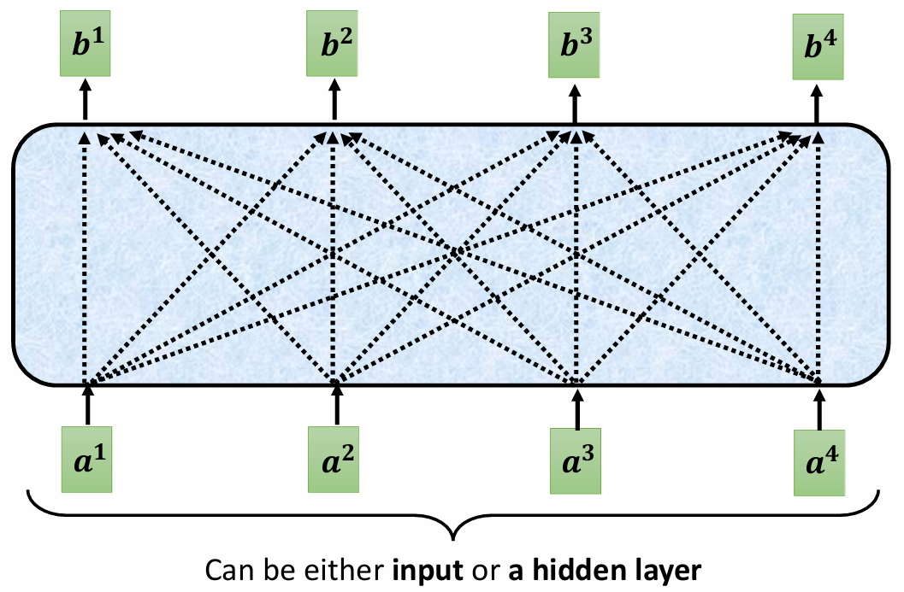

## 2 输出向量的产生

对于输入向量（例如 $a^1$），需要计算其他向量与 $a^1$ 的关联度。

关联度的计算通常通过 **点乘** 实现：
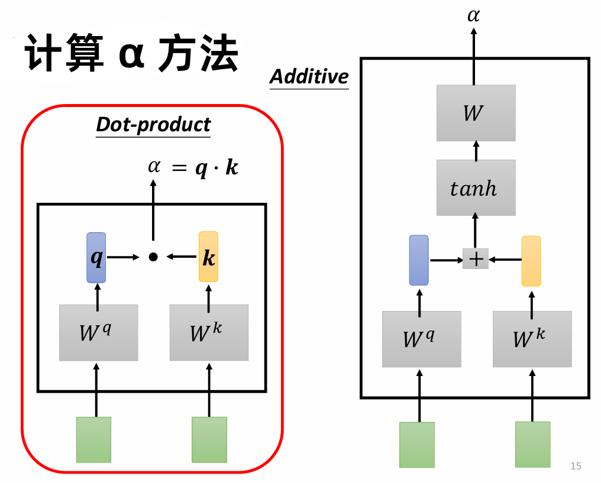

对于给定的输入向量 $a^1$ ，需要先计算 $q^1$ 值：$a^1 = W^qa^1$，其他向量 $a^i$ 计算 $k^i$ 值：$k^i = W^ka^i$，之后和 $q^1$ 点乘，得到 $\alpha_{1,i}$，再进行 soft-max：$\alpha_{1,i}' = \exp(\alpha_{1,i})/\sum_j \exp(\alpha_{1,j})$，作为最终的 attention score：

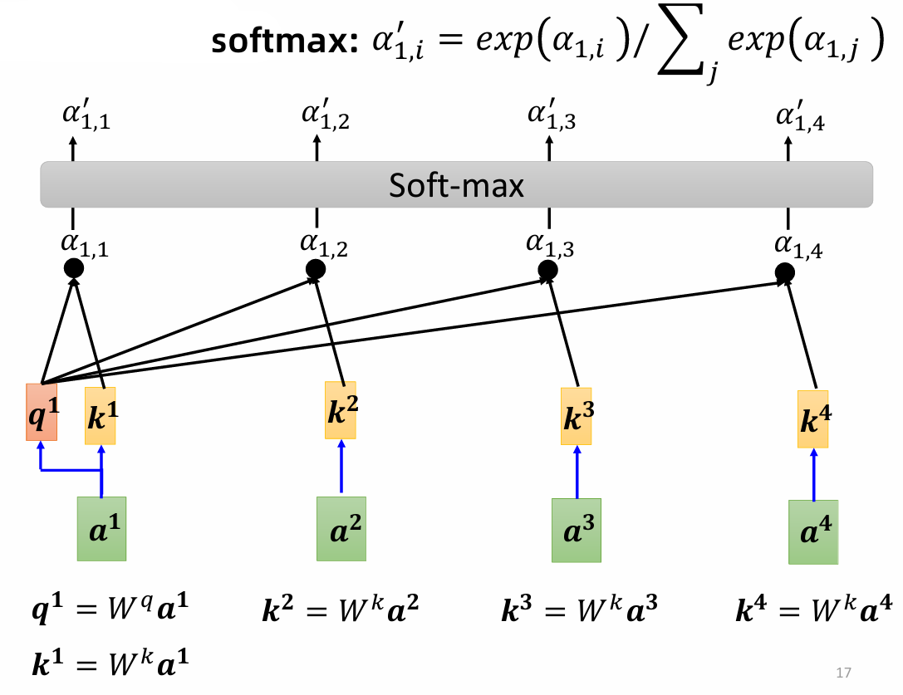 

根据 attention score，和每个输入的 value 值相乘（加权求和）得到最终的输出向量：$b^1 = \sum_i \alpha_{1,i}'v^i$ 

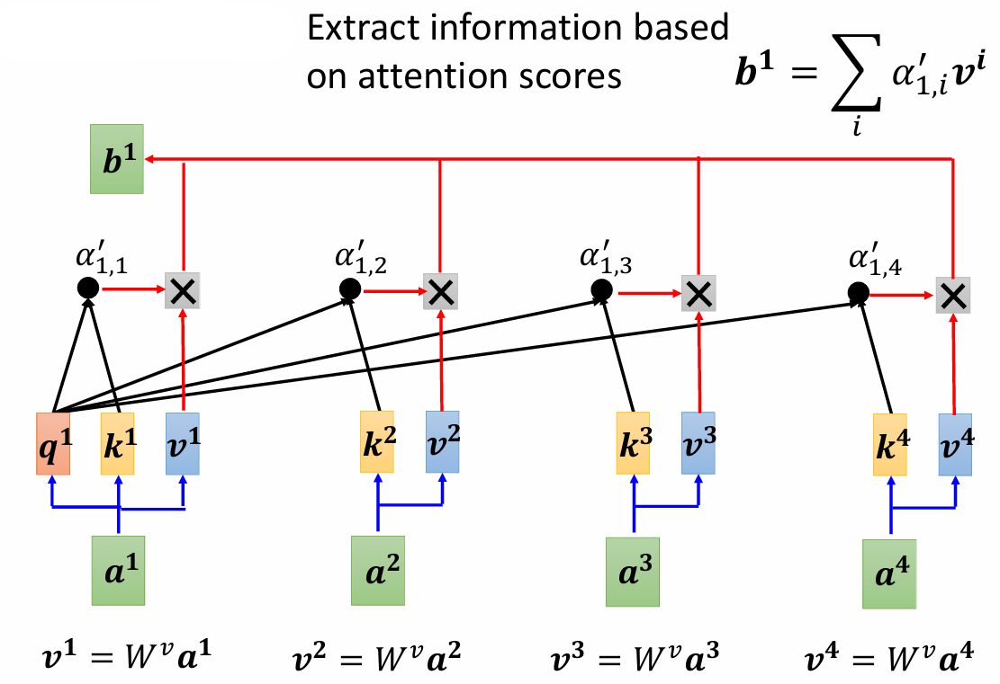 

这个输出包含了输入序列中各个元素的信息，经过加权后反映了与查询相关的重要性。

计算 $b^2$，同上：

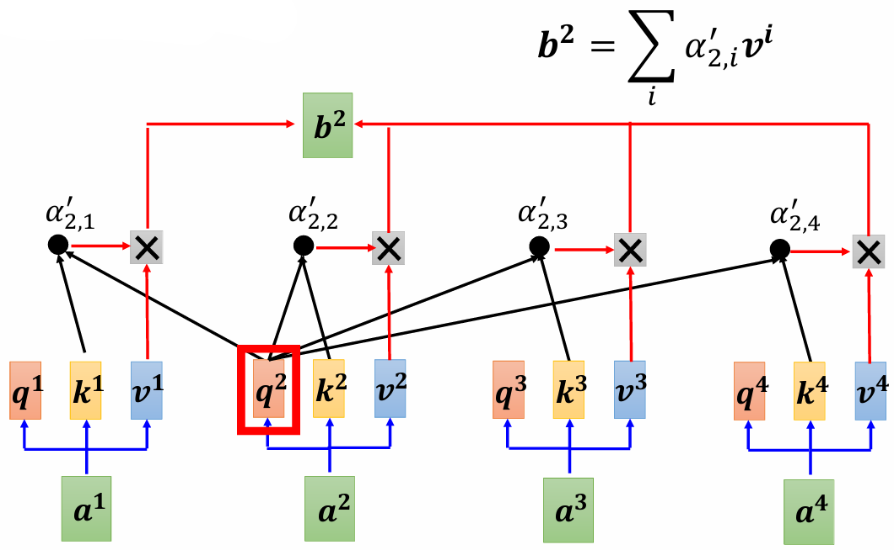 

## 3 矩阵乘法角度理解

从矩阵乘法的角度来看：
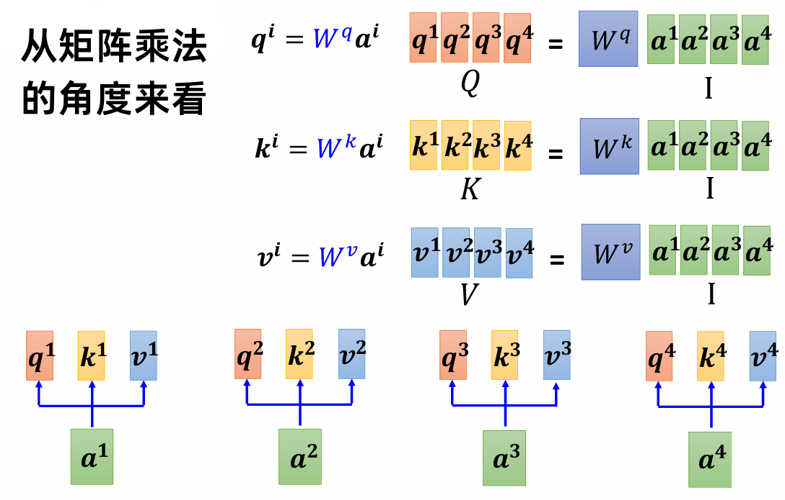 

$W^q$，$W^k$，$W^v$ 是需要被学习出来的，矩阵 $I$ 的列向量是 self-attention 的输入向量。

q: query, k: key, v: value
$$
Q =W^q I,K=W^kI,V=W^vI
$$
计算单个输入向量与其他向量的关联系数 $\alpha$ 过程看成矩阵向量乘法运算：
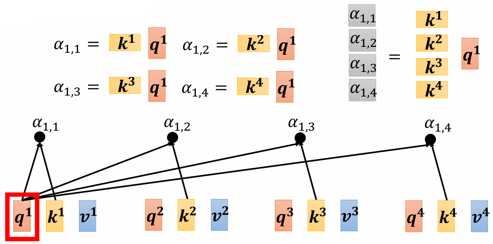

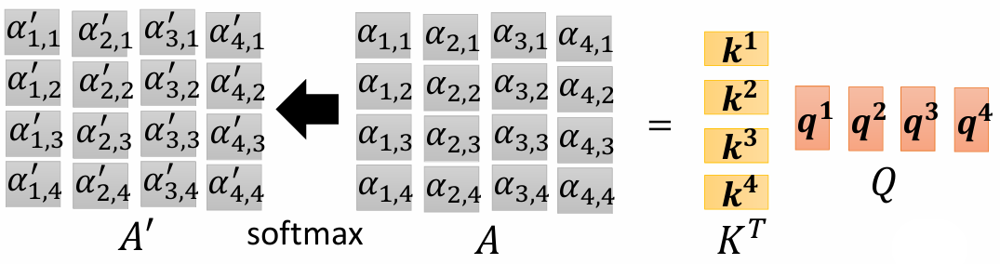 

计算 $b$ ：

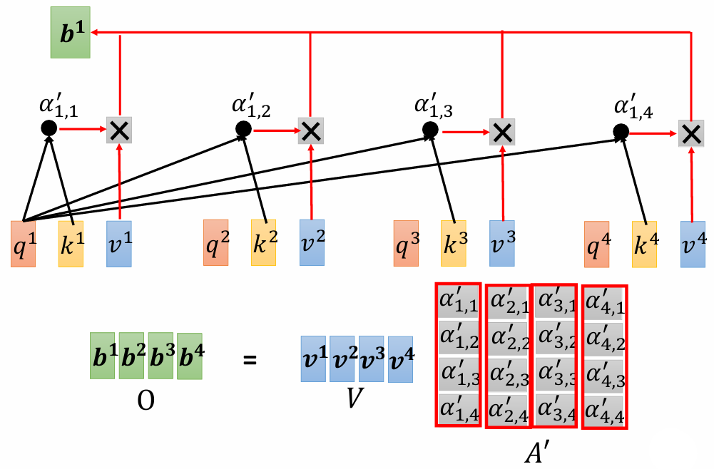 

矩阵 $O$ 就是 self-attention 的输出。

self-attention内部运算总结：

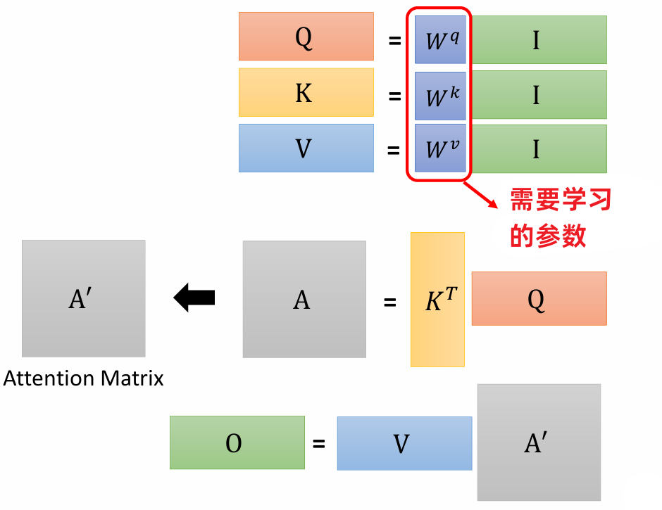 

## 4 Multi-head self-attention

有时候我们需要多个 $q$ 来应付不同的任务场景，产生不同类型的相关性：

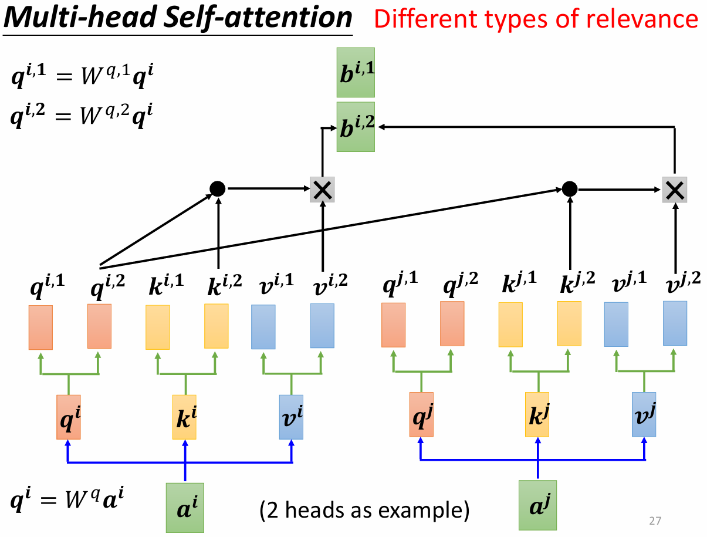 

最终的 $b$ 是不同 $b^i$ 的加权和：
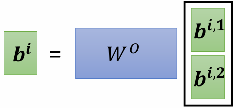 

## 5 位置编码 positional encoding

self-attention 里面没有位置信息，所以可以为每个位置设置唯一的位置向量 $e^i$ ，$e^i$ 加上 $a^i$ 作为输入。位置向量的设置：

* 手工设置 (Hand-Crafted)：预定义的位置编码。
* 从数据中学习 (Learned from Data)：通过训练数据自动学习的位置编码。

## 6 self-attention vs CNN / RNN

* CNN：self-attention that can only attend in a receptive field (简化版的 self-attention)

* self-attention: CNN with learnable receptive field

资料较少时，CNN 能获得较好的结果，在资料很多的时候，self-attention 能取得更好的结果。

self-attention vs RNN
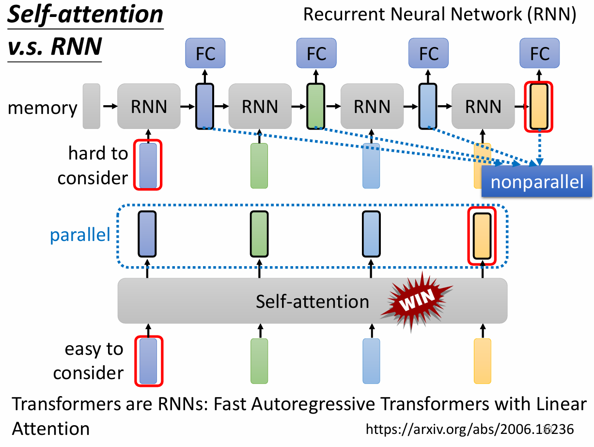 

