学习：[李宏毅：自注意力机制和Transformer](https://www.bilibili.com/video/BV1v3411r78R) 

# 1 Encoder

Encoder 的主要作用是接收一系列输入向量，并输出对应的向量序列。可以使用 RNN 或 CNN 实现编码器，但在 Transformer 中，采用了自注意力机制（Self-Attention）来实现：

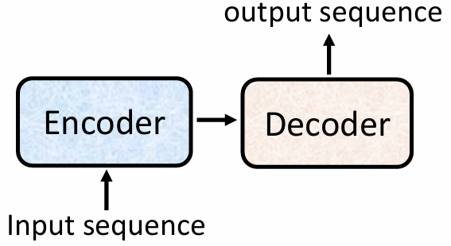 

 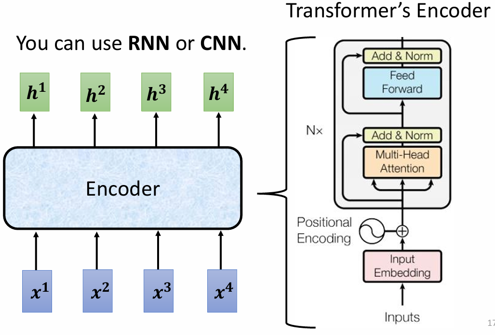 

Encoder 由多个相同的块（block）组成，每个块内部包含多个层（layer），其结构如下：

- 每个块：input vector seq → self-attention → fully connected network → output。

每个块的输出作为下一个块的输入，最终生成的输出为一个向量序列。

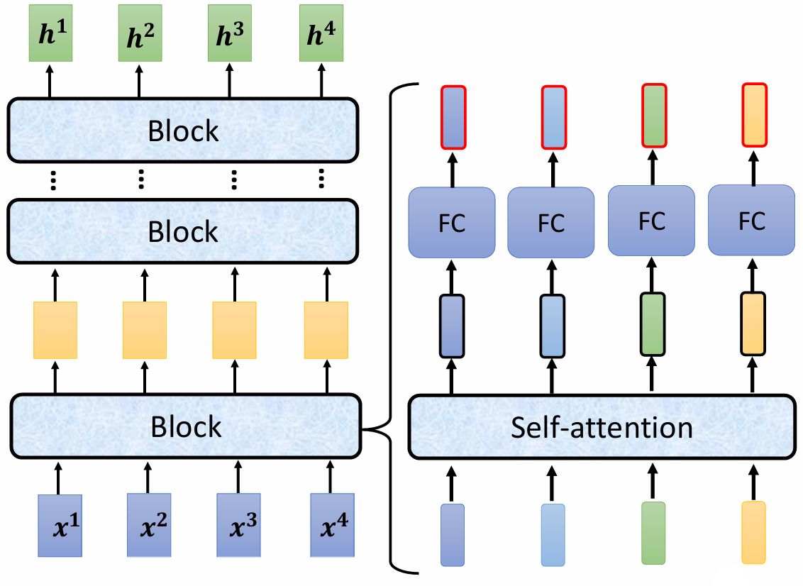 

Transformer 的设计：在上面的结构基础上加入了 residual 和 normalization：

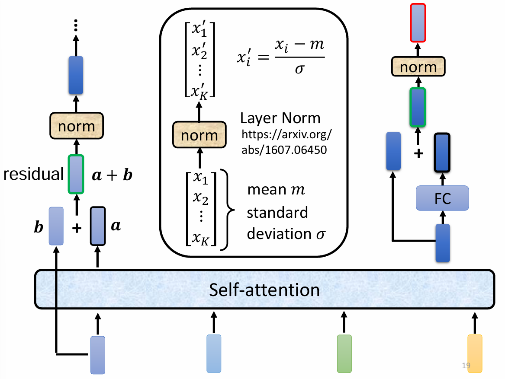 

最终的 encoder 架构：
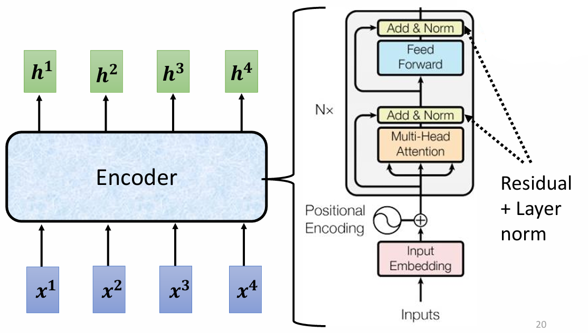 

# 2 Decoder

## 2.1 自回归解码 Autoregressive(AT)

Decoder 首先接收一个特殊符号，表示开始（start token），然后根据这个符号输出与词汇表大小相同的向量。**选择概率最大的词作为最终输出，同时将其作为 Decoder 的新输入**。

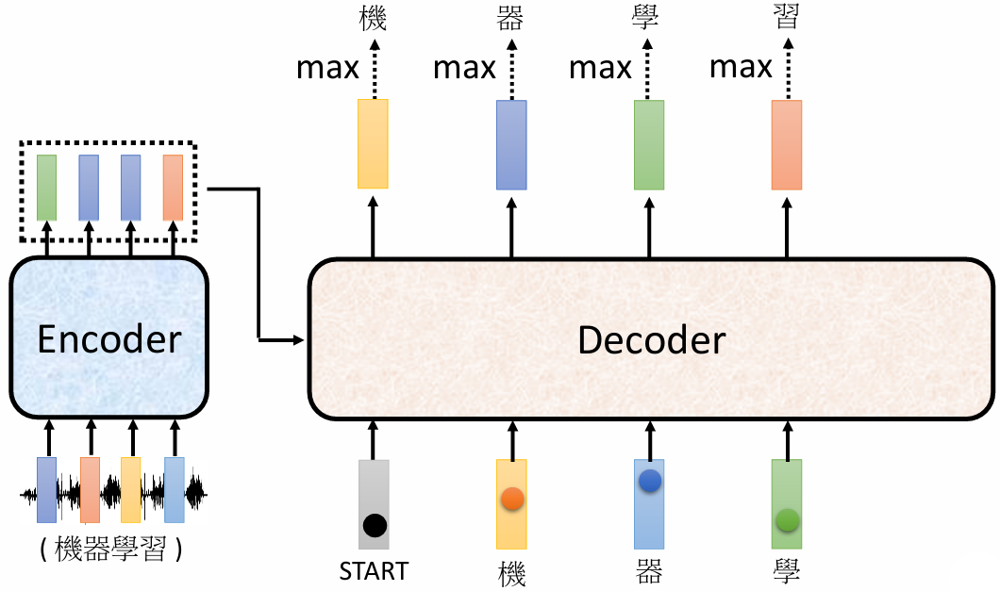 

encoder VS decoder :

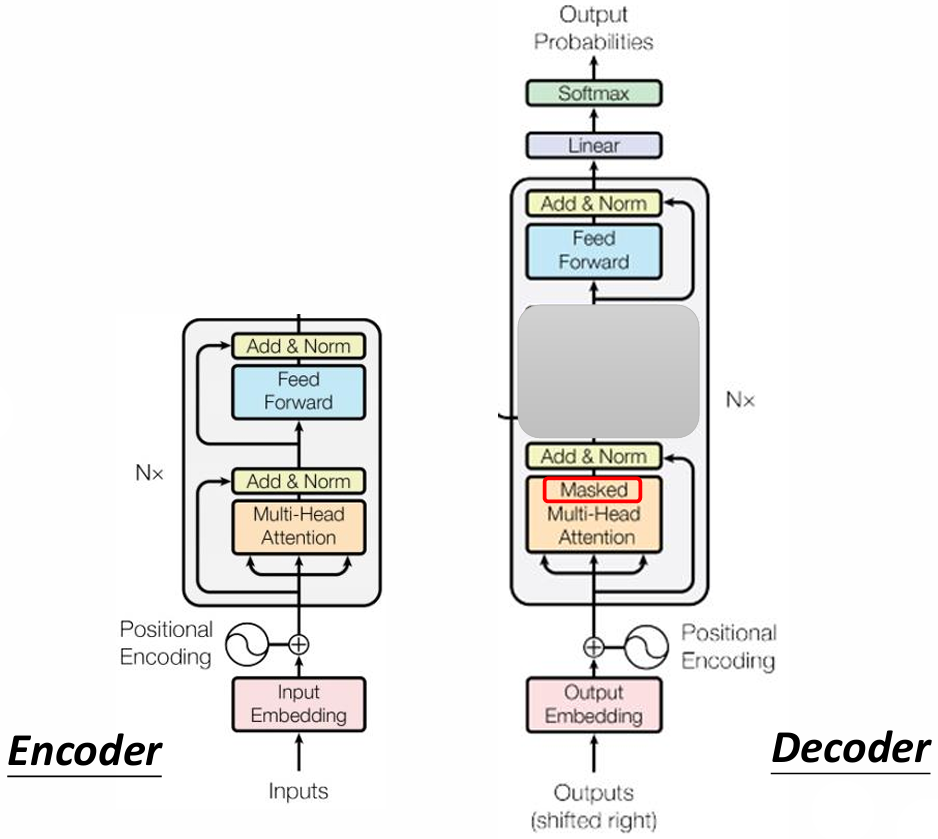 

Encoder 和 Decoder 的结构存在关键差异：

- Self-Attention：用于 Encoder，考虑所有输入。
- Masked Self-Attention：用于 Decoder，仅考虑当前输入及之前的输入，确保生成过程的因果性。

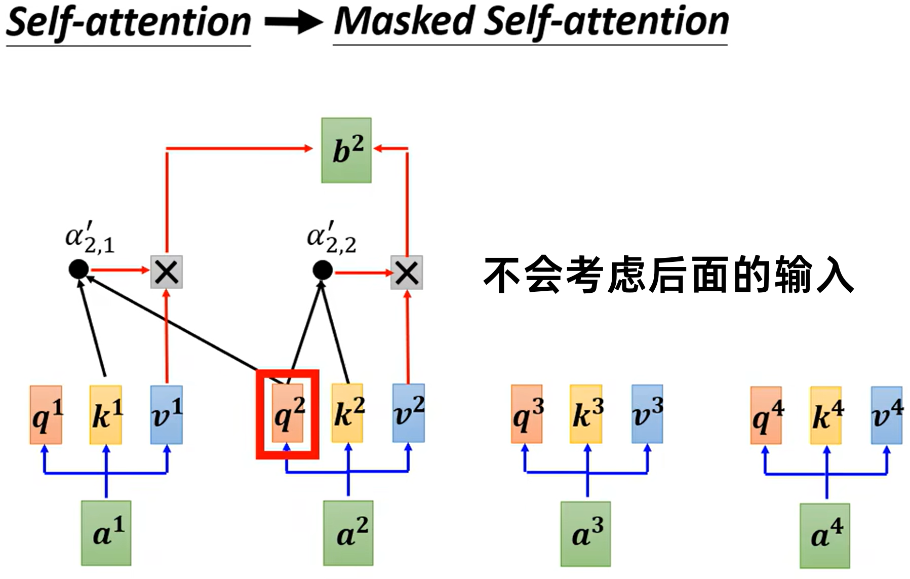 

需要为 decoder 设置一个结束符。

## 2.2 非自回归解码 Non-autoregressive (NAT)

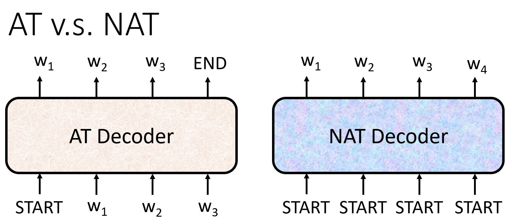 

* 如何决定 NAT decoder 输出的长度：
  * 另外一个预测器用于预测输出的长度
  * 输出一个非常长的序列，忽略序列中 END 结束符之后的 tokens

* NAT: 并行化，可控输出长度，在 transformer 之后很热门

  NAT往往比AT表现差

## 2.3 Transformer 的 cross attention 机制

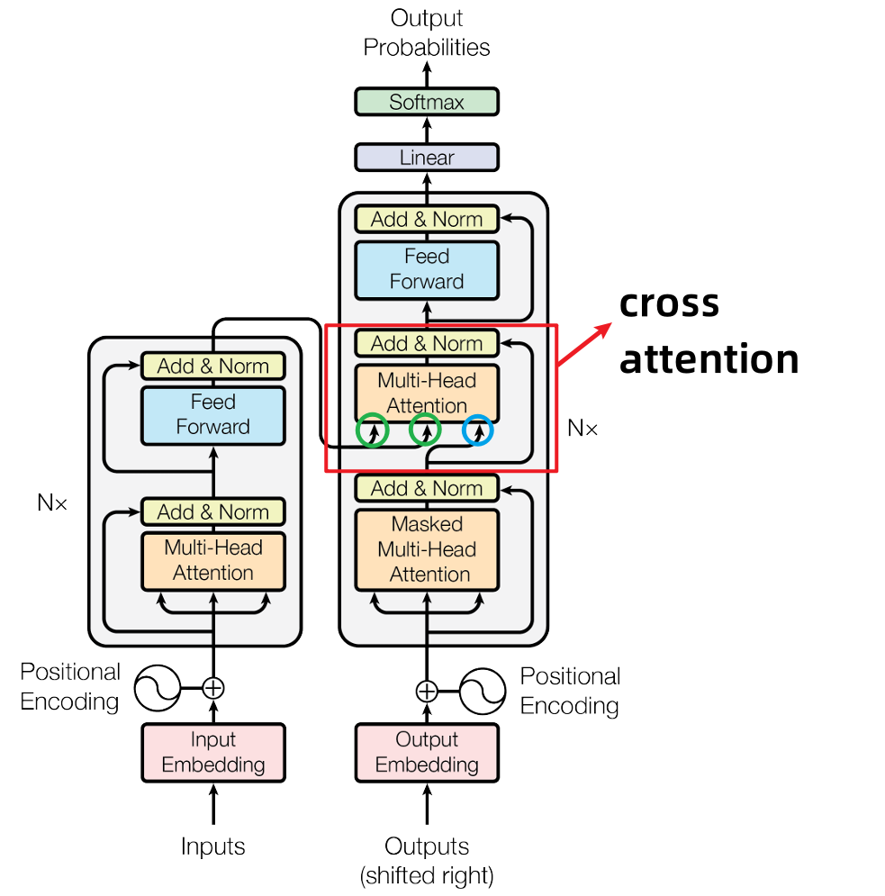 

Decoder，先输入一个 start 开始符，经过 masked self-attention，输出一个向量，这个向量与 Encoder 输出进行交叉注意力（Cross Attention）计算：：

* 输出向量乘以 $W^q$ 得到查询 $q$ 
* Encoder的输出乘以 $W^k$ 得到键 $k$ 
* 计算 $k$ 和 $q$ 内积后，并进行归一化
* 之后根据归一化结果和 $v$ 加权求和，得到最后的 $v$ 作为全连接层的输入。

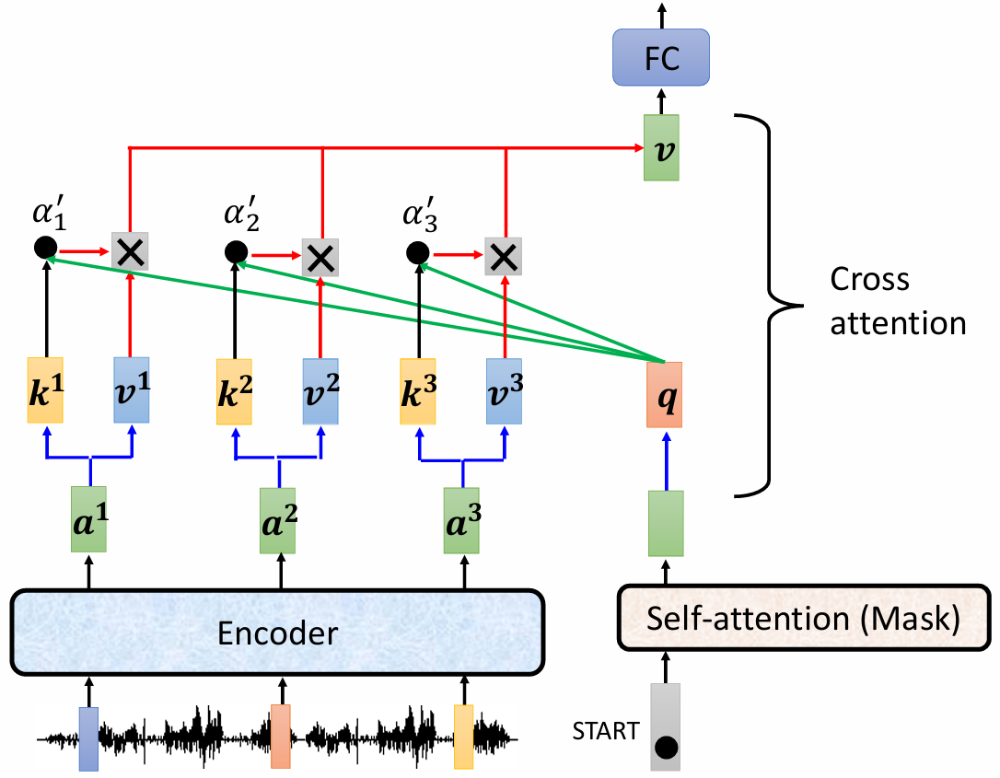 

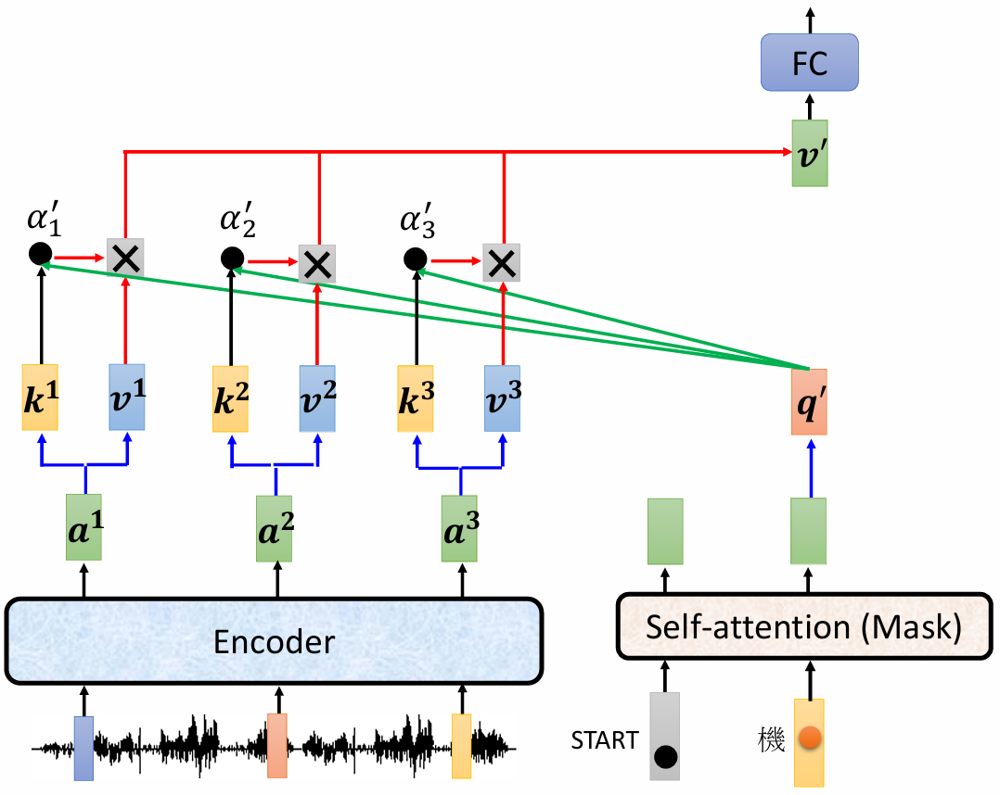 

# 3 Training

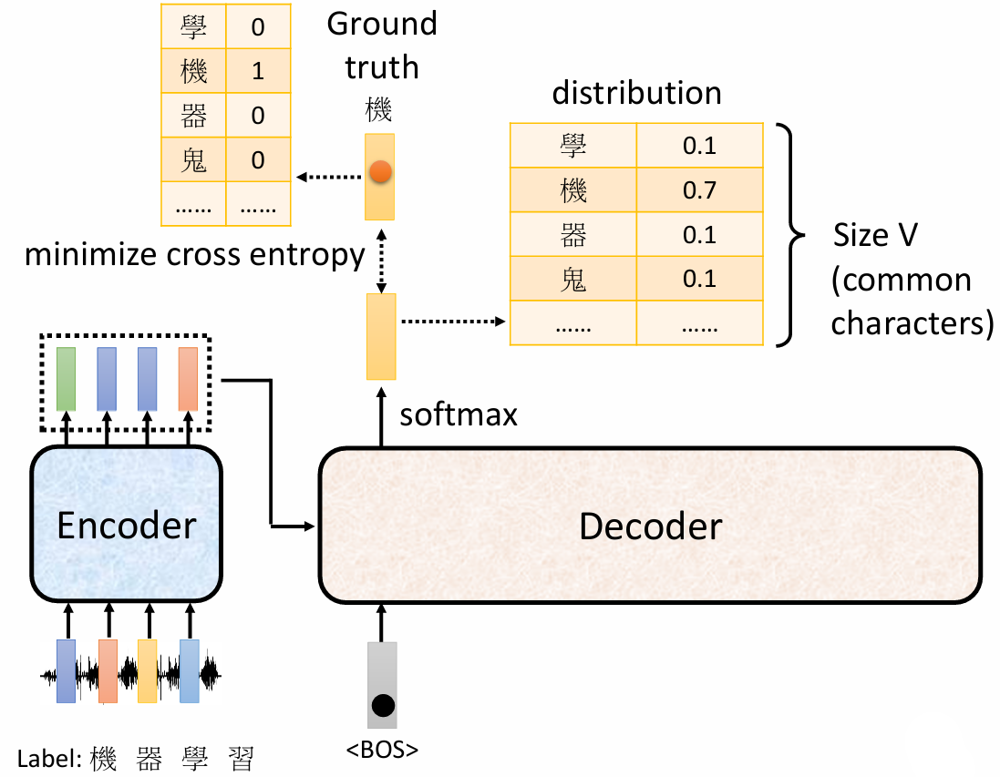 

模型输出和实际内容进行比对，计算 cross entropy

训练的时候，给 decoder 输入正确的答案（Teacher Forcing）

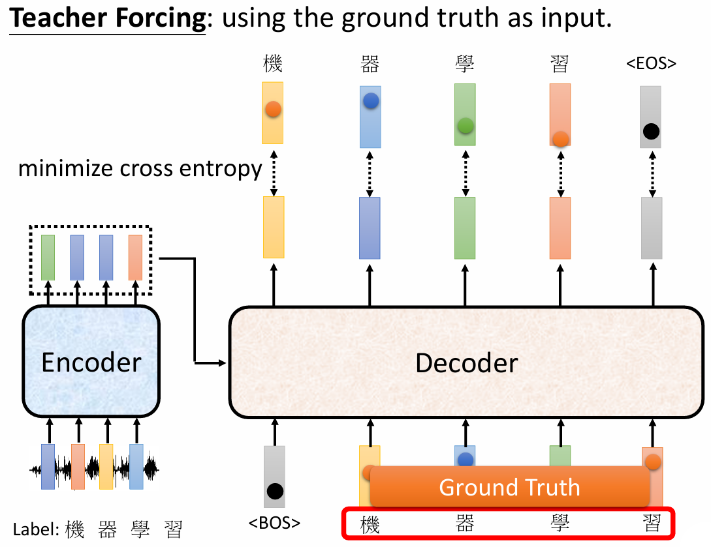 

