# Stable Models 阅读摘选

## 稳定扩散的关键要素

从大方向来看，稳定扩散可以分解三个重要元素：

- 感知图像压缩：先将**图像透过感知图像编码器&解码器（**[**VQ-VAE**](https://arxiv.org/abs/1711.00937) **[12]和**[**VQ-GAN**](https://arxiv.org/abs/2012.09841) **[13]风格）降低解析度后，直接在降解析度的图像上，或者说特征图上，进行 DDPM 的训练。**
- 潜在扩散模型：基本上就是 DDPM 的描述方法，不过这个 DM 在潜在空间中运行，因此论文称为潜在扩散模型。
- 调理机制：SD论文内部设计了**利用领域特定模型抽取语义信息后，再使用**[**注意力机制**](https://arxiv.org/abs/1706.03762)**[14]与究竟抽取图像的潜在结合。可以达到很泛用又有效的调理。**

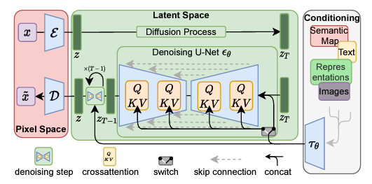

稳定扩散架构与可运行。（[资料来源](https://arxiv.org/abs/2112.10752)）

结合这三者就是构成Stable Diffusion的核心思想，**感知图像压缩后的潜在扩散模型让Stable Diffusion可以高效地生成高解析度图像。条件机制**则**让Stable Diffusion可以具备良好的可控制性，完成各个式各样结合其他描述的生成任务。**

## 感知图像压缩

一般简单的自动编码器虽然很容易重建，也可以有效地压缩潜在的大小，但是解码器重建的图形实际上经常是有一些模糊的，甚至有一些不真实的工件产生。

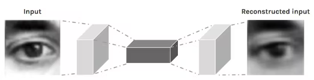

常见自动编码器的概念。[（资料来源）](https://hackernoon.com/autoencoders-deep-learning-bits-1-11731e200694)

因为 Stable Diffusion 的扩散模型是在潜在空间兼容的，如果**解码器质量不好会直接影响到生成图像的质量**。为了让解码的图像保持真持、并且减少模糊的情况，**Stable Diffusion使用基于VQGAN的自动编码器设计。**简单来说：

- 一个自动编码器架构，在**自动编码器上加上VQ-reg（矢量量化层）限制潜在**，避免高方差潜在空间。
- 训练时额外**使用**[**感知损失**](https://arxiv.org/abs/1603.08155)**[15] 和**[**基于补丁的对抗性目标**](https://arxiv.org/abs/1711.11585)**[16]**。

## 矢量量化和 VQGAN

[支持量化（矢量量化）](https://en.wikipedia.org/wiki/Vector_quantization)其实在讯号处理法上其实已经存在几十年了，简单说就是找到附近既定的点，来设置一个区间的代表。

在VQGAN中，使用**称为码本的矩阵描述这些既定的点的向量**，通常大小设计为代码数量`N`乘上代码长度`n_z`。然后先使用CNN目标图像( `H×W×3`)抽取特征`z`后( `h×w×n_z`，`n_z`为代码的长度)，与码本中所有码比较差异，最后用差异最小的那组码取代，得到`z_q`。

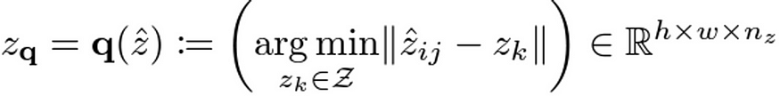

> 在生成模型领域 VQ 到底是用于 VQVAE，利用 VQ 来避免训练 VAE 时产生的后验崩溃。

接下来就是解码成图片，然后丢去计算感知损失和基于补丁的对抗目标。

- **感知损失**：大概念就是穿越先训练好网路，**对原始图片与重建图片提取特征后，利用特征计算损失，要求两边提取出来的特征越接近越好。**这个做法对两张图片计算L2非常重要，更能考虑到影像整体。
- **基于补丁的对抗目标**：训练**判别器每个补丁属于真实还是生成的图片补丁**，不容易对整张图片进行分类。

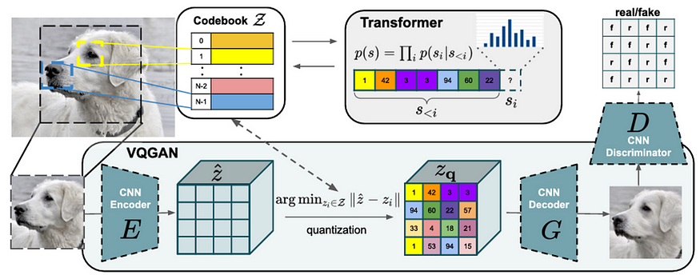

VQGAN整体架构。[（资料来源）](https://compvis.github.io/taming-transformers/)

## 潜在扩散模型

在扩散模型本体上，Stable Diffusion 基本上可以说是 DDPM 设计如出一辙。差别是， DDPM 的损失计算是基于影像的 $x_t$ 。

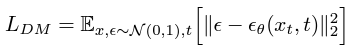

而 Stable Diffusion 则基于感知图像编码器抽象出的潜在空间向量 $z_t$。

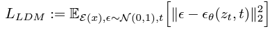

## 条件机制

**条件机制是稳定扩散可控性的重要元素**，在能够结合条件的情况下，模型才能够做出各种符合人类想象的应用，即以文字为条件的文本到图像与以物体范围为条件的物体移动。

Stable Diffusion 虽然主要还是使用 U-Net 的设计，但在条件化的部分修改并加入注意力机制。具体上控制的条件（如语义图或文本等）贯通域特定编码器提取出**固定维度特征后，在使用注意力机制卷积抽取的特征做融合。**

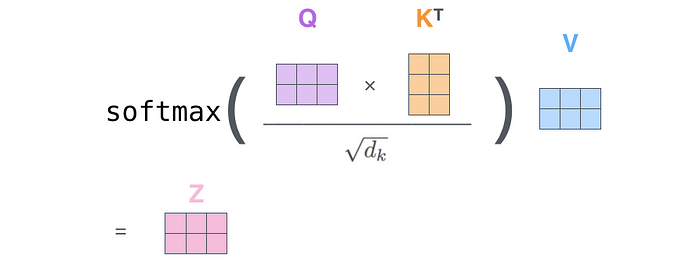

通用的注意力描述。[（资料来源）](https://zhuanlan.zhihu.com/p/47282410)

Stable Diffusion 设计 Q 项的输入卷积特征， K 和 V 项的输入输入域特定编码器抽取的特征。

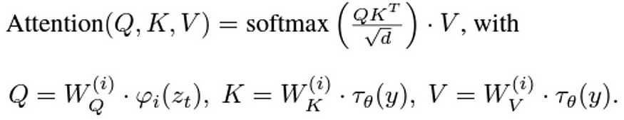

> 领域特定编码器通常都是额外先训练好的，也就是说在 Stable Diffusion 使用的文字编码器[CLIP](https://arxiv.org/abs/2103.00020) [17]。

## 实验结果

Stable Diffusion 论文中的数据，大部分的实验数据都是使用 DDIM (Denoising [**Diffusion Implicit Models)**](https://arxiv.org/abs/2010.02502) **[7 ] 的采样技巧**，并在**评估上使用**[**FID分数**](https://arxiv.org/abs/1706.08500)[19]。

### FID 和速度

Stable Diffusion 论文中关于潜在扩散模型（LDM）的数据以 LDM-X 来表示不同的下采样率（下采样率）。`X=1`即没有下采样，在像素空间下进行扩散过程。

在训练上可以看到有趣的现象是，平均表现最好（又快图像品质又好）是LDM-4到LDM-16。像素空间下的LDM-1反而不仅慢，连生成的品质也比较差。在推理（生成图片）上，表现最好的LDM-4与LDM-8。总之，整体上来看，在**潜在空间下做扩散的结果真的不只是快最后，连品质都可以有显着的著作地提升。**

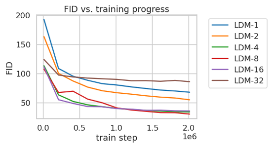

用于语义合成的稳定扩散。（[资料来源](https://arxiv.org/abs/2112.10752)）

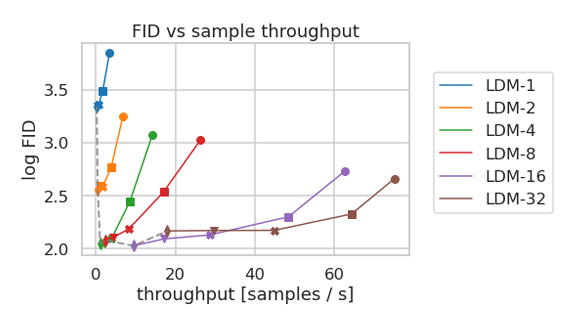

用于语义合成的稳定扩散。（[资料来源](https://arxiv.org/abs/2112.10752)）

# 细节解读

1. 图表解读

   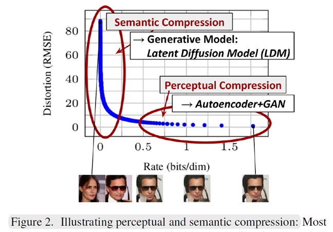

   This figure represents the ==rate-distortion trade-off== when compressing an already trained diffusion model.  

   这张图表示压缩已经训练好的扩散模型时的速率-失真权衡。

   > To clarify, ‘distortion’ refers to the root mean squared error between the generated sample and the ground truth image, while ‘rate’ denotes the cumulative number of bits received up to time t.
   >
   > 为了说明清楚，‘失真’是指生成样本与真实图像之间的均方根误差，而‘速率’表示截至时间t时接收到的累积比特数。

   Looking at the graph, a significant decrease in distortion occurs in the low-rate region, while the remaining bits do not contribute much to reducing distortion. **This implies that most bits are used for predicting high-frequency details that don’t significantly impact the distortion.** 

   从图中可以看出，在低速率区域，失真显著降低，而剩余的比特对减小失真没有太大贡献。**这意味着大多数 bit 用于预测不会显著影响失真的高频细节。** 

   说明在像素空间进行 diffusion 是浪费的，因此我们需要找到一个新的空间既能保留有问题的感知信息，又能降低计算成本。

2. LDM实现原理图

   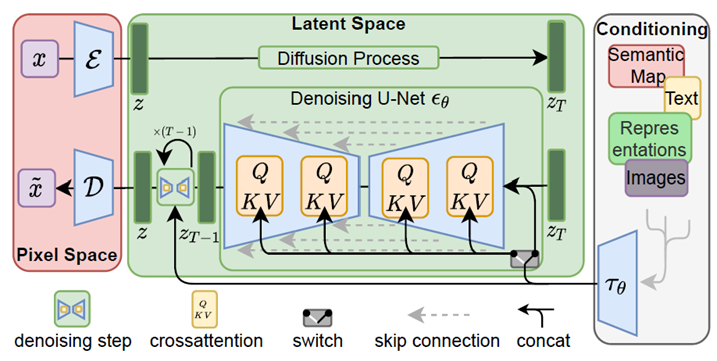

   1. 首先，将 RGB 空间中形状为 $H\times W\times3$ 的图像 $x$ 作为输入，解码器 $\mathcal{E}$ 将 $x$ 编码为 latent representation $z = \mathcal{E}(x)$ 。这里的，latent $z$ 的形状是 $h\times w\times c$ 。

      RGB 空间的 图像 $x$ 被变换到 the latent space 潜在空间 的 latent z 

   2. 因此图像被压缩了 $H/h$ 和 $W/w$ 倍

   3. 然后解码器 $\mathcal{D}$ 获取该潜在 $z$​ 并重建原始图像

   4. 最左边红色方框里面代表着：训练 **编码器** 和 **解码器**。

      它涉及通过编码器 将图像 $x$ 映射到 潜在空间 latent space，并学习如何通过 解码器 将 latent $z$​ 映射到 像素空间

      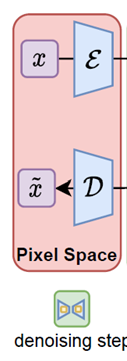

   5. “通过我们训练有素的由 $\mathcal{E}$ 和 $\mathcal{D}$​ 组成的感知压缩模型，我们现在可以访问一个高效、低维的潜在空间，其中高频、不可察觉的细节被抽象出来。**与高维像素空间相比，该空间更适合基于似然的生成模型，因为它们现在可以（i）专注于数据的重要语义位，以及（ii）在较低维度进行训练，计算量大更高效的空间。”**

   6. 中间的绿色方框。遵循 diffusion models 的基本结构，但使用下面的方程，稍微修改损失项继续训练。 
      $$
      L_{LDM}:= \Bbb{E}_{\mathcal{E}(x), \epsilon\sim\mathcal{N}(0,1),t}\big[\Vert\epsilon-\epsilon_\theta(z_t,t)\Vert_2^2\big]
      $$
      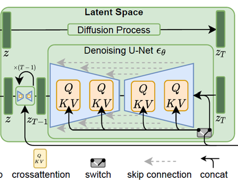
   
   7. We don’t just want to generate any image; rather, we want to create an image that fits specific text prompts or conditions we desire. 调节是必要的。**它被描绘在图中的灰色框中。** 
   
      为了引入该条件，我们的论文采用了特定领域的编码器 $\tau_\theta$ 和交叉注意层。如果我们将与文本提示相关的输入指定为 $y$，则 $y$ 会通过 $\tau_\theta$ 编码为中间表示 $\tau_\theta(y)$​。
   
      现在，该值通过图中橙色标记的cross-attention层与 diffusion U-Net 连接。cross-attention layer 采用了众所周知的 attention formula。
   
      
   
      **Attention** 使用 **query**, **key** 和 **value** 计算 attention score, 表明 tokens 之间的关联性.  the **key** and **value** represent the same token, and the **value** multiplied by the similarity between the **key** and the **query** is the **attention score**.
   
      $\mathrm{Attention}(Q, K, V) = \mathrm{softmax}\bigg(\cfrac{QK^T}{\sqrt{d}}\bigg)\cdot V$​
   
      观察方程，我们可以观察到适当的 **转置** 来对齐 Q、K 和 V 以进行乘法。除以 $\sqrt{d}$​​ 可以防止由于较长的句子而导致较大的点积，同时应用 `softmax` 可确保 较大值的主导地位，从而有助于避免特定标记的过度重要性。
   
   8. 回到 stable diffusion, 我们希望利用 attention 关联 condition 和 diffusion model structure. 因此, 它不是随机的生成 而是 ‘prompt-adapted generation’（基于提示的生成）.  所以，我们如下设置 Query, Key, and Value：
   
      $Q = W_Q^{(i)}·\varphi_i(z_t), K = W_K^{(i)}·\tau_\theta(y),V = W_V^{(i)}·\tau_\theta(y)$ 
   
   9. 总结一下，通过 $\tau_\theta$ 编码的 condition 作为 key 和 value 输入，通过 cross-attention 和 diffusion models的 $\epsilon$ 交织在一起，保证 diffusion model 生成的样本更接近输入提示
   
   10. 为了同时训练扩散模型现有的 $\epsilon$ 和 $\tau_\theta$ ，修改此前的方程为：
       $$
       L_{LDM}:= \Bbb{E}_{\mathcal{E}(x),y, \epsilon\sim\mathcal{N}(0,1),t}\big[\Vert\epsilon-\epsilon_\theta(z_t,t,\tau_\theta(y))\Vert_2^2\big]
       $$
       
   11. 利用这个损失（类似于原始扩散模型），我们可以训练一个过程，逐步从完整的噪声 $z_T$ 中去噪，生成完整的样本 $z_0$。然后，使用 latent space 的 $z$ ，将其传递给之前训练的 解码器 $\mathcal{D}$ ，使得我们能够将其转换为像素空间并生成最终的 RGB 图像
