## 进程同步

* 进程具有异步性的特征。

  **异步**性：各**并发执行**的进程以**各自独立的**、**不可预知**的速度向前推进。

* 例子：进程通信——管道通信

  

  读进程和写进程并发地运行，由于**并发必然导致异步性**，因此<u>“写数据”和“读数据”两个操作执行的先后顺序是不确定的</u>。而实际应用中，又必然按照“写数据 => 读数据”的顺序来执行的。所以需要解决这种异步问题。

* **同步**，亦称 直接制约关系，它是指为完成某种任务而建立的两个或多个进程，这些进程因为需要在某些位置上协调它们的**工作次序**而产生的**制约关系**。

* 进程间的直接制约关系就是源于它们之间的相互合作。

## 进程互斥

* 进程的 “并发”需要 “共享”的支持。

  各个并发执行的进程不可避免的需要共享一些系统资源（如内存，又如打印机、摄像头这样的 I/O 设备）

* 两种资源共享方式：

  1. 互斥共享方式

     系统中的某些资源，虽然可以提供给多个进程使用，但**一个时间段内只允许一个进程**访问该资源。

  2. 同时共享方式

     系统中的某些资源，允许一个时间段内由多个进程“同时”对它们进行访问

* **一个时间段内只允许一个进程使用** 的资源称为 **临界资源**。

  许多物理设备（比如摄像头、打印机）都属于 临界资源。此外，很多变量、数据、内存缓冲区等都属于临界资源。

* 对临界资源的访问，必须 互斥 地进行。

* **互斥**，亦称 **间接制约关系**。

  **进程互斥** 指当 一个进程 访问 某临界资源时，另一个想要访问该 临界资源 的 进程 必须等待。当前访问临界资源的进程访问结束时，释放该资源之后，另一个进程才能去访问临界资源。

* 对临界资源的互斥访问，可以在逻辑上分为如下四个部分：

  ```cpp
  do{
      entry section;      // 进入区
      critical section;   // 临界区  访问临界资源的的代码
      exit section;       // 退出区
      remainder section;  // 剩余区
  }while(true)
  ```

  * 进入区：负责检查是否可进入临界区，若可进入，则应设置 *<u>正在访问临界资源的标志</u>*（可理解为“上锁”），以阻止其他进程同时进入临界区。
  * **临界区**：**访问临界资源的那段代码**。又称为 临界段。
  * 退出区：负责解除 *<u>正在访问临界资源的标志</u>*（可理解为“解锁”）
  * 剩余区：做其他的处理
  
* 为了实现对临界资源的互斥访问，同时保证系统整体性能，需要遵循以下原则：

  1. 空闲让进。临界区空闲时，可以允许一个请求进入临界区的进程立即进入临界区。
  2. 忙则等待。当已有进程进入临界区时，其他试图进入临界区的进程必须等待。
  3. 有限等待。对请求访问的进程，应保证能在有限时间内进入临界区（保证不会饥饿）。
  4. 让权等待。当进程不能进入临界区时，应立即释放处理机，防止进程忙等待。

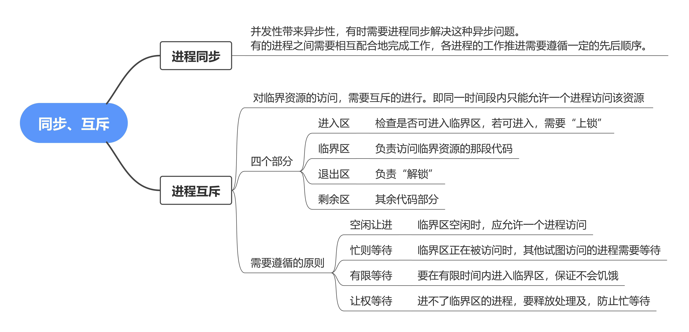


## 进程互斥的软件实现方法

在进入区设置并检查一些标志来标明是否有进程在临界区中。若已有进程在临界区，则在进入区通过循环检查进行等待，进程离开临界区后则在退出区修改标志。 

### 单标志法

* 算法思想：进程在访问完临界区后会把 使用临界区的权限 转交给另一个进程。也就是说 每个进程进入临界区的权限 只能被 另一个进程 赋予。

  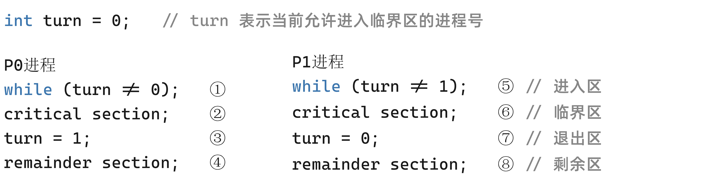

* turn 的初值为 0，则刚开始只允许 0 号进程进入临界区。若 P1 先上处理机运行，则会一直卡在 ⑤。直到 P1 的时间片用完，发生调度，切换 P0 上处理机运行。

  代码 ① 不会卡住 P0，P0 可以正常访问临界区，在 P0 访问临界区期间即使切换回 P1，P1依然会卡在⑤。只有 P0 在退出区将 turn 改为 1 后，P1 才能进入临界区。

* 只能按 P0→P1→P0→P1→··· 这样轮流访问。这种必须 “轮流访问”带来的问题是，如果此时允许进入临界区的进程是 P0，而P0一直不访问临界区，那么虽然此时临界区空闲，但是并不允许 P1 访问。

* **单标志法** 存在的主要问题是：违背了“**空闲让进**”原则。


### 双标志先检查

* 算法思想：设置一个 布尔型数组 `flag[]`，数组中各个元素用来标记各进程想进入临界区的意愿

  *  `flag[0] = true` 意味着 0 号进程 P0 现在想要进入临界区。

  各个进程在进入临界区之前先检查当前有没有别的进程想进入临界区，如果没有，则把自身对应的标志 `flag[i]` 设置为 `true` ，之后开始访问临界区。

  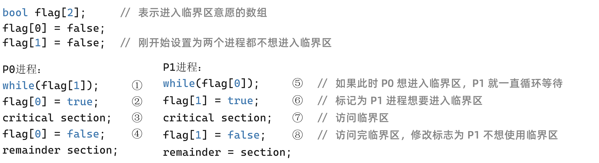

* 在并发环境下，按照 ①⑤②⑥③⑦··· 的顺序执行，P0 和 P1 将会同时访问临界区。

* 双标志先检查法的主要问题是：违反 “忙则等待”原则。

  原因在于，进入区的“检查”和“上锁”两个处理不是一气呵成的。“检查”后，“上锁”前可能发生进程切换。


### 双标志后检查

* 算法思想：双标志先检查法的改版。前一个算法的问题是先“检查”后“上锁”，但是这两个操作又无法一气呵成，因此导致了两个进程同时进入临界区的问题。因此，人们又想到先“上锁”后“检查”的方法，来避免上述问题。

  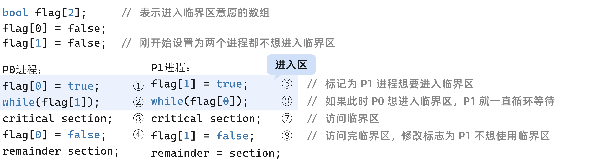

* 如果按照 ①⑤②⑥ ··· 的顺序执行，P0 和 P1 都无法进入临界区。

* 双标志后检查法 虽然解决了“忙则等待”的问题，但是**又违背了**“**空闲让进**”和“**有限等待**”原则，会因各进程都长期无法访问临界资源而产生“饥饿”现象。


### Peterson 算法

* 算法思想：结合双标志法、单标志法的思想。

  

  * `flag` 数组表达意愿
  * `turn` 用来谦让

* Peterson 算法用软件的方法解决了进程互斥问题，遵循了 空闲让进、忙则等待、有权等待 三个原则，但是依然**未遵循 让权等待 的原则**。

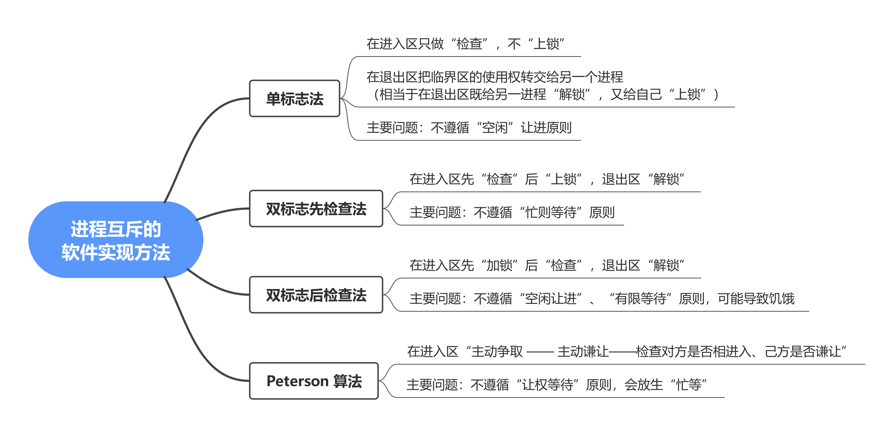


## 进程互斥的硬件实现方法

### 中断屏蔽方法

* 利用 “**开/关中断指令**”实现

  （与 **原语** 的实现思想相同，即在某进程开始访问临界区到结束访问为止都不允许中断，也就不能发生进程切换，因此也不可能两个同时访问临界区的情况)

  ```cpp
  ...;
  关中断;
  临界区;
  开中断;
  ...;
  ```

  * 关中断后既不允许当前进程被中断，也必然不会发生进程切换
  * 直到当前进程访问完临界区，再执行中断指令，才又可能被别的进程上处理机访问临界区

* 优点：简单、高效

* 缺点：

  * **不适用于多处理机**，关中断指令只对执行关中断的处理机有用。
  * **只适用于 操作系统内核进程**，不适用于用户进程（因为开/关中断指令只能运行在内核态，这组指令如果能让用户随意使用会很危险）


### `TestAndSet` 指令（TS指令、TSL指令）

* TSL 指令是用硬件实现的，执行的过程不允许被中断。

* 用 C 语言描述的逻辑：

  ```cpp
  // 布尔型共享变量 lock 表示当前临界区是否被加锁
  // true 表示已加锁, false 表示未加锁
  bool TestAndSet(bool *lock)
  {
      bool old;
      old = *lock;   // old 用来存放 lock，原来的值
      *lock = true;  // 无论之前是否已加锁，都将 lock 设为 true
      return old;    // 返回 lock 原来的值
  }
  ```

  使用 TSL 指令实现的互斥的算法逻辑：

  ```cpp
  while(TestAndSet(&lock));  // “上锁”并“检查”
  临界区代码段...
  lock = false;      // “解锁”
  剩余区代码段...
  ```

* 若刚开始 lock 是 false，则 TSL 返回的 old 值未 false，while 循环条件不满足，则直接跳过循环，进入临界区。

* 若刚开始 lock 是 true，则执行 TLS 后 old 返回的值为 true，while 循环条件满足，会一直循环，直到当前访问临界区的进程在退出区进行 “解锁”。

* 相比软件实现方法， TSL 指令把 “上锁”和“检查”操作用硬件的方式变成了一气呵成的原子操作。

* **优点**：

  * 实现简单，无需像软件实现方法那样严格检查是否会有 逻辑漏洞
  * 适用于多处理机环境

* **缺点**：不满足“让权等待”原则，暂时无法进入临界区的进程会占用 CPU 并循环执行 TSL指令，从而导致 “忙等”。


### Swap 指令

* 又称 Exchange 指令，或简称 XCHG 指令

* Swap 指令是用硬件实现的，执行的过程不允许被中断，只能一气呵成。

  以下是用 C 语言描述的逻辑：

  ```cpp
  // Swap 指令的作用是交换两个变量的值
  Swap (bool *a, bool *b)
  {
      bool temp;
      temp = *a;
      *a = *b;
      *b = temp;
  }
  ```

  以下是用 Swap 指令实现互斥的算法逻辑

  ```cpp
  // lock 表示当前临界区是否被加锁
  bool old = true;
  while (old == true)
      Swap (&lock, &old);
  临界区代码段...;
  lock = false;
  剩余区代码段...;
  ```

* 逻辑上来看 Swap 和 TSL 并无太大区别，都是先记录下此时临界区是否已经被上锁（记录在 old 变量上），再将上锁标记 lock 设置为 true，最后检查 old，如果 old 为 false 说明之前没有别的进程对临界区上锁，则可跳出循环，进入临界区。

* **优点**：

  * 实现简单，无需像软件实现方法那样严格检查是否会有 逻辑漏洞
  * 适用于多处理机环境

* **缺点**：不满足“让权等待”原则，暂时无法进入临界区的进程会占用 CPU 并循环执行 Swap 指令，从而导致 “忙等”。

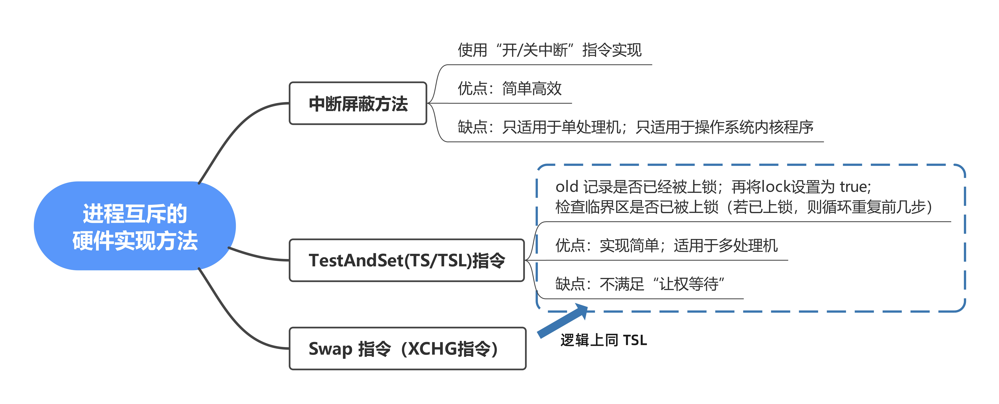


### 进程互斥：锁

* 解决临界区问题最简单的工具就是：**互斥锁**（mutex lock），一个进程在进入临界区时应获得锁，在退出临界区时释放锁。函数 `acquire()` 获得锁，而函数 `release()` 释放锁。

* 每个互斥锁有一个 **布尔变量** `available` ，表示 **锁是否可用**。如果锁是可用的，调用 `acquire()` 会成功，且锁不再可用。当一个进程试图获取不可用锁时，会被阻塞，直到锁被释放。

  ```cpp
  acquire()
  {
      while(!available);  // 忙等待
      available = false;  // 获得锁
  }
  
  release()
  {
      avaiable = true;     // 释放锁
  }
  ```

  `acquire()` 或 `release()` 的执行必须是 **原子操作**，因此互斥锁通常采用 **硬件机制** 来实现。

* **互斥锁** 的主要缺点是 **忙等待**，当有一个进程在临界区中，任何其他进程在进入临界区时必须连续循环调用 `aquire()` 。当多个进程共享一个 CPU时，就浪费了CPU周期。

* 因此，互斥锁通常用于多处理器系统，一个线程可以在一个处理器上等待，不影响其他线程的执行。

* 需要 **连续循环忙等** 的 互斥锁，都可称为 **自旋锁**（spin lock），如 TSL 指令、swap 指令、单标志法。

* 自旋锁特性：

  * 需忙等，进程时间片用完才下处理机，违反“让权等待”。
  * 优点：等待期间不用切换进程上下文，多处理器系统中，若上锁的时间短，则等待代价很低。
  * 自旋锁 **通常用于 多处理器系统**，一个核忙等，其他核照常工作，并快速释放临界区。
  * **不太适用于 单处理机系统**，**忙等的过程中不可能解锁**。

  

## 信号量机制

此前学习的进程互斥解决方案：

* 四种软件实现方法：单标志法、双标志先检查、双标志后检查、Peterson算法
* 三种硬件实现方式：中断屏蔽方法、TS/TSL 指令、Swap/XCHG指令

在双标志先检查法中，进入区的“检查”和“上锁”操作无法一气呵成，从而导致了两个进程有可能同时进入临界区的问题。

所有以上解决方案都无法实现“让权等待”。

### 信号量

* 用户进程可以通过使用操作系统提供的 **一对原语** 来对 **信号量** 进行操作，从而很方便的实现进程互斥、进程同步。
* **信号量** 其实就是一个 **变量**（可以是一个整数，也可以是更复杂的记录型变量）
* 可以用 **信号量** 来表示 **系统中某种资源的数量**，比如 ：系统中只有一台打印机，就可以设置一个初值为1的信号量。
* **原语** 是一种特殊的程序段，执行过程不能被中断。原语是由 关中断/开中断指令 实现。
* 一对原语：`wait(S)` 原语 和 `signal(S)` 原语，可以把原语理解为我们自己写的函数，函数名分别为 `wait` 和 `signal` ，括号里面的 **信号量S** 其实就是函数调用时传入的一个参数。
* `wait`、`signal` 原语 简称为 P、V 操作。因此，做题的时候常把 `wait(S)` 、`signal(S)` 两个操作分别写为 `P(S)`、`V(S)` 。


**整型信号量**

* 用一个 整数型的变量 作为 信号量，用来表示 系统中某种资源的数量

* 例如：某计算机系统中有一台打印机

  ```cpp
  int S = 1;  // 初始化整型信号量 S，表示当前系统中可用的打印机资源数
  
  void wait(int S)    // wait 原语，相当于 “进入区”
  {
      while(S <= 0);  // 如果资源不够，就一直循环等待
      S = S - 1;      // 如果资源够用，则占用一个资源
  }
  
  void signal(int S)  // signal 原语，相当于 “退出区”
  {
      S = S + 1;      // 使用完资源后，在退出区释放资源
  }
  ```

  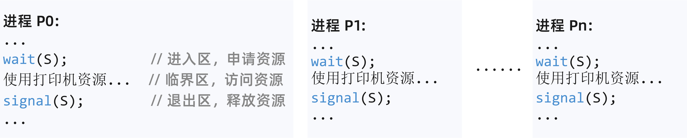

* 因为是原语实现，所以，“检查”和“上锁”操作一气呵成，避免了并发、异步导致的问题。但是，依然不满足 “让权等待” 的原则，会发生 “忙等”。


**记录型信号量**

* 使用记录型数据结构表示信号量：

  ```cpp
  typedef struct
  {
      int value;            // 剩余资源数
      struct process * L;   // 等待队列
  } semaphore;
  ```

* 当某进程需要使用资源时，通过 wait 原语申请：

  ```cpp
  void wait(semaphore S)
  {
      S.value--;        // 请求一个单位的资源
      if(S.value < 0)   // value 值小于0，说明减一之前就已经没有资源了
      {
          block(S.L);
          // 如果剩余资源数不够，使用 block 原语使进程从运行态进入阻塞态
          // 并把它挂到信号量 S 的等待队列（即阻塞队列）中
      }
  }
  ```

* 进程使用完资源后，通过signal 原语释放

  ```cpp
  void signal (semaphore S)
  {
      S.value ++;       // 释放一个单位的资源
      if(S.value <= 0)  // value 小于等于0，说明加一之前有进程在资源等待队列
      {
          wakeup(S.L);
          // 释放资源后，如果还有别的进程在等待这种资源，则使用 wakeup 原语
          // 唤醒等待队列中的一个进程，该进程从阻塞态转变为就绪态
  	}
  }
  ```

* 举例：某计算机系统中有 2 台打印机，则可在初始化信号量 S 时将 `S.value` 的值设为 2，队列 S.L 设置为空。

  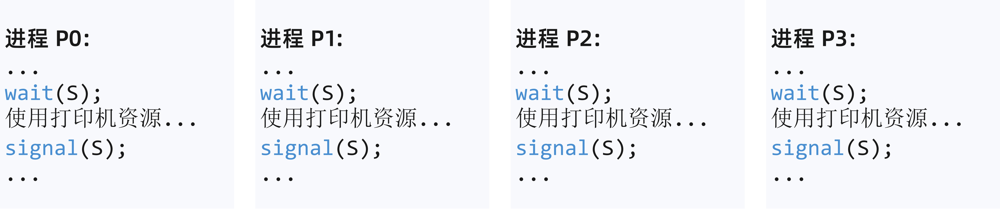

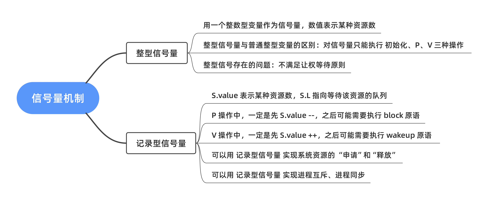


### 实现进程互斥

1. 分析并发进程的关键活动，划定临界区。

   （如：对临界资源打印机的访问就应该放在临界区）

2. 设置互斥信号量 mutex，初值为 1。

   * 信号量 mutex 表示 “**进入临界区的名额**”

   记录信号量的定义：

   ```cpp
   typedef struct{
       int value;           // 剩余资源数
       struct process * L;  // 等待队列
   }semaphore;
   ```

3. 在进入区 P(mutex) —— 申请资源
4. 在退出区 V(mutex) —— 释放资源

【注意】

* 对 **不同的临界资源** 需要设置 **不同的互斥信号量**。

* P、V 操作必须成对出现。缺少 P(mutex) 就不能保证临界资源 的互斥访问。缺少 V(mutex) 会导致资源永不被释放，等待进程永不被唤醒。

信号量机制实现互斥：

```cpp
semaphore mutex = 1;  // 初始化信号量

P1()
{
    ...;
    P(mutex);         // 使用临界资源前需要加锁
    临界区代码...;
    V(mutex);         // 使用临界资源后需要加锁
    ...;
}

P2()
{
    ...;
    P(mutex);
    临界区代码段...;
    V(mutex);
    ...;
}
```


### 实现进程同步

* 进程同步：要让各并发进程按要求有序地推进。

  ```cpp
  P1()
  {
      代码1;
      代码2;
      代码3;
  }
  
  P2()
  {
      代码4;
      代码5;
      代码6;
  }
  ```

  比如，P1、P2 并发执行，由于存在 **异步性**，因此二者交替推进的次序是不确定的。

  若 P2 的“代码4”要基于 P1的“代码1” 和 “代码2”的运行结果才能执行，那么我们就必须保证 “代码4”一定是在“代码2”之后才会执行。

**用信号量实现进程同步**：

1. 分析什么地方需要实现“同步关系”，即必须保证“一前一后”执行的两个操作（或两句代码）

2. 设置同步信号量 S，初值为 0

3. 在“前操作”之后执行 V(S) 操作

4. 在“后操作”之前执行 P(S) 操作

   ```cpp
   semaphore S = 0;   // 初始化同步信号量，初始值为 0
   
   P1()
   {
       代码1;
       代码2;
       V(S);
       代码3;
   }
   
   P2()
   {
       P(S);
       代码4;
       代码5;
       代码6;
   }
   ```

   * `semaphore S = 0` ，信号量 S 代表“某种资源”，刚开始是没有这种资源的。P2 需要使用这种资源，而又只能由 P1 生产这种资源。

   * 若先执行到 V(S)操作，则 S++ 后 S = 1。之后当执行到 P(S) 操作时，由于 S = 1，表示可用资源，会执行 S--，S 的值变回 0，P2 进程不会执行 block 原语，而是继续往下执行代码 4。

   * 若先执行到 P(S) 操作，由于 S = 0， S-- 后 S = -1，表示**此时没有可用资源**，因此 P 操作中会执行 **`block` 原语**，主动请求阻塞。

     之后当执行完代码2，继续执行 V(S) 操1作，S++，使 S 变回0，由于此时有进程在该进信号量的阻塞队列，因此会在 V 操作中执行 wakeup 原语，唤醒 P2 进程。这样 P2 就可以继续执行代码4了。


### 实现进程的前驱关系

进程 P1 中有句代码 S1，进程 P2 中有句代码 S2，进程 P3 中有句代码 S3......进程 P6 中有句代码 S6。这些代码要求按如下前驱图所示的顺序来执行：

* 其实每一对前驱关系都是进程同步问题（需要保证一前一后的操作）
* 因此：
  1. 要为 每一对前驱关系 设置 一对同步信号量
  2. 要在 **“前操作”之后** 对相应的同步信号量执行 **V 操作**
  3. 要在 **“后操作”之前** 对相应的同步信号量执行 **P 操作**



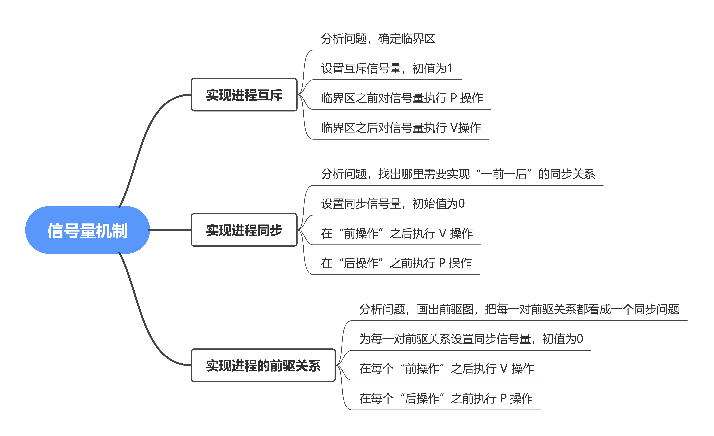

* 前驱关系问题，本质上就是多级同步问题。
* 除了互斥、同步问题外，还会考察有多个资源的问题，**有多少资源就把信号量的初始值设为多少**。**申请资源** 时进行 **P 操作**，**释放资源** 时进行 **V 操作** 即可。


## 生产者-消费者问题

* 系统中有一组 **生产者进程** 和一组 **消费者进程**，**生产者进程** 每次生产 一个产品 放入缓冲区，**消费者进程** 每次从缓冲区 取出一个产品 并使用。（注：这里的“产品”理解为某种数据）

* 生产者、消费者 共享一个 初始为空、大小为 n 的缓冲区。

  * 只有缓冲区没满时，生产者才能把产品放入缓冲区，否则必须等待。

    > 缓冲区没满 → 生产者进程

  * 只有缓冲区不空，消费者才能从中取出产品，否则必须等待。

    > 缓冲区没空 → 消费者消费

  * **缓冲区 是 临界资源，各进程必须互斥地访问。**

    > 互斥关系

PV 操作题目分析步骤：

1. 分析关系。找出题目中描述的各个进程，分析它们之间的同步、互斥关系。
2. 整理思路。根据各进程的操作流程确定 P、V 操作的大致顺序。
3. 设置信号量。根据题目条件确定信号量初始值。（互斥信号量初始值一般为1，同步信号量的初始值要看对应资源的初始值是多少）


分析生产者-消费者问题：

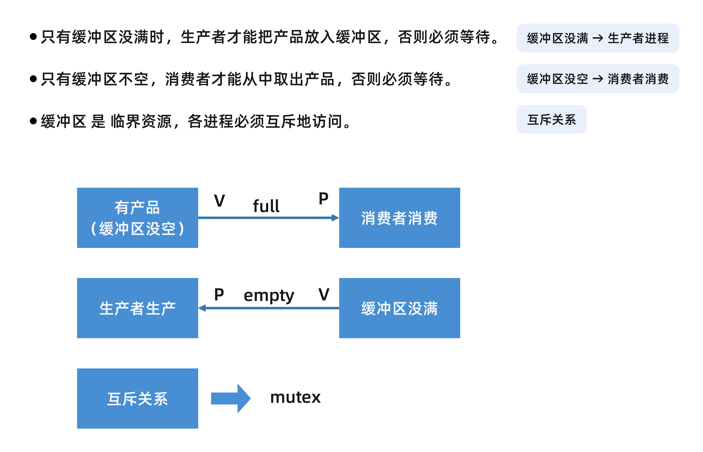

初始化：

```cpp
semaphore mutex = 1;   // 互斥信号量，实现对缓冲区的互斥访问
semaphore empty = n;   // 同步信号量，表示空闲缓冲区的数量
semaphore full = 0;    // 同步信号量，表示产品数量，也即非空缓冲区数量
```

```cpp
producer()
{
    while(1)
    {
        生产一个产品;
        P(empty);   // 消耗一个空闲缓冲区
        P(mutex);   // 实现互斥是在同一进程中进行 一对 PV 操作
        把产品放入缓冲区;
        V(mutex);
        V(full);    // 增加一个产品
    }
}

consumer()
{
    while(1)
    {
        P(full);     // 申请消耗一个产品
        P(mutex);
        从缓冲区取出一个产品;
        V(mutex);
        V(empty);    // 增加一个空闲缓冲区
        使用产品;
    }
}
```

* 实现两个进程的同步关系，是在其中一个进程中执行 P，另一个进程中执行 V。

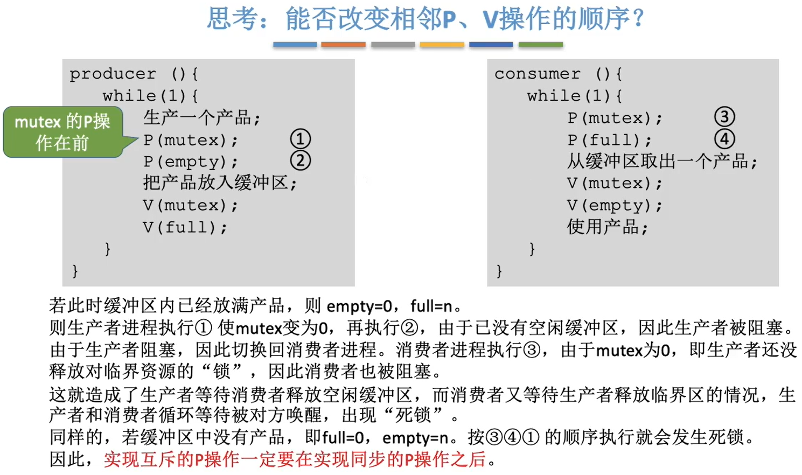

* 易错点：实现互斥的P操作一定要在实现同步的 P操作之后，否则会导致死锁现象。


## 多生产者-多消费者问题

* 桌子上有一个盘子，每次只能向其中放入一个水果。爸爸专向盘子中放入苹果，妈妈专向盘子中放入橘子，儿子专等着吃盘子中的橘子，女儿专等着吃盘子中的苹果。只有盘子空时，爸爸或妈妈才能向盘子中放一个水果。仅当盘子中有自己需要的水果时，儿子或女儿可以从盘子中取出水果。使用 PV 操作实现上述过程。
* 盘子看成大小为 1，初始为空的缓冲区。
* 爸爸=生产者进程 1，妈妈=生产者进程 2，女儿 = 消费者进程 1，儿子 = 消费者进程 2

1. 关系分析。找出题目中描述的各个进程，分析它们之间的同步、互斥关系。

   * 互斥关系：对缓冲区（盘子）的访问要互斥地进行

   * 同步关系（一前一后）：

     1. 父亲将苹果放入盘子后，女儿才能取苹果

     2. 母亲将橘子放入盘子后，儿子才能取橘子

     3. 只有盘子为空时，父亲或母亲 才能放入水果

        “盘子为空”这个事件可以由儿子或女儿触发，事件发生后才允许父亲或母亲放水果。

2. 整思路。根据各进程的操作流程确定 P、V 操作的大致顺序。
   * 互斥：在临界区前后，分别 P、V
   * 同步：前 V 后 P

3. 设置信号量。设置需要的信号量，并根据题目条件确定信号量初值。（互斥信号量初值一般为1，同步信号量的初始值要看对应资源的初始值是多少）

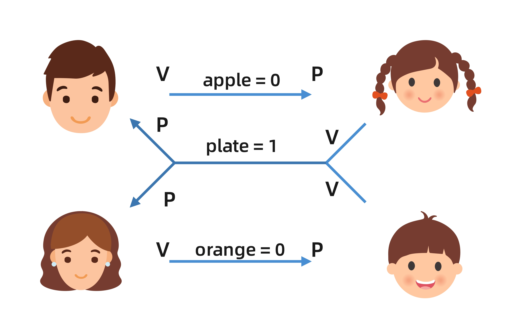

信号量的初始化：

```cpp
semaphore mutex = 1;    // 实现互斥访问盘子（缓冲区）
semaphore apple = 0;    // 盘子中有几个苹果
semaphore orange = 0;   // 盘子中有几个橘子
semaphore plate = 1;    // 盘子中可以放多少个水果
```

```cpp
dad()
{
    while(1)
    {
        准备一个苹果;
        P(plate);
        P(mutex);
        把苹果放入盘子;
        V(mutex);
        V(apple);
	}
}

mon()
{
    while(1)
    {
        准备一个橘子;
        P(plate);
        P(mutex);
        把橘子放入盘子;
        V(mutex);
        V(orange);
	}
}

daughter()
{
    while(1)
    {
        P(apple);
        P(mutex);
        从盘中取出苹果;
        V(mutex);
        V(plate);
        吃掉苹果;
    }
}

son()
{
    while(1)
    {
        P(orange);
        P(mutex);
        从盘中取出橘子;
        V(mutex);
        V(plate);
        吃掉橘子;
    }
}
```

针对这道题，即使不设置专门的互斥变量 mutex，也不会出现多个进程同时访问盘子的现象。原因在于，本题的缓冲区大小为 1，在任何时刻，apple、orange、plate 三个同步信号量中最多只有一个是 1.因此在任何时刻，最多只有一个进程的 P 操作不会被阻塞，并顺利地进入临界区。

如果盘子容量大于 1，可能会导致两个进程写入缓冲区的数据相互覆盖的问题。

如果缓冲区大小大于1，就必须专门设置一个互斥信号量 mutex 来保证互斥访问缓冲区。如果缓冲区大小等于1，有可能不需要设置互斥信号量就可以实现互斥访问缓冲区的功能。

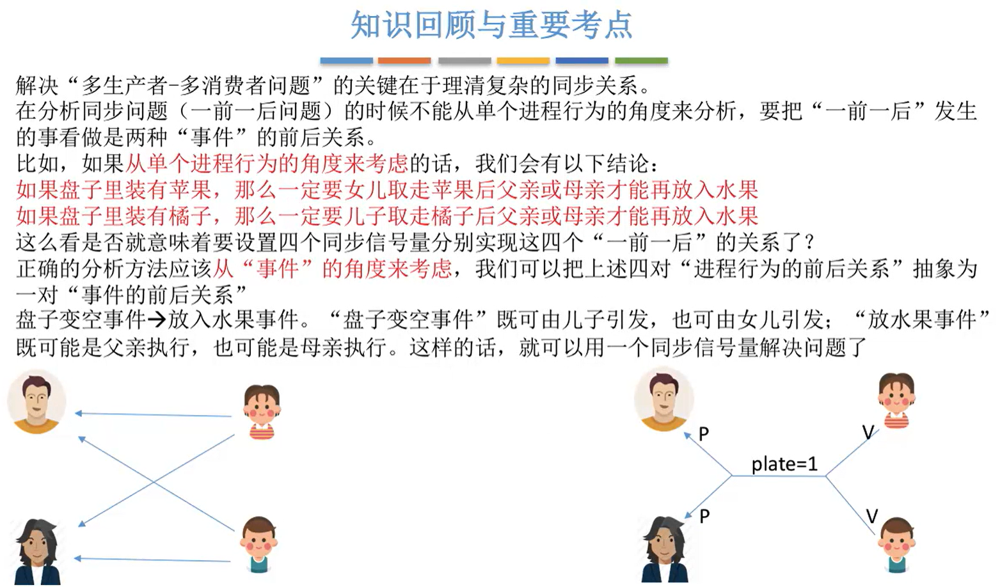


## 吸烟者问题

* 假设一个系统有三个抽烟者进程和一个供应者进程。每个抽烟者不停地卷烟并抽掉它，但是卷起并抽调一支烟，抽烟者需要三种材料：烟草、纸和胶水。

  三个抽烟者中，第一个用拥有烟草、第二个拥有纸、第三个拥有胶水。

  供应者每次将两个材料放桌子上，拥有剩下那种材料的抽烟者卷一根烟并抽掉它，并给供应者进程一个信号告诉完成了，供应者就会放另外两种材料在桌上，这个过程一直重复（让三个抽烟者轮流地抽烟）。

  * 供应者相当于生产者，吸烟者相当于消费者。
  * 和之前的不同是，生产者会生产几种不同的产品

本质上这题也属于“生产者-消费者”问题，更详细地说应该是“可生产多种的单生产者-多消费者”问题。

1. 关系分析。找出题目中描述的各个进程，分析它们之间的同步、互斥关系。

   * 可以把桌子看成容量为 1 的缓冲区，要互斥访问。

   * 容量为 1，是以一个组合为一个单位。

     生产者一共生产 3 种组合的物品：

     1. 组合一：纸+胶水（抽烟者1 所需要的）
     2. 组合二：烟草+胶水（抽烟者2 所需要的）
     3. 组合三：烟草+纸（抽烟者3 所需要的）

     把组合看成一个组合。

   * 同步关系：

     * 桌上有组合一 => 第一个抽烟者取走东西
     * 桌上有组合二 => 第二个抽烟者取走东西
     * 桌上有组合三 => 第三个抽烟者取走东西

     * 抽烟者 发出完成信号 => 供应者将下一个组合放到桌子上

2. 整理思路。根据各进程的操作流程确定 P、V 操作的大致顺序。

   * 互斥：访问临界前后分别执行 P、V 操作

   * 同步，必须执行“前 V 后 P”

     在第一个事件发生之后执行 V 操作，第二个事件发生之前执行 P 操作

3. 设置信号量。设置需要的信号量，并根据题目条件确定信号量初值。（互斥信号量初值一般为1，同步信号量的初始值要看对应资源的初始值是多少）

   由于缓冲区的容量为 1，可以不设置互斥锁。

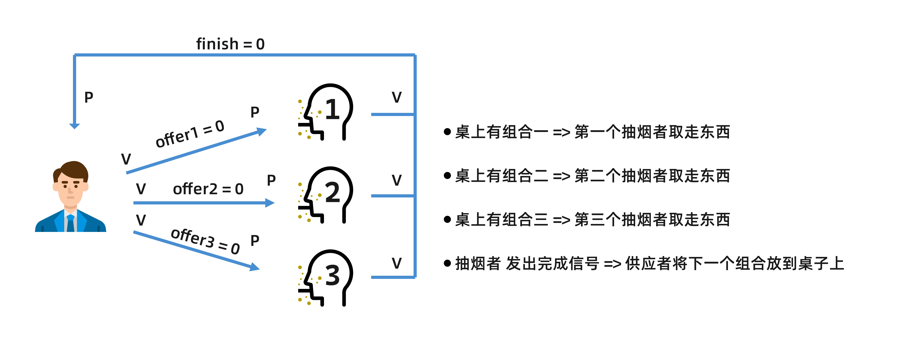

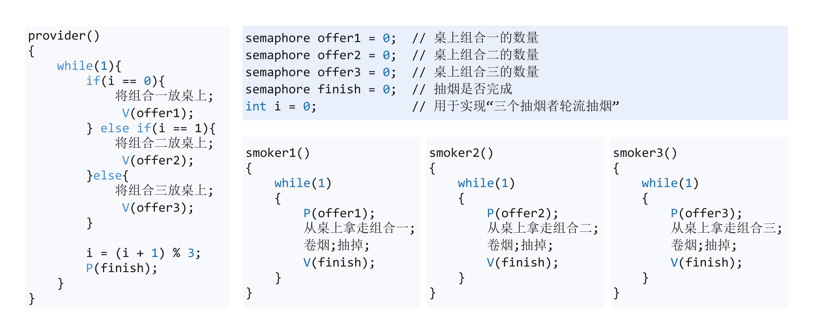

* 这道题，值得学习的地方是，利用变量 i 实现轮流过程。
* 若一个生产者要生产多种产品（或者说会引发多种前驱事件），那么各个 V 操作应该放在各自对应的“事件”发生之后的位置。


## 读者-写者问题

* 有 读者 和 写者 两组并发进程，共享一个文件，当 两个或两个以上 的 **读进程** 同时访问共享数据时不会产生副作用，但若 某个写进程 和 其他进程（读进程或写进程）同时访问共享数据 时则可能导致 数据不一致的错误。因此要求：
  ① 允许多个读者可以同时对文件进行读操作。
  ② 只允许一个写者往文件中写信息。
  ③ 任一写者在完成写操作之前，不允许其他读者或写者工作。
  ④ 写者执行写操作前，应让已有的读者和写者全部退出。

1. 关系分析。找出题目中描述的各个进程，分析它们之间的同步、互斥关系。

   * 两类进程：写进程、读进程

   * 互斥关系：写进程-写进程、写进程-读进程

     读进程之间不存在互斥关系

2. 整理思路。根据各进程的操作流程确定 P、V 操作的大致顺序。

3. 设置信号量。设置需要的信号量，并根据题目条件确定信号量初值。

   （互斥信号量一般设置为 1，同步信号量的初始值要看对应的资源的初始值是多少）

```cpp
semaphore rw = 1;    // 用于实现对共享文件的互斥访问呢
int count = 0;       // 记录当前有几个读进程正在访问文件


writer()
{
    while(1)
    {
        P(rw);    // 写之前“加锁”
        写文件;
        V(rw);    // 写之后“解锁”
    }
}

reader()
{
    while(1)
    {
        if(count == 0)  // 由第一个读进程负责
            P(rw);      // 读之前“加锁”
        count++;        // 访问文件的 读进程数 +1
        
        读文件;
        
        count--;         // 访问文件的 读进程数 -1
        if(count == 0)
            V(rw);   // 读之后“解锁”
    }
}
```

* 这个程序看似没有问题。但是若两个读进程并发执行，则 `count = 0` 时，两个进程也许能满足 if 条件，都会执行 `P(rw)`，从而使第二个读进程阻塞的情况。
* 主要原因在于：对 count 变量的检查和赋值<u>无法一气呵成</u>，因此可以设置 **另一个互斥信号量** 来保证各 **读进程** 对 count 的访问是互斥的。

最终的代码：

```cpp
semaphore rw = 1;    // 用于实现对共享文件的互斥访问呢
int count = 0;       // 记录当前有几个读进程正在访问文件
semaphore mutex = 1; // 用于保证对变量 count变量的互斥访问

writer()
{
    while(1)
    {
        P(rw);    // 写之前“加锁”
        写文件;
        V(rw);    // 写之后“解锁”
    }
}

reader()
{
    while(1)
    {
        P(mutex);       // 各读进程互斥访问 count
        if(count == 0)  // 由第一个读进程负责
            P(rw);      // 读之前“加锁”
        count++;        // 访问文件的 读进程数 +1
        V(mutex);
        读文件;
        P(mutex);       // 各读进程互斥访问 count
        count--;         // 访问文件的 读进程数 -1
        if(count == 0)
            V(rw);   // 读之后“解锁”
        V(mutex);
    }
}
```

潜在的问题：只要有读进程还在读，写进程就要一直阻塞等待，可能“饿死”。因此，这种算法中，读进程是优先的。

**实现更公平的算法**

* 再引入一个信号量，用于实现“写优先”

```cpp
semaphore rw = 1;    // 用于实现对共享文件的互斥访问呢
int count = 0;       // 记录当前有几个读进程正在访问文件
semaphore mutex = 1; // 用于保证对变量 count变量的互斥访问
semmaphore w = 1;    // 用于实现“写优先”

writer()
{
    while(1)
    {
        P(w);
        P(rw); 
        写文件;
        V(rw);
        V(w);
    }
}

reader()
{
    while(1)
    {
        P(w);
        P(mutex);
        if(count == 0)
            P(rw);
        count++;
        V(mutex);
        V(w);
        读文件;
        P(mutex);
        count--;
        if(count == 0)
            V(rw);
        V(mutex);
    }
}
```

在这种算法中，连续进入的多个读者可以同时读文件；写者和其他进程不能同时访问文件；写者不会饥饿，但也不是真正的“写优先”，而是相对公平的先来先服务原则。有的书上，称这种算法为“读写公平法” 

* 读者-写者问题为我们解决复杂的互斥问题提供一个参考思路：

  其核心思想在于设置一个 计数器count 用来记录当前正在访问共享文件的 读进程数。我们可以用 count 的值来判断当前进入的进程是否是第一个/最后一个读进程，从而做出不同的处理。

  另外，对count 变量的检查和赋值不能一气呵成导致了一些错误，如果需要实现“一气呵成”，自然应该想到用 **互斥信号量**。


## 哲学家就餐问题

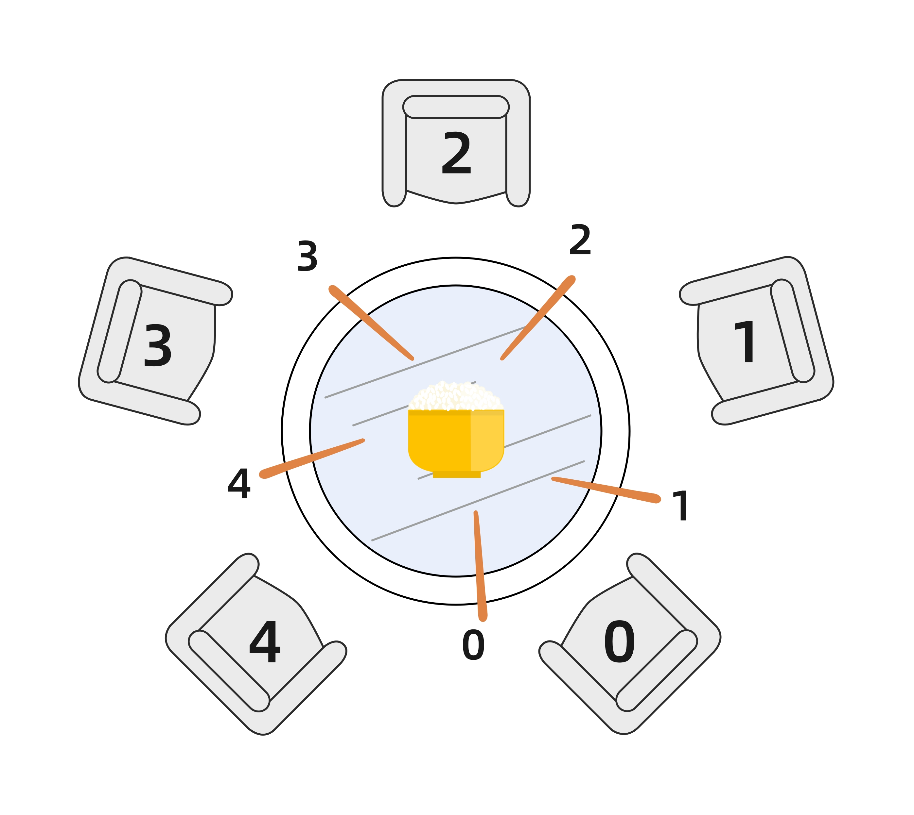

* 一张圆桌上坐着 5 名哲学家，每两个哲学家之间的桌面上摆着一根筷子，桌子的中间是一碗米饭。哲学家倾注毕生的精力用于思考和进餐，哲学家思考时，并不影响他人。只有当哲学家饥饿时，才试图拿起左、右两根筷子（一根一根地拿起）。如果筷子已在他人手里，则需等待。饥饿的哲学家 **只有同时拿起两个筷子** 的才可以开始就餐。当进餐完毕后，放下筷子继续思考。

1. 分析关系。系统中有 5 个哲学家进程，5 位哲学家与左右邻居对中间筷子的访问是互斥的。

2. 整理思路。这个问题中只有互斥关系，但与之前遇到的问题不同的是，每个哲学家进程 需要同时持有 **两个临界资源** 才能开始吃饭。

   如何 避免 临界资源分配不当造成的死锁问题，是哲学家就餐问题的精髓。

3. 信号量设置。定义互斥信号数组 `chopstick[5] = {1, 1, 1, 1, 1}` 用于实现对 5 个筷子的互斥访问。并对哲学家按 0~4 编号，哲学家 `i` 左边的筷子编号为 `i`，右边的筷子编号为 `(i+1)%5`。

* 每个哲学家吃饭前依次拿起左、右两支筷子

  ```cpp
  semaphore chopstick[5] = {1, 1, 1, 1, 1};
  
  Pi()  // i 号哲学家的进程
  {
      while(1)
      {
          P(chopstick[i]);        // 拿左
          P(chopstick[(i+1)%5]);  // 拿右
          吃饭;
          V(chopstick[i]);        // 放左
          V(chopstick[(i+1)%5]);  // 放右
          思考;
      }
  }
  ```

  如果 5 个哲学家，并发地拿起了自己左手边的筷子。每位哲学家循环等待右边的人放下筷子（阻塞）。发生“死锁”。所以上面的解决方案是不合理的。

* 如何避免死锁的发生呢？

  ① 可以对哲学家进程施加一些限制条件，比如最多允许四个哲学家同时进餐。这样可以保证至少有一个哲学家是可以拿到左右两只筷子的。

  ② 要求奇数号哲学家先拿左边的筷子，然后再拿右边的筷子而偶数号哲学家恰好相反。用这种方法可以保证，如果相邻的两个奇偶号哲学家都想吃饭，那么只会有其中一个可以拿起第一只筷子，另一个会直接阻塞。这就避免了占有一支后再等待另一只的情况。

  ③ 仅当一个哲学家左右两只筷子都可以使用的时候才能允许他抓起筷子。

  ```cpp
  semaphore chopstick[5] = {1, 1, 1, 1, 1};
  semaphore mutex = 1;   // 互斥地取筷子
  Pi ()
  {
      while(1)
      {
          P(mutex);
          P(chopstick[i]);        // 拿左
          P(chopstick[(i+1)%5]);  // 拿右
          V(mutex);
          吃饭;
          V(chopstick[i]);        // 放左
          V(chopstick[(i+1)%5]);  // 放右
          思考;
      }
  }
  
  ```

  其实，这个程序并不能保证，当哲学家两边都有筷子的时候，就可以拿起它们。

  更准确地说，mutex 的作用是使得，各哲学家拿筷子这件事必须互斥的执行，这就保证了即使一个哲学家再拿筷子拿到一半时被阻塞，也不会有别的哲学家再继续尝试拿筷子，这样的话，当前正在吃饭的哲学家放下筷子之后，被阻塞的哲学家就可以获得等待的筷子了。

* 哲学家进餐问题的关键在于 解决进程死锁。

  这些进程之间只存在互斥关系，但是与之前接触的互斥关系不同的是，每个进程都需要同时持有两个临界资源，因此就有“死锁”问题的隐患。

  如果遇到 一个进程需要同时持有多个临界资源的情况，可以参考哲学家就餐问题的思想，分析给出的进程之间是否会发生循环等待，是否会发生死锁。可以参考哲学家就餐问题解决死锁的三种思路。


## 管程

* 信号量机制存在的问题：编写程序困难、易出错。
* 管程——一种高级的同步机制

### 管程的定义和基本特征

管程是一种特殊的 软件模块，有这些部分组成：

1. 局部于管程的共享数据结构说明；

   例如，生产者-消费者问题中的共享缓冲区 

2. 对该数据结构进行操作的一组过程（一组函数）；

3. 对局部于管程的共享数据设置初始值的语句（就是对共享数据初始化的过程）；

4. 管程有一个名字；

   管程的定义类似于 “类”


管程的基本特征：

* 局部于管程的数据只能被局部于管程的过程所访问；

* 一个进程 只有通过 调用管程内的过程 才能 进入管程 访问 共享数据；

  就是说，管程中的共享数据 只能被 管程内定义的函数 所修改。所以进程要是想修改管程内共享数据，必须通过管程提供的函数 实现。

* 每次只允许 **一个进程** 在 管程 内执行 某个内部过程。

  同一时间段，一个进程在使用 管程中的某个函数，如果这个时间段，这个进程没有使用完这个函数，那么其他进程不能进入这个管程。


### 扩展1： 用管程解决生产者-消费者问题

```cpp
monitor ProducerConsumer
    condition full, empty;     // 条件变量 用来实现同步（排队）
    int count = 0;             // 缓冲区中的产品数
    void insert(Item item){    // 把产品 item 放入缓冲区
        if(count == N)
            wait(full);
        count++;
        insert_item(item);
        if(count == 1)
            signal(empty);
    }
    Item remove()             // 从缓冲区中取出一个产品
    {
        if(count == 0)
            wait(empty);
        count --;
        if(count == N-1)
            signal(full);
        return remove_item();
    }
end moniter
```

生产者进程：

```cpp
producer()
{
    while(1)
    {
        item = 生产一个产品;
        ProducerConsumer.insert(item);
    }
}
```

消费者进程：

```cpp
consumer()
{
    while(1)
    {
        item = ProdecerConsumer.remove();
        消费产品item;
    }
}
```

定义了管程之后，会由编译器负责实现各进程互斥地进入管程中的过程。

引入管程的目的：更方便地实现进程互斥和同步。

1. 需要在管程中定义共享数据（如生产者消费者问题的缓冲区）
2. 需要在管程中定义用于访问这些共享数据的“入口”，其实就是一些函数
3. 只有通过这些特定入口才能访问共享数据
4. 管程中有很多“入口”，但是每一次管程中只能开放一个“入口”，并且只能让一个进程或线程进入（这种特性可保证一个时间段最多只有一个进程在访问缓冲区。互斥特性是由编译器负责实现的）
5. 可在管程中设置条件变量及等待/唤醒操作以解决同步问题。可以让一个进程或线程在条件变量上等待（此时，该进程应先释放管程的使用权，也就是让出“入口”）；可以通过唤醒操作将等待在条件变量上的进程或线程唤醒。

程序员可以通过特殊的语法定义一个管程，之后其他程序员就可以使用这个管程提供的特定“入口”很方便地实现进程同步/互斥了。

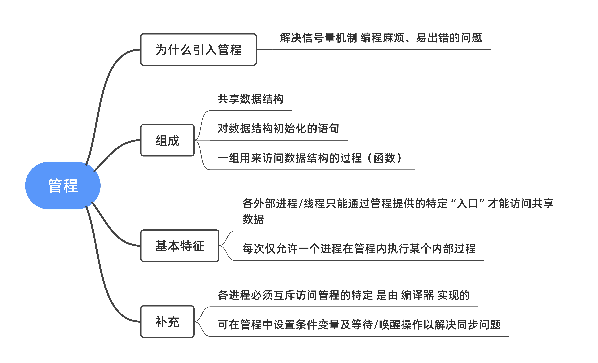
