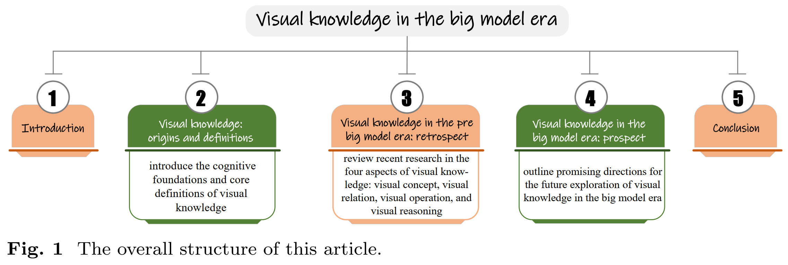
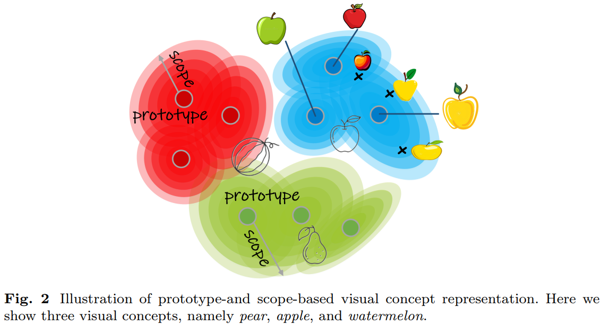

大模型时代的视觉知识：回顾与展望

Visual Knowledge in the Big Model Era: Retrospect and Prospect

原文地址：https://www.fitee.zjujournals.com/zh/article/doi/10.1631/FITEE.2400250/

# 1 Introduction

视觉知识的概念，最近作为一种 知识表征 (representation) 形式 提出，这种形式与传统知识形式有所不同（例如，知识图谱，手工制作的图像描述符，分布式视觉特征）。基于人类心理意象的认知研究，人类心理意象使我们能够在脑海中操作视觉实体。⭐<u>视觉知识理论认为,下一代AI需要充分表达视觉概念及其属性（例如，形状，结构，运动，可用性），并通过统一的、抽象的和可解释的表征形式，对其转化、组合、比较、预测和叙述进行推理。</u>

大型 AI 模型仍然存在几个缺陷，这些缺陷影响了它们的可靠性和有效性：

* 最主要的是它们明显的 **不透明性**，这对信任、问责和有效调试带来了巨大挑战
* 以及它们 **对数据和计算资源的贪婪需求**，这引发了伦理和环境问题。

这些局限性源自其初级前身，但因其高度复杂性和规模而加剧。更加复杂的是，大型 AI 模型容易生成无意义或不忠实的内容，被称为“**幻觉**”，暴露出其固有的偏见、缺乏对现实世界的理解，以及在其范围之外进行泛化或推理的能力弱。

考虑到 视觉知识 在表达和可解释性表征、操作和视觉概念推理方面的吸引人优势，可以合理假设大型人工智能模型的弱点 可以通过对 **视觉知识**  的更深入理解和发展（至少在某种程度上）得到缓解。

另一方面，鉴于大型人工智能模型的巨大成功和视觉知识获取的挑战，未来的努力显然应致力于研究特定技术，旨在借助大规模统计学习构建视觉知识。

# 2 Visual Knowledge: origins and definitions

## 2.1 Origins

* **视觉信号在人脑信息处理中的重要角色**

  我们几乎一半大脑皮层致力于处理视觉刺激。人脑处理图像的速度是处理文本的 60000 倍，传递大脑的信息有 90% 是视觉信息。这些统计数据显示，人脑对视觉信息的重视程度超过任何其他类型的信息。

* **视觉记忆：容量、功能和存储内容的表征**

  人类视觉记忆在日常生活中无处不在，且与许多高级认知功能密切相关，例如心理意象（在缺乏感觉输入的情况下在脑海中创建图像的能力）。  

  视觉记忆，通过主动（视觉工作记忆）或被动（视觉长期记忆）方式，保持和回忆心中所持有的视觉信息，使其可访问和可操作，以支持当前的认知任务。

  认知心理学家进行一系列实验，显示 相比于 语言记忆表征，<u>视觉记忆表征 支持各种心理操作，包括旋转、折叠、扫描和类比</u>。认识心理学家还发现 有证据表明 视觉记忆表征的结构可以被认为是**分层组织**的。

* **感知、视觉记忆与人类知识之间的互动**

  与主要在左半球处理的语言记忆相比，视觉记忆往往更具有双侧性。视觉记忆可以是 *情景性*（如，对具有特定时间和地点的视觉事件或经验的记忆），但也可以是 *语义性*（如，对不与特定上下文绑定的常识性事实或视觉概念的记忆）。

  人类储存关于现实世界中大多数物品的知识，并且有明确的证据表明，视觉记忆中内容的表征不仅仅是感觉输入的简单记录，还依赖于我们的过去经验和所储存的知识 。

  * **视觉记忆** (visual knowledge)，指的是 记忆过去看到的视觉信息 的能力。因此，视觉记忆 是存储和随后提取接收到的视觉信息。
  * **存储知识** (stored knowledge)，指的是 我们能够识别和理解视觉输入的先存表征。

  > 当我们第一次看到一幅图像，比如一个橙子时，关于橙子形态和特征的储存知识使我们能够将该物体识别为橙子。后来，如果我们碰到另一张橙子的图片，视觉记忆使我们能够判断这是不是我们之前看到的同一个橙子。因此，我们在专业领域内的特定物品（如面孔）以更高的精度进行表征 ，而一般概念则基于统计规律进行表征。  

  认知研究表明，我们的<u>存储知识可以调节我们形成和利用心理图像及视觉记忆的方式</u>，而我们的<u>知识和视觉记忆可以影响我们如何感知和关注视觉刺激</u>。

* **视觉知识理论的提议**

  从视觉经验中获得的信息支持许多认知功能（如视觉记忆和心理意象），并且有助于我们的知识构建；这种知识反过来又塑造了视觉记忆，影响感知，并极大地促进了我们对周围世界的理解。

  考虑到所有这些，可以合理地认为，现有 人工智能研究的一个**短板**是 **关于人类对视觉项目的心理表征研究**的稀缺。因此，视觉知识理论应运而生，以填补这一空白。

## 2.2 Definitions

我们的 **视觉知识** 是关于视觉对象及各种任务之间固有规则的共同特征的稳定心理表征。它们是从我们的视觉经验和记忆中抽象出来的，并保留在我们脑海中。它们使我们能够记住、想象和推理关于世界的事物，并完成特定的任务。

神经心理学研究还揭示了我们对视觉对象的**心理表征**的一些特征：

* 能够捕捉视觉对象的**典型属性**，例如它们的<u>形状、大小、颜色和纹理</u>。
* 描述视觉对象之间**静态和动态关系**的能力，例如<u>相对位置、动作、速度和时间序列</u>。
* 在视觉对象上执行**时空操作**的能力，例如<u>变换形状、动作和场景，进行类比和关联，并预测未来结果</u>。
* 能够进行**推理**，例如<u>类比、归纳和演绎新任务，将现有概念结合形成新概念，并从异常样本中进行概括</u>。

视觉知识不仅仅是视觉对象的抽象表征，而是涉及一种 **主动和生成的过程**，支持各种认知技能。因此，视觉知识理论的核心洞察之一是，人工智能系统也应以类似的方式开发和使用视觉知识。

**视觉知识**，作为一种新形式的知识表征，是通过四个基本组成部分的组合构建而成，即 **视觉概念**，**视觉关系**，**视觉操作**，和 **视觉推理**。通过这些关键组成部分，视觉知识 能够使人工智能系统全面描述、稳健识别和推理视觉项目，并解决任务。

### 2.2.1 Visual concept

一个视觉概念是共享某些共同特征的视觉对象的类别。

* **视觉概念**：由 **原型** (prototype) 和 **范围** (scope) 定义的。

当我们思考一个视觉概念时，例如 苹果，我们形成一种 <u>心理图像集</u>，这些图像代表 **该概念 最普通或典型 的特征/属性**。这些图像被称为 **原型**，<u>作为生成或识别该概念任何变体的基础</u>。例如，我们可能有红色、绿色或黄色的苹果原型，这些苹果是圆形、椭圆形或心形的。基于这些原型，我们可以想象或识别任何具有相似特征的苹果，即使它与任何原型并不完全相同。有些苹果可能颜色更浅或更深，更大或更小，更光滑或更粗糙。然而，苹果偏离原型的程度是有限制或边界的，仍然可以被视为苹果。如果形状或颜色差异过大，它可能属于另一个视觉概念，例如 梨 或 西瓜。**可接受的类别变异范围** 称为 **范围**。处于范围内的形状和颜色可以被视为苹果，而范围外的形状和颜色则不被视为。

使用原型来表征视觉概念的想法与经典的 **原型理论** (prototype theory) 一致。

* 假设 世界中的一类事物（物体、动物或形状等）可以通过原型在头脑中表示。

* 原型是一种认知表征，它捕捉类别成员之间的规律性和共性。根据原型理论，物体首先通过与存储在记忆中的原型进行比较来进行分类，评估这些比较的相似性证据，然后根据最相似的原型对项目进行分类。

* 设 $\mathcal X$ 为数据空间，$\mathcal Y = \{y_1, \cdots, y_C \}$ 为 $C$ 个类别的集合。给定一个数据实例 $\mathbf x\in\mathcal X$ ，原型分类模型将其分配给与最接近的原型 $y\in \mathcal Y$ 。
  $$
  y = \arg \min_{y_c\in \mathcal Y} \langle \mathbf x, \mathbf p_c\rangle
  $$
  其中 $\langle\cdot, \cdot\rangle$ 是一个距离度量，$\mathbf p_c$ 指的是类别 $y_c$ 的原型，而 $\mathbf x$ 的某个维度 $(\mathbf p)$ 编码了一个特定的显著属性。

  > k-NN 算法、最近质心

一般来说，原型理论非常适合解释具有强家族相似性结构的许多视觉类别的学习。然而，原型理论缺乏范围的概念，使其对类内方差的容忍度较低。  

从统计学角度来看，使用原型和范围来描述类别 实质上是为了捕捉 数据分布 $p(x|y)$ 的形状或结构，即 某一类别的数据样本看起来是什么样子的。因此，基于视觉概念的计算模型是一种 生成分类器，用于估计给定输入的标签的条件概率，然后使用贝叶斯法则 来分配最可能的标签：
$$
p(y|\mathbf x) = \cfrac{p(y)p(\mathbf x|y)}{\sum_{c\in \mathcal Y} p(c)p(\mathbf x|c) }
$$
与直接将输入映射到标签而不对数据分布进行明确建模的判别分类器不同，<u>生成分类器更难训练，因为它们必须对数据的更多方面进行建模</u>。

### 2.2.2 Visual relation

* 视觉关系：视觉概念之间的连接和交互，这些连接和交互在导航复杂的视觉认知环境中至关重要。

人类拥有庞大的知识库，该知识库与视觉对象的属性相关，这个知识库超越了这些对象的**单纯内在属性**——例如颜色、形状和纹理——还包括将它们联系起来的**关系属性**。这些关系属性涵盖它们的**相对位置**、**语义依赖性**和**可赋能性** (affordances)，共同构成了所谓的“关系属性”或“视觉关系”。这些关系属性或视觉关系可以被归类为不同的类别，每一类别揭示了视觉认知的不同方面：

* **几何关系**：阐明了对象或概念如何基于其空间配置和几何构造相互关联，例如 它们的相对位置、方向、距离、交点、对齐、平行性。这些关系有助于理解环境中物理的结构和组织，并揭示自然和艺术的内在和谐与秩序。

  > 例如，苹果内的种子位于其中心。类似的，我们对人脸的知识不仅仅是眼睛、鼻子、嘴巴和耳朵的出现，还包括这些关键面部元素的精确空间排列。

* **时间关系**：通过标记事件和转变在视觉场景中随时间的顺序或时机，丰富了视觉知识。例如，时间关系可以描述动作的进展，例如“之前”、“之后”和“期间”，这些在理解环境和动作的动态中是非常重要的。

* **语义关系**：这些关系指定了基于对象或概念的意义或重要性之间的连接，从而增强了我们对意义、部分与整体关系、相似性、差异性、包含-排除标准以及在视觉信息中的语义依赖性的理解。

  > 例如，部分与整体的关系帮助我们将视觉概念分解为其组成部分，如苹果可以分解为种子、果肉、果皮和果梗；人身体可以分解为不同的部分。

  这些子概念之间不仅相互保持语义联系，同时也与其上层概念保持联系。

  同样，分类关系描述这样的事实：视觉概念可以与其他属于同一类别或上位概念的对象归为一类；这些概念之间 及其与 所属类别之间 存在 **相似性和差异性的语义关系**。

  > 例如，狗和猫是不同类型的动物

  此外，语义关系还涉及**更抽象的关联**。

  > 比如 “鸽子” 与 “和平” 之间的隐喻关系。

  进一步来说，语义关系允许基于特定标准或准则对视觉概念进行包含或排除。
  
  > 例如 它们是否属于某个特定领域或情景。
  >
  > 例如，苹果和橙子被归类为水果，而非蔬菜，这是基于某些区分因素。
  
* **功能关系** (functional relations)：阐明了对象之间基于其物理属性或可供性 (affordances) 的相互作用，从而促进我们对目的、效用、效果、原因和与动作相关结构的理解。

  > 例如，一把刀可以切面包，一把椅子可以支撑一个人，一支笔可以在纸上书写，等等。

  功能关系建立了行为及其环境 前因（刺激） 和 后果（增强物或惩罚物）之间的因果联系。

  > 例如，如果一个孩子了解到按下一个按钮会发出声音（前因），他或她可能会更频繁地按下这个按钮（行为）以更频繁地听到声音（后果）。 

  功能关系是推理和解决问题的基础，因为它们使我们能够从已有的事实或行为推导出新的事实或行为。通过识别问题行为与其环境变量之间的功能关系，我们可以设计干预措施，改变问题行为的前因或后果，或者教授具有相同功能的替代行为。

  >  例如，我们可以利用功能关系推断出，如果一把刀能切割面包，那么它也能切割奶酪。
  >
  >  同样，我们可以推断出，如果我们想要把石头砸碎，那么我们需要使用锤子。

  此外，功能关系还能保住我们为事实或行为生成解释或论证。

  > 例如，我们可以利用功能关系解释为什么我们用刀来切割面包，或者为什么我们坐在椅子上。

* **因果关系**：因果关系识别视觉元素之间的因果联系，这是理解视觉场景中变化如何变化及其原因的关键。

  > 例如，雨水会导致街道变湿。

  因果关系，还使我们能够在视觉背景下进行 **预测性推理**，例如推测某个行为或事件可能导致的结果，从而增强我们对视觉信息的理解和预见能力。

对这些视觉关系进行建模是视觉知识理论的基础，它使人工智能系统能够以结构化且有意义的方式处理和解析视觉信息。通过对这些关系进行分类和分析，研究人员可以开发更先进的人工视觉感知模型，从而增强机器对视觉信息的人类般理解和推理能力。

### 2.2.3 Visual operation

* 视觉操作：对空间或时间中视觉概念或对象的变换，例如<u>组合、分解、替换、结合、变形、运动、比较、破坏、恢复和预测</u>。

视觉概念是视觉知识的关键元素，使我们能够识别、分类和命名我们在环境中观察到的实体。此外，视觉关系增强了我们对这些物体之间的相互联系和功能的理解。

**视觉概念**可以通过**认知过程**进行操控，例如在空间或时间上对其进行变换，改变其组成部分或特性，并促成各种对这些概念或对象的操作。这些操作对于增强我们理解世界的能力、促进创新以及执行复杂任务至关重要。它们体现了视觉知识的动态特性，展示了静态图像或场景如何通过**认知**参与被重新想象或重构。

* **组合** 和 **分解**：

  * 组合：涉及将多个视觉元素组合成一个新对象或概念
  * 分解：指将一个对象拆分为其组成部分。

  这些操作对于通过分析复杂系统和结构的部分及其相互关系来理解它们至关重要。此外，它们对于创新和创造性概念或对象的生成也至关重要。

  > 例如，通过将一个苹果与其他物体（例如，面粉）进行深思熟虑的排列，我们可以创造新的发明（例如，苹果派）

* **替换** 和 **组合**：

  * 替换：用一个视觉元素替代另一个元素
  * 组合：涉及将不同元组合并以形成一个新实体。

  这些操作对于创造性思维和问题解决至关重要，能够促进对替代配置和解决方案的探索。它们还通过允许设想场景来增强我们对物体功能的理解。

  > 例如用苹果替代汽车的轮子。

* **变形** 和 **运动**：

  * 变形：改变物体的形状或结构
  * 运动：涉及随时间变化其位置

  理解这些操作对于把握物体的内在和外在属性、解析各种物理和生物过程，以及制作能够复现现实世界现象的动画和模拟至关重要。

  > 例如，可以通过缩放、旋转或平移来操控苹果的形状或位置；或者通过加速、减速、反转、循环或插值调整苹果下落的运动轨迹。

* **比较**：涉及评估视觉元素之间的相似性和差异性，帮助分类和决策过程。

  > 例如，我们可以比较一个苹果与其他苹果或物体在大小、重量等方面。

  比较对于识别模式、做出判断以及从视觉经验中学习至关重要。

* **破坏** 和 **恢复**：

  * 破坏：涉及视觉元素的移除或破坏
  * 恢复：专注于修复或将其恢复到原始状态

  这些操作可应用于多个领域，例如理解自然灾害及其后果，或用于艺术保护和历史遗产修复工作。

* **预测**：涉及基于当前或过去信息对未来状态或视觉元素的变化进行投影。

  该操作对于规划、预测以及预期动作和事件的结果至关重要。

通过这些操作，视觉知识理论提供了一个框架，用于理解视觉信息如何被动态操控和利用。这些操作凸显了视觉知识的多功能性和强大作用，展现了它在增强我们与视觉世界的交互、修改以及预测能力方面的关键作用，同时也体现了其在各个领域的广泛应用潜力。

### 2.2.4 Visual reasonging

* 视觉推理：从 视觉概念、关系和操作中 获得的知识来解释视觉数据、解决问题并做出明知决策的过程。

这一复杂过程通常涉及对视觉概念和关系的一系列系统性操作，旨在从视觉观察和已有知识（常识与专业知识）中推导出合理且有效的结论。

* 视觉概念：对视觉元素的识别与分类
* 视觉关系：关注这些元素之间的联系或关联
* 视觉操作：用于操控或分析视觉元素的处理过程
* 视觉推理：利用视觉概念、关系和操作来解决问题、做出决策或从视觉信息中推导出合理结论的过程。

# 3 Visual knowledge in the pre big model era: retrospect

> 部分内容摘抄

## 3.1 Visual knowledge: visual concept

* **视觉概念**：原型 (prototype)+范围 (scope) 的表征

* 基于 原型 的网络、非参数神经分类器 (non-parametric neural classifier)、基于最近中心的神经分类器：
  * 这些方法中，每个类别由一个或多个原型表示，新观察样本通过其与类别原型的接近程度进行分类。
  * 缺点：未能有效刻画每个类别或原型的范围
* 深度生成分类器，用于估计每个 视觉概念/类别 的数据密度，将其建模为 **高斯混合模型** (Gaussian Mixture Model, GMM)。这一框架下，类别的 原型 和 范围 对应于 GMM参数（即 均值向量 和 协方差矩阵）

## 3.2 Visual knowledge: visual relation

* 视觉概念 可以以 不同方式 **相互关联**，从而产生多种类型的 **视觉关系**：**几何**、**时间**、**语义**、**功能** 和 **因果** 关系。

* **几何关系**：描述对象在空间中的排列和变换方式，包括它们的 位置、方向、大小 和 形状。

  * Capsule network：capsule 是一组神经元，其活动向量表示某个视觉概念或对象的 概率 及其 姿势 (pose)。其中，姿势 由一组参数描述，包括 位置、旋转 和 反射 等空间关系 和 变换。

    Capsule network 在实际应用中的可行性较低，这表明视觉几何关系建模仍然面临巨大挑战。

* **语义关系**：定义了 物体 在意义层面 上的关联。

  * 深度分层语义分割：https://arxiv.org/abs/2203.14335 
    * 神经解析器：根据语义概念层次生成结构化的、逐像素的视觉观察描述，这个结构化视觉解析器在网络训练过程中明确利用了 语义概念 之间的 **组合** 和 **分解** 依赖关系作为额外的正则化项。
    * 该方法的语义关系 由 类别层次结构 预定义，而非自动学习，这表明学习视觉语义关系仍是一个富有挑战性的问题，需要进一步研究。
  * 人体解析：https://arxiv.org/abs/2001.06804

* **时间关系**：阐明了事件和动作随时间在视觉数据中发生的顺序或事件顺序。

  * 时间关系 主要在 动作识别 和 视频对象检测 的领域中研究。

* **功能关系**：物体能够执行或支持的动作。

  * 计算机视觉中有多个任务研究视觉概念的功能关系，例如人体-物体交互（HOI）检测和可供性估计（affordance estimation，又称功能识别）。

  * HOI检测：定位并识别视觉场景中 人与物体之间的关系，例如 <女孩，吃，苹果>

  * 可供性估计 (affordance estimation) ：用于 从视觉信息 中预测 物体的典型功能属性：可食用、可打开

  * **场景图生成** (scene graph generation, SGG) ：生成一个基于视觉的结构化图，作为视觉场景的显式描述。

    * 场景图的节点：表示物体
    * 场景图的边：表示物体之间的关系（包括空间关系、部分-整体关系和交互关系）

    每个物体之间的关系可表示为一个三元组（triplet）：<boy, RIDE, car>， <car, HAS, wheel>， <car, NEAR, building>

    虽然 SGG 在一定程度上融合了几何、语义和功能关系，但仍存在一些局限性：

    * 关系覆盖有限：例如，SGG 主要关注以人为中心的功能关系，较少考虑以物体为中心的可供性。
    * 标注成本高：SGG 需要大量人工标注视觉关系，成本昂贵，限制了其大规模应用。

* **因果关系**：描述 视觉环境 中的 事件、动作或对象 如何 直接影响或导致彼此的结果。

  * 近期的一系列研究致力于挖掘视觉数据中蕴含的因果性。
    * 基本上，这些研究在深度学习框架内探讨因果推理，以从 视觉数据 中提取因果表示。
    * 利用 因果引导 的视觉表示，这些方法在视觉识别等任务中取得了显著的性能提升。
    * 此外，这些方法还展示了 自动发现视频中的环境变量和对象变量之间因果依赖关系的能力，并能够提升深度学习模型的可解释性以及其对分布外数据的泛化能力。

## 3.3 Visual knowledge: visual operation

* **视觉操作**：在空间或时间中对视觉概念或对象的操控。

* 一个密切相关的 研究领域是：**定制化视觉内容生成**，其目标是利用文本描述生成具有创造性的目标概念内容。文本描述作为一种可行且灵活的工具，可用于指定编辑意图，使得各种视觉操作（如替换、组合等）成为可能。

* **文本到图像生成**：生成对抗网络 (GANs)、变分自编码器 (VAEs)、自回归模型 (Autoregressive Models)、扩散模型 (Diffusion Models)。目前，这些生成模型在复杂的视觉操作（如 分解、破坏和修复）时仍然存在困难。

* **新视角合成**：根据单张或多张输入图像，合成同一对象或场景在不同视角下的新图像。

  这一任务涉及 变形（deformation） 和 运动（motion） 两种视觉操作。为了实现新视角合成，必须深入理解对象的空间与时间特性，从而生成既真实又符合物理世界规律的图像。

  > 3D 建模、神经辐射场 (NeRFs)

* **预测**：从视觉数据中预测未来状态、动作或事件的视觉操作。

  代表性任务：人物轨迹预测、未来帧预测、动作预测、物理交互预测、事故预测

## 3.4 Visual knowledge: visual reasoning

* **视觉推理**：应用 视觉概念、视觉关系和视觉操作（这些是不同任务之间的共性）来根据前提或证据得出有效且合理的结论。

  > 例如，我们可以利用功能关系进行推理，如：
  >
  > “如果 A 可以切割 B，那么 B 是柔软的”
  >
  > “如果 A 能支撑 B，那么 A 是稳定的”

* 人类推理，按照论证方式和强度不同，分为：演绎推理、归纳推理、溯因推理、类比推理。

* 机器推理：旨在实现自动化推理。核心在于：整合已知信息、结合背景知识、推导未知或不确定信息。

尽管深度神经网络（DNN）在模式识别和预测建模方面表现出色，但它们在需要显式符号操作的推理任务上仍然存在困难。

* DNN 擅长学习子符号表示（即连续嵌入向量），但其架构并不天然适用于推理中常见的离散符号操作。
* DNN 通常通过归纳学习数据，而推理中的演绎过程则依赖于显式的、预定义的规则和知识库，这二者存在本质差异。因此，将领域特定知识集成到 DNN 以进行显式推理并不直观。
* DNN 的决策过程往往不透明，使得难以理解其如何得出特定结论。在自动驾驶等决策关键型应用中，这种不透明性尤其突出。
* 符号方法虽然不如神经网络可训练性强，但在基于规则的推理（如演绎推理）方面表现卓越，并且具有高度的可解释性——因为它们依赖清晰的逻辑原则，能够被轻松追踪和理解。

鉴于 DNN 在显式推理方面的挑战，以及连接主义和符号方法的互补性，一个名为**神经符号计算**（Neuro-Symbolic Computing，NeSy）的研究领域得到了广泛关注。NeSy 旨在系统地整合 AI 领域的这两种基础范式，提供一个更强大、透明且鲁棒的推理框架。(https://arxiv.org/abs/1905.06088)

传统上，与视觉推理相关的任务主要包括视觉问答（VQA）和视觉语义解析：

* 视觉问答：基于视觉内容回答问题的任务，它需要对视觉和语言模态进行全面理解和推理。

  > Andreas 等人（2016）引入了一个基于 NeSy 的VQA 系统，该系统将问题解释为由可学习的神经模块构成的可执行程序，这些模块可以直接应用于图像。一个模块通常通过神经注意力操作实现，并对应于某个原子推理步骤，例如识别物体、分类颜色等。  

* 视觉语义解析：根据**类别层次结构**对视觉观察进行整体解释。类别层次结构作为**知识库**，预先定义了语义概念之间的符号关系。

  > Li 等人（2023a）设计了一个强大的基于NeSy 的视觉语义解析器，通过端到端嵌入符号逻辑，协调网络的训练和推理阶段。  

其他相关任务：视觉溯因推理、视觉常识推理。

一些研究探索了 LLM 在复杂视觉推理任务中的应用。例如：

* **VisProg**（Gupta & Kembhavi, 2023）是该领域的一个开创性工作。它利用 LLM 将视觉推理任务（例如“这两张图片中是否总共有六个人和两艘船？”）分解为一系列可管理的子任务（如文本解析、目标检测、计数等），并逐步解决这些任务。
* **HuggingGPT**（Shen et al., 2023）利用 LLM 组织和管理 Web 上的 AI 模型，以解决复杂的推理任务。
* **DoraemonGPT**（Yang et al., 2024a）进一步推动了这一研究趋势，使其能够处理涉及动态观测的现实任务。它为LLM配备了符号记忆，以收集和存储任务相关的信息，同时集成了丰富的额外知识来源（如AI工具、搜索引擎、教科书、知识数据库）以供参考，并采用基于蒙特卡洛树搜索（Monte Carlo Tree Search, MCTS）的规划器来高效探索庞大的解空间。

## 3.5 Discussion

* **尽管研究社区在视觉知识的某些领域取得了进展，但仍有许多核心问题尚未得到充分解决或深入探索**，例如 基于原型与范围的视觉概念、因果关系、复杂的视觉操作（如分解、破坏和修复）以及视觉推理等。这表明构建视觉知识的挑战性，同时也揭示了提出视觉知识这一概念的主要动机——**缺乏一个提供统一视角的系统化框架**，以整合视觉智能的不同方面。

* **尽管大规模语言模型（LLMs）在解决复杂问题方面展现出卓越能力，但它们也加剧了神经网络算法固有的“黑箱”问题**。LLMs 由数十亿甚至数万亿个参数组成，使得深入解析其内部机制几乎成为不可能的任务。此外，LLMs 仍然无法像人类一样进行真正的逻辑推理。它们经常生成听起来合理但缺乏真正理解的答案。更令人担忧的是 LLMs 的**不透明性**，使得识别和纠正推理过程中的错误变得困难。

# 4 Visual knowledge in the big model era: prospect

## 4.1 Empower big models with visual knowledge

* 大型人工智能模型面临的最关键挑战之一是与 透明度、推理 和 灾难性遗忘 相关的问题。

* **透明度**：模型的内部运作机制及其输出结果在人类层面上的可理解性和可解释性。

  不过，由于基于原型和范围的视觉概念本身具有内在的透明性，将视觉知识引入模型有望赋予大型模型某种即时的可解释能力。

  一个显著的例证是 Wang 等人（2023）的开创性研究，他们提出了 Deep Nearest Centroids（DNC），这是一种端到端的、基于原型的神经分类器。DNC 通过将视觉概念表示为一组自动发现的原型（即类别子中心点），模拟了人类所熟悉的经验/案例推理过程，从而为大规模视觉识别任务提供了一个强大且可即时解释的框架。

  这一思路为基于原型与范围的视觉概念建模提供了进一步探索的空间。通过将这类本身具有透明性的视觉概念作为构建要素，人们自然可以预期视觉知识将有效提升大型模型的透明性。

* **推理问题**：虽然大型人工智能模型在模式识别和生成类人文本或图像方面表现出色，但它们可能未能理解其产生内容的潜在逻辑或真实性，因此在需要理解因果关系、抽象概念或逻辑推理的任务中存在困难。

  * 尽管最近发展了一些推理策略，例如思维链和思维树，以提升大型模型的推理能力，但它们仍远非真正的推理。**真正的推理通常涉及对符号概念的复杂操作、理解因果关系和将抽象原理应用于新情境。** 
  * **视觉知识** 为全面建模视觉观念、视觉关系（包括因果关系）、视觉操作和视觉推理提供了明确、强大且统一的框架。  因此，这可能使大型模型的推理进入一个全新的时代，在这个时代中，推理不仅由大型模型的隐性知识驱动，还由视觉知识建模的显性知识所驱动。  

  作者的论断：**将大型模型的隐性知识与显性视觉知识结合** 在多重知识表征的形式中是一条有前途的前进道路。  

* **灾难性遗忘**：深度神经网络（DNNs）在接触新数据或任务时失去之前学习的知识的趋势。
  * 问题的根源在于DNNs更新其参数的方式：<u>新的学习可能会覆盖与旧知识相关的权重和偏差，从而导致模型在以前掌握的任务上的性能迅速下降</u>。   
  * 灾难性遗忘的核心在于大型人工智能模型中知识追踪的困难。在人类学习中，知识追踪允许经验的积累和新信息与现有知识的无缝整合。然而，在大型人工智能模型中，由于大量相互连接的参数的复杂网络架构，识别负责特定知识片段的具体组件是一项艰巨的任务。  
  * 视觉知识有着深厚的认知心理学根基，为大型模型提供了一种明确的、结构化的、持久的、可编辑的和可追踪的知识表征。这使得可以在大型模型外更新知识，从而实现更有针对性的干预，以防止灾难性遗忘。此外，结合视觉知识，大型模型可以创造出更耐久且可检索的记忆，以增强回忆和理解，类似于人类。  

## 4.2 Boost visual knowledge with big models

* 大型人工智能模型将成为视觉知识的基本基石。  

  因此，利用大型模型的大规模学习能力来学习稳健的视觉概念、建模基本视觉关系（如时间关系和几何关系）以及操作（如组合、变形和动作）是自然而然的选择。  

* 大型人工智能模型将作为视觉知识的知识来源。  

  在大量文本（包括科学文章、维基百科、书籍和其他信息来源）上训练的大型语言模型被观察到不仅学习了上下文化的文本表征，还学习了重要的世界知识和常识知识。这表明大型模型作为知识库的巨大潜力，可以显著丰富视觉知识。 

* 大型人工智能模型将为视觉知识提供互补知识。  大型语言模型根据文本数据对世界进行建模。从文本数据中获得的知识不仅丰富，而且补充了视觉知识。例如，一些知识很难从视觉数据中学习，例如人类内心的想法、动机和情感，以及常识知识。
