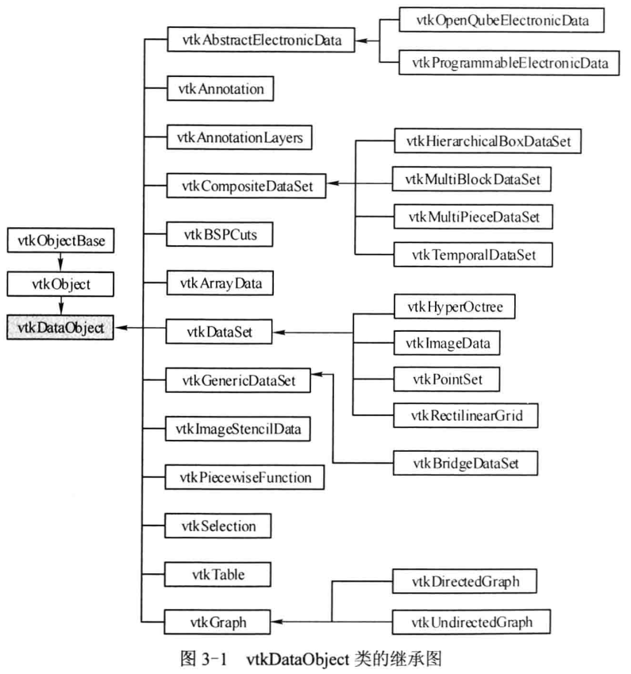
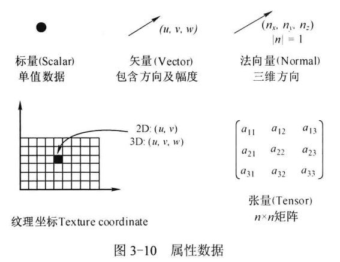
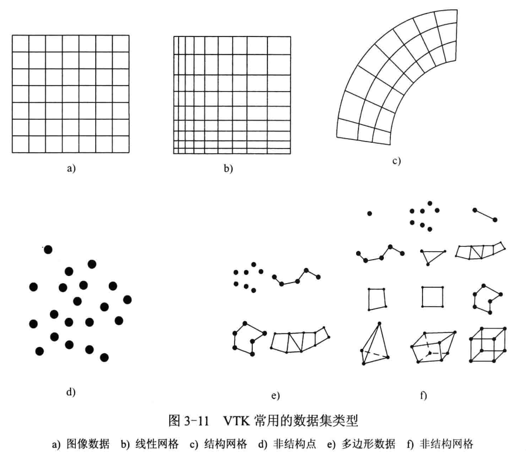
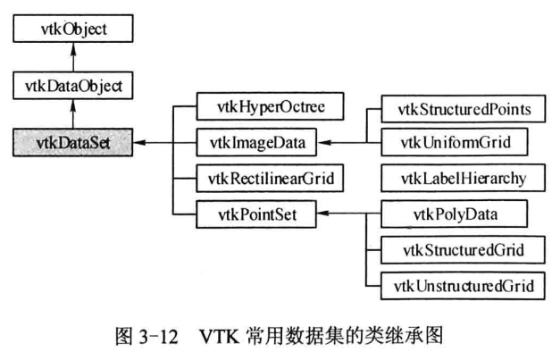

参考：《VTK图形图像开发进阶 (张晓东，罗火灵编著) 》

# 1 数据对象和数据集

## 1.1 `vtkDataObject` 

* vtk 中，数据一般以 **数据对象** (Data Object，类 `vtkDataObject`) 的形式表现，这是 VTK 可视化数据最常用的表达形式。数据对象是数据的集合，数据对象表现的数据是可以被可视化管线处理的数据，只有当数据对象被组织成一种结构后，才能被 VTK 提供的可视化算法所处理。



* 没有直接使用 `vtkDataObject` 来实例化数据对象，而是根据具体的可视化数据选用其具体的子类实现可视化。

## 1.2 `vtkDataSet` 

* **数据集概念**：将数据对象组织成结构并赋予属性值，形成数据集。`vtkDataSet`是VTK中对应此概念的类，派生自 `vtkDataObject`。
* **构成部分**：
  * **组织结构**：包括拓扑结构（Topology）和几何结构（Geometry）。
  * **属性数据**：与组织结构相关联的属性数据。
* **拓扑与几何结构**：
  * **几何结构**：由点数据（Point Data）定义的一系列坐标点构成，描述 **对象的空间位置关系**。
  * **拓扑结构**：由单元数据（Cell Data）定义，描述对象的构成形式，即 **点之间的连接顺序**。
* `vtkPolyData` 派生自类 `vtkPointSet` ，`vtkPointSet` 派生自 `vtkDataSet` 。`vtkPolyData` 是 `vtkDataSet` 的具体实现，表示由顶点、线、多边形和/或三角带组成的几何结构，同时包含点和单元的属性值（如标量、向量等）。


# 2 属性单元

* **属性数据的定义与关联**

  * 属性数据是与数据集的**组织结构**相关联的信息。
  * 组织结构包括**几何结构**（由点数据定义）和**拓扑结构**（由单元数据定义）。
  * 因此，属性数据通常与**点数据**或**单元数据**相关联，也可能与单元的边、面等成分，甚至整个数据集或其中的一组数据相关联。

* **属性数据的作用**

  * 主要用于描述数据集的**属性特征**。
  * 对数据集的可视化，**实质上就是对属性数据的可视化**。例如，在压力场可视化中，通过为每个数据点或单元关联压力值，VTK可以用颜色映射来直观显示压力分布和变化趋势。

* **属性数据的分类与抽象**

  * 按性质可分为**标量数据**（如温度、压力）、**矢量数据**（如速度）和**张量数据**等几大类。
  * 可以抽象为**n维数组**：标量数据可看作1x1数组，矢量数据可看作3x1数组（X, Y, Z分量）。
  * 其中，**标量数据和矢量数据的应用最为广泛**。

* **VTK中的属性数据表达**

  * 在VTK中，通过 **`vtkPointData`** 类和 **`vtkCellData`** 类来表达数据集的属性。这两个类都是 **`vtkDataSetAttributes`**（继承自 `vtkFieldData`）的子类。

  * **点（或单元）与属性数据之间存在一一对应的关系**。一个有N个点（或单元）的数据集，必须有N个对应的属性数据。可以通过点的**索引号**来访问其属性数据。

  * 例如：在 数据集 aDataSet 中访问索引号为 129 的点的标量值时，使用下面方法：

    ```cpp
    aDataSet->GetPointData()->GetScalars()->GetScalar(129);
    ```

  

  几种属性数据：

  


# 3 不同类型的数据集





`vtkPolyData`：

* **多边形数据集**。
* 由多种基本单元构成，包括：
  * 顶点 (Vertex) 和 多顶点 (Polyvertex)
  * 线 (Line) 和 折线 (Polyline)
  * 三角形条带 (Triangle Strip)

2. 核心特点

   - **结构不规则**：与规则网格不同，其结构更为灵活。

   - **拓扑维度多样**：所包含的单元具有不同的拓扑维度（0维、1维、2维）。

   - **桥梁作用**：是连接**原始数据、处理算法和计算机图形渲染**的关键桥梁。

4. 设计与效率考量

   - **基本要素**：顶点、线、多边形构成了表达0、1、2维几何体的**最小基本集合**。

   - **高效单元**：通过引入**多顶点、折线、三角形条带**等复合单元，旨在**提升数据存储和处理效率**。

   - **三角形条带的优势**：
     - **存储高效**：表达N个三角形仅需 **N+2个点**，而传统独立三角形表达需要 **3N个点**，极大节省了存储空间。
     - **渲染快速**：大多数图形库对三角形条带的渲染优化程度高，**渲染速度比渲染独立三角形快很多**。

# 4 数据的存储与表达

## 4.1 `vtkDataArray` 

* **核心特点**：
  - 采用连续内存，可快速创建、删除、遍历，是 VTK 内存分配的基础，数据访问基于零开始的索引。
  - 以`vtkFloatArray`为例：用指针`Array`存数据，`Size`指定数组长度（超出时自动`Resize`为原长度 2 倍），`MaxId`记录最后插入数据的索引（无数据时为 - 1）。
* **元组（Tuple）概念**：
  - 用于存储多分量数据（如 RGB 颜色的红 / 绿 / 蓝），`NumberOfComponents`表示元组的分量数（设定后不变），数据数组由多个元组组成，每个元组含固定分量数。
* **应用与扩展**：
  - 是 VTK 数据对象（如`vtkPolyData`）的基础。以 `vtkPolyData` 为例，该类由几何数据 `vtkPoints` 、拓扑数据 `vtkCellArray` 和 属性数据 （`vtkPointData`、`vtkCellData` 、`vtkFieldData` ）组成，而这些数据都是通过 数据数组 `vtkDataArray` 的形式存储。`vtkDataArray` 可以存储标量数据，也可以存储向量数据。因此使用 `vtkDataArray` 时需要指定元组的大小。
  - 提供工具类：`vtkSplitField`拆分多分量数组，`vtkMergeFields`合并单分量数组。

这个内容围绕VTK中`vtkDataArray`创建数据数组的方法及相关设计展开：

* **数据数组的创建方式**

  1. **固定长度创建**
      通过代码示例演示：

    ```cpp
    vtkSmartPointer<vtkFloatArray> array = vtkSmartPointer<vtkFloatArray>::New();
    array->SetNumberOfComponents(1);  // 设置元组的分量数为1
    array->SetNumberOfTuples(10);     // 设置元组总数为10
    array->SetTuple(6, 9.0, 10, 0.0); // 给第6个元组赋值
    array->SetComponent(5, 0, 5);     // 给第5个元组的第0个分量赋值
    double b = array->GetComponent(5, 0); // 获取第5个元组的第0个分量值
    ```

    核心方法：

    - `SetComponent(i,j,c)`：设置第i个元组的第j个分量值为c
    - `GetComponent(i,j)`：获取第i个元组的第j个分量值

  2. **动态长度创建**
     代码示例：

     ```cpp
     vtkSmartPointer<vtkFloatArray> array = vtkSmartPointer<vtkFloatArray>::New();
     array->SetNumberOfComponents(1);
     array->InsertNextTuple1(5);  // 插入单分量元组，值为5
     array->InsertNextTuple1(10); // 插入单分量元组，值为10
     double b = array->GetComponent(1, 0); // 获取第1个元组的第0个分量值
     ```

     类似方法：`InsertNextTuple2()`/`InsertNextTuple3()`等（对应不同分量数的元组）

     ```cpp
     vtkSmartPointer<vtkFloatArray> array = vtkSmartPointer<vtkFloatArray>::New();
     array->SetNumberOfComponents(1);  // 设置元组的分量数为1
     array->SetNumberOfTuples(10);     // 设置元组总数为10
     array->SetTuple(6, 9.0, 10, 0.0); // 给第6个元组赋值
     array->SetComponent(5, 0, 5);     // 给第5个元组的第0个分量赋值
     double b = array->GetComponent(5, 0); // 获取第5个元组的第0个分量值
     ```

     类似方法：`InsertNextTuple2()`/`InsertNextTuple3()`等（对应不同分量数的元组）

* **数据数组的类型设计**

  `vtkDataArray`是**抽象基类**，通过C++动态绑定（`virtual`方法）统一接口，其子类实现特定数据类型的数组操作，继承关系：

  ```mermaid
  classDiagram
      direction BT
      
      vtkObject <|-- vtkAbstractArray
      vtkAbstractArray <|-- vtkDataArray
      vtkDataArray <|-- vtkUnsignedCharArray
      vtkDataArray <|-- vtkCharArray
      vtkDataArray <|-- vtkUnsignedShortArray
      vtkDataArray <|-- vtkFloatArray
      
      class vtkObject {
          <<abstract>>
      }
      class vtkAbstractArray {
          <<abstract>>
      }
      class vtkDataArray {
          <<abstract>>
      }
  ```

  

## 4.2 对象数据的表达

1. **`vtkDataObject` 的定位**

   - VTK 的数据对象基于`vtkDataArray`的 “数组的数组” 实现，`vtkDataObject`是通用可视化数据的表达，但可视化算法不直接处理它（需数据有特定结构）。

   - 内部封装了管线执行相关的变量 / 方法，且包含`vtkFieldData`（场数据）实例来负责数据表达。

2. **`vtkFieldData` 的作用**

   - 是 “数据数组的数组”：每个元素是独立数组，类型、长度、元组大小、名称等都可不同。

   - 是属性数据的存储载体，其继承类对应不同场景：以`vtkPolyData`为例，内部包含三类数据：
     - `vtkPointData`：与点关联（如点的温度）；
       - `vtkCellData`：与单元关联（如三角形单元的面积）；
       - `vtkFieldData`：存储点 / 单元之外的数据（如模型质心）。
