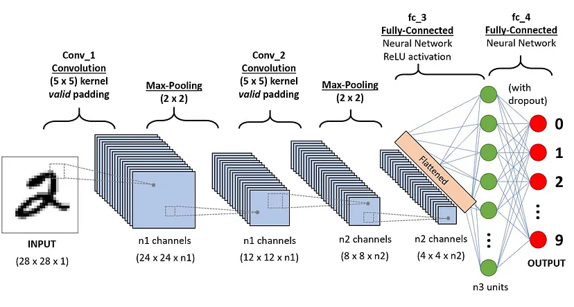
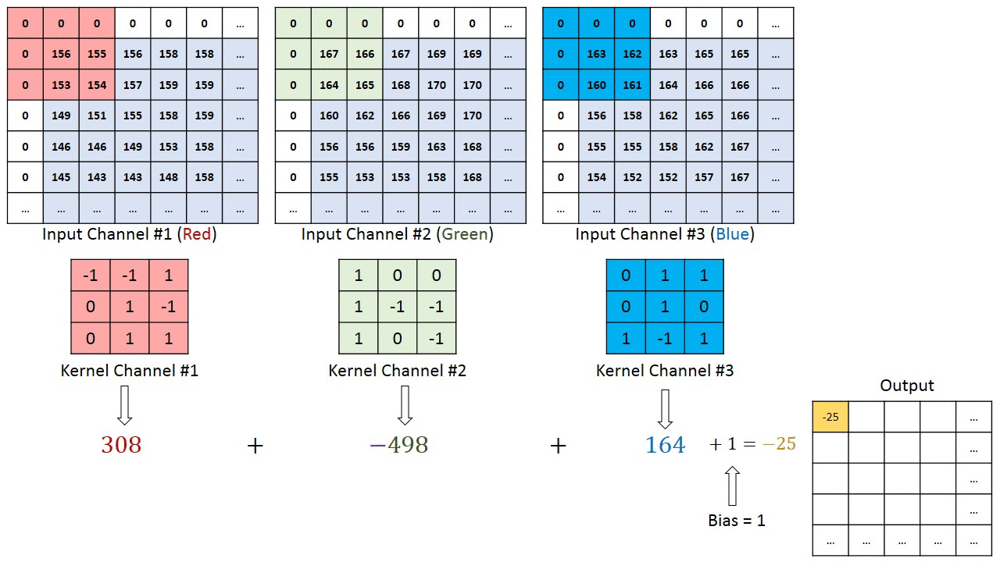
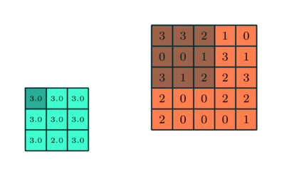
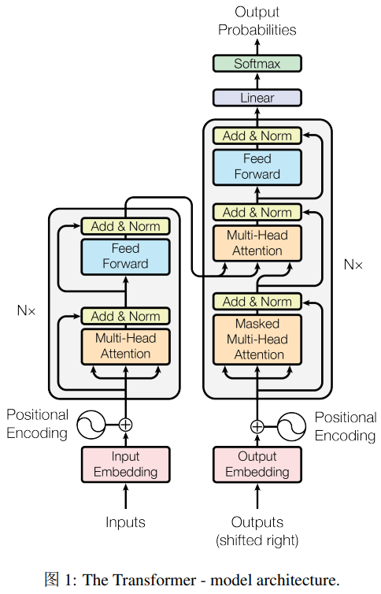
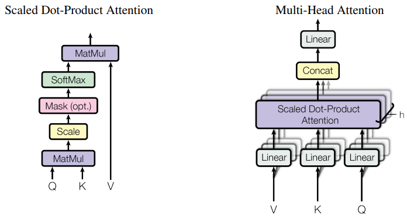
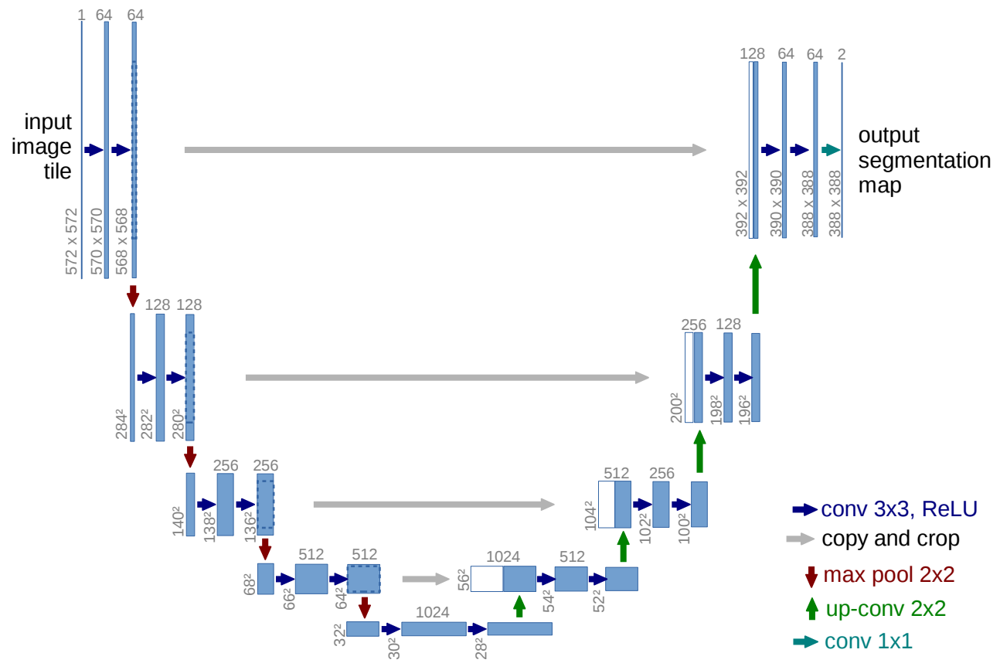
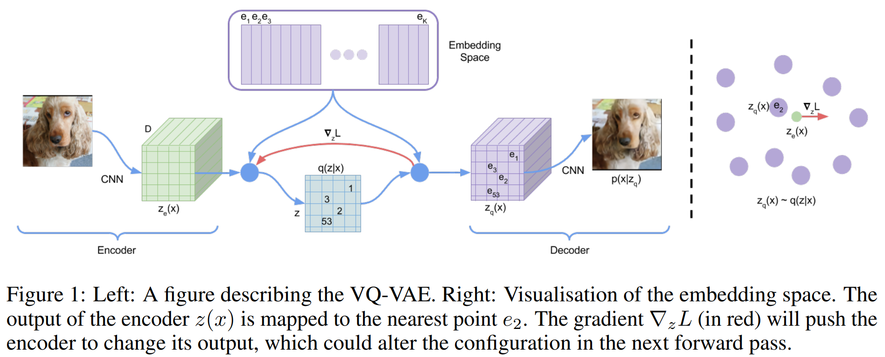
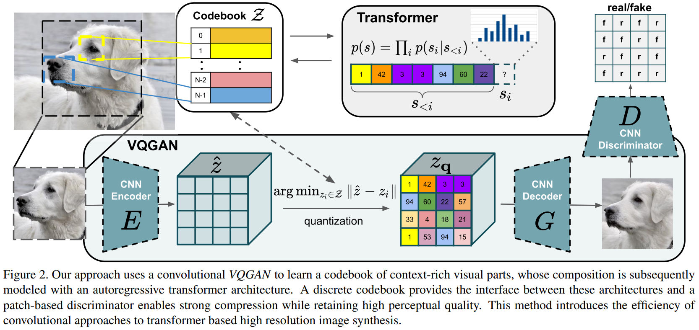

# 1 卷积神经网络

* Convolutional Neural Network (CNN)

* 卷积神经网络由三个主要部分组成：

  1. 卷积层 (convolutional layers)
  3. 池化层 (pooling layers)
  4. 全连接层 (fully connected layers)
  
* 应用于数字识别的CNN架构[[source](https://towardsdatascience.com/a-comprehensive-guide-to-convolutional-neural-networks-the-eli5-way-3bd2b1164a53)]

  

## 1.1 卷积层

* 输入：大小 $W\times H\times C$（W 宽，H 高，C 通道数对于初始的图像，通道数为颜色维度，RGB的 channel size = 3）

* 主要的数学运算：卷积（对图像的像素矩阵应用的滑动窗口函数）

* 卷积操作的目的：从输入图像中提取高级特征。

  通过应用多个不同的 filter (大小相同) 来提取不同的图像特征。每个 filter 以 一定步长stride 遍历整张图片。
  
  > 以手写数字识别为例，filter 可以用于识别数字的曲线，边缘，数字的整体形状等
  
* 对输入预处理：padding 填充

  * **Valid padding：** 不进行任何填充，卷积操作后特征图的尺寸会减小。
  * **Same padding：** 进行填充，使得卷积操作后特征图的尺寸与输入图像的尺寸相同。
  
* 使用 $3\times 3\times 3$ kernel(filter) 对 $M\times N \times 3$ 的图像矩阵进行卷积运算 (步长 stride = 1)：

  

* 卷积层能够通过优化其输入显著减少模型的复杂度。这些优化通过三个超参数实现，即 depth (kernel 的数量)，stride，zero-padding。
* 卷积运算之后使用 ReLU activation function，这个函数帮助网络学习图像特征之间的非线性关系，从而使网络在识别不同模式时更具鲁棒性。同时，它还有助于缓解梯度消失问题。


## 1.2 池化层

* 目的：

  * 降低卷积特征 (Convolved Feature) 的空间大小，通过维度下降来降低图像处理的算力需求。

  * 从卷积矩阵中提取图像中最显著的特征。

* 通过聚合运算实现，常见的聚合函数：

  * max pooling：提取每个 kernel 覆盖范围内的最大值
  * sum pooling：提取每个 kernel 覆盖范围内数值的和
  * average pooling：提取每个 kernel 覆盖范围内的平均值

  max pooling 可以起到噪声抑制的作用，性能比 average pooling 要好。

* max pooling 示例：

   

## 1.3 全连接层

经过一系列 conv-pooling 层之后，将最后得到的输出展平 (flatten) 为列向量，作为全连接层的输入，并在每次训练迭代中应用反向传播。经过多轮迭代，模型能够区分图像中的主导特征和某些低级特征，并使用Softmax分类技术对它们进行分类。


# 2 Transformer

论文地址：[Attention Is All You Need](https://arxiv.org/pdf/1706.03762)

## 2.1 Encoder 和 Decoder

编码器：由 N=6 个相同的层堆叠而成，每个层有两个子层：

* 第一层是 multi-head self-attention 机制
* 第二层是 简单的、位置相关的 全连接前馈网络

每个子层都是用了 残差连接(residual connection)，和 层归一化(layer normalization)。每个子层的输出是 $\text{LayerNorm}(x+\text{Sublayer}(x))$。

解码器：由 N=6 个相同的层堆叠而成。除了编码器的两个子层之外，加入了第三子层，用于对编码器输出执行 multihead attention机制。在每个子层之后采用 residual connection 和 layer normalization。除此之外，还修改了解码器的 self-attention layer，prevent positions from attending to subsequent positions。确保位置 $i$ 的预测只能依赖于位置 $i$ 之前的已知输出。



## 2.2 Attention

一个 attention function 可以描述为：一个 query 和 一组 key-value 到一个输出的映射。

### 2.2.1 Scaled Dot-Product Attention

* a set of queries are packed together into a matrix $Q$ 
* the keys and values are also packed together into matriced $K$ and $V$ 

输出：
$$
\text{Attention}(Q, K, V) = \text{softmax}(\cfrac{QK^T}{\sqrt{d_k}})V
$$

* 使用 dot-product attention，加入了缩放因子 $\cfrac{1}{\sqrt{d_k}}$ ，避免梯度爆炸。

### 2.2.2 Multi-Head Attention

multi-head attention 允许模型关于来自不同子空间的信息：
$$
\text{MultiHead}(Q, K, V) = \text{Concat}(\text{head}_1, ..., \text{head}_h)W^O\\
\text{where }\text{head}_i = \text{Attention}(QW_i^Q, KW_i^K, VW_i^V)
$$


### 2.2.3 transformer 使用 multi-attention 的地方

* 在 "encoder-decoder attention" layers，queries 来自前一个 decoder 层，而 memory keys 和 values 来自 encoder 的输出。这种结构允许 decoder 的每个位置关注到 输入序列的所有位置。
* encoder 包含 self-attention layers。在 self-attention layer 中，所有的 keys, values 和 queried 都来自于同一处，这种情况下，encoder 的所有位置都可以关于到前一层encoder 的所有位置。
* decoder 中 self-attention 层允许 decoder的每个位置关注到包括该位置在内的所有位置。为了防止解码器信息向左流动，以保持自回归属性，在scaled dot-product attention内部，通过将 softmax 输入中对应于非法连接的所有值 mask out (设置为 $-\infty$ ) 。

```python
class MultiHeadAttention(nn.Module):
    def __init__(self, d_model, num_heads):
        super(MultiHeadAttention, self).__init__()
        assert d_model % num_heads == 0, "d_model must be divisible by num_heads"
        
        self.num_heads = num_heads
        self.d_model = d_model
        self.d_k = d_model // num_heads
        
        self.W_qs = nn.Linear(d_model, d_model)
        self.W_ks = nn.Linear(d_model, d_model)
        self.W_vs = nn.Linear(d_model, d_model)
        self.W_out = nn.Linear(d_model, d_model)
        
    def scaled_dot_product_attention(self, q, k, v, mask=None):
        """
        计算缩放点积注意力
        
        输入形状：
        
        - q: (batch_size, num_heads, seq_len, d_k)
        - k, v 同 q
        
        输出形状：(batch_size, num_heads, seq_len, d_k)
        """
        
        attn_scores = torch.matmul(q, k.transpose(-2, -1)) / math.sqrt(self.d_k)
        
        if mask is not None:
            attn_scores = attn_scores.masked_fill(mask == 0, -1e9)
        
        # 计算注意力权重 (softmax 归一化)
        attn_probs = F.softmax(attn_scores, dim=-1)
        
        # 对值向量加权求和
        output  = torch.matmul(attn_probs, v)
        return output
    
    def split_heads(self, x):
        """
        将输入张量分割为多个头
        输入形状: (batch_size, num_heads, d_model)
        输出张量: (batch_size, num_heads, seq_len, d_k)
        """
        batch_size, seq_length, d_model = x.size()
        return x.view(batch_size, seq_length, self.num_heads, self.d_k).transpose(1, 2)
    
    def combine_heads(self, x):
        """
        将多个头的输出合并回原始形状
        输入形状: (batch_size, num_heads, seq_length, d_k)
        输出形状: (batch_size, seq_length, d_model)
        """
        batch_size, _, seq_length, d_k = x.size()
        return x.transpose(1, 2).contiguous().view(batch_size, seq_length, self.d_model)
    
    def forward(self, q, k, v, mask=None):
        """
        前向传播
        输入形状：q/k/v: (batch_size, num_heads, d_model)
        输出形状：(batch_size, num_heads, d_model)
        """
        # 线性变换并分割多头
        q = self.split_heads(self.W_qs(q))
        k = self.split_heads(self.W_ks(k))
        v = self.split_heads(self.W_vs(v))
        
        attn = self.scaled_dot_product_attention(q, k, v, mask)
        
        output = self.W_out(self.combine_heads(attn))
        
        return output
```


## 2.3 Position-wise Feed-Forward Networks

编码器和解码器的每一层都包含一个全连接前馈网络，这包括两个线性变换，它们之间有一个 ReLU 激活函数。
$$
\text{FFN}(x) = \max(0, xW_1 + b_1)W_2 + b_2
$$
虽然线性变换在不同位置上是一样的，但是它们从一层到另一层使用不同的参数。

```python
class PositionWiseFeedForward(nn.Module):
    def __init__(self, d_model, d_ff):
        super(PositionWiseFeedForward, self).__init__()
        self.fc1 = nn.Linear(d_model, d_ff)
        self.fc2 = nn.Linear(d_ff, d_model)
        self.relu = nn.ReLU()
        
    def forward(self, x):
        return self.fc2(self.relu(self.fc1(x)))
```


## 2.4 Positional Encoding

由于模型中不包含递归和卷积操作，为了让模型能够利用序列的顺序信息，必须向序列中标记的位置注入一些关于它们相对或绝对位置的信息。为此，在编码器和解码器堆栈的底部将“位置编码”添加到输入序列中。

在 transformer 中，使用不同频率的正弦和余弦函数进行位置编码：
$$
PE_{(pos, 2i)} = \sin(pos/10000^{2i/d_{\text{model}}})\\
PE_{(pos, 2i+1)} = \cos(pos/10000^{2i/d_{\text{model}}})
$$
其中，$pos$ 是位置，$i$ 是维度。

```python
class PositionalEncoding(nn.Module):
    def __init__(self, d_model, max_seq_len):
        super(PositionalEncoding, self).__init__()
        pe = torch.zeros(max_seq_len, d_model)  # 初始化位置编码矩阵
        position = torch.arange(0, max_seq_len, dtype=torch.float).unsqueeze(1)
        # position 二维张量 (max_seq_len, 1) unsqueeze(1) 表示在第1位置增加一个维度
        div_term = torch.exp(torch.arange(0, d_model, 2).float() * -(math.log(10000.0) / d_model))
        pe[:, 0::2] = torch.sin(position * div_term)  # 偶数位置使用 正弦函数
        pe[:, 1::2] = torch.cos(position * div_term)  # 奇数位置使用 余弦函数
        self.register_buffer('pe', pe.unsqueeze(0))  # 注册为缓冲区
        
    def forward(self, x):
        # 将位置编码添加到输入中
        return x + self.pe[:, :x.size(1)]
```


## 2.5 Code

* 构建编码器块

  ```python
  class EncoderLayer(nn.Module):
      def __init__(self, d_model, num_heads, d_ff, dropout):
          super(EncoderLayer, self).__init__()
          self.self_attn = MultiHeadAttention(d_model, num_heads)  # 自注意力层
          self.feed_forward = PositionWiseFeedForward(d_model, d_ff)  # 前馈网络
          self.norm1 = nn.LayerNorm(d_model)
          self.norm2 = nn.LayerNorm(d_model)
          self.dropout = nn.Dropout(dropout)
          
      def forward(self, x, mask):
          # 自注意力机制
          attn_output = self.self_attn(x, x, x, mask)
          x = self.norm1(x + self.dropout(attn_output))  # 残差连接 + 层归一化
          
          # 前馈网络
          ff_output = self.feed_forward(x)
          x = self.norm2(x + self.dropout(ff_output))
          return x
  ```

* 构建解码器块

  ```python
  class DecoderLayer(nn.Module):
      def __init__(self, d_model, num_heads, d_ff, dropout):
          super(DecoderLayer, self).__init__()
          self.self_attn = MultiHeadAttention(d_model, num_heads)
          self.cross_attn = MultiHeadAttention(d_model, num_heads)
          self.feed_forward = PositionWiseFeedForward(d_model, d_ff)
          self.norm1 = nn.LayerNorm(d_model)
          self.norm2 = nn.LayerNorm(d_model)
          self.norm3 = nn.LayerNorm(d_model)
          self.dropout = nn.Dropout(dropout)
          
      def forward(self, x, enc_output, src_mask, tgt_mask):
          # 自注意力机制
          attn_output = self.self_attn(x, x, x, tgt_mask)
          x = self.norm1(x + self.dropout(attn_output))  # 残差连接 + 层归一化
          
          # 交叉注意力机制 decoder 的输出 x -> query
          attn_output = self.cross_attn(x, enc_output, enc_output, src_mask)
          x = self.norm2(x + self.dropout(attn_output))
          
          # 前馈网络
          ff_output = self.feed_forward(x)
          x = self.norm3(x + self.dropout(ff_output))
          return x
  ```

* 构建 Transformer

  ```python
  class Transformer(nn.Module):
      def __init__(self, src_vocab_size, tgt_vocab_size, d_model, num_heads, num_layers, d_ff, max_seq_length, dropout):
          super(Transformer, self).__init__()
          self.encoder_embedding = nn.Embedding(src_vocab_size, d_model)  # 编码器词嵌入
          self.decoder_embedding = nn.Embedding(tgt_vocab_size, d_model)  # 解码器词嵌入
          self.positional_encoding = PositionalEncoding(d_model, max_seq_length)  # 位置编码
  
          # 编码器和解码器层
          self.encoder_layers = nn.ModuleList([EncoderLayer(d_model, num_heads, d_ff, dropout) for _ in range(num_layers)])
          self.decoder_layers = nn.ModuleList([DecoderLayer(d_model, num_heads, d_ff, dropout) for _ in range(num_layers)])
  
          self.fc = nn.Linear(d_model, tgt_vocab_size)  # 最终的全连接层
          self.dropout = nn.Dropout(dropout)  # Dropout
  
      def generate_mask(self, src, tgt):
          # 源掩码：屏蔽填充符（假设填充符索引为0）
          # 形状：(batch_size, 1, 1, seq_length)
          src_mask = (src != 0).unsqueeze(1).unsqueeze(2)
      
          # 目标掩码：屏蔽填充符和未来信息
          # 形状：(batch_size, 1, seq_length, 1)
          tgt_mask = (tgt != 0).unsqueeze(1).unsqueeze(3)
          seq_length = tgt.size(1)
          # 生成上三角矩阵掩码，防止解码时看到未来信息
          nopeak_mask = (1 - torch.triu(torch.ones(1, seq_length, seq_length), diagonal=1)).bool()
          tgt_mask = tgt_mask & nopeak_mask  # 合并填充掩码和未来信息掩码
          return src_mask, tgt_mask
  
      def forward(self, src, tgt):
          # 生成掩码
          src_mask, tgt_mask = self.generate_mask(src, tgt)
          
          # 编码器部分
          src_embedded = self.dropout(self.positional_encoding(self.encoder_embedding(src)))
          enc_output = src_embedded
          for enc_layer in self.encoder_layers:
              enc_output = enc_layer(enc_output, src_mask)
          
          # 解码器部分
          tgt_embedded = self.dropout(self.positional_encoding(self.decoder_embedding(tgt)))
          dec_output = tgt_embedded
          for dec_layer in self.decoder_layers:
              dec_output = dec_layer(dec_output, enc_output, src_mask, tgt_mask)
          
          # 最终输出
          output = self.fc(dec_output)
          return output
  ```

* 训练模型：

  ```python
  # 超参数
  src_vocab_size = 5000 # 源词汇表大小
  tgt_vocab_size = 5000 # 目标词汇表大小
  d_model = 512  # 模型维度
  num_heads = 8  # 注意力头数量
  num_layers = 6  # 编码器和解码器层数
  d_ff = 2048  # 前馈网络内层维度
  max_seq_length = 100  # 最大序列长度
  dropout = 0.1  # Dropout 概率
  
  # 初始化模型
  transformer = Transformer(src_vocab_size, tgt_vocab_size, d_model, num_heads, num_layers, d_ff, max_seq_length, dropout)
  
  # 生成随机数据
  src_data = torch.randint(1, src_vocab_size, (64, max_seq_length))  # 源序列
  tgt_data = torch.randint(1, tgt_vocab_size, (64, max_seq_length))  # 目标序列
  
  # 定义损失函数和优化器
  criterion = nn.CrossEntropyLoss(ignore_index=0)  # 忽略填充部分损失
  optimizer = optim.Adam(transformer.parameters(), lr=0.001, betas=(0.9, 0.98), eps=1e-9)
  
  # 训练循环
  transformer.train()
  for epoch in range(20):
      optimizer.zero_grad()  # 清空梯度，防止积累
      
      # 输入目标序列时去掉最后一个词 (用于预测下一个词)
      output = transformer(src_data, tgt_data[:, :-1])
      # 计算损失时，目标序列从第二个词开始（即预测下一个词）
      # output 形状: (batch_size, seq_length-1, tgt_vocab_size)
      # 目标形状: (batch_size, seq_length-1)
      loss = criterion(
          output.contiguous().view(-1, tgt_vocab_size),
          tgt_data[:, 1:].contiguous().view(-1)
      )
      
      loss.backward()
      optimizer.step()
      print(f"Epoch: {epoch+1}, Loss: {loss.item()}")
      
      
  transformer.eval()
  # 生成验证数据
  val_src_data = torch.randint(1, src_vocab_size, (64, max_seq_length))
  val_tgt_data = torch.randint(1, tgt_vocab_size, (64, max_seq_length))
  
  with torch.no_grad():
      val_output = transformer(val_src_data, val_tgt_data[:, :-1])
      val_loss = criterion(val_output.contiguous().view(-1, tgt_vocab_size), val_tgt_data[:, 1:].contiguous().view(-1))
      print(f"Validation Loss: {val_loss.item()}")
  ```

  

# 3 GAN

论文地址：[Generative Adversarial Networks](https://arxiv.org/abs/1406.2661)

* 一种通过对抗过程估计生成模型的新框架
* 同时训练两个模型：
  * 一个生成模型G捕捉数据分布：训练过程是最大化分类模型D犯错的概率
  * 一个分类模型D估计一个样本是从训练数据还是从 G 中生成的概率：学习确定样本是来自模型生成还是原始数据。


## 3.1 Adversarial nets

* 为了学习 生成器对数据 $x$ 的分布 $p_g$ ，首先在输入噪声变量 $z$ 上定义一个先验分布 $p_z(z)$ ，然后将其映射到数据空间表示为 $G(z; \theta_g)$ ，其中 $G$ 是一个由多层感知机表示的可微函数，其参数为 $\theta_g$ 。
* 第二个多层感知机 $D(x; \theta_d)$ ，它输出一个标量值。$D(x)$ 表示 $x$ 来自真实数据而非 $p_g$ 的概率。
* 训练判别器 $D$ ，最大化它正确给 训练样本 和 来自生成器$G$ 的样本分配标签的概率。
* 训练生成器 $G$ ，最小化 $\log(1-D(G(z)))$ 

价值函数 $V(G,D)$ ：
$$
\min_G \max_D V(D,G) = \mathbb{E}_{x\sim p_{\text{data}}(x)}[\log D(x)] + \mathbb{E}_{z\sim p_z(z)}[\log (1-D(G(z)))]
$$

* 在训练早期，可以训练 $G$ 最大化 $\log D(G(z))$ ，提供早期学习时更强的强度。


## 3.2 Theoretical Results

* 生成器 $G$ 隐式地定义了一个概率分布 $p_g$ ，该分布是当 $z\sim p_z$ 时，通过生成样本 $G(z)$ 得到的分布。

Algorithm 1 生成对抗网络的小批量随机梯度下降训练。应用于 判别器的步骤数 $k$ 是一个超参数。
$$
\begin{aligned}
& \textbf{for}\text{ number of training iterations}\textbf{ do}\\
& \ \ \ \ \textbf{for }k \text{ steps }\textbf{do}\\
& \ \ \ \ \ \ \ \ ●\ \text{从噪声先验分布 }p_g(z) \text{ 中采样一个小批次的}m\text{个噪声样本} \{z^{(1)}, ..., z^{(m)}\}\\
& \ \ \ \ \ \ \ \ ●\ \text{从噪声先验分布 }p_{\text{data}}(z) \text{ 中采样一个小批次的}m\text{个样本} \{x^{(1)}, ..., x^{(m)}\}\\
& \ \ \ \ \ \ \ \ ●\ \text{对判别器进行随机梯度上升更新：}\\
& \ \ \ \ \ \ \ \ \ \ \ \ \ \  \nabla_{\theta_d} \cfrac1m\sum_{i=1}^m[\log D(x^{(i)}) + \log(1-D(G(z^{(i)})))]\\
& \ \ \ \ \textbf{end for}\\
& \ \ \ \ ● \text{从噪声先验分布 } p_g(z)\text{ 中采样一个小批次的}m\text{个噪声样本}\{z^{(1)}, ..., z^{(m)}\}\\
& \ \ \ \ ● \text{对生成器进行随机梯度上升更新：}\\
& \ \ \ \ \ \ \ \ \ \ \nabla_{\theta_d} \cfrac1m\sum_{i=1}^m  \log(1-D(G(z^{(i)})))\\
& \textbf{end for}\\
& \text{基于梯度的更新可以使用任何标准的基于梯度的学习规则。在我们的实验中，我们使用了动量。}
\end{aligned}\\
$$


命题1：对于固定的生成器 $G$，最优判别器 $D$ 是：
$$
D^*(x) = \cfrac{p_{\text{data}}(x)}{p_{\text{data}}(x) + p_g(x)}
$$
判别式 $D$ 的训练目标可以解释为最大化估计条件概率 $P(Y=y|x)$ 的对数似然，其中 $Y$ 表示 $x$ 来自 $p_{\text{data}}(\text{with }y=1)$ 还是来自 $p_g(\text{with } y=0)$ 。

价值函数可以重新表述为：
$$
\begin{aligned}
C(G) & = \max_D V(G,D)\\
& = \mathbb{E}_{x\sim p_{\text{data}}}[\log D^*_G(x)] + \mathbb{E}_{z\sim p_z}[\log (1-D^*_G(G(z)))]\\
& = \mathbb{E}_{x\sim p_{\text{data}}}[\log D^*_G(x)] + \mathbb{E}_{x\sim p_g}[\log (1-D^*_G(x))]\\
&  = \mathbb{E}_{x\sim p_{\text{data}}}[\log \cfrac{p_{\text{data}}(x)}{p_{\text{data}}(x) + p_g(x)}] + \mathbb{E}_{x\sim p_g}[\log \cfrac{p_g(x)}{p_{\text{data}}(x) + p_g(x)}]
\end{aligned}
$$
定理1：虚拟训练标准 $C(G)$ 的全局最小值仅在 $p_g = p_{\text{data}}$ 时实现。此时，$C(G)$ 达到值 $-\log 4$ 。


命题2：如果生成器 $G$ 和 判别器 $D$ 具有足够的能力，并且在算法1的每一步中，允许判别器在给定 $G$ 的情况下最优，并且更新 $p_g$ 以改进标准：
$$
\mathbb{E}_{x\sim p_{\text{data}}}[\log D^*_G(x)] + \mathbb{E}_{x\sim p_g}[\log (1-D^*_G(x))]
$$
那么 $p_g$ 将收敛于 $p_{\text{data}}$ 。

实际上，对抗网络通过函数 $G(z; \theta_g)$ 表示有限的 $p_g$ 分布，我们优化的是 $\theta_g$，而不是 $p_g$ 本身。


# 4 U-Net

原文：[U-Net: Convolutional Networks for Biomedical Image Segmentation](https://arxiv.org/abs/1505.04597) 

笔记参考：https://zhuanlan.zhihu.com/p/150579454



## 4.1 Encoder

Encoder 由卷积操作和下采样操作组成，原文所用的卷积结构同一为 3*3 的卷积核，padding 为 0，striding 为 1。没有 padding，所以每次卷积之后 feature map 的 H 和 W 变小了。在 skip connect 时要注意 feature map 的维度。

```python
nn.Sequential(nn.Conv2d(in_channels, out_channels, 3),
              nn.BatchNorm2d(out_channels),
              nn.ReLU(inplace=True))
```

两次卷积操作之后，是 stride = 2 的 max pooling，输出大小变为 `1/2*(H,W)` 。

```python
nn.MaxPool2d(kernel_size=2, stride=2)
```

`conv 3*3 → conv 3*3 → max pool 2*2` 重复五次，最后一次没有 max pooling。直接将得到的 feature map 送入 decoder。


## 4.2 Decoder

Encoder 得到的 feature map 经过 decoder 恢复原始分辨率。除了卷积，关键的步骤就是 upsampling 和 skip connection。

* upsampling 上采样，文中使用的方法是 插值方式。在使用插值实现方式中，双线性插值的总和表现较好也较为常见。

  * 双线性插值：

    已知函数 f 在 Q11 = (x1, y1)、Q12 = (x1, y2), Q21 = (x2, y1) 以及 Q22 = (x2, y2) 四个点的值，想要得到 f 在点 P = (x, y) 的值，则双线性插值公式如下：

    ```
    f(x, y) ≈ f(Q11)(1-u)(1-v) + f(Q12)(1-u)v + f(Q21)u(1-v) + f(Q22)uv
    ```

    其中：

    * u = (x - x1) / (x2 - x1)
    * v = (y - y1) / (y2 - y1)

  * 代码表示：

    ```python
    self.up = nn.Sequential(nn.Upsample(scale_factor=2, mode='bilinear', align_corners=True),
                                        nn.Conv2d(in_ch, in_ch//2, kernel_size=1, padding=0),
                                        nn.ReLU(inplace=True))
    ```

    

* skip connection：U-Net在这一步融合了底层信息的位置信息与深层特征的语义信息。实现方式是 **拼接**。

  ```python
  torch.cat([low_layer_features, deep_layer_features], dim=1)
  ```


# 5 VAE

* Variational Autoencoders 变分自动编码器，核心在于将输入映射到一个概率分布上。这个方法使得 VAE 能够对数据进行重构，还能生成新的、与输入相似的数据。

**解读** 

首先有一批样本 $\{x_1, ..., x_n\}$，其整体用 $X$ 来描述，想要根据 $\{x_1, ..., x_n\}$ 得到 $P(x)$，很难直接得到。根据公式 $p(x) = \sum_z p(x|z)p(z)$ （积分公式 $p(x) = \int p(x|z)p(z) \text{d}z$），此时，$p(x|z)$ 描述一个 由 $z$ 生成 $x$ 的模型，假设 $z$ 服从正态分布，那么可以从正态分布中采样 $z$ ，计算出 $x$ 。

在整个 VAE 模型中，我们并没有使用 $p(z)$ （先验分布）是正态分布的假设，我们用的是 $p(z|x)$ （后验分布）是正态分布。具体来说，给定一个真实样本 $X_k$ ，我们假设存在要给专属于 $X_k$ 的分布 $p(Z|X_k)$ ，并进一步假设这个分布是正态分布。
$$
\log q_\phi (\mathbf{z}|\mathbf{x}^{(i)}) = \log \mathcal{N}(\mathbf{z};\mu^{(i)}, \sigma^{2(i)}\mathbf{I})
$$
这样，每个 $x_k$ 都有一个正态分布，方便后面生成器还原。这样由多少个 $x$ 就有多少个正态分布。

而，正态分布有两组参数：均值 $\mu$ 和 方差 $\sigma^2$ ，这两个参数使用 神经网络 拟合这两个参数，在实际网络的输出为 $\mu$ 和 $\log \sigma^2$ 。

得到 $x_k$ 的均值和方差，也就直到它的正态分布。然后从这个正态分布中采样一个 $z_k$ 出来，经过一个生成器，得到 $\hat{x}_k = G(z_k)$ ，然和和 $x_k$ 进行比对。

在 VAE 模型中，让所有的 $p(z|x)$ 都向标准正态分布看齐，保证图像具有生成能力：
$$
p(z) = \sum_x p(z|x)p(x) = \sum_x \mathcal{N}(0,I)p(x) = \mathcal{N}(0,I)\sum_xp(x) = \mathcal{N}(0,I)
$$
这样就能达到 $p(z)$ 是标准正态分布，然后可以从 $\mathcal{N}(0,I)$ 中采样来生成图像。

让所有的 $p(z|x)$ 向 $\mathcal{N}(0,I)$ 看齐的最直接方法是在重构误差的基础上加入额外的误差：
$$
\mathcal{L}_\mu = \| f_1(X_k)\|，\mathcal{L}_{\sigma^2} = \| f_2(X_k)\|
$$
VAE 原文直接使用 一般正态分布与 标准正态分布的 KL 散度 $D_{KL}(\mathcal{N}(\mu,\sigma^2),\mathcal{N}(0,I))$ 作为额外的误差：
$$
D_{KL}(\mathcal{N}(\mu,\sigma^2),\mathcal{N}(0,I)) = \cfrac12\sum_{i=1}^d(\mu^2_{(i)}+\sigma^2_{(i)} - \log \sigma^2_{(i)}-1)
$$
d 是 隐变量 $z$ 的维度。

**Loss Function: ELBO**

后验估计 $q_\phi(z|x)$ 应该和真实的 $p_\theta(z|x)$ 很接近，可以用 KL 散度$D_{KL}(q_\phi(z|x) | p_\theta(z|x))$来度量这两个分布的距离。 

> * 前向KL散度 $D_{KL}(P||Q) = \mathbb{E}_{z \sim P(z)} \log \frac{P(z)}{Q(z)}$ 会高估 $P(z)$ 的信息；
> * 后向KL散度 $D_{KL}(Q||P) = \mathbb{E}_{z \sim Q(z)} \log \frac{Q(z)}{P(z)}$ 会低估 $P(z)$ 的信息。

展开等式：
$$
\begin{aligned}
D_{KL}(q_\phi(z|x) | p_\theta(z|x)) & = \int q_\phi(z|x) \log \cfrac{q_\phi(z|x)}{p_\theta(z|x)} \text{d}z\\
& =  \int q_\phi(z|x) \log \cfrac{q_\phi(z|x)p_\theta(x)}{p_\theta(z,x)} \text{d}z\\
& = \int q_\phi(z|x) (\log p_\theta(x) + \log \cfrac{q_\phi(z|x)}{p_\theta(z,x)}) \text{d}z \\
& = \log p_\theta(x) + \int q_\phi(z|x) \log \cfrac{q_\phi(z|x)}{p_\theta(z,x)}\text{d}z\\
& = \log p_\theta(x) + \int q_\phi(z|x) \log \cfrac{q_\phi(z|x)}{p_\theta(x|z)p_\theta(z)}\text{d}z \\
& =  \log p_\theta(x) + \mathbb{E}_{z\sim q_{\phi}(z|x)}[\log \cfrac{q_\phi(z|x)}{p_\theta(z)}\text- \log p_\theta(x|z)]  \\
& = \log p_\theta(x) + D_{\text{KL}}(q_\phi (z|x)|p_\theta(z)) - \mathbb{E}_{z\sim q_{\phi}(z|x)}\log p_\theta(x|z)
\end{aligned}
$$

> 概率分布 $q_\phi(z|x)$ 下的积分可以写成期望：$\int q_\phi(z|x)f(z)\text{d}z = \mathbb{E}_{z\sim q_\phi(z|x)}[f(x)]$

所以有：
$$
D_{KL}(q_\phi(z|x) | p_\theta(z|x)) = \log p_\theta(x) + D_{\text{KL}}(q_\phi (z|x)|p_\theta(z)) - \mathbb{E}_{z\sim q_{\phi}(z|x)}\log p_\theta(x|z)
$$
重新排列一下：
$$
\log p_\theta(x) - D_{KL}(q_\phi(z|x) | p_\theta(z|x)) = \mathbb{E}_{z\sim q_{\phi}(z|x)}\log p_\theta(x|z) - D_{\text{KL}}(q_\phi (z|x)|p_\theta(z))
$$
等式的左边是我们学习真实分布的时候想要最大化的项，我们要最大化真实数据的对数似然，即最大化 $\log p_\theta (x|z)$ ，同时最大化真实后验 $p_\theta(z|x)$ 和 近似分布 $q_\phi(z|x)$ 之间的 KL 散度。所以上面等式的负值就是损失函数：
$$
\begin{aligned}
L_{\text{VAE}}(\theta, \phi) & = -\log p_\theta (x) + DL_{KL}(q_\phi())D_{KL}(q_\phi(z|x) | p_\theta(z|x)) \\
 & = D_{\text{KL}}(q_\phi (z|x)|p_\theta(z)) - \mathbb{E}_{z\sim q_{\phi}(z|x)}\log p_\theta(x|z) \\
 \theta^*, \phi^* & = \arg \min_{\theta, \phi}L_{\text{VAE}}
 \end{aligned}
$$
在变分贝叶斯方法中，这个损失函数被认为是变分下界，因为 KL 散度的值非负，所以 $L_{\text{VAE}}$ 是 $\log p_\theta(x)$ 的下界，即：
$$
-L_{\text{VAE}}= \mathbb{E}_{z\sim q_{\phi}(z|x)}\log p_\theta(x|z) - D_{\text{KL}}(q_\phi (z|x)|p_\theta(z)) \leqslant \log p_\theta(x)
$$
通过最小化损失，可以最大化真实数据样本的概率的下界。


**重参数技巧**

从 $\mathcal{N}(\mu,\sigma^2)$ 采样 $z^{(i, l)} = g_\phi(\epsilon^{(l)}, \mathbf{x}^{(i)})$ ，相当于从 $\mathcal{N}(0,I)$ 采样 $\epsilon$ 使得 $z = \mu + \sigma \cdot \epsilon$ ，这就使得“采样”操作不用采用梯度下降，改为采样的结果参与，使得整个模型可训练。

损失函数中的期望项和$z\sim q_\phi(z|x)$ 有关，采样是一个随机过程，所以不能反向传播梯度。为了可训练，引入重参数方法，随机变量 $z$ 由  $z^{(i, l)} = g_\phi(\epsilon^{(l)}, \mathbf{x}^{(i)})$ 决定，其中 $\epsilon$ 是一个辅助随机独立变量。一个 $q_\phi(z|x)$ 的常见形式是具有对角协方差结构的多元高斯分布：
$$
\mathbf{z} \sim q_\phi(\mathbf{z}|\mathbf{x}^{(i)}) = \mathcal{N}(\mathbf{z};\mu^{(i)}, \sigma^{2(i)}\mathbf{I}) \\
\mathbf{z} = \mu + \sigma \cdot \epsilon, \text{ where }\epsilon \sim \mathcal{N}(0, \mathbf{I})
$$

---

原文：https://arxiv.org/abs/1312.6114、

## 5.1 Problem scenario

考虑一些数据集 $\mathbf{X} = \{\mathbf{x}^{(1)}\}^N_{i=1}$ ，其中包含 $N$ 个独立同分布的连续或离散的 $\mathbf{x}$ 的样本。假设这些数据是由某些随机过程生成的，该过程涉及一个未观察到的连续随机变量 $\mathbf{z}$ 。该过程由两个步骤组成：（1）一个值 $\mathbf{z}$ 是从某个先验分布 $p_{\theta^*}(\mathbf{z})$ 生成。（2）一个值 $\mathbf{x}^{(1)}$ 从某个条件分布 $p_{\theta^*}(\mathbf{x}|\mathbf{z})$ 生成。我们假设先验 $p_{\theta^*}(\mathbf{z})$ 和 $p_{\theta^*}(\mathbf{x}|\mathbf{z})$ 属于参数化分布族 $p_{\theta}(\mathbf{z})$ 和 $p_{\theta}(\mathbf{x}|\mathbf{z})$ ，并且它们的概率密度函数对于 $\theta$ 和 $z$ 到处可微。

引入一个模型 $q_\phi(\mathbf{z}|\mathbf{x})$ ，使得它称为难以处理的真实后验 $p_{\theta}(\mathbf{z}|\mathbf{x})$ 的一种近似。$\mathbf{z}$ 可以解释为 latent representation。模型 $q_\phi(\mathbf{z}|\mathbf{x})$ 称为概率编码器（probabilistic encoder），因为给定一个数据点 $\mathbf{x}$，它会生成一个分布（例如，高斯分布），该分布表示数据点 $\mathbf{x}$ 可能来源的编码 $\mathbf{z}$ 的取值范围。类似地，我们将 $p_{\theta}(\mathbf{x}|\mathbf{z})$ 称为概率解码器（probabilistic decoder），因为给定一个编码 $\mathbf{z}$，它会生成一个分布，表示对应数据点 $\mathbf{x}$ 的可能取值范围。


## 5.2 The variational bound

* 变分下界：The variational bound

边际似然由个数据点的边际似然的和组成：$\log p_\theta(\mathbf{x}^{(1)}, \dots, \mathbf{x}^{(N)}) = \sum_{i=1}^N \log p_\theta(\mathbf{x}^{(i)})$，每个项可以重写为：
$$
\log p_\theta(\mathbf{x}^{(i)}) = D_{KL}(q_\phi(\mathbf{z}|\mathbf{x}^{(i)}) \| p_\theta(\mathbf{z}|\mathbf{x}^{(i)})) + \mathcal{L}(\theta, \phi; \mathbf{x}^{(i)}).
$$

右侧第一个项是近似后验与真实后验的KL散度。由于KL散度非负，因此第二项 $\mathcal{L}(\theta, \phi; \mathbf{x}^{(i)})$ 被称为数据点 $i$ 的边际似然的（变分）下界，可以表示为：
$$
\log p_\theta(\mathbf{x}^{(i)}) \geq \mathcal{L}(\theta, \phi; \mathbf{x}^{(i)}) = \mathbb{E}_{q_\phi(\mathbf{z}|\mathbf{x})}[-\log q_\phi(\mathbf{z}|\mathbf{x}) + \log p_\theta(\mathbf{x}, \mathbf{z})],
$$


也可以写作：

$$
\mathcal{L}(\theta, \phi; \mathbf{x}^{(i)}) = -D_{KL}(q_\phi(\mathbf{z}|\mathbf{x}^{(i)}) \| p_\theta(\mathbf{z})) + \mathbb{E}_{q_\phi(\mathbf{z}|\mathbf{x}^{(i)})}[\log p_\theta(\mathbf{x}^{(i)}|\mathbf{z})].
$$

我们希望对变分参数 $\phi$ 和生成参数 $\theta$ 求导并优化下界 $\mathcal{L}(\theta, \phi; \mathbf{x}^{(i)})$。


## 5.3 The SGVB estimator and AEVB algorithm

引入了一种关于参数的变分下界及其导数的实际估计器。我们假设近似后验的形式为 $q_\phi(\mathbf{z}|\mathbf{x})$，但请注意，该技术同样适用于 $q_\phi(\mathbf{z})$ 的情况（即我们不对 $\mathbf{z}$ 条件化 $\mathbf{x}$）。

在某些温和条件下（详见2.4节），对于一个选定的近似后验 $q_\phi(\mathbf{z}|\mathbf{x})$，我们可以通过可微的变换 $g_\phi(\epsilon, \mathbf{x})$ 重参数化随机变量 $\tilde{\mathbf{z}} \sim q_\phi(\mathbf{z}|\mathbf{x})$，其中 $\epsilon$ 是一个辅助噪声变量：
$$
\tilde{z} = g_\phi(\epsilon, x), \quad \epsilon \sim p(\epsilon) \tag{4}
$$

现在可以通过以下方式，对某些函数 $f(\mathbf{z})$ 关于 $q_\phi(\mathbf{z}|\mathbf{x})$ 的期望，构造蒙特卡罗估计：
$$
\mathbb{E}_{q_\phi(\mathbf{z}|\mathbf{x}^{(i)})}[f(z)] = \mathbb{E}_{p(\epsilon)}[f(g_\phi(\epsilon, \mathbf{x}^{(i)}))] \simeq \frac{1}{L} \sum_{l=1}^L f(g_\phi(\epsilon^{(l)}, \mathbf{x}^{(i)})), \quad \epsilon^{(l)} \sim p(\epsilon) \tag{5}
$$

应用变分下界（公式（2）），得到一个通用的随机梯度变分贝叶斯（SGVB）估计器$\tilde{\mathcal{L}}^A(\theta, \phi; \mathbf{x}^{(i)}) \simeq \mathcal{L}(\theta, \phi; \mathbf{x}^{(i)})$：
$$
\tilde{\mathcal{L}}^A(\theta, \phi; \mathbf{x}^{(i)}) = \frac{1}{L} \sum_{l=1}^L \log p_\theta(\mathbf{x}^{(i)}, \mathbf{z}^{(i, l)}) - \log q_\phi(\mathbf{z}^{(i, l)}|\mathbf{x}^{(i)}), \tag{6}
$$
其中 $\mathbf{z}^{(i, l)} = g_\phi(\epsilon^{(l)}, \mathbf{x}^{(i)})$，$\epsilon^{(l)} \sim p(\epsilon)$。

通常，KL散度 $D_{KL}(q_\phi(\mathbf{z}|\mathbf{x}^{(i)}) \| p_\theta(\mathbf{z}))$ 可以解析计算，因此**仅需对期望重构误差**$\mathbb{E}_{q_\phi(\mathbf{z}|\mathbf{x}^{(i)})}[\log p_\theta(\mathbf{x}^{(i)}|\mathbf{z})]$ **进行采样估计**即可。KL散度项因此可以解释为正则化参数 $\phi$，鼓励近似后验接近先验 $p_\theta(\mathbf{z})$。这就引出了SGVB估计器的第二种形式 $\tilde{\mathcal{L}}^B(\theta, \phi; \mathbf{x}^{(i)}) \simeq \mathcal{L}(\theta, \phi; \mathbf{x}^{(i)})$， 对应公式（3），其通常比通用估计器的方差更小：
$$
\tilde{\mathcal{L}}^B(\theta, \phi; \mathbf{x}^{(i)}) = -D_{KL}(q_\phi(z|\mathbf{x}^{(i)}) \| p_\theta(\mathbf{z})) + \frac{1}{L} \sum_{l=1}^L \log p_\theta(\mathbf{x}^{(i)}|\mathbf{z}^{(i, l)}), \tag{7}
$$
其中 $\mathbf{z}^{(i, l)} = g_\phi(\epsilon^{(l)}, \mathbf{x}^{(i)})$，$\epsilon^{(l)} \sim p(\epsilon)$。

给定包含 $N$ 个数据点的数据集 $\mathbf{X}$，我们可以基于小批量数据构建整个数据集边际似然下界的估计器：
$$
\mathcal{L}(\theta, \phi; \mathbf{X}) \simeq \tilde{\mathcal{L}}^M(\theta, \phi; \mathbf{X}^M) = \frac{N}{M} \sum_{i=1}^M \tilde{\mathcal{L}}(\theta, \phi; \mathbf{x}^{(i)}), \tag{8}
$$
其中小批量 $\mathbf{X}^M = \{\mathbf{x}^{(i)}\}_{i=1}^M$ 是从完整数据集 $\mathbf{X}$（包含 $N$ 个数据点）中随机抽取的 $M$ 个数据点。在我们的实验中发现，只要小批量大小 $M$ 足够大，例如 $M = 100$，每个数据点的样本数 $L$ 可以设置为 1。可以对 $\nabla_{\theta, \phi} \tilde{\mathcal{L}}^M(\theta; \mathbf{X}^M)$ 求导数，并将结果梯度与随机优化方法结合使用。

当查看目标函数（公式（7））时，与自动编码器的关系变得清晰。第一项（从先验到近似后验的 KL 散度）作为正则化项，而第二项是期望的负重构误差。

* 函数 $g_\phi(\cdot)$ 被选择为将数据点 $\mathbf{x}^{(i)}$ 和随机噪声向量 $\epsilon^{(l)}$ 映射到该数据点的近似后验的一个样本：$\mathbf{z}^{(i,l)} = g_\phi(\epsilon^{(l)}, \mathbf{x}^{(i)})$，其中 $\mathbf{z}^{(i,l)} \sim q_\phi(\mathbf{z}|\mathbf{x}^{(i)})$。
* 随后，将样本 $\mathbf{z}^{(i,l)}$ 输入函数 $\log p_\theta(\mathbf{x}^{(i)}|\mathbf{z}^{(i,l)})$，该函数等于在生成模型下给定 $\mathbf{z}^{(i,l)}$ 的数据点 $\mathbf{x}^{(i)}$ 的概率密度。


## 5.4 The reparameterization trick

基本的参数化技巧非常简单。设 $z^{(i, l)} = g_\phi(\epsilon^{(l)}, \mathbf{x}^{(i)})$ 是一个连续随机变量，并且 $z \sim q_{\phi}(z|x)$ 是某个条件分布。通常可以将随机变量 $z^{(i, l)} = g_\phi(\epsilon^{(l)}, \mathbf{x}^{(i)})$ 表达为确定性变量 $z = g_{\phi}(\epsilon, x)$，其中 $\epsilon$ 是具有独立边际 $p(\epsilon)$ 的辅助变量，$g_{\phi}(.)$ 是由 $\phi$ 参数化的某些向量值函数。

这种重参数化对我们的案例很有用，因为它可以用来改写关于 $q_{\phi}(z|x)$ 的期望，使得蒙特卡罗估计的期望相对于 $\phi$ 可微分。证明如下。给定确定性映射 $z = g_{\phi}(\epsilon, x)$ 我们知道 $q_{\phi}(z|x)\prod_i dz_i = p(\epsilon)\prod_i d\epsilon_i$ 。因此 $\int q_{\phi}(z|x)f(z)dz = \int p(\epsilon)f(z)d\epsilon = \int p(\epsilon)f(g_{\phi}(\epsilon,x))d\epsilon$ 。由此可知，可以构造出可微分的估计器： $\int q_{\phi}(z|x)f(z)dz \simeq \frac{1}{L}\sum_{l=1}^L f(g_{\phi}(x,\epsilon^{(l)}))$ 其中 $\epsilon^{(l)} \sim p(\epsilon)$ 。

例如，考虑单变量高斯情况：令 $z \sim p(z|x) = N(\mu, \sigma^2)$ 。在这种情况下，有效的重参数化是 $z = \mu + \sigma\epsilon$ ，其中 $\epsilon$ 是辅助噪声变量 $\epsilon \sim N(0,1)$ 。因此， $\mathbb{E}_{N(z;\mu,\sigma^2)}[f(z)] = \mathbb{E}_{N(\epsilon;0,1)}[f(\mu+\sigma\epsilon)] \simeq \frac{1}{L}\sum_{l=1}^L f(\mu+\sigma\epsilon^{(l)})$ 其中 $\epsilon^{(l)} \sim N(0,1)$ 。

# 6 VQ-VAE

原文：https://arxiv.org/abs/1711.00937

* 将 变分自动编码器 VAE 框架与 离散潜在表示 相结合，对给定 离散潜在变量 的后验分布进行参数化。
* 模型依赖于 矢量量化（VQ），易于训练，不会受到大方差的影响，并且避免了“后验崩溃”的问题。

VAE 由以下部分组成：

* 一个 **编码器网络**：该网络 根据 给定输入数据 $x$  **参数化** 离散潜在随机变量 $z$ 的后验分布 $q(z|x)$ 
* 一个先验分布 $p(z)$ 
* 一个 **解码器**，其输入是数据分布 $p(x|z)$ 

通常情况下，在变分自编码器（VAE）中，后验分布和先验分布被假设为具有对角协方差的正态分布，这种假设允许使用高斯重参数化技巧（Gaussian reparameterization trick）

VQ-VAE中，后验分布和先验分布是离散的类别分布，从这些分布中采样的结果会索引一个嵌入表。随后，这些嵌入被作为输入提供给解码器网络。


## 6.1 Discrete Latent variables

定义一个 latent embedding 空间 $e\in R^{K\times D}$ ，K 是 离散 latent 空间的大小，D 是 每个 latent embedding 向量 $e_i$ 的维度。由 K 个 嵌入向量 $e_i \in R^D$ ，$i\in 1, 2, ..., K$ 。模型接收输入 $x$ ，该输入通过编码器产生输出 $z_e(x)$ 。然后使用共享嵌入空间 $e$ 通过最近邻查找计算 离散 latent 变量 $z$ 。

解码器的输入是相应的嵌入向量 $e_k$ ，如方程(2) 所示。

可以将这种 前向计算pipeline 视为一种 带有特定非线性映射的普通自动编码器，maps the latents to 1-of-K embedding vectors。

模型的完整参数集由编码器、解码器和嵌入空间 $e$ 的参数组成。为了简化，使用一个随机变量 $z$ 表示离散潜在变量。

后验类别分布 $q(z|x)$ 被定义为 one-hot 形式：
$$
q(z=k|x) = \begin{cases}
1, & \text{当 }k = \arg \min_j \| z_e(x) - e_j||_2,\\
0, & \text{否则}
\end{cases} \tag{1}
$$
其中，$z_e(x)$ 是编码器网络的输出，我们将该模型视为一种变分自动编码器 VAE，并使用 ELBO 来约束 $\log p(x)$ 。我的 proposal 分布 $q(z=k|x)$ 是确定性的，通过定义 $z$ 的简单均匀先验分布，可以得到 KL 散度为常数并且等于 $\log K$ 。

The representation $z_e(x)$ is passed through the discretisation bottleneck followed by mapping onto the nearest element of embedding $e$ as given in equations 1 and 2.
$$
z_q(x) = e_k, \quad \text{其中 } k = \arg \min_j \|z_e(x) - e_j\|_2 \tag{2}
$$


## 6.2 Learning

方程2 没有定义真正的梯度，但是我们用类似于直通估计器的方法近似梯度，并将梯度从解码器输入 $z_q(x)$ 复制到编码器输出 $z_e(x)$ 。

在前向计算期间，最近嵌入 $z_q(x)$ 被传递给解码器，而在后向传递期间，梯度 $\nabla_z L$ 不加改变地传递给编码器。由于编码器的输出表示和解码器的输入共享相同的 $D$ 维空间，因此梯度包含有用的信息，可帮助编码器更改输出以降低重建损失。
$$
L = \log p(x|z_q(x)) + \| \text{sg}[z_e(x)] - e\|^2_2 + \beta\| z_e(x) - \text{sg}[e] \|^2_2 \tag{3}
$$
上面方程定义了整体损失函数，其中 $\text{sg}[\cdot]$ 是 `stop gradient` 算子，它在前向计算时定义为恒等式，且具有零个偏导数，因此可以有效地将其操作数约束为非更新常数。

整体损失函数由三个组件组成，用于训练 VQ-VAE的不同部分。

* 第一个部分是 **重构损失**，它用于优化解码器和编码器。

* 由于从 $z_e(x)$ 到 $z_q(x)$ 的映射的直通梯度估计，嵌入 $e_i$ 不能从重建损失 $\log p(x|z_q(x))$ 接收任何梯度。因此，为了学习 嵌入空间，我们使用最简单的字典学习算法之一——矢量量化 VQ。

  VQ 目标使用 $l_2$ 误差将嵌入向量 $e_i$ 移向编码器输出 $z_e(x)$ ，如第二个部分 $\| \text{sg}[z_e(x)] - e\|^2_2$ 所示。

  >  由于这个损失项仅用于更新字典，因此也可以将字典项作为 $z_e(x)$ 的移动平均值的函数来更新。(VQ-VAE没有采用)

* 最后，由于嵌入空间的体积没有维度限制，如果嵌入向量 $e_i$ 的训练速度不及编码器参数，则其体积可能会无限增长。为了确保编码器能够固定到某个嵌入上并防止其输出无限增长，我们引入了 **承诺损失**（commitment loss），即公式 3 的第三项 $\beta\| z_e(x) - \text{sg}[e] \|^2_2$。

  > **承诺损失**：鼓励编码器的输出更接近于最近的嵌入，防止嵌入空间的无限制增长。

解码器只优化第一个损失项，编码器同时优化第一个和最后一个损失项，而嵌入向量由中间的损失项优化。

> 我们发现算法对 $\beta$ 的选择非常稳健，因为在 $\beta$ 从 0.1 到 2.0 的范围内，结果几乎没有变化。在我们的实验中，我们统一使用 $\beta = 0.25$，尽管通常情况下，这个值取决于重构损失的规模。

由于假设 $z$ 的先验是均匀分布，通常出现在 ELBO（证据下界）中的 KL 项相对于编码器参数是一个常数，因此可以忽略不计。

在实验中，我们定义了 $N$ 个离散潜变量（例如，对于 ImageNet，我们使用一个 $32 \times 32$ 的潜变量场；对于 CIFAR10，则使用 $8 \times 8 \times 10$）。得到的损失函数 $L$ 基本相同，但对于 k-means 和承诺损失，需要对 $N$ 项取平均值——每个潜变量对应一个项。

完整模型 $\log p(x)$ 的对数似然可以按如下方式评估：
$$
\log p(x) = \log \sum_k p(x|z_k)p(z_k)
$$
由于解码器 $p(x|z)$ 在训练时使用的是通过 **最大后验推断**（MAP-inference）得到的 $z = z_q(x)$，因此一旦解码器完全收敛，它就不会将任何概率质量分配给 $p(x|z)$ 中 $z \neq z_q(x)$ 的情况。因此，我们可以写作 $\log p(x) \approx \log p(x|z_q(x))p(z_q(x))$。根据詹森不等式（Jensen’s inequality），我们也可以写作 $\log p(x) \geq \log p(x|z_q(x))p(z_q(x))$。


## 6.3 Prior

离散潜变量的先验分布 \( p(z) \) 是一个类别分布，并且可以通过依赖特征图中的其他 \( z \) 使其成为自回归分布。在训练 VQ-VAE 时，先验保持为固定的均匀分布。训练完成后，我们为 \( z \) 拟合一个自回归分布 \( p(z) \)，以便通过祖先采样（ancestral sampling）生成 \( x \)。对于图像，我们在离散潜变量上使用 PixelCNN；对于原始音频，我们使用 WaveNet。


# 7 VQ-GAN

原文链接：[Taming Transformers for High-Resolution Image Synthesis](https://arxiv.org/abs/2012.09841)

* 前人的工作：transformer 在各种任务中展示最先进的结果。

* 问题：transformer 与 CNN 相比，它们不包含优先考虑局部交互的归纳偏置。这使得它们具有表达能力，但对于长序列在计算上不可行。

  transformer 没有关于交互局部性 的内置归纳先验，因此可以自由地学习其输入之间的复杂关系，然而，这种一般性意味着它必须学习所有的关系，这扩展到具有数百万像素的高分辨率图像是计算困难的。

* 目标：结合 CNN 的归纳偏置的有效性 与 transformer 的表达能力，使它们能够建模合成高分辨率图像。

* 方法：

  * 使用卷积方法学习富含上下文信息的视觉部分的 codebook，此后，学习它们的全局组件的分布。
  * 这些组件的 长距离交互 需要 transformer 架构 用于 建模 它们组成的视觉部分的 分布。
  * 使用 对抗性方法 确保 局部部分的 codebook 捕获到 感知重要(perceptually important)的局部结构，缓解使用 transformer 架构为 低级统计 建模的需要。


**Approach**

* 高分辨率图像合成 需要一个 能理解图像全局组合 的模型，使其能够产生 局部真实、全局一致 的模块。
* 方法：将 一个图像 表示为 来自一个 codebook 的感知丰富图像成分(perceptually rich image constituents) 的组合。通过学习有效的代码，我们可以显著减少组合的描述长度，有效地在图像中构建其 全局内在联系。



## 7.1 Learning an Effective Codebook of Image Constituents for Use in Transformers

* 方法：以序列的形式表达图像的组成部分。

  * 使用一个 已学习表征 的 离散 codebook，使得任何图像 $x\in \mathbb R^{H\times W\times 3}$ 可以由一组空间上的 codebook 条目 $z_{\mathbf q}\in \mathbb R^{h\times w\times n_z}$ 表示，其中 $n_z$ 是代码的维度。
  * 一个等效的表征 是一系列 $h\cdot w$ 的索引，指定已学习 codebook 中的相应条目。

* 目的：学习这样离散的 空间 codebook

  方法：引入 CNN 的归纳偏置 (inductive biases)，并借鉴 离散表征学习 的思想。

* 首先，学习一个包含编码器 $E$ 和 解码器 $G$ 的卷积模型，使得它们共同学习 使用来自 **已学习的离散 codebook** $\mathcal Z = \{z_k\}_{k=1}^N \subset \mathbb R^{n_z}$ 的 code 来表示图像。

  * 通过 $\hat x = G(z_{\mathbf q})$ 来近似给定图像 $x$ 

  * 使用编码 $\hat z = E(x)\in \mathbf R^{h\times w\times n_z}$ ，随后对每个空间 code $\hat z_{ij}\in \mathbb R^{n_z}$ 元素级别的量化 $\mathbf q(\cdot)$ 使其映射到最接近的 codebook 条目 $z_k$ ，从而得到 $z_{\mathbf q}$ ：
    $$
    z_{\mathbf q} = \mathbf q(\hat z):= \left( \arg\min_{z_k \in \mathcal Z} \| \hat z_{ij} - z_k \| \right) \in \mathbb R^{h\times w \times n_z}
    $$
    重建 $\hat x\approx x$ 由下式给出：
    $$
    \hat x = G(z_{\mathbf q}) = G(\mathbf q(E(x)))
    $$
    上述公式不可微分量化操作的反向传播是通过 直通梯度估计器实现，该估计器简单地将梯度从解码器复制到编码器，这样模型和代码本可以通过损失函数进行端到端训练。

* 损失函数：
  $$
  \mathcal L_{\text{VQ}}(E, G,\mathcal Z) = \|x - \hat x\|^2 + \| \text{sg}[E(x)] - z_{\mathbf q}\|_2^2 + \|\text{sg}[z_{\mathbf q}] - E(x)  \|_2^2
  $$

  * $\mathcal L_{\text{rec}} = \| x - \hat x \|^2 $ 是重建损失
  * $\text{sg}[\cdot]$ 表示停止梯度操作
  * $\|\text{sg}[z_{\mathbf q}] - E(x)  \|_2^2$ 是所谓的 “commitment loss”

**Learning a Perceptually Rich Codebook**

* VQGAN，是原始的 VQVAE 的一个变体，并使用了 判别器 (discriminator) 和 感知损失 (perceptual loss) 使得在增加压缩率的同时保持 好的感知质量 (perceptual quality)。

* 用 感知损失 代替 VQVAE 模型中的 $L_2$ 损失，并引入一种具有 patch-based discriminator D 的对抗训练过程，来区分真实图像和重构图像：
  $$
  \mathcal L_{\text{GAN}}(\{ E, G, \mathcal Z \}, D) = [\log D(x) + \log (1-D(\hat x))]
  $$
  寻找最优压缩模型 $\mathcal Q^* = \{ E^*, G^*,\mathcal Z^* \}$ 的完整目标：
  $$
  \mathcal Q^{*} = \arg\min_{E, G, \mathcal Z} \max_D \mathbb E_{x\sim p(x)} [\mathcal L_{VQ}(E, G, Z) + \lambda \mathcal L_{\text{GAN}}(\{E, G, \mathcal Z\}, D)]
  $$
  计算自适应权重 $\lambda$ ：
  $$
  \lambda = \cfrac{\nabla_{G_L}[\mathcal L_{\text{rec}}]}{\nabla_{G_L}[\mathcal L_{\text{GAN}}] + \delta}
  $$

  * $\mathcal L_{\text{rec}}$ 是感知重建损失
  * $\nabla_{G_L}[\cdot]$ 表示其输入相对于解码器最后一层 $L$ 的梯度
  * $\delta = 10^{-6}$ 用于数值稳定性。

  为了在各处汇聚上下文，在最低分辨率上应用了一个单一的注意力层。这一训练过程显著减少了展开潜在编码时的序列长度。


## 7.2 Learning the Composition of Images with Transformers

**Latent Transformers**

* 在 E 和 G 可用的情况下，我们现在可以根据其编码的 codebook 索引来表示图像。

* 图像 $x$ 的量化编码为 $z_{\mathbf q} = \mathbf q(E(x))\in \mathbb R^{h\times w\times n_z}$ 

  等同于 从 codebook 中获取的索引序列 $s\in \{ 0, \dots, |\mathcal Z|-1 \}^{h\times w}$ ，通过用 codebook $\mathcal Z$ 中的索引替换每个 code：
  $$
  s_{ij} = k \text{ such that }(z_{\mathbf q})_{ij} = z_k
  $$
  通过将序列 $s$ 的索引映射回相应的 code 条目，$z_{\mathcal q} = (z_{s_{ij}})$ 可以恢复并解码为图像 $\hat x = G(z_{\mathbf q})$。

* 给定索引$s_{<i}$ ，transformer 学习预测可能的下一个索引分布，即 $p(s_i | s_{<i})$ ，此时能够直接最大化数据表征的对数似然：
  $$
  \mathcal L_{\text{Transformer}} = \mathbb E_{x\sim p(x)}[-\log p(s)]
  $$

**Conditioned Synthesis**

* 额外的控制信息 $c$ ，可以是描述整体图像类别的单个标签，甚至可以是另一幅图像本身。任务就是给定这一信息 $c$ 的情况下学习序列的可能性：
  $$
  p(s|c) = \prod_i p(s_i|s_{<i}, c)
  $$

* 如果条件信息 $c$ 具有空间范围，我们首先学习另一个 VQ-GAN， 使用新获得的 codebook $\mathcal Z_c$ 来再次获得基于索引的表征 $r\in \{0, \dots, |\mathcal Z_c|-1\}^{h_c\times w_c}$ 。

* 由于 transformer 的自回归结构，可以简单地将 $r$ 前置于 $s$ ，并将这种负对数似然的计算限制在条目 $p(s_i|s_{<i},r)$ 上。

**Generating High-Resolution Images**

* 逐块处理，并裁剪图像以限制训练期间 $s$ 的长度达到最大可行大小。
* 采用滑动窗口的方式使用 transformer。


