# 1 计算机网络和因特网

## 1.1 什么是计算机网络

- 数十亿台互联计算设备

  - 主机 = 终端系统
  - 运行网络应用程序

- 端系统通过 **通信链路** 和 **分组交换机** 连接到一起。

- 通信链路

  - 光纤、铜缆、无线电、卫星
  - 传输速率：带宽

- **分组交换机** packet switches：转发分组（数据块 chunks of data）

  - **路由器** 和 **链路层交换机**

- 因特网：网络的网络 network of networks

  - 互联的ISP
  - 端系统 通过 **因特网服务提供商** (ISP) 接入因特网。

- **协议** 控制 **消息的发送** 和 **接收**

  - TCP，IP，HTTP，Skype，802.11

- 因特网

  - RFC：征求意见
  - IETF：互联网工程任务组

- 互联网为应用程序提供服务的基础设施

  - 网站，VoIP，电子邮件，游戏，电子商务，社交网络等
  - 涉及多个相互交换系统的端系统：**分布式应用程序**。
  - 端系统提供 **套接字接口** ，该接口规定了运行在一个端系统上的程序请求因特网基础设施向运行在另一个端系统上的特定目的地程序交付数据的方式。

- 互联网为应用程序提供编程接口

  - 允许发送和接收应用程序以“连接”到互联网 的 钩子 hooks
  - 提供类似于邮政服务的服务选项

- **协议 protocol** 的定义：

  **协议** 定义了在两个或多个 **通信实体** 之间 **交换报文** 的 **格式和顺序**，以及报文发送和接收一条报文或其他事件 **所采取的动作**。

## 1.2 网络边缘

- 终端系统、接入网络、链接

- 网络边缘：

  - 主机（端系统）：客户端 & 服务器
  - 服务器通常位于数据中心

- 接入网络、物理介质：有线、无线通信链路

- 网络的核心：

  - 路由器
  - 网络的网络

- 如何将 终端系统 连接到 边缘路由器

  - 住宅接入网
  - 机构接入网（学校、公司）
  - 移动接入网

- 接入网的带宽（bps）

- 共享 & 专用

- 接入网络：数字用户线 digital subscriber line DSL

  - 使用现有电话线连接到中央局的 DSLAM
    - 通过 DSL 电话线传输的数据 连接到互联网
    - 通过 DSL 电话线传输的语音 连接到电话网络
  - 上行传输速率 < 2.5 Mbps（通常 < 1 Mbps）
  - 下行传输速率 < 24 Mbps（通常 < 10 Mbps）

  > 用户通常从提供本地电话接入的本地电话公司处获得 DSL 因特网接入。因此，当使用 DSL 时，用户的本地电话公司也是它的 ISP。
  >
  > 每个用户的 DSL 调制解调器 使用现有的电话线（即 双绞铜线）与位于电话公司的当地中心局中的数字用户接入复用器 DSLAM 交换数据。家庭的 DSL 调制解调器得到数字数据后将其转换为高频音，以通过电话线传输给本地中心局；来自许多家庭的模拟信号在 DSLAM 处被转回数字形式。

- 接入网络：电缆网络

  - 频分复用：在不同频段传输不同频率的带宽
  - HFC：混合光纤同轴电缆
    - 非对称：下行传输速率最高可达30 Mbps，上行传输速率为2 Mbps
  - 电缆和光纤网络将家庭连接到 ISP 路由器
    - 多个家庭共享有线接入网的连接
    - 不同于 DSL，其连接到中心局是专用的

  > DSL 利用电话公司现有的本地电话基础设施，而电缆因特网接入利用了有线电视公司现有的有线电视基础设施

- **公司（或家庭）接入网**：**以太网**、**WiFi**

- 无线接入网

  共享无线接入网络将终端系统连接到路由器

  - 无线局域网

  - 广域无线接入

    通过蜂窝网提供商运营的基站来发送和接收分组。

- 主机：发送数据包

  主机发送功能：

  - 将应用程序消息中短程更小的块，成为数据包，长度为 L 位。
  - 以传输速率 R 传输数据包到接入网

  传输时延 = 将 L 位数据包传输到链路所需的时间 = L/R

  

  

## 1.3 网络核心

- 互联路由器的网状网络
- 分组交换：主机将长报文划分为较小的数据块，称之为分组 (packet)
  - 每个分组都要通过通信链路和分组交换机传送。
  - 分组以等于该链路最大传输速率的速度传输通过通信链路。
- 分组交换：**存储**和**转发**
  - 使用 L/R 秒 以 R bps 的速度传输 L bit 的数据
  - **存储和转发**：在交换机能够开始向链路传输该分组的第一个比特之前，必须受到整个分组。
  - 端到端时延 = NL/R（假设传播时延为0）
- 包交换：排队延迟、丢包
  - 对于每条相连的链路，分组交换机具有一个 **输出缓存**，用于存储路由器准备发往那条链路的分组。

  排队和丢包：

- 如果在一段时间内 到达链路的速率 大于 链路的传输的速率：

  - 包将会排队，等待被传输到链路上
  - 如果缓存已满，包将会被丢弃

- 两个关键的网络核心功能：

  - 路由 routing：决定 源地址 到目标地址 的路径
    - **路由选择协议** (routing protocol)
  - 转发 forwarding：将包从路由器的输入口移动到合适的输出口
    - **转发表**：用于将目的地址（或目的地址的一部分）映射成为输出链路。

- 另一个核心：电路交换

  端到端的资源分配给源与目的地之间的“呼叫”并进行保留：

  - 专用资源：不进行共享
  - 类似电路的有保障的性能
  - 如果呼叫未使用电路段，则该段电路处于空闲状态（不共享）
  - 常用于传统电话网络

- 电路交换： FDM 和 TDM

  - 发送消息之前，该网络必须在发送方和接收方之间建立一条连接（电路）。当创建这种电路时，在连接期间在该网络链路上预留了恒定的传输速率

  FDM 频分复用

  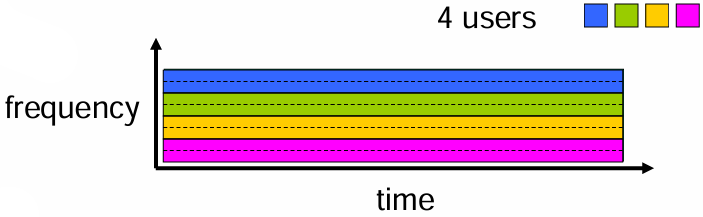

  TDM 时分复用

  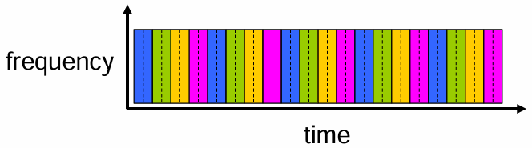

- 分组交换 & 电路交换
  - 分组交换 允许更多的用户使用网络
  - 分组交换 适合突发数据传输
    - 资源共享
  - 可能出现过度拥塞：数据包延迟和丢失
    - 需要协议保证可靠数据传输和拥塞控制
- 网络的结构：网络的网络
  - 端系统 通过 接入因特网服务提供商 连接到网络
  - 接入因特网服务提供商 必须内部互联
  - 网络的网络非常复杂


## 1.4 网络的时延，丢包，吞吐量

- 分组 在 路由缓冲区 排队：

  - 一段时间内，分组 的输入速率 大于 输出到链路上的速率
  - 数据包排队，等待被传输

- 分组延迟的四个来源：处理延迟、排队延迟、传输延迟、传播延迟

  - **处理延迟**：节点处理（检查位错误，决定输出链路，通常小于毫秒）
  - **排队延迟**：在输出链路上等待传输的时间，取决于路由器的拥塞级别
  - **传输延迟**：L 数据包长度，R 数据链路带宽，𝑑trans=𝐿/𝑅 
  - **传播延迟**：d 数据链路长度，s 传播速度，𝑑prop=𝑑/𝑠 

- 排队延迟

  R 链路带宽，L 包长度，a 数据包平均到达速度

  **流量强度**：比率 La/R

  - La/R ~ 0：平均排队延迟很小
  - La/R → 1：平均排队延迟很大
  - La/R > 1：平均时延趋于无限大

- 丢包

  - 队列缓冲区的后面链路具有有限容量
  - 数据包到达满的队列中的时候就会发生丢包
  - 丢包可能由前一个节点，源端系统重新传输，或者根本不重新传输

- 吞吐量

  - 吞吐量：发送方和接收方之间传输位的速度
    - 即时吞吐量：某一时刻的速率
    - 平均吞吐量：较长时间段内的速率

## 1.5 协议层、服务模型

- 互联网协议栈

  - **应用层**：提供互联网应用

    FTP，SMTP，HTTP

  - **传输层**：进程间数据传输

    TCP，UDP

  - **网络层**：从源到目的地的数据包路由

    IP，路由协议

  - **数据链路层**：相邻网络元素之间的数据传输

    以太网，802.111(WIFI)，PPP

  - **物理层**

  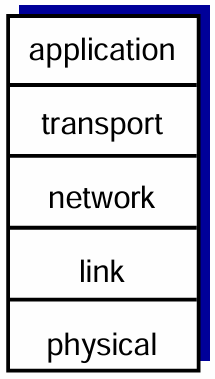

- ISO/OSI 参考模型

  - 表示层 presentation：允许应用去解释数据的含义。例如：加密、压缩、特定于机器的表示
  - 会话层 session：实现同步、检查点、数据交换后的数据恢复
  - 互联网栈缺失这两层。如果需要，这些服务必须在应用层实现。

  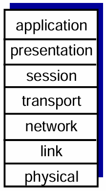

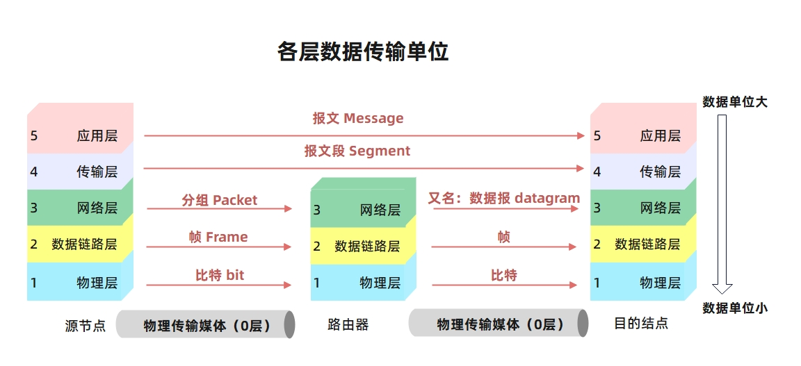

| 层次   | 传输单位        | 协议                           |
| ------ | --------------- | ------------------------------ |
| 应用层 | 报文 message    | HTTP, SMTP, FTP, DHCP,         |
| 传输层 | 报文段 segment  | TCP、UDP                       |
| 网络层 | 数据报 datagram | IP                             |
| 链路层 | 帧 frame        | ALOHA, CSMA/CD, CDMA, FDM, TDM |
| 物理层 | 比特 bit        |                                |


## 1.6 攻击威胁下的网络

**坏人：通过互联网将恶意软件植入主机**

- 恶意软件可以通过以下方式进入主机：
  - **病毒**：通过接收/执行对象（例如电子邮件附件）进行自我复制感染。
  - **蠕虫**：通过被动接收对象并使其执行进行自我复制感染。
- **间谍软件**恶意软件可以记录按键、访问的网页，并将信息上传到收集站点。
- 被感染的主机可以被加入到 **僵尸网络** 中，用于发送垃圾邮件或进行 **分布式拒绝服务（DDoS）攻击**。


**服务拒绝（DDoS）攻击：** 攻击者通过用虚假流量淹没资源（如服务器、带宽），使合法流量无法访问资源。

1. 选择目标。
2. 入侵网络中的主机（参见僵尸网络）。
3. 从被攻陷的主机向目标发送数据包。


**数据包“嗅探”：**

- 广播媒体（共享以太网、无线网络）
- 混杂模式网络接口读取/记录所有经过的包（例如，包括密码！）


**IP 欺骗：** 发送带有虚假源地址的数据包。


# 2 应用层

## 2.1 网络应用的原则

- 创建一个应用：

  - 在终端系统上运行
  - 通过网络进行通信

- 无需为网络核心设备编写软件

  - 网络核心设备不运行用户应用
  - 终端系统上的应用程序允许快速的应用程序开发和传播

- 应用程序架构

  - **客户端-服务器** client-server(CS)

    - 服务器：
      - 总是在运行
      - 恒定的 IP 地址（以前是，后面有 CDN 就不一定）
      - 示例：数据中心
    - 客户端
      - 和服务器交流
      - 可能间歇性连接
      - 可能具有动态 IP 地址
      - 客户端之间不直接相互通信

    示例：**Web**、**FTP**、**Telnet** 和 **电子邮件**

  - **点对点** peer-to-peer(P2P)

    - 任意终端系统直接与对等体通信
    - 向其他对等体请求服务，提供服务以返回给其他对等体
      - **自我可扩展性**——新的对等方带来新的服务能力，以及新的服务需求
    - 对等体见间歇性连接和改变 IP 地址

    示例：BitTorrent、对等方协助下载加速器(迅雷)、因特网电话和视频会议（如 Skype）

- 进程通信

  进程：运行在一个主机上的程序

  - 在相同主机内部，两个进程使用 进程间通信 通信
  - 不同主机中的进程通过 **交换报文** 进行通信
  - 客户和服务器进行：
    - 客户端进程：发起通信的进程
    - 服务器进程：等待被连接的进程

- 套接字 Sockets

  - 进程通过 **套接字** 的软件接口向网络发送报文 和 从网络接收报文。
    - 套接字，也称为 应用程序和网络之间的 **应用程序编程接口**
  - 类似于门
    - 发送进程 将报文推到门外
    - 发送进程 依赖于 门另一侧的传输基础设施，以传输信息给 接收进程。

- 进程寻址

  - 为了接收信息，进程必须有标识符
  - 因特网中，主机由其 IP 地址标识，主机设备有独一无二的32位 IP 地址
  - 标识符包含 IP 地址和端口号

- 应用层协议定义

  - 交换报文的类型：请求，回复等
  - 报文语法：报文中有哪些字段、字段之间是如何间隔的
  - 报文语义：字段中的信息的含义
  - 报文时序：进程发送和回复报文的时间和方式的规则
  - 开放协议：
    - 定义在 RFC
    - 允许互操作性
    - 例如，HTTP，SMTP
  - 专有协议

- 应用需要哪种传输服务：数据完整性、及时性、吞吐量、安全

- 互联网传输协议服务

  - TCP 服务
    - **可靠传输**：在发送进程和接收进程之间提供可靠的传输。
    - **流量控制**：发送方不会使接收方不堪重负。
    - **拥塞控制**：当网络过载时，限制发送方的发送速度。
    - **面向连接**：需要在客户端和服务器进程之间进行连接建立。
    - 不提供的功能：时序控制、最小吞吐量保证、安全性
  - UDP 服务
    - **不可靠的数据传输**：在发送进程和接收进程之间进行不可靠的数据传输。
    - 不提供的功能：可靠性、流量控制、拥塞控制、时序控制、吞吐量保证、安全性、连接建立

- TCP 安全保障

  - TCP & UDP：无加密功能，明文密码在套接字中传输，通过互联网时是明文形式
  - SSL (Secure Sockets Layer)：
    - 提供加密的TCP连接
    - 数据完整性保证
    - 端点身份验证
  - SSL 位于应用层：应用程序使用 SSL 库，与 TCP 进行通信
  - SSL 套接字 API：明文密码输入到套接字后，通过互联网时会被加密传输


## 2.2 Web 和 HTTP

- 网页由多个对象 组成

- 对象可以是 HTML 文件、JPEG 图像、Java 小程序、音频文件等

- 网页由一个基础的 HTML 文件和多个引用的对象组成

- 每个对象都有一个可通过 URL 访问的地址

- HTTP 概述

  - Web 的应用层协议
  - 客户端/服务器模型：
    - 客户端：通过 HTTP 协议 **请求、接收并“显示”网页对象** 的浏览器
    - 服务器：通过 HTTP 协议 **响应请求** 并 **发送网页对象** 的 Web 服务器
  - 使用 TCP：
    - 客户端 发起到服务器的 TCP 连接（创建套接字），使用端口 80。
    - 服务器 接受来自客户端的 TCP 连接
    - HTTP 报文（应用层协议报文）在浏览器（HTTP 客户端）和 Web服务器（HTTP 服务器）之间交换。
    - TCP连接关闭
  - **HTTP 是“无状态”的**：服务器不保留任何关于过去客户端请求的信息（过去的HTTP）

- HTTP 连接

  - **非持续 HTTP**：非持续连接
    - 每个TCP连接最多传输一个对象，传输完成后，连接就会关闭。
    - **下载多个对象需要多个连接**。
  - **持续 HTTP**：持续连接
    - 客户端和服务器之间的单个 TCP 连接可以传输多个对象。

- 采用非持续连接的 HTTP

  假设用户输入 URL：`www.someSchool.edu/someDepartment/home.index`

  1. **HTTP 客户端**在端口80发起一个到服务器 `www.someSchool.edu` 的 TCP 连接，80端口是 HTTP的默认端口。
  2. HTTP 客户 经过它的 **套接字** 向该服务器发送一个 HTTP 请求报文，该报文包含路径名字 `/someDepartment/home.index` 
  3. HTTP 服务器进程经它的 套接字 接收该 请求报文，从存储器中检索出对象，并通过其套接字 **向客户端发送响应报文**。
  4. HTTP 服务器进程通知 TCP **断开该 TCP 连接**。
  5. **HTTP 客户** **接收响应报文，TCP连接关闭**。该报文指出封装的对象是一个 HTML 文件，客户从响应报文中提取该文件，检查该 HTML 文件，得到对 10 个 JPEG 图形的引用。
  6. 对每个引用的 JPEG 图像对象 重复前4个步骤。

  

- 非持续连接的 HTTP：响应时间

  - RTT（往返时延）定义：从客户端到服务器并返回的一个小数据包所需的时间
  - HTTP 响应时间：
    - **需要一个 RTT 来建立 TCP 连接**
    - **需要一个 RTT 来发送 HTTP请求并接收 HTTP响应的前几个字节。**
    - **文件传输时间**
  - （单个对象）非持续连接的 HTTP 响应时间 = 2*RTT + 文件传输时间
  - 对于上面的例子，共需传输11个对象（1个 HTML文件+10个 JPEG文件），总共需要 `11*(2*RTT + 文件传输时间)` 

- 采用持续连接的 HTTP

  - 非持续连接的 HTTP的问题：
    - 每个请求的对象需要 2RTT 的时间
    - 每次TCP连接都需要操作系统一定的开销
    - 浏览器通常开并行 TCP 连接来获取 引用的对象
  - 持续 HTTP：
    - 发送响应之后，服务器保持连接的开放
    - 同一客户端/服务器通过开放的连接发送后续的HTTP报文
    - 当客户端遇到一个引用对象时，就会发送请求
    - 所有引用对象的RTT 低至1个RTT

- HTTP1.0 默认非持续连接，声明 `Connection: keep-alive` 使用持续连接

- HTTP1.1 默认持续连接，声明 `Connection: close` 使用非持续连接。


### 2.2.1 HTTP 请求报文

- 两种 HTTP 报文：请求 request、响应 response
- HTTP 请求报文：ASCII（可读格式）

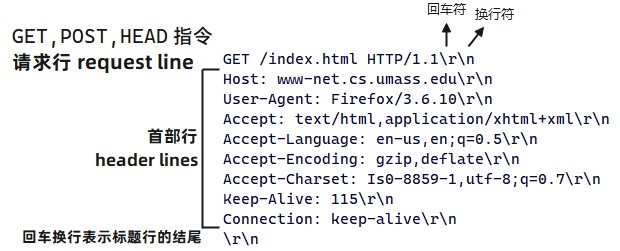

- header line：首部行

通常的格式：

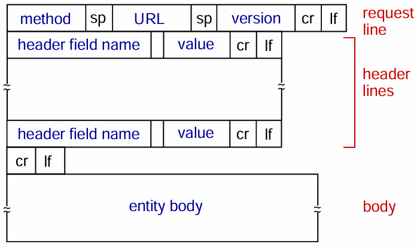


**上传表单输入**

- POST 方法：
  - 网页经常包含表单输入
  - 输入上传到服务器实体
- URL 方法：
  - 使用 GET 方法
  - 输入在请求行的 URL 字段中上传


**方法类型**

- HTTP/1.0:

  - GET
  - POST
  - HEAD：HEAD 方法类似于 GET 方法。当服务器收到一个使用 HEAD 方法的请求时，将会用一个 HTTP 报文进行响应，但是**并不返回一个请求对象**。应用程序开发者常用 HEAD 方法进行调试跟踪。

  

- HTTP/1.1

  - GET, POST, HEAD
  - PUT：常与 Web 发行工具联合使用，它允许用户上传对象到指定的 Web 服务器上指定的路径（目录）。
  - DELETE：允许用户或应用程序删除 Web 服务器上的对象。


### 2.2.2 HTTP 响应报文

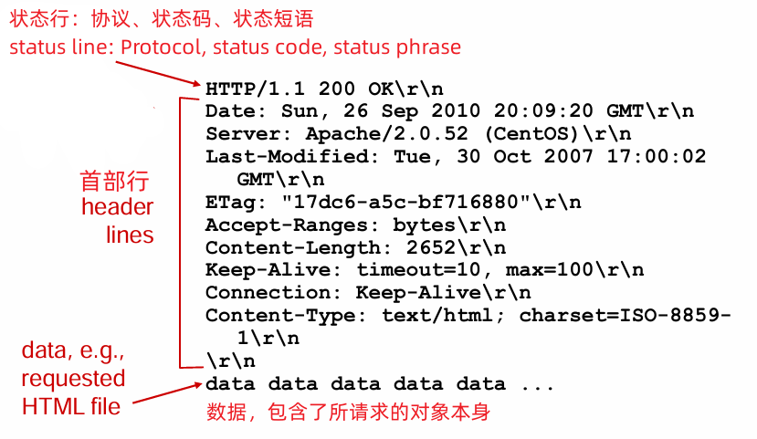 

HTTP 响应状态码：

- 在 server-to-client 响应报文的状态码出现在第一行

- 一些常见的状态码和相关的短语：

  - 200 OK：请求成功，报文在返回的响应的报文中。
  - 301 Moved Permanetly：请求的对象已经被永久转移了，新的 URL 定义在响应报文的 Location：首部行中。客户软件将自动获取新的URL。
  - 400 Bad Request：一个通用差错代码，指示该请求不能被服务器理解。
  - 404 Not Found：被请求的文档不在服务器上。
  - 505 HTTP Version Not Supported：服务器不支持请求报文使用的 HTTP 协议版本。

  

### 2.2.3 用户与服务器的交互：cookie

cookie 技术有 4 个组件：

1. 在 HTTP 响应报文中的一个 cookie 首部行
2. 在 HTTP 请求报文中的一个 cookie 首部行
3. 在用户端系统中保留的一个 cookie 文件，并由用户的浏览器进行管理
4. 位于 Web 站点的一个后端数据库

示例：Susan 总是从家中 PC 使用 Internet Explorer 上网，她首次与 Amazon.com 联系。当请求报文到达该 Amazon Web 服务器时，该 Web 站点将产生一个唯一的标识码，并以此作为索引在它的后端数据库中产生一个表项。接下来 Amazon Web 服务器用一个包含 `Set-cookie:` 首部 的 HTTP 响应报文对 Susan 的浏览器进行响应，其中 `Set-cookie:`  首部含有该识别码。

例如，该首部行可能是

```
Set-cookie: 1678
```

当 Susan 的浏览器收到了该 HTTP 响应报文时，它会看到该 `Set-cookie:` 首部。该浏览器在它管理的特定 cookie 文件中添加一行，该行包括服务器的主机名和 `Set-cookie:` 首部中的识别码。

Susan 继续浏览 Amazon 网站时，每请求一个 Web 页面，其浏览器就会查询该 cookie 文件并抽取她对这个网站的识别码，放到 HTTP 请求响应报文中包括识别码的 cookie 首部行中。特别是，发往该 Amazon服务器的每个 HTTP 请求报文中都包括以下首部行：

```
Cookie 1678
```

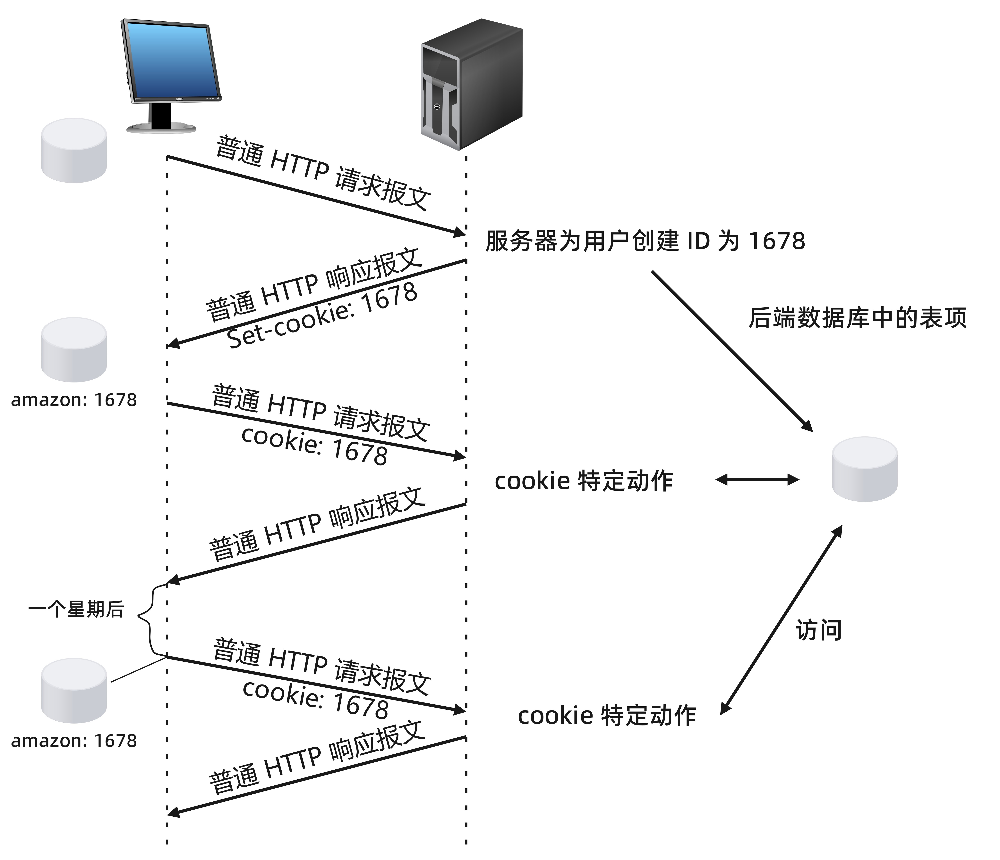

cookie 可以用于标识一个用户，用户首次访问一个站点时，可能需要提供一个用户标识（可能是名字）。在后续会话中，浏览器向服务器传递一个 cookie 首部，从而向该服务器标识了用户。因此 cookie 可以在无状态的 HTTP 之上建立一个用户会话层。


### 2.2.4 Web 缓存

Web 缓存器（Web cache）：也叫代理服务器（proxy server）

- 它是能够代表 原始 Web 服务器 来满足 HTTP 请求的网络实体。
- Web 缓存 有自己的磁盘存储空间，并在存储空间中保存最近请求过的对象的副本。

可以配置用户的浏览器，使得用户的所有 HTTP 请求首先指向 Web 缓存器。一旦某浏览器被配置，每个对某对象的浏览器请求首先被定向到该 Web 缓存器。

假设浏览器请求对象 `http://www.someschool.edu/campus.gif` ，将会发生如下情况：

1. 浏览器创建一个到 Web 缓存器的 TCP 连接，并向 Web 缓存器中的对象发送一个 HTTP 请求。
2. Web 缓存器进行检查，查看本地是否存储了该对象副本。如果有，Web 缓存器就向客户浏览器用 HTTP 响应报文返回该对象。
3. 如果 Web 缓存器中没有该对象，它就打开一个与该对象的原始服务器`www.someschool.edu` 的 TCP 连接。Web 缓存器则在这个缓存器到服务器的 TCP 连接上发送一个对该对象的 HTTP 请求。在收到该请求后，原始服务器向该 Web 缓存器发送具有该对象的 HTTP 响应。
4. 当 Web 缓存器接收到该对象时，它在本地存储空间存储一份副本，并向客户的浏览器用 HTTP 响应报文发送该副本（通过现有的客户浏览器和 Web 缓存器之间的 TCP 连接）。

- Web 缓存器，即是服务器又是客户。当它接收浏览器的请求并发回响应时，它是一个服务器。当它向初始服务器发出请求并接收响应时，它是一个客户。

部署 Web 缓存器 的原因：

- Web 缓存器可以大大减少客户请求的响应时间。
- Web 缓存器能够大大减少一个机构的接入链路到因特网的通信量。
- Web 缓存器能够从整体上减低因特网上的  Web 流量，从而改善所有应用的性能。

缓存示例

考虑下图中的示例，示例中有两个网络，即机构（内部）网络和公共因特网的一部分。机构网络是一个高速的局域网，它的一台路由器与因特网上的一台路由器通过一条 15 Mbps 的链路连接。这些 初始服务器 与 因特网相连但位于全世界各地。

- 平均对象大小：100K bits
- 浏览器向初始服务器的平均请求速率：15个/秒
- 假设 HTTP 请求报文大小可以忽略，因而不会在网络中以及接入链路上产生什么通信量。
- 假设在下图中从因特网接入链路一侧的路由器转发 HTTP 请求报文开始，到它收到其响应报文为止的时间平均为 2 秒。

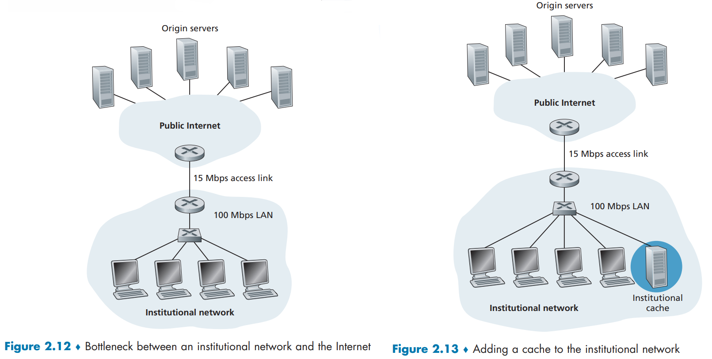

局域网上的流量强度为：15个请求/s * 1Mb/请求 / 100Mbps = 0.15 然而接入链路上的流量强度为 15 个请求/s * 1Mb/请求 / 15Mbps = 1

局域网上强度为 0.15 的通信量通常最多导致数十毫秒的时延，因此我们可以忽略局域网时延。然后，如果流量强度接近 1，链路上的时延会变得非常大并且无线增长。因此，满足请求的平均响应时间将会在分钟的量级上。

解决办法：

1. 增加加入链路的速率。这是代价很高的方案。但总的响应时间大约为 2s。
2. 在机构网络中安装一个 Web 缓存器。假设该机构的缓存命中率为 0.4。因为客户和缓存连接在一个相同的高速局域网上，这样 40% 的请求将几乎立即由缓存器得到响应，时延约在10ms 以内。然而，剩下的 60% 的请求仍然要由初始服务器来满足，但是只有 60% 的被请求对象通过接入链路，在接入链路上的流量强度从 1.0 减小到 0.6。能够实现总的响应时间小于 2s，并且成本较低。

通过使用 **内容分发网络**（Content Distribution Network, CDN），Web 缓存器正在因特网中发挥越来越重要的作用。


### 2.2.5 条件  GET 方法

尽管高速缓存能减少用户感受到的响应时间，但也引入一个新的问题，即存放缓存器中的对象副本可能是陈旧的。换句话说，保存在服务器的对象来自该副本缓存在客户上后可能已经被修改。

HTTP 协议有一种机制，允许缓存器证实它的对象是最新的。这种机制就是 条件 GET（conditional GET） 方法。

如果：

1. 请求报文使用 GET 方法
2. 请求报文中包含一个 “If-Modified-Since:” 首部行。

那么这个 HTTP 就是一个 条件GET 请求报文。

 .jpg)


## 2.3 电子邮件

因特网电子邮件系统有3个主要组成部分：

- 用户代理（user agent）
- 邮件服务器（mail server）
- 简单邮件传输协议（Simple Mail Transfer Protocol，SMTP）

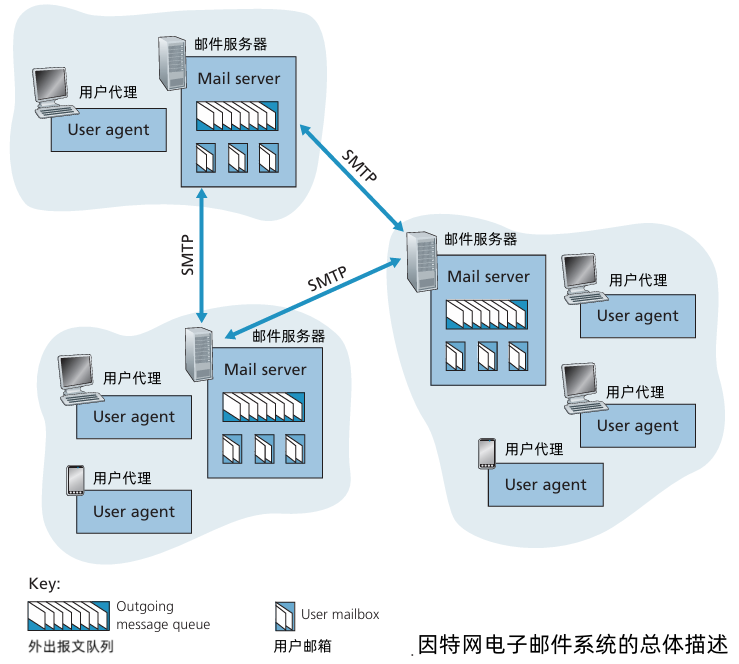 

用户代理：

- 用户代理允许用户阅读、回复、转发、保存和撰写报文。
- 用户完成邮件撰写后，用户的邮件代理向其邮件服务器发送邮件，此时邮件放在邮件服务器的外出报文队列中。
- 接收方要阅读报文时，他的用户代理在其邮件服务器的邮箱中取得该报文。

邮件服务器：形成了电子邮件体系结构的核心

- 每个接收方在某个邮件服务器上有一个邮箱（mailbox），管理和维护接收的报文。

  典型的发送过程：发送方的用户代理 → 发送方的邮件服务器 → 接收方的邮件服务器 → 分发到接收方的邮箱。

- 报文队列（message queue）：保存要发送的邮件报文

- SMTP：因特网电子邮件中主要的应用层协议。使用 TCP 可靠数据传输服务，从发送方的邮件服务器向接收方的邮件服务器发送邮件。

  - SMTP 有两个部分：运行在发送方邮件服务器的客户端 和 运行在接收方邮件服务器的服务器端。

### 2.3.1 SMTP

- SMTP 是因特网电子邮件的核心。

- 使用 **TCP** 从客户端到服务器 传输邮件报文，使用 **端口 25**

- 从发送方邮件服务器直接发送到接受方邮件服务器，**一般不使用中间邮件服务器**。**如果接收方的邮件服务器没有开机，该报文会保留在 发送方 的邮件服务器上**。

- 传输的三个阶段：

  - 握手
  - 报文传输
  - 关闭连接

- command/response 交互

  - commands：ASCII 文本
  - 响应 response：状态码 status code 和 短语 phrase

- 报文必须是 7 bit ASCII

  在用 SMTP 传送邮件之前，需要将二进制多媒体数据编码为 ASCII 码，并且在使用 SMTP 传输后要求将相应的 ASCII 码邮件解码还原为多媒体数据。


- SMTP 使用持续连接

- SMTP，每个报文以 `CRLF.CRLF` 结束，其中 CR 和 LF 分别表示回车和换行。

- 和 HTTP 的对比：

  - HTTP 主要是一个 拉协议 (pull protocol)，用户使用HTTP 从该服务器拉取Web信息。

    TCP 连接是由想接收文件的机器发起的。

  - SMTP 是一个 **推协议** (push protocol)，即发送邮件服务器把文件推向接收邮件服务器。

    TCP 连接是由要发送该文件的机器发起的。

  - SMTP 要求每个报文（包括它们的体）采用 7 比特 ASCII 码格式。

    HTTP数据不受这种限制。

  - 如何处理一个既包含文本又包含图形的文档。HTTP 把每个对象封装到它自己的 HTTP 响应报文中，而 SMTP 则把所有报文对象放在一个报文之中。

**邮件报文格式**

- SMTP：交换邮件报文的协议
- RFC 822：文本报文格式的标准

每个首部行包含了可读的文本，是由关键词后跟冒号及其值组成的。某些关键词是必需的，另一些则是可选的。

- 每个首部必须包含一个 `From:` 首部行 和一个 `To:` 首部行；一个首部行也许包含一个 `Subject:` 首部行以及其他可选的首部行。

这些首部行 不同于 SMTP 命令（即使那里包含了某些相同的词汇，如 from 和 to）。**SMTP命令** 是  SMTP 握手协议的一部分；本节中考察的 **首部行** 是 **邮件报文自身** 的一部分。

一个典型的报文首部看起来如下：

```
From: alice@test.com
To: bob@school.com
Subject: Searching for the meaning of life.
```

在报文首部之后，紧接着一个空白行，然后是以 **ACSII 格式** 表示的**报文体**。

> - **SMTP 是传输协议**：SMTP 负责将邮件从发送方传输到接收方。
> - **RFC 822 是邮件格式标准**：RFC 822 定义了 **邮件的内容格式**，SMTP 传输的邮件内容需要符合 RFC 822 的格式。
> - **协同工作**：SMTP 使用 RFC 822 格式的邮件作为传输内容。例如，在 SMTP 的 `DATA` 命令中，传输的邮件内容必须符合 RFC 822 的标准。


**邮件访问协议**

- 发送方的用户代理 用 SMTP 将电子邮件 推入 发送方的邮件服务器。

- 发送方的邮件服务器 可以 **重复地尝试** 向接收方的邮件服务器 **发送该报文**。（直到接收方的邮件服务器变得可运行为止）

- 接收方如何通过运行本地的用户代理，获得位于他的某 ISP 的邮件服务器上的邮件？

  **用户代理不能使用 SMTP 得到报文，因为取报文是一个 取操作**，**而 SMTP 协议是一个推协议**。

  通过引入一个 **特殊的邮件访问协议** 来将 接收方 邮件服务器上的报文传送给 接受方：

  - 第三方的邮局协议（Post Office Protocol -- Version 3，POP3）
  - 因特网邮件访问协议（Internet Mail Access Protocol, IMAP）
  - HTTP

- POP3

  - 三个阶段：**特许**（authorization）、**事务处理** 以及 **更新**。

    - **特许阶段**：用户代理发送（以明文形式）用户名和口令以鉴别用户。

      - 两个主要命令：`user <user name>` 和 `pass <password>` 

        ```
        +OK POP3 server ready
        user bob
        +OK
        pass hungry
        +OK user successfully logged on
        ```

      - 如果命令拼写错误，该 POP3 服务器将返回一个 -ERR 报文

      

    - **事务处理阶段**：用户代理取回报文。

      这个阶段用户代理还能进行如下操作：对报文做删除标记，取消报文删除标记，获取邮件的统计信息。

      **命令**：

      - `list`：列出报文的序号
      - `retr` ：获取给定 序号 的报文内容
      - `dele` ：删除指定序号的邮件
      - `quit` 

      ```
      C: list
      S: 1 498
      S: 2 912
      S: .
      C: retr 1
      S: <message 1 contents>
      S: .
      C: dele 1
      C: retr 2
      S: <message 1 contents>
      S: .
      C: dele 2
      C: quit
      S: +OK POP3 server signing off
      ```

      

    - **更新阶段**：出现在 客户 发送quit 命令之后，目的是结束该 POP3 会话。

      这时，该邮件服务器删除那些被标记为删除的报文。

      (在上面的示例中，处理 quit 命令后，POP3 服务器进入更新阶段，从用户的邮件中删除邮件1和2)

      

    POP3 的两种模式：

    - **下载并删除模式**：无法从多个设备阅读同一个邮件
    - **下载并保留模式**：可以从多个不同设备读取邮件

    POP3会话期间，POP3服务器保留一些状态信息，并不会在POP3会话过程中携带状态信息。

    > 在POP3会话期间，服务器会维护一些内部状态信息，比如哪些邮件已被标记为删除、当前已登录的用户身份等。
    >
    > 然而，**这些信息是服务器内部维护的**，并不会在每个POP3命令和响应之间明确传递。换句话说，POP3协议本身是**无状态**的，每个命令的请求和响应都是独立的交互，但服务器在处理这些请求时会考虑其内部维护的状态。

- **IMAP**

  IMAP 服务器**把每个报文与一个文件夹联系起来**；当报文第一次到达服务器时，它与收件人的 INBOX 文件夹 相关联。

  收件人则能够把邮件移到一个新的、用户创建的文件夹中，阅读邮件，删除邮件等。

  IMAP 协议还为用户**提供了在远程文件夹中查询邮件**的命令，按指令条件去查询匹配的邮件。

  与POP3不同，**IMAP 服务器维护了 IMAP 会话的用户状态信息**，例如，文件夹的名字以及哪些报文与哪些文件夹相关联。

如今：发件人的用户代理发送 邮件报文 到其邮件服务器，使用的是 HTTP，而不是 SMTP，但是 **收件人邮件服务器** 到 **接收人邮件服务器** 仍然是 SMTP。


## 2.4 DNS：因特网的目录服务

  **Domain Name System**

- 一个由 分层的 DNS服务器 实现的 **分布式数据库**

- 一个使得主机能够查询分布式数据库的 **应用层协议**

  DNS 协议 ① 使用 客户-服务器 模式运行在通信的端系统之间；② 在通信的端系统之间通过下面的端到端运输协议来传送 DNS 报文。

  DNS 不是一个直接和用户打交道的应用。DNS 是为因特网上的用户应用程序以及其他软件提供一种核心功能，即将主机名转换为其背后的 IP 地址。

DNS 协议 运行在 UDP 之上，使用 **53 号端口**。

DNS 通常是由其他应用层协议所使用的，包括 HTTP、SMTP 和 FTP。

> 考虑一个 HTTP 客户浏览器的请求 `URL www.someschool.edu/index.html` 页面时：
>
> 1. 用户主机上运行着 DNS 应用的客户端。
> 2. 浏览器从 URL 中抽出主机名 `www.someschool.edu` ，并将这台主机名传给 DNS 应用的客户端。
> 3. DNS 客户向 DNS 服务器发送一个包含主机名的请求。
> 4. DNS 客户最终会收到一份回答报文，其中包含对应于该主机名的 IP 地址。
> 5. **一旦浏览器接收到来自 DNS 的该 IP 地址，它能够向位于该 IP 地址 80 端口的 HTTP 服务器进程发起一个 TCP 连接。**

DNS 服务：

- **主机名到 IP 地址的转换**

- **主机别名** (host aliasing)

- **邮件服务器别名** (mail server aliasing)

- **负载均衡** (load distribution)

  DNS 也用于在 **冗余的服务器** 之间进行 **负载分配**。繁忙的站点被冗余分布在多台服务器上，每台服务器均运行在不同的端系统，每个都有不同的IP地址。

  由于这些冗余的 Web 服务器，一个 IP 地址集合因此与同一个规范主机名相联系。DNS 数据库中存储这些 IP 地址集合。

  > 当客户对映射到某地址集合的名字发出一个 DNS 请求时，该服务器用 IP 地址的整个集合进行相应，但在每个回答中循环这些地址次序。因为客户通常总是向 IP 地址排在最前面的服务器发送 HTTP 请求报文，所以 DNS 就在这些冗余的 Web 服务器之间循环分配了负载。
  >
  > DNS 的循环同样可以用于邮件服务器。


DNS 服务器采用分布式设计。

> 集中式设计的问题：
>
> - 单点故障 (a single point of failure)
> - 通信容量 (traffic volume)
> - 远距离的集中式数据库 (distant centralized database)
> - 维护 (maintenance)

1. 分布式、层次数据库

   DNS 使用了大量的 DNS 服务器，它们以层次方式组织，并且分布在全世界范围内。

   没有一台 DNS 服务器拥有因特网上所有主机的映射。相反，这些映射分布在所有的 DNS 服务器上。

   大致来说，有 3 种类型的 DNS 服务器：

   - **根 DNS 服务器**：由 13 个不同的组织管理。

     - **根名字服务器** 提供 TLD 服务器 的 IP地址。

   - **顶级域 (Top-Level Domain, TLD) DNS 服务器**：

     - 对于每个顶级域名（如 com, org, net, edu 和 gov）和所有的国家的顶级域（如 uk、fr、ca 和 jp），都有 TLD 服务器（或服务器集群）。
     - TLD服务器提供了 权威DNS服务器 的IP地址。

   - **权威 DNS 服务器**：

     - 在因特网上具有公共访问主机的每个组织机构必须提供公共可访问的 DNS 记录，这些记录将这些 主机的名字 映射为 IP 地址。一个组织机构的权威 DNS 服务器收藏了这些 DNS 记录。

     - 一个组织结构能够选择它自己的权威 DNS 服务器以保存这些记录。

       另一种方法是，组织能够支付费用，让这些记录存储在某个服务提供商的一个权威 DNS 服务器中。

   在根、TLD 和 权威 DNS 服务器 都处在该 DNS 服务器的层次结构中。

   

   **本地 DNS 服务器** 

   - 一个本地 DNS 服务器 并 **不属于** 该服务器的层次结构，但它对 DNS 层次结构 是至关重要的。
   - 每个 ISP 都有一个本地 DNS 服务器。
   - 当主机与某个 ISP 连接时，该 ISP 提供一台主机的 IP地址，该主机具有一台或多台本地 DNS 服务器的 IP 地址。
   - 当 主机 发出 DNS 请求时，该请求被发往 **本地 DNS 服务器**，它起着代理的作用，并 将该请求 **转发** 到 **DNS 服务器层次结构**中。

   这些服务器以层次结构组织起来。

   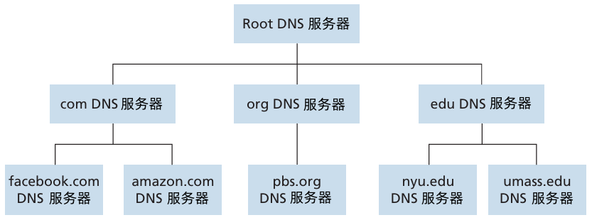

   看一个简单的例子：假设主机 `cse.nyn.edu` 想知道主机 `gaia.cs.umass.edu` 的 IP 地址：

   1. 主机 `cse.nyn.edu` 首先向它的本地 DNS 服务器 `dns.nyn.edu` 发送一个 DNS 查询报文。

      该查询报文含有被转换的主机名 `gaia.cs.umass.edu` 。

   2. 本地 DNS 服务器将该报文转发到根 DNS 服务器。

   3. 该根 DNS 服务器注意到其 `edu` 前缀，向本地 DNS 服务器返回负责 `edu` 的 TLD 的 IP 地址列表。

   4. 该本地 DNS 服务器则再次向这些 TLD 服务器之一发送查询报文。

   5. 该 TLD 服务器注意到 `umass.edu` 前缀，并用权威 DNS 服务器的 IP 地址进行响应。

   6. 本地服务器直接向 `dns.umass.edu` 重发查询报文

   7. `dns.umass.edu` 用 `gaia.cs.umass.edu` 的 IP 地址进行响应。

   8. 本地服务器把得到 IP地址返回给 请求主机。

   为了获得一台主机的 映射，共发送了 8 份 DNS 报文：4 份查询报文 和 4 份回答报文。

   > 在上例中，假设 TLD 服务器直到用于主机的权威 DNS 服务器的 IP地址，一般而言，这种假设并不总是正确的。相反，TLD 服务器只是知道中间的某个 DNS 服务器，该中间 DNS 服务器依次才能知道用于该主机的权威 DNS 服务器。这种情况下，共发送 10 份 DNS 报文。

   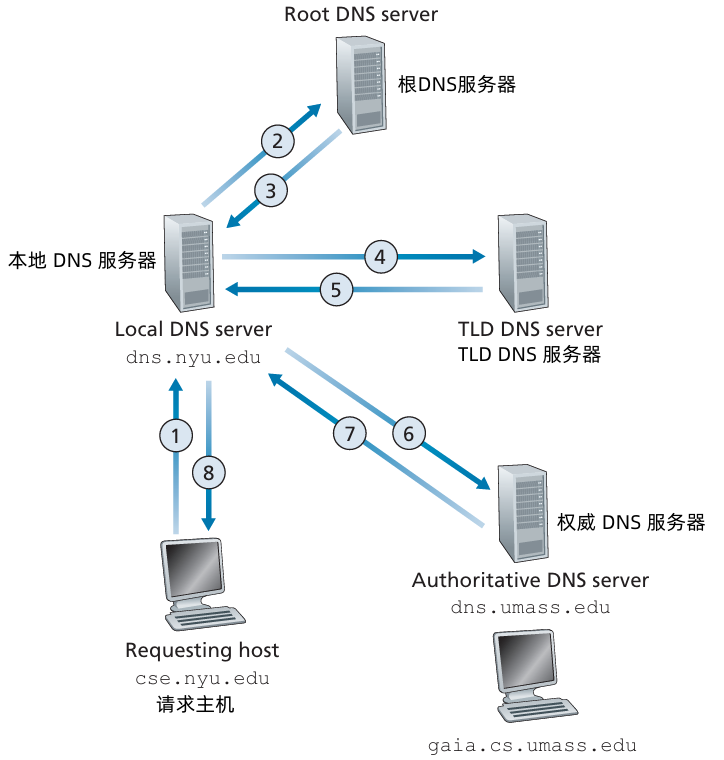

   上图中，使用了 **递归查询** (recursive query) 和 **迭代查询** (iterative query)

   - 主机 `cse.nyn.edu` 首先向它的本地 DNS 服务器 `dns.nyn.edu` 发送的查询是 递归查询
   - 后继的 3 个查询是迭代查询。

   理论上讲，任何 DNS 查询既可以是 迭代的 也能是递归的：例如，下图中是一条 DNS 查询链。

   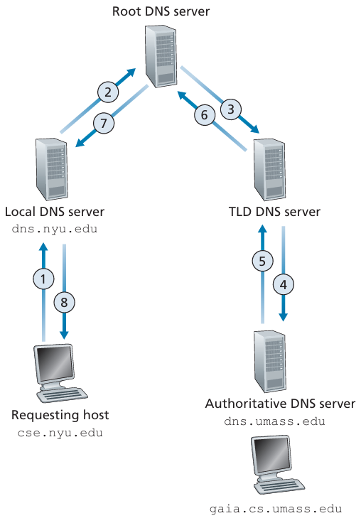

   

2. **DNS 缓存** 

   - 在一个请求链中，当某个 DNS 服务器接收一个 DNS 回答时，它能够将映射缓存在本地存储器中。
   - 如果在 DNS 服务器中缓存了一台主机名/IP 地址对，另一个对相同主机名的查询到达该 DNS 服务器时，该 DNS 服务器就能够提供所要求的 IP 地址，即使它不是主机名的权威服务器。
   - 由于主机和主机名与IP地址间的映射并不是永久的，DNS 服务器在一段时间后将丢弃缓存的信息。
   - 本地 DNS 服务器也能够缓存 TLD 服务器的 IP 地址，因而允许本地 DNS 绕过查询链中的根 DNS 服务器。事实上，**因为缓存，本地 DNS 服务器很少访问根服务器。**

   

3. **DNS 记录和报文**

   共同实现 DNS 分布式数据库的所有 DNS 服务器存储了 **资源记录** (Resource Record, RR)，RR 提供了主机名到 IP 地址的映射。每个 DNS 回答报文包含了一条或多条资源记录。

   - 资源记录，是一个包含了下列字段的 4 元组：

     ```
     (Name, Value, Type, TTL)
     ```

     TTL 是该记录的生存时间，它决定了资源记录应当从缓存中删除的时间。

     Name 和 Value 的值取决于 Type：

     - Type = A:

       - Name 是主机名。
       - Value 是该主机名对应的 IP 地址。

       一条类型为 A 的资源记录提供了标准的 主机名 到 IP 地址的映射。

     - Type = NS：

       - Name 是一个域 (如：foo.com)
       - Value 是个知道如何获得该域中主机 IP 地址的权威 DNS 服务器的主机名。

       这个记录用于沿着 查询链 来 路由 DNS 查询。

       如：`(foo.com, dns.foo.com, NS)` 就是一条类型为 NS 的记录

     - Type = CNAME：

       - Value 是别名为 Name 的主机对应的规范主机名。该记录能够向查询的主机提供一个主机名对应的规范主机名。

       例如：`(foo.com, relay1.bar.foo.com, CNAME)` 就是一条 CNAME 类型的记录

     - Type = MX：

       - Value 是个别名为 Name 的邮件服务器的规范主机名。

       例如：`(foo.com, mail.bar.foo.com, MX)` 就是一条 MX 记录。

     > 通过使用 MX记录，一个公司的邮件服务器和其他服务器（如它的Web服务器）可以使用相同的别名。 为了获得邮件服务器的规范主机名， DNS客户应当请求一条MX记录；而为了获得其他服务器的规范主机名， DNS客户应当请求 CNAME 记录。
     >
     > 如果一台 DNS 服务器是用千某特定主机名的权威 DNS服务器，那么该DNS服务器会有一条包含用于该主机名的类型A记录（即使该DNS服务器不是其权威DNS服务器，它也可能在缓存中包含有一条类型 A 记录）。 如果服务器不是用千某主机名的权威服务器， 那么该服务器将包含一条类型 NS记录，该记录对应于包含主机名的域；它还将包括一条类型A 记录，该记录提供了在 NS 记录的 Value 字段中的 DNS服务器的IP地址。 举例来 说，假设一台 edu TLD 服务器不是主机 `gaia.cs.umass.edu` 的权威 DNS 服务器， 则该服务器将包含一条包括主机 `cs.umass.edu` 的域记录，如 `(umass.edu, dns.umass.edu, NS)` ;  该edu TLD 服务器还将包含一条类型 A 记录，如 `(dns.umass.edu, 128.119.40.111, A)`，该记录将名字 `dns.umass.edu` 映射为一个 lP 地址。


1. **DNS 报文** 

   DNS 只有 查询和回答报文，并且，这两种报文有着相同的格式：

   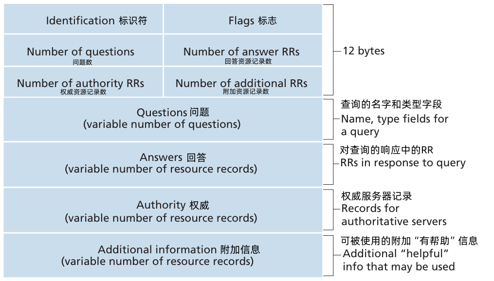

   - 前 12 个字节是首部区域。

     - 第一个字段（标识符）是一个 16 比特的数，用于标识该查询。这个标识符会被复制到对查询的回答报文中，以便让客户用它来匹配发送的请求和接收到的回答。
     - 标志字段有若干标志：
       - “查询/回答”标志
       - “权威的”标志
       - “希望递归”标志位
       - “递归可用”标志位

   - 问题区域：包含正在进行的查询信息。包括：①名字字段，包含正在被查询的主机名字。

     ②类型字段，指出有关该名字的正被询问的问题类型。例如主机地址是与一个名字相关联（类型A) 还是与某个名字的邮件服务器相关联（类型MX)。

   - 来自 DNS 服务器的回答中，回答区域：包含对最初请求的名字的资源记录。

     在回答报文的回答区域可以包含多条RR。

   - 权威区域 包含了其他权威服务器的记录。

   - 附加区域 包含了其他有帮助的记录。

     例如，对千一个MX请求的回答报文的回答区域包含了一条资源记录，该记录提供了邮件服务器的规范主机名。 该附加区域包含一个类型A记录，该记录提供了用于该邮件服务器的规范主机名的IP地址。

2. 在 DNS 数据库中插入记录

   当你向某些注册登记机构注册域名 `networkutopia.com` 时，需要向该机构提供你的基本和辅助权威 DNS 服务器的名字和 IP地址。对每个权威 DNS 服务器，该注册机构确保将一个类型 NS 和 一个类型 A 的记录输入 TLD com 服务器。

   特别是对于用于 `networkutopia.com` 的基本权威服务器，该注册登记机构将下列两条资 源记录插入该DNS 系统中： 

   ```
   (networkutopia.com, dnsl.networkutopia.com, NS)
   (dnsl.networkutop.ia.com, 212.212.212.1, A)
   ```

   


DNS 攻击

- 分布式拒绝服务（DDoS）带宽洪泛攻击。

  攻击者视图向每个 DNS 根服务器发送大量分组，使得大多数合法 DNS请求得不到回答。

- 对 DNS 的潜在更为有效的 DDoS 攻击是向顶级域名服务器发送大量 DNS 请求。

- DNS 能够潜在地以其他方式被攻击。

  在中间人攻击中，攻击者截获来自主机的请求并返回伪造的回答。

  在 DNS 毒害攻击中，攻击者向一台 DNS 服务器发送伪造的回答，诱使服务器在它的缓存中接收伪造的记录。

  这些攻击中的任一种，都将毫无疑虑的Web用户重定向到攻击者的 Web 站点。

  （难以实现）


## 2.5 P2P 文件分发

使用 P2P 体系结构，对总是打开的基础设施服务器有最小的（或者没有）依赖。与之相反，成对间歇连接的主机（称为对等方）彼此直接通信。这些对等方并不为服务提供商所拥有，而是受用户控制的桌面计算机和膝上计算机。

研究一个 P2P 应用：**从单一服务器向大量主机分发大文件**。

- 在客户-服务器文件分发中，该服务器必须向每个对等方发送该文件的一个副本，即服务器承受了极大的负担，并且消耗了大量的服务器带宽。
- 在 P2P 文件分发中，每个对等体能够向任何其他对等体重新分发它已经收到的该文件的任何部分，从而在分发过程中协助该服务器。
- 到 2016 年止，最为流行的 P2P 文件分发协议是 BitTorrent。


1. **P2P 体系结构的扩展性**

考虑简单定量模型：**将一个文件分发给一个固定对等方集合**。

服务器和对等方 使用 接入链路与因特网相连。其中

- 𝑢𝑠 表示服务器接入链路的上载速率
- 𝑢𝑖 表示第 𝑖 对等方接入链路的上载速率
- 𝑑𝑖 表示了第 𝑖 对等方接入链路的下载速率
- 𝐹 表示被分发的文件长度（以比特计）
- 𝑁 表示要获得的该文件副本的对等方的数量

**分发时间** (distribution time) 是所有 N 个对等方得到该文件的副本所需要的时间。

假设因特网核心具有足够的带宽，瓶颈都在网络接入链路。

- 首先确定 **客户-服务器 体系结构** 的分发时间，将其表示为 𝐷𝑐𝑠 

  在客户-服务器体系结构中，没有对等方参与来帮助分发文件。我们做下列观察：

  - 服务器必须向 𝑁 个对等方的每个传输该文件的一个副本，因此该服务器必须传输 𝑁𝐹 比特。因为该服务器的上载速率是 𝑢𝑠 ，分发该文件的时间必定是至少 𝑁𝐹/𝑢𝑠 。

  - 令 𝑑min 表示具有最小下载速率的对等方的下载速率，即 𝑑min=min{𝑑1,𝑑2,⋯,𝑑𝑁} 。具有最小下载速率的对等方不可能在少于 𝐹/𝑑min 秒时间内获得该文件的所有 𝐹 比特。

    因此最小分发时间至少为 𝐹/𝑑min 

  将这两个观察放在一起，我们得到

  𝐷𝑐𝑠⩾max{𝑁𝐹𝑢𝑠,𝐹𝑑min}

  该式提供了对于客户-服务器体系结构的最小分发时间的下界。取上面提供的这个下界作为实际发送时间，即

  𝐷𝑐𝑠=max{𝑁𝐹𝑢𝑠,𝐹𝑑min}

  对足够大的 𝑁，客户-服务器 分发时间 由 𝑁𝐹/𝑢𝑠 确定，所以，分发时间随 对等方 𝑁 的数量线性增加。

- 对 P2P 体系结构 进行简单的分析，其中 **每个对等方能够帮助服务器分发该文件**。特别是，当一个对等方接收到某些文件数据，它能够使用自己的上载能力重新将数据分发给其他对等方。

  分发时间取决于每个对等方如何向其他对等方分发该文件的各个部分。

  - 在分发的开始，只有服务器具有文件。

    为了使社区的这些对等方得到该文件，该服务器必须经其接入链路至少发送该文件的每个比特一次。因此最小分发时间至少是 𝐹/𝑢𝑠 。（与客户-服务器方案不同，由服务器发送过一次的比特可能不必由该服务器再次发送，因为对等方在它们之间可以重新分发这些比特）

  - 与客户-服务器体系结构相同，具有最低下载速率的对等方不能以小于 𝐹/𝑑min 秒的分发时间获得所有 𝐹 比特。因此最小分发时间至少为 𝐹/𝑑min 。

  - 最后，观察到系统整体的总上载能力等于服务器的上载速率加上每个单独的对等方的上载速率，即 𝑢total=𝑢𝑠+𝑢1+⋯+𝑢𝑁 。系统必须向这个对等方的每个交付（上载） 𝐹 比特，因此总共交付 𝑁𝐹 比特。这不能以快于 𝑢total 的速率完成。因此，最小的分发时间也至少是 𝑁𝐹/(𝑢𝑠+𝑢1+⋯+𝑢𝑁) 。

  将这三个观察放在一起，我们获得了对 P2P 的最小分发时间，表示为 𝐷P2P ：

  𝐷P2P⩾max{𝐹𝑢𝑠,𝐹𝑑min,𝑁𝐹𝑢𝑠+∑𝑖=1𝑁𝑢𝑖}

  存在一种重新分发方案能实际获得这种下界。取上式提供的下界作为实际的最小分发时间，即

  𝐷P2P=max{𝐹𝑢𝑠,𝐹𝑑min,𝑁𝐹𝑢𝑠+∑𝑖=1𝑁𝑢𝑖}

  具有 P2P 体系结构的应用程序是自扩展的，这种扩展性的直接成因是：对等方除了是比特的消费者外还是它们的重新分发者。


1. BtiTorrent

   BitTorrent 是一种用于 **文件分发** 的流行 **P2P 协议**。用 BitTorrent 的术语来讲，参与一个特定文件分发的所有对等方的集合被称为一个 **洪流** (torrent)。

   在一个洪流中的对等方彼此下载等长度的 **文件块**（chunk），典型的块长度为 256KB。

   - 当一个对等方首次加入一个洪流时，它没有块。
   - 随着时间的流逝，它累积了越来越多的块。
   - 当它下载块时，也为其他对等方上载了多个块。
   - 一旦某对等方获得了整个文件，它也许（自私地）离开洪流，或（大公无私地）留在该洪流中并继续向其他对等方上载块。
   - 同时，任何对等方可能在任何时候仅具有块的子集就离开该洪流，并在以后重新加入该洪流中。

   每个洪流具有一个基础设施节点，称为 追踪器（tracker）。当一个对等方加入某洪流中，它向追踪器注册自己，并周期性地通知追踪器它仍在该洪流中。以这种方法，追踪器跟踪参与在洪流中的对等方。一个给定的洪流可能在任何时刻具有数以百计或数以千计的对等方。

   > 当一个新的对等方Alice加入该洪流时， 追踪器随机地从参与对等方的集合中选择对等方的一个子集（为了具体起见，设有50个对等方），并将这50个对等方的IP地址发送给Alice。 Alice 持有对等方的这张列表，试图与该列表上的所有对等方创建并行的TCP连接。 我们称所有这样与 Alice 成功建立一个 TCP 连接的对等方为 “**邻近对等方**”。随着时间的流逝，这些对等方中的某些可能离开，其他对等方（最初50个以外的）可能试图与Alice 创建TCP连接。 因此一个对等方的邻近对等方将随时间而波动。
   >
   > 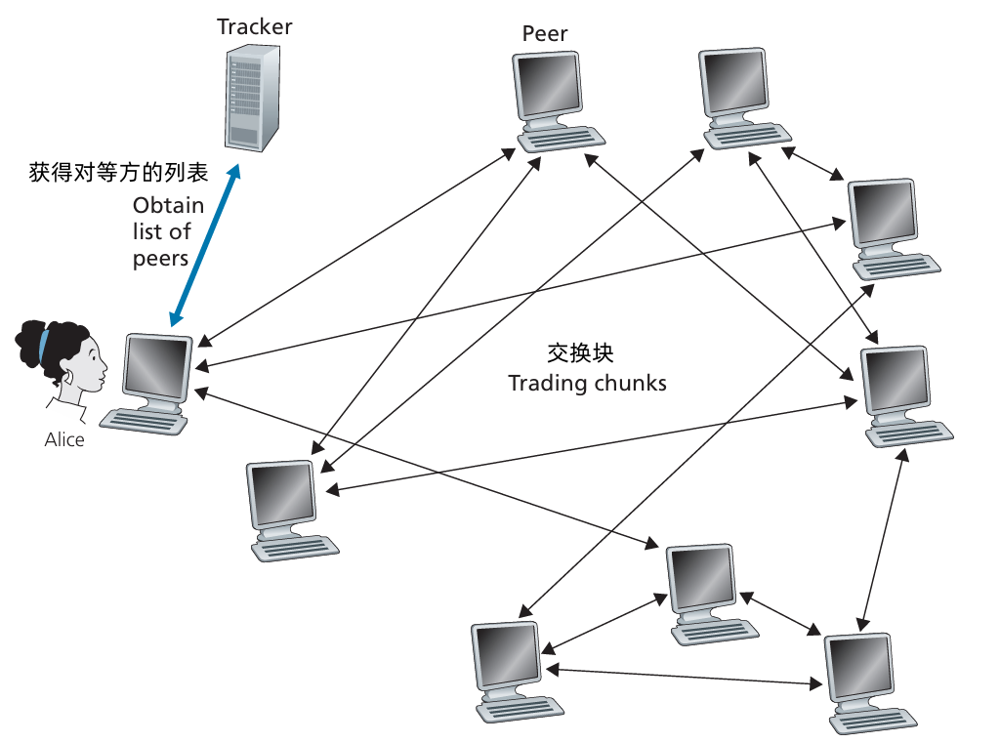
   >
   > 在任何给定的时间，每个对等方将具有来自该文件的块的子集，并且不同的对等方具有不同的子集。Alice 周期性地（经TCP连接） 询问每个邻近对等方它们所具有的块列表如果Alice 具有 L个不同的邻居，她将获得L个块列表。 有了这个信息， Alice 将对她当前还没有的块发出请求 （仍通过TCP连接）。
   >
   > 因此在任何给定的时刻，Alice 将具有块的子集并知道它的邻居具有哪些块。利用这些信息，Alice 将做出两个重要决定。 第一，她应当从她的邻居请求哪些块呢？第二，她 应当向哪些向她请求块的邻居发送块？在决定请求哪些块的过程中， Alice使用一种称为 **最稀缺优先** (**rarest first**) 的技术。 这种技术的思路是，针对她没有的块在她的邻居中决定最稀缺的块（最稀缺的块就是那些在她的邻居中副本数量最少的块），并首先请求那些最稀缺的块。这样，最稀缺块得到更为迅速的重新分发，其目标是 （大致地）均衡每个块在洪流中的副本数量。
   >
   > 为了决定她响应哪个请求， BitTorrent 使用了一种机灵的对换算法。其基本思想是，Alice 根据当前能够以最高速率向她提供数据的邻居，给出其优先权。特别是，Alice 对于她的每个邻居都持续地测量收到比特的速率，并确定以最高速率流入的 4 个邻居。每过10秒，她重新计算该速率并可能修改这 4 个对等方的集合。用 BitTorrent 术语来说，这 4 个对等方被称为 **疏通** (**unchoked**)。重要的是，每过 20 秒，她也要随机选择另一位邻居并向其发送块。我们将这个被随机选择的对等方称为 Bob。 因为 Alice 正在向 Bob 发送数据，她可能成为Bob前4位上载者之一．这样的话 Bob将开始向 Alice 发送数据。 如果 Bob 向 Alice 发送数据的速率足够高， Bob 接下来也能成为Alice 的前4 位上载者。 换言之，每过30 秒Alice 将随机地选择一名新的对换伴侣并开始与那位伴侣进行对换。 如果这两名对等方都满足此对换，它们将对方放入其前4 位列表中并继续与对方进行对换，直到该对等方之一发现了一个更好的伴侣为止。 这种效果是对等方能够以趋向于找到彼此的协调的速率上载。 随机选择邻居也允许新的对等方得到块，因此它们能够具有对换的东西。 除了这5 个对等方("前" 4个对等方和一个试探的对等方）的所有其他相邻对等方均被“阻塞＂， 即它们不能从 Alice 接收到任何块。 


## 2.6 视频流和内容分发网

### 2.6.1 因特网视频

- 从网络的观点看，视频最为突出的特征是它的高比特率。
- 压缩的因特网视频的比特率范围通常从用于低质量视频的 100kbps，到用于流式高分辨率电影的超过 3Mbps，再到用于 4K流式展望的超过 10Mbps。这能够转换为巨大的流量和存储，特别是对高端视频。
- 对流式视频的最为重要的性能度量是平均端到端吞吐量。
- 为了提供连续不断的布局，网络必须为流式应用提供平均吞吐量，这个流式应用至少与压缩视频的比特率一样大。

### 2.6.2 HTTP 流 和 DASH

- 在 HTTP 流中，视频只是存储在 HTTP 服务器中作为一个普通的文件，每个文件有一个特定的 URL。
- 当用户要看该视频时，客户与服务器建立一个 TCP 连接并发送对该 URL 的 HTTP GET 请求。服务器则以底层网络协议和流量条件允许的尽可能快的速率，在一个 HTTP 响应报文中发送该视频文件。在客户一侧，字节被收集在客户应用缓存中。一旦该缓存中的字节数量超过预先设定的门限，客户应用程序就开始播放。
- 流式视频应用程序周期性地从客户应用程序缓存中抓取帧，对这些帧压缩并且在用户屏幕上展现。因此，流式视频应用接收到视频就进行播放，同时缓存该视频后面部分的帧。

HTTP 流具有严重缺陷：即所有客户接收到相同编码的视频，尽管对不同的客户或者相同客户的不同时间而言，客户可用的带宽大小有很大不同。


**经 HTTP 的动态适应性流** (Dynamic Adaptive Streaming over HTTP, DASH)：

- 在 DASH 中，视频编码为几个不同的版本，其中每个版本具有不同的比特率，对应于不同的质量水平。
- 客户动态地请求来自不同版本且长度为 几秒 的视频段数据块。当可用带宽量较高时，客户自然地选择来自高速率版本的块；当可用带宽较低时，客户自然地选择来自低速率版本的块。客户使用 HTTP GET 请求报文一次选择不同的块。
- DASH 允许客户使用不同的以太网接入速率流式播放具有不同编码速率的视频。
- 使用 DASH 后，每个视频版本存储在 HTTP 服务器中，每个版本都有一个不同的 URL。HTTP 服务器也有一个 **告示文件** (manifest file)，为每个版本提供了一个 URL 及其比特率。
- 客户首先请求该告示文件并且得知各种各样的版本。然后客户通过 HTTP GET 请求报文中对每块指定一个 URL 和一个字节范围，一次选择一块。在下载块的同时，客户也测量接收带宽并运行 **速率决定算法** 来选择下次请求的块。
- 自然地、如果客户缓存的视频很多，并且测量的接收带宽较高， 它将选择一个高速率的版本。 同样，如果客户缓存的视频很少，并且测量的接收带宽较低，它将选择一个低速率的版本（ 因此 DASH 允许客户自由地在不同的质量等级之间切换。


### 2.6.3 内容分发网

- 问题：对于一个因特网视频公司，或许提供流式视频服务最为直接的方法是建立单一的大规模数据中心，在数据中心中存储其所有视频， 并直接从该数据中心向世界范围的客户传输流式视频。 但是这种方法存在三个问题：
  1. 如果客户远离数据中心，带来较大的停滞时延。
  2. 流行的视频可能经过相同的通信链路发送许多次。
  3. 单个数据中心代表一个单点故障。

**内容分发网**（Content Distribution Network, CDN）

- **CDN** 管理 **分布在多个地理位置上的服务器**，在它的服务器中存储视频（和其他类型的 Web 内容，包括文档、图片和音频）副本，并且所有试图将每个用户请求定向到一个将提供最好的用户体验的CDN位置。

- CDN 可以是专用CDN，可以是第三方 CDN。

- CDN 通常采用两种不同的服务安置原则：

  - **深入**。通过在 **遍及全球的接入 ISP** 中 **部署服务器集群** 来 **深入** 到 **ISP 的接入网** 中。这种高度分布式设计，维护和管理集群的任务成为挑战。

  - **邀请做客**。通过 **少量关键位置** 建造大集群来 *邀请到ISP做客*。不是将集群放在接入 ISP 中，这些 CDN 通常将它们的集群放置在 **因特网交换点**（IXP）。

    与深入设计原则相比，邀请做客设计通常产生较低的维护和管理开销，可能以对端用户的较高时延和较低吞吐量为代价。

     

一旦 CDN 的集群准备就绪，它就可以 跨集群复制内容。事实上，许多CDN 没有将视频推入它们的集群，而是使用一种简单的拉策略：如果客户向一个未存储该视频的集群请求某视频，则该集群检索该视频，**向客户流式传输视频时的同时在本地存储一个副本**。当某集群存储器变满时，它删除不经常请求的视频。

1. CDN 操作

   当用户主机的一个浏览器指令检索一个特定的视频（由 URL 标识）时，CDN 截获该请求，以便能够：

   ① 确定此时适合用于该客户的 CDN 服务器集群

   ② 将客户的请求重定向到该集群的某台服务器。

   > 1. 用户访问位于 NetCinema 的网页
   > 2. 当用户点击链接 `http://video.netcinema.com/6Y7B23V` 时，该用户主机发送了一个对于 `video.netcinema.com` 的 DNS 请求
   > 3. 用户的本地 DNS 服务器 将该 DNS 请求中继到一台用于 NetCinema 的权威 DNS 服务器，该服务器观察到主机名 `video.netcinema.com` 中的字符串 `video`。为了将该 DNS 请求移交给 `KingCDN` ，NetCinema 权威 DNS 服务器并不返回一个 IP 地址，而是向 LDNS 返回一个 KingCDN 域的主机名，如 a1105.kingcdn.com
   > 4. 从这时起，DNS 请求进入了 KingCDN 专用 DNS 基础设施。用户的 LDNS 则发送第二个请求，此时是对 `a1105.kingcdn.com` 的 DNS 请求，KingCDN 的 DNS 系统最终向 LDNS 返回 KingCDN 内容服务器的 IP 地址。正是这里，在 KingCDN 的 DNS 系统中，指定了 CDN 服务器，客户能够将从这台服务器接收到它的内容。
   > 5. LDNS 向用户主机转发内容服务 CDN 节点的 IP 地址。
   > 6. 一旦客户收到 KingCDN 内容服务器的 IP 地址，它与具有该 IP 地址的服务器创建了一条直接的 TCP 连接，并且发出对该视频的 HTTP GET 请求。如果使用了 DASH，服务器将首先向客户发送具有 URL 列表的告示文件，每个 URL 对应视频的每个版本，并且客户将动态地选择来自不同版本的块。 

2. 集群选择策略

   任何 CDN 部署，其核心是 **集群选择策略**，即动态地将客户定向到 CDN 中的某个服务器集群或数据中心的机制。

   简单的指派策略：指派客户到 **地理上最为邻近的集群**。

   为了基于当前流量条件为客户决定最好的集群，CDN 能够对其集群和客户之间的时延和丢包性能执行周期性的 **实时测量**。


## 2.7 套接字编程 Sockets programming

- 套接字 socket：应用进程 和 端到端传输协议 之间的门

  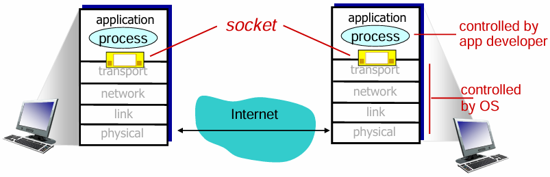

- 两种类型的套接字 对应 两种类型的传输服务：

  - UDP：不可靠数据报
  - TCP：可靠，面向字节流

- UDP 套接字编程

  - UDP：客户和服务器之间无“连接”

    - 发送数据之前没有握手
    - 发送方显式将 IP目标地址 和 端口号 附加到每个数据包
    - 接收方 从收到的数据包中提取发送者的 IP地址 和 端口号

  - UDP：传输的数据可能会丢失或接收

  - UDP 客户

    ```python
    from socket import *
    serverName = 'hostname'
    serverPort = 12000
    # 创建 UDP 套接字
    clientSocket = socket(AF_INET, SOCK_DGRAM)
    message = raw_input('input lowercase sentence')
    
    # 将 服务器名称、端口号 附加到信息中，发送到套接字
    clientSocket.sendto(message.endcode(), serverName, serverPort)
    # 从套接字中 获取 返回的字符
    modifiedMessage, serverAddress = clientSocket.recvfrom(2048)
    
    print modifiedMessage.decode()
    clientSocket.close() # 关闭套接字
    ```

  - UDP 服务器

    ```python
    from socket import *
    serverPort = 12000
    # 创建 UDP套接字
    serverSocket = socket(AF_INET, SOCK_DGRAM)
    # 将套接字连接到本地端口12000
    serverSocket.bind(('', serverPort))
    
    print('The server is ready to receive')
    
    while True: # 无限循环
        # 从 UDP套接字读取信息，获取哭护短的地址（客户Ip和端口）
        # 2048 是获取数据报的字节数
        message, clientAddress = serverSocket.recvfrom(2048)
        modifiedMessage = message.decode().upper()
        # 发送结果字符串到客户端
        serverSocket.sendto(modifiedMessage.encode(), clientAddress)
    ```

- TCP 套接字编程

  - 客户必须和服务端连接

    - 服务进程 必须 先运行
    - 服务器 必须已经创建 欢迎客户端联系的 套接字

  - 客户端 连接 服务器 通过：

    - 创建 明确 服务器进程 的 IP 地址，端口号 的 TCP 套接字
    - 当 客户端创建套接字时：客户端TCP 和 服务器TCP 搭建了连接

  - 当 服务器TCP 与 客户端连接时，服务器 TCP 给服务器进程 创建新的套接字，以便和 特定客户端通信

    - 允许 服务器和多个客户端通信
    - 源端口号用于区分客户端

  - TCP 客户端

    ```python
    from socket import *
    serverName = 'servername'
    serverPort = 12000
    
    # 创建 TCP套接字
    clientSocket = socket(AF_INET, SOCK_STREAM)
    clientSocket.connect((serverName, serverPort))
    
    sentence = raw_input('input lowercase sentence:')
    
    clientSocket.send(sentence.encode())  # 不需要附加服务器名称端口号
    modifiedSentence = clientSocket.recv(1024)
    
    print('From Server:', modifiedSentence.decode())
    clientSocket.close()
    ```

  - TCP 服务器

    ```python
    from socket import *
    serverPort = 12000
    
    # 创建 TCP欢迎 套接字
    serverSocket = socket(AF_INET, SOCK_STREAM)
    serverSocket.bind(('', serverPort))
    serverSocket.listen(1)  # 服务器开始监听 即将到来的TCP请求
    
    print "The server is ready to receive"
    
    while True:  # 无限循环
        # 服务端等待 accept() 即将到来的请求
        # 之后将会创建 新的套接字
        connectionSocket, addr = serverSocket.accept()
        
        # 从 套接字 读取字节
        sentence = connectionSocket.recv(1024).decode()
        capitalizedSentence = sentence.upper()
        connectionSocket.send(capitalizedSentence.encode())
        
        connectionSocket.close()
    ```


# 3 传输层

## 3.1 传输服务和协议

- 提供 运行在 **不同主机的应用进程** 之间的 **逻辑通信**。
- 传输协议 运行在终端系统
  - 发送方：把 应用报文 分段 后，传递给 网络层。
  - 接收方：把 **报文段** (segment) 整合 成报文，传递给 应用层。
- 多种 传输协议：
  - 互联网：TCP 和 UDP


**传输层 vs 网络层**

- 网络层：主机之间的逻辑通信
- 传输层：进程之间的逻辑通信
  - 依赖，增强 网络层服务


**互联网传输层协议**

- 可靠有序传输（TCP, **传输控制协议**）
  - 拥塞控制
  - 流控制
  - 连接设置
- 不可靠无序传输（UDP, **用户数据报协议**）
  - “尽力而为”IP 的简单扩展


## 3.2 复用和解复用

一个进程（作为网络应用的一部分）有一个或多个套接字(socket)，它相当于从网络向进程传递数据和从进程向网络传递数据的门户。

**多路分解**：在接收端，传输层检查这些可以定向到合适套接字的字段，标识出套接字的工作。

**接收方的解复用**：使用首部信息将接收的报文段传递给正确的套接字。

**多路复用**：在源主机从不同套接字中收集数据块，并为每个数据块封装上首部信息，从而生成报文段，然后将报文段传递给网络层。

**发送方的复用**：处理多个套接字的数据，加入传输首部（用于解复用）。


**解复用的实现**

- 主机接收 IP 数据报
  - 每个数据报 有 源IP地址，目的IP地址
  - 每个数据报 带有一个 传输层报文段
  - 每个 报文段 有 源端口和目的端口号。
- 主机使用 **IP地址 & 端口号** 将 报文段 定向到适合的套接字。

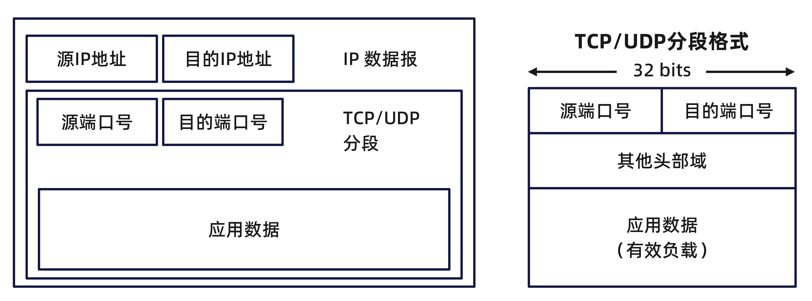


**无连接解复用**

- 当主机 收到 UDP 数据报时：
  - 检查数据报中的目的端口号
  - 定向 UDP数据报 到目的端口号对应的套接字
- 有 **相同目的端口号** 不同源IP地址（或不同源端口号）的IP 数据报会被定向到 目标的**相同的套接字**。


**面向连接的解复用**

- TCP 套接字 由 4-元组 定义：
  - 源 IP 地址
  - 源端口号
  - 目的 IP 地址
  - 目的端口号
- 解复用：接收方使用所有这四个值将分段定向到合适的套接字。
- 服务器主机 可能 支持多个同步套接字：
  - 每个套接字都由自己的 **4-元组** 标识
- **网站服务器** 对于 **每个连接的用户** **有不同的套接字**：
  - **非持续 HTTP 将为每个请求提供不同的套接字**


## 3.3 无连接传输：UDP

**UDP：User Datagram Protocol**

- “尽力而为”服务，UDP 数据报 可能会丢失或乱序地传递给应用
- **无连接**
  - UDP 发送方、接收方 之间 **无握手**
  - 每个 UDP 数据报独立于其他数据报处理（每个 UDP 数据报单独处理）

UDP使用：

- UDP 使用：
  - 流媒体服务
  - **DNS** 
  - SNMP （简单网络管理协议）
- 通过 UDP 进行可靠传输：
  - 在应用层增加可靠性
  - 特定于应用程序的错误恢复


UDP：**分段头部**

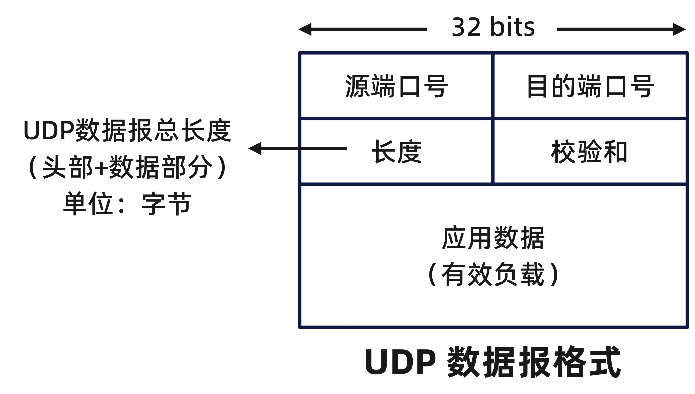

- 无连接建立（建立连接会增加延迟）
- 简单：发送方、接收方无连接状态
- 更小的 头部大小
- 无拥塞控制：UDP 可以根据需要以最快的速度增长。


**UDP 检验和**

- 目标：检测传输的分段的“错误”
- 发送方：
  - 把 数据报内容（包括 头部域）作为 16 bit 的整数序列
  - 检验和：按照 16 位（2字节）为一组的方式进行分割。如果数据的字节数是奇数，**进位部分需要加到结果中**，直到没有进位为止。将和的结果进行反码处理，得到最终的检验和。
  - 发送方把 检验和 的值放在 UDP 检验和字段。
- 接收方：
  - 计算接收到的数据报的检验和。
  - 检查检验和的值是否和数据报检验和字段的值相等。

示例：

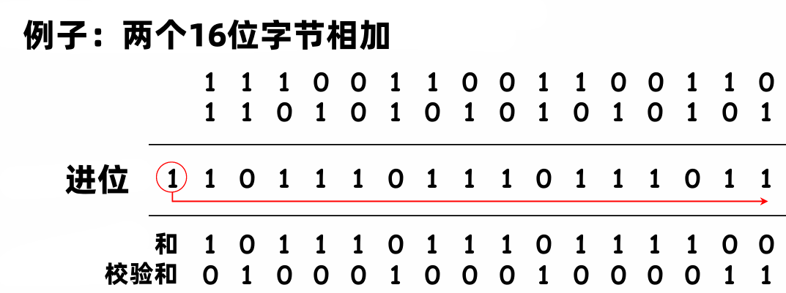 

注：两个数字相加时，需要将最高的进位添加到结果中。


## 3.4 可靠数据传输的原则

### 3.4.1 可靠数据传输的原则

- 应用层、传输层、链路层

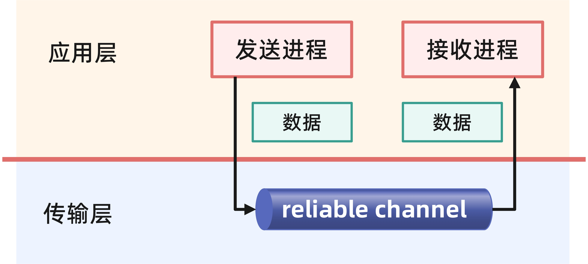

- 不可靠信道的特性将决定数据传输协议 (reliable data transfer protocol, rdt) 的复杂性

.jpg)

- `rdt_send()` ：接收来自较高层的数据，产生一个包含该数据的分组（经过 `make_pkt(data)` 动作），并将该分组发送到信道中。

  实际上，`rdt_send(data)` 事件是由较高层应用的过程调用产生的。

- `rdt_rcv(packet)` 事件从底层信道接收一个分组，从分组中取出数据（经由 `extract(packet, data)` 动作），将数据上传给较高层（经过 `deliver_data(data)` 动作）。

  实际上，`rdt_rcv(packet)` 事件是由较低层协议的过程调用产生的。

- `udt_send()` ：由 `rdt` 调用，传输数据包经过 不可靠信道 到 接收方


### 3.4.2 rdt1.0：基于可靠信道的可靠传输

- 底部的信道是完全可靠的：
  - 没有位错误
  - 没有数据包丢失
- 发送方发送数据到不可靠信道。
- 接收方从不可靠信道中接收数据。


### 3.4.3 rdt2.0：信道会发生位错误

- 底部信道可能会反转数据包中的位

  - 使用检验和检测位错误。

- 问题：如何恢复位错误

  - acknowledgement (ACKs)：接收方显式告诉发送方 数据包接收成功。
  - negative acknowledgement (NAKs)：接收方显式地告诉发送方 数据包有位错误。

  发送方接收到 NAK 之后重新发送数据包。

- rdt2.0 的新机制

  - 错误检测
  - 反馈：从接收方到发送方的控制信息(ACK, NAK)


**rdt2.0 有限状态机的表示**

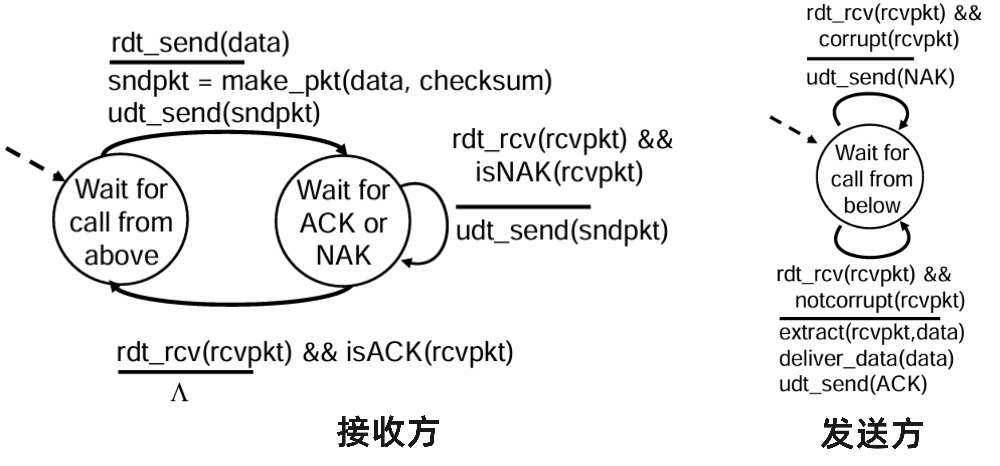

rdt2.0 有一个致命的缺陷：

如果 ACK/NAK 损坏：

- 发送方不知道接收方发生了什么
- 不能重传：可能导致重复

解决重复数据包：

- 如果 ACK/NAK 损坏，发送方重传当前数据包。
- 发送方为每个数据包增加序列号
- 发送方丢弃重复的数据包

**stop and wait** ：发送方发送一个数据包，然后等待接收方响应。


### 3.4.4 rdt2.1：发送方，处理乱序ACK/NAK

**发送方：**  

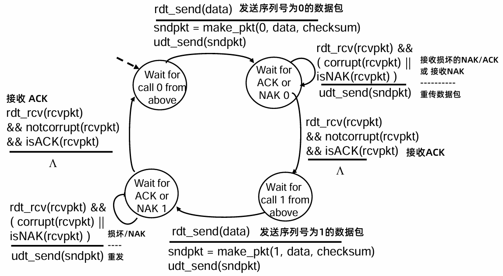

**接收方:** 

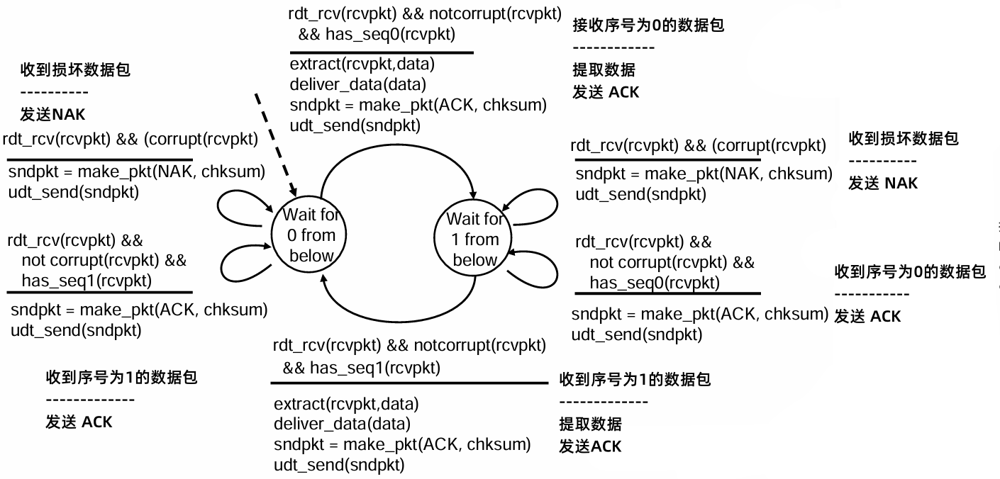

**发送方**：

- 在数据包中加入序列号。
- “停-等”协议中，只需要两个序号就可以了。
- 必须检查接收到的 ACK/NAK 是否被破坏。
- 状态数量是原来的两倍。状态必须“记住”期望的数据包是应该具有序列号0还是1。

接收方：

- 必须检查接收到的数据包是否重复。
- 注意：接收方无法知道 ACK/NAK 是否在发送方处正确接收。

rdt2.1 中，当接收到失序的分组时，接收方对所接收的分组发送ACK，如果收到受损的分组，则接收方将发送NAK。

如果收到受损的分组，接收方不发送 NAK，而是对上次正确接收的分组发送一个 ACK，我们也能实现与 NAK 一样的效果。发送方接收到对同一个分组的两个 ACK （即接收冗余ACK）后，就知道接收方没有正确接收到跟在被确认两次的分组后面的分组。

### 3.4.5 rdt2.2：无 NAK 协议

- 功能和 rdt2.1 相同，只使用 ACK。
- 接收方不再使用 NAK，而是对最后一个成功接收的数据包发送 ACK。
  - 接收方必须显式得包含 确认数据包的序列号。
- 接收方收到重复的 ACK 后，重发当前数据包

**发送方：**

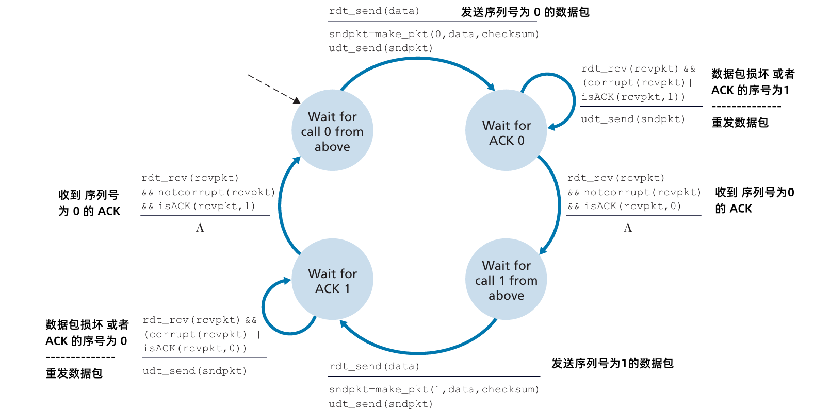


**接收方：**

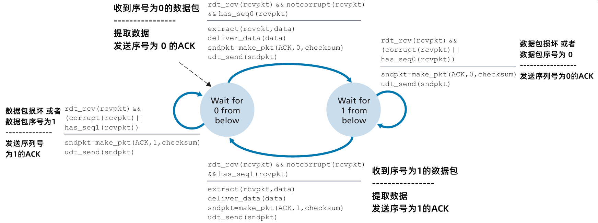

### 3.4.6 rdt3.0：具有错误和丢包的通道

- 新的假设：底层通道可能丢失数据包（包括数据包和 ACK）

  - 检验和、序列号、ACK 和 重传机制会有所帮助，但这些还不够

- 方法：

  - 发送方会等待 “合理”时间来接收 ACK。
    - 如果在这个时间内没有收到 ACK，发送方会重新发送数据包。
    - 如果数据包（或 ACK）只是延迟了（而不是丢失了）：
      - 重传会是重复的，但是序列号已经可以处理这个问题。
      - 接收方必须指定被确认的包的序列号。
    - 需要使用 **计时器**。

  **发送方：**

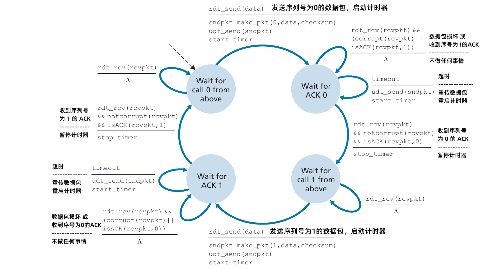

rdt3 的动作：


因为分组序号在 0 和 1 之间交替，因此 rdt3.0 有时被称为 **比特交替协议** (alternating-bit protocol) 

**rdt3.0 的性能**

- rdt3.0 是正确的，但是性能很差。

- 例如：带宽 1Gbps，15ms 的传输时延，8000 位的数据包：

  𝐷trans=𝐿𝑅=8000 bits109 bits/sec=8 microsecs

  - 𝑈sender ：利用率-发送方实际忙于将发送比特送进信道的那部分时间与发送时间之比。

  𝑈sender=𝐿/𝑅𝑅𝑇𝑇+𝐿/𝑅=0.00830.008≈0.00027

  - 如果 RTT = 30 msec，每30ms一个1 kB 数据包：33kB/sec 在 带宽为 1 Gbps 的链路上。

- 网络协议限制了物理资源的使用。


**rdt3.0：停-等 操作**

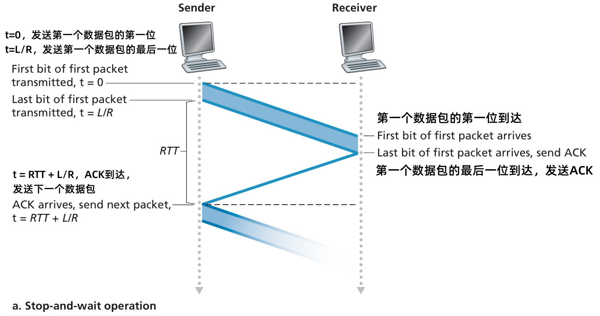


### 3.4.7 流水线协议

- 流水线传输：发送方允许多个“在传输中”的数据包，这些数据包尚未被确认。
  - 必须增加序列号的范围。
  - 需要在 发送方 和/或 接收方 存在缓冲
- 流水线协议的两种通用形式：Go-Back-N 和 Selective Repeat


**流水线：提高利用率** 

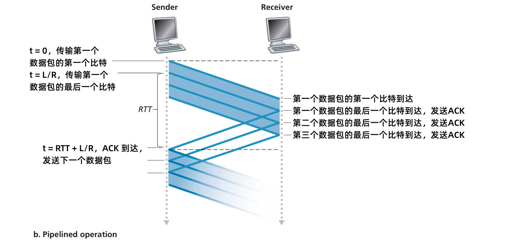

𝑈sender=3𝐿/𝑅𝑅𝑇𝑇+𝐿/𝑅=0.00830.008≈0.00081

三个数据包流水线使得利用率增加了3倍。


**流水线协议：总览** 

- Go-back-N (GBN)：
  - 发送方在流水线中最多有 N 的未确认的分组。
  - 接收方只发送累计 ACK：
    - 如果有间隔，则不发送 ACK。
  - 发送方只为 最早发送的未确认的分组 设置计时器。
    - 超时后，发送方会重新发送所有未确认的分组。
- Selective Repeat：
  - 发送方最多有 N 的未确认的分组在流水线中。
  - 接收方 为每个分组 发送单独的 ACK。
  - 发送方为每个 未确认的分组 维护一个计时器。
    - 超时后，只发送那个超时未确认的分组。


**Go-Back-N：发送方** 

- 每个分组头部，有 k 位的序列号
- 允许最多 N 个连续未确认的分组，即“窗口”
- `ACK(n)` ：确认所有直到序列号 n 的分组，包括序列号 n，称为“累积确认”。
  - 可能会接收到重复的 ACK。
- 为最早未确认的分组设置定时器。
- timeout(n)：重新传输序列号为 n 及所有更高序列号的分组，直到窗口中的最大序列号。

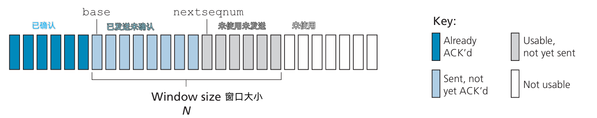

GBN 的**发送方**：

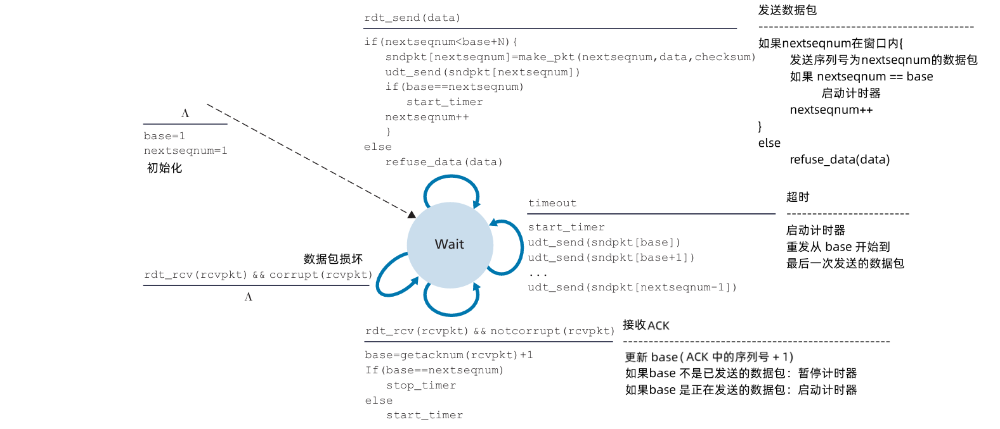

GBN 的**接收方**：

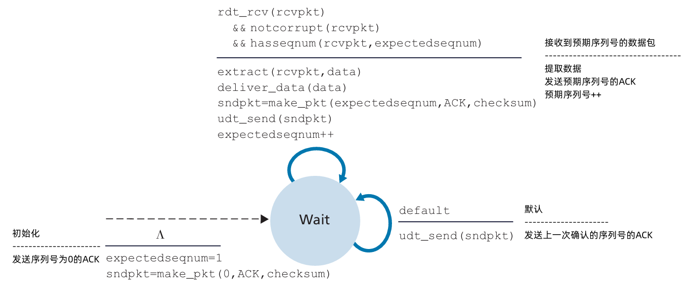

ACK-only：始终发送 按顺序接收的最高序列号的 ACK

- 可能会生成重复 ACK
- 只需记住期望的序列号

乱序分组：

- 丢弃（不缓存）：接收方不进行缓存。

- 重新发送 按顺序接收的最高序列号的 ACK

  > 发送方会根据接收的 ACK 设置 base，如果更新后的 `base == nextseqnum`，则暂停计时器，否则启动计时器（base 指向的是当前最早未确认的分组）。

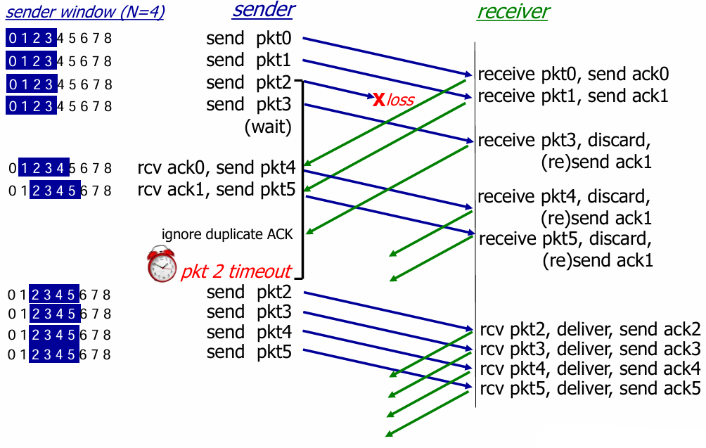

**Selective Repeat，选择重传**

- 接收方单独确认所有正确接收的分组
- 根据需要 **缓存分组**，以便最终按顺序交付给上层。
- 发送方仅重新发送未确认的分组
  - 发送方为每个未确认的分组设置定时器。
- **发送方窗口**
  - N 个连续的序列号。
  - 限制已发送但未确认的分组的序列号。

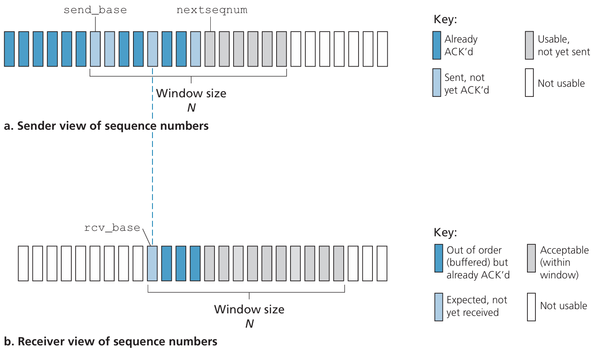

发送方：

- 来自上面的数据：
  - 如果窗口有下一个可用的序列号，则发送分组。
- `timeout(n)`：
  - 重新发送分组 n，重启定时器。
- `ACK(n)` 在 `[sendbase,  sendbase+N]` 范围内：
  - 标记分组 n  为已经接收。
  - 如果 n 是最小的未确认的分组，将窗口基准 (`sendbase`) 推进到下一个未确认的序列号。


接收方：

- 分组 n 在 `[rcvbase, rcvbase + N - 1]` 范围内：
  - 发送 `ACK(n)`
  - 乱序：放入缓冲区
  - 有序：交付（也交付缓冲中的所有有序分组），并将窗口推进到下一个尚未接收的分组。
- 分组 n 在 `[rcvbase-N, rcvbase-1]` 
  - `ACK(n)` 
- 其他情况：忽略。


当我们面对有限序号范围的现实时，发送方和接收方窗口缺乏同步会产生严重的后果。考虑下面例子中可能发生的情况，该例有 4 个分组序号0、1、2、3的有限序号范围且窗口长为3。假定分组发送了 0 ~ 2，并在接收方被正确接收且确认了。此时，接收方窗口落在第4、5、6 个分组上，其序号为 3、0、1。

现在考虑两种情况。在第一种情况下，如图 a 所示，对前3个分组的 ACK 丢失，因此重传这些分组。因此，接收方下一步要接收序号为0的分组，即第一个发送分组的副本。

第二种情况下，如图 b 所示，对前3个分组的 ACK 都被正确交付。因此发送方向前移动窗口并发送第4、5、6个分组，其序号分别是 3、0、1。序号为 3 的分组丢失，但序号为 0 的分组到达（一个包含 新数据 的分组）。

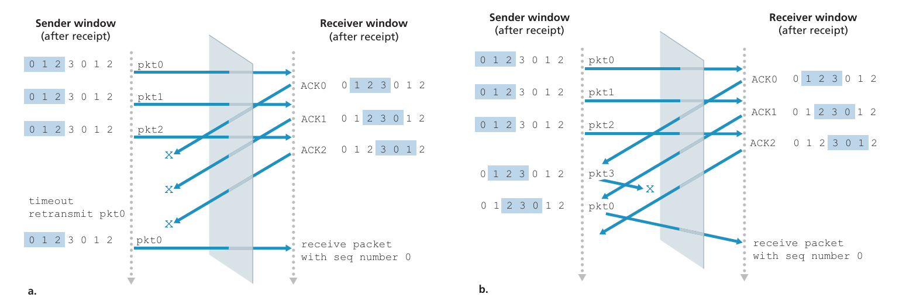

a. 分组接收出现差错，b. 没有问题

选择重传窗口太大导致的问题。

- 选择性重传协议中，**序列号大小**需要至少为 **窗口大小的两倍**，即 `M >= 2 * N`。这样可以确保在序列号回绕的情况下，发送方和接收方能够正确地识别和处理分组，避免混淆和错误的 ACK 确认。


## 3.5 面向连接的传输：TCP

**TCP：概述**

- 点对点：一个发送方，一个接收方。
- 可靠、有序字节流
- 流水线：TCP 拥塞和流控制 设置窗口大小。
- 全双工数据传输：
  - 在同一连接中 进行双向数据流
  - MSS：最大报文段大小
- 面向连接：通过握手（控制信息交换）初始化发送方和接收方的状态，以便在数据交换前建立连接。
- 流量控制：发送方不会压倒接收方，避免过载。

TCP 发送和接收缓冲：

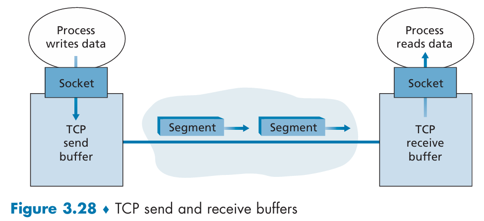 

TCP 连接的组成包括：一台主机上的缓存、变量和与进程连接的套接字，以及另一台主机上的另一组缓存、变量和与进程连接的套接字。在这两台主机之间的网络元素，没有为该连接分配任何缓存和变量。

### 3.5.1 TCP 报文段 结构

- TCP 报文段：TCP segment

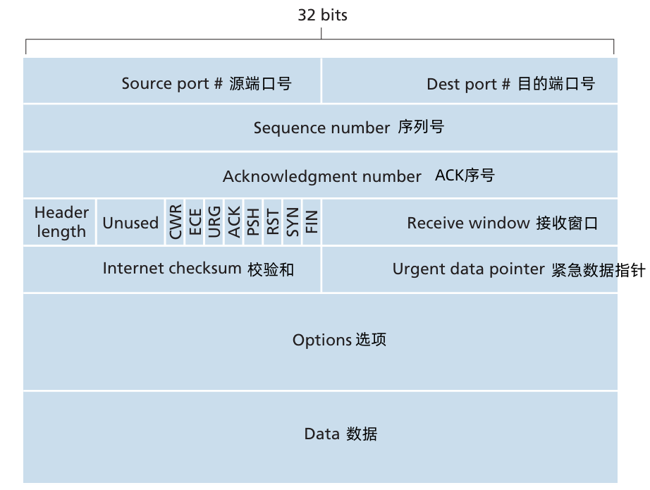

- 32 bit 的序号字段 和 32 bit 的确认号字段，这些字段被 TCP 发送方和接收方用来实现可靠数据传输服务。

- 16 bit 的接收窗口字段，该字段用于流量控制。

- 4 bit 的首部长度字段，该字段指示了以 32 bit 的字为单位的 TCP 首部的长度。由于 TCP选项字段的原因，TCP 首部的长度是可变的。（通常，选项字段为空，所以TCP首部的典型长度是 20 字节）

- URG：标志紧急数据。

- ACK：标志 ACK序号 是否有效。

- PSH：指示接收方应立即将数据交给上层。

- RST、SYN 和 FIN 比特用于连接建立和拆除。

- 可选和变长的 选项字段（optional field），该字段用于发送方与接收方协商最大报文字段长度（MSS）的时候，或者在高速网络环境下用作窗口调节因子的时候使用。

  首部字段中还定义了一个时间戳选项。


**TCP 序列号，ACKs**

- TCP 把数据看成一个无结构、有序的字节流。

- TCP 对 **序号** 的使用是建立在传送的**字节流**之上，而不是建立在传送的报文段的序号之上的。

  - 一个报文段的序号，是报文段 **首字节的字节流编号**。

  假设一个数据流由一个包含 500000 字节的文件组成，其 MSS 为 1000 字节，数据流的首字节编号为 0。如下图所示，该 TCP 将为该数据流构建 500 个报文段。给第一个报文段分配序号 0，第二个报文段分配序号 1000，第三个报文段分配序号 2000，以此类推。每一个序号被填入到相应的 TCP 报文段首部的序号字段中。

  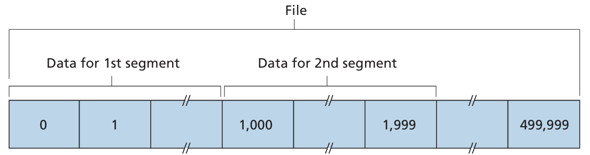

- 确认号：

  - 期望从对方接收的下一个字节的序列号。

  - 累积确认（Cumulative ACK）

  - TCP 是全双工的，因此主机 A 在向主机 B 发送数据的同时，也许也接收来自主机 B 的数据（都是同一条 TCP 连接的一部分）。从主机 B 到达的每个报文段中都有一个序号用于从 B 流向 A 的数据。

    **主机 A 填充进报文段的确认号** 是 **主机 A 期望从主机 B 收到的下一字节的序号**。

  - **例1**：假设主机 A 已收到了来自主机 B 的编号为 0 ~ 535 的所有字节，同时假设它打算发送一个报文段给主机 B。主机 A 等待主机B的数据流中字节 536 及之后的所有字节。所以主机 A 就会在它往主机 B 的报文的确认号字段填上 536。

  - **例2**：假设 主机A 已收到一个来自主机B 的包含字节 0~535 的报文段，以及另一个包含字节 900~1000 的报文段。由于某种原因，主机 A 还没有收到字节 536~899 的报文段。在这个例子中，主机 A 为了重新构建主机B的 数据流，仍然在等待字节 536 （和其后的字节）。因此，A 到 B 的下一个报文段将在确认号字段中包含 536。因为 TCP 只确认该流中 至第一个丢失字节为止的字节，所以 TCP 被称为 **累积确认**。

- TCP RFC 没有规定如何处理 失序的报文段，这个交给 TCP 的编程人员处理。

简单 telnet 会话场景：主机A 和 主机B 的起始序号分别是 42 和 79。 因此，主机A 发送的第一个报文段的序号为42, 主机B 发送的第一个报文段的序号为79。 确认号就是主机正在等待的数据的下一个字节序号。 在TCP连接建立后但没有发送任何数据之前，该客户等待字节79, 而该服务器等待字节42。

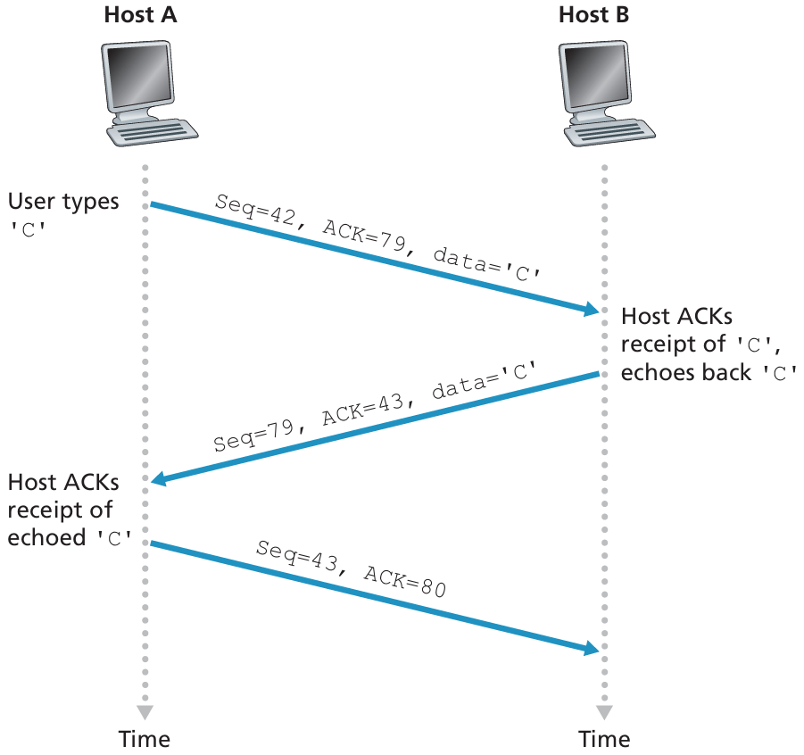 

TCP 往返时间(round trip time, RTT)，超时

问题：如何设置 TCP 超时值？

- 必须设置为 大于 RTT 的值。但是RTT 会发生改变。
- 如果设置太短，会导致过早超时，不必要的重传。
- 如果设置太长，对段丢失的反应速度过慢。

问题：如何估算 RTT？

- 大部分 TCP 的实现尽在某个时刻做一次 `SampleRTT` 测量，而不是为每个发送的报文段测量一个 `SampleRTT`。并且仅为传输一次的报文段测量 `SampleRTT` ，忽略重传。

- `SampleRTT`：测量从段发送到收到确认的时间。忽略重传。

- `SampleRTT` 会有所波动，想要平滑的估算 RTT。

  - 通过平均多个最近的测量值，而不仅仅是当前的 `SampleRTT`。

- 由于路由器的拥塞和端系统负载的变化，这些报文段的 `SampleRTT` 值会随之波动。由于这种波动，任何给定的 `SampleRTT` 值也许都是非典型的。因此考虑平均值的办法。

- TCP 维持一个 `SampleRTT`  均值（称为 `EstimatedRTT`）。一旦获得一个新 `SampleRTT` 时，TCP就会根据下面的公式更新 `EstimatedRTT` ：

  EstimatedRTT=(1−𝛼)×EstimatedRTT+𝛼×SampleRTT

  [RFC 6298] 中给出的 𝛼 的推荐值是 0.125。


- 除了估计 RTT 外，测量 RTT 的变化也是有价值的。

  [RFC 6298] 定义了 RTT 偏差 `DevRTT` ，用于估算 `SampleRTT` 一般会偏离 `EstimatedRTT` 的程度：

  DevRTT=(1−𝛽)×DevRTT+𝛽×|SampleRTT−EstimatedRTT|

  如果 `SampleRTT` 的波动很大，那么 `DevRTT` 的值会很小，如果波动很大，那么 `DevRTT` 的值就会很大。

  𝛽 的推荐值是 0.25

- 假设已经给出了 `EstimatedRTT` 和 `DevRTT` 值，那么 TCP 超时间隔应该：

  TimetoutInterval=EstimatedRTT+4⋅DevRTT

### 3.5.2 TCP 可靠数据传输

- TCP 在 IP 的不可靠的尽力而为服务的基础上创建可靠数据传输
  - 流水线 报文段
  - 累积确认
  - 单个重传计时器
- 重传的触发原因：
  - 超时事件
  - 重复确认

**TCP 发送方事件**

- 事件1：从上层应用接收数据后，TCP 将数据封装在一个报文段中，并把报文段交给 IP。注意到

  - 每一个报文段都包含一个序号，这个序号就是该报文段第一个数据字节的字节流编号。

  - 如果定时器还没有为其他报文段而运行，则当报文段被传给 IP 时，TCP 就启动该计时器。

    （将定时器想象为 与最早的未被确认的报文段相关联的）

    该定时器的过期间隔是 `TimeoutInterval` ，它由此前的 `EstimatedRTT` 和 `DevRTT` 。

- 事件2：超时，重传 造成超时的 报文段。重启计时器。

- 事件3：到达一个来自接收方的确认报文段 ACK（确切地说，是一个包含了 ACK 有效字段的报文段）。

  当事件发生时，TCP 将 ACK 的值与它的 `SendBase` 进行比较，TCP 状态变量 `SendBase` 是最早未被确认的字节的序号。（因此 `SendBase - 1` 是指接收方 **已正确按序接收** 到的数据的 **最后一个字节的序号**）

  如果 收到的 ACK 值 大于 `SendBase` ，则 ACK 是在确认一个或多个先前未被确认的报文段。因此发送方更新它的 `SendBase` 变量。

  如果当前还有未被确认的报文段，TCP 还要重新启动定时器。

```c
/* 假设发送方不受 TCP 流量和拥塞控制的限制，来自上层数据的长度小于 MSS，且数据传送只在一个方向进行 */
NextSeqNum = InitialSeqNumber;
SendBase = InitialSeqNumber;

loop(永远){
    swith("事件")
        "事件：从上面应用程序接收到数据e"
            "生成具有序号 NextSeqNum 的 TCP 报文段"
            if ("定时器当前没有运行")
                "启动定时器";
            NextSeqNum = NextSeqNum + length(data);
            break;
        "事件：定时器超时"
            "重传具有 最小序号但仍未应答 的报文段"
            "启动定时器"
            break;
    	"事件：收到ACK，具有ACK字段值y"
            if(y > SendBase){
                SendBase=y;
                if("当前还有 未被确认 的报文段")
                    "启动计时器";
             }
             break;
        	
} /* 结束永远循环 */
```


重传场景：


**超时间隔加倍**

- 每当超时事件发生时，TCP 重传具有最小序号的还未被确认的报文段。每次 TCP 重传时都会将下一次的超时间隔设置为 先前值的两倍，而不是用从 `EstimatedRTT` 和 `DevRTT` 推算出的值。

- 例如，假设当定时器第一次过期时，与最早的未被确认的报文段相关联的 `TimeoutInterval` 是 0.75 秒。TCP 就会重传该报文段，并把新的过期时间设置为 1.5 秒。如果 1.5 秒后定时器又过期了，则TCP 将再次重传该报文段，并把过期时间设置为 3.0 秒。因此，超时间隔在每次重传后会呈指数型增长。

- 然后，每当 定时器在另外两个时间（即收到上层应用的数据和收到 ACK）中的任意一个启动时，`TimeoutInterval` 由最近的 `EstimatedRTT` 值与 `DevRTT` 值推算得到。

- 这种修改提供了一个形式受限的拥塞控制。

  定时器过期很可能是由网络拥塞引起的，即太多的分组到达源与目的地之间路径上的一台（或多台）路由器的队列中，造成分组丢失或长时间的排队时延。 

  在拥塞的时候，如果源持续重传分组，会使拥塞更加严重。 相反， TCP使用更文雅的方式，每个发送方的重传都是经过越来越长的时间间隔后进行的。 


**TCP ACK 的生成**

| 接收方的事件                                                 | TCP 接收方的行动                                             |
| ------------------------------------------------------------ | ------------------------------------------------------------ |
| 按顺序到达的段，其序列号为期望值。到期望序列号为止的所有数据都已被确认。 | **延迟发送 ACK。等待最多 500 毫秒，看看是否会有另一个按顺序到达的段**。如果在此时间间隔内没有收到下一个按顺序的段，则发送一个 ACK。 |
| 按顺序到达的段，其序列号为期望值。另一个按顺序的段在等待 ACK 发送。 | 立即发送单个累积 ACK，确认这两个按顺序到达的段。             |
| 乱序到达的段，其序列号高于期望值。                           | 立即发送重复 ACK，指示下一个期望的字节的序列号（即缺口的下限） |
| 到达的段部分或完全填补了接收数据中的缺口。                   | 立即发送 ACK，前提是该段的开始位置为缺口的下限。             |


**TCP 快速重传**

- 超时触发重传存在的问题之一就是超时周期可能相对很长。

- 当一个报文段丢失时，这种长超时周期迫使发送方延迟重传丢失的分组，因而增加了端到端时延。

- 幸运的是，发送方通常可在超时事件发生之前通过注意所谓冗余 ACK 来较好地检测到丢包情况。

  - **冗余 ACK**（duplicate ACK）：再次确认某个报文段的 ACK，而发送方先前已经收到对该报文段的确认。要理解发送方对冗余 ACK 的响应，
  - **冗余 ACK** 产生原因：当 TCP 接收方收到一个具有这样序号的报文段时，即其序号大于下一个所期望、按序的报文段，它检测到了数据流中的一个间隔，就是报文段丢失。这个间隔可能是由于网络中报文段丢失或重新排序造成的。这时，TCP 对已经接收到的 **最后一个按序** 字节数据 进行重复确认（即产生一个冗余 ACK）即可。

- 因为发送方经常一个接一个地发送大量的报文段，如果一个报文段丢失， 就很可能引起许多一个接一个的冗余ACK。 

  如果 TCP 发送方接收到对相同数据的 3 个冗余 ACK，它就把这当作一种指示，认为被三次确认的段之后的段已丢失。如果收到 **三个重复 ACK**，TCP 发送方会执行 **快速重传**，在该段的计时器到期之前重传丢失的段。

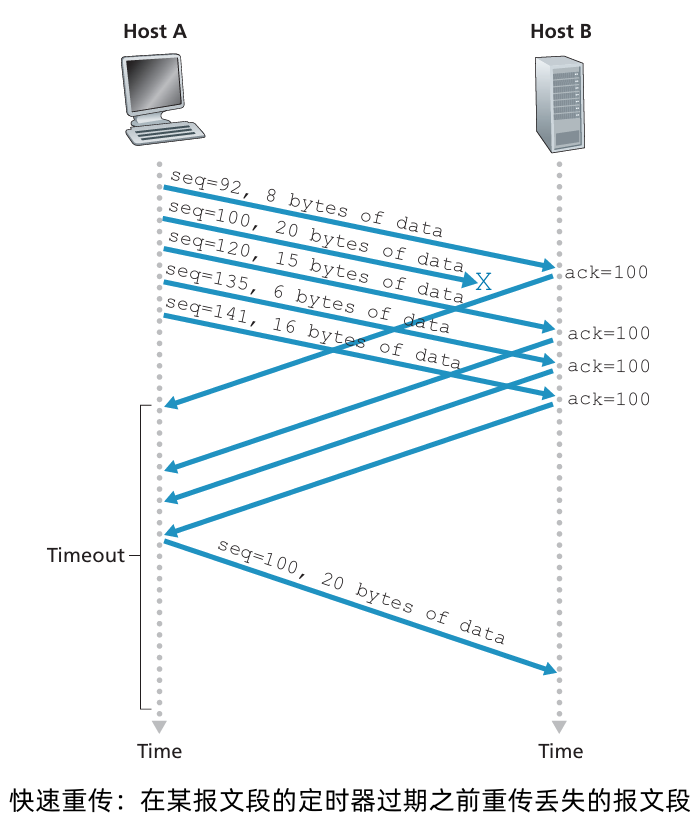

### 3.5.3 TCP 流控制

发送方发送得太多、太快，发送的数据就会很容易地使该连接的接收缓存溢出。

TCP 为它的应用程序提供流量控制服务以消除发送方使接收方缓存溢出的可能性。

- **流量控制**：是一个速度匹配服务，即发送方的发送速率与接收方应用程序的读取速率相匹配。
- TCP 通过让 发送方 维护一个称为 **接收窗口**（receive window）的变量来提供流量控制。接收窗口用于给发送方一个指示——该接收方还有多少可用的缓存空间。
- 因为，TCP 是全双工的，在连接两端的发送方都各自维护一个接收窗口。

在文件传输的情况下研究接收窗口。假设主机A通过一条 TCP 连接向主机B 发送一个大文件。主机B 为该连接分配了一个 **接收缓存**，并用 `RcvBuffer` 来表示其大小。主机B 上的应用进程不时地从该缓存中读取数据。

定义变量：

- `LastByteRead` ：主机B 上的应用进程从缓存读出的数据流的最后一个字节的编号。
- `LastByteRcvd` ：从网络中到达的并且已放入主机B 接收缓存中的数据流的最后一个字节的编号。

由于  TCP 不允许已分配的缓存溢出，下式必须成立：

LastByteRcvd−LastByteRead⩽RcvBuffer

接收窗口用 `rwnd` 表示，根据缓存可用空间的数量来设置：

rwnd=RcvBuffer−[LastByteRcvd−LastByteRead]

由于该空间是随着时间变化的，所以 `rwnd` 是动态的。

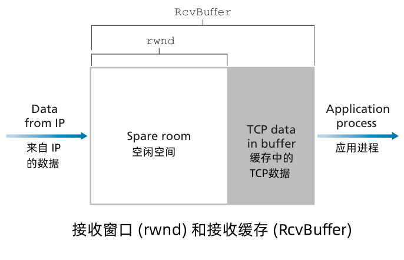

- 主机 B 通过把当前的 `rwnd` 值放入它给主机 A 的报文段接收窗口字段中，通知 主机A 它在该连接的缓存中还有多少可用空间。开始时，主机B 设定 `rwnd = RcvBuffer`。注意为了实现这一点，主机B 必须跟踪几个与连接有关的变量。

- 主机 A 轮流跟踪两个变量，`LastByteSent` 和 `LastByteAcked` ，这两个变量的意义很明显。注意到这两个变量之间的差 `LastByteSent - LastByteAcked` ，就是 主机A 发送到连接中但未被确认的数据量。通过将未确认的数据量控制在 `rwnd` 内，就可以保证主机 A 不会使 主机B 的接收缓存溢出。

- 主机 A 在该连接的整个生命周期须保证：

  LastByteSent−LastByteAcked⩽rwnd

- TCP 规范中要求：当主机 B 的接收窗口为 0 时，主机 A 继续发送只有一个字节数据的报文段。这些报文段将会被接收方确认。最终缓存将开始情况，并且确认报文里将包含一个非 0 的 `rwnd` 值。


### 3.5.4 TCP 连接管理

假设：运行在一台主机（客户）上的进程想与另一台主机（服务器）上的一个进程建立一条连接。

客户应用进程首先通知客户 TCP，它想建立一个与服务器上某个进程之间的连接。客户中的 TCP 会用以下方式与服务器中的 TCP 建立一条 TCP 连接：

**三次握手**

- 第一步：客户端的 TCP 首先向服务端的 TCP 发送**SYN 报文段**。该报文段中不包含 应用层数据。但是在报文段的首部中 **SYN 标志**位置为 1 。

  另外，随机选择一个初始序号（`client_isn`），并将此编号放置于该起始的 TCP SYN 报文段的序号字段中。

  该报文段被封装到 IP 数据报中，并发给服务器。

- 第二步：包含 TCP SYN 报文段的 IP 数据报 到达服务器主机。

  服务器从该数据报中提起出 TCP SYN 报文段，为该 TCP 连接分配 TCP 缓存和变量，并向该客户 TCP 发送允许连接的报文段—— **SYNACK 报文段**。这个允许连接的报文段 不包含 应用层数据。在报文段的首部包含 3 个重要的信息：

  - SYN 被置为 1
  - 确认号字段被置为 `client_isn+1` 
  - 服务器选择自己的 初始序号 `server_isn` ，并放置到 序号字段。

- 第三步：在**收到 SYNACK 报文段**后，客户也要给该连接 分配 缓存和变量。

  客户主机向服务器发送另外一个报文段：对服务器允许连接的报文段进行了确认，将值 `server_isn+1` 放置到 TCP 报文段首部的确认字段，SYN字段置为0。

一旦完成这 3 个步骤，客户和服务器主机就可以相互发送包含数据的报文段，在以后的每一个报文段中，SYN 比特都将被置为 0。

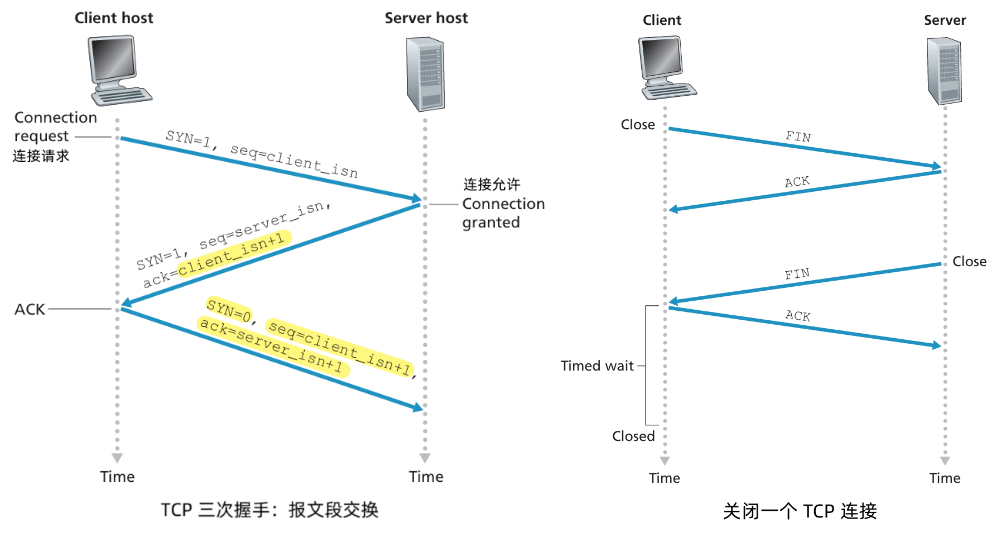

参与一条 TCP 连接的两个进程中的任何一个都能终止该连接。当连接结束后，主机的“资源”（即缓存和变量）将被释放。

假设，某客户打算关闭连接，客户应用进程发出一个关闭连接命令。

- 客户TCP 向服务器进程发送一个特殊的 TCP 报文段。这个特殊的报文段的首部的 FIN 比特被置为 1。
- 服务器接收到该报文段后，就向发送方回送一个确认报文段。
- 然后服务器发送自己的终止报文段，其 FIN 比特被置为 1。
- 最后，该客户对这个服务器的终止报文段进行确认。此时，在两台主机上用于该连接的所有资源都被释放了。

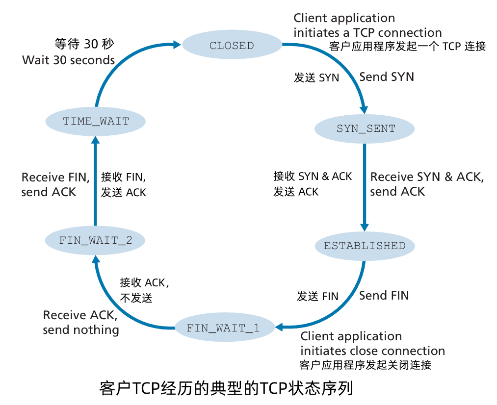


## 3.6 拥塞控制的原则

拥塞：

- “网络处理不了过多源过快发送的数据”
- 表现形式：
  - **丢包**（路由器缓冲区 **溢出**）
  - **长时间延迟**（路由器缓冲区 **排队**）


拥塞情况 1：两个发送方，两个接收方，一个路由器（无限缓存），输出容量为 R，无重发。

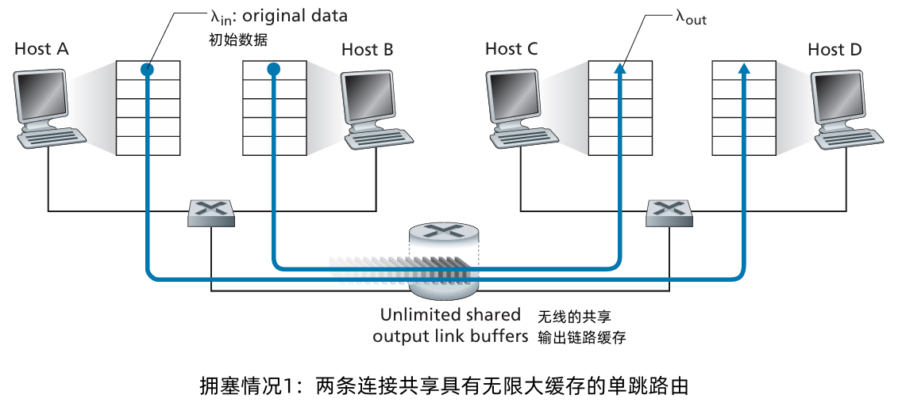

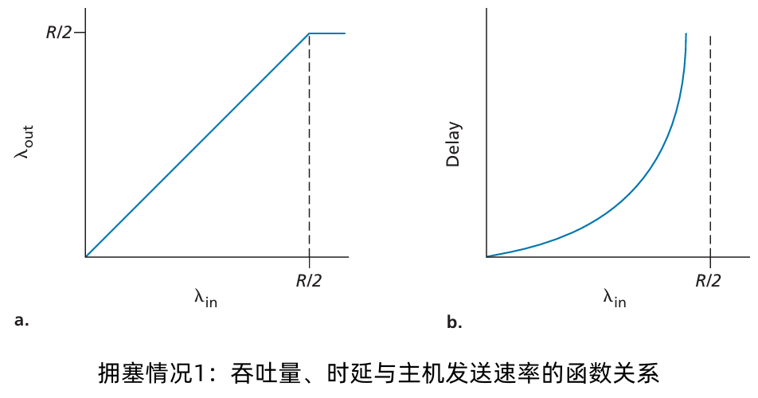

- 每个连接最大吞吐量：R/2
- 到达速率 𝜆𝑖𝑛 接近容量时，产生巨大的延迟。


拥塞情况2：两个发送方和一台具有有限缓冲的路由器

- 假定每条连接都是可靠的。如果一个包含有传输层报文段的分组在路由器中被丢弃，那么它终将被发送方重传。
  - 以 𝜆𝑖𝑛 字节/秒 表示应用程序将初始数据发送到套接字中的速率。
  - 传输层向网络层中发送报文段（含有初始数据和重传数据）的速率用 𝜆𝑖𝑛′ 字节/秒 表示。𝜆𝑖𝑛′ 有时被称为网络的供给载荷 (offered load)。

考虑不同情况：

- 主机A 能够以某种方式确定路由器中的缓存是否空闲，因而仅当缓存空闲时才发送一个分组。这种情况下不会产生丢包，𝜆𝑖𝑛 与 𝜆𝑖𝑛′ 相等，并且连接的吞吐量就等于 𝜆𝑖𝑛 。

  这种情况，从吞吐量角度来看，性能是理想的。注意，此时平均主机发送速率不能超过 R/2。

- 发送方仅当在确定了一个分组已经丢失时才重传。此时性能可能与下面图b 中所示的情况相似。

  考虑以下供给载荷 𝜆𝑖𝑛′ （初始数据传输加上重传的总速率）等于 R/2 的情况，根据 图b，在这一供给载荷时，数据被交付给接收方应用程序的速率是 R/3。因此，在所放松的 R/2 单位数据中，从平均的角度看，R/3 是初始数据，R/6 的是重传数据。

  - 拥塞代价：发送方必须执行重传以补偿因为缓存溢出而丢弃的元组。

- 发送方也许会提前发生超时并重传在队列中已被推迟但还未丢失的分组。

  这种情况下，初始数据分组和重传分组都可能到达接收方。重传分组将会被丢弃。相当于重传副本无效。

  - 拥塞代价：在遇到大时延时所进行的不必要重传会引起路由器利用其链路带宽转发不必要的分组副本。

  假定每个分组被路由器转发（平均）两次时，吞吐量与供给载荷的对比情况。由于每个分组被转发两次，当其供给载荷接近 R/2，其吞吐量将接近 R/4（图 c）

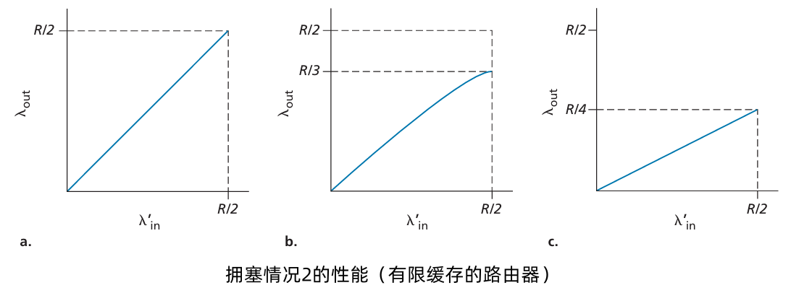


拥塞情况3：4 个发送方和有限缓存的多台路由器及多跳路径

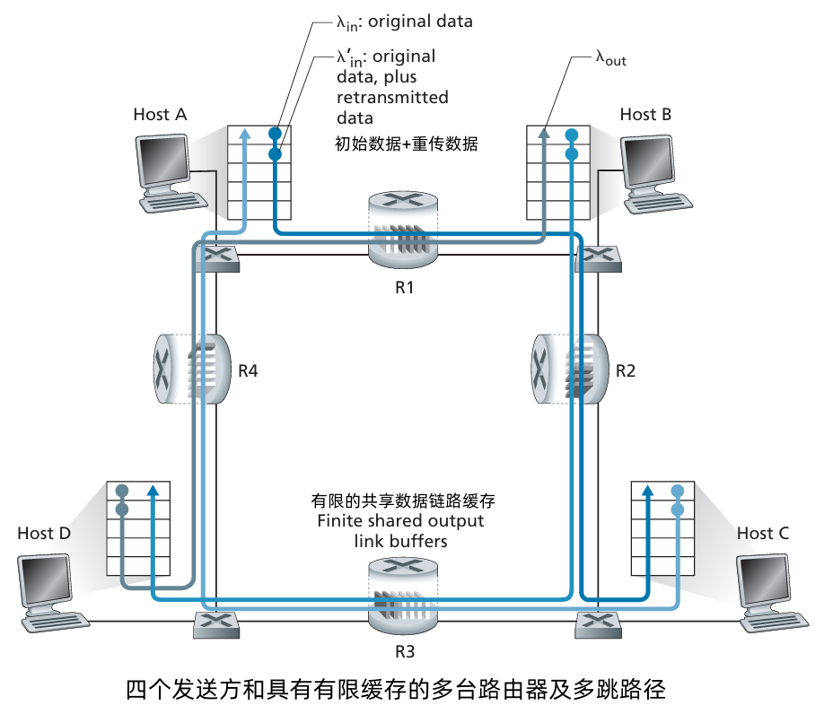

考虑从主机 A 与 主机C 的连接，连接经过 路由器 R1 和 R2。A-C 连接与 D-B 连接共享路由器 R1，并与 B-D 连接共享路由器 R2。分析 𝜆𝑖𝑛 很大的情况。考虑路由器 R2。不管 𝜆𝑖𝑛 的值多大，到达 R2的 A-C 的到达速率最多是 R，也就是 R1 到 R2 的链路容量。如果 𝜆𝑖𝑛′ 对于所有连接是极大的，那么在 R2 流量到达的速率可能比 A-C 到达的速率大得多。因此 A-C 流量和 B-D 流量在 R2 上竞争有限缓存空间。来自 B-D 的供给载荷越来越大时，A-C 连接上成功通过 R2 的流量越来越少。极端情况，R2的空闲空间立刻被 B-D 连接的分组占满，A-C在 R2 上的吞吐量趋于 0。

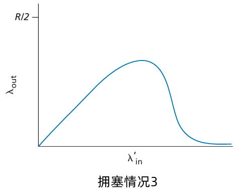

在上面提到的大流量的情况中，每当有一个分组在第二跳路由器上被丢弃时，第一跳路由器所做的将分组转发到第二跳路由器的工作就是“劳而无功＂的。 

- 拥塞代价：当一个分组沿一条路径被丢弃时，每个上游路由器用于转发该分组到丢弃该分组而使用的传输容量最终被浪费掉了 。


## 3.7 TCP 拥塞控制

TCP 连接的每一端都是由一个接收缓存、一个发送缓存和几个变量组成。运行在发送方的 TCP 拥塞控制机制跟踪一个额外的变量，即 **拥塞窗口**（congestion window）。拥塞窗口表示为 `cwnd`，它对一个 TCP 发送方能向网络中发送流量的速率进行了限制。特别是，在一个发送方中未被确认的数据量不会超过 `cwnd` 与 `rwnd` 中的最小值，即

LastByteSent−LastByteAcked⩽min{cwnd, rwnd}

考虑一个丢包和发送时延均可以忽略不计的连接。 在每个往返时间（RTT）的起始点，发送方向该连接发送 `cwnd` 个字节的数据，在该 RTT 结束时发送方接收对数据的确认报文。因此，发送方的发送速率大概是 `cwnd/RTT` 字节/秒。通过调节 `cwnd` 的值，发送方能调整它向连接发送数据的速率。


**TCP 慢启动**

- 当连接开始时，速率指数增长，直到第一次丢包事件发生：

  - 初始时，`cwnd` 的值为 1MSS。

  - 每当传输的报文段首次被确认就增加 1 个 MSS。

    （每个 RTT，`cwnd` 加倍）

  初始速率较慢，但会迅速以指数方式增加。

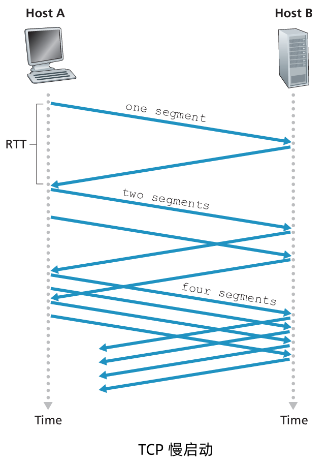

**TCP: 检测并响应丢包**

- 通过超时指示丢包：
  - `cwnd` 被设置为 1 MSS
  - 然后窗口以指数方式增长（如慢启动），直到到达阈值，然后线性增长。
- 通过 3 个重复 ACK 指示丢包：TCP Reno
  - 重复 ACK 表明网络能够传输一些数据包
  - `cwnd` 被减半，然后线性增长。
- TCP Tahoe 在超时或 3 个重复 ACK 时总是将 `cwnd` 设置为 1。


**TCP：从慢启动切换到拥塞避免（CA）**

问：何时应将指数增长切换为线性增长？

答：当 `cwnd` 达到超时前的一半时。

实现：

- 变量 `ssthresh` 

- 在丢包事件发生之后，`ssthresh` 设置为丢包前 `cwnd` 的一半，

  如果是三次重复 ACK导致的，`cwnd` 设置为 `cwnd/2 + 3`  。

  如果是超时导致的：`cwnd = 1` 

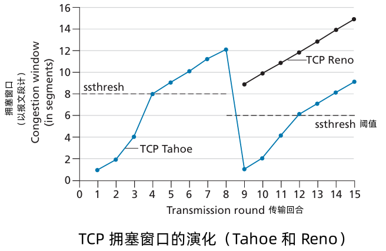


**快速恢复** 如果出现超时事件，快速恢复在执行如同在慢启动和拥塞避免中相同的动作后，迁移到慢启动状态：当丢包事件出现时， `cwnd` 的值被设置为 1 个 MSS, 并且 `ssthresh` 的值设置为 `cwnd` 值的一半。

一种称为 TCP Tahoe 的 TCP 早期版本，不管是发生超时指示的丢包事件，还是发生3 个冗余ACK 指示的丢包事件，都无条件地将其拥塞窗口减至1个MSS, 并进入慢启动阶段。 TCP的较新版本TCP Reno, 则综合了快速恢复。

- 出现 3 个冗余 ACK 时，由于拥塞窗口值为 12 MSS，故 在 Tahoe 版本中，恢复后的阈值设置为 6 MSS。在 Reno 下，拥塞窗口被设置为 `cwnd = 9 MSS` ，然后线性增长。 Tahoe 设置 `cwnd = 1MSS` ，然后慢启动，指数增长，达到阈值后线性增长。


**TCP 拥塞控制：加性增乘性减**

忽略一条开始时初始的慢启动阶段，假定丢包由 3 个冗余的 ACK 而不是 超时指示，TCP 的拥塞控制是：每个 RTT 内 `cwnd` 线性增加 1 MSS，然后出现 3 个冗余 ACK 事件时 `cwnd`  减半（乘性减）。因此，TCP 拥塞控制常常被称为 加性增、乘性减拥塞控制方式。AIMD 拥塞控制引发了下图中的“锯齿”行为。

- 方法：发送方增加传输速率（窗口大小），探测可用带宽，直到发生丢包。
  - 加性增大：每经过一个 RTT (往返时间)，将 `cwnd` 增加 1 个 MSS，直到检测到丢包。
  - 乘性减小：丢包后将 `cwnd` 减半。

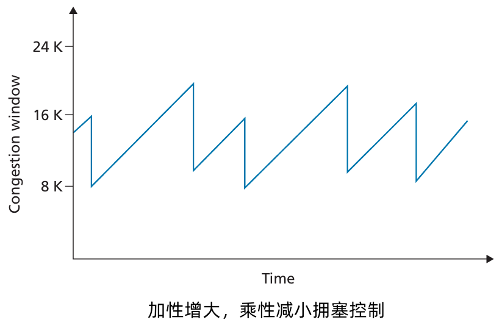


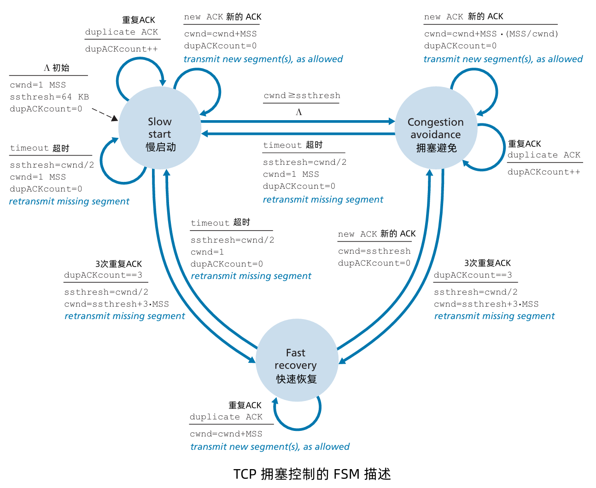

- 3 次重复 ACK → 快速恢复：`duplicate ACK` →  `cwnd = cwnd + MSS` ，发送新的报文段

  `new ACK` → `cwnd = ssthresh` 

- 超时 → 慢启动：`new ACK` → `cwnd = cwnd + MSS` （指数增长）

- `cwnd >= ssthresh` → 拥塞避免：`new ACK` → `cwnd = cwnd + MSS·(MSS/cwnd)` （线性增长）


**TCP 吞吐量**

- 在一个特定的往返间隔内，TCP 发送数据的速率是拥塞控制窗口与当前 RTT 的函数。

- 当窗口长度是 𝑤 字节，且当往返事件是 RTT 秒时，则 TCP 的发送速率大约是 𝑤/RTT 。

- 于是，TCP 通过每次经过 1 个 RTT 将 𝑤 增加 1 个 MSS 探测出额外的带宽，直到一个丢包事件发生为止。

- 当一个丢包事件发生时，用 𝑊 表示 𝑤 的值。假设在连续持续期间 RTT 和 𝑊 几乎不变，那么 TCP 的传输速率在 𝑊/(2×RTT) 到 𝑊/RTT 之间变化。

- 当速率增长至 𝑊/RTT 时，网络丢弃来自连接的分组；然后发送速率就会减半，进而每过一个 RTT 就发送速率增加  MSS/RTT ，直到再次到达 𝑊/RTT 为止。这一过程不断地自我重复。因为 TCP 吞吐量（即速率）在两个极值之间线性增长，所以我们有

  一条连接的平均吞吐量一条连接的平均吞吐量=0.75×𝑊RTT

- TCP 连接的吞吐量公式，该公式作为丢包率(L)、往返事件(RTT) 和最长报文段长度 (MSS) 的函数：

  一条连接的平均吞吐量一条连接的平均吞吐量=1.22×MSSRTT𝐿


**TCP 公平性**

- 公平性目标：如果 K 个 TCP 会话共享一条带宽为 R 的瓶颈链路，每个会话的平均速率为 R/K。

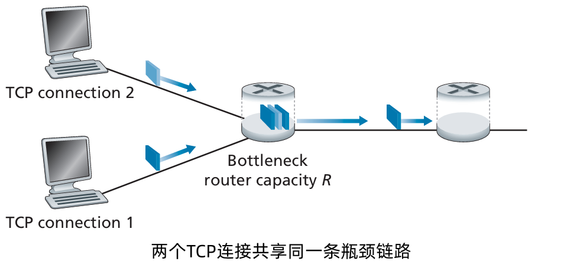

**为什么 TCP 是公平的？**

对于两个竞争的会话：

- 加性增大（Additive Increase）：随着吞吐量的增加，加性增大的斜率为 1。
- 乘性减小（Multiplicative Decrease）：当发生丢包时，吞吐量按比例减少。

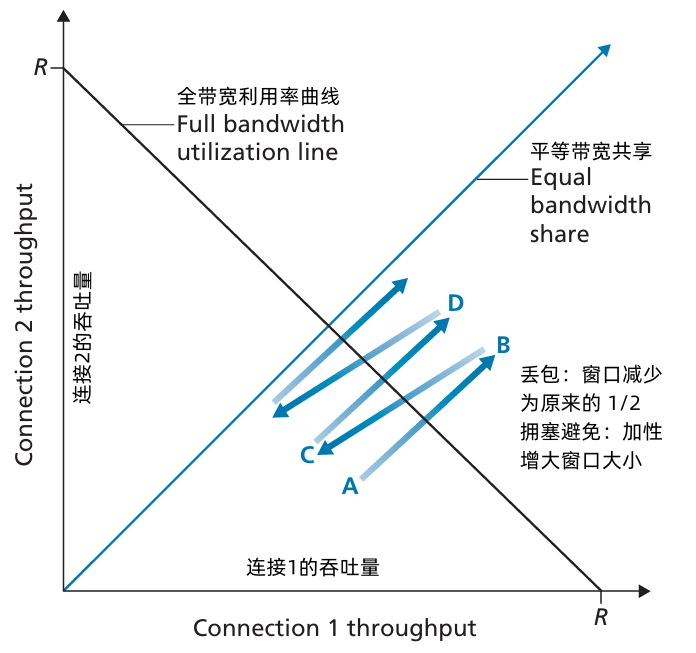


公平性和 UDP

- 多媒体应用通常不使用 TCP：因为不希望因为拥塞控制而被限制传输速率。
- 改用 UDP：以固定速率发送音频/视频数据，可以容忍一定的丢包。

公平性与并行TCP连接

- 应用可以在两个主机之间打开多个并行连接：例如Web浏览器。
- 示例：已有 9 个连接的 带宽为 R  的链路：
  - 新应用请求1 个 TCP 连接，获得速率 R/10
  - 新应用请求 11 个 TCP 连接，获得速率 R/2


显式拥塞通知（Explicit Congestion Notification, ECN）

基于网络辅助的拥塞控制：

- IP 数据报头部的两位标志位（Tos 字段）：

  由网络路由器标记，用于指示拥塞情况。

- 拥塞指示 被传递到 接受主机

- 接收主机（检测到 IP 数据报中的拥塞指示）在发送给发送方的 ACK 段设置 ECE（明确拥塞通告回显）字段，以通知发送方出现拥塞。

  接下来，TCP 发送方通过减半拥塞窗口 对 一个具有 ECE 拥塞指示的 ACK 做出反应，就像它对丢失报文段使用快速重传做出反应一样，并且在下一个传输的TCP 发送方到接收方的报文首部中对 CWR（拥塞窗口减缩）比特进行设置。


# 4 网络层：数据平面

## 4.1 网络层概述

- 发送方的 网络层 提取来自传输层的报文段，将每个报文段封装成一个数据报，然后向 接收方路由器发送该 数据报。
- 接收方的 网络层 接收来自发送方路由器的数据报，提取出传输层报文段，并将其向上交付给 H2 的运输层。

每台路由器的数据平面和控制平面的主要作用：

- 数据平面：从输入链路向其输出链路转发数据报；
- 控制平面：协调这些本地的每路由器转发动作，使得数据报沿着源和目的地主机之间的路由器路径最终进行端到端的传送。

### 4.1.1 转发和路由选择：数据平面和控制平面

网络层重要的两种功能：

- **转发** (forwarding)。当一个 分组 到达某路由器的一条输入链路时，该路由器必须将该分组移动到适当的输出链路。

  **转发** 是指将分组从一个 **输入链路接口** 转移到 **适当的输出链路接口** 的 **路由器本地动作**。转发发生的时间尺度很短（通常为几纳秒），因此通常用 **硬件** 来实现。

- **路由选择** (routing)。当 分组 从发送方流向接收方时，网络层必须决定这些分组所采用的路由或路径。计算这些路径的算法称为 **路由选择算法** (routing algorithm)。

  **路由选择** 是指 确定 **分组** 从 **源到目的地** 所采取的 **端到端路径** 的 **网络范围处理过程**。路由选择发生的时间尺度长的多（通常为几秒），因此通常用软件来实现。


每台网络路由器中有一个关键元素：**转发表**（forwarding table）

- 路由器检查 到达分组首部 的 一个或多个字段值，进而 使用这些首部值 在其 **转发表** 中索引，通过这种方法来转发分组。这些值对应存储在转发表项中的值，指出了该分组将被转发的路由器的输出链路接口。

1. 控制平面：传统的方法

   **路由选择算法** 决定了插入该 **路由器转发表的内容**。

2. 控制平面：SDN 方法

   软件定义网络（Software-Defined Networking, SDN），计算转发表并与路由器交互的控制器是用软件实现的。

   控制平面路由选择功能与物理的路由器是分离的，路由选择设备仅执行转发，而远程控制器计算并分发转发表。

   远程控制器可能实现在具有高可靠性和冗余的远程数据中心中，并可能由 ISP 或第三方管理。

   

### 4.1.2 网络服务模型

**网络服务模型** (network service model) 定义了分组在发送与接收端系统之间的端到端运输特性。

我们现在考虑网络层能提供的某些可能的服务。这些服务可能包括：确保交付、具有时延上界的确保交付、有序分组交付、确保最小带宽、安全性。

**因特网的网络层** 提供了单一的服务，称为 **尽力而为服务** (best-effort service)。使用尽力而为服务，传送的分组既不能保证端到端时延，也不能保证有最小的带宽。


## 4.2 路由器工作原理

网络层的 **转发功能**：将分组从路由器的入链路传送到适当的出链路。

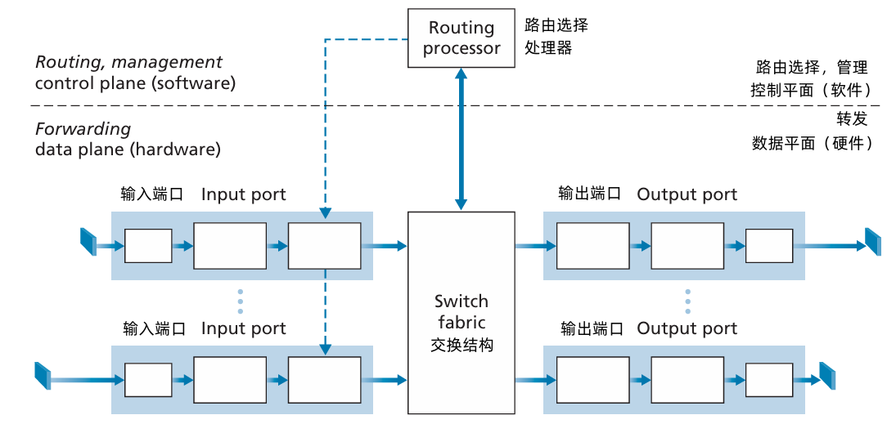

- 输入端口：

  输入端口（input port）执行几项重要功能。

  - 执行终结入物理链路的物理层功能。

  - 位于入链路远端的数据链路层交互来执行数据链路层功能。

  - 在输入端还要执行查找功能。通过查询转发表决定路由器的输出端口，到达分组通过路由器的 **交换结构** 转发到 **输出端口**。

    **控制分组** 从输入端口转发到 **路由选择处理器**。

    > 这里的 “端口”，指的是 路由器的 物理输入 和 输出接口。

- **交换结构**：交换结构将 路由器的输入端口 连接到它的 输出端口。这种交换结构完全包含在路由器之中，即它是一个网络路由器中的网络。

- **输出端口**：

  - 存储从交换结构接收的分组
  - 通过执行必要的链路层和物理层功能，在输出链路上传输这些分组。

  当一条链路是双向的，输出端口通常与该链路的输入端口成对出现在同一路线卡上。

- 路由选择处理器：

  - 路由选择处理器执行控制平面功能。
  - 在传统的路由器中，它执行路由选择协议，维护路由选择表与关联链路状态信息，并为该路由器计算转发表。
  - 在 SDN 路由器中，路由选择处理器（在其他活动中）负责与远程控制器通信，目的是接收由远程控制器计算的转发表项，并在该路由器的输入端口安装这些表项。
  - 路由选择处理器还执行网络管理功能。

路由器的输入端口、输出端口和交换结构几乎总是用硬件实现。


### 4.2.1 输入端口处理和基于目的地转发

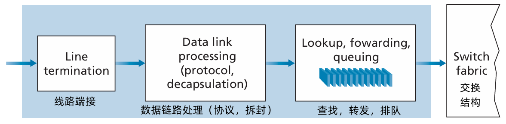

- 输入端口的 **线路端接功能** 与 **链路层处理** 实现了用于各个输入链路的 **物理层** 和 **链路层**。

- 路由器使用 **转发表** 来查找输出端口，使得到达的分组经过 交换结构 转发到该输出端口。

- ① **转发表** 是由 **路由选择处理器** 计算和更新的（使用 **路由选择协议** 与其他网络路由器中的路由选择处理器进行交互），或者② **转发表** 接收来自 **远程 SDN 控制器** 的内容。

- **转发表** 从 **路由选择处理器** 经过 **独立总线**（例如一个 PCI 总线）**复制** 到线路卡。

  使用在每个输入端口的 转发表副本，转发决策能够在每个输入端口本地做出。

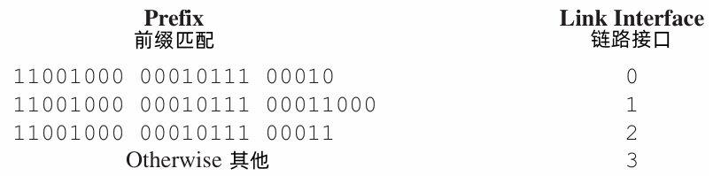

- 路由器分组目的地址的 **前缀** (prefix) 与该表中的表项进行匹配；如果存在一个匹配项，则路由器向该匹配项相关联的链路转发分组。
- 使用 **最长前缀匹配规则** (longest prefix matching rule)，即在该表中寻找最长的匹配项，并向与最长前缀匹配相关联的链路接口转发分组。
- 实践中，使用 三态内容可寻址存储器（Tenary Content Address Memory, TCAM）来查找。使用 TCAM，一个 32 比特 IP 地址被放入内存，TCAM 在基本常数时间内返回对该地址的转发表项的内容。


### 4.2.2 交换

- 交换结构位于一台路由器的核心部位。
- 通过交换结构，分组能实际地从一个输入端口 交换（转发）到里一个输出端口。

**三种交换技术**：

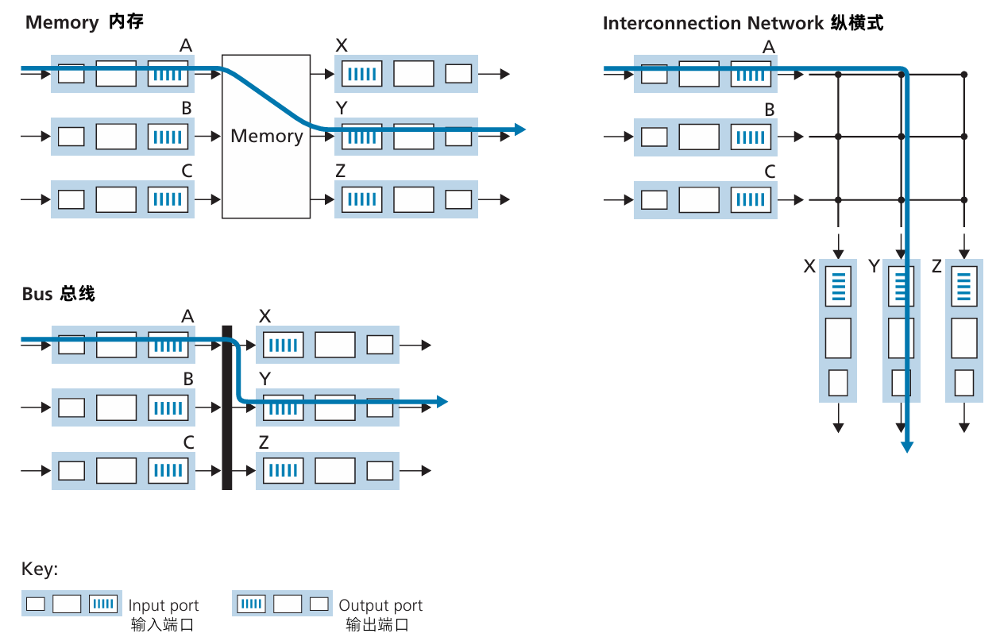

- 经内存交换。
  - 最简单、最早的路由器 是传统的计算机，在输入端口与输出端口之间的交换是在 CPU (路由选择处理器) 的直接控制下完成的。输入与输出端口的功能像在传统操作系统的 I/O 设备一样。
  - 一个分组到达一个输入端口时，该端口会先通过中断方式向路由选择器发出信号。于是，分组从输入端口处复制到处理器内存中，路由选择处理器从首部提取目的地址，在转发表中找到适当的输出端口，并将该分组复制到输出端口的缓存中。
  - 如果内存带宽为每秒可写进内存或从内存读出最多 B 个分组，则总的转发吞吐量必然小于 B/2。也要注意到：不能同时转发两个分组，即使它们有不同的目的端口。因为经过共享系统总线一次仅能执行一次内存读/写。
  - 许多现代路由器通过内存进行交换。然而，与早期路由器的一个主要差别是，目的地址的查找和将分组存储（交换）进适当的内存存储位置是由输入线路卡来处理的。
- 经总线交换。
  - 输入端口经一根 **共享总线** 将分组直接传送到 **输出端口**，不需要路由选择处理器的干预。通常按以下方式完成该任务：让 **输入端口** 为 分组 **预先** 计划一个交换机内部标签（首部），指示 **本地输出端口**，使分组在总线上传送和传输到输出端口。
  - 该分组能由所有输出端口收到，但 **只有与该标签匹配的端口才能保存该分组**。
  - 然后标签在输出端口被去除，因为其仅用于交换机内部来跨越总线。
  - 如果多个分组同时到达路由器，每个位于不同的输出端口，除了第一个分组外其他所有分组必须等待，因为一次只有一个分组能够跨越总线。因为每个分组必须跨过单一总线，故 **路由器的交换带宽受总线速率的限制**。
- 经互联网络交换。
  - 克服单一、共享式总线带宽限制：使用一个更复杂的互联网络。
  - 纵横式交换机：以一种由 2N总线组成的互联网络，它连接 N 个输入端口和 N 个输出端口。
  - **每条垂直的总线** 在交叉点与每条水平的总线交叉，交叉点通过 **交换结构控制** (其逻辑是交换结构自身的一部分) 能够在任何时候开启和闭合。
  - 当分组到达端口A，需要转发到端口 Y 时，交换机控制器闭合总线 A 和 Y 交叉部位的交叉点，然后端口 A 在其总线上发送该分组，该分组仅由总线 Y 接收。注意到来自端口 B 的一个分组在同一时间能够转发到端口 X，因为 A 到 Y 和 B 到 X 的分组使用不同的输入和输出总线。
  - 纵横式网络能够并行转发多个分组，是 **非阻塞的** (non-blocking)，即 只要没有其他分组当前被转发到该输出端口，转发到输出端口的分组将不会被到达输出的分组阻塞。
  - 如果来自不同输入端口的两个分组其目的地为相同的输出端口，则一个分组必须在输入端等待，因为在某给时刻给定总线仅能够转发一个分组。


### 4.2.3 输出端口处理

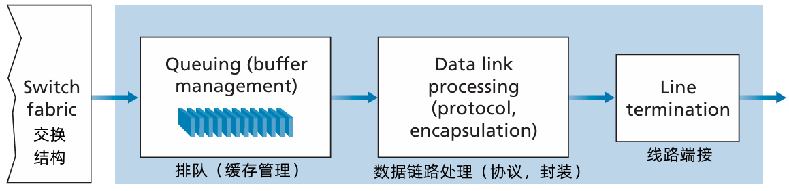

输出端口

- 处理已经存放在输出端口内存的分组（选择和取出排队的分组进行传输）
- 将分组发送到输出链路（执行所需的链路层和物理层的传输功能）


### 4.2.4 何处出现排队

- 在输入端口和输出端口处都可以形成分组队列。
- 随着这些队列的增长，路由器的缓存空间最终将会耗尽，并且当无内存可用于存储到达的分组时将会出现 丢包（packet loss）。

定义：

- 输入线路速度、输出线路速度：𝑅line （单位为每秒分组数），并且有 N 个输入端口 和 N 个输出端口。
- 交换结构传输速率 𝑅switch 为从输入端口到输出端口能够 移动分组 的速率。

> 如果 𝑅switch 比 𝑅line 快 N 倍，则在输入端口处仅会出现微不足道的排队。这是因为即使在最坏的情况下，所有N条输入线路都在接收分组，并且所有的分组将被转发到相同的输出端口，每批N个分组（每个输入端口一个分组）也能够在下一批到达前通过交换结构处理完毕。

1. **输入排队**

   - 如果 交换结构 不能快得（相对于输入线路速度而言）使所有到达分组无时延地通过它传送：在输入端口也将会出现分组排队，因为到达的分组必须加入输入端口队列。

   考虑纵横交换结构，并假定：①所有链路速度相同；②一个分组能 够以 一条输入链路 接收一个分组所用的相同的时间量，从任意一个 输入端口 传送到给定的 输出端口；③分组按 FCFS 方式，从一指定输入队列移动到其要求的输出队列中。

   - 只要其输出端口不同，多个分组可以被并行传送。
   - 如果位于两个输入队列前端的两个分组是发往同一个输出队列的，则其中一个分组将被阻塞，**且必须在输入队列中等待**，因为交换结构一次只能传送一个分组到某指定端口。

   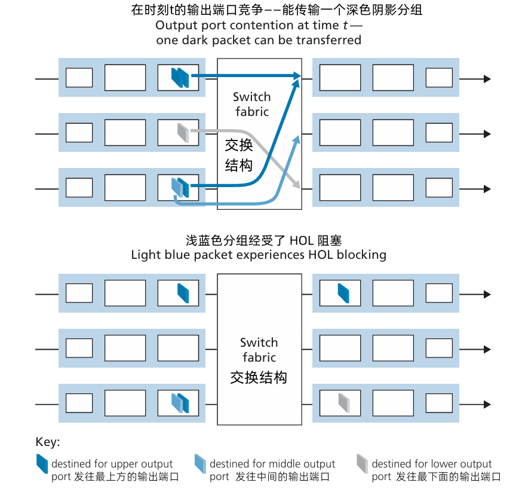 

   上图显示了一个例子。输入队列前端的两个分组（深蓝色）要发往同一个右上角输出端口。假定该交换机构决定发送左上角队列前端的分组。

   在这种情况下，左下角队列中的深蓝色分组必须等待。不但该分组需要等待，排在它后面的浅蓝色分组也要等待，即使浅蓝色分组的输出端口无竞争。这种现象称为 输入排队交换机 中的 **线路前部阻塞** (Head-Of-the-Line, HOL)：**在一个输入队列中排队的分组必须等待通过交换结构发送**（即使输出端口是空闲的），**因为它被位于线路前部的另一个分组所阻塞**。

2. 输出排队

   假定 𝑅switch 比 𝑅line 快 N 倍，并且到达 N 个输入端口的每个端口分组，其目的地是相同的输出端口。在这种情况下，在向输出链路发送一个分组的时间内，将有 N 个新分组到达该输出端口（N 个输入端口的每个都达到1个）。因为输出端口在一个单位时间（该分组的传输时间）内仅能传输一个分组，这 N 个到达分组必须排队（等待）经输出链路传输。在正好传输 N 个分组（这些分组是前面正在排队的）之一的时间，可能又到达 N 个分组，等等。所以，分组队列能够在输出端口形成，即使交换结构比端口线路速率快 N 倍。

   最终，排队的分组数量能够变得足够大，耗尽输出端口的可用内存。

   当没有足够的内存来缓存一个入分组时，就必须做出决定：要么丢弃到达的分组（**弃尾** (drop-tail) 的策略），要么删除一个或多个已排队的分组为新来的分组腾出空间。

   在某些情况下，在缓存填满之前便丢弃一个分组（或在其首部加上标记），这可以向发送方提供一个拥塞信号。

   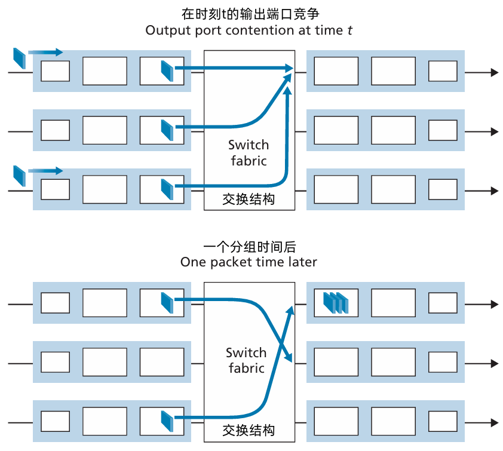 

   上图展示了 **输出端口的排队情况**。

   - 在 时刻 t，每个入端输入端口都到达了一个分组，每个分组都是发往最上侧的输出端口。假设线路速度相同，交换机以 3 倍于线路速度的速度运行，一个时间单位以后，所有三个初始分组都被传送到输出端口，并排队等待传输。
   - 在下一个时间单位中，这三个分组的一个将通过输出链路发送出去。同时又有两个新分组到达交换机入端，这些分组之一要发往最上侧的输出端口，这样的后果是，输出端口的 **分组调度** (packet scheduler) 在这些排队分组中选择一个分组来传输。

   

   假定需要路由器缓存来吸收流量负载的波动，一个自然而然的问题就是：需要多少缓存？

   - 缓存数量 (B) 应当等于平均往返时延 (RTT，比如说 250ms) 乘以 链路的容量 (C)。

     这个结果是基于相对少量的 TCP 流的排队动态性分析得到的。

     **例**：250ms RTT 的 10Gpbs 的链路需要的缓存量等于 B = RTT*C = 2.5 Gb

   - 当有大量的 TCP 流 (N 条)流过一条链路时，缓存所需要的数量是 𝐵=RTT⋅𝐶/𝑁 。

   

   

   ### 4.2.5 分组调度

   - **分组调度**：在排队分组中选择一个分组发往链路。

   1. **先进先出**：按照分组到达输出链路队列的相同次序来选择分组在链路上传输。

      - 丢弃策略
        - 弃尾 (tail drop)
        - 优先级
        - 随机

   2. **优先权排队**：到达输出链路的分组被分类放入输出队列的优先权类。每个优先权类通常有自己的队列。当选择一个分组传输时，优先权队列规则将从队列为非空的最高优先权类中传输一个分组。在同一优先权类的分组之间的选择通常以 FIFO 方式完成。

      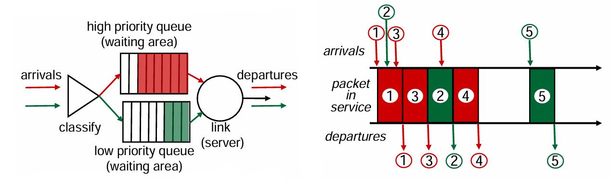

      在 **非抢占式优先权排队** (non-preemptive priority queuing) 规则下，一旦分组开始传输，就不能打断。

   3. **循环调度** (round robin scheduling)：

      - 多个类
      - 循环扫描 每个类的队列，给每个类轮流发送一个完整的分组

      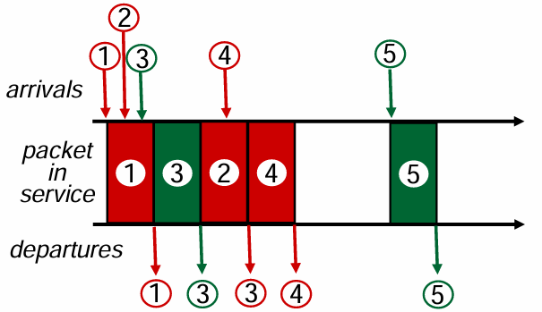 

   4. **加权公平排队** (Weighted Fair Queuing, WFQ)

      - 通用形式的循环排队
      - 到达的分组被分类在相应类的等待区域排队。
      - WFQ 调度器以循环的方式为每个类服务。
      - 每个类在任何时间间隔内可能收到不同数量的服务。每个类 𝑖 被分配一个权 𝑤𝑖 。使用 WFQ 方式，在类 𝑖 有分组要发送的任何时间间隔中，第 𝑖 类将确保接收到的服务部分等于 𝑤𝑖/(∑𝑤𝑗)。

      

## 4.3 网际协议

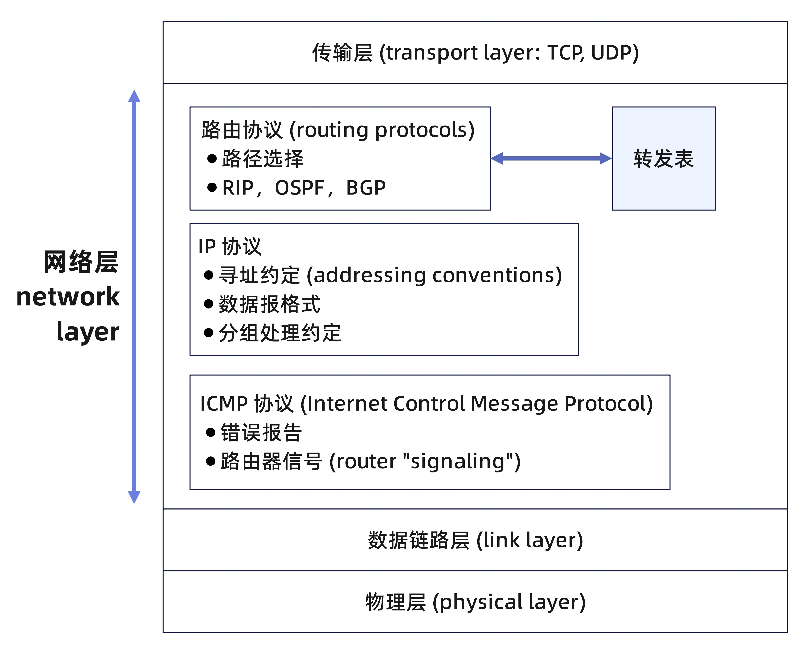


### 4.3.1 IPv4 数据报格式

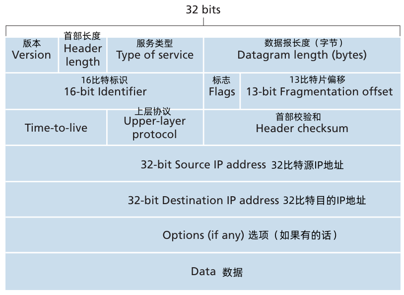

网络层分组称为：**数据报** (datagram) 。

- 版本：IP 协议的版本号

- 16 比特标识、标志、13比特片偏移：用来 对分组 分片/组合。

- time-to-live (TTL) 寿命：用来确保数据报不会永远在网络中循环。当一台路由器处理数据报时，该字段的值减 1。若 TTL 字段减为 0，则该数据报必须丢弃。

- **上层协议**。该字段通常仅当一个 IP 数据报到达其最终目的地才会有用。该字段值指示了 IP 数据报的数据部分应该交给哪个特定的传输层协议。

  - 值为 6 表明数据部分交给 TCP
  - 值为 17 表明数据部分交给 UDP

- **首部检验和**。首部检验和用于帮助路由器检测收到的 IP 数据报中的比特错误。

  将首部中的每2个字节当作一个数，对这些数求和，得到进位作为最地位和计算结果相加。最后对和取反码。

  - 为什么 TCP/IP 在运输层与网络层都执行差错检测？
    - IP 层只对  IP 首部计算了检验和。
    - TCP/UDP 检验和是第整个 TCP/UDP 报文段进行的。

- **源和目的 IP 地址**：当某源生成一个数据报时，它在源IP字段中插入它的IP地址，在目的 IP 地址字段中插入其最终目的地的地址。通常源主机通过 DNS 查找决定目的地址。

- 选项。

- **数据（有效载荷）**。大多数情况下，IP 数据报中断 数据字段包含要交付给目的地的传输层报文段（TCP 或 UDP）。然而，该数据字段也可承载其他类型的数据，如  ICMP 报文。

如果无选项，IP 数据报有总长为 20 字节的首部。如果数据报承载一个 TCP 报文段，则每个（无分片）数据报共承载了总长为 40 字节的首部（20字节的 IP 首部 + 20字节的 TCP 首部）以及应用层报文。

### 4.3.2 IPv4 数据报分片

- 并不是所有链路层协议都能承载相同长度的网络层分组。

- 一个链路层帧能承载的最大数据量叫做 **最大传送单元** (Maximum Transmission Unit, MTU)。

- 因为每个 IP 数据报 封装在链路层帧中，从一台路由器传输到下一个路由器，故链路层协议的 MTU 严格地限制着 IP 数据报的长度，对 IP 数据报的长度具有严格限制并不是主要问题。

  问题在于发送方与目的地路径上的每段链路可能使用不同的链路层协议，且每种协议可能具有不同的 MTU。

- 当 从链路发出的 MTU 小于 IP 数据报的长度时，需要将 IP 数据报的数据分片成两个或更多个较小的 IP 数据报，用单独的链路层帧封装这些小的 IP 数据报，然后通过输出链路发送这些帧。

  每个小的数据报 称为 **片** (fragment)

- 当目的主机从相同源收到一系列数据报时，需要确定这些数据报中的某些是否是一些原来较大的数据报的片。如果某些数据报是这些片的话，则必须进一步确定何时收到最后一片，并且将这些接收到的片拼接到一起以形成初始的数据报。

  **注**：只在 **最后的目的主机** 进行 **组装** 工作。

- IP 数据报的首部的 标识、标志、片偏移字段 用于关联 片。

- 当生成一个数据报时，发送主机在为该数据报设置源和目的地址的同时贴上标识号，发送主机通常将它发送的每个数据报的标识号加 1。 当某路由器需要对一个数据报 **分片** 时，形成的每个数据报（即片）具有 **初始数据报的源地址、目的地址与标识号**。 当 目的地 从同一发送主机收到一系列数据报时，它能够检查 **数据报的标识号** 以确定哪些数据报实际上是同一较大数据报的片。 

- 最后一个片的标志比特设置为0，其他片的标志比特设置为 1。

- 使用偏移字段指定该片应放在初始IP数据报的哪个位置。

  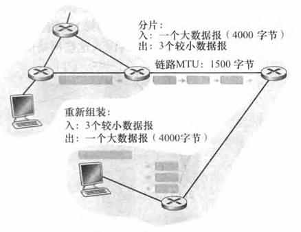 

  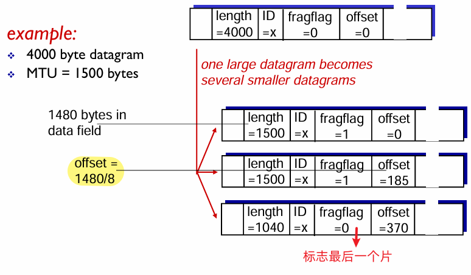 

  

  

### 4.3.3 IPv4 编址

- 一台路由器因此有多个接口，每个接口有其链路。因为每台主机与路由器都能发送和接收 IP 数据报， IP要求每台主机和路由器接口拥有自己的 IP地址。 因此，从技术上讲，一个 IP 地址与一个 **接口** 相关联，而不是与包括该接口的主机或路由器相关联。

- 每个 IP 地址长度为 32 比特（等价为 4 字节），因此总共有 232 个可能的 IP 地址。

- 这些地址 按 **点分十进制记法** (dotted-decimal notation) 书写，即 地址中的每个字节用它的 **十进制** 形式书写，各字节间以 **句点** 隔开。

  例如，考虑IP地址 `193.32.216.9`， 193 是该地址的第一个 8 比特的十进制等价数， 32 是该地址的第二个 8 比特的十进制等价数，依次类推。 因此，地址 `193.32.216.9` 的二进制记法是：

  `11000001 00100000 11011000 00001001` 

- 在全球因特网中的每台主机和路由器上的每个接口，都必须有一个全球唯一的 IP地址 （在NAT后面的接口除外）。然而，这些地址不能随意地自由选择。 **一个接口的IP地址的一部分需要由其连接的子网来决定**。

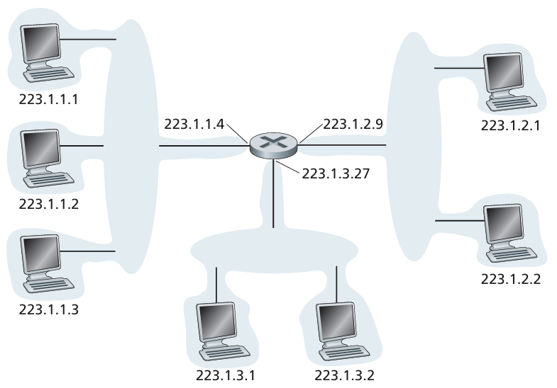 

图中：一台路由器（具有 3 个接口）用于互联 7 台主机。左上侧的 3 台主机以及它们连接的路由器端口，都有一个形如 223.1.1.xxx 的 IP 地址。这 4 个接口通过一个并不包含路由器的网络互联起来。

> 该网络可能由一个以太网 LAN 互联，在此情况下，这些接口通过以太网交换机互联，或者通过一个无线接入点互联。

- 互联的这3个主机接口与1个路由器接口的网络，形成一个 **子网** (subnet)
- IP 编址为这个子网分配一个地址 `223.1.1.0/24` ，其中的 `/24` 记法，有时称为 **子网掩码** (network mask)，指示 32 比特中的最左侧 24 比特定义了子网地址。因此子网 `233.1.1.0/24` 由 3 个主机接口和 1 个路由器接口组成。任何其他要连到 `233.1.1.0/24` 网络的主机都要求其地址具有 `233.1.1.xxx` 的形式。

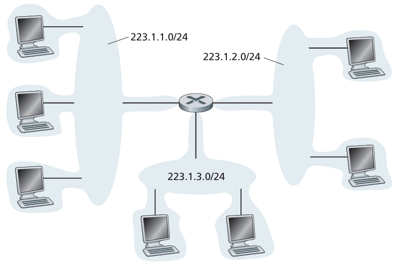 

上图中，存在 3 个 IP 子网。

- 一个子网的IP定义并 **不局限于** 连接多台主机到一个路由器接口的以太网段。

确定子网：分开主机和路由器的每个接口，产生几个隔离的网络岛，使得接口端接这些隔离的网络的端点。这些隔离的网络中的每一个都叫做一个 **子网** (subnet)。

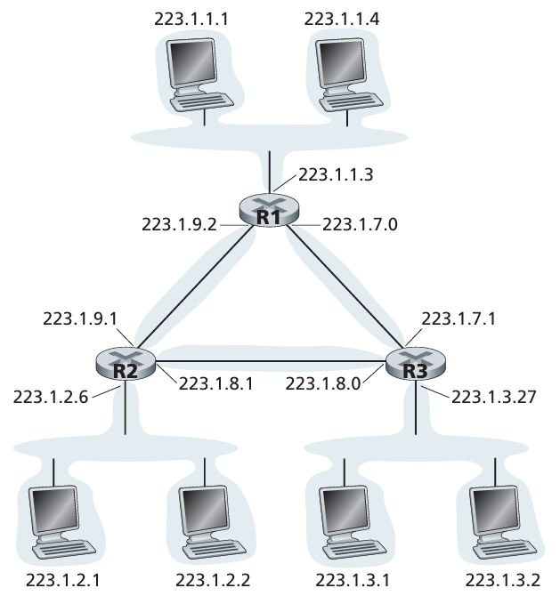 

上面的互联系统中，可以得到 6 个子网。


因特网的地址分配策略：**无类别域间路由选择**（Classless Interdomain Routing, **CIDR**）

- 使用子网寻址时，32比特地址被划分为两部分，具有点分十进制数形式 `a.b.c.d/x` ，其中 `x` 指示了地址的第一部分中的比特数。
- 形式为 `a.b.c.d/x` 的地址的 `x` 最高比特构成了 IP 地址的网络部分，并且经常被称为该地址的前缀 (prefix) （或 **网络前缀**）。
- IP广播地址 `255.255.255.255`

1. **获取一块地址**

   为了获取一块IP地址用于一个组织的子网内， 某网络管理员也许首先会与他的ISP联系，该ISP 可能会从已分给它的更大地址块中提供一些地址。例如， 该ISP也许自己已被分配了地址块200.23. 16.0/20。 该 ISP 可以依次将该地址块分成8 个长度相等的连续地址块，为本ISP 支持的最多达8个组织中的一个分配这些地址块中的一块．如下所示。

   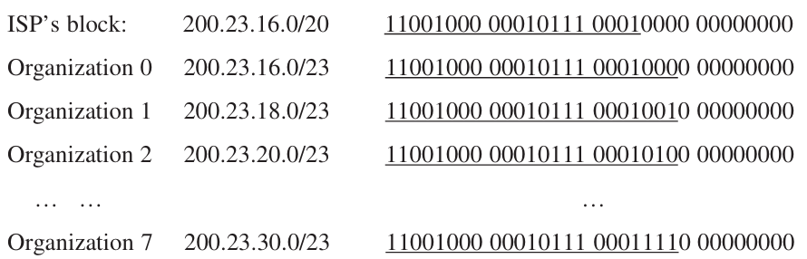

   

2. 获取主机地址：**动态主机配置协议** 

   - 某组织一旦获得一块地址，它就可以为本组织内的主机与路由器接口逐个分配 IP 地址。系统管理员通常手工配置路由器中的 IP 地址。**主机地址配置**  更多的使用 **动态主机配置协议** (Dynamic Host Configuration, DHCP) 来完成。

     > 又称，即插即用协议 (plug-and-play protocol) 或 零配置 (zeroconf) 协议。

   - DHCP 允许主机自动获取一个 IP 地址。网络管理员能够配置 DHCP，以使得给定主机每次与网络连接时能得到一个相同的 IP 地址，或者某主机将被分配一个临时的 IP 地址，每次与网络连接时该地址也许是不同的。

   - 除了主机IP地址分配外， DHCP还允许一台主机得知其他信息，例如它的子网掩码、它的第一跳路由器地址 （常称为默认网关）与它的本地 DNS 服务器的地址。

   DHCP 是一个 客户-服务器 协议。客户通常是新到达的主机，它要获得包括自身使用的 IP 地址在内的网络配置信息。简单情况下，每个子网有一个 DHCP 服务器。

   > 如果某子网没有服务器，则需要一个 DHCP 中继代理（通常是一台路由器），这个代理知道用于该网络的 DHCP 服务器的地址。

   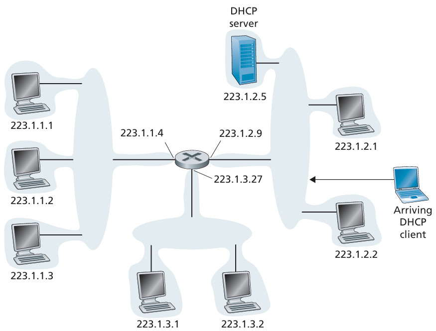 

   DHCP 协议是一个 4 个步骤的过程：

   - DHCP 服务器发现。

     新到达的主机，在 UDP 分组向端口 67 发送 **DHCP 发现报文** (DHCP discover message)，DHCP 客户生成包含 DHCP发现报文 的 IP 数据报，其中使用 **广播目的地址 255.255.255.255** 并且使用 **“本主机” 源 IP 地址 0.0.0.0**。

     DHCP 客户将该 IP 数据报传递给链路层，链路层然后将该帧广播到所有与该子网连接的节点。

   - DHCP 服务器提供。

     DHCP 服务器收到一个 DHCP 发现报文，用 **DHCP提供报文** (DHCP offer message) 向客户做出响应。该报文向该子网的所有节点广播，仍然使用 **IP 广播地址 255.255.255.255**。

     - 因为在子网中可能存在几个DHCP服务器，该客户也许会发现它处于能在几个提供者之间进行选择的优越位置。
     - 每台服务器 提供的报文 包含有收到的 发现报文的事务ID、向客户推荐的 IP 地址、 网络掩码以及 IP地址租用期 (address lease time) , 即 IP 地址有效的时间量。

   - DHCP 请求。

     新到达的客户从一个或多个服务器提供中选择一个，并向选中的服务器提供 **DHCP 请求报文** (DHCP request message) 进行响应，回显配置的参数。

   - DHCP ACK。

     服务器用 DHCP ACK 报文 (DHCP ACK message) 对DHCP 请求报文进行响应，证实所要求的参数。

   一旦客户收到DHCP ACK后，交互便完成了，并且该客户能够在租用期内使用 DHCP 分配的IP 地址。 因为客户可能在该租用期超时后还希望使用这个地址，所以 DHCP 还提供了一种机制以允许客户更新它对一个IP地址的租用。

   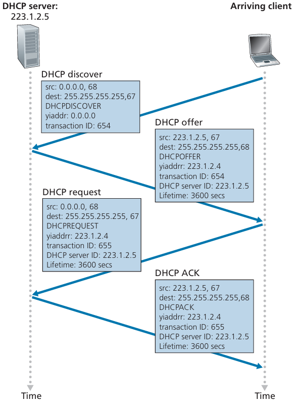

 

### 4.3.4 网络地址转换

**网络地址转换** (Network Address Translation, NAT)

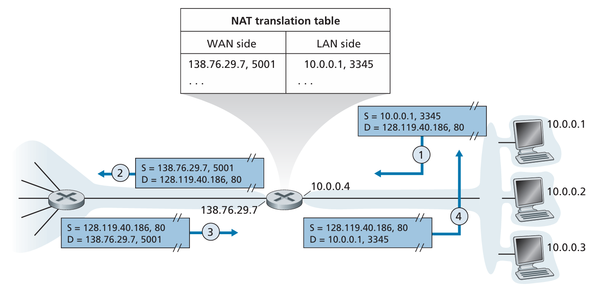

- 所有离开本地网络的数据报有相同的单一源 NAT IP 地址：`138.76.29.7` ，不同的源端口号。

动机：局域网只需要一个IP地址，因为外部世界不关心：

- 不需要从ISP获得一系列地址：所有设备只需一个IP地址
- 可以在不通知外部世界的情况下更改局域网中设备的地址
- 可以更改ISP而不需要更改局域网中设备的地址
- 局域网内的设备不是显式可寻址的，对外部世界不可见（增加安全性）

NAT 路由器需要实现：

- 发出的数据报：把发出的数据报中的 `(source IP address, port #)` 替换为 `(NAT IP address, new port #)`。这样，远程客户端/服务器将使用 `(NAT IP address, new port #)` 作为目的地址响应。
- 将每个 `(source IP address, port #)` 到 `(NAT IP address, new port #)`的替换对记录在 **NAT 转换表** (NAT translation table) 中
- 收到的数据报：根据 NAT 转换表中存储的替换对，将 `(NAT IP address, new port #)` 替换为 `(source IP address, port #)` 。
- 端口号字段为 16 比特长，NAT 协议可支持超过 60000 个并行使用路由器广域网一侧单一 IP 地址的连接。


### 4.3.5 IPv6

最初动机：由于新的子网和 IP 节点以惊人的增长率连到因特网上（并被分配唯一的IP地址）， 32 比特的 IP地址空间即将用尽。

额外动机：首部格式辅助加快 处理/转发 的过程。首部改变以支持 QoS

1. **IPv6 数据报格式**

- 固定 40 比特首部

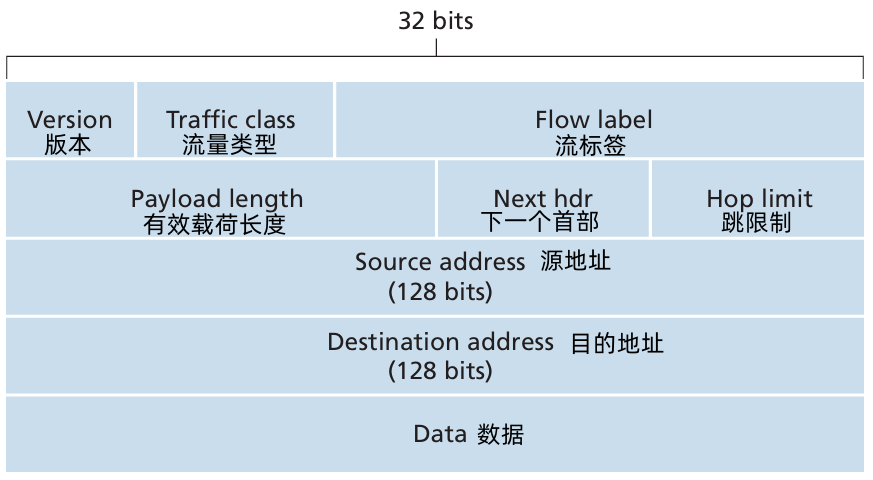

- 扩大的地址容量：
  - IPv6 将 IP 地址长度从 32 比特增加到 128 比特。
  - 引入 **任播地址** (anycast address) 的新型地址。这种地址可以将数据报交付一组主机的任意一个。
- 简化高效的 40 字节首部：允许路由器更快地处理 IP 数据报。
- 流标签：区分同一个 “流” 中的数据报。
- 版本：IPv6 的这个字段设置为 6
- 流量类型 （优先级）：允许源端机器为不同的数据分组指定不同的优先级别，以便路由器可以根据这些优先级来对数据流进行不同的处理。
- 有效载荷长度：16 比特值作为一个无符号整数，给出了 IPv6 数据报跟在定长 40 字节数据报首部后面的字节数量。
- 下一个首部：标识数据报的内容（数据字段）交付给哪个协议（如 TCP 或 UDP），该字段使用与 IPv4 首部中协议字段相同的值。
- 跳限制：转发数据报的每台路由器对该字段的内容减1，如果跳限制计数达到 0，则该数据将被丢弃。
- 数据：这是 IPv6 数据报的有效载荷部分。


从 IPv4 的其他改变：

- 分片/重新组装。

  IPv6 不允许中间路由器上进行分片与重新组装。这种操作 **只能在源与目的地执行**。如果 路由器收到的 IPv6 数据报太大而不能转发到链路上的话，则路由器只丢带该数据报，并向发送方发挥一个 **“分组太大” 的 ICMP 差错报文**。

  于是发送方能够使用较小长度的 IP数据报重发数据。分片与重新组装是一个耗时的操作，将该功能从路由器中删除并放到端系统中，大大加快了网络中的IP转发速度。

- 首部检验和。

  因为因特网中的运输层和数据链路层协议执行了检验操作，所以在 IPv6 中去除检验和。

- 选项。

  不是标准 IP 首部的一部分，但它并没有消失，可能出现在 IPv6 首部中由 “下一个首部” 指出的位置上。


1. **从 IPv4 到 IPv6 的迁移**

广泛使用的方法：**建隧道** (tunneling)

- 将两台 IPv6 路由器之间的中间 IPv4 路由器的集合称为一个 **隧道** (tunneling)，借助于隧道，在隧道发送端的 IPv6 节点可将整个 IPv6 数据报放到一个 IPv4 数据报的数据（有效载荷）字段中。

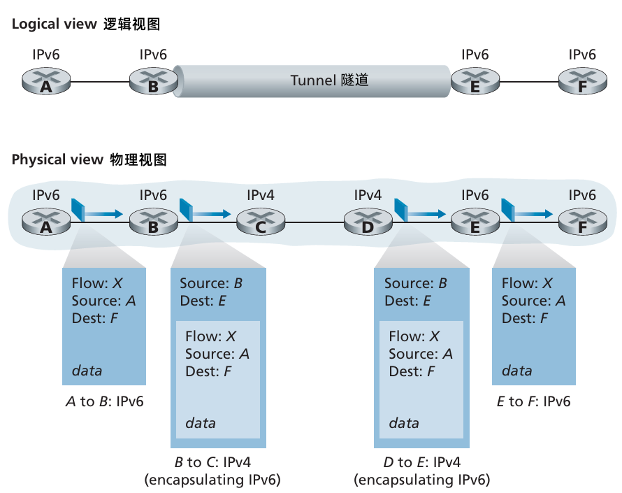


## 4.4 通用转发和 SDN

将基于目的地转发总结为两个步骤：

1. 查找目的 IP 地址（“匹配”）
2. 将分组发送到特定输出端口的交换结构（“动作”）

在通用转发中，一张 匹配加动作表 将此前的转发表一般化。因为能够使用网络层和/或链路层源和目的地址做出转发决定，所以显示在下图中的转发设备更为准确地描述为 “分组交换机”。

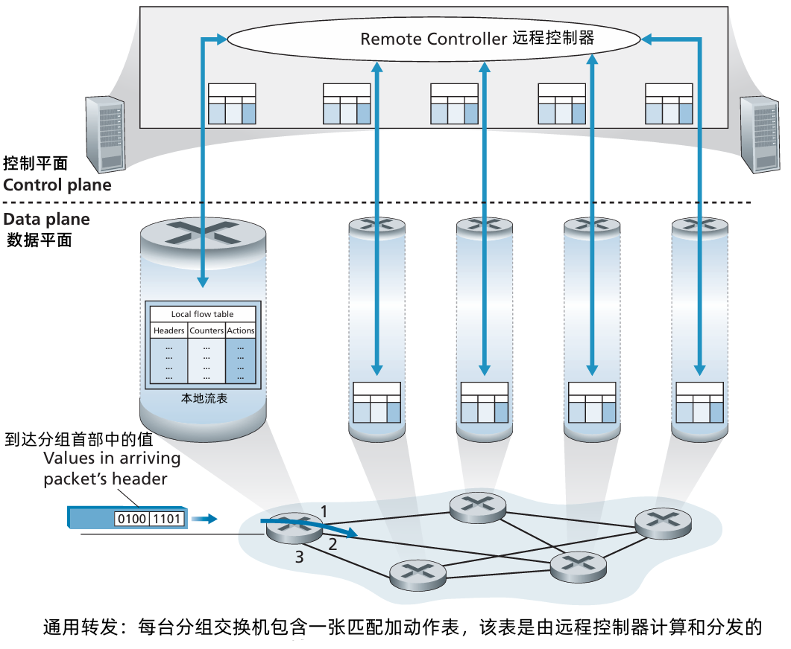

OpenFlow 标准，是匹配加动作转发抽象、控制器以及更为一般的 SDN 革命等概念。

匹配加动作转发表 在 OpenFlow 中称为 流表 (flow table)，它的每个表项包括：

- **首部字段值的集合**。入分组将与之匹配。
- **计数器集合**。当分组与流表项匹配时更新计数器。
- 当分组匹配流表项时 **所采取的动作集合**。这些动作可能将分组转发到给定的输出端口，丢弃该分组、复制该分组和将它们发送到多个输出端口，和/或重写所选的首部字段。

### 4.4.1 匹配

OpenFlow 1.0 流表的分组匹配字段：

下图显示了11个分组首部字段和入端口 ID，该 ID 能被 OpenFlow 1.0 中的匹配加动作规则所匹配。

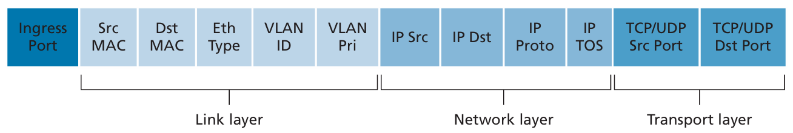

- 入端口是指分组交换机上接收分组的输入端口。
- 流表项也有通配符。例如一个流表中的 IP 地址 `128.119.*.*` 将匹配其地址的前16比特为 128.119 的任何数据报所对应的地址字段。
- 每个流表项也有相应的优先权。如果一个分组匹配多个流表项，选定的匹配和对应的动作将是其中有最高优先权的那个。
- 到并非一个IP首部中的所有字段都能被匹配。 

观察：

1. OpenFlow 的匹配抽象允许对来自三个层次的协议首部所选择的字段进行匹配。
2. OpenFlow 能使设备能够等价于 路由器（第三层设备）转发数据报 以及 交换机（第二层设备）转发帧。
3. 以太网类型字段对应于较高层协议（例如 IP），利用该字段分解该帧的载荷。

### 4.4.2 动作

- 转发：一个入分组可以转发到一个特定的物理输出端口，广播到所有端口（分组到达的端口除外），或通过所选的端口集合进行多播。
- 丢弃：没有动作的流表项表明某个匹配的分组应当被丢弃。
- 修改字段：在分组被转发到所选的输出端口之前，分组首部10个字段（除了IP协议字段外的所有第二、三、四层的字段）中的值可以重写。


### 4.4.3 匹配加动作操作中的 OpenFlow 例子

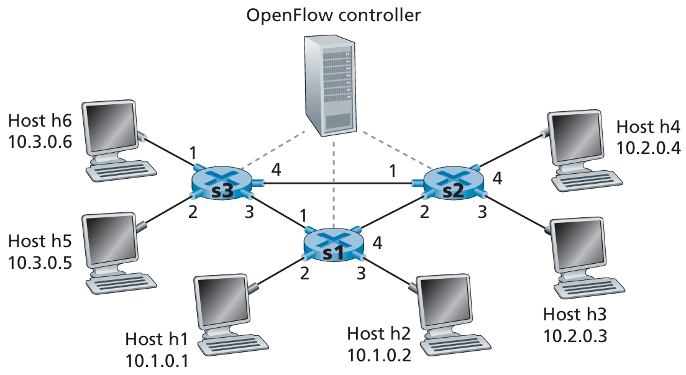

图中：具有3台分组交换机，6台主机 和 1台 OpenFlow 控制器 的 OpenFlow 匹配 加动作网络。

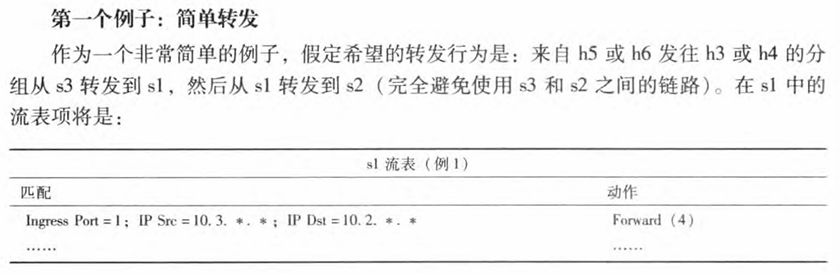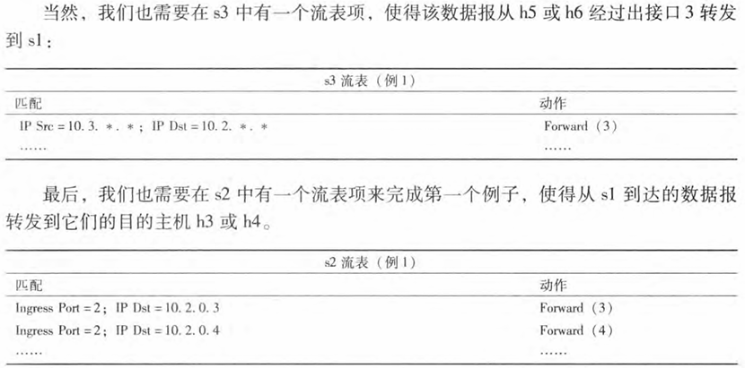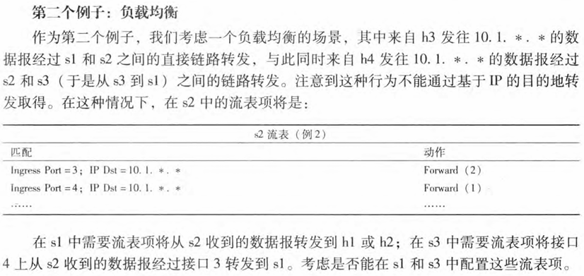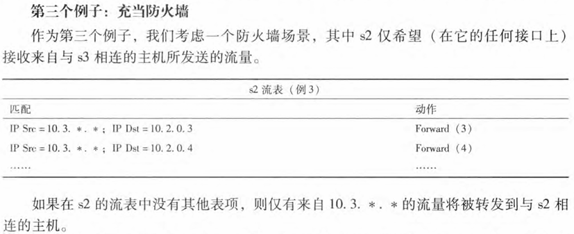


# 5 网络层：控制平面

## 5.1 概述

本章，学习转发表、流表是如何计算、维护和安装的。

在4.1节网络层概述中，这些工作有两种可能的方法：

- **每路由控制** (Per-router control)：**每台路由器**中运行一种路由选择算法。

  - 每台路由器中都包含 **转发** 和 **路由选择** 功能。
  - 每台路由器有一个路由选择组件，用于与其他路由器的路由选择组件通信，以计算其转发表的值。
  - OSPF 和 BGP 协议都是基于这种每路由器的方法进行控制的。

  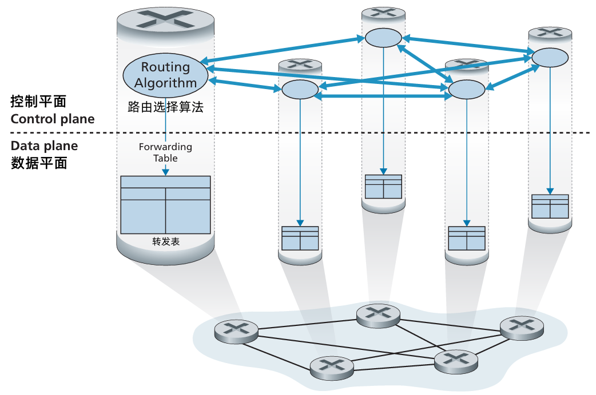

- **逻辑集中式控制**。逻辑集中式控制器计算并分发转发表以供每台路由器使用。

  - 通用的 “匹配加动作” 抽象允许执行传统的 IP 转发以及其他功能（负载均衡、防火墙功能、NAT）的丰富集合，而这些功能之前是在单独的中间盒中实现的。
  - 该控制器经一种定义良好的协议与每台路由器的 **控制代理**(CA) 进行交互，以配置和管理该路由器的转发表。
  - CA 一般具有最少的功能，其任务是与控制器通信并且按控制器命令行事。
  - 这些 CA 既不能直接相互交互，也不能主动参与计算转发表。
  - “逻辑集中式” 控制意味着像 即使服务可能通过多个服务器实现，以达到容错和性能可扩展性的目的，路由控制服务仍像访问单个中央服务点一样进行访问。
  - SDN 采用了逻辑集中式控制的概念。


## 5.2 路由选择算法

**路由选择算法** (routing algorithm)

- 目的：从发送方到接收方的过程中确定一条通过路由器网络的好的路径（等价于 路由）。

- 通常，一条好路径指具有最低开销的路径。

- 图 G = (N, E)：一个 N 个节点和 E 条边的集合

  对于 E 中的任一条边 (x, y)，我们用 c(x, y) 表示节点 x 和 y 间边的开销。如果节点对 (x, y) 不属于 E，则 c(x, y) = ∞ 。此处考虑无向图，c(x, y) = c(y, x)。

  如果 (x, y) 属于 E，节点 y 也被称为 节点 x 的邻居。

  在 G = (N, E) 中的一条路径 (path) 是一个节点序列 (𝑥1,𝑥2,⋯,𝑥𝑝) ，这样每一对 (𝑥1,𝑥2),(𝑥2,𝑥3),⋯,(𝑥𝑝−1,𝑥𝑝) 是 E 中的边。路径 (𝑥1,𝑥2,⋯,𝑥𝑝) 的开销只是沿着路径所有边的开销的总和，即 𝑐(𝑥1,𝑥2)+(𝑥2,𝑥3)+⋯+(𝑥𝑝−1,𝑥𝑝) 。给定任何两个节点 x 和y，通常在这两个节点之间有多条路径，每条路径都有一个开销。这些路径中的一条或多条是 **最低开销路径** (least-cost path)。

路由选择算法的分类：根据算法是集中式还是分散式来划分。

- 集中式路由选择算法 （centralized routing algorithm)
  - 用 **完整的**、**全局的** 网络知识 计算出从源到目的地之间的最低开销路径。
  - 该算法以 **所有节点之间的连通性** 及 **所有链路的开销** 为 **输入**。
  - 集中式算法具有关于连通性和链路开销方面的完整信息。
  - 具有全局状态信息的算法通常称作 **链路状态** (Link State, LS) **算法**，该算法必须知道网络中每条链路的开销。
- 分散式路由选择算法 (decentralized routing algorithm) 
  - 路由器 以 迭代、分布式 的方式计算出最低开销路径。
  - **没有节点** 拥有关于所有网络链路开销的完整信息。
  - 每个节点 仅有 **与其直接相连链路** 的开销知识即可工作。然后，通过 迭代计算过程以及与相邻节点的信息交换，一个节点逐渐计算出到达目的节点或者一组目的节点的 最低开销路径。
  - **距离向量** (Distance-Vector, DV) **算法**，每个节点维护到网络中所有其他节点的开销（距离）估计的向量。
  - 这种分散式算法，通过相邻路由器之间的交互式报文交换，更适合那些路由直接交互的控制平面。


路由选择算法的分类：根据算法是静态的还是动态的来划分。

- 静态路由选择算法 (static routing algorithm)

  路由随时间的变化非常缓慢，通常是人工进行调整。

- 动态路由选择算法 (dynamic routing algorithm)

  随着网络流量负载或拓扑发生变化而改变路由选择路径。一个动态算法可周期性地运行或直接响应拓扑或链路开销的变化而运行。

  


### 5.2.1 链路状态路由选择算法

- 在链路状态算法中，网络拓扑和所有的链路开销都是已知的，也就是说可用作LS算法的输人。 

- 实践中这是通过让每个节点向网络中所有其他节点广播链路状态分组来完成的，其中每个链路状态分组包含它所连接的链路的标识和开销。

  这经常由 **链路状态广播** (link state broadcast) 算法来完成，节点广播的结果是所有节点都具有该网络的统一、完整的视图。于是每个节点都能像其他节点一样，运行 LS 算法并计算出相同的最低开销路径集合。

- 给出 **链路状态路由选择算法** ：Dijkstra 算法。

  - 计算从某节点（源节点，称之为 u）到网络中所有其他节点的最低开销路径。
  - 迭代算法，性质：经算法的第 k 次迭代后，可知道 k 个目的节点的最低开销路径。
  - 定义下列记号：
    - D(v)：到算法的本地迭代，从源节点到目的节点 v 的最低开销路径的开销
    - p(v)：从源到 v 沿着当前最低开销路径的前一节点 (v 的邻居)
    - N'：节点子集，如果从源到 v 的 最低开销路径 已确知，v 在 N' 中。

  该集中式路由选择算法由一个初始化步骤和其后的循环组成，循环执行的次数与网络中节点个数相同。一旦终止，该算法就计算出了从源节点 u 到网络中其他每个节点的最短路径。

  ```
  Initialization
  	N' = {u}
  	for all nodes v
  		if v is a neighbor of u
  			then D(v) = c(u, v)
  		else D(v) = ∞
  
  Loop
  	find w not in N' such that D(w) is a minimum
  	add w to N'
  	update D(v) for each neighbor v of w and not in N':
  		D(v) = min(D(v), D(w) + C(w, v))
  	/* new cost to v is either old cost to v or known 
  	least path to w plus cost from w to v */
  until N' = N
  ```

  考虑下面的网络：

  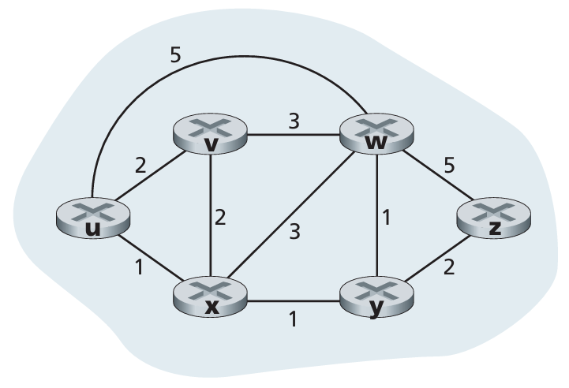 

  计算从 u 到所有可能目的地的最低开销路径。该算法的计算过程以表格方式总结于下表中，表中的每一行给出了迭代结束时该算法的变量的值：

  | 步骤 | N'     | D(v), p(v) | D(w), p(w) | D(x), p(x) | D(y), p(y) | D(z), p(z) |
  | ---- | ------ | ---------- | ---------- | ---------- | ---------- | ---------- |
  | 0    | u      | 2, u       | 5, u       | 1, u       | ∞          | ∞          |
  | 1    | ux     | 2, u       | 4, x       |            | 2, x       | ∞          |
  | 2    | uxy    | 2, u       | 3, y       |            |            | 4, y       |
  | 3    | uxyv   |            | 3, y       |            |            | 4, y       |
  | 4    | uxyvw  |            |            |            |            | 4, y       |
  | 5    | uxyvwz |            |            |            |            |            |

  当 LS 算法终止时，对于每个节点，我们都得到从源节点沿着它们的最低开销路径的前一节点，对于每个前一节点，我们又有它的前一节点，以此方式我们可以构建从源节点到所有目的节点的完整路径。

  - 最差情况下复杂性为 𝑂(𝑛2) 

  考虑链路开销等于链路上承载的负载时候的情况。此时，链路开销非对称的情况，即仅当在链路 (u, v) 两个方向所承载的负载相同时 c(u, v) 于 c(v, u) 才相等。

  在该例中，节点 z 产生发往 w 的一个单元的流量，节点 x 产生发往 w 的一个单位的流量，节点 y 产生发往 w 的一个数量为 e 的流量。初始路由选择情况为 图 a 所示的情况。

  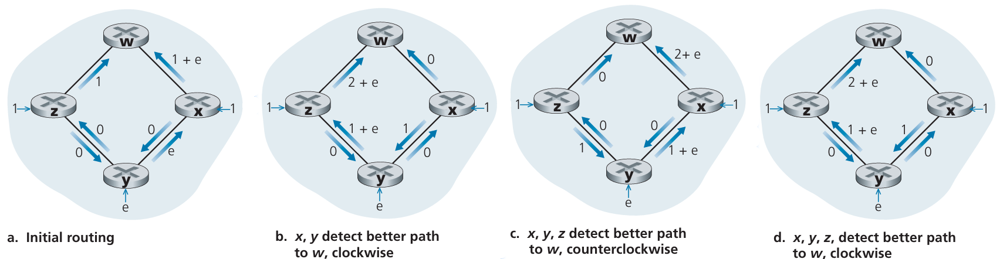

  - 当 LS 算法再次运行，节点 y 确定顺时针到 w 的路径开销为 1（根据图a所示的链路开销），而逆时针到 w 的路径开销为 1+e。 因此y到w的最低开销路径现在是顺时针的。 类似地， x确定其到w 的新的最低开销路径也是顺时针的，产生如图b所示的开销。
  - 当LS算法下次运行时，节点x、 y和z都检测到一条至w 的逆时针 方向零开销路径，它们都将其流量引导到逆时针方向的路由上。 
  - 下次 LS算法运行时， x、 y 和z都将其流量引导到顺时针方向的路由上。

  由此可见，拥塞敏感导致的路由选择震荡。

  解决办法：

  ① （不可接受的）强制链路开销不依赖于所承载的流量。

  ② 确保并非所有的路由器都同时运行 LS 算法。 

  


### 5.2.2 距离向量路由选择算法

- **距离向量**（Distance-Vector, DV） 算法是一种迭代的、异步的和分布式的算法。

  - 分布式的：因为每个节点都要从一个或多个直接相连邻居接收某些信息，执行计算，然后将其计算结果分发给邻居。
  - 迭代的：在此过程一直要持续到邻居之间无更多信息要交换为止。
  - 异步的：因为它不要求所有节点相互之间步伐一致地操作。

- 在我们给出 DV 算法之前，有必要讨论以下存在于最低开销路径的开销之间的一种重要关系。令 𝑑𝑥(𝑦) 是从节点 x 到 节点 y 的最低开销路径的开销。则该最低开销与著名的 Bellman-Ford 方法有关，即

  𝑑𝑥(𝑦)=min𝑣{𝑐(𝑥,𝑣)+𝑑𝑣(𝑦)}

  方程中的 min𝑣 是对于 x 的所有邻居的。

  从 x 到 v 遍历之后，如果我们接下来从 v 到 y 的最低开销路径，则该路径开销将是 𝑐(𝑥,𝑣)+𝑑𝑣(𝑦) 的最小值。

- DV 算法的基本思想：

  - 每个节点 x 以 𝐷𝑥(𝑦) 开始，对在 N 中的所有节点 y，估计从 x 到 y 的 **最低开销路径的开销**。
  - 令 𝐷𝑥=[𝐷𝑥(𝑦):𝑦∈𝑁] 是节点 x 的 **距离向量**，该向量是从 x 到在 N 中的所有其他节点 y 的开销估计向量。
  - 使用 DV 算法，每个节点 x 维护下列路由选择信息：
    - 对于每个邻居 x，从 x 到直接相连邻居 v 的开销为 c(x, v)。
    - 节点 x 的距离向量，即 𝐷𝑥=[𝐷𝑥(𝑦):𝑦∈𝑁] ，包含了 x 到 N 中所有目的地 y 的开销估计值。
    - 它的每个邻居的距离向量，即对 x 的每个邻居 v，有 𝐷𝑣=[𝐷𝑣(𝑦):𝑦∈𝑁] 。

  在该分布式、异步算法中，每个节点 不时地向 它的每个邻居 发送它的 **距离向量副本**。当 节点 x 从它的任何一个邻居 v 收到一个 **新距离向量**，它保存 v 的 距离向量，然后使用 Bellman-Ford 方程更新它自己的距离向量

  对中的每个节点𝐷𝑥(𝑦)=min𝑣{𝑐(𝑥,𝑣)+𝐷𝑣(𝑦)},对𝑁中的每个节点

  如果节点 x 的距离向量因这个更新步骤而改变，节点 x 接下来向它的每个邻居发送其更新后的距离向量，这继而让所有邻居更新它们自己的距离向量。

  > 令人惊奇的是，只要所有的节点继续以异步方式交换它们的距离向量，每个开销估计 𝐷𝑥(𝑦) 收敛到 𝑑𝑥(𝑦) ,𝑑𝑥(𝑦) 为从节点 x 到节点 y 的实际最低开销路径的开销。

- 距离向量 (DV) 算法：

  在每个节点 x：

  ```
  Initialization:
  	for all destinations y in N:
  		Dx(y) = c(x, y)
  	for each neighbor w:
  		Dw(y) = ? for all destinations y in N
  	for each neighbor w
  		send distance vector Dx = [Dx(y): y in N] to w
  
  loop
  	wait (until I see a link cost change to some neighbor w or
  			until I receive a distance vector from some neighbor w)
  	
  	for each y in N:
  		Dx(y) = min_v{c(x, v) + Dv(y)}
  		
  if Dx(y) changed for any destination y
  	send distance vector Dx = [Dx(y): y in N] to all neighbors
  
  forever
  ```

- 在 DV 算法中，当节点 x 发现它的直接相连的链路开销变化或从某个邻居接收到一个距离向量的更新时，它就更新其距离向量估计值。

- 但是为了一个给定的目的地 y 而更新它的转发表，节点 x 真正需要知道不是到 y 的最短路径距离，而是沿着最短路径到 y 的下一条路由器邻居节点 𝑣∗(𝑦) 。

- 如果有多个取最小值的邻居 v，𝑣∗(𝑦) 能够是其中任何一个有最小值的邻居。

- 对于每个目的地 y，在第 13~14 行中，节点 x 也决定 𝑣∗(𝑦) 并更新它对目的地 y 的转发表。

- 许多类似 DV 的路由选择协议：因特网的 RIP 和 BGP、 ISO IDRP、 Novell IPX 和早期的 ARPAnet。

示例：应用场合是该图顶部有三个节点的简单网络。 算法的运行以同步的方式显示出来，其中所有节点同时从其邻居接收报文，计算其新距离向量，如果距离向量发生了变化则通知其邻居。 学习完这个例子后，你应当确信该算法以异步方式也能正确运行，异步方式中可在任意时刻出现节点计算与更新的产生／接收。

初始化后，每个节点向它的两个邻居发送其距离向量。 

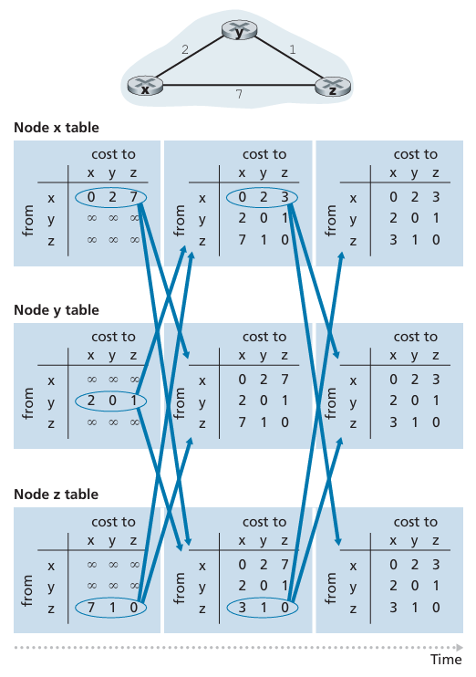 

在节点重新计算它们的距离向量之后，它们再次向其邻居发送它们的更新距离向量 （ 如果它们已经改变的话）。 图5-6 中由从表第二列到表第三列的箭头说明了这一情况。 注意到仅有节点x和节点z发送了更新：节点r的距离向量没有发生变化，因此节点y没有发送更新。

从邻居接收更新距离向量、重新计算路由选择表项和通知邻居到目的地的最低开销路径的开销已经变化的过程继续下去，直到无法更新报文发送为止。这个时候，因为无更新报文发送，将不会出现进一步的路由选择表计算，该算法将进入静止状态，即所有的节点将执行 DV 算法的第 10~11行中的等待。该算法停留在静止状态，直到一条链路开销发生变化。

1. 距离向量算法：**链路开销改变与链路故障** 

当一个运行 DV 算法的节点检测到从它自己到邻居的链路开销发生变化时，它就更新其距离向量，并且如果最低开销路径的开销发生了变化，向邻居通知其新的距离向量。

- 考虑从 y 到 x 的链路开销从 4 变为 1 的情况。我们在此只关注y 与 z 到目的地 x 的距离表中的有关项。该 DV 算法将导致下列事件序列的出现：

  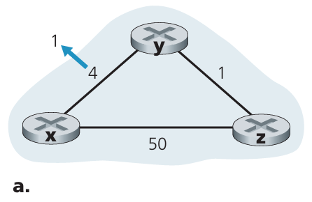

  - 在 𝑡0 时刻，y 检测到 链路开销变化，更新其距离向量，并通知其邻居这个变化，因为最低开销路径的开销已经改变。
  - 在 𝑡1 时刻，z 收到来自 y 的更新报文并更新了其距离表。它计算出到 x的新最低开销（从 5 减少为 12），它向其邻居发送了它的新距离向量。
  - 在 𝑡2 时刻，y 收到来自 z 的更新并更新其距离表。y 的最低开销未变，因此 y 不发送任何报文给 z。此算法进入静止状态。

  因此，对于该 DV 算法，只需两次迭代就到达了静止状态。在 x 与 y 之间开销减少的好消息通过网络得到了迅速传播。

- 考虑 x 与 y 之间的链路开销从 4 增加到 60 的情况。

  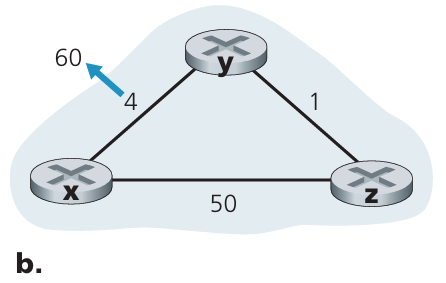

  1. 在链路开销变化之前，𝐷𝑦(𝑥)=4,𝐷𝑦(𝑧)=1,𝐷𝑧(𝑦)=1 和 𝐷𝑧(𝑥)=5。在 𝑡0 时刻，y 检测到链路开销变化（开销从 4 变为 60）。y 计算它到 x 的新的最低开销路径的开销，其值为 

     𝐷𝑦(𝑥)=min{𝑐(𝑦,𝑥)+𝐷𝑥(𝑦),𝑐(𝑦,𝑧)+𝐷𝑧(𝑥)}=min60+0,1+5=6

     当然，从网络全局的视角来看，能够看到经过 z 的这个新开销是错误的。但节点 y 仅有的信息是：它到 x 的直接开销是 60，且 z 上次告诉 y，z 能以开销 5 到 x。因此为了到达 x， y 将通过 z 路由，完全期望 z 能以开销 5 到达x。

     到了 𝑡1 时刻，我们遇到 **路由选择环路** (routing loop)，即为到达 x， y 通过 z 路由，z 又通过 y 路由。路由选择环路 就像 一个黑洞，即目的地为 x 的分组在 𝑡1 时刻到达 y 或 z 后，将在这两个节点之间不停地（或直到转发表发生改变为止）来回反复。

  2. 因为节点 y 已经算出到 x 的新的最低开销，它在 𝑡1 时刻将该新距离向量通知 z。

  3. 在 𝑡1 后某个时间，z 收到 y 的新距离向量，它指示了 y 到 x 的最低开销是6。z 知道它能以开销 1 到达y, 因此计算出到x 的新最低开销 𝐷𝑧(𝑥)=min{50+0,1+6}=7 。因为 z 到 x 的最低开销已增加了，于是它便在 𝑡2 时刻通知 𝑦 其新开销。

  4. 以类似方式，在收到z的新距离向量后， y决定 𝐷𝑦(𝑥)=8 并向 z 发送其距离向量。 接下来z确定 𝐷𝑧(𝑥)=9 并向 y 发送其距离向量，等等。

  该循环将持续44次迭代（在y与z之间交换报文），即直到z最终算出它经由y的路径开销大于50为止。 此时， z将（最终）确定它到 x 的最低开销路径是经过它到x的直接连接。 y 将经由 z 路由选择到 x。 关于链路开销增加的坏消息的确传播得很慢！如果链路开销c(y, x) 从4变为 10000且开销 c(z, x) 为9999 时将发生什么样的现象呢？

  由于这种情况，我们所见的问题有时被称为 **无穷计数** (count-to-infinity) 问题。


2.距离向量算法：增加毒性逆转

刚才描述的特定循环的场景可以通过使用一种称为毒性逆转的计数加以避免。其思想很简单；如果 z 通过 y 路由选择到目的地 x，则 z 将告知 y，它到 x 的距离是无穷大，也就是 z 将向 y 通告 𝐷𝑧(𝑥)=∞ （即使 z 实际上知道 𝐷𝑧(𝑥)=5）。只要 z 继续经 y 路由选择到 x，z 就持续地向 y 讲述这个善意的小谎言。因为y相信z没有 到x 的路径，故只要z继续经y路由选择到 x (并这样去撒谎）， y将永远不会试图经由z 路由选择到x。

- 作为毒性逆转的结果，当 (x, y) 的链路开销在 𝑡0 时刻从 4 变为 60 时，y 更新其表，虽然开销高达 60，仍继续直接路由选择到 x，并将到 x 的新开销通知 z，即 𝐷𝑦(𝑥)=60 。
- z 在 𝑡1 时刻收到更新后，便立即更新到 x 的路由切换到开销为 50 的直接 (z, x) 链路。因为这是一条新的到 x 的最低开销路径，且因为路径不再经过 y，
- z 就在 𝑡2 时刻通知 y 现在 𝐷𝑧(𝑥)=50 。
- 在收到来自 z 的更新后，y 便用 𝐷𝑦(𝑥)=51 更新其距离表。另外因为 z 此时位于 y 到 x 的最低开销路径上，所以 y 通过在 𝑡3 时刻通知 z 其 𝐷𝑦(𝑥)=∞ 毒化从 z 到 x 的逆向路径。

注意：涉及3个或更多节点（而不只是两个直接相连的邻居节点）的环路将无法用毒性逆转技术检测到。


链路状态算法 VS 距离向量算法

- 报文复杂性。

  - LS算法：O(|N||E|)
  - DV 算法：直接相邻的节点之间交换报文。

- 收敛速度：

  - LS 算法：𝑂(𝑁2)
  - DV 算法：
    - 路由选择环路
    - 无穷计数问题

- 健壮性：

  - LS 算法：路由器能向其连接的链路广播不正确的开销。

    路由计算在某种程度上是分离的，提供了一定程度的健壮性。

  - DV 算法：一个节点可向任意或所有目的节点通告其不正确的最低开销路径。


## 5.3 因特网中自治系统内部的路由选择：OSPF

> **Intra-AS Routing** in the Internet: **OSPF**

背景：

- 规模：亿万台主机构成。主机中存储的路由选择信息显然需要巨大容量的内存。所有路由器广播连通性和链路开销负担巨大。
- 管理自治：互联网是网络的网络。每个 ISP 都想管理自己网络的路由选择。

解决方法：**自治系统** (Autonomous System, AS)，其中每个 AS 由一组通常处在相同管理控制下的路由器组成。

- 在一个 自治系统 内运行的 路由选择算法，叫做 **自治系统内部路由选择协议** (intra-autonomous system routing protocol)。

**开放最短路优先** (OSPF)

- **OSPF 路由选择** 及其关系密切的协议 IS-IS 都被广泛用于因特网的 **AS 内部路由选择**。

- OSPF 是一个链路状态协议，它使用 **洪泛链路状态信息** 和 **Dijkstra 最低开销路径算法**。

- 使用 OSPF，一台路由器构建了一副关于整个自治系统的完整拓扑图（即一幅图）。于是，每台路由器在本地运行 Dijkstra  的最短路径算法，以确定一个以自身为根节点到所有子网的最短路径树。

- OSPF 提供一种机制，为给定链路权值集合确定最低开销路径的路由选择。

- 使用 OSPF 时，路由器向 **自治系统内** 所有 其他路由广播路由选择信息，而不仅仅是向其相邻路由器广播。

  - 每当一条链路的状态发生变化时，路由器就会广播链路状态信息。
  - 即使链路状态未发生变化，它也要周期性地广播链路状态（至少 30min 一次）。

- OSPF 通告 包含在 OSPF 报文中，该 OSPF 报文 **直接由 IP 承载**，对 OSPF 其上层协议的值为 89。因此 OSPF 协议必须自己实现如可靠报文传输、链路状态广播等功能。OSPF 协议还要检查链路正在运行（通过向相连的邻居发送 HELLO 报文），并允许 OSPF 路由器获得相邻路由器的网络范围链路状态的数据库。

- 优点：

  - 安全：OSPF 报文可以加入认证机制。

  - 允许使用多条相同开销的路径。

  - 对单播与多播路由选择综合支持。

  - 支持在单个 AS 中的层次结构。

    - 一个 OSPF 自治系统 能够层次化地配置多个区域。
    - 每个区域都运行自己的 OSPF 链路状态路由选择算法，区域内的每台路由器都可向该区域内的所有其他路由器广播其链路状态。
    - 在每个区域内，一台或多台区域边界路由器负责为流向该区域以外的分组提供路由选择。
    - 最后，在 AS 中只有 一个 OSPF 区域配置 成 **主干区域**。主干区域的主要作用是为该 AS 中 **其他区域之间** 的流量提供路由选择。该主干总是包含本 AS 中的 **所有区域边界路由器**，并且还可能包含一些非边界路由器。
    - 在 AS 中的 **区域间的路由选择** 要求分组路由到一个 **区域边界路由器**（区域内路由选择），然后通过 **主干** 路由到位于 **目的区域** 的 **区域边界路由**，进而再 路由 到 最终目的地。

    


## 5.4 ISP 之间的路由选择：BGP

- 当分组跨多个 AS 进行路由时，我们需要一个 **自治系统间路由选择协议** (inter-autonomous system routing protocol)。
- 因为 AS 间路由选择协议设计多个 AS 之间的协调，所以 AS 通信必须运行相同的 AS 间路由选择协议。
- 因特网中，所有的 AS 运行相同的 AS 间路由选择协议，称为 **边界网关协议** (Border Gateway Protocol, BGP)。
- BGP 是一种分布式和异步的协议。


### 5.4.1 BGP 的作用

- 在 BGP 中，分组不是路由到一个特定的目标地址，而是路由到 CIDR 化的前缀。其中每个前缀表示一个子网或一个子网的集合。一台路由器的转发表具有形式为 (𝑥,𝐼) 的表项，其中 x 是一个前缀（例如 138.16.68/22），I 是该路由器的接口之一的接口号。

作为 一种 AS 间的路由选择协议，BGP 为每台路由器提供了一种完成以下任务的手段：

1. 从 **邻居 AS** 获得 **前缀的可达性信息**。特别是，BGP 允许每个子网向因特网的其余部分告知它的存在。
2. 确定到该前缀的“最好的”路由。一台路由器可能知道两条或更多条到特定前缀的不同路由。为了确定最好的路由，该路由器将本地运行一个 BGP路由选择过程（使用它经过相邻的路由器获得的前缀可达性信息）。该最好的路由将基于 **策略** 以及 **可达性信息** 来确定。


### 5.4.2 通告 BGP 路由信息

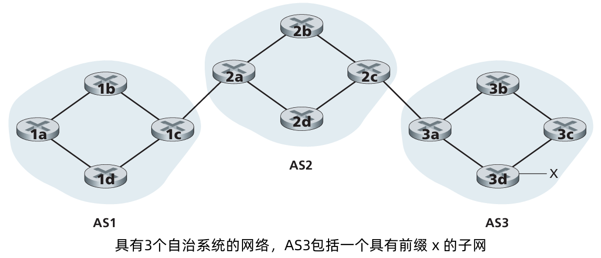

考虑上图中的网络。

- 对于每个 AS，每台路由器要么是一台 **网关路由器** (gateway router)，要么是一台 **内部路由器** (internal router)。

  - **网关路由器** 是一台位于 AS 边缘的路由器。它直接连接到在其他 AS 的一台或多台路由器。
  - **内部路由器** 仅连接在他自己 AS 中的主机和路由器。

  例如，在 AS1 中路由器 1c 是 网关路由器，路由器 1a, 1b, 1d  是 内部路由器。

- 考虑这样的任务：向图中显示的所有路由器通告对于前缀 x 的可达性信息。

  - 在高层次上：首先，AS3 向 AS2 发送一个 BGP 报文，告知 x 存在并且位于 AS3 中；我们将报文表示为 “AS3 x”。然后 AS2 向 AS1 发送一个 BGP 报文，告知 x 存在并且能够先通过 AS2 然后进入 AS3 进而到达 x；我们将该报文表示为 “AS2 AS3 x”。以这种方式，每个自治系统不仅知道 x 的存在，而且知道通向 x 的自治系统的路径。
  - 实际上，自治系统彼此并未实际发送报文，它并不准确，相反是路由器在发送报文。

在 BGP 中，每对路由器通过使用 179 端口的半永久TCP连接交换路由选择信息。每条直接连接以及所有通过该连接发送的 BGP 报文，称为 BGP 连接（BGP connection）。

- 跨越两个 AS 的 BGP 称为外部 BGP (eBGP) 连接。
- 在相同 AS 中的两台路由器之间的 BGP 会话称为 内部 BGP (iBGP) 连接。

对于直接连接在不同 AS 中的网关路由器的每条链路而言，通常有一条 eBGP 连接。

在下图中，在网关路由器 1c 和 2a 之间有一条 eBGP 连接，而在网关路由器 2c 和 3a 之间也有一条 eBGP 连接。在每个 AS 中的路由器之间还有多条 iBGP 连接。下图显示了 AS 内部的每对路由器之间的一条 BGP 连接的通常配置，在每个 AS 内部产生了网状的 TCP 连接。

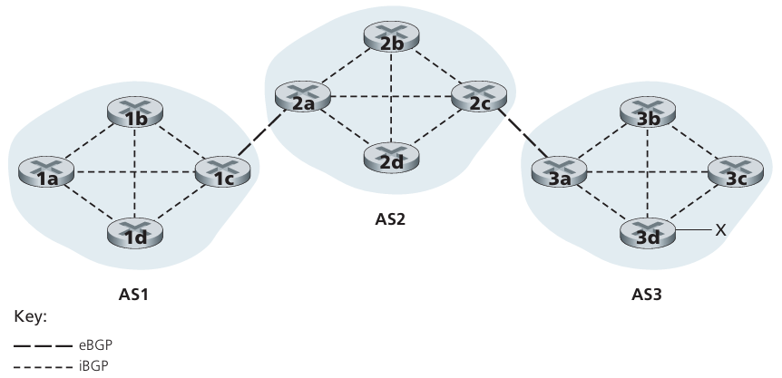

- iBGP 连接并不总是与物理链路对应

为了传播可达性信息，使用 iBGP 和 eBGP 会话。再次考虑向 AS1 和 AS2 中的 **所有路由器** 通告 **前缀 x** 的 **可达性信息**。

- 在这个过程中，网关路由器 3a 先向网关路由器 2c 发送一个 eBGP 报文 “AS3 x”。
- 网关路由器 2c 然后向 AS2 中的其他路由器（包括网关路由器 2a）发送 iBGP 报文 “AS3 x”。
- 网关路由器 2a 接下来向 网关路由器1c 发送一个 eBGP报文 “AS2 AS3 x”。
- 最后，网关路由器 1c 使用 iBGP 向 AS1 中的所有路由器发送报文 “AS2 AS3 x”。

这个过程完成后，在 AS1 和 AS2 中的每个路由器都知道了 x 的存在并且也都知道了通往 x 的 AS 路径。


在真实的网络中，从某个给定的路由器到某个给定的目的地可能有多条不同的路径，每条通过了不同的 AS 序列。例如，考虑下面的网络，它是上图那个初始网络基础上，从路由器 1d 到路由器 3d 附加了一条物理链路。在这种情况下，从 AS1 到 x 有两条路径：经过路由器1c的路径 “AS2 AS3 x”；以及经过路由器 1d 的新路径 “AS3 x”。

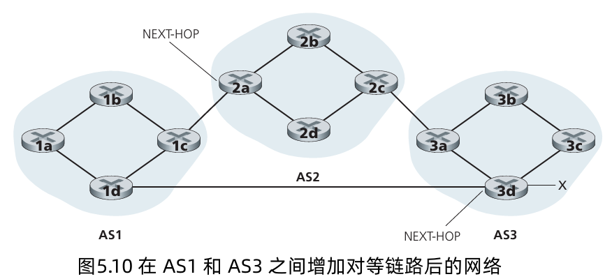

### 5.4.3 确定最好的路由

- 当路由器通过 BGP 连接通告前缀时，它在前缀中包括一些 BGP 属性 (BGP attribute)。

  - 前缀及其属性 称为 **路由** (route)。
  - 两个比较重要的属性是 AS-PATH 和 NEXT-HOP：
    - AS-PATH 属性包含了通告已经通过的 AS 的列表，如我们在前面的例子中所见。为了生成 AS-PATH 的值，当一个前缀经过某 AS 时，该 AS 将 ASN 加入 AS-PATH 中的现有列表。
    - BGP 路由器还使用 AS-PATH 属性来检测和防止通告环路；特别是，如果一台路由器在路径列表中看到包含了它自己的AS，它将拒绝该通告。

- 在 AS 间和 AS 内部路由选择协议之间提供关键链路方面，NEXT-PATH 属性具有敏感而重要的作用。

- NEXT-HOP 是  AS-PATH 起始的路由器接口的 IP 地址。

- 考虑 图 5-10，对于 “AS2 AS3 x”，其属性 NEXT-HOP 是路由器2a 左边接口的 IP 地址。

  对于从 AS1 绕过 AS2 到 x 的路由 “AS3 x”，其 NEXT-HOP 属性是路由器 3d 最左边接口的 IP 地址。

  在这个例子中，AS 的 每台路由器 都知道了到 前缀 x 的两台 BGP 路由：

  1. 路由器 2a  的最左侧接口的 IP 地址; AS2 AS3; x
  2. 路由器 3d  的最左侧接口的 IP 地址; AS3; x

  这里，每条 BGP 路由包含 3 个组件：`NEXT-HOP; ASPATH; 目的前缀` 。

  注意到 NEXT-HOP 属性是 不属于 AS1 的某路由器的 IP 地址；然而，包含该 IP 地址的子网直接连接到 AS1。


1. **热土豆路由选择** (hot potato routing)

考虑在图5-10网络中的路由器 1b。如前所述，这台路由器将学习到达前缀 x 的两台 BGP 路由。

使用热土豆路由选择，（从所有可能的路由中）选择的路由 到开始该路由的 NEXT-HOP 路由器 具有最小开销。

在这个例子中，

- 路由器 1b 将查阅它的 AS 内部路由选择信息，以找到通往 NEXT-HOP 路由器 2a 的最低开销 AS 内部路径以及通往 NEXT-HOP 路由器 3d 的最低开销 AS 间路径，进而选择这些最低开销路径中具有最低开销的那条。
- 假设开销定义为穿越的链路数。则从 路由器 1b 到路由器2a 的最低开销是 2，从路由器 1b 到路由器 3d 的最低开销是 3，因此将此选择路由器 2a。
- 路由器 1b 将查阅它的转发表（由它的AS内部算法所配置），并且找到通往 路由器 2a 的位于最低开销路径上的接口 I。1b 则把 (𝑥,𝐼) 加到它的转发表中。


热土豆路由选择依据的思想是：对于路由器 1b，尽可能快地将分组送出其 AS (明确地说，用可能的最低开销)，而不担心其 AS 外部到目的地的余下部分的开销。

> 就“热土豆路由选择”名称而言，分组被类比为烫手的热土豆。 因为它烫手，你要尽可能快地将它传给另一个人（另一个AS)。 热土豆路由选择因而是自私的算法，即它试图减小在它自己 AS 中的开销，而忽略在其 AS之外的端到端开销的其他部分。

注意到使用热土豆路由选择，对于在相同AS 中的两台路由器，可能对 相同的前缀 选择两条不同的 AS路径。 例如，我们刚才看到路由器1b到达 x 将 通过AS2 发送分组。 而路由器 1d 将绕过 AS2并直接向 AS3 发送分组到达 x。


1. **路由器选择算法**

实际中，BGP 使用一种热土豆路由选择更为复杂但却结合了其特点的算法。

对于任何给定目的地前缀，进入 BGP 的路由选择算法的输入是到某前缀的所有路由的集合，该前缀是已被路由器学习和接受的。如果仅有一条这样的路由，BGP 则显然选择该路由。如果到相同的前缀有两条或多条路由，则顺序地调用下列消除规则直到余下一条路由：

1. 路由被指派一个 本地偏好 (local preference) 值作为其属性之一。

   一条路由的 本地偏好可能由该路由器设置或者可能在相同 AS 中的另一台路由器学习到。

   本地偏好属性值是一种策略决定，它完全取决于该 AS 的网络管理员。

   具有最高本地偏好值的路由将被选择。

2. 从余下的路由中 (所有都具有相同的最高本地偏好值)，将选择具有最短 AS-PATH 的路由。

   如果该规则是路由选择的唯一规则，则 BGP 将使用距离向量算法决定路径，其距离测度使用 AS 跳的跳数，而不是路由器跳的跳数。

3. 从余下的路由中（所有都具有相同的最高本地偏好值和相同的 AS-PATH 长度），使用热土豆选择，即选择具有最靠近 NEXT-HOP 路由器的路由。

4. 如果仍留下多条路由，该路由器使用 BGP 标识符来选择路由。

我们再次考虑图5-10 中的路由器 1b。在上面的路由选择算法中，在规则3 之前应用了规则2 导致BGP 选择绕过 AS2 的那条路由，因为该路由具有更短的AS-PATH。因此我们看到使用上述路由选择算法， BGP不再是一种自私的算法，即它先查找具有短 AS路径的路由（因而很可能减小端到端时延）。


### 5.4.4 IP 任播

- BGP常被用于实现 **IP任播** (anycast) 服务 , 该服务通常用于 DNS 中。 

背景：① 在许多分散的不同地理位置，替换不同服务器上的相同内容；② 让每个用户从最靠近的服务器访问内容。

例如：一个CDN能够更换位于不同国家不同服务器上的视频和其他对象。类似地， DNS系统能够在遍及全世界的 DNS服务器上复制 DNS 记录。 当一个用户要访问该复制的内容，可以将用户指向具有该复制内容的“最近的”服务器。 

描述 CDN 可能使用 IP 任播的方式。

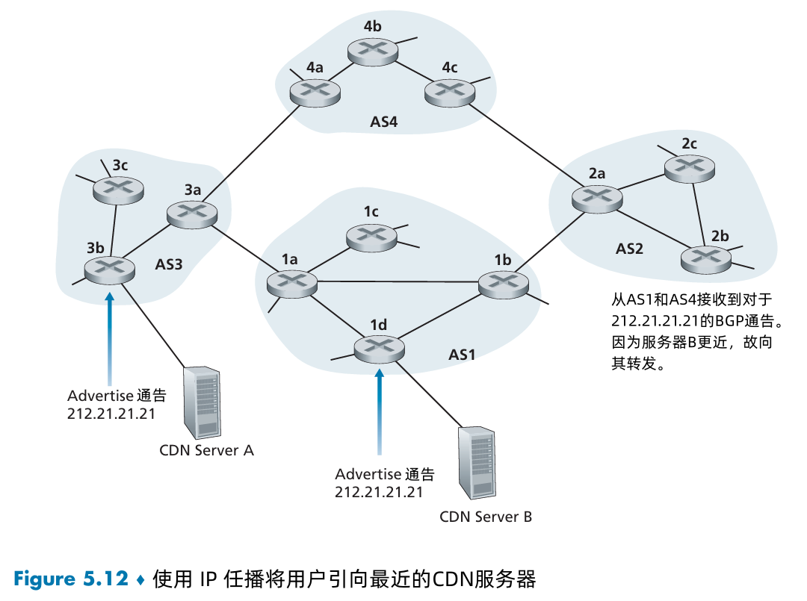

- 在 IP 任播配置阶段， CDN公司为它的多台服务器指派 **相同的IP地址**，并且使用标准的BGP从这些服务器的每台来通告该IP地址。 
- 当某台BGP路由器收到对于该IP地址的多个路由通告，它将这些 通告 处理为对 相同的物理位置提供不同的路径 （事实上，这时这些通告对不同的物理位置是有不同路径的）。
- 当配置其 **路由选择表** 时，每台路由器 将本地化地使用BGP 路由选择算法来挑选到该IP地址的“最好的＂（例如，由 AS跳计数确定的最近的）路由。
- 例如，如果一个BGP路由（对应于一个位置）离该路由器仅一AS跳的距离，并且所有其他BGP路由（对应于其他位置）是两AS跳和更多AS跳， 则该BGP路由器将选择把分组路由到 一跳 远的那个位置。
- 在这个 初始 BGP 地址通告阶段后，CDN 能够进行其分发内容的主要任务。 
- 当某客户请求视频时， CON 向该客户返回由地理上分散的服务器所使用的共同 IP 地址，而无论该客户位于何处。
- 当该客户想向那个 IP地址 发送一个请求时，因特网络由器则向那个“最近的” 服务器转发该请求分组，最近的服务器是由 BGP路由选择算法所定义的。

实践中 CDN通常选择不使用 IP 任播，因为 BGP路由选择变化 能够导致相同的TCP连接的不同分组到达Web服务器的不同实例。 但1P任播被 DNS 系统广泛用于将 DNS 请求指向最近的根 DNS 服务器。


### 5.4.5 路由选择策略

在路由选择算法中，实际上首先根据本地偏好属性选择路由，本地偏好值由本地 AS 的策略所确定。

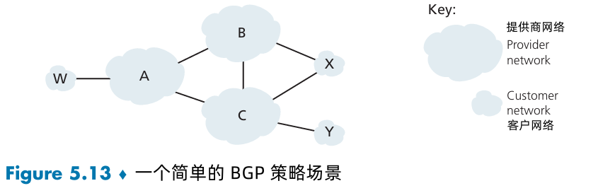

上面图中显示了6 个互联的自治系统： A、 B、 C、 W、 X 和 Y。 

- 注意：A、 B、 C、 W、 X 和 Y 是AS, 而不是路由器。

- 假设自治系统 W、 X 和 Y 是接入ISP, 而 A、 B 和C 是主干提供商网络。 

- 假设 A、 B 和C直接向彼此发送流量，并向它们的客户网络提供全部的BGP信息。所有进入一个接入ISP网络的流量必定是以该网络为目的地，所有离开一个接人ISP 网络的流量必定源于该网络。 

- W和Y显然是接入ISP。 X 是一个多宿接入ISP (multi-homed stub network)  , 因为它是经由两个不同的提供商连到网络的其余部分（这种方法在实践中变得越来越普遍）。

  - 然而，就像W和Y一样， X 自身必定是进入/离开X 的所有流量的源/目的地。
  - 但这种桩网络的行为是如何实现和强制实现的呢？X 如何防止转发B与C之间的流量呢？

  这能够通过控制 BGP路由的通告方式容易地实现。特别是， X如果 （向其邻居B和C) 通告它没有通向（除自身以外） 任何其他目的地的路径，那么它将起到一个接入 ISP 的作用。 

- 关注一个提供商网络，比如自治系统B。  假定B已经 （从A处） 知道了有一条到W的路径AW。 B 因此能将路由 AW安装到其路由信息库中。

  - 显然， B也想向它的客户 X通告路径BAW, 这样X知道它能够通过B路由到W。
  - 但是， B应该将路径BAW通告给 C吗？如果它这样做，则 C可以经由 BAW将流量引导到 W。如果A、 B和C都是主干提供商，而B也许正好觉得它不应该承担在A与 C 之间传送流量的负担（和开销）。B 可能有理由认为，确保C能经过A和C之间的直接连接引导A客户的来去流量是A和C的工作（和开销）。 

- 目前还没有强制主干ISP之间如何路由选择的官方标准。 然而，商业运行的ISP 们都遵从的一个经验法则是：任何穿越某 ISP 主干网的流量必须是其源或目的（ 或两者）位于该ISP 的某个客户网络中；不然的话这些流量将会免费搭车通过该ISP 的网络。 


## 5.5 SDN 控制平面

> 控制分组在网络的 SDN 使能设备中转发的网络范围逻辑，以及这些设备和它们的服务的配置与管理。

- 将网络的转发设备称之为 “**分组交换机**”，因为能够根据网络层源/目的地址、链路层源/目的地址以及传输层、网络层和链路层的分组首部字段做出转发决定。

SDN 体系结构具有 4 个关键特征：

- **基于流的转发**。

  SDN 控制的交换机的分组转发工作，能够基于传输层、网络层或链路层首部中任意数量的首部字段进行。

- **数据平面与控制平面分离**。

  数据平面 由 网络交换机 组成，交换机是相对简单（但快速）的设备，该设备在它们的流表中执行“匹配加动作”的规则。控制平面由服务器以及决定和管理交换机流表的软件组成。

- **网络控制功能：位于数据平面交换机外部**。

  与传统的路由器不同，这个软件在服务器上执行，该服务器与网络交换机截然分开且与之远离。

  控制平面自身由两个组件组成：一个 SDN 控制器（或 网络操作系统） ，以及若干 网络控制应用程序。

  控制器：

  - 维护准确的网络状态信息（如，远程链路、交换机和主机的状态）
  - 为运行在控制平面的网络控制应用程序提供这些信息
  - 提供方法，这些应用程序通过这些方法能够监视、编程和控制下面的网络设备。

  实践中控制器仅是逻辑上集中的，通常在几台服务器上实现。

- **可编程的网络**。

  通过运行在控制平面中的 **网络控制应用程序**、该网络是可编程的。 这些应用程序代表了" ON 控制平面的“智力”，使用了由 SDN 控制器提供的 APT 来定义和控制网络设备中的数据平面。 

为什么需要一个逻辑上集中的控制平面？

- 更简单的网络管理：避免路由器配置错误，使流量更灵活
- 基于表项的转发允许对路由器进行“编程”
- 集中式的“编程”更简单：集中计算表项并分发
- 分布式的“编程”更困难：作为在每个路由器中实现的分布式算法（协议）的结果来计算表项
- 控制平面的开放（非专有）实现

SDN 表示了一种网络功能的“分类”：**数据平面交换机**、**SDN 控制器** 和 **网络控制应用程序** 是分离的实体，该实体可以由不同的厂商和组织结构所提供。

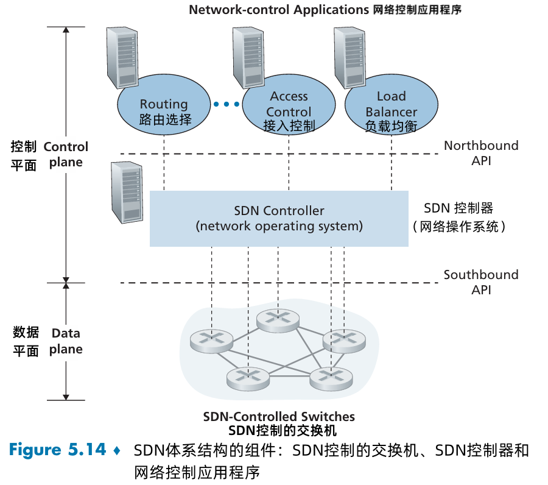


### 5.5.1 SDN 控制平面：SDN 控制器 和 SDN 网络控制应用程序

SDN 控制平面大体划分为两个部分，即 SDN 控制器 和 SDN 网络控制应用程序。

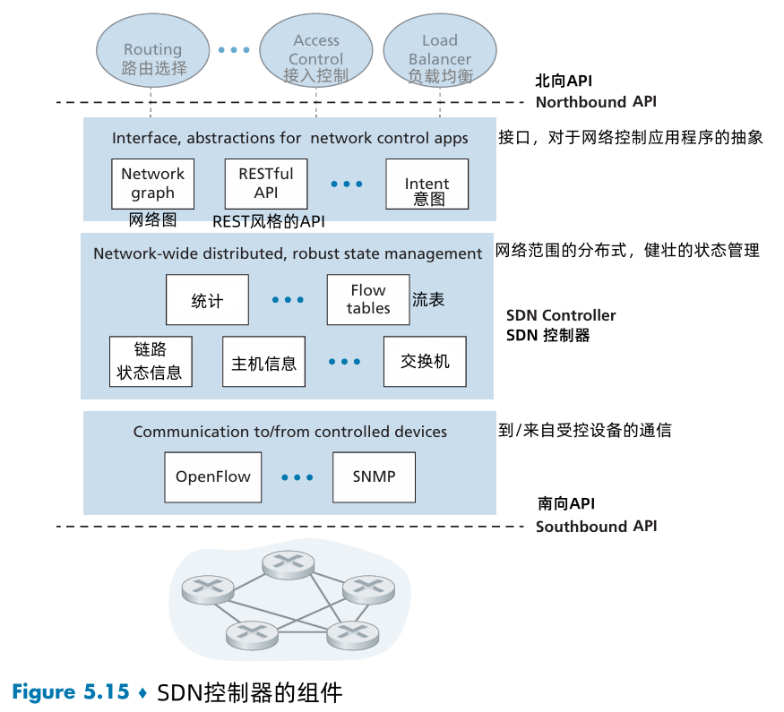

控制器的功能可大体组织为 3 个层次：

- 通信层：SDN 控制器和受控网络设备之间的通信。
  - 如果 SDN 控制器要控制远程 SDN 使能的交换机、主机或其他设备的运行，需要一个协议来传送控制器与这些设备之间的信息。
  - 设备必须能够向控制器传递本地观察到的时间。这些时间向 SDN 控制器提供该网络状态的最新视图。这个协议构成了控制器体系结构的最底层。
- 网络范围状态管理层。
  - 由 SDN 控制平面所做出的最终控制决定（例如配置所有交换机的流表以取得所希望的端到端转发，实现负载均衡，或实现一种特定的防火墙能力）。
  - 要求控制器具有有关网络的主机、链路、交换机和其他 SDN 控制设备的最新状态信息。
  - 交换机的流表包含计数器，其值也可以由网络控制应用程序很好地使用；因此这些值应当为应用程序所用。
  - 既然控制平面的终极目标是决定用于各种受控设备的流表，控制器也可以维护这些表的拷贝。
- 对于网络控制应用程序层的接口。
  - 控制器通过它的“北向” 接口与网络控制应用程序交互。
  - 该 API 允许网络控制应用程序在状态管理层之间读/写网络状态和流表。
  - 当状态改变事件出现时，应用程序能够注册进行通告。


SDN 控制器被认为是“逻辑上集中”。然而，出于故障容忍、高可用性和性能等方面的考虑，在事件中这些服务和用于保持状态信息的数据库一般通过分布式服务器集合实现。


### 5.5.2 OpenFlow 协议

OpenFlow 协议运行在 SDN 控制器和 SDN 控制的交换机或其他实现 OpenFlow API 的设备之间。OpenFlow 协议运行在 TCP 之上，使用 6653 的默认端口号。

- 从控制器到受控交换机流动的重要报文有下列这些：

  - 配置 (configuration)。该报文允许控制器查询并设置交换机的配置参数。
  - 修改状态 (modify-state)。该报文由控制器所使用，以增加/删除或修改交换机流表中的表项，并且设置交换机端口特性。
  - 读状态 (read-state)。该报文被控制器用于从交换机的流表和端口收集统计数据和计数器值。
  - 发送分组 (send-packet)。该报文被控制器用于在受控交换机从特定的端口发送出一个特定的报文。

- 从受控交换机到控制器流动的重要报文由下列这些：

  - 流删除 (flow-removed)。该报文通知控制器已删除一个流表项。

    例如由于超时，或作为收到“修改状态”报文的结果。

  - 端口状态 (port-status)。交换机用该报文向控制器通知端口状态的变化。

  - 分组入 (packet-in)

    一个分组到达交换机端口，并且不能与任何流表项匹配，那么这个分组将被发送给控制器额外处理。匹配的分组也被发送给控制器，作为匹配时采取的一个动作。

    “分组入”报文被用于将分组发送给控制器。


### 5.5.3 数据平面和控制平面交互的例子

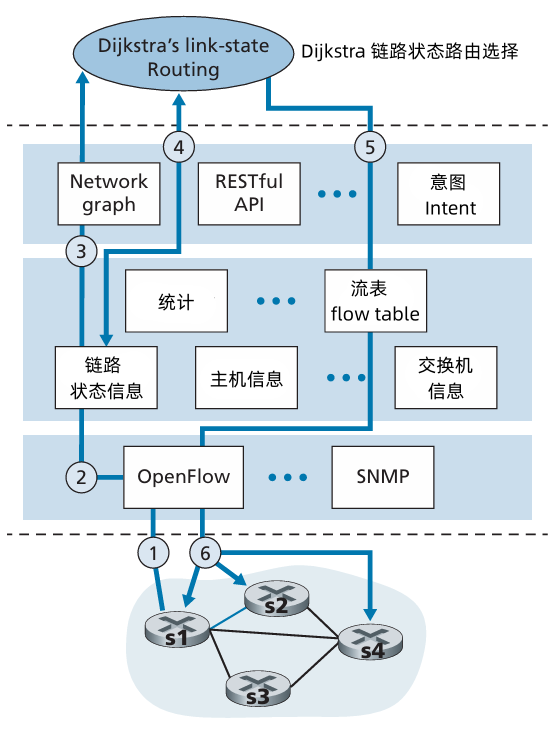

考虑上图的例子，其中使用了 Dijkstra 算法来决定最短路径路由。Dijkstra 算法是实现在每台路由器中并且在所有网络路由器中洪泛链路状态更新：

- Dijkstra 算法作为一个单独的程序来执行，位于分组交换机的外部。
- **分组交换机** 向 **SDN 控制器** 发送链路更新 并且 **不互相发送**。

假设交换机 s1 和 s2 之间的链路断开；实现了最短路径路由选择，因此，除了 s2 操作未发生改变外，s1、s3 和 s4 的入和出流转发规则都受到影响。我们也假定 OpenFlow 被用作 **通信层协议**，控制平面 只执行 **链路状态路由选择** 而 不执行其他功能。

1. 交换机 s1 经历了自己与 s2 之间的链路故障，使用 OpenFlow “**端口状态**”报文 向 SDN 控制器通报该链路状态的更新。
2. SDN 控制器 接受指示 链路状态更新的 OpenFlow 报文，并且通告 **链路状态管理器**，由管理器 **更新链路状态库**。
3. 实现 Dijkstra 链路状态路由选择 的 网络控制应用程序 先前进行了注册，当链路状态更新时 将得到通告，**应用程序** 接受该 **链路状态更新的通告**。
4. **链路状态路由选择应用程序** 与 **链路状态管理器** 相互作用，以得到更新的 **链路状态**；它也会参考状态管理层中的其他组件。然后它 **计算新的最低开销路径**。
5. **链路状态路由选择应用** 则与 **流表管理器** 交互，流表管理器 决定 **更新的流表**。
6. **流表管理器** 则使用 **OpenFlow 协议** 更新位于受影响的交换机 s1、s2 和 s4 的流表项，其实 s1 此时将经 s4 将分组的目的地指向 s2，s2 此时将经中间交换机 s4 开始接受来自 s1 的分组，s4 此时必须转发来自 s1 且目的地为 s2 的分组。

SDN使能的 ISP 能够容易地将最低开销路径的路由选择转变为更加定制的路由选择方法。 因为控制器的确能够随心所欲地定制流表，因此能够实现它喜欢的任何形式的转发，即只是通过改变它的应用控制软件。 这种改变的便利性与传统的每路由器控制平面的情况形成对照，传统的情况必须要改变所有路由器中的软件，而这些路由器可能是由多个不同厂商提供给ISP 的。


## 5.6 ICMP：因特网控制报文协议

ICMP（Internet Control Message Protocol，互联网控制报文协议）：

- 主机 和 路由器 用来彼此沟通网络层的信息。

- 典型的用途：**差错报告**。

  例如：当运行一个 HTTP 会话时，你也许会遇到一些诸如“目的网络不可达”之类的错误报文。这种报文就源于 ICMP。在某个位置，IP 路由器不能找到一条通往 HTTP 请求中所指定的主机的路径，该路由器就会向你的主机生成并发出一个 ICMP 报文以指示错误。

- ICMP 报文是承载在 IP 分组中的，即 ICMP 报文是作为 IP 有效载荷承载的。

  类似地，当一台主机收到指明上层协议为 ICMP 的 IP 数据报时（上层协议编码为 1），它分解出该数据报的内容给 ICMP。

- ICMP 报文有一个 **类型字段** 和 一个 **编码字段**，并且包含引起该 ICMP 报文首次生成的 IP 数据报的首部和 前 8 个字节（以便发送方能够确定引发该差错的数据报）。

- 注意：ICMP报文 并不仅是用于通知差错情况。

ICMP 报文类型：

| ICMP类型 | 编码 | 描述                   |
| -------- | ---- | ---------------------- |
| 0        | 0    | 回显回答(对ping的回答) |
| 3        | 0    | 目的网络不可达         |
| 3        | 1    | 目的主机不可达         |
| 3        | 2    | 目的协议不可达         |
| 3        | 3    | 目的端口不可达         |
| 3        | 6    | 目的网络未知           |
| 3        | 7    | 目的主机未知           |
| 4        | 0    | 源抑制(拥塞控制)       |
| 8        | 0    | 回显请求               |
| 9        | 0    | 路由器通告             |
| 10       | 0    | 路由器发现             |
| 11       | 0    | TTL过期                |
| 12       | 0    | IP首部损坏             |

- ping 程序：

  - 发送方：ping 程序发送一个 ICMP 类型 8 编码0 的报文到指定主机。 
  - 接收方：看到回显(echo) 请求，目的主机发回一个类型0 编码0 的 ICMP 回显回答。 

- 源抑制报文

- Traceroute 程序：

  - 为了判断源和目的地之间所有路由器的名字和地址，源主机中的 Traceroute 向目的地主机发送一系列普通的IP数据报。 这些数据报的每个携带了一个具有不可达UDP端口号的UDP报文段。 第一个数据报的TTL为1， 第二个的TTL为2，第三个的 TTL 为3，依次类推。 

  - 该源主机也为每个数据报启动定时器。 当第n个数据报到达第n台路由器时，第n 台路由器观察到这个数据报的TTL正好过期。 

  - 根据IP协议规则，路由器丢弃该数据报并发送一个ICMP告警报文给源主机（类型 11 编码0)。 该告警报文包含了路由器的名字和它的 IP 地址。 

  - 当该ICMP报文返回源主机时，源主机从定时器得到往返时延，从 ICMP 报文中得到第n台路由器的名字与IP地址。

  - Traceroute 源主机是怎样知道何时停止发送 UDP 报文段的呢？

    前面讲过源主机为它发送的每个报文段的 TTL 字段加 1。 因此，这些数据报之一将最终沿着这条路到达目的主机。 因为该数据报包含了一个具有 不可达端口号的 UDP 报文段，该目的主机将向源发送一个端口不可达的ICMP报文（类型 3 编码 3)。 

    当源主机收到这个特别的 ICMP 报文时，知道它不需要再发送另外的探测分组。 （标准的 Traceroute 程序实际上用相同的 TTL 发送 3 个一组的分组，因此 Traceroute 输出对每个TTL提供了 3 个结果。）


## 5.7 网络管理和 SNMP

当一个机构将数以百计或 数以于计的这种部件拼装在一起形成一个网络时，保持该网络”运行良好”对网络管理员无疑是一种挑战。 

网络管理的定义：“网络管理包括了硬件、 软件和人类元素的设置、 综合和协调，以监视、 测试、 轮询、配置、 分析、 评价和控制网络及网元资源，用合理的成本满足实时性、运营性能和服务质量的要求。”

### 5.7.1 网络管理框架

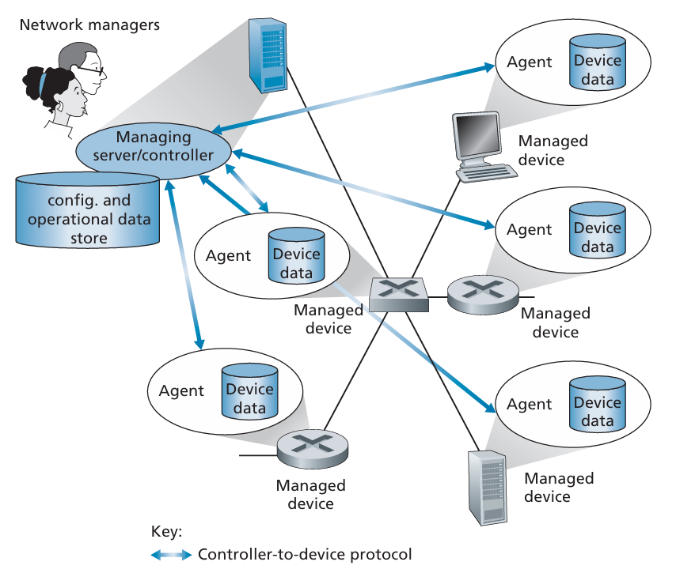

- **管理服务器** (managing server)：
  - 是一个 **应用程序**，通常有人的参与，并运行在网络运营中心 (NOC) 的集中式网络管理工作站上。
  - 管理服务器是执行 **网络管理活动** 的地方，它控制网络管理信息的收集、 处理、分析和／或显示。 
- **被管设备** (managed device)：
  - 是网络装备的一部分（包括它的软件），位于被管理的网络中。 
  - 被管设备可以是一台主机、路由器、交换机、中间盒、调制解调器、温度计或其他联网的设备。 
  - 在一个被管设备中，有几个所谓被管对象 (managed object) 。 这些被管对象是被管设备中硬件的实际部分（例如，一块网络接口卡只是一台主机或路由器的一个组件） 和用于这些硬件及软件组件的配置参数（例如，像OSPF 这样的 AS 内部路由选择协议）。
- **管理信息库** (Management Information Base, MIB)
  - 一个被管设备中的每个被管对象的关联信息收集在管理信息库中
  - 一个MIB 对象可以是： 一个计数器，例如由千IP数据报首部差错而由路由器丢弃的IP数据报的数量，或一台主机接收到的UDP报文段的数部差错而由路由器丢弃的IP数据报的数量，或一台主机接收到的UDP报文段的数是否正确的状态信息；或诸如到一个目的地的路由选择路径的特定协议的信息。
  - MIB 对象由称为 SMI (St111cture of Management Information)的数据描述语言所定义。 使用形式化定义语言可以确保网络管理数据的语法和语义是定义良好的和无二义性的。 
- **网络管理代理** (network management agent)
  - 在每个被管设备中还驻留有 网络管理代理
  - 它是运行在被管设备中的一个进程，该进程与 **管理服务器 通信**，在管理服务器的命令和控制下在被管设备中 采取本地动作。 
- **网络管理协议** (network management protocol)
  - 该协议运行在管理服务器和被管设备之间，允许管理服务器查询被管设备的状态，并经过其代理间接地在这些设备上采取行动。 
  - 代理能够使用网络管理协议向管理服务器通知异常事件 （如组件故障或超过了性能阈值）。 
  - 它为网络管理员提供了一种能力，使他们能够管理(“监视、 测试、 轮询、 配置、 分析、评价和控制”)网络。 

### 5.7.2 简单网络管理协议

简单网络管理协议：Simple Network Management Protocol

- 是一个应用层协议，用于在管理服务器和代表管理服务器执行的代理之间传递网络管理控制和信息报文。
- SNMP 最常使用的是 **请求响应模式**：
  - 其中 SNMP 管理服务器向 SNMP 代理发送一个请求，代理接收到该请求后，执行某些动作，然后对该请求发送一个回答。
  - 请求通常用于 查询（检索）或修改（设置）与某被管设备关联的 MIB 对象值。
- SNMP 第二个常被使用的是代理向管理服务器发送的一种非请求报文，该报文称为 **陷阱报文** (trap message)：
  - 报文陷阱，用于通知管理服务器，一个异常情况（例如一个链路接口开启或关闭）已经导致了 MIP 对象值的改变。


- SNMP PDU 通常是作为 UDP数据报的载荷进行传输的。然而，由于 UDP是一种不可靠的运输协议，因而不能确保一个请求或它的响应能够被它希望的目的地接收到。 管理服务器用该 PDU 的请求 ID 确保一个请求或它的响应能够被它希望的目的地接收到。 管理服务器用该 PDU 的请求 ID字段为它向代理发送的请求编号；该代理的响应从接收到的请求中获取它的请求1D。 因此，该请求ID字段能被管理服务器用来检测丢失的请求或回答。 


# 6 链路层和局域网

## 6.1 链路层概述

- 将运行链路层协议的任何设备均称为 **节点** (node)。

  节点包括：主机、路由器、交换机和WiFi 接入点。

- 把沿着通信路径连接相邻节点的通信信道称为 **链路** (link)。

- 为了将一个数据报从源主机传输到目的主机，数据报必须通过沿端到端路径上的 *各段链路* 传输。


### 6.1.1 链路层提供的服务

尽管任一链路层的基本服务是将 数据报 通过 单一通信链路 从一个节点移动到 相邻节点，但所提供的服务细节能够随着链路层协议的不同而变化。

链路层协议提供的可能服务包括：

- 成帧 (framing)
  - 将链路层帧封装起来。
  - 一个帧由一个数据字段和若干首部字段组成，其中网络层数据报就插在数据字段中。
  - 帧的结构由链路层协议规定。
- 链路接入
  - 媒体访问控制（Medium Access Control, MAC）协议规定了帧在链路上传输的规则。
  - 对于在链路的一端仅有一个发送方、链路的另一端仅有一个接收方的点对点链路，MAC 协议比较简单，即无论何时链路空闲，发送方都能够发送帧。
  - 更有趣的情况是当多个节点共享单个广播链路时，即所谓多路访问问题。这里，MAC 协议用于协调多个节点的帧传输。
- 可靠交付
  - 当链路层协议提供可靠交付服务时，它保证不差错地经链路层移动每个网络层数据报。
  - 许多有线的链路层协议不提供可靠交付。
- 差错检测和纠正
  - 链路层的差错检测通常用硬件实现。
  - 差错纠正类似于差错检测，区别在于接收方不仅能检测帧中出现的比特差错，而且能够准确地确定帧中的差错出现的位置。

### 6.1.2 链路层在何处实现

- 链路层的主体部分是在 **网络适配器** (network adapter) 中实现的，网络适配器 有时也称为 **网络接口卡** (Network Interface Card, NIC)。
- 位于网络适配器核心的是 链路层控制器，该控制器通常是一个实现了许多链路服务（成帧、链路接入、差错检测等）的 专用芯片。
- 链路层控制器 的许多功能是用 硬件 实现的。
- 在发送端，控制器 取得了 由协议栈较高层生成并存储在主机内存中的 数据报，在 链路层帧 封装该数据报 (填写该帧的各个字段)，然后遵循链路接入协议将该帧传进通信链路中。
- 在接收端，控制器接受了整个帧，抽取出网络层数据报。如果链路层执行差错检测，则需要发送控制器在该帧的首部设置差错检测比特，由该接受控制器执行差错检测。

网络适配器：它与其他主机组件及协议栈功能的关系

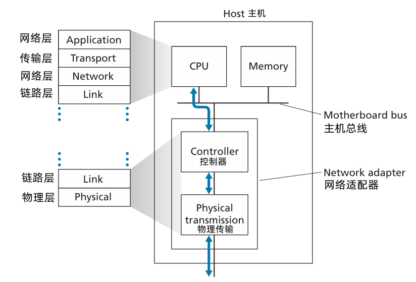

- 部分链路层是在运行于CPU上的软件中实现的。
- 链路层的软件组件实现了高层链路层功能，如 组装链路层寻址信息 和 激活控制器硬件。
- 在接受端，链路层软件 响应 控制器中断，处理差错条件 和 将数据报向上传递给网络层。
- 链路层是硬件与软件的结合体，即此处是协议栈中软件和硬件交接的地方。


## 6.2 差错检测和纠正技术

- **比特级差错检测和纠正** (bit-level error detection and correction)：对从一个节点发送到另一个物理上连接的邻近节点的链路层帧中的比特损伤进行检测和纠正。

  它们通常是链路层提供的两种服务。

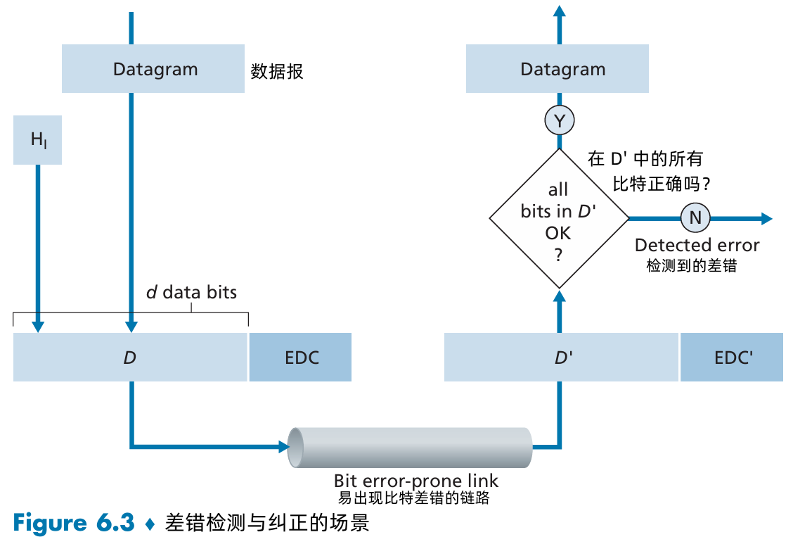

- 在 发送节点，为了保护比特免受差错，使用 **差错检测和纠正比特** (error-detection and -correction, EDC) 来增强数据 D。

- 通常，要保护的数据不仅包括从网络层传递下来需要通过链路传输的数据报，而且包括链路帧首部中的链路级的寻址信息、序号和其他字段。

  链路级帧中的 D 和 EDC 都被发送到接受节点。

- 在接受节点，接受到比特序列 D' 和 EDC'。

  注意到，因为传输中的比特翻转，D' 和 EDC' 可能与初始的 D 和 EDC 不同。

- 接收方的挑战是在它只收到 D' 和 EDC' 的情况下，确定 D' 是否和初始的 D 相同。


### 6.2.1 奇偶校验 (parity checks)

- 差错检测的最简单的方式：单个奇偶校验位 (parity bit)。假设在 图 6-4 中要发送的消息 D 有 d 个比特。

- **偶校验** 方案中，发送方只需包含一个附加比特，选择它的值，使得 d+1 比特（初始信息 + 校验比特）中 **1 的总数总是偶数**。

  单个偶检验的方案：

  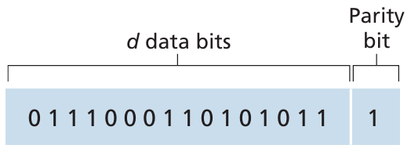

- **奇校验** 方案中，选择校验比特值使得有 **奇数个 1**。

- 采用单个奇偶校验位方式，接收方的操作也很简单。接收方只需要数一数接受的 d+1 比特中 1 的数目即可。

- 如果采用奇偶校验方案中发现了奇数个数位 1 的比特，接收方至少出现了 1 个比特差错，更精确的说法，出现了奇数个比特差错。

  偶数个比特差错，将导致一个未检出的差错。

- 将单比特奇偶校验方案的二维一般化方案：D 的 d 个比特划分为 i 行 j 列。对每行和每列计算奇偶值。产生 i + j + 1 奇偶比特构成了链路层帧的差错检测比特。

  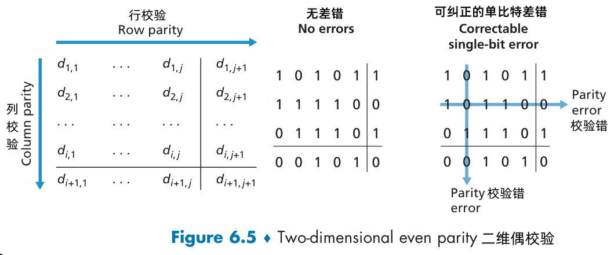

  - 现在假设在初始 d 比特消息中出现了单个比特差错。使用这种 二维奇偶校验 方案，包含比特值改变的列和行的校验值都将会出现差错。
  - 因此接收方不仅可以检测到出现了单个比特差错的事实，而且还可以利用存在奇偶校验差错的列和行的索引来实际识别发生差错的比特并纠正它。
  - 二维奇偶校验也能够检测（但不能纠正）一个分组中两个比特差错的任何组合。
  - 接收方 **检测和纠正差错** 的能力 被称为 **前向纠错** (Forward Error Correction, FEC)。


### 6.2.2 检验和 方法 (Checksumming Methods)

- 在检验和技术中，d 比特数据被作为一个 k 比特整数的序列处理。
- 一个简单检验和的方法就是将这 k 比特整数加起来，即数据的字节作为 16 比特的整数对待并求和。这个 **和的反码** 形成了携带在报文段首部的因特网检验和。
- 接收方通过对接收的数据（包括 **检验和**）的和 (=00..0) **取反码** (=11..1)，并检测其结果是否未全1比特来检测检验和。
- 在 TCP 和 UDP 协议中，对所有字段（包括首段和数据字段）都计算因特网检验和。它们提供相对弱的差错保护。


## 6.2.3 循环冗余检测 ⭐

- 现今的计算机网络中广泛应用的差错检测技术基于 **循环冗余检测** (Cyclic Redundancy Check, CRC) 编码。

  > CRC 编码也称为 **多项式编码** (polynomial code)。因为该编码能够将要发送的比特看作为系数为 0 和 1 的一个多项式，对比特串的操作被解释为多项式算术。

CRC 编码操作如下：

- 考虑 d 比特的数据 D，发送节点要将它发送给接收节点。
- 发送方和接收方首先必须协商一个 r+1 比特模式，称为 生成多项式 (generator)，表示为 𝐺 。要求 𝐺 的最高有效位的比特(最左边) 是 1。

CRC 编码的关键思想：

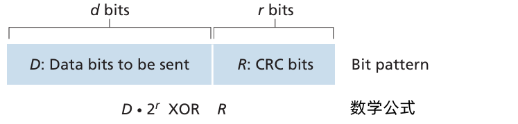

- 对于一个给定的数据段 𝐷，发送方要选择 𝑟 个附加比特 𝑅，并将它们附加到 𝐷 上，得到一个 𝑑+𝑟 比特模式 (被解释为一个 二进制数) 用模2算术恰好能被 𝐺 整除 (没有余数)。

- 用 CRC 进行差错检测的过程很简单：接收方用 G 去除接收到的 𝑑+𝑟 比特。如果余数非零，接收方知道出现了差错：否则认为数据正确而被接收。

- 所有 CRC 计算采用 模2算术在做，在加法中不进位，在减法中不借位。这两个操作等价于操作数的 **按位异或** (XOR)。因此，举例来说：

  1011 XOR 0101 = 1110

  1001 XOR 1101 = 0100

  如通常的二进制算术那样，乘以 2𝑟 就是一种 比特模式左移 𝑘 个位置。

  这样给定 𝐷 和 𝑅 ，𝐷⋅2𝑟 XOR 𝑅 产生如上图所示的 𝑑+𝑟 比特模式。

- 计算 𝑅 ：

  𝑅=remainder 𝐷⋅2𝑟𝐺

- 举例说明：𝐷=101110,𝑑=6,𝐺=1001,𝑟=3 的情况下，计算 𝑅 和 传输的比特串：

  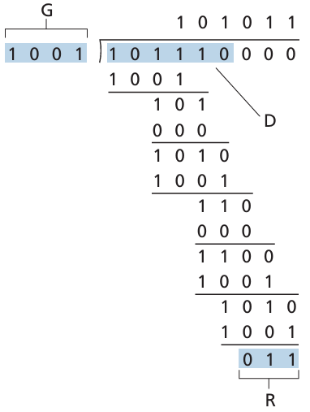

  计算得到余数 𝑅=011，因此传输的 9 个比特是 101110011。

- 每个 CRC 标准都能检测小于 r + 1 比特的突发差错。

  在适当的假设下，长度大于 r + 1 比特的突发差错以概率 1−0.5𝑟 被检测到。

  每个 CRC 标准也都能检测任何奇数个比特差错。 


## 6.3 多路访问链路和协议

两种类型的网络链路：

- 点对点链路 (point-to-point link)：
  - 有链路一端的单个发送方和链路另一端的单个接收方组成。
  - 许多链路层协议都是为点对点链路设计的：
    - 点对点协议(point-to-point protocol, PPP) 
    - 高级数据链路控制 (high-level data link control, HDLC) 
- 广播链路 (broadcast link)：
  - 能够让 多个 发送和接收节点都连接到 相同的、单一的、共享的 广播信道上。
  - 当任何一个节点传输一个帧时，信道广播该帧，每个其他节点都收到一个副本。
  - 以太网和无线局域网都是广播链路层技术的例子。
  - 广播信道通常用于局域网中，局域网是一个地理上集中在一个建筑物中（或者在一个公司，或者在大学校园）的网络。

探讨的问题：如何协调多个发送和接收节点对于一个共享广播信道的访问。这就是 **多路访问问题** (multiple access problem)。

多路访问协议 (multiple access protocol)：节点通过这些协议来规范它们在共享广播信道上的传输行为。

在实践中，数以百计或者甚至数以于计个节点能够通过一个广播信道直接通信。因为所有的节点都能够传输帧，所以多个节点可能会同时传输帧。当发生这种情况时，所有节点同时接到多个帧：这就是说，传输的帧在所有的接收方处碰撞 (collide)。通常，碰撞发生时，没有一个接收方能够有效地获得任何传输的帧。

将任何多路访问协议划分为 3 中类型之一：

- 信道划分协议 (channel partitioning protocol)
  - 将信道划分为更小的 “片段” （时隙 (time slots)，频率，编码）
  - 为节点分配片段以供其单独占用
- 随机接入协议 (random access protocol)
  - 信道不进行划分，允许碰撞
  - 从碰撞中“恢复”
- 轮流协议 (taking-turns protocol)
  - 节点轮流进行，但需要发送更多信息的节点可以轮流更长时间。

在结束概述之前，我们给出下列条件。在理想情况下，对于速率为 R bps 的广播信道，多路访问协议应该具有以下所希望的特性：

1. 当仅当有一个节点发送数据时，该节点具有 Rbps 的吞吐量。
2. 当有 M 个节点发送数据时，每个节点吞吐量为 R/M bps。这不必要求 M 个节点中的每一个节点总是有 R/M 的瞬间速率，而是每个节点在一些适当定义的时间间隔内应当**有 R/M 的平均传输速率**。
3. 协议是分散的；这就是说不会因某主节点故障而使整个系统崩溃。
4. 协议是简单的，使实现不昂贵。


### 6.3.1 信道划分协议

- **时分多路复用** (TDM) 和 **频分多路复用** (FDM) 是两种能够用于在所有共享信道节点之间划分广播信道带宽的技术。

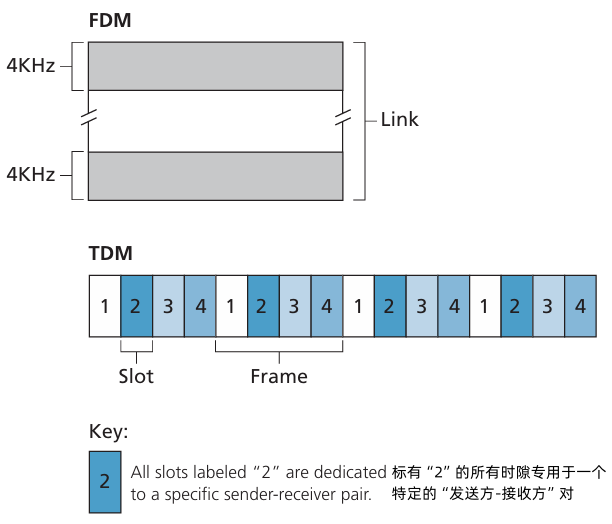

- 时分多路复用 (TDM)：

  - 假设一个支持 N 个节点的信道的传输速率为 R bps。

    - TDM 将时间划分为 时间帧 (time frame)，并进一步划分每个时间帧 为 N 个时隙 (slot)。

    > 不应当 把 TDM 时间帧 与在发送和接收适配器之间交换的链路层数据单元相混淆，后者也被称为 帧。为了减少混乱，在本小姐将链路层交换的数据单元称为分组。

    - 然后把每个时隙分配给 N 个节点中的一个。
    - 无论何时每个节点在有分组要发送的时候，它在循环的 TDM 帧中指派给它的时隙内传输分组比特。
    - 通常，选择的时隙长度应使一个时隙内能够传输单个分组。

  - TDM 是有吸引力的，因为它消除了碰撞而且非常公平：每个节点在每个帧时间内得到了专用的传输速率 R/N bps。

  - 缺陷：

    - 节点被限制于 R/M bps 的平均速率，即使当它是唯一一个有分组要发送的节点时。
    - 节点必须总是等待它在传输序列中的轮次。

- FDM 将 R bps 信道划分为不同的频段 （每个频段具有 R/N 带宽），并把每个频率分配给 N 个节点中的一个。因此 FDM 在单个较大的 R bps 信道创建 N 个较小的 R/N bps 信道。

  - 优点：避免了碰撞，在 N 个节点之间公平地划分了带宽。
  - 缺点：限制一个节点只能使用 R/N 的带宽，即使当它是唯一一个有分组要发送的节点时。

- 第三种 信道划分协议：码分多址 (Code Division Multiple Access, CDMA)。

  - CDMA 对每个节点分配不同的编码。然后每个节点用它唯一的编码来对它发送的数据进行编码。
  - 如果精心选择这些编码，CDMA 网络具有一种特性：不同的节点能够同时传输，并且它们各自相应的接收方仍能正确接收发送方编码的数据比特，而不在乎其他节点的干扰传输。


### 6.3.2 随机接入协议

- 在随机接入协议中，一个传输节点总是以信道的全部速率 （即 R bps）进行发送。

- 当有碰撞时，涉及碰撞的每个节点反复地重发它的帧，到该帧无碰撞地通过为止。

- 但是当一个节点经历一次碰撞时，它不是立刻重发该帧。相反，它在重发该帧之前等待一个随机时延。涉及碰撞的每个节点 独立 地 **选择随机时延**。

- 因为该随机时延是独立地选择的，所以下述现象是可能的：

  这些节点之一所选择的时延充分小于其他碰撞节点的时延，并因此能够无碰撞地将它的帧从信道中发出。


1. 时隙 ALOHA (Slotted ALOHA)

   假设：

   - 所有帧由 L 比特组成。 
   - 时间被划分成长度为 L/R 秒的时隙（也就是一时隙等于传输一帧的时间）
   - 节点只在时隙起点开始传输帧。
   - 节点是同步的，每个节点都知道时隙何时开始。
   - 如果在一个时隙中有两个或者更多个帧碰撞，则所有节点在该时隙结束之前检测到该碰撞事件。

   令 **p** 是一个 **概率**，即一个在 0 和 1 之间的数。在每个节点中，时隙 ALOHA 的操作是简单的：

   - 当节点有一个新帧要发送时，它等到下一个时隙开始并在该时隙传输整个帧。
   - 如果没有碰撞，该节点成功地传输它的帧，从而不需要考虑重传该帧。
   - 如果有碰撞，该节点在时隙结束之前检测到这次碰撞。该节点以 **概率 p** 在后续的 **每个时隙中** **重传它的帧**，直到 该帧被无碰撞地传输出去。

   优点：

   - 当某节点是唯一活跃的节点时（一个节点如果有帧要发送就认为它是活跃的），时隙 ALOHA 允许该节点以全速 R 连续传输。
   - 时隙 ALOHA 是高度分散的，因为每个节点碰撞并独立地决定什么时候重传。（然而，时隙 ALOHA 需要在节点中对时隙同步）
   - 时隙 ALOHA 是一个极为简单的协议。

   缺点：

   - 当有多个活跃节点时，一部分时隙将有碰撞，因此将被“浪费”掉了。
   - 时隙的另一部分将是空闲的，因为所有活跃节点由于概率传输策略会节制传输。唯一“未浪费的”时隙是那些刚好有一个节点传输的时隙。
   - 刚好有一个节点传输的时隙称为一个 **成功时隙** (successful slot)。

   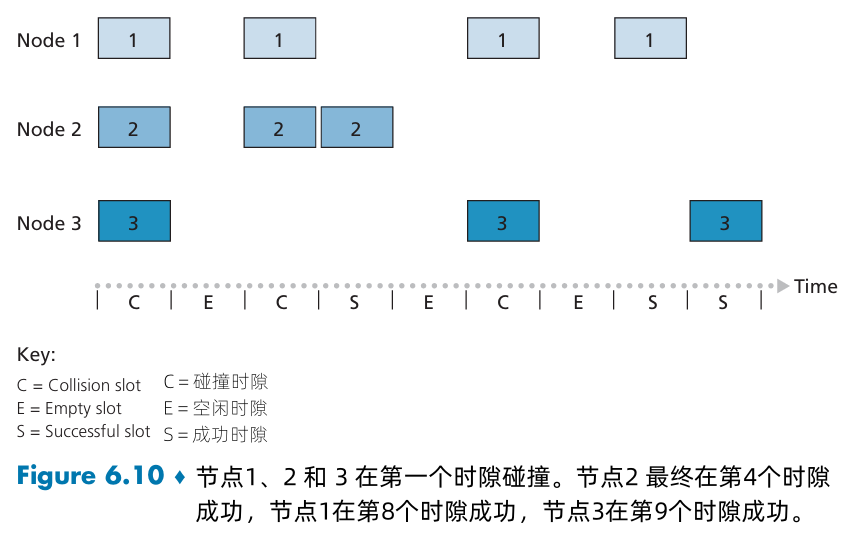

   🔴时隙多路访问协议的 **效率** (efficiency) 定义为：当有大量的活跃节点且每个节点总有大量的帧要发送时，长期运行中成功时隙的份额。

   注意到如果不适用某种形式的控制访问，且每个节点都在碰撞后立即重传这个效率将为零。时隙 ALOHA 的效率是多少？

   假设每个节点试图在每个时隙以概率 p 传输一帧。（也就是说，我们假设每个节点总有帧要发送，而且节点对新帧和已经经历一次碰撞的帧都以概率 p 传输。）假设有 N 个节点，则一个给定时隙是成功时隙的概率为节点之一传输而余下的 N-1 的节点不传输的概率，这个概率是 𝑁𝑝(1−𝑝)𝑁−1 。因此，当有 N 个活跃节点时，时隙 ALOHA 的效率是 𝑁𝑝(1−𝑝)𝑁−1 。为了获得 N 个活跃节点的最大效率，我们必须求出使这个表达式最大化的 𝑝∗。而且对于大量活跃节点，为了获得最大化效率，当 N 趋于无穷时，我们取 𝑁𝑝∗(1−𝑝∗)𝑁−1 的极限。

   这个协议的最大效率为 1/e = 0.37。也就是说，当有大量节点有很多帧要传输时，则仅有 37% 的时隙做有用的工作。信道有效传输效率仅为 0.37R bps。

   

   

2. ALOHA

   时隙 ALOHA 协议要求所有的节点同步它们的传输，以在每个时隙开始时开始传输。

   第一个 ALOHA 协议 实际上是一个非时隙、完全分散的协议。

   在纯 ALOHA 中：

   - 当一帧首次到达（即一个网络层数据报在发送节点从网络层传递下来），节点立刻将该帧完整地传输进广播信道。
   - 如果一个传输的帧与多个传输经历了碰撞，这个节点（在完全传输完它的碰撞帧之后）以概率 p 重传该帧。
   - 否则，该节点等待一个帧传输时间。在此等待之后，它则以概率 p 传输该帧，或者以概率 1-p 在另一个帧时间等待（保持空闲）。

   分析纯 ALOHA 的最大效率，我们关注某个单独的节点。我们的假设与在时隙ALOHA 分析中相同，取帧传输时间为时间单元。在任何给定时间，某节点传输一个帧的概率是 p。假设该帧在时刻 𝑡0 开始传输。

   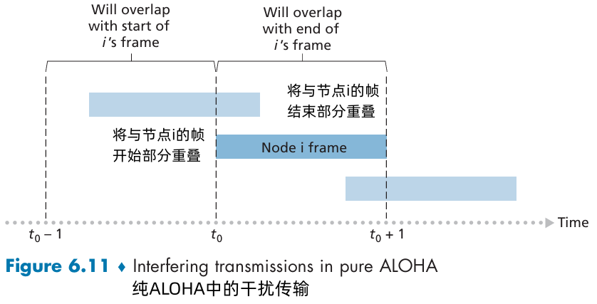

   为了使该帧能成功地传输，在时间间隔 [𝑡0−1,𝑡0] 中不能有其他节点开始传输。这种传输与节点 i 的帧传输起始部分重叠。所有其他节点在这个时间间隔不开始传输的概率为 (1−𝑝)𝑁−1 。类似地，当节点 i 在传输时，其他节点不能开始传输，因为这种传输将与节点 i 传输的后面部分相重叠。所有其他节点在这个时间间隔不开始传输也是 (1−𝑝)𝑁−1 。因此，一个给定的节点成功传输一次的概率是 𝑝(1−𝑝)2(𝑁−1) 。通过求极限，求得纯ALOHA协议的最大效率仅为  1/(2e)，这刚好是时隙 ALOHA 的一半。


1. 载波侦听多路访问 (Carrier Sense Multiple Access, CSMA)

   > 在时隙和纯 ALOHA 中，一个节点传输的决定独立于连接到这个广播信道上的其他节点的活动。特别是，一个节点不关心在它开始传输时是否有其他节点碰巧在传输，而且即使有另一个节点开始干扰它的传输也不会停止传输。

   CSMA 和 CSMA/CD 协议族中包含以下两个规则：

   - **载波侦听** (carrier sensing)：一个节点在 **传输前** 先听信道。如果来自另一个节点的帧正向信道上发送，节点则等待直到检测到 **一小段时间没有传输**，然后 **开始传输**。
   - **碰撞检测** (collision detection)：当一个传输节点在传输时 **一直侦听此信道**。如果它检测到另一个节点正在传输干扰帧，它就停止传输，在重复 “侦听-当空闲传输” 循环 之前等待一段随机时间。

   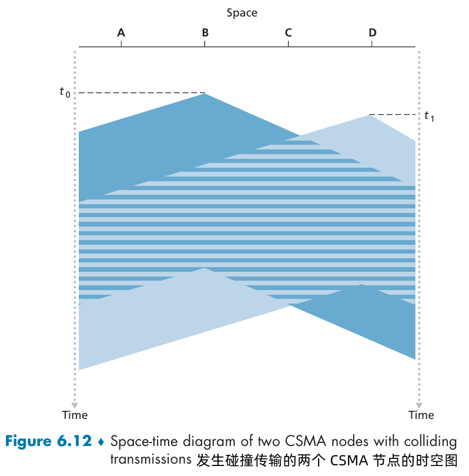

   上图显示了连接到一个线状广播总线的4个节点(A, B, C, D) 的时空图。横轴表示每个节点在空间的为止，纵轴表示时间。

   在时刻 𝑡0 ，节点侦听到信道是空闲的，因为当前没有其他节点在传输。因此节点B 开始传输，沿着广播媒体在两个方向上传播它的比特。B的比特随着时间的增加向下传播，这表明 B 的比特沿着广播媒体传播所时隙需要的时间不是零。在时刻 𝑡1 (𝑡1>𝑡0)，节点 D 有一个帧要发送。尽管节点B 在时刻 𝑡1 正在传输，但 B 传输的比特还没有到达 D，因此 D 在 𝑡1 侦听到信道空闲。根据 CSMA 协议，从而 D 开始传输它的帧。一个短暂的时间之后，B 的传输开始在 D 干扰 D 的传输。

   从上图中可以看出，显然广播信道的端到端 **信道传播时延** (channel propagation delay) (信号从一个节点传播到另一个节点所花费的时间)在决定其性能方面起着 关键作用。

   

2. 具有碰撞检测的载波侦听多路访问 (CSMA/CD)

   在图6.12中，节点没有进行碰撞检测；即使已经出现了碰撞，B 和 D 都将继续完整地传输它们的帧。

   当某节点执行 **碰撞检测** 时，一旦它检测到碰撞将立即停止传输。下图展示和图 6.12 相同的情况，只是两个节点在检测到碰撞后将立即停止传输。

   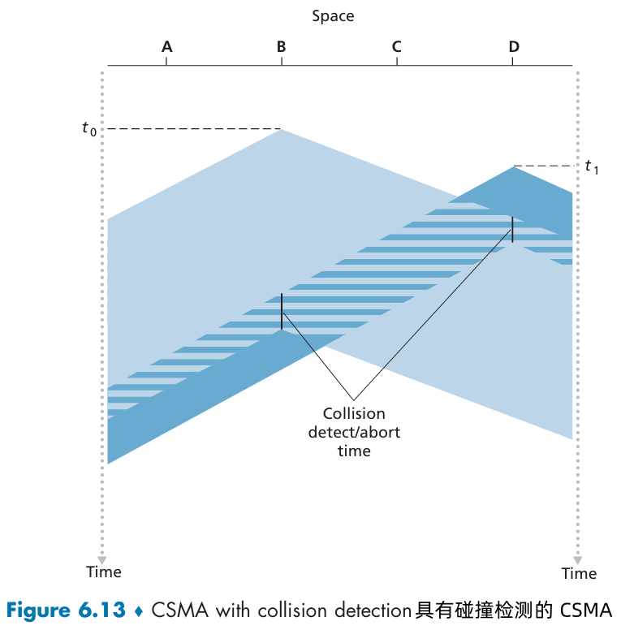

   从与广播信道相连的适配器（在节点中）的角度总结它的运行：

   1. 适配器从网络层一条获得 数据报，准备 **链路层帧**，将其放入 **帧适配器缓存** 中。
   2. 如果适配器侦听到 **信道空闲**（即 **无** 信号能量从信道进入适配器），它 **开始传输帧**。
   3. 在传输过程中，适配器 监视来自其他使用该广播信道的适配器的信号能量的存在。
   4. 如果适配器传输整个帧而未检测到来自其他适配器的信号能量，该适配器就完成了该帧。在另一方面，如果适配器在传输时检测到来自其他适配器的信号能量，它终止传输（即它停止了传输帧）。
   5. 中止传输后，适配器等待一个 **随机时间量**，然后返回步骤2。

   

   ⭐选择随机回退的时间间隔：**二进制指数后退** (binary exponential backoff) 算法。

   - 当传输一个给定帧时，在该帧经历了一连串的 n 次碰撞后，节点随机地从 {0, 1, 2, ···, 2𝑛 - 1} 中选择一个 K 值。因此，一个帧经历的碰撞越多，K 选择的间隔越大。
   - 对于以太网， 一个节点等待的实际时间量是 K·512比特时间（即发送 512 比特进入以太网所需时间量的 K 倍），**n 能够取的最大值在 10 以内**❗。

   例：

   - 假设一个适配器首次尝试传输一个帧，并在传输中它检测到碰撞。然后该节点以概率 0.5 选择 K=0，以概率 0.5 选择 K=1。
     - 如果该节点选择 K=0，则它立即开始侦听信道。
     - 如果这个适配器选择 K=1，它开始 “侦听-当空闲时传输”。**周期开始前等待** 512 比特时间（例如对于 100 Mbps 以太网来说为 5.12 ms）。
   - 在第 2 次碰撞之后，从 {0, 1, 2, 3} 中等概率地选择 K。
   - 在第 3 次碰撞之后，从 {0, 1, 2, 3, 4, 5, 6, 7} 中等概率地选择 K。
   - 在 10 次或更多次碰撞之后，从 {0, 1, 2, ···, 1023} 中等概率地选择 K。

   因此从中选择 K 的集合长度随着碰撞次数呈指数增长。

3. CSMA/CD 效率

   - CSMA/CD 效率 (efficiency of CSMA/CD) 定义为：当有大量的活跃节点，且每个节点有大量的帧要发送时，帧在信道中无碰撞地传输的那部分时间在长期运行时间所占的份额。

   - 𝑑prop ：信号能量在任意两个适配器之间传播所需的最大时间。

   - 𝑑trans ：传输一个最大长度的以太网帧的时间。

   - CSMA/CD 的效率：

     效率效率=11+5𝑑prop/𝑑trans

     从这个公式我们看到，当 𝑑prop 接近 0 时，效率接近 1。当 𝑑trans 变得很大时，效率也接近于 1。

   

   ### 6.3.3 轮流协议 (taking-turns protocol)

   

多路访问协议的两个理想特性：①当只有一个节点活跃时，该活跃节点具有 R bps 的吞吐量；② 当有 M 个节点活跃时，每个活跃节点的吞吐量接近 R/M bps。

- ALOHA 和 CSMA 协议具备第一个特性，但不具备第二个特性。

**轮流协议** (taking-turns protocol)

1. **轮询协议** (polling protocol)

   - 要求这些节点之一要被指定为 **主节点**。
   - 主节点 以 **循环** 的方式 **轮询** (poll) 每个节点。
   - 主节点 首先向 节点 1 发送一个报文，告诉它（节点1）能够传输的帧的最多数量。
   - 在节点1传输了某些帧后，主节点告诉节点2它能够传输的帧的最多数量。
   - 主节点能够通过观察在信道上是否缺乏信号来决定一个节点何时完成了帧的发送。
   - 上述过程以这种方式继续进行，主节点以循环的方式轮询了每个节点。

   轮询协议 消除 了困扰 随机接入协议 的 碰撞 和 空时隙，这使得轮询取得高得多的效率。

   缺点：

   - 引入了轮询时延。
   - 如果主节点有故障， 整个信道都变得不可操作。

   802.15协议和蓝牙协议就是轮询协议的例子。

2. **令牌传递协议** (token-passing protocol)

   - 没有主节点。

   - 一个称为 **令牌** (token) 的小的特殊帧在节点之间以固定的次序进行交换。

     例如，节点 l 可能总是把令牌发送给节点2，节点2可能总是把令牌发送给节点3，而节点N可能 总是把令牌发送给节点 1。

   - 当一个节点收到令牌时， 仅当它有一些帧要发送时，它才持有这个令牌； 否则，它立即向下一个节点转发该令牌。 当一个节点收到令牌时，如果它确实有帧要传输， 它发送最大数目的帧数，然后把令牌转发给下一个节点。

   令牌传递是分散的，并有很高的效率。 

   问题：一个节点的故障可能会使整个信道崩溃。 或者如果一个节点偶然忘记了释放令牌， 则必须调用某些恢复步骤使令牌返回到循环中来。 

   

   

### 6.3.4 DOCSIS：用于电缆因特网接入的链路层协议

一个电缆接入网通常在电缆网头端将几千个住宅电缆调制解调器与一个 **电缆调制解调器端接系统** (Cable Modem Termination System, CMTS) 连接。数据经电缆服务接口 (Data-Over-Cable Service Interface, DOCSIS) 规范，定义了电缆数据网络体系结构及其协议。 

- 使用 **频分复用**（FDM）将下行链路（从CMTS到调制解调器）和上行链路（从调制解调器到CMTS）网络段划分为多个频率通道。
  - 每个下行信道宽6MHz, 每个信道具有大约40Mbps 吞吐量	
    - CMTS在下行信道上通过发送称为 MAP报文的控制报文，指定哪个电缆调制解调器 （带有要发送的数据）能够在微时隙中传输由控制报文指定的时间间隔。 
    - 由于微时隙明确分配给电缆调制解调器，故CMTS能够确保在微时隙中没有碰撞传输。
  - 每个上行信道具有6.4MHz 的最大信道带宽，并且最大的上行吞吐量约为30Mbps
    - 每条上行信道被划分为时间间隔（类似千TDM)、 每个时间间隔包含一个微时隙序列，电缆调制解调器可在该微时隙中向 CMTS传输。 
    - CMTS显式地准许各个电缆调制解调器在特定的微时隙中进行传输。 
  - 每个上行和下行信道均为 **广播信道**。
  - CMTS在下行信道中传输的帧被所有在信道上做接收的电缆调制解调器接收到；然而因为仅有单一的 CMTS在下行信道上传输，不存在多路访问问题。
  - 但在上行方向，存在着多个有趣的技术挑战，因为多个电缆调制解调器共享到CMTS的相同上行信道（频率），因此能够潜在地出现碰撞。


## 6.4 交换局域网


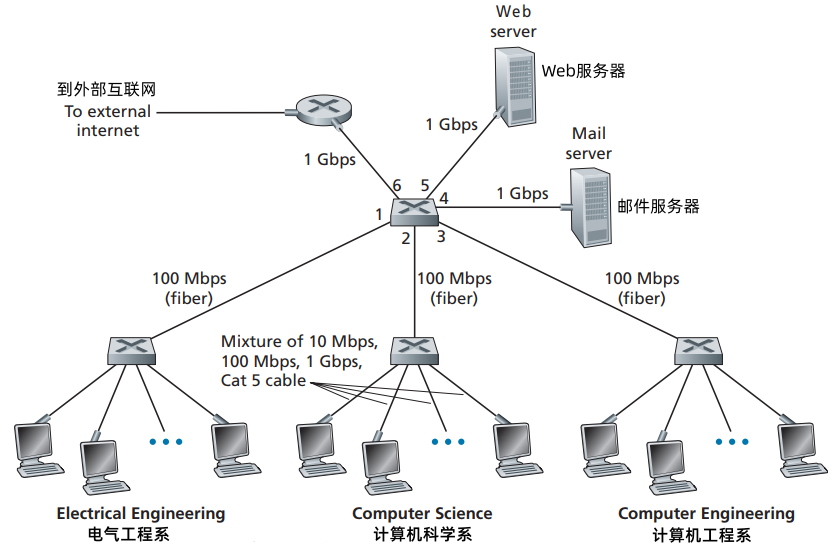

### 6.4.1 链路层寻址和 ARP

1. **MAC 地址**

   并不是主机或路由器具有链路层地址，而是它们的 适配器（即网络接口）具有链路层地址。因此，具有多个网络接口的主机或路由器将具有与之相关联的多个链路层地址。

   链路层交换机并不具有它们的接口（这些接口是与主机和交换机相连的）相关的链路层地址。这是因为链路层交换机的任务是在主机与路由器之间承载数据报；交换机透明地执行该项任务，主机或路由器不必明确地将帧寻址到其间的交换机。

   - 广播地址：FF-FF-FF-FF-FF-FF，48个连续的1组成的字符串。
   - 适配器的 MAC 地址具有扁平结构

2. **地址解析协议** 

   地址解析协议：实现 网络层地址 (因特网的 IP 地址) 和 链路层地址 (MAC 地址)之间的转换。(Address Resolution Protocol, ARP) 

   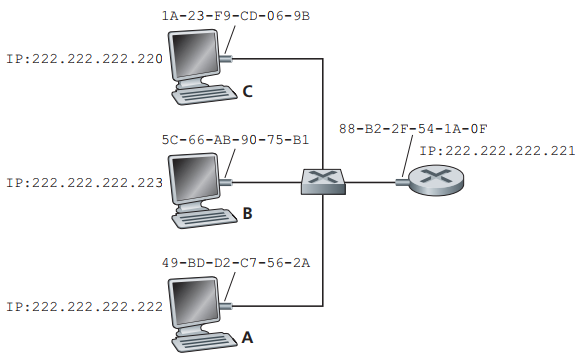

   考虑上图的网络，假设 IP 地址为 222.222.222.220 的主机要向主机 222.222.222.222 发送 IP 数据报。在本例中，源和目的均位于相同的子网中。

   - 为了发送数据报，该源必须向它的适配器不仅提供 IP 数据报，而且要提高目的主机 222.222.222.222 的 MAC 地址，然后 **发送适配器** 将构造一个包含目的地的 MAC 地址的 链路层帧，并把该帧发送进 局域网。

   发送主机如何确定 IP 地址为  的目的主机的  MAC 地址？

   - 使用 ARP。发送主机的 ARP 模块将取在相同局域网上的任何 IP 地址作为输入，然后返回 MAC 地址。发送主机 222.222.222.220 向它的 ARP 模块提供了 IP 地址 222.222.222.222，并且其 **ARP 模块** 返回了相应的 MAC 地址 49-BD-D2-C7-56-2A。
   - **ARP 模块** 只为在 **同一个子网** 上的 主机 和 路由器 接口解析 IP 地址。

   每台主机或路由器在其内存中具有一个 **ARP 表**（APR table），这张表包含 IP 地址到 MAC 地址的映射关系。这张表也包含一个寿命值 (TTL)，它指示了从表中删除每个映射关系的时间。

   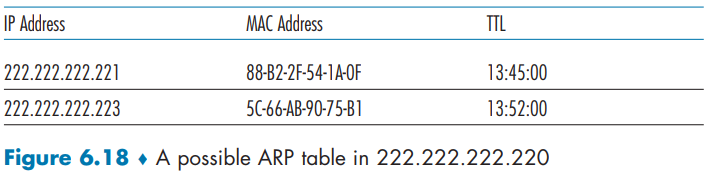

   - 假设主机 222.222.222.220 要发送一个数据报，该数据报要 IP 寻址到本子网另一台主机或路由器。发送主机需要通过 ARP 表 获得给定 IP 地址的目的主机的 MAC 地址。
   - 如果 ARP 表中没有该目的主机的表项，此时，发送方用 ARP 协议来解析这个地址。
     - 首先，发送方构造一个称为 ARP 分组 的特殊分组。
     - 一个 ARP 分组有几个字段，包括 发送和接收 IP 地址 及 MAC 地址。ARP 查询分组和响应分组都具有相同的格式。
     - 假设 222.222.222.220 向它的适配器传递一个 ARP 查询分组，并指示适配器应该用 MAC 广播该地址来发送这个分组。适配器在链路层帧封装这个 ARP 分组，用广播地址作为帧的目的地址，将该帧传输进子网中。
     - 该 ARP 查询的帧能被子网上的所有其他适配器接收到，并且每个适配器都把该帧中的 ARP 分组向上传递给 ARP 模块。这些 ARP 模块中的每个都检查它的 IP 地址是否与 ARP 分组中的目的  IP 地址匹配，与之匹配的一个给查询主机发送回一个带有所希望映射的响应 ARP 分组。
     - 然后查询主机 222.222.222.220 能够更新它的 ARP 表，并发送它的 IP 数据报，该数据报封装在一个 链路层帧中，并且该帧的目的 MAC 就是对先前 ARP 请求进行响应的主机或路由器 MAC 地址。
     - 查询 ARP 报文是在广播帧中发送的，响应 APR 报文是在一个标准帧中发送。
   - ARP 表是自动建立的。

3. **发送数据报到子网外** 

   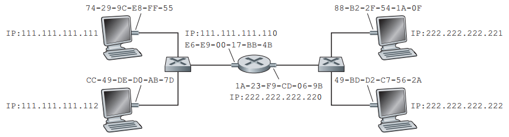

   当子网中的主机要向子网之外的主机发送网络层数据报。

   - 每台路由器对它的每个接口都有一个 IP 地址，每个接口也有一个 ARP 模块和一个适配字。

   该例，子网 1的网络地址为111.111.111/24 , 子网 2 的网络地址为 222.222.222/24。考察子网1上的一台主机将向子网2的一台主机发送数据报。假设，  主机111.111.111.111 要向 主机222.222.222.222 发送一个 IP 数据报。和往常一样，发送主机向它的适配器传递数据报。但是，发送主机还必须向它的适配器指示一个适当的目的 MAC 地址 。 该适配器应该使用什么 MAC 地址呢？  

   为了使一个数据报从 111.111.111.111 到子网2 上的主机，该数据报必须首先发送给路由器接口111.111.111.110，它是通往最终目的地路径上的第一跳路由器的 IP 地址。 因此，对于该帧来说，适当的 MAC 地址是路由器接口 111.111.111.110 的适配器地址，即E6-E9-00-17-BB-4B。但是发送主机怎样获得 111.111.111.110 的 MAC地址？通过使用 ARP！

   一旦发送适配器有了这个 MAC地址，它创建一个帧（包含了寻址到 222.222.222.222 的数据报），并把该帧发送到子网1中 。 在子网1上的路由器适配器看到该链路层帧是向它寻址的，因此把这个帧传递给路由器的网络层 。 之后要将该数据报从路由器移动到目的地。

   路由器现在必须决定该数据报要被转发的正确接口 。 如在第 4 章中所讨论的，这是通过查询路由器中的转发表来完成的 。 转发表告诉这台路由器该数据报要通过路由器接口 222.222.222.220 转发 。 然后该接口把这个数据报传递给它的适配器，适配器把该数据报封装到一个新的帧中，并且将该帧发送进子网 2 中。这时，该帧的目的 MAC 地址确实是最终目的地 MAC 地址。路由器也是通过 ARP 获得这个目的地的 MAC 地址。


### 6.4.2 以太网


- 集线器 (hub) 是一种物理层设备，作用于各个比特而不是作用于帧。当表示 一个 0 或 一个 1 的比特到达一个接口时，集线器只是重新生成这个比特，将其能量强度放大，并将该比特向其他所有接口传输出去。因此，采用基于集线器的星形拓扑的以太网也是一个广播局域网，即无论何时集线器从它的一个接口接收到一个比特，它向其所有其他接口发送该比特的副本。
- 21世纪初，以太网中心的集线器被交换机所替代。交换机仅运行在第二层。

1. 以太网帧结构

   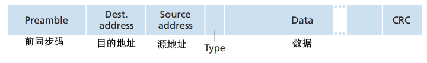

   - 数据字段：承载 IP 数据报

   - 目的字段：目的适配器的 MAC 地址

   - 源地址：传输该帧到局域网上的适配器的 MAC 地址

   - 类型字段

   - CRC：循环冗余检测

   - 前同步码：

     以太网帧以一个 8 字节的前同步码 (Preamble) 字段开始 。该前同步码的前 7 字节的值都是10101010; 最后一个字节是 10101011 。 前同步码字段的前 7 字节用于“唤醒“接收适配器，并且将它们的时钟和发送方的时钟同步 。 

   - 以太网技术向网络层提供无连接不可靠服务。

2. 以太网技术

   通过 转发器 能够得到更长的运行距离。转发器 是一种 物理层设备，它能在输入端接收信号并在输出端再生该信号。


### 6.4.3 链路层交换机

- 交换机的任务：接收入链路层帧并将它们转发到出链路。
- 交换机自身对子网中的主机和路由器是透明的。

1. **交换机转发和过滤**

   - **过滤**：决定一个帧应该转发到某个接口还是应当将其丢弃的交换机功能。
   - **转发**：决定一个帧应该被导向哪个接口，并把该帧移动到那些接口的交换机功能。
   - 交换机的过滤和转发功能借助于 **交换机表** 完成。

   交换机表中的一个表项包含：① 一个 MAC 地址，② 通向该 MAC 地址的交换机接口，③ 表项放置在表中的时间。

   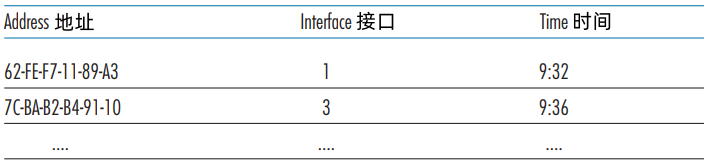

   假定目的地址为 DD-DD-DD-DD-DD-DD 的帧从交换机 x 到达，交换机用 MAC 地址 DD-DD-DD-DD-DD-DD 索引它的表。有 3 中可能的情况：

   - 表中没有对于 DD-DD-DD-DD-DD-DD 的表项。在这种情况下，交换机向除接口 x 外的所有接口前面的输出缓存转发该帧的副本。换言之，如果没有对于目的地址的表项，交换机广播该帧。
   - 表中有一个表项将 DD-DD-DD-DD-DD-DD 与接口 x 联系起来。这种情况下，该帧从包括适配器 DD-DD-DD-DD-DD-DD 的局域网网段到来。无须将该帧转发到任何其他接口，交换机通过丢弃该帧执行过滤功能即可。
   - 表项有一个表项将 DD-DD-DD-DD-DD-DD 与接口 y≠x 联系起来。这种情况下，该帧需要被转发到与接口 y 相连的局域网网段。交换机通过将该帧放到接口 y 前面的输出缓存中完成转发功能。

2. **自学习**

   交换机的自学习能力是如下方式实现的：

   (1) 交换机表初始为空

   (2) 对于在每个接口接收到的每个入帧，该交换机在其表中存储：① 在该帧源地址字段的 MAC 地址； ② 该帧到达的接口； ③ 当前时间。

   交换机以这种方式在它的表中记录了发送节点所在的局域网网段。如果在局域网上的每个主机都发送了一帧，则每个主机最终将在这个表中留有记录。

   (3) 如果在一段时间 (称为 老化期 (aging time)) 后，交换机没有接收到以该地址作为源地址的帧，就在表中删除这个地址。以这种方式，如果一台 PC 被另一台PC代替，原来 PC 的 MAC 地址将最终从交换机表中被清除掉。

3. **链路交换机的性质** 

   - 消除碰撞。
   - 异质的链路。
   - 管理。

4. 交换机 VS 路由器

   两者都是存储转发设备：

   - **路由器：** 网络层设备（检查网络层头部）
   - **交换机：** 数据链路层设备（检查数据链路层头部）

   两者都有转发表：

   - **路由器：** 使用路由算法和IP地址计算转发表
   - **交换机：** 使用泛洪、学习和MAC地址学习转发表

   **路由器** 负责在不同的网络之间路由数据包，它使用IP地址进行寻址，并通过路由算法计算出最佳路径。

   **交换机** 负责在同一网络内的设备之间转发数据帧，它使用MAC地址进行寻址，并通过学习的方式建立转发表。

   


### 6.4.4 虚拟局域网

普通的交换局域网：

- 缺乏流量隔离
- 交换机的无效使用
- 管理用户困难

解决方法：支持 虚拟局域网 (Virtual local area networks, VLANs) 的交换机。

- 允许经一个单一的物理局域网基础设施定义多个虚拟局域网。在一个 VLAN 内的主机彼此通信，仿佛它们（并且没有其他主机）与交换机连接。在一个基于端口的 VLAN 中，交换机的端口（接口） 由网络管理员划分为组 。 每个组构成一个 VLAN，在每个 VLAN 中的端口形成一个广播域（即来自一个端口的广播流量仅能到达该组中的其他端口） 。  

- 一种更具扩展性互联VLAN 交换机的方法：VLAN 干线连接 (VLAN trunking)。

  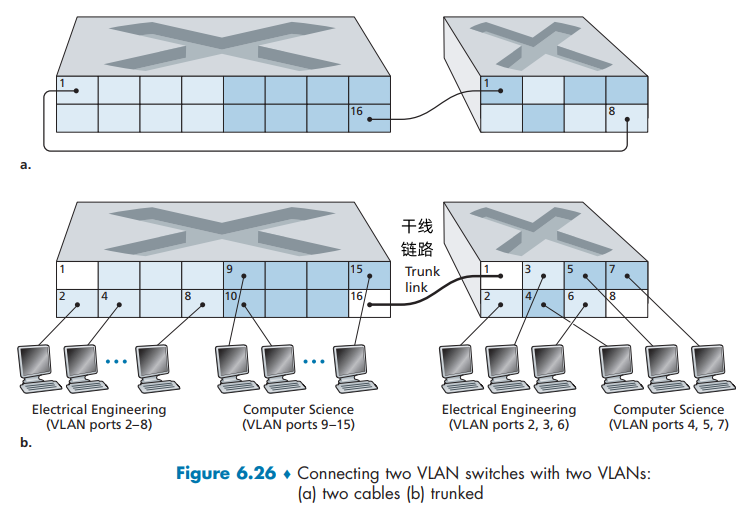

  在图 6-26b 所示的 VLAN 干线方法中，每台交换机上的一个特殊端口（左侧交换机上的端口16 , 右侧交换机上的端口 1) 被配置为干线端口，以互联这两台 VLAN 交换机 。 该干线端口属于所有 VLAN, 发送到任何 VLAN 的帧经过干线链路转发到其他交换机 。

  跨越 VLAN 干线的帧：

  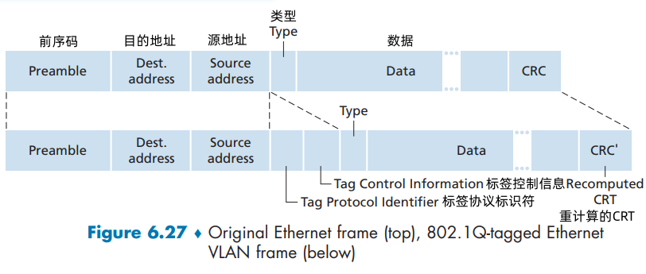 


## 6.5 链路虚拟化：网络作为链路

**多协议标签交换** (Multiprotocol Label Switching, MPLS)

- 与电路交换的电话网不同，MPLS客观上讲是一种 **分组交换的虚电路网络**，它们有自己的分组格式和转发行为。
- 改善 IP 路由器的转发速度，关键概念：**固定长度标签**。
- 对于基于固定长度标签和虚电路的技术，在不放弃基于目的地 IP 数据包转发的基础设施的前提下，当可能时通过选择性地标识数据报并允许路由器基于固定长度的标签（而不是目的地 IP 地址）转发数据报来增强功能。

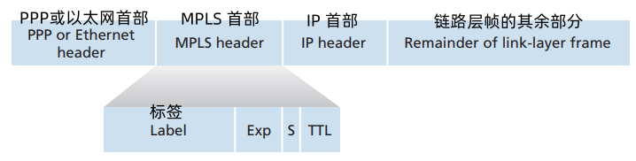

- 这个帧具有小的 MPLS首部，增加到 第二层首部和第三层首部之间。

- 一个 MPLS 加强的帧仅能在两个均为 MPLS 使能的路由器之间发送。

- 一个 MPLS 使能的路由器 常称为 **标签交换路由器**。

  它通过在转发表中查找 MPLS标签，然后立即将数据报给适当的输出接口来转发 MPLS 帧。因此不需要提取目的 IP 地址和在转发表中执行最长前缀匹配的查找。

  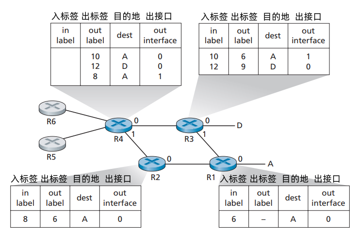

R1 和  R4 是 MPLS 使能的，R5 和 R6 是标准的 IP 路由器。

- R1 向 R2 和 R3 通告了它能够到达目的地 A，并且具有 MPLS 标签 6 的接收帧将要转发到目的地 A。
- 路由器 R3 向路由器 R4 通告它能够路由到目的地 A 和 D，分别具有 MPLS 标签 10 和 12 的入帧将朝着这些目的地交换。
- 路由器 R2 也像路由器 R4 通告它能到达目的地 A，具有 MPLS 标签 8 的接收帧朝着 A 交换。
- 到路由器 R4 现在处于一个到达 A 且具有 两个 MPLS 路径，经接口 0 具有出 MPLS 标签 10，经接口 1 具有出 MPLS 标签 8.
- MPLS 使能路由器 R1 到 R4 完成这些工作时从没有接触分组的 IP 首部。

## 6.6 数据中心网络

数据中心网络设计：

**负载均衡**

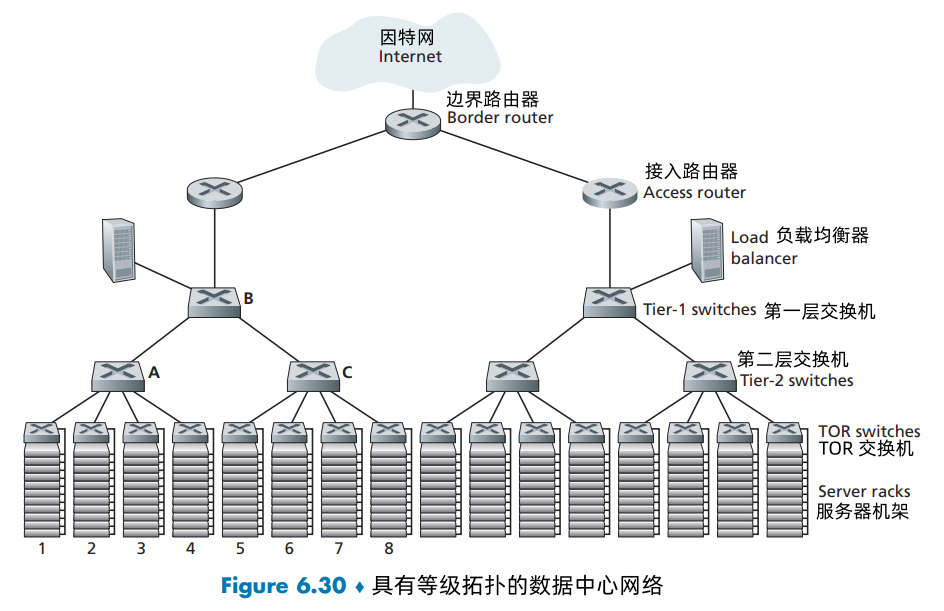

- 外部请求首先被定向到一个 **负载均衡器** (load balancer)
- 负载均衡器的任务：向主机分发请求。
- 负载均衡器，基于分组的目的端口号（第四层）以及目的 IP 地址做决策。
- 一旦接收到一个对于特定应用程序的请求，负载均衡器将该请求分发到处理该应用的某台主机上。主机处理完成后，向负载均衡器回送响应，再由负载均衡器将其中继发回给外部客户。
- 负载均衡器不仅平衡主机间的工作负载，还提供类似 NAT 的功能，将外部 IP 地址转换为内部适当主机的 IP 地址，然后反方向流向客户的分组按照相反的转换进行处理。
- 假设每台主机用 1 Gbps 链路连接到它的 TOR 交换机，而交换机间的链路 是 10 Gbps 的以太网链路，在相同机架中的两台主机总是能以 1 Gbps 全速通信。
- 考虑 40 对不同主机间的 40 条并发流的情况。假设机架1上的10台主机向机架5上对应的主机发送一条流，类似的，机架2和6、机架3和7、机架4和8之间也有 10 条并发流。如果每一条流和其他流经同一链路平均的共享链路容量，则 10Gbps的 A到 B 链路，每条流获得的速率为 10Gbps/50 = 250Mbps。

交换机、机架间互联丰富：

- 机架之间的吞吐量增加（多个可能路由路径）
- 通过冗余提高可靠性

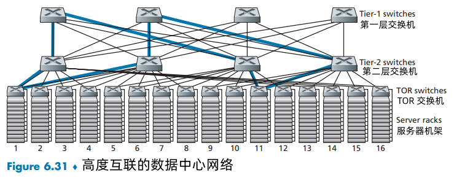

考虑40条流的例子，第一台第二层交换机和第2台第二层交换机存在4条不相交的路径，一共可以为前两台交换机之间提供总和为 40 Gbps 的聚合容量。


## 6.7 回顾：Web 页面请求的历程⭐

Bob 便携机 想上网。

1. 准备：DHCP、UDP、IP 和 以太网【第一步不涉及 ARP❗】
2. 仍在准备：DNS 和 ARP
3. 仍在准备：域内路由选择到 DNS 服务器
4. Web 客户-服务器交互：TCP 和 HTTP


# 7 无线网络和移动网络

## 7.1 概述

无线网络的要素：

- **无线主机**
- **无线链路**：主机通过无线通信链路连接到一个基站或者另一台无线主机。
- **基站**：负责与之关联的无线主机发送数据和从主机那里接收数据。
  - 一台无线主机与某基站“相关联”
    1. 该主机位于该基站的无线通信范围内
    2. 该主机使用该基站中继它和更大网络之间的数据。
- **网络基础设施**：主机希望与之通信的更大网络

与基站关联的主机通常被称为以 基础设施模式 运行。在 **自组织网络** (ad hoc network) 中，无线主机没有这样的基础设施与之相连。主机本身必须提供诸如路由选择、地址分配、类似于 DNS 的名字转换等服务。

当一台主机的移动超出了一个基站的覆盖范围而到达另一个基站的覆盖范围后，它将改变其接入到更大网络的连接点，这一过程称为 **切换** (handoff)。

对无线网络分类：① 在该无线网络中的分组是否 **跨越了一个无线跳或多个无线跳**。② 网络中是否有诸如 基站 这样的**基础设施**。

- 单跳，基于基础设施。

  这些网络具有与较大的有线网络连接的基站。

  例：在教室、图书馆使用的 802.11 网络

- 单跳，无基础设施。

  不存在与无线网络相连的基站。

  例：蓝牙

- 多跳，基于基础设施。

  一个基站表现为以有线方式与较大网络相连，然而某些无线节点为了经该基站通信，可能不得不通过其他无线节点中继它们的通信。

- 多跳，无基础设施。

  没有基站，节点为了到达目的地可能必须在几个其他无线节点之间中继报文。节

  例如：移动自组织网络，车载自组织网络

  


## 7.2 无线链路和网络特征

有线链路和无线链路间的区别：

- **递减的信号强度**：电磁波穿过物体时强度将减弱即使在自由空间，信号仍将扩散，这使得信强度随着发送方和接收方距离的增加而减弱。
- **来自其他源的干扰**：在同一频段发送信号的电波源将相互干扰。
- **多径传播**：当电磁波的一部分受物体和地面反射，在发送方和接收方之间走了不同长度的路径，则会出现 多径传播。这使得接收方收到的信号变得模糊。位于发送方和接收方之间的移动物理可能导致多径传播随时间而改变。


评估无线网络：

- **信噪比** (SNR)：信号与噪声强度的相对测量。
- **比特差错率** (BER)：接收方接收到有错传输比特的概率。

物理层的特征：

- 给定调制方案，SNR 越高，BER 越低。
- 对于给定的 SNR，具有较高比特传输率的调制技术 将具有高的 BER。
- 物理层调制技术的动态选择能用于适配对信道条件的调制技术

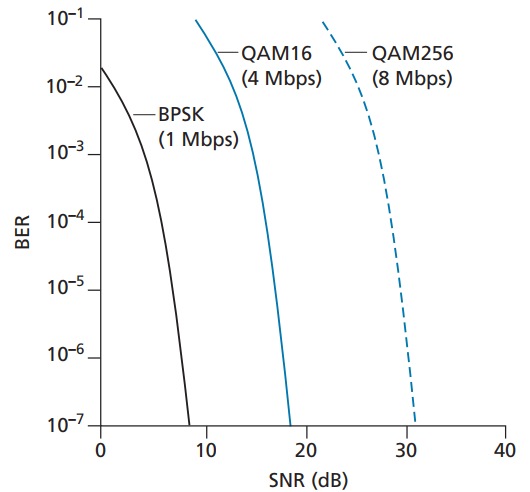

站点A正在向站点B通信，同时假定站点C也在向站点 B传输。 由千所谓的 **隐藏终端问题**  , 即使 A 和 C 的传输确实是在目的地B发生干扰，环境的物理阻挡（例如，一座大山或者一座建筑）也可能会妨碍A和C互相听到对方的传输。 


**CDMA**

- **码分多址** (Code Division Multiple Access, CDMA)
- 要发送的每个比特通过乘以一个信号（编号）的比特来进行编码。
- 这个信号的变化速率（通常称为，**码片速率**）比特初始数据比特序列的变化速率快得多。
- 假设初始数据比特到达 CDMA 编码器的速率定义了时间单元，也就是说，每个要发送的初始数据比特需要 1 比特时隙时间。设 𝑑𝑖 为第 𝑖 个比特时隙中的数据比特值。我们把具有 0 值的数据比特表示为 -1。每个比特时隙又进一步细分为 M 个微时隙。发送方使用的 CDMA编码由 M 个值的一个序列 𝑐𝑚 组成，𝑚=1,⋯,𝑀 ，每个取值为 +1 或者 -1。

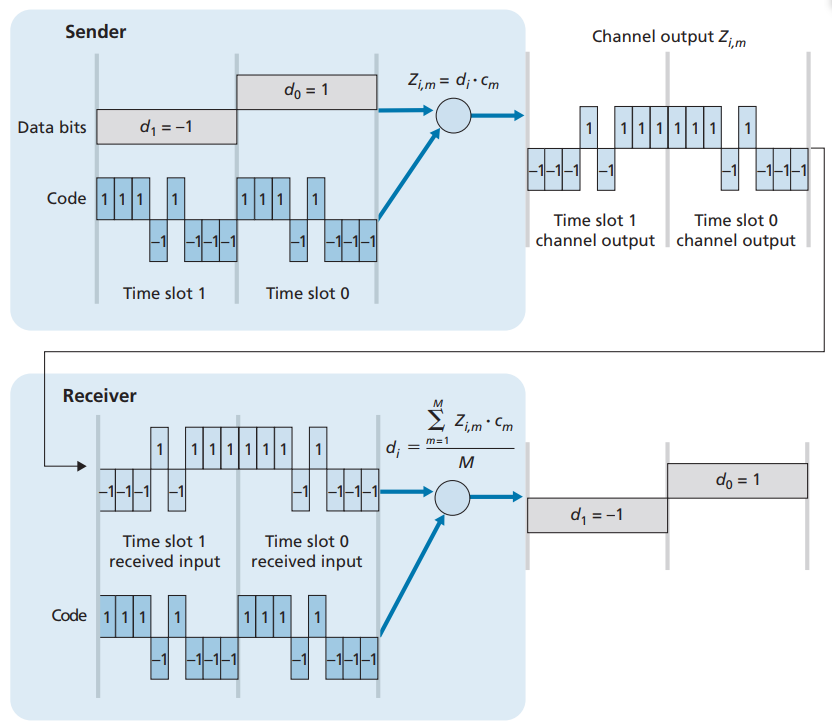

- 关注第 𝑖 个数据比特 𝑑𝑖 ，对于 𝑑𝑖 比特传输时间的第 m 个微时隙，CDMA编码器的输出 𝑍𝑖,𝑚=𝑑𝑖⋅𝑐𝑚 

  没有干扰的发送方时，接收方接收到编码的比特 𝑍𝑖,𝑚 ，恢复初始的数据比特 𝑑𝑖：

  𝑑𝑖=1𝑀∑𝑚=1𝑀𝑍𝑖,𝑚⋅𝑐𝑚


CDMA 的工作有一种假设：对干扰的传输比特是加性的，这意味着，例如在同一时隙，如果3个发送端都发送 1，第4个发送端发送 -1，那么哪个微时隙中所有接收方接收的信号都是 2（因为 1 + 1 + 1 - 1 = 2）。存在多个发送方时，发送方 𝑠 计算它编码后的 𝑍𝑖,𝑚𝑠 ，计算方式和上面的一致，然而在 𝑖 个比特时隙的第𝑚 个微时隙期间，接收方收到的值是从所有 𝑁 个发送方传输的比特的总和：

𝑍𝑖,𝑚∗=∑𝑠=1𝑁𝑍𝑖,𝑚𝑠

如果仔细选择发送方的编码，每个接收方只通过式 𝑑𝑖=1𝑀∑𝑚=1𝑀𝑍𝑖,𝑚⋅𝑐𝑚 中同样的方式使用发送方的比特，就能够从聚合信号中恢复一个给定的发送方发送的数据：d

𝑑𝑖=1𝑀∑𝑚=1𝑀𝑍𝑖,𝑚∗⋅𝑐𝑚

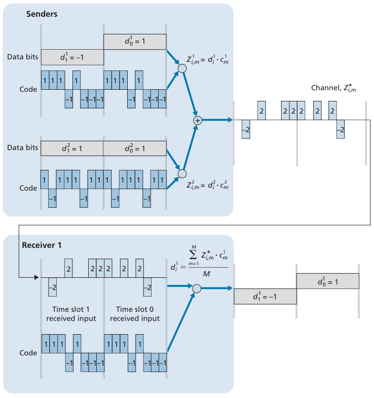

## 7.3 WiFi: 802.11 无线 LAN

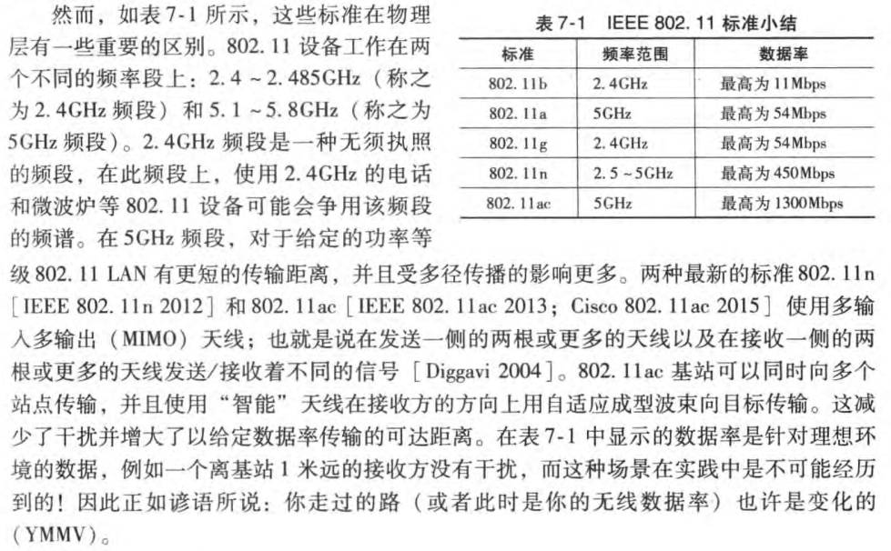

### 8.3.1 802.11 体系结构

- **基础服务集** (Basic Service Set, BSS)：802.11 的基本构建模块
- 一个 BSS 包含一个或多个无线站点和一个中央基站（802.11术语：**接入点** (Access Point, AP)）
- **基础设施无线 LAN**：配置 AP 的 无线 LAN
- 802.11b：传输速率最大 **11Mbps** ❗


**信道与关联**

- 802.11 定义了 11 个部分重叠的信道，当且仅当两个信道由 4 个或更多信道隔开时它们才无重叠。特别的：信道1、6 和 11 是唯一的 3 个非重叠信道的集合。
- 在 802.11中，每个无线站点在能够发送或者接收网络层数据之前，必须一个一个 AP 关联。
- WIFI 丛林，是一个任意物理位置，在这里无线站点都从两个或多个 AP 收到很强的信号。

为了获得因特网接入，无线站点需要加入一个子网因此需要与其中的一个 AP 相关联。关联意味着这一无线站点在自身和 该 AP之间创建一个虚拟线路。仅有关联的 AP 才向你的无线站点发送数据帧，且你的无线站点也仅仅通过关联 AP 向因特网发送数据帧。

每个 AP 周期性地发送信标帧，每个信标帧包括该 AP 的 SSID 和 MAC地址。无线站点为了得知正在发送信标帧的 AP，扫描 11 个信道，找出来自可能位于该区域的 AP 所发出的信标帧。通过信标帧了解到可用的 AP后，选择一个 AP 用于关联。

- 802.11b：2.4GHz-2.485GHz频谱被划分为11个不同频率的信道
  - AP（接入点）管理员为AP选择频率
  - 可能存在干扰：信道可能与相邻AP选择的信道相同！
- 主机：必须与AP关联
  - 扫描信道，监听包含AP名称(SSID)和MAC地址的信标帧
  - 选择要关联的AP
  - 可能执行身份验证[第8章]
  - 通常会运行DHCP以获取AP子网中的IP地址


- 扫描信道和监听信标帧的过程：**被动扫描**
- 无线主机也能够执行主动扫描。

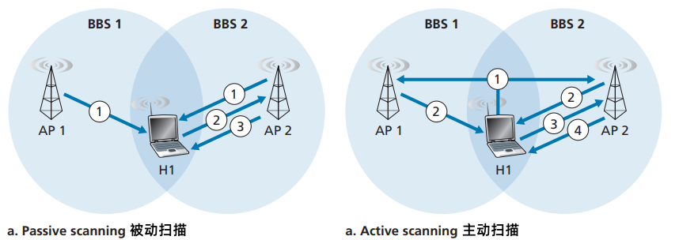

- **被动扫描**
  1. 自AP发送信标帧
  2. H1 向选择的AP发送关联请求帧
  3. 选择的AP向 H1 发送关联响应帧
- **主动扫描**
  1. 自 H1 广播 **探测请求帧**
  2. 自AP发送 **探测响应**
  3. H1 向选择的AP发送关联请求帧
  4. 选择的AP向 H1 发送关联响应帧

### 8.3.2 802.11 MAC 协议

- **带碰撞避免的** CSMA：CSMA/CA

  CA - collision avoidance

- 802.11 的 **链路层确认方案** 

  - 目的站点收到一个通过 CRC 校验的帧后，它等待一个被称作 **短帧时间间隔**(Short Inter-Frame Spacing, SIFS) 的一小段时间，然后发回一个 **确认帧**。如果发送站点在给定时间内未收到确认帧，使用 CSMA/CA 协议访问该信道。
  - 如果在若干固定次重传后仍未收到确认，发送站点将放弃发送并丢弃该帧。

- CSMA/CA 协议：

  假设有一个站点（无线站点或者 AP）有一个帧要发送。

  1. 如果某站点最初监听到信道空闲，它将在一个被称作 **分布式帧间间隔** (Distributed Inter-Frame Space, DIFS) 的短时间段后发送该帧。

  2. 否则，该站点选取一个 随机回退值 并且在 侦听信道空闲时递减该值。当侦听到信道忙时，计数值保持不变。

  3. 当计数值减为 0 时，该站点发送整个数据帧并等待确认。

  4. 如果收到确认，发送站点知道它的帧已被目的站正确接收了。

     如果该站点要发送另一帧，它将从第二步开始 CSMA/CA 协议。如果未收到确认，发送站点将重新进入第二步中的回退阶段，并从一个更大的范围内选取随机值。

  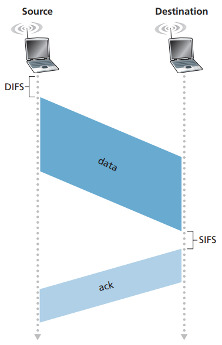

- 处理隐藏终端：RTS 和 CTS

  - 允许站点发送一个 短 **请求发送** (Request to Send, RTS) 控制帧 和 一个短**允许发送** (Clear to Send, CTS) 控制帧来预约对信道的访问。
  - 发送方要发送一个 DATA 帧时，它能够首先向 AP 发送一个 RTS 帧，指示传输 DATA 帧和确认 (ACK) 帧需要的总时间。
  - 当 AP 收到 RTS 帧后，它广播一个 CTS 帧作为响应。
  - 这个 CTS 帧有两个目的：给发送方明确的发送许可，指示其他站点在预约期内不要发送。

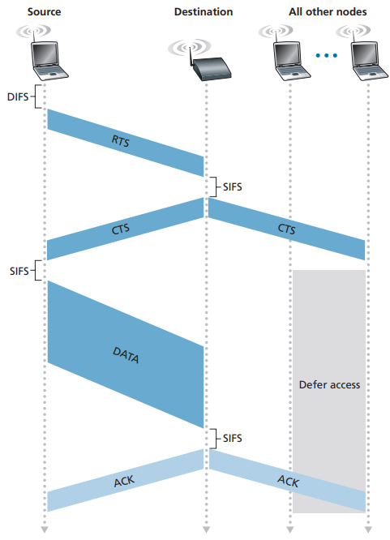


IEEE 802.11：多路访问

- 避免冲突：2个或更多节点同时传输
- 802.11：CSMA - 传输前侦听
- 不与其他节点正在进行的传输发生冲突
- 802.11：无冲突检测！
- 传输时由于接收信号弱（衰减）而难以接收（检测冲突）
- 在任何情况下都无法检测到所有冲突：隐藏终端、衰减
- 目标：避免冲突：CSMA/CA（冲突避免）


IEEE 802.11 MAC协议：CSMA/CA

802.11 发送方

1. 如果侦听到信道空闲持续 DIFS（分布式帧间间隔）时间，则传输整个帧（无冲突检测）

2. 如果侦听到信道忙碌，则开始随机退避时间

   在信道空闲时，计时器倒计时

   计时器到期时开始传输

   如果没有收到ACK（确认），则增加随机退避间隔，重复步骤2

802.11 接收方 - 如果帧接收正确

- 在SIFS（短帧间间隔）后返回ACK（由于隐藏终端问题需要ACK）

避免碰撞

想法：允许发送方**“预留”信道**，而不是随机访问数据帧：避免长数据帧的碰撞

- 发送方首先使用CSMA向基站发送小的请求发送（RTS）数据包
  - RTS可能仍然会相互碰撞（但它们很短）
- 基站广播允许发送（CTS）以响应RTS
- 所有节点都能听到CTS
  - 发送方传输数据帧
  - 其他站点推迟传输

使用小的预留数据包完全避免数据帧碰撞！                                                                                                                                                                                                                                                                                                                                                                                                                                                                                                                        


### 7.3.3 IEEE 802.11 帧

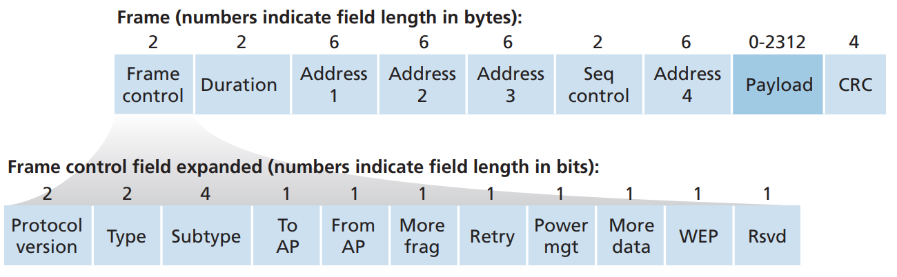

- 帧的核心是有效载荷：通常由一个 IP 数据报或者 ARP 分组组成。
- 地址字段: 当 AP 在自组织模式中相互转发时使用第四个地址。
  - 地址1：要接收该帧的无线站点的 MAC 地址。
  - 地址2：传输该帧的站点的 MAC地址。
  - 地址3：BSS 是一个子网的一部分，这个子网经过一些路由器接口与其他子网相连。地址 3 包含这个路由器接口的  MAC 地址。

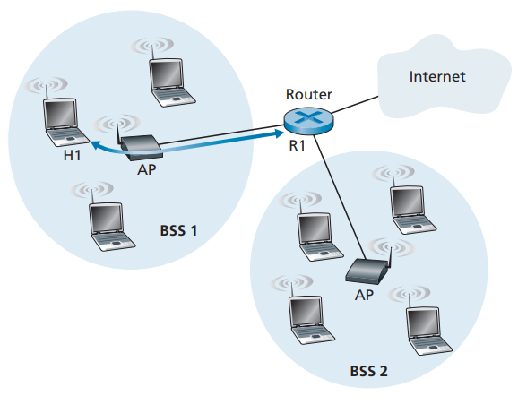

上图中，有两个 AP，每个 AP 负责一些无线站点。每个 AP 到路由器有一个直接连接，路由器又依次连接到全球因特网。我们应当记住 **AP 是链路层设备**❗，它既不能“说” IP 又不理解 IP 地址。

考虑将一个数据报从路由器接口 R1 移到无线站点 H1。

- 路由器并不清楚在它和 H1 之间有一个 AP；从路由器的观点来说，H1仅仅是路由器所连接子网的一台主机。
- 路由器知道 H1 的 IP 地址。使用 ARP 来确定 H1 的 MAC 地址，这与在普通的以太网 LAN 中相同。获取 H1 的 MAC 地址后，路由器接口 R1 将该数据报封装在一个以太网帧中。该帧的源地址字段包含了 R1 的 MAC 地址，目的地址字段包含 H1 的 MAC 地址。
- 该以太网帧到达 AP 后，该 AP 将其传输到 无线信道前，先将该 **802.3 以太网帧**转换为 **802.11 帧**。AP 将地址 1 和地址2分别填上 H1 的 MAC 地址和 自身的 MAC 地址，对于地址 3，AP 插入 R1 的  MAC 地址。通过这种方式，H1 可以确定（从地址3）将数据报发送到子网中的路由器接口的 MAC 地址。

考虑从 H1 移动一个数据报到 R1 的过程中无线站点 H1 进行响应时发生的情况。

- H1 生成一个 802.11 帧，分别用 AP 的 MAC 地址和 H1的 MAC地址填充 地址1和地址2，地址3插入 R1 的 MAC 地址。
- 当 AP 收到该 802.11 帧后，将其转换为 以太网帧。该帧的源地址字段是 H1 的 MAC 地址，目的地址是 R1 的 MAC 地址。因此，地址3允许 AP 构建以太网帧时能够确定目的 MAC 地址。

### 7.3.4 在相同的 IP 子网中的移动性

802.11: 在同一子网内的移动性

- H1保持在同一IP子网内：可以保持相同的IP地址

- 交换机：哪个接入点（AP）与H1关联？

  自学习功能（第5章）：交换机会看到来自H1的数据帧，并“记住”哪一个交换机端口可以用来到达H1

H1 从 BSS1 移动到 BSS2 时具体会发生哪些事呢？

- 随着 Hl 逐步远离 AP1, H1 检测到来自 AP1 的信号逐渐减弱并开始扫描一个更强的信号 。 H1 收到来自 AP2 的信标帧。 H1然后与 AP1 解除关联，并与 AP2 关联起来 ，同时保持其 IP 地址和维持正在进行的 TCP 会话 。

### 7.3.5 802.11 的高级特色

- 速率适应：自适应当前和近期信道特点来选择下面的物理层调制技术。
- 功率管理


### 8.3.6 个人域网络：蓝牙和 ZigBee

802.15: 个人区域网络（PAN）

- 直径小于10米
- 替代电缆（如鼠标、键盘、耳机的连接线）
- 自组织网络：无需基础设施
- 主从架构：
  - 从设备请求发送权限（向主设备）
  - 主设备授予请求
- 802.15: 源自蓝牙规范的演进
  - 使用2.4-2.5 GHz无线电频段
  - 最高速率达721 kbps

这个标准通常指的是IEEE 802.15.4，它是为低速无线个域网（LR-WPANs）设计的一种通信协议，常用于智能家居设备和物联网（IoT）应用。不过，需要注意的是，802.15家族包含多个不同的标准，每个标准针对不同类型的个人区域网络，例如802.15.1更接近于描述经典的蓝牙技术。上述描述中提到的速率和频段信息可能具体适用于802.15.1（蓝牙）而不是802.15.4。

- 蓝牙：
  - IEEE 802.15.1 网络，以 TDM 方式工作与无需许可证的 2.4 GHz 无线电波段。
  - 无线个人域网络，Wireless Personal Area Network, WPAN
  - 802.15.1网络是自组织网络
- ZigBee
  - IEEE标准化的第二个个人域网络。
