# 并行程序设计导论

## 1 为什么要并行化

### 1.1 为什么需要不断提升的性能

- 不断提升的计算能力称为许多飞速发展领域的核心力量
- 气候模拟
- 蛋白质折叠
- 药物发现
- 能源研究
- 数据分析


### 1.2 为什么需要构建并行系统

- 单处理器性能提升的主要原因之一：日益增加的集成电路晶体管密度。
- 通过继续增快继承电路的速度来提高处理器性能的方法变得不再可行。
- 如何利用不断增加的晶体管密度：**并行**。
- 集成电路制造商：在单个芯片上放置多个处理器。（多核处理器）

### 1.3 为什么需要编写并行程序

- 串行程序改写为并行程序。
- 最好的并行化，可能通过一步步回溯，然后发现一个全新的算法来得到。

代码分析：计算 n 数的值再累加求和，串行代码：

```c
sum = 0;
for(i=0; i<n; i++){
    x = Compute_next_value(...);
    sum += x;
}
```

假设有 p 个核，且 p 远小于 n，那么每个核能够计算大约 n/p 个数的值并累加求和，以得到部分和：

```c
my_sum = 0;
my_first_i = ...;
my_last_i = ...;
for(my_i = my_first_i; my_i < my_last_i; my_i++){
    my_x = Compute_next_value(...);
    my_sum += my_sum;
}
```

此块的前缀 `my_` 代表每个核都使用自己的私有变量，并且每个核能够独立于其他核来执行该代码块。

**方法1** 每个核计算完各自的 `my_sum` 值后，将自己的结果值发送给一个指定为 “master” 的核（主核），master 核收到的部分和累加得到全局和：

```
if(I'm the master core){
    sum = my_sum;
    for each core other than myself{
        receive value from core;
        sum += value;
    }
}else{
    send my_sum to the master;
}
```

**方法2** 当核的数目比较多时，不再由 master 核计算所有部分和的累加工作，可以两两结对，0核将自己的部分和与 1 号核的部分和做加法，2号核将自己的部分和与3号核的部分和做加法，4号核将自己的部分和与5号核的部分和做加法，以此类推。然后，再在偶数核上重复累加部分和：0号核加上2号核，4号核加上6号核，以此类推。

如图1-1所示。圆圈表示当前核所得到的和，箭头表示一个核将自己的部分和发送给另一个核，加号表示一个核在收到另一个核发送来的部分和后与自己本身的部分相加。

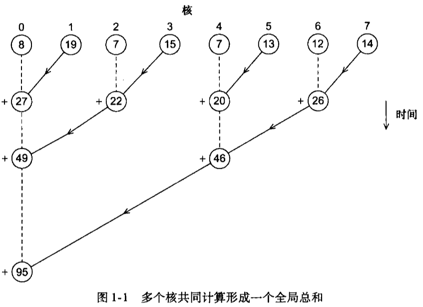

**分析**：上述两种计算全局总和的算法中，master 核承担了更多的工作量，整个程序计算全局总和的时间 = master 核的计算时间。 在 8 个核的情况下，① 第一种方法，master 核需要执行 7 次接收操作。② 第二种方法，master 核仅需执行 3 次执行操作，提高了 2 倍。 在 1000 个核的情况下，① 第一种方法需要 999 次接收和加法操作，② 第二种方法 10次，提高了100倍。

1. 第一种计算全局总和的方法是对串行求和程序的一般化。
2. 第二种计算全局总和的方法与原来的串行程序并没有多大关系。


### 1.4 怎样编写并行程序

大部分方案的基本思想：将要完成的任务分配给各个核。

两种广泛采用的方法：

- **任务并行**：将待解决问题所需要执行的各个任务分配到各个核上执行。
- **数据并行**：将待解决问题所需要处理的数据分配给各个核，每个核在分配到的数据集上执行大致相似的操作。

计算全局总和的例子：

- 第一部分可以认为是 数据并行 的一个实例。数据是通过 Compute_next_value 计算得到的值，该值在所赋予的数据集上执行大致相同的操作。
- 第二部分认为是 任务并行 的一个实例。总共有两个任务：
  1. 一个任务由 master 核执行，负责接收 其他核 传来的 部分和，并 累加部分和。
  2. 另一个任务由 其他核 执行，负责将自己计算得到的部分和传递给 master 核。
- **协调过程** 包括：
  - **通信**，一个或多个核将自己的 部分和结果 发送给其他的核。
  - **负载均衡**，在各个核心之间均匀分配工作，以避免某个核心过载。
  - **同步**，由于每个核心以自己的速度工作，确保各核心之间不会相差太远。


### 1.5 我们将做什么

两种并行系统：

- **共享内存系统**
  - 每个核能够共享访问计算的内存，理论上每个核能够读、写内存的所有区域。因此可以通过检测和更新共享内存的数据来协调各个核。
- **分布式内存系统**
  - 每个核都拥有自己的私有内存，核之间的通信是显式的，必须使用类似于在网络中发送消息的机制。

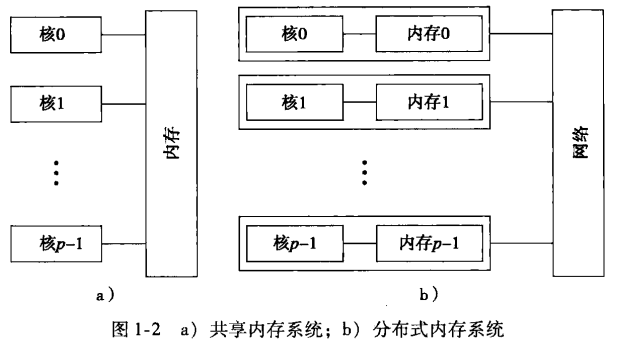

### 1.6 并发、并行、分布式

- **并发计算**：一个程序的多个任务在同一时间段内可以同时执行。
- **并行计算**：一个程序通过多个任务紧密协作来解决某个问题。
- **分布式计算**：一个程序与其他程序协作来解决某个问题。

并行程序和分布式程序都是并发的。


## 2 并行硬件和并行软件

### 2.1 背景知识

**冯·诺依曼结构**

- **冯·诺依曼结构**：主存、中央处理单元、以及 主存 和 CPU 之间的互连结构。
  - **主存**：有很多区域，每个区域都可以存储指令和数据。每个区域都有一个地址，可以通过这个地址来访问向相应的区域及区域中存储的数据和指令。
  - **中央处理单元** (CPU)：分为 控制单元 和 算术逻辑单元。
    - 控制单元：决定应该执行程序中的哪些指令。
    - 算术逻辑单元：负责执行指令。
    - **寄存器**：存储 CPU 中的数据和程序执行时的状态信息。
    - **程序计数器**：用于存放下一条指令地址的特殊的寄存器。
- 数据/指令传送到 CPU = 数据/指令从内存中取出或读出。
- 输出/指令从CPU 传送到 主存中 = 数据/指令 写入或存入 内存中。
- **冯·诺依曼瓶颈**：主存和 CPU 之间的分离带来的数据访问瓶颈。


**进程、多任务及线程**

- **操作系统**：用来管理计算机的软件和硬件资源的主要软件。

- **进程**：运行着的程序的一个实例。

  一个进程包括如下实体：

  - 可执行的机器语言程序。
  - 一块内存空间。
  - 操作系统分配给进程的资源描述符。
  - 安全信息。
  - 进程状态信息。


### 2.2 对冯诺依曼模型的改进

- Cache (缓存)

  **高速缓冲存储器** (cache, 简称 缓存) 的访问时间 比其他存储区域的访问时间短。

  **CPU 缓存** 是一组相比于主存，CPU 能更快访问的 **内存区域**。

  - 空间局部性：程序访问完一个存储区域往往会访问接下来的区域。

  - 局部性：在访问完一个内存区域（指令或者数据），程序会在不久的将来（时间局部性）访问邻近的区域（空间局部性）。

  - 为了运用局部性原理，系统使用 更宽的互连结构 来访问数据的指令。

  - 一次内存访问能存取一整块代码和数据，而不只是 单条指令 和 单条数据。这些块称为 **高速缓存块** 或 **高速缓存行**。

  - Cache 分为不同的层。

  - 如果 CPU 需要访问指令或数据时，它会沿着 Cache 的层次结构向下查询，首先查询 L1 cache，接着 L2 cache。以此类推，如果 Cache 中没有所需要的信息，就会访问主存。

  - 当向 Cache 查询信息时，Cache 中有信息，则称为 **Cache命中** 或 **命中**。

    如果信息不存在，则称为 **Cache缺失** 或 **缺失**。

  - 当 CPU 向 Cache 中写数据时，Cache 中的值就会 不同 或 不一致。解决不一致性的方法：

    - **写直达** Cache中：当 CPU 向 Cache 写数据时，高速缓存会立即存入主存。
    - **写回** Cache 中：数据不是立即更新到主存中，而是将发生数据更新的高速缓存行标记成脏，当发生高速缓存替换时，标记为脏的高速缓存行倍写入主存。

- Cache 映射

  - **全相联 Cache**：每个高速缓存行能够放置在 Cache 中的任意位置。
  - **直接映射** Cache：每个高速缓存行在 Cache 中有唯一的位置。
  - **n 路组相联**：每个高速缓存能放置到 Cache 中 n 个不同区域位置的一个。
  - 当内存中的行（多于一行）能被映射到 Cache 中的多个不同位置时，需要决定                      **替换** 或者 **驱逐** Cache 中的哪一行。
  - 最常用的替换方案：**最近最少使用**，CPU 记录各个块的被访问的次数，替换最近访问次数最少的块。

- Cache 和程序：一个实例

  C 语言以 “**行主序**” 来存储二维数据，行主序存储模式下，先存储二维数组的第一行，紧接着第二行，以此类推。

  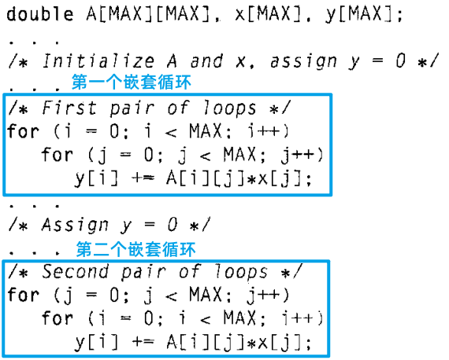 

  **分析**：上面代码中，第一个嵌套循环 比 第二个嵌套循环 具有更好的性能，因为它 顺序访问二维数组 中的数据。

- **虚拟存储器**

  - 利用 **虚拟存储器**，主存可以作为辅存的缓存。它通过在主存中存放当前执行程序所需要用的部分，利用时间和空间局部性；那些暂时用不到的部分存储在辅存的块中，称为 **交换空间**。
  - 虚拟存储器也是对数据块和指令块进行 操作。这些块通常称为页。
    - 页，通常很大。
    - 大多数系统采用固定大小的页，从 4~16kB 不等
  - **虚拟页号**：
    - 当程序被编译时，其页面会被分配虚拟页号。
    - 当程序运行时，会创建一个表，将虚拟页号映射到物理地址。
    - 使用页表将虚拟地址转换为物理地址。
  - 使用页表会增加程序总体的运行时间。
  - 处理器有一种专门用于地址转换的缓存：**转译后备缓冲区** (Translation-Lookaside Buffer, TLB)：在快速存储介质中缓存一些页表的条目。
    - 如果想要访问的页面不在内存中，即页表中该页没有合法的物理地址，该页只存储在磁盘上，那么这次访问称为 **页面失效**。
    - 磁盘访问代价太大，应该尽可能避免，所以虚拟内存通常采用写回方案。
    - 采用 **写回** 方案。

- **指令集并行**

  - **指令集并行**：通过让多个处理器部件或者功能单元同时执行指令来提高处理器的性能。

  - 两种主要方法实现指令集并行：

    - **流水线**：将功能单元分阶段安排。
    - **多发射**：让多条指令同时启动。

  - **流水线**

    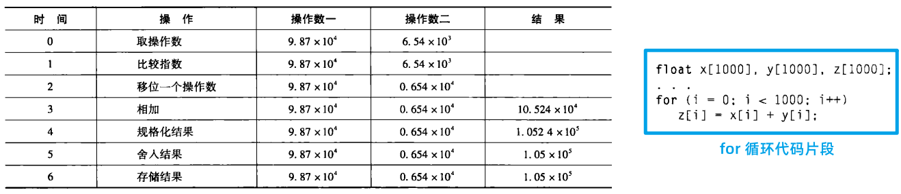

    - 每个操作 1 ns，则加法操作 7 ns，这个 for 循环需要 7000 纳秒。
    - 另一个方案：将浮点数加法器划分为 7 个独立的硬件或功能单元。第一个单元取两个操作数，第二个比较指数，以此类推。假设一个功能单元的输出是下面一个功能单元的输入，那么加法功能单元的输出是规格化结果的功能单元的输入。在时间5后，流水循环每1纳秒产生一个结果，而不再是每 7 纳秒一次，所以，执行 for 循环的总时间从 7000 纳秒降低到 1006 纳秒，提高了近 7 倍。

  - **多发射**

    - 流水线通过将功能分成多个单独的硬件或功能单元，并把它们按顺序串接起来提高性能。
    - 多发射处理器通过 **复制功能单元** 来同时执行程序中的不同指令。
    - **静态多发射**：功能单元编译时调度
    - **动态多发射**：运行时间调度的。
    - **超标量**：一个支持 动态多发射的处理器。
    - 为了能够利用 多发射，系统必须找出能够同时执行的指令，其中一种最重要的技术是 **预测**。
    - 在预测技术中，编译器或者处理器对一条指令进行猜测，然后再猜测的基础上执行代码。

  - **硬件多线程**

    - 线程级并行 (Thread-Level Parallelism, TLP)：尝试通过同时执行不同线程来提供并行性。TLP 提供的是粗粒度并行，即同时执行的程序基本单元（线程）比细粒度的程序单元更大。

    - **硬件多线程**：为系统提供了一种机制，使得当前执行的任务被阻塞，系统能够继续其他有用的工作。

    - **细粒度** 多线程中，线程在每条指令执行完后切换线程，而跳过被阻塞的线程。

    - **同步多线程**：通过允许 **多个线程同时使用多个功能单元** 来利用超标量处理器的性能。

      我们指定“优先”线程，那么能够在一定程度上减轻线程减速的问题。优先线程 是指有多条指令就绪的线程。

### 2.3 并行硬件

#### 2.3.1 SIMD 系统

- Flynn 分类法：用来对 计算机体系结构 进行分类。按照它能够同时管理的指令流数目和数据流数目来对系统分类。

- **单指令多数据流** (SIMD)系统是 并行系统。

  - 将数据项分配给各个处理器来实现并行性。（**数据并行**）
  - SIMD 系统通过对多个数据执行相同的指令从而实现在多个数据流上的操作。
  - **缺点**：所有算术逻辑单元必须执行相同的指令，否则保持空闲。在经典的设计中，它们还必须同步操作。ALU 没有指令存储，对于大规模数据并行问题非常有效，但对于其他类型更复杂的并行问题则不然。

- **向量处理器**：能够对数组或者数据向量进行操作。

  典型的特性有以下特征：

  - **向量寄存器**。能够存储由多个操作数组成的向量，同时能够同时对其内容进行操作的寄存器。
  - **向量化和流水化的功能单元**。对向量中的每个元组做同样的操作。
  - **向量指令**。在向量上操作的指令。
  - **交叉存储器**：由多个内存“体”组成，每个内存体能够独立访问。在访问完一个内存体之后，再次访问它之前需要一个时间延迟，但如果接下来的内存访问是另一个内存体，那么它很快能访问到。
  - **步长式存储器访问和硬件散射/聚集**：程序能够访问向量中固定间隔的元组。
  - 速度快，容易使用，高存储带宽。
  - 不能处理不规则的数据结构和其他的并行结构。可扩展性是个限制。可扩展性：能够处理更大问题的能力。

- 图形处理单元 (GPU)

  - 实时图形应用编程接口使用 点、线、三角形来表示物体的表面。

  - 使用图形处理流水线 把物体表面的内部表示 转换为一个像素的数组。

  - 编程阶段的行为可以通过 **着色函数** 来说明。

  - GPU 通过**使用 SIMD 并行**来优化性能。

    这是通过在每个 GPU 处理核引入大量的 ALU 来获取的。

  - 实际线程的数目依赖于着色函数需要的资源的数量。


#### 2.3.2 MIMD 系统 

- 系统 **支持同时多个指令流在多个数据流上操作**。

  通常包括一组完全独立的处理单元或者核，每个处理单元或者核都有自己的控制单元和 ALU。

- MIMD 通常是异步的。

- MIMD 主要有两种类型：**共享内存系统** 和 **分布式内存系统**。

- **共享内存系统**：一组自治的处理器通过互联网络与内存系统相互连接，每个处理器能够访问每个内存区域。在共享内存系统中，处理器通过访问共享的数据结构来隐式地通信。

  - 广泛使用的共享内存系统使用一个或多个多核处理器。一个多核处理器在一块芯片上有多个 CPU 或核。通常，每个核都拥有私有的 L1 Cache，而其他的 Cache 可以在核之间共享，也可以不共享。

  - 在拥有多个多核处理器的共享内存系统中，共享内存的方式：

    - **第一种**：互联网络将所有的处理器连接到主存。每个核访问内存中任何一个区域的时间都相同。“**一致内存访问** (UMA)”

      容易编程。

    - **第二种**：将每个处理器连接到一块内存，通过处理器中内置的特殊硬件使得各个处理器可以访问内存中的其他快。访问与核直接连接的那块内存区域比访问其他内存区域要快很多。“**非一致内存访问** (NUMA)”

      可以使用更大的内存。

- **分布式内存系统**：每个处理器都有自己私有的内存空间，处理器-内存对之间通过互联网络相互通信。处理器之间是通过发送消息或者使用特殊的函数来访问其他处理器的内存，从而进行显式的通信。
  - 最广泛使用的分布式内存系统：**集群** (clusters)，它们由一组商品化系统组成，通过商品化网络连接。实际上，这些系统中的节点（通过通信网络相互连接的独立计算单元），通常都是一个或多个多核处理器的共享内存系统。这种系统通常称为混合系统。
  - **网络** 提供一种基础架构，使地理上分布的计算机大型网络转换成一个分布式内存系统。通常，这样的系统是异构的，即每个节点都是由不同的硬件构造的。

 

#### 2.3.4 Cache 一致性

- **情景分析** 

  假如共享系统中有两个核，每个核都有各自的私有的数据 Cache。

  假设，x 是一个共享变量并初始化为 2，y0 是 核0 私有的，y1 和 z1 是 核1 私有的。现在假设按指定时序执行下面的语句：

  | 时间 | 核0             | 核1             |
  | ---- | --------------- | --------------- |
  | 0    | y0 = x;         | y1 = 3*x;       |
  | 1    | x = 7;          | 没有包含x的语句 |
  | 2    | 没有包含x的语句 | z1 = 4*x        |

  - y0 的内存区域最终得到值 2，y1 的内存区域最终得到值6。
  - **z1 的值无法确定**：时间 0 时刻，x 已经在核 1 的 Cache 中。
    - 除非出于某些原因，x 清除出核0的 Cache，然后再重新加载到核1 的 Cache 中，此时 z1 赋值使用的是最新值 x = 7，z1 = 28。
    - 否则，z1 仍然使用 Cache 中的 x = 2，得到 z1 = 8。

- 这种不可预测的行为与系统使用写直达还是写回策略无关。

  核0 在 时间1 更新主存的时候，并不会修改 核1 的 Cache 值。

- 两种主要的方法来保证 Cache 的一致性：**监听 Cache 一致性协议** 和 **基于目录的 Cache 一致性协议**。

- **监听 Cache 一致性协议** 

  当一个核更新Cache 中 x 的副本，就会广播通知其他核包含 x 的整个 Cache 行已经更新。

  1. 互联网络不一定是总线，只要能够支持从每个处理器广播到其他处理器。
  2. 如果是写直达 Cache，每个核都能“检测”写。
  3. 如果是写回 Cache，就需要额外的通信，因为对 Cache 的更新不会立即发送给内存。

- **基于目录的 Cache 一致性协议** 

  使用一个叫 **目录** (directory) 的数据结构。目录存储每个内存行的状态。一般地，这个数据结构是分布式的。

  - 假设 每个核/内存对 负责存储一部分的目录。这部分目录表示局部内存对应高速缓存行的状态。
  - 当一个高速缓存行被读入时，与这个高速缓存行相对应的目录项就会更新，表示 核 0 有这个行的副本。当一个变量需要更新时，就会查询目录，并将所有包含该变量高速缓存行置为非法。
  - 目录需要大量额外的存储空间。

- **伪共享**

  - 原因：CPU Cache 是由硬件来实现的。因为 **硬件** 是对 **高速缓存行** 进行操作而不是对单独的变量进行操作。这个特点可能会对性能带来极坏的影响。

  - **代码分析** 

    ```c
    int i, j, m, n;
    double y[m];
    /* 赋值 y = 0 */
    ...
    for(i = 0; i < m; i++)
        for(j = 0; j < n; j++)
            y[i] += f(i, j);
    ```

    重复调用 `f(i, j)` ，并将计算的值添加到一个向量中。

    为了并行化，将外部循环的各次迭代分配给各个处理器核来处理。假如有 core_count 个核，可能把第一个 m/core_count 个迭代分配给第一个核，下一个  m/core_count 个迭代分配给第二个核，以此类推。

    ```c
    /* 私有变量 */
    int i, j, iter_count;
    /* 共享变量 */
    int m, n, core_count;
    double y[m];
    
    iter_count = m/core_count;
    
    /* 核0 进行以下操作 */
    for(i = 0; i < iter_count; i++)
        for(j = 0; j < n; j++)
            y[i] += f(i, j);
    
    /* 核1 进行以下操作 */
    for(i = iter_count + 1; i < 2*iter_count; i++)
        for(j = 0; j < n; j++)
            y[i] += f(i, j);
    ...
    ```

    现在假设 共享内存系统 有 两个核，`m=8` ，双精度浮点数长度为 8 ，高速缓存行是 64字节，`y[0]` 存储在高速缓存行的起始位置。一个高速缓存行能够存储 8 个双精度浮点数，y 占一整个高速缓存行中。

    - 当核 0 和 核1 同时执行代码时，因为 y 的所有值都存储在单个高速缓存行中，所以每次一个核执行语句 `y[i] += f(i, j)` 时，高速缓存行就会失效，
    - 当另一个核尝试执行该语句时，就必须从内存中将更新过的高速缓存行取出。所以，如果 n 很大，尽管 核0 和 核1 不会访问 y 中对方的元素，但我们能预料到，大量的赋值操作 `y[i] += f(i, j)` 会访问主存。这称为 **伪共享**。因为系统表现的好像核之间会共享 y。

    > 多个线程 同时修改位于 **同一缓存行** 中的 不同变量，导致缓存行频繁失效，进而降低性能。

    **伪共享** 不会引发错误结果，但是，**它能引起过多不必要的访存**，**降低程序的性能**。可以通过在线程或者进行中临时存储数据，再把临时存储的数据更新到共享存储来降低共享带来的影响。


2.3.5 共享内存与分布式内存

- 分布式内存系统比较适合于那些需要大量数据和计算的问题。

### 2.4 并行软件

> 在运行共享内存系统中，会启动一个进程，然后派生 (folk) 出多个线程。
>
> 讨论共享内存程序时，通常指 正在执行任务的线程。
>
> 当讨论分布式内存程序时，使用的是多个处理器，所以我们指的是正在执行任务的进程。

#### 2.4.1 注意事项

本书余下部分只讨论 MIMD 系统的软件。

- 主要关注 **单程序多数据流** (Single Program, Multiple Data, SPMD) 程序。

- SPMD 程序 仅包含一段可执行代码，通过条件转移语句，可以让一段代码在执行表现得像是在不同处理器上执行不同的程序。

  ```
  if(I'm thread/process 0)
      do this;
  else
      do that;
  ```

- SPMD 程序也能够实现数据并行：

  ```
  if(I'm thread/process 0)
      operate on the first half of the array;
  else
      operate on the second half of the array;
  ```

- **任务并行**：将任务划分，分给各个进程或线程来实现并行。

  


#### 2.4.2 进程或线程的协调

假如有两个数组，我们想要将它们相加：

```c
double x[n], y[n];

for(int i = 0; i < n; i++)
    x[i] += y[i];
```

为了并行化这段代码，只需要将数组中的元素分配给线程或者进程。

在这个例子，程序只需要

1. 将任务在 进程/线程 之间**分配**

   ① 这个分配可以使得每个进程/线程 获得 **大致相等的工作量**。

   需要在进程/线程之间平均分配任务从而满足条件 ①，这称为 **负载均衡**。

   ② 这个分配可以使得需要的 **通信量是最小** 的。

   **并行化**：将串行程序或算法转换为并行程序的过程。

2. 安排 进程/线程 之间的**同步** 

3. 安排 进程/线程 之间的**通信** 


#### 2.4.3 共享内存

共享内存系统中，变量是可以 **共享的**(shared) 或 **私有的**(private)。

- 共享变量可以被任何线程读、写，而私有变量只能被单个线程访问。
- 线程间的通信是通过共享变量实现的，所以通信是隐式的。


- **动态线程和静态线程**

  - 许多情况下，共享内存程序使用的是 **动态线程**。

    - 在这种范式中，有一个 **主线程**，并在任何时刻都有 **一组工作线程**（可能为空）。主线程通常 **等待工作请求**（例如，通过网络）。
    - 当一个请求到达时，它 **派生出一个工作线程** 来执行该请求。
    - 当工作线程 **完成任务**，就会 **终止执行再合并到主线程中**。

    这种模式充分利用了系统的资源，因为线程需要的资源只再线程实际运行时使用。

  - 另一种程序运行模式是 **静态线程** 范式。

    - 在这种范式中，主线程再完成必需的设置后，派生出所有的线程，在工作结束前所有的线程都在运行。
    - 当所有的线程都合并到主线程后，主线程需要做一些清理工作（如释放内存），然后也终止。

    这种范式在资源利用方面不是很高效。但是，线程的派生和合并操作是耗时的，所以如果所需的资源是可用的，静态线程模式可能获得更高的性能。它也更接近于分布式内存编程中最广泛使用的模式。

- **非确定性** (Nondeterminism)

  - 在任何一个 MIMD 系统中，如果处理器 **异步执行**，那么很可能会引发 **非确定性**。

  - 给定的输入能产生不同的输出，这种计算称为 **非确定性**。

  - 如果多个线程独立执行任务，每次运行时它们完成语句的速度各不相同，那么程序的结果也不同。

    

  **示例1**：线程0的 my_x 的值是 7，线程1 的 my_x 的值是 19

  ```c
  printf("Thread %d > my_val = %d\n", my_rank, my_x);
  ```

  两种输出可能：

  ```
  Thread 0 > my_val = 7
  Thread 1 > my_val = 19
  ```

  也可能是：

  ```
  Thread 1 > my_val = 19
  Thread 0 > my_val = 7
  ```

  - 线程独立执行并且独立地与操作系统进行交互，执行一个线程完成一段语句所花的时间在不同次的执行也是不同，所以语句执行的顺序是不能预测的。

  - 在共享内存程序中，非确定性容易导致程序错误。

    

  **示例2**：假设一个线程计算一个 int 型整数，这个 int 型整数存储在私有变量 my_val 中。假设想要将 my_val 的值加到共享内存的 x 位置中，x 初始化为 0.两个线程都要执行下面的代码：

  ```c
  my_val = Compute_val(my_rank);
  x += my_val;
  ```

  一次加法操作通常需要将两个数加载到寄存器、相加、最后存储结果。为了使过程简单化，假设值加载时，是从主存中直接加载到寄存器中；在存储时，直接将值从寄存器存储到主存中。

  下面是一个可能的时间顺序：

  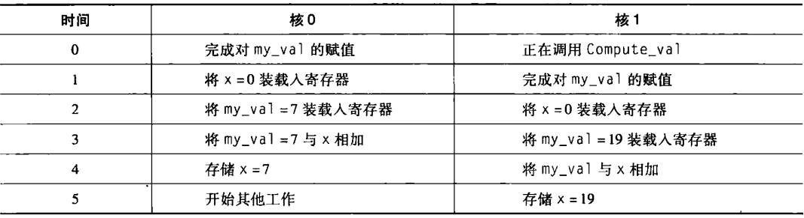 

  显然这不是我们想要的，也很容易想象到，有其他事件顺序会产生一个 x 的不正确值。这里的非确定性是两个线程尝试同时更新内存区域 x 而造成的。

  - 当线程或者进程尝试 **同时访问一个资源** 时，这种访问会引发错误，我们经常说程序有 **竞争条件**。

    在上面的例子中，线程竞争执行 `x += my_val` 。这种情况下，除非一个线程在另一个线程开始前，计算完成 `x += my_val` ，结果才是正确的。

  - **一次只能被一个线程执行** 的代码 称为 **临界区**。

  - 保证互斥执行的最常用机制是 **互斥锁** (mutual exclusion clock) 或 **互斥量** (mutex)，或者 **锁** (lock)。

    **互斥量** 是由硬件支持的一个特殊类型的对象。基本思想是：每个临界区由一个锁来保护。在一个线程能够执行临界区的代码前，它必须通过调用一个互斥量函数来获取互斥量，在执行完临界区代码时，通过调用解锁函数来释放互斥量。

  - **监视器**：在更高层次提供互斥执行。监视器是一个对象，这个对象的方法，一次只能被一个线程执行。

  - 当一个线程 “拥有” 锁时，即从调用加锁函数返回但还没有调用解锁函数时，其他线程尝试执行临界区中的代码必须在调用加锁函数时等待。

  因此，为了保证代码正常运行，我们必须修改代码，使它看起来像：

  ```c
  my_val = Compute_val(my_rank);
  Lock(&add_my_val_lock);
  x += my_val;
  Unlock(&add_my_val_lock);
  ```

  使用互斥量加强了临界区的串行性。

  - 替代互斥量的方案：**忙等待**，一个线程进入一个循环，这个循环的目的只是测试一个条件。

  ```c
  my_val = Compute_val(my_rank);
  if(my_rank == 1)
      while(!ok_for_1);  /* 忙等待 */
  x += my_val;
  if(my_rank == 0)
      ok_for_1 = true;
  ```

- **线程安全性**

  - 谨慎使用 有 静态局部变量 的函数。函数中声明的静态变量，在函数调用时不会被销毁。因此，静态变量能够被调用函数的 线程共享，这会引起无法预测的后果。

  - C 语言 string 库函数的 `strtok` ，将一个输入字符串分成多个子字符串。当它第一次调用时，传递一个待分割的字符串，而在随后的调用中，它返回分割好的连续的字串。在第一次调用时，通过一个 **静态的** `char *` 变量来指示传递给它的字符串。

    现在假设有两个线程要将字符串分割成子串。首先，线程0对 `strtok` 进行了首次调用，然后在 线程 0 完成分割操作完成前，线程1就对 `strtok` 的首次调用，这样会导致线程 0 的字符串丢失或者覆盖，在随后的调用时它会得到线程 1 的子串。

  - 类似 `strtok` 这样的函数**不是 线程安全** 的。如果它被多线程程序使用，那么会产生错误或者未知结果。当一段代码不是线程安全的，通常是因为不同的线程在访问共享的数据。


#### 2.4.4 分布式内存

- 在分布式内存程序中，各个核能够直接访问自己的私有内存。

- 分布式内存程序通常执行多个进程。

- **消息传递**

  消息传递的 API （至少）要提供一个发送和一个接收函数。进程之间通过它们的序号相互识别。序号的范围从 0~p-1，其中 p 表示进程的个数。

  例如，进程1 可以使用下面的伪代码向进程0发送消息：

  ```
  char message[100];
  ...;
  my_rank = Get_rank();
  if(my_rank == 1){
      sprintf(message, "Greetings from process 1");
      Send(message, MSG_CHAR, 100, 0);
  }else if(my_rank == 0){
      Receive(message, MSG_CHAR, 100, 1);
      printf("Process 0 > Received: %s\n", message);
  }
  ```

  - 程序段是 SPMD，两个进程使用相同的可执行代码，但执行不同的操作。
  - 不同进程中，变量 message 指向不同的内存块。
  - 调用 Send 函数最简单的行为是 **阻塞**。
  - **广播** 通信：单个进程发送相同的数据给所有的进程。
  - **归约** (reduction)，在归约函数中，将各个进程计算的结果汇总成一个结果。

- **单向通信** 

  - 消息传递中，一个进程必须调用一个发送函数，并且发送函数必须与另一个进程调用的接收函数相匹配。任何通信都需要两个进程的显式参与。
  - **单向通信** 或 远程内存访问中，单个处理器调用一个函数。在这个函数中，或者用来自另一个进程的值来更新局部内存，或者使用来自调用进程的值更新远端内存。
  - 简化通信，消除进程间同步的代价，降低通信的开销。

  

### 2.5 输入和输出

当并行程序需要输入/输出时，我们会做一些假设并遵循一些规则：

- 在分布式内存程序中，只有进程 0 能够访问 `stdin`。

  在共享内存程序中，只有主线程或线程0能够访问 `stdin` 

- 在分布式内存和共享内存系统中，所有线程/进程都能够访问 `stdout` 和 `stderr` 。

- 因为输出到 `stdout` 的非确定性顺序，大多数情况下，只有一个进程/线程会将结果输出到 `stdout` 。但输出调试程序的结果是一个例外。这种情况下，允许多个进程/线程写 `stdout` 。

- 只有一个进程/线程会尝试访问一个除 stdin\stdout 或者 stderr 外的文件。所以，每个进程/线程能够打开自己的私有文件进行读、写，但是没有两个进程/线程能够打开相同的文件。

- 调试程序输出在生成输出结果时，应该包括进程/线程的序号或者进程标识符。

### 2.6 性能

#### 2.6.1 加速比和效率 ⭐

当在 p 核系统上运行程序，每个核运行一个进程或线程，并行程序的运行速度就是串行程序速度的 p 倍。如果我们称 串行运行时间为 串行𝑇串行 ，并行运行时间为 并行𝑇并行，那么最佳的预期是 并行串行𝑇并行=𝑇串行/𝑝 ，此时，我们称并行程序有 **线性加速比**。

程序的 **加速比**：

串行并行𝑆=𝑇串行𝑇并行

线性加速比为 S = p，这非常难达到。


**效率**：

串行并行串行并行𝐸=𝑆𝑝=𝑇串行𝑇并行𝑝=𝑇串行𝑝⋅𝑇并行

如果用 开销𝑇开销 表示并行开销，那么

并行串行开销𝑇并行=𝑇串行/𝑝+𝑇开销

#### 2.6.2 阿姆达尔定律

- 阿姆达尔定律 描述了这样的一个事实：大致上，除非一个串行程序的执行几乎全部都并行化，否则，无论有多少可以利用的核，通过并行化产生的加速比都是受限的。

**示例**：一个串行程序中，可以并行化其中的 90%。假设如果使用 𝑝 个核，则程序可并行化部分的加速比就是 𝑝 。若该程序串行版本运行时间 串行秒𝑇串行=20秒 。

并行化后，其中的可并行部分的运行时间就是：串行秒90%×𝑇串行/𝑝=18/𝑝秒 

不可并行化部分的运行时间为 串行秒10%×𝑇串行=2秒 

加速比为：𝑆=2018/𝑝+2⩽10 

#### 2.6.3 可扩展性

- 假设运行一个拥有固定进程或线程数目的并行程序，并且它的输入规模也是固定的，那么我们可以得到一个效率值 E。
- 增加该程序所用的进程/线程数，如果在输入规模也以相应增长率增加的情况下，该程序的效率值一直都是 E，那么我们就称该程序是 **可扩展的**。

**示例**：程序串行版本的运行时间是 串行𝑇串行=𝑛，其中，串行𝑇串行 的单位是微秒，𝑛 可以看作是问题规模。假设程序并行版本的运行时间是 串行𝑇串行=𝑛/𝑝+1 。那么，效率值就为：

𝐸=𝑛𝑝(𝑛/𝑝+1)=𝑛𝑛+𝑝

如果程序是可扩展的，以 𝑘 为倍率提高进程/线程的数目，希望在效率值 𝐸 不变的情况下，找到问题规模的增加比例 𝑥。增加进程/线程的个数，使之变为 𝑘𝑝 ，问题的规模相应增加到 𝑥𝑛 ，通过求解方程来求𝑥 的值：

𝐸=𝑛𝑛+𝑝=𝑥𝑛𝑥𝑛+𝑘𝑝

如果 𝑥=𝑘 则等式成立。

只有问题规模增加的倍率与进程/线程数增加的倍率相同时，效率才会是恒定的，从而程序是可扩展的。


- 如果在增加进程/线程的个数时，可以维持固定的效率，却不增加问题的规模，那么程序称为 **强可扩展性的**。
- 如果在增加进程/线程个数的同时，只有以相同倍率增加问题的规模才能使效率值保持不变，那么程序就称为 **弱可扩展的** (weakly scalable)。


#### 2.6.4 计时

- 标准 C 函数 clock 所提高的时间，是 CPU 时间，代表程序执行代码的总时间，不包括程序空闲状态的时间。
- 我们关心：代码从开始执行到执行结束的总耗费时间。

```c
double start, finish;
...;
start = Get_current_time();
...;
finish = Get_current_time();
printf("The elapsed time = %e seconds\n", finish-start);
```

- MPI：`MPI_Wtime` 
- OpenMP：`omp_get_wtime` 

并行程序中，计时的代码可能被多个进程/线程执行，这将导致最后输出 𝑝 个运行时间。我们通常感兴趣的是单个时间：从第一个进程/线程开始执行，到最后一个进程/线程结束之间所花费的时间。

```c
shared double global_elapsed;
private double my_start, my_finish, my_elapsed;
...;
/* barrier 函数：同步所有进程/线程 */
Barrier();
my_start = Get_current_time();

/* 需要计时的执行代码 */
...;

my_finish = Get_current_time();
my_elapsed = my_finish - my_start;

/* 在所有进程/线程中找最大 */
global_elapsed = Global_max(my_elapsed);
if(my_rank == 0)
    printf("The elapsed time = %e seconds\n", global_elapsed);
```


### 2.7 并行程序设计

串行程序并行化：（Foster 方法）

1. **划分** (partitioning)：将要执行的指令核数据按照计算部分拆分成多个小任务。这一步的关键在于识别出可以并行执行的任务。
2. **通信** (communication)：确定上一步所识别出来的任务之间需要执行那些通信。
3. **凝聚或聚合** (agglomeration or aggregation)：将第一步所确定的任务与通信结合成更大的任务。
4. **分配** (mapping)：将上一步聚合好的任务分配到进程/线程中。这一步还要使通信量最小化，使各个进程/线程所得到的工作量大致均衡。


题目：

2.10 假设一个程序需要运行 1012 条指令来解决一个特定问题，一个单处理器系统可以在 106 秒（大约11.6天）内完成。所以，一个单处理器系统平均每秒运行 106 条指令。现在假设程序已经实现并行化，可以在分布式内存系统上运行。 该并行程序使用 p 个处理器，每个处理器执行 1012/𝑝 条指令并必须发送 109(𝑝−1) 条消息。执行该程序时，不会有额外的开销，即每个处理器执行完所有的指令并发送完所有的消息之后，程序就完成了，而不会有由诸如等待消息等事件所产生的延迟。那么， a. 假设发送一条消息需要耗费 10−9 秒。如果程序使用1000个处理器，每个处理器的速度和单个处理器运行串行程序的速度一样，那么该程序的运行需要多少时间？ b. 假设发送一条消息需要耗费 10−3 秒。如果程序使用1000个处理器，那么该程序的运行需要多少时间？

a. 秒1012/10001012/1000∗109∗999∗10−9+106/(1000)=1999秒 

b. 秒1012/10001012/1000∗109∗999∗10−3+106/(1000)=999001000秒  


## 3 用 MPI 进行分布式内存编程

**消息传递接口**(Message-Passing Interface, MPI)

### 3.1 预备知识

经典程序：

```c
#include <stdio.h>
int main(void){
    printf("hello, world\n");
    
    return 0;
}
```

使用 MPI 编写一个类似的 “hello, world” 程序，不让每个进程都简单地打印一条消息，相反，指派其中一个进程负责输出，其他进程向它发送要打印的消息。

指令 0号进程为输出进程，其余进程向它发送消息。


#### 3.1.1 编译与执行

编译：

```shell
mpicc -g -Wall -o mpi_hello mpi_hello.c
```

打印来自进程问候句的 MPI 程序：

```c
#include <stdio.h>
#include <string.h>
#include <mpi.h>

const int MAX_STRING = 100;

int main(void){
    char greeting[MAX_STRING];
    int  comm_sz;  /* 进程数量 */
    int  my_rank;  /* 我的进程编号 */
    
    MPI_Init(NULL, NULL);
    MPI_Comm_size(MPI_COMM_WORLD, &comm_sz);
    MPI_Comm_rank(MPI_COMM_WORLD, &my_rank);
    
    if(my_rank != 0){
        sprintf(greeting, "Greeting from process %d of %d!",
               my_rank, comm_sz);
        MPI_Send(greeting, strlen(greeting) + 1, MPI_CHAR, 0, 0,
                MPI_COMM_WORLD);
    } else {
        printf("Greetings from process %d of %d!\n", my_rank,
               comm_sz);
        for(int q = 1; q < comm_sz; q++){
            MPI_Recv(greeting, MAX_STRING, MPI_CHAR, q, 0, 
                     MPI_COMM_WORLD, MPI_STATUS_IGNORE);
            printf("%s\n", greeting);
        }
    }
    MPI_Finalize();
    return 0;
} /* main */
```

启动程序：

```
mpiexec -n <number of processes> ./mpi_hello

mpiexec -n 4 ./mpi_hello
```


#### 3.1.2 MPI 程序

一个 C 语言程序，包含了 C 语言的标准头文件。

包含 `mpi.h` 头文件。


#### 3.1.3 `MPI_Init` 和 `MPI_Finalize`

 `MPI_Init` ：告知 MPI 系统进行必要的初始化设置。

> ❗在调用 `MPI_Init` 之前不应该调用其他 MPI 函数。

```c
int MPI_Init(
    int*    argc_p,  /* in/out */
    char*** argv_p   /* in/out */
)
```

- 参数 `argc_p` 和 `argv_p` 是指向参数 `argc` 和 `argv` 的指针。程序不需要使用时设置 `NULL`。
- 返回一个 `int` 型错误码。


`MPI_Finalize` ：告知 MPI 系统 MPI 已经执行完毕，为 MPI 而分配的任何资源都可以释放了。

```c
int MPI_Finalize(void);
```

> ❗在调用 `MPI_Finalize` 之后不应该调用其他 MPI 函数。


MPI 程序的基本框架：

```c
...
#include <mpi.h>
...

int main(int argc, char* argv[]){
    ...;
    /* 此前没有任何 MPI 函数调用 */
    MPI_Init(&argc, &argv);
    ...;
    MPI_Finalize();
    /* 此后没有任何 MPI 函数调用 */
    return 0;
}
```


#### 3.1.4 通信子、`MPI_Comm_size` 和 `MPI_Comm_rank`

**通信子** (communicator) ：一组可以互相发送消息的进程集合。

`MPI_Init` 的其中一个目的：在用户启动程序时，定义由用户启动的所有进程所组成的通信子，这个通信子称为 `MPI_COMM_WORLD` 。

```c
int MPI_Comm_size(
    MPI_Comm comm       /* in  - 通信子 */,
    int*     comm_sz_p  /* out - 进程的数量*/
);

int MPI_Comm_rank(
    MPI_Comm comm       /* in  - 通信子 */,
    int*     my_rank_p  /* out - 进程号 */
);
```

#### 3.1.5 SPMD 程序

单程序多数据流 (Single Program, Multiple Data, SPMD)：编写一个单个程序，让不同进程产生不同的动作。实现的方式是，简单地让进程按照它们的进程号来匹配程序分支。


#### 3.1.6 通信

0 号进程负责打印输出消息，使用一个 for 循环接收并打印由 1、2、···、comm_sz-1 号进程发送来的消息。


#### 3.1.7 `MPI_Send`

```c
int MPI_Send(
    void*         msg_buf_p     /* in - 包含消息内容的内存块指针*/,
    int           msg_size      /* in - 数据大小*/,
    MPI_Datatype  msg_type      /* in - 数据类型*/,
    int           dest          /* in - 接收消息的进程号*/,
    int           tag           /* in - 区分看上去完全一样的消息*/,
    MPI_Comm      communicator  /* in - 通信子*/
);
```

- 消息长度：

  字符串大小为 `strlen(str) + 1` 

- 数据类型：

  | MPI 数据类型             | C 语言数据类型       |
  | ------------------------ | -------------------- |
  | `MPI_CHAR`               | `char`               |
  | `MPI_SHORT`              | `short`              |
  | `MPI_INT`                | `int`                |
  | `MPI_LONG`               | `long`               |
  | `MPI_LONG_LONG`          | `long long`          |
  | `MPI_UNSIGNED_CHAR`      | `unsigned char`      |
  | `MPI_UNSIGNED_SHORT`     | `unsigned short`     |
  | `MPI_UNSIGNED`           | `unsigned int`       |
  | `MPI_UNSIGNED_LONG`      | `unsigned long`      |
  | `MPI_UNSIGNED_LONG_LONG` | `unsigned long long` |
  | `MPI_FLOAT`              | `float`              |
  | `MPI_DOUBLE`             | `double`             |
  | `MPI_LONG_DOUBLE`        | `long double`        |
  | `MPI_BYTE`               | `unsigned char`      |
  | `MPI_PACKED`             | (用于打包数据)       |

- tag 可以用于一个进程向另一个进程发送数据，其中一部分数据用于输出，可以设置 tag = 0，另一部分数据用于计算，可以设置 tag = 1，以让接收进程区分数据的使用。

- 通信子重要作用功能：指定通信范围。


#### 3.1.8 `MPI_Recv`

```c
int MPI_Recv(
    void*        msg_buf_p    /* out - 内存块指针*/, 
    int          buf_size     /* in  - 要存储对象的数量*/,
    MPI_Datatype buf_type     /* in  - 对象的类型*/,
    int          sourse       /* in  - 接收消息的来源进程号*/,
    int          tag          /* in  - 要与发送消息的 tag 参数匹配*/,
    MPI_Comm     communicator /* in  - 与发送消息的通信子参数匹配*/,
    MPI_Status*  status_p     /* out*/
);
```

> `status_p` 一般不使用这个参数，赋予 `MPI_STATUS_IGORE` 就行。


#### 3.1.9 消息匹配

- 假定 q 号进程调用了 `MPI_Send` 函数：

  ```c
  MPI_Send(send_buf_p, send_buf_sz, send_type, dest, send_tag,
          send_comm);
  ```

- 假定 r 号进程调用了 `MPI_Recv` 函数：

  ```c
  MPI_Recv(recv_buf_p, recv_buf_sz, recv_type, serc, recv_tag, 
          recv_comm, &status);
  ```

- 则 q 号进程调用 `MPI_Send` 函数所发送的消息可以被 r 号进程调用 `MPI_Recv` 函数接收，如果：

  - `recv_comm = recv_comm` 

  - `recv_tag = send_tag` 

  - `dest = r`

  - `src = q` 

  - 前三对参数：`send_buf_p/recv_buf_q`、`send_buf_sz/recv_buf_sz` 和 `send_type/recv_type` 必须指定兼容的缓冲区。

    大多数情况，满足下面条件即可：如果 `recv_type = send_type` ，同时 `recv_buf_sz ≥ send_buf_sz` ，那么由 q 号进程发送的消息就可以被 r 号进程成功地被接收。

MPI 提供了一个特殊的常量 `MPI_ANY_SOURCE`，可以传递给 `MPI_Recv` 的参数 `source` ，这样，如果 0 号进程执行下列代码，它可以按照进程完成工作的顺序来接收结果：

```c
for(i = 1; i<comm_sz; i++){
    MPI_Recv(result, result_sz, result_type, MPI_ANY_SCOURCE, 
            result_tag, comm, MPI_STATUS_IGNORE);
    Process_result(result);
}
```

类似地，一个进程可能接收多条来自另一个进程的有着不同标签的消息，并且接收进程并不知道消息发送的顺序。在这种情况下，MPI 提供了特殊的常量 `MPI_ANY_TAG` ，将它传给 `MPI_Recv` 的参数 `tag` 。


#### 3.1.10 `status_p` 参数

接收者可以在不知道以下信息的情况下接收消息：

1. 消息的数据量
2. 消息的发送者
3. 消息的标签

接收者如何找出这些值的？`MPI_Recv` 的最后一个参数的类型为 `MPI_Status *` ，`MPI_Status` 是一个由至少三个成员的结构：`MPI_SOURCE`、`MPI_TAG` 和 `MPI_ERROR` 。假定程序含有如下定义：

```c
MPI_Status status;
```

那么将 `&status` 作为最后一个参数传递给 `MPI_Recv` 函数并调用它后，可以通过检查以下两个成员来确定发送者和标签：

```c
status.MPI_SOURCE;
status.MPI_TAG;
```

接受到的数据量不是存储在应用程序可以直接访问的域中，但用户可以调用 `MPI_Get_count` 函数找回这个值。例如对 `MPI_Recv` 的调用中，接收缓冲区的类型为 `recv_type`，再次传递 `&status` 参数，则以下调用

```c
MPI_Get_count(&status, recv_type, &count);
```

会返回 `count` 参数接收到的元素数量。

`MPI_Get_count` 的语法结构：

```c
int MPI_Get_count(
    MPI_Status*  status_p /* in */,
    MPI_Datatype type     /* in */,
    int*         count_p  /* out */
);
```

#### 3.1.11 `MPI_Send` 和 `MPI_Recv` 的语义

将消息从一个进程发送到另一个进程：

- 发送进程组装消息。

- 发送进程可以 **缓存** 消息也可以 **阻塞**。

  - 如果它缓冲消息，则 MPI 系统将会把消息放置在它自己的内部存储器里，并返回 `MPI_Send` 的调用。
  - 如果发生阻塞，那么它将一直等待，直到可以发送消息，并不立即返回 `MPI_Send` 的调用。

  如果使用 `MPI_Send`，当函数返回时，实际上并不知道消息是否已经发送出去，我们只知道消息所用的存储器，即发送缓冲区，可以被程序再次使用。

- `MPI_Send` 的精确行为由 MPI 实现所决定，典型的实现方法有一个 “截止”大小（"cutoff" message size）。如果一个消息的大小小于“截止”大小，它将被缓冲；如果大于 “截止”大小，那么 `MPI_Send` 将会被阻塞。

- `MPI_Recv` 函数总是阻塞的，知道接收到一条匹配的消息。因此，当 `MPI_Recv` 函数返回时，就知道一条消息已经存储在接收缓冲区中（除非产生了错误）。

- 非阻塞的 `MPI_lsend` 和 `MPI_lrecv` 会立即返回。


#### 3.1.12 潜在的陷阱

- ❗`MPI_Recv` 的语义会导致 MPI 编程中的一个潜在陷阱：如果一个进程试图接收消息，但没有相匹配的消息，那么该进程将会被永远阻塞在那里，即 **进程悬挂**。
- ❗如果调用 `MPI_Send` 发生了阻塞，并且没有相匹配的接收，那么发送进程就悬挂起来，如果调用 `MPI_Send` 被缓冲，但没有相匹配的接收，那么消息将被丢失。


### 3.2 用 MPI 来实现梯形积分法

梯形面积和 = ℎ[𝑓(𝑥0)/2+𝑓(𝑥1)+⋯+𝑓(𝑥𝑛−1)+𝑓(𝑥𝑛)/2] 

串行程序的伪代码：

```
h = (b-a)/n;
approx = (f(a) + f(b))/2.0;
for(i=1; i<=n-1; i++){
    x_i = a + i*h;
    approx += f(x_i);
}
approx = h*approx;
```

并行化梯形积分法

四个基本步骤设计一个并行程序：

1. 将问题的解决方案划分成多个任务
2. 在任务间识别出需要的通信
3. 将任务聚合成复合任务
4. 在核上分配复合任务

识别两种任务：一是获取单个矩形区域的面积，另一种是计算这些区域的面积和。然后利用通信信道将第一个任务和第二个任务相连接。

将梯形区域面积的计算聚合成组。实现这一目标：将区间 [a, b] 分成 `comm_sz` 个子区间。如果 `comm_sz` 可以整除 `n` ，我们可以简单地在 `n/comm_sz` 个梯形和所有 `comm_sz` 个子空间上应用梯形积分法。最后，我们可以利用进程种的某一个，如 0 号进程，我们将这些梯形面积的估计值累加起来完成整个计算过程。

```c
Get a, b, n;
h = (b-a)/n;
local_n = n/comm_sz;
local_a = a + my_rank * local_n * h;
local_b = local_a + local_n * h;
local_integral = Trap(loca_a, local_b, local_n, h);

if(my_rank != 0)
    发送 local_integral 给 进程0;
else{ /* my_rank == 0 */
    total_integral = local_integral;
    for(proc = 1; proc < comm_sz; proc++){
        从进程 proc 种接收 local_integral;
        total_integral += local_integral;
    }
}
if(my_rank == 0)
    print result;
```


### 3.3 I/O 处理

#### 3.3.1 输出

如果多个进程试图写标准输出 `stdout`，那么这些进程的输出顺序是无法预测的，甚至会发送一个进程的输出被另一个进程打断的情况。

这是因为，MPI 进程都在相互“竞争”，以取得共享输出设备、标准输出 `stdout` 的访问。这种竞争导致不确定性。


梯形积分法 MPI 程序的第一个版本：

```c
int main(void){
    int my_rank, comm_sz, n = 1024, local_n;
    double a = 0.0, b = 3.0, h, local_a, local_b;
    double local_int, total_int;
    int source;
    
    MPI_Init(NULL, NULL);
    MPI_Comm_size(MPI_COMM_WORLD, &comm_sz);
    MPI_Comm_rank(MPI_COMM_WORLD, &my_rank);
    
    h = (b-a)/n;
    local_n = n/comm_sz;
    
    local_a = a + my_rank * h * local_n;
    local_b = local_a + h * local_n;
    local_int = Trap(local_a, local_b, local_n, h);
    
    if(my_rank != 0){
        MPI_Send(&local_int, 1, MPI_DOUBLE, 0, 0, MPI_COMM_WORLD);
    }else{
        total_int = local_int;
        for(int source = 0; source<comm_sz; source++){
            MPI_Recv(&local_int, 1, MPI_DOUBLE, source, 0, 
                     MPI_COMM_WORLD, MPI_STATUS_IGNORE);
            total_int += local_int;
        }
    }
    
    if(my_rank == 0){
        printf("With n = %d trapezoids, our estimate\n", n);
        printf("of the integral from %f to %f = %.15e\n", 
               a, b, total_int);
    }
    
    MPI_Finalize();
    return 0;
} /* main */
```

梯形积分法里的 Trap 函数：

```c
double Trap(
    double left_endpt, 
    double right_endpt,
    int trap_count,
    double base_len
){
    double estimate, x;
    int i;
    
    estimate = (f(left_endpt) + f(right_endpt))/2.0;
    for(int i = 1; i <= trap_count, i++){
        x = left_endpt + i*base_len;
        estimate += f(x);
    }
    estimate = estimate * base_len;
    
    return estimate;
}
```


#### 3.3.2 输入

大部分的 MPI 实现只允许 `MPI_COMM_WORLD` 中的 0 号进程访问标准输入 `stdin` 。

根据进程号选取转移分支。0 号进程负责读取数据，并将数据发送给其他进程。

梯形积分法的并行程序中的 `Get_input` 函数：

```c
void Get_input(
    int     my_rank   /* in */,
    int     comm_sz   /* in */,
    double* a_p       /* out */,
    double* b_p       /* out */,
    int*    n_p       /* out */
){
    int dest;
    
    if(my_rank == 0){
        printf("Enter a, b and n\n");
        scanf("%lf %lf %d", a_p, b_p, n_p);
        for(dest = 1; dest < comm_sz; dest++){
            MPI_Send(a_p, 1, MPI_DOUBLE, dest, 0, MPI_COMM_WORLD);
            MPI_Send(b_p, 1, MPI_DOUBLE, dest, 0, MPI_COMM_WORLD);
            MPI_Send(n_p, 1, MPI_INT, dest, 0, MPI_COMM_WORLD);
        }
    }else{
        MPI_Recv(a_p, 1, MPI_DOUBLE, 0, 0, MPI_COMM_WORLD,
                 MPI_STATUS_IGNORE);
        MPI_Recv(b_p, 1, MPI_DOUBLE, 0, 0, MPI_COMM_WORLD,
                 MPI_STATUS_IGNORE);
        MPI_Recv(n_p, 1, MPI_INT, 0, 0, MPI_COMM_WORLD,
                 MPI_STATUS_IGNORE);
    }
} /* Get_input */
```


❗我们必须在初始化 `my_rank` 和 `comm_sz` 后，才能调用该函数

```c
...;
MPI_Comm_size(MPI_COMM_WORLD, &comm_sz);
MPI_Comm_rank(MPI_COMM_WORLD, &my_rank);

Get_input(my_rank, comm_sz, &a, &b, &c);
```

### 3.4 集合通信

梯形积分法程序中，“全局求和” 部分，0 号进程要做全局求和的所有工作。希望有一个更公平的分配方法。


#### 3.4.1 树形结构通信

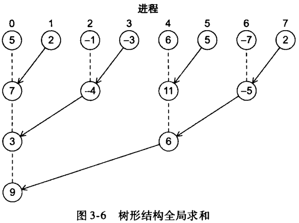

可以使用 二叉树结构，一开始 1 号进程、3 号进程、5 号进程、7号进程将它们的值发送给 0 号进程、2 号进程、4 号进程、6 号进程。然后 0 号进程、2 号进程、4 号进程、6 号进程将接收到的值加到它们自己原有的值上，整个过程重复两次：

1. ① 2 号进程和6号进程将它们的新值分别发送给 0号进程、4 号进程。

   ② 0 号进程和4号进程将接收到的值加到它们自己新值上

2. ① 4 号进程将它们的新值分别发送给 0号进程

   ② 0 号进程将接收到的值加到它们自己新值上

新方案：很多工作是由不同进程并发完成。例如，如何 comm_sz = 1024，则原方案需要 0 号进程 执行 1023 次接收和加法操作，新方案中，0号进程只需要 10 次接收和加法操作。


#### 3.4.2 `MPI_Reduce`

“全局求和函数” 需要通信。全局求和函数可能涉及两个及以上的进程。在 梯形积分法程序中，它涉及 `MPI_COMM_WORLD` 中所有的进程。

- 在 MPI 里，涉及 **通信子中所有进程** 的通信函数称为 **集合通信** (collective communication)。
- `MPI_Send` 和 `MPI_Recv` 通常称为 **点对点通信** (point-to-point communication)


全局求和函数只是集合通信函数类别中的一个特殊例子而已。例如，我们可能并不是想计算分布在各个进程上的 `comm_sz` 值的总和，而是想知道最大值和最小值，或者总的乘积，或者其他许多可能情况中的任何一个产生的结果。

MPI 对全局求和函数进行概括，使这些可能性中的任意一种用单个函数实现：

```c
int MPI_Reduce(
    void*        input_data_p   /* in */,
    void*        output_data_p  /* out */,
    int          count          /* in */,
    MPI_Datatype datatype       /* in */,
    MPI_Op       operator       /* in */,
    int          dest_process   /* in */,
    MPI_Comm     comm
);
```

使用 `MPI_Reduce` 求和：

```c
MPI_Reduce(&local_int, &total_int, 1, MPI_DOUBLE, MPI_SUM, 0, 
           MPI_COMM_WORLD);
```

如果 `count` 参数大于 1，那么 `MPI_Reduce` 函数可以应用到数组上，而不仅仅是应用在简单的标量上。下面的代码可以用于 **一组 N 维向量的加法**，每个进程上有一个向量：

```c
double local_x[N], sum[N];
...;
MPI_Reduce(local_x, sum, N, MPI_DOUBLE, MPI_SUM, 0, 
           MPI_COMMM_WORLD);
```


MPI 中预定义的归约操作符：

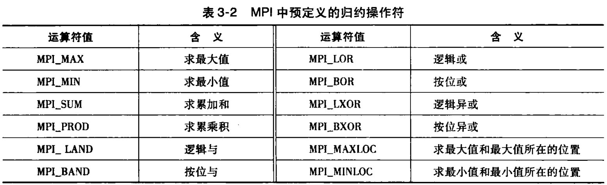


#### 3.4.3 集合通信与点对点通信

1. 在 通信子 中的 **所有进程** 必须调用相同的集合通信函数。

2. 每个进程传递给 MPI 集合通信函数的参数必须是相容的。

   ❗如果一个进程将 0 作为 `dest_process` 的值传递给函数，另一个传递的是 1 ，那么对 `MPI_Reduce` 调用就是错误的。

3. 参数 `output_data_p` **只**用在 `dest_process` 上，然而，所有进程仍需传递一个与 `output_data_p` 相对应的实际参数，即使它的值只是 `NULL`。

4. **点对点通信函数** 是通过标签和通信子来匹配的。

   ❗**集合通信函数** 不使用标签，只通过 **通信子** 和 **调用的顺序** 来进行匹配。

   **示例**：

   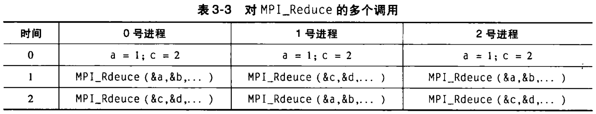

   假设上面 `MPI_Reduce` 运算符均为 `MPI_SUM`，目标进程都是 0 号进程。两次调用 `MPI_Reduce` 后，0 号进程的 b = 1+2+1 = 4，d = 2 + 1 + 2 = 5。

   

   ❗不能使用 同一个缓冲区 同时作为 输入和输出调用 `MPI_Reduce` ，下面这种调用方式是非法的，它的结果不可预测，它可能产生一个错误结果，也可能导致程序崩溃，但也可能产生正确的结果：

   ```c
   /*❌非法代码*/MPI_Reduce(&x, &x, 1, MPI_DOUBLE, MPI_SUM, 0, com);
   ```

   

   

#### 3.4.4 `MPI_Allreduce`

用一棵树来计算全局总和，我们可以“颠倒” (reverse) 整棵树来发布全局总和。

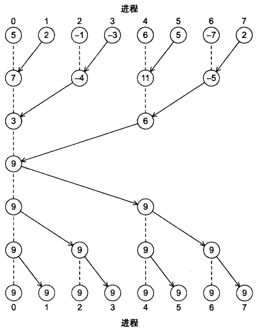

还有另一种替代方法，可以让进程之间相互交换部分结果，而不是单向的通信。这种通信模式称为 **蝶形**：

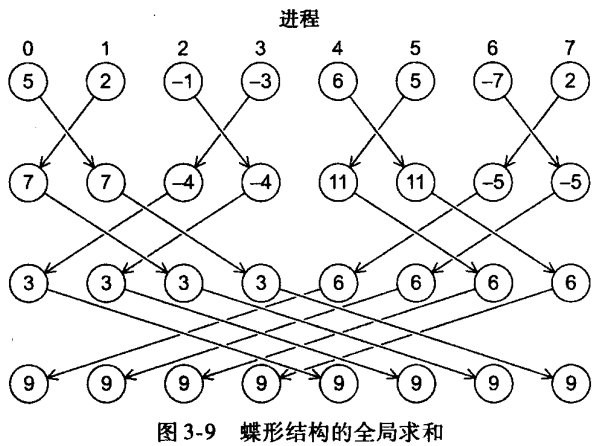

MPI 提供 `MPI_Reduce` 的变种——  `MPI_Allreduce`，可以令通信子中的 **所有进程都存储结果**：

```c
int MPI_Allreduce(
    void*        input_data_p   /* in */,
    void*        output_data_p  /* out */,
    int          count          /* in */,
    MPI_Datatype datatype       /* in */,
    MPI_Op       operator       /* in */,
    MPI_Comm     comm           /* in */
)
```

参数表与 `MPI_Reduce` 相同，除了没有 `dest_process` 这个参数，因为所有进程都能得到结果。


#### 3.4.5 广播

简单地在树形全局求和里“颠倒”通信，我们可以得到下面树形结构通信图，并且能够将这个结构用于输入数据的发布。

**广播**：属于一个进程的数据被发送到通信子中的所有进程 的集合通信。

```c
int MPI_Bcast(
    void*        data_p      /* in/out❗ */,
    int          count       /* in */,
    MPI_Datatype datatype    /* in */,
    int          source_proc /* in - 源进程号 */,
    MPI_Comm     comm        /* in */ 
);
```

进程号为 `scourse_proc`  的进程将 `data_p` 所引用的内存内容发送给了通信子 `comm` 的所有进程。

使用 `MPI_Bcast` 的 `Get_input` 函数：

```c
void Get_input(
    int     my_rank   /* in */,
    int     comm_sz   /* in */,
    double* a_p       /* out */,
    double* b_p       /* out */,
    int*    n_p       /* out */
){
    int dest;
    
    if(my_rank == 0){
        printf("Enter a, b and n\n");
        scanf("%lf %lf %d", a_p, b_p, n_p);
    }
    MPI_Bcast(a_p, 1, MPI_DOUBLE, 0, MPI_COMM_WORLD);
    MPI_Bcast(b_p, 1, MPI_DOUBLE, 0, MPI_COMM_WORLD);
    MPI_Bcast(n_p, 1, MPI_INT, 0, MPI_COMM_WORLD);
} /* Get_input */
```


#### 3.4.6 数据分发

编写一个程序，用于计算向量和：

𝑥+𝑦=(𝑥0,𝑥1,⋯,𝑥𝑛−1)+(𝑦0,𝑦1,⋯,𝑦𝑛−1)=(𝑥0+𝑦0,𝑥1+𝑦1,⋯,𝑥𝑛−1+𝑦𝑛−1)=(𝑧0,𝑧1,⋯,𝑧𝑛−1)=𝑧

如果用 double 类型的数组来表示向量，可以用串行加法来计算向量求和：

```c
void Vector_sum(double x[], double y[], double z[], int n){
    int i;
    
    for(i = 0; i<n; i++){
        z[i] = x[i] + y[i];
    }
}  /* Vector_sum */
```

如何用 MPI 来实现这个程序？

- 指定各个任务求和的对应分量。各个任务间没有通信，向量并行加法问题归结为聚合任务以及将它们分配到核上。
- 如果分量的个数为 n，并且我们有 `comm_sz` 个核或者进程，那么可以简单地将**连续 `local_n` 个向量分量**所构成的块，分配到每个进程中，这种做法称为 向量 的 **块划分**。
- **循环划分**：轮转方式分配向量分量。
- **块-循环划分**：用一个循环分发 **向量分量所构成的块**，而不是分发单个向量分量。

无论哪种划分方法，每个进程都有一个 `local_n` 个向量分量，用一个只有 `local_n` 个元素的数组存储这些分量:

```c
void Parallel_vector_sum(
    double local_x[] /* in */,
    double local_y[] /* in */,
    double local_z[] /* out */,
    int    local_n   /* in */
){
    int local_i;
    
    for(local_i = 0; local_i < local_n; local_i++)
        local_z[local_i] = local_x[local_i] + local_y[local_i];
} /* Parallel_vector_sum */
```


#### 3.4.7 散射

测试向量加法函数。首先读取向量的维度，然后读取向量 x 和 向量 y 。0 号进程读取输入向量，然后将它们广播给其他进程，但这种方法很浪费。每个进程只要读取它所需要操作的部分分量。

因此，可以 0 号进程读入整个向量，但只将分量发送给需要分量的其他进程。MPI 提供这样的函数：

```c
int MPI_Scatter(
    void*        send_buf_p  /* in */,
    int          send_count  /* in - 发送到每个进程的数据量*/,
    MPI_Datatype send_type   /* in */,
    void*        recv_buf_p  /* out */,
    int          recv_count  /* in - 每个进程接收的数据量*/,
    MPI_Datatype recv_type   /* in */,
    int          src_proc    /* in - 源进程号 */,
    MPI_Comm     comm        /* in */
);
```

如果 通信子 comm 包含 `comm_sz` 个进程，那么 `MPI_Scatter` 函数会将 `send_buf_p` 所引用的数据分成 `comm_sz` 份，第一份给 0 号进程，第二份给 1 号进程，第三份给 2 号进程，以此类推。

例如，假如我们使用块划分法，并且 0 号进程已经将一个有 n 个分量的向量整个读入 `send_buf_p` 中，则 0 号进程将得到第一组 `local_n = n/comm_sz` 个分量，1 号进程将得到下一个 `local_n` 个分量，以此类推。每个进程应该将它本地的向量作为 `recv_buf_p` 参数的值，将 `local_n` 作为 `recv_count` 参数的值，`send_type` 和 `recv_type` 参数的值都应该是 `MPI_DOUBLE`，`src_proc` 参数的值应该是 0。

`send_count` 参数的值也应该是 `local_n` ，因为 `send_count` 表示 发送到**每个进程**的数据量。

注意：`MPI_Scatter` 函数将 `send_count` 个对象所组成的第一个块发送给 0 号进程，将下一个由 `send_count` 个对象所组成的块发送给了 1 号进程，以此类推。

所以，这种读取和分发输入向量的方法 **只适用于** **块划分法**。

```c
void Read_vector(
    double   local_a[]  /* out */,
    int      local_n    /* in */,
    int      n          /* in */,
    char     vec_name[] /* in */,
    int      my_rank    /* in */,
    MPI_Comm comm       /* in */
){
    double* a = NULL;
    int i;
    
    if(my_rank == 0){
        a = malloc(n * sizeof(double));
        printf("Enter the vector %s\n", vec_name);
        for(i = 0; i<n; i++)
            scanf("%lf", &a[i]);
        MPI_Scatter(a, local_n, MPI_DOUBLE, local_a, local_n,
                   MPI_DOUBLE, 0, comm);
        free(a);
    } else {
        MPI_Scatter(a, local_n, MPI_DOUBLE, local_a, local_n,
                   MPI_DOUBLE, 0, comm);
    }
} /* Read_vector */
```


#### 3.4.8 聚集

我们需要编写一个可以打印分布式向量的函数。这个函数将向量的所有分量都收集到 0 号进程上，然后由 0 号进程将所有分量都打印出来，这个函数的通信由 `MPI_Gather` 来执行：

```c
int MPI_Gather(
    void*        send_buf_p  /* in */,
    int          send_count  /* in */,
    MPI_Datatype send_type   /* in */,
    void*        recv_buf_p  /* out */,
    int          recv_count  /* in */,
    MPI_Datatype recv_type   /* in */,
    int          dest_proc   /* in - 目的进程号*/,
    MPI_Comm     comm
);
```

在 0 号进程中，由 `send_buf_p` 所引用的内存区的数据存储在 `recv_buf_p` 的第一个块中，在 1 号进程中，由 `send_buf_p` 所引用的内存区的数据存储在 `recv_buf_p` 的第二个块中，以此类推。

```c
void Print_vector(
    double   local_b[]  /* in */,
    int      local_n    /* in */,
    int      n          /* in */,
    char     title[]    /* in */,
    int      my_rank    /* in */,
    MPI_Comm comm       /* in */
){
    double* b = NULL;
    int i;
    
    if(my_rank == 0){
        b = malloc(n * sizeof(double));
        MPI_Gather(local_b, local_n, MPI_DOUBLE, b, local_n,
                  MPI_DOUBLE, 0, comm);
        printf("%s\n", title);
        for(i = 0; i<n; i++)
            printf("%f", b[i]);
        printf("\n");
        free(b);
    } else {
        MPI_Gather(local_b, local_n, MPI_DOUBLE, b, local_n,
                  MPI_DOUBLE, 0, comm);
    }
} /* Print_vector */ 
```


#### 3.4.9 全局聚集

完成矩阵和向量的相乘，如果 𝐴=(𝑎𝑖𝑗) 是一个 𝑚×𝑛  的矩阵，𝑥 是一个具有 𝑛 个分量的向量，那么 𝑦=𝐴𝑥 就是一个有 m 个分量的向量。我们可以用 A 的第 i 行与 𝑥 的点积来取 𝑦 的第 i 个分量。串行伪代码：

```c
for(i = 0; i<m; i++){
    y[i] = 0.0;
    for(j = 0; j<n; j++)
        y[i] += A[i][j] * x[j];
}
```

C 语言串行函数：

```c
void Mat_vect_mult(
    double A[]  /* in */, 
    double x[]  /* in */,
    double y[]  /* out */, 
    int m       /* in */, 
    int n       /* in */)
{
    int i, j;

    for (i = 0; i < m; i++) {
        y[i] = 0.0;
        for (j = 0; j < n; j++)
            y[i] += A[i*n+j]*x[j];
    }
} /* Mat_vect_mult */
```

如果 x 有一个块划分，我们如何安排使得下面循环前就能使每个进程都能访问 x 中的所有分量呢？

```c
for (j = 0; j < n; j++)
    y[i] += A[i*n+j]*x[j];
```

MPI 提供了这样的一个单独的函数：

```c
int MPI_Allgather(
    void*        send_buf_p  /* in */,
    int          send_count  /* in */,
    MPI_Datatype send_type   /* in */,
    void*        recv_buf_p  /* out */,
    int          recv_count  /* in */,
    MPI_Datatype recv_type   /* in */,
    MPI_Comm     comm        /* in */
);
```


```c
void Mat_vect_mult(
    double local_A[]  /* in */,
    double local_x[]  /* in */,
    double local_y[]  /* out */,
    int local_m       /* in */,
    int n             /* in */,
    int local_n       /* in */,
    MPI_Comm comm     /* in */
) {
    double* x;
    int local_i, j;
    int local_ok = 1;
    
    x = malloc(n* sizeof(double));
    MPI_Allgather(local_x, local_n, MPI_DOUBLE, 
                 x, local_n, MPI_DOUBLE, comm);
    for(local_i = 0; local_i < m; local_i++){
        local_y[local_i] = 0.0;
        for(j = 0; j<n; j++)
            local_y[local_i] += local_A[local_i * n + j] * x[j];
    }
    
    free(x);
} /* Mat_vect_mult */
```


### 3.6 MPI 程序的性能估计

#### 3.6.1 计时

MPI 提供的函数：

```c
double MPI_Wtime(void);
```

计时：

```c
double start, finish;
...;
start = MPI_Wtime();
...;
finish = MPI_Wtime();
printf("Proc %d > Elapsed time = %e seconds\n", 
       my_rank, finish-start);
```


#### 3.6.2 结果

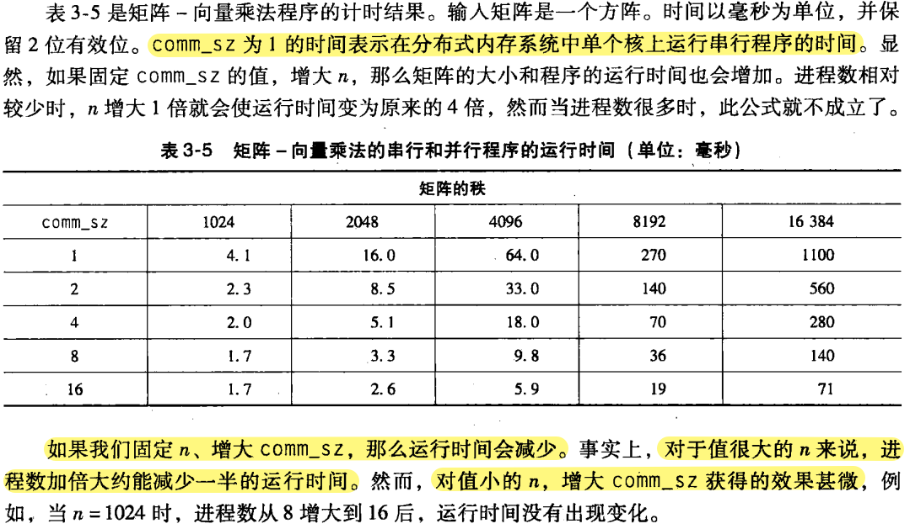

- 串行𝑇串行 代表串行时间，由于它取决于输入值 n，所以把它设为 串行𝑇串行(𝑛) 。同理，并行运行时间 并行𝑇并行 取决于输入值 n 和进程数目 `comm_sz = p` ，则设为 并行𝑇并行(𝑛,𝑝) 。并行程序会将串行程序的工作分配到各个进程上，但又会增加额外的开销，设此开销为：

  并行串行开销𝑇并行(𝑛,𝑝)=𝑇串行(𝑛)/𝑝+𝑇开销

- 在 MPI 程序中，并行计算的开销一般来自于 通信，它同时还受到问题集的规模和进程数的影响。

- 我们的矩阵-向量乘法程序并不难实现，主要的串行运算部分是一对 `for` 循环的嵌套：

  ```c
  for(i = 0; i<m; i++){
      y[i] = 0.0;
      for(j = 0; j<n; j++){
          y[i] += A[i*n+j]*x[j];
      }
  }
  ```

  如果只对浮点运算进行计数，则内层循环会执行 𝑛 次乘法和 𝑛 次加法，总共 2𝑛 次浮点运算。因为执行了 𝑚 次内层循环，则执行上面这段代码总共需要 2𝑚𝑛 次运算。所以当 𝑚=𝑛 时：串行𝑇串行(𝑛)≈𝑎𝑛2，𝑎 是常数（符号≈意味着近似等于）。

  如果串行程序要执行 𝑛×𝑛 矩阵与一个 𝑛 维向量相乘，那么并行程序中每个进程进行 𝑛/𝑝×𝑛 矩阵与 𝑛 维向量相乘。每一个局部的矩阵 - 向量相乘要执行 𝑛2/𝑝 次浮点运算，即每个进程的工作量被削减了 𝑝 倍。

  然而，并行程序在进行本地矩阵 - 向量乘法前，需要调用 MPI_Allgather 函数。在我们的例子中：

  并行串行𝑇并行(𝑛,𝑝)=𝑇串行(𝑛)/𝑝+𝑇allgather

- 𝑛 值较小，𝑝 值较大，并行𝑇并行 中起主导因素的参数是 𝑇allgather 


#### 3.6.3 加速比和效率

加速比：串行并行𝑠(𝑛,𝑝)=𝑇串行(𝑛)𝑇并行(𝑛,𝑝) 

效率：串行并行𝐸(𝑛,𝑝)=𝑆(𝑛,𝑝)𝑝=𝑇串行(𝑛)𝑝×𝑇并行(𝑛,𝑝) 

p 较小，n 较大的情况下，有近似线性的效率。

#### 3.6.4 可扩展性

- 如果问题的规模能够以一定的速率增加，但效率没有随着进程数的增加而降低，那么该程序就是 **可扩展** 的。
- 在不增加问题规模的前提下维持恒定效率，此程序称为拥有 **强可扩展性**。
- 当问题规模增加，通过增大进程数来维持程序效率的，称为 **弱扩展性**。


### 3.7 并行排序算法

设总共有 𝑛 个键值，𝑝=comm_sz 个进程，给每个进程分配 𝑛/𝑝 个键值（与前面一样，假定 𝑛 能被 𝑝 整除）。开始时，不对哪些键值分配到哪个进程中加以限制，然而在算法结束时：

- 每个进程上的键值应该以升序的方式存储。
- 若 0≤𝑞<𝑟<𝑝，则分配给进程 𝑞 的每一个键值应该小于等于分配给进程 𝑟 的每一个键值。

所以，如果按照进程编号来进行键值排列（即先是进程 0 的键值，接着进程 1 的，以此类推），所有的键值就可以按升序排列。为了保证表达的清晰性，假设键值都是普通的 int 类型。

#### 3.7.1 简单的串行排序算法

冒泡排序，因为其固有的串行按对排序特性，并行上述算法意义不大。

**奇偶排序交换** 更适合并行化。关键在于 **去耦的比较-交换**。算法由一些列阶段组成，这些阶段分 2 种类型：

- 偶数阶段，比较-交换由以下数组对执行： (𝑎[0],𝑎[1]),(𝑎[2],𝑎[3]),(𝑎[4],𝑎[5]),⋯

  而奇数阶段则由以下数组对进行比较-交换： (𝑎[1],𝑎[2]),(𝑎[3],𝑎[4]),(𝑎[5],𝑎[6]),⋯

  这里有个小例子：

  - 开始：5、9、4、3
  - 偶数阶段；比较-交换（5，9）和（4，3），获得序列 5、9、3、4。
  - 奇数阶段；比较-交换（9，3），获得序列 5、3、9、4。
  - 偶数阶段；比较-交换（5，3）和（9，4），获得序列 3、5、4、9。
  - 奇数阶段；比较-交换（5，4），获得序列 3、4、5、9。

  这个例子需要四个阶段来排序四个元素的列表。一般来说，阶段可能会更少些，下面的这个定理保证了我们至多用 𝑛 个阶段排序 𝑛 个元素。

  定理：设 𝐴 是一个拥有 𝑛 个键值的列表，作为奇偶交换排序算法的输入，那么经过 𝑛 个阶段后，𝐴 能够排好序。

```c
void Odd_even_sort(
    int a[]  /* in/out */,
    int n    /* in */
) {
    int phase, i, temp;

    for (phase = 0; phase < n; phase++) {
        if (phase % 2 == 0) { /* Even phase */
            for (i = 1; i < n; i += 2)
                if (a[i - 1] > a[i]) {
                    temp = a[i];
                    a[i] = a[i - 1];
                    a[i - 1] = temp;
                }
        } else { /* Odd phase */
            for (i = 1; i < n - 1; i += 2)
                if (a[i] > a[i + 1]) {
                    temp = a[i];
                    a[i] = a[i + 1];
                    a[i + 1] = temp;
                }
        }
    } /* Odd_even_sort */
}
```


#### 3.7.2 并行奇偶交换排序

- 任务：在阶段 j 结束时，确定 `a[i]` 的值
- 通信：确定 `a[i]` 的值的任务需要与其他确定 `a[i+1]` 或者 `a[i-1]` 的任务进行通信，同时，在阶段 j 结束时，`a[i]` 的值需要用来在阶段 j+1 结束时确定 `a[i]` 的值。

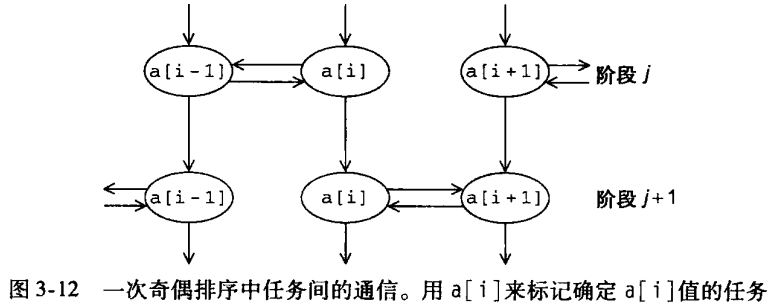

假设我们有 p = 4 个进程，n = 16 个键值。对分配给每个进程的键值使用快速的串行排序法，如 C 语言库的 `qsort` 函数对局部链值进行排序。现在，如果每个进程有一个元素，那么进程 0 和 进程 1 交换数据，进程 2 和进程 3 交换数据。我们试着使进程 0 和进程1 交换数据，

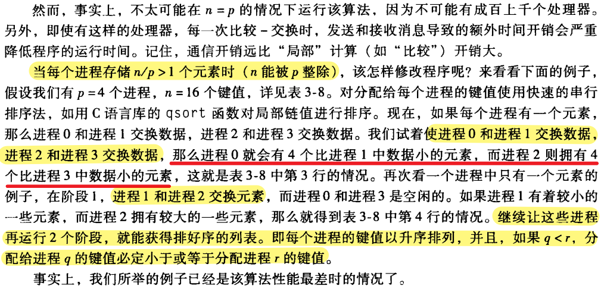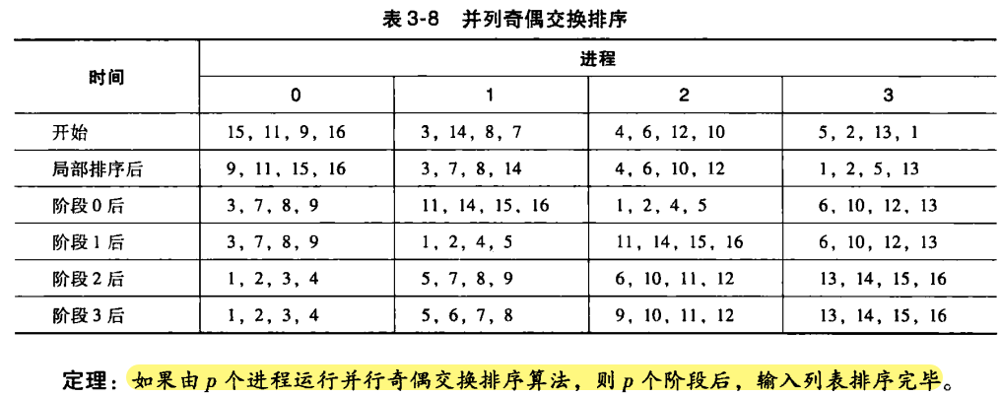

```
Sort local keys;
for(phase = 0; phase < comm_sz; phase++){
    partner = Compute_partner(phase, my_rank);
    if(I'm not idle){
        send my keys to partner;
        receive keys from partner;
        if(my_rank < partner)
            keep smaller keys;
        else
            keep larger keys;
    }
}
```

`Compute_partner`：

```c
if (phase % 2 == 0)     /* Even phase */
    if (my_rank % 2 != 0)   /* Odd rank */
        partner = my_rank - 1;
    else                    /* Even rank */
        partner = my_rank + 1;
else                       /* Odd phase */
    if (my_rank % 2 != 0)   /* Odd rank */
        partner = my_rank + 1;
    else                    /* Even rank */
        partner = my_rank - 1;

if (partner == -1 || partner == comm_sz)
    partner = MPI_PROC_NULL;
```


## 4 用 Pthreads 进行共享内存编程

从程序员角度，共享内存系统中的任意处理器核都能访问所有的内存区域。因此，协调各个处理器核工作的一个方法，就是把某个内存区域设为 “共享”。

- 对共享内存区域进行更新的代码段，称为 **临界区**。
- 运行在一个处理器上的一个程序实例称为 **线程** (不同于 MPI，在 MPI 中称为进程)。

### 4.1 进程、线程 和 Pthreads

线程 是轻量级的进程。

- 进程是正在运行（或挂起）的程序的一个实例，除了可执行代码外，它还包括：
  - 栈段。
  - 堆段。
  - 系统为进程分配的资源描述符，如文件描述符等。
  - 安全信息，如进程允许访问的硬件和软件资源。
  - 描述进程状态的信息，如进程是否准备运行或者正在等待某个资源，寄存器中的内容等。
- 线程之间共享一些区域，可以相互访问各自的内存区域。
- 事实上，线程有各自独立的栈和计数器，除此之外，它们基本上共享所有其他区域。


### 4.2 “Hello, World” 程序

```c
#include <stdio.h>
#include <stdlib.h>
#include <pthread.h>

/* 全局变量：所有线程都可获取 */
int thread_count;

void* Hello(void* rank);  /* 线程函数 */

int main(int argc, char* argv[]){
    long       thread;  /* 使用 long 是因为64位系统 */
    pthread_t* thread_handles;
    
    /* 从命令行中获取 线程数量 */
    thread_count = strtol(argv[1], NULL, 10);
    
    thread_handles = malloc(thread_count * sizeof(pthread_t));
    
    for(thread = 0; thread < thread_count; thread++)
        pthread_create(&thread_handles[thread], NULL, Hello, (void*)thread);
    
    
    printf("Hello from the main thread\n");
    
    for(thread = 0; thread < thread_count; thread++)
        pthread_join(thread_handles[thread], NULL);
    
    free(thread_handles);
    return 0;
} /* main */

void* Hell(void* rank){
    long my_rank = (long) rank;
    
    printf("Hello from thread %ld of %d\n", my_rank, thread_count);
    
    return NULL;
} /* Hello */
```


#### 4.2.1 执行

编译：

```shell
gcc -g -Wall -o pth_hello pth_hello.c -lpthread
```

`-lpthread` 告诉编译器，我们要连接 `Pthreads` 线程库。

运行程序：

```
./pth_hello <number of threads>

./pth_hello 1
```


#### 4.2.2 准备工作

- 头文件：`pthread.h` 

- `strtol` 函数功能是将字符串转化为 `long int` ，它在 `stdlib.h` 中声明，它的语法形式为：

  ```c
  long strtol(
      const char*  number_p,
      char**       end_p,
      int          base
  );
  ```

  - 返回由 `number_p` 所指向的字符串转换得到的长整数
  - 参数 `base` 是表达这个整数值所用的基（进制计数制）
  - 如果 `end_p` 不是 `NULL`，它就指向 `number_p` 字符串中第一个无效字符。


#### 4.2.3 启动线程

代码 17 行：

```c
thread_handles = malloc(thread_count * sizeof(pthread_t));
```

为每个线程的 `pthread_t` 对象分配内存，`pthread_t` 数据结构用来存储线程的专有信息。

- `pthread_t` 对象是一个 **不透明** 对象，对象中存储的数据都是系统绑定的，用户级代码无法直接访问到里面的数据。


19~21 行代码:

```c
for(thread = 0; thread < thread_count; thread++)
    pthread_create(&thread_handles[thread], NULL, Hello, (void*)thread);
```

调用 `pthread_create` 函数来生成线程。它的语法：

```c
int pthread_create(
    pthread_t*             thread_p                 /* out */,
    const pthread_attr_t*  attr_p                   /* in */,
    void*                  (*start_routine)(void*)  /* in */,
    void*                  arg_p                    /* in */
);
```

- 第一个参数是 `pthread_t` 对象的指针，必须在调用 `pthread_create` 函数之前就为 `pthread_t` 对象分配内存空间。
- 第二个参数不用，所以只是在函数调用时 把 `NULL`传递给参数。
- 第三个参数表示该线程将要运行的函数。
- 最后一个参数是一个指针，指向传递给 函数 `start_routine` 的参数。


`pthread_create` 生成并运行的函数应该是一个类似于下面函数的原型：

```c
void* thread_function(void* args_p);
```

- 因为类型 `void*` 可以转换为 C语言任意指针类型，所以 `args_p` 可以指向一个列表，该列表含有一个或多个 `thread_function` 函数需要的数值。类似地，`thread_function` 返回的值也可以是一个包含一个或多个值的列表。


既然线程函数可以接收 void * 类型的参数，我们就可以在 main 函数中为每个线程分配一个 int 类型的整数，并为这些整数赋予不同的数值。当启动线程时，把指向该 int 型参数的指针传递给 pthread_create 函数。

> 然而，程序员会用类型转换来处理此问题：不是在 main 函数中生成 int 型的进程号，而是把循环变量 thread 转化为 void * 类型，然后在线程函数 hello 中，把这个参数的类型转换为 long 型（第 33 行）。
>
> 类型转换的结果是“系统定义”的，但大多数 C 编译器允许这么做。不过，如果指针类型的大小和表示进程编号的整数类型不同，在编译时就会收到警告。在我们使用的机器上，指针类型是 64 位，而 int 型是 32 位，为了避免警告，我们用 long 型替代了 int 型。


#### 4.2.4 运行线程

- 运行 `main` 函数的线程一般称为主线程。
- 线程的调度是由操作系统来控制的。


#### 4.2.5 停止线程

代码第 25、26行：

```c
for(thread = 0; thread < thread_count; thread++)
    pthread_join(thread_handles[thread], NULL);
```

为每个线程调用一次 `pthread_join` 函数，调用一次 `pthead_join` 将等待 `pthread_t` 对象所关联的那个线程结束。`pthread_join` 语法为：

```c
int pthread_join(
    pthread_t* thread    /* in */,
    void**     ret_val_p /* out */
);
```

第二个参数 `ret_val_p` 可以接收任意由 `pthread_t` 对象所关联的那个线程产生的返回值。

在上面的程序中，每个线程执行完 return，最后，主线程调用 `pthread_join` 等待这些线程完成并最终结束。

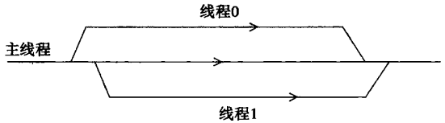 


4.2.6 错误检查


4.2.7 启动线程的其他方法

线程的启动也是有开销的。启动一个线程花费的时间远远比进行一次浮点运算的时间多，所以，“按需启动线程”的方法也许不是使应用程序性能最优化的理想方法。

在这种情况下，可能会使用某种比较复杂的模式——一种综合考虑两种方法的模式。

主线程可以在程序一开始时就启动所有的线程，当一个线程没有工作可做时，并不结束该线程，而是让该线程处于等待状态，直到再次分配到要执行的任务。


### 4.3 矩阵-向量乘法

- 𝐴=(𝑎𝑖𝑗) 是一个 𝑚×𝑛 的矩阵

- 𝑥=(𝑥0,𝑥1,⋯,𝑥𝑛−1)T 是一个 n 维列向量

- 矩阵向量乘积 𝐴𝑥=𝑦 是一个 m 维的列向量。𝑦=(𝑦0,𝑦1,⋯,𝑦𝑚−1)T 中的第 i 个元素是矩阵A的第 i 行与 𝑥 的点积：𝑦𝑖=∑𝑗=0𝑛−1𝑎𝑖𝑗𝑥𝑗 

  串行伪代码：

  ```c
  for(i = 0; i<m; i++){  /* 遍历 A 的每一行 */
      y[i] = 0.0;
      for(j = 0; j<n; j++)  /* 遍历 x 的每一个元素 */
          y[i] += A[i][j] * x[j];
  }
  ```

- 我们只要编写每一个线程的代码，确定每个线程计算哪一部分的 y。为了简化代码，假设 m 与 n 都能被 t 整除，在例子中，m = 6, t = 3，每个线程能分配到 m/t 行的运算数据，而且，线程 0 处理第一部分的 m/t 行，线程 1 处理第二部分的 m/t 行，以此类推。所以线程 q 处理的矩阵行是：

  第一行：𝑞×𝑚𝑡

  最后一行：(𝑞+1)×𝑚𝑡−1

  有了这些公式，我们就能写出执行矩阵 - 向量相乘的线程函数。下面程序中，假设 A、x、y、m 和 n 都是全局共享变量。

  ```c
  void* Pth_mat_vect(void* rank){
      long my_rank = (long) rank;
      int i, j;
      int local_m = m/thread_count;
      int my_first_row = my_rank * local_m;
      int my_last_row = (my_rank + 1) * local_m - 1;
      
      for(int i = my_first_row; i <= my_last_row; i++){
          y[i] = 0.0;
          for(j = 0; j<n; j++)
              y[i] += A[i][j] * x[j];
      }
      
      return NULL;
  }  /* Pth_mat_vect */
  ```


### 4.4 临界区

估算 𝜋 值：

𝜋=4(1−13+15−17+⋯+(−1)𝑛12𝑛+1+⋯)

公式的串行运算代码：

```c
double factor = 1.0;
double sum = 0.0;
for(int i = 0; i<n; i++, factor = -factor){
    sum += factor/(2*i + 1);
}

pi = 4.0 * sum;
```

并行化这个程序：将 for 循环分块后交给各个线程处理，并将 `sum` 设为全局变量。为了简化计算，假设线程数 thread_count，简称 t 能够整除项目总数 n。如果 𝑛¯=𝑛/𝑡，那么线程 0 加上第一部分的 𝑛¯ 项，因此，对于线程 0，循环变量 i 的范围是 0∼𝑛¯−1。线程 1 第二部分的 𝑛¯ 项，循环变量的范围是 𝑛¯∼2𝑛¯−1。更一般化地，对于线程 q，循环变量的范围是：

𝑞¯𝑛,𝑞¯𝑛+1,𝑞¯𝑛+2,⋯,(𝑞+1)𝑛¯−1

而且，第一项，也就是第 𝑞¯𝑛 的符号，当 𝑞¯𝑛 为偶数时，符号为正；当 𝑞¯𝑛 是奇数时，符号为负。线程函数的代码如下所示：

```c
void* Thread_sum(void* rank){
    long my_rank = (long) rank;
    double factor;
    long long i;
    long long my_n = n/thread_count;
    long long my_first_i = my_n * my_rank;
    long long my_last_i = my_first_i + my_n;
    
    if(my_first_i % 2 == 0)  /* 偶数 */
        factor = 1.0;
    else
        factor = -1.0;
    
    for(i = my_first_i; i<my_last_i; i++, factor = -factor){
        sum += factor/(2*i + 1);
    }
    
    return NULL;
}
```

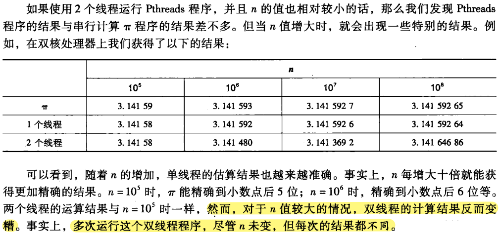 

原因：**多个线程尝试更新同一共享变量**，会出问题。

假设有 2 个线程，每个线程对并存储在自己 私有变量 y 的值进行计算。还假设将这些私有变量加到 共享变量 x 中，主线程将 x 的初始值置为 0，每个线程执行以下代码：

```c
y = Compute(my_rank);
x = x + y;
/* y - 私有变量 */
/* x - 共享变量 */
```

假设线程0计算出的结果为 y=1，线程 1 计算出的结果为 y=2，则“正确” 的结果就应该是 x = 3。但是可能会出现以下情况：

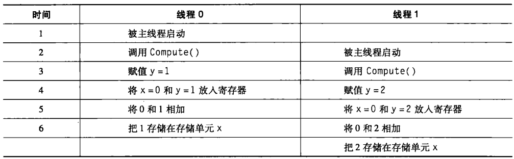

- 如果在线程 0 存储它的结果前，线程 1 就将 x 的值从内存复制到寄存器，那么线程 0 计算出的结果就会被线程 1 的值重写。
- 问题也可能反过来：如果线程 1 先处理数据，则最后 x 的结果会被线程 0 的值重写。
- 事实上，除非一个线程在其他线程从内存读取 x 前就把它要改写的值写回内存，否则“先到者”的结果肯定会被“后来者”重写。


共享内存编程的一个基本问题：**当多个线程尝试更新一个共享资源时，结果可能是无法预测的。**

当多个线程要访问 **共享变量或共享文件** 这样的资源时，如果 **至少其中一个访问是更新操作**，那么这些访问就可能会导致某种错误，我们称之为 **竞争条件** (race condition)。

**临界区**：一个更新共享资源的代码段，一次允许只一个线程执行该代码段。


### 4.5 忙等待

当线程 0 要执行 x = x+y 时，它需要先确认线程1 此时没有在执行同样的语句，一旦线程 0 确认后，它通过某些办法，告知 线程 1 它目前正在执行该语句，以防止 线程1 在线程0 的操作完成前，执行该语句而导致出错。最后，当线程 0 完成操作，也需要通过某些方法告知线程 1 它已经结束了这个语句的执行，线程 1此时可以安全地执行这条语句了。

不涉及新概念的简单方法就是使用 标志变量，设 标志 `flag` 是一个共享 int 型变量，主线程将其初始化为 0，而且，将下列代码加到我们的例子中：

```c
y = Compute(my_rank);
while(flag != my_rank);
x = x + y;
flag++;
```

在 线程 0执行 flag++ 前，线程 1 不会进入 临界区。

while 循环语句 就是 **忙等待** 的一个例子，在 **忙等待** 中，线程不停地测试某个条件，但实际上，直到某个条件满足之前（在我们的例子中，是 flag != my_rank 条件为 false），这些测试都是徒劳的。

编译器的某些代码优化的工作可能会影响忙等待的正确执行。

忙等待不是控制临界区最好的方法。线程1 在进入临界区之前，只能一遍又一遍地测试 flag，如果线程 0 由于操作系统的原因出现延迟，那么线程1 只会**浪费 CPU 周期，不停地进行循环测试**。这对性能有极大的影响。另外，关闭编译器优化选项同样会降低性能。


使用忙等待求全局和的 Pthreads 程序：

```c
void* Thread_sum(void* rank){
    long my_rank = (long) rank;
    double factor;
    long long i;
    long long my_n = n/thread_count;
    long long my_first_i = my_n * my_rank;
    long long my_last_i = my_first_i + my_n;
    
    if(my_first_i % 2 == 0)  /* 偶数 */
        factor = 1.0;
    else
        factor = -1.0;
    
    for(i = my_first_i; i<my_last_i; i++, factor = -factor){
        while(flag != my_rank);
        sum += factor/(2*i + 1);
        flag = (flag + 1) % thread_count;
    }
    
    return NULL;
}
```

flag 初始化的值为 0，所以线程 0 完成临界区运算 并将 flag 加 1 之前，线程 1 必须等待，线程 1开始进入临界区后，线程0也需要等待线程1 完成运算。可见，**线程不同地在 等待 和 运行 之间切换**，**显然是等待以及 对条件值加一的操作使得整体运行时间增加了 7倍**。

改进方法：在 **循环后** 用 临界区 求全局和：

```c
void* Thread_sum(void* rank){
    long my_rank = (long) rank;
    double factor, my_sum = 0; /* 私有变量 my_sum */
    long long i;
    long long my_n = n/thread_count;
    long long my_first_i = my_n * my_rank;
    long long my_last_i = my_first_i + my_n;
    
    if(my_first_i % 2 == 0)
        factor = 1.0;
    else
        factor = -1.0;
    
    for(i = my_first_i; i<my_last_i; i++, factor = -factor)
        my_sum += factor/(2*i + 1); /* 使用私有变量存储各自的部分和 */
    
    while(flag != my_rank);
    sum += my_sum;
    flag = (flag + 1) % thread_count;
    
    return NULL;
}
```

能大幅度提升性能的一个方法是：给每个线程配置**私有变量**来存储各自的部分和，然后用 for 循环一次性将所有部分和加在一起算出总和。


### 4.6 互斥量

因为处理 **忙等待** 的线程仍然在 **持续使用 CPU**，所以忙等待不是限制临界区访问的最理想方法。

这里，有两个更好的方法：**互斥量** 和 **信号量**。

- 互斥量，即 互斥锁，它是一个特殊类型的变量，通过某些特殊类型的函数，互斥量可以用来限制每次只有一个线程能进入临界区的情况下，不能同时进入。

- 互斥量：`pthread_mutex_t` ，在使用 `pthread_mutex_t` 类型的变量之前，必须由系统对其进行初始化。

- **初始化函数** 如下：

  ```c
  int pthread_mutex_init(
      pthread_mutex_t*           mutex_p  /* out */,
      const pthread_mutexattr_t* attr_p   /* in */
  );
  ```

  我们不使用第二个参数，给这个参数赋值 NULL 即可。

- 当一个 `Pthreads` 程序使用完互斥量后，它应该调用：

  ```c
  int pthread_mutex_destroy(pthread_mutex_t* mutex_p);
  ```

- 要获得临界区的访问权，线程需要调用：

  ```c
  int pthread_mutex_lock(pthread_mutex_t* mutex_p);
  pthread_mutex_lock(&mutex);
  ```

- 当线程退出临界区后，它应该调用：

  ```c
  int pthread_mutex_unlock(pthread_mutex_t* mutex_p);
  pthread_mutex_unlock(&mutex);
  ```

  调用 `pthread_mutex_lock` 会使线程等待，直到没有其他线程进入临界区；使用 `pthread_mutex_unlock` 则通知系统该线程已经完成了临界区代码的执行。

- 通过声明一个 **全局的互斥量**，可以在求全局和的程序中用互斥量替代等待。

  1. 主线程对互斥量进行初始化。
  2. 在线程进入临界区前调用 `pthread_mutex_lock` 
  3. 执行完临界区所有操作后调用 `pthread_mutex_unlock` 

  - 第一个调用 `pthread_mutex_lock` 的线程会为临界区 “锁门”。
  - 其他线程如果也想进入临界区，也需要先调用 `pthread_mutex_lock` ，这些调用 `pthread_mutex_lock`  的线程都会 **阻塞并等待**，直到第一个线程离开临界区。
  - 所以只有当一个线程调用了 `pthread_mutex_unlock` 后系统才会从那些 **阻塞的线程** 中 **选取一个线程** 进入临界区。这个过程反复，直到所有线程都完成临界区的操作。


用互斥量计算全局和：

```c
void* Thread_sum(void* rank){
    long my_rank = (long) rank;
    double factor, my_sum = 0;
    long long i;
    long long my_n = n/thread_count;
    long long my_first_i = my_n * my_rank;
    long long my_last_i = my_first_i + my_n;
    
    if(my_first_i % 2 == 0)
        factor = 1.0;
    else
        factor = -1.0;
    
    for(i = my_first_i; i<my_last_i; i++, factor = -factor)
        my_sum += factor/(2*i + 1);
    
    pthread_mutex_lock(&mutex);
    sum += my_sum;
    pthread_mutex_unlock(&mutex);
    
    return NULL;
}
```

在使用互斥量的多线程层序，多个线程进入临界区的顺序是随机的，第一个调用的 `pthread_mutex_lock` 的线程率先进入临界区，接下去的线程顺序则由系统负责分配。


观察两个没有经过性能优化的程序，这两个程序，一个是采用忙等待计算 𝜋 多线程程序（循环后进入临界区），另一个是互斥量程序。我们发现，只要 线程数目 不大于 核的个数，这两个 串行并行𝑇串行/𝑇并行 大约等于线程数：

串行并行𝑇串行𝑇并行≈thread_count

如果 thread_count 小于或等于核的个数，加速比等于线程数目时，就获得 “理想” 的性能或 线性加速比。

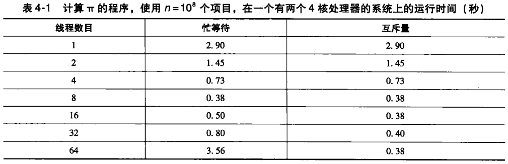

- 每个线程只会进入临界区一次，线程等待进入临界区的时间不会很长。

- 但是，线程数增加到超过核的个数，那么忙等待程序的性能就会下降。

- 使用忙等待的多线程程序的线程数超过核的个数时，性能就会下降。在 忙等待 的情况下，一个或多个线程会在没有实际工作可以做时，不断循环检查某个条件是否满足，而不是进入睡眠状态。这种做法会持续占用CPU时间片，即使该线程实际上并不执行任何有用的工作。

  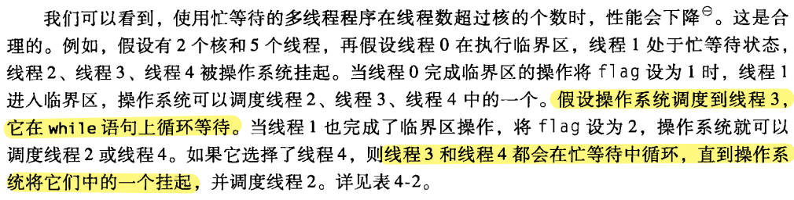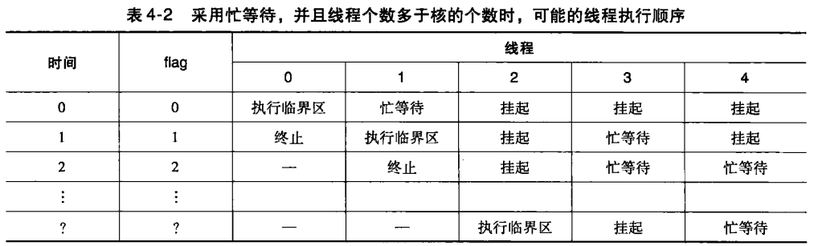


### 4.7 生产者-消费者同步和信号量

- 尽管**忙等待**总是浪费 CPU 的资源，但它能够 **确定线程执行临界区代码顺序**：线程0最先执行，然后线程1，接下来线程 2等。

- ❗如果采用**互斥量**，那么哪个线程先进入临界区以及此后的顺序由系统随机选取。

- 假设，每个线程生成一个 𝑛×𝑛 的句子，然后按照线程号的顺序依次将各个线程的矩阵相乘。但矩阵相乘这种计算是 **不交换的**，使用互斥量的程序就会出现一些问题：

  ```c
  /* n 和 product_matrix 是共享的，并由主线程初始化 */
  /* product_matrix 初始化为单位矩阵 */
  void* Thread_work(void* rank) {
      long my_rank = (long) rank;
      matrix_t my_mat = Allocate_matrix(n);
      Generate_matrix(my_mat);
      
      pthread_mutex_lock(&mutex);
      Multiply_matrix(product_mat, my_mat);
      pthread_mutex_unlock(&mutex);
      /* mutex 无法保证线程执行的顺序，然而矩阵乘法不可交换 */
      Free_matrix(&my_mat);
      return NULL;
  }  /* Thread_work */
  ```

- 在更复杂的例子，每个线程都会向其他线程 “发送消息”。例如，假设我们有 `thread_count` 或 `t` 个线程，线程 0 向 线程1 发送消息，线程 1 向线程 2 发送消息，···， 线程 t-2 向线程 t-1 发送消息，线程 t-1 向线程 0 发送消息。当一个线程“接收” 一条消息后，它打印消息并终止。

- 为了实现消息传递，分配了一个 `char**` 类型的共享数组，每个线程初始化消息后，就设定这个共享数组中的指针指向要发送的消息。为了避免引用到没有被定义的指针，主线程将共享数组中的每项都先设为 NULL。

- 第一版的代码：

  ```c
  /* messages 是一个类型为 char** 的数组，它在 main 函数中分配 */
  /* 每个条目在 main 函数中被设置为 NULL */
  void* Send_msg(void* rank) {
      long my_rank = (long) rank;
      long dest = (my_rank + 1) % thread_count;
      long source = (my_rank + thread_count - 1) % thread_count;
      char* my_msg = malloc(MSG_MAX * sizeof(char));
  
      sprintf(my_msg, "Hello to %ld from %ld", dest, my_rank);
      messages[dest] = my_msg;
  
      if (messages[my_rank] != NULL)
          printf("Thread %ld > %s\n", my_rank, messages[my_rank]);
      else
          printf("Thread %ld > No message from %ld\n", my_rank, source);
  
      return NULL;
  }
  /* Send_msg */
  ```

  当在双核系统运行多于两个线程的程序时，会发现消息始终未未收到。例如，在线程 t-1 把消息复制到 message 数组前，最先运行的 线程 0 早已结束。

  把 12行的 `if` 改成 `while` 可以解决问题：

  ```c
  while (messages[my_rank] != NULL);
  printf("Thread %ld > %s\n", my_rank, messages[my_rank]);
  ```

  当然，这个方法有着所有 忙等待的程序 都有问题。

  在执行完第 10 行的赋值语句后，我们希望“通知” 线程号为 dest 的线程，它可以打印消息了，可以把程序改为：

  ```c
  ...;
  message[dest] = my_msg;
  通知 dest 线程它可以继续执行;
  
  等待 source 线程的通知;
  printf("Thread %ld > %s\n", my_rank, messages[my_rank]);
  ```

- 考虑使用 互斥量数组 实现：

  ```c
  ...;
  pthread_mutex_lock(mutex[dest]);
  ...;
  message[dest] = my_msg;
  pthread_mutex_unlock(mutex[dest]);
  ...;
  pthread_mutex_unlock(mutex[my_rank]);
  printf("Thread %ld > %s\n", my_rank, messages[my_rank]);
  ...;
  ```

  现在假设有两个程序，线程 0 运行远比线程 1 块，所以当它调用 第 7 行的 pthread_mutex_lock 时，线程 1 才刚刚执行第2行。线程 0 获得锁，并继续执行 printf 语句，这会导致线程 0 引用空指针，然后使得整个程序崩溃。


**信号量** 可以解决这个问题。

- 信号量，可以认为是一种特殊类型的 unsigned int 无符号整型变量，可以赋值为 0、1、2、···。大多数情况下，只给它们赋值 0 和 1，这种只有 0 和 1 值的信号量称为 二元信号量。

  - 粗略地讲，0对应 上了锁的互斥量，1 对应未上锁的互斥量。
  - 要把一个二元信号量用做互斥量，需要先把信号量的值初始化为 1，即开锁状态。
  - 在要保护的临界区前调用函数 `sem_wait` ，线程执行到 `sem_wait` 函数时，如果信号量为 0，线程就会被阻塞。
  - 如果信号量是非 0 值，就减 1 后进入临界区。执行完临界区操作后，再调用 `sem_post` 对信号量加 1，使得再 `sem_wait` 中阻塞的其他线程能够继续运行。

  ```c
  sem_wait(&sem); /* sem - 1 */
  sem_post(&sem); /* sem + 1 */
  ```

  

- 信号量 与 互斥量 最大的区别 在于 信号量是没有个体拥有权，主线程将所有信号量初始化为 0，即 “加锁”，其他线程都能对任何信号量调用 `sem_post` 和 `sem_wait` 函数。

使用信号量的 `Send_msg` ：

```c
/* messages 在main函数中被分配内存和初始化为 NULL */
/* semaphores 在 main 函数中被初始化为 0 (locked) */
void* Send_msg(void* rank)
{
    long my_rank = (long) rank;
    long dest = (my_rank + 1) % thread_count;
    char* my_msg = malloc(MSG_MAX * sizeof(char));
    
    sprintf(my_msg, "Hello to %ld from %ld", dest, my_rank);
    messages[dest] = my_msg;
    sem_post(&semaphores[dest]);
    
    sem_wait(&semaphores[my_rank]);
    printf("Thread %ld > %s\n", my_rank, messages[my_rank]);
    
    return NULL;
} /* Send_msg */
```


信号量函数的语法：

```c
#include<semaphore.h>  /* ❗头文件 */

int sem_init(
    sem_t*   semaphore_p   /* out */,
    int      shared,       /* in - 通常只须传入常数 0*/
    unsigned initial_val   /* in - 初始值 */
);

int sem_destroy(sem_t* semaphore_p   /* in/out */);
int sem_post(sem_t* semaphore_p   /* in/out */);
int sem_wait(sem_t* semaphore_p   /* in/out */);

sem_t semaphore;  /* 定义变量 */
sem_init(&semaphore, 0, 1);  /* 初始化为 1 */
sem_wait(&semaphore);
sem_post(&semaphore);
sem_destroy(&semaphore);
```


### 4.8 路障和条件变量

共享内存编程的另一个问题：通过保证所有线程在程序中处于同一位置来同步线程。这个同步点 又 称为 **路障** (barrier)，只有所有线程都抵达此路障，线程才能继续运行下去，否则会阻塞在路障处。

许多 `Pthreads` 的实现不提供路障，需要自己实现路障。介绍三种实现方法，第三种方法是使用 `Pthreads` 对象：条件变量 `conditional variable` 。

#### 4.8.1 忙等待和互斥量

- 方法：使用一个 **互斥量保护的共享计数器**，当计数器的值小于线程值时，线程进入 **忙等待** 状态。当计数器的值表明每个线程都已进入临界区，所有线程就可以离开忙等待状态了。

```c
/* 主线程的共享变量，且已初始化 */
int counter;  /* 初始化为 0 */
int thread_count;
pthread_mutex_t barrier_mutex;
...;

void* Thread_work(...){
    ...;
    /* Barrier */
    pthread_mutex_lock(&barrier_mutex);
    counter++;
    pthread_mutex_unlock(&barrier_mutex);
    while(counter < thread_count);
    ...;
}
```

线程处于忙等待循环时浪费很多 CPU 时间，并且当线程数多于核数时，程序的性能会直线下降。

- 有多少个路障就必须要有多少个不同的共享 counter 变量来进行计数。


#### 4.8.2 信号量

信号量实现路障，来解决忙等待和互斥量实现路障方式出现的问题。

```c
/* 共享变量 */
int counter;        /* 初始化为 0 */
sem_t count_sem;    /* 初始化为 1 */
sem_t barrier_sem;  /* 初始化为 0 */
...;

void* Thread_work(...){
    ...;
    /* Barrier */
    sem_wait(&count_sem);  /* 保护计数器, 为 counter 加锁 */
    if(counter == thread_count - 1){  /* 此前的计数 = 线程数-1 */
        counter = 0; /* 重置计数器 */
        sem_post(&count_sem);  /* 为 counter 解锁 */
        for(j = 0; j<thread_count - 1; j++)
            sem_post(&barrier_sem);  
            /* 为此前所有线程的 barrier_sem + 1 */
    } else {
        counter++;
        sem_post(&count_sem);    /* 为 counter 解锁 */
        sem_wait(&barrier_sem);  /* 等待 barrier_sem 被赋值 */
    }
    ...;
}
```

- `sem_wait` 在 信号量的值为 0 的时候，调用该函数的线程会被阻塞直到信号量的值为正数。
- `counter` 和 `count_sem` 可以重用，因为离开路障时，`counter` 重置为 0，`count_sem` 重置为 1。
- 重用 `barrier_sem` 导致了一个竞争条件。


#### 4.8.3 条件变量

在 `Pthreads` 中实现路障的更好方法是采用 **条件变量**。

- **条件变量** 是一个数据对象，允许线程在某个 **特定条件或事件发生前** 都处于挂起状态。
- 当事件或条件发生时，另一个线程可以通过 **信号** 来 **唤醒挂起的线程**，一个 **条件变量** **总是** 与一个 **互斥量** 相关联。

条件变量的一般使用方法：

```c
lock mutex:
if condition has occured
    signal thread(s);
else
    lock the mutex and block;
    /*当线程未阻塞时，mutex 重新上锁*/

unlock mutex;
```

- `Pthreads` 线程库的条件变量类型：`pthread_cond_t` 

- 函数：

  ```c
  /* 初始化一个条件变量 */
  int pthread_cond_init(
      pthread_cond_t*            cond_p       /* out */,
      const pthread_condattr_t*  cond_attr_p  /*in - 一般设置NULL*/
  );
  
  /* 销毁条件变量 */
  int pthread_cond_destroy(pthread_cond_t* cond_p /*in/out*/);
  
  /* 解锁一个阻塞的线程 */
  int pthread_cond_signal(pthread_cond_t* cond_var_p /*in/out*/);
  
  /* 解锁所有被阻塞的线程 */
  int pthread_cond_broadcast(pthread_cond_t* cond_var_p);
  
  /* 通过互斥量 mutex_p 来阻塞线程 */
  /* 直到其他线程调用 pthread_cond_signal或pthread_cond_broadcast */
  int pthread_cond_wait(
      pthread_cond_t*   cond_var_p  /* in/out */,
      pthread_mutex_t*  mutex_p     /* in/out */
  );
  /* 相当于 */
  pthread_mutex_unlock(&mutex);
  wait_on_signal(&cond_var);
  pthread_mutex_lock(&mutex);
  ```

- 条件变量实现的路障：

  ```c
  /* 共享变量 */
  int counter = 0;
  pthread_mutex_t mutex;
  pthread_cond_t  cond_var;
  ...;
  
  void* Thread_work(...){
      ...;
      /* Barrier */
      pthread_mutex_lock(&mutex);
      counter++;
      if(counter == pthread_count){
          counter = 0;
          pthread_cond_broadcast(&cond_var);
      } else {
          while( pthread_cond_wait(&cond_var, &mutex) != 0);
          /* 
          等待条件变量。调用该函数时，线程会 释放互斥锁 并进入
          等待状态，直到被唤醒。
          */
      }
      pthread_mutex_unlock(&mutex);
  }
  ```

  - 函数 `pthread_cond_wait` 一般放置在 while 循环里面，如果线程不是被 `pthread_cond_broadcast` 或 `pthread_cond_signal` 函数，而是被其他事件解除阻塞，就能检查到 `pthread_cond_wait` 函数的返回值不为 0，被解除阻塞的线程还会再次执行该函数。
  - 如果一个线程被唤醒，那么在继续运行后面的代码最好能检查以下条件是否满足。在我们的例子中，如果调用 `pthread_cond_signal` 函数从路障中解除阻塞的线程后，在继续运行前先看 `counter == 0` 是否成立。使用广播唤醒线程尤其需要注意，某些先被唤醒的线程会超前改变竞争条件的状态，如果每个线程在唤醒后都检查条件，它就能发现条件已经不再满足，然后又进入睡眠状态。
  - 为了路障的正确性，必须调用 `pthread_cond_wait` 来解锁。如果没有用这个函数对互斥量进行解锁，那么只有一个线程能进入路障，所有其他的线程将阻塞在对 `pthread_cond_wait` 的调用上，从而程序将挂起。
  - 互斥量的语义要求从 `pthread_cond_wait` 调用返回后，互斥量要被重新加锁。当从 `pthread_mutex_lock` 调用中返回，就能 “获得” 锁。因此，应该在某一时刻通过 `pthread_mutex_unlock` 释放锁。


### 4.9 读写锁

4.9.1至4.9.4

#### 4.9.1 链表函数

链表本身由一组结点组成，每个结点是一个拥有两个成员的结构：一个整型数据和一个指向下一个结点的指针。可以这样定义这个结构：

```c
struct list_node_s{
    int data;
    struct list_node_s* next;
};

/* Member函数：使用一个指针遍历链表，直到找到目标值或者直到目标值不在链表中。因为链表是有序的，所以 curr_p 为 NULL 或者当前结点存储的数据成员大于目标值，就会发生 目标值不在链表 中的情况 */
int Member(int value, struct list_node_s* head_p){
    struct list_node_s* curr_p = head_p;
    while(curr_p != NULL && curr->data < value)
        curr_p = curr_p -> next;
    if(curr_p == NULL || curr_p -> data > value)
        return 0;
    else
        return 1;
}

/* Insert 函数通过查找正确的位置来插入新结点，因为链表是有序的，所以它必须一直查找直到找到一个结点，它的 data 成员要大于要插入的 value，找到这个结点之后，将新结点插入到结点的前面，需要定义第二个指针 pred_p 指向当前结点的前一个结点 */
int Insert(int value, struct list_node_s** head_p) {
    struct list_node_s* curr_p = *head_p;
    struct list_node_s* pred_p = NULL;
    struct list_node_s* temp_p;

    while (curr_p != NULL && curr_p->data < value) {
        pred_p = curr_p;
        curr_p = curr_p->next;
    }

    if (curr_p == NULL || curr_p->data > value) {
        temp_p = malloc(sizeof(struct list_node_s));
        temp_p->data = value;
        temp_p->next = curr_p;
        if (pred_p == NULL) { // 新的头节点
            *head_p = temp_p;
        } else {
            pred_p->next = temp_p;
        }
        return 1;
    } else { // 值已经在列表中
        return 0;
    }
} // 插入操作

/* Delete 函数与 Insert函数相似，因为它在查找删除结点的同时也需要跟踪当前节点的前驱节点 */
int Delete(int value, struct list_node_s** head_p) {
    struct list_node_s* curr_p = *head_p;
    struct list_node_s* pred_p = NULL;

    while (curr_p != NULL && curr_p->data < value) {
        pred_p = curr_p;
        curr_p = curr_p->next;
    }

    if (curr_p != NULL && curr_p->data == value) {
        if (pred_p == NULL) { // 删除链表中的第一个节点
            *head_p = curr_p->next;
            free(curr_p);
        } else {
            pred_p->next = curr_p->next; 
            free(curr_p);
        }
        return 1;
    } else { // 值不在链表中
        return 0;
    }
} /* 删除操作 */
```


#### 4.9.2 多线程链表

试着在一个 `Pthreads` 程序中使用这些函数。为了对链表共享访问，将 `head_p` 定义为全局变量。这将简化 `Member`、`Insert` 和 `Delete` 的函数头。如果有多个线程同时执行这三个函数，结果会是什么？

- 多个线程可以没有冲突地读取一个内存单元。因此多个线程可以同时执行 `Member` 函数。
- `Delete` 和 `Insert` 函数需要 写内存，如果试图让这类操作与其他操作同时执行，那么就可能会有问题。当多个线程正在执行 `Insert` 或 `Delete` 操作，即写链表结点时，是不安全的。

对链表进行**访问前加锁**：

```c
Pthread_mutex_lock(&list_mutex);
Member(value);
Pthread_mutex_unlock(&list_mutex);
```

- 问题：必须 串行访问链表，如果对链表大部分的访问操作是 Member，那么就失去了开发并行性的机会。
- 如果对链表大部分的访问操作是 Member，可能是较好的解决方案。


另一个可选择的方案是 “细粒度” 锁，可以对链表上的单个结点上锁，而不是对整个链表上锁。例如，可以在链表节点的结构加一个互斥量：

```c
struct list_node_s{
    int data;
    struct list_node_s* next;
    pthread_mutex_t mutex;
};
```

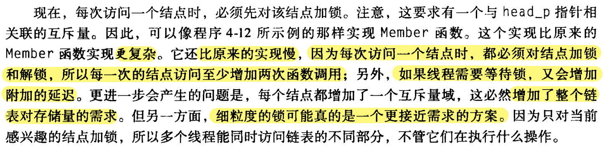

每个链表结点拥有一个互斥量的方法来实现 Member 函数：

```c
int Member(int value){
    struct list_node_s* temp_p;
    
    pthread_mutex_lock(&head_p_mutex);
    temp_p = head_p;
    while(temp_p != NULL && temp_p->data < value){
        if(temp_p->next != NULL)
            pthread_mutex_lock(&(temp_p->next->mutex));
        if(temp_p == head_p)
            pthread_mutex_unlock(&head_p_mutex);
        pthread_mutex_unlock(&(temp_p->mutex));
        temp_p = temp_p -> next;
    }
    
    if(temp_p == NULL || temp_p->data>value){
        if(temp_p == head_p)
            pthread_mutex_unlock(&head_p_mutex);
        if(temp_p != NULL)
            pthread_mutex_unlock(&(temp_p->mutex));
        return 0;
    } else {
        if(temp_p == head_p)
            pthread_mutex_unlock(&head_p_mutex);
        pthread_mutex_unlock(&(temp_p->mutex));
        return 1;
    }
} /* Member */
```


#### 4.9.3 `Pthreads` 读写锁

上面两种实现多线程链表的方法，都不让正在执行 Member 函数的线程还可以同时访问链表的任意结点。第一个方法在任何时刻只允许一个线程访问整个链表，第二个方法在任一时刻只允许一个线程访问一个结点。

`Pthreads` 的 **读写锁** 可以作为另一种可选方案。

- 除了提供两个锁函数以外，读写锁基本上和 互斥量差不多。
- 这两个函数，第一个为读操作对读写锁进行加锁，第二个为写操作对读写锁进行加锁。多个线程通过读锁函数而同时获得锁，但只有一个线程能通过写锁函数获得锁。
- 如果任何线程拥有了读锁，则任何请求写锁的线程将阻塞在写锁函数的 调用上。
- 如果任何线程拥有了写锁，则任何想获取读或写锁的线程将阻塞它们对应的锁函数上。

能用下列的代码保护表函数：

```c
pthread_rwlock_rdlock(&rwlock);
Member(value);
pthread_rwlock_unlock(&rwlock);
...;
pthread_rwlock_wrlock(&rwlock);
Insert(value);
pthread_rwlock_unlock(&rwlock);
...;
pthread_rwlock_wrlock(&rwlock);
Delete(value);
pthread_rwlock_unlock(&rwlock);
```

三个新的 `Pthreads` 函数：

```c
int pthread_rwlock_rdlock(pthread_rwlock_t* rwlock_p /*in/out*/);
int pthread_rwlock_wrlock(pthread_rwlock_t* rwlock_p /*in/out*/);
int pthread_rwlock_unlock(pthread_rwlock_t* rwlock_p /*in/out*/);

/* 初始化 */
int pthread_rwlock_init(
    pthread_rwlock_t*           rwlock_p  /* out */,
    const pthread_rwlockattr_t* attr_p    /* in */
);
 
/* 销毁读写锁 */
int pthread_rwlock_destroy(pthread_rwlock_t* rwlock_p /*in/out*/);
```


#### 4.9.4 不同实现方案的性能

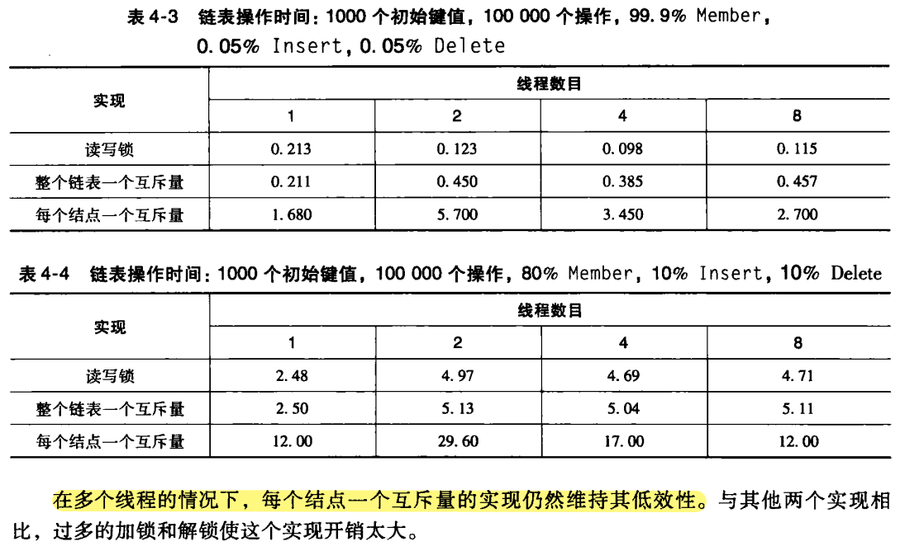

- 当 `Insert` 和 `Delete` 操作十分少时，读写锁远好于单互斥量实现，因为单互斥量实现串行化所有操作。此时，读写锁在对链表的并发访问上做的很好。
- 当相对多的 `Insert` 和 `Delete` 时，读写锁和单互斥量实现的性能差不多。
- 对链表操作来说，读写锁能够很大的性能提升，但只有在 `Insert` 和 `Delete` 操作十分少的时候才行。

如果使用一个互斥量和每个结点一个互斥量，那么程序在多线程下运行的总是只比单线程的时间长。读写锁在 `Insert` 和 `Delete` 操作较多时，多线程执行时间也比单线程执行时间长。

因为对于单互斥量而言，对链表的有效访问是串行的。

对于读写锁实现，有大量写锁操作，出现太多锁竞争，总和性能下降。

### 4.10 缓存、缓存一致性和伪共享

- 缓存的设计考虑了 时间和空间局部性 原理：如果一个处理器在时间 t 访问内存位置 x，那么很可能它在接近 t 的时间访问接近 x 的内存位置。
- 如果一个处理器需要访问主存位置 x，那么不只是将 x 的内容传入 (出) 主存，而是将一个块包含 x  的内存块 传入（出）主存。这样的一块内存称为 **缓存块** 或者 **缓存行**。

缓存一致性可能会对共享内存系统的性能有巨大的影响。

矩阵-向量乘法程序：

```c
void* Pth_mat_vect(void* rank){
    long my_rank = (long) rank;
    int i, j;
    int local_m = m/thread_count;
    int my_first_row = my_rank * local_m;
    int my_last_row = (my_rank + 1) * local_m - 1;
    
    for(int i = my_first_row; i <= my_last_row; i++){
        y[i] = 0.0;
        for(j = 0; j<n; j++)
            y[i] += A[i][j] * x[j];
    }
    
    return NULL;
}  /* Pth_mat_vect */
```

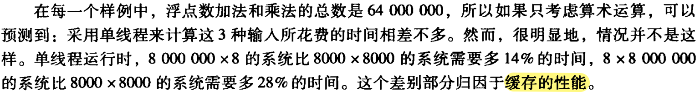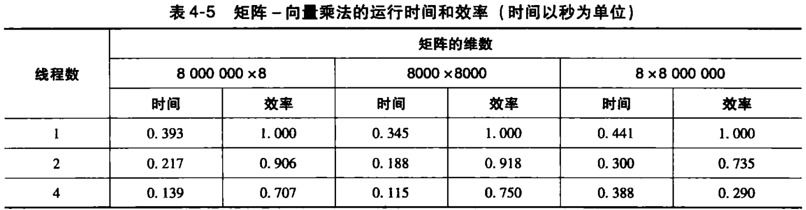

当一个核试图更新一个不在缓存中的变量，就会发生 **写缺失** ，处理器必须访问主存。

- 当程序运行 8000000✕8 输入时，比其他 2 中输入发生更多缓存写缺失，大部分写缺失发生在第9行。因为结果向量 y 的元素数量远远大于其他两个输入的结果向量元素，而且每个元素必须被初始化。
- 当程序运行 8✕8000000 输入时，比其他 2 中输入会发生更多的读缺失。这些失效都发生在第 11 行。对于这个输入，x 需要读入 8000 000 个元素，而两外两个输入的 x 只有 8000 或 8 个元素需要读入。

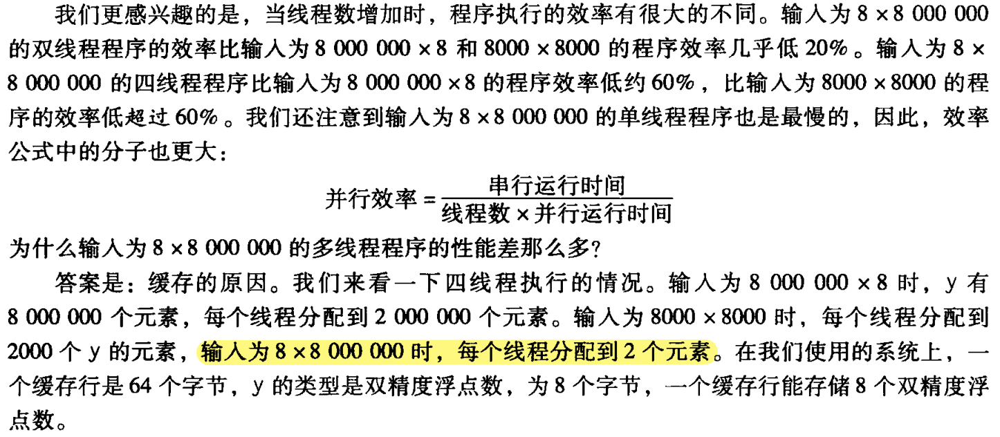

缓存一致性是“行级”的，每次缓存行中的任何一个值被改写了，如果该行也存在另一个处理器的缓存中，不只是别写的那个值，哪个处理器上的整个缓存行都会无效。我们使用的系统有 2 个双核处理器，每个处理器有它自己的缓存。

假设现在将线程0和线程1分配给一个处理器，线程2和3分配给另一个处理器。同时假设对于 8✕8000000 的问题，所有的 y 都存在于一个缓存行中，每一次写 y 的某个元素，就会让另一个处理器中的缓存行无效。例如，每次线程0用以下语句更新 y[0]：

```c
y[i] += A[i][j] * x[j];
```

如果线程2或线程3也执行这个代码，它就不得不重新加载每个 y。每个线程都要更新每个元素，共更新 8000000 次，所有线程都不得不重新加载 y 很多次。这种情况在一个元组只被一个线程访问的情况下，也会发生。

每个线程对分配给它的 y 元素进行更新，两个线程总共更新 16000000次，尽管这些更新的大部分不会迫使线程访问主存，但其中仍然有很多次访问主存。这称为 **伪共享** (false sharing)。

假设 2 个拥有各自缓存的线程访问同一缓存行的不同变量。进一步假设至少有一个线程更新了它的变量，那么即使没有线程写另一个线程正在使用的变量，缓存控制器仍然会使整个缓存行无效并强制线程从内存获取变量的值。

线程并不共享任何东西（除了一个缓存行），但是线程对内存访问的行为好像它们正在共享一个变量，因此把这种现象命名为 **伪共享**。

如何避免 **伪共享**：使用假的元素“填充” y 向量，从而保证一个线程的更新不会影响另一个线程的缓存行。

替代方案：每个线程在乘法循环使用它自己的 私有存储器，然后再完成后更新共享存储器。

### 4.11 线程安全性

- 如果一个代码能够被多个线程同时执行而不引起问题，那么它是 **线程安全** 的。

- 例如，假设要使用多个线程对一个文件进行“分词”。假设文件由普通的英语文本构成，需要分析出被空格、tab和换行符分隔的连续的字符序列。

  解决这个问题的一个简单方法是：将输入文件分成行，把每一行按顺序分配给线程；第一行给线程0，第二行给线程1，以此类推，第t行给线程t-1，第t+1行再给线程0等。

- 我们可以通过使用 信号量 将访问输入行串行化。接着，在一个线程读了一行输入后，它就能够对这一行进行分词。

- 一个方法是使用 `string.h` 中的 `strtok` 函数，它的原型如下：

  ```c
  char* strtok(
      char*       string      /*in/out*/,
      const char* separators  /* in */
  );
  ```

  第一次调用它时，string 参数应该是要被分词的文本，后面调用它时，string 参数应该为 NULL。

  它的思想是：在第一次调用时， `strtok` 缓存一个指向 `string`  的指针，在接下来调用中，`strtok` 返回从缓存的副本中分隔出的连续的词。将词分隔开的分隔符通过 `separators` 参数传入函数。

```c
void* Tokenize(void* rank){
    long my_rank = (long) rank;
    int count;
    int next = (my_rank + 1) % thread_count;
    char* fg_rv;
    char my_line[MAX];
    char* my_string;
    
    sem_wait(&sems[my_rank]);
    fg_rv = fgets(my_line, MAX, stdin);
    sem_post(&sems[next]);
    
    while(fg_rv != NULL){
        printf("Thread %ld > my_line = %s", my_rank, my_line);
        
        count = 0;
        my_string = strtok(my_line, " \t\n");
        while(my_string != NULL){
            count++;
            printf("Thread %d > string %d = %s\n", my_rank,
                  count, my_string);
            my_string = strtok(NULL, " \t\n");
        }
        
        sem_wait(&sems[my_rank]);
        fg_rv = fgets(my_line, MAX, stdin);
        sem_post(&sems[next]);
    }
    return NULL;
}
```

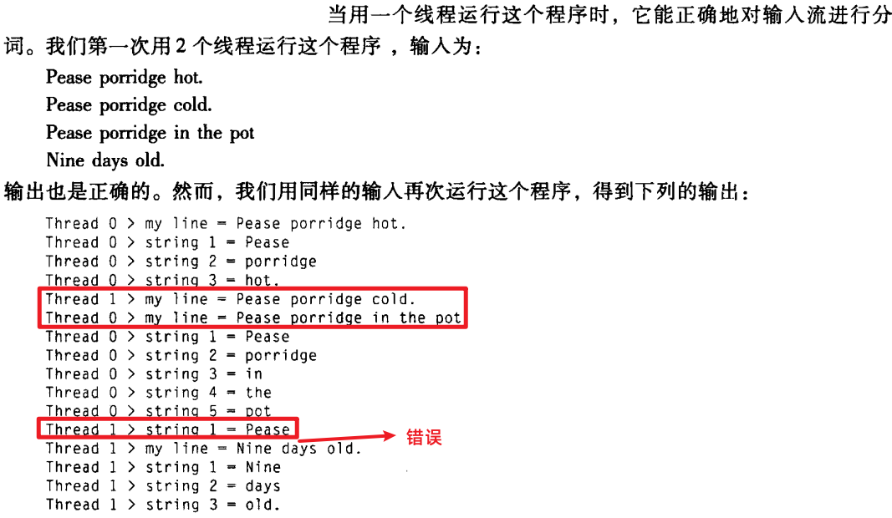

- `strtok` 通过声明一个 storage类的静态变量来实现对输入行的缓存，导致本次调用和下一次调用之间，存储在这个变量中的值会一直被保留。但是，这个缓存的 字符串是共享的，而不是私有的，线程 0 调用的 `strtok` 对输入的第三行进行缓存，覆盖原来线程1调用的 `strtok` 读入输入的第2行缓存。

- `strtok` 函数不是线程安全的。

- `strtok` 的线程安全的版本：`strtok_r` ：

  ```c
  char* strtok_r(
      char*       string     /* in/out */，
      const char* separators /* in */,
      char**      saveptr_p  /* in/out */
  );
  ```

- 函数的前两个参数与 `strtok` 是一样的。`strtok_r` 使用添加 `_p` 的 `saveptr` 参数跟踪函数在输入字符串的位置，它起到 `strtok` 函数中缓存指针的作用。

  ```c
  ...;
  my_string = strtok_r(my_line, " \t\n", &saveptr);
  ...;
  my_string = strtok_r(NULL, " \t\n", &saveptr);
  ```

  

- 谨慎处理竞争条件。

## 5 用 OpenMP 进行共享内存编程

- OpenMP 允许编译器和运行时系统决定线程行为的一些细节。使用 OpenMP 来编写一些并行行为更容易，代价是很难对付一些底层的线程交互进行编程。
- OpenMP规范，在一个更高的层次开发共享内存程序。
- OpenMP 明确地设计成可以用来对已有的串行程序进行增量式并行化。
- OpenMP最强大的功能：只需要对源代码进行少量改动就可以并行化许多串行的 for 循环。
- 其他特征：**任务并行化** 和 **显式线程同步**。

### 5.1 预备知识

- OpenMP 提供 “基于指令” 的共享内存 API。这意味着：在 C 和 C++ 中，有一些特殊的预处理指令 `pragma` 。

  - OpenMP 程序必须在支持 `pragma` 的编译器上运行。

  通常，我们把字符 `#` 放在第一列。与所有的预处理器指令一样，`pragma` 的默认长度是一行，因此如果有一个 `pragma` 在一行放不下去，那么新行需要被 “转义”——在前面加一个反斜杠 `\` 。`#pragma` 后面要跟什么内容，完全取决于正在使用那些扩展。

```c
#include<stdio.h>
#include<stdlib.h>
#include<omp.h>

void Hello(void);  /* 线程函数 */

int main(int argc, char* argv[]){
    /* 从命令行中获取线程数 */
    int thread_count = strtol(argv[], NULL, 10);
    
#   pragma omp parallel num_threads(thread_count)
    Hello();
    
    return 0;
} /* main */

void Hello(void){
    int my_rank = omp_get_thread_num();
    int thread_count = omp_get_num_threads();
    
    printf("Hello from thread %d of %d", my_rank, thread_count);
    
} /* Hello */
```

#### 5.1.1 编译和运行 OpenMP 程序

- 用 `gcc` 编译这个程序，需要包含 `-fopenmp` 选项：

  ```shell
  gcc -g -Wall -fopenmp -o omp_hello omp_hello.c
  ```

- 运行程序：

  ```shell
  ./omp_hello 4
  ```

  

#### 5.1.2 程序

- 头文件：`#include<omp.h>` 

- OpenMP 的 `pragma` 总是：`# pragma omp` 

- `pragma` 后面的第一条指令是一条 `parallel` 指令，`parallel` 是用来表明之后的 **结构化代码块** 应该被多个线程并行执行。

- 一个结构化代码是一条 C 语句 或者 只有 **一个入口** 和 **一个出口** 的一组 **复合 C 语言**，但在这个代码块中允许调用 `exit` 函数。这个定义简单地 **禁止** 分支语句进入或离开结构化代码块。

- 最基本的 `parallel` 指令：

  ```c
  # pragma omp parallel
  ```

  线程数由运行时系统决定。

- 指定线程数，增加 `num_threads` 子句。

  - 在 OpenMP 中，**子句** 只是一些用来修改指令的文本。

  - `num_threads` 子句被添加到 `parallel` 指令中，这样就允许程序员指定执行后代码块的线程数：

    ```c
    # pragma omp parallel num_threads(thread_count)
    ```

  - OpenMP 并不保证实际情况能启动 `thread_count` 个线程。

- 当程序到达 `parallel` 指令时，会发生什么？

  - 在 `parallel` 之前，程序只用一个线程。
  - 当程序开始执行时，进程开始启动。当程序到达 `parallel` 时，原来的线程继续执行，另外 `thread_count - 1` 个线程被启动。

- OpenMP 语法中，**执行并行块的线程集合** 称为 **线程组** (team)，原始的线程称为 **主线程** (master)，额外的线程称为 **从线程** (slave)。

- 线程组的每个线程都执行 `parallel` 指令后的代码块。

- 当线程从 `Hello` 调用中返回时，有一个隐式路障：完成代码块的线程将等待线程组中所有其他线程返回。当所有线程都完成了代码块，从线程将终止，主线程继续执行之后的代码。

- 每个线程都有它自己的栈，所以执行一个 Hello 函数的线程将在函数中创建它自己的私有局部变量。在我们的例子中。当函数被调用时，通过调用 OpenMP 函数 `omp_get_thread_num` 和 `omp_get_num_threads` ，每个线程将得到 它的编号 和 线程组的线程数。

  线程的编号是一个整数，范围是 0、1、···、thread_count - 1。

  ```c
  int omp_get_thread_num(void);   // 获取当前线程的编号
  int omp_get_num_threads(void);  // 获取 线程组 的线程数
  ```


#### 5.1.3 错误检查

1. 检查命令行参数是否存在

   检查调用 `strtol` 后值是否为正的

2. 检查编译器是否支持 `# pragma`


### 5.2 梯形积分法

梯形面积和 = ℎ[𝑓(𝑥0)/2+𝑓(𝑥1)+⋯+𝑓(𝑥𝑛−1)+𝑓(𝑥𝑛)/2] 

串行程序的伪代码：

```
h = (b-a)/n;
approx = (f(a) + f(b))/2.0;
for(i=1; i<=n-1; i++){
    x_i = a + i*h;
    approx += f(x_i);
}
approx = h*approx;
```


**第一个 OpenMP 版本**

(1) 识别两类任务：   a. 单个梯形面积的计算。   b. 梯形面积的求和。

(2) 在 1(a) 的任务中，没有任务间的通信，但这一组任务中的每一个任务都与 1(b) 中的任务通信。

(3) 假设梯形的数量远大于核的数量，于是通过给每个线程分配连续的梯形块（和每个核一个线程）来聚集任务。这能有效地将区间 [a, b] 划分成更大的子区间，每个线程对它的子区间简单地应用串行梯形积分法。

需要累加线程的结果，很明显，其中一个解决方案是：使用一个共享变量作为所有线程的和，每个线程可以将它计算的部分结果累加到共享变量中。让每个线程执行类似下面的语句：

```c
global_result += my_result
```

很明显，这可能导致一个错误的 `global_result` 值——如果多个线程同时执行这句话，那么结果是不可预计的。这是一个 **竞争条件** （多个线程试图访问一个共享资源，并且至少一个访问是更新该共享资源），这可能导致错误。引发竞争条件的代码称为 **临界区**。临界区是一个被多个更新共享资源的线程执行的代码，并且共享资源一次只能被一个线程更新。

- 需要确保一次只有一个线程访问临界区。在 `Pthreads` 中使用互斥量或信号量。

- 在 OpenMP 中，使用 `critical` 命令：

  ```c
  #   pragma omp critical
      global_result += result;
  ```

第一个 OpenMP 梯形积分法程序：

```c
#include<stdio.h>
#include<stdlib.h>
#include<omp.h>

int main(int argc, char* argv[])
{
    double global_result = 0.0;
    double a, b;
    int n;
    int thread_count;
    
    thread_count = strtol(argv, NULL, 10);
    printf("Enter a, b and n\n");
    scanf("%lf %lf %d", &a, &b, &n);
#   gragma omp parallel num_threads(thread_count)
    Trap(a, b, n, &global_result);
    
    printf("With n = %d trapezoids, our estimate\n", n);
    printf("of the integral from %f to %f = %.14e\n", 
           a, b, global_result);
    return 0;
} /* main */

void Trap(double a, double b, int n, double* global_result_p){
    double h, x, my_result;
    double local_a, local_b;
    int i, local_n;
    int my_rank = omp_get_thread_num();
    int thread_count = omp_get_num_threads();
    
    h = (a-b)/n;
    local_n = n/thread_count;
    local_a = a + my_rank * h * local_n;
    local_b = local_a + h * local_n;
    my_result = (f(local_a) + f(local_b))/2.0;
    
    for(i = 1; i<=local_n-1; i++){
        x = local_a + i * h;
        my_result += f(x);
    }
    my_result = my_result * n;
    
#   pragma omp critical
    *global_result += my_result;
} /* Trap */
```


### 5.3 变量的作用域

- 串行程序：变量的作用域 由 程序中的变量 可以被使用的那些部分组成。
- 在 OpenMP 中，变量的作用域涉及在 parallel 块中能够访问该变量的线程集合。一个能被线程组的所有线程访问的变量 拥有 **共享作用域**。而一个只能被单个线程访问的变量拥有私有作用域。
- 在 parallel 指令前已经被声明的变量，拥有 线程组 中所有线程间的 共享作用域，而块中声明的变量具有私有作用域。

### 5.4 归约子句

假设定义梯形积分函数原型：

```c
double Local_trap(double a, double b, int n);
```

除了没有临界区外，`Local_trap` 的函数体与 此前定义 `Trap` 函数体一样。并且，每个线程将返回它这部分的计算，即 `my_result` 的最终值。修改 `parallel` 块如下：

```c
    global_result = 0.0;
#   pragma omp parallel num_threads(thread_count)
	{
#       pragma omp critical
        global_result += Local_trap(a, b, n);
    }
```

由于❗指定的临界区为 `global_result += Local_trap(a, b, n);` ：

- 对 `Local_trap` 的调用 **一次只能被一个线程执行**，所以这就相当于强制各个线程顺序执行梯形积分法，检查这个版本的运行时间，就会发现多个线程执行时间可能比一个线程慢。

- 可以通过在 `parallel` 块中声明一个私有变量和将临界区移到函数调用之后来避免这个问题：

  ```c
       global_result = 0.0;
  #   pragma omp parallel num_threads(thread_count)
  	{
          double my_result = Local_trap(a, b, n);  /* private */
  #       pragma omp critical
          global_result += my_result;
      } 
  ```

- OpenMP 提供了一个更为清晰的方法来避免 `Local_trap` 的串行执行：将 `global_result` 定义为一个 **归约变量** (reduction)。

  - **归约操作符** 是一个二元操作
  - **归约** 就是将相同的归约操作重复应用到 操作数序列 来得到一个结果的计算。所有操作的中间结果存储在同一个变量里：**归约变量** (reduction variable)

  指定一个归约变量来表示归约的结果。在 `parallel` 指令中添加一个 `reduction` 子句。梯形归约的例子中，修改代码如下表示：

  ```c
      global_result = 0.0;
  #   pragma omp parallel num_threads(thread_count) \
          reduction(+: global_result)
      global_result += Local_result(double a, double b, int n);
  ```

- 当预处理器指令有多行时，需要使用转移字符 `\` 。

- 代码明确了 `global_result` 是一个归约变量，加法 (`+`) 表示归约操作符是加法。

- OpenMP 为每个线程有效地创建了 **一个私有变量**，运行时系统在 **这个私有变量** 中存储每个线程的结果。OpenMP 也 **创建了一个临界区**，并在这个临界区中，将存储在私有变量中的值进行相加。因此对 `Local_trap` 的调用能够并行执行。


`reduction` 子句的语法：

```c
reduction(<operator>: <variable list>);
```

- operator 可能是 操作符 `+、*、-、&、|、^、&&、||` 中的任意一个，但使用减法操作可能会有一点问题，因为减法不满足交换律和结合律。OpenMP 标准不保证顺序执行。
  - **浮点型数据运算不满足结合律**。如 a,b,c 是浮点数，那么`(a + b) + c` 可能不会准确地等于 `a + (b + c)` 。
- 当一个变量被包含在一个 `reduction` 子句中，变量本身是共享的。然而，线程组中每个线程都创建自己的私有变量。在 `parallel` 块里，每当一个线程执行涉及这个变量的语句时，它使用的其实是私有变量。当 `parallel` 块结束后，私有变量的值被整合到一个共享变量中。

### 5.5 parallel for 指令

作为梯形积分发显式并行化的替代方案，OpenMP 提供了 `parallel for` 指令。运用该指令，我们能够并行化 串行梯形积分法：

```c
h = (b-a)/n;
approx = (f(a) + f(b))/2.0;
for(i=1; i<=n-1; i++){
    x_i = a + i*h;
    approx += f(x_i);
}
approx = h*approx;
```

方法是 直接在 for 循环前 放置一条指令：

```c
    h = (b-a)/n;
    approx = (f(a) + f(b))/2.0;
#   pragma omp parallel for num_threads(thread_count) \
        reduction(+: approx)
    for(i=1; i<=n-1; i++)
        approx += f(a + i*h);
    approx = h*approx;
```

- `parallel for` 指令生成一组线程来执行后面的结构化代码块，后面的结构化代码块必须是 `for` 循环。
- 在一个已经被 `parallel for` 指令并行化的 `for` 循环中，线程间的缺省划分方式是由系统决定的。大部分系统会粗略地使用块划分。
- 这里，❗把 `approx` 作为一个归约变量是必要的，如果不那样做，它将是一个普通的共享变量，循环体中的 `approx += f(a + i*h)` 将是一个无保护的临界区。
- 变量的作用域：
  - 在 `parallel` 指令中，所有变量的缺省作用域是 共享的
  - 在 `parallel for` 中，循环变量的缺省作用域是 私有的。


#### 5.5.1 警告

- OpenMP 只会并行化 `for` 循环。只能并行化那些可以在如下情况下确定迭代次数的 `for`  循环：

  - 由 `for` 语句本身确定
  - 在循环执行之前确定

  例如：**“无限循环” 不能被并行化** 

  循环：

  ```c
  for(i=0; i<n; i++){
      if(...) break;  //❌不能被并行化
      ...;
  }
  ```

  迭代的次数不能只从 `for` 语句中来决定，这个 `for` 循环也不是一个结构化块，因为 `break` 添加了另一个从循环退出的出口。

- OpenMP 只能够并行化 具有典型结构 的 for 循环。这个模板中的变量和表达式复合一些十分明显的限制：

  - 变量 index 必须是 整型 或 指针类型。（不能是 float 型浮点数 ❗）
  - 表达式 `start`、`end` 和 `incr` 必须有一个兼容的类型。
  - 表达式 `start`、`end` 和 `incr` 不能再循环执行期间改变。
  - 在循环执行期间，变量 `index` 只能被 `for` 语句中的“增量表达式” 修改。

  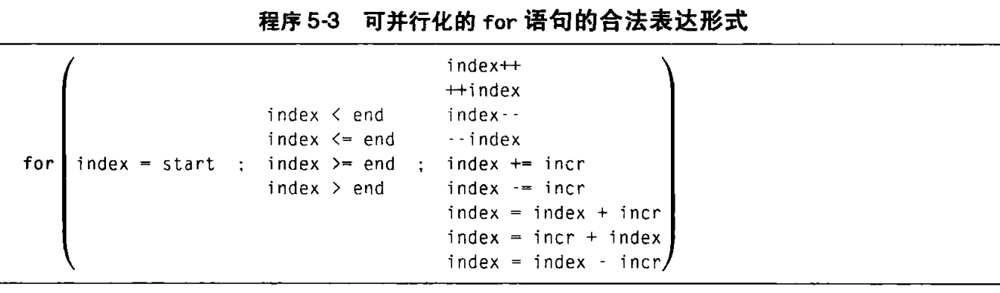

  这些限制允许运行时系统在循环执行前确定迭代的次数。


#### 5.5.2 数据依赖性❗

如果 `for` 循环不能满足上述所列举规则中的任何一条，那么编译器将简单地拒绝它。

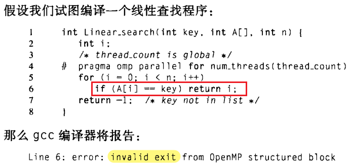 


更隐匿的问题发生在如下的循环中：在该循环中，迭代中的计算依赖于一个或更多个先前的迭代结果。例如：考虑下述代码，计算前 n 个斐波那契数：

```c
fibo[0] = fibo[1] = 1;
for(i=2; i<n; i++)
    fibo[i] = fibo[i-1] + fibo[i-2];
```

假设我们使用一个 `parallel for` 指令并行化这个 `for` 循环：

```c
    fibo[0] = fibo[1] = 1;
#   pragma omp parallel for num_threads(thread_count);
    for(i=2; i<n; i++)
        fibo[i] = fibo[i-1] + fibo[i-2];
```

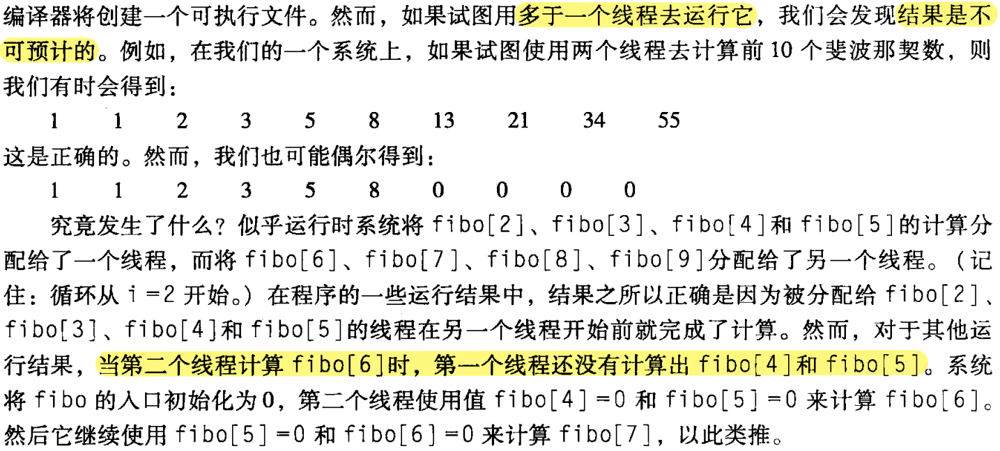

我们看到两个要点：

1. OpenMP 编译器 **不检查** 被 `parallel for` 指令并行化的循环所包含的 **迭代间的依赖关系**，而是由程序员来识别这些依赖关系。
2. 一个或更多个迭代结果 **依赖于** **其他迭代的循环**，一般 **不能** 被 OpenMP 正确地并行化。

`fibo[6]` 和 `fibo[5]` 计算间的依赖关系称为 **数据依赖**。由于 `fibo[5]` 的值在一个迭代中计算，其结果在之后的迭代中使用，这种依赖关系有时称为 **循环依赖** 。


#### 5.5.3 寻找循环依赖

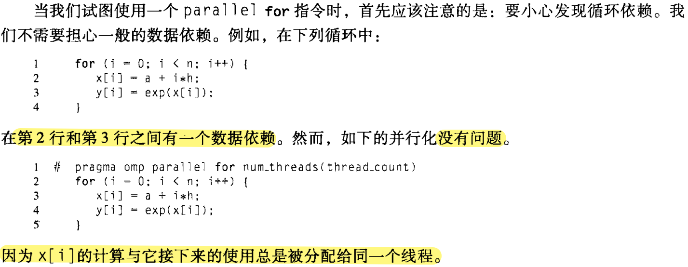

有依赖关系的语句，其中至少一条语句会有序地写或更新变量。因此为了检测循环依赖，只须关注被循环体更新的 变量。


#### 5.5.4 𝜋 值的估计

𝜋=4[1−13+15−17+⋯]=4∑𝑘=0∞(−1)𝑘12𝑘+1

我们能够在串行代码中实现这个公式：

```c
double factor = 1.0;
double sum = 0.0;
for(int k = 0; k<n; k++){
    sum += factor/(2*k + 1);
    factor = -factor;
}
pi_approx = 4.0 * sum;
```

并行化：

```c
    double factor = 1.0;
    double sum = 0.0;
#   pragma omp parallel for num_threads(thread_count) \
        reduction(+: sum)
    for(int k = 0; k<n; k++){
        sum += factor/(2*k + 1);
        factor = -factor;
    }
    pi_approx = 4.0 * sum;
```

很明显，`factor` 的更新对下一次迭代的 `sum` 的累加是一个 循环依赖。如果第 k 次迭代被分配给一个线程，而 第 k+1 次迭代被分配给另一个线程，则我们不能保证第 6 行中 factor 的值是正确的。在这种情况下，我们能够通过检查系数来修复这个问题：factor 的值应该是。第 𝑘 次迭代中，factor 的值应该是 (−1)𝑘 。修改代码：

```c
if(k % 2 == 0)
    factor = 1.0;
else
    factor = -1.0;
// 或 factor = (k % 2 == 0)? 1.0 : -1.0;
sum += factor/(2*k + 1);
```

然而，事情仍然不是完全正确的，如果在我们的系统上使用两个线程运行程序，并设 𝑛=1000 ，那么结果仍然是错的。

**原因分析**：在一个已经被 `parallel for` 指令并行化的块中，**缺省情况下任何在循环前声明的变量在线程间都是共享的**，因此 factor 被共享。

- 线程0可能会给它赋值1，但在它使用这个值更新 sum 前，线程1可能给它赋值 -1。因此，除了消除 `factor` 的循环依赖外，还需要保证每个线程有自己 `factor` 副本。

- 我们需要保证 factor 有私有作用域，通过添加一个 `private` 子句到 `parallel` 指令中来实现这一目标：

  - 关键点：`private(factor)` 

  ```c
      double factor = 1.0;
      double sum = 0.0;
  #   pragma omp parallel for num_threads(thread_count) \
          reduction(+: sum) private(factor)
      for(int k = 0; k<n; k++){
          if(k % 2 == 0)
              factor = 1.0;
          else
              factor = -1.0;
          sum += factor/(2*k + 1);
      }
      pi_approx = 4.0 * sum;
  ```

  - ❗注意：**一个有私有作用域的变量的值** 在 `parallel` 块或者 `parallel for` 块的开始处 **是未指定的**。它的值在 `parallel` 块或者 `parallel for` 块完成之后也是未指定的。

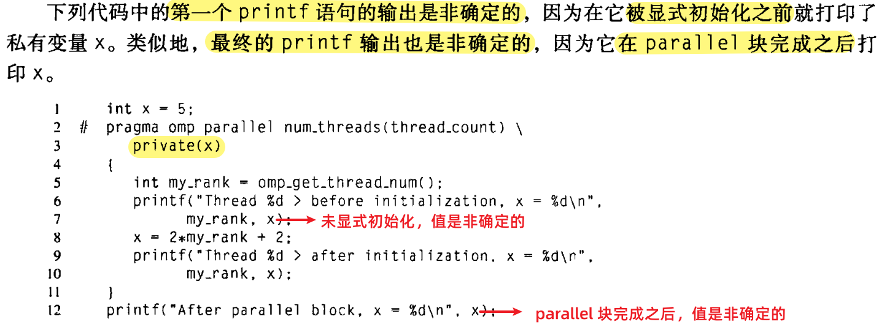


#### 5.5.5 关于作用域的更多问题

- 子句：`default` 

  添加

  ```c
  default(none)
  ```

  到 `parallel` 或 `parallel for` 指令中，那么编译器将要求我们 **明确**（显式地表明） 在这个块中使用的 每个变量和已经在块之外声明的变量的作用域。（在一个块中声明的变量都是私有的，因为它们会被分配给线程的栈。）

- 例如，使用一个 `default(none)` 子句，对 𝜋 的计算将如下所示：

  ```c
      double factor = 1.0;
      double sum = 0.0;
  #   pragma omp parallel for num_threads(thread_count) \
          default(none) reduction(+: sum) private(k, factor)
      for(int k = 0; k<n; k++){
          if(k % 2 == 0)
              factor = 1.0;
          else
              factor = -1.0;
          sum += factor/(2*k + 1);
      }
      pi_approx = 4.0 * sum;
  ```

- 在 这个例子中，`for` 循环中使用了 4 个变量。由于 `default` 子句，我们需要明确每个变量的作用域。正如我们注意到的，`sum` 是一个归约变量（同时拥有私有和共享作用域的树形）。

- 注意到 `factor` 和 循环变量 `k` 应该有 私有作用域。

- 从未在 `parallel` 或 `parallel for` 块中更新的变量，例如 n，能够被安全的共享。

- 共享变量的值保持和  `parallel` 或 `parallel for` 块之前同样的值。块之后的值保持和块内最后的值一致。


### 5.7 循环调度

- 当第一次遇到 `parallel for` 指令时，我们看到将各次循环分配给线程的操作是由系统完成的。
- 然而大部分的 OpenMP 实现只是 粗略地使用 **块分割**：如果在 串行循环中有 n 次迭代，那么在并行循环中，前 n/thread_count 个迭代分配给线程 0，接下来 n/thread_count 个迭代分配给线程 1，以此类推。

假设并行化循环：

```c
sum = 0.0;
for(i=0; i<=n; i++)
    sum += f(i);
```

- 同时，假设对 𝑓 函数调用所需要的时间与 参数 𝑖 的大小成正比，那么与分配给线程 0 的工作相比，分配给线程 `thread_count - 1` 的工作量相对较大。

  一个较好的分配方案是轮流分配线程的工作（循环划分）。在循环划分中，各次迭代被 “轮流” 地一次一个地分配给线程。

  假设 `t = thread_count` ，那么一个循环划分将如下分配给各次迭代：

  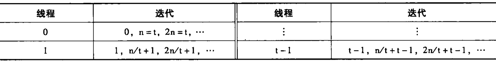


测试分配对程序性能的影响的程序：

```c
double f(int i) {
    int j, start = i * (i + 1) / 2, finish = start + i;
    double return_val = 0.0;

    for (j = start; j <= finish; j++) {
        return_val += sin(j);
    }
    return return_val;
} /* f */
```

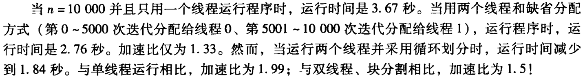


#### 5.7.1 `schedule` 子句

缺省调度：

```c
    sum = 0.0;
#   pragma omp parallel for num_threads(thread_count) \
        reduction(+: sum)
    for(i=0; i<=n; i++)
        sum += f(i);
```

对线程进行调度：在 `parallel for` 指令中添加 `schedule` 子句：

```c
    sum = 0.0;
#   pragma omp parallel for num_threads(thread_count) \
        reduction(+: sum) schedule(static, 1)
    for(i=0; i<=n; i++)
        sum += f(i);
```

`schedule` 子句有如下形式：

```c
schedule(<type>[, <chunksize>])
```


`type` 可以是下列任意一个：

- `static` ：迭代能够在 **循环执行前** 分配给线程。
- `dynamic` 或 `guided` ：迭代在 **循环执行时** 被分配给线程。因此在一个线程完成了它的当前集合后，它能够从运行时系统中请求更多。
- `auto` ：编译器和运行时系统决定调度方式。
- `runtime` ：调度在运行时决定。

`chunksize` 是一个正整数。在 OpenMP 中，**迭代块** 是 顺序循环 中 **连续执行的** **一块迭代语句**，块中迭代次数是 `chunksize` ，只有 `static` 、`dynamic` 和 `guided` 调度有 `chunksize` 。这虽然决定了调度的细节，但准确的解释还是依赖于 `type`。


#### 5.7.2 `static` 调度类型

对于 `static` 调度，系统以轮转的方式分配 `chunksize` 块个迭代给每个线程。

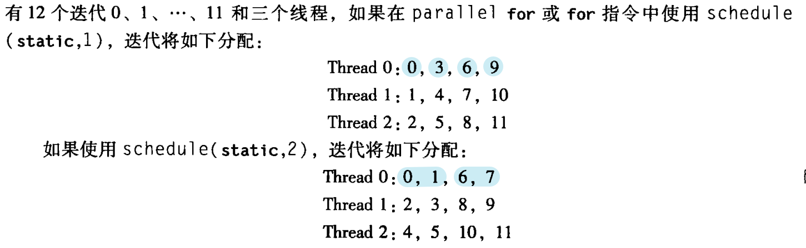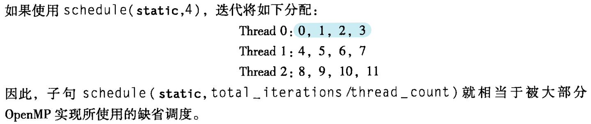

- `chunksize` 可以被忽略，如果它被忽略，`chunksize` 就近似等于 `total_iterations/thread_count` 


#### 5.7.3 `dynamic` 和 `guided` 调度类型

- 在 `dynamic` 调度中，迭代也被分成 `chunksize` 个连续迭代的块。每个线程执行一块，并且**当一个线程完成一块时，它将从运行时系统请求另一块**，直到所有的迭代完成。

  - `chunksize` 可以被忽略，当它被忽略时，`chunksize` 为 1。

- 在 `guided` 调度中，每个线程也执行一块，并且当一个线程完成一块中，将请求另一块。然后，**在 guided 调度中，当块完成后，新块的大小会变小**。

- 例如：使用 `parallel for` 指令和 `schedule(guided)` 子句来运行 梯形积分法程序，那么当 𝑛=10000 并且 `thread_count  = 2` 时，迭代将会如下表那样分配。**块的大小近似等于剩下的迭代数除以线程数**。

  因为有 9999个未分配的迭代，所以第一块的大小为 9999/2≈5000。第二个块的大小为 4999/2≈2500，以此类推。

  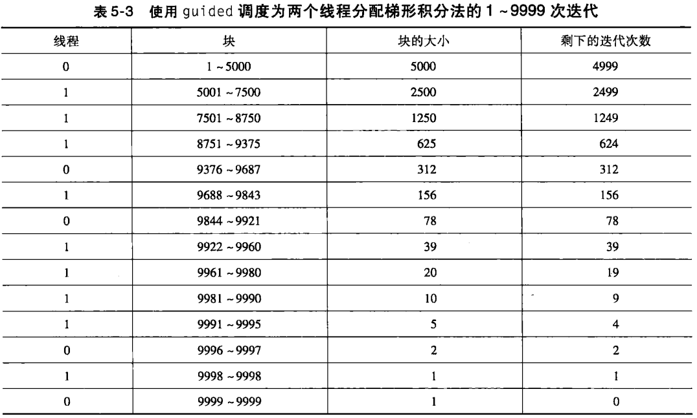

- 在 guided 调度中，如果没有指定 `chunksize` ，那么块的大小为 1；如果指定了 `chunksize`，块大小是动态的，块的大小与未分配的迭代次数除以线程数成正比，并且大小将减小到`chunk-size`（但最后一个块可能小于`chunk-size`）


#### 5.7.4 `runtime` 调度类型

**环境变量** ：环境变量是能够运行时被系统所访问的命名值，即它们在程序的环境中可得的。

当 `schedule(runtime)` 指定时，系统使用环境变量 `OMP_SCHEDULE` 在运行来决定如何调度循环。`OMP_SCHEDULE` 环境变量能够呈现任何被 `static`、`dynamic` 或 `guided` 调度所用的值。

例如，假设在程序中有一条 parallel for 指令，并且它已经被 `schedule(runtime)` 修改了，那么如果使用 bash shell，就能通过执行以下命令将一个循环分配所得到的迭代分配给线程：

```shell
export OMP_SCHEDULE="static, 1"
```

现在，当开始执行程序时，系统将调度 for 循环的迭代，就如同使用子句 `schedule(static,1)` 修改了 parallel for 指令那样。


#### 5.7.5 调度选择

- `dynamic` 调度的系统开销大于 `static` 
- `guided` 调度的系统开销是三种方式中最大的。


### 5.8 生产者和消费者问题

#### 5.8.1 队列

例如，假设我们有多个“生产者”线程和多个“消费者”线程。

- 生产者线程可能会“生产”数据请求。
- 消费者线程则可能通过查找或生成所请求的数据来“消费”这些请求。
- 生产者线程将请求入队，而消费者线程将请求从队列中移出。


#### 5.8.2 消息传递

- 生产者和消费者问题模型 的另一个应用是 在共享内存 上实现 **消息传递**。
- 每个线程有一个 **共享消息队列**，当一个线程要向另一个线程“发送消息”时，它将消息放入 **目标线程的消息队列中**。一个线程接收消息时，只需从它的消息队列的 **头部** **取出消息**。


简单的消息传递程序：每个线程随机产生整数“消息”和消息的目标线程。

- 创建一条消息后，线程将消息加入到合适的消息队列中。
- 发送消息之后，该线程查看自己的消息队列以获知它是否收到消息，如果它收到了消息，它将队首的消息出队并打印该消息。
- 每个线程交替发送和接收消息，用户需要指定每个线程发送消息的数目。
- 当一个线程发送完所有的消息后，该线程不断接收消息直到其他所有线程都已完成。

伪代码：

```c
for(send_msgs = 0; sent_msgs < send_max; send_msgs++){
    Send_msg();
    Try_receive();
}

while(!Done())
    Try_receive();
```


#### 5.8.3 发送消息

访问消息队列并将消息入队，可能是一个临界区。入队操作形成了临界区。

`Send_msg()` 函数的伪代码：

```c
    msg = random();
    dest = random() % thread_count;
#   pragma omp critical
    Enqueue(queue, dest, my_rank, msg);
```

上面的实现中，允许线程向自己发送消息。


#### 5.8.4 接收消息

- 只有消息队列的拥有者可以从给定的消息队列中获取消息。

  - 如果消息队列中至少有两条消息，那么只要每次出队一条消息，那么出队操作和入队操作不可能冲突。
  - 因此，如果消息队列中至少有两条消息，通过跟踪队列的大小就可以避免任何同步。（例如 `critical` 指令）

- 可以使用两个变量：`enqueued` 和 `dequeued` ，队列中消息的个数为：

  ```c
  queue_size = enqueued - dequeued
  ```

- 并且，唯一能够更新 `dequeued` 的线程是消息队列的拥有者。

`Try_receive` ：

```c
    queue_size = enqueued - dequeued;
    if(queue_size == 0) return;
    else if(queue_size == 1)
#       pragma omp critical
        Dequeue(queue, &src, &mesg);
    else
        Dequeue(queue, &src, &mesg);
    Print_message(src, mesg);
```


#### 5.8.5 终止检测

使用一个计数器 `done_sending` ，每个线程在 `for` 结束后将该计数器加 1，Done 的实现如下：

```c
queue_size = enqueued - dequeued;
if(queue_size == 0 && done_sending == thread_count)
    return TRUE;
else
    return FLASE;
```


#### 5.8.6 启动

如果一个或多个线程在其他线程之前完成它的队列分配。分配完的线程可能会试图向那些还没有完成队列分配的线程发送消息，这将导致消息崩溃。

OpenMP 提供相应的指令实现 **路障**：

```c
# pragma omp barrier
```

当线程遇到路障时，它将被阻塞，直到组中所有的线程都达到了这个路障。当组中的所有线程都到达了这个路障时，这些线程就可以接着往下执行。


#### 5.8.7 `atomic` 指令

发送完所有的消息后，每个线程在执行最后的循环以便接收消息之前，需要对 `done_sending` 加 1。显然，对 `done_sending` 的增量操作是临界区，可以通过 `critical` 指令保护它。

然而，OpenMP 提供了另一种可能更高效的的指令：`atomic` 指令：

```c
# pragma omp atomic
```

它只能包保护一条 C 语言赋值语句所形成的临界区。此外，语句必须是以下几种形式之一：

```
x <op>= <expression>;
x++;
++x;
x--;
--x;
```

- `<op>` 可以是以下任意的二元操作符：`+, *, -, /, &, ^, |, <<, >>`

- `<expression>` 不能引用 `x` ❗

- 注意：只有 x 的装载和存储是受保护的。

  例如代码：

  ```c
  #   pragma omp atomic
      x += y++;
  ```

  对 y 的更新不受保护。


#### 5.8.8 临界区和锁

- 在这个程序中，有 3 个 `critical` 或 `atomic1 指令后面的代码块：

  - `done_sending++` 
  - `Enqueue(q_p, my_rank, mesg)` 
  - `Dequeue(q_p, &src, &mesg)` 

- OpenMP 默认的做法是将所有的临界区代码作为 **复合临界区** 的一部分，非常不利于 程序的性能。

- OpenMP 提供了向 critical 指令添加名字的选项：

  ```c
  # pragma omp critical(name)
  ```

  采用这种方式，两个用不同名字的 `critical` 指令保护的代码块 **可以同时执行**。

- 但是按照我们的设置，我们想让 访问不同队列的线程同时访问相同的代码块，被命名的 `critical` 指令就不能满足我们的要求了。

- 解决方案：**锁**

- OpenMP 有两种锁：**简单** (simple)锁，**嵌套** (nested) 锁。

  - **简单锁** 在被释放前 只能获得一次
  - **嵌套锁** 在被释放前 可以被同一个线程获得多次。

- OpenMP 的简单锁的类型是 `omp_lock_t` ，定义简单 锁 的函数：

  ```c
  void omp_init_lock(omp_lock_t*      lock_p  /* out */);
  void omp_set_lock(omp_lock_t*       lock_p  /* in/out */);
  void omp_unset_lock(omp_lock_t*     lock_p  /* in/out */);
  void omp_destroy_lock(omp_lock_t*   lock_p  /* in/out */);
  ```


#### 5.8.9 在消息传递程序中使用锁

我们希望：确保对每个消息队列进行互斥访问，而不是代码段。锁可以帮助我们实现这个目的。

原代码：

```c
#   pragma omp critical
    /* q_p = msg_queues[dest] */
    Enqueue(q_p, my_rank, mesg);
```

修改为：

```c
    /* q_p = msg_queues[dest] */
    omp_set_lock(&p_q->lock);
    Enqueue(q_p, my_rank, mesg);
    omp_set_unlock(&p_q->lock);
```


类似地：

```c
#   pragma omp critical
    /* q_p = msg_queues[dest] */
    Dequeue(q_p, &src, &mesg);
```

修改为：

```c
    /* q_p = msg_queues[dest] */
    omp_set_lock(&p_q->lock);
    Dequeue(q_p, &src, &mesg);
    omp_set_unlock(&p_q->lock);
```


#### 5.8.10 `critical` 指令、`atomic` 指令、锁的比较

- 一般而言，`atomic` 指令是实现互斥最快的方法。
- OpenMP 规范允许 `atomic` 指令对程序中所有 `atomic` 指令标记的临界区进行强制互斥访问——这是未命名的 `critical` 指令的工作方式。如果这种行为不能满足要求，则应当使用命名的 `critical` 指令或锁。
- 使用 `critical` 指令保护临界区与使用锁保护临界区的性能上没有太大区别。


#### 5.8.11 经验

1. **对同一临界区不应当混合使用不同的互斥机制**。❗

   例如：一个程序包含下面两个代码的片段：

   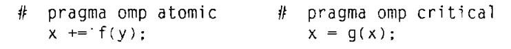 

   右边的代码对 x 进行修改，但是不满足 `atomic` 指令要求的形式，所以程序员采用了 `critical` 指令。

   - 由于 `critical` 指令和 `atomic` 指令 **不会互斥执行**，所以程序可能得到不正确的结果。
   - 程序员需要重写函数 g，使得它满足 atomic 指令要求的形式。
   - 或者程序员需要用 `critical` 指令将这两个代码块都保护起来。

2. **互斥执行不保证公平性**。

   ```c
       while(1){
   #   pragma omp critical
           x = g(my_rank);
       }
   ```

   可能出现，线程1一直被阻塞等待执行 `x = g(my_rank)` ，而其他线程却在反复执行这条赋值语句。如果循环能结束，上面的问题就不会存在。

3. **“嵌套”互斥结构可能会产生意料不到的结果**。❗

   例如，一个程序包含了以下两个代码片段：

   ```c
   #   pragma omp critical
       y = f(x);
       ...;
       double f(double x){
   #       pragma omp critical
           z = g(x);  /* z 是共享变量 */
       }
   ```

   这段代码肯定会产生 **死锁**。当第一个线程试图进入第二个临界区时，它将永远被阻塞。如果一个线程 u 在执行第一个临界区的代码，则不可能有其他线程执行第二个临界区的代码。然而如果 线程 u 被阻塞以等待进入第二个临界区，那么它将永远不会离开第一个临界区。

   解决办法：**命令临界区**

   ```c
   #   pragma omp critical(one)
       y = f(x);
       ...;
       double f(double x){
   #       pragma omp critical(two)
           z = g(x);  /* z 是共享变量 */
       }
   ```

   

- 然而，还是有 命名临界区不能解决的问题。

  例如，有一个程序有两个命令临界区 one 和 two，并且 **线程以不同的顺序进入临界区**，那么死锁就可能发生。

  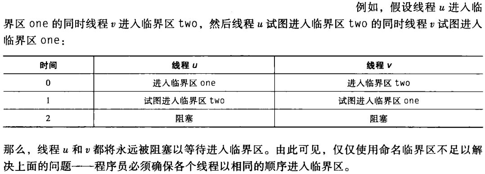

## 6 并行程序开发


### 6.1 n 体问题的两种解决方法

* n 体问题的解决方案是通过：模拟粒子行为找到解决 n 体问题的程序。
* 问题的输入：粒子的质量，粒子在开始时的位置和速度。
* 问题的输出：粒子在用户指定的时间序列中的速度和位置，或者只是粒子在用户指定的时间段后的速度和位置。


#### 6.1.1 问题

我们的工作：计算 t 时 粒子的位移 $S_q(t)$ 和 速度 $v_q(t) = s_q'(t)$ 。

假定需要计算在时间序列 $t = 0, \Delta t, 2\Delta t, \cdots, T\Delta t$ 下的位移和速度，更为常见的情况是，我们仅仅需要计算出 $T\Delta t$ 时的粒子的位移和速度。T 和 $\Delta t$ 由用户说明。

所以，程序的输入是：$n$ （粒子的个数）、$\Delta t$、$T$ 和 每个粒子的质量、初始位置和初始速度。

在通用的解决方案中：位移和速度都是三维向量。为了简化问题，假定粒子在平面上移动，用二维向量来表示它们。

程序的输出是：$n$ 个粒子在时间步长 $0, \Delta t, 2\Delta t, \cdots, T\Delta t$ 下的位移和速度，或者只是粒子在时间 $T\Delta t$ 时的位置和速度。


#### 6.1.2 两个串行程序

串行的 $n$ 体解决方法一般以下面的伪代码为基础：

```c
Get input data;
for each timestep{
    if(timestep output) 
        Print positions and velocities of particles;
    for each particle q
        Compute total force on q;
    for each particle q
        Compute position and velocity of q;
}
Print positions and velocities of particles;
```

使用计算粒子总作用力的公式细化上面的伪代码中计算作用力的部分：

```c
for each particle q {
    for each particle k != q {
        x_diff = pos[q][X] - pos[k][X];
        y_diff = pos[q][Y] - pos[k][Y]; 
        dist = sqrt(x_diff*x_diff + y_diff*y_diff); 
        dist_cubed = dist*dist*dist; 
        forces[q][X] -= G*masses[q]*masses[k]/dist_cubed * x_diff;
        forces[q][Y] -= G*masses[q]*masses[k]/dist_cubed * y_diff;
    }
}
```

由计算的对称性，减少迭代次数，改进后的算法叫做简化算法，上面的算法叫基本算法。

```c
for each particle q
    forces[q] = 0;
for each particle q{
    for each particle k > q {
        x_diff = pos[q][X] - pos[k][X];
        y_diff = pos[q][Y] - pos[k][Y];
        dist = sqrt(x_diff*x_diff + y_diff*y_diff);
        dist_cubed = dist*dist*dist;
        force_qk[X] = G*masses[q]*masses[k]/dist_cubed * x_diff;
        force_qk[Y] = G*masses[q]*masses[k]/dist_cubed * y_diff;

        forces[q][X] += force_qk[X];
        forces[q][Y] += force_qk[Y];
        forces[k][X] -= force_qk[X];
        forces[k][Y] -= force_qk[Y];
    }
}
```

加入计算位置和速度的代码：

```c
pos[q][X] += delta_t * vel[q][X];
pos[q][Y] += delta_t * vel[q][Y];
vel[q][X] += delta_t / masses[q] * forces[q][X];
vel[q][Y] += delta_t / masses[q] * forces[q][Y];
```


初始：

```c
#include <string.h>   /* For memset */
vect_t* forces = malloc(n*sizeof(vect_t));
...
for (step = 1; step <= n_steps; step++) {
    ...
    /* 将 forces 数组的每个元素赋值为 0 */
    forces = memset(forces, 0, n*sizeof(vect_t));
    for (part = 0; part < n-1; part++)
        Compute_force(part, forces, ...)
    ...
}
```


#### 6.1.3 并行化 n 体算法

对 n 体算法使用 Foster 方法。我们最初的目的是要运行多个任务，开始时可以将一个时间点上对位移、速度和所受作用力的计算视为一个任务。

将对 位移、速度、作用力的计算凝聚在一个任务中，任务间的通信会大大简化。现在任务与粒子相对应。简化算法，利用作用力的性质，简化通信。

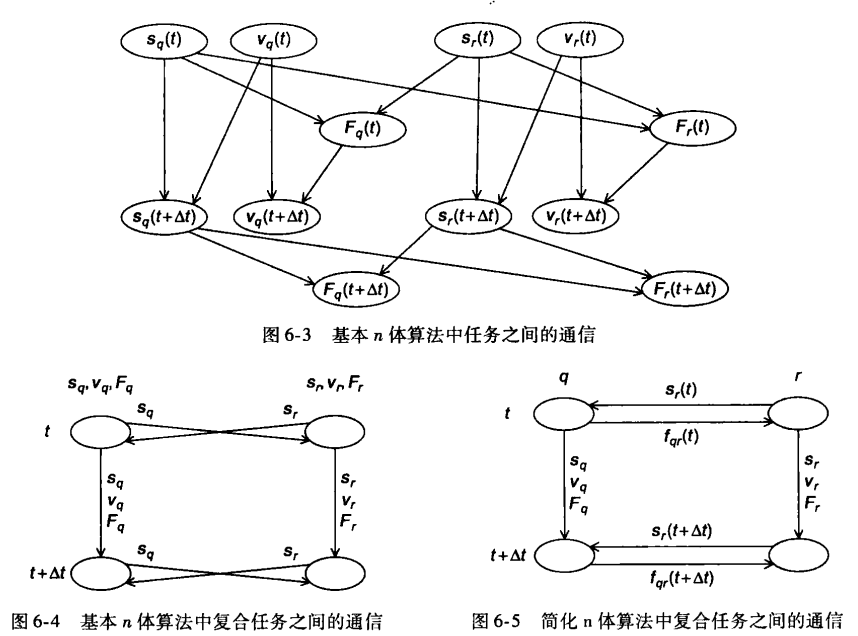

在简化算法中计算作用力时，计算小的编号迭代所需的计算量远远大于较大编号迭代所需的计算量。所以，对于简化算法，对粒子进行循环划分比块划分更能均衡地分配计算任务。

然而：

* 共享内存环境中，循环地将粒子划分给各个核肯定比块划分导致更多的缓存缺失。
* 分布式内存环境中，循环法导致的通信数据负载比块划分导致的通信数据负载大。

因此对于单个粒子有关的计算组合在一个复合任务的模拟计算方法，我们有如下结论：

1. n 体问题的基本算法采用块划分法会有更好的性能。
2. 对于简化算法，循环划分可以使得在计算作用力时的负载更为均衡。然而采用该划分方法带来的提升需要与共享内存环境下的缓存性能的降低、分布式内存环境下的额外的通信负载相权衡。


#### 6.1.5 用 OpenMP 并行化基本算法

先研究一下串行程序的伪代码：

```c
for each timestep{
    if(timestep output) 
        Print positions and velocities of particles;
    for each particle q
        Compute total force on q;
    for each particle q
        Compute position and velocity of q;
}
```

代码中的两个内存循环都是按照粒子进行迭代的。所以理论上，并行化这两个内存 for 循环会将任务/粒子映射到 核上，我们可能尝试像下面这样修改代码：

```c
for each timestep{
    if(timestep output) 
        Print positions and velocities of particles;
#   pragma omp parallel for
    for each particle q
        Compute total force on q;
#   pragma omp parallel for
    for each particle q
        Compute position and velocity of q;
}
```

事实上，这段代码会 **产生很多次线程派生和合并操作**。


基本算法中，第一个循环的形式如下：

```c
#pragma omp parallel for
for each particle q {
    forces[q][X] = forces[q][Y] = 0;
    for each particle k != q {
        x_diff = pos[q][X] - pos[k][X];
        y_diff = pos[q][Y] - pos[k][Y];

        dist = sqrt(x_diff*x_diff + y_diff*y_diff);
        dist_cubed = dist*dist*dist;
        forces[q][X] -= G*masses[q]*masses[k]/dist_cubed * x_diff;
        forces[q][Y] -= G*masses[q]*masses[k]/dist_cubed * y_diff;
    }
}
```

**代码分析**：因为 `for each particle q` 循环的迭代在 线程之间，所以对于任意的 粒子 $q$，只有一个线程可以访问访问 `forces[q]` 。不同线程 都可以访问 `pos` 数组和 `mass` 数组的相同元素。然而，在循环中这些数组是 只读的。其余变量用于内部循环的临时存储，并且它们可以是私有的。因此，并行化算法的第一个循环不会带来任何竞争状态。


第二个循环的形式如下：

```c
#   pragma omp parallel for
    for each particle q {
        pos[q][X] += delta_t*vel[q][X];
        pos[q][Y] += delta_t*vel[q][Y];
        vel[q][X] += delta_t/masses[q]*forces[q][X];
        vel[q][Y] += delta_t/masses[q]*forces[q][Y];
    }
```

此时，对于任意的粒子 q 只有一个线程访问 `pos[q]`、`vel[q]`、`masses[q]` 和 `forces[q]`，标量只能读，所以并行化这个循环也不会带来任何竞争状态。


对于重复派生和合并线程的问题：

```c
for each timestep{
    if(timestep output) 
        Print positions and velocities of particles;
#   pragma omp parallel for
    for each particle q
        Compute total force on q;
#   pragma omp parallel for
    for each particle q
        Compute position and velocity of q;
}
```

可能可以：在最外层的循环前使用 `parallel` 指令，而对内存循环使用 OpenMP 的 `for` 指令。

```c
#   pragma omp parallel
    for each timestep{
        if(timestep output) 
            Print positions and velocities of particles;
#       pragma omp parallel for
        for each particle q
            Compute total force on q;
#       pragma omp parallel for
        for each particle q
            Compute position and velocity of q;
    }
```

这样的修改会在两个 `for each particle` 循环上产生我们想要的效果：同一组的线程会被这两个内存循环和外层循环的迭代都使用到。然后，**在输出语句上遇到问题。每个线程都将打印位置和速度**，而我们只想一个线程做 I/O 操作。OpenMP 为这种情况提供了 `single` 指令：有一组线程执行某个代码块，但是这个代码块中的某一个部分只能被这些线程其中的一个执行。加入 `single` 指令后，我们得到如下的伪代码：

```c
#   pragma omp parallel
    for each timestep{
        if(timestep output)
#           pragma omp single
            Print positions and velocities of particles;
#       pragma omp parallel for
        for each particle q
            Compute total force on q;
#       pragma omp parallel for
        for each particle q
            Compute position and velocity of q;
    }
```

> 第一个 `# pragma omp parallel` 指令确保代码块在一个并行环境中执行，但没有直接对具体任务进行并行化。
>
> 两个 `# pragma omp parallel for` 指令将循环的迭代任务分配给多个线程，实现了并行计算。

修改后还有一些问题需要解决，其中最重要的是当从一条语句转向另一条语句时，可能带来竞争状态。

* 例如，假定线程0在线程1之前完成了第一个for each particle循环，接着它在第二个for each particle循环中更新了分配给它的粒子的位置和速度。显然，这导致线程1在第一个for each particle循环中使用了更新过的位置。
* 然而，需要注意到：在每个用for指令并行化的结构化块的末尾都有 **一条隐含的路障**，所以如果线程0在线程1前完成了第一个内部循环，那么它将被阻塞，直到线程1（和其他所有的线程）完成了第一个内部循环，并且在其他所有的线程执行完第一个内部循环前，它不会开始执行第二个内部循环。
* 这个机制也使得没有哪个线程执行得太快，以至于在其他线程执行完第二个内层循环前就输出了位置和速度。

* 在single指令后也有隐含的路障，尽管在这个程序中路障是不必要的。因为输出语句不会更新任何内存地址，所以其他线程可以在输出完成前继续执行下一个迭代。
* 此外，第一个for内层循环只是更新了forces数组，所以它不会导致执行输出语句的线程打印不正确的值。因为**第一个内层循环末尾的路障**，所以没有一个线程可以在输出结束之前就开始执行第二个内层循环更新位置和速度。
* 因此我们可以用 **`nowait`** 子句修改 `sing1e` 指令。如果OpenMP指令的实现支持这个子句，那么它仅仅会解除 `single` 指令默认的路障。这个子句也适用于 `for`、`parallel for` 和 `parallel` 指令。
* 需要注意的是，此时使用 `nowait` 子句不会在性能上带来太大的性能提升，因为这两个 `for each particle` 循环有默认的路障，而默认的路障不会允许某个线程在其他线程前执行太多的语句。

为了确保程序迭代采用**块划**分，需要在每个 `for` 指令之前加上一条调度子句：

```c
#       pragma omp parallel for schedule(static, n/thread_count)
```


#### 6.1.6 用 OpenMP 并行化简化算法

在简化算法中，循环有如下的形式：

```c
# pragma omp for /* Can be faster than memset */
for each particle q {
    force_qk[X] = force_qk[Y] = 0;
    for each particle k > q {
        x_diff = pos[q][X]-pos[k][X];
        y_diff = pos[q][Y] - pos[k][Y];
        dist = sqrt(x_diff*x_diff + y_diff*y_diff);
        dist_cubed = dist*dist*dist;
        force_qk[X] = G*masses[q]*masses[k]/dist_cubed * x_diff;
        force_qk[Y] = G*masses[q]*masses[k]/dist_cubed * y_diff;
    }

    forces[q][X] += force_qk[X];
    forces[q][Y] += force_qk[Y];
    forces[k][X] = force_qk[X];
    forces[k][Y] = force_qk[Y];
}
```

代码分析：我们感兴趣的变量是 `pos` 、`masses` 和 `forces` ，由于其他变量只会在单个迭代中访问，因此是私有变量。此外，`pos` 和 `masses` 数组中的元素是只读的，不能更新。因此，我们只需要研究 `forces` 数组的元素。

与基本的算法不同，一个线程可能更新 `forces` 数组中不属于分配给 该线程粒子的元素。对 `forces` 数组元素的更新会导致竞争状态。

最直观的方案：使用 `critical` 指令：

```c
# pragma omp critical
{
    forces[q][X] += force_qk[X];
    forces[q][Y] += force_qk[Y];
    forces[k][X] = force_qk[X];
    forces[k][Y] = force_qk[Y];
}
```

但是：这种方式会使得 `forces` **数组元素的访问串行化**。一次只能更新 `forces` 数组中的一个元素，而 **对临界区的争用** 很可能 **导致程序的性能急剧下降**。

另一种可行的方法是：**针对每一个粒子建立一个临界区**：

```c
    omp_set_lock(&locks[q]);
    forces[q][X] += force_qk[X];
    forces[q][Y] += force_qk[Y];
    omp_set_unlock(&locks[q]);

    omp_set_lock(&locks[k]);
    forces[k][X] = force_qk[X];
    forces[k][Y] = force_qk[Y];
    omp_set_unlock(&locks[k]);
```

假定主线程已经创建了一个共享锁数组，其中每个粒子一个锁，而当更新 `forces` 数组元素时，我们首先要获得对应粒子的锁。

另外一种可行的解决方案是将对作用力的计算分成两个阶段。

* 在第一个阶段中，每个线程所进行的计算与错误的并行程序中的计算相同；而不同是，现在计算的结果都存储在它自己的作用力数组中。
* 然后，在第二个阶段中，与粒子 $ q $ 相对应的线程将加上被其他线程计算出的该粒子所受作用力的部分。
* 在上面的例子中，线程 0 要计算 $-f_{03} - f_{13}$，而线程 1 要计算 $-f_{23}$。在每个线程都计算出分配给它的作用力部分时，对应于粒子 3 的线程 1 通过将这两个值相加得到粒子 3 所受的总作用力。

让我们看看更大一些的例子。假定有三个线程和六个粒子。如果对粒子采取块划分，那么第一个阶段的计算如表 6-1 所示。从表中最后三列可以看出每个线程在计算总作用力中的作用。在第二个阶段的计算中，表中第一列的线程将对它们所分配到的行求和，以得到相应粒子所受的作用力之和。

修改后的算法在第一个阶段与之前的算法相同，只是每个线程将计算出的作用力加到它自己的子数组 `loc_forces` 中：

```c
# pragma omp for
for each particle q {
    force_qk[X] = force_qk[Y] = 0;
    for each particle k > q {
        x_diff = pos[q][X] - pos[k][X];
        y_diff = pos[q][Y] - pos[k][Y];
        dist = sqrt(x_diff*x_diff + y_diff*y_diff);

        dist_cubed = dist*dist*dist;
        force_qk[X] = G*masses[q]*masses[k]/dist_cubed * x_diff;
        force_qk[Y] = G*masses[q]*masses[k]/dist_cubed * y_diff;
        /* 使用三维数组，分离线程访问的数据 */
        loc_forces[my_rank][q][X] += force_qk[X];
        loc_forces[my_rank][q][Y] += force_qk[Y];
        loc_forces[my_rank][k][X] -= force_qk[X];
        loc_forces[my_rank][k][Y] -= force_qk[Y];
    }
}
```

在第二个阶段中，每个线程加上其他线程计算出的作用力，得出分配给它的粒子所受的总作用力：

```c
# pragma omp for
for (q = 0; q < n; q++) {
    forces[q][X] = forces[q][Y] = 0;
    for (thread = 0; thread < thread_count; thread++) {
        forces[q][X] += loc_forces[thread][q][X];
        forces[q][Y] += loc_forces[thread][q][Y];
    }
}
```

* 在第一个阶段中，因为每一个线程都是写自己的子数组，所以对 `loc_forces` 的更新不会引入竞争状态。
* 此外，在第二个阶段中，只有粒子 \( q \) 的所有者线程 \( q \) 才会写 `forces[q]`，所以在第二个阶段中也不会引入竞争状态。
* 最后，由于每个并行化的 `for` 循环的都有隐含的路障，因此我们不用担心有某个线程执行得太快，以至于它会用到还没有被正确初始化的变量；或者某个线程运行得太慢，以至于它会用到已经被其他线程修改过的变量。


#### 6.1.7 评估 OpenMP 程序

* 对于基本算法，任何迭代均匀地划分给线程的调度都能取得较好的负载均衡。

  对块划分将产生比循环划分更少的缓存缺失，因此，块调度是基本算法最好的策略。

* 对于简化算法，

  * 随着迭代的增加，第一阶段对作用力的计算主键减少，因此循环划分能更好地将计算均等地分配给每个线程。
  * 在剩下的并行 `for` 循环中每次迭代所要做的工作量大致相同。因此采用块划分性能会更好。
  * 然而对一个循环的调度会影响另外一个循环的性能，所以如果对一个循环采用循环调度，而对其他循环采用块调度可能会降低程序的性能。


#### 6.1.8 用 `Pthreads` 并行化算法

主要讨论`Pthreads` 和 `OpenMP` 在实现上的不同，同时涉及一些相似之处：

* 在 `Pthreads` 中，缺省情况下，局部变量是私有的，而所有的共享变量是全局的。

* `Pthread` 中的主要数据结构与 OpenMP 中的数据结构相同。

* 启动 `Pthreads` 基本上与 启动 OpenMP 相同。

* `Pthreads` 实现与 OpenMP 实现的不同主要体现在对内部循环并行化的细节。

  `Pthreads` 必须显式地决定哪个循环变量对应于线程的计算。

* `Pthreads` 和 `OpenMP` 实现的另外一个不同之处在于它们的路障。

  * OpenMP 的 `parallel for` 指令有隐含的路障。
  * `Pthreads` 标准中包含了路障，但是有些系统并没有实现它，所以我们定义了一个函数，通过 `Pthreads` 条件变量实现路障。


#### 6.1.9 用 MPI 并行化基本算法

假设数组 `pos` 是可以存储 $n$ 个粒子的位置，`vect_mpi_t` 是一个存储两个连续 double 型的 MPI 数据类型，n 可以被 `comm_sz` 整除，且 `loc_n = n/comm_sz` 。那么，将局部的位置信息存储在独立的数组 `loc_pos` 中，可以调用 `MPI_Allgather` 从进程中收集所有的位置信息：

```c
MPI_Allgather(loc_pos, loc_n, vect_mpi_t, 
             pos, loc_n, vect_mpi_t, comm);
```

如果不能为 `loc_pos` 提供额外的存储空间，则可以让进程 q 将它的本地位置存储在 pos 中第 q 个位置。每个进程的本地位置存储在每个进程的 pos 数组的相应块中。

可以按照如下方式调用 MPI_Allgather：

```c
MPI_Allgather(MPI_IN_PLACE, loc_n, vect_mpi_t, 
             pos, loc_n, vect_mpi_t, comm);
```

关于数据结构的选择：  

- 每个进程存储粒子质量的整个全局数组。  
- 每个进程仅使用一个长度为 $n$ 的数组来存储位置。  
- 每个进程使用一个指针 `loc_pos`，该指针指向其位置块的起始地址。  
- 在进程 0 上，`local_pos = pos;` 
  在进程 1 上，`local_pos = pos + loc_n;` 
  依此类推。  

`Get input data` 可以按如下方法实现：

```c
if(my_rank == 0){
    for each particle
        Read masses[particle], pos[particle], vel[particle];
}
MPI_Bcast(masses, n, MPI_DOUBLE, 0, comm);
MPI_Bcast(pos, n, vect_mpi_t, 0, comm);
MPI_Scatter(vel, loc_n, vect_mpi_t,
           loc_vel, loc_n, vect_mpi_t, 0);
```


n 体问题算法 MPI 实现伪代码：

```c
Get input data;

for each timestep {
    if (timestep output)
        Print positions and velocities of particles;
    for each local particle loc.q
        Compute total force on loc.q;
    for each local particle loc.q
        Compute position and velocity of loc.q;
    Allgather local positions into global pos array;
}

Print positions and velocities of particles;
```

实现输出：

```c
Gather velocities onto process 0;

if (my_rank == 0) {
    Print timestep;
    for each particle
        Print pos[particle] and vel[particle]
}
```


#### 6.1.10 用 MPI 并行化简化算法

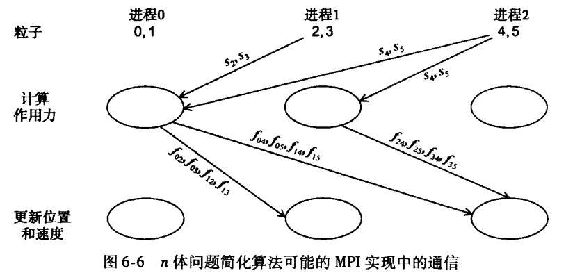

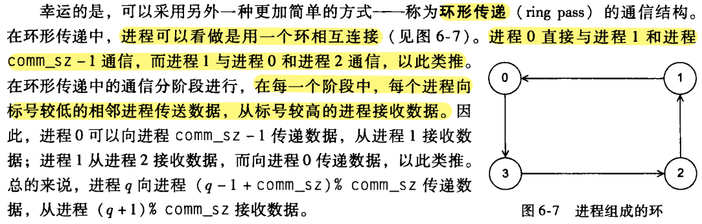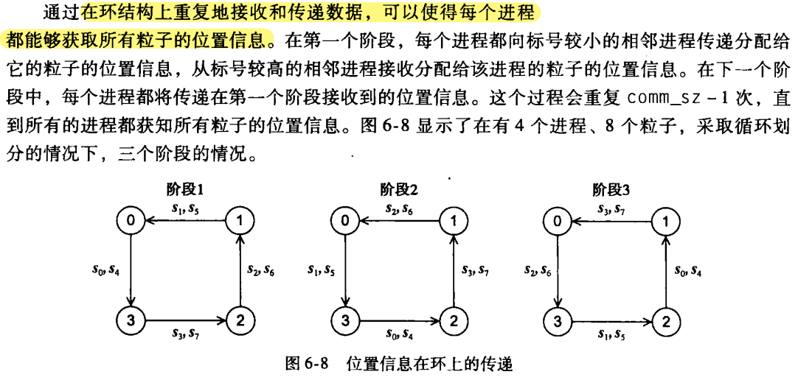

环形传递中的力计算 
在每个阶段，一个进程可以：  

1. 计算其分配的粒子与接收到位置的粒子之间相互作用产生的粒子间力；  
2. 一旦粒子间力计算完成，该进程可以将该力加到本地的力数组中，并从接收到的力数组中减去该力。  

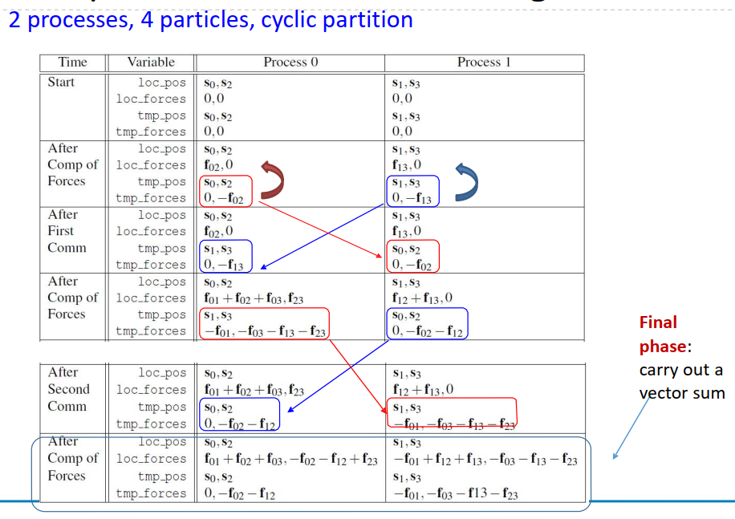

伪代码：

```c
source = (my_rank + 1) % comm_sz;
dest = (my_rank - 1 + comm_sz) % comm_sz;

Copy loc_pos into tmp_pos;
loc_forces = tmp_forces = 0;

Compute forces due to interactions among local particles;
for (phase = 1; phase < comm_sz; phase++) {
    Send current tmp_pos and tmp_forces to dest;
    Receive new tmp_pos and tmp_forces from source;
    /* Owner of the positions and forces we're receiving */
    owner = (my_rank + phase) % comm_sz;
    Compute forces due to interactions among my particles
    and owner's particles;
}

Send current tmp_pos and tmp_forces to dest;
Receive new tmp_pos and tmp_forces from source;
```


#### 6.1.11 MPI 程序的性能

简化算法的性能远远好于基本算法。简化算法比 MPI 算法更好地有效利用内存。基本算法在每个进程中都要为 n 个位置信息提供存储空间，而简化算法只需要为 `n/comm_sz` 个位置和 `n/comm_sz` 个作用力提供额外存储空间。

对于给定的线程数或进程数，MPI 程序可以比 OpenMP 程序进行更大规模的模拟。从硬件方面考虑， 可以使用的 MPI 进程数目可能比可以使用的 OpenMP 线程数目要大。

MPI 版本的简化算法扩展性更好。


# 计算机体系结构-量化研究方法

第四章：

PPT内容
Page 5 Flynn’s Taxonomy

#### 1 Flynn 分类法

* SISD-单指令流，单数据流

* SIMD-单指令流，多数据流

  在大多数指令中同时进行并行数据操作。

  新：SIMT - 单指令多线程（用于 GPU）

* MISD-多指令流，单数据流

  没有商业实现

* MIMD-多指令流、多数据流

  紧密耦合的MIMD：共享内存，OpenMP 和 Pthreads

  松散耦合的MIMD：分布式内存共享系统，例如集群，MPI

Page 6-7 Advantages of SIMD architectures

#### SIMD 架构的优势

* 能够充分利用显著的数据集并行，适用于一些列具有显著数据集并行的应用。

  科学计算、图像处理、AI应用

* 比MIMD更加节能

* 允许程序员串行思考


#### SIMD 架构

* 向量架构：扩展了多数据操作 (MD) 的流水线执行 (SI)。
* 图像处理单元（SIMT, GPU）

Page 11 Example of vector architecture

#### 向量架构的例子

* RV64V → RV64G，RV64V 扩展了 RV64G 的向量指令，其中 RV 代表 RISC-V
* 向量寄存器：
  * 每个寄存器可容纳一个包含 32个元素 的向量，每个元素为64位
  * 寄存器文件具有 16 个读端口和8个写端口。寄存器文件是中央处理器中处理寄存器的数组。
* 向量功能单元——浮点加法和乘法
  * 完全流水线化
  * 可检测数据和控制冲突
* 向量载入-存储单元
  * 完全流水线化
  * 初始延迟后，每个时钟周期可处理一个字
* 标量寄存器
  * 31 个通用寄存器
  * 32 个浮点寄存器
  * 为向量功能单元提供数据输入
  * 计算地址并传递给向量载入/存储单元

Page 26 Optimizations

#### 向量处理器优化

* **多条车道**——每个时钟周期处理多个元素
* **向量长度寄存器**——处理非 32 宽的向量
* **向量遮罩寄存器**——处理向量代码中的IF语句
* **内存组**——内存系统优化以支持向量处理器
* **步幅**——处理多维数组
* **分散-集中** ——处理稀疏矩阵
* **向量体系结构编程**——影响性能的程序结构

Page 28 1. A four lane vector unit

#### 四车道向量单元

* RV64V 指令 **仅允许** 一个向量的第N个元素 参与涉及 其他向量寄存器第 N 个元素的操作：简化了高度并行向量单元的构建
* **车道**——包含向量寄存器元素的一部分以及每个功能单元的一个执行流水线。


Page 38-39 Memory banks, 课本 page 298-299

#### 内存组

* 内存系统必须设计为支持向量寄存器加载和存储的高带宽

* 启动时间：将内存中的第一个字取到寄存器中

* 将访问分散到多个内存组中

* 独立控制内存组地址

* 加载或存储非连续的字

* 支持多个向量处理器共享同一内存

* 示例：

  * 32 个处理器，每个处理器每周期生成 4 次加载和2次存储

    处理器周期时间为 2.167ns，DRAM 内存组繁忙时间（及内存组延迟）为 15 ns，即大约每秒 67百万次

    需要多少内存组才能让所有处理器以全内存带宽运行（无内存组冲突）？

    * 32 个处理器 × 6 = 192 次内存访问
    * 15 ns DRAM 周期/2.167 ns 处理器周期 ≈ 7 个处理器周期
    * 7 × 192 = 1344 个内存组

Page 40-43

#### 理论内存带宽

* DRAM 时钟频率

* 每个时钟周期传输次数：在“双倍数据速率” 内存中，每时钟周期传输两次数据。

* 内存总线（接口）宽度：每个 DDR、DDR2 或 DDR3 内存接口的宽度为 64 位。这 64 位有时被称为一个“行”。

* 接口数量：现代个人计算机通常使用两个内存接口（双通道模式），以实现有效的 128 位总线带宽。

* 例：一台配备 双通道内存 且每个通道有一个 DDR2-800 模块（运行频率为 400MHz）的计算机，其理论 **最大内存带宽** 为：

  400,000,000 时钟每秒 × 2次每时钟周期× 64位每行×2个接口 = 102400,000,000 （1024亿）位每秒，即 12.8GB/s


#### 内存操作

* 加载/存储操作在寄存器和内存之间移动数据组
* 三种寻址方式：
  * **单位步幅**
    * 内存中的连续信息块
    * 速度最快：时钟可以优化
  * **非单位（恒定）步幅**
    * 为所有可能的步幅优化内存系统较为困难
    * 数据组数量为质数时，更容易以全带宽支持不同步幅
  * **索引（分散-集中）**
    * 类似于寄存器间接寻址的向量形式
    * 用于稀疏数据数组
    * 增加了可向量化的程序数量


Page 58-59 Roofline Model 课本 Page 307-310 ⭐

#### Roofline 模型⭐

* 基本思想：
  * 将峰值浮点性能作为算术强度的函数
  * 将浮点性能和内存性能联系起来
  * 算术强度（计算密度、计算访存比）：每读取一个字节的浮点操作数
  * 最大可到达的 GFLOPs/秒 = Min(**峰值内存带宽×算术强度，峰值浮点性能**)
  * Stream 是内存性能的基准测试工具
* 密集矩阵操作随问题规模扩展，但稀疏矩阵操作不会。
* Roofline：在屋顶的倾斜部分，性能受限于内存带宽，在平坦部分，性能受限于峰值浮点性能。

* 算力 $\pi$：计算平台的性能上限，一个计算平台倾尽全力每秒所能完成的浮点运算数。（FLOPS）
* 带宽 $\beta$：计算平台的带宽上限，一个计算机平台倾尽全力每秒所能完成的内存交换量。单位是 Byte/s
* 计算强度上限 $I_{\max}$：单位内存交换最多用来进行多少次计算，单位 FLOPs/Byte
* **模型的计算强度** $I$：由计算量除以访存量得到模型的计算强度。FLOPs/Byte
* 模型的理论性能 $P$ ：计算平台上所能达到的每秒浮点运算次数(FLOPS或 FLPS/s)

$$
P = \min(\beta I, \pi) = \min(带宽\times 算力强度,峰值浮点性能)
$$

* 算力（峰值浮点性能）决定“屋顶”的高度
* 带宽决定“屋檐”的斜率


Page 60-61  C. Graphical Processing Unit GPU

#### 图形处理单元

* 基本思想：
  * **异构执行模型**：
    * CPU 是主机，GPU 是设备
  * **开发一种类似C的编程语言用于 GPU**
    * 计算统一设备架构（CUDA）
    * OpenCL 作为独立于供应商的语言
  * **将所有形式的GPU并行性统一为 CUDA 线程**
  * **编程模型：“单指令多线程” (SIMT)** 

Page 63-64 Threads, blocks, and grid (CUDA) 课本 Page 313-320

#### 线程、块和网格（CUDA术语）

* CUDA 线程与每个数据元素相关联。
* CUDA 线程：利用数千个线程实现多种并行模式：多线程、SIMD、MIMD、ILP
* 带有索引的 CUDA 线程被组织成 **线程块** (thread block)
  * **线程块**：最多包含512个元素的组
  * 在多线程SIMD 处理器上执行：硬件一次执行整个线程块
* 带有索引的线程块被组织成一个 **网格** (grid)
  * 块独立执行并且可以按任意顺序执行
  * 不同块之间不能直接通信，但可以通过全局内存中的原子内存操作进行协调。
* CUDA 线程管理由 GPU 硬件和 CUDA 运行时处理，而不是由应用程序或操作系统处理。
* 多处理器 由线程 SIMD 处理器组成。
* 线程块调度器（硬件）


Page 65-70 Example: multiply two vectors of length 8192

#### 例：两个长度8192的向量相乘

C语言版本：

```c
//Invoke DAXPY
daxpy(n, 2.0, x, y);
// DAXDY in C
void daxpy(int n = 8192, double a, double* B, double* C)
{
    for(int i = 0; i<n; ++i)
        A[i] = B[i]*C[i];
}
```

CUDA 版本：

```c
// Invoke DAXPY 每个线程块 512 个线程
int nblock = (n+511)/512;
daxpy<<<nblock, 512>>>(n, 2.0, A, B, C);

// DAXPY in CUDA
__global__ void daxpy(int n, double a, 
                      double* A, double*B, double* C)
{
    int i = blockIdx.x * blockDim.x + threadIdx.x;
    if(i < n)
        A[i] = B[i]*C[i];
}
```

* 看起来我们是在元素级别上编程CUDA线程。（抽象：SIMT，单指令多线程）

网格(Grid)：代码在所有元素上运行

线程块 (Thread Block)：

* 类似于一个向量循环，通常向量长度最多为 512。将 **向量化循环** 分解为可管理的 **集合** (wrap)，**每个集合包含 32 个 CUDA 线程**。
* 每个 SIMD 线程 (wrap) 包含 32 个元素 (CUDA 线程)，16 个 SIMD 线程 = 每个线程块 512 个元素
  * 每个线程块包含 512 个元素（CUDA 线程），SIMD 指令一次执行 32 个元素。
* **网格大小** (Grid size)
  * 8192 个向量元素/每个线程块 512 个元素 = 16 个线程块
* **线程块调度器** (Thread Block Scheduler)
  * 将线程块分配给多线程 SIMD 处理器。
* 当前代 GPU (Pascal P100)：拥有 56 个多线程 SIMD 处理器（流处理器）

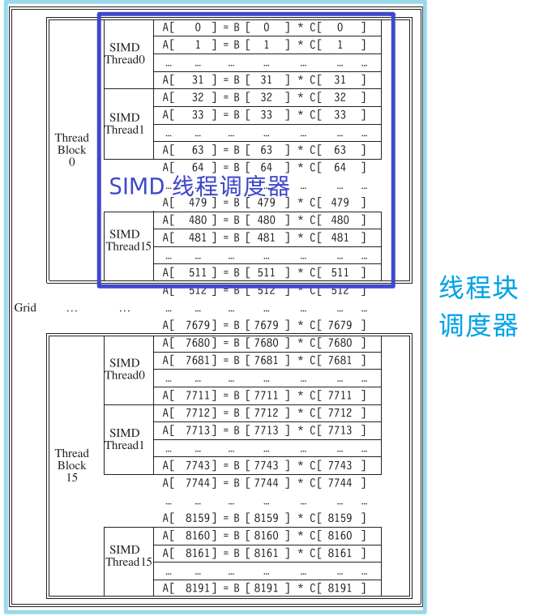 

* 32 个向量元素映射到 CUDA 的 "warp"
* 一个多线程SIMD处理器有多个SIMD车道（例如L1-L16）。线程块的CUDA线程由线程调度器分配到这些车道，并且每次处理一个线程。
* CUDA 线程块中的 **Warp（线程束）** 可以看作是 GPU 架构中的 **SIMD 线程**，它们在 SIMD 处理器上并发运行，并由 **SIMD 线程调度器** 进行调度。


Page 71-73 NVIDIA GPU memory structures 课本 Page 326-328

#### NVIDIA GPU 内存结构

* 每个 SIMD Lane （CUDA 线程）都有其私有的片外 DRAM 部分
  * 私有内存，不与其他的 Lane(CUDA 线程)共享
  * 包含栈、寄存器溢出以及不适合存储在寄存器中的私有变量。
  * 最近的 GPU 将这部分私有内存缓存在 L1 和 L2 缓存中。
* 每个 多线程 SIMD 处理器 还具有片上的 本地内存（共享内存）。
  * 仅由同一线程块内的 SIMD Lane /线程共享
  * 延迟比 GPU 内存低了 100 倍
  * 线程可以访问同一线程块内的其他线程从全局内存加载到本地内存中的数据。
* 由 SIMD 处理器共享的片外内存是 GPU 内存（全局内存）
  * 主机可以读写 GPU 内存。

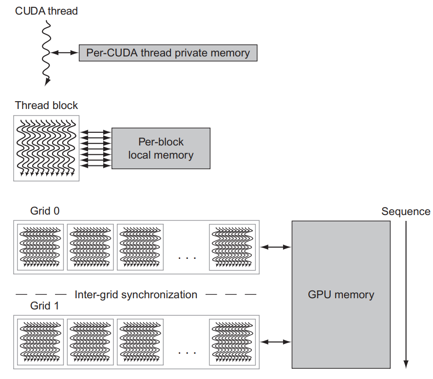 

* GPU 内存（**全局内存**）：由所有 **网格**（向量化循环）共享。
* 本地内存（**共享内存**）：由 **线程块** SIMD 指令的所有线程（向量化循环的主体）
* 私有内存：单个 CUDA 线程私有

Page 74 Terminology (GPU)

术语 （GPU）

* SIMD 指令的线程
  * 每个线程都有自己的程序计数器（PC）
  * 线程调度器 使用 计分板 进行调度
  * 线程之间没有数据依赖性
  * 跟踪多达 48 个 SIMD 指令的线程
  * 隐藏内存延迟
* **线程块调度器**
  * 将线程块调度到 SIMD 处理器，每个线程块被拆分为可管理的集合（sets / warps, 例如，32 CUDA threads/warp），并分配给 SIMD 处理器上运行的 SIMD 线程。
* 在每个 SIMD 处理器内
  * 16 个 或 32 个 SIMD Lane
  * 与向量处理器相比，更宽更浅

Page 81-82 Conditional branching 课本 Page 323 – 326

#### 条件分支

GPU 分支硬件使用：

* 内部掩码寄存器
* 分支同步栈
  * 条目由每个 SIMD Lane 的掩码组成，即哪些线程提交其结果（所有线程都执行）。
  * 指令标记用于管理分支何时分叉为多个执行路径。
    * 在分支分叉时压入栈
    * 路径合并时弹出栈
  * 充当屏障
* Per-thread-lane 1-bit predicate register，由程序员指定。

Page 89-92,95 Loop level parallelism 

#### 循环级并行

* 关注：**判断后续迭代中的数据访问是否依赖于前面迭代产生的数据值**。

* Loop-carried dependence （循环依赖）

* 例 1：

  ```c
  for(i=999; i>=0; i=i-1)
      x[i] = x[i] + s;
  ```

  无循环依赖

* 例 2：

  ```c
  for(i=0; i<100; i=i+1){
      A[i+1] = A[i] + C[i];    /* S1 */
      B[i+1] = B[i] + A[i+1];  /* S2 */
  }
  ```

  * S1 使用 S1 在前一迭代中计算的值。
  * S2 使用了 S2 在前一迭代中计算的值。
  * S2 使用了 S1 在同一迭代中计算的值。
  * 存在两种不同的依赖性：
    * **循环依赖** (Loop-carried dependence)
      * S1 使用了 S1 在前一迭代中计算的值，因为第 i 次迭代计算了 `A[i+1]` ，而该值会在第 i+1 次迭代中被读取。
      * 对于 S2，同样逻辑适用于 `B[i]`，`B[i+1]`
    * **无循环依赖** (No loop-carried dependence)
      * S2 使用了 S1 在同一迭代中计算的 `A[i+1]`

* 例3：

  ```c
  for(i=0; i<100; i=i+1){
      A[i] = A[i] + B[i];    /* S1 */
      B[i+1] = C[i] + D[i];  /* S2 */
  }
  ```

  分析：

  * S1 使用了 S2 在前一迭代中计算的值，但这种依赖不是循环的。
  * 两个语句都不依赖自身，尽管 S1 依赖于 S2，但 S2 并不依赖于 S1
  * 如果一个循环的依赖关系中没有循环（即依赖关系是部分有序的），则该循环是并行的。因此，这个循环是并行的。

* 例4：

  ```c
  for(i=0; i<100; i=i+1){
      A[i] = B[i] + C[i];
      D[i] = A[i] * E[i];
  }
  ```

  * 无循环依赖

* 例5：

  ```c
  for(i=1; i<100; i=i+1){
      Y[i] = Y[i-1] + Y[i];
  }
  ```

  * 循环依赖，以递推的形式表现。


**Reduction Operation**

```c
for (i = 9999; i >= 0; i = i - 1) {
    sum = sum + x[i] * y[i];
}
```

**转换为以下形式**：

```c
// 第一步：计算中间结果
for (i = 9999; i >= 0; i = i - 1) {
    sum[i] = x[i] * y[i];
}

// 第二步：归约计算
for (i = 9999; i >= 0; i = i - 1) {
    finalsum = finalsum + sum[i];
}
```

**在 p 个处理器上并行化**：

```c
// 各处理器分块归约
for (i = 999; i >= 0; i = i - 1) {
    finalsum[p] = finalsum[p] + sum[i + 1000 * p];
}

// 全局归约
for (i = 0; i < p; i++) {
    finalsumall = finalsum[i] + finalsumall;
}
```

**注意事项**：

- 该方法**假设操作具有结合性（associativity）**，即 `(a + b) + c = a + (b + c)`，才能保证结果一致性。


#  CUDA_C_Programming_Guide

《课件-01-CUDA-C-Basics》
Page 2 WHAT IS CUDA?

#### CUDA 架构

* 将 GPU 并行计算能力用于通用计算。
  * 提供并行计算能力，支持通用计算任务。
* 提供/激发性能
  * 充分利用硬件资源提升性能。
* CUDA C++
  * 基于行业标准的 C++ 语言。
  * 增加了一组扩展功能以支持异构编程。
  * 提供简洁的 API 来管理设备、内存等资源。


Page 8 SIMPLE PROCESSING FLOW

#### 简单处理流程

1. 从 CPU 内存拷贝输入数据到 GPU 内存。
2. 加载 GPU 程序并执行，同时将数据缓存到芯片以提升性能。
3. 将结果从 GPU 内存复制回 GPU 内存。


Page 10-11 GPU KERNELS: DEVICE CODE

```c
__global__ void mykernel(void) {}
```

* CUDA C++ 关键字 __global__ 定义的函数具有以下特性：
  * 在设备上运行
  * 从主机代码调用
* `nvcc` 将源代码分离为主机和设备部分。
  * 设备函数 由 NVIDA 编译器处理 (如 `mykernel`)
  * 主机函数 由标准主机编译器处理，例如 `gcc`, `cl.exe` （`main` 函数等）

```c
mykernel<<<1, 1>>>(); // run a kernel on GPU
```

* 三重尖括号 标记对设备代码的调用，也成为 “kernel launch”(内核启动)
  * 对于给定的内核调用，执行该内核的 CUDA 线程数量通过 `<<<>>>` 执行配置语法指定。
  * 每个执行内核的线程都会被分配一个唯一的线程ID(`threadIdx`)，该 ID 可以通过内置变量在内核中访问。
  * 三重尖括号内的参数是 CUDA 内核的执行配置。


Page 12-16 RUNNING CODE IN PARALLEL，VECTOR ADDITION ON THE DEVICE

* GPU 计算的核心是 **大规模并行**
* 那么，我们如何在设备上并行运行代码呢？
  * `add<<<1, 1>>>();` ：执行 `add()` 一次
  * `add<<<N, 1>>>();` ：并行执行 `add()`  N 次

#### 在设备上进行向量加法

通过并行运行 `add()`，我们可以实现向量加法。

术语：

* 每次并行的 `add()` 调用称为一个 **块** (block)。
* 所有块的集合称为 **网格** (grid)。
* 每次调用可以通过 `blockIdx.x` 引用其块索引。

```c
__global__ void add(int *a, int *b, int *c){
    c[blockIdx.x] = a[blockIdx.x] + b[blockIdx.x];
}
```

* 通过使用 `blockIdx.x` 索引数组，每个块处理不同的索引。
* 像 `blockIdx.x` 这样的内置变量是零索引的，范围是 `0..N-1` ，其中 `N` 是内核启动时指定的内核执行配置中的值。

```c
#define N 512
int main(void){
    int *a, *b, *c;
    int *d_a, *d_b, *d_c;
    int size = N * sizeof(int);
    // 为设备上的 a,b,c 的拷贝分配空间
    cudaMalloc((void**)&d_a, size);
    cudaMalloc((void**)&d_b, size);
    cudaMalloc((void**)&d_c, size);
    // 为主机副本 a,b,c 分配空间，并初始化
    a = (int*)malloc(size); random_ints(a, N);
    b = (int*)malloc(size); random_ints(b, N);
    c = (int*)malloc(size); 
    // 拷贝输入到设备上
    cudaMemcpy(d_a, a, size, cudaMemcpyHostToDevice);
    cudaMemcpy(d_b, b, size, cudaMemcpyHostToDevice);
    // 在 GPU 上发射 add() 内核，带有 N 的线程块
    add<<<N, 1>>> (d_a, d_b, d_c);
    
    // 把结果拷贝回主机
    cudaMemcpy(c, d_c, size, cudaMemcpyDeviceToHost);
    
    // 释放内存
    free(a); free(b); free(c);
    cudaFree(d_a); cudaFree(d_b); cudaFree(d_c); 
    return 0;
}
```


《课件-02-CUDA-Shared-Memory》
Page 4, 7, 8  SHARING DATA BETWEEN THREADS

#### 共享内存

* **共享内存** 相当于一个用户管理的缓存：应用程序显式分配和访问它。
* **启动并行内核**
  * 使用 `add<<<N, 1>>>()` 启动 N 个 `add()` 副本。
  * 使用 `blockIdx.x` 访问块索引。

#### 共享内存：线程间的数据共享

* 术语：在一个块内，线程通过共享内存共享数据。
* **共享内存** 相当于用户管理的缓存：应用程序显式分配和访问它。
  * 极其快速的片上内存，由用户管理。
* 声明方式：使用 `shared` 关键字，在每个线程块内分配一个变量，该变量：
  * 存在于线程块的共享内存空间。
  * 具有线程块的生命周期。
  * 每个线程块拥有一个独立的对象。
  * 只能由该块内的所有 CUDA 线程访问。

**典型的编程模式**：

1. 从设备内存加载数据到共享内存。
2. 与线程块的所有其他线程同步，确保每个线程能够安全地读取由其他线程填充的共享内存位置。
3. 在共享内存中处理数据。
4. 如有必要，再次同步，以确保共享内存已更新为结果。
5. 将结果写回设备内存。

《课件-03-CUDA-Fundamental-Optimization-Part-1》
Page 6 EXECUTION MODEL

#### 执行模型

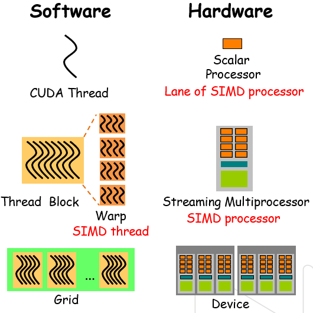 

* CUDA 线程 由标量处理器（SIMD处理器的 Lane）执行
* **线程块** 被拆分为 **线程数** (warp)，并在 多处理器（SIMD处理器）上以 SIMT （单指令多线程）模式执行。
* 当一个 SIMD 处理器上的线程块数量超过多处理器数量时，多个并发线程块可以驻留在一个 SIMD 处理器上——受限于 SIMD 处理器的资源（共享内存和寄存器文件）。
* **内核** 以一个线程块网格的形式启动。

Page 7 WARPS

#### 线程束 WARPs

* 一个线程块由多个线程束组成。
* 一个线程束 在 多处理器 上以物理并行 (SIMD) 方式执行。

Page 26 LAUNCH CONFIGURATION: SUMMARY

#### 启动配置：总结

* 需要足够的总线程数以保持 GPU 忙碌。
* 通常，每个 SIMD 处理器需要 512+个 CUDA 线程（目标是 2048——最大“占用率”）
  * 如果每个线程处理一个 fp32 元素，则需要更多线程。
  * 当然，也存在例外情况。

**线程块配置**

* 每个块的线程数应该成为线程束大小的（32）的倍数。
* SIMD 处理器可以同时执行至少 16 个线程块。
* 非常小的线程块会阻碍实现良好的利用率。
* 非常大的线程块灵活性较差。
* 通常可以使用 128~256 个线程/线程块，但应根据程序需求选择最佳配置。


《课件-04-CUDA-Fundamental-Optimization-Part-2》
Page 8-17 GPU MEM OPERATIONS

#### GPU 内存操作

加载操作：

* **缓存模式**（默认模式）：
  * 尝试在 L1 命中，然后是 L2，最后是全局内存 (GMEM)
  * **加载粒度为 128 字节的行。**
* **非缓存模式**：
  * 使用 `–Xptxas –dlcm=cg` 选项编译。
  * 尝试在 L2 命中，然后是 GMEM。
  * 不会命中 L1，如果 L1 中已有该行，则使其失效。
  * **加载粒度为 32 字节（段）**

存储操作：

* 使 L1 失效，写回 L2

内存操作按线程束(Warp) 发出（32 个CUDA 线程，一个 SIMD 线程），与其他指令类似。

**操作过程**：

* **线程束中的 CUDA 线程提供内存地址**。
* 确定所需的行/段。
* 请求所需的行/段。

示例场景：

1. **对齐连续访问**：(缓存模式)

    

   * 线程束请求 32 个对齐的连续 4 个字节。
   * 地址落在一个缓存行内。
     * 线程束需要 128字节。
     * 未命中时，128字节通过总线传输。
     * 总线利用率：100%
     * 示例代码：`int c = a[idx];` 

2. 对齐但乱序访问：(缓存模式)

    

   * 线程束请求 32 个对齐但乱序的 4 字节字。
   * 地址落在一个缓存行内。
     * 线程束需要 128字节。
     * 未命中时，128字节通过总线传输。
     * 总线利用率：100%
     * 示例代码：`int c = a[rand() % warpSize]` 

3. 未对齐连续访问：(缓存模式)

    

   * 线程束请求 32 个未对齐的连续 4 字节字，例如 `bytes[126, 253]` 
   * 地址落在两个缓存行内。
     * 线程束需要 128 字节。
     * 未命中时，256 字节通过总线传输。
     * 总线利用率：50%
     * 示例代码：`int c = a[idx-2]` 

4. 所有线程请求同一个字：(缓存模式)

    

   * 线程束中所有线程请求同一个 4 字节字。
   * 地址落在一个缓存行内。
     * 线程束需要 4 字节。
     * 未命中时，128字节通过总线传输。
     * 总线利用率：3.125%(4/128)
     * 示例代码：`int c = a[40];` 

5. 分散访问 (缓存模式)

   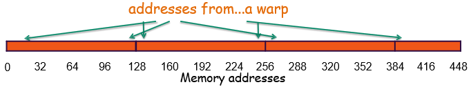 

   * 线程束请求 32 个分散的 4 个字节字。
   * 地址落在 N 个缓存行内。
     * 线程束需要 128 字节。
     * 未命中时，N*128 字节通过总线传输。
     * 总线利用率：128/(N*128) （最坏情况下 N=32，利用率为 3.125%）
     * 示例代码：`int c = a[rand()]` 

6. 分散访问（非缓存模式）

   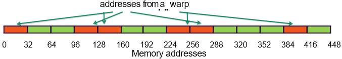 

   * 线程束请求 32 个分散的 4 字节字。
   * 地址落在 N 个段内。
   * 线程束需要 128 字节。
   * 未命中时，**N*32 字节** 通过总线传输。
   * 总线利用率：128 / (N*32)（最坏情况下 N=32，利用率为 12.5%）。
   * 示例代码：`int c = a[rand()]; –Xptxas –dlcm=cg`


Page 20-23 SHARED MEMORY

#### 共享内存

用途：

* 块内线程间通信。
* 缓存数据以减少冗余的全局内存访问（类似于 CPU 缓存）
* 用于优化全局内存访问模式。
* 共享内存被设计为靠近每个处理器核心的低延迟内存（类似于 L1 缓存）
* 可以通过编程 API 进行管理（分配和释放）

组织结构：

* 32 个 内存组 bank，每个内存组 bank为 4 字节。
* 连续的 4 字节字属于不同的内存组bank。

性能：

* 通常：每个多处理器每个 1 或 2 个时钟周期 4 字节/bank。
* 共享内存访问按 32 个线程（线程束）发出。
* 串行化：如果 32 个线程中的 N 个线程访问同一 bank 中不同的 4 字节字（bank 冲突），则 N 个访问将串行执行。

